cola Report for Consensus Partitioning
==================

**Date**: 2019-12-03 23:14:44 CET, **cola version**: 1.3.2

----------------------------------------------------------------

<style type='text/css'>

body, td, th {
   font-family: Arial,Helvetica,sans-serif;
   background-color: white;
   font-size: 13px;
  max-width: 800px;
  margin: auto;
  margin-left:210px;
  padding: 0px 10px 0px 10px;
  border-left: 1px solid #EEEEEE;
  line-height: 150%;
}

tt, code, pre {
   font-family: 'DejaVu Sans Mono', 'Droid Sans Mono', 'Lucida Console', Consolas, Monaco, 

monospace;
}

h1 {
   font-size:2.2em;
}

h2 {
   font-size:1.8em;
}

h3 {
   font-size:1.4em;
}

h4 {
   font-size:1.0em;
}

h5 {
   font-size:0.9em;
}

h6 {
   font-size:0.8em;
}

a {
  text-decoration: none;
  color: #0366d6;
}

a:hover {
  text-decoration: underline;
}

a:visited {
   color: #0366d6;
}

pre, img {
  max-width: 100%;
}
pre {
  overflow-x: auto;
}
pre code {
   display: block; padding: 0.5em;
}

code {
  font-size: 92%;
  border: 1px solid #ccc;
}

code[class] {
  background-color: #F8F8F8;
}

table, td, th {
  border: 1px solid #ccc;
}

blockquote {
   color:#666666;
   margin:0;
   padding-left: 1em;
   border-left: 0.5em #EEE solid;
}

hr {
   height: 0px;
   border-bottom: none;
   border-top-width: thin;
   border-top-style: dotted;
   border-top-color: #999999;
}

@media print {
   * {
      background: transparent !important;
      color: black !important;
      filter:none !important;
      -ms-filter: none !important;
   }

   body {
      font-size:12pt;
      max-width:100%;
   }

   a, a:visited {
      text-decoration: underline;
   }

   hr {
      visibility: hidden;
      page-break-before: always;
   }

   pre, blockquote {
      padding-right: 1em;
      page-break-inside: avoid;
   }

   tr, img {
      page-break-inside: avoid;
   }

   img {
      max-width: 100% !important;
   }

   @page :left {
      margin: 15mm 20mm 15mm 10mm;
   }

   @page :right {
      margin: 15mm 10mm 15mm 20mm;
   }

   p, h2, h3 {
      orphans: 3; widows: 3;
   }

   h2, h3 {
      page-break-after: avoid;
   }
}
</style>


## Summary


All available functions which can be applied to this `res_list` object:


```r
res_list
```

```
#> A 'ConsensusPartitionList' object with 24 methods.
#>   On a matrix with 38950 rows and 108 columns.
#>   Top rows are extracted by 'SD, CV, MAD, ATC' methods.
#>   Subgroups are detected by 'hclust, kmeans, skmeans, pam, mclust, NMF' method.
#>   Number of partitions are tried for k = 2, 3, 4, 5, 6.
#>   Performed in total 30000 partitions by row resampling.
#> 
#> Following methods can be applied to this 'ConsensusPartitionList' object:
#>  [1] "cola_report"           "collect_classes"       "collect_plots"         "collect_stats"        
#>  [5] "colnames"              "functional_enrichment" "get_anno_col"          "get_anno"             
#>  [9] "get_classes"           "get_matrix"            "get_membership"        "get_stats"            
#> [13] "is_best_k"             "is_stable_k"           "ncol"                  "nrow"                 
#> [17] "rownames"              "show"                  "suggest_best_k"        "test_to_known_factors"
#> [21] "top_rows_heatmap"      "top_rows_overlap"     
#> 
#> You can get result for a single method by, e.g. object["SD", "hclust"] or object["SD:hclust"]
#> or a subset of methods by object[c("SD", "CV")], c("hclust", "kmeans")]
```

The call of `run_all_consensus_partition_methods()` was:


```
#> run_all_consensus_partition_methods(data = mat, mc.cores = 4, anno = anno)
```

Dimension of the input matrix:


```r
mat = get_matrix(res_list)
dim(mat)
```

```
#> [1] 38950   108
```

### Density distribution

The density distribution for each sample is visualized as in one column in the
following heatmap. The clustering is based on the distance which is the
Kolmogorov-Smirnov statistic between two distributions.


```r
library(ComplexHeatmap)
densityHeatmap(mat, top_annotation = HeatmapAnnotation(df = get_anno(res_list), 
    col = get_anno_col(res_list)), ylab = "value", cluster_columns = TRUE, show_column_names = FALSE,
    mc.cores = 4)
```


### Suggest the best k


Folowing table shows the best `k` (number of partitions) for each combination
of top-value methods and partition methods. Clicking on the method name in
the table goes to the section for a single combination of methods.

[The cola vignette](http://bioconductor.org/packages/devel/bioc/vignettes/cola/inst/doc/cola.html#toc_13)
explains the definition of the metrics used for determining the best
number of partitions.


```r
suggest_best_k(res_list)
```


|                            | The best k| 1-PAC| Mean silhouette| Concordance|   |Optional k |
|:---------------------------|----------:|-----:|---------------:|-----------:|:--|:----------|
|[CV:mclust](#CV-mclust)     |          2| 1.000|           0.970|       0.973|** |           |
|[ATC:NMF](#ATC-NMF)         |          2| 1.000|           0.968|       0.987|** |           |
|[MAD:mclust](#MAD-mclust)   |          4| 0.946|           0.886|       0.938|*  |           |
|[ATC:skmeans](#ATC-skmeans) |          5| 0.926|           0.839|       0.935|*  |2,3,4      |
|[ATC:pam](#ATC-pam)         |          5| 0.912|           0.902|       0.957|*  |           |
|[ATC:kmeans](#ATC-kmeans)   |          2| 0.904|           0.931|       0.971|*  |           |
|[MAD:skmeans](#MAD-skmeans) |          4| 0.854|           0.818|       0.919|   |           |
|[CV:NMF](#CV-NMF)           |          2| 0.850|           0.916|       0.963|   |           |
|[MAD:NMF](#MAD-NMF)         |          2| 0.842|           0.895|       0.957|   |           |
|[CV:kmeans](#CV-kmeans)     |          2| 0.835|           0.902|       0.960|   |           |
|[SD:skmeans](#SD-skmeans)   |          4| 0.814|           0.829|       0.911|   |           |
|[SD:NMF](#SD-NMF)           |          2| 0.781|           0.880|       0.950|   |           |
|[CV:skmeans](#CV-skmeans)   |          2| 0.758|           0.923|       0.962|   |           |
|[SD:pam](#SD-pam)           |          6| 0.748|           0.724|       0.856|   |           |
|[SD:kmeans](#SD-kmeans)     |          4| 0.698|           0.827|       0.881|   |           |
|[MAD:kmeans](#MAD-kmeans)   |          2| 0.695|           0.876|       0.936|   |           |
|[SD:mclust](#SD-mclust)     |          3| 0.686|           0.886|       0.913|   |           |
|[MAD:pam](#MAD-pam)         |          6| 0.678|           0.667|       0.819|   |           |
|[ATC:mclust](#ATC-mclust)   |          2| 0.620|           0.729|       0.889|   |           |
|[ATC:hclust](#ATC-hclust)   |          4| 0.585|           0.587|       0.804|   |           |
|[CV:hclust](#CV-hclust)     |          4| 0.510|           0.615|       0.846|   |           |
|[CV:pam](#CV-pam)           |          3| 0.496|           0.726|       0.857|   |           |
|[MAD:hclust](#MAD-hclust)   |          3| 0.360|           0.662|       0.826|   |           |
|[SD:hclust](#SD-hclust)     |          3| 0.331|           0.691|       0.833|   |           |

\*\*: 1-PAC > 0.95, \*: 1-PAC > 0.9


### CDF of consensus matrices

Cumulative distribution function curves of consensus matrix for all methods.


```r
collect_plots(res_list, fun = plot_ecdf)
```


### Consensus heatmap

Consensus heatmaps for all methods. ([What is a consensus heatmap?](http://bioconductor.org/packages/devel/bioc/vignettes/cola/inst/doc/cola.html#toc_9))


<style type='text/css'>


.ui-helper-hidden {
	display: none;
}
.ui-helper-hidden-accessible {
	border: 0;
	clip: rect(0 0 0 0);
	height: 1px;
	margin: -1px;
	overflow: hidden;
	padding: 0;
	position: absolute;
	width: 1px;
}
.ui-helper-reset {
	margin: 0;
	padding: 0;
	border: 0;
	outline: 0;
	line-height: 1.3;
	text-decoration: none;
	font-size: 100%;
	list-style: none;
}
.ui-helper-clearfix:before,
.ui-helper-clearfix:after {
	content: "";
	display: table;
	border-collapse: collapse;
}
.ui-helper-clearfix:after {
	clear: both;
}
.ui-helper-zfix {
	width: 100%;
	height: 100%;
	top: 0;
	left: 0;
	position: absolute;
	opacity: 0;
	filter:Alpha(Opacity=0); 
}

.ui-front {
	z-index: 100;
}


.ui-state-disabled {
	cursor: default !important;
	pointer-events: none;
}


.ui-icon {
	display: inline-block;
	vertical-align: middle;
	margin-top: -.25em;
	position: relative;
	text-indent: -99999px;
	overflow: hidden;
	background-repeat: no-repeat;
}

.ui-widget-icon-block {
	left: 50%;
	margin-left: -8px;
	display: block;
}


.ui-widget-overlay {
	position: fixed;
	top: 0;
	left: 0;
	width: 100%;
	height: 100%;
}
.ui-accordion .ui-accordion-header {
	display: block;
	cursor: pointer;
	position: relative;
	margin: 2px 0 0 0;
	padding: .5em .5em .5em .7em;
	font-size: 100%;
}
.ui-accordion .ui-accordion-content {
	padding: 1em 2.2em;
	border-top: 0;
	overflow: auto;
}
.ui-autocomplete {
	position: absolute;
	top: 0;
	left: 0;
	cursor: default;
}
.ui-menu {
	list-style: none;
	padding: 0;
	margin: 0;
	display: block;
	outline: 0;
}
.ui-menu .ui-menu {
	position: absolute;
}
.ui-menu .ui-menu-item {
	margin: 0;
	cursor: pointer;
	
	list-style-image: url("data:image/gif;base64,R0lGODlhAQABAIAAAAAAAP///yH5BAEAAAAALAAAAAABAAEAAAIBRAA7");
}
.ui-menu .ui-menu-item-wrapper {
	position: relative;
	padding: 3px 1em 3px .4em;
}
.ui-menu .ui-menu-divider {
	margin: 5px 0;
	height: 0;
	font-size: 0;
	line-height: 0;
	border-width: 1px 0 0 0;
}
.ui-menu .ui-state-focus,
.ui-menu .ui-state-active {
	margin: -1px;
}


.ui-menu-icons {
	position: relative;
}
.ui-menu-icons .ui-menu-item-wrapper {
	padding-left: 2em;
}


.ui-menu .ui-icon {
	position: absolute;
	top: 0;
	bottom: 0;
	left: .2em;
	margin: auto 0;
}


.ui-menu .ui-menu-icon {
	left: auto;
	right: 0;
}
.ui-button {
	padding: .4em 1em;
	display: inline-block;
	position: relative;
	line-height: normal;
	margin-right: .1em;
	cursor: pointer;
	vertical-align: middle;
	text-align: center;
	-webkit-user-select: none;
	-moz-user-select: none;
	-ms-user-select: none;
	user-select: none;

	
	overflow: visible;
}

.ui-button,
.ui-button:link,
.ui-button:visited,
.ui-button:hover,
.ui-button:active {
	text-decoration: none;
}


.ui-button-icon-only {
	width: 2em;
	box-sizing: border-box;
	text-indent: -9999px;
	white-space: nowrap;
}


input.ui-button.ui-button-icon-only {
	text-indent: 0;
}


.ui-button-icon-only .ui-icon {
	position: absolute;
	top: 50%;
	left: 50%;
	margin-top: -8px;
	margin-left: -8px;
}

.ui-button.ui-icon-notext .ui-icon {
	padding: 0;
	width: 2.1em;
	height: 2.1em;
	text-indent: -9999px;
	white-space: nowrap;

}

input.ui-button.ui-icon-notext .ui-icon {
	width: auto;
	height: auto;
	text-indent: 0;
	white-space: normal;
	padding: .4em 1em;
}


input.ui-button::-moz-focus-inner,
button.ui-button::-moz-focus-inner {
	border: 0;
	padding: 0;
}
.ui-controlgroup {
	vertical-align: middle;
	display: inline-block;
}
.ui-controlgroup > .ui-controlgroup-item {
	float: left;
	margin-left: 0;
	margin-right: 0;
}
.ui-controlgroup > .ui-controlgroup-item:focus,
.ui-controlgroup > .ui-controlgroup-item.ui-visual-focus {
	z-index: 9999;
}
.ui-controlgroup-vertical > .ui-controlgroup-item {
	display: block;
	float: none;
	width: 100%;
	margin-top: 0;
	margin-bottom: 0;
	text-align: left;
}
.ui-controlgroup-vertical .ui-controlgroup-item {
	box-sizing: border-box;
}
.ui-controlgroup .ui-controlgroup-label {
	padding: .4em 1em;
}
.ui-controlgroup .ui-controlgroup-label span {
	font-size: 80%;
}
.ui-controlgroup-horizontal .ui-controlgroup-label + .ui-controlgroup-item {
	border-left: none;
}
.ui-controlgroup-vertical .ui-controlgroup-label + .ui-controlgroup-item {
	border-top: none;
}
.ui-controlgroup-horizontal .ui-controlgroup-label.ui-widget-content {
	border-right: none;
}
.ui-controlgroup-vertical .ui-controlgroup-label.ui-widget-content {
	border-bottom: none;
}


.ui-controlgroup-vertical .ui-spinner-input {

	
	width: 75%;
	width: calc( 100% - 2.4em );
}
.ui-controlgroup-vertical .ui-spinner .ui-spinner-up {
	border-top-style: solid;
}

.ui-checkboxradio-label .ui-icon-background {
	box-shadow: inset 1px 1px 1px #ccc;
	border-radius: .12em;
	border: none;
}
.ui-checkboxradio-radio-label .ui-icon-background {
	width: 16px;
	height: 16px;
	border-radius: 1em;
	overflow: visible;
	border: none;
}
.ui-checkboxradio-radio-label.ui-checkboxradio-checked .ui-icon,
.ui-checkboxradio-radio-label.ui-checkboxradio-checked:hover .ui-icon {
	background-image: none;
	width: 8px;
	height: 8px;
	border-width: 4px;
	border-style: solid;
}
.ui-checkboxradio-disabled {
	pointer-events: none;
}
.ui-datepicker {
	width: 17em;
	padding: .2em .2em 0;
	display: none;
}
.ui-datepicker .ui-datepicker-header {
	position: relative;
	padding: .2em 0;
}
.ui-datepicker .ui-datepicker-prev,
.ui-datepicker .ui-datepicker-next {
	position: absolute;
	top: 2px;
	width: 1.8em;
	height: 1.8em;
}
.ui-datepicker .ui-datepicker-prev-hover,
.ui-datepicker .ui-datepicker-next-hover {
	top: 1px;
}
.ui-datepicker .ui-datepicker-prev {
	left: 2px;
}
.ui-datepicker .ui-datepicker-next {
	right: 2px;
}
.ui-datepicker .ui-datepicker-prev-hover {
	left: 1px;
}
.ui-datepicker .ui-datepicker-next-hover {
	right: 1px;
}
.ui-datepicker .ui-datepicker-prev span,
.ui-datepicker .ui-datepicker-next span {
	display: block;
	position: absolute;
	left: 50%;
	margin-left: -8px;
	top: 50%;
	margin-top: -8px;
}
.ui-datepicker .ui-datepicker-title {
	margin: 0 2.3em;
	line-height: 1.8em;
	text-align: center;
}
.ui-datepicker .ui-datepicker-title select {
	font-size: 1em;
	margin: 1px 0;
}
.ui-datepicker select.ui-datepicker-month,
.ui-datepicker select.ui-datepicker-year {
	width: 45%;
}
.ui-datepicker table {
	width: 100%;
	font-size: .9em;
	border-collapse: collapse;
	margin: 0 0 .4em;
}
.ui-datepicker th {
	padding: .7em .3em;
	text-align: center;
	font-weight: bold;
	border: 0;
}
.ui-datepicker td {
	border: 0;
	padding: 1px;
}
.ui-datepicker td span,
.ui-datepicker td a {
	display: block;
	padding: .2em;
	text-align: right;
	text-decoration: none;
}
.ui-datepicker .ui-datepicker-buttonpane {
	background-image: none;
	margin: .7em 0 0 0;
	padding: 0 .2em;
	border-left: 0;
	border-right: 0;
	border-bottom: 0;
}
.ui-datepicker .ui-datepicker-buttonpane button {
	float: right;
	margin: .5em .2em .4em;
	cursor: pointer;
	padding: .2em .6em .3em .6em;
	width: auto;
	overflow: visible;
}
.ui-datepicker .ui-datepicker-buttonpane button.ui-datepicker-current {
	float: left;
}


.ui-datepicker.ui-datepicker-multi {
	width: auto;
}
.ui-datepicker-multi .ui-datepicker-group {
	float: left;
}
.ui-datepicker-multi .ui-datepicker-group table {
	width: 95%;
	margin: 0 auto .4em;
}
.ui-datepicker-multi-2 .ui-datepicker-group {
	width: 50%;
}
.ui-datepicker-multi-3 .ui-datepicker-group {
	width: 33.3%;
}
.ui-datepicker-multi-4 .ui-datepicker-group {
	width: 25%;
}
.ui-datepicker-multi .ui-datepicker-group-last .ui-datepicker-header,
.ui-datepicker-multi .ui-datepicker-group-middle .ui-datepicker-header {
	border-left-width: 0;
}
.ui-datepicker-multi .ui-datepicker-buttonpane {
	clear: left;
}
.ui-datepicker-row-break {
	clear: both;
	width: 100%;
	font-size: 0;
}


.ui-datepicker-rtl {
	direction: rtl;
}
.ui-datepicker-rtl .ui-datepicker-prev {
	right: 2px;
	left: auto;
}
.ui-datepicker-rtl .ui-datepicker-next {
	left: 2px;
	right: auto;
}
.ui-datepicker-rtl .ui-datepicker-prev:hover {
	right: 1px;
	left: auto;
}
.ui-datepicker-rtl .ui-datepicker-next:hover {
	left: 1px;
	right: auto;
}
.ui-datepicker-rtl .ui-datepicker-buttonpane {
	clear: right;
}
.ui-datepicker-rtl .ui-datepicker-buttonpane button {
	float: left;
}
.ui-datepicker-rtl .ui-datepicker-buttonpane button.ui-datepicker-current,
.ui-datepicker-rtl .ui-datepicker-group {
	float: right;
}
.ui-datepicker-rtl .ui-datepicker-group-last .ui-datepicker-header,
.ui-datepicker-rtl .ui-datepicker-group-middle .ui-datepicker-header {
	border-right-width: 0;
	border-left-width: 1px;
}


.ui-datepicker .ui-icon {
	display: block;
	text-indent: -99999px;
	overflow: hidden;
	background-repeat: no-repeat;
	left: .5em;
	top: .3em;
}
.ui-dialog {
	position: absolute;
	top: 0;
	left: 0;
	padding: .2em;
	outline: 0;
}
.ui-dialog .ui-dialog-titlebar {
	padding: .4em 1em;
	position: relative;
}
.ui-dialog .ui-dialog-title {
	float: left;
	margin: .1em 0;
	white-space: nowrap;
	width: 90%;
	overflow: hidden;
	text-overflow: ellipsis;
}
.ui-dialog .ui-dialog-titlebar-close {
	position: absolute;
	right: .3em;
	top: 50%;
	width: 20px;
	margin: -10px 0 0 0;
	padding: 1px;
	height: 20px;
}
.ui-dialog .ui-dialog-content {
	position: relative;
	border: 0;
	padding: .5em 1em;
	background: none;
	overflow: auto;
}
.ui-dialog .ui-dialog-buttonpane {
	text-align: left;
	border-width: 1px 0 0 0;
	background-image: none;
	margin-top: .5em;
	padding: .3em 1em .5em .4em;
}
.ui-dialog .ui-dialog-buttonpane .ui-dialog-buttonset {
	float: right;
}
.ui-dialog .ui-dialog-buttonpane button {
	margin: .5em .4em .5em 0;
	cursor: pointer;
}
.ui-dialog .ui-resizable-n {
	height: 2px;
	top: 0;
}
.ui-dialog .ui-resizable-e {
	width: 2px;
	right: 0;
}
.ui-dialog .ui-resizable-s {
	height: 2px;
	bottom: 0;
}
.ui-dialog .ui-resizable-w {
	width: 2px;
	left: 0;
}
.ui-dialog .ui-resizable-se,
.ui-dialog .ui-resizable-sw,
.ui-dialog .ui-resizable-ne,
.ui-dialog .ui-resizable-nw {
	width: 7px;
	height: 7px;
}
.ui-dialog .ui-resizable-se {
	right: 0;
	bottom: 0;
}
.ui-dialog .ui-resizable-sw {
	left: 0;
	bottom: 0;
}
.ui-dialog .ui-resizable-ne {
	right: 0;
	top: 0;
}
.ui-dialog .ui-resizable-nw {
	left: 0;
	top: 0;
}
.ui-draggable .ui-dialog-titlebar {
	cursor: move;
}
.ui-draggable-handle {
	-ms-touch-action: none;
	touch-action: none;
}
.ui-resizable {
	position: relative;
}
.ui-resizable-handle {
	position: absolute;
	font-size: 0.1px;
	display: block;
	-ms-touch-action: none;
	touch-action: none;
}
.ui-resizable-disabled .ui-resizable-handle,
.ui-resizable-autohide .ui-resizable-handle {
	display: none;
}
.ui-resizable-n {
	cursor: n-resize;
	height: 7px;
	width: 100%;
	top: -5px;
	left: 0;
}
.ui-resizable-s {
	cursor: s-resize;
	height: 7px;
	width: 100%;
	bottom: -5px;
	left: 0;
}
.ui-resizable-e {
	cursor: e-resize;
	width: 7px;
	right: -5px;
	top: 0;
	height: 100%;
}
.ui-resizable-w {
	cursor: w-resize;
	width: 7px;
	left: -5px;
	top: 0;
	height: 100%;
}
.ui-resizable-se {
	cursor: se-resize;
	width: 12px;
	height: 12px;
	right: 1px;
	bottom: 1px;
}
.ui-resizable-sw {
	cursor: sw-resize;
	width: 9px;
	height: 9px;
	left: -5px;
	bottom: -5px;
}
.ui-resizable-nw {
	cursor: nw-resize;
	width: 9px;
	height: 9px;
	left: -5px;
	top: -5px;
}
.ui-resizable-ne {
	cursor: ne-resize;
	width: 9px;
	height: 9px;
	right: -5px;
	top: -5px;
}
.ui-progressbar {
	height: 2em;
	text-align: left;
	overflow: hidden;
}
.ui-progressbar .ui-progressbar-value {
	margin: -1px;
	height: 100%;
}
.ui-progressbar .ui-progressbar-overlay {
	background: url("data:image/gif;base64,R0lGODlhKAAoAIABAAAAAP///yH/C05FVFNDQVBFMi4wAwEAAAAh+QQJAQABACwAAAAAKAAoAAACkYwNqXrdC52DS06a7MFZI+4FHBCKoDeWKXqymPqGqxvJrXZbMx7Ttc+w9XgU2FB3lOyQRWET2IFGiU9m1frDVpxZZc6bfHwv4c1YXP6k1Vdy292Fb6UkuvFtXpvWSzA+HycXJHUXiGYIiMg2R6W459gnWGfHNdjIqDWVqemH2ekpObkpOlppWUqZiqr6edqqWQAAIfkECQEAAQAsAAAAACgAKAAAApSMgZnGfaqcg1E2uuzDmmHUBR8Qil95hiPKqWn3aqtLsS18y7G1SzNeowWBENtQd+T1JktP05nzPTdJZlR6vUxNWWjV+vUWhWNkWFwxl9VpZRedYcflIOLafaa28XdsH/ynlcc1uPVDZxQIR0K25+cICCmoqCe5mGhZOfeYSUh5yJcJyrkZWWpaR8doJ2o4NYq62lAAACH5BAkBAAEALAAAAAAoACgAAAKVDI4Yy22ZnINRNqosw0Bv7i1gyHUkFj7oSaWlu3ovC8GxNso5fluz3qLVhBVeT/Lz7ZTHyxL5dDalQWPVOsQWtRnuwXaFTj9jVVh8pma9JjZ4zYSj5ZOyma7uuolffh+IR5aW97cHuBUXKGKXlKjn+DiHWMcYJah4N0lYCMlJOXipGRr5qdgoSTrqWSq6WFl2ypoaUAAAIfkECQEAAQAsAAAAACgAKAAAApaEb6HLgd/iO7FNWtcFWe+ufODGjRfoiJ2akShbueb0wtI50zm02pbvwfWEMWBQ1zKGlLIhskiEPm9R6vRXxV4ZzWT2yHOGpWMyorblKlNp8HmHEb/lCXjcW7bmtXP8Xt229OVWR1fod2eWqNfHuMjXCPkIGNileOiImVmCOEmoSfn3yXlJWmoHGhqp6ilYuWYpmTqKUgAAIfkECQEAAQAsAAAAACgAKAAAApiEH6kb58biQ3FNWtMFWW3eNVcojuFGfqnZqSebuS06w5V80/X02pKe8zFwP6EFWOT1lDFk8rGERh1TTNOocQ61Hm4Xm2VexUHpzjymViHrFbiELsefVrn6XKfnt2Q9G/+Xdie499XHd2g4h7ioOGhXGJboGAnXSBnoBwKYyfioubZJ2Hn0RuRZaflZOil56Zp6iioKSXpUAAAh+QQJAQABACwAAAAAKAAoAAACkoQRqRvnxuI7kU1a1UU5bd5tnSeOZXhmn5lWK3qNTWvRdQxP8qvaC+/yaYQzXO7BMvaUEmJRd3TsiMAgswmNYrSgZdYrTX6tSHGZO73ezuAw2uxuQ+BbeZfMxsexY35+/Qe4J1inV0g4x3WHuMhIl2jXOKT2Q+VU5fgoSUI52VfZyfkJGkha6jmY+aaYdirq+lQAACH5BAkBAAEALAAAAAAoACgAAAKWBIKpYe0L3YNKToqswUlvznigd4wiR4KhZrKt9Upqip61i9E3vMvxRdHlbEFiEXfk9YARYxOZZD6VQ2pUunBmtRXo1Lf8hMVVcNl8JafV38aM2/Fu5V16Bn63r6xt97j09+MXSFi4BniGFae3hzbH9+hYBzkpuUh5aZmHuanZOZgIuvbGiNeomCnaxxap2upaCZsq+1kAACH5BAkBAAEALAAAAAAoACgAAAKXjI8By5zf4kOxTVrXNVlv1X0d8IGZGKLnNpYtm8Lr9cqVeuOSvfOW79D9aDHizNhDJidFZhNydEahOaDH6nomtJjp1tutKoNWkvA6JqfRVLHU/QUfau9l2x7G54d1fl995xcIGAdXqMfBNadoYrhH+Mg2KBlpVpbluCiXmMnZ2Sh4GBqJ+ckIOqqJ6LmKSllZmsoq6wpQAAAh+QQJAQABACwAAAAAKAAoAAAClYx/oLvoxuJDkU1a1YUZbJ59nSd2ZXhWqbRa2/gF8Gu2DY3iqs7yrq+xBYEkYvFSM8aSSObE+ZgRl1BHFZNr7pRCavZ5BW2142hY3AN/zWtsmf12p9XxxFl2lpLn1rseztfXZjdIWIf2s5dItwjYKBgo9yg5pHgzJXTEeGlZuenpyPmpGQoKOWkYmSpaSnqKileI2FAAACH5BAkBAAEALAAAAAAoACgAAAKVjB+gu+jG4kORTVrVhRlsnn2dJ3ZleFaptFrb+CXmO9OozeL5VfP99HvAWhpiUdcwkpBH3825AwYdU8xTqlLGhtCosArKMpvfa1mMRae9VvWZfeB2XfPkeLmm18lUcBj+p5dnN8jXZ3YIGEhYuOUn45aoCDkp16hl5IjYJvjWKcnoGQpqyPlpOhr3aElaqrq56Bq7VAAAOw==");
	height: 100%;
	filter: alpha(opacity=25); 
	opacity: 0.25;
}
.ui-progressbar-indeterminate .ui-progressbar-value {
	background-image: none;
}
.ui-selectable {
	-ms-touch-action: none;
	touch-action: none;
}
.ui-selectable-helper {
	position: absolute;
	z-index: 100;
	border: 1px dotted black;
}
.ui-selectmenu-menu {
	padding: 0;
	margin: 0;
	position: absolute;
	top: 0;
	left: 0;
	display: none;
}
.ui-selectmenu-menu .ui-menu {
	overflow: auto;
	overflow-x: hidden;
	padding-bottom: 1px;
}
.ui-selectmenu-menu .ui-menu .ui-selectmenu-optgroup {
	font-size: 1em;
	font-weight: bold;
	line-height: 1.5;
	padding: 2px 0.4em;
	margin: 0.5em 0 0 0;
	height: auto;
	border: 0;
}
.ui-selectmenu-open {
	display: block;
}
.ui-selectmenu-text {
	display: block;
	margin-right: 20px;
	overflow: hidden;
	text-overflow: ellipsis;
}
.ui-selectmenu-button.ui-button {
	text-align: left;
	white-space: nowrap;
	width: 14em;
}
.ui-selectmenu-icon.ui-icon {
	float: right;
	margin-top: 0;
}
.ui-slider {
	position: relative;
	text-align: left;
}
.ui-slider .ui-slider-handle {
	position: absolute;
	z-index: 2;
	width: 1.2em;
	height: 1.2em;
	cursor: default;
	-ms-touch-action: none;
	touch-action: none;
}
.ui-slider .ui-slider-range {
	position: absolute;
	z-index: 1;
	font-size: .7em;
	display: block;
	border: 0;
	background-position: 0 0;
}


.ui-slider.ui-state-disabled .ui-slider-handle,
.ui-slider.ui-state-disabled .ui-slider-range {
	filter: inherit;
}

.ui-slider-horizontal {
	height: .8em;
}
.ui-slider-horizontal .ui-slider-handle {
	top: -.3em;
	margin-left: -.6em;
}
.ui-slider-horizontal .ui-slider-range {
	top: 0;
	height: 100%;
}
.ui-slider-horizontal .ui-slider-range-min {
	left: 0;
}
.ui-slider-horizontal .ui-slider-range-max {
	right: 0;
}

.ui-slider-vertical {
	width: .8em;
	height: 100px;
}
.ui-slider-vertical .ui-slider-handle {
	left: -.3em;
	margin-left: 0;
	margin-bottom: -.6em;
}
.ui-slider-vertical .ui-slider-range {
	left: 0;
	width: 100%;
}
.ui-slider-vertical .ui-slider-range-min {
	bottom: 0;
}
.ui-slider-vertical .ui-slider-range-max {
	top: 0;
}
.ui-sortable-handle {
	-ms-touch-action: none;
	touch-action: none;
}
.ui-spinner {
	position: relative;
	display: inline-block;
	overflow: hidden;
	padding: 0;
	vertical-align: middle;
}
.ui-spinner-input {
	border: none;
	background: none;
	color: inherit;
	padding: .222em 0;
	margin: .2em 0;
	vertical-align: middle;
	margin-left: .4em;
	margin-right: 2em;
}
.ui-spinner-button {
	width: 1.6em;
	height: 50%;
	font-size: .5em;
	padding: 0;
	margin: 0;
	text-align: center;
	position: absolute;
	cursor: default;
	display: block;
	overflow: hidden;
	right: 0;
}

.ui-spinner a.ui-spinner-button {
	border-top-style: none;
	border-bottom-style: none;
	border-right-style: none;
}
.ui-spinner-up {
	top: 0;
}
.ui-spinner-down {
	bottom: 0;
}
.ui-tabs {
	position: relative;
	padding: .2em;
}
.ui-tabs .ui-tabs-nav {
	margin: 0;
	padding: .2em .2em 0;
}
.ui-tabs .ui-tabs-nav li {
	list-style: none;
	float: left;
	position: relative;
	top: 0;
	margin: 1px .2em 0 0;
	border-bottom-width: 0;
	padding: 0;
	white-space: nowrap;
}
.ui-tabs .ui-tabs-nav .ui-tabs-anchor {
	float: left;
	padding: .5em 1em;
	text-decoration: none;
}
.ui-tabs .ui-tabs-nav li.ui-tabs-active {
	margin-bottom: -1px;
	padding-bottom: 1px;
}
.ui-tabs .ui-tabs-nav li.ui-tabs-active .ui-tabs-anchor,
.ui-tabs .ui-tabs-nav li.ui-state-disabled .ui-tabs-anchor,
.ui-tabs .ui-tabs-nav li.ui-tabs-loading .ui-tabs-anchor {
	cursor: text;
}
.ui-tabs-collapsible .ui-tabs-nav li.ui-tabs-active .ui-tabs-anchor {
	cursor: pointer;
}
.ui-tabs .ui-tabs-panel {
	display: block;
	border-width: 0;
	padding: 1em 1.4em;
	background: none;
}
.ui-tooltip {
	padding: 8px;
	position: absolute;
	z-index: 9999;
	max-width: 300px;
}
body .ui-tooltip {
	border-width: 2px;
}

.ui-widget {
	font-family: Arial,Helvetica,sans-serif;
	font-size: 1em;
}
.ui-widget .ui-widget {
	font-size: 1em;
}
.ui-widget input,
.ui-widget select,
.ui-widget textarea,
.ui-widget button {
	font-family: Arial,Helvetica,sans-serif;
	font-size: 1em;
}
.ui-widget.ui-widget-content {
	border: 1px solid #c5c5c5;
}
.ui-widget-content {
	border: 1px solid #dddddd;
	background: #ffffff;
	color: #333333;
}
.ui-widget-content a {
	color: #333333;
}
.ui-widget-header {
	border: 1px solid #dddddd;
	background: #e9e9e9;
	color: #333333;
	font-weight: bold;
}
.ui-widget-header a {
	color: #333333;
}


.ui-state-default,
.ui-widget-content .ui-state-default,
.ui-widget-header .ui-state-default,
.ui-button,


html .ui-button.ui-state-disabled:hover,
html .ui-button.ui-state-disabled:active {
	border: 1px solid #c5c5c5;
	background: #f6f6f6;
	font-weight: normal;
	color: #454545;
}
.ui-state-default a,
.ui-state-default a:link,
.ui-state-default a:visited,
a.ui-button,
a:link.ui-button,
a:visited.ui-button,
.ui-button {
	color: #454545;
	text-decoration: none;
}
.ui-state-hover,
.ui-widget-content .ui-state-hover,
.ui-widget-header .ui-state-hover,
.ui-state-focus,
.ui-widget-content .ui-state-focus,
.ui-widget-header .ui-state-focus,
.ui-button:hover,
.ui-button:focus {
	border: 1px solid #cccccc;
	background: #ededed;
	font-weight: normal;
	color: #2b2b2b;
}
.ui-state-hover a,
.ui-state-hover a:hover,
.ui-state-hover a:link,
.ui-state-hover a:visited,
.ui-state-focus a,
.ui-state-focus a:hover,
.ui-state-focus a:link,
.ui-state-focus a:visited,
a.ui-button:hover,
a.ui-button:focus {
	color: #2b2b2b;
	text-decoration: none;
}

.ui-visual-focus {
	box-shadow: 0 0 3px 1px rgb(94, 158, 214);
}
.ui-state-active,
.ui-widget-content .ui-state-active,
.ui-widget-header .ui-state-active,
a.ui-button:active,
.ui-button:active,
.ui-button.ui-state-active:hover {
	border: 1px solid #003eff;
	background: #007fff;
	font-weight: normal;
	color: #ffffff;
}
.ui-icon-background,
.ui-state-active .ui-icon-background {
	border: #003eff;
	background-color: #ffffff;
}
.ui-state-active a,
.ui-state-active a:link,
.ui-state-active a:visited {
	color: #ffffff;
	text-decoration: none;
}


.ui-state-highlight,
.ui-widget-content .ui-state-highlight,
.ui-widget-header .ui-state-highlight {
	border: 1px solid #dad55e;
	background: #fffa90;
	color: #777620;
}
.ui-state-checked {
	border: 1px solid #dad55e;
	background: #fffa90;
}
.ui-state-highlight a,
.ui-widget-content .ui-state-highlight a,
.ui-widget-header .ui-state-highlight a {
	color: #777620;
}
.ui-state-error,
.ui-widget-content .ui-state-error,
.ui-widget-header .ui-state-error {
	border: 1px solid #f1a899;
	background: #fddfdf;
	color: #5f3f3f;
}
.ui-state-error a,
.ui-widget-content .ui-state-error a,
.ui-widget-header .ui-state-error a {
	color: #5f3f3f;
}
.ui-state-error-text,
.ui-widget-content .ui-state-error-text,
.ui-widget-header .ui-state-error-text {
	color: #5f3f3f;
}
.ui-priority-primary,
.ui-widget-content .ui-priority-primary,
.ui-widget-header .ui-priority-primary {
	font-weight: bold;
}
.ui-priority-secondary,
.ui-widget-content .ui-priority-secondary,
.ui-widget-header .ui-priority-secondary {
	opacity: .7;
	filter:Alpha(Opacity=70); 
	font-weight: normal;
}
.ui-state-disabled,
.ui-widget-content .ui-state-disabled,
.ui-widget-header .ui-state-disabled {
	opacity: .35;
	filter:Alpha(Opacity=35); 
	background-image: none;
}
.ui-state-disabled .ui-icon {
	filter:Alpha(Opacity=35); 
}


.ui-icon {
	width: 16px;
	height: 16px;
}
.ui-icon,
.ui-widget-content .ui-icon {
	background-image: url("images/ui-icons_444444_256x240.png");
}
.ui-widget-header .ui-icon {
	background-image: url("images/ui-icons_444444_256x240.png");
}
.ui-state-hover .ui-icon,
.ui-state-focus .ui-icon,
.ui-button:hover .ui-icon,
.ui-button:focus .ui-icon {
	background-image: url("images/ui-icons_555555_256x240.png");
}
.ui-state-active .ui-icon,
.ui-button:active .ui-icon {
	background-image: url("images/ui-icons_ffffff_256x240.png");
}
.ui-state-highlight .ui-icon,
.ui-button .ui-state-highlight.ui-icon {
	background-image: url("images/ui-icons_777620_256x240.png");
}
.ui-state-error .ui-icon,
.ui-state-error-text .ui-icon {
	background-image: url("images/ui-icons_cc0000_256x240.png");
}
.ui-button .ui-icon {
	background-image: url("images/ui-icons_777777_256x240.png");
}


.ui-icon-blank { background-position: 16px 16px; }
.ui-icon-caret-1-n { background-position: 0 0; }
.ui-icon-caret-1-ne { background-position: -16px 0; }
.ui-icon-caret-1-e { background-position: -32px 0; }
.ui-icon-caret-1-se { background-position: -48px 0; }
.ui-icon-caret-1-s { background-position: -65px 0; }
.ui-icon-caret-1-sw { background-position: -80px 0; }
.ui-icon-caret-1-w { background-position: -96px 0; }
.ui-icon-caret-1-nw { background-position: -112px 0; }
.ui-icon-caret-2-n-s { background-position: -128px 0; }
.ui-icon-caret-2-e-w { background-position: -144px 0; }
.ui-icon-triangle-1-n { background-position: 0 -16px; }
.ui-icon-triangle-1-ne { background-position: -16px -16px; }
.ui-icon-triangle-1-e { background-position: -32px -16px; }
.ui-icon-triangle-1-se { background-position: -48px -16px; }
.ui-icon-triangle-1-s { background-position: -65px -16px; }
.ui-icon-triangle-1-sw { background-position: -80px -16px; }
.ui-icon-triangle-1-w { background-position: -96px -16px; }
.ui-icon-triangle-1-nw { background-position: -112px -16px; }
.ui-icon-triangle-2-n-s { background-position: -128px -16px; }
.ui-icon-triangle-2-e-w { background-position: -144px -16px; }
.ui-icon-arrow-1-n { background-position: 0 -32px; }
.ui-icon-arrow-1-ne { background-position: -16px -32px; }
.ui-icon-arrow-1-e { background-position: -32px -32px; }
.ui-icon-arrow-1-se { background-position: -48px -32px; }
.ui-icon-arrow-1-s { background-position: -65px -32px; }
.ui-icon-arrow-1-sw { background-position: -80px -32px; }
.ui-icon-arrow-1-w { background-position: -96px -32px; }
.ui-icon-arrow-1-nw { background-position: -112px -32px; }
.ui-icon-arrow-2-n-s { background-position: -128px -32px; }
.ui-icon-arrow-2-ne-sw { background-position: -144px -32px; }
.ui-icon-arrow-2-e-w { background-position: -160px -32px; }
.ui-icon-arrow-2-se-nw { background-position: -176px -32px; }
.ui-icon-arrowstop-1-n { background-position: -192px -32px; }
.ui-icon-arrowstop-1-e { background-position: -208px -32px; }
.ui-icon-arrowstop-1-s { background-position: -224px -32px; }
.ui-icon-arrowstop-1-w { background-position: -240px -32px; }
.ui-icon-arrowthick-1-n { background-position: 1px -48px; }
.ui-icon-arrowthick-1-ne { background-position: -16px -48px; }
.ui-icon-arrowthick-1-e { background-position: -32px -48px; }
.ui-icon-arrowthick-1-se { background-position: -48px -48px; }
.ui-icon-arrowthick-1-s { background-position: -64px -48px; }
.ui-icon-arrowthick-1-sw { background-position: -80px -48px; }
.ui-icon-arrowthick-1-w { background-position: -96px -48px; }
.ui-icon-arrowthick-1-nw { background-position: -112px -48px; }
.ui-icon-arrowthick-2-n-s { background-position: -128px -48px; }
.ui-icon-arrowthick-2-ne-sw { background-position: -144px -48px; }
.ui-icon-arrowthick-2-e-w { background-position: -160px -48px; }
.ui-icon-arrowthick-2-se-nw { background-position: -176px -48px; }
.ui-icon-arrowthickstop-1-n { background-position: -192px -48px; }
.ui-icon-arrowthickstop-1-e { background-position: -208px -48px; }
.ui-icon-arrowthickstop-1-s { background-position: -224px -48px; }
.ui-icon-arrowthickstop-1-w { background-position: -240px -48px; }
.ui-icon-arrowreturnthick-1-w { background-position: 0 -64px; }
.ui-icon-arrowreturnthick-1-n { background-position: -16px -64px; }
.ui-icon-arrowreturnthick-1-e { background-position: -32px -64px; }
.ui-icon-arrowreturnthick-1-s { background-position: -48px -64px; }
.ui-icon-arrowreturn-1-w { background-position: -64px -64px; }
.ui-icon-arrowreturn-1-n { background-position: -80px -64px; }
.ui-icon-arrowreturn-1-e { background-position: -96px -64px; }
.ui-icon-arrowreturn-1-s { background-position: -112px -64px; }
.ui-icon-arrowrefresh-1-w { background-position: -128px -64px; }
.ui-icon-arrowrefresh-1-n { background-position: -144px -64px; }
.ui-icon-arrowrefresh-1-e { background-position: -160px -64px; }
.ui-icon-arrowrefresh-1-s { background-position: -176px -64px; }
.ui-icon-arrow-4 { background-position: 0 -80px; }
.ui-icon-arrow-4-diag { background-position: -16px -80px; }
.ui-icon-extlink { background-position: -32px -80px; }
.ui-icon-newwin { background-position: -48px -80px; }
.ui-icon-refresh { background-position: -64px -80px; }
.ui-icon-shuffle { background-position: -80px -80px; }
.ui-icon-transfer-e-w { background-position: -96px -80px; }
.ui-icon-transferthick-e-w { background-position: -112px -80px; }
.ui-icon-folder-collapsed { background-position: 0 -96px; }
.ui-icon-folder-open { background-position: -16px -96px; }
.ui-icon-document { background-position: -32px -96px; }
.ui-icon-document-b { background-position: -48px -96px; }
.ui-icon-note { background-position: -64px -96px; }
.ui-icon-mail-closed { background-position: -80px -96px; }
.ui-icon-mail-open { background-position: -96px -96px; }
.ui-icon-suitcase { background-position: -112px -96px; }
.ui-icon-comment { background-position: -128px -96px; }
.ui-icon-person { background-position: -144px -96px; }
.ui-icon-print { background-position: -160px -96px; }
.ui-icon-trash { background-position: -176px -96px; }
.ui-icon-locked { background-position: -192px -96px; }
.ui-icon-unlocked { background-position: -208px -96px; }
.ui-icon-bookmark { background-position: -224px -96px; }
.ui-icon-tag { background-position: -240px -96px; }
.ui-icon-home { background-position: 0 -112px; }
.ui-icon-flag { background-position: -16px -112px; }
.ui-icon-calendar { background-position: -32px -112px; }
.ui-icon-cart { background-position: -48px -112px; }
.ui-icon-pencil { background-position: -64px -112px; }
.ui-icon-clock { background-position: -80px -112px; }
.ui-icon-disk { background-position: -96px -112px; }
.ui-icon-calculator { background-position: -112px -112px; }
.ui-icon-zoomin { background-position: -128px -112px; }
.ui-icon-zoomout { background-position: -144px -112px; }
.ui-icon-search { background-position: -160px -112px; }
.ui-icon-wrench { background-position: -176px -112px; }
.ui-icon-gear { background-position: -192px -112px; }
.ui-icon-heart { background-position: -208px -112px; }
.ui-icon-star { background-position: -224px -112px; }
.ui-icon-link { background-position: -240px -112px; }
.ui-icon-cancel { background-position: 0 -128px; }
.ui-icon-plus { background-position: -16px -128px; }
.ui-icon-plusthick { background-position: -32px -128px; }
.ui-icon-minus { background-position: -48px -128px; }
.ui-icon-minusthick { background-position: -64px -128px; }
.ui-icon-close { background-position: -80px -128px; }
.ui-icon-closethick { background-position: -96px -128px; }
.ui-icon-key { background-position: -112px -128px; }
.ui-icon-lightbulb { background-position: -128px -128px; }
.ui-icon-scissors { background-position: -144px -128px; }
.ui-icon-clipboard { background-position: -160px -128px; }
.ui-icon-copy { background-position: -176px -128px; }
.ui-icon-contact { background-position: -192px -128px; }
.ui-icon-image { background-position: -208px -128px; }
.ui-icon-video { background-position: -224px -128px; }
.ui-icon-script { background-position: -240px -128px; }
.ui-icon-alert { background-position: 0 -144px; }
.ui-icon-info { background-position: -16px -144px; }
.ui-icon-notice { background-position: -32px -144px; }
.ui-icon-help { background-position: -48px -144px; }
.ui-icon-check { background-position: -64px -144px; }
.ui-icon-bullet { background-position: -80px -144px; }
.ui-icon-radio-on { background-position: -96px -144px; }
.ui-icon-radio-off { background-position: -112px -144px; }
.ui-icon-pin-w { background-position: -128px -144px; }
.ui-icon-pin-s { background-position: -144px -144px; }
.ui-icon-play { background-position: 0 -160px; }
.ui-icon-pause { background-position: -16px -160px; }
.ui-icon-seek-next { background-position: -32px -160px; }
.ui-icon-seek-prev { background-position: -48px -160px; }
.ui-icon-seek-end { background-position: -64px -160px; }
.ui-icon-seek-start { background-position: -80px -160px; }

.ui-icon-seek-first { background-position: -80px -160px; }
.ui-icon-stop { background-position: -96px -160px; }
.ui-icon-eject { background-position: -112px -160px; }
.ui-icon-volume-off { background-position: -128px -160px; }
.ui-icon-volume-on { background-position: -144px -160px; }
.ui-icon-power { background-position: 0 -176px; }
.ui-icon-signal-diag { background-position: -16px -176px; }
.ui-icon-signal { background-position: -32px -176px; }
.ui-icon-battery-0 { background-position: -48px -176px; }
.ui-icon-battery-1 { background-position: -64px -176px; }
.ui-icon-battery-2 { background-position: -80px -176px; }
.ui-icon-battery-3 { background-position: -96px -176px; }
.ui-icon-circle-plus { background-position: 0 -192px; }
.ui-icon-circle-minus { background-position: -16px -192px; }
.ui-icon-circle-close { background-position: -32px -192px; }
.ui-icon-circle-triangle-e { background-position: -48px -192px; }
.ui-icon-circle-triangle-s { background-position: -64px -192px; }
.ui-icon-circle-triangle-w { background-position: -80px -192px; }
.ui-icon-circle-triangle-n { background-position: -96px -192px; }
.ui-icon-circle-arrow-e { background-position: -112px -192px; }
.ui-icon-circle-arrow-s { background-position: -128px -192px; }
.ui-icon-circle-arrow-w { background-position: -144px -192px; }
.ui-icon-circle-arrow-n { background-position: -160px -192px; }
.ui-icon-circle-zoomin { background-position: -176px -192px; }
.ui-icon-circle-zoomout { background-position: -192px -192px; }
.ui-icon-circle-check { background-position: -208px -192px; }
.ui-icon-circlesmall-plus { background-position: 0 -208px; }
.ui-icon-circlesmall-minus { background-position: -16px -208px; }
.ui-icon-circlesmall-close { background-position: -32px -208px; }
.ui-icon-squaresmall-plus { background-position: -48px -208px; }
.ui-icon-squaresmall-minus { background-position: -64px -208px; }
.ui-icon-squaresmall-close { background-position: -80px -208px; }
.ui-icon-grip-dotted-vertical { background-position: 0 -224px; }
.ui-icon-grip-dotted-horizontal { background-position: -16px -224px; }
.ui-icon-grip-solid-vertical { background-position: -32px -224px; }
.ui-icon-grip-solid-horizontal { background-position: -48px -224px; }
.ui-icon-gripsmall-diagonal-se { background-position: -64px -224px; }
.ui-icon-grip-diagonal-se { background-position: -80px -224px; }


.ui-corner-all,
.ui-corner-top,
.ui-corner-left,
.ui-corner-tl {
	border-top-left-radius: 3px;
}
.ui-corner-all,
.ui-corner-top,
.ui-corner-right,
.ui-corner-tr {
	border-top-right-radius: 3px;
}
.ui-corner-all,
.ui-corner-bottom,
.ui-corner-left,
.ui-corner-bl {
	border-bottom-left-radius: 3px;
}
.ui-corner-all,
.ui-corner-bottom,
.ui-corner-right,
.ui-corner-br {
	border-bottom-right-radius: 3px;
}


.ui-widget-overlay {
	background: #aaaaaa;
	opacity: .3;
	filter: Alpha(Opacity=30); 
}
.ui-widget-shadow {
	-webkit-box-shadow: 0px 0px 5px #666666;
	box-shadow: 0px 0px 5px #666666;
} 
</style>
<script src='js/jquery-1.12.4.js'></script>
<script src='js/jquery-ui.js'></script>

<script>
$( function() {
	$( '#tabs-collect-consensus-heatmap' ).tabs();
} );
</script>
<div id='tabs-collect-consensus-heatmap'>
<ul>
<li><a href='#tab-collect-consensus-heatmap-1'>k = 2</a></li>
<li><a href='#tab-collect-consensus-heatmap-2'>k = 3</a></li>
<li><a href='#tab-collect-consensus-heatmap-3'>k = 4</a></li>
<li><a href='#tab-collect-consensus-heatmap-4'>k = 5</a></li>
<li><a href='#tab-collect-consensus-heatmap-5'>k = 6</a></li>
</ul>
<div id='tab-collect-consensus-heatmap-1'>
<pre><code class="r">collect_plots(res_list, k = 2, fun = consensus_heatmap, mc.cores = 4)
</code></pre>

<p></p>

</div>
<div id='tab-collect-consensus-heatmap-2'>
<pre><code class="r">collect_plots(res_list, k = 3, fun = consensus_heatmap, mc.cores = 4)
</code></pre>

<p></p>

</div>
<div id='tab-collect-consensus-heatmap-3'>
<pre><code class="r">collect_plots(res_list, k = 4, fun = consensus_heatmap, mc.cores = 4)
</code></pre>

<p></p>

</div>
<div id='tab-collect-consensus-heatmap-4'>
<pre><code class="r">collect_plots(res_list, k = 5, fun = consensus_heatmap, mc.cores = 4)
</code></pre>

<p></p>

</div>
<div id='tab-collect-consensus-heatmap-5'>
<pre><code class="r">collect_plots(res_list, k = 6, fun = consensus_heatmap, mc.cores = 4)
</code></pre>

<p></p>

</div>
</div>


### Membership heatmap

Membership heatmaps for all methods. ([What is a membership heatmap?](http://bioconductor.org/packages/devel/bioc/vignettes/cola/inst/doc/cola.html#toc_12))


<script>
$( function() {
	$( '#tabs-collect-membership-heatmap' ).tabs();
} );
</script>
<div id='tabs-collect-membership-heatmap'>
<ul>
<li><a href='#tab-collect-membership-heatmap-1'>k = 2</a></li>
<li><a href='#tab-collect-membership-heatmap-2'>k = 3</a></li>
<li><a href='#tab-collect-membership-heatmap-3'>k = 4</a></li>
<li><a href='#tab-collect-membership-heatmap-4'>k = 5</a></li>
<li><a href='#tab-collect-membership-heatmap-5'>k = 6</a></li>
</ul>
<div id='tab-collect-membership-heatmap-1'>
<pre><code class="r">collect_plots(res_list, k = 2, fun = membership_heatmap, mc.cores = 4)
</code></pre>

<p>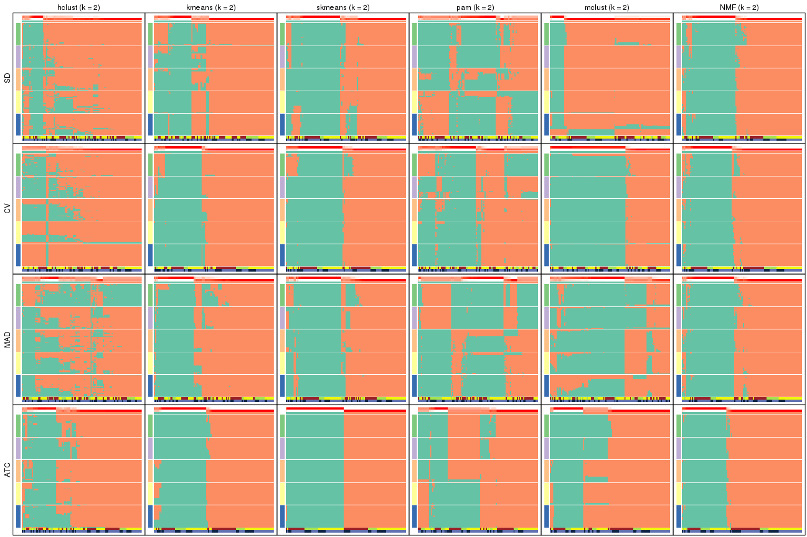</p>

</div>
<div id='tab-collect-membership-heatmap-2'>
<pre><code class="r">collect_plots(res_list, k = 3, fun = membership_heatmap, mc.cores = 4)
</code></pre>

<p></p>

</div>
<div id='tab-collect-membership-heatmap-3'>
<pre><code class="r">collect_plots(res_list, k = 4, fun = membership_heatmap, mc.cores = 4)
</code></pre>

<p></p>

</div>
<div id='tab-collect-membership-heatmap-4'>
<pre><code class="r">collect_plots(res_list, k = 5, fun = membership_heatmap, mc.cores = 4)
</code></pre>

<p></p>

</div>
<div id='tab-collect-membership-heatmap-5'>
<pre><code class="r">collect_plots(res_list, k = 6, fun = membership_heatmap, mc.cores = 4)
</code></pre>

<p></p>

</div>
</div>


### Signature heatmap

Signature heatmaps for all methods. ([What is a signature heatmap?](http://bioconductor.org/packages/devel/bioc/vignettes/cola/inst/doc/cola.html#toc_22))


Note in following heatmaps, rows are scaled.


<script>
$( function() {
	$( '#tabs-collect-get-signatures' ).tabs();
} );
</script>
<div id='tabs-collect-get-signatures'>
<ul>
<li><a href='#tab-collect-get-signatures-1'>k = 2</a></li>
<li><a href='#tab-collect-get-signatures-2'>k = 3</a></li>
<li><a href='#tab-collect-get-signatures-3'>k = 4</a></li>
<li><a href='#tab-collect-get-signatures-4'>k = 5</a></li>
<li><a href='#tab-collect-get-signatures-5'>k = 6</a></li>
</ul>
<div id='tab-collect-get-signatures-1'>
<pre><code class="r">collect_plots(res_list, k = 2, fun = get_signatures, mc.cores = 4)
</code></pre>

<p></p>

</div>
<div id='tab-collect-get-signatures-2'>
<pre><code class="r">collect_plots(res_list, k = 3, fun = get_signatures, mc.cores = 4)
</code></pre>

<p></p>

</div>
<div id='tab-collect-get-signatures-3'>
<pre><code class="r">collect_plots(res_list, k = 4, fun = get_signatures, mc.cores = 4)
</code></pre>

<p></p>

</div>
<div id='tab-collect-get-signatures-4'>
<pre><code class="r">collect_plots(res_list, k = 5, fun = get_signatures, mc.cores = 4)
</code></pre>

<p></p>

</div>
<div id='tab-collect-get-signatures-5'>
<pre><code class="r">collect_plots(res_list, k = 6, fun = get_signatures, mc.cores = 4)
</code></pre>

<p></p>

</div>
</div>


### Statistics table

The statistics used for measuring the stability of consensus partitioning.
([How are they
defined?](http://bioconductor.org/packages/devel/bioc/vignettes/cola/inst/doc/cola.html#toc_13))


<script>
$( function() {
	$( '#tabs-get-stats-from-consensus-partition-list' ).tabs();
} );
</script>
<div id='tabs-get-stats-from-consensus-partition-list'>
<ul>
<li><a href='#tab-get-stats-from-consensus-partition-list-1'>k = 2</a></li>
<li><a href='#tab-get-stats-from-consensus-partition-list-2'>k = 3</a></li>
<li><a href='#tab-get-stats-from-consensus-partition-list-3'>k = 4</a></li>
<li><a href='#tab-get-stats-from-consensus-partition-list-4'>k = 5</a></li>
<li><a href='#tab-get-stats-from-consensus-partition-list-5'>k = 6</a></li>
</ul>
<div id='tab-get-stats-from-consensus-partition-list-1'>
<pre><code class="r">get_stats(res_list, k = 2)
</code></pre>

<pre><code>#&gt;             k 1-PAC mean_silhouette concordance area_increased  Rand Jaccard
#&gt; SD:NMF      2 0.781           0.880       0.950          0.495 0.502   0.502
#&gt; CV:NMF      2 0.850           0.916       0.963          0.489 0.509   0.509
#&gt; MAD:NMF     2 0.842           0.895       0.957          0.495 0.504   0.504
#&gt; ATC:NMF     2 1.000           0.968       0.987          0.474 0.529   0.529
#&gt; SD:skmeans  2 0.608           0.820       0.923          0.502 0.500   0.500
#&gt; CV:skmeans  2 0.758           0.923       0.962          0.503 0.497   0.497
#&gt; MAD:skmeans 2 0.674           0.817       0.927          0.503 0.498   0.498
#&gt; ATC:skmeans 2 1.000           0.997       0.999          0.504 0.496   0.496
#&gt; SD:mclust   2 0.717           0.931       0.940          0.249 0.786   0.786
#&gt; CV:mclust   2 1.000           0.970       0.973          0.460 0.529   0.529
#&gt; MAD:mclust  2 0.278           0.625       0.798          0.407 0.525   0.525
#&gt; ATC:mclust  2 0.620           0.729       0.889          0.439 0.595   0.595
#&gt; SD:kmeans   2 0.588           0.770       0.898          0.445 0.565   0.565
#&gt; CV:kmeans   2 0.835           0.902       0.960          0.476 0.516   0.516
#&gt; MAD:kmeans  2 0.695           0.876       0.936          0.464 0.551   0.551
#&gt; ATC:kmeans  2 0.904           0.931       0.971          0.492 0.504   0.504
#&gt; SD:pam      2 0.278           0.428       0.691          0.466 0.540   0.540
#&gt; CV:pam      2 0.356           0.697       0.842          0.498 0.496   0.496
#&gt; MAD:pam     2 0.338           0.391       0.713          0.464 0.587   0.587
#&gt; ATC:pam     2 0.389           0.546       0.802          0.455 0.621   0.621
#&gt; SD:hclust   2 0.411           0.780       0.881          0.341 0.707   0.707
#&gt; CV:hclust   2 0.319           0.603       0.813          0.278 0.673   0.673
#&gt; MAD:hclust  2 0.206           0.216       0.600          0.409 0.506   0.506
#&gt; ATC:hclust  2 0.600           0.776       0.907          0.423 0.587   0.587
</code></pre>

</div>
<div id='tab-get-stats-from-consensus-partition-list-2'>
<pre><code class="r">get_stats(res_list, k = 3)
</code></pre>

<pre><code>#&gt;             k 1-PAC mean_silhouette concordance area_increased  Rand Jaccard
#&gt; SD:NMF      3 0.640           0.774       0.898          0.255 0.747   0.555
#&gt; CV:NMF      3 0.516           0.563       0.758          0.329 0.786   0.612
#&gt; MAD:NMF     3 0.606           0.745       0.868          0.276 0.827   0.674
#&gt; ATC:NMF     3 0.500           0.530       0.756          0.351 0.782   0.612
#&gt; SD:skmeans  3 0.611           0.736       0.875          0.328 0.733   0.518
#&gt; CV:skmeans  3 0.575           0.714       0.845          0.317 0.728   0.505
#&gt; MAD:skmeans 3 0.479           0.539       0.745          0.327 0.721   0.505
#&gt; ATC:skmeans 3 0.963           0.956       0.979          0.326 0.755   0.542
#&gt; SD:mclust   3 0.686           0.886       0.913          0.928 0.740   0.670
#&gt; CV:mclust   3 0.777           0.885       0.925          0.163 0.890   0.802
#&gt; MAD:mclust  3 0.310           0.558       0.740          0.307 0.778   0.622
#&gt; ATC:mclust  3 0.610           0.553       0.778          0.405 0.551   0.350
#&gt; SD:kmeans   3 0.477           0.696       0.839          0.382 0.733   0.564
#&gt; CV:kmeans   3 0.427           0.530       0.738          0.308 0.862   0.748
#&gt; MAD:kmeans  3 0.427           0.590       0.770          0.345 0.796   0.649
#&gt; ATC:kmeans  3 0.723           0.750       0.889          0.333 0.736   0.520
#&gt; SD:pam      3 0.381           0.602       0.766          0.373 0.628   0.415
#&gt; CV:pam      3 0.496           0.726       0.857          0.324 0.697   0.463
#&gt; MAD:pam     3 0.331           0.485       0.763          0.331 0.468   0.291
#&gt; ATC:pam     3 0.797           0.874       0.944          0.437 0.701   0.529
#&gt; SD:hclust   3 0.331           0.691       0.833          0.534 0.788   0.701
#&gt; CV:hclust   3 0.488           0.579       0.827          0.756 0.714   0.606
#&gt; MAD:hclust  3 0.360           0.662       0.826          0.352 0.530   0.374
#&gt; ATC:hclust  3 0.539           0.581       0.811          0.468 0.729   0.554
</code></pre>

</div>
<div id='tab-get-stats-from-consensus-partition-list-3'>
<pre><code class="r">get_stats(res_list, k = 4)
</code></pre>

<pre><code>#&gt;             k 1-PAC mean_silhouette concordance area_increased  Rand Jaccard
#&gt; SD:NMF      4 0.635           0.817       0.873         0.1886 0.792   0.508
#&gt; CV:NMF      4 0.659           0.771       0.861         0.1368 0.738   0.414
#&gt; MAD:NMF     4 0.683           0.813       0.886         0.1677 0.749   0.439
#&gt; ATC:NMF     4 0.614           0.640       0.815         0.0965 0.750   0.470
#&gt; SD:skmeans  4 0.814           0.829       0.911         0.1300 0.775   0.447
#&gt; CV:skmeans  4 0.618           0.606       0.810         0.1335 0.808   0.500
#&gt; MAD:skmeans 4 0.854           0.818       0.919         0.1285 0.796   0.490
#&gt; ATC:skmeans 4 0.973           0.928       0.970         0.1148 0.885   0.672
#&gt; SD:mclust   4 0.677           0.829       0.903         0.4877 0.710   0.469
#&gt; CV:mclust   4 0.554           0.573       0.736         0.2639 0.777   0.539
#&gt; MAD:mclust  4 0.946           0.886       0.938         0.3613 0.666   0.353
#&gt; ATC:mclust  4 0.670           0.800       0.870         0.1075 0.785   0.515
#&gt; SD:kmeans   4 0.698           0.827       0.881         0.1853 0.770   0.483
#&gt; CV:kmeans   4 0.505           0.588       0.750         0.1491 0.762   0.497
#&gt; MAD:kmeans  4 0.820           0.864       0.913         0.1692 0.772   0.499
#&gt; ATC:kmeans  4 0.641           0.732       0.839         0.1169 0.843   0.582
#&gt; SD:pam      4 0.584           0.747       0.828         0.1520 0.781   0.472
#&gt; CV:pam      4 0.501           0.441       0.694         0.1074 0.845   0.581
#&gt; MAD:pam     4 0.455           0.514       0.740         0.1661 0.727   0.396
#&gt; ATC:pam     4 0.726           0.747       0.861         0.1088 0.916   0.768
#&gt; SD:hclust   4 0.319           0.500       0.764         0.1283 0.890   0.797
#&gt; CV:hclust   4 0.510           0.615       0.846         0.0985 0.920   0.844
#&gt; MAD:hclust  4 0.343           0.517       0.752         0.1257 0.927   0.864
#&gt; ATC:hclust  4 0.585           0.587       0.804         0.0926 0.909   0.769
</code></pre>

</div>
<div id='tab-get-stats-from-consensus-partition-list-4'>
<pre><code class="r">get_stats(res_list, k = 5)
</code></pre>

<pre><code>#&gt;             k 1-PAC mean_silhouette concordance area_increased  Rand Jaccard
#&gt; SD:NMF      5 0.674           0.665       0.820         0.0738 0.906   0.658
#&gt; CV:NMF      5 0.661           0.649       0.812         0.0624 0.952   0.816
#&gt; MAD:NMF     5 0.643           0.634       0.777         0.0729 0.895   0.625
#&gt; ATC:NMF     5 0.647           0.679       0.832         0.0941 0.789   0.443
#&gt; SD:skmeans  5 0.710           0.604       0.764         0.0645 0.939   0.763
#&gt; CV:skmeans  5 0.600           0.539       0.728         0.0593 0.857   0.525
#&gt; MAD:skmeans 5 0.740           0.629       0.769         0.0631 0.894   0.614
#&gt; ATC:skmeans 5 0.926           0.839       0.935         0.0572 0.920   0.708
#&gt; SD:mclust   5 0.641           0.768       0.857         0.0502 0.924   0.743
#&gt; CV:mclust   5 0.564           0.603       0.749         0.1021 0.824   0.498
#&gt; MAD:mclust  5 0.761           0.817       0.896         0.0471 0.921   0.729
#&gt; ATC:mclust  5 0.756           0.766       0.881         0.1035 0.814   0.507
#&gt; SD:kmeans   5 0.656           0.631       0.784         0.0752 0.964   0.871
#&gt; CV:kmeans   5 0.583           0.628       0.765         0.0808 0.861   0.548
#&gt; MAD:kmeans  5 0.692           0.651       0.789         0.0774 0.955   0.839
#&gt; ATC:kmeans  5 0.772           0.701       0.821         0.0736 0.922   0.719
#&gt; SD:pam      5 0.659           0.689       0.802         0.0674 0.920   0.704
#&gt; CV:pam      5 0.646           0.697       0.836         0.0749 0.877   0.584
#&gt; MAD:pam     5 0.581           0.458       0.704         0.0850 0.848   0.495
#&gt; ATC:pam     5 0.912           0.902       0.957         0.0921 0.857   0.551
#&gt; SD:hclust   5 0.352           0.506       0.703         0.0990 0.855   0.708
#&gt; CV:hclust   5 0.553           0.594       0.819         0.0562 0.960   0.913
#&gt; MAD:hclust  5 0.400           0.380       0.671         0.1143 0.852   0.696
#&gt; ATC:hclust  5 0.575           0.537       0.758         0.0642 0.923   0.783
</code></pre>

</div>
<div id='tab-get-stats-from-consensus-partition-list-5'>
<pre><code class="r">get_stats(res_list, k = 6)
</code></pre>

<pre><code>#&gt;             k 1-PAC mean_silhouette concordance area_increased  Rand Jaccard
#&gt; SD:NMF      6 0.691           0.625       0.786         0.0439 0.904   0.592
#&gt; CV:NMF      6 0.684           0.608       0.790         0.0427 0.921   0.672
#&gt; MAD:NMF     6 0.669           0.632       0.778         0.0448 0.896   0.561
#&gt; ATC:NMF     6 0.566           0.473       0.639         0.0460 0.891   0.590
#&gt; SD:skmeans  6 0.710           0.549       0.748         0.0376 0.943   0.739
#&gt; CV:skmeans  6 0.638           0.511       0.710         0.0396 0.920   0.660
#&gt; MAD:skmeans 6 0.722           0.547       0.754         0.0391 0.888   0.531
#&gt; ATC:skmeans 6 0.819           0.716       0.830         0.0461 0.920   0.655
#&gt; SD:mclust   6 0.637           0.564       0.763         0.0645 0.909   0.657
#&gt; CV:mclust   6 0.672           0.624       0.796         0.0644 0.892   0.616
#&gt; MAD:mclust  6 0.785           0.693       0.839         0.0697 0.926   0.707
#&gt; ATC:mclust  6 0.667           0.530       0.752         0.0490 0.900   0.641
#&gt; SD:kmeans   6 0.643           0.453       0.678         0.0451 0.928   0.719
#&gt; CV:kmeans   6 0.645           0.623       0.750         0.0411 0.957   0.809
#&gt; MAD:kmeans  6 0.678           0.538       0.705         0.0476 0.892   0.586
#&gt; ATC:kmeans  6 0.739           0.642       0.773         0.0410 0.952   0.785
#&gt; SD:pam      6 0.748           0.724       0.856         0.0391 0.954   0.790
#&gt; CV:pam      6 0.641           0.534       0.721         0.0375 0.945   0.753
#&gt; MAD:pam     6 0.678           0.667       0.819         0.0422 0.921   0.658
#&gt; ATC:pam     6 0.852           0.877       0.920         0.0297 0.972   0.865
#&gt; SD:hclust   6 0.365           0.467       0.651         0.1020 0.876   0.676
#&gt; CV:hclust   6 0.522           0.570       0.787         0.0687 0.956   0.901
#&gt; MAD:hclust  6 0.431           0.424       0.649         0.0771 0.881   0.672
#&gt; ATC:hclust  6 0.610           0.599       0.732         0.0457 0.870   0.598
</code></pre>

</div>
</div>

Following heatmap plots the partition for each combination of methods and the
lightness correspond to the silhouette scores for samples in each method. On
top the consensus subgroup is inferred from all methods by taking the mean
silhouette scores as weight.


<script>
$( function() {
	$( '#tabs-collect-stats-from-consensus-partition-list' ).tabs();
} );
</script>
<div id='tabs-collect-stats-from-consensus-partition-list'>
<ul>
<li><a href='#tab-collect-stats-from-consensus-partition-list-1'>k = 2</a></li>
<li><a href='#tab-collect-stats-from-consensus-partition-list-2'>k = 3</a></li>
<li><a href='#tab-collect-stats-from-consensus-partition-list-3'>k = 4</a></li>
<li><a href='#tab-collect-stats-from-consensus-partition-list-4'>k = 5</a></li>
<li><a href='#tab-collect-stats-from-consensus-partition-list-5'>k = 6</a></li>
</ul>
<div id='tab-collect-stats-from-consensus-partition-list-1'>
<pre><code class="r">collect_stats(res_list, k = 2)
</code></pre>

<p></p>

</div>
<div id='tab-collect-stats-from-consensus-partition-list-2'>
<pre><code class="r">collect_stats(res_list, k = 3)
</code></pre>

<p></p>

</div>
<div id='tab-collect-stats-from-consensus-partition-list-3'>
<pre><code class="r">collect_stats(res_list, k = 4)
</code></pre>

<p></p>

</div>
<div id='tab-collect-stats-from-consensus-partition-list-4'>
<pre><code class="r">collect_stats(res_list, k = 5)
</code></pre>

<p></p>

</div>
<div id='tab-collect-stats-from-consensus-partition-list-5'>
<pre><code class="r">collect_stats(res_list, k = 6)
</code></pre>

<p></p>

</div>
</div>

### Partition from all methods


Collect partitions from all methods:


<script>
$( function() {
	$( '#tabs-collect-classes-from-consensus-partition-list' ).tabs();
} );
</script>
<div id='tabs-collect-classes-from-consensus-partition-list'>
<ul>
<li><a href='#tab-collect-classes-from-consensus-partition-list-1'>k = 2</a></li>
<li><a href='#tab-collect-classes-from-consensus-partition-list-2'>k = 3</a></li>
<li><a href='#tab-collect-classes-from-consensus-partition-list-3'>k = 4</a></li>
<li><a href='#tab-collect-classes-from-consensus-partition-list-4'>k = 5</a></li>
<li><a href='#tab-collect-classes-from-consensus-partition-list-5'>k = 6</a></li>
</ul>
<div id='tab-collect-classes-from-consensus-partition-list-1'>
<pre><code class="r">collect_classes(res_list, k = 2)
</code></pre>

<p></p>

</div>
<div id='tab-collect-classes-from-consensus-partition-list-2'>
<pre><code class="r">collect_classes(res_list, k = 3)
</code></pre>

<p></p>

</div>
<div id='tab-collect-classes-from-consensus-partition-list-3'>
<pre><code class="r">collect_classes(res_list, k = 4)
</code></pre>

<p></p>

</div>
<div id='tab-collect-classes-from-consensus-partition-list-4'>
<pre><code class="r">collect_classes(res_list, k = 5)
</code></pre>

<p></p>

</div>
<div id='tab-collect-classes-from-consensus-partition-list-5'>
<pre><code class="r">collect_classes(res_list, k = 6)
</code></pre>

<p></p>

</div>
</div>


### Top rows overlap


Overlap of top rows from different top-row methods:


<script>
$( function() {
	$( '#tabs-top-rows-overlap-by-euler' ).tabs();
} );
</script>
<div id='tabs-top-rows-overlap-by-euler'>
<ul>
<li><a href='#tab-top-rows-overlap-by-euler-1'>top_n = 1000</a></li>
<li><a href='#tab-top-rows-overlap-by-euler-2'>top_n = 2000</a></li>
<li><a href='#tab-top-rows-overlap-by-euler-3'>top_n = 3000</a></li>
<li><a href='#tab-top-rows-overlap-by-euler-4'>top_n = 4000</a></li>
<li><a href='#tab-top-rows-overlap-by-euler-5'>top_n = 5000</a></li>
</ul>
<div id='tab-top-rows-overlap-by-euler-1'>
<pre><code class="r">top_rows_overlap(res_list, top_n = 1000, method = &quot;euler&quot;)
</code></pre>

<p></p>

</div>
<div id='tab-top-rows-overlap-by-euler-2'>
<pre><code class="r">top_rows_overlap(res_list, top_n = 2000, method = &quot;euler&quot;)
</code></pre>

<p></p>

</div>
<div id='tab-top-rows-overlap-by-euler-3'>
<pre><code class="r">top_rows_overlap(res_list, top_n = 3000, method = &quot;euler&quot;)
</code></pre>

<p></p>

</div>
<div id='tab-top-rows-overlap-by-euler-4'>
<pre><code class="r">top_rows_overlap(res_list, top_n = 4000, method = &quot;euler&quot;)
</code></pre>

<p></p>

</div>
<div id='tab-top-rows-overlap-by-euler-5'>
<pre><code class="r">top_rows_overlap(res_list, top_n = 5000, method = &quot;euler&quot;)
</code></pre>

<p></p>

</div>
</div>

Also visualize the correspondance of rankings between different top-row methods:


<script>
$( function() {
	$( '#tabs-top-rows-overlap-by-correspondance' ).tabs();
} );
</script>
<div id='tabs-top-rows-overlap-by-correspondance'>
<ul>
<li><a href='#tab-top-rows-overlap-by-correspondance-1'>top_n = 1000</a></li>
<li><a href='#tab-top-rows-overlap-by-correspondance-2'>top_n = 2000</a></li>
<li><a href='#tab-top-rows-overlap-by-correspondance-3'>top_n = 3000</a></li>
<li><a href='#tab-top-rows-overlap-by-correspondance-4'>top_n = 4000</a></li>
<li><a href='#tab-top-rows-overlap-by-correspondance-5'>top_n = 5000</a></li>
</ul>
<div id='tab-top-rows-overlap-by-correspondance-1'>
<pre><code class="r">top_rows_overlap(res_list, top_n = 1000, method = &quot;correspondance&quot;)
</code></pre>

<p></p>

</div>
<div id='tab-top-rows-overlap-by-correspondance-2'>
<pre><code class="r">top_rows_overlap(res_list, top_n = 2000, method = &quot;correspondance&quot;)
</code></pre>

<p></p>

</div>
<div id='tab-top-rows-overlap-by-correspondance-3'>
<pre><code class="r">top_rows_overlap(res_list, top_n = 3000, method = &quot;correspondance&quot;)
</code></pre>

<p></p>

</div>
<div id='tab-top-rows-overlap-by-correspondance-4'>
<pre><code class="r">top_rows_overlap(res_list, top_n = 4000, method = &quot;correspondance&quot;)
</code></pre>

<p></p>

</div>
<div id='tab-top-rows-overlap-by-correspondance-5'>
<pre><code class="r">top_rows_overlap(res_list, top_n = 5000, method = &quot;correspondance&quot;)
</code></pre>

<p></p>

</div>
</div>


Heatmaps of the top rows:


<script>
$( function() {
	$( '#tabs-top-rows-heatmap' ).tabs();
} );
</script>
<div id='tabs-top-rows-heatmap'>
<ul>
<li><a href='#tab-top-rows-heatmap-1'>top_n = 1000</a></li>
<li><a href='#tab-top-rows-heatmap-2'>top_n = 2000</a></li>
<li><a href='#tab-top-rows-heatmap-3'>top_n = 3000</a></li>
<li><a href='#tab-top-rows-heatmap-4'>top_n = 4000</a></li>
<li><a href='#tab-top-rows-heatmap-5'>top_n = 5000</a></li>
</ul>
<div id='tab-top-rows-heatmap-1'>
<pre><code class="r">top_rows_heatmap(res_list, top_n = 1000)
</code></pre>

<p></p>

</div>
<div id='tab-top-rows-heatmap-2'>
<pre><code class="r">top_rows_heatmap(res_list, top_n = 2000)
</code></pre>

<p></p>

</div>
<div id='tab-top-rows-heatmap-3'>
<pre><code class="r">top_rows_heatmap(res_list, top_n = 3000)
</code></pre>

<p></p>

</div>
<div id='tab-top-rows-heatmap-4'>
<pre><code class="r">top_rows_heatmap(res_list, top_n = 4000)
</code></pre>

<p></p>

</div>
<div id='tab-top-rows-heatmap-5'>
<pre><code class="r">top_rows_heatmap(res_list, top_n = 5000)
</code></pre>

<p></p>

</div>
</div>


### Test to known annotations


Test correlation between subgroups and known annotations. If the known
annotation is numeric, one-way ANOVA test is applied, and if the known
annotation is discrete, chi-squared contingency table test is applied.


<script>
$( function() {
	$( '#tabs-test-to-known-factors-from-consensus-partition-list' ).tabs();
} );
</script>
<div id='tabs-test-to-known-factors-from-consensus-partition-list'>
<ul>
<li><a href='#tab-test-to-known-factors-from-consensus-partition-list-1'>k = 2</a></li>
<li><a href='#tab-test-to-known-factors-from-consensus-partition-list-2'>k = 3</a></li>
<li><a href='#tab-test-to-known-factors-from-consensus-partition-list-3'>k = 4</a></li>
<li><a href='#tab-test-to-known-factors-from-consensus-partition-list-4'>k = 5</a></li>
<li><a href='#tab-test-to-known-factors-from-consensus-partition-list-5'>k = 6</a></li>
</ul>
<div id='tab-test-to-known-factors-from-consensus-partition-list-1'>
<pre><code class="r">test_to_known_factors(res_list, k = 2)
</code></pre>

<pre><code>#&gt;               n disease.state(p) gender(p) k
#&gt; SD:NMF      102          0.39176     0.753 2
#&gt; CV:NMF      105          0.73098     1.000 2
#&gt; MAD:NMF     102          0.48106     0.753 2
#&gt; ATC:NMF     107          0.29010     1.000 2
#&gt; SD:skmeans  101          0.28138     0.645 2
#&gt; CV:skmeans  107          0.96390     0.747 2
#&gt; MAD:skmeans  96          0.83703     1.000 2
#&gt; ATC:skmeans 108          0.43138     0.957 2
#&gt; SD:mclust   108          0.40381     0.706 2
#&gt; CV:mclust   108          0.76287     1.000 2
#&gt; MAD:mclust   92          0.84752     1.000 2
#&gt; ATC:mclust   84          0.80360     0.942 2
#&gt; SD:kmeans    95          0.85807     0.373 2
#&gt; CV:kmeans   103          0.68325     1.000 2
#&gt; MAD:kmeans  105          0.77262     0.330 2
#&gt; ATC:kmeans  107          0.23517     0.813 2
#&gt; SD:pam       76          0.00167     1.000 2
#&gt; CV:pam       93          0.42806     1.000 2
#&gt; MAD:pam      55          0.07190     0.922 2
#&gt; ATC:pam      64          0.29230     0.625 2
#&gt; SD:hclust   100          0.66823     1.000 2
#&gt; CV:hclust    82          0.70571     0.177 2
#&gt; MAD:hclust   34               NA        NA 2
#&gt; ATC:hclust   92          0.21993     0.879 2
</code></pre>

</div>
<div id='tab-test-to-known-factors-from-consensus-partition-list-2'>
<pre><code class="r">test_to_known_factors(res_list, k = 3)
</code></pre>

<pre><code>#&gt;               n disease.state(p) gender(p) k
#&gt; SD:NMF       96          0.83267     0.383 3
#&gt; CV:NMF       81          0.30690     0.857 3
#&gt; MAD:NMF      95          0.94174     0.290 3
#&gt; ATC:NMF      80          0.35795     0.930 3
#&gt; SD:skmeans   91          0.76251     0.952 3
#&gt; CV:skmeans   92          0.00555     0.913 3
#&gt; MAD:skmeans  65          0.31240     0.732 3
#&gt; ATC:skmeans 107          0.22553     0.923 3
#&gt; SD:mclust   106          0.56865     0.136 3
#&gt; CV:mclust   102          0.02039     0.783 3
#&gt; MAD:mclust   75          0.00806     0.542 3
#&gt; ATC:mclust   72          0.26354     0.731 3
#&gt; SD:kmeans    92          0.88731     0.601 3
#&gt; CV:kmeans    78          0.85960     0.985 3
#&gt; MAD:kmeans   86          0.85051     0.697 3
#&gt; ATC:kmeans   91          0.56321     0.964 3
#&gt; SD:pam       87          0.14071     0.653 3
#&gt; CV:pam       91          0.19282     0.528 3
#&gt; MAD:pam      67          0.07715     0.745 3
#&gt; ATC:pam     102          0.63089     0.243 3
#&gt; SD:hclust    90          0.77854     0.555 3
#&gt; CV:hclust    70          0.56416     0.689 3
#&gt; MAD:hclust   90          0.79724     0.481 3
#&gt; ATC:hclust   75          0.54906     0.762 3
</code></pre>

</div>
<div id='tab-test-to-known-factors-from-consensus-partition-list-3'>
<pre><code class="r">test_to_known_factors(res_list, k = 4)
</code></pre>

<pre><code>#&gt;               n disease.state(p) gender(p) k
#&gt; SD:NMF      104          0.00425    0.7325 4
#&gt; CV:NMF      100          0.00270    0.4353 4
#&gt; MAD:NMF     102          0.00357    0.7012 4
#&gt; ATC:NMF      89          0.31120    0.5760 4
#&gt; SD:skmeans   97          0.00821    0.9911 4
#&gt; CV:skmeans   79          0.01149    0.6986 4
#&gt; MAD:skmeans  97          0.00542    0.9794 4
#&gt; ATC:skmeans 103          0.25347    0.8363 4
#&gt; SD:mclust   100          0.00400    0.5508 4
#&gt; CV:mclust    57          0.00332    0.2233 4
#&gt; MAD:mclust  105          0.00324    0.6986 4
#&gt; ATC:mclust  104          0.37564    0.0799 4
#&gt; SD:kmeans   101          0.01049    0.7969 4
#&gt; CV:kmeans    83          0.01062    0.9758 4
#&gt; MAD:kmeans  103          0.00304    0.5520 4
#&gt; ATC:kmeans   94          0.68179    0.1699 4
#&gt; SD:pam       99          0.02249    0.8648 4
#&gt; CV:pam       60          0.01864    0.3328 4
#&gt; MAD:pam      72          0.18347    0.6843 4
#&gt; ATC:pam      93          0.99016    0.3352 4
#&gt; SD:hclust    74          0.30061    0.8063 4
#&gt; CV:hclust    67          0.90614    0.1465 4
#&gt; MAD:hclust   72          0.84074    0.3911 4
#&gt; ATC:hclust   75          0.57976    0.1738 4
</code></pre>

</div>
<div id='tab-test-to-known-factors-from-consensus-partition-list-4'>
<pre><code class="r">test_to_known_factors(res_list, k = 5)
</code></pre>

<pre><code>#&gt;               n disease.state(p) gender(p) k
#&gt; SD:NMF       92         0.007545     0.359 5
#&gt; CV:NMF       90         0.000921     0.016 5
#&gt; MAD:NMF      88         0.017078     0.483 5
#&gt; ATC:NMF      88         0.395552     0.440 5
#&gt; SD:skmeans   77         0.000346     0.988 5
#&gt; CV:skmeans   62         0.005429     0.186 5
#&gt; MAD:skmeans  86         0.000385     0.997 5
#&gt; ATC:skmeans  95         0.325055     0.242 5
#&gt; SD:mclust   100         0.001271     0.411 5
#&gt; CV:mclust    80         0.000833     0.406 5
#&gt; MAD:mclust  103         0.003965     0.491 5
#&gt; ATC:mclust   92         0.996923     0.252 5
#&gt; SD:kmeans    88         0.001559     0.774 5
#&gt; CV:kmeans    78         0.000305     0.472 5
#&gt; MAD:kmeans   88         0.004028     0.746 5
#&gt; ATC:kmeans   91         0.696724     0.091 5
#&gt; SD:pam       99         0.077620     0.610 5
#&gt; CV:pam       92         0.049094     0.410 5
#&gt; MAD:pam      47         0.013712     0.855 5
#&gt; ATC:pam     105         0.998042     0.323 5
#&gt; SD:hclust    74         0.124396     0.454 5
#&gt; CV:hclust    65         0.935880     0.162 5
#&gt; MAD:hclust   34         0.541178     0.564 5
#&gt; ATC:hclust   68         0.283954     0.208 5
</code></pre>

</div>
<div id='tab-test-to-known-factors-from-consensus-partition-list-5'>
<pre><code class="r">test_to_known_factors(res_list, k = 6)
</code></pre>

<pre><code>#&gt;               n disease.state(p) gender(p) k
#&gt; SD:NMF       83         0.000926    0.0673 6
#&gt; CV:NMF       86         0.023660    0.0282 6
#&gt; MAD:NMF      88         0.003560    0.5312 6
#&gt; ATC:NMF      66         0.057073    0.5576 6
#&gt; SD:skmeans   68         0.001059    0.6986 6
#&gt; CV:skmeans   70         0.000438    0.5016 6
#&gt; MAD:skmeans  70         0.003139    0.9673 6
#&gt; ATC:skmeans  89         0.147885    0.3914 6
#&gt; SD:mclust    69         0.098346    0.6782 6
#&gt; CV:mclust    77         0.001699    0.5770 6
#&gt; MAD:mclust   88         0.028448    0.6494 6
#&gt; ATC:mclust   80         0.958057    0.1733 6
#&gt; SD:kmeans    56         0.080012    0.5215 6
#&gt; CV:kmeans    83         0.000172    0.3758 6
#&gt; MAD:kmeans   69         0.005757    0.1618 6
#&gt; ATC:kmeans   84         0.240161    0.2112 6
#&gt; SD:pam       99         0.056421    0.6115 6
#&gt; CV:pam       70         0.003492    0.2609 6
#&gt; MAD:pam      90         0.020161    0.4461 6
#&gt; ATC:pam     106         0.985782    0.1162 6
#&gt; SD:hclust    63         0.015805    0.2772 6
#&gt; CV:hclust    63         0.770466    0.1118 6
#&gt; MAD:hclust   53         0.084141    0.0821 6
#&gt; ATC:hclust   83         0.213625    0.4094 6
</code></pre>

</div>
</div>


 
## Results for each method


---------------------------------------------------


### SD:hclust


The object with results only for a single top-value method and a single partition method 
can be extracted as:

```r
res = res_list["SD", "hclust"]
# you can also extract it by
# res = res_list["SD:hclust"]
```

A summary of `res` and all the functions that can be applied to it:

```r
res
```

```
#> A 'ConsensusPartition' object with k = 2, 3, 4, 5, 6.
#>   On a matrix with 38950 rows and 108 columns.
#>   Top rows (1000, 2000, 3000, 4000, 5000) are extracted by 'SD' method.
#>   Subgroups are detected by 'hclust' method.
#>   Performed in total 1250 partitions by row resampling.
#>   Best k for subgroups seems to be 3.
#> 
#> Following methods can be applied to this 'ConsensusPartition' object:
#>  [1] "cola_report"             "collect_classes"         "collect_plots"          
#>  [4] "collect_stats"           "colnames"                "compare_signatures"     
#>  [7] "consensus_heatmap"       "dimension_reduction"     "functional_enrichment"  
#> [10] "get_anno_col"            "get_anno"                "get_classes"            
#> [13] "get_consensus"           "get_matrix"              "get_membership"         
#> [16] "get_param"               "get_signatures"          "get_stats"              
#> [19] "is_best_k"               "is_stable_k"             "membership_heatmap"     
#> [22] "ncol"                    "nrow"                    "plot_ecdf"              
#> [25] "rownames"                "select_partition_number" "show"                   
#> [28] "suggest_best_k"          "test_to_known_factors"
```

`collect_plots()` function collects all the plots made from `res` for all `k` (number of partitions)
into one single page to provide an easy and fast comparison between different `k`.

```r
collect_plots(res)
```


The plots are:

- The first row: a plot of the ECDF (Empirical cumulative distribution
  function) curves of the consensus matrix for each `k` and the heatmap of
  predicted classes for each `k`.
- The second row: heatmaps of the consensus matrix for each `k`.
- The third row: heatmaps of the membership matrix for each `k`.
- The fouth row: heatmaps of the signatures for each `k`.

All the plots in panels can be made by individual functions and they are
plotted later in this section.

`select_partition_number()` produces several plots showing different
statistics for choosing "optimized" `k`. There are following statistics:

- ECDF curves of the consensus matrix for each `k`;
- 1-PAC. [The PAC
  score](https://en.wikipedia.org/wiki/Consensus_clustering#Over-interpretation_potential_of_consensus_clustering)
  measures the proportion of the ambiguous subgrouping.
- Mean silhouette score.
- Concordance. The mean probability of fiting the consensus class ids in all
  partitions.
- Area increased. Denote $A_k$ as the area under the ECDF curve for current
  `k`, the area increased is defined as $A_k - A_{k-1}$.
- Rand index. The percent of pairs of samples that are both in a same cluster
  or both are not in a same cluster in the partition of k and k-1.
- Jaccard index. The ratio of pairs of samples are both in a same cluster in
  the partition of k and k-1 and the pairs of samples are both in a same
  cluster in the partition k or k-1.

The detailed explanations of these statistics can be found in [the cola
vignette](http://bioconductor.org/packages/devel/bioc/vignettes/cola/inst/doc/cola.html#toc_13).

Generally speaking, lower PAC score, higher mean silhouette score or higher
concordance corresponds to better partition. Rand index and Jaccard index
measure how similar the current partition is compared to partition with `k-1`.
If they are too similar, we won't accept `k` is better than `k-1`.

```r
select_partition_number(res)
```


The numeric values for all these statistics can be obtained by `get_stats()`.

```r
get_stats(res)
```

```
#>   k 1-PAC mean_silhouette concordance area_increased  Rand Jaccard
#> 2 2 0.411           0.780       0.881          0.341 0.707   0.707
#> 3 3 0.331           0.691       0.833          0.534 0.788   0.701
#> 4 4 0.319           0.500       0.764          0.128 0.890   0.797
#> 5 5 0.352           0.506       0.703          0.099 0.855   0.708
#> 6 6 0.365           0.467       0.651          0.102 0.876   0.676
```

`suggest_best_k()` suggests the best $k$ based on these statistics. The rules are as follows:

- All $k$ with Jaccard index larger than 0.95 are removed because the increase of
  the partition number does not provides enough extra information. If all $k$ are removed,
  the best $k$ is assigned by `NA`.
- For $k$ with 1-PAC larger than 0.9, the maximal $k$ is taken as the "best k". Other $k$ is called "optional k".
- If it does not fit the second rule. The $k$ with the highest vote of highest
  1-PAC, mean silhouette and concordance is taken as the "best k".

```r
suggest_best_k(res)
```

```
#> [1] 3
```


Following shows the table of the partitions (You need to click the **show/hide
code output** link to see it). The membership matrix (columns with name `p*`)
is inferred by
[`clue::cl_consensus()`](https://www.rdocumentation.org/link/cl_consensus?package=clue)
function with the `SE` method. Basically the value in the membership matrix
represents the probability to belong to a certain group. The finall class
label for an item is determined with the group with highest probability it
belongs to.

In `get_classes()` function, the entropy is calculated from the membership
matrix and the silhouette score is calculated from the consensus matrix.


<script>
$( function() {
	$( '#tabs-SD-hclust-get-classes' ).tabs();
} );
</script>
<div id='tabs-SD-hclust-get-classes'>
<ul>
<li><a href='#tab-SD-hclust-get-classes-1'>k = 2</a></li>
<li><a href='#tab-SD-hclust-get-classes-2'>k = 3</a></li>
<li><a href='#tab-SD-hclust-get-classes-3'>k = 4</a></li>
<li><a href='#tab-SD-hclust-get-classes-4'>k = 5</a></li>
<li><a href='#tab-SD-hclust-get-classes-5'>k = 6</a></li>
</ul>

<div id='tab-SD-hclust-get-classes-1'>
<p><a id='tab-SD-hclust-get-classes-1-a' style='color:#0366d6' href='#'>show/hide code output</a></p>
<pre><code class="r">cbind(get_classes(res, k = 2), get_membership(res, k = 2))
</code></pre>

<pre><code>#&gt;            class entropy silhouette    p1    p2
#&gt; GSM1068478     2  0.3879      0.863 0.076 0.924
#&gt; GSM1068479     1  0.9933      0.471 0.548 0.452
#&gt; GSM1068481     1  0.2423      0.789 0.960 0.040
#&gt; GSM1068482     1  0.0000      0.796 1.000 0.000
#&gt; GSM1068483     2  0.8443      0.705 0.272 0.728
#&gt; GSM1068486     1  0.4690      0.771 0.900 0.100
#&gt; GSM1068487     2  0.0000      0.874 0.000 1.000
#&gt; GSM1068488     2  0.4022      0.855 0.080 0.920
#&gt; GSM1068490     2  0.0000      0.874 0.000 1.000
#&gt; GSM1068491     1  0.9896      0.498 0.560 0.440
#&gt; GSM1068492     1  0.9896      0.498 0.560 0.440
#&gt; GSM1068493     2  0.7219      0.787 0.200 0.800
#&gt; GSM1068494     1  0.9896      0.114 0.560 0.440
#&gt; GSM1068495     2  0.3879      0.867 0.076 0.924
#&gt; GSM1068496     2  0.9933      0.183 0.452 0.548
#&gt; GSM1068498     2  0.3879      0.863 0.076 0.924
#&gt; GSM1068499     2  0.8608      0.689 0.284 0.716
#&gt; GSM1068500     2  0.8443      0.705 0.272 0.728
#&gt; GSM1068502     1  0.9896      0.498 0.560 0.440
#&gt; GSM1068503     2  0.0000      0.874 0.000 1.000
#&gt; GSM1068505     2  0.0376      0.874 0.004 0.996
#&gt; GSM1068506     2  0.0000      0.874 0.000 1.000
#&gt; GSM1068507     2  0.1184      0.875 0.016 0.984
#&gt; GSM1068508     2  0.3114      0.871 0.056 0.944
#&gt; GSM1068510     2  0.5408      0.840 0.124 0.876
#&gt; GSM1068512     2  0.6148      0.810 0.152 0.848
#&gt; GSM1068513     2  0.1184      0.875 0.016 0.984
#&gt; GSM1068514     2  0.8016      0.603 0.244 0.756
#&gt; GSM1068517     2  0.3879      0.863 0.076 0.924
#&gt; GSM1068518     2  0.7602      0.734 0.220 0.780
#&gt; GSM1068520     2  0.7883      0.741 0.236 0.764
#&gt; GSM1068521     2  0.7815      0.745 0.232 0.768
#&gt; GSM1068522     2  0.0000      0.874 0.000 1.000
#&gt; GSM1068524     2  0.1184      0.873 0.016 0.984
#&gt; GSM1068527     2  0.1184      0.873 0.016 0.984
#&gt; GSM1068480     1  0.0376      0.796 0.996 0.004
#&gt; GSM1068484     2  0.2236      0.870 0.036 0.964
#&gt; GSM1068485     1  0.0000      0.796 1.000 0.000
#&gt; GSM1068489     2  0.0376      0.874 0.004 0.996
#&gt; GSM1068497     2  0.3879      0.863 0.076 0.924
#&gt; GSM1068501     2  0.5408      0.840 0.124 0.876
#&gt; GSM1068504     2  0.0000      0.874 0.000 1.000
#&gt; GSM1068509     2  0.8955      0.616 0.312 0.688
#&gt; GSM1068511     2  0.9358      0.433 0.352 0.648
#&gt; GSM1068515     2  0.5059      0.848 0.112 0.888
#&gt; GSM1068516     2  0.7528      0.745 0.216 0.784
#&gt; GSM1068519     2  0.8661      0.681 0.288 0.712
#&gt; GSM1068523     2  0.0000      0.874 0.000 1.000
#&gt; GSM1068525     2  0.2236      0.870 0.036 0.964
#&gt; GSM1068526     2  0.0672      0.873 0.008 0.992
#&gt; GSM1068458     2  0.8016      0.733 0.244 0.756
#&gt; GSM1068459     1  0.0000      0.796 1.000 0.000
#&gt; GSM1068460     2  0.0000      0.874 0.000 1.000
#&gt; GSM1068461     1  0.0000      0.796 1.000 0.000
#&gt; GSM1068464     2  0.0000      0.874 0.000 1.000
#&gt; GSM1068468     2  0.2423      0.873 0.040 0.960
#&gt; GSM1068472     2  0.4161      0.862 0.084 0.916
#&gt; GSM1068473     2  0.0000      0.874 0.000 1.000
#&gt; GSM1068474     2  0.0000      0.874 0.000 1.000
#&gt; GSM1068476     1  0.9775      0.535 0.588 0.412
#&gt; GSM1068477     2  0.0000      0.874 0.000 1.000
#&gt; GSM1068462     2  0.3733      0.868 0.072 0.928
#&gt; GSM1068463     1  0.0000      0.796 1.000 0.000
#&gt; GSM1068465     2  0.3114      0.871 0.056 0.944
#&gt; GSM1068466     2  0.7883      0.742 0.236 0.764
#&gt; GSM1068467     2  0.2423      0.873 0.040 0.960
#&gt; GSM1068469     2  0.4161      0.860 0.084 0.916
#&gt; GSM1068470     2  0.0000      0.874 0.000 1.000
#&gt; GSM1068471     2  0.0000      0.874 0.000 1.000
#&gt; GSM1068475     2  0.0000      0.874 0.000 1.000
#&gt; GSM1068528     1  0.8608      0.561 0.716 0.284
#&gt; GSM1068531     2  0.8267      0.712 0.260 0.740
#&gt; GSM1068532     2  0.8661      0.678 0.288 0.712
#&gt; GSM1068533     2  0.8016      0.733 0.244 0.756
#&gt; GSM1068535     2  0.5519      0.837 0.128 0.872
#&gt; GSM1068537     2  0.8555      0.688 0.280 0.720
#&gt; GSM1068538     2  0.8661      0.678 0.288 0.712
#&gt; GSM1068539     2  0.3879      0.867 0.076 0.924
#&gt; GSM1068540     2  0.8267      0.712 0.260 0.740
#&gt; GSM1068542     2  0.0000      0.874 0.000 1.000
#&gt; GSM1068543     2  0.2423      0.868 0.040 0.960
#&gt; GSM1068544     1  0.1184      0.793 0.984 0.016
#&gt; GSM1068545     2  0.0000      0.874 0.000 1.000
#&gt; GSM1068546     1  0.0000      0.796 1.000 0.000
#&gt; GSM1068547     2  0.7883      0.741 0.236 0.764
#&gt; GSM1068548     2  0.0000      0.874 0.000 1.000
#&gt; GSM1068549     1  0.0000      0.796 1.000 0.000
#&gt; GSM1068550     2  0.0672      0.873 0.008 0.992
#&gt; GSM1068551     2  0.0000      0.874 0.000 1.000
#&gt; GSM1068552     2  0.0000      0.874 0.000 1.000
#&gt; GSM1068555     2  0.0000      0.874 0.000 1.000
#&gt; GSM1068556     2  0.2423      0.868 0.040 0.960
#&gt; GSM1068557     2  0.3879      0.868 0.076 0.924
#&gt; GSM1068560     2  0.1184      0.873 0.016 0.984
#&gt; GSM1068561     2  0.4161      0.866 0.084 0.916
#&gt; GSM1068562     2  0.0672      0.873 0.008 0.992
#&gt; GSM1068563     2  0.0000      0.874 0.000 1.000
#&gt; GSM1068565     2  0.0000      0.874 0.000 1.000
#&gt; GSM1068529     2  0.7883      0.698 0.236 0.764
#&gt; GSM1068530     2  0.8443      0.698 0.272 0.728
#&gt; GSM1068534     2  0.7883      0.698 0.236 0.764
#&gt; GSM1068536     2  0.4815      0.857 0.104 0.896
#&gt; GSM1068541     2  0.2778      0.873 0.048 0.952
#&gt; GSM1068553     2  0.5408      0.840 0.124 0.876
#&gt; GSM1068554     2  0.5408      0.840 0.124 0.876
#&gt; GSM1068558     1  0.9000      0.629 0.684 0.316
#&gt; GSM1068559     2  0.9580      0.236 0.380 0.620
#&gt; GSM1068564     2  0.0376      0.874 0.004 0.996
</code></pre>

<script>
$('#tab-SD-hclust-get-classes-1-a').parent().next().next().hide();
$('#tab-SD-hclust-get-classes-1-a').click(function(){
  $('#tab-SD-hclust-get-classes-1-a').parent().next().next().toggle();
  return(false);
});
</script>
</div>

<div id='tab-SD-hclust-get-classes-2'>
<p><a id='tab-SD-hclust-get-classes-2-a' style='color:#0366d6' href='#'>show/hide code output</a></p>
<pre><code class="r">cbind(get_classes(res, k = 3), get_membership(res, k = 3))
</code></pre>

<pre><code>#&gt;            class entropy silhouette    p1    p2    p3
#&gt; GSM1068478     2  0.4002      0.759 0.160 0.840 0.000
#&gt; GSM1068479     3  0.6483      0.330 0.004 0.452 0.544
#&gt; GSM1068481     3  0.2810      0.675 0.036 0.036 0.928
#&gt; GSM1068482     3  0.0747      0.688 0.016 0.000 0.984
#&gt; GSM1068483     1  0.8168      0.668 0.612 0.280 0.108
#&gt; GSM1068486     3  0.3752      0.651 0.020 0.096 0.884
#&gt; GSM1068487     2  0.0000      0.826 0.000 1.000 0.000
#&gt; GSM1068488     2  0.6424      0.729 0.180 0.752 0.068
#&gt; GSM1068490     2  0.0000      0.826 0.000 1.000 0.000
#&gt; GSM1068491     3  0.6460      0.364 0.004 0.440 0.556
#&gt; GSM1068492     3  0.6460      0.364 0.004 0.440 0.556
#&gt; GSM1068493     2  0.7179      0.637 0.184 0.712 0.104
#&gt; GSM1068494     3  0.9242      0.115 0.240 0.228 0.532
#&gt; GSM1068495     2  0.4196      0.799 0.112 0.864 0.024
#&gt; GSM1068496     1  0.9901      0.135 0.392 0.272 0.336
#&gt; GSM1068498     2  0.3816      0.767 0.148 0.852 0.000
#&gt; GSM1068499     1  0.8109      0.657 0.628 0.256 0.116
#&gt; GSM1068500     1  0.8168      0.668 0.612 0.280 0.108
#&gt; GSM1068502     3  0.6460      0.364 0.004 0.440 0.556
#&gt; GSM1068503     2  0.0000      0.826 0.000 1.000 0.000
#&gt; GSM1068505     2  0.3573      0.811 0.120 0.876 0.004
#&gt; GSM1068506     2  0.1964      0.827 0.056 0.944 0.000
#&gt; GSM1068507     2  0.2173      0.828 0.048 0.944 0.008
#&gt; GSM1068508     2  0.3619      0.798 0.136 0.864 0.000
#&gt; GSM1068510     2  0.7775      0.472 0.304 0.620 0.076
#&gt; GSM1068512     2  0.7345      0.664 0.192 0.700 0.108
#&gt; GSM1068513     2  0.1950      0.828 0.040 0.952 0.008
#&gt; GSM1068514     2  0.7634      0.552 0.100 0.668 0.232
#&gt; GSM1068517     2  0.3816      0.767 0.148 0.852 0.000
#&gt; GSM1068518     2  0.8657      0.471 0.244 0.592 0.164
#&gt; GSM1068520     1  0.4750      0.768 0.784 0.216 0.000
#&gt; GSM1068521     1  0.4702      0.769 0.788 0.212 0.000
#&gt; GSM1068522     2  0.0592      0.827 0.012 0.988 0.000
#&gt; GSM1068524     2  0.0983      0.827 0.004 0.980 0.016
#&gt; GSM1068527     2  0.4805      0.775 0.176 0.812 0.012
#&gt; GSM1068480     3  0.0747      0.688 0.016 0.000 0.984
#&gt; GSM1068484     2  0.3028      0.827 0.048 0.920 0.032
#&gt; GSM1068485     3  0.0424      0.689 0.008 0.000 0.992
#&gt; GSM1068489     2  0.2400      0.826 0.064 0.932 0.004
#&gt; GSM1068497     2  0.4002      0.759 0.160 0.840 0.000
#&gt; GSM1068501     2  0.7826      0.459 0.312 0.612 0.076
#&gt; GSM1068504     2  0.0000      0.826 0.000 1.000 0.000
#&gt; GSM1068509     2  0.9455      0.151 0.304 0.488 0.208
#&gt; GSM1068511     2  0.8588      0.285 0.112 0.544 0.344
#&gt; GSM1068515     2  0.5982      0.495 0.328 0.668 0.004
#&gt; GSM1068516     2  0.8408      0.514 0.244 0.612 0.144
#&gt; GSM1068519     1  0.6001      0.752 0.784 0.144 0.072
#&gt; GSM1068523     2  0.0000      0.826 0.000 1.000 0.000
#&gt; GSM1068525     2  0.3028      0.827 0.048 0.920 0.032
#&gt; GSM1068526     2  0.2774      0.825 0.072 0.920 0.008
#&gt; GSM1068458     1  0.4002      0.775 0.840 0.160 0.000
#&gt; GSM1068459     3  0.0892      0.688 0.020 0.000 0.980
#&gt; GSM1068460     2  0.2165      0.829 0.064 0.936 0.000
#&gt; GSM1068461     3  0.0424      0.690 0.008 0.000 0.992
#&gt; GSM1068464     2  0.0000      0.826 0.000 1.000 0.000
#&gt; GSM1068468     2  0.2550      0.823 0.056 0.932 0.012
#&gt; GSM1068472     2  0.3755      0.789 0.120 0.872 0.008
#&gt; GSM1068473     2  0.0000      0.826 0.000 1.000 0.000
#&gt; GSM1068474     2  0.0000      0.826 0.000 1.000 0.000
#&gt; GSM1068476     3  0.6168      0.423 0.000 0.412 0.588
#&gt; GSM1068477     2  0.0592      0.827 0.012 0.988 0.000
#&gt; GSM1068462     2  0.3695      0.799 0.108 0.880 0.012
#&gt; GSM1068463     3  0.0892      0.688 0.020 0.000 0.980
#&gt; GSM1068465     2  0.3686      0.795 0.140 0.860 0.000
#&gt; GSM1068466     1  0.5291      0.718 0.732 0.268 0.000
#&gt; GSM1068467     2  0.2446      0.823 0.052 0.936 0.012
#&gt; GSM1068469     2  0.3686      0.775 0.140 0.860 0.000
#&gt; GSM1068470     2  0.0000      0.826 0.000 1.000 0.000
#&gt; GSM1068471     2  0.0000      0.826 0.000 1.000 0.000
#&gt; GSM1068475     2  0.0000      0.826 0.000 1.000 0.000
#&gt; GSM1068528     3  0.7905      0.170 0.376 0.064 0.560
#&gt; GSM1068531     1  0.1289      0.740 0.968 0.032 0.000
#&gt; GSM1068532     1  0.0848      0.714 0.984 0.008 0.008
#&gt; GSM1068533     1  0.4002      0.775 0.840 0.160 0.000
#&gt; GSM1068535     2  0.7948      0.458 0.320 0.600 0.080
#&gt; GSM1068537     1  0.1170      0.724 0.976 0.016 0.008
#&gt; GSM1068538     1  0.0848      0.714 0.984 0.008 0.008
#&gt; GSM1068539     2  0.4196      0.799 0.112 0.864 0.024
#&gt; GSM1068540     1  0.2066      0.757 0.940 0.060 0.000
#&gt; GSM1068542     2  0.3116      0.816 0.108 0.892 0.000
#&gt; GSM1068543     2  0.4563      0.802 0.112 0.852 0.036
#&gt; GSM1068544     3  0.1529      0.679 0.040 0.000 0.960
#&gt; GSM1068545     2  0.1860      0.827 0.052 0.948 0.000
#&gt; GSM1068546     3  0.0424      0.690 0.008 0.000 0.992
#&gt; GSM1068547     1  0.4605      0.773 0.796 0.204 0.000
#&gt; GSM1068548     2  0.3267      0.813 0.116 0.884 0.000
#&gt; GSM1068549     3  0.0424      0.690 0.008 0.000 0.992
#&gt; GSM1068550     2  0.3129      0.821 0.088 0.904 0.008
#&gt; GSM1068551     2  0.0000      0.826 0.000 1.000 0.000
#&gt; GSM1068552     2  0.2066      0.827 0.060 0.940 0.000
#&gt; GSM1068555     2  0.0000      0.826 0.000 1.000 0.000
#&gt; GSM1068556     2  0.4708      0.797 0.120 0.844 0.036
#&gt; GSM1068557     2  0.3989      0.803 0.124 0.864 0.012
#&gt; GSM1068560     2  0.4805      0.775 0.176 0.812 0.012
#&gt; GSM1068561     2  0.5000      0.784 0.124 0.832 0.044
#&gt; GSM1068562     2  0.3129      0.821 0.088 0.904 0.008
#&gt; GSM1068563     2  0.1860      0.827 0.052 0.948 0.000
#&gt; GSM1068565     2  0.0000      0.826 0.000 1.000 0.000
#&gt; GSM1068529     2  0.8484      0.524 0.196 0.616 0.188
#&gt; GSM1068530     1  0.1031      0.733 0.976 0.024 0.000
#&gt; GSM1068534     2  0.8484      0.524 0.196 0.616 0.188
#&gt; GSM1068536     2  0.6601      0.614 0.296 0.676 0.028
#&gt; GSM1068541     2  0.3267      0.812 0.116 0.884 0.000
#&gt; GSM1068553     2  0.7826      0.459 0.312 0.612 0.076
#&gt; GSM1068554     2  0.7826      0.459 0.312 0.612 0.076
#&gt; GSM1068558     3  0.6075      0.503 0.008 0.316 0.676
#&gt; GSM1068559     2  0.7980      0.305 0.072 0.572 0.356
#&gt; GSM1068564     2  0.2400      0.826 0.064 0.932 0.004
</code></pre>

<script>
$('#tab-SD-hclust-get-classes-2-a').parent().next().next().hide();
$('#tab-SD-hclust-get-classes-2-a').click(function(){
  $('#tab-SD-hclust-get-classes-2-a').parent().next().next().toggle();
  return(false);
});
</script>
</div>

<div id='tab-SD-hclust-get-classes-3'>
<p><a id='tab-SD-hclust-get-classes-3-a' style='color:#0366d6' href='#'>show/hide code output</a></p>
<pre><code class="r">cbind(get_classes(res, k = 4), get_membership(res, k = 4))
</code></pre>

<pre><code>#&gt;            class entropy silhouette    p1    p2    p3    p4
#&gt; GSM1068478     2  0.3711     0.6228 0.140 0.836 0.000 0.024
#&gt; GSM1068479     2  0.7679    -0.3075 0.000 0.408 0.376 0.216
#&gt; GSM1068481     3  0.2531     0.7432 0.020 0.032 0.924 0.024
#&gt; GSM1068482     3  0.2334     0.7723 0.004 0.000 0.908 0.088
#&gt; GSM1068483     1  0.7672     0.4992 0.596 0.236 0.096 0.072
#&gt; GSM1068486     3  0.5589     0.6037 0.016 0.060 0.736 0.188
#&gt; GSM1068487     2  0.0000     0.6966 0.000 1.000 0.000 0.000
#&gt; GSM1068488     2  0.6973     0.3227 0.116 0.596 0.012 0.276
#&gt; GSM1068490     2  0.0000     0.6966 0.000 1.000 0.000 0.000
#&gt; GSM1068491     2  0.7699    -0.3165 0.000 0.400 0.380 0.220
#&gt; GSM1068492     2  0.7714    -0.3172 0.000 0.400 0.376 0.224
#&gt; GSM1068493     2  0.7312     0.3747 0.164 0.652 0.084 0.100
#&gt; GSM1068494     4  0.6961     0.0179 0.132 0.012 0.244 0.612
#&gt; GSM1068495     2  0.3974     0.6534 0.108 0.844 0.008 0.040
#&gt; GSM1068496     1  0.9873    -0.2322 0.324 0.192 0.244 0.240
#&gt; GSM1068498     2  0.3443     0.6322 0.136 0.848 0.000 0.016
#&gt; GSM1068499     1  0.8143     0.4406 0.536 0.116 0.072 0.276
#&gt; GSM1068500     1  0.7672     0.4992 0.596 0.236 0.096 0.072
#&gt; GSM1068502     2  0.7714    -0.3172 0.000 0.400 0.376 0.224
#&gt; GSM1068503     2  0.0000     0.6966 0.000 1.000 0.000 0.000
#&gt; GSM1068505     2  0.4549     0.6365 0.100 0.804 0.000 0.096
#&gt; GSM1068506     2  0.2965     0.6795 0.036 0.892 0.000 0.072
#&gt; GSM1068507     2  0.2505     0.6930 0.040 0.920 0.004 0.036
#&gt; GSM1068508     2  0.3907     0.6422 0.140 0.828 0.000 0.032
#&gt; GSM1068510     2  0.8209     0.0954 0.212 0.516 0.040 0.232
#&gt; GSM1068512     2  0.7418     0.1290 0.136 0.548 0.016 0.300
#&gt; GSM1068513     2  0.2123     0.6936 0.032 0.936 0.004 0.028
#&gt; GSM1068514     2  0.7747    -0.1713 0.044 0.508 0.096 0.352
#&gt; GSM1068517     2  0.3443     0.6322 0.136 0.848 0.000 0.016
#&gt; GSM1068518     2  0.8498    -0.3370 0.180 0.420 0.044 0.356
#&gt; GSM1068520     1  0.4590     0.6807 0.792 0.148 0.000 0.060
#&gt; GSM1068521     1  0.4636     0.6842 0.792 0.140 0.000 0.068
#&gt; GSM1068522     2  0.0524     0.6975 0.008 0.988 0.000 0.004
#&gt; GSM1068524     2  0.1489     0.6938 0.004 0.952 0.000 0.044
#&gt; GSM1068527     2  0.6275     0.4161 0.104 0.640 0.000 0.256
#&gt; GSM1068480     3  0.4500     0.6569 0.000 0.000 0.684 0.316
#&gt; GSM1068484     2  0.4567     0.5172 0.008 0.716 0.000 0.276
#&gt; GSM1068485     3  0.1302     0.7753 0.000 0.000 0.956 0.044
#&gt; GSM1068489     2  0.3333     0.6719 0.040 0.872 0.000 0.088
#&gt; GSM1068497     2  0.3711     0.6228 0.140 0.836 0.000 0.024
#&gt; GSM1068501     2  0.8281     0.0783 0.220 0.504 0.040 0.236
#&gt; GSM1068504     2  0.0000     0.6966 0.000 1.000 0.000 0.000
#&gt; GSM1068509     4  0.9437     0.3655 0.232 0.300 0.108 0.360
#&gt; GSM1068511     4  0.7849     0.4345 0.052 0.300 0.108 0.540
#&gt; GSM1068515     2  0.5691     0.3522 0.304 0.648 0.000 0.048
#&gt; GSM1068516     2  0.8359    -0.3042 0.168 0.432 0.040 0.360
#&gt; GSM1068519     1  0.6064     0.5898 0.668 0.024 0.040 0.268
#&gt; GSM1068523     2  0.0000     0.6966 0.000 1.000 0.000 0.000
#&gt; GSM1068525     2  0.4567     0.5172 0.008 0.716 0.000 0.276
#&gt; GSM1068526     2  0.3505     0.6696 0.048 0.864 0.000 0.088
#&gt; GSM1068458     1  0.4100     0.6913 0.824 0.128 0.000 0.048
#&gt; GSM1068459     3  0.0524     0.7765 0.004 0.000 0.988 0.008
#&gt; GSM1068460     2  0.2908     0.6889 0.064 0.896 0.000 0.040
#&gt; GSM1068461     3  0.3569     0.7443 0.000 0.000 0.804 0.196
#&gt; GSM1068464     2  0.0000     0.6966 0.000 1.000 0.000 0.000
#&gt; GSM1068468     2  0.2594     0.6871 0.044 0.916 0.004 0.036
#&gt; GSM1068472     2  0.3389     0.6521 0.104 0.868 0.004 0.024
#&gt; GSM1068473     2  0.0000     0.6966 0.000 1.000 0.000 0.000
#&gt; GSM1068474     2  0.0000     0.6966 0.000 1.000 0.000 0.000
#&gt; GSM1068476     3  0.7530    -0.2280 0.000 0.376 0.436 0.188
#&gt; GSM1068477     2  0.0524     0.6975 0.008 0.988 0.000 0.004
#&gt; GSM1068462     2  0.3366     0.6607 0.096 0.872 0.004 0.028
#&gt; GSM1068463     3  0.0524     0.7765 0.004 0.000 0.988 0.008
#&gt; GSM1068465     2  0.3863     0.6379 0.144 0.828 0.000 0.028
#&gt; GSM1068466     1  0.5136     0.5893 0.728 0.224 0.000 0.048
#&gt; GSM1068467     2  0.2310     0.6873 0.040 0.928 0.004 0.028
#&gt; GSM1068469     2  0.3392     0.6401 0.124 0.856 0.000 0.020
#&gt; GSM1068470     2  0.0000     0.6966 0.000 1.000 0.000 0.000
#&gt; GSM1068471     2  0.0000     0.6966 0.000 1.000 0.000 0.000
#&gt; GSM1068475     2  0.0000     0.6966 0.000 1.000 0.000 0.000
#&gt; GSM1068528     3  0.7118     0.1789 0.352 0.052 0.552 0.044
#&gt; GSM1068531     1  0.1004     0.7029 0.972 0.004 0.000 0.024
#&gt; GSM1068532     1  0.1520     0.6961 0.956 0.000 0.020 0.024
#&gt; GSM1068533     1  0.4100     0.6913 0.824 0.128 0.000 0.048
#&gt; GSM1068535     2  0.8391     0.0532 0.240 0.484 0.040 0.236
#&gt; GSM1068537     1  0.1174     0.6983 0.968 0.000 0.012 0.020
#&gt; GSM1068538     1  0.1520     0.6961 0.956 0.000 0.020 0.024
#&gt; GSM1068539     2  0.3884     0.6552 0.108 0.848 0.008 0.036
#&gt; GSM1068540     1  0.1824     0.7010 0.936 0.004 0.000 0.060
#&gt; GSM1068542     2  0.4513     0.6327 0.076 0.804 0.000 0.120
#&gt; GSM1068543     2  0.5648     0.4901 0.064 0.684 0.000 0.252
#&gt; GSM1068544     3  0.1174     0.7728 0.020 0.000 0.968 0.012
#&gt; GSM1068545     2  0.2871     0.6806 0.032 0.896 0.000 0.072
#&gt; GSM1068546     3  0.3649     0.7409 0.000 0.000 0.796 0.204
#&gt; GSM1068547     1  0.4415     0.6887 0.804 0.140 0.000 0.056
#&gt; GSM1068548     2  0.4646     0.6276 0.084 0.796 0.000 0.120
#&gt; GSM1068549     3  0.3726     0.7390 0.000 0.000 0.788 0.212
#&gt; GSM1068550     2  0.4055     0.6521 0.060 0.832 0.000 0.108
#&gt; GSM1068551     2  0.0000     0.6966 0.000 1.000 0.000 0.000
#&gt; GSM1068552     2  0.3056     0.6790 0.040 0.888 0.000 0.072
#&gt; GSM1068555     2  0.0000     0.6966 0.000 1.000 0.000 0.000
#&gt; GSM1068556     2  0.5687     0.4909 0.068 0.684 0.000 0.248
#&gt; GSM1068557     2  0.4467     0.6431 0.104 0.816 0.004 0.076
#&gt; GSM1068560     2  0.6275     0.4161 0.104 0.640 0.000 0.256
#&gt; GSM1068561     2  0.5176     0.6064 0.108 0.780 0.012 0.100
#&gt; GSM1068562     2  0.4055     0.6521 0.060 0.832 0.000 0.108
#&gt; GSM1068563     2  0.2943     0.6790 0.032 0.892 0.000 0.076
#&gt; GSM1068565     2  0.0000     0.6966 0.000 1.000 0.000 0.000
#&gt; GSM1068529     4  0.8210     0.3277 0.120 0.404 0.052 0.424
#&gt; GSM1068530     1  0.1191     0.7020 0.968 0.004 0.004 0.024
#&gt; GSM1068534     4  0.8210     0.3277 0.120 0.404 0.052 0.424
#&gt; GSM1068536     2  0.6761     0.3961 0.268 0.612 0.008 0.112
#&gt; GSM1068541     2  0.3647     0.6754 0.108 0.852 0.000 0.040
#&gt; GSM1068553     2  0.8278     0.0830 0.216 0.504 0.040 0.240
#&gt; GSM1068554     2  0.8278     0.0830 0.216 0.504 0.040 0.240
#&gt; GSM1068558     4  0.7220    -0.1874 0.000 0.144 0.384 0.472
#&gt; GSM1068559     2  0.8445    -0.3410 0.036 0.420 0.196 0.348
#&gt; GSM1068564     2  0.3266     0.6735 0.040 0.876 0.000 0.084
</code></pre>

<script>
$('#tab-SD-hclust-get-classes-3-a').parent().next().next().hide();
$('#tab-SD-hclust-get-classes-3-a').click(function(){
  $('#tab-SD-hclust-get-classes-3-a').parent().next().next().toggle();
  return(false);
});
</script>
</div>

<div id='tab-SD-hclust-get-classes-4'>
<p><a id='tab-SD-hclust-get-classes-4-a' style='color:#0366d6' href='#'>show/hide code output</a></p>
<pre><code class="r">cbind(get_classes(res, k = 5), get_membership(res, k = 5))
</code></pre>

<pre><code>#&gt;            class entropy silhouette    p1    p2    p3    p4    p5
#&gt; GSM1068478     2  0.4121    0.58720 0.036 0.784 0.000 0.012 0.168
#&gt; GSM1068479     4  0.8049    0.66904 0.000 0.320 0.244 0.344 0.092
#&gt; GSM1068481     3  0.2459    0.72672 0.004 0.000 0.904 0.040 0.052
#&gt; GSM1068482     3  0.2193    0.74926 0.000 0.000 0.912 0.060 0.028
#&gt; GSM1068483     1  0.8277    0.43454 0.456 0.172 0.088 0.032 0.252
#&gt; GSM1068486     3  0.5838    0.49634 0.004 0.008 0.588 0.320 0.080
#&gt; GSM1068487     2  0.0000    0.70849 0.000 1.000 0.000 0.000 0.000
#&gt; GSM1068488     2  0.6922   -0.13877 0.028 0.448 0.012 0.104 0.408
#&gt; GSM1068490     2  0.0000    0.70849 0.000 1.000 0.000 0.000 0.000
#&gt; GSM1068491     4  0.8037    0.67691 0.000 0.316 0.256 0.340 0.088
#&gt; GSM1068492     4  0.8047    0.67819 0.000 0.316 0.244 0.348 0.092
#&gt; GSM1068493     2  0.7328    0.24230 0.060 0.576 0.084 0.048 0.232
#&gt; GSM1068494     5  0.7680   -0.12042 0.076 0.000 0.188 0.308 0.428
#&gt; GSM1068495     2  0.3745    0.64013 0.036 0.820 0.000 0.012 0.132
#&gt; GSM1068496     5  0.9762    0.00209 0.200 0.108 0.248 0.188 0.256
#&gt; GSM1068498     2  0.3964    0.60034 0.032 0.796 0.000 0.012 0.160
#&gt; GSM1068499     5  0.7552   -0.15077 0.304 0.064 0.036 0.088 0.508
#&gt; GSM1068500     1  0.8277    0.43454 0.456 0.172 0.088 0.032 0.252
#&gt; GSM1068502     4  0.8047    0.67819 0.000 0.316 0.244 0.348 0.092
#&gt; GSM1068503     2  0.0000    0.70849 0.000 1.000 0.000 0.000 0.000
#&gt; GSM1068505     2  0.5035    0.55305 0.044 0.712 0.000 0.028 0.216
#&gt; GSM1068506     2  0.3234    0.65274 0.012 0.836 0.000 0.008 0.144
#&gt; GSM1068507     2  0.2193    0.69581 0.000 0.900 0.000 0.008 0.092
#&gt; GSM1068508     2  0.4224    0.63526 0.080 0.792 0.000 0.008 0.120
#&gt; GSM1068510     5  0.5720    0.39178 0.004 0.388 0.008 0.056 0.544
#&gt; GSM1068512     2  0.7804   -0.24009 0.076 0.420 0.012 0.140 0.352
#&gt; GSM1068513     2  0.1952    0.69751 0.000 0.912 0.000 0.004 0.084
#&gt; GSM1068514     2  0.8293   -0.34756 0.032 0.400 0.060 0.212 0.296
#&gt; GSM1068517     2  0.3964    0.60034 0.032 0.796 0.000 0.012 0.160
#&gt; GSM1068518     5  0.8456    0.31150 0.100 0.324 0.036 0.144 0.396
#&gt; GSM1068520     1  0.5305    0.65902 0.708 0.116 0.000 0.016 0.160
#&gt; GSM1068521     1  0.5259    0.65767 0.712 0.112 0.000 0.016 0.160
#&gt; GSM1068522     2  0.1116    0.70638 0.004 0.964 0.000 0.004 0.028
#&gt; GSM1068524     2  0.2011    0.69445 0.000 0.908 0.000 0.004 0.088
#&gt; GSM1068527     2  0.6330    0.17182 0.052 0.532 0.000 0.056 0.360
#&gt; GSM1068480     3  0.5856    0.49755 0.000 0.000 0.504 0.396 0.100
#&gt; GSM1068484     2  0.5633    0.27147 0.004 0.580 0.000 0.080 0.336
#&gt; GSM1068485     3  0.2753    0.73238 0.000 0.000 0.856 0.136 0.008
#&gt; GSM1068489     2  0.3583    0.62148 0.012 0.792 0.000 0.004 0.192
#&gt; GSM1068497     2  0.4121    0.58720 0.036 0.784 0.000 0.012 0.168
#&gt; GSM1068501     5  0.5862    0.40160 0.008 0.376 0.008 0.060 0.548
#&gt; GSM1068504     2  0.0162    0.70867 0.000 0.996 0.000 0.000 0.004
#&gt; GSM1068509     5  0.9157    0.24893 0.128 0.200 0.100 0.160 0.412
#&gt; GSM1068511     4  0.7858   -0.05573 0.020 0.148 0.060 0.388 0.384
#&gt; GSM1068515     2  0.6370    0.24255 0.168 0.588 0.000 0.020 0.224
#&gt; GSM1068516     5  0.8092    0.31319 0.072 0.352 0.028 0.144 0.404
#&gt; GSM1068519     5  0.5800   -0.35855 0.396 0.000 0.008 0.072 0.524
#&gt; GSM1068523     2  0.0290    0.70834 0.000 0.992 0.000 0.000 0.008
#&gt; GSM1068525     2  0.5646    0.26181 0.004 0.576 0.000 0.080 0.340
#&gt; GSM1068526     2  0.3786    0.60997 0.016 0.776 0.000 0.004 0.204
#&gt; GSM1068458     1  0.5607    0.65849 0.664 0.080 0.000 0.024 0.232
#&gt; GSM1068459     3  0.0290    0.75248 0.000 0.000 0.992 0.000 0.008
#&gt; GSM1068460     2  0.3059    0.67792 0.028 0.860 0.000 0.004 0.108
#&gt; GSM1068461     3  0.4575    0.67525 0.000 0.000 0.648 0.328 0.024
#&gt; GSM1068464     2  0.0162    0.70870 0.000 0.996 0.000 0.000 0.004
#&gt; GSM1068468     2  0.2337    0.69333 0.004 0.904 0.004 0.008 0.080
#&gt; GSM1068472     2  0.3925    0.62294 0.016 0.804 0.004 0.020 0.156
#&gt; GSM1068473     2  0.0162    0.70856 0.000 0.996 0.000 0.000 0.004
#&gt; GSM1068474     2  0.0162    0.70867 0.000 0.996 0.000 0.000 0.004
#&gt; GSM1068476     4  0.8008    0.63008 0.000 0.308 0.292 0.320 0.080
#&gt; GSM1068477     2  0.1116    0.70638 0.004 0.964 0.000 0.004 0.028
#&gt; GSM1068462     2  0.3376    0.65601 0.012 0.844 0.004 0.016 0.124
#&gt; GSM1068463     3  0.0290    0.75248 0.000 0.000 0.992 0.000 0.008
#&gt; GSM1068465     2  0.4233    0.62999 0.084 0.792 0.000 0.008 0.116
#&gt; GSM1068466     1  0.6223    0.56266 0.612 0.180 0.000 0.020 0.188
#&gt; GSM1068467     2  0.2150    0.69438 0.004 0.916 0.004 0.008 0.068
#&gt; GSM1068469     2  0.3907    0.60222 0.016 0.788 0.000 0.016 0.180
#&gt; GSM1068470     2  0.0162    0.70867 0.000 0.996 0.000 0.000 0.004
#&gt; GSM1068471     2  0.0162    0.70870 0.000 0.996 0.000 0.000 0.004
#&gt; GSM1068475     2  0.0162    0.70867 0.000 0.996 0.000 0.000 0.004
#&gt; GSM1068528     3  0.6658    0.24705 0.272 0.000 0.556 0.036 0.136
#&gt; GSM1068531     1  0.1740    0.69590 0.932 0.000 0.000 0.012 0.056
#&gt; GSM1068532     1  0.2269    0.67523 0.920 0.000 0.020 0.032 0.028
#&gt; GSM1068533     1  0.5607    0.65849 0.664 0.080 0.000 0.024 0.232
#&gt; GSM1068535     5  0.6053    0.39143 0.024 0.356 0.008 0.052 0.560
#&gt; GSM1068537     1  0.1596    0.68685 0.948 0.000 0.012 0.028 0.012
#&gt; GSM1068538     1  0.2269    0.67523 0.920 0.000 0.020 0.032 0.028
#&gt; GSM1068539     2  0.3699    0.64266 0.036 0.824 0.000 0.012 0.128
#&gt; GSM1068540     1  0.2464    0.70029 0.904 0.004 0.000 0.048 0.044
#&gt; GSM1068542     2  0.5185    0.52240 0.032 0.692 0.000 0.040 0.236
#&gt; GSM1068543     2  0.6385    0.15380 0.024 0.520 0.004 0.084 0.368
#&gt; GSM1068544     3  0.1087    0.74959 0.016 0.000 0.968 0.008 0.008
#&gt; GSM1068545     2  0.3190    0.65528 0.012 0.840 0.000 0.008 0.140
#&gt; GSM1068546     3  0.4763    0.66887 0.000 0.000 0.632 0.336 0.032
#&gt; GSM1068547     1  0.5124    0.66669 0.720 0.112 0.000 0.012 0.156
#&gt; GSM1068548     2  0.5259    0.51834 0.036 0.688 0.000 0.040 0.236
#&gt; GSM1068549     3  0.4794    0.66538 0.000 0.000 0.624 0.344 0.032
#&gt; GSM1068550     2  0.4096    0.57911 0.020 0.744 0.000 0.004 0.232
#&gt; GSM1068551     2  0.0290    0.70834 0.000 0.992 0.000 0.000 0.008
#&gt; GSM1068552     2  0.3421    0.64689 0.016 0.824 0.000 0.008 0.152
#&gt; GSM1068555     2  0.0290    0.70834 0.000 0.992 0.000 0.000 0.008
#&gt; GSM1068556     2  0.6347    0.15702 0.024 0.520 0.004 0.080 0.372
#&gt; GSM1068557     2  0.4391    0.61616 0.024 0.772 0.004 0.024 0.176
#&gt; GSM1068560     2  0.6330    0.17182 0.052 0.532 0.000 0.056 0.360
#&gt; GSM1068561     2  0.4436    0.57072 0.040 0.744 0.000 0.008 0.208
#&gt; GSM1068562     2  0.4096    0.57911 0.020 0.744 0.000 0.004 0.232
#&gt; GSM1068563     2  0.3234    0.65273 0.012 0.836 0.000 0.008 0.144
#&gt; GSM1068565     2  0.0162    0.70867 0.000 0.996 0.000 0.000 0.004
#&gt; GSM1068529     5  0.8235    0.30003 0.056 0.316 0.040 0.176 0.412
#&gt; GSM1068530     1  0.1490    0.68937 0.952 0.004 0.004 0.032 0.008
#&gt; GSM1068534     5  0.8235    0.30003 0.056 0.316 0.040 0.176 0.412
#&gt; GSM1068536     2  0.6318    0.29143 0.128 0.556 0.000 0.016 0.300
#&gt; GSM1068541     2  0.3978    0.66139 0.052 0.796 0.000 0.004 0.148
#&gt; GSM1068553     5  0.5806    0.40096 0.008 0.376 0.008 0.056 0.552
#&gt; GSM1068554     5  0.5806    0.40096 0.008 0.376 0.008 0.056 0.552
#&gt; GSM1068558     4  0.6441   -0.09314 0.000 0.016 0.208 0.572 0.204
#&gt; GSM1068559     2  0.8610   -0.48926 0.008 0.344 0.160 0.224 0.264
#&gt; GSM1068564     2  0.3583    0.62198 0.012 0.792 0.000 0.004 0.192
</code></pre>

<script>
$('#tab-SD-hclust-get-classes-4-a').parent().next().next().hide();
$('#tab-SD-hclust-get-classes-4-a').click(function(){
  $('#tab-SD-hclust-get-classes-4-a').parent().next().next().toggle();
  return(false);
});
</script>
</div>

<div id='tab-SD-hclust-get-classes-5'>
<p><a id='tab-SD-hclust-get-classes-5-a' style='color:#0366d6' href='#'>show/hide code output</a></p>
<pre><code class="r">cbind(get_classes(res, k = 6), get_membership(res, k = 6))
</code></pre>

<pre><code>#&gt;            class entropy silhouette    p1    p2    p3    p4    p5    p6
#&gt; GSM1068478     2  0.3704    0.56746 0.016 0.744 0.000 0.000 0.232 0.008
#&gt; GSM1068479     4  0.5924    0.55309 0.000 0.176 0.020 0.588 0.008 0.208
#&gt; GSM1068481     3  0.5718    0.69002 0.000 0.000 0.528 0.176 0.292 0.004
#&gt; GSM1068482     3  0.5689    0.71445 0.000 0.000 0.620 0.152 0.192 0.036
#&gt; GSM1068483     1  0.7055    0.28874 0.404 0.128 0.000 0.012 0.368 0.088
#&gt; GSM1068486     4  0.6058   -0.28325 0.000 0.004 0.244 0.528 0.212 0.012
#&gt; GSM1068487     2  0.0458    0.69182 0.000 0.984 0.000 0.000 0.000 0.016
#&gt; GSM1068488     6  0.5124    0.55933 0.000 0.228 0.000 0.036 0.072 0.664
#&gt; GSM1068490     2  0.0458    0.69182 0.000 0.984 0.000 0.000 0.000 0.016
#&gt; GSM1068491     4  0.5934    0.55901 0.000 0.176 0.032 0.596 0.004 0.192
#&gt; GSM1068492     4  0.5586    0.56117 0.000 0.176 0.012 0.612 0.004 0.196
#&gt; GSM1068493     2  0.6801    0.26114 0.048 0.536 0.004 0.036 0.264 0.112
#&gt; GSM1068494     5  0.7788    0.16488 0.040 0.000 0.076 0.240 0.344 0.300
#&gt; GSM1068495     2  0.4264    0.61872 0.020 0.764 0.000 0.000 0.116 0.100
#&gt; GSM1068496     5  0.9115    0.36554 0.168 0.104 0.092 0.096 0.388 0.152
#&gt; GSM1068498     2  0.3624    0.57938 0.016 0.756 0.000 0.000 0.220 0.008
#&gt; GSM1068499     5  0.7182    0.04551 0.272 0.044 0.000 0.016 0.368 0.300
#&gt; GSM1068500     1  0.7055    0.28874 0.404 0.128 0.000 0.012 0.368 0.088
#&gt; GSM1068502     4  0.5586    0.56117 0.000 0.176 0.012 0.612 0.004 0.196
#&gt; GSM1068503     2  0.0458    0.69182 0.000 0.984 0.000 0.000 0.000 0.016
#&gt; GSM1068505     2  0.4929    0.15838 0.008 0.564 0.000 0.000 0.052 0.376
#&gt; GSM1068506     2  0.3867    0.42197 0.000 0.688 0.000 0.004 0.012 0.296
#&gt; GSM1068507     2  0.2843    0.65215 0.000 0.848 0.000 0.000 0.036 0.116
#&gt; GSM1068508     2  0.4340    0.61543 0.040 0.764 0.000 0.000 0.132 0.064
#&gt; GSM1068510     6  0.5136    0.44352 0.000 0.160 0.000 0.004 0.196 0.640
#&gt; GSM1068512     6  0.6776    0.48719 0.032 0.292 0.000 0.056 0.108 0.512
#&gt; GSM1068513     2  0.2633    0.65762 0.000 0.864 0.000 0.000 0.032 0.104
#&gt; GSM1068514     6  0.7556    0.23121 0.008 0.236 0.000 0.200 0.152 0.404
#&gt; GSM1068517     2  0.3624    0.57938 0.016 0.756 0.000 0.000 0.220 0.008
#&gt; GSM1068518     6  0.7734    0.26039 0.048 0.216 0.000 0.084 0.228 0.424
#&gt; GSM1068520     1  0.5755    0.56041 0.648 0.092 0.000 0.000 0.132 0.128
#&gt; GSM1068521     1  0.5674    0.55650 0.656 0.088 0.000 0.000 0.124 0.132
#&gt; GSM1068522     2  0.2489    0.63356 0.000 0.860 0.000 0.000 0.012 0.128
#&gt; GSM1068524     2  0.3221    0.58962 0.000 0.792 0.000 0.000 0.020 0.188
#&gt; GSM1068527     6  0.5729    0.49617 0.016 0.356 0.000 0.000 0.116 0.512
#&gt; GSM1068480     4  0.6275   -0.18141 0.000 0.000 0.196 0.560 0.184 0.060
#&gt; GSM1068484     6  0.5487    0.47451 0.000 0.384 0.000 0.016 0.084 0.516
#&gt; GSM1068485     3  0.5837    0.64384 0.000 0.000 0.460 0.340 0.200 0.000
#&gt; GSM1068489     2  0.4099    0.27215 0.000 0.612 0.000 0.000 0.016 0.372
#&gt; GSM1068497     2  0.3704    0.56746 0.016 0.744 0.000 0.000 0.232 0.008
#&gt; GSM1068501     6  0.5007    0.44600 0.000 0.144 0.000 0.004 0.196 0.656
#&gt; GSM1068504     2  0.0508    0.69241 0.000 0.984 0.000 0.000 0.012 0.004
#&gt; GSM1068509     5  0.8391    0.14182 0.088 0.164 0.008 0.100 0.360 0.280
#&gt; GSM1068511     4  0.6655   -0.16463 0.000 0.076 0.000 0.400 0.128 0.396
#&gt; GSM1068515     2  0.6470    0.28239 0.132 0.524 0.000 0.004 0.276 0.064
#&gt; GSM1068516     6  0.7975    0.15423 0.040 0.288 0.004 0.080 0.268 0.320
#&gt; GSM1068519     1  0.6104   -0.00422 0.364 0.000 0.000 0.000 0.348 0.288
#&gt; GSM1068523     2  0.0692    0.69175 0.000 0.976 0.000 0.000 0.020 0.004
#&gt; GSM1068525     6  0.5480    0.48137 0.000 0.380 0.000 0.016 0.084 0.520
#&gt; GSM1068526     2  0.4093    0.20754 0.000 0.584 0.000 0.000 0.012 0.404
#&gt; GSM1068458     1  0.5722    0.53807 0.596 0.044 0.000 0.004 0.276 0.080
#&gt; GSM1068459     3  0.5069    0.74245 0.000 0.000 0.628 0.144 0.228 0.000
#&gt; GSM1068460     2  0.3883    0.54061 0.004 0.752 0.000 0.000 0.044 0.200
#&gt; GSM1068461     3  0.3271    0.56435 0.000 0.000 0.760 0.232 0.000 0.008
#&gt; GSM1068464     2  0.0363    0.69242 0.000 0.988 0.000 0.000 0.000 0.012
#&gt; GSM1068468     2  0.2983    0.67086 0.000 0.856 0.000 0.012 0.092 0.040
#&gt; GSM1068472     2  0.3655    0.60537 0.004 0.776 0.000 0.012 0.192 0.016
#&gt; GSM1068473     2  0.0632    0.69023 0.000 0.976 0.000 0.000 0.000 0.024
#&gt; GSM1068474     2  0.0260    0.69329 0.000 0.992 0.000 0.000 0.000 0.008
#&gt; GSM1068476     4  0.6853    0.54001 0.000 0.168 0.124 0.524 0.004 0.180
#&gt; GSM1068477     2  0.2489    0.63356 0.000 0.860 0.000 0.000 0.012 0.128
#&gt; GSM1068462     2  0.3657    0.62980 0.004 0.788 0.000 0.012 0.172 0.024
#&gt; GSM1068463     3  0.5146    0.74004 0.000 0.000 0.616 0.148 0.236 0.000
#&gt; GSM1068465     2  0.4330    0.61465 0.044 0.764 0.000 0.000 0.136 0.056
#&gt; GSM1068466     1  0.6398    0.49590 0.552 0.120 0.000 0.000 0.232 0.096
#&gt; GSM1068467     2  0.2815    0.67348 0.000 0.864 0.000 0.012 0.096 0.028
#&gt; GSM1068469     2  0.3792    0.57883 0.004 0.744 0.000 0.004 0.228 0.020
#&gt; GSM1068470     2  0.0508    0.69241 0.000 0.984 0.000 0.000 0.012 0.004
#&gt; GSM1068471     2  0.0725    0.69309 0.000 0.976 0.000 0.000 0.012 0.012
#&gt; GSM1068475     2  0.0508    0.69241 0.000 0.984 0.000 0.000 0.012 0.004
#&gt; GSM1068528     5  0.7825   -0.17383 0.248 0.000 0.216 0.144 0.372 0.020
#&gt; GSM1068531     1  0.2144    0.59597 0.908 0.000 0.000 0.004 0.048 0.040
#&gt; GSM1068532     1  0.1524    0.57014 0.932 0.000 0.000 0.000 0.060 0.008
#&gt; GSM1068533     1  0.5722    0.53807 0.596 0.044 0.000 0.004 0.276 0.080
#&gt; GSM1068535     6  0.4659    0.46357 0.000 0.132 0.000 0.012 0.140 0.716
#&gt; GSM1068537     1  0.0937    0.58488 0.960 0.000 0.000 0.000 0.040 0.000
#&gt; GSM1068538     1  0.1524    0.57014 0.932 0.000 0.000 0.000 0.060 0.008
#&gt; GSM1068539     2  0.4218    0.62233 0.020 0.768 0.000 0.000 0.116 0.096
#&gt; GSM1068540     1  0.2420    0.59331 0.892 0.000 0.000 0.008 0.068 0.032
#&gt; GSM1068542     2  0.4381    0.02265 0.004 0.524 0.000 0.000 0.016 0.456
#&gt; GSM1068543     6  0.4245    0.56981 0.000 0.280 0.000 0.020 0.016 0.684
#&gt; GSM1068544     3  0.5596    0.73527 0.020 0.000 0.604 0.148 0.228 0.000
#&gt; GSM1068545     2  0.3848    0.42867 0.000 0.692 0.000 0.004 0.012 0.292
#&gt; GSM1068546     3  0.2665    0.59058 0.000 0.000 0.868 0.104 0.016 0.012
#&gt; GSM1068547     1  0.5637    0.56757 0.660 0.088 0.000 0.000 0.128 0.124
#&gt; GSM1068548     2  0.4546    0.03502 0.008 0.528 0.000 0.000 0.020 0.444
#&gt; GSM1068549     3  0.2666    0.58752 0.000 0.000 0.864 0.112 0.012 0.012
#&gt; GSM1068550     2  0.4045    0.14515 0.000 0.564 0.000 0.000 0.008 0.428
#&gt; GSM1068551     2  0.0603    0.69232 0.000 0.980 0.000 0.000 0.016 0.004
#&gt; GSM1068552     2  0.3955    0.39111 0.000 0.668 0.000 0.004 0.012 0.316
#&gt; GSM1068555     2  0.0692    0.69175 0.000 0.976 0.000 0.000 0.020 0.004
#&gt; GSM1068556     6  0.4158    0.56838 0.000 0.280 0.000 0.020 0.012 0.688
#&gt; GSM1068557     2  0.4817    0.57468 0.016 0.716 0.000 0.008 0.168 0.092
#&gt; GSM1068560     6  0.5729    0.49617 0.016 0.356 0.000 0.000 0.116 0.512
#&gt; GSM1068561     2  0.5251    0.49488 0.024 0.676 0.000 0.004 0.136 0.160
#&gt; GSM1068562     2  0.4045    0.14515 0.000 0.564 0.000 0.000 0.008 0.428
#&gt; GSM1068563     2  0.3867    0.42202 0.000 0.688 0.000 0.004 0.012 0.296
#&gt; GSM1068565     2  0.0260    0.69329 0.000 0.992 0.000 0.000 0.000 0.008
#&gt; GSM1068529     6  0.7760    0.29414 0.028 0.216 0.004 0.112 0.212 0.428
#&gt; GSM1068530     1  0.0632    0.59071 0.976 0.000 0.000 0.000 0.024 0.000
#&gt; GSM1068534     6  0.7760    0.29414 0.028 0.216 0.004 0.112 0.212 0.428
#&gt; GSM1068536     2  0.6792    0.14867 0.080 0.480 0.000 0.000 0.192 0.248
#&gt; GSM1068541     2  0.4548    0.61033 0.028 0.744 0.000 0.000 0.108 0.120
#&gt; GSM1068553     6  0.4980    0.44770 0.000 0.144 0.000 0.004 0.192 0.660
#&gt; GSM1068554     6  0.4980    0.44770 0.000 0.144 0.000 0.004 0.192 0.660
#&gt; GSM1068558     4  0.4327    0.17798 0.000 0.000 0.016 0.748 0.080 0.156
#&gt; GSM1068559     4  0.7269    0.02219 0.004 0.196 0.000 0.388 0.100 0.312
#&gt; GSM1068564     2  0.4026    0.27138 0.000 0.612 0.000 0.000 0.012 0.376
</code></pre>

<script>
$('#tab-SD-hclust-get-classes-5-a').parent().next().next().hide();
$('#tab-SD-hclust-get-classes-5-a').click(function(){
  $('#tab-SD-hclust-get-classes-5-a').parent().next().next().toggle();
  return(false);
});
</script>
</div>
</div>

Heatmaps for the consensus matrix. It visualizes the probability of two
samples to be in a same group.


<script>
$( function() {
	$( '#tabs-SD-hclust-consensus-heatmap' ).tabs();
} );
</script>
<div id='tabs-SD-hclust-consensus-heatmap'>
<ul>
<li><a href='#tab-SD-hclust-consensus-heatmap-1'>k = 2</a></li>
<li><a href='#tab-SD-hclust-consensus-heatmap-2'>k = 3</a></li>
<li><a href='#tab-SD-hclust-consensus-heatmap-3'>k = 4</a></li>
<li><a href='#tab-SD-hclust-consensus-heatmap-4'>k = 5</a></li>
<li><a href='#tab-SD-hclust-consensus-heatmap-5'>k = 6</a></li>
</ul>
<div id='tab-SD-hclust-consensus-heatmap-1'>
<pre><code class="r">consensus_heatmap(res, k = 2)
</code></pre>

<p></p>

</div>
<div id='tab-SD-hclust-consensus-heatmap-2'>
<pre><code class="r">consensus_heatmap(res, k = 3)
</code></pre>

<p></p>

</div>
<div id='tab-SD-hclust-consensus-heatmap-3'>
<pre><code class="r">consensus_heatmap(res, k = 4)
</code></pre>

<p></p>

</div>
<div id='tab-SD-hclust-consensus-heatmap-4'>
<pre><code class="r">consensus_heatmap(res, k = 5)
</code></pre>

<p></p>

</div>
<div id='tab-SD-hclust-consensus-heatmap-5'>
<pre><code class="r">consensus_heatmap(res, k = 6)
</code></pre>

<p></p>

</div>
</div>

Heatmaps for the membership of samples in all partitions to see how consistent they are:


<script>
$( function() {
	$( '#tabs-SD-hclust-membership-heatmap' ).tabs();
} );
</script>
<div id='tabs-SD-hclust-membership-heatmap'>
<ul>
<li><a href='#tab-SD-hclust-membership-heatmap-1'>k = 2</a></li>
<li><a href='#tab-SD-hclust-membership-heatmap-2'>k = 3</a></li>
<li><a href='#tab-SD-hclust-membership-heatmap-3'>k = 4</a></li>
<li><a href='#tab-SD-hclust-membership-heatmap-4'>k = 5</a></li>
<li><a href='#tab-SD-hclust-membership-heatmap-5'>k = 6</a></li>
</ul>
<div id='tab-SD-hclust-membership-heatmap-1'>
<pre><code class="r">membership_heatmap(res, k = 2)
</code></pre>

<p></p>

</div>
<div id='tab-SD-hclust-membership-heatmap-2'>
<pre><code class="r">membership_heatmap(res, k = 3)
</code></pre>

<p></p>

</div>
<div id='tab-SD-hclust-membership-heatmap-3'>
<pre><code class="r">membership_heatmap(res, k = 4)
</code></pre>

<p></p>

</div>
<div id='tab-SD-hclust-membership-heatmap-4'>
<pre><code class="r">membership_heatmap(res, k = 5)
</code></pre>

<p></p>

</div>
<div id='tab-SD-hclust-membership-heatmap-5'>
<pre><code class="r">membership_heatmap(res, k = 6)
</code></pre>

<p>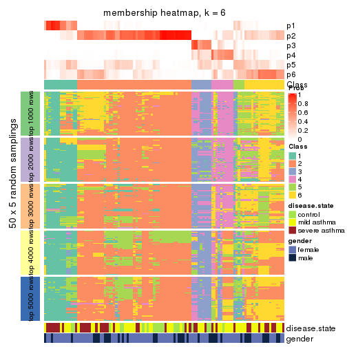</p>

</div>
</div>

As soon as we have had the classes for columns, we can look for signatures
which are significantly different between classes which can be candidate marks
for certain classes. Following are the heatmaps for signatures.


Signature heatmaps where rows are scaled:


<script>
$( function() {
	$( '#tabs-SD-hclust-get-signatures' ).tabs();
} );
</script>
<div id='tabs-SD-hclust-get-signatures'>
<ul>
<li><a href='#tab-SD-hclust-get-signatures-1'>k = 2</a></li>
<li><a href='#tab-SD-hclust-get-signatures-2'>k = 3</a></li>
<li><a href='#tab-SD-hclust-get-signatures-3'>k = 4</a></li>
<li><a href='#tab-SD-hclust-get-signatures-4'>k = 5</a></li>
<li><a href='#tab-SD-hclust-get-signatures-5'>k = 6</a></li>
</ul>
<div id='tab-SD-hclust-get-signatures-1'>
<pre><code class="r">get_signatures(res, k = 2)
</code></pre>

<p></p>

</div>
<div id='tab-SD-hclust-get-signatures-2'>
<pre><code class="r">get_signatures(res, k = 3)
</code></pre>

<p></p>

</div>
<div id='tab-SD-hclust-get-signatures-3'>
<pre><code class="r">get_signatures(res, k = 4)
</code></pre>

<p></p>

</div>
<div id='tab-SD-hclust-get-signatures-4'>
<pre><code class="r">get_signatures(res, k = 5)
</code></pre>

<p></p>

</div>
<div id='tab-SD-hclust-get-signatures-5'>
<pre><code class="r">get_signatures(res, k = 6)
</code></pre>

<p></p>

</div>
</div>


Signature heatmaps where rows are not scaled:


<script>
$( function() {
	$( '#tabs-SD-hclust-get-signatures-no-scale' ).tabs();
} );
</script>
<div id='tabs-SD-hclust-get-signatures-no-scale'>
<ul>
<li><a href='#tab-SD-hclust-get-signatures-no-scale-1'>k = 2</a></li>
<li><a href='#tab-SD-hclust-get-signatures-no-scale-2'>k = 3</a></li>
<li><a href='#tab-SD-hclust-get-signatures-no-scale-3'>k = 4</a></li>
<li><a href='#tab-SD-hclust-get-signatures-no-scale-4'>k = 5</a></li>
<li><a href='#tab-SD-hclust-get-signatures-no-scale-5'>k = 6</a></li>
</ul>
<div id='tab-SD-hclust-get-signatures-no-scale-1'>
<pre><code class="r">get_signatures(res, k = 2, scale_rows = FALSE)
</code></pre>

<p></p>

</div>
<div id='tab-SD-hclust-get-signatures-no-scale-2'>
<pre><code class="r">get_signatures(res, k = 3, scale_rows = FALSE)
</code></pre>

<p></p>

</div>
<div id='tab-SD-hclust-get-signatures-no-scale-3'>
<pre><code class="r">get_signatures(res, k = 4, scale_rows = FALSE)
</code></pre>

<p></p>

</div>
<div id='tab-SD-hclust-get-signatures-no-scale-4'>
<pre><code class="r">get_signatures(res, k = 5, scale_rows = FALSE)
</code></pre>

<p></p>

</div>
<div id='tab-SD-hclust-get-signatures-no-scale-5'>
<pre><code class="r">get_signatures(res, k = 6, scale_rows = FALSE)
</code></pre>

<p></p>

</div>
</div>


Compare the overlap of signatures from different k:

```r
compare_signatures(res)
```


`get_signature()` returns a data frame invisibly. TO get the list of signatures, the function
call should be assigned to a variable explicitly. In following code, if `plot` argument is set
to `FALSE`, no heatmap is plotted while only the differential analysis is performed.

```r
# code only for demonstration
tb = get_signature(res, k = ..., plot = FALSE)
```

An example of the output of `tb` is:

```
#>   which_row         fdr    mean_1    mean_2 scaled_mean_1 scaled_mean_2 km
#> 1        38 0.042760348  8.373488  9.131774    -0.5533452     0.5164555  1
#> 2        40 0.018707592  7.106213  8.469186    -0.6173731     0.5762149  1
#> 3        55 0.019134737 10.221463 11.207825    -0.6159697     0.5749050  1
#> 4        59 0.006059896  5.921854  7.869574    -0.6899429     0.6439467  1
#> 5        60 0.018055526  8.928898 10.211722    -0.6204761     0.5791110  1
#> 6        98 0.009384629 15.714769 14.887706     0.6635654    -0.6193277  2
...
```

The columns in `tb` are:

1. `which_row`: row indices corresponding to the input matrix.
2. `fdr`: FDR for the differential test. 
3. `mean_x`: The mean value in group x.
4. `scaled_mean_x`: The mean value in group x after rows are scaled.
5. `km`: Row groups if k-means clustering is applied to rows.


UMAP plot which shows how samples are separated.


<script>
$( function() {
	$( '#tabs-SD-hclust-dimension-reduction' ).tabs();
} );
</script>
<div id='tabs-SD-hclust-dimension-reduction'>
<ul>
<li><a href='#tab-SD-hclust-dimension-reduction-1'>k = 2</a></li>
<li><a href='#tab-SD-hclust-dimension-reduction-2'>k = 3</a></li>
<li><a href='#tab-SD-hclust-dimension-reduction-3'>k = 4</a></li>
<li><a href='#tab-SD-hclust-dimension-reduction-4'>k = 5</a></li>
<li><a href='#tab-SD-hclust-dimension-reduction-5'>k = 6</a></li>
</ul>
<div id='tab-SD-hclust-dimension-reduction-1'>
<pre><code class="r">dimension_reduction(res, k = 2, method = &quot;UMAP&quot;)
</code></pre>

<p></p>

</div>
<div id='tab-SD-hclust-dimension-reduction-2'>
<pre><code class="r">dimension_reduction(res, k = 3, method = &quot;UMAP&quot;)
</code></pre>

<p></p>

</div>
<div id='tab-SD-hclust-dimension-reduction-3'>
<pre><code class="r">dimension_reduction(res, k = 4, method = &quot;UMAP&quot;)
</code></pre>

<p></p>

</div>
<div id='tab-SD-hclust-dimension-reduction-4'>
<pre><code class="r">dimension_reduction(res, k = 5, method = &quot;UMAP&quot;)
</code></pre>

<p></p>

</div>
<div id='tab-SD-hclust-dimension-reduction-5'>
<pre><code class="r">dimension_reduction(res, k = 6, method = &quot;UMAP&quot;)
</code></pre>

<p></p>

</div>
</div>


Following heatmap shows how subgroups are split when increasing `k`:

```r
collect_classes(res)
```


Test correlation between subgroups and known annotations. If the known
annotation is numeric, one-way ANOVA test is applied, and if the known
annotation is discrete, chi-squared contingency table test is applied.

```r
test_to_known_factors(res)
```

```
#>             n disease.state(p) gender(p) k
#> SD:hclust 100           0.6682     1.000 2
#> SD:hclust  90           0.7785     0.555 3
#> SD:hclust  74           0.3006     0.806 4
#> SD:hclust  74           0.1244     0.454 5
#> SD:hclust  63           0.0158     0.277 6
```


If matrix rows can be associated to genes, consider to use `GO_Enrichment(res,
...)` to perform function enrichment for the signature genes.


 

---------------------------------------------------


### SD:kmeans


The object with results only for a single top-value method and a single partition method 
can be extracted as:

```r
res = res_list["SD", "kmeans"]
# you can also extract it by
# res = res_list["SD:kmeans"]
```

A summary of `res` and all the functions that can be applied to it:

```r
res
```

```
#> A 'ConsensusPartition' object with k = 2, 3, 4, 5, 6.
#>   On a matrix with 38950 rows and 108 columns.
#>   Top rows (1000, 2000, 3000, 4000, 5000) are extracted by 'SD' method.
#>   Subgroups are detected by 'kmeans' method.
#>   Performed in total 1250 partitions by row resampling.
#>   Best k for subgroups seems to be 4.
#> 
#> Following methods can be applied to this 'ConsensusPartition' object:
#>  [1] "cola_report"             "collect_classes"         "collect_plots"          
#>  [4] "collect_stats"           "colnames"                "compare_signatures"     
#>  [7] "consensus_heatmap"       "dimension_reduction"     "functional_enrichment"  
#> [10] "get_anno_col"            "get_anno"                "get_classes"            
#> [13] "get_consensus"           "get_matrix"              "get_membership"         
#> [16] "get_param"               "get_signatures"          "get_stats"              
#> [19] "is_best_k"               "is_stable_k"             "membership_heatmap"     
#> [22] "ncol"                    "nrow"                    "plot_ecdf"              
#> [25] "rownames"                "select_partition_number" "show"                   
#> [28] "suggest_best_k"          "test_to_known_factors"
```

`collect_plots()` function collects all the plots made from `res` for all `k` (number of partitions)
into one single page to provide an easy and fast comparison between different `k`.

```r
collect_plots(res)
```


The plots are:

- The first row: a plot of the ECDF (Empirical cumulative distribution
  function) curves of the consensus matrix for each `k` and the heatmap of
  predicted classes for each `k`.
- The second row: heatmaps of the consensus matrix for each `k`.
- The third row: heatmaps of the membership matrix for each `k`.
- The fouth row: heatmaps of the signatures for each `k`.

All the plots in panels can be made by individual functions and they are
plotted later in this section.

`select_partition_number()` produces several plots showing different
statistics for choosing "optimized" `k`. There are following statistics:

- ECDF curves of the consensus matrix for each `k`;
- 1-PAC. [The PAC
  score](https://en.wikipedia.org/wiki/Consensus_clustering#Over-interpretation_potential_of_consensus_clustering)
  measures the proportion of the ambiguous subgrouping.
- Mean silhouette score.
- Concordance. The mean probability of fiting the consensus class ids in all
  partitions.
- Area increased. Denote $A_k$ as the area under the ECDF curve for current
  `k`, the area increased is defined as $A_k - A_{k-1}$.
- Rand index. The percent of pairs of samples that are both in a same cluster
  or both are not in a same cluster in the partition of k and k-1.
- Jaccard index. The ratio of pairs of samples are both in a same cluster in
  the partition of k and k-1 and the pairs of samples are both in a same
  cluster in the partition k or k-1.

The detailed explanations of these statistics can be found in [the cola
vignette](http://bioconductor.org/packages/devel/bioc/vignettes/cola/inst/doc/cola.html#toc_13).

Generally speaking, lower PAC score, higher mean silhouette score or higher
concordance corresponds to better partition. Rand index and Jaccard index
measure how similar the current partition is compared to partition with `k-1`.
If they are too similar, we won't accept `k` is better than `k-1`.

```r
select_partition_number(res)
```


The numeric values for all these statistics can be obtained by `get_stats()`.

```r
get_stats(res)
```

```
#>   k 1-PAC mean_silhouette concordance area_increased  Rand Jaccard
#> 2 2 0.588           0.770       0.898         0.4447 0.565   0.565
#> 3 3 0.477           0.696       0.839         0.3817 0.733   0.564
#> 4 4 0.698           0.827       0.881         0.1853 0.770   0.483
#> 5 5 0.656           0.631       0.784         0.0752 0.964   0.871
#> 6 6 0.643           0.453       0.678         0.0451 0.928   0.719
```

`suggest_best_k()` suggests the best $k$ based on these statistics. The rules are as follows:

- All $k$ with Jaccard index larger than 0.95 are removed because the increase of
  the partition number does not provides enough extra information. If all $k$ are removed,
  the best $k$ is assigned by `NA`.
- For $k$ with 1-PAC larger than 0.9, the maximal $k$ is taken as the "best k". Other $k$ is called "optional k".
- If it does not fit the second rule. The $k$ with the highest vote of highest
  1-PAC, mean silhouette and concordance is taken as the "best k".

```r
suggest_best_k(res)
```

```
#> [1] 4
```


Following shows the table of the partitions (You need to click the **show/hide
code output** link to see it). The membership matrix (columns with name `p*`)
is inferred by
[`clue::cl_consensus()`](https://www.rdocumentation.org/link/cl_consensus?package=clue)
function with the `SE` method. Basically the value in the membership matrix
represents the probability to belong to a certain group. The finall class
label for an item is determined with the group with highest probability it
belongs to.

In `get_classes()` function, the entropy is calculated from the membership
matrix and the silhouette score is calculated from the consensus matrix.


<script>
$( function() {
	$( '#tabs-SD-kmeans-get-classes' ).tabs();
} );
</script>
<div id='tabs-SD-kmeans-get-classes'>
<ul>
<li><a href='#tab-SD-kmeans-get-classes-1'>k = 2</a></li>
<li><a href='#tab-SD-kmeans-get-classes-2'>k = 3</a></li>
<li><a href='#tab-SD-kmeans-get-classes-3'>k = 4</a></li>
<li><a href='#tab-SD-kmeans-get-classes-4'>k = 5</a></li>
<li><a href='#tab-SD-kmeans-get-classes-5'>k = 6</a></li>
</ul>

<div id='tab-SD-kmeans-get-classes-1'>
<p><a id='tab-SD-kmeans-get-classes-1-a' style='color:#0366d6' href='#'>show/hide code output</a></p>
<pre><code class="r">cbind(get_classes(res, k = 2), get_membership(res, k = 2))
</code></pre>

<pre><code>#&gt;            class entropy silhouette    p1    p2
#&gt; GSM1068478     2  0.9954    -0.1264 0.460 0.540
#&gt; GSM1068479     2  0.9129     0.5184 0.328 0.672
#&gt; GSM1068481     1  0.0672     0.8400 0.992 0.008
#&gt; GSM1068482     1  0.0000     0.8402 1.000 0.000
#&gt; GSM1068483     1  0.8555     0.7124 0.720 0.280
#&gt; GSM1068486     1  0.0672     0.8400 0.992 0.008
#&gt; GSM1068487     2  0.0000     0.8941 0.000 1.000
#&gt; GSM1068488     2  0.9087     0.5264 0.324 0.676
#&gt; GSM1068490     2  0.0000     0.8941 0.000 1.000
#&gt; GSM1068491     1  0.1843     0.8324 0.972 0.028
#&gt; GSM1068492     2  0.9661     0.4068 0.392 0.608
#&gt; GSM1068493     2  0.0672     0.8903 0.008 0.992
#&gt; GSM1068494     1  0.0672     0.8403 0.992 0.008
#&gt; GSM1068495     2  0.0672     0.8917 0.008 0.992
#&gt; GSM1068496     1  0.0000     0.8402 1.000 0.000
#&gt; GSM1068498     2  0.0672     0.8903 0.008 0.992
#&gt; GSM1068499     1  0.2603     0.8346 0.956 0.044
#&gt; GSM1068500     1  0.8144     0.7373 0.748 0.252
#&gt; GSM1068502     2  0.9248     0.4995 0.340 0.660
#&gt; GSM1068503     2  0.0000     0.8941 0.000 1.000
#&gt; GSM1068505     2  0.0672     0.8917 0.008 0.992
#&gt; GSM1068506     2  0.0376     0.8933 0.004 0.996
#&gt; GSM1068507     2  0.0000     0.8941 0.000 1.000
#&gt; GSM1068508     2  0.0672     0.8917 0.008 0.992
#&gt; GSM1068510     2  0.0938     0.8873 0.012 0.988
#&gt; GSM1068512     2  0.9491     0.4411 0.368 0.632
#&gt; GSM1068513     2  0.0000     0.8941 0.000 1.000
#&gt; GSM1068514     2  0.9970     0.2246 0.468 0.532
#&gt; GSM1068517     2  0.0000     0.8941 0.000 1.000
#&gt; GSM1068518     2  0.0672     0.8917 0.008 0.992
#&gt; GSM1068520     1  0.9815     0.4582 0.580 0.420
#&gt; GSM1068521     1  0.9170     0.6409 0.668 0.332
#&gt; GSM1068522     2  0.0000     0.8941 0.000 1.000
#&gt; GSM1068524     2  0.0000     0.8941 0.000 1.000
#&gt; GSM1068527     2  0.0672     0.8917 0.008 0.992
#&gt; GSM1068480     1  0.0672     0.8400 0.992 0.008
#&gt; GSM1068484     2  0.0000     0.8941 0.000 1.000
#&gt; GSM1068485     1  0.0672     0.8400 0.992 0.008
#&gt; GSM1068489     2  0.0376     0.8933 0.004 0.996
#&gt; GSM1068497     2  0.0672     0.8903 0.008 0.992
#&gt; GSM1068501     2  0.0000     0.8941 0.000 1.000
#&gt; GSM1068504     2  0.0000     0.8941 0.000 1.000
#&gt; GSM1068509     1  0.8713     0.6992 0.708 0.292
#&gt; GSM1068511     1  0.6973     0.7628 0.812 0.188
#&gt; GSM1068515     2  0.9909    -0.0849 0.444 0.556
#&gt; GSM1068516     2  0.0000     0.8941 0.000 1.000
#&gt; GSM1068519     1  0.8499     0.7157 0.724 0.276
#&gt; GSM1068523     2  0.0000     0.8941 0.000 1.000
#&gt; GSM1068525     2  0.0000     0.8941 0.000 1.000
#&gt; GSM1068526     2  0.0376     0.8933 0.004 0.996
#&gt; GSM1068458     1  0.9170     0.6409 0.668 0.332
#&gt; GSM1068459     1  0.0000     0.8402 1.000 0.000
#&gt; GSM1068460     2  0.0672     0.8917 0.008 0.992
#&gt; GSM1068461     1  0.0672     0.8400 0.992 0.008
#&gt; GSM1068464     2  0.0000     0.8941 0.000 1.000
#&gt; GSM1068468     2  0.0000     0.8941 0.000 1.000
#&gt; GSM1068472     2  0.0000     0.8941 0.000 1.000
#&gt; GSM1068473     2  0.0000     0.8941 0.000 1.000
#&gt; GSM1068474     2  0.0000     0.8941 0.000 1.000
#&gt; GSM1068476     1  0.7453     0.6446 0.788 0.212
#&gt; GSM1068477     2  0.0000     0.8941 0.000 1.000
#&gt; GSM1068462     2  0.0000     0.8941 0.000 1.000
#&gt; GSM1068463     1  0.0376     0.8400 0.996 0.004
#&gt; GSM1068465     2  0.1184     0.8869 0.016 0.984
#&gt; GSM1068466     1  0.9286     0.6196 0.656 0.344
#&gt; GSM1068467     2  0.0000     0.8941 0.000 1.000
#&gt; GSM1068469     2  0.0672     0.8903 0.008 0.992
#&gt; GSM1068470     2  0.0000     0.8941 0.000 1.000
#&gt; GSM1068471     2  0.0000     0.8941 0.000 1.000
#&gt; GSM1068475     2  0.0000     0.8941 0.000 1.000
#&gt; GSM1068528     1  0.0000     0.8402 1.000 0.000
#&gt; GSM1068531     1  0.8763     0.6947 0.704 0.296
#&gt; GSM1068532     1  0.0000     0.8402 1.000 0.000
#&gt; GSM1068533     1  0.7139     0.7726 0.804 0.196
#&gt; GSM1068535     1  0.7883     0.7477 0.764 0.236
#&gt; GSM1068537     1  0.3431     0.8286 0.936 0.064
#&gt; GSM1068538     1  0.0000     0.8402 1.000 0.000
#&gt; GSM1068539     2  0.0672     0.8917 0.008 0.992
#&gt; GSM1068540     1  0.8763     0.6947 0.704 0.296
#&gt; GSM1068542     2  0.0672     0.8917 0.008 0.992
#&gt; GSM1068543     2  0.9580     0.4368 0.380 0.620
#&gt; GSM1068544     1  0.0000     0.8402 1.000 0.000
#&gt; GSM1068545     2  0.0376     0.8933 0.004 0.996
#&gt; GSM1068546     1  0.0672     0.8400 0.992 0.008
#&gt; GSM1068547     2  0.9963    -0.1413 0.464 0.536
#&gt; GSM1068548     2  0.0672     0.8917 0.008 0.992
#&gt; GSM1068549     1  0.0672     0.8400 0.992 0.008
#&gt; GSM1068550     2  0.0672     0.8917 0.008 0.992
#&gt; GSM1068551     2  0.0000     0.8941 0.000 1.000
#&gt; GSM1068552     2  0.0376     0.8933 0.004 0.996
#&gt; GSM1068555     2  0.0000     0.8941 0.000 1.000
#&gt; GSM1068556     2  0.9427     0.4725 0.360 0.640
#&gt; GSM1068557     2  0.0000     0.8941 0.000 1.000
#&gt; GSM1068560     2  0.0672     0.8917 0.008 0.992
#&gt; GSM1068561     2  0.0000     0.8941 0.000 1.000
#&gt; GSM1068562     2  0.0376     0.8933 0.004 0.996
#&gt; GSM1068563     2  0.2043     0.8739 0.032 0.968
#&gt; GSM1068565     2  0.0000     0.8941 0.000 1.000
#&gt; GSM1068529     2  0.9866     0.3203 0.432 0.568
#&gt; GSM1068530     1  0.8763     0.6947 0.704 0.296
#&gt; GSM1068534     2  0.8813     0.5613 0.300 0.700
#&gt; GSM1068536     2  0.1184     0.8869 0.016 0.984
#&gt; GSM1068541     2  0.0376     0.8933 0.004 0.996
#&gt; GSM1068553     2  0.7219     0.6928 0.200 0.800
#&gt; GSM1068554     2  0.0938     0.8873 0.012 0.988
#&gt; GSM1068558     2  0.9850     0.3296 0.428 0.572
#&gt; GSM1068559     2  0.9988     0.1891 0.480 0.520
#&gt; GSM1068564     2  0.0376     0.8933 0.004 0.996
</code></pre>

<script>
$('#tab-SD-kmeans-get-classes-1-a').parent().next().next().hide();
$('#tab-SD-kmeans-get-classes-1-a').click(function(){
  $('#tab-SD-kmeans-get-classes-1-a').parent().next().next().toggle();
  return(false);
});
</script>
</div>

<div id='tab-SD-kmeans-get-classes-2'>
<p><a id='tab-SD-kmeans-get-classes-2-a' style='color:#0366d6' href='#'>show/hide code output</a></p>
<pre><code class="r">cbind(get_classes(res, k = 3), get_membership(res, k = 3))
</code></pre>

<pre><code>#&gt;            class entropy silhouette    p1    p2    p3
#&gt; GSM1068478     1  0.4399      0.681 0.812 0.188 0.000
#&gt; GSM1068479     3  0.5678      0.611 0.000 0.316 0.684
#&gt; GSM1068481     3  0.3192      0.835 0.112 0.000 0.888
#&gt; GSM1068482     3  0.3267      0.834 0.116 0.000 0.884
#&gt; GSM1068483     1  0.1170      0.819 0.976 0.008 0.016
#&gt; GSM1068486     3  0.3192      0.835 0.112 0.000 0.888
#&gt; GSM1068487     2  0.0592      0.796 0.000 0.988 0.012
#&gt; GSM1068488     2  0.9095      0.333 0.376 0.480 0.144
#&gt; GSM1068490     2  0.0592      0.796 0.000 0.988 0.012
#&gt; GSM1068491     3  0.3129      0.830 0.088 0.008 0.904
#&gt; GSM1068492     3  0.5247      0.634 0.008 0.224 0.768
#&gt; GSM1068493     2  0.1620      0.788 0.012 0.964 0.024
#&gt; GSM1068494     1  0.3116      0.771 0.892 0.000 0.108
#&gt; GSM1068495     2  0.5519      0.750 0.120 0.812 0.068
#&gt; GSM1068496     1  0.2261      0.777 0.932 0.000 0.068
#&gt; GSM1068498     2  0.5591      0.408 0.304 0.696 0.000
#&gt; GSM1068499     1  0.1643      0.810 0.956 0.000 0.044
#&gt; GSM1068500     1  0.1170      0.819 0.976 0.008 0.016
#&gt; GSM1068502     3  0.5845      0.616 0.004 0.308 0.688
#&gt; GSM1068503     2  0.0592      0.796 0.000 0.988 0.012
#&gt; GSM1068505     2  0.7848      0.596 0.264 0.640 0.096
#&gt; GSM1068506     2  0.7059      0.678 0.192 0.716 0.092
#&gt; GSM1068507     2  0.7807      0.630 0.236 0.656 0.108
#&gt; GSM1068508     2  0.0237      0.797 0.004 0.996 0.000
#&gt; GSM1068510     2  0.4683      0.769 0.024 0.836 0.140
#&gt; GSM1068512     1  0.8666      0.177 0.544 0.336 0.120
#&gt; GSM1068513     2  0.0592      0.796 0.000 0.988 0.012
#&gt; GSM1068514     3  0.5678      0.633 0.032 0.192 0.776
#&gt; GSM1068517     2  0.4887      0.555 0.228 0.772 0.000
#&gt; GSM1068518     2  0.8569      0.361 0.392 0.508 0.100
#&gt; GSM1068520     1  0.0983      0.821 0.980 0.016 0.004
#&gt; GSM1068521     1  0.0661      0.822 0.988 0.004 0.008
#&gt; GSM1068522     2  0.0747      0.796 0.000 0.984 0.016
#&gt; GSM1068524     2  0.1031      0.797 0.000 0.976 0.024
#&gt; GSM1068527     1  0.8173      0.317 0.600 0.300 0.100
#&gt; GSM1068480     3  0.3116      0.834 0.108 0.000 0.892
#&gt; GSM1068484     2  0.4449      0.772 0.040 0.860 0.100
#&gt; GSM1068485     3  0.3192      0.835 0.112 0.000 0.888
#&gt; GSM1068489     2  0.7851      0.604 0.256 0.644 0.100
#&gt; GSM1068497     2  0.4931      0.548 0.232 0.768 0.000
#&gt; GSM1068501     2  0.5467      0.761 0.072 0.816 0.112
#&gt; GSM1068504     2  0.0592      0.796 0.000 0.988 0.012
#&gt; GSM1068509     1  0.1643      0.809 0.956 0.000 0.044
#&gt; GSM1068511     1  0.8965      0.434 0.564 0.196 0.240
#&gt; GSM1068515     1  0.6062      0.327 0.616 0.384 0.000
#&gt; GSM1068516     2  0.6920      0.698 0.164 0.732 0.104
#&gt; GSM1068519     1  0.0829      0.822 0.984 0.004 0.012
#&gt; GSM1068523     2  0.0237      0.797 0.004 0.996 0.000
#&gt; GSM1068525     2  0.3690      0.778 0.016 0.884 0.100
#&gt; GSM1068526     2  0.8009      0.578 0.276 0.624 0.100
#&gt; GSM1068458     1  0.0661      0.822 0.988 0.004 0.008
#&gt; GSM1068459     3  0.3267      0.834 0.116 0.000 0.884
#&gt; GSM1068460     1  0.4075      0.774 0.880 0.048 0.072
#&gt; GSM1068461     3  0.3192      0.835 0.112 0.000 0.888
#&gt; GSM1068464     2  0.0592      0.796 0.000 0.988 0.012
#&gt; GSM1068468     2  0.1015      0.795 0.008 0.980 0.012
#&gt; GSM1068472     2  0.1015      0.795 0.008 0.980 0.012
#&gt; GSM1068473     2  0.0592      0.796 0.000 0.988 0.012
#&gt; GSM1068474     2  0.0829      0.795 0.004 0.984 0.012
#&gt; GSM1068476     3  0.2486      0.821 0.060 0.008 0.932
#&gt; GSM1068477     2  0.0829      0.795 0.004 0.984 0.012
#&gt; GSM1068462     2  0.1015      0.795 0.008 0.980 0.012
#&gt; GSM1068463     3  0.3267      0.834 0.116 0.000 0.884
#&gt; GSM1068465     1  0.5346      0.722 0.808 0.152 0.040
#&gt; GSM1068466     1  0.0829      0.822 0.984 0.012 0.004
#&gt; GSM1068467     2  0.1015      0.795 0.008 0.980 0.012
#&gt; GSM1068469     2  0.5450      0.553 0.228 0.760 0.012
#&gt; GSM1068470     2  0.0237      0.797 0.004 0.996 0.000
#&gt; GSM1068471     2  0.0829      0.795 0.004 0.984 0.012
#&gt; GSM1068475     2  0.0829      0.795 0.004 0.984 0.012
#&gt; GSM1068528     1  0.5098      0.479 0.752 0.000 0.248
#&gt; GSM1068531     1  0.0424      0.821 0.992 0.000 0.008
#&gt; GSM1068532     1  0.0892      0.817 0.980 0.000 0.020
#&gt; GSM1068533     1  0.0892      0.817 0.980 0.000 0.020
#&gt; GSM1068535     1  0.7926      0.477 0.656 0.216 0.128
#&gt; GSM1068537     1  0.0892      0.817 0.980 0.000 0.020
#&gt; GSM1068538     1  0.0892      0.817 0.980 0.000 0.020
#&gt; GSM1068539     2  0.4642      0.773 0.084 0.856 0.060
#&gt; GSM1068540     1  0.0237      0.822 0.996 0.000 0.004
#&gt; GSM1068542     2  0.8204      0.519 0.316 0.588 0.096
#&gt; GSM1068543     2  0.8975      0.325 0.384 0.484 0.132
#&gt; GSM1068544     3  0.3482      0.824 0.128 0.000 0.872
#&gt; GSM1068545     2  0.2564      0.793 0.036 0.936 0.028
#&gt; GSM1068546     3  0.3192      0.835 0.112 0.000 0.888
#&gt; GSM1068547     1  0.2527      0.800 0.936 0.020 0.044
#&gt; GSM1068548     2  0.8499      0.371 0.388 0.516 0.096
#&gt; GSM1068549     3  0.3192      0.835 0.112 0.000 0.888
#&gt; GSM1068550     2  0.8055      0.558 0.292 0.612 0.096
#&gt; GSM1068551     2  0.0237      0.797 0.004 0.996 0.000
#&gt; GSM1068552     2  0.5737      0.746 0.104 0.804 0.092
#&gt; GSM1068555     2  0.0237      0.797 0.004 0.996 0.000
#&gt; GSM1068556     2  0.8878      0.339 0.384 0.492 0.124
#&gt; GSM1068557     2  0.1015      0.795 0.008 0.980 0.012
#&gt; GSM1068560     2  0.8559      0.367 0.388 0.512 0.100
#&gt; GSM1068561     2  0.2773      0.792 0.024 0.928 0.048
#&gt; GSM1068562     2  0.8014      0.586 0.268 0.628 0.104
#&gt; GSM1068563     2  0.8186      0.551 0.292 0.604 0.104
#&gt; GSM1068565     2  0.0475      0.797 0.004 0.992 0.004
#&gt; GSM1068529     3  0.7095      0.420 0.048 0.292 0.660
#&gt; GSM1068530     1  0.0424      0.821 0.992 0.000 0.008
#&gt; GSM1068534     1  0.9151     -0.181 0.436 0.420 0.144
#&gt; GSM1068536     1  0.4121      0.769 0.876 0.040 0.084
#&gt; GSM1068541     2  0.4874      0.748 0.144 0.828 0.028
#&gt; GSM1068553     2  0.8936      0.324 0.388 0.484 0.128
#&gt; GSM1068554     2  0.6349      0.739 0.092 0.768 0.140
#&gt; GSM1068558     3  0.2492      0.755 0.016 0.048 0.936
#&gt; GSM1068559     3  0.5678      0.633 0.032 0.192 0.776
#&gt; GSM1068564     2  0.3445      0.783 0.016 0.896 0.088
</code></pre>

<script>
$('#tab-SD-kmeans-get-classes-2-a').parent().next().next().hide();
$('#tab-SD-kmeans-get-classes-2-a').click(function(){
  $('#tab-SD-kmeans-get-classes-2-a').parent().next().next().toggle();
  return(false);
});
</script>
</div>

<div id='tab-SD-kmeans-get-classes-3'>
<p><a id='tab-SD-kmeans-get-classes-3-a' style='color:#0366d6' href='#'>show/hide code output</a></p>
<pre><code class="r">cbind(get_classes(res, k = 4), get_membership(res, k = 4))
</code></pre>

<pre><code>#&gt;            class entropy silhouette    p1    p2    p3    p4
#&gt; GSM1068478     1  0.4239      0.821 0.812 0.152 0.004 0.032
#&gt; GSM1068479     3  0.6438      0.161 0.000 0.436 0.496 0.068
#&gt; GSM1068481     3  0.1406      0.899 0.024 0.000 0.960 0.016
#&gt; GSM1068482     3  0.1297      0.900 0.020 0.000 0.964 0.016
#&gt; GSM1068483     1  0.2261      0.907 0.932 0.036 0.008 0.024
#&gt; GSM1068486     3  0.0657      0.902 0.012 0.000 0.984 0.004
#&gt; GSM1068487     2  0.1824      0.904 0.000 0.936 0.004 0.060
#&gt; GSM1068488     4  0.2131      0.863 0.008 0.040 0.016 0.936
#&gt; GSM1068490     2  0.1637      0.905 0.000 0.940 0.000 0.060
#&gt; GSM1068491     3  0.1229      0.895 0.004 0.008 0.968 0.020
#&gt; GSM1068492     4  0.5564      0.245 0.000 0.020 0.436 0.544
#&gt; GSM1068493     2  0.2352      0.873 0.016 0.928 0.012 0.044
#&gt; GSM1068494     4  0.4354      0.799 0.108 0.032 0.028 0.832
#&gt; GSM1068495     2  0.6227      0.316 0.052 0.572 0.004 0.372
#&gt; GSM1068496     1  0.4327      0.850 0.836 0.028 0.036 0.100
#&gt; GSM1068498     2  0.2360      0.856 0.052 0.924 0.004 0.020
#&gt; GSM1068499     1  0.4484      0.836 0.816 0.032 0.020 0.132
#&gt; GSM1068500     1  0.2269      0.908 0.932 0.032 0.008 0.028
#&gt; GSM1068502     3  0.6451      0.260 0.000 0.404 0.524 0.072
#&gt; GSM1068503     2  0.1824      0.904 0.000 0.936 0.004 0.060
#&gt; GSM1068505     4  0.4583      0.845 0.112 0.076 0.004 0.808
#&gt; GSM1068506     4  0.3598      0.846 0.028 0.124 0.000 0.848
#&gt; GSM1068507     4  0.5690      0.756 0.084 0.196 0.004 0.716
#&gt; GSM1068508     2  0.2335      0.898 0.020 0.920 0.000 0.060
#&gt; GSM1068510     4  0.3224      0.850 0.000 0.120 0.016 0.864
#&gt; GSM1068512     4  0.3400      0.861 0.044 0.068 0.008 0.880
#&gt; GSM1068513     2  0.1824      0.904 0.000 0.936 0.004 0.060
#&gt; GSM1068514     4  0.5108      0.543 0.000 0.020 0.308 0.672
#&gt; GSM1068517     2  0.2189      0.864 0.044 0.932 0.004 0.020
#&gt; GSM1068518     4  0.3439      0.850 0.048 0.084 0.000 0.868
#&gt; GSM1068520     1  0.0895      0.913 0.976 0.020 0.000 0.004
#&gt; GSM1068521     1  0.1406      0.913 0.960 0.016 0.000 0.024
#&gt; GSM1068522     2  0.2164      0.900 0.004 0.924 0.004 0.068
#&gt; GSM1068524     2  0.3196      0.853 0.000 0.856 0.008 0.136
#&gt; GSM1068527     4  0.4150      0.845 0.120 0.056 0.000 0.824
#&gt; GSM1068480     3  0.1635      0.887 0.008 0.000 0.948 0.044
#&gt; GSM1068484     4  0.2048      0.868 0.008 0.064 0.000 0.928
#&gt; GSM1068485     3  0.0895      0.902 0.020 0.000 0.976 0.004
#&gt; GSM1068489     4  0.3127      0.869 0.032 0.068 0.008 0.892
#&gt; GSM1068497     2  0.2189      0.864 0.044 0.932 0.004 0.020
#&gt; GSM1068501     4  0.3695      0.853 0.028 0.108 0.008 0.856
#&gt; GSM1068504     2  0.1637      0.905 0.000 0.940 0.000 0.060
#&gt; GSM1068509     1  0.5022      0.755 0.736 0.044 0.000 0.220
#&gt; GSM1068511     4  0.2895      0.841 0.016 0.032 0.044 0.908
#&gt; GSM1068515     1  0.5522      0.633 0.668 0.288 0.000 0.044
#&gt; GSM1068516     4  0.3027      0.859 0.020 0.088 0.004 0.888
#&gt; GSM1068519     1  0.1847      0.906 0.940 0.004 0.004 0.052
#&gt; GSM1068523     2  0.1661      0.904 0.000 0.944 0.004 0.052
#&gt; GSM1068525     4  0.2010      0.867 0.004 0.060 0.004 0.932
#&gt; GSM1068526     4  0.2919      0.869 0.044 0.060 0.000 0.896
#&gt; GSM1068458     1  0.1174      0.912 0.968 0.020 0.000 0.012
#&gt; GSM1068459     3  0.1510      0.898 0.028 0.000 0.956 0.016
#&gt; GSM1068460     1  0.1624      0.909 0.952 0.028 0.000 0.020
#&gt; GSM1068461     3  0.0804      0.901 0.012 0.000 0.980 0.008
#&gt; GSM1068464     2  0.1557      0.905 0.000 0.944 0.000 0.056
#&gt; GSM1068468     2  0.0657      0.894 0.004 0.984 0.000 0.012
#&gt; GSM1068472     2  0.0657      0.896 0.004 0.984 0.000 0.012
#&gt; GSM1068473     2  0.1824      0.904 0.000 0.936 0.004 0.060
#&gt; GSM1068474     2  0.1557      0.905 0.000 0.944 0.000 0.056
#&gt; GSM1068476     3  0.1339      0.893 0.004 0.008 0.964 0.024
#&gt; GSM1068477     2  0.1389      0.906 0.000 0.952 0.000 0.048
#&gt; GSM1068462     2  0.1593      0.877 0.004 0.956 0.016 0.024
#&gt; GSM1068463     3  0.1510      0.898 0.028 0.000 0.956 0.016
#&gt; GSM1068465     1  0.4155      0.848 0.828 0.100 0.000 0.072
#&gt; GSM1068466     1  0.1042      0.912 0.972 0.020 0.000 0.008
#&gt; GSM1068467     2  0.0524      0.894 0.004 0.988 0.000 0.008
#&gt; GSM1068469     2  0.1798      0.867 0.040 0.944 0.000 0.016
#&gt; GSM1068470     2  0.1902      0.905 0.000 0.932 0.004 0.064
#&gt; GSM1068471     2  0.1557      0.905 0.000 0.944 0.000 0.056
#&gt; GSM1068475     2  0.1474      0.905 0.000 0.948 0.000 0.052
#&gt; GSM1068528     1  0.4114      0.777 0.812 0.008 0.164 0.016
#&gt; GSM1068531     1  0.0336      0.911 0.992 0.000 0.000 0.008
#&gt; GSM1068532     1  0.1624      0.899 0.952 0.000 0.020 0.028
#&gt; GSM1068533     1  0.1042      0.904 0.972 0.000 0.008 0.020
#&gt; GSM1068535     4  0.5379      0.687 0.264 0.016 0.020 0.700
#&gt; GSM1068537     1  0.1174      0.901 0.968 0.000 0.012 0.020
#&gt; GSM1068538     1  0.1174      0.901 0.968 0.000 0.012 0.020
#&gt; GSM1068539     2  0.6227      0.316 0.052 0.572 0.004 0.372
#&gt; GSM1068540     1  0.0895      0.912 0.976 0.004 0.000 0.020
#&gt; GSM1068542     4  0.4254      0.851 0.104 0.064 0.004 0.828
#&gt; GSM1068543     4  0.2307      0.869 0.016 0.048 0.008 0.928
#&gt; GSM1068544     3  0.1706      0.893 0.036 0.000 0.948 0.016
#&gt; GSM1068545     2  0.4795      0.632 0.012 0.696 0.000 0.292
#&gt; GSM1068546     3  0.1388      0.897 0.012 0.000 0.960 0.028
#&gt; GSM1068547     1  0.1182      0.913 0.968 0.016 0.000 0.016
#&gt; GSM1068548     4  0.4663      0.831 0.148 0.064 0.000 0.788
#&gt; GSM1068549     3  0.0804      0.900 0.008 0.000 0.980 0.012
#&gt; GSM1068550     4  0.3320      0.866 0.056 0.068 0.000 0.876
#&gt; GSM1068551     2  0.1902      0.905 0.000 0.932 0.004 0.064
#&gt; GSM1068552     4  0.3970      0.845 0.036 0.124 0.004 0.836
#&gt; GSM1068555     2  0.1661      0.903 0.000 0.944 0.004 0.052
#&gt; GSM1068556     4  0.2421      0.868 0.020 0.048 0.008 0.924
#&gt; GSM1068557     2  0.1543      0.889 0.008 0.956 0.004 0.032
#&gt; GSM1068560     4  0.3168      0.867 0.060 0.056 0.000 0.884
#&gt; GSM1068561     2  0.4128      0.760 0.020 0.808 0.004 0.168
#&gt; GSM1068562     4  0.1722      0.868 0.008 0.048 0.000 0.944
#&gt; GSM1068563     4  0.2542      0.866 0.012 0.084 0.000 0.904
#&gt; GSM1068565     2  0.1557      0.905 0.000 0.944 0.000 0.056
#&gt; GSM1068529     4  0.3325      0.828 0.008 0.044 0.064 0.884
#&gt; GSM1068530     1  0.0336      0.909 0.992 0.000 0.000 0.008
#&gt; GSM1068534     4  0.2804      0.852 0.016 0.060 0.016 0.908
#&gt; GSM1068536     1  0.3836      0.856 0.852 0.052 0.004 0.092
#&gt; GSM1068541     2  0.5102      0.706 0.064 0.748 0.000 0.188
#&gt; GSM1068553     4  0.4061      0.853 0.092 0.044 0.016 0.848
#&gt; GSM1068554     4  0.3820      0.857 0.028 0.100 0.016 0.856
#&gt; GSM1068558     4  0.5138      0.371 0.000 0.008 0.392 0.600
#&gt; GSM1068559     4  0.5527      0.445 0.000 0.028 0.356 0.616
#&gt; GSM1068564     4  0.4747      0.710 0.016 0.244 0.004 0.736
</code></pre>

<script>
$('#tab-SD-kmeans-get-classes-3-a').parent().next().next().hide();
$('#tab-SD-kmeans-get-classes-3-a').click(function(){
  $('#tab-SD-kmeans-get-classes-3-a').parent().next().next().toggle();
  return(false);
});
</script>
</div>

<div id='tab-SD-kmeans-get-classes-4'>
<p><a id='tab-SD-kmeans-get-classes-4-a' style='color:#0366d6' href='#'>show/hide code output</a></p>
<pre><code class="r">cbind(get_classes(res, k = 5), get_membership(res, k = 5))
</code></pre>

<pre><code>#&gt;            class entropy silhouette    p1    p2    p3    p4    p5
#&gt; GSM1068478     1  0.5957     0.4136 0.508 0.068 0.000 0.016 0.408
#&gt; GSM1068479     2  0.7651    -0.0264 0.000 0.420 0.348 0.112 0.120
#&gt; GSM1068481     3  0.1197     0.9352 0.000 0.000 0.952 0.000 0.048
#&gt; GSM1068482     3  0.2110     0.9231 0.016 0.000 0.912 0.000 0.072
#&gt; GSM1068483     1  0.3742     0.7723 0.792 0.012 0.000 0.012 0.184
#&gt; GSM1068486     3  0.0000     0.9362 0.000 0.000 1.000 0.000 0.000
#&gt; GSM1068487     2  0.0324     0.6855 0.000 0.992 0.000 0.004 0.004
#&gt; GSM1068488     4  0.2011     0.6945 0.000 0.004 0.000 0.908 0.088
#&gt; GSM1068490     2  0.0324     0.6855 0.000 0.992 0.000 0.004 0.004
#&gt; GSM1068491     3  0.1965     0.8987 0.000 0.000 0.904 0.000 0.096
#&gt; GSM1068492     4  0.6377     0.3674 0.000 0.008 0.288 0.540 0.164
#&gt; GSM1068493     2  0.4994     0.2249 0.020 0.604 0.000 0.012 0.364
#&gt; GSM1068494     4  0.4686     0.5551 0.092 0.004 0.004 0.756 0.144
#&gt; GSM1068495     5  0.6757     0.7126 0.020 0.184 0.000 0.280 0.516
#&gt; GSM1068496     1  0.5476     0.6705 0.676 0.004 0.016 0.072 0.232
#&gt; GSM1068498     2  0.4909     0.2318 0.032 0.588 0.000 0.000 0.380
#&gt; GSM1068499     1  0.5960     0.6236 0.624 0.004 0.004 0.164 0.204
#&gt; GSM1068500     1  0.4048     0.7594 0.764 0.012 0.000 0.016 0.208
#&gt; GSM1068502     2  0.7964    -0.1238 0.000 0.372 0.352 0.132 0.144
#&gt; GSM1068503     2  0.2304     0.6031 0.000 0.892 0.000 0.008 0.100
#&gt; GSM1068505     4  0.5181     0.6245 0.032 0.028 0.000 0.668 0.272
#&gt; GSM1068506     4  0.5190     0.5903 0.000 0.096 0.000 0.668 0.236
#&gt; GSM1068507     4  0.6567     0.3971 0.008 0.240 0.000 0.524 0.228
#&gt; GSM1068508     2  0.4207     0.4625 0.008 0.708 0.000 0.008 0.276
#&gt; GSM1068510     4  0.5287     0.6137 0.000 0.092 0.000 0.648 0.260
#&gt; GSM1068512     4  0.1628     0.6952 0.000 0.008 0.000 0.936 0.056
#&gt; GSM1068513     2  0.2233     0.6105 0.000 0.892 0.000 0.004 0.104
#&gt; GSM1068514     4  0.5831     0.4511 0.000 0.000 0.236 0.604 0.160
#&gt; GSM1068517     2  0.4909     0.2318 0.032 0.588 0.000 0.000 0.380
#&gt; GSM1068518     4  0.3234     0.6398 0.012 0.008 0.000 0.836 0.144
#&gt; GSM1068520     1  0.2462     0.8012 0.880 0.000 0.000 0.008 0.112
#&gt; GSM1068521     1  0.3002     0.7987 0.856 0.000 0.000 0.028 0.116
#&gt; GSM1068522     2  0.4605     0.3336 0.000 0.732 0.000 0.076 0.192
#&gt; GSM1068524     2  0.2914     0.6068 0.000 0.872 0.000 0.076 0.052
#&gt; GSM1068527     4  0.3849     0.6722 0.052 0.004 0.000 0.808 0.136
#&gt; GSM1068480     3  0.1981     0.8976 0.000 0.000 0.924 0.048 0.028
#&gt; GSM1068484     4  0.1251     0.7043 0.000 0.008 0.000 0.956 0.036
#&gt; GSM1068485     3  0.0609     0.9377 0.000 0.000 0.980 0.000 0.020
#&gt; GSM1068489     4  0.3815     0.6783 0.004 0.012 0.000 0.764 0.220
#&gt; GSM1068497     2  0.4886     0.2480 0.032 0.596 0.000 0.000 0.372
#&gt; GSM1068501     4  0.5330     0.6120 0.004 0.072 0.000 0.636 0.288
#&gt; GSM1068504     2  0.0162     0.6864 0.000 0.996 0.000 0.004 0.000
#&gt; GSM1068509     1  0.6023     0.5749 0.600 0.004 0.000 0.208 0.188
#&gt; GSM1068511     4  0.2462     0.6894 0.000 0.000 0.008 0.880 0.112
#&gt; GSM1068515     1  0.6624     0.3950 0.516 0.164 0.000 0.016 0.304
#&gt; GSM1068516     4  0.2358     0.6798 0.000 0.008 0.000 0.888 0.104
#&gt; GSM1068519     1  0.3336     0.7892 0.844 0.000 0.000 0.060 0.096
#&gt; GSM1068523     2  0.3231     0.5946 0.000 0.800 0.000 0.004 0.196
#&gt; GSM1068525     4  0.1830     0.6950 0.000 0.008 0.000 0.924 0.068
#&gt; GSM1068526     4  0.3821     0.6677 0.000 0.020 0.000 0.764 0.216
#&gt; GSM1068458     1  0.2124     0.8031 0.900 0.000 0.000 0.004 0.096
#&gt; GSM1068459     3  0.2110     0.9231 0.016 0.000 0.912 0.000 0.072
#&gt; GSM1068460     1  0.3519     0.7585 0.776 0.000 0.000 0.008 0.216
#&gt; GSM1068461     3  0.0404     0.9354 0.000 0.000 0.988 0.000 0.012
#&gt; GSM1068464     2  0.0324     0.6859 0.000 0.992 0.000 0.004 0.004
#&gt; GSM1068468     2  0.2439     0.6468 0.004 0.876 0.000 0.000 0.120
#&gt; GSM1068472     2  0.2763     0.6210 0.004 0.848 0.000 0.000 0.148
#&gt; GSM1068473     2  0.0324     0.6855 0.000 0.992 0.000 0.004 0.004
#&gt; GSM1068474     2  0.0162     0.6864 0.000 0.996 0.000 0.004 0.000
#&gt; GSM1068476     3  0.2020     0.8987 0.000 0.000 0.900 0.000 0.100
#&gt; GSM1068477     2  0.1365     0.6861 0.004 0.952 0.000 0.004 0.040
#&gt; GSM1068462     2  0.2763     0.6210 0.004 0.848 0.000 0.000 0.148
#&gt; GSM1068463     3  0.2110     0.9231 0.016 0.000 0.912 0.000 0.072
#&gt; GSM1068465     1  0.5328     0.6034 0.604 0.036 0.000 0.016 0.344
#&gt; GSM1068466     1  0.2389     0.8009 0.880 0.000 0.000 0.004 0.116
#&gt; GSM1068467     2  0.2439     0.6459 0.004 0.876 0.000 0.000 0.120
#&gt; GSM1068469     2  0.3912     0.5013 0.020 0.752 0.000 0.000 0.228
#&gt; GSM1068470     2  0.2763     0.6312 0.000 0.848 0.000 0.004 0.148
#&gt; GSM1068471     2  0.0162     0.6864 0.000 0.996 0.000 0.004 0.000
#&gt; GSM1068475     2  0.0955     0.6847 0.000 0.968 0.000 0.004 0.028
#&gt; GSM1068528     1  0.5121     0.6642 0.708 0.004 0.152 0.000 0.136
#&gt; GSM1068531     1  0.1082     0.7967 0.964 0.000 0.000 0.008 0.028
#&gt; GSM1068532     1  0.1831     0.7747 0.920 0.000 0.000 0.004 0.076
#&gt; GSM1068533     1  0.1041     0.7980 0.964 0.000 0.000 0.004 0.032
#&gt; GSM1068535     4  0.6124     0.5337 0.200 0.000 0.000 0.564 0.236
#&gt; GSM1068537     1  0.1205     0.7863 0.956 0.000 0.000 0.004 0.040
#&gt; GSM1068538     1  0.1704     0.7764 0.928 0.000 0.000 0.004 0.068
#&gt; GSM1068539     5  0.6797     0.7145 0.020 0.188 0.000 0.284 0.508
#&gt; GSM1068540     1  0.1893     0.8042 0.928 0.000 0.000 0.024 0.048
#&gt; GSM1068542     4  0.4364     0.6564 0.020 0.016 0.000 0.740 0.224
#&gt; GSM1068543     4  0.0451     0.7075 0.000 0.004 0.000 0.988 0.008
#&gt; GSM1068544     3  0.2694     0.9038 0.040 0.000 0.884 0.000 0.076
#&gt; GSM1068545     2  0.6731    -0.3543 0.000 0.416 0.000 0.280 0.304
#&gt; GSM1068546     3  0.1430     0.9231 0.000 0.000 0.944 0.004 0.052
#&gt; GSM1068547     1  0.2304     0.8038 0.892 0.000 0.000 0.008 0.100
#&gt; GSM1068548     4  0.5209     0.6353 0.076 0.016 0.000 0.700 0.208
#&gt; GSM1068549     3  0.1121     0.9265 0.000 0.000 0.956 0.000 0.044
#&gt; GSM1068550     4  0.4188     0.6576 0.008 0.020 0.000 0.744 0.228
#&gt; GSM1068551     2  0.2583     0.6418 0.000 0.864 0.000 0.004 0.132
#&gt; GSM1068552     4  0.5715     0.5191 0.000 0.152 0.000 0.620 0.228
#&gt; GSM1068555     2  0.3196     0.5992 0.000 0.804 0.000 0.004 0.192
#&gt; GSM1068556     4  0.0955     0.7094 0.000 0.004 0.000 0.968 0.028
#&gt; GSM1068557     2  0.4029     0.4313 0.004 0.680 0.000 0.000 0.316
#&gt; GSM1068560     4  0.3461     0.6704 0.016 0.004 0.000 0.812 0.168
#&gt; GSM1068561     5  0.6504     0.3379 0.012 0.428 0.000 0.132 0.428
#&gt; GSM1068562     4  0.1502     0.7072 0.000 0.004 0.000 0.940 0.056
#&gt; GSM1068563     4  0.3791     0.6710 0.000 0.076 0.000 0.812 0.112
#&gt; GSM1068565     2  0.1768     0.6736 0.000 0.924 0.000 0.004 0.072
#&gt; GSM1068529     4  0.3880     0.6230 0.000 0.004 0.044 0.800 0.152
#&gt; GSM1068530     1  0.0510     0.7937 0.984 0.000 0.000 0.000 0.016
#&gt; GSM1068534     4  0.1864     0.6903 0.000 0.004 0.004 0.924 0.068
#&gt; GSM1068536     1  0.5920     0.3356 0.464 0.004 0.000 0.088 0.444
#&gt; GSM1068541     5  0.6914     0.5472 0.044 0.316 0.000 0.132 0.508
#&gt; GSM1068553     4  0.4252     0.6577 0.020 0.000 0.000 0.700 0.280
#&gt; GSM1068554     4  0.5637     0.5865 0.004 0.100 0.000 0.616 0.280
#&gt; GSM1068558     4  0.6034     0.4179 0.000 0.000 0.256 0.572 0.172
#&gt; GSM1068559     4  0.5899     0.4378 0.000 0.000 0.248 0.592 0.160
#&gt; GSM1068564     4  0.6592     0.2001 0.000 0.300 0.000 0.460 0.240
</code></pre>

<script>
$('#tab-SD-kmeans-get-classes-4-a').parent().next().next().hide();
$('#tab-SD-kmeans-get-classes-4-a').click(function(){
  $('#tab-SD-kmeans-get-classes-4-a').parent().next().next().toggle();
  return(false);
});
</script>
</div>

<div id='tab-SD-kmeans-get-classes-5'>
<p><a id='tab-SD-kmeans-get-classes-5-a' style='color:#0366d6' href='#'>show/hide code output</a></p>
<pre><code class="r">cbind(get_classes(res, k = 6), get_membership(res, k = 6))
</code></pre>

<pre><code>#&gt;            class entropy silhouette    p1    p2    p3    p4    p5    p6
#&gt; GSM1068478     5  0.3950     0.1136 0.312 0.008 0.000 0.000 0.672 0.008
#&gt; GSM1068479     2  0.8566    -0.0332 0.000 0.336 0.152 0.244 0.124 0.144
#&gt; GSM1068481     3  0.0725     0.8699 0.000 0.000 0.976 0.012 0.012 0.000
#&gt; GSM1068482     3  0.2095     0.8552 0.016 0.000 0.916 0.040 0.028 0.000
#&gt; GSM1068483     1  0.4378     0.6183 0.672 0.008 0.000 0.012 0.292 0.016
#&gt; GSM1068486     3  0.0692     0.8718 0.000 0.000 0.976 0.020 0.004 0.000
#&gt; GSM1068487     2  0.0000     0.6642 0.000 1.000 0.000 0.000 0.000 0.000
#&gt; GSM1068488     6  0.1787     0.4599 0.000 0.004 0.000 0.068 0.008 0.920
#&gt; GSM1068490     2  0.0000     0.6642 0.000 1.000 0.000 0.000 0.000 0.000
#&gt; GSM1068491     3  0.5192     0.7196 0.000 0.000 0.640 0.228 0.120 0.012
#&gt; GSM1068492     6  0.7164     0.2124 0.000 0.008 0.140 0.280 0.120 0.452
#&gt; GSM1068493     2  0.5808    -0.0743 0.008 0.460 0.000 0.028 0.436 0.068
#&gt; GSM1068494     6  0.5537     0.3651 0.044 0.000 0.008 0.096 0.192 0.660
#&gt; GSM1068495     5  0.5705     0.5195 0.012 0.092 0.000 0.040 0.636 0.220
#&gt; GSM1068496     1  0.8076     0.3993 0.432 0.000 0.132 0.088 0.204 0.144
#&gt; GSM1068498     5  0.3993     0.2294 0.008 0.400 0.000 0.000 0.592 0.000
#&gt; GSM1068499     1  0.7674     0.4060 0.420 0.000 0.048 0.080 0.272 0.180
#&gt; GSM1068500     1  0.4525     0.6001 0.656 0.012 0.000 0.012 0.304 0.016
#&gt; GSM1068502     2  0.8702    -0.1141 0.000 0.288 0.160 0.260 0.120 0.172
#&gt; GSM1068503     2  0.2668     0.5440 0.000 0.828 0.000 0.168 0.000 0.004
#&gt; GSM1068505     4  0.5524     0.4192 0.032 0.008 0.000 0.492 0.040 0.428
#&gt; GSM1068506     6  0.5556    -0.3246 0.000 0.048 0.000 0.408 0.044 0.500
#&gt; GSM1068507     4  0.6473     0.5860 0.012 0.232 0.000 0.460 0.012 0.284
#&gt; GSM1068508     2  0.4580     0.0930 0.004 0.528 0.000 0.028 0.440 0.000
#&gt; GSM1068510     4  0.5968     0.5357 0.000 0.140 0.000 0.432 0.016 0.412
#&gt; GSM1068512     6  0.1477     0.4854 0.000 0.004 0.000 0.008 0.048 0.940
#&gt; GSM1068513     2  0.3043     0.5347 0.000 0.796 0.000 0.196 0.004 0.004
#&gt; GSM1068514     6  0.6498     0.2564 0.000 0.000 0.096 0.272 0.112 0.520
#&gt; GSM1068517     5  0.4010     0.2103 0.008 0.408 0.000 0.000 0.584 0.000
#&gt; GSM1068518     6  0.4549     0.3943 0.008 0.004 0.000 0.056 0.236 0.696
#&gt; GSM1068520     1  0.3473     0.6860 0.780 0.000 0.000 0.024 0.192 0.004
#&gt; GSM1068521     1  0.4709     0.6731 0.696 0.000 0.000 0.060 0.220 0.024
#&gt; GSM1068522     2  0.4676     0.0822 0.000 0.572 0.000 0.384 0.004 0.040
#&gt; GSM1068524     2  0.3271     0.6027 0.000 0.844 0.000 0.020 0.076 0.060
#&gt; GSM1068527     6  0.4927     0.3404 0.032 0.004 0.000 0.096 0.152 0.716
#&gt; GSM1068480     3  0.4299     0.8110 0.000 0.000 0.776 0.100 0.072 0.052
#&gt; GSM1068484     6  0.1672     0.4770 0.000 0.004 0.000 0.016 0.048 0.932
#&gt; GSM1068485     3  0.0146     0.8719 0.000 0.000 0.996 0.004 0.000 0.000
#&gt; GSM1068489     4  0.4224     0.4933 0.000 0.008 0.000 0.512 0.004 0.476
#&gt; GSM1068497     5  0.4018     0.2006 0.008 0.412 0.000 0.000 0.580 0.000
#&gt; GSM1068501     4  0.5770     0.6629 0.000 0.108 0.000 0.528 0.024 0.340
#&gt; GSM1068504     2  0.0000     0.6642 0.000 1.000 0.000 0.000 0.000 0.000
#&gt; GSM1068509     1  0.7024     0.3280 0.400 0.000 0.000 0.080 0.208 0.312
#&gt; GSM1068511     6  0.3063     0.4577 0.000 0.000 0.016 0.076 0.052 0.856
#&gt; GSM1068515     1  0.7091     0.1344 0.424 0.080 0.000 0.124 0.352 0.020
#&gt; GSM1068516     6  0.3315     0.4635 0.004 0.004 0.000 0.056 0.104 0.832
#&gt; GSM1068519     1  0.5044     0.6668 0.704 0.000 0.000 0.080 0.160 0.056
#&gt; GSM1068523     2  0.4153     0.3609 0.000 0.636 0.000 0.024 0.340 0.000
#&gt; GSM1068525     6  0.1313     0.4863 0.000 0.004 0.000 0.016 0.028 0.952
#&gt; GSM1068526     6  0.4569    -0.2769 0.000 0.008 0.000 0.408 0.024 0.560
#&gt; GSM1068458     1  0.2940     0.7005 0.848 0.000 0.000 0.036 0.112 0.004
#&gt; GSM1068459     3  0.1787     0.8569 0.016 0.000 0.932 0.032 0.020 0.000
#&gt; GSM1068460     1  0.4310     0.6106 0.684 0.000 0.000 0.044 0.268 0.004
#&gt; GSM1068461     3  0.2197     0.8608 0.000 0.000 0.900 0.056 0.044 0.000
#&gt; GSM1068464     2  0.0146     0.6640 0.000 0.996 0.000 0.004 0.000 0.000
#&gt; GSM1068468     2  0.3017     0.5989 0.000 0.816 0.000 0.020 0.164 0.000
#&gt; GSM1068472     2  0.2859     0.6027 0.000 0.828 0.000 0.016 0.156 0.000
#&gt; GSM1068473     2  0.0000     0.6642 0.000 1.000 0.000 0.000 0.000 0.000
#&gt; GSM1068474     2  0.0000     0.6642 0.000 1.000 0.000 0.000 0.000 0.000
#&gt; GSM1068476     3  0.5064     0.7275 0.000 0.000 0.652 0.216 0.124 0.008
#&gt; GSM1068477     2  0.1714     0.6490 0.000 0.908 0.000 0.000 0.092 0.000
#&gt; GSM1068462     2  0.3053     0.5923 0.000 0.812 0.000 0.020 0.168 0.000
#&gt; GSM1068463     3  0.1710     0.8569 0.016 0.000 0.936 0.028 0.020 0.000
#&gt; GSM1068465     5  0.4696    -0.3494 0.480 0.004 0.000 0.020 0.488 0.008
#&gt; GSM1068466     1  0.3695     0.6881 0.776 0.000 0.000 0.044 0.176 0.004
#&gt; GSM1068467     2  0.2932     0.5997 0.000 0.820 0.000 0.016 0.164 0.000
#&gt; GSM1068469     2  0.3859     0.4316 0.000 0.692 0.000 0.020 0.288 0.000
#&gt; GSM1068470     2  0.3509     0.5022 0.000 0.744 0.000 0.016 0.240 0.000
#&gt; GSM1068471     2  0.0000     0.6642 0.000 1.000 0.000 0.000 0.000 0.000
#&gt; GSM1068475     2  0.0865     0.6576 0.000 0.964 0.000 0.000 0.036 0.000
#&gt; GSM1068528     1  0.6458     0.2533 0.456 0.000 0.364 0.076 0.104 0.000
#&gt; GSM1068531     1  0.1268     0.7115 0.952 0.000 0.000 0.036 0.008 0.004
#&gt; GSM1068532     1  0.3105     0.6766 0.848 0.000 0.008 0.080 0.064 0.000
#&gt; GSM1068533     1  0.1484     0.7097 0.944 0.000 0.004 0.040 0.008 0.004
#&gt; GSM1068535     4  0.6138     0.5044 0.176 0.000 0.000 0.484 0.020 0.320
#&gt; GSM1068537     1  0.1401     0.7056 0.948 0.000 0.004 0.028 0.020 0.000
#&gt; GSM1068538     1  0.1924     0.6968 0.920 0.000 0.004 0.048 0.028 0.000
#&gt; GSM1068539     5  0.5698     0.5144 0.008 0.104 0.000 0.036 0.628 0.224
#&gt; GSM1068540     1  0.3675     0.7011 0.804 0.000 0.000 0.052 0.128 0.016
#&gt; GSM1068542     6  0.5513    -0.3252 0.032 0.008 0.000 0.416 0.040 0.504
#&gt; GSM1068543     6  0.1464     0.4517 0.000 0.004 0.000 0.036 0.016 0.944
#&gt; GSM1068544     3  0.2903     0.8178 0.036 0.000 0.872 0.056 0.036 0.000
#&gt; GSM1068545     2  0.7721    -0.2153 0.000 0.280 0.000 0.252 0.232 0.236
#&gt; GSM1068546     3  0.2164     0.8595 0.000 0.000 0.900 0.068 0.032 0.000
#&gt; GSM1068547     1  0.3453     0.6929 0.788 0.000 0.000 0.028 0.180 0.004
#&gt; GSM1068548     6  0.6083    -0.2977 0.052 0.012 0.000 0.376 0.060 0.500
#&gt; GSM1068549     3  0.4117     0.7971 0.000 0.000 0.748 0.140 0.112 0.000
#&gt; GSM1068550     6  0.5080    -0.2835 0.012 0.008 0.000 0.404 0.036 0.540
#&gt; GSM1068551     2  0.3534     0.5040 0.000 0.740 0.000 0.016 0.244 0.000
#&gt; GSM1068552     6  0.5805    -0.3550 0.000 0.080 0.000 0.404 0.036 0.480
#&gt; GSM1068555     2  0.4124     0.3725 0.000 0.644 0.000 0.024 0.332 0.000
#&gt; GSM1068556     6  0.2002     0.4233 0.000 0.004 0.000 0.076 0.012 0.908
#&gt; GSM1068557     2  0.4282     0.2100 0.000 0.560 0.000 0.020 0.420 0.000
#&gt; GSM1068560     6  0.4750     0.3410 0.004 0.004 0.000 0.120 0.172 0.700
#&gt; GSM1068561     5  0.5592     0.4732 0.004 0.208 0.000 0.028 0.632 0.128
#&gt; GSM1068562     6  0.2443     0.4017 0.000 0.004 0.000 0.096 0.020 0.880
#&gt; GSM1068563     6  0.4629     0.0993 0.000 0.040 0.000 0.256 0.024 0.680
#&gt; GSM1068565     2  0.2263     0.6322 0.000 0.884 0.000 0.016 0.100 0.000
#&gt; GSM1068529     6  0.4251     0.4260 0.000 0.000 0.008 0.152 0.092 0.748
#&gt; GSM1068530     1  0.0717     0.7096 0.976 0.000 0.000 0.016 0.008 0.000
#&gt; GSM1068534     6  0.2003     0.4759 0.000 0.000 0.000 0.044 0.044 0.912
#&gt; GSM1068536     5  0.6266     0.1210 0.292 0.000 0.000 0.084 0.532 0.092
#&gt; GSM1068541     5  0.7101     0.4001 0.028 0.192 0.000 0.148 0.528 0.104
#&gt; GSM1068553     4  0.4808     0.5838 0.016 0.004 0.000 0.548 0.020 0.412
#&gt; GSM1068554     4  0.5759     0.6646 0.000 0.116 0.000 0.528 0.020 0.336
#&gt; GSM1068558     6  0.6542     0.2735 0.000 0.000 0.120 0.256 0.100 0.524
#&gt; GSM1068559     6  0.6543     0.2659 0.000 0.000 0.108 0.264 0.108 0.520
#&gt; GSM1068564     4  0.6446     0.4437 0.000 0.248 0.000 0.440 0.024 0.288
</code></pre>

<script>
$('#tab-SD-kmeans-get-classes-5-a').parent().next().next().hide();
$('#tab-SD-kmeans-get-classes-5-a').click(function(){
  $('#tab-SD-kmeans-get-classes-5-a').parent().next().next().toggle();
  return(false);
});
</script>
</div>
</div>

Heatmaps for the consensus matrix. It visualizes the probability of two
samples to be in a same group.


<script>
$( function() {
	$( '#tabs-SD-kmeans-consensus-heatmap' ).tabs();
} );
</script>
<div id='tabs-SD-kmeans-consensus-heatmap'>
<ul>
<li><a href='#tab-SD-kmeans-consensus-heatmap-1'>k = 2</a></li>
<li><a href='#tab-SD-kmeans-consensus-heatmap-2'>k = 3</a></li>
<li><a href='#tab-SD-kmeans-consensus-heatmap-3'>k = 4</a></li>
<li><a href='#tab-SD-kmeans-consensus-heatmap-4'>k = 5</a></li>
<li><a href='#tab-SD-kmeans-consensus-heatmap-5'>k = 6</a></li>
</ul>
<div id='tab-SD-kmeans-consensus-heatmap-1'>
<pre><code class="r">consensus_heatmap(res, k = 2)
</code></pre>

<p></p>

</div>
<div id='tab-SD-kmeans-consensus-heatmap-2'>
<pre><code class="r">consensus_heatmap(res, k = 3)
</code></pre>

<p></p>

</div>
<div id='tab-SD-kmeans-consensus-heatmap-3'>
<pre><code class="r">consensus_heatmap(res, k = 4)
</code></pre>

<p></p>

</div>
<div id='tab-SD-kmeans-consensus-heatmap-4'>
<pre><code class="r">consensus_heatmap(res, k = 5)
</code></pre>

<p></p>

</div>
<div id='tab-SD-kmeans-consensus-heatmap-5'>
<pre><code class="r">consensus_heatmap(res, k = 6)
</code></pre>

<p></p>

</div>
</div>

Heatmaps for the membership of samples in all partitions to see how consistent they are:


<script>
$( function() {
	$( '#tabs-SD-kmeans-membership-heatmap' ).tabs();
} );
</script>
<div id='tabs-SD-kmeans-membership-heatmap'>
<ul>
<li><a href='#tab-SD-kmeans-membership-heatmap-1'>k = 2</a></li>
<li><a href='#tab-SD-kmeans-membership-heatmap-2'>k = 3</a></li>
<li><a href='#tab-SD-kmeans-membership-heatmap-3'>k = 4</a></li>
<li><a href='#tab-SD-kmeans-membership-heatmap-4'>k = 5</a></li>
<li><a href='#tab-SD-kmeans-membership-heatmap-5'>k = 6</a></li>
</ul>
<div id='tab-SD-kmeans-membership-heatmap-1'>
<pre><code class="r">membership_heatmap(res, k = 2)
</code></pre>

<p></p>

</div>
<div id='tab-SD-kmeans-membership-heatmap-2'>
<pre><code class="r">membership_heatmap(res, k = 3)
</code></pre>

<p></p>

</div>
<div id='tab-SD-kmeans-membership-heatmap-3'>
<pre><code class="r">membership_heatmap(res, k = 4)
</code></pre>

<p></p>

</div>
<div id='tab-SD-kmeans-membership-heatmap-4'>
<pre><code class="r">membership_heatmap(res, k = 5)
</code></pre>

<p></p>

</div>
<div id='tab-SD-kmeans-membership-heatmap-5'>
<pre><code class="r">membership_heatmap(res, k = 6)
</code></pre>

<p></p>

</div>
</div>

As soon as we have had the classes for columns, we can look for signatures
which are significantly different between classes which can be candidate marks
for certain classes. Following are the heatmaps for signatures.


Signature heatmaps where rows are scaled:


<script>
$( function() {
	$( '#tabs-SD-kmeans-get-signatures' ).tabs();
} );
</script>
<div id='tabs-SD-kmeans-get-signatures'>
<ul>
<li><a href='#tab-SD-kmeans-get-signatures-1'>k = 2</a></li>
<li><a href='#tab-SD-kmeans-get-signatures-2'>k = 3</a></li>
<li><a href='#tab-SD-kmeans-get-signatures-3'>k = 4</a></li>
<li><a href='#tab-SD-kmeans-get-signatures-4'>k = 5</a></li>
<li><a href='#tab-SD-kmeans-get-signatures-5'>k = 6</a></li>
</ul>
<div id='tab-SD-kmeans-get-signatures-1'>
<pre><code class="r">get_signatures(res, k = 2)
</code></pre>

<p></p>

</div>
<div id='tab-SD-kmeans-get-signatures-2'>
<pre><code class="r">get_signatures(res, k = 3)
</code></pre>

<p></p>

</div>
<div id='tab-SD-kmeans-get-signatures-3'>
<pre><code class="r">get_signatures(res, k = 4)
</code></pre>

<p></p>

</div>
<div id='tab-SD-kmeans-get-signatures-4'>
<pre><code class="r">get_signatures(res, k = 5)
</code></pre>

<p></p>

</div>
<div id='tab-SD-kmeans-get-signatures-5'>
<pre><code class="r">get_signatures(res, k = 6)
</code></pre>

<p></p>

</div>
</div>


Signature heatmaps where rows are not scaled:


<script>
$( function() {
	$( '#tabs-SD-kmeans-get-signatures-no-scale' ).tabs();
} );
</script>
<div id='tabs-SD-kmeans-get-signatures-no-scale'>
<ul>
<li><a href='#tab-SD-kmeans-get-signatures-no-scale-1'>k = 2</a></li>
<li><a href='#tab-SD-kmeans-get-signatures-no-scale-2'>k = 3</a></li>
<li><a href='#tab-SD-kmeans-get-signatures-no-scale-3'>k = 4</a></li>
<li><a href='#tab-SD-kmeans-get-signatures-no-scale-4'>k = 5</a></li>
<li><a href='#tab-SD-kmeans-get-signatures-no-scale-5'>k = 6</a></li>
</ul>
<div id='tab-SD-kmeans-get-signatures-no-scale-1'>
<pre><code class="r">get_signatures(res, k = 2, scale_rows = FALSE)
</code></pre>

<p></p>

</div>
<div id='tab-SD-kmeans-get-signatures-no-scale-2'>
<pre><code class="r">get_signatures(res, k = 3, scale_rows = FALSE)
</code></pre>

<p></p>

</div>
<div id='tab-SD-kmeans-get-signatures-no-scale-3'>
<pre><code class="r">get_signatures(res, k = 4, scale_rows = FALSE)
</code></pre>

<p></p>

</div>
<div id='tab-SD-kmeans-get-signatures-no-scale-4'>
<pre><code class="r">get_signatures(res, k = 5, scale_rows = FALSE)
</code></pre>

<p></p>

</div>
<div id='tab-SD-kmeans-get-signatures-no-scale-5'>
<pre><code class="r">get_signatures(res, k = 6, scale_rows = FALSE)
</code></pre>

<p></p>

</div>
</div>


Compare the overlap of signatures from different k:

```r
compare_signatures(res)
```


`get_signature()` returns a data frame invisibly. TO get the list of signatures, the function
call should be assigned to a variable explicitly. In following code, if `plot` argument is set
to `FALSE`, no heatmap is plotted while only the differential analysis is performed.

```r
# code only for demonstration
tb = get_signature(res, k = ..., plot = FALSE)
```

An example of the output of `tb` is:

```
#>   which_row         fdr    mean_1    mean_2 scaled_mean_1 scaled_mean_2 km
#> 1        38 0.042760348  8.373488  9.131774    -0.5533452     0.5164555  1
#> 2        40 0.018707592  7.106213  8.469186    -0.6173731     0.5762149  1
#> 3        55 0.019134737 10.221463 11.207825    -0.6159697     0.5749050  1
#> 4        59 0.006059896  5.921854  7.869574    -0.6899429     0.6439467  1
#> 5        60 0.018055526  8.928898 10.211722    -0.6204761     0.5791110  1
#> 6        98 0.009384629 15.714769 14.887706     0.6635654    -0.6193277  2
...
```

The columns in `tb` are:

1. `which_row`: row indices corresponding to the input matrix.
2. `fdr`: FDR for the differential test. 
3. `mean_x`: The mean value in group x.
4. `scaled_mean_x`: The mean value in group x after rows are scaled.
5. `km`: Row groups if k-means clustering is applied to rows.


UMAP plot which shows how samples are separated.


<script>
$( function() {
	$( '#tabs-SD-kmeans-dimension-reduction' ).tabs();
} );
</script>
<div id='tabs-SD-kmeans-dimension-reduction'>
<ul>
<li><a href='#tab-SD-kmeans-dimension-reduction-1'>k = 2</a></li>
<li><a href='#tab-SD-kmeans-dimension-reduction-2'>k = 3</a></li>
<li><a href='#tab-SD-kmeans-dimension-reduction-3'>k = 4</a></li>
<li><a href='#tab-SD-kmeans-dimension-reduction-4'>k = 5</a></li>
<li><a href='#tab-SD-kmeans-dimension-reduction-5'>k = 6</a></li>
</ul>
<div id='tab-SD-kmeans-dimension-reduction-1'>
<pre><code class="r">dimension_reduction(res, k = 2, method = &quot;UMAP&quot;)
</code></pre>

<p></p>

</div>
<div id='tab-SD-kmeans-dimension-reduction-2'>
<pre><code class="r">dimension_reduction(res, k = 3, method = &quot;UMAP&quot;)
</code></pre>

<p></p>

</div>
<div id='tab-SD-kmeans-dimension-reduction-3'>
<pre><code class="r">dimension_reduction(res, k = 4, method = &quot;UMAP&quot;)
</code></pre>

<p>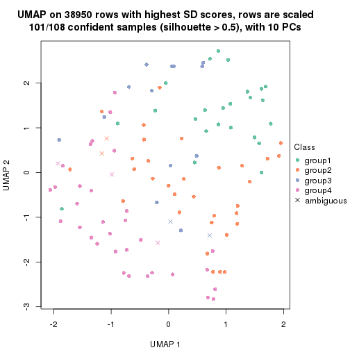</p>

</div>
<div id='tab-SD-kmeans-dimension-reduction-4'>
<pre><code class="r">dimension_reduction(res, k = 5, method = &quot;UMAP&quot;)
</code></pre>

<p></p>

</div>
<div id='tab-SD-kmeans-dimension-reduction-5'>
<pre><code class="r">dimension_reduction(res, k = 6, method = &quot;UMAP&quot;)
</code></pre>

<p></p>

</div>
</div>


Following heatmap shows how subgroups are split when increasing `k`:

```r
collect_classes(res)
```


Test correlation between subgroups and known annotations. If the known
annotation is numeric, one-way ANOVA test is applied, and if the known
annotation is discrete, chi-squared contingency table test is applied.

```r
test_to_known_factors(res)
```

```
#>             n disease.state(p) gender(p) k
#> SD:kmeans  95          0.85807     0.373 2
#> SD:kmeans  92          0.88731     0.601 3
#> SD:kmeans 101          0.01049     0.797 4
#> SD:kmeans  88          0.00156     0.774 5
#> SD:kmeans  56          0.08001     0.522 6
```


If matrix rows can be associated to genes, consider to use `GO_Enrichment(res,
...)` to perform function enrichment for the signature genes.


 

---------------------------------------------------


### SD:skmeans


The object with results only for a single top-value method and a single partition method 
can be extracted as:

```r
res = res_list["SD", "skmeans"]
# you can also extract it by
# res = res_list["SD:skmeans"]
```

A summary of `res` and all the functions that can be applied to it:

```r
res
```

```
#> A 'ConsensusPartition' object with k = 2, 3, 4, 5, 6.
#>   On a matrix with 38950 rows and 108 columns.
#>   Top rows (1000, 2000, 3000, 4000, 5000) are extracted by 'SD' method.
#>   Subgroups are detected by 'skmeans' method.
#>   Performed in total 1250 partitions by row resampling.
#>   Best k for subgroups seems to be 4.
#> 
#> Following methods can be applied to this 'ConsensusPartition' object:
#>  [1] "cola_report"             "collect_classes"         "collect_plots"          
#>  [4] "collect_stats"           "colnames"                "compare_signatures"     
#>  [7] "consensus_heatmap"       "dimension_reduction"     "functional_enrichment"  
#> [10] "get_anno_col"            "get_anno"                "get_classes"            
#> [13] "get_consensus"           "get_matrix"              "get_membership"         
#> [16] "get_param"               "get_signatures"          "get_stats"              
#> [19] "is_best_k"               "is_stable_k"             "membership_heatmap"     
#> [22] "ncol"                    "nrow"                    "plot_ecdf"              
#> [25] "rownames"                "select_partition_number" "show"                   
#> [28] "suggest_best_k"          "test_to_known_factors"
```

`collect_plots()` function collects all the plots made from `res` for all `k` (number of partitions)
into one single page to provide an easy and fast comparison between different `k`.

```r
collect_plots(res)
```


The plots are:

- The first row: a plot of the ECDF (Empirical cumulative distribution
  function) curves of the consensus matrix for each `k` and the heatmap of
  predicted classes for each `k`.
- The second row: heatmaps of the consensus matrix for each `k`.
- The third row: heatmaps of the membership matrix for each `k`.
- The fouth row: heatmaps of the signatures for each `k`.

All the plots in panels can be made by individual functions and they are
plotted later in this section.

`select_partition_number()` produces several plots showing different
statistics for choosing "optimized" `k`. There are following statistics:

- ECDF curves of the consensus matrix for each `k`;
- 1-PAC. [The PAC
  score](https://en.wikipedia.org/wiki/Consensus_clustering#Over-interpretation_potential_of_consensus_clustering)
  measures the proportion of the ambiguous subgrouping.
- Mean silhouette score.
- Concordance. The mean probability of fiting the consensus class ids in all
  partitions.
- Area increased. Denote $A_k$ as the area under the ECDF curve for current
  `k`, the area increased is defined as $A_k - A_{k-1}$.
- Rand index. The percent of pairs of samples that are both in a same cluster
  or both are not in a same cluster in the partition of k and k-1.
- Jaccard index. The ratio of pairs of samples are both in a same cluster in
  the partition of k and k-1 and the pairs of samples are both in a same
  cluster in the partition k or k-1.

The detailed explanations of these statistics can be found in [the cola
vignette](http://bioconductor.org/packages/devel/bioc/vignettes/cola/inst/doc/cola.html#toc_13).

Generally speaking, lower PAC score, higher mean silhouette score or higher
concordance corresponds to better partition. Rand index and Jaccard index
measure how similar the current partition is compared to partition with `k-1`.
If they are too similar, we won't accept `k` is better than `k-1`.

```r
select_partition_number(res)
```


The numeric values for all these statistics can be obtained by `get_stats()`.

```r
get_stats(res)
```

```
#>   k 1-PAC mean_silhouette concordance area_increased  Rand Jaccard
#> 2 2 0.608           0.820       0.923         0.5019 0.500   0.500
#> 3 3 0.611           0.736       0.875         0.3275 0.733   0.518
#> 4 4 0.814           0.829       0.911         0.1300 0.775   0.447
#> 5 5 0.710           0.604       0.764         0.0645 0.939   0.763
#> 6 6 0.710           0.549       0.748         0.0376 0.943   0.739
```

`suggest_best_k()` suggests the best $k$ based on these statistics. The rules are as follows:

- All $k$ with Jaccard index larger than 0.95 are removed because the increase of
  the partition number does not provides enough extra information. If all $k$ are removed,
  the best $k$ is assigned by `NA`.
- For $k$ with 1-PAC larger than 0.9, the maximal $k$ is taken as the "best k". Other $k$ is called "optional k".
- If it does not fit the second rule. The $k$ with the highest vote of highest
  1-PAC, mean silhouette and concordance is taken as the "best k".

```r
suggest_best_k(res)
```

```
#> [1] 4
```


Following shows the table of the partitions (You need to click the **show/hide
code output** link to see it). The membership matrix (columns with name `p*`)
is inferred by
[`clue::cl_consensus()`](https://www.rdocumentation.org/link/cl_consensus?package=clue)
function with the `SE` method. Basically the value in the membership matrix
represents the probability to belong to a certain group. The finall class
label for an item is determined with the group with highest probability it
belongs to.

In `get_classes()` function, the entropy is calculated from the membership
matrix and the silhouette score is calculated from the consensus matrix.


<script>
$( function() {
	$( '#tabs-SD-skmeans-get-classes' ).tabs();
} );
</script>
<div id='tabs-SD-skmeans-get-classes'>
<ul>
<li><a href='#tab-SD-skmeans-get-classes-1'>k = 2</a></li>
<li><a href='#tab-SD-skmeans-get-classes-2'>k = 3</a></li>
<li><a href='#tab-SD-skmeans-get-classes-3'>k = 4</a></li>
<li><a href='#tab-SD-skmeans-get-classes-4'>k = 5</a></li>
<li><a href='#tab-SD-skmeans-get-classes-5'>k = 6</a></li>
</ul>

<div id='tab-SD-skmeans-get-classes-1'>
<p><a id='tab-SD-skmeans-get-classes-1-a' style='color:#0366d6' href='#'>show/hide code output</a></p>
<pre><code class="r">cbind(get_classes(res, k = 2), get_membership(res, k = 2))
</code></pre>

<pre><code>#&gt;            class entropy silhouette    p1    p2
#&gt; GSM1068478     1  0.9754      0.261 0.592 0.408
#&gt; GSM1068479     2  0.9209      0.447 0.336 0.664
#&gt; GSM1068481     1  0.0000      0.908 1.000 0.000
#&gt; GSM1068482     1  0.0000      0.908 1.000 0.000
#&gt; GSM1068483     1  0.0000      0.908 1.000 0.000
#&gt; GSM1068486     1  0.0000      0.908 1.000 0.000
#&gt; GSM1068487     2  0.0000      0.908 0.000 1.000
#&gt; GSM1068488     1  0.8386      0.647 0.732 0.268
#&gt; GSM1068490     2  0.0000      0.908 0.000 1.000
#&gt; GSM1068491     1  0.0000      0.908 1.000 0.000
#&gt; GSM1068492     2  0.9970      0.055 0.468 0.532
#&gt; GSM1068493     1  0.3431      0.862 0.936 0.064
#&gt; GSM1068494     1  0.0000      0.908 1.000 0.000
#&gt; GSM1068495     2  0.0000      0.908 0.000 1.000
#&gt; GSM1068496     1  0.0000      0.908 1.000 0.000
#&gt; GSM1068498     2  0.8327      0.652 0.264 0.736
#&gt; GSM1068499     1  0.0000      0.908 1.000 0.000
#&gt; GSM1068500     1  0.0000      0.908 1.000 0.000
#&gt; GSM1068502     2  0.9323      0.419 0.348 0.652
#&gt; GSM1068503     2  0.0000      0.908 0.000 1.000
#&gt; GSM1068505     2  0.0000      0.908 0.000 1.000
#&gt; GSM1068506     2  0.0000      0.908 0.000 1.000
#&gt; GSM1068507     2  0.0000      0.908 0.000 1.000
#&gt; GSM1068508     2  0.0000      0.908 0.000 1.000
#&gt; GSM1068510     2  0.0376      0.906 0.004 0.996
#&gt; GSM1068512     1  0.7453      0.720 0.788 0.212
#&gt; GSM1068513     2  0.0000      0.908 0.000 1.000
#&gt; GSM1068514     1  0.8207      0.664 0.744 0.256
#&gt; GSM1068517     2  0.7602      0.711 0.220 0.780
#&gt; GSM1068518     1  0.4815      0.834 0.896 0.104
#&gt; GSM1068520     1  0.8016      0.632 0.756 0.244
#&gt; GSM1068521     1  0.0000      0.908 1.000 0.000
#&gt; GSM1068522     2  0.0000      0.908 0.000 1.000
#&gt; GSM1068524     2  0.0000      0.908 0.000 1.000
#&gt; GSM1068527     2  0.7219      0.704 0.200 0.800
#&gt; GSM1068480     1  0.0000      0.908 1.000 0.000
#&gt; GSM1068484     2  0.0000      0.908 0.000 1.000
#&gt; GSM1068485     1  0.0000      0.908 1.000 0.000
#&gt; GSM1068489     2  0.0000      0.908 0.000 1.000
#&gt; GSM1068497     2  0.8327      0.652 0.264 0.736
#&gt; GSM1068501     2  0.0000      0.908 0.000 1.000
#&gt; GSM1068504     2  0.0000      0.908 0.000 1.000
#&gt; GSM1068509     1  0.0000      0.908 1.000 0.000
#&gt; GSM1068511     1  0.0000      0.908 1.000 0.000
#&gt; GSM1068515     1  0.9754      0.261 0.592 0.408
#&gt; GSM1068516     2  0.9608      0.329 0.384 0.616
#&gt; GSM1068519     1  0.0000      0.908 1.000 0.000
#&gt; GSM1068523     2  0.0000      0.908 0.000 1.000
#&gt; GSM1068525     2  0.0000      0.908 0.000 1.000
#&gt; GSM1068526     2  0.0672      0.904 0.008 0.992
#&gt; GSM1068458     1  0.0376      0.905 0.996 0.004
#&gt; GSM1068459     1  0.0000      0.908 1.000 0.000
#&gt; GSM1068460     2  0.7453      0.721 0.212 0.788
#&gt; GSM1068461     1  0.0000      0.908 1.000 0.000
#&gt; GSM1068464     2  0.0000      0.908 0.000 1.000
#&gt; GSM1068468     2  0.0000      0.908 0.000 1.000
#&gt; GSM1068472     2  0.6048      0.791 0.148 0.852
#&gt; GSM1068473     2  0.0000      0.908 0.000 1.000
#&gt; GSM1068474     2  0.0000      0.908 0.000 1.000
#&gt; GSM1068476     1  0.5519      0.811 0.872 0.128
#&gt; GSM1068477     2  0.0000      0.908 0.000 1.000
#&gt; GSM1068462     2  0.8327      0.652 0.264 0.736
#&gt; GSM1068463     1  0.0000      0.908 1.000 0.000
#&gt; GSM1068465     2  0.8386      0.646 0.268 0.732
#&gt; GSM1068466     1  0.7299      0.699 0.796 0.204
#&gt; GSM1068467     2  0.0000      0.908 0.000 1.000
#&gt; GSM1068469     2  0.8386      0.646 0.268 0.732
#&gt; GSM1068470     2  0.0000      0.908 0.000 1.000
#&gt; GSM1068471     2  0.0000      0.908 0.000 1.000
#&gt; GSM1068475     2  0.0000      0.908 0.000 1.000
#&gt; GSM1068528     1  0.0000      0.908 1.000 0.000
#&gt; GSM1068531     1  0.0000      0.908 1.000 0.000
#&gt; GSM1068532     1  0.0000      0.908 1.000 0.000
#&gt; GSM1068533     1  0.0000      0.908 1.000 0.000
#&gt; GSM1068535     1  0.0000      0.908 1.000 0.000
#&gt; GSM1068537     1  0.0000      0.908 1.000 0.000
#&gt; GSM1068538     1  0.0000      0.908 1.000 0.000
#&gt; GSM1068539     2  0.0000      0.908 0.000 1.000
#&gt; GSM1068540     1  0.0000      0.908 1.000 0.000
#&gt; GSM1068542     2  0.0672      0.904 0.008 0.992
#&gt; GSM1068543     1  0.8499      0.635 0.724 0.276
#&gt; GSM1068544     1  0.0000      0.908 1.000 0.000
#&gt; GSM1068545     2  0.0000      0.908 0.000 1.000
#&gt; GSM1068546     1  0.0000      0.908 1.000 0.000
#&gt; GSM1068547     1  0.9209      0.445 0.664 0.336
#&gt; GSM1068548     2  0.1184      0.899 0.016 0.984
#&gt; GSM1068549     1  0.0000      0.908 1.000 0.000
#&gt; GSM1068550     2  0.0000      0.908 0.000 1.000
#&gt; GSM1068551     2  0.0000      0.908 0.000 1.000
#&gt; GSM1068552     2  0.0000      0.908 0.000 1.000
#&gt; GSM1068555     2  0.0000      0.908 0.000 1.000
#&gt; GSM1068556     1  0.8443      0.641 0.728 0.272
#&gt; GSM1068557     2  0.0000      0.908 0.000 1.000
#&gt; GSM1068560     2  0.1184      0.899 0.016 0.984
#&gt; GSM1068561     2  0.6973      0.749 0.188 0.812
#&gt; GSM1068562     2  0.3879      0.850 0.076 0.924
#&gt; GSM1068563     2  0.8267      0.608 0.260 0.740
#&gt; GSM1068565     2  0.0000      0.908 0.000 1.000
#&gt; GSM1068529     1  0.0000      0.908 1.000 0.000
#&gt; GSM1068530     1  0.0000      0.908 1.000 0.000
#&gt; GSM1068534     1  0.0000      0.908 1.000 0.000
#&gt; GSM1068536     2  0.8813      0.595 0.300 0.700
#&gt; GSM1068541     2  0.0000      0.908 0.000 1.000
#&gt; GSM1068553     1  0.8327      0.653 0.736 0.264
#&gt; GSM1068554     2  0.0376      0.906 0.004 0.996
#&gt; GSM1068558     1  0.8386      0.647 0.732 0.268
#&gt; GSM1068559     1  0.2423      0.883 0.960 0.040
#&gt; GSM1068564     2  0.0000      0.908 0.000 1.000
</code></pre>

<script>
$('#tab-SD-skmeans-get-classes-1-a').parent().next().next().hide();
$('#tab-SD-skmeans-get-classes-1-a').click(function(){
  $('#tab-SD-skmeans-get-classes-1-a').parent().next().next().toggle();
  return(false);
});
</script>
</div>

<div id='tab-SD-skmeans-get-classes-2'>
<p><a id='tab-SD-skmeans-get-classes-2-a' style='color:#0366d6' href='#'>show/hide code output</a></p>
<pre><code class="r">cbind(get_classes(res, k = 3), get_membership(res, k = 3))
</code></pre>

<pre><code>#&gt;            class entropy silhouette    p1    p2    p3
#&gt; GSM1068478     1  0.3192     0.7766 0.888 0.112 0.000
#&gt; GSM1068479     3  0.0747     0.8941 0.000 0.016 0.984
#&gt; GSM1068481     3  0.0747     0.8997 0.016 0.000 0.984
#&gt; GSM1068482     3  0.0747     0.8997 0.016 0.000 0.984
#&gt; GSM1068483     1  0.3340     0.7722 0.880 0.000 0.120
#&gt; GSM1068486     3  0.0747     0.8997 0.016 0.000 0.984
#&gt; GSM1068487     2  0.0000     0.8406 0.000 1.000 0.000
#&gt; GSM1068488     3  0.0983     0.8887 0.004 0.016 0.980
#&gt; GSM1068490     2  0.0000     0.8406 0.000 1.000 0.000
#&gt; GSM1068491     3  0.0747     0.8997 0.016 0.000 0.984
#&gt; GSM1068492     3  0.0000     0.8972 0.000 0.000 1.000
#&gt; GSM1068493     3  0.8301     0.4412 0.108 0.300 0.592
#&gt; GSM1068494     3  0.5216     0.6554 0.260 0.000 0.740
#&gt; GSM1068495     2  0.6299     0.0961 0.476 0.524 0.000
#&gt; GSM1068496     1  0.6291     0.1741 0.532 0.000 0.468
#&gt; GSM1068498     1  0.6079     0.4290 0.612 0.388 0.000
#&gt; GSM1068499     1  0.6168     0.3349 0.588 0.000 0.412
#&gt; GSM1068500     1  0.4555     0.6978 0.800 0.000 0.200
#&gt; GSM1068502     3  0.0747     0.8941 0.000 0.016 0.984
#&gt; GSM1068503     2  0.0000     0.8406 0.000 1.000 0.000
#&gt; GSM1068505     2  0.5956     0.6689 0.264 0.720 0.016
#&gt; GSM1068506     2  0.5219     0.7344 0.196 0.788 0.016
#&gt; GSM1068507     2  0.7330     0.6635 0.216 0.692 0.092
#&gt; GSM1068508     2  0.2448     0.8141 0.076 0.924 0.000
#&gt; GSM1068510     3  0.6045     0.3864 0.000 0.380 0.620
#&gt; GSM1068512     3  0.5315     0.7074 0.216 0.012 0.772
#&gt; GSM1068513     2  0.0000     0.8406 0.000 1.000 0.000
#&gt; GSM1068514     3  0.0000     0.8972 0.000 0.000 1.000
#&gt; GSM1068517     1  0.6140     0.3946 0.596 0.404 0.000
#&gt; GSM1068518     1  0.5024     0.6471 0.776 0.004 0.220
#&gt; GSM1068520     1  0.0000     0.8359 1.000 0.000 0.000
#&gt; GSM1068521     1  0.0000     0.8359 1.000 0.000 0.000
#&gt; GSM1068522     2  0.0000     0.8406 0.000 1.000 0.000
#&gt; GSM1068524     2  0.0000     0.8406 0.000 1.000 0.000
#&gt; GSM1068527     1  0.2804     0.7847 0.924 0.060 0.016
#&gt; GSM1068480     3  0.0747     0.8997 0.016 0.000 0.984
#&gt; GSM1068484     2  0.0747     0.8370 0.000 0.984 0.016
#&gt; GSM1068485     3  0.0747     0.8997 0.016 0.000 0.984
#&gt; GSM1068489     2  0.5681     0.6984 0.236 0.748 0.016
#&gt; GSM1068497     1  0.6095     0.4210 0.608 0.392 0.000
#&gt; GSM1068501     2  0.2804     0.8172 0.060 0.924 0.016
#&gt; GSM1068504     2  0.0000     0.8406 0.000 1.000 0.000
#&gt; GSM1068509     1  0.4399     0.7093 0.812 0.000 0.188
#&gt; GSM1068511     3  0.0237     0.8985 0.004 0.000 0.996
#&gt; GSM1068515     1  0.4796     0.6771 0.780 0.220 0.000
#&gt; GSM1068516     3  0.6107     0.7235 0.100 0.116 0.784
#&gt; GSM1068519     1  0.0000     0.8359 1.000 0.000 0.000
#&gt; GSM1068523     2  0.0000     0.8406 0.000 1.000 0.000
#&gt; GSM1068525     2  0.0747     0.8370 0.000 0.984 0.016
#&gt; GSM1068526     2  0.5633     0.7201 0.208 0.768 0.024
#&gt; GSM1068458     1  0.0000     0.8359 1.000 0.000 0.000
#&gt; GSM1068459     3  0.0747     0.8997 0.016 0.000 0.984
#&gt; GSM1068460     1  0.0000     0.8359 1.000 0.000 0.000
#&gt; GSM1068461     3  0.0747     0.8997 0.016 0.000 0.984
#&gt; GSM1068464     2  0.0000     0.8406 0.000 1.000 0.000
#&gt; GSM1068468     2  0.1636     0.8266 0.016 0.964 0.020
#&gt; GSM1068472     2  0.1919     0.8226 0.024 0.956 0.020
#&gt; GSM1068473     2  0.0000     0.8406 0.000 1.000 0.000
#&gt; GSM1068474     2  0.0000     0.8406 0.000 1.000 0.000
#&gt; GSM1068476     3  0.0829     0.8991 0.012 0.004 0.984
#&gt; GSM1068477     2  0.0000     0.8406 0.000 1.000 0.000
#&gt; GSM1068462     2  0.6777     0.3494 0.020 0.616 0.364
#&gt; GSM1068463     3  0.0747     0.8997 0.016 0.000 0.984
#&gt; GSM1068465     1  0.2625     0.7954 0.916 0.084 0.000
#&gt; GSM1068466     1  0.0000     0.8359 1.000 0.000 0.000
#&gt; GSM1068467     2  0.1482     0.8284 0.012 0.968 0.020
#&gt; GSM1068469     1  0.7049     0.2516 0.528 0.452 0.020
#&gt; GSM1068470     2  0.0000     0.8406 0.000 1.000 0.000
#&gt; GSM1068471     2  0.0000     0.8406 0.000 1.000 0.000
#&gt; GSM1068475     2  0.0000     0.8406 0.000 1.000 0.000
#&gt; GSM1068528     1  0.5859     0.4857 0.656 0.000 0.344
#&gt; GSM1068531     1  0.0000     0.8359 1.000 0.000 0.000
#&gt; GSM1068532     1  0.1964     0.8082 0.944 0.000 0.056
#&gt; GSM1068533     1  0.0000     0.8359 1.000 0.000 0.000
#&gt; GSM1068535     3  0.6126     0.3861 0.400 0.000 0.600
#&gt; GSM1068537     1  0.0000     0.8359 1.000 0.000 0.000
#&gt; GSM1068538     1  0.0000     0.8359 1.000 0.000 0.000
#&gt; GSM1068539     2  0.5650     0.5494 0.312 0.688 0.000
#&gt; GSM1068540     1  0.0000     0.8359 1.000 0.000 0.000
#&gt; GSM1068542     2  0.6396     0.5951 0.320 0.664 0.016
#&gt; GSM1068543     3  0.3213     0.8467 0.060 0.028 0.912
#&gt; GSM1068544     3  0.4002     0.7615 0.160 0.000 0.840
#&gt; GSM1068545     2  0.1163     0.8339 0.028 0.972 0.000
#&gt; GSM1068546     3  0.0747     0.8997 0.016 0.000 0.984
#&gt; GSM1068547     1  0.0000     0.8359 1.000 0.000 0.000
#&gt; GSM1068548     2  0.6783     0.4697 0.396 0.588 0.016
#&gt; GSM1068549     3  0.0747     0.8997 0.016 0.000 0.984
#&gt; GSM1068550     2  0.5956     0.6689 0.264 0.720 0.016
#&gt; GSM1068551     2  0.0000     0.8406 0.000 1.000 0.000
#&gt; GSM1068552     2  0.4539     0.7675 0.148 0.836 0.016
#&gt; GSM1068555     2  0.0000     0.8406 0.000 1.000 0.000
#&gt; GSM1068556     3  0.3967     0.8262 0.072 0.044 0.884
#&gt; GSM1068557     2  0.1129     0.8313 0.004 0.976 0.020
#&gt; GSM1068560     2  0.6912     0.3712 0.444 0.540 0.016
#&gt; GSM1068561     2  0.7851     0.0324 0.412 0.532 0.056
#&gt; GSM1068562     2  0.6880     0.6920 0.108 0.736 0.156
#&gt; GSM1068563     2  0.6717     0.4614 0.020 0.628 0.352
#&gt; GSM1068565     2  0.0000     0.8406 0.000 1.000 0.000
#&gt; GSM1068529     3  0.0000     0.8972 0.000 0.000 1.000
#&gt; GSM1068530     1  0.0000     0.8359 1.000 0.000 0.000
#&gt; GSM1068534     3  0.0000     0.8972 0.000 0.000 1.000
#&gt; GSM1068536     1  0.0237     0.8345 0.996 0.004 0.000
#&gt; GSM1068541     2  0.5835     0.5162 0.340 0.660 0.000
#&gt; GSM1068553     3  0.6771     0.5707 0.276 0.040 0.684
#&gt; GSM1068554     2  0.8730     0.1309 0.108 0.472 0.420
#&gt; GSM1068558     3  0.0000     0.8972 0.000 0.000 1.000
#&gt; GSM1068559     3  0.0237     0.8984 0.004 0.000 0.996
#&gt; GSM1068564     2  0.1905     0.8299 0.028 0.956 0.016
</code></pre>

<script>
$('#tab-SD-skmeans-get-classes-2-a').parent().next().next().hide();
$('#tab-SD-skmeans-get-classes-2-a').click(function(){
  $('#tab-SD-skmeans-get-classes-2-a').parent().next().next().toggle();
  return(false);
});
</script>
</div>

<div id='tab-SD-skmeans-get-classes-3'>
<p><a id='tab-SD-skmeans-get-classes-3-a' style='color:#0366d6' href='#'>show/hide code output</a></p>
<pre><code class="r">cbind(get_classes(res, k = 4), get_membership(res, k = 4))
</code></pre>

<pre><code>#&gt;            class entropy silhouette    p1    p2    p3    p4
#&gt; GSM1068478     1  0.1629    0.93075 0.952 0.024 0.000 0.024
#&gt; GSM1068479     3  0.1557    0.88009 0.000 0.056 0.944 0.000
#&gt; GSM1068481     3  0.0000    0.92158 0.000 0.000 1.000 0.000
#&gt; GSM1068482     3  0.0000    0.92158 0.000 0.000 1.000 0.000
#&gt; GSM1068483     1  0.1339    0.93554 0.964 0.008 0.024 0.004
#&gt; GSM1068486     3  0.0000    0.92158 0.000 0.000 1.000 0.000
#&gt; GSM1068487     2  0.0188    0.91495 0.000 0.996 0.000 0.004
#&gt; GSM1068488     4  0.2593    0.83071 0.004 0.000 0.104 0.892
#&gt; GSM1068490     2  0.0188    0.91495 0.000 0.996 0.000 0.004
#&gt; GSM1068491     3  0.0000    0.92158 0.000 0.000 1.000 0.000
#&gt; GSM1068492     3  0.0188    0.91965 0.000 0.000 0.996 0.004
#&gt; GSM1068493     2  0.5004    0.34511 0.000 0.604 0.392 0.004
#&gt; GSM1068494     3  0.7130    0.14544 0.396 0.000 0.472 0.132
#&gt; GSM1068495     2  0.6639    0.45206 0.120 0.596 0.000 0.284
#&gt; GSM1068496     3  0.5138    0.33854 0.392 0.000 0.600 0.008
#&gt; GSM1068498     2  0.1867    0.87218 0.072 0.928 0.000 0.000
#&gt; GSM1068499     3  0.5928    0.10359 0.456 0.000 0.508 0.036
#&gt; GSM1068500     1  0.2281    0.87649 0.904 0.000 0.096 0.000
#&gt; GSM1068502     3  0.1211    0.89424 0.000 0.040 0.960 0.000
#&gt; GSM1068503     2  0.2281    0.83763 0.000 0.904 0.000 0.096
#&gt; GSM1068505     4  0.2589    0.84977 0.116 0.000 0.000 0.884
#&gt; GSM1068506     4  0.2131    0.86823 0.032 0.036 0.000 0.932
#&gt; GSM1068507     4  0.6501    0.58228 0.116 0.268 0.000 0.616
#&gt; GSM1068508     2  0.1929    0.88440 0.036 0.940 0.000 0.024
#&gt; GSM1068510     4  0.5581    0.73219 0.000 0.140 0.132 0.728
#&gt; GSM1068512     4  0.6364    0.64430 0.144 0.000 0.204 0.652
#&gt; GSM1068513     2  0.0469    0.91212 0.000 0.988 0.000 0.012
#&gt; GSM1068514     3  0.0000    0.92158 0.000 0.000 1.000 0.000
#&gt; GSM1068517     2  0.1022    0.90100 0.032 0.968 0.000 0.000
#&gt; GSM1068518     4  0.7379    0.18012 0.364 0.000 0.168 0.468
#&gt; GSM1068520     1  0.0000    0.94506 1.000 0.000 0.000 0.000
#&gt; GSM1068521     1  0.1118    0.93458 0.964 0.000 0.000 0.036
#&gt; GSM1068522     2  0.5673    0.00761 0.024 0.528 0.000 0.448
#&gt; GSM1068524     2  0.1118    0.90057 0.000 0.964 0.000 0.036
#&gt; GSM1068527     4  0.3494    0.78573 0.172 0.004 0.000 0.824
#&gt; GSM1068480     3  0.0000    0.92158 0.000 0.000 1.000 0.000
#&gt; GSM1068484     4  0.1042    0.86837 0.008 0.020 0.000 0.972
#&gt; GSM1068485     3  0.0000    0.92158 0.000 0.000 1.000 0.000
#&gt; GSM1068489     4  0.1022    0.86947 0.032 0.000 0.000 0.968
#&gt; GSM1068497     2  0.1118    0.89858 0.036 0.964 0.000 0.000
#&gt; GSM1068501     4  0.2402    0.85611 0.012 0.076 0.000 0.912
#&gt; GSM1068504     2  0.0188    0.91495 0.000 0.996 0.000 0.004
#&gt; GSM1068509     1  0.2831    0.87287 0.876 0.000 0.004 0.120
#&gt; GSM1068511     3  0.2675    0.84117 0.008 0.000 0.892 0.100
#&gt; GSM1068515     1  0.4054    0.74476 0.796 0.188 0.000 0.016
#&gt; GSM1068516     4  0.1443    0.86763 0.008 0.004 0.028 0.960
#&gt; GSM1068519     1  0.1489    0.93099 0.952 0.000 0.004 0.044
#&gt; GSM1068523     2  0.0336    0.91319 0.000 0.992 0.000 0.008
#&gt; GSM1068525     4  0.1302    0.86516 0.000 0.044 0.000 0.956
#&gt; GSM1068526     4  0.1118    0.86917 0.036 0.000 0.000 0.964
#&gt; GSM1068458     1  0.0336    0.94301 0.992 0.000 0.000 0.008
#&gt; GSM1068459     3  0.0000    0.92158 0.000 0.000 1.000 0.000
#&gt; GSM1068460     1  0.0000    0.94506 1.000 0.000 0.000 0.000
#&gt; GSM1068461     3  0.0000    0.92158 0.000 0.000 1.000 0.000
#&gt; GSM1068464     2  0.0188    0.91495 0.000 0.996 0.000 0.004
#&gt; GSM1068468     2  0.0000    0.91444 0.000 1.000 0.000 0.000
#&gt; GSM1068472     2  0.0188    0.91495 0.000 0.996 0.000 0.004
#&gt; GSM1068473     2  0.0188    0.91495 0.000 0.996 0.000 0.004
#&gt; GSM1068474     2  0.0188    0.91495 0.000 0.996 0.000 0.004
#&gt; GSM1068476     3  0.0000    0.92158 0.000 0.000 1.000 0.000
#&gt; GSM1068477     2  0.0000    0.91444 0.000 1.000 0.000 0.000
#&gt; GSM1068462     2  0.0336    0.91245 0.000 0.992 0.008 0.000
#&gt; GSM1068463     3  0.0188    0.91970 0.004 0.000 0.996 0.000
#&gt; GSM1068465     1  0.1733    0.92816 0.948 0.028 0.000 0.024
#&gt; GSM1068466     1  0.0188    0.94413 0.996 0.000 0.000 0.004
#&gt; GSM1068467     2  0.0000    0.91444 0.000 1.000 0.000 0.000
#&gt; GSM1068469     2  0.0592    0.90911 0.016 0.984 0.000 0.000
#&gt; GSM1068470     2  0.0336    0.91319 0.000 0.992 0.000 0.008
#&gt; GSM1068471     2  0.0188    0.91495 0.000 0.996 0.000 0.004
#&gt; GSM1068475     2  0.0188    0.91495 0.000 0.996 0.000 0.004
#&gt; GSM1068528     1  0.4585    0.49686 0.668 0.000 0.332 0.000
#&gt; GSM1068531     1  0.0000    0.94506 1.000 0.000 0.000 0.000
#&gt; GSM1068532     1  0.1297    0.93804 0.964 0.000 0.016 0.020
#&gt; GSM1068533     1  0.0336    0.94301 0.992 0.000 0.000 0.008
#&gt; GSM1068535     4  0.4661    0.71731 0.256 0.000 0.016 0.728
#&gt; GSM1068537     1  0.0188    0.94416 0.996 0.000 0.000 0.004
#&gt; GSM1068538     1  0.0336    0.94301 0.992 0.000 0.000 0.008
#&gt; GSM1068539     2  0.6371    0.46090 0.092 0.608 0.000 0.300
#&gt; GSM1068540     1  0.1118    0.93458 0.964 0.000 0.000 0.036
#&gt; GSM1068542     4  0.2408    0.85528 0.104 0.000 0.000 0.896
#&gt; GSM1068543     4  0.1902    0.86022 0.004 0.000 0.064 0.932
#&gt; GSM1068544     3  0.0469    0.91571 0.012 0.000 0.988 0.000
#&gt; GSM1068545     4  0.4830    0.33077 0.000 0.392 0.000 0.608
#&gt; GSM1068546     3  0.0000    0.92158 0.000 0.000 1.000 0.000
#&gt; GSM1068547     1  0.0000    0.94506 1.000 0.000 0.000 0.000
#&gt; GSM1068548     4  0.3208    0.83511 0.148 0.004 0.000 0.848
#&gt; GSM1068549     3  0.0000    0.92158 0.000 0.000 1.000 0.000
#&gt; GSM1068550     4  0.0817    0.87051 0.024 0.000 0.000 0.976
#&gt; GSM1068551     2  0.0336    0.91319 0.000 0.992 0.000 0.008
#&gt; GSM1068552     4  0.2036    0.86926 0.032 0.032 0.000 0.936
#&gt; GSM1068555     2  0.0188    0.91424 0.000 0.996 0.000 0.004
#&gt; GSM1068556     4  0.1661    0.86427 0.004 0.000 0.052 0.944
#&gt; GSM1068557     2  0.0000    0.91444 0.000 1.000 0.000 0.000
#&gt; GSM1068560     4  0.2714    0.83026 0.112 0.004 0.000 0.884
#&gt; GSM1068561     2  0.2497    0.87808 0.016 0.924 0.020 0.040
#&gt; GSM1068562     4  0.0188    0.86755 0.000 0.000 0.004 0.996
#&gt; GSM1068563     4  0.2565    0.86052 0.000 0.032 0.056 0.912
#&gt; GSM1068565     2  0.0188    0.91495 0.000 0.996 0.000 0.004
#&gt; GSM1068529     3  0.1211    0.89672 0.000 0.000 0.960 0.040
#&gt; GSM1068530     1  0.0000    0.94506 1.000 0.000 0.000 0.000
#&gt; GSM1068534     3  0.2973    0.80249 0.000 0.000 0.856 0.144
#&gt; GSM1068536     1  0.0657    0.94024 0.984 0.004 0.000 0.012
#&gt; GSM1068541     2  0.7248    0.37943 0.284 0.532 0.000 0.184
#&gt; GSM1068553     4  0.1824    0.86796 0.060 0.000 0.004 0.936
#&gt; GSM1068554     4  0.3416    0.86165 0.036 0.040 0.036 0.888
#&gt; GSM1068558     3  0.0188    0.91989 0.000 0.000 0.996 0.004
#&gt; GSM1068559     3  0.0000    0.92158 0.000 0.000 1.000 0.000
#&gt; GSM1068564     4  0.2670    0.85728 0.024 0.072 0.000 0.904
</code></pre>

<script>
$('#tab-SD-skmeans-get-classes-3-a').parent().next().next().hide();
$('#tab-SD-skmeans-get-classes-3-a').click(function(){
  $('#tab-SD-skmeans-get-classes-3-a').parent().next().next().toggle();
  return(false);
});
</script>
</div>

<div id='tab-SD-skmeans-get-classes-4'>
<p><a id='tab-SD-skmeans-get-classes-4-a' style='color:#0366d6' href='#'>show/hide code output</a></p>
<pre><code class="r">cbind(get_classes(res, k = 5), get_membership(res, k = 5))
</code></pre>

<pre><code>#&gt;            class entropy silhouette    p1    p2    p3    p4    p5
#&gt; GSM1068478     1  0.4298     0.5579 0.640 0.008 0.000 0.000 0.352
#&gt; GSM1068479     3  0.3266     0.6893 0.000 0.200 0.796 0.000 0.004
#&gt; GSM1068481     3  0.0404     0.8662 0.012 0.000 0.988 0.000 0.000
#&gt; GSM1068482     3  0.0510     0.8655 0.016 0.000 0.984 0.000 0.000
#&gt; GSM1068483     1  0.1168     0.8759 0.960 0.000 0.032 0.000 0.008
#&gt; GSM1068486     3  0.0162     0.8668 0.004 0.000 0.996 0.000 0.000
#&gt; GSM1068487     2  0.0451     0.7072 0.000 0.988 0.000 0.004 0.008
#&gt; GSM1068488     4  0.6099     0.5241 0.008 0.000 0.100 0.504 0.388
#&gt; GSM1068490     2  0.0451     0.7072 0.000 0.988 0.000 0.004 0.008
#&gt; GSM1068491     3  0.0162     0.8668 0.000 0.000 0.996 0.000 0.004
#&gt; GSM1068492     3  0.2438     0.8370 0.000 0.044 0.908 0.008 0.040
#&gt; GSM1068493     2  0.6925    -0.0946 0.004 0.368 0.344 0.000 0.284
#&gt; GSM1068494     5  0.7764    -0.0537 0.180 0.000 0.292 0.092 0.436
#&gt; GSM1068495     5  0.3883     0.4828 0.032 0.052 0.000 0.084 0.832
#&gt; GSM1068496     3  0.5506     0.1883 0.404 0.000 0.528 0.000 0.068
#&gt; GSM1068498     5  0.4872     0.1950 0.024 0.436 0.000 0.000 0.540
#&gt; GSM1068499     3  0.6718     0.0332 0.396 0.000 0.436 0.016 0.152
#&gt; GSM1068500     1  0.1638     0.8567 0.932 0.000 0.064 0.000 0.004
#&gt; GSM1068502     3  0.3343     0.7210 0.000 0.172 0.812 0.000 0.016
#&gt; GSM1068503     2  0.3527     0.5260 0.000 0.792 0.000 0.192 0.016
#&gt; GSM1068505     4  0.2954     0.7018 0.064 0.004 0.000 0.876 0.056
#&gt; GSM1068506     4  0.1865     0.7077 0.008 0.032 0.000 0.936 0.024
#&gt; GSM1068507     2  0.7067    -0.1032 0.060 0.444 0.004 0.400 0.092
#&gt; GSM1068508     2  0.5246    -0.0192 0.020 0.524 0.000 0.016 0.440
#&gt; GSM1068510     4  0.7829     0.3429 0.000 0.288 0.100 0.432 0.180
#&gt; GSM1068512     4  0.6499     0.5774 0.056 0.000 0.100 0.596 0.248
#&gt; GSM1068513     2  0.3301     0.5974 0.000 0.848 0.000 0.072 0.080
#&gt; GSM1068514     3  0.1408     0.8549 0.000 0.000 0.948 0.008 0.044
#&gt; GSM1068517     5  0.4538     0.1713 0.008 0.452 0.000 0.000 0.540
#&gt; GSM1068518     5  0.4928     0.2126 0.072 0.000 0.012 0.192 0.724
#&gt; GSM1068520     1  0.0671     0.8848 0.980 0.000 0.000 0.004 0.016
#&gt; GSM1068521     1  0.1892     0.8645 0.916 0.000 0.000 0.004 0.080
#&gt; GSM1068522     2  0.5063     0.3383 0.000 0.632 0.000 0.312 0.056
#&gt; GSM1068524     2  0.4183     0.3411 0.000 0.668 0.000 0.008 0.324
#&gt; GSM1068527     4  0.5393     0.5676 0.080 0.000 0.000 0.608 0.312
#&gt; GSM1068480     3  0.1059     0.8617 0.004 0.000 0.968 0.008 0.020
#&gt; GSM1068484     4  0.3966     0.5986 0.000 0.000 0.000 0.664 0.336
#&gt; GSM1068485     3  0.0162     0.8668 0.004 0.000 0.996 0.000 0.000
#&gt; GSM1068489     4  0.2116     0.7052 0.008 0.004 0.000 0.912 0.076
#&gt; GSM1068497     5  0.4542     0.1621 0.008 0.456 0.000 0.000 0.536
#&gt; GSM1068501     4  0.5850     0.4959 0.004 0.244 0.004 0.624 0.124
#&gt; GSM1068504     2  0.0000     0.7107 0.000 1.000 0.000 0.000 0.000
#&gt; GSM1068509     1  0.3958     0.7629 0.780 0.000 0.000 0.044 0.176
#&gt; GSM1068511     3  0.5628     0.5648 0.016 0.000 0.660 0.224 0.100
#&gt; GSM1068515     1  0.4983     0.7297 0.764 0.092 0.000 0.084 0.060
#&gt; GSM1068516     5  0.3934     0.0885 0.000 0.000 0.008 0.276 0.716
#&gt; GSM1068519     1  0.2997     0.8146 0.840 0.000 0.000 0.012 0.148
#&gt; GSM1068523     5  0.4307     0.0660 0.000 0.496 0.000 0.000 0.504
#&gt; GSM1068525     4  0.4586     0.4344 0.000 0.004 0.004 0.524 0.468
#&gt; GSM1068526     4  0.0613     0.7149 0.008 0.004 0.000 0.984 0.004
#&gt; GSM1068458     1  0.0566     0.8845 0.984 0.000 0.000 0.012 0.004
#&gt; GSM1068459     3  0.0510     0.8655 0.016 0.000 0.984 0.000 0.000
#&gt; GSM1068460     1  0.0898     0.8833 0.972 0.000 0.000 0.008 0.020
#&gt; GSM1068461     3  0.0000     0.8668 0.000 0.000 1.000 0.000 0.000
#&gt; GSM1068464     2  0.0162     0.7112 0.000 0.996 0.000 0.000 0.004
#&gt; GSM1068468     2  0.1478     0.7022 0.000 0.936 0.000 0.000 0.064
#&gt; GSM1068472     2  0.0703     0.7100 0.000 0.976 0.000 0.000 0.024
#&gt; GSM1068473     2  0.0579     0.7052 0.000 0.984 0.000 0.008 0.008
#&gt; GSM1068474     2  0.0000     0.7107 0.000 1.000 0.000 0.000 0.000
#&gt; GSM1068476     3  0.0290     0.8663 0.000 0.000 0.992 0.000 0.008
#&gt; GSM1068477     2  0.1965     0.6757 0.000 0.904 0.000 0.000 0.096
#&gt; GSM1068462     2  0.1430     0.7039 0.000 0.944 0.004 0.000 0.052
#&gt; GSM1068463     3  0.0510     0.8655 0.016 0.000 0.984 0.000 0.000
#&gt; GSM1068465     1  0.3093     0.8010 0.824 0.008 0.000 0.000 0.168
#&gt; GSM1068466     1  0.0693     0.8851 0.980 0.000 0.000 0.008 0.012
#&gt; GSM1068467     2  0.1544     0.6996 0.000 0.932 0.000 0.000 0.068
#&gt; GSM1068469     2  0.1792     0.6911 0.000 0.916 0.000 0.000 0.084
#&gt; GSM1068470     2  0.4171     0.1618 0.000 0.604 0.000 0.000 0.396
#&gt; GSM1068471     2  0.0162     0.7112 0.000 0.996 0.000 0.000 0.004
#&gt; GSM1068475     2  0.1043     0.7067 0.000 0.960 0.000 0.000 0.040
#&gt; GSM1068528     1  0.4341     0.2968 0.592 0.000 0.404 0.000 0.004
#&gt; GSM1068531     1  0.0451     0.8849 0.988 0.000 0.000 0.008 0.004
#&gt; GSM1068532     1  0.0609     0.8815 0.980 0.000 0.020 0.000 0.000
#&gt; GSM1068533     1  0.0693     0.8837 0.980 0.000 0.008 0.012 0.000
#&gt; GSM1068535     4  0.6239     0.4991 0.292 0.004 0.020 0.584 0.100
#&gt; GSM1068537     1  0.0162     0.8848 0.996 0.000 0.004 0.000 0.000
#&gt; GSM1068538     1  0.0566     0.8827 0.984 0.000 0.012 0.004 0.000
#&gt; GSM1068539     5  0.4182     0.4970 0.028 0.076 0.000 0.084 0.812
#&gt; GSM1068540     1  0.1704     0.8659 0.928 0.000 0.000 0.004 0.068
#&gt; GSM1068542     4  0.1197     0.7133 0.048 0.000 0.000 0.952 0.000
#&gt; GSM1068543     4  0.4840     0.6193 0.000 0.000 0.064 0.688 0.248
#&gt; GSM1068544     3  0.1410     0.8417 0.060 0.000 0.940 0.000 0.000
#&gt; GSM1068545     4  0.5607     0.3229 0.000 0.140 0.000 0.632 0.228
#&gt; GSM1068546     3  0.0290     0.8667 0.000 0.000 0.992 0.000 0.008
#&gt; GSM1068547     1  0.0693     0.8845 0.980 0.000 0.000 0.008 0.012
#&gt; GSM1068548     4  0.3154     0.6818 0.148 0.004 0.000 0.836 0.012
#&gt; GSM1068549     3  0.0162     0.8668 0.000 0.000 0.996 0.000 0.004
#&gt; GSM1068550     4  0.1626     0.7174 0.016 0.000 0.000 0.940 0.044
#&gt; GSM1068551     2  0.4030     0.2719 0.000 0.648 0.000 0.000 0.352
#&gt; GSM1068552     4  0.1442     0.7099 0.012 0.032 0.000 0.952 0.004
#&gt; GSM1068555     2  0.4307    -0.1544 0.000 0.504 0.000 0.000 0.496
#&gt; GSM1068556     4  0.4328     0.6564 0.012 0.000 0.032 0.756 0.200
#&gt; GSM1068557     2  0.4300    -0.0693 0.000 0.524 0.000 0.000 0.476
#&gt; GSM1068560     4  0.5173     0.3970 0.040 0.000 0.000 0.500 0.460
#&gt; GSM1068561     5  0.3990     0.3666 0.000 0.308 0.004 0.000 0.688
#&gt; GSM1068562     4  0.3838     0.6292 0.000 0.000 0.004 0.716 0.280
#&gt; GSM1068563     4  0.3005     0.7053 0.004 0.032 0.028 0.888 0.048
#&gt; GSM1068565     2  0.2424     0.6426 0.000 0.868 0.000 0.000 0.132
#&gt; GSM1068529     3  0.4177     0.7081 0.004 0.000 0.760 0.036 0.200
#&gt; GSM1068530     1  0.0000     0.8852 1.000 0.000 0.000 0.000 0.000
#&gt; GSM1068534     3  0.6282     0.3825 0.004 0.000 0.556 0.248 0.192
#&gt; GSM1068536     1  0.4540     0.4913 0.640 0.000 0.000 0.020 0.340
#&gt; GSM1068541     5  0.8239     0.3217 0.164 0.192 0.000 0.248 0.396
#&gt; GSM1068553     4  0.3195     0.6939 0.032 0.004 0.004 0.860 0.100
#&gt; GSM1068554     4  0.5832     0.5107 0.004 0.232 0.016 0.648 0.100
#&gt; GSM1068558     3  0.2358     0.8168 0.000 0.000 0.888 0.008 0.104
#&gt; GSM1068559     3  0.0510     0.8652 0.000 0.000 0.984 0.000 0.016
#&gt; GSM1068564     4  0.3248     0.6739 0.004 0.104 0.000 0.852 0.040
</code></pre>

<script>
$('#tab-SD-skmeans-get-classes-4-a').parent().next().next().hide();
$('#tab-SD-skmeans-get-classes-4-a').click(function(){
  $('#tab-SD-skmeans-get-classes-4-a').parent().next().next().toggle();
  return(false);
});
</script>
</div>

<div id='tab-SD-skmeans-get-classes-5'>
<p><a id='tab-SD-skmeans-get-classes-5-a' style='color:#0366d6' href='#'>show/hide code output</a></p>
<pre><code class="r">cbind(get_classes(res, k = 6), get_membership(res, k = 6))
</code></pre>

<pre><code>#&gt;            class entropy silhouette    p1    p2    p3    p4    p5    p6
#&gt; GSM1068478     5  0.4533    -0.1668 0.468 0.004 0.000 0.024 0.504 0.000
#&gt; GSM1068479     3  0.4628     0.6120 0.000 0.208 0.704 0.072 0.016 0.000
#&gt; GSM1068481     3  0.0653     0.7970 0.004 0.000 0.980 0.012 0.004 0.000
#&gt; GSM1068482     3  0.1007     0.7959 0.004 0.000 0.968 0.016 0.008 0.004
#&gt; GSM1068483     1  0.1959     0.8531 0.924 0.000 0.020 0.032 0.024 0.000
#&gt; GSM1068486     3  0.0000     0.7989 0.000 0.000 1.000 0.000 0.000 0.000
#&gt; GSM1068487     2  0.0363     0.7549 0.000 0.988 0.000 0.012 0.000 0.000
#&gt; GSM1068488     4  0.5900     0.0173 0.000 0.000 0.032 0.492 0.100 0.376
#&gt; GSM1068490     2  0.0146     0.7569 0.000 0.996 0.000 0.004 0.000 0.000
#&gt; GSM1068491     3  0.1757     0.7903 0.000 0.000 0.916 0.076 0.008 0.000
#&gt; GSM1068492     3  0.4820     0.7075 0.000 0.012 0.728 0.164 0.028 0.068
#&gt; GSM1068493     5  0.7114     0.2445 0.008 0.232 0.308 0.048 0.400 0.004
#&gt; GSM1068494     4  0.8596    -0.0246 0.076 0.000 0.176 0.256 0.252 0.240
#&gt; GSM1068495     5  0.3621     0.5276 0.008 0.028 0.000 0.040 0.828 0.096
#&gt; GSM1068496     3  0.6755     0.2245 0.332 0.000 0.492 0.076 0.052 0.048
#&gt; GSM1068498     5  0.3648     0.5539 0.004 0.240 0.000 0.016 0.740 0.000
#&gt; GSM1068499     3  0.7645     0.2313 0.268 0.000 0.448 0.132 0.088 0.064
#&gt; GSM1068500     1  0.2541     0.8345 0.892 0.000 0.052 0.032 0.024 0.000
#&gt; GSM1068502     3  0.4644     0.6604 0.000 0.160 0.728 0.092 0.016 0.004
#&gt; GSM1068503     2  0.3030     0.6727 0.000 0.848 0.000 0.092 0.004 0.056
#&gt; GSM1068505     6  0.4763     0.1799 0.016 0.008 0.000 0.420 0.012 0.544
#&gt; GSM1068506     6  0.4049     0.5050 0.000 0.044 0.000 0.208 0.008 0.740
#&gt; GSM1068507     4  0.5575     0.1582 0.016 0.432 0.000 0.464 0.000 0.088
#&gt; GSM1068508     2  0.5462    -0.1077 0.004 0.476 0.000 0.008 0.432 0.080
#&gt; GSM1068510     4  0.5127     0.4597 0.000 0.160 0.032 0.716 0.028 0.064
#&gt; GSM1068512     6  0.5765     0.4147 0.068 0.000 0.036 0.156 0.064 0.676
#&gt; GSM1068513     2  0.3428     0.4363 0.000 0.696 0.000 0.304 0.000 0.000
#&gt; GSM1068514     3  0.4104     0.7265 0.000 0.000 0.760 0.172 0.020 0.048
#&gt; GSM1068517     5  0.3509     0.5540 0.000 0.240 0.000 0.016 0.744 0.000
#&gt; GSM1068518     6  0.6837     0.0873 0.032 0.000 0.008 0.236 0.356 0.368
#&gt; GSM1068520     1  0.0547     0.8640 0.980 0.000 0.000 0.000 0.020 0.000
#&gt; GSM1068521     1  0.1745     0.8518 0.924 0.000 0.000 0.020 0.056 0.000
#&gt; GSM1068522     2  0.5015     0.2753 0.000 0.616 0.000 0.288 0.004 0.092
#&gt; GSM1068524     2  0.5411     0.1667 0.000 0.548 0.000 0.092 0.348 0.012
#&gt; GSM1068527     6  0.5491     0.4389 0.064 0.000 0.000 0.140 0.128 0.668
#&gt; GSM1068480     3  0.1116     0.7991 0.000 0.000 0.960 0.028 0.004 0.008
#&gt; GSM1068484     6  0.5191     0.3665 0.000 0.004 0.000 0.220 0.148 0.628
#&gt; GSM1068485     3  0.0291     0.7990 0.000 0.000 0.992 0.004 0.004 0.000
#&gt; GSM1068489     4  0.3890     0.1260 0.004 0.000 0.000 0.596 0.000 0.400
#&gt; GSM1068497     5  0.3592     0.5522 0.000 0.240 0.000 0.020 0.740 0.000
#&gt; GSM1068501     4  0.4143     0.4793 0.000 0.124 0.000 0.756 0.004 0.116
#&gt; GSM1068504     2  0.0000     0.7572 0.000 1.000 0.000 0.000 0.000 0.000
#&gt; GSM1068509     1  0.5390     0.6506 0.688 0.000 0.004 0.128 0.060 0.120
#&gt; GSM1068511     3  0.6425     0.3378 0.020 0.000 0.512 0.132 0.028 0.308
#&gt; GSM1068515     1  0.5748     0.6071 0.664 0.084 0.004 0.092 0.152 0.004
#&gt; GSM1068516     5  0.5927    -0.0450 0.000 0.000 0.000 0.272 0.464 0.264
#&gt; GSM1068519     1  0.4531     0.7147 0.744 0.000 0.000 0.148 0.072 0.036
#&gt; GSM1068523     5  0.3684     0.4871 0.000 0.332 0.000 0.000 0.664 0.004
#&gt; GSM1068525     6  0.5868     0.2900 0.000 0.016 0.000 0.200 0.228 0.556
#&gt; GSM1068526     6  0.3412     0.5180 0.004 0.008 0.000 0.212 0.004 0.772
#&gt; GSM1068458     1  0.0551     0.8653 0.984 0.000 0.004 0.004 0.008 0.000
#&gt; GSM1068459     3  0.0912     0.7961 0.004 0.000 0.972 0.012 0.008 0.004
#&gt; GSM1068460     1  0.1265     0.8567 0.948 0.000 0.000 0.000 0.044 0.008
#&gt; GSM1068461     3  0.0972     0.7982 0.000 0.000 0.964 0.028 0.008 0.000
#&gt; GSM1068464     2  0.0291     0.7573 0.000 0.992 0.000 0.004 0.004 0.000
#&gt; GSM1068468     2  0.2930     0.7069 0.000 0.840 0.000 0.036 0.124 0.000
#&gt; GSM1068472     2  0.2537     0.7207 0.000 0.872 0.000 0.032 0.096 0.000
#&gt; GSM1068473     2  0.0547     0.7520 0.000 0.980 0.000 0.020 0.000 0.000
#&gt; GSM1068474     2  0.0000     0.7572 0.000 1.000 0.000 0.000 0.000 0.000
#&gt; GSM1068476     3  0.1812     0.7888 0.000 0.000 0.912 0.080 0.008 0.000
#&gt; GSM1068477     2  0.2600     0.7128 0.000 0.860 0.000 0.008 0.124 0.008
#&gt; GSM1068462     2  0.3473     0.6867 0.000 0.812 0.012 0.040 0.136 0.000
#&gt; GSM1068463     3  0.0893     0.7959 0.004 0.000 0.972 0.016 0.004 0.004
#&gt; GSM1068465     1  0.3732     0.6841 0.744 0.000 0.000 0.024 0.228 0.004
#&gt; GSM1068466     1  0.0508     0.8650 0.984 0.000 0.000 0.004 0.012 0.000
#&gt; GSM1068467     2  0.2706     0.7132 0.000 0.852 0.000 0.024 0.124 0.000
#&gt; GSM1068469     2  0.3488     0.6520 0.000 0.780 0.000 0.036 0.184 0.000
#&gt; GSM1068470     2  0.4524    -0.0583 0.000 0.520 0.000 0.004 0.452 0.024
#&gt; GSM1068471     2  0.0260     0.7576 0.000 0.992 0.000 0.000 0.008 0.000
#&gt; GSM1068475     2  0.0790     0.7517 0.000 0.968 0.000 0.000 0.032 0.000
#&gt; GSM1068528     1  0.4936     0.1400 0.512 0.000 0.444 0.024 0.012 0.008
#&gt; GSM1068531     1  0.0146     0.8657 0.996 0.000 0.000 0.000 0.004 0.000
#&gt; GSM1068532     1  0.1536     0.8561 0.940 0.000 0.000 0.040 0.016 0.004
#&gt; GSM1068533     1  0.0665     0.8648 0.980 0.000 0.004 0.008 0.008 0.000
#&gt; GSM1068535     4  0.5223     0.3739 0.220 0.000 0.004 0.624 0.000 0.152
#&gt; GSM1068537     1  0.0603     0.8649 0.980 0.000 0.000 0.016 0.000 0.004
#&gt; GSM1068538     1  0.0551     0.8647 0.984 0.000 0.004 0.008 0.000 0.004
#&gt; GSM1068539     5  0.3713     0.5290 0.008 0.032 0.000 0.044 0.824 0.092
#&gt; GSM1068540     1  0.2065     0.8469 0.912 0.000 0.000 0.032 0.052 0.004
#&gt; GSM1068542     6  0.3576     0.5002 0.008 0.004 0.000 0.236 0.004 0.748
#&gt; GSM1068543     6  0.3942     0.4686 0.000 0.000 0.008 0.120 0.092 0.780
#&gt; GSM1068544     3  0.1760     0.7831 0.028 0.000 0.936 0.020 0.012 0.004
#&gt; GSM1068545     6  0.6021     0.3875 0.000 0.108 0.000 0.108 0.168 0.616
#&gt; GSM1068546     3  0.1471     0.7916 0.000 0.000 0.932 0.064 0.004 0.000
#&gt; GSM1068547     1  0.0632     0.8638 0.976 0.000 0.000 0.000 0.024 0.000
#&gt; GSM1068548     6  0.4690     0.4977 0.092 0.012 0.000 0.152 0.012 0.732
#&gt; GSM1068549     3  0.1584     0.7925 0.000 0.000 0.928 0.064 0.008 0.000
#&gt; GSM1068550     6  0.3599     0.5232 0.004 0.004 0.000 0.212 0.016 0.764
#&gt; GSM1068551     2  0.4461     0.1051 0.000 0.564 0.000 0.000 0.404 0.032
#&gt; GSM1068552     6  0.4142     0.5028 0.004 0.048 0.000 0.208 0.004 0.736
#&gt; GSM1068555     5  0.3905     0.4493 0.000 0.356 0.000 0.004 0.636 0.004
#&gt; GSM1068556     6  0.2277     0.5139 0.000 0.000 0.000 0.076 0.032 0.892
#&gt; GSM1068557     5  0.4015     0.3373 0.000 0.372 0.000 0.012 0.616 0.000
#&gt; GSM1068560     6  0.4965     0.4403 0.024 0.000 0.000 0.076 0.228 0.672
#&gt; GSM1068561     5  0.3773     0.5838 0.000 0.140 0.004 0.028 0.800 0.028
#&gt; GSM1068562     6  0.3073     0.5122 0.000 0.000 0.000 0.080 0.080 0.840
#&gt; GSM1068563     6  0.3606     0.5332 0.000 0.048 0.008 0.132 0.004 0.808
#&gt; GSM1068565     2  0.2859     0.6428 0.000 0.828 0.000 0.000 0.156 0.016
#&gt; GSM1068529     3  0.6458     0.4747 0.000 0.000 0.560 0.148 0.104 0.188
#&gt; GSM1068530     1  0.0405     0.8651 0.988 0.000 0.000 0.008 0.000 0.004
#&gt; GSM1068534     3  0.6694     0.1106 0.004 0.000 0.404 0.140 0.060 0.392
#&gt; GSM1068536     1  0.4798     0.2677 0.544 0.000 0.000 0.032 0.412 0.012
#&gt; GSM1068541     5  0.7586     0.2430 0.140 0.072 0.000 0.068 0.452 0.268
#&gt; GSM1068553     4  0.3653     0.3155 0.008 0.000 0.000 0.692 0.000 0.300
#&gt; GSM1068554     4  0.4486     0.4556 0.000 0.112 0.000 0.704 0.000 0.184
#&gt; GSM1068558     3  0.4758     0.6893 0.000 0.000 0.732 0.132 0.044 0.092
#&gt; GSM1068559     3  0.1918     0.7882 0.000 0.000 0.904 0.088 0.008 0.000
#&gt; GSM1068564     6  0.5771     0.2116 0.000 0.192 0.000 0.280 0.004 0.524
</code></pre>

<script>
$('#tab-SD-skmeans-get-classes-5-a').parent().next().next().hide();
$('#tab-SD-skmeans-get-classes-5-a').click(function(){
  $('#tab-SD-skmeans-get-classes-5-a').parent().next().next().toggle();
  return(false);
});
</script>
</div>
</div>

Heatmaps for the consensus matrix. It visualizes the probability of two
samples to be in a same group.


<script>
$( function() {
	$( '#tabs-SD-skmeans-consensus-heatmap' ).tabs();
} );
</script>
<div id='tabs-SD-skmeans-consensus-heatmap'>
<ul>
<li><a href='#tab-SD-skmeans-consensus-heatmap-1'>k = 2</a></li>
<li><a href='#tab-SD-skmeans-consensus-heatmap-2'>k = 3</a></li>
<li><a href='#tab-SD-skmeans-consensus-heatmap-3'>k = 4</a></li>
<li><a href='#tab-SD-skmeans-consensus-heatmap-4'>k = 5</a></li>
<li><a href='#tab-SD-skmeans-consensus-heatmap-5'>k = 6</a></li>
</ul>
<div id='tab-SD-skmeans-consensus-heatmap-1'>
<pre><code class="r">consensus_heatmap(res, k = 2)
</code></pre>

<p></p>

</div>
<div id='tab-SD-skmeans-consensus-heatmap-2'>
<pre><code class="r">consensus_heatmap(res, k = 3)
</code></pre>

<p></p>

</div>
<div id='tab-SD-skmeans-consensus-heatmap-3'>
<pre><code class="r">consensus_heatmap(res, k = 4)
</code></pre>

<p></p>

</div>
<div id='tab-SD-skmeans-consensus-heatmap-4'>
<pre><code class="r">consensus_heatmap(res, k = 5)
</code></pre>

<p></p>

</div>
<div id='tab-SD-skmeans-consensus-heatmap-5'>
<pre><code class="r">consensus_heatmap(res, k = 6)
</code></pre>

<p></p>

</div>
</div>

Heatmaps for the membership of samples in all partitions to see how consistent they are:


<script>
$( function() {
	$( '#tabs-SD-skmeans-membership-heatmap' ).tabs();
} );
</script>
<div id='tabs-SD-skmeans-membership-heatmap'>
<ul>
<li><a href='#tab-SD-skmeans-membership-heatmap-1'>k = 2</a></li>
<li><a href='#tab-SD-skmeans-membership-heatmap-2'>k = 3</a></li>
<li><a href='#tab-SD-skmeans-membership-heatmap-3'>k = 4</a></li>
<li><a href='#tab-SD-skmeans-membership-heatmap-4'>k = 5</a></li>
<li><a href='#tab-SD-skmeans-membership-heatmap-5'>k = 6</a></li>
</ul>
<div id='tab-SD-skmeans-membership-heatmap-1'>
<pre><code class="r">membership_heatmap(res, k = 2)
</code></pre>

<p></p>

</div>
<div id='tab-SD-skmeans-membership-heatmap-2'>
<pre><code class="r">membership_heatmap(res, k = 3)
</code></pre>

<p></p>

</div>
<div id='tab-SD-skmeans-membership-heatmap-3'>
<pre><code class="r">membership_heatmap(res, k = 4)
</code></pre>

<p></p>

</div>
<div id='tab-SD-skmeans-membership-heatmap-4'>
<pre><code class="r">membership_heatmap(res, k = 5)
</code></pre>

<p></p>

</div>
<div id='tab-SD-skmeans-membership-heatmap-5'>
<pre><code class="r">membership_heatmap(res, k = 6)
</code></pre>

<p></p>

</div>
</div>

As soon as we have had the classes for columns, we can look for signatures
which are significantly different between classes which can be candidate marks
for certain classes. Following are the heatmaps for signatures.


Signature heatmaps where rows are scaled:


<script>
$( function() {
	$( '#tabs-SD-skmeans-get-signatures' ).tabs();
} );
</script>
<div id='tabs-SD-skmeans-get-signatures'>
<ul>
<li><a href='#tab-SD-skmeans-get-signatures-1'>k = 2</a></li>
<li><a href='#tab-SD-skmeans-get-signatures-2'>k = 3</a></li>
<li><a href='#tab-SD-skmeans-get-signatures-3'>k = 4</a></li>
<li><a href='#tab-SD-skmeans-get-signatures-4'>k = 5</a></li>
<li><a href='#tab-SD-skmeans-get-signatures-5'>k = 6</a></li>
</ul>
<div id='tab-SD-skmeans-get-signatures-1'>
<pre><code class="r">get_signatures(res, k = 2)
</code></pre>

<p></p>

</div>
<div id='tab-SD-skmeans-get-signatures-2'>
<pre><code class="r">get_signatures(res, k = 3)
</code></pre>

<p></p>

</div>
<div id='tab-SD-skmeans-get-signatures-3'>
<pre><code class="r">get_signatures(res, k = 4)
</code></pre>

<p></p>

</div>
<div id='tab-SD-skmeans-get-signatures-4'>
<pre><code class="r">get_signatures(res, k = 5)
</code></pre>

<p></p>

</div>
<div id='tab-SD-skmeans-get-signatures-5'>
<pre><code class="r">get_signatures(res, k = 6)
</code></pre>

<p></p>

</div>
</div>


Signature heatmaps where rows are not scaled:


<script>
$( function() {
	$( '#tabs-SD-skmeans-get-signatures-no-scale' ).tabs();
} );
</script>
<div id='tabs-SD-skmeans-get-signatures-no-scale'>
<ul>
<li><a href='#tab-SD-skmeans-get-signatures-no-scale-1'>k = 2</a></li>
<li><a href='#tab-SD-skmeans-get-signatures-no-scale-2'>k = 3</a></li>
<li><a href='#tab-SD-skmeans-get-signatures-no-scale-3'>k = 4</a></li>
<li><a href='#tab-SD-skmeans-get-signatures-no-scale-4'>k = 5</a></li>
<li><a href='#tab-SD-skmeans-get-signatures-no-scale-5'>k = 6</a></li>
</ul>
<div id='tab-SD-skmeans-get-signatures-no-scale-1'>
<pre><code class="r">get_signatures(res, k = 2, scale_rows = FALSE)
</code></pre>

<p></p>

</div>
<div id='tab-SD-skmeans-get-signatures-no-scale-2'>
<pre><code class="r">get_signatures(res, k = 3, scale_rows = FALSE)
</code></pre>

<p></p>

</div>
<div id='tab-SD-skmeans-get-signatures-no-scale-3'>
<pre><code class="r">get_signatures(res, k = 4, scale_rows = FALSE)
</code></pre>

<p></p>

</div>
<div id='tab-SD-skmeans-get-signatures-no-scale-4'>
<pre><code class="r">get_signatures(res, k = 5, scale_rows = FALSE)
</code></pre>

<p></p>

</div>
<div id='tab-SD-skmeans-get-signatures-no-scale-5'>
<pre><code class="r">get_signatures(res, k = 6, scale_rows = FALSE)
</code></pre>

<p></p>

</div>
</div>


Compare the overlap of signatures from different k:

```r
compare_signatures(res)
```


`get_signature()` returns a data frame invisibly. TO get the list of signatures, the function
call should be assigned to a variable explicitly. In following code, if `plot` argument is set
to `FALSE`, no heatmap is plotted while only the differential analysis is performed.

```r
# code only for demonstration
tb = get_signature(res, k = ..., plot = FALSE)
```

An example of the output of `tb` is:

```
#>   which_row         fdr    mean_1    mean_2 scaled_mean_1 scaled_mean_2 km
#> 1        38 0.042760348  8.373488  9.131774    -0.5533452     0.5164555  1
#> 2        40 0.018707592  7.106213  8.469186    -0.6173731     0.5762149  1
#> 3        55 0.019134737 10.221463 11.207825    -0.6159697     0.5749050  1
#> 4        59 0.006059896  5.921854  7.869574    -0.6899429     0.6439467  1
#> 5        60 0.018055526  8.928898 10.211722    -0.6204761     0.5791110  1
#> 6        98 0.009384629 15.714769 14.887706     0.6635654    -0.6193277  2
...
```

The columns in `tb` are:

1. `which_row`: row indices corresponding to the input matrix.
2. `fdr`: FDR for the differential test. 
3. `mean_x`: The mean value in group x.
4. `scaled_mean_x`: The mean value in group x after rows are scaled.
5. `km`: Row groups if k-means clustering is applied to rows.


UMAP plot which shows how samples are separated.


<script>
$( function() {
	$( '#tabs-SD-skmeans-dimension-reduction' ).tabs();
} );
</script>
<div id='tabs-SD-skmeans-dimension-reduction'>
<ul>
<li><a href='#tab-SD-skmeans-dimension-reduction-1'>k = 2</a></li>
<li><a href='#tab-SD-skmeans-dimension-reduction-2'>k = 3</a></li>
<li><a href='#tab-SD-skmeans-dimension-reduction-3'>k = 4</a></li>
<li><a href='#tab-SD-skmeans-dimension-reduction-4'>k = 5</a></li>
<li><a href='#tab-SD-skmeans-dimension-reduction-5'>k = 6</a></li>
</ul>
<div id='tab-SD-skmeans-dimension-reduction-1'>
<pre><code class="r">dimension_reduction(res, k = 2, method = &quot;UMAP&quot;)
</code></pre>

<p></p>

</div>
<div id='tab-SD-skmeans-dimension-reduction-2'>
<pre><code class="r">dimension_reduction(res, k = 3, method = &quot;UMAP&quot;)
</code></pre>

<p></p>

</div>
<div id='tab-SD-skmeans-dimension-reduction-3'>
<pre><code class="r">dimension_reduction(res, k = 4, method = &quot;UMAP&quot;)
</code></pre>

<p></p>

</div>
<div id='tab-SD-skmeans-dimension-reduction-4'>
<pre><code class="r">dimension_reduction(res, k = 5, method = &quot;UMAP&quot;)
</code></pre>

<p></p>

</div>
<div id='tab-SD-skmeans-dimension-reduction-5'>
<pre><code class="r">dimension_reduction(res, k = 6, method = &quot;UMAP&quot;)
</code></pre>

<p></p>

</div>
</div>


Following heatmap shows how subgroups are split when increasing `k`:

```r
collect_classes(res)
```


Test correlation between subgroups and known annotations. If the known
annotation is numeric, one-way ANOVA test is applied, and if the known
annotation is discrete, chi-squared contingency table test is applied.

```r
test_to_known_factors(res)
```

```
#>              n disease.state(p) gender(p) k
#> SD:skmeans 101         0.281381     0.645 2
#> SD:skmeans  91         0.762514     0.952 3
#> SD:skmeans  97         0.008215     0.991 4
#> SD:skmeans  77         0.000346     0.988 5
#> SD:skmeans  68         0.001059     0.699 6
```


If matrix rows can be associated to genes, consider to use `GO_Enrichment(res,
...)` to perform function enrichment for the signature genes.


 

---------------------------------------------------


### SD:pam


The object with results only for a single top-value method and a single partition method 
can be extracted as:

```r
res = res_list["SD", "pam"]
# you can also extract it by
# res = res_list["SD:pam"]
```

A summary of `res` and all the functions that can be applied to it:

```r
res
```

```
#> A 'ConsensusPartition' object with k = 2, 3, 4, 5, 6.
#>   On a matrix with 38950 rows and 108 columns.
#>   Top rows (1000, 2000, 3000, 4000, 5000) are extracted by 'SD' method.
#>   Subgroups are detected by 'pam' method.
#>   Performed in total 1250 partitions by row resampling.
#>   Best k for subgroups seems to be 6.
#> 
#> Following methods can be applied to this 'ConsensusPartition' object:
#>  [1] "cola_report"             "collect_classes"         "collect_plots"          
#>  [4] "collect_stats"           "colnames"                "compare_signatures"     
#>  [7] "consensus_heatmap"       "dimension_reduction"     "functional_enrichment"  
#> [10] "get_anno_col"            "get_anno"                "get_classes"            
#> [13] "get_consensus"           "get_matrix"              "get_membership"         
#> [16] "get_param"               "get_signatures"          "get_stats"              
#> [19] "is_best_k"               "is_stable_k"             "membership_heatmap"     
#> [22] "ncol"                    "nrow"                    "plot_ecdf"              
#> [25] "rownames"                "select_partition_number" "show"                   
#> [28] "suggest_best_k"          "test_to_known_factors"
```

`collect_plots()` function collects all the plots made from `res` for all `k` (number of partitions)
into one single page to provide an easy and fast comparison between different `k`.

```r
collect_plots(res)
```


The plots are:

- The first row: a plot of the ECDF (Empirical cumulative distribution
  function) curves of the consensus matrix for each `k` and the heatmap of
  predicted classes for each `k`.
- The second row: heatmaps of the consensus matrix for each `k`.
- The third row: heatmaps of the membership matrix for each `k`.
- The fouth row: heatmaps of the signatures for each `k`.

All the plots in panels can be made by individual functions and they are
plotted later in this section.

`select_partition_number()` produces several plots showing different
statistics for choosing "optimized" `k`. There are following statistics:

- ECDF curves of the consensus matrix for each `k`;
- 1-PAC. [The PAC
  score](https://en.wikipedia.org/wiki/Consensus_clustering#Over-interpretation_potential_of_consensus_clustering)
  measures the proportion of the ambiguous subgrouping.
- Mean silhouette score.
- Concordance. The mean probability of fiting the consensus class ids in all
  partitions.
- Area increased. Denote $A_k$ as the area under the ECDF curve for current
  `k`, the area increased is defined as $A_k - A_{k-1}$.
- Rand index. The percent of pairs of samples that are both in a same cluster
  or both are not in a same cluster in the partition of k and k-1.
- Jaccard index. The ratio of pairs of samples are both in a same cluster in
  the partition of k and k-1 and the pairs of samples are both in a same
  cluster in the partition k or k-1.

The detailed explanations of these statistics can be found in [the cola
vignette](http://bioconductor.org/packages/devel/bioc/vignettes/cola/inst/doc/cola.html#toc_13).

Generally speaking, lower PAC score, higher mean silhouette score or higher
concordance corresponds to better partition. Rand index and Jaccard index
measure how similar the current partition is compared to partition with `k-1`.
If they are too similar, we won't accept `k` is better than `k-1`.

```r
select_partition_number(res)
```


The numeric values for all these statistics can be obtained by `get_stats()`.

```r
get_stats(res)
```

```
#>   k 1-PAC mean_silhouette concordance area_increased  Rand Jaccard
#> 2 2 0.278           0.428       0.691         0.4656 0.540   0.540
#> 3 3 0.381           0.602       0.766         0.3732 0.628   0.415
#> 4 4 0.584           0.747       0.828         0.1520 0.781   0.472
#> 5 5 0.659           0.689       0.802         0.0674 0.920   0.704
#> 6 6 0.748           0.724       0.856         0.0391 0.954   0.790
```

`suggest_best_k()` suggests the best $k$ based on these statistics. The rules are as follows:

- All $k$ with Jaccard index larger than 0.95 are removed because the increase of
  the partition number does not provides enough extra information. If all $k$ are removed,
  the best $k$ is assigned by `NA`.
- For $k$ with 1-PAC larger than 0.9, the maximal $k$ is taken as the "best k". Other $k$ is called "optional k".
- If it does not fit the second rule. The $k$ with the highest vote of highest
  1-PAC, mean silhouette and concordance is taken as the "best k".

```r
suggest_best_k(res)
```

```
#> [1] 6
```


Following shows the table of the partitions (You need to click the **show/hide
code output** link to see it). The membership matrix (columns with name `p*`)
is inferred by
[`clue::cl_consensus()`](https://www.rdocumentation.org/link/cl_consensus?package=clue)
function with the `SE` method. Basically the value in the membership matrix
represents the probability to belong to a certain group. The finall class
label for an item is determined with the group with highest probability it
belongs to.

In `get_classes()` function, the entropy is calculated from the membership
matrix and the silhouette score is calculated from the consensus matrix.


<script>
$( function() {
	$( '#tabs-SD-pam-get-classes' ).tabs();
} );
</script>
<div id='tabs-SD-pam-get-classes'>
<ul>
<li><a href='#tab-SD-pam-get-classes-1'>k = 2</a></li>
<li><a href='#tab-SD-pam-get-classes-2'>k = 3</a></li>
<li><a href='#tab-SD-pam-get-classes-3'>k = 4</a></li>
<li><a href='#tab-SD-pam-get-classes-4'>k = 5</a></li>
<li><a href='#tab-SD-pam-get-classes-5'>k = 6</a></li>
</ul>

<div id='tab-SD-pam-get-classes-1'>
<p><a id='tab-SD-pam-get-classes-1-a' style='color:#0366d6' href='#'>show/hide code output</a></p>
<pre><code class="r">cbind(get_classes(res, k = 2), get_membership(res, k = 2))
</code></pre>

<pre><code>#&gt;            class entropy silhouette    p1    p2
#&gt; GSM1068478     1  0.8016     0.2097 0.756 0.244
#&gt; GSM1068479     1  0.9866    -0.3893 0.568 0.432
#&gt; GSM1068481     1  0.0000     0.5789 1.000 0.000
#&gt; GSM1068482     1  0.0000     0.5789 1.000 0.000
#&gt; GSM1068483     1  0.3431     0.5468 0.936 0.064
#&gt; GSM1068486     1  0.0000     0.5789 1.000 0.000
#&gt; GSM1068487     2  0.9661     0.6664 0.392 0.608
#&gt; GSM1068488     1  0.9661     0.5102 0.608 0.392
#&gt; GSM1068490     2  0.9795     0.6466 0.416 0.584
#&gt; GSM1068491     1  0.0000     0.5789 1.000 0.000
#&gt; GSM1068492     1  0.5946     0.3608 0.856 0.144
#&gt; GSM1068493     1  0.7950     0.1942 0.760 0.240
#&gt; GSM1068494     1  0.1184     0.5827 0.984 0.016
#&gt; GSM1068495     1  0.9209    -0.0695 0.664 0.336
#&gt; GSM1068496     1  0.0938     0.5755 0.988 0.012
#&gt; GSM1068498     2  0.9661     0.6664 0.392 0.608
#&gt; GSM1068499     1  0.0000     0.5789 1.000 0.000
#&gt; GSM1068500     1  0.3431     0.5468 0.936 0.064
#&gt; GSM1068502     1  0.9491    -0.3253 0.632 0.368
#&gt; GSM1068503     2  0.8713     0.3796 0.292 0.708
#&gt; GSM1068505     2  0.6801     0.1632 0.180 0.820
#&gt; GSM1068506     1  0.9944     0.4992 0.544 0.456
#&gt; GSM1068507     2  0.9983     0.2017 0.476 0.524
#&gt; GSM1068508     2  0.9661     0.6664 0.392 0.608
#&gt; GSM1068510     2  0.7950     0.1143 0.240 0.760
#&gt; GSM1068512     1  0.9661     0.5102 0.608 0.392
#&gt; GSM1068513     2  0.8955     0.5889 0.312 0.688
#&gt; GSM1068514     1  0.9815     0.4925 0.580 0.420
#&gt; GSM1068517     2  0.9661     0.6664 0.392 0.608
#&gt; GSM1068518     1  0.3114     0.5235 0.944 0.056
#&gt; GSM1068520     1  0.3431     0.5468 0.936 0.064
#&gt; GSM1068521     1  0.3431     0.5468 0.936 0.064
#&gt; GSM1068522     2  0.0000     0.3689 0.000 1.000
#&gt; GSM1068524     2  0.9580     0.6604 0.380 0.620
#&gt; GSM1068527     1  0.9944     0.4992 0.544 0.456
#&gt; GSM1068480     1  0.0000     0.5789 1.000 0.000
#&gt; GSM1068484     2  0.9896    -0.3316 0.440 0.560
#&gt; GSM1068485     1  0.0000     0.5789 1.000 0.000
#&gt; GSM1068489     1  1.0000     0.4591 0.500 0.500
#&gt; GSM1068497     2  0.9661     0.6664 0.392 0.608
#&gt; GSM1068501     2  0.6148     0.2468 0.152 0.848
#&gt; GSM1068504     2  0.9661     0.6664 0.392 0.608
#&gt; GSM1068509     1  0.9286     0.5343 0.656 0.344
#&gt; GSM1068511     1  0.9661     0.5102 0.608 0.392
#&gt; GSM1068515     1  0.3431     0.5468 0.936 0.064
#&gt; GSM1068516     1  0.9754     0.5101 0.592 0.408
#&gt; GSM1068519     1  0.9661     0.5102 0.608 0.392
#&gt; GSM1068523     2  0.9580     0.6604 0.380 0.620
#&gt; GSM1068525     2  0.8909    -0.0353 0.308 0.692
#&gt; GSM1068526     1  0.9933     0.5005 0.548 0.452
#&gt; GSM1068458     1  0.3584     0.5491 0.932 0.068
#&gt; GSM1068459     1  0.0000     0.5789 1.000 0.000
#&gt; GSM1068460     1  0.9988    -0.1331 0.520 0.480
#&gt; GSM1068461     1  0.0000     0.5789 1.000 0.000
#&gt; GSM1068464     2  0.9661     0.6664 0.392 0.608
#&gt; GSM1068468     2  0.9661     0.6664 0.392 0.608
#&gt; GSM1068472     1  0.9866    -0.3893 0.568 0.432
#&gt; GSM1068473     2  0.9661     0.6664 0.392 0.608
#&gt; GSM1068474     2  0.9661     0.6664 0.392 0.608
#&gt; GSM1068476     1  0.5629     0.4222 0.868 0.132
#&gt; GSM1068477     2  0.9661     0.6664 0.392 0.608
#&gt; GSM1068462     2  0.9970     0.5687 0.468 0.532
#&gt; GSM1068463     1  0.0000     0.5789 1.000 0.000
#&gt; GSM1068465     2  0.9983    -0.4327 0.476 0.524
#&gt; GSM1068466     1  0.9087     0.5380 0.676 0.324
#&gt; GSM1068467     2  0.9775     0.6469 0.412 0.588
#&gt; GSM1068469     1  1.0000    -0.5301 0.500 0.500
#&gt; GSM1068470     2  0.9661     0.6664 0.392 0.608
#&gt; GSM1068471     2  0.9661     0.6664 0.392 0.608
#&gt; GSM1068475     2  0.9661     0.6664 0.392 0.608
#&gt; GSM1068528     1  0.3431     0.5468 0.936 0.064
#&gt; GSM1068531     1  0.9944     0.4992 0.544 0.456
#&gt; GSM1068532     1  0.8081     0.5504 0.752 0.248
#&gt; GSM1068533     1  0.9922     0.5028 0.552 0.448
#&gt; GSM1068535     1  0.9661     0.5102 0.608 0.392
#&gt; GSM1068537     1  0.9661     0.5102 0.608 0.392
#&gt; GSM1068538     1  0.9815     0.5084 0.580 0.420
#&gt; GSM1068539     2  0.9732     0.6386 0.404 0.596
#&gt; GSM1068540     1  0.3879     0.5530 0.924 0.076
#&gt; GSM1068542     1  0.9710     0.5062 0.600 0.400
#&gt; GSM1068543     1  0.9661     0.5102 0.608 0.392
#&gt; GSM1068544     1  0.3431     0.5468 0.936 0.064
#&gt; GSM1068545     2  0.7674     0.4368 0.224 0.776
#&gt; GSM1068546     1  0.9661     0.5102 0.608 0.392
#&gt; GSM1068547     1  0.8813     0.5455 0.700 0.300
#&gt; GSM1068548     1  0.9661     0.5102 0.608 0.392
#&gt; GSM1068549     1  0.1843     0.5842 0.972 0.028
#&gt; GSM1068550     2  0.9608    -0.3134 0.384 0.616
#&gt; GSM1068551     2  0.9661     0.6664 0.392 0.608
#&gt; GSM1068552     2  0.9922    -0.4155 0.448 0.552
#&gt; GSM1068555     2  0.9661     0.6664 0.392 0.608
#&gt; GSM1068556     1  0.9661     0.5102 0.608 0.392
#&gt; GSM1068557     1  0.9850    -0.3810 0.572 0.428
#&gt; GSM1068560     1  0.5059     0.5668 0.888 0.112
#&gt; GSM1068561     1  0.9552    -0.2599 0.624 0.376
#&gt; GSM1068562     1  0.2778     0.5838 0.952 0.048
#&gt; GSM1068563     1  0.9686     0.5103 0.604 0.396
#&gt; GSM1068565     2  0.9661     0.6664 0.392 0.608
#&gt; GSM1068529     1  0.3879     0.5530 0.924 0.076
#&gt; GSM1068530     1  0.7453     0.5601 0.788 0.212
#&gt; GSM1068534     1  0.9491     0.5172 0.632 0.368
#&gt; GSM1068536     1  0.4690     0.5640 0.900 0.100
#&gt; GSM1068541     1  0.8713     0.1235 0.708 0.292
#&gt; GSM1068553     1  0.9661     0.5102 0.608 0.392
#&gt; GSM1068554     2  0.7950     0.1143 0.240 0.760
#&gt; GSM1068558     1  0.0938     0.5815 0.988 0.012
#&gt; GSM1068559     1  0.0938     0.5815 0.988 0.012
#&gt; GSM1068564     2  0.0376     0.3669 0.004 0.996
</code></pre>

<script>
$('#tab-SD-pam-get-classes-1-a').parent().next().next().hide();
$('#tab-SD-pam-get-classes-1-a').click(function(){
  $('#tab-SD-pam-get-classes-1-a').parent().next().next().toggle();
  return(false);
});
</script>
</div>

<div id='tab-SD-pam-get-classes-2'>
<p><a id='tab-SD-pam-get-classes-2-a' style='color:#0366d6' href='#'>show/hide code output</a></p>
<pre><code class="r">cbind(get_classes(res, k = 3), get_membership(res, k = 3))
</code></pre>

<pre><code>#&gt;            class entropy silhouette    p1    p2    p3
#&gt; GSM1068478     1  0.6728     0.6805 0.748 0.124 0.128
#&gt; GSM1068479     2  0.5200     0.6920 0.184 0.796 0.020
#&gt; GSM1068481     3  0.7306     0.6264 0.236 0.080 0.684
#&gt; GSM1068482     3  0.4702     0.6892 0.212 0.000 0.788
#&gt; GSM1068483     1  0.7022     0.7701 0.684 0.056 0.260
#&gt; GSM1068486     3  0.7306     0.6264 0.236 0.080 0.684
#&gt; GSM1068487     2  0.0592     0.7577 0.012 0.988 0.000
#&gt; GSM1068488     3  0.2165     0.6991 0.064 0.000 0.936
#&gt; GSM1068490     2  0.0000     0.7573 0.000 1.000 0.000
#&gt; GSM1068491     3  0.7531     0.6219 0.236 0.092 0.672
#&gt; GSM1068492     3  0.4346     0.6487 0.000 0.184 0.816
#&gt; GSM1068493     2  0.8842     0.4157 0.208 0.580 0.212
#&gt; GSM1068494     3  0.4887     0.5298 0.228 0.000 0.772
#&gt; GSM1068495     2  0.8255     0.1201 0.428 0.496 0.076
#&gt; GSM1068496     3  0.5254     0.4486 0.264 0.000 0.736
#&gt; GSM1068498     1  0.5465     0.4599 0.712 0.288 0.000
#&gt; GSM1068499     3  0.2356     0.7137 0.072 0.000 0.928
#&gt; GSM1068500     1  0.7022     0.7701 0.684 0.056 0.260
#&gt; GSM1068502     3  0.8142     0.5290 0.112 0.268 0.620
#&gt; GSM1068503     2  0.2711     0.7433 0.000 0.912 0.088
#&gt; GSM1068505     2  0.9006     0.4550 0.188 0.556 0.256
#&gt; GSM1068506     2  0.7786     0.5087 0.068 0.600 0.332
#&gt; GSM1068507     2  0.4931     0.6543 0.000 0.768 0.232
#&gt; GSM1068508     2  0.2711     0.7442 0.088 0.912 0.000
#&gt; GSM1068510     2  0.7004     0.2231 0.020 0.552 0.428
#&gt; GSM1068512     3  0.0237     0.7182 0.004 0.000 0.996
#&gt; GSM1068513     2  0.0592     0.7580 0.000 0.988 0.012
#&gt; GSM1068514     3  0.2878     0.7072 0.000 0.096 0.904
#&gt; GSM1068517     2  0.6309     0.0972 0.496 0.504 0.000
#&gt; GSM1068518     3  0.4095     0.7139 0.064 0.056 0.880
#&gt; GSM1068520     1  0.5327     0.7835 0.728 0.000 0.272
#&gt; GSM1068521     1  0.5480     0.7857 0.732 0.004 0.264
#&gt; GSM1068522     2  0.4475     0.7207 0.064 0.864 0.072
#&gt; GSM1068524     2  0.0892     0.7572 0.020 0.980 0.000
#&gt; GSM1068527     3  0.6280    -0.2729 0.460 0.000 0.540
#&gt; GSM1068480     3  0.2356     0.7137 0.072 0.000 0.928
#&gt; GSM1068484     3  0.8033    -0.1729 0.064 0.424 0.512
#&gt; GSM1068485     3  0.5216     0.6635 0.260 0.000 0.740
#&gt; GSM1068489     2  0.7996     0.4516 0.068 0.552 0.380
#&gt; GSM1068497     2  0.6215     0.2985 0.428 0.572 0.000
#&gt; GSM1068501     3  0.7864     0.3149 0.072 0.332 0.596
#&gt; GSM1068504     2  0.0892     0.7572 0.020 0.980 0.000
#&gt; GSM1068509     3  0.5098     0.4482 0.248 0.000 0.752
#&gt; GSM1068511     3  0.0237     0.7182 0.004 0.000 0.996
#&gt; GSM1068515     2  0.9531     0.2010 0.208 0.468 0.324
#&gt; GSM1068516     3  0.4605     0.5789 0.204 0.000 0.796
#&gt; GSM1068519     3  0.3551     0.6877 0.132 0.000 0.868
#&gt; GSM1068523     2  0.2165     0.7506 0.064 0.936 0.000
#&gt; GSM1068525     2  0.5070     0.6628 0.004 0.772 0.224
#&gt; GSM1068526     2  0.9294     0.3211 0.172 0.484 0.344
#&gt; GSM1068458     1  0.5785     0.7653 0.696 0.004 0.300
#&gt; GSM1068459     3  0.5216     0.6635 0.260 0.000 0.740
#&gt; GSM1068460     1  0.6529     0.6955 0.760 0.124 0.116
#&gt; GSM1068461     3  0.7306     0.6264 0.236 0.080 0.684
#&gt; GSM1068464     2  0.0000     0.7573 0.000 1.000 0.000
#&gt; GSM1068468     2  0.2280     0.7518 0.052 0.940 0.008
#&gt; GSM1068472     2  0.4139     0.7179 0.016 0.860 0.124
#&gt; GSM1068473     2  0.0000     0.7573 0.000 1.000 0.000
#&gt; GSM1068474     2  0.0892     0.7572 0.020 0.980 0.000
#&gt; GSM1068476     3  0.5958     0.6617 0.300 0.008 0.692
#&gt; GSM1068477     2  0.2066     0.7511 0.060 0.940 0.000
#&gt; GSM1068462     2  0.2400     0.7542 0.004 0.932 0.064
#&gt; GSM1068463     3  0.5254     0.6641 0.264 0.000 0.736
#&gt; GSM1068465     1  0.9472     0.5096 0.492 0.288 0.220
#&gt; GSM1068466     1  0.5737     0.7542 0.732 0.012 0.256
#&gt; GSM1068467     2  0.1015     0.7605 0.008 0.980 0.012
#&gt; GSM1068469     2  0.3234     0.7474 0.020 0.908 0.072
#&gt; GSM1068470     2  0.2165     0.7506 0.064 0.936 0.000
#&gt; GSM1068471     2  0.0000     0.7573 0.000 1.000 0.000
#&gt; GSM1068475     2  0.1964     0.7519 0.056 0.944 0.000
#&gt; GSM1068528     1  0.4842     0.7048 0.776 0.000 0.224
#&gt; GSM1068531     1  0.5678     0.7210 0.684 0.000 0.316
#&gt; GSM1068532     3  0.1753     0.7195 0.048 0.000 0.952
#&gt; GSM1068533     1  0.6026     0.7413 0.624 0.000 0.376
#&gt; GSM1068535     3  0.2165     0.6991 0.064 0.000 0.936
#&gt; GSM1068537     1  0.5968     0.7556 0.636 0.000 0.364
#&gt; GSM1068538     3  0.6260    -0.3516 0.448 0.000 0.552
#&gt; GSM1068539     1  0.6955    -0.1358 0.492 0.492 0.016
#&gt; GSM1068540     1  0.5465     0.7803 0.712 0.000 0.288
#&gt; GSM1068542     2  0.9147     0.3461 0.156 0.496 0.348
#&gt; GSM1068543     3  0.2261     0.6976 0.068 0.000 0.932
#&gt; GSM1068544     3  0.6305     0.3914 0.484 0.000 0.516
#&gt; GSM1068545     2  0.2689     0.7597 0.032 0.932 0.036
#&gt; GSM1068546     3  0.4654     0.6672 0.208 0.000 0.792
#&gt; GSM1068547     1  0.5138     0.7795 0.748 0.000 0.252
#&gt; GSM1068548     3  0.6154    -0.1159 0.408 0.000 0.592
#&gt; GSM1068549     3  0.5058     0.6713 0.244 0.000 0.756
#&gt; GSM1068550     2  0.7847     0.5021 0.068 0.588 0.344
#&gt; GSM1068551     2  0.3116     0.7428 0.108 0.892 0.000
#&gt; GSM1068552     2  0.7683     0.5187 0.064 0.608 0.328
#&gt; GSM1068555     2  0.2165     0.7506 0.064 0.936 0.000
#&gt; GSM1068556     3  0.1163     0.7135 0.028 0.000 0.972
#&gt; GSM1068557     2  0.5276     0.7033 0.052 0.820 0.128
#&gt; GSM1068560     1  0.5831     0.7535 0.708 0.008 0.284
#&gt; GSM1068561     2  0.9212     0.0552 0.372 0.472 0.156
#&gt; GSM1068562     3  0.2711     0.7196 0.088 0.000 0.912
#&gt; GSM1068563     3  0.2165     0.6991 0.064 0.000 0.936
#&gt; GSM1068565     2  0.1860     0.7528 0.052 0.948 0.000
#&gt; GSM1068529     3  0.2261     0.7148 0.068 0.000 0.932
#&gt; GSM1068530     1  0.5678     0.7684 0.684 0.000 0.316
#&gt; GSM1068534     3  0.1289     0.7164 0.032 0.000 0.968
#&gt; GSM1068536     1  0.5882     0.7607 0.652 0.000 0.348
#&gt; GSM1068541     2  0.8336     0.5010 0.224 0.624 0.152
#&gt; GSM1068553     3  0.2165     0.6991 0.064 0.000 0.936
#&gt; GSM1068554     2  0.7536     0.5723 0.064 0.632 0.304
#&gt; GSM1068558     3  0.2879     0.7170 0.052 0.024 0.924
#&gt; GSM1068559     3  0.3237     0.7210 0.056 0.032 0.912
#&gt; GSM1068564     2  0.5650     0.7025 0.084 0.808 0.108
</code></pre>

<script>
$('#tab-SD-pam-get-classes-2-a').parent().next().next().hide();
$('#tab-SD-pam-get-classes-2-a').click(function(){
  $('#tab-SD-pam-get-classes-2-a').parent().next().next().toggle();
  return(false);
});
</script>
</div>

<div id='tab-SD-pam-get-classes-3'>
<p><a id='tab-SD-pam-get-classes-3-a' style='color:#0366d6' href='#'>show/hide code output</a></p>
<pre><code class="r">cbind(get_classes(res, k = 4), get_membership(res, k = 4))
</code></pre>

<pre><code>#&gt;            class entropy silhouette    p1    p2    p3    p4
#&gt; GSM1068478     1  0.2011      0.720 0.920 0.080 0.000 0.000
#&gt; GSM1068479     2  0.3649      0.748 0.000 0.796 0.204 0.000
#&gt; GSM1068481     3  0.0336      0.769 0.000 0.008 0.992 0.000
#&gt; GSM1068482     3  0.2266      0.791 0.004 0.000 0.912 0.084
#&gt; GSM1068483     1  0.3970      0.745 0.840 0.084 0.000 0.076
#&gt; GSM1068486     3  0.0524      0.770 0.000 0.008 0.988 0.004
#&gt; GSM1068487     2  0.0921      0.853 0.028 0.972 0.000 0.000
#&gt; GSM1068488     3  0.5203      0.795 0.048 0.000 0.720 0.232
#&gt; GSM1068490     2  0.0000      0.851 0.000 1.000 0.000 0.000
#&gt; GSM1068491     3  0.0000      0.773 0.000 0.000 1.000 0.000
#&gt; GSM1068492     3  0.6255      0.787 0.064 0.056 0.720 0.160
#&gt; GSM1068493     2  0.6393      0.346 0.332 0.604 0.020 0.044
#&gt; GSM1068494     3  0.7341      0.552 0.252 0.000 0.528 0.220
#&gt; GSM1068495     1  0.4857      0.456 0.668 0.324 0.000 0.008
#&gt; GSM1068496     1  0.7179      0.275 0.544 0.000 0.276 0.180
#&gt; GSM1068498     1  0.2530      0.710 0.896 0.100 0.000 0.004
#&gt; GSM1068499     3  0.5397      0.799 0.068 0.000 0.720 0.212
#&gt; GSM1068500     1  0.4039      0.744 0.836 0.084 0.000 0.080
#&gt; GSM1068502     3  0.3937      0.697 0.012 0.188 0.800 0.000
#&gt; GSM1068503     2  0.1488      0.840 0.032 0.956 0.000 0.012
#&gt; GSM1068505     4  0.2924      0.797 0.016 0.100 0.000 0.884
#&gt; GSM1068506     4  0.1743      0.849 0.056 0.004 0.000 0.940
#&gt; GSM1068507     2  0.5246      0.718 0.060 0.796 0.084 0.060
#&gt; GSM1068508     2  0.3710      0.774 0.192 0.804 0.000 0.004
#&gt; GSM1068510     2  0.7028      0.436 0.000 0.568 0.172 0.260
#&gt; GSM1068512     3  0.5431      0.795 0.064 0.000 0.712 0.224
#&gt; GSM1068513     2  0.2376      0.822 0.000 0.916 0.016 0.068
#&gt; GSM1068514     3  0.5507      0.800 0.064 0.004 0.720 0.212
#&gt; GSM1068517     1  0.4741      0.454 0.668 0.328 0.000 0.004
#&gt; GSM1068518     3  0.5507      0.800 0.064 0.004 0.720 0.212
#&gt; GSM1068520     1  0.1211      0.758 0.960 0.000 0.000 0.040
#&gt; GSM1068521     1  0.1305      0.759 0.960 0.004 0.000 0.036
#&gt; GSM1068522     4  0.4018      0.670 0.004 0.224 0.000 0.772
#&gt; GSM1068524     2  0.1398      0.851 0.040 0.956 0.000 0.004
#&gt; GSM1068527     4  0.0817      0.850 0.024 0.000 0.000 0.976
#&gt; GSM1068480     3  0.5328      0.800 0.064 0.000 0.724 0.212
#&gt; GSM1068484     4  0.0937      0.851 0.000 0.012 0.012 0.976
#&gt; GSM1068485     3  0.0000      0.773 0.000 0.000 1.000 0.000
#&gt; GSM1068489     4  0.0188      0.852 0.000 0.000 0.004 0.996
#&gt; GSM1068497     1  0.4781      0.437 0.660 0.336 0.000 0.004
#&gt; GSM1068501     4  0.3662      0.752 0.012 0.148 0.004 0.836
#&gt; GSM1068504     2  0.1398      0.851 0.040 0.956 0.000 0.004
#&gt; GSM1068509     4  0.2334      0.840 0.088 0.000 0.004 0.908
#&gt; GSM1068511     3  0.5785      0.742 0.064 0.000 0.664 0.272
#&gt; GSM1068515     2  0.5685      0.269 0.024 0.516 0.000 0.460
#&gt; GSM1068516     4  0.2943      0.831 0.076 0.000 0.032 0.892
#&gt; GSM1068519     4  0.2412      0.819 0.084 0.000 0.008 0.908
#&gt; GSM1068523     2  0.3105      0.817 0.140 0.856 0.000 0.004
#&gt; GSM1068525     2  0.5629      0.665 0.064 0.756 0.032 0.148
#&gt; GSM1068526     4  0.1902      0.846 0.064 0.004 0.000 0.932
#&gt; GSM1068458     4  0.4509      0.591 0.288 0.004 0.000 0.708
#&gt; GSM1068459     3  0.0000      0.773 0.000 0.000 1.000 0.000
#&gt; GSM1068460     4  0.4655      0.673 0.208 0.032 0.000 0.760
#&gt; GSM1068461     3  0.0000      0.773 0.000 0.000 1.000 0.000
#&gt; GSM1068464     2  0.0000      0.851 0.000 1.000 0.000 0.000
#&gt; GSM1068468     2  0.1975      0.850 0.048 0.936 0.016 0.000
#&gt; GSM1068472     2  0.2300      0.814 0.064 0.920 0.000 0.016
#&gt; GSM1068473     2  0.0000      0.851 0.000 1.000 0.000 0.000
#&gt; GSM1068474     2  0.1211      0.851 0.040 0.960 0.000 0.000
#&gt; GSM1068476     3  0.0000      0.773 0.000 0.000 1.000 0.000
#&gt; GSM1068477     2  0.1978      0.845 0.068 0.928 0.000 0.004
#&gt; GSM1068462     2  0.2057      0.835 0.032 0.940 0.020 0.008
#&gt; GSM1068463     3  0.0336      0.773 0.000 0.000 0.992 0.008
#&gt; GSM1068465     1  0.4578      0.714 0.788 0.160 0.000 0.052
#&gt; GSM1068466     1  0.3160      0.733 0.872 0.020 0.000 0.108
#&gt; GSM1068467     2  0.0376      0.851 0.004 0.992 0.000 0.004
#&gt; GSM1068469     2  0.2048      0.835 0.064 0.928 0.000 0.008
#&gt; GSM1068470     2  0.3105      0.817 0.140 0.856 0.000 0.004
#&gt; GSM1068471     2  0.0376      0.852 0.004 0.992 0.000 0.004
#&gt; GSM1068475     2  0.2197      0.841 0.080 0.916 0.000 0.004
#&gt; GSM1068528     1  0.5493      0.696 0.744 0.004 0.144 0.108
#&gt; GSM1068531     4  0.3266      0.769 0.168 0.000 0.000 0.832
#&gt; GSM1068532     3  0.5511      0.796 0.084 0.000 0.720 0.196
#&gt; GSM1068533     1  0.3907      0.619 0.768 0.000 0.000 0.232
#&gt; GSM1068535     4  0.1059      0.850 0.016 0.000 0.012 0.972
#&gt; GSM1068537     1  0.3052      0.716 0.860 0.000 0.004 0.136
#&gt; GSM1068538     4  0.4697      0.525 0.356 0.000 0.000 0.644
#&gt; GSM1068539     1  0.4655      0.482 0.684 0.312 0.000 0.004
#&gt; GSM1068540     1  0.2345      0.744 0.900 0.000 0.000 0.100
#&gt; GSM1068542     4  0.1792      0.846 0.068 0.000 0.000 0.932
#&gt; GSM1068543     4  0.2048      0.844 0.064 0.000 0.008 0.928
#&gt; GSM1068544     3  0.3837      0.532 0.224 0.000 0.776 0.000
#&gt; GSM1068545     2  0.4235      0.809 0.092 0.824 0.000 0.084
#&gt; GSM1068546     3  0.0188      0.772 0.000 0.000 0.996 0.004
#&gt; GSM1068547     1  0.2973      0.735 0.856 0.000 0.000 0.144
#&gt; GSM1068548     4  0.3105      0.821 0.140 0.004 0.000 0.856
#&gt; GSM1068549     3  0.0000      0.773 0.000 0.000 1.000 0.000
#&gt; GSM1068550     4  0.0817      0.849 0.024 0.000 0.000 0.976
#&gt; GSM1068551     2  0.2944      0.823 0.128 0.868 0.000 0.004
#&gt; GSM1068552     4  0.2466      0.843 0.056 0.028 0.000 0.916
#&gt; GSM1068555     2  0.3105      0.817 0.140 0.856 0.000 0.004
#&gt; GSM1068556     4  0.3547      0.799 0.064 0.000 0.072 0.864
#&gt; GSM1068557     2  0.2888      0.802 0.004 0.872 0.000 0.124
#&gt; GSM1068560     4  0.2216      0.845 0.092 0.000 0.000 0.908
#&gt; GSM1068561     1  0.5284      0.456 0.616 0.368 0.000 0.016
#&gt; GSM1068562     3  0.5431      0.795 0.064 0.000 0.712 0.224
#&gt; GSM1068563     4  0.4114      0.750 0.060 0.000 0.112 0.828
#&gt; GSM1068565     2  0.2654      0.833 0.108 0.888 0.000 0.004
#&gt; GSM1068529     3  0.5431      0.795 0.064 0.000 0.712 0.224
#&gt; GSM1068530     1  0.2760      0.724 0.872 0.000 0.000 0.128
#&gt; GSM1068534     3  0.5590      0.776 0.064 0.000 0.692 0.244
#&gt; GSM1068536     1  0.3801      0.643 0.780 0.000 0.000 0.220
#&gt; GSM1068541     2  0.6224      0.633 0.144 0.668 0.000 0.188
#&gt; GSM1068553     4  0.0336      0.852 0.000 0.000 0.008 0.992
#&gt; GSM1068554     4  0.3157      0.763 0.000 0.144 0.004 0.852
#&gt; GSM1068558     3  0.5576      0.796 0.064 0.004 0.712 0.220
#&gt; GSM1068559     3  0.5363      0.798 0.064 0.000 0.720 0.216
#&gt; GSM1068564     4  0.4139      0.723 0.040 0.144 0.000 0.816
</code></pre>

<script>
$('#tab-SD-pam-get-classes-3-a').parent().next().next().hide();
$('#tab-SD-pam-get-classes-3-a').click(function(){
  $('#tab-SD-pam-get-classes-3-a').parent().next().next().toggle();
  return(false);
});
</script>
</div>

<div id='tab-SD-pam-get-classes-4'>
<p><a id='tab-SD-pam-get-classes-4-a' style='color:#0366d6' href='#'>show/hide code output</a></p>
<pre><code class="r">cbind(get_classes(res, k = 5), get_membership(res, k = 5))
</code></pre>

<pre><code>#&gt;            class entropy silhouette    p1    p2    p3    p4    p5
#&gt; GSM1068478     5  0.2516      0.622 0.140 0.000 0.000 0.000 0.860
#&gt; GSM1068479     2  0.4588      0.677 0.156 0.768 0.048 0.000 0.028
#&gt; GSM1068481     3  0.5213      0.704 0.312 0.056 0.628 0.000 0.004
#&gt; GSM1068482     3  0.3550      0.766 0.236 0.000 0.760 0.000 0.004
#&gt; GSM1068483     1  0.6472      0.601 0.616 0.228 0.100 0.004 0.052
#&gt; GSM1068486     3  0.5024      0.713 0.312 0.044 0.640 0.000 0.004
#&gt; GSM1068487     2  0.1908      0.791 0.000 0.908 0.000 0.000 0.092
#&gt; GSM1068488     3  0.1965      0.766 0.000 0.000 0.904 0.096 0.000
#&gt; GSM1068490     2  0.0000      0.796 0.000 1.000 0.000 0.000 0.000
#&gt; GSM1068491     3  0.3814      0.751 0.276 0.000 0.720 0.000 0.004
#&gt; GSM1068492     3  0.2763      0.730 0.000 0.148 0.848 0.004 0.000
#&gt; GSM1068493     2  0.2949      0.739 0.000 0.876 0.052 0.004 0.068
#&gt; GSM1068494     3  0.2166      0.749 0.012 0.000 0.912 0.004 0.072
#&gt; GSM1068495     5  0.0671      0.717 0.000 0.004 0.000 0.016 0.980
#&gt; GSM1068496     3  0.1430      0.769 0.000 0.000 0.944 0.004 0.052
#&gt; GSM1068498     5  0.1557      0.703 0.052 0.008 0.000 0.000 0.940
#&gt; GSM1068499     3  0.0833      0.785 0.004 0.000 0.976 0.004 0.016
#&gt; GSM1068500     1  0.6973      0.570 0.576 0.232 0.104 0.004 0.084
#&gt; GSM1068502     3  0.3944      0.627 0.004 0.272 0.720 0.000 0.004
#&gt; GSM1068503     2  0.0703      0.799 0.000 0.976 0.000 0.000 0.024
#&gt; GSM1068505     4  0.0510      0.779 0.000 0.016 0.000 0.984 0.000
#&gt; GSM1068506     4  0.3586      0.773 0.000 0.000 0.264 0.736 0.000
#&gt; GSM1068507     2  0.1892      0.757 0.000 0.916 0.080 0.004 0.000
#&gt; GSM1068508     2  0.3636      0.680 0.000 0.728 0.000 0.000 0.272
#&gt; GSM1068510     2  0.6473      0.201 0.000 0.468 0.164 0.364 0.004
#&gt; GSM1068512     3  0.0162      0.787 0.000 0.000 0.996 0.004 0.000
#&gt; GSM1068513     2  0.0486      0.796 0.000 0.988 0.004 0.004 0.004
#&gt; GSM1068514     3  0.0162      0.787 0.000 0.000 0.996 0.004 0.000
#&gt; GSM1068517     5  0.0290      0.721 0.000 0.008 0.000 0.000 0.992
#&gt; GSM1068518     3  0.0162      0.787 0.000 0.000 0.996 0.004 0.000
#&gt; GSM1068520     1  0.5677      0.675 0.672 0.000 0.036 0.076 0.216
#&gt; GSM1068521     1  0.5992      0.676 0.648 0.004 0.032 0.088 0.228
#&gt; GSM1068522     4  0.2338      0.754 0.000 0.112 0.000 0.884 0.004
#&gt; GSM1068524     2  0.3304      0.756 0.000 0.816 0.000 0.016 0.168
#&gt; GSM1068527     4  0.0963      0.792 0.000 0.000 0.036 0.964 0.000
#&gt; GSM1068480     3  0.0162      0.787 0.000 0.000 0.996 0.004 0.000
#&gt; GSM1068484     4  0.2249      0.807 0.000 0.008 0.096 0.896 0.000
#&gt; GSM1068485     3  0.4419      0.737 0.312 0.000 0.668 0.000 0.020
#&gt; GSM1068489     4  0.2074      0.807 0.000 0.000 0.104 0.896 0.000
#&gt; GSM1068497     5  0.1043      0.723 0.000 0.040 0.000 0.000 0.960
#&gt; GSM1068501     4  0.2853      0.783 0.000 0.036 0.028 0.892 0.044
#&gt; GSM1068504     2  0.2773      0.759 0.000 0.836 0.000 0.000 0.164
#&gt; GSM1068509     4  0.4655      0.764 0.000 0.000 0.248 0.700 0.052
#&gt; GSM1068511     3  0.1341      0.754 0.000 0.000 0.944 0.056 0.000
#&gt; GSM1068515     5  0.7915      0.391 0.012 0.136 0.176 0.168 0.508
#&gt; GSM1068516     4  0.4854      0.723 0.000 0.000 0.308 0.648 0.044
#&gt; GSM1068519     4  0.1525      0.770 0.012 0.000 0.004 0.948 0.036
#&gt; GSM1068523     2  0.4249      0.420 0.000 0.568 0.000 0.000 0.432
#&gt; GSM1068525     2  0.4146      0.562 0.000 0.716 0.268 0.004 0.012
#&gt; GSM1068526     4  0.3684      0.762 0.000 0.000 0.280 0.720 0.000
#&gt; GSM1068458     1  0.5260      0.722 0.684 0.004 0.108 0.204 0.000
#&gt; GSM1068459     3  0.4009      0.739 0.312 0.000 0.684 0.000 0.004
#&gt; GSM1068460     4  0.1357      0.769 0.004 0.000 0.000 0.948 0.048
#&gt; GSM1068461     3  0.4009      0.739 0.312 0.000 0.684 0.000 0.004
#&gt; GSM1068464     2  0.0000      0.796 0.000 1.000 0.000 0.000 0.000
#&gt; GSM1068468     2  0.1908      0.773 0.000 0.908 0.000 0.000 0.092
#&gt; GSM1068472     2  0.0451      0.795 0.000 0.988 0.004 0.000 0.008
#&gt; GSM1068473     2  0.0000      0.796 0.000 1.000 0.000 0.000 0.000
#&gt; GSM1068474     2  0.2648      0.767 0.000 0.848 0.000 0.000 0.152
#&gt; GSM1068476     3  0.4009      0.739 0.312 0.000 0.684 0.000 0.004
#&gt; GSM1068477     2  0.4249      0.275 0.000 0.568 0.000 0.000 0.432
#&gt; GSM1068462     2  0.0451      0.795 0.000 0.988 0.004 0.000 0.008
#&gt; GSM1068463     3  0.4385      0.734 0.312 0.012 0.672 0.000 0.004
#&gt; GSM1068465     1  0.6660      0.639 0.612 0.052 0.156 0.004 0.176
#&gt; GSM1068466     1  0.5137      0.669 0.684 0.000 0.000 0.208 0.108
#&gt; GSM1068467     2  0.0609      0.795 0.000 0.980 0.000 0.000 0.020
#&gt; GSM1068469     5  0.4299      0.415 0.000 0.388 0.004 0.000 0.608
#&gt; GSM1068470     5  0.2471      0.669 0.000 0.136 0.000 0.000 0.864
#&gt; GSM1068471     2  0.1478      0.797 0.000 0.936 0.000 0.000 0.064
#&gt; GSM1068475     2  0.3395      0.706 0.000 0.764 0.000 0.000 0.236
#&gt; GSM1068528     1  0.4670      0.614 0.764 0.008 0.136 0.004 0.088
#&gt; GSM1068531     4  0.2753      0.655 0.136 0.000 0.000 0.856 0.008
#&gt; GSM1068532     3  0.2573      0.734 0.016 0.000 0.880 0.104 0.000
#&gt; GSM1068533     1  0.5739      0.743 0.680 0.000 0.184 0.100 0.036
#&gt; GSM1068535     4  0.0451      0.781 0.004 0.000 0.008 0.988 0.000
#&gt; GSM1068537     1  0.5894      0.748 0.676 0.000 0.172 0.104 0.048
#&gt; GSM1068538     1  0.5190      0.736 0.688 0.000 0.172 0.140 0.000
#&gt; GSM1068539     5  0.0566      0.721 0.012 0.004 0.000 0.000 0.984
#&gt; GSM1068540     1  0.6147      0.754 0.672 0.000 0.132 0.104 0.092
#&gt; GSM1068542     4  0.3661      0.765 0.000 0.000 0.276 0.724 0.000
#&gt; GSM1068543     4  0.3561      0.775 0.000 0.000 0.260 0.740 0.000
#&gt; GSM1068544     1  0.5435     -0.285 0.576 0.000 0.352 0.000 0.072
#&gt; GSM1068545     2  0.5342      0.654 0.000 0.676 0.024 0.056 0.244
#&gt; GSM1068546     3  0.4584      0.733 0.312 0.000 0.660 0.000 0.028
#&gt; GSM1068547     1  0.5913      0.731 0.684 0.000 0.060 0.148 0.108
#&gt; GSM1068548     4  0.6147      0.305 0.256 0.000 0.188 0.556 0.000
#&gt; GSM1068549     3  0.3861      0.749 0.284 0.000 0.712 0.000 0.004
#&gt; GSM1068550     4  0.0510      0.786 0.000 0.000 0.016 0.984 0.000
#&gt; GSM1068551     2  0.3774      0.664 0.000 0.704 0.000 0.000 0.296
#&gt; GSM1068552     4  0.5122      0.756 0.000 0.008 0.224 0.692 0.076
#&gt; GSM1068555     5  0.4262     -0.119 0.000 0.440 0.000 0.000 0.560
#&gt; GSM1068556     4  0.4060      0.692 0.000 0.000 0.360 0.640 0.000
#&gt; GSM1068557     2  0.1403      0.787 0.000 0.952 0.000 0.024 0.024
#&gt; GSM1068560     4  0.4955      0.743 0.000 0.000 0.248 0.680 0.072
#&gt; GSM1068561     2  0.3366      0.654 0.000 0.784 0.004 0.000 0.212
#&gt; GSM1068562     3  0.1662      0.767 0.000 0.004 0.936 0.004 0.056
#&gt; GSM1068563     4  0.4161      0.653 0.000 0.000 0.392 0.608 0.000
#&gt; GSM1068565     2  0.3561      0.687 0.000 0.740 0.000 0.000 0.260
#&gt; GSM1068529     3  0.1571      0.766 0.000 0.000 0.936 0.004 0.060
#&gt; GSM1068530     1  0.5962      0.753 0.688 0.000 0.124 0.104 0.084
#&gt; GSM1068534     3  0.0609      0.783 0.000 0.000 0.980 0.020 0.000
#&gt; GSM1068536     5  0.6948     -0.239 0.300 0.000 0.272 0.008 0.420
#&gt; GSM1068541     5  0.3882      0.689 0.004 0.080 0.056 0.024 0.836
#&gt; GSM1068553     4  0.2074      0.807 0.000 0.000 0.104 0.896 0.000
#&gt; GSM1068554     4  0.2592      0.796 0.000 0.052 0.056 0.892 0.000
#&gt; GSM1068558     3  0.1205      0.776 0.000 0.000 0.956 0.004 0.040
#&gt; GSM1068559     3  0.0771      0.784 0.000 0.000 0.976 0.004 0.020
#&gt; GSM1068564     4  0.2554      0.759 0.000 0.036 0.000 0.892 0.072
</code></pre>

<script>
$('#tab-SD-pam-get-classes-4-a').parent().next().next().hide();
$('#tab-SD-pam-get-classes-4-a').click(function(){
  $('#tab-SD-pam-get-classes-4-a').parent().next().next().toggle();
  return(false);
});
</script>
</div>

<div id='tab-SD-pam-get-classes-5'>
<p><a id='tab-SD-pam-get-classes-5-a' style='color:#0366d6' href='#'>show/hide code output</a></p>
<pre><code class="r">cbind(get_classes(res, k = 6), get_membership(res, k = 6))
</code></pre>

<pre><code>#&gt;            class entropy silhouette    p1    p2    p3    p4    p5    p6
#&gt; GSM1068478     5  0.1910     0.6857 0.108 0.000 0.000 0.000 0.892 0.000
#&gt; GSM1068479     2  0.3456     0.7328 0.000 0.800 0.156 0.000 0.004 0.040
#&gt; GSM1068481     3  0.2932     0.8190 0.000 0.016 0.820 0.000 0.000 0.164
#&gt; GSM1068482     3  0.3050     0.7582 0.000 0.000 0.764 0.000 0.000 0.236
#&gt; GSM1068483     1  0.4439     0.6645 0.692 0.240 0.000 0.004 0.000 0.064
#&gt; GSM1068486     3  0.2632     0.8218 0.000 0.004 0.832 0.000 0.000 0.164
#&gt; GSM1068487     2  0.1556     0.8298 0.000 0.920 0.000 0.000 0.080 0.000
#&gt; GSM1068488     6  0.1863     0.7894 0.000 0.000 0.000 0.104 0.000 0.896
#&gt; GSM1068490     2  0.0000     0.8363 0.000 1.000 0.000 0.000 0.000 0.000
#&gt; GSM1068491     6  0.3288     0.5126 0.000 0.000 0.276 0.000 0.000 0.724
#&gt; GSM1068492     6  0.2491     0.7114 0.000 0.164 0.000 0.000 0.000 0.836
#&gt; GSM1068493     2  0.1124     0.8208 0.000 0.956 0.000 0.000 0.008 0.036
#&gt; GSM1068494     6  0.0767     0.8627 0.000 0.000 0.008 0.004 0.012 0.976
#&gt; GSM1068495     5  0.0260     0.7678 0.008 0.000 0.000 0.000 0.992 0.000
#&gt; GSM1068496     6  0.0146     0.8673 0.000 0.000 0.000 0.004 0.000 0.996
#&gt; GSM1068498     5  0.0363     0.7659 0.012 0.000 0.000 0.000 0.988 0.000
#&gt; GSM1068499     6  0.0146     0.8678 0.000 0.000 0.000 0.000 0.004 0.996
#&gt; GSM1068500     1  0.4802     0.6441 0.668 0.252 0.000 0.004 0.008 0.068
#&gt; GSM1068502     6  0.3288     0.5593 0.000 0.276 0.000 0.000 0.000 0.724
#&gt; GSM1068503     2  0.0260     0.8374 0.000 0.992 0.000 0.000 0.008 0.000
#&gt; GSM1068505     4  0.0146     0.7966 0.004 0.000 0.000 0.996 0.000 0.000
#&gt; GSM1068506     4  0.3198     0.7315 0.000 0.000 0.000 0.740 0.000 0.260
#&gt; GSM1068507     2  0.1327     0.8056 0.000 0.936 0.000 0.000 0.000 0.064
#&gt; GSM1068508     2  0.3288     0.6950 0.000 0.724 0.000 0.000 0.276 0.000
#&gt; GSM1068510     4  0.5696    -0.0566 0.000 0.372 0.000 0.464 0.000 0.164
#&gt; GSM1068512     6  0.0146     0.8673 0.000 0.000 0.000 0.004 0.000 0.996
#&gt; GSM1068513     2  0.0000     0.8363 0.000 1.000 0.000 0.000 0.000 0.000
#&gt; GSM1068514     6  0.0000     0.8672 0.000 0.000 0.000 0.000 0.000 1.000
#&gt; GSM1068517     5  0.0000     0.7696 0.000 0.000 0.000 0.000 1.000 0.000
#&gt; GSM1068518     6  0.0000     0.8672 0.000 0.000 0.000 0.000 0.000 1.000
#&gt; GSM1068520     1  0.3948     0.7270 0.748 0.000 0.000 0.000 0.188 0.064
#&gt; GSM1068521     1  0.4120     0.7313 0.748 0.012 0.000 0.000 0.188 0.052
#&gt; GSM1068522     4  0.0260     0.7957 0.000 0.008 0.000 0.992 0.000 0.000
#&gt; GSM1068524     2  0.2868     0.7989 0.000 0.840 0.000 0.028 0.132 0.000
#&gt; GSM1068527     4  0.1391     0.7932 0.016 0.000 0.000 0.944 0.000 0.040
#&gt; GSM1068480     6  0.2730     0.6961 0.000 0.000 0.192 0.000 0.000 0.808
#&gt; GSM1068484     4  0.0146     0.7969 0.000 0.000 0.000 0.996 0.000 0.004
#&gt; GSM1068485     3  0.0000     0.8396 0.000 0.000 1.000 0.000 0.000 0.000
#&gt; GSM1068489     4  0.0000     0.7974 0.000 0.000 0.000 1.000 0.000 0.000
#&gt; GSM1068497     5  0.0146     0.7695 0.000 0.004 0.000 0.000 0.996 0.000
#&gt; GSM1068501     4  0.0146     0.7969 0.000 0.004 0.000 0.996 0.000 0.000
#&gt; GSM1068504     2  0.2178     0.8091 0.000 0.868 0.000 0.000 0.132 0.000
#&gt; GSM1068509     4  0.3215     0.7411 0.000 0.000 0.000 0.756 0.004 0.240
#&gt; GSM1068511     6  0.1204     0.8263 0.000 0.000 0.000 0.056 0.000 0.944
#&gt; GSM1068515     5  0.6048     0.4411 0.000 0.084 0.000 0.248 0.580 0.088
#&gt; GSM1068516     4  0.3672     0.6893 0.000 0.000 0.000 0.688 0.008 0.304
#&gt; GSM1068519     4  0.0291     0.7964 0.004 0.000 0.000 0.992 0.004 0.000
#&gt; GSM1068523     2  0.3851     0.3986 0.000 0.540 0.000 0.000 0.460 0.000
#&gt; GSM1068525     2  0.3490     0.5935 0.000 0.724 0.000 0.000 0.008 0.268
#&gt; GSM1068526     4  0.3288     0.7196 0.000 0.000 0.000 0.724 0.000 0.276
#&gt; GSM1068458     1  0.4183     0.7385 0.752 0.004 0.000 0.116 0.000 0.128
#&gt; GSM1068459     3  0.0865     0.8399 0.000 0.000 0.964 0.000 0.000 0.036
#&gt; GSM1068460     4  0.0806     0.7903 0.020 0.000 0.000 0.972 0.008 0.000
#&gt; GSM1068461     3  0.0000     0.8396 0.000 0.000 1.000 0.000 0.000 0.000
#&gt; GSM1068464     2  0.0000     0.8363 0.000 1.000 0.000 0.000 0.000 0.000
#&gt; GSM1068468     2  0.1411     0.8180 0.000 0.936 0.000 0.000 0.060 0.004
#&gt; GSM1068472     2  0.0146     0.8359 0.000 0.996 0.000 0.000 0.004 0.000
#&gt; GSM1068473     2  0.0000     0.8363 0.000 1.000 0.000 0.000 0.000 0.000
#&gt; GSM1068474     2  0.2092     0.8131 0.000 0.876 0.000 0.000 0.124 0.000
#&gt; GSM1068476     3  0.3717     0.4732 0.000 0.000 0.616 0.000 0.000 0.384
#&gt; GSM1068477     2  0.3817     0.3021 0.000 0.568 0.000 0.000 0.432 0.000
#&gt; GSM1068462     2  0.0146     0.8359 0.000 0.996 0.000 0.000 0.004 0.000
#&gt; GSM1068463     3  0.0000     0.8396 0.000 0.000 1.000 0.000 0.000 0.000
#&gt; GSM1068465     1  0.5668     0.6475 0.640 0.052 0.000 0.000 0.156 0.152
#&gt; GSM1068466     1  0.3925     0.7069 0.744 0.000 0.000 0.200 0.056 0.000
#&gt; GSM1068467     2  0.0260     0.8360 0.000 0.992 0.000 0.000 0.008 0.000
#&gt; GSM1068469     5  0.3446     0.5227 0.000 0.308 0.000 0.000 0.692 0.000
#&gt; GSM1068470     5  0.0790     0.7583 0.000 0.032 0.000 0.000 0.968 0.000
#&gt; GSM1068471     2  0.1204     0.8352 0.000 0.944 0.000 0.000 0.056 0.000
#&gt; GSM1068475     2  0.3198     0.7089 0.000 0.740 0.000 0.000 0.260 0.000
#&gt; GSM1068528     3  0.2613     0.7389 0.000 0.000 0.848 0.000 0.012 0.140
#&gt; GSM1068531     4  0.2632     0.6603 0.164 0.000 0.000 0.832 0.004 0.000
#&gt; GSM1068532     6  0.3886     0.5949 0.264 0.000 0.028 0.000 0.000 0.708
#&gt; GSM1068533     1  0.0146     0.8039 0.996 0.000 0.000 0.004 0.000 0.000
#&gt; GSM1068535     4  0.0146     0.7966 0.004 0.000 0.000 0.996 0.000 0.000
#&gt; GSM1068537     1  0.0000     0.8046 1.000 0.000 0.000 0.000 0.000 0.000
#&gt; GSM1068538     1  0.0000     0.8046 1.000 0.000 0.000 0.000 0.000 0.000
#&gt; GSM1068539     5  0.0000     0.7696 0.000 0.000 0.000 0.000 1.000 0.000
#&gt; GSM1068540     1  0.0000     0.8046 1.000 0.000 0.000 0.000 0.000 0.000
#&gt; GSM1068542     4  0.3288     0.7196 0.000 0.000 0.000 0.724 0.000 0.276
#&gt; GSM1068543     4  0.3198     0.7317 0.000 0.000 0.000 0.740 0.000 0.260
#&gt; GSM1068544     3  0.0000     0.8396 0.000 0.000 1.000 0.000 0.000 0.000
#&gt; GSM1068545     2  0.4784     0.6794 0.000 0.680 0.000 0.064 0.236 0.020
#&gt; GSM1068546     3  0.2632     0.8214 0.000 0.000 0.832 0.000 0.004 0.164
#&gt; GSM1068547     1  0.4640     0.7637 0.752 0.000 0.000 0.092 0.072 0.084
#&gt; GSM1068548     4  0.5899     0.2401 0.360 0.000 0.000 0.432 0.000 0.208
#&gt; GSM1068549     6  0.3371     0.4835 0.000 0.000 0.292 0.000 0.000 0.708
#&gt; GSM1068550     4  0.0146     0.7966 0.004 0.000 0.000 0.996 0.000 0.000
#&gt; GSM1068551     2  0.3428     0.6681 0.000 0.696 0.000 0.000 0.304 0.000
#&gt; GSM1068552     4  0.4608     0.6977 0.000 0.000 0.000 0.680 0.100 0.220
#&gt; GSM1068555     5  0.3765    -0.0637 0.000 0.404 0.000 0.000 0.596 0.000
#&gt; GSM1068556     4  0.3634     0.6273 0.000 0.000 0.000 0.644 0.000 0.356
#&gt; GSM1068557     2  0.0508     0.8338 0.000 0.984 0.000 0.012 0.004 0.000
#&gt; GSM1068560     4  0.3767     0.7257 0.004 0.000 0.000 0.720 0.016 0.260
#&gt; GSM1068561     2  0.2219     0.7629 0.000 0.864 0.000 0.000 0.136 0.000
#&gt; GSM1068562     6  0.0405     0.8667 0.000 0.004 0.000 0.000 0.008 0.988
#&gt; GSM1068563     4  0.3747     0.5666 0.000 0.000 0.000 0.604 0.000 0.396
#&gt; GSM1068565     2  0.3371     0.6780 0.000 0.708 0.000 0.000 0.292 0.000
#&gt; GSM1068529     6  0.0405     0.8667 0.000 0.000 0.000 0.004 0.008 0.988
#&gt; GSM1068530     1  0.0000     0.8046 1.000 0.000 0.000 0.000 0.000 0.000
#&gt; GSM1068534     6  0.0547     0.8602 0.000 0.000 0.000 0.020 0.000 0.980
#&gt; GSM1068536     5  0.6337    -0.1480 0.352 0.000 0.000 0.012 0.384 0.252
#&gt; GSM1068541     5  0.2638     0.7270 0.004 0.032 0.000 0.016 0.888 0.060
#&gt; GSM1068553     4  0.0000     0.7974 0.000 0.000 0.000 1.000 0.000 0.000
#&gt; GSM1068554     4  0.0146     0.7969 0.000 0.004 0.000 0.996 0.000 0.000
#&gt; GSM1068558     6  0.0291     0.8672 0.000 0.000 0.000 0.004 0.004 0.992
#&gt; GSM1068559     6  0.0146     0.8678 0.000 0.000 0.000 0.000 0.004 0.996
#&gt; GSM1068564     4  0.0146     0.7969 0.000 0.004 0.000 0.996 0.000 0.000
</code></pre>

<script>
$('#tab-SD-pam-get-classes-5-a').parent().next().next().hide();
$('#tab-SD-pam-get-classes-5-a').click(function(){
  $('#tab-SD-pam-get-classes-5-a').parent().next().next().toggle();
  return(false);
});
</script>
</div>
</div>

Heatmaps for the consensus matrix. It visualizes the probability of two
samples to be in a same group.


<script>
$( function() {
	$( '#tabs-SD-pam-consensus-heatmap' ).tabs();
} );
</script>
<div id='tabs-SD-pam-consensus-heatmap'>
<ul>
<li><a href='#tab-SD-pam-consensus-heatmap-1'>k = 2</a></li>
<li><a href='#tab-SD-pam-consensus-heatmap-2'>k = 3</a></li>
<li><a href='#tab-SD-pam-consensus-heatmap-3'>k = 4</a></li>
<li><a href='#tab-SD-pam-consensus-heatmap-4'>k = 5</a></li>
<li><a href='#tab-SD-pam-consensus-heatmap-5'>k = 6</a></li>
</ul>
<div id='tab-SD-pam-consensus-heatmap-1'>
<pre><code class="r">consensus_heatmap(res, k = 2)
</code></pre>

<p></p>

</div>
<div id='tab-SD-pam-consensus-heatmap-2'>
<pre><code class="r">consensus_heatmap(res, k = 3)
</code></pre>

<p></p>

</div>
<div id='tab-SD-pam-consensus-heatmap-3'>
<pre><code class="r">consensus_heatmap(res, k = 4)
</code></pre>

<p></p>

</div>
<div id='tab-SD-pam-consensus-heatmap-4'>
<pre><code class="r">consensus_heatmap(res, k = 5)
</code></pre>

<p></p>

</div>
<div id='tab-SD-pam-consensus-heatmap-5'>
<pre><code class="r">consensus_heatmap(res, k = 6)
</code></pre>

<p></p>

</div>
</div>

Heatmaps for the membership of samples in all partitions to see how consistent they are:


<script>
$( function() {
	$( '#tabs-SD-pam-membership-heatmap' ).tabs();
} );
</script>
<div id='tabs-SD-pam-membership-heatmap'>
<ul>
<li><a href='#tab-SD-pam-membership-heatmap-1'>k = 2</a></li>
<li><a href='#tab-SD-pam-membership-heatmap-2'>k = 3</a></li>
<li><a href='#tab-SD-pam-membership-heatmap-3'>k = 4</a></li>
<li><a href='#tab-SD-pam-membership-heatmap-4'>k = 5</a></li>
<li><a href='#tab-SD-pam-membership-heatmap-5'>k = 6</a></li>
</ul>
<div id='tab-SD-pam-membership-heatmap-1'>
<pre><code class="r">membership_heatmap(res, k = 2)
</code></pre>

<p></p>

</div>
<div id='tab-SD-pam-membership-heatmap-2'>
<pre><code class="r">membership_heatmap(res, k = 3)
</code></pre>

<p></p>

</div>
<div id='tab-SD-pam-membership-heatmap-3'>
<pre><code class="r">membership_heatmap(res, k = 4)
</code></pre>

<p></p>

</div>
<div id='tab-SD-pam-membership-heatmap-4'>
<pre><code class="r">membership_heatmap(res, k = 5)
</code></pre>

<p></p>

</div>
<div id='tab-SD-pam-membership-heatmap-5'>
<pre><code class="r">membership_heatmap(res, k = 6)
</code></pre>

<p>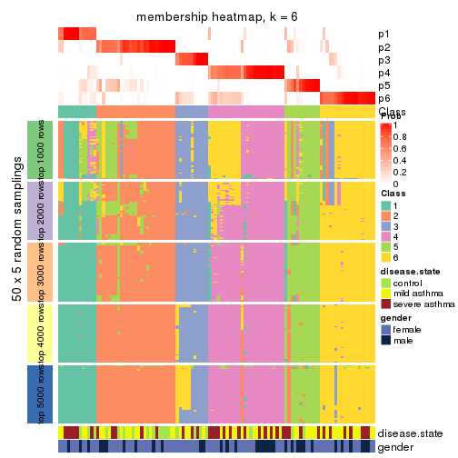</p>

</div>
</div>

As soon as we have had the classes for columns, we can look for signatures
which are significantly different between classes which can be candidate marks
for certain classes. Following are the heatmaps for signatures.


Signature heatmaps where rows are scaled:


<script>
$( function() {
	$( '#tabs-SD-pam-get-signatures' ).tabs();
} );
</script>
<div id='tabs-SD-pam-get-signatures'>
<ul>
<li><a href='#tab-SD-pam-get-signatures-1'>k = 2</a></li>
<li><a href='#tab-SD-pam-get-signatures-2'>k = 3</a></li>
<li><a href='#tab-SD-pam-get-signatures-3'>k = 4</a></li>
<li><a href='#tab-SD-pam-get-signatures-4'>k = 5</a></li>
<li><a href='#tab-SD-pam-get-signatures-5'>k = 6</a></li>
</ul>
<div id='tab-SD-pam-get-signatures-1'>
<pre><code class="r">get_signatures(res, k = 2)
</code></pre>

<p></p>

</div>
<div id='tab-SD-pam-get-signatures-2'>
<pre><code class="r">get_signatures(res, k = 3)
</code></pre>

<p></p>

</div>
<div id='tab-SD-pam-get-signatures-3'>
<pre><code class="r">get_signatures(res, k = 4)
</code></pre>

<p>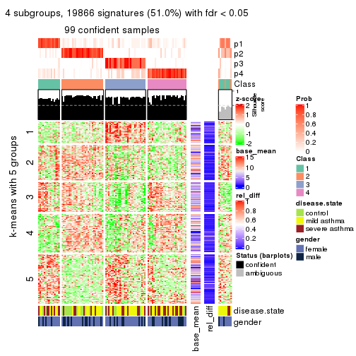</p>

</div>
<div id='tab-SD-pam-get-signatures-4'>
<pre><code class="r">get_signatures(res, k = 5)
</code></pre>

<p></p>

</div>
<div id='tab-SD-pam-get-signatures-5'>
<pre><code class="r">get_signatures(res, k = 6)
</code></pre>

<p></p>

</div>
</div>


Signature heatmaps where rows are not scaled:


<script>
$( function() {
	$( '#tabs-SD-pam-get-signatures-no-scale' ).tabs();
} );
</script>
<div id='tabs-SD-pam-get-signatures-no-scale'>
<ul>
<li><a href='#tab-SD-pam-get-signatures-no-scale-1'>k = 2</a></li>
<li><a href='#tab-SD-pam-get-signatures-no-scale-2'>k = 3</a></li>
<li><a href='#tab-SD-pam-get-signatures-no-scale-3'>k = 4</a></li>
<li><a href='#tab-SD-pam-get-signatures-no-scale-4'>k = 5</a></li>
<li><a href='#tab-SD-pam-get-signatures-no-scale-5'>k = 6</a></li>
</ul>
<div id='tab-SD-pam-get-signatures-no-scale-1'>
<pre><code class="r">get_signatures(res, k = 2, scale_rows = FALSE)
</code></pre>

<p></p>

</div>
<div id='tab-SD-pam-get-signatures-no-scale-2'>
<pre><code class="r">get_signatures(res, k = 3, scale_rows = FALSE)
</code></pre>

<p></p>

</div>
<div id='tab-SD-pam-get-signatures-no-scale-3'>
<pre><code class="r">get_signatures(res, k = 4, scale_rows = FALSE)
</code></pre>

<p></p>

</div>
<div id='tab-SD-pam-get-signatures-no-scale-4'>
<pre><code class="r">get_signatures(res, k = 5, scale_rows = FALSE)
</code></pre>

<p></p>

</div>
<div id='tab-SD-pam-get-signatures-no-scale-5'>
<pre><code class="r">get_signatures(res, k = 6, scale_rows = FALSE)
</code></pre>

<p></p>

</div>
</div>


Compare the overlap of signatures from different k:

```r
compare_signatures(res)
```


`get_signature()` returns a data frame invisibly. TO get the list of signatures, the function
call should be assigned to a variable explicitly. In following code, if `plot` argument is set
to `FALSE`, no heatmap is plotted while only the differential analysis is performed.

```r
# code only for demonstration
tb = get_signature(res, k = ..., plot = FALSE)
```

An example of the output of `tb` is:

```
#>   which_row         fdr    mean_1    mean_2 scaled_mean_1 scaled_mean_2 km
#> 1        38 0.042760348  8.373488  9.131774    -0.5533452     0.5164555  1
#> 2        40 0.018707592  7.106213  8.469186    -0.6173731     0.5762149  1
#> 3        55 0.019134737 10.221463 11.207825    -0.6159697     0.5749050  1
#> 4        59 0.006059896  5.921854  7.869574    -0.6899429     0.6439467  1
#> 5        60 0.018055526  8.928898 10.211722    -0.6204761     0.5791110  1
#> 6        98 0.009384629 15.714769 14.887706     0.6635654    -0.6193277  2
...
```

The columns in `tb` are:

1. `which_row`: row indices corresponding to the input matrix.
2. `fdr`: FDR for the differential test. 
3. `mean_x`: The mean value in group x.
4. `scaled_mean_x`: The mean value in group x after rows are scaled.
5. `km`: Row groups if k-means clustering is applied to rows.


UMAP plot which shows how samples are separated.


<script>
$( function() {
	$( '#tabs-SD-pam-dimension-reduction' ).tabs();
} );
</script>
<div id='tabs-SD-pam-dimension-reduction'>
<ul>
<li><a href='#tab-SD-pam-dimension-reduction-1'>k = 2</a></li>
<li><a href='#tab-SD-pam-dimension-reduction-2'>k = 3</a></li>
<li><a href='#tab-SD-pam-dimension-reduction-3'>k = 4</a></li>
<li><a href='#tab-SD-pam-dimension-reduction-4'>k = 5</a></li>
<li><a href='#tab-SD-pam-dimension-reduction-5'>k = 6</a></li>
</ul>
<div id='tab-SD-pam-dimension-reduction-1'>
<pre><code class="r">dimension_reduction(res, k = 2, method = &quot;UMAP&quot;)
</code></pre>

<p></p>

</div>
<div id='tab-SD-pam-dimension-reduction-2'>
<pre><code class="r">dimension_reduction(res, k = 3, method = &quot;UMAP&quot;)
</code></pre>

<p></p>

</div>
<div id='tab-SD-pam-dimension-reduction-3'>
<pre><code class="r">dimension_reduction(res, k = 4, method = &quot;UMAP&quot;)
</code></pre>

<p></p>

</div>
<div id='tab-SD-pam-dimension-reduction-4'>
<pre><code class="r">dimension_reduction(res, k = 5, method = &quot;UMAP&quot;)
</code></pre>

<p></p>

</div>
<div id='tab-SD-pam-dimension-reduction-5'>
<pre><code class="r">dimension_reduction(res, k = 6, method = &quot;UMAP&quot;)
</code></pre>

<p></p>

</div>
</div>


Following heatmap shows how subgroups are split when increasing `k`:

```r
collect_classes(res)
```


Test correlation between subgroups and known annotations. If the known
annotation is numeric, one-way ANOVA test is applied, and if the known
annotation is discrete, chi-squared contingency table test is applied.

```r
test_to_known_factors(res)
```

```
#>         n disease.state(p) gender(p) k
#> SD:pam 76          0.00167     1.000 2
#> SD:pam 87          0.14071     0.653 3
#> SD:pam 99          0.02249     0.865 4
#> SD:pam 99          0.07762     0.610 5
#> SD:pam 99          0.05642     0.612 6
```


If matrix rows can be associated to genes, consider to use `GO_Enrichment(res,
...)` to perform function enrichment for the signature genes.


 

---------------------------------------------------


### SD:mclust


The object with results only for a single top-value method and a single partition method 
can be extracted as:

```r
res = res_list["SD", "mclust"]
# you can also extract it by
# res = res_list["SD:mclust"]
```

A summary of `res` and all the functions that can be applied to it:

```r
res
```

```
#> A 'ConsensusPartition' object with k = 2, 3, 4, 5, 6.
#>   On a matrix with 38950 rows and 108 columns.
#>   Top rows (1000, 2000, 3000, 4000, 5000) are extracted by 'SD' method.
#>   Subgroups are detected by 'mclust' method.
#>   Performed in total 1250 partitions by row resampling.
#>   Best k for subgroups seems to be 3.
#> 
#> Following methods can be applied to this 'ConsensusPartition' object:
#>  [1] "cola_report"             "collect_classes"         "collect_plots"          
#>  [4] "collect_stats"           "colnames"                "compare_signatures"     
#>  [7] "consensus_heatmap"       "dimension_reduction"     "functional_enrichment"  
#> [10] "get_anno_col"            "get_anno"                "get_classes"            
#> [13] "get_consensus"           "get_matrix"              "get_membership"         
#> [16] "get_param"               "get_signatures"          "get_stats"              
#> [19] "is_best_k"               "is_stable_k"             "membership_heatmap"     
#> [22] "ncol"                    "nrow"                    "plot_ecdf"              
#> [25] "rownames"                "select_partition_number" "show"                   
#> [28] "suggest_best_k"          "test_to_known_factors"
```

`collect_plots()` function collects all the plots made from `res` for all `k` (number of partitions)
into one single page to provide an easy and fast comparison between different `k`.

```r
collect_plots(res)
```


The plots are:

- The first row: a plot of the ECDF (Empirical cumulative distribution
  function) curves of the consensus matrix for each `k` and the heatmap of
  predicted classes for each `k`.
- The second row: heatmaps of the consensus matrix for each `k`.
- The third row: heatmaps of the membership matrix for each `k`.
- The fouth row: heatmaps of the signatures for each `k`.

All the plots in panels can be made by individual functions and they are
plotted later in this section.

`select_partition_number()` produces several plots showing different
statistics for choosing "optimized" `k`. There are following statistics:

- ECDF curves of the consensus matrix for each `k`;
- 1-PAC. [The PAC
  score](https://en.wikipedia.org/wiki/Consensus_clustering#Over-interpretation_potential_of_consensus_clustering)
  measures the proportion of the ambiguous subgrouping.
- Mean silhouette score.
- Concordance. The mean probability of fiting the consensus class ids in all
  partitions.
- Area increased. Denote $A_k$ as the area under the ECDF curve for current
  `k`, the area increased is defined as $A_k - A_{k-1}$.
- Rand index. The percent of pairs of samples that are both in a same cluster
  or both are not in a same cluster in the partition of k and k-1.
- Jaccard index. The ratio of pairs of samples are both in a same cluster in
  the partition of k and k-1 and the pairs of samples are both in a same
  cluster in the partition k or k-1.

The detailed explanations of these statistics can be found in [the cola
vignette](http://bioconductor.org/packages/devel/bioc/vignettes/cola/inst/doc/cola.html#toc_13).

Generally speaking, lower PAC score, higher mean silhouette score or higher
concordance corresponds to better partition. Rand index and Jaccard index
measure how similar the current partition is compared to partition with `k-1`.
If they are too similar, we won't accept `k` is better than `k-1`.

```r
select_partition_number(res)
```


The numeric values for all these statistics can be obtained by `get_stats()`.

```r
get_stats(res)
```

```
#>   k 1-PAC mean_silhouette concordance area_increased  Rand Jaccard
#> 2 2 0.717           0.931       0.940         0.2486 0.786   0.786
#> 3 3 0.686           0.886       0.913         0.9285 0.740   0.670
#> 4 4 0.677           0.829       0.903         0.4877 0.710   0.469
#> 5 5 0.641           0.768       0.857         0.0502 0.924   0.743
#> 6 6 0.637           0.564       0.763         0.0645 0.909   0.657
```

`suggest_best_k()` suggests the best $k$ based on these statistics. The rules are as follows:

- All $k$ with Jaccard index larger than 0.95 are removed because the increase of
  the partition number does not provides enough extra information. If all $k$ are removed,
  the best $k$ is assigned by `NA`.
- For $k$ with 1-PAC larger than 0.9, the maximal $k$ is taken as the "best k". Other $k$ is called "optional k".
- If it does not fit the second rule. The $k$ with the highest vote of highest
  1-PAC, mean silhouette and concordance is taken as the "best k".

```r
suggest_best_k(res)
```

```
#> [1] 3
```


Following shows the table of the partitions (You need to click the **show/hide
code output** link to see it). The membership matrix (columns with name `p*`)
is inferred by
[`clue::cl_consensus()`](https://www.rdocumentation.org/link/cl_consensus?package=clue)
function with the `SE` method. Basically the value in the membership matrix
represents the probability to belong to a certain group. The finall class
label for an item is determined with the group with highest probability it
belongs to.

In `get_classes()` function, the entropy is calculated from the membership
matrix and the silhouette score is calculated from the consensus matrix.


<script>
$( function() {
	$( '#tabs-SD-mclust-get-classes' ).tabs();
} );
</script>
<div id='tabs-SD-mclust-get-classes'>
<ul>
<li><a href='#tab-SD-mclust-get-classes-1'>k = 2</a></li>
<li><a href='#tab-SD-mclust-get-classes-2'>k = 3</a></li>
<li><a href='#tab-SD-mclust-get-classes-3'>k = 4</a></li>
<li><a href='#tab-SD-mclust-get-classes-4'>k = 5</a></li>
<li><a href='#tab-SD-mclust-get-classes-5'>k = 6</a></li>
</ul>

<div id='tab-SD-mclust-get-classes-1'>
<p><a id='tab-SD-mclust-get-classes-1-a' style='color:#0366d6' href='#'>show/hide code output</a></p>
<pre><code class="r">cbind(get_classes(res, k = 2), get_membership(res, k = 2))
</code></pre>

<pre><code>#&gt;            class entropy silhouette    p1    p2
#&gt; GSM1068478     2  0.4562      0.937 0.096 0.904
#&gt; GSM1068479     2  0.5294      0.927 0.120 0.880
#&gt; GSM1068481     1  0.0000      0.972 1.000 0.000
#&gt; GSM1068482     1  0.0000      0.972 1.000 0.000
#&gt; GSM1068483     2  0.4939      0.934 0.108 0.892
#&gt; GSM1068486     1  0.0000      0.972 1.000 0.000
#&gt; GSM1068487     2  0.0000      0.933 0.000 1.000
#&gt; GSM1068488     2  0.4690      0.936 0.100 0.900
#&gt; GSM1068490     2  0.0000      0.933 0.000 1.000
#&gt; GSM1068491     1  0.6801      0.767 0.820 0.180
#&gt; GSM1068492     2  0.7299      0.847 0.204 0.796
#&gt; GSM1068493     2  0.4431      0.938 0.092 0.908
#&gt; GSM1068494     2  0.5737      0.919 0.136 0.864
#&gt; GSM1068495     2  0.0000      0.933 0.000 1.000
#&gt; GSM1068496     2  0.5737      0.919 0.136 0.864
#&gt; GSM1068498     2  0.4562      0.937 0.096 0.904
#&gt; GSM1068499     2  0.5737      0.919 0.136 0.864
#&gt; GSM1068500     2  0.4939      0.934 0.108 0.892
#&gt; GSM1068502     2  0.8608      0.727 0.284 0.716
#&gt; GSM1068503     2  0.0000      0.933 0.000 1.000
#&gt; GSM1068505     2  0.0000      0.933 0.000 1.000
#&gt; GSM1068506     2  0.0000      0.933 0.000 1.000
#&gt; GSM1068507     2  0.0000      0.933 0.000 1.000
#&gt; GSM1068508     2  0.0000      0.933 0.000 1.000
#&gt; GSM1068510     2  0.4431      0.938 0.092 0.908
#&gt; GSM1068512     2  0.4939      0.933 0.108 0.892
#&gt; GSM1068513     2  0.0000      0.933 0.000 1.000
#&gt; GSM1068514     2  0.5294      0.927 0.120 0.880
#&gt; GSM1068517     2  0.4431      0.938 0.092 0.908
#&gt; GSM1068518     2  0.4022      0.939 0.080 0.920
#&gt; GSM1068520     2  0.4562      0.937 0.096 0.904
#&gt; GSM1068521     2  0.4690      0.936 0.100 0.900
#&gt; GSM1068522     2  0.0000      0.933 0.000 1.000
#&gt; GSM1068524     2  0.0000      0.933 0.000 1.000
#&gt; GSM1068527     2  0.4690      0.936 0.100 0.900
#&gt; GSM1068480     1  0.0000      0.972 1.000 0.000
#&gt; GSM1068484     2  0.0000      0.933 0.000 1.000
#&gt; GSM1068485     1  0.0000      0.972 1.000 0.000
#&gt; GSM1068489     2  0.0000      0.933 0.000 1.000
#&gt; GSM1068497     2  0.4431      0.938 0.092 0.908
#&gt; GSM1068501     2  0.0376      0.934 0.004 0.996
#&gt; GSM1068504     2  0.0000      0.933 0.000 1.000
#&gt; GSM1068509     2  0.4690      0.936 0.100 0.900
#&gt; GSM1068511     2  0.4562      0.937 0.096 0.904
#&gt; GSM1068515     2  0.4562      0.937 0.096 0.904
#&gt; GSM1068516     2  0.2778      0.938 0.048 0.952
#&gt; GSM1068519     2  0.5737      0.919 0.136 0.864
#&gt; GSM1068523     2  0.0000      0.933 0.000 1.000
#&gt; GSM1068525     2  0.0000      0.933 0.000 1.000
#&gt; GSM1068526     2  0.0000      0.933 0.000 1.000
#&gt; GSM1068458     2  0.4690      0.936 0.100 0.900
#&gt; GSM1068459     1  0.0000      0.972 1.000 0.000
#&gt; GSM1068460     2  0.4431      0.938 0.092 0.908
#&gt; GSM1068461     1  0.0000      0.972 1.000 0.000
#&gt; GSM1068464     2  0.0000      0.933 0.000 1.000
#&gt; GSM1068468     2  0.0000      0.933 0.000 1.000
#&gt; GSM1068472     2  0.4298      0.938 0.088 0.912
#&gt; GSM1068473     2  0.0000      0.933 0.000 1.000
#&gt; GSM1068474     2  0.0000      0.933 0.000 1.000
#&gt; GSM1068476     1  0.5408      0.850 0.876 0.124
#&gt; GSM1068477     2  0.0000      0.933 0.000 1.000
#&gt; GSM1068462     2  0.4431      0.938 0.092 0.908
#&gt; GSM1068463     1  0.0000      0.972 1.000 0.000
#&gt; GSM1068465     2  0.4431      0.938 0.092 0.908
#&gt; GSM1068466     2  0.4562      0.937 0.096 0.904
#&gt; GSM1068467     2  0.3431      0.939 0.064 0.936
#&gt; GSM1068469     2  0.4431      0.938 0.092 0.908
#&gt; GSM1068470     2  0.0000      0.933 0.000 1.000
#&gt; GSM1068471     2  0.0000      0.933 0.000 1.000
#&gt; GSM1068475     2  0.0000      0.933 0.000 1.000
#&gt; GSM1068528     2  0.5737      0.919 0.136 0.864
#&gt; GSM1068531     2  0.5737      0.919 0.136 0.864
#&gt; GSM1068532     2  0.6531      0.893 0.168 0.832
#&gt; GSM1068533     2  0.5737      0.919 0.136 0.864
#&gt; GSM1068535     2  0.5294      0.927 0.120 0.880
#&gt; GSM1068537     2  0.5737      0.919 0.136 0.864
#&gt; GSM1068538     2  0.5737      0.919 0.136 0.864
#&gt; GSM1068539     2  0.0000      0.933 0.000 1.000
#&gt; GSM1068540     2  0.5737      0.919 0.136 0.864
#&gt; GSM1068542     2  0.0000      0.933 0.000 1.000
#&gt; GSM1068543     2  0.5294      0.927 0.120 0.880
#&gt; GSM1068544     1  0.0000      0.972 1.000 0.000
#&gt; GSM1068545     2  0.0000      0.933 0.000 1.000
#&gt; GSM1068546     1  0.0000      0.972 1.000 0.000
#&gt; GSM1068547     2  0.4815      0.935 0.104 0.896
#&gt; GSM1068548     2  0.0000      0.933 0.000 1.000
#&gt; GSM1068549     1  0.0000      0.972 1.000 0.000
#&gt; GSM1068550     2  0.0000      0.933 0.000 1.000
#&gt; GSM1068551     2  0.0000      0.933 0.000 1.000
#&gt; GSM1068552     2  0.0000      0.933 0.000 1.000
#&gt; GSM1068555     2  0.0000      0.933 0.000 1.000
#&gt; GSM1068556     2  0.5294      0.927 0.120 0.880
#&gt; GSM1068557     2  0.0000      0.933 0.000 1.000
#&gt; GSM1068560     2  0.0000      0.933 0.000 1.000
#&gt; GSM1068561     2  0.1633      0.936 0.024 0.976
#&gt; GSM1068562     2  0.0000      0.933 0.000 1.000
#&gt; GSM1068563     2  0.0000      0.933 0.000 1.000
#&gt; GSM1068565     2  0.0000      0.933 0.000 1.000
#&gt; GSM1068529     2  0.5294      0.927 0.120 0.880
#&gt; GSM1068530     2  0.5737      0.919 0.136 0.864
#&gt; GSM1068534     2  0.4431      0.938 0.092 0.908
#&gt; GSM1068536     2  0.4431      0.938 0.092 0.908
#&gt; GSM1068541     2  0.0376      0.934 0.004 0.996
#&gt; GSM1068553     2  0.5059      0.931 0.112 0.888
#&gt; GSM1068554     2  0.4431      0.938 0.092 0.908
#&gt; GSM1068558     2  0.6247      0.901 0.156 0.844
#&gt; GSM1068559     2  0.5294      0.927 0.120 0.880
#&gt; GSM1068564     2  0.0000      0.933 0.000 1.000
</code></pre>

<script>
$('#tab-SD-mclust-get-classes-1-a').parent().next().next().hide();
$('#tab-SD-mclust-get-classes-1-a').click(function(){
  $('#tab-SD-mclust-get-classes-1-a').parent().next().next().toggle();
  return(false);
});
</script>
</div>

<div id='tab-SD-mclust-get-classes-2'>
<p><a id='tab-SD-mclust-get-classes-2-a' style='color:#0366d6' href='#'>show/hide code output</a></p>
<pre><code class="r">cbind(get_classes(res, k = 3), get_membership(res, k = 3))
</code></pre>

<pre><code>#&gt;            class entropy silhouette    p1    p2    p3
#&gt; GSM1068478     1  0.4702     0.7950 0.788 0.212 0.000
#&gt; GSM1068479     2  0.2955     0.9140 0.080 0.912 0.008
#&gt; GSM1068481     3  0.2860     0.9927 0.084 0.004 0.912
#&gt; GSM1068482     3  0.2860     0.9927 0.084 0.004 0.912
#&gt; GSM1068483     1  0.4399     0.8311 0.812 0.188 0.000
#&gt; GSM1068486     3  0.2772     0.9910 0.080 0.004 0.916
#&gt; GSM1068487     2  0.2356     0.9123 0.000 0.928 0.072
#&gt; GSM1068488     2  0.2878     0.9099 0.096 0.904 0.000
#&gt; GSM1068490     2  0.2625     0.9093 0.000 0.916 0.084
#&gt; GSM1068491     3  0.3550     0.9619 0.080 0.024 0.896
#&gt; GSM1068492     2  0.6119     0.7745 0.064 0.772 0.164
#&gt; GSM1068493     2  0.2772     0.9137 0.080 0.916 0.004
#&gt; GSM1068494     1  0.3851     0.8651 0.860 0.136 0.004
#&gt; GSM1068495     2  0.2496     0.9192 0.068 0.928 0.004
#&gt; GSM1068496     1  0.3619     0.8655 0.864 0.136 0.000
#&gt; GSM1068498     2  0.3412     0.8913 0.124 0.876 0.000
#&gt; GSM1068499     1  0.4121     0.8488 0.832 0.168 0.000
#&gt; GSM1068500     1  0.4555     0.8162 0.800 0.200 0.000
#&gt; GSM1068502     2  0.6875     0.7208 0.080 0.724 0.196
#&gt; GSM1068503     2  0.0000     0.9174 0.000 1.000 0.000
#&gt; GSM1068505     2  0.0424     0.9156 0.008 0.992 0.000
#&gt; GSM1068506     2  0.0237     0.9160 0.004 0.996 0.000
#&gt; GSM1068507     2  0.0424     0.9195 0.008 0.992 0.000
#&gt; GSM1068508     2  0.2860     0.9137 0.084 0.912 0.004
#&gt; GSM1068510     2  0.2165     0.9182 0.064 0.936 0.000
#&gt; GSM1068512     2  0.2301     0.9061 0.060 0.936 0.004
#&gt; GSM1068513     2  0.0000     0.9174 0.000 1.000 0.000
#&gt; GSM1068514     2  0.3045     0.9161 0.064 0.916 0.020
#&gt; GSM1068517     2  0.2711     0.9133 0.088 0.912 0.000
#&gt; GSM1068518     2  0.3030     0.9106 0.092 0.904 0.004
#&gt; GSM1068520     1  0.3941     0.8554 0.844 0.156 0.000
#&gt; GSM1068521     1  0.3752     0.8633 0.856 0.144 0.000
#&gt; GSM1068522     2  0.0237     0.9160 0.004 0.996 0.000
#&gt; GSM1068524     2  0.0000     0.9174 0.000 1.000 0.000
#&gt; GSM1068527     2  0.2165     0.8936 0.064 0.936 0.000
#&gt; GSM1068480     3  0.2860     0.9927 0.084 0.004 0.912
#&gt; GSM1068484     2  0.0424     0.9156 0.008 0.992 0.000
#&gt; GSM1068485     3  0.2860     0.9927 0.084 0.004 0.912
#&gt; GSM1068489     2  0.0237     0.9160 0.004 0.996 0.000
#&gt; GSM1068497     2  0.2711     0.9133 0.088 0.912 0.000
#&gt; GSM1068501     2  0.0237     0.9172 0.004 0.996 0.000
#&gt; GSM1068504     2  0.2625     0.9093 0.000 0.916 0.084
#&gt; GSM1068509     2  0.6521    -0.0376 0.496 0.500 0.004
#&gt; GSM1068511     2  0.3425     0.9015 0.112 0.884 0.004
#&gt; GSM1068515     2  0.4399     0.8131 0.188 0.812 0.000
#&gt; GSM1068516     2  0.0475     0.9191 0.004 0.992 0.004
#&gt; GSM1068519     1  0.3412     0.8656 0.876 0.124 0.000
#&gt; GSM1068523     2  0.2860     0.9087 0.004 0.912 0.084
#&gt; GSM1068525     2  0.0000     0.9174 0.000 1.000 0.000
#&gt; GSM1068526     2  0.0237     0.9160 0.004 0.996 0.000
#&gt; GSM1068458     1  0.3879     0.8596 0.848 0.152 0.000
#&gt; GSM1068459     3  0.2860     0.9927 0.084 0.004 0.912
#&gt; GSM1068460     2  0.3784     0.8921 0.132 0.864 0.004
#&gt; GSM1068461     3  0.2860     0.9927 0.084 0.004 0.912
#&gt; GSM1068464     2  0.2625     0.9093 0.000 0.916 0.084
#&gt; GSM1068468     2  0.2772     0.9137 0.080 0.916 0.004
#&gt; GSM1068472     2  0.2772     0.9137 0.080 0.916 0.004
#&gt; GSM1068473     2  0.2625     0.9093 0.000 0.916 0.084
#&gt; GSM1068474     2  0.2625     0.9093 0.000 0.916 0.084
#&gt; GSM1068476     3  0.2955     0.9874 0.080 0.008 0.912
#&gt; GSM1068477     2  0.2772     0.9137 0.080 0.916 0.004
#&gt; GSM1068462     2  0.2772     0.9137 0.080 0.916 0.004
#&gt; GSM1068463     3  0.2860     0.9927 0.084 0.004 0.912
#&gt; GSM1068465     2  0.3983     0.8696 0.144 0.852 0.004
#&gt; GSM1068466     1  0.4291     0.8361 0.820 0.180 0.000
#&gt; GSM1068467     2  0.2772     0.9137 0.080 0.916 0.004
#&gt; GSM1068469     2  0.2625     0.9131 0.084 0.916 0.000
#&gt; GSM1068470     2  0.2860     0.9087 0.004 0.912 0.084
#&gt; GSM1068471     2  0.2625     0.9093 0.000 0.916 0.084
#&gt; GSM1068475     2  0.2860     0.9087 0.004 0.912 0.084
#&gt; GSM1068528     1  0.3995     0.7686 0.868 0.016 0.116
#&gt; GSM1068531     1  0.0237     0.8158 0.996 0.004 0.000
#&gt; GSM1068532     1  0.0424     0.8178 0.992 0.008 0.000
#&gt; GSM1068533     1  0.0424     0.8178 0.992 0.008 0.000
#&gt; GSM1068535     2  0.6286     0.2448 0.464 0.536 0.000
#&gt; GSM1068537     1  0.0424     0.8178 0.992 0.008 0.000
#&gt; GSM1068538     1  0.0424     0.8178 0.992 0.008 0.000
#&gt; GSM1068539     2  0.0829     0.9199 0.012 0.984 0.004
#&gt; GSM1068540     1  0.0592     0.8231 0.988 0.012 0.000
#&gt; GSM1068542     2  0.1643     0.9065 0.044 0.956 0.000
#&gt; GSM1068543     2  0.2066     0.9024 0.060 0.940 0.000
#&gt; GSM1068544     3  0.3193     0.9781 0.100 0.004 0.896
#&gt; GSM1068545     2  0.0424     0.9185 0.008 0.992 0.000
#&gt; GSM1068546     3  0.2772     0.9910 0.080 0.004 0.916
#&gt; GSM1068547     1  0.2448     0.8547 0.924 0.076 0.000
#&gt; GSM1068548     2  0.2356     0.8889 0.072 0.928 0.000
#&gt; GSM1068549     3  0.2772     0.9910 0.080 0.004 0.916
#&gt; GSM1068550     2  0.0747     0.9156 0.016 0.984 0.000
#&gt; GSM1068551     2  0.2625     0.9093 0.000 0.916 0.084
#&gt; GSM1068552     2  0.0237     0.9160 0.004 0.996 0.000
#&gt; GSM1068555     2  0.2860     0.9087 0.004 0.912 0.084
#&gt; GSM1068556     2  0.2261     0.8885 0.068 0.932 0.000
#&gt; GSM1068557     2  0.2772     0.9137 0.080 0.916 0.004
#&gt; GSM1068560     2  0.1289     0.9116 0.032 0.968 0.000
#&gt; GSM1068561     2  0.2772     0.9137 0.080 0.916 0.004
#&gt; GSM1068562     2  0.0424     0.9163 0.008 0.992 0.000
#&gt; GSM1068563     2  0.0424     0.9163 0.008 0.992 0.000
#&gt; GSM1068565     2  0.2860     0.9087 0.004 0.912 0.084
#&gt; GSM1068529     2  0.2772     0.9137 0.080 0.916 0.004
#&gt; GSM1068530     1  0.0237     0.8158 0.996 0.004 0.000
#&gt; GSM1068534     2  0.2860     0.9131 0.084 0.912 0.004
#&gt; GSM1068536     2  0.3573     0.8994 0.120 0.876 0.004
#&gt; GSM1068541     2  0.2860     0.9137 0.084 0.912 0.004
#&gt; GSM1068553     2  0.3340     0.8959 0.120 0.880 0.000
#&gt; GSM1068554     2  0.1753     0.9213 0.048 0.952 0.000
#&gt; GSM1068558     2  0.5884     0.7963 0.064 0.788 0.148
#&gt; GSM1068559     2  0.2772     0.9137 0.080 0.916 0.004
#&gt; GSM1068564     2  0.0424     0.9156 0.008 0.992 0.000
</code></pre>

<script>
$('#tab-SD-mclust-get-classes-2-a').parent().next().next().hide();
$('#tab-SD-mclust-get-classes-2-a').click(function(){
  $('#tab-SD-mclust-get-classes-2-a').parent().next().next().toggle();
  return(false);
});
</script>
</div>

<div id='tab-SD-mclust-get-classes-3'>
<p><a id='tab-SD-mclust-get-classes-3-a' style='color:#0366d6' href='#'>show/hide code output</a></p>
<pre><code class="r">cbind(get_classes(res, k = 4), get_membership(res, k = 4))
</code></pre>

<pre><code>#&gt;            class entropy silhouette    p1    p2    p3    p4
#&gt; GSM1068478     1  0.3751      0.911 0.800 0.004 0.000 0.196
#&gt; GSM1068479     2  0.2737      0.803 0.000 0.888 0.104 0.008
#&gt; GSM1068481     3  0.0000      0.999 0.000 0.000 1.000 0.000
#&gt; GSM1068482     3  0.0000      0.999 0.000 0.000 1.000 0.000
#&gt; GSM1068483     1  0.3751      0.911 0.800 0.004 0.000 0.196
#&gt; GSM1068486     3  0.0000      0.999 0.000 0.000 1.000 0.000
#&gt; GSM1068487     2  0.0000      0.882 0.000 1.000 0.000 0.000
#&gt; GSM1068488     4  0.0336      0.883 0.000 0.008 0.000 0.992
#&gt; GSM1068490     2  0.0000      0.882 0.000 1.000 0.000 0.000
#&gt; GSM1068491     3  0.0188      0.996 0.000 0.000 0.996 0.004
#&gt; GSM1068492     4  0.4250      0.614 0.000 0.000 0.276 0.724
#&gt; GSM1068493     2  0.3528      0.739 0.000 0.808 0.000 0.192
#&gt; GSM1068494     4  0.4713      0.178 0.360 0.000 0.000 0.640
#&gt; GSM1068495     2  0.4955      0.317 0.000 0.556 0.000 0.444
#&gt; GSM1068496     1  0.3569      0.912 0.804 0.000 0.000 0.196
#&gt; GSM1068498     2  0.2401      0.830 0.004 0.904 0.000 0.092
#&gt; GSM1068499     1  0.3569      0.912 0.804 0.000 0.000 0.196
#&gt; GSM1068500     1  0.3751      0.911 0.800 0.004 0.000 0.196
#&gt; GSM1068502     2  0.5138      0.353 0.000 0.600 0.392 0.008
#&gt; GSM1068503     2  0.1022      0.865 0.000 0.968 0.000 0.032
#&gt; GSM1068505     4  0.2530      0.842 0.000 0.112 0.000 0.888
#&gt; GSM1068506     4  0.2469      0.844 0.000 0.108 0.000 0.892
#&gt; GSM1068507     4  0.3610      0.756 0.000 0.200 0.000 0.800
#&gt; GSM1068508     2  0.3024      0.785 0.000 0.852 0.000 0.148
#&gt; GSM1068510     4  0.3610      0.760 0.000 0.200 0.000 0.800
#&gt; GSM1068512     4  0.0188      0.881 0.004 0.000 0.000 0.996
#&gt; GSM1068513     2  0.4761      0.328 0.000 0.628 0.000 0.372
#&gt; GSM1068514     4  0.1637      0.856 0.000 0.000 0.060 0.940
#&gt; GSM1068517     2  0.0376      0.880 0.004 0.992 0.000 0.004
#&gt; GSM1068518     4  0.0188      0.882 0.000 0.004 0.000 0.996
#&gt; GSM1068520     1  0.3569      0.912 0.804 0.000 0.000 0.196
#&gt; GSM1068521     1  0.3569      0.912 0.804 0.000 0.000 0.196
#&gt; GSM1068522     4  0.4972      0.261 0.000 0.456 0.000 0.544
#&gt; GSM1068524     2  0.3649      0.691 0.000 0.796 0.000 0.204
#&gt; GSM1068527     4  0.0376      0.882 0.004 0.004 0.000 0.992
#&gt; GSM1068480     3  0.0188      0.997 0.000 0.000 0.996 0.004
#&gt; GSM1068484     4  0.0336      0.883 0.000 0.008 0.000 0.992
#&gt; GSM1068485     3  0.0000      0.999 0.000 0.000 1.000 0.000
#&gt; GSM1068489     4  0.0707      0.882 0.000 0.020 0.000 0.980
#&gt; GSM1068497     2  0.0188      0.881 0.004 0.996 0.000 0.000
#&gt; GSM1068501     4  0.2408      0.847 0.000 0.104 0.000 0.896
#&gt; GSM1068504     2  0.0000      0.882 0.000 1.000 0.000 0.000
#&gt; GSM1068509     1  0.4535      0.804 0.704 0.004 0.000 0.292
#&gt; GSM1068511     4  0.0188      0.882 0.000 0.004 0.000 0.996
#&gt; GSM1068515     2  0.7015      0.019 0.396 0.484 0.000 0.120
#&gt; GSM1068516     4  0.0188      0.882 0.000 0.004 0.000 0.996
#&gt; GSM1068519     1  0.3569      0.912 0.804 0.000 0.000 0.196
#&gt; GSM1068523     2  0.0000      0.882 0.000 1.000 0.000 0.000
#&gt; GSM1068525     4  0.1637      0.868 0.000 0.060 0.000 0.940
#&gt; GSM1068526     4  0.0921      0.879 0.000 0.028 0.000 0.972
#&gt; GSM1068458     1  0.3569      0.912 0.804 0.000 0.000 0.196
#&gt; GSM1068459     3  0.0000      0.999 0.000 0.000 1.000 0.000
#&gt; GSM1068460     1  0.3610      0.911 0.800 0.000 0.000 0.200
#&gt; GSM1068461     3  0.0000      0.999 0.000 0.000 1.000 0.000
#&gt; GSM1068464     2  0.0000      0.882 0.000 1.000 0.000 0.000
#&gt; GSM1068468     2  0.0188      0.881 0.000 0.996 0.000 0.004
#&gt; GSM1068472     2  0.0188      0.881 0.000 0.996 0.000 0.004
#&gt; GSM1068473     2  0.0000      0.882 0.000 1.000 0.000 0.000
#&gt; GSM1068474     2  0.0000      0.882 0.000 1.000 0.000 0.000
#&gt; GSM1068476     3  0.0188      0.996 0.000 0.000 0.996 0.004
#&gt; GSM1068477     2  0.0188      0.881 0.000 0.996 0.000 0.004
#&gt; GSM1068462     2  0.0188      0.881 0.000 0.996 0.000 0.004
#&gt; GSM1068463     3  0.0000      0.999 0.000 0.000 1.000 0.000
#&gt; GSM1068465     1  0.6497      0.749 0.640 0.160 0.000 0.200
#&gt; GSM1068466     1  0.3751      0.911 0.800 0.004 0.000 0.196
#&gt; GSM1068467     2  0.0188      0.881 0.000 0.996 0.000 0.004
#&gt; GSM1068469     2  0.0188      0.881 0.004 0.996 0.000 0.000
#&gt; GSM1068470     2  0.0000      0.882 0.000 1.000 0.000 0.000
#&gt; GSM1068471     2  0.0000      0.882 0.000 1.000 0.000 0.000
#&gt; GSM1068475     2  0.0000      0.882 0.000 1.000 0.000 0.000
#&gt; GSM1068528     1  0.4499      0.862 0.804 0.000 0.072 0.124
#&gt; GSM1068531     1  0.0000      0.795 1.000 0.000 0.000 0.000
#&gt; GSM1068532     1  0.0000      0.795 1.000 0.000 0.000 0.000
#&gt; GSM1068533     1  0.0000      0.795 1.000 0.000 0.000 0.000
#&gt; GSM1068535     4  0.3486      0.764 0.188 0.000 0.000 0.812
#&gt; GSM1068537     1  0.0000      0.795 1.000 0.000 0.000 0.000
#&gt; GSM1068538     1  0.0000      0.795 1.000 0.000 0.000 0.000
#&gt; GSM1068539     4  0.4564      0.417 0.000 0.328 0.000 0.672
#&gt; GSM1068540     1  0.3569      0.912 0.804 0.000 0.000 0.196
#&gt; GSM1068542     4  0.0336      0.883 0.000 0.008 0.000 0.992
#&gt; GSM1068543     4  0.0376      0.882 0.004 0.004 0.000 0.992
#&gt; GSM1068544     3  0.0188      0.996 0.004 0.000 0.996 0.000
#&gt; GSM1068545     2  0.3764      0.727 0.000 0.784 0.000 0.216
#&gt; GSM1068546     3  0.0000      0.999 0.000 0.000 1.000 0.000
#&gt; GSM1068547     1  0.3569      0.912 0.804 0.000 0.000 0.196
#&gt; GSM1068548     4  0.0376      0.882 0.004 0.004 0.000 0.992
#&gt; GSM1068549     3  0.0000      0.999 0.000 0.000 1.000 0.000
#&gt; GSM1068550     4  0.0336      0.883 0.000 0.008 0.000 0.992
#&gt; GSM1068551     2  0.0000      0.882 0.000 1.000 0.000 0.000
#&gt; GSM1068552     4  0.3266      0.796 0.000 0.168 0.000 0.832
#&gt; GSM1068555     2  0.0000      0.882 0.000 1.000 0.000 0.000
#&gt; GSM1068556     4  0.0376      0.882 0.004 0.004 0.000 0.992
#&gt; GSM1068557     2  0.2814      0.803 0.000 0.868 0.000 0.132
#&gt; GSM1068560     4  0.0336      0.883 0.000 0.008 0.000 0.992
#&gt; GSM1068561     2  0.4746      0.476 0.000 0.632 0.000 0.368
#&gt; GSM1068562     4  0.0336      0.883 0.000 0.008 0.000 0.992
#&gt; GSM1068563     4  0.0336      0.883 0.000 0.008 0.000 0.992
#&gt; GSM1068565     2  0.0000      0.882 0.000 1.000 0.000 0.000
#&gt; GSM1068529     4  0.0000      0.881 0.000 0.000 0.000 1.000
#&gt; GSM1068530     1  0.0000      0.795 1.000 0.000 0.000 0.000
#&gt; GSM1068534     4  0.0188      0.882 0.000 0.004 0.000 0.996
#&gt; GSM1068536     1  0.3945      0.897 0.780 0.004 0.000 0.216
#&gt; GSM1068541     2  0.3266      0.767 0.000 0.832 0.000 0.168
#&gt; GSM1068553     4  0.0895      0.879 0.020 0.004 0.000 0.976
#&gt; GSM1068554     4  0.3649      0.755 0.000 0.204 0.000 0.796
#&gt; GSM1068558     4  0.3569      0.721 0.000 0.000 0.196 0.804
#&gt; GSM1068559     4  0.0188      0.882 0.000 0.004 0.000 0.996
#&gt; GSM1068564     4  0.3528      0.770 0.000 0.192 0.000 0.808
</code></pre>

<script>
$('#tab-SD-mclust-get-classes-3-a').parent().next().next().hide();
$('#tab-SD-mclust-get-classes-3-a').click(function(){
  $('#tab-SD-mclust-get-classes-3-a').parent().next().next().toggle();
  return(false);
});
</script>
</div>

<div id='tab-SD-mclust-get-classes-4'>
<p><a id='tab-SD-mclust-get-classes-4-a' style='color:#0366d6' href='#'>show/hide code output</a></p>
<pre><code class="r">cbind(get_classes(res, k = 5), get_membership(res, k = 5))
</code></pre>

<pre><code>#&gt;            class entropy silhouette    p1    p2    p3    p4    p5
#&gt; GSM1068478     5  0.6144      0.263 0.280 0.000 0.000 0.172 0.548
#&gt; GSM1068479     2  0.5505      0.628 0.000 0.712 0.056 0.072 0.160
#&gt; GSM1068481     3  0.0162      0.982 0.004 0.000 0.996 0.000 0.000
#&gt; GSM1068482     3  0.0162      0.982 0.004 0.000 0.996 0.000 0.000
#&gt; GSM1068483     1  0.4883      0.772 0.708 0.000 0.000 0.200 0.092
#&gt; GSM1068486     3  0.0000      0.979 0.000 0.000 1.000 0.000 0.000
#&gt; GSM1068487     2  0.1671      0.775 0.000 0.924 0.000 0.076 0.000
#&gt; GSM1068488     4  0.0807      0.869 0.000 0.012 0.000 0.976 0.012
#&gt; GSM1068490     2  0.0000      0.804 0.000 1.000 0.000 0.000 0.000
#&gt; GSM1068491     3  0.0510      0.972 0.000 0.000 0.984 0.000 0.016
#&gt; GSM1068492     4  0.4872      0.686 0.000 0.000 0.120 0.720 0.160
#&gt; GSM1068493     5  0.5530      0.646 0.000 0.096 0.004 0.268 0.632
#&gt; GSM1068494     4  0.4697      0.144 0.360 0.000 0.008 0.620 0.012
#&gt; GSM1068495     4  0.4709      0.605 0.000 0.068 0.004 0.728 0.200
#&gt; GSM1068496     1  0.3550      0.819 0.796 0.000 0.000 0.184 0.020
#&gt; GSM1068498     5  0.3972      0.697 0.012 0.188 0.000 0.020 0.780
#&gt; GSM1068499     1  0.3511      0.819 0.800 0.000 0.004 0.184 0.012
#&gt; GSM1068500     1  0.5169      0.749 0.688 0.000 0.000 0.184 0.128
#&gt; GSM1068502     2  0.7021      0.432 0.000 0.564 0.204 0.072 0.160
#&gt; GSM1068503     2  0.2377      0.740 0.000 0.872 0.000 0.128 0.000
#&gt; GSM1068505     4  0.3397      0.846 0.004 0.080 0.000 0.848 0.068
#&gt; GSM1068506     4  0.3229      0.827 0.000 0.128 0.000 0.840 0.032
#&gt; GSM1068507     4  0.3691      0.775 0.000 0.164 0.004 0.804 0.028
#&gt; GSM1068508     2  0.5192      0.544 0.000 0.696 0.004 0.184 0.116
#&gt; GSM1068510     4  0.3143      0.748 0.000 0.204 0.000 0.796 0.000
#&gt; GSM1068512     4  0.0566      0.868 0.000 0.000 0.004 0.984 0.012
#&gt; GSM1068513     2  0.3983      0.426 0.000 0.660 0.000 0.340 0.000
#&gt; GSM1068514     4  0.4010      0.754 0.000 0.000 0.056 0.784 0.160
#&gt; GSM1068517     5  0.3596      0.671 0.000 0.212 0.000 0.012 0.776
#&gt; GSM1068518     4  0.0727      0.864 0.004 0.000 0.004 0.980 0.012
#&gt; GSM1068520     1  0.3995      0.814 0.788 0.000 0.000 0.152 0.060
#&gt; GSM1068521     1  0.3419      0.822 0.804 0.000 0.000 0.180 0.016
#&gt; GSM1068522     2  0.4527      0.310 0.000 0.596 0.000 0.392 0.012
#&gt; GSM1068524     2  0.1908      0.767 0.000 0.908 0.000 0.092 0.000
#&gt; GSM1068527     4  0.1356      0.869 0.004 0.012 0.000 0.956 0.028
#&gt; GSM1068480     3  0.2536      0.872 0.004 0.000 0.868 0.000 0.128
#&gt; GSM1068484     4  0.1668      0.873 0.000 0.032 0.000 0.940 0.028
#&gt; GSM1068485     3  0.0162      0.982 0.004 0.000 0.996 0.000 0.000
#&gt; GSM1068489     4  0.2228      0.868 0.000 0.040 0.000 0.912 0.048
#&gt; GSM1068497     5  0.3628      0.672 0.012 0.216 0.000 0.000 0.772
#&gt; GSM1068501     4  0.3002      0.834 0.000 0.116 0.000 0.856 0.028
#&gt; GSM1068504     2  0.0000      0.804 0.000 1.000 0.000 0.000 0.000
#&gt; GSM1068509     1  0.4507      0.632 0.644 0.000 0.004 0.340 0.012
#&gt; GSM1068511     4  0.0162      0.866 0.000 0.000 0.004 0.996 0.000
#&gt; GSM1068515     5  0.5302      0.712 0.072 0.112 0.000 0.076 0.740
#&gt; GSM1068516     4  0.0613      0.866 0.000 0.004 0.004 0.984 0.008
#&gt; GSM1068519     1  0.3550      0.820 0.796 0.000 0.000 0.184 0.020
#&gt; GSM1068523     2  0.0404      0.802 0.000 0.988 0.000 0.000 0.012
#&gt; GSM1068525     4  0.2074      0.849 0.000 0.104 0.000 0.896 0.000
#&gt; GSM1068526     4  0.2300      0.867 0.000 0.040 0.000 0.908 0.052
#&gt; GSM1068458     1  0.4031      0.816 0.796 0.008 0.000 0.148 0.048
#&gt; GSM1068459     3  0.0162      0.982 0.004 0.000 0.996 0.000 0.000
#&gt; GSM1068460     1  0.6365      0.511 0.540 0.000 0.004 0.260 0.196
#&gt; GSM1068461     3  0.0162      0.982 0.004 0.000 0.996 0.000 0.000
#&gt; GSM1068464     2  0.0290      0.803 0.000 0.992 0.000 0.008 0.000
#&gt; GSM1068468     2  0.3516      0.704 0.000 0.812 0.004 0.020 0.164
#&gt; GSM1068472     2  0.4089      0.604 0.000 0.736 0.004 0.016 0.244
#&gt; GSM1068473     2  0.0000      0.804 0.000 1.000 0.000 0.000 0.000
#&gt; GSM1068474     2  0.0000      0.804 0.000 1.000 0.000 0.000 0.000
#&gt; GSM1068476     3  0.1485      0.937 0.000 0.000 0.948 0.020 0.032
#&gt; GSM1068477     2  0.4100      0.698 0.000 0.784 0.004 0.052 0.160
#&gt; GSM1068462     2  0.4571      0.494 0.000 0.664 0.004 0.020 0.312
#&gt; GSM1068463     3  0.0162      0.982 0.004 0.000 0.996 0.000 0.000
#&gt; GSM1068465     5  0.6361      0.380 0.240 0.008 0.004 0.172 0.576
#&gt; GSM1068466     1  0.3888      0.816 0.796 0.000 0.000 0.148 0.056
#&gt; GSM1068467     2  0.3435      0.713 0.000 0.820 0.004 0.020 0.156
#&gt; GSM1068469     5  0.4096      0.622 0.012 0.260 0.000 0.004 0.724
#&gt; GSM1068470     2  0.0404      0.802 0.000 0.988 0.000 0.000 0.012
#&gt; GSM1068471     2  0.0000      0.804 0.000 1.000 0.000 0.000 0.000
#&gt; GSM1068475     2  0.0290      0.803 0.000 0.992 0.000 0.000 0.008
#&gt; GSM1068528     1  0.4022      0.775 0.804 0.000 0.100 0.092 0.004
#&gt; GSM1068531     1  0.0290      0.747 0.992 0.000 0.000 0.000 0.008
#&gt; GSM1068532     1  0.0000      0.744 1.000 0.000 0.000 0.000 0.000
#&gt; GSM1068533     1  0.0000      0.744 1.000 0.000 0.000 0.000 0.000
#&gt; GSM1068535     4  0.3039      0.767 0.192 0.000 0.000 0.808 0.000
#&gt; GSM1068537     1  0.0000      0.744 1.000 0.000 0.000 0.000 0.000
#&gt; GSM1068538     1  0.0000      0.744 1.000 0.000 0.000 0.000 0.000
#&gt; GSM1068539     4  0.1978      0.859 0.000 0.024 0.004 0.928 0.044
#&gt; GSM1068540     1  0.3419      0.822 0.804 0.000 0.000 0.180 0.016
#&gt; GSM1068542     4  0.2037      0.865 0.004 0.012 0.000 0.920 0.064
#&gt; GSM1068543     4  0.1074      0.871 0.004 0.012 0.000 0.968 0.016
#&gt; GSM1068544     3  0.0290      0.979 0.008 0.000 0.992 0.000 0.000
#&gt; GSM1068545     2  0.4779      0.418 0.000 0.628 0.000 0.340 0.032
#&gt; GSM1068546     3  0.0162      0.982 0.004 0.000 0.996 0.000 0.000
#&gt; GSM1068547     1  0.3691      0.819 0.804 0.000 0.000 0.156 0.040
#&gt; GSM1068548     4  0.2037      0.865 0.004 0.012 0.000 0.920 0.064
#&gt; GSM1068549     3  0.0000      0.979 0.000 0.000 1.000 0.000 0.000
#&gt; GSM1068550     4  0.1970      0.865 0.004 0.012 0.000 0.924 0.060
#&gt; GSM1068551     2  0.0000      0.804 0.000 1.000 0.000 0.000 0.000
#&gt; GSM1068552     4  0.3432      0.821 0.000 0.132 0.000 0.828 0.040
#&gt; GSM1068555     2  0.0000      0.804 0.000 1.000 0.000 0.000 0.000
#&gt; GSM1068556     4  0.0968      0.868 0.004 0.012 0.000 0.972 0.012
#&gt; GSM1068557     2  0.3340      0.710 0.000 0.824 0.004 0.156 0.016
#&gt; GSM1068560     4  0.1356      0.869 0.004 0.012 0.000 0.956 0.028
#&gt; GSM1068561     4  0.3548      0.763 0.000 0.188 0.004 0.796 0.012
#&gt; GSM1068562     4  0.1117      0.872 0.000 0.020 0.000 0.964 0.016
#&gt; GSM1068563     4  0.0807      0.870 0.000 0.012 0.000 0.976 0.012
#&gt; GSM1068565     2  0.0290      0.803 0.000 0.992 0.000 0.000 0.008
#&gt; GSM1068529     4  0.2798      0.801 0.000 0.000 0.008 0.852 0.140
#&gt; GSM1068530     1  0.0290      0.747 0.992 0.000 0.000 0.000 0.008
#&gt; GSM1068534     4  0.0162      0.866 0.000 0.000 0.004 0.996 0.000
#&gt; GSM1068536     1  0.6094      0.517 0.552 0.000 0.004 0.312 0.132
#&gt; GSM1068541     5  0.5384      0.652 0.000 0.104 0.004 0.228 0.664
#&gt; GSM1068553     4  0.2047      0.869 0.012 0.020 0.000 0.928 0.040
#&gt; GSM1068554     4  0.3333      0.746 0.000 0.208 0.000 0.788 0.004
#&gt; GSM1068558     4  0.4317      0.739 0.000 0.000 0.076 0.764 0.160
#&gt; GSM1068559     4  0.0671      0.867 0.000 0.000 0.016 0.980 0.004
#&gt; GSM1068564     4  0.3977      0.745 0.000 0.204 0.000 0.764 0.032
</code></pre>

<script>
$('#tab-SD-mclust-get-classes-4-a').parent().next().next().hide();
$('#tab-SD-mclust-get-classes-4-a').click(function(){
  $('#tab-SD-mclust-get-classes-4-a').parent().next().next().toggle();
  return(false);
});
</script>
</div>

<div id='tab-SD-mclust-get-classes-5'>
<p><a id='tab-SD-mclust-get-classes-5-a' style='color:#0366d6' href='#'>show/hide code output</a></p>
<pre><code class="r">cbind(get_classes(res, k = 6), get_membership(res, k = 6))
</code></pre>

<pre><code>#&gt;            class entropy silhouette    p1    p2    p3    p4    p5    p6
#&gt; GSM1068478     5  0.6278    -0.0943 0.404 0.004 0.000 0.024 0.420 0.148
#&gt; GSM1068479     4  0.5632     0.0569 0.000 0.384 0.084 0.508 0.024 0.000
#&gt; GSM1068481     3  0.0000     0.9306 0.000 0.000 1.000 0.000 0.000 0.000
#&gt; GSM1068482     3  0.0000     0.9306 0.000 0.000 1.000 0.000 0.000 0.000
#&gt; GSM1068483     1  0.4850     0.7741 0.740 0.016 0.000 0.040 0.064 0.140
#&gt; GSM1068486     3  0.0000     0.9306 0.000 0.000 1.000 0.000 0.000 0.000
#&gt; GSM1068487     2  0.0508     0.7831 0.000 0.984 0.000 0.012 0.000 0.004
#&gt; GSM1068488     6  0.4821     0.3801 0.000 0.016 0.000 0.416 0.028 0.540
#&gt; GSM1068490     2  0.0260     0.7850 0.000 0.992 0.000 0.000 0.000 0.008
#&gt; GSM1068491     3  0.3244     0.6676 0.000 0.000 0.732 0.268 0.000 0.000
#&gt; GSM1068492     4  0.4213     0.5249 0.000 0.000 0.100 0.772 0.024 0.104
#&gt; GSM1068493     5  0.5250     0.5361 0.000 0.052 0.000 0.140 0.688 0.120
#&gt; GSM1068494     1  0.6967     0.2741 0.456 0.016 0.000 0.200 0.048 0.280
#&gt; GSM1068495     6  0.4734     0.4483 0.024 0.004 0.000 0.112 0.128 0.732
#&gt; GSM1068496     1  0.4280     0.8039 0.796 0.016 0.000 0.064 0.052 0.072
#&gt; GSM1068498     5  0.2250     0.6492 0.000 0.064 0.000 0.000 0.896 0.040
#&gt; GSM1068499     1  0.4218     0.8000 0.796 0.016 0.000 0.060 0.036 0.092
#&gt; GSM1068500     1  0.4850     0.7736 0.740 0.016 0.000 0.040 0.064 0.140
#&gt; GSM1068502     4  0.5935     0.1411 0.000 0.340 0.128 0.508 0.024 0.000
#&gt; GSM1068503     2  0.1982     0.7320 0.000 0.912 0.000 0.016 0.004 0.068
#&gt; GSM1068505     6  0.0891     0.5956 0.000 0.008 0.000 0.000 0.024 0.968
#&gt; GSM1068506     6  0.1753     0.5951 0.000 0.084 0.000 0.000 0.004 0.912
#&gt; GSM1068507     6  0.6009     0.3364 0.008 0.104 0.000 0.360 0.024 0.504
#&gt; GSM1068508     2  0.6076     0.3858 0.000 0.592 0.000 0.080 0.112 0.216
#&gt; GSM1068510     6  0.5820     0.2501 0.000 0.144 0.000 0.392 0.008 0.456
#&gt; GSM1068512     6  0.4821     0.3866 0.000 0.016 0.000 0.416 0.028 0.540
#&gt; GSM1068513     2  0.3606     0.4960 0.000 0.728 0.000 0.016 0.000 0.256
#&gt; GSM1068514     4  0.3293     0.4930 0.000 0.000 0.040 0.824 0.008 0.128
#&gt; GSM1068517     5  0.2112     0.6401 0.000 0.088 0.000 0.000 0.896 0.016
#&gt; GSM1068518     6  0.4361     0.5310 0.000 0.012 0.000 0.252 0.040 0.696
#&gt; GSM1068520     1  0.3662     0.7954 0.780 0.000 0.000 0.004 0.044 0.172
#&gt; GSM1068521     1  0.4147     0.8048 0.792 0.016 0.000 0.020 0.060 0.112
#&gt; GSM1068522     2  0.3833     0.1911 0.000 0.556 0.000 0.000 0.000 0.444
#&gt; GSM1068524     2  0.0964     0.7830 0.000 0.968 0.000 0.016 0.004 0.012
#&gt; GSM1068527     6  0.1909     0.6015 0.000 0.004 0.000 0.024 0.052 0.920
#&gt; GSM1068480     3  0.2790     0.8023 0.000 0.000 0.844 0.132 0.024 0.000
#&gt; GSM1068484     6  0.2978     0.6019 0.000 0.012 0.000 0.072 0.056 0.860
#&gt; GSM1068485     3  0.0000     0.9306 0.000 0.000 1.000 0.000 0.000 0.000
#&gt; GSM1068489     6  0.1820     0.6061 0.000 0.056 0.000 0.008 0.012 0.924
#&gt; GSM1068497     5  0.2070     0.6363 0.000 0.092 0.000 0.000 0.896 0.012
#&gt; GSM1068501     6  0.4962     0.4865 0.000 0.060 0.000 0.280 0.020 0.640
#&gt; GSM1068504     2  0.0260     0.7850 0.000 0.992 0.000 0.000 0.000 0.008
#&gt; GSM1068509     1  0.5401     0.6853 0.680 0.016 0.000 0.060 0.052 0.192
#&gt; GSM1068511     6  0.4886     0.3839 0.000 0.016 0.000 0.416 0.032 0.536
#&gt; GSM1068515     5  0.5102     0.6451 0.068 0.084 0.000 0.020 0.736 0.092
#&gt; GSM1068516     6  0.4724     0.4410 0.000 0.016 0.000 0.368 0.028 0.588
#&gt; GSM1068519     1  0.4771     0.8112 0.744 0.004 0.000 0.072 0.060 0.120
#&gt; GSM1068523     2  0.2121     0.7529 0.000 0.892 0.000 0.000 0.096 0.012
#&gt; GSM1068525     6  0.5404     0.4385 0.000 0.076 0.000 0.324 0.024 0.576
#&gt; GSM1068526     6  0.1826     0.6038 0.000 0.052 0.000 0.004 0.020 0.924
#&gt; GSM1068458     1  0.3939     0.7973 0.796 0.040 0.000 0.004 0.032 0.128
#&gt; GSM1068459     3  0.0000     0.9306 0.000 0.000 1.000 0.000 0.000 0.000
#&gt; GSM1068460     6  0.6781    -0.1382 0.300 0.000 0.000 0.104 0.128 0.468
#&gt; GSM1068461     3  0.0000     0.9306 0.000 0.000 1.000 0.000 0.000 0.000
#&gt; GSM1068464     2  0.1194     0.7662 0.000 0.956 0.000 0.032 0.008 0.004
#&gt; GSM1068468     2  0.4822    -0.1750 0.000 0.480 0.000 0.036 0.476 0.008
#&gt; GSM1068472     5  0.4646     0.4036 0.000 0.356 0.000 0.036 0.600 0.008
#&gt; GSM1068473     2  0.0146     0.7842 0.000 0.996 0.000 0.000 0.000 0.004
#&gt; GSM1068474     2  0.0146     0.7842 0.000 0.996 0.000 0.000 0.000 0.004
#&gt; GSM1068476     3  0.3727     0.4930 0.000 0.000 0.612 0.388 0.000 0.000
#&gt; GSM1068477     2  0.4238     0.2887 0.000 0.636 0.000 0.008 0.340 0.016
#&gt; GSM1068462     5  0.4585     0.4896 0.000 0.304 0.000 0.044 0.644 0.008
#&gt; GSM1068463     3  0.0000     0.9306 0.000 0.000 1.000 0.000 0.000 0.000
#&gt; GSM1068465     5  0.7006     0.3554 0.224 0.004 0.000 0.104 0.484 0.184
#&gt; GSM1068466     1  0.4154     0.7928 0.780 0.044 0.000 0.004 0.036 0.136
#&gt; GSM1068467     2  0.4821    -0.1626 0.000 0.484 0.000 0.036 0.472 0.008
#&gt; GSM1068469     5  0.3353     0.6212 0.000 0.160 0.000 0.032 0.804 0.004
#&gt; GSM1068470     2  0.2121     0.7529 0.000 0.892 0.000 0.000 0.096 0.012
#&gt; GSM1068471     2  0.0291     0.7848 0.000 0.992 0.000 0.000 0.004 0.004
#&gt; GSM1068475     2  0.1913     0.7609 0.000 0.908 0.000 0.000 0.080 0.012
#&gt; GSM1068528     1  0.3809     0.7935 0.812 0.000 0.088 0.048 0.000 0.052
#&gt; GSM1068531     1  0.2471     0.7712 0.888 0.000 0.000 0.056 0.004 0.052
#&gt; GSM1068532     1  0.1204     0.7632 0.944 0.000 0.000 0.056 0.000 0.000
#&gt; GSM1068533     1  0.0632     0.7727 0.976 0.000 0.000 0.024 0.000 0.000
#&gt; GSM1068535     6  0.5861     0.1649 0.200 0.000 0.000 0.356 0.000 0.444
#&gt; GSM1068537     1  0.1204     0.7632 0.944 0.000 0.000 0.056 0.000 0.000
#&gt; GSM1068538     1  0.1204     0.7632 0.944 0.000 0.000 0.056 0.000 0.000
#&gt; GSM1068539     6  0.3016     0.5563 0.000 0.008 0.000 0.092 0.048 0.852
#&gt; GSM1068540     1  0.4572     0.8151 0.756 0.004 0.000 0.060 0.052 0.128
#&gt; GSM1068542     6  0.0632     0.5965 0.000 0.000 0.000 0.000 0.024 0.976
#&gt; GSM1068543     6  0.4747     0.3878 0.000 0.016 0.000 0.412 0.024 0.548
#&gt; GSM1068544     3  0.0000     0.9306 0.000 0.000 1.000 0.000 0.000 0.000
#&gt; GSM1068545     6  0.4935     0.1245 0.000 0.388 0.000 0.012 0.044 0.556
#&gt; GSM1068546     3  0.0000     0.9306 0.000 0.000 1.000 0.000 0.000 0.000
#&gt; GSM1068547     1  0.3691     0.8056 0.784 0.000 0.000 0.020 0.024 0.172
#&gt; GSM1068548     6  0.0632     0.5965 0.000 0.000 0.000 0.000 0.024 0.976
#&gt; GSM1068549     3  0.0000     0.9306 0.000 0.000 1.000 0.000 0.000 0.000
#&gt; GSM1068550     6  0.0935     0.5981 0.000 0.004 0.000 0.000 0.032 0.964
#&gt; GSM1068551     2  0.1049     0.7797 0.000 0.960 0.000 0.000 0.032 0.008
#&gt; GSM1068552     6  0.2191     0.5796 0.000 0.120 0.000 0.000 0.004 0.876
#&gt; GSM1068555     2  0.2020     0.7555 0.000 0.896 0.000 0.000 0.096 0.008
#&gt; GSM1068556     6  0.4679     0.4455 0.000 0.016 0.000 0.352 0.028 0.604
#&gt; GSM1068557     5  0.6027     0.2048 0.000 0.420 0.000 0.052 0.448 0.080
#&gt; GSM1068560     6  0.1829     0.5992 0.000 0.004 0.000 0.012 0.064 0.920
#&gt; GSM1068561     6  0.5626     0.4832 0.000 0.120 0.000 0.136 0.084 0.660
#&gt; GSM1068562     6  0.3272     0.5885 0.000 0.016 0.000 0.144 0.020 0.820
#&gt; GSM1068563     6  0.2375     0.6020 0.000 0.016 0.000 0.068 0.020 0.896
#&gt; GSM1068565     2  0.1367     0.7727 0.000 0.944 0.000 0.000 0.044 0.012
#&gt; GSM1068529     4  0.4726    -0.2234 0.000 0.008 0.004 0.540 0.024 0.424
#&gt; GSM1068530     1  0.1989     0.7796 0.916 0.000 0.000 0.028 0.004 0.052
#&gt; GSM1068534     6  0.4891     0.3786 0.000 0.016 0.000 0.420 0.032 0.532
#&gt; GSM1068536     6  0.6839    -0.2392 0.348 0.000 0.000 0.104 0.124 0.424
#&gt; GSM1068541     5  0.6726     0.3548 0.044 0.024 0.000 0.116 0.444 0.372
#&gt; GSM1068553     6  0.5283     0.3823 0.064 0.000 0.000 0.356 0.020 0.560
#&gt; GSM1068554     6  0.6080     0.2473 0.008 0.172 0.000 0.360 0.004 0.456
#&gt; GSM1068558     4  0.4196     0.5224 0.000 0.000 0.084 0.772 0.024 0.120
#&gt; GSM1068559     4  0.5272    -0.1892 0.000 0.012 0.028 0.532 0.024 0.404
#&gt; GSM1068564     6  0.3587     0.4930 0.000 0.188 0.000 0.000 0.040 0.772
</code></pre>

<script>
$('#tab-SD-mclust-get-classes-5-a').parent().next().next().hide();
$('#tab-SD-mclust-get-classes-5-a').click(function(){
  $('#tab-SD-mclust-get-classes-5-a').parent().next().next().toggle();
  return(false);
});
</script>
</div>
</div>

Heatmaps for the consensus matrix. It visualizes the probability of two
samples to be in a same group.


<script>
$( function() {
	$( '#tabs-SD-mclust-consensus-heatmap' ).tabs();
} );
</script>
<div id='tabs-SD-mclust-consensus-heatmap'>
<ul>
<li><a href='#tab-SD-mclust-consensus-heatmap-1'>k = 2</a></li>
<li><a href='#tab-SD-mclust-consensus-heatmap-2'>k = 3</a></li>
<li><a href='#tab-SD-mclust-consensus-heatmap-3'>k = 4</a></li>
<li><a href='#tab-SD-mclust-consensus-heatmap-4'>k = 5</a></li>
<li><a href='#tab-SD-mclust-consensus-heatmap-5'>k = 6</a></li>
</ul>
<div id='tab-SD-mclust-consensus-heatmap-1'>
<pre><code class="r">consensus_heatmap(res, k = 2)
</code></pre>

<p></p>

</div>
<div id='tab-SD-mclust-consensus-heatmap-2'>
<pre><code class="r">consensus_heatmap(res, k = 3)
</code></pre>

<p></p>

</div>
<div id='tab-SD-mclust-consensus-heatmap-3'>
<pre><code class="r">consensus_heatmap(res, k = 4)
</code></pre>

<p></p>

</div>
<div id='tab-SD-mclust-consensus-heatmap-4'>
<pre><code class="r">consensus_heatmap(res, k = 5)
</code></pre>

<p></p>

</div>
<div id='tab-SD-mclust-consensus-heatmap-5'>
<pre><code class="r">consensus_heatmap(res, k = 6)
</code></pre>

<p></p>

</div>
</div>

Heatmaps for the membership of samples in all partitions to see how consistent they are:


<script>
$( function() {
	$( '#tabs-SD-mclust-membership-heatmap' ).tabs();
} );
</script>
<div id='tabs-SD-mclust-membership-heatmap'>
<ul>
<li><a href='#tab-SD-mclust-membership-heatmap-1'>k = 2</a></li>
<li><a href='#tab-SD-mclust-membership-heatmap-2'>k = 3</a></li>
<li><a href='#tab-SD-mclust-membership-heatmap-3'>k = 4</a></li>
<li><a href='#tab-SD-mclust-membership-heatmap-4'>k = 5</a></li>
<li><a href='#tab-SD-mclust-membership-heatmap-5'>k = 6</a></li>
</ul>
<div id='tab-SD-mclust-membership-heatmap-1'>
<pre><code class="r">membership_heatmap(res, k = 2)
</code></pre>

<p></p>

</div>
<div id='tab-SD-mclust-membership-heatmap-2'>
<pre><code class="r">membership_heatmap(res, k = 3)
</code></pre>

<p></p>

</div>
<div id='tab-SD-mclust-membership-heatmap-3'>
<pre><code class="r">membership_heatmap(res, k = 4)
</code></pre>

<p></p>

</div>
<div id='tab-SD-mclust-membership-heatmap-4'>
<pre><code class="r">membership_heatmap(res, k = 5)
</code></pre>

<p></p>

</div>
<div id='tab-SD-mclust-membership-heatmap-5'>
<pre><code class="r">membership_heatmap(res, k = 6)
</code></pre>

<p></p>

</div>
</div>

As soon as we have had the classes for columns, we can look for signatures
which are significantly different between classes which can be candidate marks
for certain classes. Following are the heatmaps for signatures.


Signature heatmaps where rows are scaled:


<script>
$( function() {
	$( '#tabs-SD-mclust-get-signatures' ).tabs();
} );
</script>
<div id='tabs-SD-mclust-get-signatures'>
<ul>
<li><a href='#tab-SD-mclust-get-signatures-1'>k = 2</a></li>
<li><a href='#tab-SD-mclust-get-signatures-2'>k = 3</a></li>
<li><a href='#tab-SD-mclust-get-signatures-3'>k = 4</a></li>
<li><a href='#tab-SD-mclust-get-signatures-4'>k = 5</a></li>
<li><a href='#tab-SD-mclust-get-signatures-5'>k = 6</a></li>
</ul>
<div id='tab-SD-mclust-get-signatures-1'>
<pre><code class="r">get_signatures(res, k = 2)
</code></pre>

<p></p>

</div>
<div id='tab-SD-mclust-get-signatures-2'>
<pre><code class="r">get_signatures(res, k = 3)
</code></pre>

<p></p>

</div>
<div id='tab-SD-mclust-get-signatures-3'>
<pre><code class="r">get_signatures(res, k = 4)
</code></pre>

<p></p>

</div>
<div id='tab-SD-mclust-get-signatures-4'>
<pre><code class="r">get_signatures(res, k = 5)
</code></pre>

<p></p>

</div>
<div id='tab-SD-mclust-get-signatures-5'>
<pre><code class="r">get_signatures(res, k = 6)
</code></pre>

<p></p>

</div>
</div>


Signature heatmaps where rows are not scaled:


<script>
$( function() {
	$( '#tabs-SD-mclust-get-signatures-no-scale' ).tabs();
} );
</script>
<div id='tabs-SD-mclust-get-signatures-no-scale'>
<ul>
<li><a href='#tab-SD-mclust-get-signatures-no-scale-1'>k = 2</a></li>
<li><a href='#tab-SD-mclust-get-signatures-no-scale-2'>k = 3</a></li>
<li><a href='#tab-SD-mclust-get-signatures-no-scale-3'>k = 4</a></li>
<li><a href='#tab-SD-mclust-get-signatures-no-scale-4'>k = 5</a></li>
<li><a href='#tab-SD-mclust-get-signatures-no-scale-5'>k = 6</a></li>
</ul>
<div id='tab-SD-mclust-get-signatures-no-scale-1'>
<pre><code class="r">get_signatures(res, k = 2, scale_rows = FALSE)
</code></pre>

<p></p>

</div>
<div id='tab-SD-mclust-get-signatures-no-scale-2'>
<pre><code class="r">get_signatures(res, k = 3, scale_rows = FALSE)
</code></pre>

<p></p>

</div>
<div id='tab-SD-mclust-get-signatures-no-scale-3'>
<pre><code class="r">get_signatures(res, k = 4, scale_rows = FALSE)
</code></pre>

<p></p>

</div>
<div id='tab-SD-mclust-get-signatures-no-scale-4'>
<pre><code class="r">get_signatures(res, k = 5, scale_rows = FALSE)
</code></pre>

<p></p>

</div>
<div id='tab-SD-mclust-get-signatures-no-scale-5'>
<pre><code class="r">get_signatures(res, k = 6, scale_rows = FALSE)
</code></pre>

<p></p>

</div>
</div>


Compare the overlap of signatures from different k:

```r
compare_signatures(res)
```


`get_signature()` returns a data frame invisibly. TO get the list of signatures, the function
call should be assigned to a variable explicitly. In following code, if `plot` argument is set
to `FALSE`, no heatmap is plotted while only the differential analysis is performed.

```r
# code only for demonstration
tb = get_signature(res, k = ..., plot = FALSE)
```

An example of the output of `tb` is:

```
#>   which_row         fdr    mean_1    mean_2 scaled_mean_1 scaled_mean_2 km
#> 1        38 0.042760348  8.373488  9.131774    -0.5533452     0.5164555  1
#> 2        40 0.018707592  7.106213  8.469186    -0.6173731     0.5762149  1
#> 3        55 0.019134737 10.221463 11.207825    -0.6159697     0.5749050  1
#> 4        59 0.006059896  5.921854  7.869574    -0.6899429     0.6439467  1
#> 5        60 0.018055526  8.928898 10.211722    -0.6204761     0.5791110  1
#> 6        98 0.009384629 15.714769 14.887706     0.6635654    -0.6193277  2
...
```

The columns in `tb` are:

1. `which_row`: row indices corresponding to the input matrix.
2. `fdr`: FDR for the differential test. 
3. `mean_x`: The mean value in group x.
4. `scaled_mean_x`: The mean value in group x after rows are scaled.
5. `km`: Row groups if k-means clustering is applied to rows.


UMAP plot which shows how samples are separated.


<script>
$( function() {
	$( '#tabs-SD-mclust-dimension-reduction' ).tabs();
} );
</script>
<div id='tabs-SD-mclust-dimension-reduction'>
<ul>
<li><a href='#tab-SD-mclust-dimension-reduction-1'>k = 2</a></li>
<li><a href='#tab-SD-mclust-dimension-reduction-2'>k = 3</a></li>
<li><a href='#tab-SD-mclust-dimension-reduction-3'>k = 4</a></li>
<li><a href='#tab-SD-mclust-dimension-reduction-4'>k = 5</a></li>
<li><a href='#tab-SD-mclust-dimension-reduction-5'>k = 6</a></li>
</ul>
<div id='tab-SD-mclust-dimension-reduction-1'>
<pre><code class="r">dimension_reduction(res, k = 2, method = &quot;UMAP&quot;)
</code></pre>

<p></p>

</div>
<div id='tab-SD-mclust-dimension-reduction-2'>
<pre><code class="r">dimension_reduction(res, k = 3, method = &quot;UMAP&quot;)
</code></pre>

<p></p>

</div>
<div id='tab-SD-mclust-dimension-reduction-3'>
<pre><code class="r">dimension_reduction(res, k = 4, method = &quot;UMAP&quot;)
</code></pre>

<p></p>

</div>
<div id='tab-SD-mclust-dimension-reduction-4'>
<pre><code class="r">dimension_reduction(res, k = 5, method = &quot;UMAP&quot;)
</code></pre>

<p></p>

</div>
<div id='tab-SD-mclust-dimension-reduction-5'>
<pre><code class="r">dimension_reduction(res, k = 6, method = &quot;UMAP&quot;)
</code></pre>

<p></p>

</div>
</div>


Following heatmap shows how subgroups are split when increasing `k`:

```r
collect_classes(res)
```


Test correlation between subgroups and known annotations. If the known
annotation is numeric, one-way ANOVA test is applied, and if the known
annotation is discrete, chi-squared contingency table test is applied.

```r
test_to_known_factors(res)
```

```
#>             n disease.state(p) gender(p) k
#> SD:mclust 108          0.40381     0.706 2
#> SD:mclust 106          0.56865     0.136 3
#> SD:mclust 100          0.00400     0.551 4
#> SD:mclust 100          0.00127     0.411 5
#> SD:mclust  69          0.09835     0.678 6
```


If matrix rows can be associated to genes, consider to use `GO_Enrichment(res,
...)` to perform function enrichment for the signature genes.


 

---------------------------------------------------


### SD:NMF


The object with results only for a single top-value method and a single partition method 
can be extracted as:

```r
res = res_list["SD", "NMF"]
# you can also extract it by
# res = res_list["SD:NMF"]
```

A summary of `res` and all the functions that can be applied to it:

```r
res
```

```
#> A 'ConsensusPartition' object with k = 2, 3, 4, 5, 6.
#>   On a matrix with 38950 rows and 108 columns.
#>   Top rows (1000, 2000, 3000, 4000, 5000) are extracted by 'SD' method.
#>   Subgroups are detected by 'NMF' method.
#>   Performed in total 1250 partitions by row resampling.
#>   Best k for subgroups seems to be 2.
#> 
#> Following methods can be applied to this 'ConsensusPartition' object:
#>  [1] "cola_report"             "collect_classes"         "collect_plots"          
#>  [4] "collect_stats"           "colnames"                "compare_signatures"     
#>  [7] "consensus_heatmap"       "dimension_reduction"     "functional_enrichment"  
#> [10] "get_anno_col"            "get_anno"                "get_classes"            
#> [13] "get_consensus"           "get_matrix"              "get_membership"         
#> [16] "get_param"               "get_signatures"          "get_stats"              
#> [19] "is_best_k"               "is_stable_k"             "membership_heatmap"     
#> [22] "ncol"                    "nrow"                    "plot_ecdf"              
#> [25] "rownames"                "select_partition_number" "show"                   
#> [28] "suggest_best_k"          "test_to_known_factors"
```

`collect_plots()` function collects all the plots made from `res` for all `k` (number of partitions)
into one single page to provide an easy and fast comparison between different `k`.

```r
collect_plots(res)
```


The plots are:

- The first row: a plot of the ECDF (Empirical cumulative distribution
  function) curves of the consensus matrix for each `k` and the heatmap of
  predicted classes for each `k`.
- The second row: heatmaps of the consensus matrix for each `k`.
- The third row: heatmaps of the membership matrix for each `k`.
- The fouth row: heatmaps of the signatures for each `k`.

All the plots in panels can be made by individual functions and they are
plotted later in this section.

`select_partition_number()` produces several plots showing different
statistics for choosing "optimized" `k`. There are following statistics:

- ECDF curves of the consensus matrix for each `k`;
- 1-PAC. [The PAC
  score](https://en.wikipedia.org/wiki/Consensus_clustering#Over-interpretation_potential_of_consensus_clustering)
  measures the proportion of the ambiguous subgrouping.
- Mean silhouette score.
- Concordance. The mean probability of fiting the consensus class ids in all
  partitions.
- Area increased. Denote $A_k$ as the area under the ECDF curve for current
  `k`, the area increased is defined as $A_k - A_{k-1}$.
- Rand index. The percent of pairs of samples that are both in a same cluster
  or both are not in a same cluster in the partition of k and k-1.
- Jaccard index. The ratio of pairs of samples are both in a same cluster in
  the partition of k and k-1 and the pairs of samples are both in a same
  cluster in the partition k or k-1.

The detailed explanations of these statistics can be found in [the cola
vignette](http://bioconductor.org/packages/devel/bioc/vignettes/cola/inst/doc/cola.html#toc_13).

Generally speaking, lower PAC score, higher mean silhouette score or higher
concordance corresponds to better partition. Rand index and Jaccard index
measure how similar the current partition is compared to partition with `k-1`.
If they are too similar, we won't accept `k` is better than `k-1`.

```r
select_partition_number(res)
```


The numeric values for all these statistics can be obtained by `get_stats()`.

```r
get_stats(res)
```

```
#>   k 1-PAC mean_silhouette concordance area_increased  Rand Jaccard
#> 2 2 0.781           0.880       0.950         0.4948 0.502   0.502
#> 3 3 0.640           0.774       0.898         0.2554 0.747   0.555
#> 4 4 0.635           0.817       0.873         0.1886 0.792   0.508
#> 5 5 0.674           0.665       0.820         0.0738 0.906   0.658
#> 6 6 0.691           0.625       0.786         0.0439 0.904   0.592
```

`suggest_best_k()` suggests the best $k$ based on these statistics. The rules are as follows:

- All $k$ with Jaccard index larger than 0.95 are removed because the increase of
  the partition number does not provides enough extra information. If all $k$ are removed,
  the best $k$ is assigned by `NA`.
- For $k$ with 1-PAC larger than 0.9, the maximal $k$ is taken as the "best k". Other $k$ is called "optional k".
- If it does not fit the second rule. The $k$ with the highest vote of highest
  1-PAC, mean silhouette and concordance is taken as the "best k".

```r
suggest_best_k(res)
```

```
#> [1] 2
```


Following shows the table of the partitions (You need to click the **show/hide
code output** link to see it). The membership matrix (columns with name `p*`)
is inferred by
[`clue::cl_consensus()`](https://www.rdocumentation.org/link/cl_consensus?package=clue)
function with the `SE` method. Basically the value in the membership matrix
represents the probability to belong to a certain group. The finall class
label for an item is determined with the group with highest probability it
belongs to.

In `get_classes()` function, the entropy is calculated from the membership
matrix and the silhouette score is calculated from the consensus matrix.


<script>
$( function() {
	$( '#tabs-SD-NMF-get-classes' ).tabs();
} );
</script>
<div id='tabs-SD-NMF-get-classes'>
<ul>
<li><a href='#tab-SD-NMF-get-classes-1'>k = 2</a></li>
<li><a href='#tab-SD-NMF-get-classes-2'>k = 3</a></li>
<li><a href='#tab-SD-NMF-get-classes-3'>k = 4</a></li>
<li><a href='#tab-SD-NMF-get-classes-4'>k = 5</a></li>
<li><a href='#tab-SD-NMF-get-classes-5'>k = 6</a></li>
</ul>

<div id='tab-SD-NMF-get-classes-1'>
<p><a id='tab-SD-NMF-get-classes-1-a' style='color:#0366d6' href='#'>show/hide code output</a></p>
<pre><code class="r">cbind(get_classes(res, k = 2), get_membership(res, k = 2))
</code></pre>

<pre><code>#&gt;            class entropy silhouette    p1    p2
#&gt; GSM1068478     1  0.9000     0.5737 0.684 0.316
#&gt; GSM1068479     2  0.0000     0.9594 0.000 1.000
#&gt; GSM1068481     1  0.0000     0.9279 1.000 0.000
#&gt; GSM1068482     1  0.0000     0.9279 1.000 0.000
#&gt; GSM1068483     1  0.0000     0.9279 1.000 0.000
#&gt; GSM1068486     1  0.0000     0.9279 1.000 0.000
#&gt; GSM1068487     2  0.0000     0.9594 0.000 1.000
#&gt; GSM1068488     1  0.9993     0.0564 0.516 0.484
#&gt; GSM1068490     2  0.0000     0.9594 0.000 1.000
#&gt; GSM1068491     1  0.0000     0.9279 1.000 0.000
#&gt; GSM1068492     2  0.9358     0.4594 0.352 0.648
#&gt; GSM1068493     1  0.9044     0.5706 0.680 0.320
#&gt; GSM1068494     1  0.0000     0.9279 1.000 0.000
#&gt; GSM1068495     2  0.0000     0.9594 0.000 1.000
#&gt; GSM1068496     1  0.0000     0.9279 1.000 0.000
#&gt; GSM1068498     2  0.0000     0.9594 0.000 1.000
#&gt; GSM1068499     1  0.0000     0.9279 1.000 0.000
#&gt; GSM1068500     1  0.0000     0.9279 1.000 0.000
#&gt; GSM1068502     2  0.0376     0.9565 0.004 0.996
#&gt; GSM1068503     2  0.0000     0.9594 0.000 1.000
#&gt; GSM1068505     2  0.0000     0.9594 0.000 1.000
#&gt; GSM1068506     2  0.0000     0.9594 0.000 1.000
#&gt; GSM1068507     2  0.5294     0.8510 0.120 0.880
#&gt; GSM1068508     2  0.0000     0.9594 0.000 1.000
#&gt; GSM1068510     2  0.0000     0.9594 0.000 1.000
#&gt; GSM1068512     1  0.2778     0.8952 0.952 0.048
#&gt; GSM1068513     2  0.0000     0.9594 0.000 1.000
#&gt; GSM1068514     1  0.1843     0.9103 0.972 0.028
#&gt; GSM1068517     2  0.0000     0.9594 0.000 1.000
#&gt; GSM1068518     1  0.9460     0.4320 0.636 0.364
#&gt; GSM1068520     1  0.0000     0.9279 1.000 0.000
#&gt; GSM1068521     1  0.0000     0.9279 1.000 0.000
#&gt; GSM1068522     2  0.0000     0.9594 0.000 1.000
#&gt; GSM1068524     2  0.0000     0.9594 0.000 1.000
#&gt; GSM1068527     2  0.9000     0.5436 0.316 0.684
#&gt; GSM1068480     1  0.0000     0.9279 1.000 0.000
#&gt; GSM1068484     2  0.0000     0.9594 0.000 1.000
#&gt; GSM1068485     1  0.0000     0.9279 1.000 0.000
#&gt; GSM1068489     2  0.0000     0.9594 0.000 1.000
#&gt; GSM1068497     2  0.0000     0.9594 0.000 1.000
#&gt; GSM1068501     2  0.0000     0.9594 0.000 1.000
#&gt; GSM1068504     2  0.0000     0.9594 0.000 1.000
#&gt; GSM1068509     1  0.0938     0.9214 0.988 0.012
#&gt; GSM1068511     1  0.0000     0.9279 1.000 0.000
#&gt; GSM1068515     1  0.8207     0.6723 0.744 0.256
#&gt; GSM1068516     2  0.0000     0.9594 0.000 1.000
#&gt; GSM1068519     1  0.0000     0.9279 1.000 0.000
#&gt; GSM1068523     2  0.0000     0.9594 0.000 1.000
#&gt; GSM1068525     2  0.0000     0.9594 0.000 1.000
#&gt; GSM1068526     2  0.0000     0.9594 0.000 1.000
#&gt; GSM1068458     1  0.0000     0.9279 1.000 0.000
#&gt; GSM1068459     1  0.0000     0.9279 1.000 0.000
#&gt; GSM1068460     2  0.8016     0.6796 0.244 0.756
#&gt; GSM1068461     1  0.0000     0.9279 1.000 0.000
#&gt; GSM1068464     2  0.0000     0.9594 0.000 1.000
#&gt; GSM1068468     2  0.0000     0.9594 0.000 1.000
#&gt; GSM1068472     2  0.0000     0.9594 0.000 1.000
#&gt; GSM1068473     2  0.0000     0.9594 0.000 1.000
#&gt; GSM1068474     2  0.0000     0.9594 0.000 1.000
#&gt; GSM1068476     1  0.0000     0.9279 1.000 0.000
#&gt; GSM1068477     2  0.0000     0.9594 0.000 1.000
#&gt; GSM1068462     2  0.0000     0.9594 0.000 1.000
#&gt; GSM1068463     1  0.0000     0.9279 1.000 0.000
#&gt; GSM1068465     2  0.0000     0.9594 0.000 1.000
#&gt; GSM1068466     1  0.7139     0.7486 0.804 0.196
#&gt; GSM1068467     2  0.0000     0.9594 0.000 1.000
#&gt; GSM1068469     2  0.0938     0.9499 0.012 0.988
#&gt; GSM1068470     2  0.0000     0.9594 0.000 1.000
#&gt; GSM1068471     2  0.0000     0.9594 0.000 1.000
#&gt; GSM1068475     2  0.0000     0.9594 0.000 1.000
#&gt; GSM1068528     1  0.0000     0.9279 1.000 0.000
#&gt; GSM1068531     1  0.0000     0.9279 1.000 0.000
#&gt; GSM1068532     1  0.0000     0.9279 1.000 0.000
#&gt; GSM1068533     1  0.0000     0.9279 1.000 0.000
#&gt; GSM1068535     1  0.0000     0.9279 1.000 0.000
#&gt; GSM1068537     1  0.0000     0.9279 1.000 0.000
#&gt; GSM1068538     1  0.0000     0.9279 1.000 0.000
#&gt; GSM1068539     2  0.0000     0.9594 0.000 1.000
#&gt; GSM1068540     1  0.0000     0.9279 1.000 0.000
#&gt; GSM1068542     2  0.3584     0.9032 0.068 0.932
#&gt; GSM1068543     1  0.9732     0.3232 0.596 0.404
#&gt; GSM1068544     1  0.0000     0.9279 1.000 0.000
#&gt; GSM1068545     2  0.0000     0.9594 0.000 1.000
#&gt; GSM1068546     1  0.0000     0.9279 1.000 0.000
#&gt; GSM1068547     1  0.0000     0.9279 1.000 0.000
#&gt; GSM1068548     2  0.5737     0.8317 0.136 0.864
#&gt; GSM1068549     1  0.0000     0.9279 1.000 0.000
#&gt; GSM1068550     2  0.0000     0.9594 0.000 1.000
#&gt; GSM1068551     2  0.0000     0.9594 0.000 1.000
#&gt; GSM1068552     2  0.0000     0.9594 0.000 1.000
#&gt; GSM1068555     2  0.0000     0.9594 0.000 1.000
#&gt; GSM1068556     1  0.9954     0.1443 0.540 0.460
#&gt; GSM1068557     2  0.0000     0.9594 0.000 1.000
#&gt; GSM1068560     2  0.5294     0.8505 0.120 0.880
#&gt; GSM1068561     2  0.0000     0.9594 0.000 1.000
#&gt; GSM1068562     2  0.4431     0.8795 0.092 0.908
#&gt; GSM1068563     2  0.7219     0.7470 0.200 0.800
#&gt; GSM1068565     2  0.0000     0.9594 0.000 1.000
#&gt; GSM1068529     1  0.4939     0.8464 0.892 0.108
#&gt; GSM1068530     1  0.0000     0.9279 1.000 0.000
#&gt; GSM1068534     1  0.2423     0.9028 0.960 0.040
#&gt; GSM1068536     2  0.3274     0.9057 0.060 0.940
#&gt; GSM1068541     2  0.0000     0.9594 0.000 1.000
#&gt; GSM1068553     1  0.5178     0.8325 0.884 0.116
#&gt; GSM1068554     2  0.0000     0.9594 0.000 1.000
#&gt; GSM1068558     2  0.9977     0.0530 0.472 0.528
#&gt; GSM1068559     1  0.1184     0.9188 0.984 0.016
#&gt; GSM1068564     2  0.0000     0.9594 0.000 1.000
</code></pre>

<script>
$('#tab-SD-NMF-get-classes-1-a').parent().next().next().hide();
$('#tab-SD-NMF-get-classes-1-a').click(function(){
  $('#tab-SD-NMF-get-classes-1-a').parent().next().next().toggle();
  return(false);
});
</script>
</div>

<div id='tab-SD-NMF-get-classes-2'>
<p><a id='tab-SD-NMF-get-classes-2-a' style='color:#0366d6' href='#'>show/hide code output</a></p>
<pre><code class="r">cbind(get_classes(res, k = 3), get_membership(res, k = 3))
</code></pre>

<pre><code>#&gt;            class entropy silhouette    p1    p2    p3
#&gt; GSM1068478     1  0.4702     0.6837 0.788 0.212 0.000
#&gt; GSM1068479     3  0.6235     0.2494 0.000 0.436 0.564
#&gt; GSM1068481     3  0.1031     0.8387 0.024 0.000 0.976
#&gt; GSM1068482     3  0.2448     0.8078 0.076 0.000 0.924
#&gt; GSM1068483     1  0.0424     0.8679 0.992 0.000 0.008
#&gt; GSM1068486     3  0.0747     0.8407 0.016 0.000 0.984
#&gt; GSM1068487     2  0.0747     0.8951 0.000 0.984 0.016
#&gt; GSM1068488     3  0.9717     0.1384 0.220 0.384 0.396
#&gt; GSM1068490     2  0.0592     0.8956 0.000 0.988 0.012
#&gt; GSM1068491     3  0.0237     0.8408 0.004 0.000 0.996
#&gt; GSM1068492     3  0.4178     0.7339 0.000 0.172 0.828
#&gt; GSM1068493     2  0.4540     0.7819 0.028 0.848 0.124
#&gt; GSM1068494     1  0.3879     0.7548 0.848 0.000 0.152
#&gt; GSM1068495     2  0.4452     0.7403 0.192 0.808 0.000
#&gt; GSM1068496     1  0.0592     0.8671 0.988 0.000 0.012
#&gt; GSM1068498     2  0.6267     0.1465 0.452 0.548 0.000
#&gt; GSM1068499     1  0.3038     0.8056 0.896 0.000 0.104
#&gt; GSM1068500     1  0.1289     0.8578 0.968 0.000 0.032
#&gt; GSM1068502     3  0.5882     0.4716 0.000 0.348 0.652
#&gt; GSM1068503     2  0.0747     0.8951 0.000 0.984 0.016
#&gt; GSM1068505     2  0.2173     0.8780 0.048 0.944 0.008
#&gt; GSM1068506     2  0.0237     0.8961 0.000 0.996 0.004
#&gt; GSM1068507     2  0.3670     0.8335 0.092 0.888 0.020
#&gt; GSM1068508     2  0.0592     0.8930 0.012 0.988 0.000
#&gt; GSM1068510     2  0.4654     0.7021 0.000 0.792 0.208
#&gt; GSM1068512     1  0.5858     0.6087 0.740 0.240 0.020
#&gt; GSM1068513     2  0.0747     0.8951 0.000 0.984 0.016
#&gt; GSM1068514     3  0.1031     0.8379 0.000 0.024 0.976
#&gt; GSM1068517     2  0.3551     0.8066 0.132 0.868 0.000
#&gt; GSM1068518     2  0.6647     0.2067 0.452 0.540 0.008
#&gt; GSM1068520     1  0.0237     0.8670 0.996 0.004 0.000
#&gt; GSM1068521     1  0.0475     0.8677 0.992 0.004 0.004
#&gt; GSM1068522     2  0.0592     0.8956 0.000 0.988 0.012
#&gt; GSM1068524     2  0.0747     0.8951 0.000 0.984 0.016
#&gt; GSM1068527     1  0.3682     0.7809 0.876 0.116 0.008
#&gt; GSM1068480     3  0.0747     0.8407 0.016 0.000 0.984
#&gt; GSM1068484     2  0.0747     0.8951 0.000 0.984 0.016
#&gt; GSM1068485     3  0.1163     0.8375 0.028 0.000 0.972
#&gt; GSM1068489     2  0.0747     0.8951 0.000 0.984 0.016
#&gt; GSM1068497     2  0.5882     0.4471 0.348 0.652 0.000
#&gt; GSM1068501     2  0.0747     0.8951 0.000 0.984 0.016
#&gt; GSM1068504     2  0.0592     0.8956 0.000 0.988 0.012
#&gt; GSM1068509     1  0.2590     0.8281 0.924 0.072 0.004
#&gt; GSM1068511     3  0.6026     0.3174 0.376 0.000 0.624
#&gt; GSM1068515     1  0.7519     0.3163 0.568 0.388 0.044
#&gt; GSM1068516     2  0.0424     0.8960 0.000 0.992 0.008
#&gt; GSM1068519     1  0.0424     0.8679 0.992 0.000 0.008
#&gt; GSM1068523     2  0.0237     0.8952 0.004 0.996 0.000
#&gt; GSM1068525     2  0.0747     0.8951 0.000 0.984 0.016
#&gt; GSM1068526     2  0.0747     0.8951 0.000 0.984 0.016
#&gt; GSM1068458     1  0.0237     0.8681 0.996 0.000 0.004
#&gt; GSM1068459     3  0.1411     0.8347 0.036 0.000 0.964
#&gt; GSM1068460     1  0.0892     0.8614 0.980 0.020 0.000
#&gt; GSM1068461     3  0.0747     0.8407 0.016 0.000 0.984
#&gt; GSM1068464     2  0.0424     0.8960 0.000 0.992 0.008
#&gt; GSM1068468     2  0.0661     0.8956 0.004 0.988 0.008
#&gt; GSM1068472     2  0.0237     0.8952 0.004 0.996 0.000
#&gt; GSM1068473     2  0.0592     0.8956 0.000 0.988 0.012
#&gt; GSM1068474     2  0.0237     0.8959 0.000 0.996 0.004
#&gt; GSM1068476     3  0.0747     0.8394 0.000 0.016 0.984
#&gt; GSM1068477     2  0.0747     0.8913 0.016 0.984 0.000
#&gt; GSM1068462     2  0.3349     0.8199 0.004 0.888 0.108
#&gt; GSM1068463     3  0.2796     0.7923 0.092 0.000 0.908
#&gt; GSM1068465     1  0.5678     0.5353 0.684 0.316 0.000
#&gt; GSM1068466     1  0.3412     0.7779 0.876 0.124 0.000
#&gt; GSM1068467     2  0.0475     0.8955 0.004 0.992 0.004
#&gt; GSM1068469     2  0.1529     0.8792 0.040 0.960 0.000
#&gt; GSM1068470     2  0.0424     0.8942 0.008 0.992 0.000
#&gt; GSM1068471     2  0.0237     0.8959 0.000 0.996 0.004
#&gt; GSM1068475     2  0.0237     0.8952 0.004 0.996 0.000
#&gt; GSM1068528     1  0.0592     0.8674 0.988 0.000 0.012
#&gt; GSM1068531     1  0.0237     0.8681 0.996 0.000 0.004
#&gt; GSM1068532     1  0.0892     0.8640 0.980 0.000 0.020
#&gt; GSM1068533     1  0.0424     0.8679 0.992 0.000 0.008
#&gt; GSM1068535     1  0.5529     0.5481 0.704 0.000 0.296
#&gt; GSM1068537     1  0.0592     0.8671 0.988 0.000 0.012
#&gt; GSM1068538     1  0.0592     0.8671 0.988 0.000 0.012
#&gt; GSM1068539     2  0.2959     0.8392 0.100 0.900 0.000
#&gt; GSM1068540     1  0.0237     0.8681 0.996 0.000 0.004
#&gt; GSM1068542     2  0.5420     0.6680 0.240 0.752 0.008
#&gt; GSM1068543     2  0.9048     0.3424 0.288 0.540 0.172
#&gt; GSM1068544     1  0.2165     0.8384 0.936 0.000 0.064
#&gt; GSM1068545     2  0.0237     0.8952 0.004 0.996 0.000
#&gt; GSM1068546     3  0.0747     0.8407 0.016 0.000 0.984
#&gt; GSM1068547     1  0.0424     0.8658 0.992 0.008 0.000
#&gt; GSM1068548     2  0.6577     0.3041 0.420 0.572 0.008
#&gt; GSM1068549     3  0.0592     0.8408 0.012 0.000 0.988
#&gt; GSM1068550     2  0.1950     0.8804 0.040 0.952 0.008
#&gt; GSM1068551     2  0.0237     0.8952 0.004 0.996 0.000
#&gt; GSM1068552     2  0.0829     0.8956 0.004 0.984 0.012
#&gt; GSM1068555     2  0.0237     0.8952 0.004 0.996 0.000
#&gt; GSM1068556     2  0.6848     0.3005 0.416 0.568 0.016
#&gt; GSM1068557     2  0.0424     0.8942 0.008 0.992 0.000
#&gt; GSM1068560     2  0.5797     0.6164 0.280 0.712 0.008
#&gt; GSM1068561     2  0.0592     0.8930 0.012 0.988 0.000
#&gt; GSM1068562     2  0.1905     0.8846 0.028 0.956 0.016
#&gt; GSM1068563     2  0.5455     0.7069 0.028 0.788 0.184
#&gt; GSM1068565     2  0.0237     0.8952 0.004 0.996 0.000
#&gt; GSM1068529     3  0.3851     0.7698 0.004 0.136 0.860
#&gt; GSM1068530     1  0.0237     0.8670 0.996 0.004 0.000
#&gt; GSM1068534     3  0.7244     0.6224 0.092 0.208 0.700
#&gt; GSM1068536     1  0.3816     0.7601 0.852 0.148 0.000
#&gt; GSM1068541     2  0.3482     0.8106 0.128 0.872 0.000
#&gt; GSM1068553     1  0.9649    -0.0643 0.404 0.208 0.388
#&gt; GSM1068554     2  0.2356     0.8619 0.000 0.928 0.072
#&gt; GSM1068558     3  0.1163     0.8373 0.000 0.028 0.972
#&gt; GSM1068559     3  0.1031     0.8383 0.000 0.024 0.976
#&gt; GSM1068564     2  0.0592     0.8956 0.000 0.988 0.012
</code></pre>

<script>
$('#tab-SD-NMF-get-classes-2-a').parent().next().next().hide();
$('#tab-SD-NMF-get-classes-2-a').click(function(){
  $('#tab-SD-NMF-get-classes-2-a').parent().next().next().toggle();
  return(false);
});
</script>
</div>

<div id='tab-SD-NMF-get-classes-3'>
<p><a id='tab-SD-NMF-get-classes-3-a' style='color:#0366d6' href='#'>show/hide code output</a></p>
<pre><code class="r">cbind(get_classes(res, k = 4), get_membership(res, k = 4))
</code></pre>

<pre><code>#&gt;            class entropy silhouette    p1    p2    p3    p4
#&gt; GSM1068478     1  0.4982      0.797 0.772 0.136 0.000 0.092
#&gt; GSM1068479     3  0.5298      0.390 0.000 0.372 0.612 0.016
#&gt; GSM1068481     3  0.3008      0.859 0.044 0.020 0.904 0.032
#&gt; GSM1068482     3  0.1637      0.866 0.060 0.000 0.940 0.000
#&gt; GSM1068483     1  0.1576      0.907 0.948 0.048 0.000 0.004
#&gt; GSM1068486     3  0.0895      0.882 0.004 0.000 0.976 0.020
#&gt; GSM1068487     2  0.3266      0.791 0.000 0.832 0.000 0.168
#&gt; GSM1068488     4  0.3105      0.795 0.140 0.000 0.004 0.856
#&gt; GSM1068490     2  0.3219      0.813 0.000 0.836 0.000 0.164
#&gt; GSM1068491     3  0.0000      0.882 0.000 0.000 1.000 0.000
#&gt; GSM1068492     3  0.2984      0.830 0.000 0.028 0.888 0.084
#&gt; GSM1068493     2  0.1305      0.882 0.036 0.960 0.004 0.000
#&gt; GSM1068494     1  0.3402      0.862 0.832 0.000 0.004 0.164
#&gt; GSM1068495     2  0.7093      0.172 0.396 0.476 0.000 0.128
#&gt; GSM1068496     1  0.0937      0.917 0.976 0.012 0.000 0.012
#&gt; GSM1068498     2  0.3691      0.819 0.076 0.856 0.000 0.068
#&gt; GSM1068499     1  0.4101      0.868 0.848 0.024 0.036 0.092
#&gt; GSM1068500     1  0.2170      0.905 0.936 0.036 0.016 0.012
#&gt; GSM1068502     3  0.4630      0.632 0.000 0.252 0.732 0.016
#&gt; GSM1068503     4  0.3907      0.767 0.000 0.232 0.000 0.768
#&gt; GSM1068505     4  0.2401      0.827 0.004 0.092 0.000 0.904
#&gt; GSM1068506     4  0.3311      0.809 0.000 0.172 0.000 0.828
#&gt; GSM1068507     4  0.3570      0.824 0.048 0.092 0.000 0.860
#&gt; GSM1068508     2  0.1637      0.891 0.000 0.940 0.000 0.060
#&gt; GSM1068510     4  0.3306      0.816 0.000 0.156 0.004 0.840
#&gt; GSM1068512     4  0.4277      0.695 0.280 0.000 0.000 0.720
#&gt; GSM1068513     4  0.4713      0.532 0.000 0.360 0.000 0.640
#&gt; GSM1068514     3  0.1792      0.857 0.000 0.000 0.932 0.068
#&gt; GSM1068517     2  0.2844      0.852 0.052 0.900 0.000 0.048
#&gt; GSM1068518     4  0.5473      0.515 0.324 0.032 0.000 0.644
#&gt; GSM1068520     1  0.1059      0.913 0.972 0.016 0.000 0.012
#&gt; GSM1068521     1  0.1807      0.909 0.940 0.008 0.000 0.052
#&gt; GSM1068522     4  0.3528      0.787 0.000 0.192 0.000 0.808
#&gt; GSM1068524     4  0.4585      0.659 0.000 0.332 0.000 0.668
#&gt; GSM1068527     4  0.3172      0.766 0.160 0.000 0.000 0.840
#&gt; GSM1068480     3  0.0921      0.880 0.000 0.000 0.972 0.028
#&gt; GSM1068484     4  0.3024      0.807 0.000 0.148 0.000 0.852
#&gt; GSM1068485     3  0.0804      0.882 0.012 0.008 0.980 0.000
#&gt; GSM1068489     4  0.2469      0.815 0.000 0.108 0.000 0.892
#&gt; GSM1068497     2  0.3009      0.846 0.056 0.892 0.000 0.052
#&gt; GSM1068501     4  0.2814      0.811 0.000 0.132 0.000 0.868
#&gt; GSM1068504     2  0.1557      0.892 0.000 0.944 0.000 0.056
#&gt; GSM1068509     1  0.2928      0.885 0.880 0.012 0.000 0.108
#&gt; GSM1068511     4  0.5035      0.736 0.204 0.000 0.052 0.744
#&gt; GSM1068515     2  0.4397      0.784 0.120 0.820 0.008 0.052
#&gt; GSM1068516     4  0.2831      0.813 0.004 0.120 0.000 0.876
#&gt; GSM1068519     1  0.2921      0.882 0.860 0.000 0.000 0.140
#&gt; GSM1068523     2  0.2589      0.869 0.000 0.884 0.000 0.116
#&gt; GSM1068525     4  0.3219      0.801 0.000 0.164 0.000 0.836
#&gt; GSM1068526     4  0.1792      0.831 0.000 0.068 0.000 0.932
#&gt; GSM1068458     1  0.2796      0.874 0.892 0.016 0.000 0.092
#&gt; GSM1068459     3  0.0817      0.881 0.024 0.000 0.976 0.000
#&gt; GSM1068460     1  0.0592      0.915 0.984 0.000 0.000 0.016
#&gt; GSM1068461     3  0.0188      0.883 0.000 0.000 0.996 0.004
#&gt; GSM1068464     2  0.1474      0.895 0.000 0.948 0.000 0.052
#&gt; GSM1068468     2  0.0657      0.896 0.004 0.984 0.000 0.012
#&gt; GSM1068472     2  0.0937      0.893 0.012 0.976 0.000 0.012
#&gt; GSM1068473     2  0.3486      0.779 0.000 0.812 0.000 0.188
#&gt; GSM1068474     2  0.1716      0.891 0.000 0.936 0.000 0.064
#&gt; GSM1068476     3  0.0000      0.882 0.000 0.000 1.000 0.000
#&gt; GSM1068477     2  0.1118      0.895 0.000 0.964 0.000 0.036
#&gt; GSM1068462     2  0.1739      0.880 0.016 0.952 0.024 0.008
#&gt; GSM1068463     3  0.4464      0.680 0.224 0.004 0.760 0.012
#&gt; GSM1068465     1  0.5798      0.698 0.696 0.208 0.000 0.096
#&gt; GSM1068466     1  0.3464      0.872 0.868 0.076 0.000 0.056
#&gt; GSM1068467     2  0.0672      0.894 0.008 0.984 0.000 0.008
#&gt; GSM1068469     2  0.1545      0.880 0.040 0.952 0.000 0.008
#&gt; GSM1068470     2  0.1389      0.898 0.000 0.952 0.000 0.048
#&gt; GSM1068471     2  0.1022      0.898 0.000 0.968 0.000 0.032
#&gt; GSM1068475     2  0.1211      0.897 0.000 0.960 0.000 0.040
#&gt; GSM1068528     1  0.0937      0.914 0.976 0.012 0.000 0.012
#&gt; GSM1068531     1  0.1389      0.909 0.952 0.000 0.000 0.048
#&gt; GSM1068532     1  0.1118      0.910 0.964 0.000 0.000 0.036
#&gt; GSM1068533     1  0.2469      0.873 0.892 0.000 0.000 0.108
#&gt; GSM1068535     4  0.3764      0.714 0.216 0.000 0.000 0.784
#&gt; GSM1068537     1  0.1302      0.911 0.956 0.000 0.000 0.044
#&gt; GSM1068538     1  0.1474      0.910 0.948 0.000 0.000 0.052
#&gt; GSM1068539     2  0.5188      0.705 0.044 0.716 0.000 0.240
#&gt; GSM1068540     1  0.1557      0.913 0.944 0.000 0.000 0.056
#&gt; GSM1068542     4  0.2216      0.805 0.092 0.000 0.000 0.908
#&gt; GSM1068543     4  0.2412      0.809 0.084 0.000 0.008 0.908
#&gt; GSM1068544     1  0.1042      0.913 0.972 0.008 0.020 0.000
#&gt; GSM1068545     4  0.4941      0.427 0.000 0.436 0.000 0.564
#&gt; GSM1068546     3  0.1489      0.876 0.004 0.000 0.952 0.044
#&gt; GSM1068547     1  0.1022      0.913 0.968 0.000 0.000 0.032
#&gt; GSM1068548     4  0.2469      0.801 0.108 0.000 0.000 0.892
#&gt; GSM1068549     3  0.0000      0.882 0.000 0.000 1.000 0.000
#&gt; GSM1068550     4  0.3597      0.827 0.016 0.148 0.000 0.836
#&gt; GSM1068551     2  0.2216      0.871 0.000 0.908 0.000 0.092
#&gt; GSM1068552     4  0.2973      0.816 0.000 0.144 0.000 0.856
#&gt; GSM1068555     2  0.0921      0.898 0.000 0.972 0.000 0.028
#&gt; GSM1068556     4  0.3569      0.777 0.196 0.000 0.000 0.804
#&gt; GSM1068557     2  0.1042      0.896 0.008 0.972 0.000 0.020
#&gt; GSM1068560     4  0.3108      0.801 0.112 0.016 0.000 0.872
#&gt; GSM1068561     2  0.1389      0.897 0.000 0.952 0.000 0.048
#&gt; GSM1068562     4  0.3484      0.822 0.008 0.144 0.004 0.844
#&gt; GSM1068563     4  0.5435      0.748 0.016 0.056 0.180 0.748
#&gt; GSM1068565     2  0.1940      0.883 0.000 0.924 0.000 0.076
#&gt; GSM1068529     3  0.4692      0.726 0.000 0.032 0.756 0.212
#&gt; GSM1068530     1  0.0469      0.916 0.988 0.000 0.000 0.012
#&gt; GSM1068534     4  0.5460      0.727 0.028 0.068 0.136 0.768
#&gt; GSM1068536     1  0.4318      0.852 0.816 0.068 0.000 0.116
#&gt; GSM1068541     2  0.3796      0.836 0.056 0.848 0.000 0.096
#&gt; GSM1068553     4  0.2647      0.792 0.120 0.000 0.000 0.880
#&gt; GSM1068554     4  0.2859      0.824 0.000 0.112 0.008 0.880
#&gt; GSM1068558     3  0.5024      0.391 0.000 0.008 0.632 0.360
#&gt; GSM1068559     3  0.1174      0.879 0.000 0.012 0.968 0.020
#&gt; GSM1068564     4  0.4072      0.770 0.000 0.252 0.000 0.748
</code></pre>

<script>
$('#tab-SD-NMF-get-classes-3-a').parent().next().next().hide();
$('#tab-SD-NMF-get-classes-3-a').click(function(){
  $('#tab-SD-NMF-get-classes-3-a').parent().next().next().toggle();
  return(false);
});
</script>
</div>

<div id='tab-SD-NMF-get-classes-4'>
<p><a id='tab-SD-NMF-get-classes-4-a' style='color:#0366d6' href='#'>show/hide code output</a></p>
<pre><code class="r">cbind(get_classes(res, k = 5), get_membership(res, k = 5))
</code></pre>

<pre><code>#&gt;            class entropy silhouette    p1    p2    p3    p4    p5
#&gt; GSM1068478     1  0.3910     0.7004 0.772 0.196 0.000 0.000 0.032
#&gt; GSM1068479     3  0.4639     0.4448 0.000 0.344 0.632 0.024 0.000
#&gt; GSM1068481     3  0.4072     0.7738 0.152 0.008 0.792 0.048 0.000
#&gt; GSM1068482     3  0.2329     0.8165 0.124 0.000 0.876 0.000 0.000
#&gt; GSM1068483     1  0.0451     0.8447 0.988 0.008 0.004 0.000 0.000
#&gt; GSM1068486     3  0.1124     0.8610 0.004 0.000 0.960 0.036 0.000
#&gt; GSM1068487     2  0.5068     0.3476 0.000 0.592 0.000 0.364 0.044
#&gt; GSM1068488     5  0.2878     0.6561 0.068 0.000 0.004 0.048 0.880
#&gt; GSM1068490     2  0.4576     0.3811 0.000 0.608 0.000 0.376 0.016
#&gt; GSM1068491     3  0.0000     0.8655 0.000 0.000 1.000 0.000 0.000
#&gt; GSM1068492     3  0.2673     0.8233 0.000 0.024 0.900 0.048 0.028
#&gt; GSM1068493     2  0.1571     0.8466 0.060 0.936 0.000 0.004 0.000
#&gt; GSM1068494     5  0.4512     0.3976 0.300 0.000 0.020 0.004 0.676
#&gt; GSM1068495     5  0.4841     0.5549 0.160 0.104 0.000 0.004 0.732
#&gt; GSM1068496     1  0.0703     0.8433 0.976 0.000 0.000 0.000 0.024
#&gt; GSM1068498     2  0.1851     0.8258 0.088 0.912 0.000 0.000 0.000
#&gt; GSM1068499     1  0.4808     0.6628 0.696 0.012 0.020 0.008 0.264
#&gt; GSM1068500     1  0.0162     0.8446 0.996 0.000 0.004 0.000 0.000
#&gt; GSM1068502     3  0.3779     0.7397 0.000 0.124 0.816 0.056 0.004
#&gt; GSM1068503     4  0.6396     0.4448 0.000 0.280 0.000 0.508 0.212
#&gt; GSM1068505     4  0.4108     0.6136 0.000 0.008 0.000 0.684 0.308
#&gt; GSM1068506     4  0.5309     0.6069 0.000 0.092 0.000 0.644 0.264
#&gt; GSM1068507     4  0.1205     0.6507 0.004 0.040 0.000 0.956 0.000
#&gt; GSM1068508     2  0.1915     0.8613 0.000 0.928 0.000 0.040 0.032
#&gt; GSM1068510     4  0.5082     0.6241 0.000 0.052 0.012 0.680 0.256
#&gt; GSM1068512     5  0.5086     0.5162 0.156 0.000 0.000 0.144 0.700
#&gt; GSM1068513     4  0.3060     0.6361 0.000 0.128 0.000 0.848 0.024
#&gt; GSM1068514     3  0.1012     0.8624 0.000 0.000 0.968 0.020 0.012
#&gt; GSM1068517     2  0.1341     0.8460 0.056 0.944 0.000 0.000 0.000
#&gt; GSM1068518     5  0.2377     0.6419 0.128 0.000 0.000 0.000 0.872
#&gt; GSM1068520     1  0.0671     0.8455 0.980 0.004 0.000 0.016 0.000
#&gt; GSM1068521     1  0.1197     0.8384 0.952 0.000 0.000 0.000 0.048
#&gt; GSM1068522     4  0.1704     0.6495 0.000 0.068 0.000 0.928 0.004
#&gt; GSM1068524     5  0.5739     0.2565 0.000 0.344 0.000 0.100 0.556
#&gt; GSM1068527     5  0.1484     0.6668 0.048 0.000 0.000 0.008 0.944
#&gt; GSM1068480     3  0.1043     0.8586 0.000 0.000 0.960 0.000 0.040
#&gt; GSM1068484     5  0.2423     0.6213 0.000 0.024 0.000 0.080 0.896
#&gt; GSM1068485     3  0.0324     0.8660 0.004 0.000 0.992 0.000 0.004
#&gt; GSM1068489     4  0.4306     0.3459 0.000 0.000 0.000 0.508 0.492
#&gt; GSM1068497     2  0.1478     0.8417 0.064 0.936 0.000 0.000 0.000
#&gt; GSM1068501     4  0.4014     0.5781 0.000 0.016 0.000 0.728 0.256
#&gt; GSM1068504     2  0.1549     0.8625 0.000 0.944 0.000 0.040 0.016
#&gt; GSM1068509     1  0.4567     0.5481 0.628 0.012 0.000 0.004 0.356
#&gt; GSM1068511     5  0.6796     0.3855 0.124 0.000 0.136 0.128 0.612
#&gt; GSM1068515     2  0.5298     0.6823 0.140 0.736 0.016 0.016 0.092
#&gt; GSM1068516     5  0.0671     0.6602 0.000 0.016 0.000 0.004 0.980
#&gt; GSM1068519     1  0.5373     0.6458 0.620 0.000 0.000 0.084 0.296
#&gt; GSM1068523     2  0.3906     0.5778 0.000 0.704 0.000 0.004 0.292
#&gt; GSM1068525     5  0.0912     0.6600 0.000 0.012 0.000 0.016 0.972
#&gt; GSM1068526     4  0.4961     0.4172 0.000 0.028 0.000 0.524 0.448
#&gt; GSM1068458     1  0.3884     0.6807 0.708 0.000 0.004 0.288 0.000
#&gt; GSM1068459     3  0.1410     0.8529 0.060 0.000 0.940 0.000 0.000
#&gt; GSM1068460     1  0.2777     0.8238 0.864 0.000 0.000 0.120 0.016
#&gt; GSM1068461     3  0.0162     0.8660 0.000 0.004 0.996 0.000 0.000
#&gt; GSM1068464     2  0.2719     0.7989 0.000 0.852 0.000 0.144 0.004
#&gt; GSM1068468     2  0.0794     0.8651 0.000 0.972 0.000 0.028 0.000
#&gt; GSM1068472     2  0.0865     0.8650 0.000 0.972 0.004 0.024 0.000
#&gt; GSM1068473     2  0.4420     0.2122 0.000 0.548 0.000 0.448 0.004
#&gt; GSM1068474     2  0.2471     0.8067 0.000 0.864 0.000 0.136 0.000
#&gt; GSM1068476     3  0.0671     0.8660 0.000 0.004 0.980 0.016 0.000
#&gt; GSM1068477     2  0.1341     0.8604 0.000 0.944 0.000 0.056 0.000
#&gt; GSM1068462     2  0.1931     0.8412 0.008 0.932 0.048 0.004 0.008
#&gt; GSM1068463     3  0.4731     0.1722 0.456 0.000 0.528 0.016 0.000
#&gt; GSM1068465     1  0.5927     0.6330 0.652 0.188 0.000 0.024 0.136
#&gt; GSM1068466     1  0.4250     0.8034 0.804 0.012 0.004 0.092 0.088
#&gt; GSM1068467     2  0.0451     0.8623 0.000 0.988 0.000 0.004 0.008
#&gt; GSM1068469     2  0.1041     0.8538 0.032 0.964 0.004 0.000 0.000
#&gt; GSM1068470     2  0.1041     0.8624 0.000 0.964 0.000 0.004 0.032
#&gt; GSM1068471     2  0.1704     0.8548 0.000 0.928 0.000 0.068 0.004
#&gt; GSM1068475     2  0.0865     0.8655 0.000 0.972 0.000 0.024 0.004
#&gt; GSM1068528     1  0.0000     0.8446 1.000 0.000 0.000 0.000 0.000
#&gt; GSM1068531     1  0.1792     0.8367 0.916 0.000 0.000 0.084 0.000
#&gt; GSM1068532     1  0.1608     0.8398 0.928 0.000 0.000 0.072 0.000
#&gt; GSM1068533     1  0.4350     0.5392 0.588 0.000 0.004 0.408 0.000
#&gt; GSM1068535     4  0.2628     0.5823 0.088 0.000 0.000 0.884 0.028
#&gt; GSM1068537     1  0.1608     0.8398 0.928 0.000 0.000 0.072 0.000
#&gt; GSM1068538     1  0.3333     0.7642 0.788 0.000 0.004 0.208 0.000
#&gt; GSM1068539     5  0.2511     0.6509 0.016 0.088 0.000 0.004 0.892
#&gt; GSM1068540     1  0.1704     0.8318 0.928 0.000 0.000 0.004 0.068
#&gt; GSM1068542     4  0.3980     0.6312 0.008 0.000 0.000 0.708 0.284
#&gt; GSM1068543     5  0.2843     0.6077 0.008 0.000 0.000 0.144 0.848
#&gt; GSM1068544     1  0.0404     0.8437 0.988 0.000 0.012 0.000 0.000
#&gt; GSM1068545     5  0.6819    -0.2521 0.000 0.324 0.000 0.320 0.356
#&gt; GSM1068546     3  0.3579     0.7125 0.004 0.000 0.756 0.240 0.000
#&gt; GSM1068547     1  0.2110     0.8411 0.912 0.000 0.000 0.072 0.016
#&gt; GSM1068548     4  0.4157     0.6298 0.020 0.000 0.000 0.716 0.264
#&gt; GSM1068549     3  0.0324     0.8657 0.000 0.000 0.992 0.004 0.004
#&gt; GSM1068550     5  0.5262    -0.1105 0.008 0.036 0.000 0.388 0.568
#&gt; GSM1068551     2  0.2139     0.8493 0.000 0.916 0.000 0.032 0.052
#&gt; GSM1068552     4  0.5353     0.5316 0.000 0.064 0.000 0.576 0.360
#&gt; GSM1068555     2  0.1121     0.8580 0.000 0.956 0.000 0.000 0.044
#&gt; GSM1068556     5  0.3988     0.5341 0.036 0.000 0.000 0.196 0.768
#&gt; GSM1068557     2  0.0451     0.8634 0.000 0.988 0.000 0.008 0.004
#&gt; GSM1068560     5  0.1357     0.6673 0.048 0.000 0.000 0.004 0.948
#&gt; GSM1068561     5  0.5180    -0.0307 0.020 0.484 0.000 0.012 0.484
#&gt; GSM1068562     5  0.2792     0.6439 0.004 0.040 0.000 0.072 0.884
#&gt; GSM1068563     4  0.7849     0.3838 0.036 0.040 0.148 0.420 0.356
#&gt; GSM1068565     2  0.2104     0.8527 0.000 0.916 0.000 0.060 0.024
#&gt; GSM1068529     5  0.3439     0.5727 0.004 0.008 0.188 0.000 0.800
#&gt; GSM1068530     1  0.0566     0.8463 0.984 0.000 0.000 0.012 0.004
#&gt; GSM1068534     5  0.1891     0.6512 0.004 0.004 0.060 0.004 0.928
#&gt; GSM1068536     1  0.5111     0.5046 0.592 0.016 0.000 0.020 0.372
#&gt; GSM1068541     2  0.4202     0.7543 0.068 0.796 0.000 0.012 0.124
#&gt; GSM1068553     4  0.1942     0.6443 0.012 0.000 0.000 0.920 0.068
#&gt; GSM1068554     4  0.1377     0.6571 0.000 0.020 0.004 0.956 0.020
#&gt; GSM1068558     5  0.3086     0.5898 0.000 0.000 0.180 0.004 0.816
#&gt; GSM1068559     3  0.2074     0.8212 0.000 0.000 0.896 0.000 0.104
#&gt; GSM1068564     5  0.5604    -0.4303 0.000 0.072 0.000 0.460 0.468
</code></pre>

<script>
$('#tab-SD-NMF-get-classes-4-a').parent().next().next().hide();
$('#tab-SD-NMF-get-classes-4-a').click(function(){
  $('#tab-SD-NMF-get-classes-4-a').parent().next().next().toggle();
  return(false);
});
</script>
</div>

<div id='tab-SD-NMF-get-classes-5'>
<p><a id='tab-SD-NMF-get-classes-5-a' style='color:#0366d6' href='#'>show/hide code output</a></p>
<pre><code class="r">cbind(get_classes(res, k = 6), get_membership(res, k = 6))
</code></pre>

<pre><code>#&gt;            class entropy silhouette    p1    p2    p3    p4    p5    p6
#&gt; GSM1068478     1  0.5205     0.4136 0.580 0.336 0.000 0.004 0.008 0.072
#&gt; GSM1068479     3  0.3087     0.7154 0.000 0.176 0.808 0.012 0.004 0.000
#&gt; GSM1068481     3  0.5534     0.5111 0.300 0.020 0.604 0.032 0.044 0.000
#&gt; GSM1068482     3  0.2773     0.8013 0.152 0.000 0.836 0.000 0.004 0.008
#&gt; GSM1068483     1  0.0405     0.7764 0.988 0.008 0.000 0.004 0.000 0.000
#&gt; GSM1068486     3  0.1452     0.8703 0.012 0.000 0.948 0.020 0.020 0.000
#&gt; GSM1068487     2  0.4516     0.3137 0.000 0.564 0.000 0.400 0.036 0.000
#&gt; GSM1068488     6  0.4457     0.1604 0.004 0.000 0.012 0.364 0.012 0.608
#&gt; GSM1068490     4  0.4449     0.0499 0.000 0.440 0.000 0.532 0.028 0.000
#&gt; GSM1068491     3  0.0000     0.8766 0.000 0.000 1.000 0.000 0.000 0.000
#&gt; GSM1068492     3  0.2809     0.7904 0.000 0.004 0.848 0.128 0.000 0.020
#&gt; GSM1068493     2  0.1294     0.8163 0.024 0.956 0.000 0.004 0.008 0.008
#&gt; GSM1068494     6  0.1956     0.6561 0.080 0.000 0.000 0.004 0.008 0.908
#&gt; GSM1068495     6  0.2827     0.6590 0.052 0.040 0.000 0.024 0.004 0.880
#&gt; GSM1068496     1  0.1268     0.7717 0.952 0.000 0.000 0.008 0.004 0.036
#&gt; GSM1068498     2  0.1636     0.8019 0.024 0.936 0.000 0.004 0.000 0.036
#&gt; GSM1068499     6  0.7072     0.3256 0.208 0.020 0.064 0.000 0.224 0.484
#&gt; GSM1068500     1  0.0767     0.7761 0.976 0.008 0.000 0.000 0.012 0.004
#&gt; GSM1068502     3  0.2950     0.7607 0.000 0.024 0.828 0.148 0.000 0.000
#&gt; GSM1068503     4  0.4142     0.6172 0.000 0.200 0.000 0.744 0.028 0.028
#&gt; GSM1068505     4  0.4680     0.5431 0.000 0.000 0.000 0.680 0.200 0.120
#&gt; GSM1068506     4  0.2645     0.6940 0.008 0.052 0.000 0.888 0.008 0.044
#&gt; GSM1068507     5  0.3314     0.7385 0.000 0.004 0.000 0.256 0.740 0.000
#&gt; GSM1068508     2  0.2346     0.7805 0.000 0.868 0.000 0.124 0.008 0.000
#&gt; GSM1068510     5  0.4913     0.7131 0.000 0.000 0.040 0.180 0.704 0.076
#&gt; GSM1068512     4  0.5920     0.3744 0.144 0.000 0.004 0.516 0.012 0.324
#&gt; GSM1068513     5  0.4127     0.6894 0.000 0.036 0.000 0.284 0.680 0.000
#&gt; GSM1068514     3  0.0862     0.8753 0.000 0.000 0.972 0.016 0.004 0.008
#&gt; GSM1068517     2  0.1036     0.8124 0.008 0.964 0.000 0.004 0.000 0.024
#&gt; GSM1068518     6  0.1924     0.6666 0.024 0.004 0.004 0.036 0.004 0.928
#&gt; GSM1068520     1  0.2358     0.7667 0.908 0.016 0.000 0.012 0.044 0.020
#&gt; GSM1068521     6  0.6257    -0.0901 0.412 0.028 0.000 0.008 0.120 0.432
#&gt; GSM1068522     4  0.3312     0.5065 0.000 0.028 0.000 0.792 0.180 0.000
#&gt; GSM1068524     2  0.6375    -0.0436 0.000 0.400 0.000 0.240 0.016 0.344
#&gt; GSM1068527     6  0.1657     0.6563 0.000 0.000 0.000 0.056 0.016 0.928
#&gt; GSM1068480     3  0.1010     0.8691 0.000 0.000 0.960 0.000 0.004 0.036
#&gt; GSM1068484     6  0.3534     0.4704 0.000 0.000 0.000 0.244 0.016 0.740
#&gt; GSM1068485     3  0.0146     0.8773 0.004 0.000 0.996 0.000 0.000 0.000
#&gt; GSM1068489     4  0.5149     0.3288 0.000 0.000 0.000 0.476 0.440 0.084
#&gt; GSM1068497     2  0.1854     0.8040 0.016 0.932 0.000 0.004 0.020 0.028
#&gt; GSM1068501     5  0.2088     0.6605 0.000 0.000 0.000 0.028 0.904 0.068
#&gt; GSM1068504     2  0.1686     0.8149 0.000 0.924 0.000 0.064 0.012 0.000
#&gt; GSM1068509     1  0.5787     0.0752 0.444 0.000 0.000 0.000 0.180 0.376
#&gt; GSM1068511     1  0.7398     0.1628 0.444 0.000 0.216 0.208 0.012 0.120
#&gt; GSM1068515     2  0.5096     0.5836 0.064 0.688 0.000 0.012 0.208 0.028
#&gt; GSM1068516     6  0.2006     0.6577 0.000 0.000 0.000 0.016 0.080 0.904
#&gt; GSM1068519     5  0.3807     0.5008 0.052 0.000 0.000 0.000 0.756 0.192
#&gt; GSM1068523     2  0.4175     0.6060 0.000 0.716 0.000 0.016 0.028 0.240
#&gt; GSM1068525     6  0.2501     0.6297 0.000 0.000 0.004 0.108 0.016 0.872
#&gt; GSM1068526     4  0.2738     0.6992 0.000 0.000 0.000 0.820 0.004 0.176
#&gt; GSM1068458     1  0.4526     0.6416 0.708 0.004 0.000 0.100 0.188 0.000
#&gt; GSM1068459     3  0.2527     0.7941 0.168 0.000 0.832 0.000 0.000 0.000
#&gt; GSM1068460     1  0.5063     0.6536 0.704 0.004 0.000 0.072 0.172 0.048
#&gt; GSM1068461     3  0.0622     0.8777 0.012 0.000 0.980 0.000 0.008 0.000
#&gt; GSM1068464     2  0.3979     0.4510 0.000 0.628 0.000 0.360 0.012 0.000
#&gt; GSM1068468     2  0.0858     0.8193 0.000 0.968 0.000 0.028 0.004 0.000
#&gt; GSM1068472     2  0.0858     0.8183 0.000 0.968 0.000 0.028 0.004 0.000
#&gt; GSM1068473     2  0.5643     0.3729 0.000 0.536 0.000 0.248 0.216 0.000
#&gt; GSM1068474     2  0.2412     0.7955 0.000 0.880 0.000 0.092 0.028 0.000
#&gt; GSM1068476     3  0.0632     0.8764 0.000 0.000 0.976 0.000 0.024 0.000
#&gt; GSM1068477     2  0.1745     0.8169 0.000 0.924 0.000 0.056 0.020 0.000
#&gt; GSM1068462     2  0.2695     0.7382 0.000 0.844 0.004 0.000 0.144 0.008
#&gt; GSM1068463     1  0.4405     0.2586 0.604 0.000 0.368 0.008 0.020 0.000
#&gt; GSM1068465     1  0.6681     0.4283 0.556 0.168 0.000 0.064 0.192 0.020
#&gt; GSM1068466     5  0.5447    -0.1133 0.396 0.040 0.000 0.004 0.524 0.036
#&gt; GSM1068467     2  0.0551     0.8174 0.000 0.984 0.000 0.004 0.008 0.004
#&gt; GSM1068469     2  0.0924     0.8155 0.008 0.972 0.004 0.000 0.008 0.008
#&gt; GSM1068470     2  0.0790     0.8187 0.000 0.968 0.000 0.032 0.000 0.000
#&gt; GSM1068471     2  0.2019     0.8041 0.000 0.900 0.000 0.088 0.012 0.000
#&gt; GSM1068475     2  0.1082     0.8171 0.000 0.956 0.000 0.040 0.004 0.000
#&gt; GSM1068528     1  0.1026     0.7763 0.968 0.008 0.000 0.004 0.008 0.012
#&gt; GSM1068531     1  0.3371     0.6784 0.780 0.000 0.000 0.004 0.200 0.016
#&gt; GSM1068532     1  0.0622     0.7763 0.980 0.000 0.000 0.012 0.008 0.000
#&gt; GSM1068533     1  0.4631     0.6093 0.692 0.000 0.000 0.168 0.140 0.000
#&gt; GSM1068535     5  0.3813     0.7493 0.024 0.000 0.000 0.224 0.744 0.008
#&gt; GSM1068537     1  0.0603     0.7755 0.980 0.000 0.000 0.016 0.004 0.000
#&gt; GSM1068538     1  0.3055     0.7364 0.840 0.000 0.000 0.064 0.096 0.000
#&gt; GSM1068539     6  0.2647     0.6624 0.024 0.032 0.000 0.032 0.016 0.896
#&gt; GSM1068540     1  0.2114     0.7548 0.904 0.000 0.000 0.008 0.012 0.076
#&gt; GSM1068542     4  0.3368     0.6924 0.004 0.000 0.000 0.820 0.060 0.116
#&gt; GSM1068543     6  0.3134     0.5306 0.004 0.000 0.004 0.208 0.000 0.784
#&gt; GSM1068544     1  0.1625     0.7553 0.928 0.000 0.060 0.000 0.000 0.012
#&gt; GSM1068545     4  0.4809     0.6251 0.004 0.188 0.000 0.680 0.000 0.128
#&gt; GSM1068546     5  0.4899     0.6243 0.004 0.000 0.216 0.104 0.672 0.004
#&gt; GSM1068547     1  0.3103     0.7503 0.856 0.000 0.000 0.024 0.076 0.044
#&gt; GSM1068548     4  0.2737     0.7032 0.024 0.000 0.000 0.868 0.012 0.096
#&gt; GSM1068549     3  0.0363     0.8772 0.000 0.000 0.988 0.000 0.012 0.000
#&gt; GSM1068550     4  0.3741     0.5814 0.000 0.000 0.000 0.672 0.008 0.320
#&gt; GSM1068551     2  0.3969     0.4819 0.000 0.652 0.000 0.332 0.000 0.016
#&gt; GSM1068552     4  0.2595     0.7062 0.000 0.004 0.000 0.836 0.000 0.160
#&gt; GSM1068555     2  0.1296     0.8162 0.000 0.952 0.000 0.012 0.004 0.032
#&gt; GSM1068556     4  0.4025     0.4048 0.008 0.000 0.000 0.576 0.000 0.416
#&gt; GSM1068557     2  0.0893     0.8167 0.004 0.972 0.000 0.004 0.004 0.016
#&gt; GSM1068560     6  0.1462     0.6562 0.000 0.000 0.000 0.056 0.008 0.936
#&gt; GSM1068561     6  0.4784     0.1737 0.024 0.404 0.000 0.004 0.012 0.556
#&gt; GSM1068562     6  0.3050     0.4956 0.000 0.000 0.000 0.236 0.000 0.764
#&gt; GSM1068563     4  0.4721     0.6531 0.028 0.008 0.104 0.752 0.004 0.104
#&gt; GSM1068565     2  0.2118     0.7926 0.000 0.888 0.000 0.104 0.008 0.000
#&gt; GSM1068529     6  0.3828     0.5314 0.000 0.004 0.288 0.012 0.000 0.696
#&gt; GSM1068530     1  0.0405     0.7759 0.988 0.004 0.000 0.008 0.000 0.000
#&gt; GSM1068534     6  0.7709     0.2134 0.068 0.000 0.332 0.100 0.104 0.396
#&gt; GSM1068536     6  0.5703     0.4363 0.128 0.024 0.000 0.004 0.240 0.604
#&gt; GSM1068541     2  0.7255     0.2801 0.220 0.480 0.000 0.084 0.192 0.024
#&gt; GSM1068553     5  0.3470     0.7466 0.000 0.000 0.000 0.248 0.740 0.012
#&gt; GSM1068554     5  0.3265     0.7456 0.000 0.000 0.004 0.248 0.748 0.000
#&gt; GSM1068558     6  0.5081     0.3809 0.000 0.000 0.356 0.068 0.008 0.568
#&gt; GSM1068559     3  0.2436     0.8210 0.000 0.000 0.880 0.000 0.088 0.032
#&gt; GSM1068564     4  0.4264     0.6904 0.000 0.012 0.000 0.752 0.148 0.088
</code></pre>

<script>
$('#tab-SD-NMF-get-classes-5-a').parent().next().next().hide();
$('#tab-SD-NMF-get-classes-5-a').click(function(){
  $('#tab-SD-NMF-get-classes-5-a').parent().next().next().toggle();
  return(false);
});
</script>
</div>
</div>

Heatmaps for the consensus matrix. It visualizes the probability of two
samples to be in a same group.


<script>
$( function() {
	$( '#tabs-SD-NMF-consensus-heatmap' ).tabs();
} );
</script>
<div id='tabs-SD-NMF-consensus-heatmap'>
<ul>
<li><a href='#tab-SD-NMF-consensus-heatmap-1'>k = 2</a></li>
<li><a href='#tab-SD-NMF-consensus-heatmap-2'>k = 3</a></li>
<li><a href='#tab-SD-NMF-consensus-heatmap-3'>k = 4</a></li>
<li><a href='#tab-SD-NMF-consensus-heatmap-4'>k = 5</a></li>
<li><a href='#tab-SD-NMF-consensus-heatmap-5'>k = 6</a></li>
</ul>
<div id='tab-SD-NMF-consensus-heatmap-1'>
<pre><code class="r">consensus_heatmap(res, k = 2)
</code></pre>

<p></p>

</div>
<div id='tab-SD-NMF-consensus-heatmap-2'>
<pre><code class="r">consensus_heatmap(res, k = 3)
</code></pre>

<p></p>

</div>
<div id='tab-SD-NMF-consensus-heatmap-3'>
<pre><code class="r">consensus_heatmap(res, k = 4)
</code></pre>

<p></p>

</div>
<div id='tab-SD-NMF-consensus-heatmap-4'>
<pre><code class="r">consensus_heatmap(res, k = 5)
</code></pre>

<p></p>

</div>
<div id='tab-SD-NMF-consensus-heatmap-5'>
<pre><code class="r">consensus_heatmap(res, k = 6)
</code></pre>

<p></p>

</div>
</div>

Heatmaps for the membership of samples in all partitions to see how consistent they are:


<script>
$( function() {
	$( '#tabs-SD-NMF-membership-heatmap' ).tabs();
} );
</script>
<div id='tabs-SD-NMF-membership-heatmap'>
<ul>
<li><a href='#tab-SD-NMF-membership-heatmap-1'>k = 2</a></li>
<li><a href='#tab-SD-NMF-membership-heatmap-2'>k = 3</a></li>
<li><a href='#tab-SD-NMF-membership-heatmap-3'>k = 4</a></li>
<li><a href='#tab-SD-NMF-membership-heatmap-4'>k = 5</a></li>
<li><a href='#tab-SD-NMF-membership-heatmap-5'>k = 6</a></li>
</ul>
<div id='tab-SD-NMF-membership-heatmap-1'>
<pre><code class="r">membership_heatmap(res, k = 2)
</code></pre>

<p>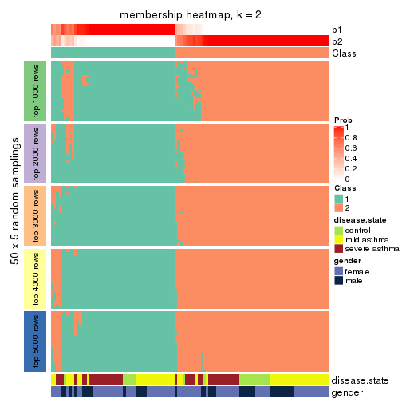</p>

</div>
<div id='tab-SD-NMF-membership-heatmap-2'>
<pre><code class="r">membership_heatmap(res, k = 3)
</code></pre>

<p></p>

</div>
<div id='tab-SD-NMF-membership-heatmap-3'>
<pre><code class="r">membership_heatmap(res, k = 4)
</code></pre>

<p></p>

</div>
<div id='tab-SD-NMF-membership-heatmap-4'>
<pre><code class="r">membership_heatmap(res, k = 5)
</code></pre>

<p>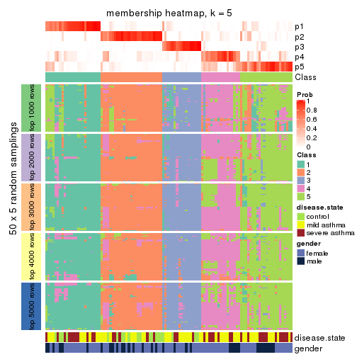</p>

</div>
<div id='tab-SD-NMF-membership-heatmap-5'>
<pre><code class="r">membership_heatmap(res, k = 6)
</code></pre>

<p></p>

</div>
</div>

As soon as we have had the classes for columns, we can look for signatures
which are significantly different between classes which can be candidate marks
for certain classes. Following are the heatmaps for signatures.


Signature heatmaps where rows are scaled:


<script>
$( function() {
	$( '#tabs-SD-NMF-get-signatures' ).tabs();
} );
</script>
<div id='tabs-SD-NMF-get-signatures'>
<ul>
<li><a href='#tab-SD-NMF-get-signatures-1'>k = 2</a></li>
<li><a href='#tab-SD-NMF-get-signatures-2'>k = 3</a></li>
<li><a href='#tab-SD-NMF-get-signatures-3'>k = 4</a></li>
<li><a href='#tab-SD-NMF-get-signatures-4'>k = 5</a></li>
<li><a href='#tab-SD-NMF-get-signatures-5'>k = 6</a></li>
</ul>
<div id='tab-SD-NMF-get-signatures-1'>
<pre><code class="r">get_signatures(res, k = 2)
</code></pre>

<p></p>

</div>
<div id='tab-SD-NMF-get-signatures-2'>
<pre><code class="r">get_signatures(res, k = 3)
</code></pre>

<p></p>

</div>
<div id='tab-SD-NMF-get-signatures-3'>
<pre><code class="r">get_signatures(res, k = 4)
</code></pre>

<p></p>

</div>
<div id='tab-SD-NMF-get-signatures-4'>
<pre><code class="r">get_signatures(res, k = 5)
</code></pre>

<p></p>

</div>
<div id='tab-SD-NMF-get-signatures-5'>
<pre><code class="r">get_signatures(res, k = 6)
</code></pre>

<p>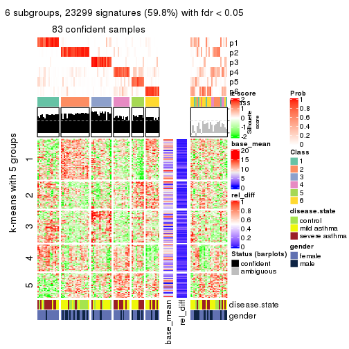</p>

</div>
</div>


Signature heatmaps where rows are not scaled:


<script>
$( function() {
	$( '#tabs-SD-NMF-get-signatures-no-scale' ).tabs();
} );
</script>
<div id='tabs-SD-NMF-get-signatures-no-scale'>
<ul>
<li><a href='#tab-SD-NMF-get-signatures-no-scale-1'>k = 2</a></li>
<li><a href='#tab-SD-NMF-get-signatures-no-scale-2'>k = 3</a></li>
<li><a href='#tab-SD-NMF-get-signatures-no-scale-3'>k = 4</a></li>
<li><a href='#tab-SD-NMF-get-signatures-no-scale-4'>k = 5</a></li>
<li><a href='#tab-SD-NMF-get-signatures-no-scale-5'>k = 6</a></li>
</ul>
<div id='tab-SD-NMF-get-signatures-no-scale-1'>
<pre><code class="r">get_signatures(res, k = 2, scale_rows = FALSE)
</code></pre>

<p></p>

</div>
<div id='tab-SD-NMF-get-signatures-no-scale-2'>
<pre><code class="r">get_signatures(res, k = 3, scale_rows = FALSE)
</code></pre>

<p></p>

</div>
<div id='tab-SD-NMF-get-signatures-no-scale-3'>
<pre><code class="r">get_signatures(res, k = 4, scale_rows = FALSE)
</code></pre>

<p></p>

</div>
<div id='tab-SD-NMF-get-signatures-no-scale-4'>
<pre><code class="r">get_signatures(res, k = 5, scale_rows = FALSE)
</code></pre>

<p></p>

</div>
<div id='tab-SD-NMF-get-signatures-no-scale-5'>
<pre><code class="r">get_signatures(res, k = 6, scale_rows = FALSE)
</code></pre>

<p></p>

</div>
</div>


Compare the overlap of signatures from different k:

```r
compare_signatures(res)
```


`get_signature()` returns a data frame invisibly. TO get the list of signatures, the function
call should be assigned to a variable explicitly. In following code, if `plot` argument is set
to `FALSE`, no heatmap is plotted while only the differential analysis is performed.

```r
# code only for demonstration
tb = get_signature(res, k = ..., plot = FALSE)
```

An example of the output of `tb` is:

```
#>   which_row         fdr    mean_1    mean_2 scaled_mean_1 scaled_mean_2 km
#> 1        38 0.042760348  8.373488  9.131774    -0.5533452     0.5164555  1
#> 2        40 0.018707592  7.106213  8.469186    -0.6173731     0.5762149  1
#> 3        55 0.019134737 10.221463 11.207825    -0.6159697     0.5749050  1
#> 4        59 0.006059896  5.921854  7.869574    -0.6899429     0.6439467  1
#> 5        60 0.018055526  8.928898 10.211722    -0.6204761     0.5791110  1
#> 6        98 0.009384629 15.714769 14.887706     0.6635654    -0.6193277  2
...
```

The columns in `tb` are:

1. `which_row`: row indices corresponding to the input matrix.
2. `fdr`: FDR for the differential test. 
3. `mean_x`: The mean value in group x.
4. `scaled_mean_x`: The mean value in group x after rows are scaled.
5. `km`: Row groups if k-means clustering is applied to rows.


UMAP plot which shows how samples are separated.


<script>
$( function() {
	$( '#tabs-SD-NMF-dimension-reduction' ).tabs();
} );
</script>
<div id='tabs-SD-NMF-dimension-reduction'>
<ul>
<li><a href='#tab-SD-NMF-dimension-reduction-1'>k = 2</a></li>
<li><a href='#tab-SD-NMF-dimension-reduction-2'>k = 3</a></li>
<li><a href='#tab-SD-NMF-dimension-reduction-3'>k = 4</a></li>
<li><a href='#tab-SD-NMF-dimension-reduction-4'>k = 5</a></li>
<li><a href='#tab-SD-NMF-dimension-reduction-5'>k = 6</a></li>
</ul>
<div id='tab-SD-NMF-dimension-reduction-1'>
<pre><code class="r">dimension_reduction(res, k = 2, method = &quot;UMAP&quot;)
</code></pre>

<p></p>

</div>
<div id='tab-SD-NMF-dimension-reduction-2'>
<pre><code class="r">dimension_reduction(res, k = 3, method = &quot;UMAP&quot;)
</code></pre>

<p></p>

</div>
<div id='tab-SD-NMF-dimension-reduction-3'>
<pre><code class="r">dimension_reduction(res, k = 4, method = &quot;UMAP&quot;)
</code></pre>

<p></p>

</div>
<div id='tab-SD-NMF-dimension-reduction-4'>
<pre><code class="r">dimension_reduction(res, k = 5, method = &quot;UMAP&quot;)
</code></pre>

<p></p>

</div>
<div id='tab-SD-NMF-dimension-reduction-5'>
<pre><code class="r">dimension_reduction(res, k = 6, method = &quot;UMAP&quot;)
</code></pre>

<p></p>

</div>
</div>


Following heatmap shows how subgroups are split when increasing `k`:

```r
collect_classes(res)
```


Test correlation between subgroups and known annotations. If the known
annotation is numeric, one-way ANOVA test is applied, and if the known
annotation is discrete, chi-squared contingency table test is applied.

```r
test_to_known_factors(res)
```

```
#>          n disease.state(p) gender(p) k
#> SD:NMF 102         0.391757    0.7534 2
#> SD:NMF  96         0.832671    0.3825 3
#> SD:NMF 104         0.004254    0.7325 4
#> SD:NMF  92         0.007545    0.3586 5
#> SD:NMF  83         0.000926    0.0673 6
```


If matrix rows can be associated to genes, consider to use `GO_Enrichment(res,
...)` to perform function enrichment for the signature genes.


 

---------------------------------------------------


### CV:hclust


The object with results only for a single top-value method and a single partition method 
can be extracted as:

```r
res = res_list["CV", "hclust"]
# you can also extract it by
# res = res_list["CV:hclust"]
```

A summary of `res` and all the functions that can be applied to it:

```r
res
```

```
#> A 'ConsensusPartition' object with k = 2, 3, 4, 5, 6.
#>   On a matrix with 38950 rows and 108 columns.
#>   Top rows (1000, 2000, 3000, 4000, 5000) are extracted by 'CV' method.
#>   Subgroups are detected by 'hclust' method.
#>   Performed in total 1250 partitions by row resampling.
#>   Best k for subgroups seems to be 4.
#> 
#> Following methods can be applied to this 'ConsensusPartition' object:
#>  [1] "cola_report"             "collect_classes"         "collect_plots"          
#>  [4] "collect_stats"           "colnames"                "compare_signatures"     
#>  [7] "consensus_heatmap"       "dimension_reduction"     "functional_enrichment"  
#> [10] "get_anno_col"            "get_anno"                "get_classes"            
#> [13] "get_consensus"           "get_matrix"              "get_membership"         
#> [16] "get_param"               "get_signatures"          "get_stats"              
#> [19] "is_best_k"               "is_stable_k"             "membership_heatmap"     
#> [22] "ncol"                    "nrow"                    "plot_ecdf"              
#> [25] "rownames"                "select_partition_number" "show"                   
#> [28] "suggest_best_k"          "test_to_known_factors"
```

`collect_plots()` function collects all the plots made from `res` for all `k` (number of partitions)
into one single page to provide an easy and fast comparison between different `k`.

```r
collect_plots(res)
```


The plots are:

- The first row: a plot of the ECDF (Empirical cumulative distribution
  function) curves of the consensus matrix for each `k` and the heatmap of
  predicted classes for each `k`.
- The second row: heatmaps of the consensus matrix for each `k`.
- The third row: heatmaps of the membership matrix for each `k`.
- The fouth row: heatmaps of the signatures for each `k`.

All the plots in panels can be made by individual functions and they are
plotted later in this section.

`select_partition_number()` produces several plots showing different
statistics for choosing "optimized" `k`. There are following statistics:

- ECDF curves of the consensus matrix for each `k`;
- 1-PAC. [The PAC
  score](https://en.wikipedia.org/wiki/Consensus_clustering#Over-interpretation_potential_of_consensus_clustering)
  measures the proportion of the ambiguous subgrouping.
- Mean silhouette score.
- Concordance. The mean probability of fiting the consensus class ids in all
  partitions.
- Area increased. Denote $A_k$ as the area under the ECDF curve for current
  `k`, the area increased is defined as $A_k - A_{k-1}$.
- Rand index. The percent of pairs of samples that are both in a same cluster
  or both are not in a same cluster in the partition of k and k-1.
- Jaccard index. The ratio of pairs of samples are both in a same cluster in
  the partition of k and k-1 and the pairs of samples are both in a same
  cluster in the partition k or k-1.

The detailed explanations of these statistics can be found in [the cola
vignette](http://bioconductor.org/packages/devel/bioc/vignettes/cola/inst/doc/cola.html#toc_13).

Generally speaking, lower PAC score, higher mean silhouette score or higher
concordance corresponds to better partition. Rand index and Jaccard index
measure how similar the current partition is compared to partition with `k-1`.
If they are too similar, we won't accept `k` is better than `k-1`.

```r
select_partition_number(res)
```


The numeric values for all these statistics can be obtained by `get_stats()`.

```r
get_stats(res)
```

```
#>   k 1-PAC mean_silhouette concordance area_increased  Rand Jaccard
#> 2 2 0.319           0.603       0.813         0.2775 0.673   0.673
#> 3 3 0.488           0.579       0.827         0.7560 0.714   0.606
#> 4 4 0.510           0.615       0.846         0.0985 0.920   0.844
#> 5 5 0.553           0.594       0.819         0.0562 0.960   0.913
#> 6 6 0.522           0.570       0.787         0.0687 0.956   0.901
```

`suggest_best_k()` suggests the best $k$ based on these statistics. The rules are as follows:

- All $k$ with Jaccard index larger than 0.95 are removed because the increase of
  the partition number does not provides enough extra information. If all $k$ are removed,
  the best $k$ is assigned by `NA`.
- For $k$ with 1-PAC larger than 0.9, the maximal $k$ is taken as the "best k". Other $k$ is called "optional k".
- If it does not fit the second rule. The $k$ with the highest vote of highest
  1-PAC, mean silhouette and concordance is taken as the "best k".

```r
suggest_best_k(res)
```

```
#> [1] 4
```


Following shows the table of the partitions (You need to click the **show/hide
code output** link to see it). The membership matrix (columns with name `p*`)
is inferred by
[`clue::cl_consensus()`](https://www.rdocumentation.org/link/cl_consensus?package=clue)
function with the `SE` method. Basically the value in the membership matrix
represents the probability to belong to a certain group. The finall class
label for an item is determined with the group with highest probability it
belongs to.

In `get_classes()` function, the entropy is calculated from the membership
matrix and the silhouette score is calculated from the consensus matrix.


<script>
$( function() {
	$( '#tabs-CV-hclust-get-classes' ).tabs();
} );
</script>
<div id='tabs-CV-hclust-get-classes'>
<ul>
<li><a href='#tab-CV-hclust-get-classes-1'>k = 2</a></li>
<li><a href='#tab-CV-hclust-get-classes-2'>k = 3</a></li>
<li><a href='#tab-CV-hclust-get-classes-3'>k = 4</a></li>
<li><a href='#tab-CV-hclust-get-classes-4'>k = 5</a></li>
<li><a href='#tab-CV-hclust-get-classes-5'>k = 6</a></li>
</ul>

<div id='tab-CV-hclust-get-classes-1'>
<p><a id='tab-CV-hclust-get-classes-1-a' style='color:#0366d6' href='#'>show/hide code output</a></p>
<pre><code class="r">cbind(get_classes(res, k = 2), get_membership(res, k = 2))
</code></pre>

<pre><code>#&gt;            class entropy silhouette    p1    p2
#&gt; GSM1068478     2  0.8713     0.1968 0.292 0.708
#&gt; GSM1068479     2  0.2043     0.7662 0.032 0.968
#&gt; GSM1068481     1  0.9850     0.9169 0.572 0.428
#&gt; GSM1068482     1  0.9996     0.7714 0.512 0.488
#&gt; GSM1068483     1  0.9909     0.9081 0.556 0.444
#&gt; GSM1068486     2  0.9323    -0.1166 0.348 0.652
#&gt; GSM1068487     2  0.0000     0.7813 0.000 1.000
#&gt; GSM1068488     2  0.2778     0.7501 0.048 0.952
#&gt; GSM1068490     2  0.0000     0.7813 0.000 1.000
#&gt; GSM1068491     2  0.2043     0.7662 0.032 0.968
#&gt; GSM1068492     2  0.2043     0.7662 0.032 0.968
#&gt; GSM1068493     2  0.8016     0.3836 0.244 0.756
#&gt; GSM1068494     1  0.9850     0.9191 0.572 0.428
#&gt; GSM1068495     2  0.8443     0.2803 0.272 0.728
#&gt; GSM1068496     1  0.9866     0.9196 0.568 0.432
#&gt; GSM1068498     2  0.8499     0.2608 0.276 0.724
#&gt; GSM1068499     1  0.9833     0.9224 0.576 0.424
#&gt; GSM1068500     1  0.9881     0.9181 0.564 0.436
#&gt; GSM1068502     2  0.2043     0.7662 0.032 0.968
#&gt; GSM1068503     2  0.0000     0.7813 0.000 1.000
#&gt; GSM1068505     2  0.0000     0.7813 0.000 1.000
#&gt; GSM1068506     2  0.0376     0.7801 0.004 0.996
#&gt; GSM1068507     2  0.0000     0.7813 0.000 1.000
#&gt; GSM1068508     2  0.0672     0.7792 0.008 0.992
#&gt; GSM1068510     2  0.0000     0.7813 0.000 1.000
#&gt; GSM1068512     2  0.1184     0.7767 0.016 0.984
#&gt; GSM1068513     2  0.0000     0.7813 0.000 1.000
#&gt; GSM1068514     2  0.2043     0.7662 0.032 0.968
#&gt; GSM1068517     2  0.8499     0.2608 0.276 0.724
#&gt; GSM1068518     2  0.7950     0.3955 0.240 0.760
#&gt; GSM1068520     1  0.9996     0.8112 0.512 0.488
#&gt; GSM1068521     2  0.9944    -0.6437 0.456 0.544
#&gt; GSM1068522     2  0.0000     0.7813 0.000 1.000
#&gt; GSM1068524     2  0.0000     0.7813 0.000 1.000
#&gt; GSM1068527     2  0.0376     0.7801 0.004 0.996
#&gt; GSM1068480     2  0.9988    -0.6816 0.480 0.520
#&gt; GSM1068484     2  0.0000     0.7813 0.000 1.000
#&gt; GSM1068485     2  0.9998    -0.7251 0.492 0.508
#&gt; GSM1068489     2  0.0000     0.7813 0.000 1.000
#&gt; GSM1068497     2  0.8608     0.2283 0.284 0.716
#&gt; GSM1068501     2  0.0000     0.7813 0.000 1.000
#&gt; GSM1068504     2  0.0000     0.7813 0.000 1.000
#&gt; GSM1068509     2  0.7453     0.4782 0.212 0.788
#&gt; GSM1068511     2  0.9608     0.2147 0.384 0.616
#&gt; GSM1068515     2  0.9209    -0.0268 0.336 0.664
#&gt; GSM1068516     2  0.8555     0.2467 0.280 0.720
#&gt; GSM1068519     1  0.9815     0.9242 0.580 0.420
#&gt; GSM1068523     2  0.0000     0.7813 0.000 1.000
#&gt; GSM1068525     2  0.0000     0.7813 0.000 1.000
#&gt; GSM1068526     2  0.0376     0.7801 0.004 0.996
#&gt; GSM1068458     1  0.9775     0.9274 0.588 0.412
#&gt; GSM1068459     1  0.9850     0.9161 0.572 0.428
#&gt; GSM1068460     2  0.6438     0.5886 0.164 0.836
#&gt; GSM1068461     2  0.9922    -0.5836 0.448 0.552
#&gt; GSM1068464     2  0.0000     0.7813 0.000 1.000
#&gt; GSM1068468     2  0.0376     0.7804 0.004 0.996
#&gt; GSM1068472     2  0.5629     0.6468 0.132 0.868
#&gt; GSM1068473     2  0.0000     0.7813 0.000 1.000
#&gt; GSM1068474     2  0.0000     0.7813 0.000 1.000
#&gt; GSM1068476     2  0.9815    -0.4818 0.420 0.580
#&gt; GSM1068477     2  0.0000     0.7813 0.000 1.000
#&gt; GSM1068462     2  0.6048     0.6182 0.148 0.852
#&gt; GSM1068463     1  0.9732     0.9151 0.596 0.404
#&gt; GSM1068465     2  0.8144     0.3417 0.252 0.748
#&gt; GSM1068466     2  0.9998    -0.7644 0.492 0.508
#&gt; GSM1068467     2  0.1843     0.7670 0.028 0.972
#&gt; GSM1068469     2  0.7299     0.4977 0.204 0.796
#&gt; GSM1068470     2  0.0000     0.7813 0.000 1.000
#&gt; GSM1068471     2  0.0000     0.7813 0.000 1.000
#&gt; GSM1068475     2  0.0000     0.7813 0.000 1.000
#&gt; GSM1068528     1  0.9775     0.9247 0.588 0.412
#&gt; GSM1068531     1  0.9686     0.9260 0.604 0.396
#&gt; GSM1068532     1  0.9686     0.9260 0.604 0.396
#&gt; GSM1068533     1  0.9710     0.9280 0.600 0.400
#&gt; GSM1068535     2  0.2778     0.7508 0.048 0.952
#&gt; GSM1068537     1  0.9686     0.9260 0.604 0.396
#&gt; GSM1068538     1  0.9686     0.9260 0.604 0.396
#&gt; GSM1068539     2  0.8608     0.2287 0.284 0.716
#&gt; GSM1068540     1  0.9686     0.9260 0.604 0.396
#&gt; GSM1068542     2  0.0376     0.7801 0.004 0.996
#&gt; GSM1068543     2  0.0938     0.7782 0.012 0.988
#&gt; GSM1068544     1  0.9850     0.9161 0.572 0.428
#&gt; GSM1068545     2  0.0376     0.7801 0.004 0.996
#&gt; GSM1068546     2  0.9977    -0.6619 0.472 0.528
#&gt; GSM1068547     1  0.9993     0.8212 0.516 0.484
#&gt; GSM1068548     2  0.0376     0.7801 0.004 0.996
#&gt; GSM1068549     2  0.9922    -0.5836 0.448 0.552
#&gt; GSM1068550     2  0.0376     0.7801 0.004 0.996
#&gt; GSM1068551     2  0.0000     0.7813 0.000 1.000
#&gt; GSM1068552     2  0.0376     0.7801 0.004 0.996
#&gt; GSM1068555     2  0.0000     0.7813 0.000 1.000
#&gt; GSM1068556     2  0.0672     0.7798 0.008 0.992
#&gt; GSM1068557     2  0.4562     0.6953 0.096 0.904
#&gt; GSM1068560     2  0.0376     0.7801 0.004 0.996
#&gt; GSM1068561     2  0.8267     0.3258 0.260 0.740
#&gt; GSM1068562     2  0.0376     0.7801 0.004 0.996
#&gt; GSM1068563     2  0.0376     0.7801 0.004 0.996
#&gt; GSM1068565     2  0.0000     0.7813 0.000 1.000
#&gt; GSM1068529     2  0.5629     0.6440 0.132 0.868
#&gt; GSM1068530     1  0.9686     0.9260 0.604 0.396
#&gt; GSM1068534     2  0.5629     0.6440 0.132 0.868
#&gt; GSM1068536     2  0.8555     0.2448 0.280 0.720
#&gt; GSM1068541     2  0.6148     0.6080 0.152 0.848
#&gt; GSM1068553     2  0.0938     0.7779 0.012 0.988
#&gt; GSM1068554     2  0.0938     0.7779 0.012 0.988
#&gt; GSM1068558     2  0.9635     0.2108 0.388 0.612
#&gt; GSM1068559     2  0.0938     0.7785 0.012 0.988
#&gt; GSM1068564     2  0.0000     0.7813 0.000 1.000
</code></pre>

<script>
$('#tab-CV-hclust-get-classes-1-a').parent().next().next().hide();
$('#tab-CV-hclust-get-classes-1-a').click(function(){
  $('#tab-CV-hclust-get-classes-1-a').parent().next().next().toggle();
  return(false);
});
</script>
</div>

<div id='tab-CV-hclust-get-classes-2'>
<p><a id='tab-CV-hclust-get-classes-2-a' style='color:#0366d6' href='#'>show/hide code output</a></p>
<pre><code class="r">cbind(get_classes(res, k = 3), get_membership(res, k = 3))
</code></pre>

<pre><code>#&gt;            class entropy silhouette    p1    p2    p3
#&gt; GSM1068478     1  0.6432     0.2862 0.568 0.428 0.004
#&gt; GSM1068479     2  0.3406     0.7652 0.028 0.904 0.068
#&gt; GSM1068481     1  0.6539     0.4347 0.684 0.028 0.288
#&gt; GSM1068482     1  0.6204     0.2276 0.576 0.000 0.424
#&gt; GSM1068483     1  0.6646     0.5345 0.740 0.076 0.184
#&gt; GSM1068486     1  0.9680     0.1892 0.456 0.300 0.244
#&gt; GSM1068487     2  0.0000     0.8542 0.000 1.000 0.000
#&gt; GSM1068488     2  0.2229     0.8151 0.044 0.944 0.012
#&gt; GSM1068490     2  0.0000     0.8542 0.000 1.000 0.000
#&gt; GSM1068491     2  0.3406     0.7652 0.028 0.904 0.068
#&gt; GSM1068492     2  0.3406     0.7652 0.028 0.904 0.068
#&gt; GSM1068493     2  0.7744    -0.1396 0.448 0.504 0.048
#&gt; GSM1068494     1  0.4887     0.5668 0.844 0.096 0.060
#&gt; GSM1068495     2  0.6682    -0.1341 0.488 0.504 0.008
#&gt; GSM1068496     1  0.6601     0.4222 0.676 0.028 0.296
#&gt; GSM1068498     1  0.6483     0.2564 0.544 0.452 0.004
#&gt; GSM1068499     1  0.2959     0.5753 0.900 0.100 0.000
#&gt; GSM1068500     1  0.6348     0.5336 0.752 0.060 0.188
#&gt; GSM1068502     2  0.3406     0.7652 0.028 0.904 0.068
#&gt; GSM1068503     2  0.0000     0.8542 0.000 1.000 0.000
#&gt; GSM1068505     2  0.0000     0.8542 0.000 1.000 0.000
#&gt; GSM1068506     2  0.0237     0.8535 0.004 0.996 0.000
#&gt; GSM1068507     2  0.0000     0.8542 0.000 1.000 0.000
#&gt; GSM1068508     2  0.0424     0.8516 0.008 0.992 0.000
#&gt; GSM1068510     2  0.0000     0.8542 0.000 1.000 0.000
#&gt; GSM1068512     2  0.1129     0.8439 0.020 0.976 0.004
#&gt; GSM1068513     2  0.0000     0.8542 0.000 1.000 0.000
#&gt; GSM1068514     2  0.3310     0.7704 0.028 0.908 0.064
#&gt; GSM1068517     1  0.6483     0.2564 0.544 0.452 0.004
#&gt; GSM1068518     2  0.6633     0.0399 0.444 0.548 0.008
#&gt; GSM1068520     1  0.4291     0.5577 0.840 0.152 0.008
#&gt; GSM1068521     1  0.5406     0.4941 0.764 0.224 0.012
#&gt; GSM1068522     2  0.0000     0.8542 0.000 1.000 0.000
#&gt; GSM1068524     2  0.0000     0.8542 0.000 1.000 0.000
#&gt; GSM1068527     2  0.0237     0.8535 0.004 0.996 0.000
#&gt; GSM1068480     1  0.6799     0.1630 0.532 0.012 0.456
#&gt; GSM1068484     2  0.0000     0.8542 0.000 1.000 0.000
#&gt; GSM1068485     1  0.7130     0.2674 0.544 0.024 0.432
#&gt; GSM1068489     2  0.0237     0.8529 0.004 0.996 0.000
#&gt; GSM1068497     1  0.6451     0.2770 0.560 0.436 0.004
#&gt; GSM1068501     2  0.0424     0.8510 0.008 0.992 0.000
#&gt; GSM1068504     2  0.0000     0.8542 0.000 1.000 0.000
#&gt; GSM1068509     2  0.6910     0.1790 0.396 0.584 0.020
#&gt; GSM1068511     3  0.6513     0.1655 0.004 0.476 0.520
#&gt; GSM1068515     1  0.7001     0.3053 0.588 0.388 0.024
#&gt; GSM1068516     2  0.6683    -0.1429 0.492 0.500 0.008
#&gt; GSM1068519     1  0.2878     0.5755 0.904 0.096 0.000
#&gt; GSM1068523     2  0.0000     0.8542 0.000 1.000 0.000
#&gt; GSM1068525     2  0.0000     0.8542 0.000 1.000 0.000
#&gt; GSM1068526     2  0.0237     0.8535 0.004 0.996 0.000
#&gt; GSM1068458     1  0.2590     0.5822 0.924 0.072 0.004
#&gt; GSM1068459     1  0.6570     0.4118 0.668 0.024 0.308
#&gt; GSM1068460     2  0.5690     0.4758 0.288 0.708 0.004
#&gt; GSM1068461     3  0.7652    -0.1442 0.444 0.044 0.512
#&gt; GSM1068464     2  0.0000     0.8542 0.000 1.000 0.000
#&gt; GSM1068468     2  0.0892     0.8435 0.020 0.980 0.000
#&gt; GSM1068472     2  0.6126     0.3339 0.352 0.644 0.004
#&gt; GSM1068473     2  0.0000     0.8542 0.000 1.000 0.000
#&gt; GSM1068474     2  0.0000     0.8542 0.000 1.000 0.000
#&gt; GSM1068476     3  0.9487     0.2164 0.244 0.260 0.496
#&gt; GSM1068477     2  0.0000     0.8542 0.000 1.000 0.000
#&gt; GSM1068462     2  0.6095     0.2300 0.392 0.608 0.000
#&gt; GSM1068463     1  0.5706     0.3456 0.680 0.000 0.320
#&gt; GSM1068465     1  0.6994     0.2465 0.556 0.424 0.020
#&gt; GSM1068466     1  0.4589     0.5430 0.820 0.172 0.008
#&gt; GSM1068467     2  0.1643     0.8248 0.044 0.956 0.000
#&gt; GSM1068469     2  0.6280    -0.0227 0.460 0.540 0.000
#&gt; GSM1068470     2  0.0000     0.8542 0.000 1.000 0.000
#&gt; GSM1068471     2  0.0000     0.8542 0.000 1.000 0.000
#&gt; GSM1068475     2  0.0000     0.8542 0.000 1.000 0.000
#&gt; GSM1068528     1  0.5803     0.4936 0.760 0.028 0.212
#&gt; GSM1068531     1  0.1964     0.5782 0.944 0.056 0.000
#&gt; GSM1068532     1  0.2313     0.5683 0.944 0.032 0.024
#&gt; GSM1068533     1  0.2301     0.5797 0.936 0.060 0.004
#&gt; GSM1068535     2  0.2229     0.8154 0.044 0.944 0.012
#&gt; GSM1068537     1  0.2176     0.5691 0.948 0.032 0.020
#&gt; GSM1068538     1  0.2313     0.5683 0.944 0.032 0.024
#&gt; GSM1068539     2  0.6683    -0.1581 0.496 0.496 0.008
#&gt; GSM1068540     1  0.2176     0.5691 0.948 0.032 0.020
#&gt; GSM1068542     2  0.0237     0.8535 0.004 0.996 0.000
#&gt; GSM1068543     2  0.1015     0.8451 0.012 0.980 0.008
#&gt; GSM1068544     1  0.6570     0.4118 0.668 0.024 0.308
#&gt; GSM1068545     2  0.0237     0.8535 0.004 0.996 0.000
#&gt; GSM1068546     1  0.6299     0.1310 0.524 0.000 0.476
#&gt; GSM1068547     1  0.4228     0.5601 0.844 0.148 0.008
#&gt; GSM1068548     2  0.0237     0.8535 0.004 0.996 0.000
#&gt; GSM1068549     3  0.7652    -0.1442 0.444 0.044 0.512
#&gt; GSM1068550     2  0.0237     0.8535 0.004 0.996 0.000
#&gt; GSM1068551     2  0.0000     0.8542 0.000 1.000 0.000
#&gt; GSM1068552     2  0.0237     0.8535 0.004 0.996 0.000
#&gt; GSM1068555     2  0.0000     0.8542 0.000 1.000 0.000
#&gt; GSM1068556     2  0.0424     0.8523 0.008 0.992 0.000
#&gt; GSM1068557     2  0.4555     0.6214 0.200 0.800 0.000
#&gt; GSM1068560     2  0.0237     0.8535 0.004 0.996 0.000
#&gt; GSM1068561     1  0.6682     0.1670 0.504 0.488 0.008
#&gt; GSM1068562     2  0.0237     0.8535 0.004 0.996 0.000
#&gt; GSM1068563     2  0.0237     0.8535 0.004 0.996 0.000
#&gt; GSM1068565     2  0.0000     0.8542 0.000 1.000 0.000
#&gt; GSM1068529     2  0.6051     0.4483 0.292 0.696 0.012
#&gt; GSM1068530     1  0.2313     0.5683 0.944 0.032 0.024
#&gt; GSM1068534     2  0.6047     0.4173 0.312 0.680 0.008
#&gt; GSM1068536     1  0.6682     0.1605 0.504 0.488 0.008
#&gt; GSM1068541     2  0.5690     0.4669 0.288 0.708 0.004
#&gt; GSM1068553     2  0.1015     0.8457 0.008 0.980 0.012
#&gt; GSM1068554     2  0.1015     0.8457 0.008 0.980 0.012
#&gt; GSM1068558     3  0.6299     0.1649 0.000 0.476 0.524
#&gt; GSM1068559     2  0.0747     0.8492 0.016 0.984 0.000
#&gt; GSM1068564     2  0.0237     0.8529 0.004 0.996 0.000
</code></pre>

<script>
$('#tab-CV-hclust-get-classes-2-a').parent().next().next().hide();
$('#tab-CV-hclust-get-classes-2-a').click(function(){
  $('#tab-CV-hclust-get-classes-2-a').parent().next().next().toggle();
  return(false);
});
</script>
</div>

<div id='tab-CV-hclust-get-classes-3'>
<p><a id='tab-CV-hclust-get-classes-3-a' style='color:#0366d6' href='#'>show/hide code output</a></p>
<pre><code class="r">cbind(get_classes(res, k = 4), get_membership(res, k = 4))
</code></pre>

<pre><code>#&gt;            class entropy silhouette    p1    p2    p3    p4
#&gt; GSM1068478     1  0.5016    0.47172 0.600 0.396 0.004 0.000
#&gt; GSM1068479     2  0.3272    0.78069 0.004 0.860 0.128 0.008
#&gt; GSM1068481     1  0.5660   -0.17409 0.576 0.004 0.400 0.020
#&gt; GSM1068482     3  0.5256    0.50227 0.392 0.000 0.596 0.012
#&gt; GSM1068483     1  0.5172    0.33542 0.736 0.036 0.220 0.008
#&gt; GSM1068486     1  0.7872    0.24559 0.448 0.276 0.272 0.004
#&gt; GSM1068487     2  0.0000    0.89554 0.000 1.000 0.000 0.000
#&gt; GSM1068488     2  0.1767    0.85973 0.044 0.944 0.012 0.000
#&gt; GSM1068490     2  0.0000    0.89554 0.000 1.000 0.000 0.000
#&gt; GSM1068491     2  0.3272    0.78069 0.004 0.860 0.128 0.008
#&gt; GSM1068492     2  0.3272    0.78069 0.004 0.860 0.128 0.008
#&gt; GSM1068493     2  0.6449   -0.25194 0.452 0.480 0.068 0.000
#&gt; GSM1068494     1  0.4374    0.44374 0.812 0.068 0.120 0.000
#&gt; GSM1068495     1  0.5290    0.27304 0.516 0.476 0.008 0.000
#&gt; GSM1068496     1  0.5223   -0.18461 0.584 0.004 0.408 0.004
#&gt; GSM1068498     1  0.5080    0.42623 0.576 0.420 0.004 0.000
#&gt; GSM1068499     1  0.1902    0.51676 0.932 0.064 0.004 0.000
#&gt; GSM1068500     1  0.4862    0.30220 0.744 0.020 0.228 0.008
#&gt; GSM1068502     2  0.3272    0.78069 0.004 0.860 0.128 0.008
#&gt; GSM1068503     2  0.0000    0.89554 0.000 1.000 0.000 0.000
#&gt; GSM1068505     2  0.0000    0.89554 0.000 1.000 0.000 0.000
#&gt; GSM1068506     2  0.0188    0.89490 0.004 0.996 0.000 0.000
#&gt; GSM1068507     2  0.0000    0.89554 0.000 1.000 0.000 0.000
#&gt; GSM1068508     2  0.0336    0.89291 0.008 0.992 0.000 0.000
#&gt; GSM1068510     2  0.0000    0.89554 0.000 1.000 0.000 0.000
#&gt; GSM1068512     2  0.0895    0.88596 0.020 0.976 0.004 0.000
#&gt; GSM1068513     2  0.0000    0.89554 0.000 1.000 0.000 0.000
#&gt; GSM1068514     2  0.3160    0.78894 0.004 0.868 0.120 0.008
#&gt; GSM1068517     1  0.5080    0.42623 0.576 0.420 0.004 0.000
#&gt; GSM1068518     2  0.5281   -0.12661 0.464 0.528 0.008 0.000
#&gt; GSM1068520     1  0.2976    0.54052 0.872 0.120 0.008 0.000
#&gt; GSM1068521     1  0.3978    0.53450 0.796 0.192 0.012 0.000
#&gt; GSM1068522     2  0.0000    0.89554 0.000 1.000 0.000 0.000
#&gt; GSM1068524     2  0.0000    0.89554 0.000 1.000 0.000 0.000
#&gt; GSM1068527     2  0.0188    0.89490 0.004 0.996 0.000 0.000
#&gt; GSM1068480     3  0.5473    0.58198 0.324 0.000 0.644 0.032
#&gt; GSM1068484     2  0.0000    0.89554 0.000 1.000 0.000 0.000
#&gt; GSM1068485     3  0.5531    0.37477 0.436 0.004 0.548 0.012
#&gt; GSM1068489     2  0.0188    0.89428 0.004 0.996 0.000 0.000
#&gt; GSM1068497     1  0.5039    0.45782 0.592 0.404 0.004 0.000
#&gt; GSM1068501     2  0.0336    0.89220 0.008 0.992 0.000 0.000
#&gt; GSM1068504     2  0.0000    0.89554 0.000 1.000 0.000 0.000
#&gt; GSM1068509     2  0.5708    0.00574 0.416 0.556 0.028 0.000
#&gt; GSM1068511     4  0.0376    0.99281 0.004 0.004 0.000 0.992
#&gt; GSM1068515     1  0.6617    0.45623 0.552 0.372 0.068 0.008
#&gt; GSM1068516     1  0.5288    0.28453 0.520 0.472 0.008 0.000
#&gt; GSM1068519     1  0.1637    0.51515 0.940 0.060 0.000 0.000
#&gt; GSM1068523     2  0.0000    0.89554 0.000 1.000 0.000 0.000
#&gt; GSM1068525     2  0.0000    0.89554 0.000 1.000 0.000 0.000
#&gt; GSM1068526     2  0.0188    0.89490 0.004 0.996 0.000 0.000
#&gt; GSM1068458     1  0.1305    0.50306 0.960 0.036 0.004 0.000
#&gt; GSM1068459     1  0.5509   -0.23114 0.560 0.004 0.424 0.012
#&gt; GSM1068460     2  0.4584    0.47373 0.300 0.696 0.004 0.000
#&gt; GSM1068461     3  0.0188    0.43738 0.004 0.000 0.996 0.000
#&gt; GSM1068464     2  0.0000    0.89554 0.000 1.000 0.000 0.000
#&gt; GSM1068468     2  0.0707    0.88598 0.020 0.980 0.000 0.000
#&gt; GSM1068472     2  0.5306    0.29037 0.348 0.632 0.020 0.000
#&gt; GSM1068473     2  0.0000    0.89554 0.000 1.000 0.000 0.000
#&gt; GSM1068474     2  0.0000    0.89554 0.000 1.000 0.000 0.000
#&gt; GSM1068476     3  0.4126    0.25482 0.004 0.216 0.776 0.004
#&gt; GSM1068477     2  0.0000    0.89554 0.000 1.000 0.000 0.000
#&gt; GSM1068462     2  0.5387    0.10993 0.400 0.584 0.016 0.000
#&gt; GSM1068463     3  0.5161    0.54039 0.300 0.000 0.676 0.024
#&gt; GSM1068465     1  0.7362    0.42524 0.568 0.272 0.016 0.144
#&gt; GSM1068466     1  0.3196    0.54129 0.856 0.136 0.008 0.000
#&gt; GSM1068467     2  0.1302    0.86847 0.044 0.956 0.000 0.000
#&gt; GSM1068469     2  0.5508   -0.19321 0.476 0.508 0.016 0.000
#&gt; GSM1068470     2  0.0000    0.89554 0.000 1.000 0.000 0.000
#&gt; GSM1068471     2  0.0000    0.89554 0.000 1.000 0.000 0.000
#&gt; GSM1068475     2  0.0000    0.89554 0.000 1.000 0.000 0.000
#&gt; GSM1068528     1  0.4661    0.18271 0.724 0.004 0.264 0.008
#&gt; GSM1068531     1  0.0707    0.48792 0.980 0.020 0.000 0.000
#&gt; GSM1068532     1  0.2156    0.44203 0.928 0.008 0.060 0.004
#&gt; GSM1068533     1  0.1151    0.49139 0.968 0.024 0.008 0.000
#&gt; GSM1068535     2  0.1767    0.86039 0.044 0.944 0.012 0.000
#&gt; GSM1068537     1  0.1890    0.44598 0.936 0.008 0.056 0.000
#&gt; GSM1068538     1  0.2156    0.44203 0.928 0.008 0.060 0.004
#&gt; GSM1068539     1  0.5285    0.29707 0.524 0.468 0.008 0.000
#&gt; GSM1068540     1  0.1890    0.44598 0.936 0.008 0.056 0.000
#&gt; GSM1068542     2  0.0188    0.89490 0.004 0.996 0.000 0.000
#&gt; GSM1068543     2  0.0804    0.88757 0.012 0.980 0.008 0.000
#&gt; GSM1068544     1  0.5509   -0.23114 0.560 0.004 0.424 0.012
#&gt; GSM1068545     2  0.0188    0.89490 0.004 0.996 0.000 0.000
#&gt; GSM1068546     3  0.3831    0.60731 0.204 0.000 0.792 0.004
#&gt; GSM1068547     1  0.2918    0.53959 0.876 0.116 0.008 0.000
#&gt; GSM1068548     2  0.0188    0.89490 0.004 0.996 0.000 0.000
#&gt; GSM1068549     3  0.0376    0.43524 0.004 0.000 0.992 0.004
#&gt; GSM1068550     2  0.0188    0.89490 0.004 0.996 0.000 0.000
#&gt; GSM1068551     2  0.0000    0.89554 0.000 1.000 0.000 0.000
#&gt; GSM1068552     2  0.0188    0.89490 0.004 0.996 0.000 0.000
#&gt; GSM1068555     2  0.0000    0.89554 0.000 1.000 0.000 0.000
#&gt; GSM1068556     2  0.0336    0.89371 0.008 0.992 0.000 0.000
#&gt; GSM1068557     2  0.3726    0.65082 0.212 0.788 0.000 0.000
#&gt; GSM1068560     2  0.0188    0.89490 0.004 0.996 0.000 0.000
#&gt; GSM1068561     1  0.5685    0.30830 0.516 0.460 0.024 0.000
#&gt; GSM1068562     2  0.0188    0.89490 0.004 0.996 0.000 0.000
#&gt; GSM1068563     2  0.0188    0.89490 0.004 0.996 0.000 0.000
#&gt; GSM1068565     2  0.0000    0.89554 0.000 1.000 0.000 0.000
#&gt; GSM1068529     2  0.5417    0.42646 0.284 0.676 0.040 0.000
#&gt; GSM1068530     1  0.2156    0.44203 0.928 0.008 0.060 0.004
#&gt; GSM1068534     2  0.5512    0.38354 0.300 0.660 0.040 0.000
#&gt; GSM1068536     1  0.5281    0.31145 0.528 0.464 0.008 0.000
#&gt; GSM1068541     2  0.4560    0.47366 0.296 0.700 0.004 0.000
#&gt; GSM1068553     2  0.0859    0.88824 0.008 0.980 0.008 0.004
#&gt; GSM1068554     2  0.0859    0.88824 0.008 0.980 0.008 0.004
#&gt; GSM1068558     4  0.0188    0.99283 0.000 0.004 0.000 0.996
#&gt; GSM1068559     2  0.0804    0.88982 0.012 0.980 0.008 0.000
#&gt; GSM1068564     2  0.0188    0.89428 0.004 0.996 0.000 0.000
</code></pre>

<script>
$('#tab-CV-hclust-get-classes-3-a').parent().next().next().hide();
$('#tab-CV-hclust-get-classes-3-a').click(function(){
  $('#tab-CV-hclust-get-classes-3-a').parent().next().next().toggle();
  return(false);
});
</script>
</div>

<div id='tab-CV-hclust-get-classes-4'>
<p><a id='tab-CV-hclust-get-classes-4-a' style='color:#0366d6' href='#'>show/hide code output</a></p>
<pre><code class="r">cbind(get_classes(res, k = 5), get_membership(res, k = 5))
</code></pre>

<pre><code>#&gt;            class entropy silhouette    p1    p2    p3    p4    p5
#&gt; GSM1068478     1  0.5048     0.4718 0.612 0.000 0.016 0.352 0.020
#&gt; GSM1068479     4  0.2741     0.7736 0.000 0.004 0.132 0.860 0.004
#&gt; GSM1068481     5  0.4866     0.7426 0.396 0.004 0.020 0.000 0.580
#&gt; GSM1068482     3  0.4604     0.4912 0.012 0.000 0.560 0.000 0.428
#&gt; GSM1068483     1  0.5423    -0.1424 0.632 0.004 0.036 0.020 0.308
#&gt; GSM1068486     1  0.8282     0.1149 0.384 0.000 0.168 0.256 0.192
#&gt; GSM1068487     4  0.0162     0.8790 0.000 0.000 0.000 0.996 0.004
#&gt; GSM1068488     4  0.1787     0.8454 0.044 0.000 0.004 0.936 0.016
#&gt; GSM1068490     4  0.0000     0.8789 0.000 0.000 0.000 1.000 0.000
#&gt; GSM1068491     4  0.2741     0.7736 0.000 0.004 0.132 0.860 0.004
#&gt; GSM1068492     4  0.2741     0.7736 0.000 0.004 0.132 0.860 0.004
#&gt; GSM1068493     4  0.6236    -0.2766 0.436 0.000 0.024 0.464 0.076
#&gt; GSM1068494     1  0.4986     0.1993 0.748 0.000 0.148 0.036 0.068
#&gt; GSM1068495     1  0.4986     0.3428 0.532 0.000 0.012 0.444 0.012
#&gt; GSM1068496     5  0.4862     0.7941 0.364 0.000 0.032 0.000 0.604
#&gt; GSM1068498     1  0.5123     0.4641 0.588 0.000 0.016 0.376 0.020
#&gt; GSM1068499     1  0.2149     0.3759 0.924 0.000 0.012 0.028 0.036
#&gt; GSM1068500     1  0.4994    -0.1926 0.636 0.004 0.024 0.008 0.328
#&gt; GSM1068502     4  0.2741     0.7736 0.000 0.004 0.132 0.860 0.004
#&gt; GSM1068503     4  0.0162     0.8790 0.000 0.000 0.000 0.996 0.004
#&gt; GSM1068505     4  0.0000     0.8789 0.000 0.000 0.000 1.000 0.000
#&gt; GSM1068506     4  0.0162     0.8791 0.000 0.000 0.004 0.996 0.000
#&gt; GSM1068507     4  0.0000     0.8789 0.000 0.000 0.000 1.000 0.000
#&gt; GSM1068508     4  0.0290     0.8791 0.008 0.000 0.000 0.992 0.000
#&gt; GSM1068510     4  0.0000     0.8789 0.000 0.000 0.000 1.000 0.000
#&gt; GSM1068512     4  0.0960     0.8723 0.016 0.000 0.008 0.972 0.004
#&gt; GSM1068513     4  0.0000     0.8789 0.000 0.000 0.000 1.000 0.000
#&gt; GSM1068514     4  0.2646     0.7818 0.000 0.004 0.124 0.868 0.004
#&gt; GSM1068517     1  0.5123     0.4641 0.588 0.000 0.016 0.376 0.020
#&gt; GSM1068518     4  0.5098    -0.2212 0.480 0.000 0.012 0.492 0.016
#&gt; GSM1068520     1  0.2588     0.4570 0.884 0.000 0.008 0.100 0.008
#&gt; GSM1068521     1  0.3373     0.4729 0.816 0.000 0.008 0.168 0.008
#&gt; GSM1068522     4  0.0000     0.8789 0.000 0.000 0.000 1.000 0.000
#&gt; GSM1068524     4  0.0451     0.8785 0.000 0.000 0.008 0.988 0.004
#&gt; GSM1068527     4  0.0451     0.8775 0.000 0.000 0.008 0.988 0.004
#&gt; GSM1068480     3  0.4946     0.5313 0.012 0.024 0.636 0.000 0.328
#&gt; GSM1068484     4  0.0324     0.8786 0.000 0.000 0.004 0.992 0.004
#&gt; GSM1068485     5  0.6300     0.7052 0.336 0.000 0.168 0.000 0.496
#&gt; GSM1068489     4  0.0162     0.8793 0.004 0.000 0.000 0.996 0.000
#&gt; GSM1068497     1  0.5075     0.4696 0.604 0.000 0.016 0.360 0.020
#&gt; GSM1068501     4  0.0324     0.8790 0.004 0.000 0.000 0.992 0.004
#&gt; GSM1068504     4  0.0451     0.8780 0.000 0.000 0.004 0.988 0.008
#&gt; GSM1068509     4  0.5283    -0.0403 0.420 0.000 0.012 0.540 0.028
#&gt; GSM1068511     2  0.0162     0.9912 0.004 0.996 0.000 0.000 0.000
#&gt; GSM1068515     4  0.8351    -0.3538 0.300 0.000 0.208 0.336 0.156
#&gt; GSM1068516     1  0.5071     0.3542 0.532 0.000 0.012 0.440 0.016
#&gt; GSM1068519     1  0.1978     0.3709 0.932 0.000 0.012 0.024 0.032
#&gt; GSM1068523     4  0.0693     0.8755 0.000 0.000 0.012 0.980 0.008
#&gt; GSM1068525     4  0.0324     0.8786 0.000 0.000 0.004 0.992 0.004
#&gt; GSM1068526     4  0.0162     0.8791 0.000 0.000 0.004 0.996 0.000
#&gt; GSM1068458     1  0.1200     0.3719 0.964 0.000 0.008 0.016 0.012
#&gt; GSM1068459     5  0.4866     0.8091 0.344 0.000 0.036 0.000 0.620
#&gt; GSM1068460     4  0.4502     0.4160 0.312 0.000 0.012 0.668 0.008
#&gt; GSM1068461     3  0.3661     0.5749 0.000 0.000 0.724 0.000 0.276
#&gt; GSM1068464     4  0.0290     0.8787 0.000 0.000 0.000 0.992 0.008
#&gt; GSM1068468     4  0.0898     0.8703 0.020 0.000 0.000 0.972 0.008
#&gt; GSM1068472     4  0.5523     0.2325 0.332 0.000 0.024 0.604 0.040
#&gt; GSM1068473     4  0.0000     0.8789 0.000 0.000 0.000 1.000 0.000
#&gt; GSM1068474     4  0.0451     0.8780 0.000 0.000 0.004 0.988 0.008
#&gt; GSM1068476     3  0.6133     0.3221 0.000 0.000 0.564 0.216 0.220
#&gt; GSM1068477     4  0.0162     0.8792 0.000 0.000 0.000 0.996 0.004
#&gt; GSM1068462     4  0.5678     0.0462 0.380 0.000 0.028 0.556 0.036
#&gt; GSM1068463     5  0.3495    -0.0508 0.032 0.000 0.152 0.000 0.816
#&gt; GSM1068465     1  0.6843     0.3649 0.568 0.148 0.012 0.244 0.028
#&gt; GSM1068466     1  0.2857     0.4626 0.868 0.000 0.008 0.112 0.012
#&gt; GSM1068467     4  0.1569     0.8515 0.044 0.000 0.004 0.944 0.008
#&gt; GSM1068469     4  0.5779    -0.2469 0.456 0.000 0.028 0.480 0.036
#&gt; GSM1068470     4  0.0451     0.8780 0.000 0.000 0.004 0.988 0.008
#&gt; GSM1068471     4  0.0162     0.8790 0.000 0.000 0.000 0.996 0.004
#&gt; GSM1068475     4  0.0451     0.8780 0.000 0.000 0.004 0.988 0.008
#&gt; GSM1068528     1  0.4546    -0.4719 0.532 0.000 0.008 0.000 0.460
#&gt; GSM1068531     1  0.0693     0.3448 0.980 0.000 0.008 0.000 0.012
#&gt; GSM1068532     1  0.3642     0.1068 0.760 0.000 0.008 0.000 0.232
#&gt; GSM1068533     1  0.1059     0.3486 0.968 0.000 0.008 0.004 0.020
#&gt; GSM1068535     4  0.1710     0.8486 0.040 0.000 0.004 0.940 0.016
#&gt; GSM1068537     1  0.2971     0.2010 0.836 0.000 0.008 0.000 0.156
#&gt; GSM1068538     1  0.3671     0.1013 0.756 0.000 0.008 0.000 0.236
#&gt; GSM1068539     1  0.4976     0.3660 0.540 0.000 0.012 0.436 0.012
#&gt; GSM1068540     1  0.2513     0.2411 0.876 0.000 0.008 0.000 0.116
#&gt; GSM1068542     4  0.0162     0.8791 0.000 0.000 0.004 0.996 0.000
#&gt; GSM1068543     4  0.0968     0.8708 0.012 0.000 0.012 0.972 0.004
#&gt; GSM1068544     5  0.4866     0.8091 0.344 0.000 0.036 0.000 0.620
#&gt; GSM1068545     4  0.0162     0.8791 0.000 0.000 0.004 0.996 0.000
#&gt; GSM1068546     3  0.3318     0.5873 0.012 0.000 0.808 0.000 0.180
#&gt; GSM1068547     1  0.2533     0.4545 0.888 0.000 0.008 0.096 0.008
#&gt; GSM1068548     4  0.0162     0.8791 0.000 0.000 0.004 0.996 0.000
#&gt; GSM1068549     3  0.3636     0.5741 0.000 0.000 0.728 0.000 0.272
#&gt; GSM1068550     4  0.0162     0.8791 0.000 0.000 0.004 0.996 0.000
#&gt; GSM1068551     4  0.0693     0.8755 0.000 0.000 0.012 0.980 0.008
#&gt; GSM1068552     4  0.0162     0.8791 0.000 0.000 0.004 0.996 0.000
#&gt; GSM1068555     4  0.0693     0.8755 0.000 0.000 0.012 0.980 0.008
#&gt; GSM1068556     4  0.0324     0.8790 0.004 0.000 0.004 0.992 0.000
#&gt; GSM1068557     4  0.3845     0.6070 0.224 0.000 0.012 0.760 0.004
#&gt; GSM1068560     4  0.0451     0.8775 0.000 0.000 0.008 0.988 0.004
#&gt; GSM1068561     1  0.5898     0.3523 0.496 0.000 0.032 0.432 0.040
#&gt; GSM1068562     4  0.0290     0.8788 0.000 0.000 0.008 0.992 0.000
#&gt; GSM1068563     4  0.0162     0.8791 0.000 0.000 0.004 0.996 0.000
#&gt; GSM1068565     4  0.0162     0.8793 0.000 0.000 0.004 0.996 0.000
#&gt; GSM1068529     4  0.5109     0.4023 0.284 0.000 0.044 0.660 0.012
#&gt; GSM1068530     1  0.3671     0.1013 0.756 0.000 0.008 0.000 0.236
#&gt; GSM1068534     4  0.5380     0.3603 0.288 0.000 0.048 0.644 0.020
#&gt; GSM1068536     1  0.5061     0.3747 0.540 0.000 0.012 0.432 0.016
#&gt; GSM1068541     4  0.4422     0.4328 0.300 0.000 0.004 0.680 0.016
#&gt; GSM1068553     4  0.0727     0.8757 0.004 0.000 0.012 0.980 0.004
#&gt; GSM1068554     4  0.0727     0.8757 0.004 0.000 0.012 0.980 0.004
#&gt; GSM1068558     2  0.0000     0.9912 0.000 1.000 0.000 0.000 0.000
#&gt; GSM1068559     4  0.0693     0.8767 0.008 0.000 0.012 0.980 0.000
#&gt; GSM1068564     4  0.0162     0.8793 0.004 0.000 0.000 0.996 0.000
</code></pre>

<script>
$('#tab-CV-hclust-get-classes-4-a').parent().next().next().hide();
$('#tab-CV-hclust-get-classes-4-a').click(function(){
  $('#tab-CV-hclust-get-classes-4-a').parent().next().next().toggle();
  return(false);
});
</script>
</div>

<div id='tab-CV-hclust-get-classes-5'>
<p><a id='tab-CV-hclust-get-classes-5-a' style='color:#0366d6' href='#'>show/hide code output</a></p>
<pre><code class="r">cbind(get_classes(res, k = 6), get_membership(res, k = 6))
</code></pre>

<pre><code>#&gt;            class entropy silhouette    p1    p2    p3    p4    p5    p6
#&gt; GSM1068478     1  0.5475   0.462333 0.600 0.220 0.008 0.000 0.172 0.000
#&gt; GSM1068479     2  0.3996   0.717006 0.000 0.784 0.012 0.132 0.068 0.004
#&gt; GSM1068481     3  0.4616   0.736082 0.384 0.000 0.576 0.004 0.036 0.000
#&gt; GSM1068482     5  0.5362   0.000907 0.004 0.000 0.200 0.188 0.608 0.000
#&gt; GSM1068483     1  0.5188  -0.196244 0.592 0.012 0.316 0.000 0.080 0.000
#&gt; GSM1068486     1  0.8410   0.109509 0.356 0.244 0.164 0.092 0.144 0.000
#&gt; GSM1068487     2  0.0713   0.871641 0.000 0.972 0.000 0.000 0.028 0.000
#&gt; GSM1068488     2  0.1858   0.851655 0.052 0.924 0.012 0.000 0.012 0.000
#&gt; GSM1068490     2  0.0146   0.873438 0.000 0.996 0.000 0.000 0.004 0.000
#&gt; GSM1068491     2  0.3996   0.717006 0.000 0.784 0.012 0.132 0.068 0.004
#&gt; GSM1068492     2  0.3996   0.717006 0.000 0.784 0.012 0.132 0.068 0.004
#&gt; GSM1068493     2  0.6320  -0.329371 0.412 0.428 0.084 0.000 0.076 0.000
#&gt; GSM1068494     1  0.5174   0.193313 0.712 0.024 0.036 0.068 0.160 0.000
#&gt; GSM1068495     1  0.5279   0.419084 0.544 0.356 0.004 0.000 0.096 0.000
#&gt; GSM1068496     3  0.4383   0.785023 0.356 0.000 0.616 0.016 0.012 0.000
#&gt; GSM1068498     1  0.5607   0.460041 0.576 0.240 0.008 0.000 0.176 0.000
#&gt; GSM1068499     1  0.2784   0.339086 0.868 0.020 0.020 0.000 0.092 0.000
#&gt; GSM1068500     1  0.4859  -0.239250 0.600 0.004 0.332 0.000 0.064 0.000
#&gt; GSM1068502     2  0.3996   0.717006 0.000 0.784 0.012 0.132 0.068 0.004
#&gt; GSM1068503     2  0.0547   0.872873 0.000 0.980 0.000 0.000 0.020 0.000
#&gt; GSM1068505     2  0.0508   0.873905 0.004 0.984 0.000 0.000 0.012 0.000
#&gt; GSM1068506     2  0.0603   0.874000 0.004 0.980 0.000 0.000 0.016 0.000
#&gt; GSM1068507     2  0.0146   0.873438 0.000 0.996 0.000 0.000 0.004 0.000
#&gt; GSM1068508     2  0.1370   0.872785 0.012 0.948 0.004 0.000 0.036 0.000
#&gt; GSM1068510     2  0.0405   0.874333 0.000 0.988 0.004 0.000 0.008 0.000
#&gt; GSM1068512     2  0.1364   0.868319 0.020 0.952 0.012 0.000 0.016 0.000
#&gt; GSM1068513     2  0.0260   0.874132 0.000 0.992 0.000 0.000 0.008 0.000
#&gt; GSM1068514     2  0.3860   0.729116 0.000 0.796 0.012 0.124 0.064 0.004
#&gt; GSM1068517     1  0.5607   0.460041 0.576 0.240 0.008 0.000 0.176 0.000
#&gt; GSM1068518     1  0.5165   0.312179 0.492 0.436 0.008 0.000 0.064 0.000
#&gt; GSM1068520     1  0.2401   0.421095 0.892 0.072 0.008 0.000 0.028 0.000
#&gt; GSM1068521     1  0.3375   0.446286 0.824 0.112 0.008 0.000 0.056 0.000
#&gt; GSM1068522     2  0.0146   0.873438 0.000 0.996 0.000 0.000 0.004 0.000
#&gt; GSM1068524     2  0.1908   0.846416 0.004 0.900 0.000 0.000 0.096 0.000
#&gt; GSM1068527     2  0.0767   0.871200 0.008 0.976 0.004 0.000 0.012 0.000
#&gt; GSM1068480     5  0.5769  -0.102956 0.004 0.000 0.108 0.296 0.568 0.024
#&gt; GSM1068484     2  0.1167   0.873533 0.012 0.960 0.008 0.000 0.020 0.000
#&gt; GSM1068485     3  0.6251   0.713678 0.336 0.000 0.492 0.124 0.048 0.000
#&gt; GSM1068489     2  0.0622   0.874803 0.008 0.980 0.000 0.000 0.012 0.000
#&gt; GSM1068497     1  0.5519   0.461542 0.592 0.228 0.008 0.000 0.172 0.000
#&gt; GSM1068501     2  0.0665   0.873577 0.004 0.980 0.008 0.000 0.008 0.000
#&gt; GSM1068504     2  0.1588   0.858538 0.004 0.924 0.000 0.000 0.072 0.000
#&gt; GSM1068509     2  0.5844  -0.215419 0.416 0.460 0.028 0.000 0.096 0.000
#&gt; GSM1068511     6  0.0291   0.989634 0.004 0.000 0.000 0.000 0.004 0.992
#&gt; GSM1068515     5  0.7312  -0.125033 0.268 0.212 0.096 0.008 0.416 0.000
#&gt; GSM1068516     1  0.5359   0.416670 0.536 0.364 0.008 0.000 0.092 0.000
#&gt; GSM1068519     1  0.2611   0.333493 0.876 0.016 0.016 0.000 0.092 0.000
#&gt; GSM1068523     2  0.2146   0.832979 0.004 0.880 0.000 0.000 0.116 0.000
#&gt; GSM1068525     2  0.1251   0.873629 0.012 0.956 0.008 0.000 0.024 0.000
#&gt; GSM1068526     2  0.0767   0.872761 0.004 0.976 0.008 0.000 0.012 0.000
#&gt; GSM1068458     1  0.1757   0.328054 0.928 0.008 0.012 0.000 0.052 0.000
#&gt; GSM1068459     3  0.4397   0.799943 0.336 0.000 0.632 0.020 0.012 0.000
#&gt; GSM1068460     2  0.5067   0.312678 0.308 0.604 0.008 0.000 0.080 0.000
#&gt; GSM1068461     4  0.1528   0.599886 0.000 0.000 0.048 0.936 0.016 0.000
#&gt; GSM1068464     2  0.1219   0.866825 0.004 0.948 0.000 0.000 0.048 0.000
#&gt; GSM1068468     2  0.1970   0.850667 0.028 0.912 0.000 0.000 0.060 0.000
#&gt; GSM1068472     2  0.6148   0.090120 0.308 0.524 0.048 0.000 0.120 0.000
#&gt; GSM1068473     2  0.0146   0.873438 0.000 0.996 0.000 0.000 0.004 0.000
#&gt; GSM1068474     2  0.1075   0.867767 0.000 0.952 0.000 0.000 0.048 0.000
#&gt; GSM1068476     4  0.3969   0.301558 0.000 0.212 0.044 0.740 0.004 0.000
#&gt; GSM1068477     2  0.0260   0.874074 0.000 0.992 0.000 0.000 0.008 0.000
#&gt; GSM1068462     2  0.6317  -0.137552 0.356 0.468 0.048 0.000 0.128 0.000
#&gt; GSM1068463     3  0.2809   0.187636 0.020 0.000 0.848 0.128 0.004 0.000
#&gt; GSM1068465     1  0.6792   0.346421 0.552 0.212 0.036 0.000 0.056 0.144
#&gt; GSM1068466     1  0.2728   0.430418 0.872 0.080 0.008 0.000 0.040 0.000
#&gt; GSM1068467     2  0.2697   0.818881 0.044 0.864 0.000 0.000 0.092 0.000
#&gt; GSM1068469     1  0.6508   0.349084 0.432 0.364 0.048 0.000 0.156 0.000
#&gt; GSM1068470     2  0.1531   0.858471 0.004 0.928 0.000 0.000 0.068 0.000
#&gt; GSM1068471     2  0.1285   0.865068 0.004 0.944 0.000 0.000 0.052 0.000
#&gt; GSM1068475     2  0.1588   0.858538 0.004 0.924 0.000 0.000 0.072 0.000
#&gt; GSM1068528     1  0.4649  -0.514100 0.492 0.000 0.468 0.000 0.040 0.000
#&gt; GSM1068531     1  0.2121   0.293490 0.892 0.000 0.012 0.000 0.096 0.000
#&gt; GSM1068532     1  0.4325   0.005239 0.692 0.000 0.244 0.000 0.064 0.000
#&gt; GSM1068533     1  0.1983   0.294714 0.908 0.000 0.020 0.000 0.072 0.000
#&gt; GSM1068535     2  0.1887   0.850301 0.048 0.924 0.016 0.000 0.012 0.000
#&gt; GSM1068537     1  0.3894   0.112199 0.760 0.000 0.168 0.000 0.072 0.000
#&gt; GSM1068538     1  0.4348  -0.001296 0.688 0.000 0.248 0.000 0.064 0.000
#&gt; GSM1068539     1  0.5332   0.426059 0.548 0.352 0.008 0.000 0.092 0.000
#&gt; GSM1068540     1  0.3678   0.155894 0.788 0.000 0.128 0.000 0.084 0.000
#&gt; GSM1068542     2  0.0405   0.872092 0.004 0.988 0.000 0.000 0.008 0.000
#&gt; GSM1068543     2  0.1452   0.866441 0.020 0.948 0.012 0.000 0.020 0.000
#&gt; GSM1068544     3  0.4397   0.799943 0.336 0.000 0.632 0.020 0.012 0.000
#&gt; GSM1068545     2  0.0777   0.874743 0.004 0.972 0.000 0.000 0.024 0.000
#&gt; GSM1068546     4  0.4453   0.217224 0.000 0.000 0.044 0.624 0.332 0.000
#&gt; GSM1068547     1  0.2344   0.417580 0.896 0.068 0.008 0.000 0.028 0.000
#&gt; GSM1068548     2  0.0653   0.871974 0.004 0.980 0.004 0.000 0.012 0.000
#&gt; GSM1068549     4  0.1007   0.601439 0.000 0.000 0.044 0.956 0.000 0.000
#&gt; GSM1068550     2  0.0508   0.873044 0.004 0.984 0.000 0.000 0.012 0.000
#&gt; GSM1068551     2  0.2100   0.835055 0.004 0.884 0.000 0.000 0.112 0.000
#&gt; GSM1068552     2  0.0603   0.874000 0.004 0.980 0.000 0.000 0.016 0.000
#&gt; GSM1068555     2  0.2146   0.832979 0.004 0.880 0.000 0.000 0.116 0.000
#&gt; GSM1068556     2  0.0881   0.871797 0.012 0.972 0.008 0.000 0.008 0.000
#&gt; GSM1068557     2  0.4307   0.555190 0.224 0.704 0.000 0.000 0.072 0.000
#&gt; GSM1068560     2  0.0767   0.871200 0.008 0.976 0.004 0.000 0.012 0.000
#&gt; GSM1068561     1  0.6185   0.379453 0.484 0.360 0.052 0.000 0.104 0.000
#&gt; GSM1068562     2  0.0748   0.873142 0.004 0.976 0.004 0.000 0.016 0.000
#&gt; GSM1068563     2  0.0837   0.875023 0.004 0.972 0.004 0.000 0.020 0.000
#&gt; GSM1068565     2  0.0865   0.871525 0.000 0.964 0.000 0.000 0.036 0.000
#&gt; GSM1068529     2  0.5805   0.278186 0.284 0.580 0.004 0.036 0.096 0.000
#&gt; GSM1068530     1  0.4348  -0.001296 0.688 0.000 0.248 0.000 0.064 0.000
#&gt; GSM1068534     2  0.6070   0.237467 0.288 0.568 0.020 0.032 0.092 0.000
#&gt; GSM1068536     1  0.5401   0.430596 0.552 0.344 0.012 0.000 0.092 0.000
#&gt; GSM1068541     2  0.5431   0.260713 0.304 0.576 0.012 0.000 0.108 0.000
#&gt; GSM1068553     2  0.1140   0.871062 0.008 0.964 0.008 0.008 0.012 0.000
#&gt; GSM1068554     2  0.1140   0.871062 0.008 0.964 0.008 0.008 0.012 0.000
#&gt; GSM1068558     6  0.0000   0.989628 0.000 0.000 0.000 0.000 0.000 1.000
#&gt; GSM1068559     2  0.1604   0.871322 0.016 0.944 0.008 0.008 0.024 0.000
#&gt; GSM1068564     2  0.0622   0.874803 0.008 0.980 0.000 0.000 0.012 0.000
</code></pre>

<script>
$('#tab-CV-hclust-get-classes-5-a').parent().next().next().hide();
$('#tab-CV-hclust-get-classes-5-a').click(function(){
  $('#tab-CV-hclust-get-classes-5-a').parent().next().next().toggle();
  return(false);
});
</script>
</div>
</div>

Heatmaps for the consensus matrix. It visualizes the probability of two
samples to be in a same group.


<script>
$( function() {
	$( '#tabs-CV-hclust-consensus-heatmap' ).tabs();
} );
</script>
<div id='tabs-CV-hclust-consensus-heatmap'>
<ul>
<li><a href='#tab-CV-hclust-consensus-heatmap-1'>k = 2</a></li>
<li><a href='#tab-CV-hclust-consensus-heatmap-2'>k = 3</a></li>
<li><a href='#tab-CV-hclust-consensus-heatmap-3'>k = 4</a></li>
<li><a href='#tab-CV-hclust-consensus-heatmap-4'>k = 5</a></li>
<li><a href='#tab-CV-hclust-consensus-heatmap-5'>k = 6</a></li>
</ul>
<div id='tab-CV-hclust-consensus-heatmap-1'>
<pre><code class="r">consensus_heatmap(res, k = 2)
</code></pre>

<p></p>

</div>
<div id='tab-CV-hclust-consensus-heatmap-2'>
<pre><code class="r">consensus_heatmap(res, k = 3)
</code></pre>

<p></p>

</div>
<div id='tab-CV-hclust-consensus-heatmap-3'>
<pre><code class="r">consensus_heatmap(res, k = 4)
</code></pre>

<p></p>

</div>
<div id='tab-CV-hclust-consensus-heatmap-4'>
<pre><code class="r">consensus_heatmap(res, k = 5)
</code></pre>

<p></p>

</div>
<div id='tab-CV-hclust-consensus-heatmap-5'>
<pre><code class="r">consensus_heatmap(res, k = 6)
</code></pre>

<p></p>

</div>
</div>

Heatmaps for the membership of samples in all partitions to see how consistent they are:


<script>
$( function() {
	$( '#tabs-CV-hclust-membership-heatmap' ).tabs();
} );
</script>
<div id='tabs-CV-hclust-membership-heatmap'>
<ul>
<li><a href='#tab-CV-hclust-membership-heatmap-1'>k = 2</a></li>
<li><a href='#tab-CV-hclust-membership-heatmap-2'>k = 3</a></li>
<li><a href='#tab-CV-hclust-membership-heatmap-3'>k = 4</a></li>
<li><a href='#tab-CV-hclust-membership-heatmap-4'>k = 5</a></li>
<li><a href='#tab-CV-hclust-membership-heatmap-5'>k = 6</a></li>
</ul>
<div id='tab-CV-hclust-membership-heatmap-1'>
<pre><code class="r">membership_heatmap(res, k = 2)
</code></pre>

<p></p>

</div>
<div id='tab-CV-hclust-membership-heatmap-2'>
<pre><code class="r">membership_heatmap(res, k = 3)
</code></pre>

<p>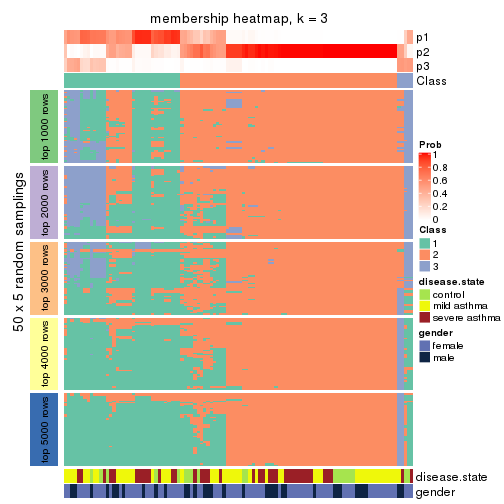</p>

</div>
<div id='tab-CV-hclust-membership-heatmap-3'>
<pre><code class="r">membership_heatmap(res, k = 4)
</code></pre>

<p></p>

</div>
<div id='tab-CV-hclust-membership-heatmap-4'>
<pre><code class="r">membership_heatmap(res, k = 5)
</code></pre>

<p></p>

</div>
<div id='tab-CV-hclust-membership-heatmap-5'>
<pre><code class="r">membership_heatmap(res, k = 6)
</code></pre>

<p></p>

</div>
</div>

As soon as we have had the classes for columns, we can look for signatures
which are significantly different between classes which can be candidate marks
for certain classes. Following are the heatmaps for signatures.


Signature heatmaps where rows are scaled:


<script>
$( function() {
	$( '#tabs-CV-hclust-get-signatures' ).tabs();
} );
</script>
<div id='tabs-CV-hclust-get-signatures'>
<ul>
<li><a href='#tab-CV-hclust-get-signatures-1'>k = 2</a></li>
<li><a href='#tab-CV-hclust-get-signatures-2'>k = 3</a></li>
<li><a href='#tab-CV-hclust-get-signatures-3'>k = 4</a></li>
<li><a href='#tab-CV-hclust-get-signatures-4'>k = 5</a></li>
<li><a href='#tab-CV-hclust-get-signatures-5'>k = 6</a></li>
</ul>
<div id='tab-CV-hclust-get-signatures-1'>
<pre><code class="r">get_signatures(res, k = 2)
</code></pre>

<p></p>

</div>
<div id='tab-CV-hclust-get-signatures-2'>
<pre><code class="r">get_signatures(res, k = 3)
</code></pre>

<p></p>

</div>
<div id='tab-CV-hclust-get-signatures-3'>
<pre><code class="r">get_signatures(res, k = 4)
</code></pre>

<p></p>

</div>
<div id='tab-CV-hclust-get-signatures-4'>
<pre><code class="r">get_signatures(res, k = 5)
</code></pre>

<p></p>

</div>
<div id='tab-CV-hclust-get-signatures-5'>
<pre><code class="r">get_signatures(res, k = 6)
</code></pre>

<p></p>

</div>
</div>


Signature heatmaps where rows are not scaled:


<script>
$( function() {
	$( '#tabs-CV-hclust-get-signatures-no-scale' ).tabs();
} );
</script>
<div id='tabs-CV-hclust-get-signatures-no-scale'>
<ul>
<li><a href='#tab-CV-hclust-get-signatures-no-scale-1'>k = 2</a></li>
<li><a href='#tab-CV-hclust-get-signatures-no-scale-2'>k = 3</a></li>
<li><a href='#tab-CV-hclust-get-signatures-no-scale-3'>k = 4</a></li>
<li><a href='#tab-CV-hclust-get-signatures-no-scale-4'>k = 5</a></li>
<li><a href='#tab-CV-hclust-get-signatures-no-scale-5'>k = 6</a></li>
</ul>
<div id='tab-CV-hclust-get-signatures-no-scale-1'>
<pre><code class="r">get_signatures(res, k = 2, scale_rows = FALSE)
</code></pre>

<p></p>

</div>
<div id='tab-CV-hclust-get-signatures-no-scale-2'>
<pre><code class="r">get_signatures(res, k = 3, scale_rows = FALSE)
</code></pre>

<p></p>

</div>
<div id='tab-CV-hclust-get-signatures-no-scale-3'>
<pre><code class="r">get_signatures(res, k = 4, scale_rows = FALSE)
</code></pre>

<p></p>

</div>
<div id='tab-CV-hclust-get-signatures-no-scale-4'>
<pre><code class="r">get_signatures(res, k = 5, scale_rows = FALSE)
</code></pre>

<p></p>

</div>
<div id='tab-CV-hclust-get-signatures-no-scale-5'>
<pre><code class="r">get_signatures(res, k = 6, scale_rows = FALSE)
</code></pre>

<p></p>

</div>
</div>


Compare the overlap of signatures from different k:

```r
compare_signatures(res)
```

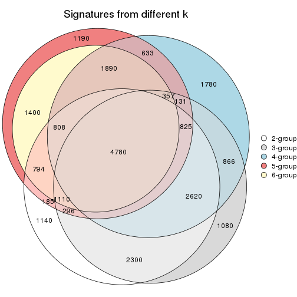

`get_signature()` returns a data frame invisibly. TO get the list of signatures, the function
call should be assigned to a variable explicitly. In following code, if `plot` argument is set
to `FALSE`, no heatmap is plotted while only the differential analysis is performed.

```r
# code only for demonstration
tb = get_signature(res, k = ..., plot = FALSE)
```

An example of the output of `tb` is:

```
#>   which_row         fdr    mean_1    mean_2 scaled_mean_1 scaled_mean_2 km
#> 1        38 0.042760348  8.373488  9.131774    -0.5533452     0.5164555  1
#> 2        40 0.018707592  7.106213  8.469186    -0.6173731     0.5762149  1
#> 3        55 0.019134737 10.221463 11.207825    -0.6159697     0.5749050  1
#> 4        59 0.006059896  5.921854  7.869574    -0.6899429     0.6439467  1
#> 5        60 0.018055526  8.928898 10.211722    -0.6204761     0.5791110  1
#> 6        98 0.009384629 15.714769 14.887706     0.6635654    -0.6193277  2
...
```

The columns in `tb` are:

1. `which_row`: row indices corresponding to the input matrix.
2. `fdr`: FDR for the differential test. 
3. `mean_x`: The mean value in group x.
4. `scaled_mean_x`: The mean value in group x after rows are scaled.
5. `km`: Row groups if k-means clustering is applied to rows.


UMAP plot which shows how samples are separated.


<script>
$( function() {
	$( '#tabs-CV-hclust-dimension-reduction' ).tabs();
} );
</script>
<div id='tabs-CV-hclust-dimension-reduction'>
<ul>
<li><a href='#tab-CV-hclust-dimension-reduction-1'>k = 2</a></li>
<li><a href='#tab-CV-hclust-dimension-reduction-2'>k = 3</a></li>
<li><a href='#tab-CV-hclust-dimension-reduction-3'>k = 4</a></li>
<li><a href='#tab-CV-hclust-dimension-reduction-4'>k = 5</a></li>
<li><a href='#tab-CV-hclust-dimension-reduction-5'>k = 6</a></li>
</ul>
<div id='tab-CV-hclust-dimension-reduction-1'>
<pre><code class="r">dimension_reduction(res, k = 2, method = &quot;UMAP&quot;)
</code></pre>

<p></p>

</div>
<div id='tab-CV-hclust-dimension-reduction-2'>
<pre><code class="r">dimension_reduction(res, k = 3, method = &quot;UMAP&quot;)
</code></pre>

<p></p>

</div>
<div id='tab-CV-hclust-dimension-reduction-3'>
<pre><code class="r">dimension_reduction(res, k = 4, method = &quot;UMAP&quot;)
</code></pre>

<p></p>

</div>
<div id='tab-CV-hclust-dimension-reduction-4'>
<pre><code class="r">dimension_reduction(res, k = 5, method = &quot;UMAP&quot;)
</code></pre>

<p></p>

</div>
<div id='tab-CV-hclust-dimension-reduction-5'>
<pre><code class="r">dimension_reduction(res, k = 6, method = &quot;UMAP&quot;)
</code></pre>

<p></p>

</div>
</div>


Following heatmap shows how subgroups are split when increasing `k`:

```r
collect_classes(res)
```


Test correlation between subgroups and known annotations. If the known
annotation is numeric, one-way ANOVA test is applied, and if the known
annotation is discrete, chi-squared contingency table test is applied.

```r
test_to_known_factors(res)
```

```
#>            n disease.state(p) gender(p) k
#> CV:hclust 82            0.706     0.177 2
#> CV:hclust 70            0.564     0.689 3
#> CV:hclust 67            0.906     0.147 4
#> CV:hclust 65            0.936     0.162 5
#> CV:hclust 63            0.770     0.112 6
```


If matrix rows can be associated to genes, consider to use `GO_Enrichment(res,
...)` to perform function enrichment for the signature genes.


 

---------------------------------------------------


### CV:kmeans


The object with results only for a single top-value method and a single partition method 
can be extracted as:

```r
res = res_list["CV", "kmeans"]
# you can also extract it by
# res = res_list["CV:kmeans"]
```

A summary of `res` and all the functions that can be applied to it:

```r
res
```

```
#> A 'ConsensusPartition' object with k = 2, 3, 4, 5, 6.
#>   On a matrix with 38950 rows and 108 columns.
#>   Top rows (1000, 2000, 3000, 4000, 5000) are extracted by 'CV' method.
#>   Subgroups are detected by 'kmeans' method.
#>   Performed in total 1250 partitions by row resampling.
#>   Best k for subgroups seems to be 2.
#> 
#> Following methods can be applied to this 'ConsensusPartition' object:
#>  [1] "cola_report"             "collect_classes"         "collect_plots"          
#>  [4] "collect_stats"           "colnames"                "compare_signatures"     
#>  [7] "consensus_heatmap"       "dimension_reduction"     "functional_enrichment"  
#> [10] "get_anno_col"            "get_anno"                "get_classes"            
#> [13] "get_consensus"           "get_matrix"              "get_membership"         
#> [16] "get_param"               "get_signatures"          "get_stats"              
#> [19] "is_best_k"               "is_stable_k"             "membership_heatmap"     
#> [22] "ncol"                    "nrow"                    "plot_ecdf"              
#> [25] "rownames"                "select_partition_number" "show"                   
#> [28] "suggest_best_k"          "test_to_known_factors"
```

`collect_plots()` function collects all the plots made from `res` for all `k` (number of partitions)
into one single page to provide an easy and fast comparison between different `k`.

```r
collect_plots(res)
```


The plots are:

- The first row: a plot of the ECDF (Empirical cumulative distribution
  function) curves of the consensus matrix for each `k` and the heatmap of
  predicted classes for each `k`.
- The second row: heatmaps of the consensus matrix for each `k`.
- The third row: heatmaps of the membership matrix for each `k`.
- The fouth row: heatmaps of the signatures for each `k`.

All the plots in panels can be made by individual functions and they are
plotted later in this section.

`select_partition_number()` produces several plots showing different
statistics for choosing "optimized" `k`. There are following statistics:

- ECDF curves of the consensus matrix for each `k`;
- 1-PAC. [The PAC
  score](https://en.wikipedia.org/wiki/Consensus_clustering#Over-interpretation_potential_of_consensus_clustering)
  measures the proportion of the ambiguous subgrouping.
- Mean silhouette score.
- Concordance. The mean probability of fiting the consensus class ids in all
  partitions.
- Area increased. Denote $A_k$ as the area under the ECDF curve for current
  `k`, the area increased is defined as $A_k - A_{k-1}$.
- Rand index. The percent of pairs of samples that are both in a same cluster
  or both are not in a same cluster in the partition of k and k-1.
- Jaccard index. The ratio of pairs of samples are both in a same cluster in
  the partition of k and k-1 and the pairs of samples are both in a same
  cluster in the partition k or k-1.

The detailed explanations of these statistics can be found in [the cola
vignette](http://bioconductor.org/packages/devel/bioc/vignettes/cola/inst/doc/cola.html#toc_13).

Generally speaking, lower PAC score, higher mean silhouette score or higher
concordance corresponds to better partition. Rand index and Jaccard index
measure how similar the current partition is compared to partition with `k-1`.
If they are too similar, we won't accept `k` is better than `k-1`.

```r
select_partition_number(res)
```


The numeric values for all these statistics can be obtained by `get_stats()`.

```r
get_stats(res)
```

```
#>   k 1-PAC mean_silhouette concordance area_increased  Rand Jaccard
#> 2 2 0.835           0.902       0.960         0.4756 0.516   0.516
#> 3 3 0.427           0.530       0.738         0.3079 0.862   0.748
#> 4 4 0.505           0.588       0.750         0.1491 0.762   0.497
#> 5 5 0.583           0.628       0.765         0.0808 0.861   0.548
#> 6 6 0.645           0.623       0.750         0.0411 0.957   0.809
```

`suggest_best_k()` suggests the best $k$ based on these statistics. The rules are as follows:

- All $k$ with Jaccard index larger than 0.95 are removed because the increase of
  the partition number does not provides enough extra information. If all $k$ are removed,
  the best $k$ is assigned by `NA`.
- For $k$ with 1-PAC larger than 0.9, the maximal $k$ is taken as the "best k". Other $k$ is called "optional k".
- If it does not fit the second rule. The $k$ with the highest vote of highest
  1-PAC, mean silhouette and concordance is taken as the "best k".

```r
suggest_best_k(res)
```

```
#> [1] 2
```


Following shows the table of the partitions (You need to click the **show/hide
code output** link to see it). The membership matrix (columns with name `p*`)
is inferred by
[`clue::cl_consensus()`](https://www.rdocumentation.org/link/cl_consensus?package=clue)
function with the `SE` method. Basically the value in the membership matrix
represents the probability to belong to a certain group. The finall class
label for an item is determined with the group with highest probability it
belongs to.

In `get_classes()` function, the entropy is calculated from the membership
matrix and the silhouette score is calculated from the consensus matrix.


<script>
$( function() {
	$( '#tabs-CV-kmeans-get-classes' ).tabs();
} );
</script>
<div id='tabs-CV-kmeans-get-classes'>
<ul>
<li><a href='#tab-CV-kmeans-get-classes-1'>k = 2</a></li>
<li><a href='#tab-CV-kmeans-get-classes-2'>k = 3</a></li>
<li><a href='#tab-CV-kmeans-get-classes-3'>k = 4</a></li>
<li><a href='#tab-CV-kmeans-get-classes-4'>k = 5</a></li>
<li><a href='#tab-CV-kmeans-get-classes-5'>k = 6</a></li>
</ul>

<div id='tab-CV-kmeans-get-classes-1'>
<p><a id='tab-CV-kmeans-get-classes-1-a' style='color:#0366d6' href='#'>show/hide code output</a></p>
<pre><code class="r">cbind(get_classes(res, k = 2), get_membership(res, k = 2))
</code></pre>

<pre><code>#&gt;            class entropy silhouette    p1    p2
#&gt; GSM1068478     1  0.0376      0.930 0.996 0.004
#&gt; GSM1068479     2  0.0000      0.972 0.000 1.000
#&gt; GSM1068481     1  0.0000      0.932 1.000 0.000
#&gt; GSM1068482     1  0.0000      0.932 1.000 0.000
#&gt; GSM1068483     1  0.0000      0.932 1.000 0.000
#&gt; GSM1068486     1  0.0000      0.932 1.000 0.000
#&gt; GSM1068487     2  0.0000      0.972 0.000 1.000
#&gt; GSM1068488     2  0.0672      0.966 0.008 0.992
#&gt; GSM1068490     2  0.0000      0.972 0.000 1.000
#&gt; GSM1068491     2  0.0938      0.963 0.012 0.988
#&gt; GSM1068492     2  0.0000      0.972 0.000 1.000
#&gt; GSM1068493     1  0.7219      0.768 0.800 0.200
#&gt; GSM1068494     1  0.0000      0.932 1.000 0.000
#&gt; GSM1068495     2  0.8144      0.627 0.252 0.748
#&gt; GSM1068496     1  0.0000      0.932 1.000 0.000
#&gt; GSM1068498     1  0.7376      0.761 0.792 0.208
#&gt; GSM1068499     1  0.0000      0.932 1.000 0.000
#&gt; GSM1068500     1  0.0000      0.932 1.000 0.000
#&gt; GSM1068502     2  0.0000      0.972 0.000 1.000
#&gt; GSM1068503     2  0.0000      0.972 0.000 1.000
#&gt; GSM1068505     2  0.0000      0.972 0.000 1.000
#&gt; GSM1068506     2  0.0000      0.972 0.000 1.000
#&gt; GSM1068507     2  0.0000      0.972 0.000 1.000
#&gt; GSM1068508     2  0.0000      0.972 0.000 1.000
#&gt; GSM1068510     2  0.0000      0.972 0.000 1.000
#&gt; GSM1068512     2  0.0672      0.966 0.008 0.992
#&gt; GSM1068513     2  0.0000      0.972 0.000 1.000
#&gt; GSM1068514     2  0.0000      0.972 0.000 1.000
#&gt; GSM1068517     2  1.0000     -0.103 0.496 0.504
#&gt; GSM1068518     2  0.4939      0.858 0.108 0.892
#&gt; GSM1068520     1  0.0000      0.932 1.000 0.000
#&gt; GSM1068521     1  0.0376      0.930 0.996 0.004
#&gt; GSM1068522     2  0.0000      0.972 0.000 1.000
#&gt; GSM1068524     2  0.0000      0.972 0.000 1.000
#&gt; GSM1068527     2  0.0000      0.972 0.000 1.000
#&gt; GSM1068480     1  0.0000      0.932 1.000 0.000
#&gt; GSM1068484     2  0.0000      0.972 0.000 1.000
#&gt; GSM1068485     1  0.0000      0.932 1.000 0.000
#&gt; GSM1068489     2  0.0000      0.972 0.000 1.000
#&gt; GSM1068497     1  0.7453      0.756 0.788 0.212
#&gt; GSM1068501     2  0.0000      0.972 0.000 1.000
#&gt; GSM1068504     2  0.0000      0.972 0.000 1.000
#&gt; GSM1068509     1  0.5408      0.842 0.876 0.124
#&gt; GSM1068511     1  0.0000      0.932 1.000 0.000
#&gt; GSM1068515     1  0.7219      0.770 0.800 0.200
#&gt; GSM1068516     2  0.0376      0.969 0.004 0.996
#&gt; GSM1068519     1  0.0376      0.930 0.996 0.004
#&gt; GSM1068523     2  0.0000      0.972 0.000 1.000
#&gt; GSM1068525     2  0.0000      0.972 0.000 1.000
#&gt; GSM1068526     2  0.0000      0.972 0.000 1.000
#&gt; GSM1068458     1  0.0000      0.932 1.000 0.000
#&gt; GSM1068459     1  0.0000      0.932 1.000 0.000
#&gt; GSM1068460     2  0.0000      0.972 0.000 1.000
#&gt; GSM1068461     1  0.0000      0.932 1.000 0.000
#&gt; GSM1068464     2  0.0000      0.972 0.000 1.000
#&gt; GSM1068468     2  0.0000      0.972 0.000 1.000
#&gt; GSM1068472     1  0.9983      0.175 0.524 0.476
#&gt; GSM1068473     2  0.0000      0.972 0.000 1.000
#&gt; GSM1068474     2  0.0000      0.972 0.000 1.000
#&gt; GSM1068476     2  0.0938      0.963 0.012 0.988
#&gt; GSM1068477     2  0.0000      0.972 0.000 1.000
#&gt; GSM1068462     2  0.0000      0.972 0.000 1.000
#&gt; GSM1068463     1  0.0000      0.932 1.000 0.000
#&gt; GSM1068465     1  0.9460      0.492 0.636 0.364
#&gt; GSM1068466     1  0.0376      0.930 0.996 0.004
#&gt; GSM1068467     2  0.0000      0.972 0.000 1.000
#&gt; GSM1068469     1  0.9580      0.455 0.620 0.380
#&gt; GSM1068470     2  0.0000      0.972 0.000 1.000
#&gt; GSM1068471     2  0.0000      0.972 0.000 1.000
#&gt; GSM1068475     2  0.0000      0.972 0.000 1.000
#&gt; GSM1068528     1  0.0000      0.932 1.000 0.000
#&gt; GSM1068531     1  0.0000      0.932 1.000 0.000
#&gt; GSM1068532     1  0.0000      0.932 1.000 0.000
#&gt; GSM1068533     1  0.0000      0.932 1.000 0.000
#&gt; GSM1068535     1  0.2423      0.905 0.960 0.040
#&gt; GSM1068537     1  0.0000      0.932 1.000 0.000
#&gt; GSM1068538     1  0.0000      0.932 1.000 0.000
#&gt; GSM1068539     2  0.0000      0.972 0.000 1.000
#&gt; GSM1068540     1  0.0000      0.932 1.000 0.000
#&gt; GSM1068542     2  0.0000      0.972 0.000 1.000
#&gt; GSM1068543     2  0.0672      0.966 0.008 0.992
#&gt; GSM1068544     1  0.0000      0.932 1.000 0.000
#&gt; GSM1068545     2  0.0000      0.972 0.000 1.000
#&gt; GSM1068546     1  0.0000      0.932 1.000 0.000
#&gt; GSM1068547     1  0.0376      0.930 0.996 0.004
#&gt; GSM1068548     2  0.0000      0.972 0.000 1.000
#&gt; GSM1068549     1  0.0000      0.932 1.000 0.000
#&gt; GSM1068550     2  0.0000      0.972 0.000 1.000
#&gt; GSM1068551     2  0.0000      0.972 0.000 1.000
#&gt; GSM1068552     2  0.0000      0.972 0.000 1.000
#&gt; GSM1068555     2  0.0000      0.972 0.000 1.000
#&gt; GSM1068556     2  0.0672      0.966 0.008 0.992
#&gt; GSM1068557     2  0.0000      0.972 0.000 1.000
#&gt; GSM1068560     2  0.0000      0.972 0.000 1.000
#&gt; GSM1068561     2  1.0000     -0.104 0.496 0.504
#&gt; GSM1068562     2  0.0000      0.972 0.000 1.000
#&gt; GSM1068563     2  0.0000      0.972 0.000 1.000
#&gt; GSM1068565     2  0.0000      0.972 0.000 1.000
#&gt; GSM1068529     2  0.6247      0.794 0.156 0.844
#&gt; GSM1068530     1  0.0000      0.932 1.000 0.000
#&gt; GSM1068534     1  0.8443      0.666 0.728 0.272
#&gt; GSM1068536     1  0.7453      0.756 0.788 0.212
#&gt; GSM1068541     2  0.0000      0.972 0.000 1.000
#&gt; GSM1068553     2  0.0000      0.972 0.000 1.000
#&gt; GSM1068554     2  0.0000      0.972 0.000 1.000
#&gt; GSM1068558     2  0.3274      0.916 0.060 0.940
#&gt; GSM1068559     2  0.0000      0.972 0.000 1.000
#&gt; GSM1068564     2  0.0000      0.972 0.000 1.000
</code></pre>

<script>
$('#tab-CV-kmeans-get-classes-1-a').parent().next().next().hide();
$('#tab-CV-kmeans-get-classes-1-a').click(function(){
  $('#tab-CV-kmeans-get-classes-1-a').parent().next().next().toggle();
  return(false);
});
</script>
</div>

<div id='tab-CV-kmeans-get-classes-2'>
<p><a id='tab-CV-kmeans-get-classes-2-a' style='color:#0366d6' href='#'>show/hide code output</a></p>
<pre><code class="r">cbind(get_classes(res, k = 3), get_membership(res, k = 3))
</code></pre>

<pre><code>#&gt;            class entropy silhouette    p1    p2    p3
#&gt; GSM1068478     1  0.1620      0.540 0.964 0.012 0.024
#&gt; GSM1068479     2  0.6148      0.669 0.004 0.640 0.356
#&gt; GSM1068481     1  0.6305     -0.670 0.516 0.000 0.484
#&gt; GSM1068482     3  0.6308      0.658 0.492 0.000 0.508
#&gt; GSM1068483     1  0.1411      0.512 0.964 0.000 0.036
#&gt; GSM1068486     3  0.6798      0.721 0.400 0.016 0.584
#&gt; GSM1068487     2  0.5621      0.758 0.000 0.692 0.308
#&gt; GSM1068488     2  0.3539      0.731 0.012 0.888 0.100
#&gt; GSM1068490     2  0.5591      0.759 0.000 0.696 0.304
#&gt; GSM1068491     2  0.6357      0.626 0.012 0.652 0.336
#&gt; GSM1068492     2  0.5201      0.708 0.004 0.760 0.236
#&gt; GSM1068493     1  0.5344      0.520 0.824 0.084 0.092
#&gt; GSM1068494     1  0.2176      0.535 0.948 0.032 0.020
#&gt; GSM1068495     1  0.8971      0.347 0.520 0.336 0.144
#&gt; GSM1068496     1  0.4121      0.312 0.832 0.000 0.168
#&gt; GSM1068498     1  0.6304      0.477 0.752 0.056 0.192
#&gt; GSM1068499     1  0.0892      0.526 0.980 0.000 0.020
#&gt; GSM1068500     1  0.3192      0.409 0.888 0.000 0.112
#&gt; GSM1068502     2  0.6189      0.702 0.004 0.632 0.364
#&gt; GSM1068503     2  0.5560      0.762 0.000 0.700 0.300
#&gt; GSM1068505     2  0.0983      0.779 0.004 0.980 0.016
#&gt; GSM1068506     2  0.0475      0.779 0.004 0.992 0.004
#&gt; GSM1068507     2  0.1031      0.779 0.000 0.976 0.024
#&gt; GSM1068508     2  0.4452      0.777 0.000 0.808 0.192
#&gt; GSM1068510     2  0.1964      0.777 0.000 0.944 0.056
#&gt; GSM1068512     2  0.3618      0.728 0.012 0.884 0.104
#&gt; GSM1068513     2  0.4931      0.774 0.000 0.768 0.232
#&gt; GSM1068514     2  0.4413      0.691 0.008 0.832 0.160
#&gt; GSM1068517     1  0.9148      0.311 0.504 0.160 0.336
#&gt; GSM1068518     2  0.8339     -0.199 0.448 0.472 0.080
#&gt; GSM1068520     1  0.0237      0.532 0.996 0.004 0.000
#&gt; GSM1068521     1  0.1031      0.539 0.976 0.024 0.000
#&gt; GSM1068522     2  0.5465      0.765 0.000 0.712 0.288
#&gt; GSM1068524     2  0.5497      0.765 0.000 0.708 0.292
#&gt; GSM1068527     2  0.0848      0.776 0.008 0.984 0.008
#&gt; GSM1068480     3  0.6421      0.724 0.424 0.004 0.572
#&gt; GSM1068484     2  0.0237      0.779 0.000 0.996 0.004
#&gt; GSM1068485     3  0.6305      0.688 0.484 0.000 0.516
#&gt; GSM1068489     2  0.0661      0.777 0.004 0.988 0.008
#&gt; GSM1068497     1  0.6495      0.474 0.740 0.060 0.200
#&gt; GSM1068501     2  0.1289      0.780 0.000 0.968 0.032
#&gt; GSM1068504     2  0.5706      0.755 0.000 0.680 0.320
#&gt; GSM1068509     1  0.5235      0.504 0.812 0.152 0.036
#&gt; GSM1068511     1  0.6305     -0.642 0.516 0.000 0.484
#&gt; GSM1068515     1  0.6573      0.500 0.756 0.140 0.104
#&gt; GSM1068516     2  0.7890     -0.118 0.432 0.512 0.056
#&gt; GSM1068519     1  0.1399      0.539 0.968 0.028 0.004
#&gt; GSM1068523     2  0.5733      0.755 0.000 0.676 0.324
#&gt; GSM1068525     2  0.1753      0.769 0.000 0.952 0.048
#&gt; GSM1068526     2  0.0661      0.776 0.004 0.988 0.008
#&gt; GSM1068458     1  0.0237      0.532 0.996 0.004 0.000
#&gt; GSM1068459     1  0.6305     -0.670 0.516 0.000 0.484
#&gt; GSM1068460     2  0.7835     -0.160 0.456 0.492 0.052
#&gt; GSM1068461     3  0.6140      0.726 0.404 0.000 0.596
#&gt; GSM1068464     2  0.5650      0.757 0.000 0.688 0.312
#&gt; GSM1068468     2  0.7284      0.724 0.044 0.620 0.336
#&gt; GSM1068472     1  0.9029      0.336 0.536 0.164 0.300
#&gt; GSM1068473     2  0.5650      0.758 0.000 0.688 0.312
#&gt; GSM1068474     2  0.5591      0.759 0.000 0.696 0.304
#&gt; GSM1068476     2  0.5982      0.645 0.004 0.668 0.328
#&gt; GSM1068477     2  0.5591      0.759 0.000 0.696 0.304
#&gt; GSM1068462     2  0.7284      0.724 0.044 0.620 0.336
#&gt; GSM1068463     1  0.6305     -0.670 0.516 0.000 0.484
#&gt; GSM1068465     1  0.7915      0.435 0.644 0.248 0.108
#&gt; GSM1068466     1  0.0475      0.534 0.992 0.004 0.004
#&gt; GSM1068467     2  0.7727      0.706 0.064 0.600 0.336
#&gt; GSM1068469     1  0.8771      0.355 0.556 0.140 0.304
#&gt; GSM1068470     2  0.5706      0.755 0.000 0.680 0.320
#&gt; GSM1068471     2  0.5706      0.755 0.000 0.680 0.320
#&gt; GSM1068475     2  0.5706      0.755 0.000 0.680 0.320
#&gt; GSM1068528     1  0.6126     -0.491 0.600 0.000 0.400
#&gt; GSM1068531     1  0.1529      0.504 0.960 0.000 0.040
#&gt; GSM1068532     1  0.3941      0.332 0.844 0.000 0.156
#&gt; GSM1068533     1  0.2448      0.465 0.924 0.000 0.076
#&gt; GSM1068535     1  0.7536      0.334 0.632 0.304 0.064
#&gt; GSM1068537     1  0.3941      0.332 0.844 0.000 0.156
#&gt; GSM1068538     1  0.3816      0.349 0.852 0.000 0.148
#&gt; GSM1068539     2  0.9152     -0.125 0.424 0.432 0.144
#&gt; GSM1068540     1  0.1525      0.514 0.964 0.004 0.032
#&gt; GSM1068542     2  0.0983      0.775 0.004 0.980 0.016
#&gt; GSM1068543     2  0.4099      0.700 0.008 0.852 0.140
#&gt; GSM1068544     1  0.6305     -0.670 0.516 0.000 0.484
#&gt; GSM1068545     2  0.4062      0.779 0.000 0.836 0.164
#&gt; GSM1068546     3  0.6295      0.698 0.472 0.000 0.528
#&gt; GSM1068547     1  0.1031      0.539 0.976 0.024 0.000
#&gt; GSM1068548     2  0.1015      0.775 0.008 0.980 0.012
#&gt; GSM1068549     3  0.7983      0.600 0.264 0.104 0.632
#&gt; GSM1068550     2  0.0661      0.779 0.004 0.988 0.008
#&gt; GSM1068551     2  0.5650      0.757 0.000 0.688 0.312
#&gt; GSM1068552     2  0.3030      0.783 0.004 0.904 0.092
#&gt; GSM1068555     2  0.5760      0.754 0.000 0.672 0.328
#&gt; GSM1068556     2  0.3120      0.742 0.012 0.908 0.080
#&gt; GSM1068557     2  0.6988      0.740 0.036 0.644 0.320
#&gt; GSM1068560     2  0.0661      0.777 0.008 0.988 0.004
#&gt; GSM1068561     1  0.8625      0.394 0.576 0.288 0.136
#&gt; GSM1068562     2  0.0829      0.776 0.004 0.984 0.012
#&gt; GSM1068563     2  0.0829      0.776 0.004 0.984 0.012
#&gt; GSM1068565     2  0.5621      0.758 0.000 0.692 0.308
#&gt; GSM1068529     1  0.9266      0.192 0.424 0.420 0.156
#&gt; GSM1068530     1  0.1964      0.489 0.944 0.000 0.056
#&gt; GSM1068534     1  0.7944      0.378 0.616 0.296 0.088
#&gt; GSM1068536     1  0.6231      0.505 0.772 0.148 0.080
#&gt; GSM1068541     1  0.9458      0.169 0.448 0.368 0.184
#&gt; GSM1068553     2  0.1647      0.769 0.004 0.960 0.036
#&gt; GSM1068554     2  0.1163      0.776 0.000 0.972 0.028
#&gt; GSM1068558     3  0.6448      0.282 0.012 0.352 0.636
#&gt; GSM1068559     2  0.4099      0.706 0.008 0.852 0.140
#&gt; GSM1068564     2  0.3551      0.782 0.000 0.868 0.132
</code></pre>

<script>
$('#tab-CV-kmeans-get-classes-2-a').parent().next().next().hide();
$('#tab-CV-kmeans-get-classes-2-a').click(function(){
  $('#tab-CV-kmeans-get-classes-2-a').parent().next().next().toggle();
  return(false);
});
</script>
</div>

<div id='tab-CV-kmeans-get-classes-3'>
<p><a id='tab-CV-kmeans-get-classes-3-a' style='color:#0366d6' href='#'>show/hide code output</a></p>
<pre><code class="r">cbind(get_classes(res, k = 4), get_membership(res, k = 4))
</code></pre>

<pre><code>#&gt;            class entropy silhouette    p1    p2    p3    p4
#&gt; GSM1068478     1  0.1824     0.6517 0.936 0.004 0.000 0.060
#&gt; GSM1068479     2  0.7281     0.3136 0.000 0.532 0.196 0.272
#&gt; GSM1068481     3  0.3942     0.7552 0.236 0.000 0.764 0.000
#&gt; GSM1068482     3  0.4285     0.7889 0.156 0.000 0.804 0.040
#&gt; GSM1068483     1  0.3402     0.5156 0.832 0.000 0.164 0.004
#&gt; GSM1068486     3  0.4608     0.7733 0.096 0.000 0.800 0.104
#&gt; GSM1068487     2  0.0188     0.7970 0.000 0.996 0.000 0.004
#&gt; GSM1068488     4  0.4719     0.7163 0.016 0.224 0.008 0.752
#&gt; GSM1068490     2  0.0336     0.7943 0.000 0.992 0.000 0.008
#&gt; GSM1068491     4  0.7834     0.1033 0.000 0.308 0.284 0.408
#&gt; GSM1068492     4  0.7064     0.3651 0.000 0.280 0.164 0.556
#&gt; GSM1068493     1  0.5601     0.6461 0.764 0.052 0.048 0.136
#&gt; GSM1068494     1  0.3818     0.6491 0.844 0.000 0.048 0.108
#&gt; GSM1068495     1  0.6751     0.5818 0.624 0.124 0.008 0.244
#&gt; GSM1068496     1  0.4817     0.0575 0.612 0.000 0.388 0.000
#&gt; GSM1068498     1  0.5782     0.5912 0.704 0.220 0.008 0.068
#&gt; GSM1068499     1  0.3081     0.6445 0.888 0.000 0.048 0.064
#&gt; GSM1068500     1  0.4428     0.3305 0.720 0.000 0.276 0.004
#&gt; GSM1068502     2  0.6724     0.4282 0.000 0.612 0.164 0.224
#&gt; GSM1068503     2  0.1474     0.7549 0.000 0.948 0.000 0.052
#&gt; GSM1068505     4  0.4713     0.7452 0.000 0.360 0.000 0.640
#&gt; GSM1068506     4  0.4697     0.7484 0.000 0.356 0.000 0.644
#&gt; GSM1068507     4  0.4872     0.7470 0.000 0.356 0.004 0.640
#&gt; GSM1068508     2  0.4193     0.3091 0.000 0.732 0.000 0.268
#&gt; GSM1068510     4  0.5186     0.7377 0.000 0.344 0.016 0.640
#&gt; GSM1068512     4  0.4339     0.7168 0.008 0.224 0.004 0.764
#&gt; GSM1068513     2  0.3105     0.6373 0.000 0.856 0.004 0.140
#&gt; GSM1068514     4  0.5470     0.5988 0.000 0.168 0.100 0.732
#&gt; GSM1068517     1  0.6667     0.3902 0.532 0.392 0.008 0.068
#&gt; GSM1068518     4  0.6217     0.1070 0.360 0.040 0.012 0.588
#&gt; GSM1068520     1  0.0188     0.6384 0.996 0.000 0.000 0.004
#&gt; GSM1068521     1  0.1637     0.6529 0.940 0.000 0.000 0.060
#&gt; GSM1068522     2  0.2647     0.6620 0.000 0.880 0.000 0.120
#&gt; GSM1068524     2  0.0469     0.7922 0.000 0.988 0.000 0.012
#&gt; GSM1068527     4  0.4543     0.7548 0.000 0.324 0.000 0.676
#&gt; GSM1068480     3  0.4804     0.7391 0.064 0.000 0.776 0.160
#&gt; GSM1068484     4  0.4837     0.7538 0.000 0.348 0.004 0.648
#&gt; GSM1068485     3  0.4105     0.7893 0.156 0.000 0.812 0.032
#&gt; GSM1068489     4  0.4679     0.7507 0.000 0.352 0.000 0.648
#&gt; GSM1068497     1  0.6083     0.5849 0.688 0.228 0.016 0.068
#&gt; GSM1068501     4  0.5220     0.7408 0.000 0.352 0.016 0.632
#&gt; GSM1068504     2  0.0000     0.7991 0.000 1.000 0.000 0.000
#&gt; GSM1068509     1  0.4975     0.6346 0.752 0.008 0.032 0.208
#&gt; GSM1068511     3  0.6351     0.6759 0.268 0.000 0.628 0.104
#&gt; GSM1068515     1  0.6500     0.6305 0.696 0.064 0.056 0.184
#&gt; GSM1068516     4  0.6215     0.0476 0.384 0.036 0.012 0.568
#&gt; GSM1068519     1  0.1209     0.6489 0.964 0.000 0.004 0.032
#&gt; GSM1068523     2  0.0000     0.7991 0.000 1.000 0.000 0.000
#&gt; GSM1068525     4  0.4560     0.7475 0.000 0.296 0.004 0.700
#&gt; GSM1068526     4  0.4624     0.7551 0.000 0.340 0.000 0.660
#&gt; GSM1068458     1  0.0188     0.6384 0.996 0.000 0.000 0.004
#&gt; GSM1068459     3  0.3907     0.7583 0.232 0.000 0.768 0.000
#&gt; GSM1068460     1  0.5384     0.5550 0.648 0.028 0.000 0.324
#&gt; GSM1068461     3  0.3734     0.7475 0.044 0.000 0.848 0.108
#&gt; GSM1068464     2  0.0336     0.7951 0.000 0.992 0.000 0.008
#&gt; GSM1068468     2  0.5352     0.5638 0.156 0.756 0.008 0.080
#&gt; GSM1068472     1  0.7174     0.3234 0.484 0.420 0.024 0.072
#&gt; GSM1068473     2  0.0336     0.7943 0.000 0.992 0.000 0.008
#&gt; GSM1068474     2  0.0000     0.7991 0.000 1.000 0.000 0.000
#&gt; GSM1068476     4  0.7823     0.1125 0.000 0.308 0.280 0.412
#&gt; GSM1068477     2  0.0000     0.7991 0.000 1.000 0.000 0.000
#&gt; GSM1068462     2  0.5397     0.5594 0.160 0.752 0.008 0.080
#&gt; GSM1068463     3  0.3975     0.7535 0.240 0.000 0.760 0.000
#&gt; GSM1068465     1  0.5751     0.6243 0.708 0.020 0.044 0.228
#&gt; GSM1068466     1  0.0376     0.6365 0.992 0.000 0.004 0.004
#&gt; GSM1068467     2  0.5694     0.5206 0.176 0.728 0.008 0.088
#&gt; GSM1068469     1  0.7181     0.3062 0.476 0.428 0.024 0.072
#&gt; GSM1068470     2  0.0000     0.7991 0.000 1.000 0.000 0.000
#&gt; GSM1068471     2  0.0000     0.7991 0.000 1.000 0.000 0.000
#&gt; GSM1068475     2  0.0000     0.7991 0.000 1.000 0.000 0.000
#&gt; GSM1068528     3  0.4925     0.4809 0.428 0.000 0.572 0.000
#&gt; GSM1068531     1  0.3052     0.5288 0.860 0.000 0.136 0.004
#&gt; GSM1068532     1  0.4855     0.1339 0.644 0.000 0.352 0.004
#&gt; GSM1068533     1  0.4313     0.3506 0.736 0.000 0.260 0.004
#&gt; GSM1068535     4  0.6744     0.3849 0.276 0.024 0.076 0.624
#&gt; GSM1068537     1  0.4837     0.1436 0.648 0.000 0.348 0.004
#&gt; GSM1068538     1  0.4819     0.1586 0.652 0.000 0.344 0.004
#&gt; GSM1068539     1  0.7367     0.4789 0.536 0.152 0.008 0.304
#&gt; GSM1068540     1  0.3208     0.5134 0.848 0.000 0.148 0.004
#&gt; GSM1068542     4  0.4713     0.7452 0.000 0.360 0.000 0.640
#&gt; GSM1068543     4  0.3908     0.7074 0.000 0.212 0.004 0.784
#&gt; GSM1068544     3  0.4134     0.7380 0.260 0.000 0.740 0.000
#&gt; GSM1068545     2  0.4843    -0.2087 0.000 0.604 0.000 0.396
#&gt; GSM1068546     3  0.4245     0.7896 0.116 0.000 0.820 0.064
#&gt; GSM1068547     1  0.0469     0.6421 0.988 0.000 0.000 0.012
#&gt; GSM1068548     4  0.4643     0.7543 0.000 0.344 0.000 0.656
#&gt; GSM1068549     3  0.4327     0.6717 0.016 0.000 0.768 0.216
#&gt; GSM1068550     4  0.4713     0.7452 0.000 0.360 0.000 0.640
#&gt; GSM1068551     2  0.0000     0.7991 0.000 1.000 0.000 0.000
#&gt; GSM1068552     4  0.4989     0.5555 0.000 0.472 0.000 0.528
#&gt; GSM1068555     2  0.0188     0.7970 0.000 0.996 0.000 0.004
#&gt; GSM1068556     4  0.4283     0.7317 0.000 0.256 0.004 0.740
#&gt; GSM1068557     2  0.5941     0.5331 0.172 0.712 0.008 0.108
#&gt; GSM1068560     4  0.4661     0.7533 0.000 0.348 0.000 0.652
#&gt; GSM1068561     1  0.7426     0.5985 0.632 0.140 0.056 0.172
#&gt; GSM1068562     4  0.4661     0.7533 0.000 0.348 0.000 0.652
#&gt; GSM1068563     4  0.4624     0.7551 0.000 0.340 0.000 0.660
#&gt; GSM1068565     2  0.0000     0.7991 0.000 1.000 0.000 0.000
#&gt; GSM1068529     4  0.6684     0.0497 0.360 0.028 0.044 0.568
#&gt; GSM1068530     1  0.3870     0.4391 0.788 0.000 0.208 0.004
#&gt; GSM1068534     1  0.6734     0.3573 0.488 0.008 0.068 0.436
#&gt; GSM1068536     1  0.4218     0.6468 0.796 0.012 0.008 0.184
#&gt; GSM1068541     1  0.6549     0.5642 0.612 0.120 0.000 0.268
#&gt; GSM1068553     4  0.5018     0.7527 0.000 0.332 0.012 0.656
#&gt; GSM1068554     4  0.5220     0.7408 0.000 0.352 0.016 0.632
#&gt; GSM1068558     3  0.4431     0.5999 0.000 0.000 0.696 0.304
#&gt; GSM1068559     4  0.5185     0.6294 0.000 0.176 0.076 0.748
#&gt; GSM1068564     2  0.4972    -0.4065 0.000 0.544 0.000 0.456
</code></pre>

<script>
$('#tab-CV-kmeans-get-classes-3-a').parent().next().next().hide();
$('#tab-CV-kmeans-get-classes-3-a').click(function(){
  $('#tab-CV-kmeans-get-classes-3-a').parent().next().next().toggle();
  return(false);
});
</script>
</div>

<div id='tab-CV-kmeans-get-classes-4'>
<p><a id='tab-CV-kmeans-get-classes-4-a' style='color:#0366d6' href='#'>show/hide code output</a></p>
<pre><code class="r">cbind(get_classes(res, k = 5), get_membership(res, k = 5))
</code></pre>

<pre><code>#&gt;            class entropy silhouette    p1    p2    p3    p4    p5
#&gt; GSM1068478     5   0.229     0.7229 0.108 0.004 0.000 0.000 0.888
#&gt; GSM1068479     3   0.625     0.4329 0.000 0.284 0.572 0.128 0.016
#&gt; GSM1068481     1   0.372     0.4405 0.784 0.004 0.196 0.000 0.016
#&gt; GSM1068482     1   0.592     0.1544 0.580 0.032 0.332 0.000 0.056
#&gt; GSM1068483     1   0.513     0.2859 0.536 0.024 0.008 0.000 0.432
#&gt; GSM1068486     3   0.615     0.2441 0.356 0.032 0.552 0.004 0.056
#&gt; GSM1068487     2   0.247     0.8586 0.000 0.864 0.000 0.136 0.000
#&gt; GSM1068488     4   0.417     0.7108 0.000 0.008 0.148 0.788 0.056
#&gt; GSM1068490     2   0.263     0.8574 0.000 0.860 0.004 0.136 0.000
#&gt; GSM1068491     3   0.638     0.5020 0.012 0.148 0.616 0.208 0.016
#&gt; GSM1068492     3   0.656     0.3324 0.000 0.120 0.548 0.300 0.032
#&gt; GSM1068493     5   0.240     0.7641 0.028 0.016 0.012 0.024 0.920
#&gt; GSM1068494     5   0.353     0.7460 0.064 0.016 0.032 0.024 0.864
#&gt; GSM1068495     5   0.249     0.7651 0.000 0.036 0.000 0.068 0.896
#&gt; GSM1068496     1   0.345     0.6279 0.812 0.000 0.024 0.000 0.164
#&gt; GSM1068498     5   0.343     0.7196 0.040 0.132 0.000 0.000 0.828
#&gt; GSM1068499     5   0.274     0.7413 0.084 0.004 0.016 0.008 0.888
#&gt; GSM1068500     1   0.486     0.5060 0.636 0.008 0.024 0.000 0.332
#&gt; GSM1068502     3   0.576     0.3149 0.000 0.364 0.560 0.060 0.016
#&gt; GSM1068503     2   0.343     0.7882 0.000 0.776 0.004 0.220 0.000
#&gt; GSM1068505     4   0.157     0.8329 0.000 0.044 0.004 0.944 0.008
#&gt; GSM1068506     4   0.196     0.8365 0.000 0.048 0.004 0.928 0.020
#&gt; GSM1068507     4   0.203     0.8303 0.000 0.056 0.008 0.924 0.012
#&gt; GSM1068508     2   0.480     0.4348 0.000 0.580 0.000 0.396 0.024
#&gt; GSM1068510     4   0.229     0.8138 0.000 0.048 0.024 0.916 0.012
#&gt; GSM1068512     4   0.410     0.7132 0.000 0.008 0.148 0.792 0.052
#&gt; GSM1068513     2   0.478     0.3756 0.000 0.532 0.012 0.452 0.004
#&gt; GSM1068514     4   0.555     0.1284 0.000 0.016 0.456 0.492 0.036
#&gt; GSM1068517     5   0.410     0.5743 0.004 0.300 0.000 0.004 0.692
#&gt; GSM1068518     5   0.467     0.5984 0.000 0.000 0.056 0.240 0.704
#&gt; GSM1068520     5   0.471     0.4827 0.292 0.040 0.000 0.000 0.668
#&gt; GSM1068521     5   0.311     0.6989 0.132 0.024 0.000 0.000 0.844
#&gt; GSM1068522     2   0.414     0.6719 0.000 0.684 0.004 0.308 0.004
#&gt; GSM1068524     2   0.296     0.8491 0.000 0.840 0.004 0.152 0.004
#&gt; GSM1068527     4   0.278     0.8250 0.000 0.032 0.032 0.896 0.040
#&gt; GSM1068480     3   0.601     0.3567 0.252 0.064 0.632 0.000 0.052
#&gt; GSM1068484     4   0.302     0.8258 0.000 0.040 0.032 0.884 0.044
#&gt; GSM1068485     1   0.466     0.2029 0.624 0.004 0.356 0.000 0.016
#&gt; GSM1068489     4   0.136     0.8353 0.000 0.028 0.004 0.956 0.012
#&gt; GSM1068497     5   0.311     0.7337 0.028 0.112 0.004 0.000 0.856
#&gt; GSM1068501     4   0.205     0.8223 0.000 0.040 0.020 0.928 0.012
#&gt; GSM1068504     2   0.292     0.8569 0.000 0.852 0.000 0.132 0.016
#&gt; GSM1068509     5   0.195     0.7637 0.024 0.000 0.008 0.036 0.932
#&gt; GSM1068511     3   0.768    -0.0959 0.336 0.072 0.404 0.000 0.188
#&gt; GSM1068515     5   0.332     0.7502 0.016 0.040 0.048 0.020 0.876
#&gt; GSM1068516     5   0.419     0.6517 0.000 0.000 0.040 0.212 0.748
#&gt; GSM1068519     5   0.477     0.5937 0.212 0.040 0.000 0.020 0.728
#&gt; GSM1068523     2   0.306     0.8555 0.000 0.844 0.000 0.136 0.020
#&gt; GSM1068525     4   0.335     0.8047 0.000 0.024 0.052 0.864 0.060
#&gt; GSM1068526     4   0.205     0.8383 0.000 0.040 0.012 0.928 0.020
#&gt; GSM1068458     5   0.476     0.4830 0.288 0.044 0.000 0.000 0.668
#&gt; GSM1068459     1   0.346     0.4476 0.792 0.000 0.196 0.000 0.012
#&gt; GSM1068460     5   0.334     0.7336 0.020 0.008 0.000 0.136 0.836
#&gt; GSM1068461     3   0.501     0.3522 0.320 0.020 0.640 0.000 0.020
#&gt; GSM1068464     2   0.254     0.8551 0.000 0.868 0.004 0.128 0.000
#&gt; GSM1068468     2   0.340     0.6606 0.000 0.812 0.004 0.012 0.172
#&gt; GSM1068472     5   0.445     0.5385 0.008 0.324 0.000 0.008 0.660
#&gt; GSM1068473     2   0.263     0.8574 0.000 0.860 0.004 0.136 0.000
#&gt; GSM1068474     2   0.247     0.8586 0.000 0.864 0.000 0.136 0.000
#&gt; GSM1068476     3   0.635     0.5046 0.012 0.148 0.620 0.204 0.016
#&gt; GSM1068477     2   0.247     0.8586 0.000 0.864 0.000 0.136 0.000
#&gt; GSM1068462     2   0.399     0.5866 0.000 0.740 0.004 0.012 0.244
#&gt; GSM1068463     1   0.346     0.4476 0.792 0.000 0.196 0.000 0.012
#&gt; GSM1068465     5   0.364     0.7494 0.020 0.024 0.060 0.036 0.860
#&gt; GSM1068466     5   0.471     0.4974 0.280 0.044 0.000 0.000 0.676
#&gt; GSM1068467     2   0.416     0.5661 0.000 0.728 0.008 0.012 0.252
#&gt; GSM1068469     5   0.448     0.4175 0.012 0.376 0.000 0.000 0.612
#&gt; GSM1068470     2   0.306     0.8555 0.000 0.844 0.000 0.136 0.020
#&gt; GSM1068471     2   0.292     0.8569 0.000 0.852 0.000 0.132 0.016
#&gt; GSM1068475     2   0.292     0.8569 0.000 0.852 0.000 0.132 0.016
#&gt; GSM1068528     1   0.191     0.5573 0.932 0.004 0.036 0.000 0.028
#&gt; GSM1068531     1   0.517     0.4008 0.576 0.048 0.000 0.000 0.376
#&gt; GSM1068532     1   0.392     0.6369 0.780 0.040 0.000 0.000 0.180
#&gt; GSM1068533     1   0.427     0.6310 0.748 0.048 0.000 0.000 0.204
#&gt; GSM1068535     4   0.514     0.6419 0.072 0.048 0.044 0.780 0.056
#&gt; GSM1068537     1   0.392     0.6369 0.780 0.040 0.000 0.000 0.180
#&gt; GSM1068538     1   0.410     0.6353 0.764 0.044 0.000 0.000 0.192
#&gt; GSM1068539     5   0.356     0.7450 0.000 0.044 0.012 0.104 0.840
#&gt; GSM1068540     1   0.506     0.3839 0.576 0.040 0.000 0.000 0.384
#&gt; GSM1068542     4   0.188     0.8355 0.000 0.048 0.008 0.932 0.012
#&gt; GSM1068543     4   0.392     0.7223 0.000 0.008 0.144 0.804 0.044
#&gt; GSM1068544     1   0.282     0.4934 0.856 0.000 0.132 0.000 0.012
#&gt; GSM1068545     4   0.472     0.2088 0.000 0.396 0.000 0.584 0.020
#&gt; GSM1068546     1   0.630    -0.1045 0.472 0.028 0.440 0.012 0.048
#&gt; GSM1068547     5   0.464     0.5037 0.280 0.040 0.000 0.000 0.680
#&gt; GSM1068548     4   0.201     0.8375 0.000 0.044 0.008 0.928 0.020
#&gt; GSM1068549     3   0.395     0.4607 0.176 0.012 0.792 0.012 0.008
#&gt; GSM1068550     4   0.176     0.8348 0.000 0.048 0.004 0.936 0.012
#&gt; GSM1068551     2   0.252     0.8580 0.000 0.860 0.000 0.140 0.000
#&gt; GSM1068552     4   0.372     0.6304 0.000 0.228 0.000 0.760 0.012
#&gt; GSM1068555     2   0.302     0.8544 0.000 0.848 0.000 0.132 0.020
#&gt; GSM1068556     4   0.356     0.7623 0.000 0.016 0.108 0.840 0.036
#&gt; GSM1068557     2   0.488     0.2494 0.000 0.572 0.004 0.020 0.404
#&gt; GSM1068560     4   0.286     0.8280 0.000 0.040 0.028 0.892 0.040
#&gt; GSM1068561     5   0.288     0.7617 0.008 0.044 0.024 0.028 0.896
#&gt; GSM1068562     4   0.252     0.8324 0.000 0.040 0.028 0.908 0.024
#&gt; GSM1068563     4   0.232     0.8376 0.000 0.044 0.016 0.916 0.024
#&gt; GSM1068565     2   0.247     0.8586 0.000 0.864 0.000 0.136 0.000
#&gt; GSM1068529     5   0.475     0.6373 0.000 0.004 0.080 0.184 0.732
#&gt; GSM1068530     1   0.437     0.5996 0.724 0.040 0.000 0.000 0.236
#&gt; GSM1068534     5   0.474     0.6728 0.008 0.012 0.068 0.148 0.764
#&gt; GSM1068536     5   0.191     0.7616 0.036 0.004 0.000 0.028 0.932
#&gt; GSM1068541     5   0.279     0.7614 0.000 0.056 0.000 0.064 0.880
#&gt; GSM1068553     4   0.152     0.8293 0.000 0.020 0.016 0.952 0.012
#&gt; GSM1068554     4   0.197     0.8233 0.000 0.036 0.020 0.932 0.012
#&gt; GSM1068558     3   0.488     0.4512 0.124 0.068 0.768 0.004 0.036
#&gt; GSM1068559     4   0.552     0.3715 0.000 0.016 0.364 0.576 0.044
#&gt; GSM1068564     4   0.418     0.4147 0.000 0.324 0.000 0.668 0.008
</code></pre>

<script>
$('#tab-CV-kmeans-get-classes-4-a').parent().next().next().hide();
$('#tab-CV-kmeans-get-classes-4-a').click(function(){
  $('#tab-CV-kmeans-get-classes-4-a').parent().next().next().toggle();
  return(false);
});
</script>
</div>

<div id='tab-CV-kmeans-get-classes-5'>
<p><a id='tab-CV-kmeans-get-classes-5-a' style='color:#0366d6' href='#'>show/hide code output</a></p>
<pre><code class="r">cbind(get_classes(res, k = 6), get_membership(res, k = 6))
</code></pre>

<pre><code>#&gt;            class entropy silhouette    p1    p2    p3    p4    p5    p6
#&gt; GSM1068478     5   0.152      0.707 0.060 0.008 0.000 0.000 0.932 0.000
#&gt; GSM1068479     4   0.534      0.702 0.000 0.156 0.060 0.680 0.000 0.104
#&gt; GSM1068481     3   0.421      0.366 0.460 0.000 0.528 0.004 0.008 0.000
#&gt; GSM1068482     3   0.431      0.567 0.260 0.000 0.692 0.040 0.008 0.000
#&gt; GSM1068483     1   0.582      0.497 0.548 0.020 0.072 0.020 0.340 0.000
#&gt; GSM1068486     3   0.437      0.602 0.064 0.004 0.740 0.180 0.012 0.000
#&gt; GSM1068487     2   0.154      0.866 0.000 0.936 0.008 0.004 0.000 0.052
#&gt; GSM1068488     6   0.366      0.670 0.000 0.008 0.004 0.184 0.024 0.780
#&gt; GSM1068490     2   0.161      0.864 0.000 0.932 0.008 0.004 0.000 0.056
#&gt; GSM1068491     4   0.557      0.721 0.000 0.088 0.100 0.676 0.004 0.132
#&gt; GSM1068492     4   0.457      0.711 0.000 0.076 0.008 0.732 0.012 0.172
#&gt; GSM1068493     5   0.262      0.732 0.004 0.028 0.032 0.024 0.900 0.012
#&gt; GSM1068494     5   0.434      0.700 0.036 0.000 0.044 0.096 0.792 0.032
#&gt; GSM1068495     5   0.269      0.737 0.000 0.040 0.004 0.012 0.884 0.060
#&gt; GSM1068496     1   0.452      0.411 0.692 0.000 0.228 0.004 0.076 0.000
#&gt; GSM1068498     5   0.310      0.712 0.020 0.104 0.016 0.008 0.852 0.000
#&gt; GSM1068499     5   0.298      0.718 0.036 0.004 0.036 0.052 0.872 0.000
#&gt; GSM1068500     1   0.582      0.577 0.588 0.012 0.128 0.016 0.256 0.000
#&gt; GSM1068502     4   0.506      0.640 0.000 0.204 0.056 0.684 0.000 0.056
#&gt; GSM1068503     2   0.273      0.783 0.000 0.840 0.008 0.004 0.000 0.148
#&gt; GSM1068505     6   0.267      0.775 0.012 0.048 0.028 0.020 0.000 0.892
#&gt; GSM1068506     6   0.182      0.789 0.000 0.056 0.000 0.012 0.008 0.924
#&gt; GSM1068507     6   0.337      0.768 0.012 0.080 0.024 0.036 0.000 0.848
#&gt; GSM1068508     2   0.392      0.399 0.000 0.620 0.000 0.008 0.000 0.372
#&gt; GSM1068510     6   0.481      0.686 0.032 0.056 0.072 0.076 0.000 0.764
#&gt; GSM1068512     6   0.345      0.686 0.000 0.008 0.004 0.160 0.024 0.804
#&gt; GSM1068513     2   0.558      0.366 0.016 0.556 0.040 0.032 0.000 0.356
#&gt; GSM1068514     4   0.422      0.547 0.000 0.012 0.000 0.660 0.016 0.312
#&gt; GSM1068517     5   0.392      0.628 0.004 0.244 0.016 0.008 0.728 0.000
#&gt; GSM1068518     5   0.488      0.603 0.000 0.004 0.008 0.116 0.692 0.180
#&gt; GSM1068520     5   0.435      0.219 0.392 0.008 0.004 0.008 0.588 0.000
#&gt; GSM1068521     5   0.286      0.658 0.136 0.004 0.000 0.012 0.844 0.004
#&gt; GSM1068522     2   0.453      0.659 0.008 0.724 0.032 0.020 0.004 0.212
#&gt; GSM1068524     2   0.164      0.867 0.000 0.932 0.004 0.012 0.000 0.052
#&gt; GSM1068527     6   0.319      0.761 0.000 0.032 0.004 0.088 0.024 0.852
#&gt; GSM1068480     3   0.335      0.542 0.008 0.000 0.792 0.184 0.016 0.000
#&gt; GSM1068484     6   0.402      0.746 0.000 0.040 0.008 0.132 0.028 0.792
#&gt; GSM1068485     3   0.497      0.537 0.296 0.000 0.624 0.068 0.012 0.000
#&gt; GSM1068489     6   0.327      0.767 0.012 0.044 0.044 0.032 0.004 0.864
#&gt; GSM1068497     5   0.286      0.717 0.016 0.092 0.016 0.008 0.868 0.000
#&gt; GSM1068501     6   0.482      0.691 0.032 0.044 0.076 0.076 0.004 0.768
#&gt; GSM1068504     2   0.169      0.867 0.000 0.932 0.004 0.008 0.004 0.052
#&gt; GSM1068509     5   0.240      0.731 0.000 0.004 0.020 0.040 0.904 0.032
#&gt; GSM1068511     3   0.729      0.359 0.160 0.028 0.524 0.156 0.128 0.004
#&gt; GSM1068515     5   0.427      0.685 0.012 0.044 0.108 0.048 0.788 0.000
#&gt; GSM1068516     5   0.429      0.682 0.000 0.008 0.016 0.088 0.772 0.116
#&gt; GSM1068519     5   0.467      0.377 0.328 0.000 0.016 0.032 0.624 0.000
#&gt; GSM1068523     2   0.188      0.864 0.000 0.924 0.004 0.016 0.004 0.052
#&gt; GSM1068525     6   0.380      0.720 0.000 0.020 0.008 0.148 0.028 0.796
#&gt; GSM1068526     6   0.187      0.792 0.000 0.048 0.000 0.020 0.008 0.924
#&gt; GSM1068458     5   0.497      0.113 0.416 0.012 0.028 0.008 0.536 0.000
#&gt; GSM1068459     3   0.409      0.368 0.464 0.000 0.528 0.000 0.008 0.000
#&gt; GSM1068460     5   0.305      0.722 0.028 0.004 0.000 0.016 0.856 0.096
#&gt; GSM1068461     3   0.424      0.378 0.028 0.000 0.628 0.344 0.000 0.000
#&gt; GSM1068464     2   0.162      0.861 0.000 0.932 0.000 0.020 0.000 0.048
#&gt; GSM1068468     2   0.324      0.695 0.000 0.832 0.012 0.024 0.128 0.004
#&gt; GSM1068472     5   0.453      0.549 0.004 0.312 0.016 0.020 0.648 0.000
#&gt; GSM1068473     2   0.161      0.864 0.000 0.932 0.008 0.004 0.000 0.056
#&gt; GSM1068474     2   0.154      0.866 0.000 0.936 0.008 0.004 0.000 0.052
#&gt; GSM1068476     4   0.551      0.715 0.000 0.096 0.104 0.684 0.004 0.112
#&gt; GSM1068477     2   0.128      0.868 0.000 0.944 0.000 0.004 0.000 0.052
#&gt; GSM1068462     2   0.432      0.454 0.000 0.680 0.016 0.024 0.280 0.000
#&gt; GSM1068463     3   0.409      0.367 0.468 0.000 0.524 0.000 0.008 0.000
#&gt; GSM1068465     5   0.448      0.692 0.024 0.032 0.088 0.040 0.796 0.020
#&gt; GSM1068466     5   0.478      0.194 0.388 0.012 0.020 0.008 0.572 0.000
#&gt; GSM1068467     2   0.470      0.357 0.000 0.632 0.016 0.028 0.320 0.004
#&gt; GSM1068469     5   0.471      0.443 0.004 0.368 0.020 0.016 0.592 0.000
#&gt; GSM1068470     2   0.179      0.865 0.000 0.928 0.004 0.012 0.004 0.052
#&gt; GSM1068471     2   0.169      0.867 0.000 0.932 0.004 0.008 0.004 0.052
#&gt; GSM1068475     2   0.143      0.867 0.000 0.940 0.000 0.004 0.004 0.052
#&gt; GSM1068528     1   0.446      0.140 0.632 0.008 0.336 0.008 0.016 0.000
#&gt; GSM1068531     1   0.420      0.628 0.704 0.008 0.020 0.008 0.260 0.000
#&gt; GSM1068532     1   0.216      0.692 0.892 0.000 0.008 0.004 0.096 0.000
#&gt; GSM1068533     1   0.304      0.688 0.848 0.008 0.020 0.008 0.116 0.000
#&gt; GSM1068535     6   0.533      0.567 0.148 0.004 0.064 0.052 0.020 0.712
#&gt; GSM1068537     1   0.202      0.692 0.896 0.000 0.008 0.000 0.096 0.000
#&gt; GSM1068538     1   0.216      0.693 0.892 0.000 0.008 0.004 0.096 0.000
#&gt; GSM1068539     5   0.410      0.713 0.000 0.040 0.004 0.068 0.796 0.092
#&gt; GSM1068540     1   0.355      0.602 0.696 0.000 0.000 0.004 0.300 0.000
#&gt; GSM1068542     6   0.135      0.789 0.004 0.056 0.000 0.000 0.000 0.940
#&gt; GSM1068543     6   0.341      0.685 0.000 0.008 0.004 0.164 0.020 0.804
#&gt; GSM1068544     1   0.418     -0.376 0.504 0.000 0.484 0.000 0.012 0.000
#&gt; GSM1068545     6   0.417      0.231 0.000 0.424 0.000 0.008 0.004 0.564
#&gt; GSM1068546     3   0.479      0.617 0.124 0.004 0.740 0.104 0.012 0.016
#&gt; GSM1068547     5   0.450      0.209 0.400 0.008 0.004 0.008 0.576 0.004
#&gt; GSM1068548     6   0.183      0.791 0.000 0.052 0.000 0.020 0.004 0.924
#&gt; GSM1068549     4   0.434      0.229 0.016 0.000 0.344 0.628 0.000 0.012
#&gt; GSM1068550     6   0.149      0.789 0.000 0.056 0.000 0.004 0.004 0.936
#&gt; GSM1068551     2   0.164      0.866 0.000 0.932 0.004 0.012 0.000 0.052
#&gt; GSM1068552     6   0.356      0.595 0.000 0.256 0.000 0.008 0.004 0.732
#&gt; GSM1068555     2   0.186      0.859 0.000 0.928 0.004 0.016 0.008 0.044
#&gt; GSM1068556     6   0.320      0.719 0.000 0.012 0.004 0.132 0.020 0.832
#&gt; GSM1068557     5   0.521      0.221 0.000 0.432 0.008 0.032 0.508 0.020
#&gt; GSM1068560     6   0.338      0.765 0.000 0.040 0.004 0.092 0.024 0.840
#&gt; GSM1068561     5   0.351      0.736 0.000 0.048 0.020 0.036 0.848 0.048
#&gt; GSM1068562     6   0.313      0.774 0.000 0.052 0.000 0.088 0.012 0.848
#&gt; GSM1068563     6   0.265      0.786 0.000 0.048 0.000 0.052 0.016 0.884
#&gt; GSM1068565     2   0.128      0.868 0.000 0.944 0.000 0.004 0.000 0.052
#&gt; GSM1068529     5   0.497      0.659 0.000 0.008 0.036 0.132 0.724 0.100
#&gt; GSM1068530     1   0.212      0.695 0.888 0.000 0.008 0.000 0.104 0.000
#&gt; GSM1068534     5   0.563      0.644 0.004 0.008 0.104 0.096 0.688 0.100
#&gt; GSM1068536     5   0.119      0.720 0.032 0.000 0.004 0.000 0.956 0.008
#&gt; GSM1068541     5   0.281      0.737 0.004 0.040 0.020 0.000 0.880 0.056
#&gt; GSM1068553     6   0.398      0.724 0.032 0.028 0.064 0.048 0.004 0.824
#&gt; GSM1068554     6   0.466      0.697 0.032 0.044 0.076 0.064 0.004 0.780
#&gt; GSM1068558     3   0.584      0.307 0.060 0.028 0.536 0.360 0.012 0.004
#&gt; GSM1068559     4   0.464      0.314 0.000 0.012 0.004 0.564 0.016 0.404
#&gt; GSM1068564     6   0.498      0.356 0.000 0.372 0.024 0.020 0.008 0.576
</code></pre>

<script>
$('#tab-CV-kmeans-get-classes-5-a').parent().next().next().hide();
$('#tab-CV-kmeans-get-classes-5-a').click(function(){
  $('#tab-CV-kmeans-get-classes-5-a').parent().next().next().toggle();
  return(false);
});
</script>
</div>
</div>

Heatmaps for the consensus matrix. It visualizes the probability of two
samples to be in a same group.


<script>
$( function() {
	$( '#tabs-CV-kmeans-consensus-heatmap' ).tabs();
} );
</script>
<div id='tabs-CV-kmeans-consensus-heatmap'>
<ul>
<li><a href='#tab-CV-kmeans-consensus-heatmap-1'>k = 2</a></li>
<li><a href='#tab-CV-kmeans-consensus-heatmap-2'>k = 3</a></li>
<li><a href='#tab-CV-kmeans-consensus-heatmap-3'>k = 4</a></li>
<li><a href='#tab-CV-kmeans-consensus-heatmap-4'>k = 5</a></li>
<li><a href='#tab-CV-kmeans-consensus-heatmap-5'>k = 6</a></li>
</ul>
<div id='tab-CV-kmeans-consensus-heatmap-1'>
<pre><code class="r">consensus_heatmap(res, k = 2)
</code></pre>

<p></p>

</div>
<div id='tab-CV-kmeans-consensus-heatmap-2'>
<pre><code class="r">consensus_heatmap(res, k = 3)
</code></pre>

<p></p>

</div>
<div id='tab-CV-kmeans-consensus-heatmap-3'>
<pre><code class="r">consensus_heatmap(res, k = 4)
</code></pre>

<p></p>

</div>
<div id='tab-CV-kmeans-consensus-heatmap-4'>
<pre><code class="r">consensus_heatmap(res, k = 5)
</code></pre>

<p></p>

</div>
<div id='tab-CV-kmeans-consensus-heatmap-5'>
<pre><code class="r">consensus_heatmap(res, k = 6)
</code></pre>

<p></p>

</div>
</div>

Heatmaps for the membership of samples in all partitions to see how consistent they are:


<script>
$( function() {
	$( '#tabs-CV-kmeans-membership-heatmap' ).tabs();
} );
</script>
<div id='tabs-CV-kmeans-membership-heatmap'>
<ul>
<li><a href='#tab-CV-kmeans-membership-heatmap-1'>k = 2</a></li>
<li><a href='#tab-CV-kmeans-membership-heatmap-2'>k = 3</a></li>
<li><a href='#tab-CV-kmeans-membership-heatmap-3'>k = 4</a></li>
<li><a href='#tab-CV-kmeans-membership-heatmap-4'>k = 5</a></li>
<li><a href='#tab-CV-kmeans-membership-heatmap-5'>k = 6</a></li>
</ul>
<div id='tab-CV-kmeans-membership-heatmap-1'>
<pre><code class="r">membership_heatmap(res, k = 2)
</code></pre>

<p></p>

</div>
<div id='tab-CV-kmeans-membership-heatmap-2'>
<pre><code class="r">membership_heatmap(res, k = 3)
</code></pre>

<p></p>

</div>
<div id='tab-CV-kmeans-membership-heatmap-3'>
<pre><code class="r">membership_heatmap(res, k = 4)
</code></pre>

<p></p>

</div>
<div id='tab-CV-kmeans-membership-heatmap-4'>
<pre><code class="r">membership_heatmap(res, k = 5)
</code></pre>

<p></p>

</div>
<div id='tab-CV-kmeans-membership-heatmap-5'>
<pre><code class="r">membership_heatmap(res, k = 6)
</code></pre>

<p>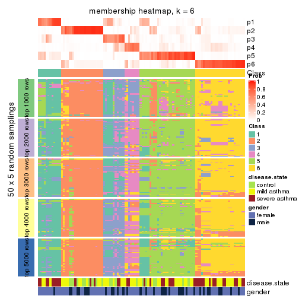</p>

</div>
</div>

As soon as we have had the classes for columns, we can look for signatures
which are significantly different between classes which can be candidate marks
for certain classes. Following are the heatmaps for signatures.


Signature heatmaps where rows are scaled:


<script>
$( function() {
	$( '#tabs-CV-kmeans-get-signatures' ).tabs();
} );
</script>
<div id='tabs-CV-kmeans-get-signatures'>
<ul>
<li><a href='#tab-CV-kmeans-get-signatures-1'>k = 2</a></li>
<li><a href='#tab-CV-kmeans-get-signatures-2'>k = 3</a></li>
<li><a href='#tab-CV-kmeans-get-signatures-3'>k = 4</a></li>
<li><a href='#tab-CV-kmeans-get-signatures-4'>k = 5</a></li>
<li><a href='#tab-CV-kmeans-get-signatures-5'>k = 6</a></li>
</ul>
<div id='tab-CV-kmeans-get-signatures-1'>
<pre><code class="r">get_signatures(res, k = 2)
</code></pre>

<p></p>

</div>
<div id='tab-CV-kmeans-get-signatures-2'>
<pre><code class="r">get_signatures(res, k = 3)
</code></pre>

<p></p>

</div>
<div id='tab-CV-kmeans-get-signatures-3'>
<pre><code class="r">get_signatures(res, k = 4)
</code></pre>

<p></p>

</div>
<div id='tab-CV-kmeans-get-signatures-4'>
<pre><code class="r">get_signatures(res, k = 5)
</code></pre>

<p></p>

</div>
<div id='tab-CV-kmeans-get-signatures-5'>
<pre><code class="r">get_signatures(res, k = 6)
</code></pre>

<p></p>

</div>
</div>


Signature heatmaps where rows are not scaled:


<script>
$( function() {
	$( '#tabs-CV-kmeans-get-signatures-no-scale' ).tabs();
} );
</script>
<div id='tabs-CV-kmeans-get-signatures-no-scale'>
<ul>
<li><a href='#tab-CV-kmeans-get-signatures-no-scale-1'>k = 2</a></li>
<li><a href='#tab-CV-kmeans-get-signatures-no-scale-2'>k = 3</a></li>
<li><a href='#tab-CV-kmeans-get-signatures-no-scale-3'>k = 4</a></li>
<li><a href='#tab-CV-kmeans-get-signatures-no-scale-4'>k = 5</a></li>
<li><a href='#tab-CV-kmeans-get-signatures-no-scale-5'>k = 6</a></li>
</ul>
<div id='tab-CV-kmeans-get-signatures-no-scale-1'>
<pre><code class="r">get_signatures(res, k = 2, scale_rows = FALSE)
</code></pre>

<p></p>

</div>
<div id='tab-CV-kmeans-get-signatures-no-scale-2'>
<pre><code class="r">get_signatures(res, k = 3, scale_rows = FALSE)
</code></pre>

<p></p>

</div>
<div id='tab-CV-kmeans-get-signatures-no-scale-3'>
<pre><code class="r">get_signatures(res, k = 4, scale_rows = FALSE)
</code></pre>

<p></p>

</div>
<div id='tab-CV-kmeans-get-signatures-no-scale-4'>
<pre><code class="r">get_signatures(res, k = 5, scale_rows = FALSE)
</code></pre>

<p></p>

</div>
<div id='tab-CV-kmeans-get-signatures-no-scale-5'>
<pre><code class="r">get_signatures(res, k = 6, scale_rows = FALSE)
</code></pre>

<p></p>

</div>
</div>


Compare the overlap of signatures from different k:

```r
compare_signatures(res)
```


`get_signature()` returns a data frame invisibly. TO get the list of signatures, the function
call should be assigned to a variable explicitly. In following code, if `plot` argument is set
to `FALSE`, no heatmap is plotted while only the differential analysis is performed.

```r
# code only for demonstration
tb = get_signature(res, k = ..., plot = FALSE)
```

An example of the output of `tb` is:

```
#>   which_row         fdr    mean_1    mean_2 scaled_mean_1 scaled_mean_2 km
#> 1        38 0.042760348  8.373488  9.131774    -0.5533452     0.5164555  1
#> 2        40 0.018707592  7.106213  8.469186    -0.6173731     0.5762149  1
#> 3        55 0.019134737 10.221463 11.207825    -0.6159697     0.5749050  1
#> 4        59 0.006059896  5.921854  7.869574    -0.6899429     0.6439467  1
#> 5        60 0.018055526  8.928898 10.211722    -0.6204761     0.5791110  1
#> 6        98 0.009384629 15.714769 14.887706     0.6635654    -0.6193277  2
...
```

The columns in `tb` are:

1. `which_row`: row indices corresponding to the input matrix.
2. `fdr`: FDR for the differential test. 
3. `mean_x`: The mean value in group x.
4. `scaled_mean_x`: The mean value in group x after rows are scaled.
5. `km`: Row groups if k-means clustering is applied to rows.


UMAP plot which shows how samples are separated.


<script>
$( function() {
	$( '#tabs-CV-kmeans-dimension-reduction' ).tabs();
} );
</script>
<div id='tabs-CV-kmeans-dimension-reduction'>
<ul>
<li><a href='#tab-CV-kmeans-dimension-reduction-1'>k = 2</a></li>
<li><a href='#tab-CV-kmeans-dimension-reduction-2'>k = 3</a></li>
<li><a href='#tab-CV-kmeans-dimension-reduction-3'>k = 4</a></li>
<li><a href='#tab-CV-kmeans-dimension-reduction-4'>k = 5</a></li>
<li><a href='#tab-CV-kmeans-dimension-reduction-5'>k = 6</a></li>
</ul>
<div id='tab-CV-kmeans-dimension-reduction-1'>
<pre><code class="r">dimension_reduction(res, k = 2, method = &quot;UMAP&quot;)
</code></pre>

<p></p>

</div>
<div id='tab-CV-kmeans-dimension-reduction-2'>
<pre><code class="r">dimension_reduction(res, k = 3, method = &quot;UMAP&quot;)
</code></pre>

<p></p>

</div>
<div id='tab-CV-kmeans-dimension-reduction-3'>
<pre><code class="r">dimension_reduction(res, k = 4, method = &quot;UMAP&quot;)
</code></pre>

<p></p>

</div>
<div id='tab-CV-kmeans-dimension-reduction-4'>
<pre><code class="r">dimension_reduction(res, k = 5, method = &quot;UMAP&quot;)
</code></pre>

<p></p>

</div>
<div id='tab-CV-kmeans-dimension-reduction-5'>
<pre><code class="r">dimension_reduction(res, k = 6, method = &quot;UMAP&quot;)
</code></pre>

<p></p>

</div>
</div>


Following heatmap shows how subgroups are split when increasing `k`:

```r
collect_classes(res)
```


Test correlation between subgroups and known annotations. If the known
annotation is numeric, one-way ANOVA test is applied, and if the known
annotation is discrete, chi-squared contingency table test is applied.

```r
test_to_known_factors(res)
```

```
#>             n disease.state(p) gender(p) k
#> CV:kmeans 103         0.683245     1.000 2
#> CV:kmeans  78         0.859603     0.985 3
#> CV:kmeans  83         0.010616     0.976 4
#> CV:kmeans  78         0.000305     0.472 5
#> CV:kmeans  83         0.000172     0.376 6
```


If matrix rows can be associated to genes, consider to use `GO_Enrichment(res,
...)` to perform function enrichment for the signature genes.


 

---------------------------------------------------


### CV:skmeans


The object with results only for a single top-value method and a single partition method 
can be extracted as:

```r
res = res_list["CV", "skmeans"]
# you can also extract it by
# res = res_list["CV:skmeans"]
```

A summary of `res` and all the functions that can be applied to it:

```r
res
```

```
#> A 'ConsensusPartition' object with k = 2, 3, 4, 5, 6.
#>   On a matrix with 38950 rows and 108 columns.
#>   Top rows (1000, 2000, 3000, 4000, 5000) are extracted by 'CV' method.
#>   Subgroups are detected by 'skmeans' method.
#>   Performed in total 1250 partitions by row resampling.
#>   Best k for subgroups seems to be 2.
#> 
#> Following methods can be applied to this 'ConsensusPartition' object:
#>  [1] "cola_report"             "collect_classes"         "collect_plots"          
#>  [4] "collect_stats"           "colnames"                "compare_signatures"     
#>  [7] "consensus_heatmap"       "dimension_reduction"     "functional_enrichment"  
#> [10] "get_anno_col"            "get_anno"                "get_classes"            
#> [13] "get_consensus"           "get_matrix"              "get_membership"         
#> [16] "get_param"               "get_signatures"          "get_stats"              
#> [19] "is_best_k"               "is_stable_k"             "membership_heatmap"     
#> [22] "ncol"                    "nrow"                    "plot_ecdf"              
#> [25] "rownames"                "select_partition_number" "show"                   
#> [28] "suggest_best_k"          "test_to_known_factors"
```

`collect_plots()` function collects all the plots made from `res` for all `k` (number of partitions)
into one single page to provide an easy and fast comparison between different `k`.

```r
collect_plots(res)
```


The plots are:

- The first row: a plot of the ECDF (Empirical cumulative distribution
  function) curves of the consensus matrix for each `k` and the heatmap of
  predicted classes for each `k`.
- The second row: heatmaps of the consensus matrix for each `k`.
- The third row: heatmaps of the membership matrix for each `k`.
- The fouth row: heatmaps of the signatures for each `k`.

All the plots in panels can be made by individual functions and they are
plotted later in this section.

`select_partition_number()` produces several plots showing different
statistics for choosing "optimized" `k`. There are following statistics:

- ECDF curves of the consensus matrix for each `k`;
- 1-PAC. [The PAC
  score](https://en.wikipedia.org/wiki/Consensus_clustering#Over-interpretation_potential_of_consensus_clustering)
  measures the proportion of the ambiguous subgrouping.
- Mean silhouette score.
- Concordance. The mean probability of fiting the consensus class ids in all
  partitions.
- Area increased. Denote $A_k$ as the area under the ECDF curve for current
  `k`, the area increased is defined as $A_k - A_{k-1}$.
- Rand index. The percent of pairs of samples that are both in a same cluster
  or both are not in a same cluster in the partition of k and k-1.
- Jaccard index. The ratio of pairs of samples are both in a same cluster in
  the partition of k and k-1 and the pairs of samples are both in a same
  cluster in the partition k or k-1.

The detailed explanations of these statistics can be found in [the cola
vignette](http://bioconductor.org/packages/devel/bioc/vignettes/cola/inst/doc/cola.html#toc_13).

Generally speaking, lower PAC score, higher mean silhouette score or higher
concordance corresponds to better partition. Rand index and Jaccard index
measure how similar the current partition is compared to partition with `k-1`.
If they are too similar, we won't accept `k` is better than `k-1`.

```r
select_partition_number(res)
```


The numeric values for all these statistics can be obtained by `get_stats()`.

```r
get_stats(res)
```

```
#>   k 1-PAC mean_silhouette concordance area_increased  Rand Jaccard
#> 2 2 0.758           0.923       0.962         0.5029 0.497   0.497
#> 3 3 0.575           0.714       0.845         0.3170 0.728   0.505
#> 4 4 0.618           0.606       0.810         0.1335 0.808   0.500
#> 5 5 0.600           0.539       0.728         0.0593 0.857   0.525
#> 6 6 0.638           0.511       0.710         0.0396 0.920   0.660
```

`suggest_best_k()` suggests the best $k$ based on these statistics. The rules are as follows:

- All $k$ with Jaccard index larger than 0.95 are removed because the increase of
  the partition number does not provides enough extra information. If all $k$ are removed,
  the best $k$ is assigned by `NA`.
- For $k$ with 1-PAC larger than 0.9, the maximal $k$ is taken as the "best k". Other $k$ is called "optional k".
- If it does not fit the second rule. The $k$ with the highest vote of highest
  1-PAC, mean silhouette and concordance is taken as the "best k".

```r
suggest_best_k(res)
```

```
#> [1] 2
```


Following shows the table of the partitions (You need to click the **show/hide
code output** link to see it). The membership matrix (columns with name `p*`)
is inferred by
[`clue::cl_consensus()`](https://www.rdocumentation.org/link/cl_consensus?package=clue)
function with the `SE` method. Basically the value in the membership matrix
represents the probability to belong to a certain group. The finall class
label for an item is determined with the group with highest probability it
belongs to.

In `get_classes()` function, the entropy is calculated from the membership
matrix and the silhouette score is calculated from the consensus matrix.


<script>
$( function() {
	$( '#tabs-CV-skmeans-get-classes' ).tabs();
} );
</script>
<div id='tabs-CV-skmeans-get-classes'>
<ul>
<li><a href='#tab-CV-skmeans-get-classes-1'>k = 2</a></li>
<li><a href='#tab-CV-skmeans-get-classes-2'>k = 3</a></li>
<li><a href='#tab-CV-skmeans-get-classes-3'>k = 4</a></li>
<li><a href='#tab-CV-skmeans-get-classes-4'>k = 5</a></li>
<li><a href='#tab-CV-skmeans-get-classes-5'>k = 6</a></li>
</ul>

<div id='tab-CV-skmeans-get-classes-1'>
<p><a id='tab-CV-skmeans-get-classes-1-a' style='color:#0366d6' href='#'>show/hide code output</a></p>
<pre><code class="r">cbind(get_classes(res, k = 2), get_membership(res, k = 2))
</code></pre>

<pre><code>#&gt;            class entropy silhouette    p1    p2
#&gt; GSM1068478     1  0.0000      0.953 1.000 0.000
#&gt; GSM1068479     2  0.0000      0.964 0.000 1.000
#&gt; GSM1068481     1  0.0000      0.953 1.000 0.000
#&gt; GSM1068482     1  0.0000      0.953 1.000 0.000
#&gt; GSM1068483     1  0.0000      0.953 1.000 0.000
#&gt; GSM1068486     1  0.0000      0.953 1.000 0.000
#&gt; GSM1068487     2  0.0000      0.964 0.000 1.000
#&gt; GSM1068488     2  0.6973      0.787 0.188 0.812
#&gt; GSM1068490     2  0.0000      0.964 0.000 1.000
#&gt; GSM1068491     2  0.7056      0.782 0.192 0.808
#&gt; GSM1068492     2  0.0000      0.964 0.000 1.000
#&gt; GSM1068493     1  0.0000      0.953 1.000 0.000
#&gt; GSM1068494     1  0.0000      0.953 1.000 0.000
#&gt; GSM1068495     1  0.7056      0.800 0.808 0.192
#&gt; GSM1068496     1  0.0000      0.953 1.000 0.000
#&gt; GSM1068498     1  0.6623      0.820 0.828 0.172
#&gt; GSM1068499     1  0.0000      0.953 1.000 0.000
#&gt; GSM1068500     1  0.0000      0.953 1.000 0.000
#&gt; GSM1068502     2  0.0000      0.964 0.000 1.000
#&gt; GSM1068503     2  0.0000      0.964 0.000 1.000
#&gt; GSM1068505     2  0.0000      0.964 0.000 1.000
#&gt; GSM1068506     2  0.0000      0.964 0.000 1.000
#&gt; GSM1068507     2  0.0000      0.964 0.000 1.000
#&gt; GSM1068508     2  0.0000      0.964 0.000 1.000
#&gt; GSM1068510     2  0.0000      0.964 0.000 1.000
#&gt; GSM1068512     2  0.7219      0.772 0.200 0.800
#&gt; GSM1068513     2  0.0000      0.964 0.000 1.000
#&gt; GSM1068514     2  0.6148      0.827 0.152 0.848
#&gt; GSM1068517     1  0.7219      0.792 0.800 0.200
#&gt; GSM1068518     1  0.0000      0.953 1.000 0.000
#&gt; GSM1068520     1  0.0000      0.953 1.000 0.000
#&gt; GSM1068521     1  0.0000      0.953 1.000 0.000
#&gt; GSM1068522     2  0.0000      0.964 0.000 1.000
#&gt; GSM1068524     2  0.0000      0.964 0.000 1.000
#&gt; GSM1068527     2  0.0000      0.964 0.000 1.000
#&gt; GSM1068480     1  0.0000      0.953 1.000 0.000
#&gt; GSM1068484     2  0.0000      0.964 0.000 1.000
#&gt; GSM1068485     1  0.0000      0.953 1.000 0.000
#&gt; GSM1068489     2  0.0000      0.964 0.000 1.000
#&gt; GSM1068497     1  0.6623      0.820 0.828 0.172
#&gt; GSM1068501     2  0.0000      0.964 0.000 1.000
#&gt; GSM1068504     2  0.0000      0.964 0.000 1.000
#&gt; GSM1068509     1  0.0000      0.953 1.000 0.000
#&gt; GSM1068511     1  0.0000      0.953 1.000 0.000
#&gt; GSM1068515     1  0.0376      0.951 0.996 0.004
#&gt; GSM1068516     1  0.5294      0.870 0.880 0.120
#&gt; GSM1068519     1  0.0000      0.953 1.000 0.000
#&gt; GSM1068523     2  0.0000      0.964 0.000 1.000
#&gt; GSM1068525     2  0.0000      0.964 0.000 1.000
#&gt; GSM1068526     2  0.0000      0.964 0.000 1.000
#&gt; GSM1068458     1  0.0000      0.953 1.000 0.000
#&gt; GSM1068459     1  0.0000      0.953 1.000 0.000
#&gt; GSM1068460     1  0.8016      0.732 0.756 0.244
#&gt; GSM1068461     1  0.0000      0.953 1.000 0.000
#&gt; GSM1068464     2  0.0000      0.964 0.000 1.000
#&gt; GSM1068468     2  0.0000      0.964 0.000 1.000
#&gt; GSM1068472     1  0.7219      0.792 0.800 0.200
#&gt; GSM1068473     2  0.0000      0.964 0.000 1.000
#&gt; GSM1068474     2  0.0000      0.964 0.000 1.000
#&gt; GSM1068476     2  0.6623      0.805 0.172 0.828
#&gt; GSM1068477     2  0.0000      0.964 0.000 1.000
#&gt; GSM1068462     2  0.0000      0.964 0.000 1.000
#&gt; GSM1068463     1  0.0000      0.953 1.000 0.000
#&gt; GSM1068465     1  0.6712      0.816 0.824 0.176
#&gt; GSM1068466     1  0.0000      0.953 1.000 0.000
#&gt; GSM1068467     2  0.0000      0.964 0.000 1.000
#&gt; GSM1068469     1  0.7219      0.792 0.800 0.200
#&gt; GSM1068470     2  0.0000      0.964 0.000 1.000
#&gt; GSM1068471     2  0.0000      0.964 0.000 1.000
#&gt; GSM1068475     2  0.0000      0.964 0.000 1.000
#&gt; GSM1068528     1  0.0000      0.953 1.000 0.000
#&gt; GSM1068531     1  0.0000      0.953 1.000 0.000
#&gt; GSM1068532     1  0.0000      0.953 1.000 0.000
#&gt; GSM1068533     1  0.0000      0.953 1.000 0.000
#&gt; GSM1068535     1  0.0000      0.953 1.000 0.000
#&gt; GSM1068537     1  0.0000      0.953 1.000 0.000
#&gt; GSM1068538     1  0.0000      0.953 1.000 0.000
#&gt; GSM1068539     2  0.8327      0.610 0.264 0.736
#&gt; GSM1068540     1  0.0000      0.953 1.000 0.000
#&gt; GSM1068542     2  0.0000      0.964 0.000 1.000
#&gt; GSM1068543     2  0.6531      0.810 0.168 0.832
#&gt; GSM1068544     1  0.0000      0.953 1.000 0.000
#&gt; GSM1068545     2  0.0000      0.964 0.000 1.000
#&gt; GSM1068546     1  0.0000      0.953 1.000 0.000
#&gt; GSM1068547     1  0.0000      0.953 1.000 0.000
#&gt; GSM1068548     2  0.0000      0.964 0.000 1.000
#&gt; GSM1068549     1  0.0000      0.953 1.000 0.000
#&gt; GSM1068550     2  0.0000      0.964 0.000 1.000
#&gt; GSM1068551     2  0.0000      0.964 0.000 1.000
#&gt; GSM1068552     2  0.0000      0.964 0.000 1.000
#&gt; GSM1068555     2  0.0000      0.964 0.000 1.000
#&gt; GSM1068556     2  0.6623      0.805 0.172 0.828
#&gt; GSM1068557     2  0.0000      0.964 0.000 1.000
#&gt; GSM1068560     2  0.0000      0.964 0.000 1.000
#&gt; GSM1068561     1  0.7219      0.792 0.800 0.200
#&gt; GSM1068562     2  0.0000      0.964 0.000 1.000
#&gt; GSM1068563     2  0.0000      0.964 0.000 1.000
#&gt; GSM1068565     2  0.0000      0.964 0.000 1.000
#&gt; GSM1068529     1  0.0000      0.953 1.000 0.000
#&gt; GSM1068530     1  0.0000      0.953 1.000 0.000
#&gt; GSM1068534     1  0.0000      0.953 1.000 0.000
#&gt; GSM1068536     1  0.2948      0.919 0.948 0.052
#&gt; GSM1068541     1  0.8861      0.635 0.696 0.304
#&gt; GSM1068553     2  0.2236      0.935 0.036 0.964
#&gt; GSM1068554     2  0.0000      0.964 0.000 1.000
#&gt; GSM1068558     2  0.9460      0.489 0.364 0.636
#&gt; GSM1068559     2  0.0000      0.964 0.000 1.000
#&gt; GSM1068564     2  0.0000      0.964 0.000 1.000
</code></pre>

<script>
$('#tab-CV-skmeans-get-classes-1-a').parent().next().next().hide();
$('#tab-CV-skmeans-get-classes-1-a').click(function(){
  $('#tab-CV-skmeans-get-classes-1-a').parent().next().next().toggle();
  return(false);
});
</script>
</div>

<div id='tab-CV-skmeans-get-classes-2'>
<p><a id='tab-CV-skmeans-get-classes-2-a' style='color:#0366d6' href='#'>show/hide code output</a></p>
<pre><code class="r">cbind(get_classes(res, k = 3), get_membership(res, k = 3))
</code></pre>

<pre><code>#&gt;            class entropy silhouette    p1    p2    p3
#&gt; GSM1068478     1  0.3879     0.8750 0.848 0.152 0.000
#&gt; GSM1068479     3  0.6500    -0.0698 0.004 0.464 0.532
#&gt; GSM1068481     1  0.0424     0.8960 0.992 0.000 0.008
#&gt; GSM1068482     1  0.1163     0.8905 0.972 0.000 0.028
#&gt; GSM1068483     1  0.1860     0.8982 0.948 0.052 0.000
#&gt; GSM1068486     1  0.1163     0.8905 0.972 0.000 0.028
#&gt; GSM1068487     2  0.4002     0.7621 0.000 0.840 0.160
#&gt; GSM1068488     3  0.2261     0.7737 0.068 0.000 0.932
#&gt; GSM1068490     2  0.4235     0.7509 0.000 0.824 0.176
#&gt; GSM1068491     3  0.5901     0.6774 0.048 0.176 0.776
#&gt; GSM1068492     3  0.3879     0.7268 0.000 0.152 0.848
#&gt; GSM1068493     1  0.0475     0.8973 0.992 0.004 0.004
#&gt; GSM1068494     1  0.2313     0.8968 0.944 0.032 0.024
#&gt; GSM1068495     2  0.7424     0.0374 0.388 0.572 0.040
#&gt; GSM1068496     1  0.0829     0.8989 0.984 0.012 0.004
#&gt; GSM1068498     2  0.6204    -0.0445 0.424 0.576 0.000
#&gt; GSM1068499     1  0.0237     0.8977 0.996 0.004 0.000
#&gt; GSM1068500     1  0.1529     0.8990 0.960 0.040 0.000
#&gt; GSM1068502     2  0.6291     0.2530 0.000 0.532 0.468
#&gt; GSM1068503     2  0.5327     0.6480 0.000 0.728 0.272
#&gt; GSM1068505     3  0.3482     0.7594 0.000 0.128 0.872
#&gt; GSM1068506     3  0.3619     0.7590 0.000 0.136 0.864
#&gt; GSM1068507     3  0.3038     0.7951 0.000 0.104 0.896
#&gt; GSM1068508     2  0.5327     0.6654 0.000 0.728 0.272
#&gt; GSM1068510     3  0.3038     0.7998 0.000 0.104 0.896
#&gt; GSM1068512     3  0.1529     0.7961 0.040 0.000 0.960
#&gt; GSM1068513     2  0.6154     0.4114 0.000 0.592 0.408
#&gt; GSM1068514     3  0.2564     0.8060 0.028 0.036 0.936
#&gt; GSM1068517     2  0.2261     0.6512 0.068 0.932 0.000
#&gt; GSM1068518     3  0.7665     0.0320 0.456 0.044 0.500
#&gt; GSM1068520     1  0.3879     0.8750 0.848 0.152 0.000
#&gt; GSM1068521     1  0.3879     0.8750 0.848 0.152 0.000
#&gt; GSM1068522     2  0.5988     0.4912 0.000 0.632 0.368
#&gt; GSM1068524     2  0.4346     0.7485 0.000 0.816 0.184
#&gt; GSM1068527     3  0.1163     0.8277 0.000 0.028 0.972
#&gt; GSM1068480     1  0.1163     0.8905 0.972 0.000 0.028
#&gt; GSM1068484     3  0.1289     0.8284 0.000 0.032 0.968
#&gt; GSM1068485     1  0.1031     0.8921 0.976 0.000 0.024
#&gt; GSM1068489     3  0.1289     0.8284 0.000 0.032 0.968
#&gt; GSM1068497     2  0.6225    -0.0721 0.432 0.568 0.000
#&gt; GSM1068501     3  0.3038     0.7922 0.000 0.104 0.896
#&gt; GSM1068504     2  0.3879     0.7649 0.000 0.848 0.152
#&gt; GSM1068509     1  0.1753     0.9005 0.952 0.048 0.000
#&gt; GSM1068511     1  0.1031     0.8920 0.976 0.000 0.024
#&gt; GSM1068515     1  0.2711     0.8895 0.912 0.088 0.000
#&gt; GSM1068516     3  0.6632     0.5970 0.064 0.204 0.732
#&gt; GSM1068519     1  0.3482     0.8851 0.872 0.128 0.000
#&gt; GSM1068523     2  0.3879     0.7649 0.000 0.848 0.152
#&gt; GSM1068525     3  0.1289     0.8284 0.000 0.032 0.968
#&gt; GSM1068526     3  0.1289     0.8284 0.000 0.032 0.968
#&gt; GSM1068458     1  0.3879     0.8750 0.848 0.152 0.000
#&gt; GSM1068459     1  0.1163     0.8905 0.972 0.000 0.028
#&gt; GSM1068460     2  0.9955     0.0119 0.316 0.380 0.304
#&gt; GSM1068461     1  0.1163     0.8905 0.972 0.000 0.028
#&gt; GSM1068464     2  0.4002     0.7621 0.000 0.840 0.160
#&gt; GSM1068468     2  0.3116     0.7515 0.000 0.892 0.108
#&gt; GSM1068472     2  0.5785     0.4173 0.332 0.668 0.000
#&gt; GSM1068473     2  0.4062     0.7597 0.000 0.836 0.164
#&gt; GSM1068474     2  0.4002     0.7621 0.000 0.840 0.160
#&gt; GSM1068476     3  0.4897     0.7038 0.016 0.172 0.812
#&gt; GSM1068477     2  0.3879     0.7649 0.000 0.848 0.152
#&gt; GSM1068462     2  0.3607     0.7535 0.008 0.880 0.112
#&gt; GSM1068463     1  0.0747     0.8943 0.984 0.000 0.016
#&gt; GSM1068465     1  0.5536     0.6982 0.752 0.236 0.012
#&gt; GSM1068466     1  0.3879     0.8750 0.848 0.152 0.000
#&gt; GSM1068467     2  0.0829     0.6936 0.004 0.984 0.012
#&gt; GSM1068469     2  0.5327     0.5112 0.272 0.728 0.000
#&gt; GSM1068470     2  0.3879     0.7649 0.000 0.848 0.152
#&gt; GSM1068471     2  0.4002     0.7621 0.000 0.840 0.160
#&gt; GSM1068475     2  0.3879     0.7649 0.000 0.848 0.152
#&gt; GSM1068528     1  0.0424     0.8987 0.992 0.008 0.000
#&gt; GSM1068531     1  0.3340     0.8879 0.880 0.120 0.000
#&gt; GSM1068532     1  0.2537     0.8957 0.920 0.080 0.000
#&gt; GSM1068533     1  0.3340     0.8879 0.880 0.120 0.000
#&gt; GSM1068535     3  0.8228     0.2632 0.364 0.084 0.552
#&gt; GSM1068537     1  0.3192     0.8899 0.888 0.112 0.000
#&gt; GSM1068538     1  0.3267     0.8889 0.884 0.116 0.000
#&gt; GSM1068539     2  0.4744     0.6067 0.028 0.836 0.136
#&gt; GSM1068540     1  0.3267     0.8891 0.884 0.116 0.000
#&gt; GSM1068542     3  0.1411     0.8275 0.000 0.036 0.964
#&gt; GSM1068543     3  0.0237     0.8171 0.004 0.000 0.996
#&gt; GSM1068544     1  0.1129     0.8948 0.976 0.004 0.020
#&gt; GSM1068545     2  0.6252     0.3617 0.000 0.556 0.444
#&gt; GSM1068546     1  0.1163     0.8905 0.972 0.000 0.028
#&gt; GSM1068547     1  0.3879     0.8750 0.848 0.152 0.000
#&gt; GSM1068548     3  0.1289     0.8284 0.000 0.032 0.968
#&gt; GSM1068549     1  0.5431     0.5762 0.716 0.000 0.284
#&gt; GSM1068550     3  0.1964     0.8199 0.000 0.056 0.944
#&gt; GSM1068551     2  0.3879     0.7649 0.000 0.848 0.152
#&gt; GSM1068552     3  0.5138     0.5757 0.000 0.252 0.748
#&gt; GSM1068555     2  0.3879     0.7649 0.000 0.848 0.152
#&gt; GSM1068556     3  0.0661     0.8208 0.004 0.008 0.988
#&gt; GSM1068557     2  0.3482     0.7588 0.000 0.872 0.128
#&gt; GSM1068560     3  0.1289     0.8284 0.000 0.032 0.968
#&gt; GSM1068561     1  0.6410     0.2146 0.576 0.420 0.004
#&gt; GSM1068562     3  0.1289     0.8284 0.000 0.032 0.968
#&gt; GSM1068563     3  0.3686     0.7546 0.000 0.140 0.860
#&gt; GSM1068565     2  0.3879     0.7649 0.000 0.848 0.152
#&gt; GSM1068529     1  0.6577     0.2348 0.572 0.008 0.420
#&gt; GSM1068530     1  0.3340     0.8879 0.880 0.120 0.000
#&gt; GSM1068534     1  0.3116     0.8332 0.892 0.000 0.108
#&gt; GSM1068536     1  0.4293     0.8660 0.832 0.164 0.004
#&gt; GSM1068541     2  0.5307     0.5962 0.056 0.820 0.124
#&gt; GSM1068553     3  0.1163     0.8277 0.000 0.028 0.972
#&gt; GSM1068554     3  0.1643     0.8256 0.000 0.044 0.956
#&gt; GSM1068558     3  0.6229     0.4633 0.340 0.008 0.652
#&gt; GSM1068559     3  0.2584     0.8033 0.008 0.064 0.928
#&gt; GSM1068564     3  0.6204     0.0934 0.000 0.424 0.576
</code></pre>

<script>
$('#tab-CV-skmeans-get-classes-2-a').parent().next().next().hide();
$('#tab-CV-skmeans-get-classes-2-a').click(function(){
  $('#tab-CV-skmeans-get-classes-2-a').parent().next().next().toggle();
  return(false);
});
</script>
</div>

<div id='tab-CV-skmeans-get-classes-3'>
<p><a id='tab-CV-skmeans-get-classes-3-a' style='color:#0366d6' href='#'>show/hide code output</a></p>
<pre><code class="r">cbind(get_classes(res, k = 4), get_membership(res, k = 4))
</code></pre>

<pre><code>#&gt;            class entropy silhouette    p1    p2    p3    p4
#&gt; GSM1068478     1  0.0779     0.6502 0.980 0.016 0.004 0.000
#&gt; GSM1068479     2  0.6516     0.4189 0.000 0.576 0.332 0.092
#&gt; GSM1068481     3  0.4454     0.5381 0.308 0.000 0.692 0.000
#&gt; GSM1068482     3  0.3266     0.6416 0.168 0.000 0.832 0.000
#&gt; GSM1068483     1  0.4925     0.1321 0.572 0.000 0.428 0.000
#&gt; GSM1068486     3  0.1118     0.6549 0.036 0.000 0.964 0.000
#&gt; GSM1068487     2  0.1209     0.8726 0.000 0.964 0.004 0.032
#&gt; GSM1068488     4  0.3662     0.7679 0.004 0.012 0.148 0.836
#&gt; GSM1068490     2  0.1305     0.8709 0.000 0.960 0.004 0.036
#&gt; GSM1068491     3  0.7483    -0.0614 0.000 0.360 0.456 0.184
#&gt; GSM1068492     4  0.7922     0.0862 0.000 0.320 0.336 0.344
#&gt; GSM1068493     3  0.5957     0.3843 0.364 0.048 0.588 0.000
#&gt; GSM1068494     1  0.4992    -0.0651 0.524 0.000 0.476 0.000
#&gt; GSM1068495     1  0.4339     0.5440 0.764 0.224 0.004 0.008
#&gt; GSM1068496     1  0.5000    -0.1517 0.504 0.000 0.496 0.000
#&gt; GSM1068498     1  0.4372     0.5139 0.728 0.268 0.004 0.000
#&gt; GSM1068499     3  0.4898     0.3529 0.416 0.000 0.584 0.000
#&gt; GSM1068500     1  0.4967     0.0413 0.548 0.000 0.452 0.000
#&gt; GSM1068502     2  0.5898     0.4902 0.000 0.628 0.316 0.056
#&gt; GSM1068503     2  0.3448     0.7562 0.000 0.828 0.004 0.168
#&gt; GSM1068505     4  0.1211     0.8507 0.000 0.040 0.000 0.960
#&gt; GSM1068506     4  0.1557     0.8458 0.000 0.056 0.000 0.944
#&gt; GSM1068507     4  0.2342     0.8349 0.000 0.080 0.008 0.912
#&gt; GSM1068508     2  0.4564     0.5006 0.000 0.672 0.000 0.328
#&gt; GSM1068510     4  0.4776     0.7342 0.000 0.164 0.060 0.776
#&gt; GSM1068512     4  0.2867     0.8003 0.000 0.012 0.104 0.884
#&gt; GSM1068513     2  0.4343     0.6391 0.000 0.732 0.004 0.264
#&gt; GSM1068514     4  0.6158     0.4394 0.000 0.056 0.384 0.560
#&gt; GSM1068517     1  0.5229     0.2253 0.564 0.428 0.008 0.000
#&gt; GSM1068518     1  0.7702     0.0327 0.416 0.000 0.360 0.224
#&gt; GSM1068520     1  0.0376     0.6534 0.992 0.004 0.004 0.000
#&gt; GSM1068521     1  0.0188     0.6525 0.996 0.004 0.000 0.000
#&gt; GSM1068522     2  0.4877     0.2921 0.000 0.592 0.000 0.408
#&gt; GSM1068524     2  0.2593     0.8272 0.000 0.892 0.004 0.104
#&gt; GSM1068527     4  0.0376     0.8511 0.000 0.004 0.004 0.992
#&gt; GSM1068480     3  0.1118     0.6547 0.036 0.000 0.964 0.000
#&gt; GSM1068484     4  0.1488     0.8553 0.000 0.032 0.012 0.956
#&gt; GSM1068485     3  0.2589     0.6583 0.116 0.000 0.884 0.000
#&gt; GSM1068489     4  0.0921     0.8535 0.000 0.028 0.000 0.972
#&gt; GSM1068497     1  0.5131     0.4952 0.692 0.280 0.028 0.000
#&gt; GSM1068501     4  0.2124     0.8420 0.000 0.068 0.008 0.924
#&gt; GSM1068504     2  0.1209     0.8726 0.000 0.964 0.004 0.032
#&gt; GSM1068509     1  0.4277     0.4295 0.720 0.000 0.280 0.000
#&gt; GSM1068511     3  0.4356     0.5426 0.292 0.000 0.708 0.000
#&gt; GSM1068515     1  0.6336    -0.0579 0.480 0.060 0.460 0.000
#&gt; GSM1068516     1  0.7708     0.2801 0.540 0.024 0.280 0.156
#&gt; GSM1068519     1  0.1118     0.6531 0.964 0.000 0.036 0.000
#&gt; GSM1068523     2  0.1118     0.8717 0.000 0.964 0.000 0.036
#&gt; GSM1068525     4  0.3764     0.8117 0.000 0.072 0.076 0.852
#&gt; GSM1068526     4  0.0469     0.8532 0.000 0.012 0.000 0.988
#&gt; GSM1068458     1  0.1792     0.6486 0.932 0.000 0.068 0.000
#&gt; GSM1068459     3  0.4072     0.5964 0.252 0.000 0.748 0.000
#&gt; GSM1068460     1  0.4228     0.5082 0.760 0.008 0.000 0.232
#&gt; GSM1068461     3  0.0921     0.6474 0.028 0.000 0.972 0.000
#&gt; GSM1068464     2  0.0779     0.8685 0.000 0.980 0.004 0.016
#&gt; GSM1068468     2  0.0804     0.8550 0.012 0.980 0.000 0.008
#&gt; GSM1068472     2  0.6551     0.4161 0.136 0.624 0.240 0.000
#&gt; GSM1068473     2  0.1209     0.8726 0.000 0.964 0.004 0.032
#&gt; GSM1068474     2  0.1209     0.8726 0.000 0.964 0.004 0.032
#&gt; GSM1068476     3  0.7626    -0.1478 0.000 0.384 0.412 0.204
#&gt; GSM1068477     2  0.0921     0.8725 0.000 0.972 0.000 0.028
#&gt; GSM1068462     2  0.0188     0.8586 0.004 0.996 0.000 0.000
#&gt; GSM1068463     3  0.4454     0.5434 0.308 0.000 0.692 0.000
#&gt; GSM1068465     1  0.6653     0.3547 0.592 0.048 0.332 0.028
#&gt; GSM1068466     1  0.1302     0.6534 0.956 0.000 0.044 0.000
#&gt; GSM1068467     2  0.1305     0.8362 0.036 0.960 0.000 0.004
#&gt; GSM1068469     2  0.6534     0.4351 0.148 0.632 0.220 0.000
#&gt; GSM1068470     2  0.1022     0.8727 0.000 0.968 0.000 0.032
#&gt; GSM1068471     2  0.1109     0.8724 0.000 0.968 0.004 0.028
#&gt; GSM1068475     2  0.1022     0.8727 0.000 0.968 0.000 0.032
#&gt; GSM1068528     3  0.4888     0.3550 0.412 0.000 0.588 0.000
#&gt; GSM1068531     1  0.2216     0.6397 0.908 0.000 0.092 0.000
#&gt; GSM1068532     1  0.4304     0.4463 0.716 0.000 0.284 0.000
#&gt; GSM1068533     1  0.3266     0.5902 0.832 0.000 0.168 0.000
#&gt; GSM1068535     4  0.6381     0.4095 0.280 0.004 0.088 0.628
#&gt; GSM1068537     1  0.3486     0.5727 0.812 0.000 0.188 0.000
#&gt; GSM1068538     1  0.3444     0.5769 0.816 0.000 0.184 0.000
#&gt; GSM1068539     1  0.5827     0.4250 0.632 0.316 0.000 0.052
#&gt; GSM1068540     1  0.1637     0.6494 0.940 0.000 0.060 0.000
#&gt; GSM1068542     4  0.0707     0.8538 0.000 0.020 0.000 0.980
#&gt; GSM1068543     4  0.2737     0.8034 0.000 0.008 0.104 0.888
#&gt; GSM1068544     3  0.4522     0.5245 0.320 0.000 0.680 0.000
#&gt; GSM1068545     4  0.4661     0.4660 0.000 0.348 0.000 0.652
#&gt; GSM1068546     3  0.2647     0.6587 0.120 0.000 0.880 0.000
#&gt; GSM1068547     1  0.0188     0.6534 0.996 0.000 0.004 0.000
#&gt; GSM1068548     4  0.0817     0.8541 0.000 0.024 0.000 0.976
#&gt; GSM1068549     3  0.1884     0.6265 0.020 0.016 0.948 0.016
#&gt; GSM1068550     4  0.0921     0.8535 0.000 0.028 0.000 0.972
#&gt; GSM1068551     2  0.1022     0.8727 0.000 0.968 0.000 0.032
#&gt; GSM1068552     4  0.3649     0.7111 0.000 0.204 0.000 0.796
#&gt; GSM1068555     2  0.0817     0.8710 0.000 0.976 0.000 0.024
#&gt; GSM1068556     4  0.0921     0.8425 0.000 0.000 0.028 0.972
#&gt; GSM1068557     2  0.0844     0.8533 0.012 0.980 0.004 0.004
#&gt; GSM1068560     4  0.0707     0.8542 0.000 0.020 0.000 0.980
#&gt; GSM1068561     3  0.7795     0.0401 0.280 0.296 0.424 0.000
#&gt; GSM1068562     4  0.0592     0.8535 0.000 0.016 0.000 0.984
#&gt; GSM1068563     4  0.2408     0.8241 0.000 0.104 0.000 0.896
#&gt; GSM1068565     2  0.1022     0.8727 0.000 0.968 0.000 0.032
#&gt; GSM1068529     3  0.3614     0.5699 0.080 0.008 0.868 0.044
#&gt; GSM1068530     1  0.2408     0.6338 0.896 0.000 0.104 0.000
#&gt; GSM1068534     3  0.3245     0.6548 0.100 0.000 0.872 0.028
#&gt; GSM1068536     1  0.2096     0.6426 0.940 0.016 0.016 0.028
#&gt; GSM1068541     1  0.5664     0.5125 0.696 0.228 0.000 0.076
#&gt; GSM1068553     4  0.0707     0.8538 0.000 0.020 0.000 0.980
#&gt; GSM1068554     4  0.1545     0.8519 0.000 0.040 0.008 0.952
#&gt; GSM1068558     3  0.1211     0.6159 0.000 0.000 0.960 0.040
#&gt; GSM1068559     4  0.6759     0.4521 0.000 0.108 0.344 0.548
#&gt; GSM1068564     4  0.4277     0.6014 0.000 0.280 0.000 0.720
</code></pre>

<script>
$('#tab-CV-skmeans-get-classes-3-a').parent().next().next().hide();
$('#tab-CV-skmeans-get-classes-3-a').click(function(){
  $('#tab-CV-skmeans-get-classes-3-a').parent().next().next().toggle();
  return(false);
});
</script>
</div>

<div id='tab-CV-skmeans-get-classes-4'>
<p><a id='tab-CV-skmeans-get-classes-4-a' style='color:#0366d6' href='#'>show/hide code output</a></p>
<pre><code class="r">cbind(get_classes(res, k = 5), get_membership(res, k = 5))
</code></pre>

<pre><code>#&gt;            class entropy silhouette    p1    p2    p3    p4    p5
#&gt; GSM1068478     5  0.3452     0.4958 0.244 0.000 0.000 0.000 0.756
#&gt; GSM1068479     3  0.5059     0.4919 0.004 0.292 0.652 0.052 0.000
#&gt; GSM1068481     1  0.3582     0.4981 0.768 0.000 0.224 0.000 0.008
#&gt; GSM1068482     1  0.5057     0.3313 0.604 0.004 0.356 0.000 0.036
#&gt; GSM1068483     1  0.4025     0.5131 0.796 0.004 0.060 0.000 0.140
#&gt; GSM1068486     3  0.5130     0.0723 0.412 0.004 0.552 0.000 0.032
#&gt; GSM1068487     2  0.0771     0.8504 0.000 0.976 0.000 0.020 0.004
#&gt; GSM1068488     4  0.5228     0.4473 0.000 0.000 0.356 0.588 0.056
#&gt; GSM1068490     2  0.0865     0.8489 0.000 0.972 0.000 0.024 0.004
#&gt; GSM1068491     3  0.4527     0.6014 0.004 0.172 0.752 0.072 0.000
#&gt; GSM1068492     3  0.5804     0.5015 0.000 0.148 0.656 0.180 0.016
#&gt; GSM1068493     1  0.6366     0.3692 0.564 0.012 0.168 0.000 0.256
#&gt; GSM1068494     1  0.6515     0.2424 0.464 0.000 0.208 0.000 0.328
#&gt; GSM1068495     5  0.3302     0.6468 0.044 0.048 0.016 0.016 0.876
#&gt; GSM1068496     1  0.3437     0.5570 0.832 0.000 0.120 0.000 0.048
#&gt; GSM1068498     5  0.3433     0.6425 0.032 0.132 0.004 0.000 0.832
#&gt; GSM1068499     1  0.5221     0.5078 0.696 0.004 0.172 0.000 0.128
#&gt; GSM1068500     1  0.3648     0.5440 0.824 0.000 0.084 0.000 0.092
#&gt; GSM1068502     3  0.4865     0.4400 0.000 0.324 0.640 0.032 0.004
#&gt; GSM1068503     2  0.3456     0.6872 0.000 0.788 0.004 0.204 0.004
#&gt; GSM1068505     4  0.1331     0.7974 0.000 0.040 0.000 0.952 0.008
#&gt; GSM1068506     4  0.2349     0.7894 0.000 0.084 0.012 0.900 0.004
#&gt; GSM1068507     4  0.3960     0.7400 0.000 0.148 0.044 0.800 0.008
#&gt; GSM1068508     2  0.4774     0.3952 0.000 0.632 0.004 0.340 0.024
#&gt; GSM1068510     4  0.6130     0.4901 0.000 0.268 0.144 0.580 0.008
#&gt; GSM1068512     4  0.4975     0.5745 0.004 0.000 0.276 0.668 0.052
#&gt; GSM1068513     2  0.4441     0.6057 0.000 0.716 0.024 0.252 0.008
#&gt; GSM1068514     3  0.4495     0.4532 0.000 0.032 0.724 0.236 0.008
#&gt; GSM1068517     5  0.3797     0.5831 0.008 0.232 0.004 0.000 0.756
#&gt; GSM1068518     3  0.8442     0.0247 0.200 0.000 0.312 0.184 0.304
#&gt; GSM1068520     5  0.4273     0.1767 0.448 0.000 0.000 0.000 0.552
#&gt; GSM1068521     5  0.4161     0.2735 0.392 0.000 0.000 0.000 0.608
#&gt; GSM1068522     2  0.4134     0.5462 0.000 0.704 0.004 0.284 0.008
#&gt; GSM1068524     2  0.2664     0.8104 0.000 0.884 0.004 0.092 0.020
#&gt; GSM1068527     4  0.2954     0.7715 0.000 0.004 0.064 0.876 0.056
#&gt; GSM1068480     3  0.5158     0.1015 0.392 0.004 0.568 0.000 0.036
#&gt; GSM1068484     4  0.4622     0.7404 0.000 0.036 0.120 0.780 0.064
#&gt; GSM1068485     1  0.4604     0.2145 0.584 0.004 0.404 0.000 0.008
#&gt; GSM1068489     4  0.1804     0.7949 0.000 0.024 0.012 0.940 0.024
#&gt; GSM1068497     5  0.3602     0.6310 0.036 0.140 0.004 0.000 0.820
#&gt; GSM1068501     4  0.4447     0.7095 0.000 0.172 0.032 0.768 0.028
#&gt; GSM1068504     2  0.0798     0.8534 0.000 0.976 0.000 0.016 0.008
#&gt; GSM1068509     1  0.6074     0.0751 0.452 0.004 0.104 0.000 0.440
#&gt; GSM1068511     1  0.4900     0.4317 0.656 0.004 0.300 0.000 0.040
#&gt; GSM1068515     5  0.7096    -0.0825 0.408 0.024 0.148 0.008 0.412
#&gt; GSM1068516     5  0.5209     0.5170 0.028 0.004 0.128 0.100 0.740
#&gt; GSM1068519     1  0.4434     0.0755 0.536 0.000 0.004 0.000 0.460
#&gt; GSM1068523     2  0.2208     0.8369 0.000 0.908 0.000 0.020 0.072
#&gt; GSM1068525     4  0.6237     0.5750 0.000 0.068 0.224 0.632 0.076
#&gt; GSM1068526     4  0.1405     0.7995 0.000 0.016 0.020 0.956 0.008
#&gt; GSM1068458     1  0.4067     0.3538 0.692 0.000 0.008 0.000 0.300
#&gt; GSM1068459     1  0.3579     0.4864 0.756 0.000 0.240 0.000 0.004
#&gt; GSM1068460     5  0.6246     0.3935 0.236 0.004 0.000 0.196 0.564
#&gt; GSM1068461     3  0.4309     0.3509 0.308 0.000 0.676 0.000 0.016
#&gt; GSM1068464     2  0.0486     0.8516 0.000 0.988 0.004 0.004 0.004
#&gt; GSM1068468     2  0.2291     0.8215 0.000 0.908 0.036 0.000 0.056
#&gt; GSM1068472     2  0.7559     0.1140 0.132 0.472 0.104 0.000 0.292
#&gt; GSM1068473     2  0.0932     0.8492 0.000 0.972 0.004 0.020 0.004
#&gt; GSM1068474     2  0.0671     0.8516 0.000 0.980 0.000 0.016 0.004
#&gt; GSM1068476     3  0.4712     0.5911 0.004 0.180 0.736 0.080 0.000
#&gt; GSM1068477     2  0.0671     0.8521 0.000 0.980 0.000 0.004 0.016
#&gt; GSM1068462     2  0.2522     0.8014 0.000 0.880 0.012 0.000 0.108
#&gt; GSM1068463     1  0.3521     0.4933 0.764 0.000 0.232 0.000 0.004
#&gt; GSM1068465     1  0.6570     0.1876 0.540 0.016 0.088 0.020 0.336
#&gt; GSM1068466     1  0.4517     0.0922 0.556 0.000 0.008 0.000 0.436
#&gt; GSM1068467     2  0.4177     0.7132 0.004 0.776 0.052 0.000 0.168
#&gt; GSM1068469     2  0.7034     0.1645 0.104 0.496 0.068 0.000 0.332
#&gt; GSM1068470     2  0.1281     0.8505 0.000 0.956 0.000 0.012 0.032
#&gt; GSM1068471     2  0.0771     0.8524 0.000 0.976 0.000 0.020 0.004
#&gt; GSM1068475     2  0.0807     0.8534 0.000 0.976 0.000 0.012 0.012
#&gt; GSM1068528     1  0.3412     0.5583 0.820 0.000 0.152 0.000 0.028
#&gt; GSM1068531     1  0.3707     0.3850 0.716 0.000 0.000 0.000 0.284
#&gt; GSM1068532     1  0.2891     0.4808 0.824 0.000 0.000 0.000 0.176
#&gt; GSM1068533     1  0.3607     0.4251 0.752 0.000 0.004 0.000 0.244
#&gt; GSM1068535     1  0.6371     0.1069 0.488 0.000 0.036 0.404 0.072
#&gt; GSM1068537     1  0.3177     0.4570 0.792 0.000 0.000 0.000 0.208
#&gt; GSM1068538     1  0.3336     0.4395 0.772 0.000 0.000 0.000 0.228
#&gt; GSM1068539     5  0.4116     0.6399 0.020 0.112 0.016 0.032 0.820
#&gt; GSM1068540     1  0.3983     0.3102 0.660 0.000 0.000 0.000 0.340
#&gt; GSM1068542     4  0.0955     0.7977 0.000 0.028 0.000 0.968 0.004
#&gt; GSM1068543     4  0.4394     0.6545 0.000 0.000 0.220 0.732 0.048
#&gt; GSM1068544     1  0.3961     0.5239 0.760 0.000 0.212 0.000 0.028
#&gt; GSM1068545     4  0.4402     0.4291 0.000 0.372 0.004 0.620 0.004
#&gt; GSM1068546     1  0.5024     0.1348 0.528 0.000 0.440 0.000 0.032
#&gt; GSM1068547     1  0.4305    -0.0793 0.512 0.000 0.000 0.000 0.488
#&gt; GSM1068548     4  0.1612     0.8002 0.000 0.024 0.016 0.948 0.012
#&gt; GSM1068549     3  0.3327     0.5198 0.160 0.004 0.824 0.004 0.008
#&gt; GSM1068550     4  0.1280     0.7992 0.000 0.024 0.008 0.960 0.008
#&gt; GSM1068551     2  0.0912     0.8538 0.000 0.972 0.000 0.016 0.012
#&gt; GSM1068552     4  0.3123     0.7253 0.000 0.184 0.000 0.812 0.004
#&gt; GSM1068555     2  0.1768     0.8378 0.000 0.924 0.000 0.004 0.072
#&gt; GSM1068556     4  0.3359     0.7458 0.000 0.000 0.108 0.840 0.052
#&gt; GSM1068557     2  0.3127     0.7860 0.000 0.848 0.020 0.004 0.128
#&gt; GSM1068560     4  0.2842     0.7841 0.000 0.012 0.044 0.888 0.056
#&gt; GSM1068561     5  0.6807     0.4069 0.176 0.116 0.104 0.000 0.604
#&gt; GSM1068562     4  0.2597     0.7936 0.000 0.020 0.036 0.904 0.040
#&gt; GSM1068563     4  0.3807     0.7644 0.000 0.116 0.056 0.820 0.008
#&gt; GSM1068565     2  0.0693     0.8534 0.000 0.980 0.000 0.012 0.008
#&gt; GSM1068529     3  0.5781     0.4918 0.120 0.012 0.692 0.020 0.156
#&gt; GSM1068530     1  0.3612     0.4019 0.732 0.000 0.000 0.000 0.268
#&gt; GSM1068534     1  0.7025     0.0730 0.440 0.004 0.404 0.048 0.104
#&gt; GSM1068536     5  0.2984     0.5944 0.124 0.000 0.004 0.016 0.856
#&gt; GSM1068541     5  0.5540     0.6131 0.084 0.120 0.004 0.064 0.728
#&gt; GSM1068553     4  0.2006     0.7937 0.000 0.024 0.020 0.932 0.024
#&gt; GSM1068554     4  0.3946     0.7505 0.000 0.124 0.032 0.816 0.028
#&gt; GSM1068558     3  0.3641     0.4860 0.152 0.004 0.816 0.004 0.024
#&gt; GSM1068559     3  0.5044     0.4000 0.000 0.044 0.672 0.272 0.012
#&gt; GSM1068564     4  0.4592     0.5190 0.000 0.332 0.000 0.644 0.024
</code></pre>

<script>
$('#tab-CV-skmeans-get-classes-4-a').parent().next().next().hide();
$('#tab-CV-skmeans-get-classes-4-a').click(function(){
  $('#tab-CV-skmeans-get-classes-4-a').parent().next().next().toggle();
  return(false);
});
</script>
</div>

<div id='tab-CV-skmeans-get-classes-5'>
<p><a id='tab-CV-skmeans-get-classes-5-a' style='color:#0366d6' href='#'>show/hide code output</a></p>
<pre><code class="r">cbind(get_classes(res, k = 6), get_membership(res, k = 6))
</code></pre>

<pre><code>#&gt;            class entropy silhouette    p1    p2    p3    p4    p5    p6
#&gt; GSM1068478     5  0.4039    0.43590 0.352 0.000 0.016 0.000 0.632 0.000
#&gt; GSM1068479     6  0.2851    0.72177 0.000 0.132 0.020 0.004 0.000 0.844
#&gt; GSM1068481     3  0.4344    0.41922 0.424 0.000 0.556 0.000 0.004 0.016
#&gt; GSM1068482     3  0.4135    0.58422 0.248 0.000 0.712 0.000 0.012 0.028
#&gt; GSM1068483     1  0.5184    0.13393 0.608 0.000 0.292 0.000 0.088 0.012
#&gt; GSM1068486     3  0.4710    0.57680 0.104 0.000 0.684 0.000 0.004 0.208
#&gt; GSM1068487     2  0.1116    0.82289 0.000 0.960 0.004 0.028 0.000 0.008
#&gt; GSM1068488     6  0.6788   -0.07643 0.012 0.000 0.132 0.348 0.060 0.448
#&gt; GSM1068490     2  0.1528    0.81917 0.000 0.944 0.012 0.028 0.000 0.016
#&gt; GSM1068491     6  0.2828    0.73128 0.000 0.040 0.080 0.012 0.000 0.868
#&gt; GSM1068492     6  0.2722    0.73870 0.000 0.048 0.008 0.060 0.004 0.880
#&gt; GSM1068493     3  0.6382    0.41318 0.244 0.012 0.516 0.000 0.208 0.020
#&gt; GSM1068494     3  0.6977    0.01322 0.304 0.000 0.348 0.000 0.292 0.056
#&gt; GSM1068495     5  0.3463    0.69720 0.088 0.032 0.020 0.004 0.844 0.012
#&gt; GSM1068496     1  0.4018   -0.12637 0.580 0.000 0.412 0.000 0.008 0.000
#&gt; GSM1068498     5  0.3955    0.68100 0.148 0.064 0.012 0.000 0.776 0.000
#&gt; GSM1068499     3  0.5503    0.35845 0.372 0.000 0.520 0.000 0.096 0.012
#&gt; GSM1068500     1  0.4684   -0.03468 0.576 0.000 0.372 0.000 0.052 0.000
#&gt; GSM1068502     6  0.2933    0.66735 0.000 0.200 0.000 0.004 0.000 0.796
#&gt; GSM1068503     2  0.3419    0.73656 0.000 0.820 0.020 0.136 0.004 0.020
#&gt; GSM1068505     4  0.2231    0.70749 0.000 0.008 0.048 0.912 0.020 0.012
#&gt; GSM1068506     4  0.2587    0.71566 0.000 0.048 0.028 0.896 0.016 0.012
#&gt; GSM1068507     4  0.5841    0.56274 0.000 0.196 0.044 0.620 0.004 0.136
#&gt; GSM1068508     2  0.5251    0.32381 0.000 0.592 0.020 0.336 0.036 0.016
#&gt; GSM1068510     4  0.7716    0.25168 0.000 0.276 0.076 0.384 0.040 0.224
#&gt; GSM1068512     4  0.6153    0.31518 0.008 0.000 0.116 0.500 0.028 0.348
#&gt; GSM1068513     2  0.5360    0.53208 0.000 0.656 0.044 0.232 0.008 0.060
#&gt; GSM1068514     6  0.2382    0.74297 0.000 0.020 0.024 0.048 0.004 0.904
#&gt; GSM1068517     5  0.3963    0.66644 0.060 0.140 0.012 0.000 0.784 0.004
#&gt; GSM1068518     5  0.8622    0.07281 0.112 0.000 0.260 0.136 0.300 0.192
#&gt; GSM1068520     1  0.3565    0.33010 0.692 0.000 0.004 0.000 0.304 0.000
#&gt; GSM1068521     1  0.4364    0.14775 0.608 0.000 0.024 0.004 0.364 0.000
#&gt; GSM1068522     2  0.4852    0.49493 0.000 0.656 0.048 0.276 0.008 0.012
#&gt; GSM1068524     2  0.3396    0.79545 0.000 0.852 0.012 0.056 0.040 0.040
#&gt; GSM1068527     4  0.4971    0.63840 0.004 0.000 0.080 0.724 0.056 0.136
#&gt; GSM1068480     3  0.4521    0.55807 0.068 0.000 0.716 0.000 0.016 0.200
#&gt; GSM1068484     4  0.6165    0.63406 0.000 0.072 0.076 0.652 0.056 0.144
#&gt; GSM1068485     3  0.5333    0.54998 0.300 0.000 0.564 0.000 0.000 0.136
#&gt; GSM1068489     4  0.2787    0.70336 0.000 0.012 0.072 0.880 0.020 0.016
#&gt; GSM1068497     5  0.4264    0.68396 0.092 0.072 0.040 0.000 0.788 0.008
#&gt; GSM1068501     4  0.6494    0.54987 0.004 0.196 0.084 0.608 0.040 0.068
#&gt; GSM1068504     2  0.1138    0.82511 0.000 0.960 0.000 0.024 0.012 0.004
#&gt; GSM1068509     1  0.6605    0.01650 0.352 0.000 0.300 0.000 0.324 0.024
#&gt; GSM1068511     3  0.4929    0.55423 0.260 0.000 0.664 0.004 0.040 0.032
#&gt; GSM1068515     3  0.7523    0.01529 0.180 0.028 0.412 0.024 0.320 0.036
#&gt; GSM1068516     5  0.5908    0.58104 0.056 0.004 0.084 0.044 0.680 0.132
#&gt; GSM1068519     1  0.4490    0.42338 0.700 0.000 0.104 0.000 0.196 0.000
#&gt; GSM1068523     2  0.3194    0.79200 0.000 0.852 0.012 0.032 0.092 0.012
#&gt; GSM1068525     4  0.7583    0.30288 0.000 0.068 0.104 0.428 0.088 0.312
#&gt; GSM1068526     4  0.2501    0.71329 0.000 0.004 0.040 0.896 0.012 0.048
#&gt; GSM1068458     1  0.1719    0.59205 0.924 0.000 0.016 0.000 0.060 0.000
#&gt; GSM1068459     3  0.4205    0.43469 0.420 0.000 0.564 0.000 0.000 0.016
#&gt; GSM1068460     1  0.6623    0.02751 0.524 0.004 0.060 0.128 0.276 0.008
#&gt; GSM1068461     3  0.5277    0.33865 0.088 0.000 0.512 0.000 0.004 0.396
#&gt; GSM1068464     2  0.1232    0.82320 0.000 0.956 0.000 0.016 0.004 0.024
#&gt; GSM1068468     2  0.3116    0.78138 0.004 0.864 0.012 0.008 0.040 0.072
#&gt; GSM1068472     2  0.7494   -0.04581 0.044 0.388 0.244 0.000 0.280 0.044
#&gt; GSM1068473     2  0.1511    0.81768 0.000 0.944 0.012 0.032 0.000 0.012
#&gt; GSM1068474     2  0.1036    0.82339 0.000 0.964 0.008 0.024 0.000 0.004
#&gt; GSM1068476     6  0.2619    0.74471 0.000 0.056 0.048 0.012 0.000 0.884
#&gt; GSM1068477     2  0.1579    0.82502 0.000 0.944 0.004 0.024 0.020 0.008
#&gt; GSM1068462     2  0.3482    0.75214 0.000 0.824 0.020 0.000 0.108 0.048
#&gt; GSM1068463     3  0.4141    0.41541 0.432 0.000 0.556 0.000 0.000 0.012
#&gt; GSM1068465     1  0.7237   -0.00252 0.340 0.004 0.336 0.020 0.268 0.032
#&gt; GSM1068466     1  0.3136    0.50161 0.796 0.000 0.016 0.000 0.188 0.000
#&gt; GSM1068467     2  0.4711    0.61266 0.000 0.704 0.008 0.004 0.192 0.092
#&gt; GSM1068469     2  0.6795   -0.02793 0.020 0.412 0.192 0.000 0.352 0.024
#&gt; GSM1068470     2  0.1836    0.81822 0.000 0.928 0.004 0.012 0.048 0.008
#&gt; GSM1068471     2  0.1053    0.82431 0.000 0.964 0.004 0.020 0.012 0.000
#&gt; GSM1068475     2  0.1059    0.82366 0.000 0.964 0.004 0.016 0.016 0.000
#&gt; GSM1068528     1  0.3944   -0.16449 0.568 0.000 0.428 0.000 0.004 0.000
#&gt; GSM1068531     1  0.1196    0.59232 0.952 0.000 0.008 0.000 0.040 0.000
#&gt; GSM1068532     1  0.1501    0.54433 0.924 0.000 0.076 0.000 0.000 0.000
#&gt; GSM1068533     1  0.1367    0.57206 0.944 0.000 0.044 0.000 0.012 0.000
#&gt; GSM1068535     1  0.6667    0.22015 0.520 0.004 0.088 0.308 0.032 0.048
#&gt; GSM1068537     1  0.1267    0.56071 0.940 0.000 0.060 0.000 0.000 0.000
#&gt; GSM1068538     1  0.1075    0.56775 0.952 0.000 0.048 0.000 0.000 0.000
#&gt; GSM1068539     5  0.4525    0.67494 0.056 0.060 0.048 0.012 0.796 0.028
#&gt; GSM1068540     1  0.2066    0.58881 0.904 0.000 0.024 0.000 0.072 0.000
#&gt; GSM1068542     4  0.1425    0.71569 0.000 0.008 0.020 0.952 0.008 0.012
#&gt; GSM1068543     4  0.5345    0.34630 0.000 0.000 0.048 0.536 0.032 0.384
#&gt; GSM1068544     1  0.4468   -0.36118 0.492 0.000 0.484 0.000 0.004 0.020
#&gt; GSM1068545     4  0.4956    0.45630 0.000 0.320 0.020 0.620 0.032 0.008
#&gt; GSM1068546     3  0.5598    0.59645 0.228 0.004 0.604 0.000 0.012 0.152
#&gt; GSM1068547     1  0.3187    0.49135 0.796 0.000 0.012 0.004 0.188 0.000
#&gt; GSM1068548     4  0.2554    0.71325 0.000 0.000 0.044 0.892 0.024 0.040
#&gt; GSM1068549     6  0.3695    0.45142 0.016 0.000 0.272 0.000 0.000 0.712
#&gt; GSM1068550     4  0.1755    0.71727 0.000 0.008 0.028 0.932 0.032 0.000
#&gt; GSM1068551     2  0.1743    0.82150 0.000 0.936 0.004 0.024 0.028 0.008
#&gt; GSM1068552     4  0.3958    0.65666 0.000 0.172 0.020 0.776 0.020 0.012
#&gt; GSM1068555     2  0.2976    0.76675 0.000 0.844 0.008 0.004 0.128 0.016
#&gt; GSM1068556     4  0.4920    0.60704 0.000 0.004 0.064 0.704 0.036 0.192
#&gt; GSM1068557     2  0.4973    0.61274 0.000 0.684 0.020 0.004 0.212 0.080
#&gt; GSM1068560     4  0.4591    0.68282 0.004 0.016 0.060 0.780 0.064 0.076
#&gt; GSM1068561     5  0.5658    0.45955 0.012 0.064 0.272 0.004 0.616 0.032
#&gt; GSM1068562     4  0.4412    0.69787 0.000 0.020 0.052 0.784 0.044 0.100
#&gt; GSM1068563     4  0.5031    0.68076 0.000 0.084 0.052 0.744 0.028 0.092
#&gt; GSM1068565     2  0.1003    0.82412 0.000 0.964 0.000 0.028 0.004 0.004
#&gt; GSM1068529     6  0.6735    0.10059 0.012 0.004 0.364 0.020 0.196 0.404
#&gt; GSM1068530     1  0.0914    0.58717 0.968 0.000 0.016 0.000 0.016 0.000
#&gt; GSM1068534     3  0.5598    0.54395 0.072 0.004 0.712 0.040 0.076 0.096
#&gt; GSM1068536     5  0.4263    0.55880 0.276 0.000 0.032 0.008 0.684 0.000
#&gt; GSM1068541     5  0.6584    0.56564 0.192 0.052 0.040 0.116 0.596 0.004
#&gt; GSM1068553     4  0.3683    0.68813 0.004 0.016 0.080 0.836 0.028 0.036
#&gt; GSM1068554     4  0.5853    0.60703 0.004 0.124 0.076 0.684 0.032 0.080
#&gt; GSM1068558     3  0.4965    0.03795 0.016 0.000 0.504 0.012 0.016 0.452
#&gt; GSM1068559     6  0.3040    0.72246 0.000 0.024 0.024 0.088 0.004 0.860
#&gt; GSM1068564     4  0.5086    0.33366 0.000 0.376 0.040 0.564 0.012 0.008
</code></pre>

<script>
$('#tab-CV-skmeans-get-classes-5-a').parent().next().next().hide();
$('#tab-CV-skmeans-get-classes-5-a').click(function(){
  $('#tab-CV-skmeans-get-classes-5-a').parent().next().next().toggle();
  return(false);
});
</script>
</div>
</div>

Heatmaps for the consensus matrix. It visualizes the probability of two
samples to be in a same group.


<script>
$( function() {
	$( '#tabs-CV-skmeans-consensus-heatmap' ).tabs();
} );
</script>
<div id='tabs-CV-skmeans-consensus-heatmap'>
<ul>
<li><a href='#tab-CV-skmeans-consensus-heatmap-1'>k = 2</a></li>
<li><a href='#tab-CV-skmeans-consensus-heatmap-2'>k = 3</a></li>
<li><a href='#tab-CV-skmeans-consensus-heatmap-3'>k = 4</a></li>
<li><a href='#tab-CV-skmeans-consensus-heatmap-4'>k = 5</a></li>
<li><a href='#tab-CV-skmeans-consensus-heatmap-5'>k = 6</a></li>
</ul>
<div id='tab-CV-skmeans-consensus-heatmap-1'>
<pre><code class="r">consensus_heatmap(res, k = 2)
</code></pre>

<p></p>

</div>
<div id='tab-CV-skmeans-consensus-heatmap-2'>
<pre><code class="r">consensus_heatmap(res, k = 3)
</code></pre>

<p></p>

</div>
<div id='tab-CV-skmeans-consensus-heatmap-3'>
<pre><code class="r">consensus_heatmap(res, k = 4)
</code></pre>

<p></p>

</div>
<div id='tab-CV-skmeans-consensus-heatmap-4'>
<pre><code class="r">consensus_heatmap(res, k = 5)
</code></pre>

<p></p>

</div>
<div id='tab-CV-skmeans-consensus-heatmap-5'>
<pre><code class="r">consensus_heatmap(res, k = 6)
</code></pre>

<p></p>

</div>
</div>

Heatmaps for the membership of samples in all partitions to see how consistent they are:


<script>
$( function() {
	$( '#tabs-CV-skmeans-membership-heatmap' ).tabs();
} );
</script>
<div id='tabs-CV-skmeans-membership-heatmap'>
<ul>
<li><a href='#tab-CV-skmeans-membership-heatmap-1'>k = 2</a></li>
<li><a href='#tab-CV-skmeans-membership-heatmap-2'>k = 3</a></li>
<li><a href='#tab-CV-skmeans-membership-heatmap-3'>k = 4</a></li>
<li><a href='#tab-CV-skmeans-membership-heatmap-4'>k = 5</a></li>
<li><a href='#tab-CV-skmeans-membership-heatmap-5'>k = 6</a></li>
</ul>
<div id='tab-CV-skmeans-membership-heatmap-1'>
<pre><code class="r">membership_heatmap(res, k = 2)
</code></pre>

<p></p>

</div>
<div id='tab-CV-skmeans-membership-heatmap-2'>
<pre><code class="r">membership_heatmap(res, k = 3)
</code></pre>

<p></p>

</div>
<div id='tab-CV-skmeans-membership-heatmap-3'>
<pre><code class="r">membership_heatmap(res, k = 4)
</code></pre>

<p></p>

</div>
<div id='tab-CV-skmeans-membership-heatmap-4'>
<pre><code class="r">membership_heatmap(res, k = 5)
</code></pre>

<p></p>

</div>
<div id='tab-CV-skmeans-membership-heatmap-5'>
<pre><code class="r">membership_heatmap(res, k = 6)
</code></pre>

<p></p>

</div>
</div>

As soon as we have had the classes for columns, we can look for signatures
which are significantly different between classes which can be candidate marks
for certain classes. Following are the heatmaps for signatures.


Signature heatmaps where rows are scaled:


<script>
$( function() {
	$( '#tabs-CV-skmeans-get-signatures' ).tabs();
} );
</script>
<div id='tabs-CV-skmeans-get-signatures'>
<ul>
<li><a href='#tab-CV-skmeans-get-signatures-1'>k = 2</a></li>
<li><a href='#tab-CV-skmeans-get-signatures-2'>k = 3</a></li>
<li><a href='#tab-CV-skmeans-get-signatures-3'>k = 4</a></li>
<li><a href='#tab-CV-skmeans-get-signatures-4'>k = 5</a></li>
<li><a href='#tab-CV-skmeans-get-signatures-5'>k = 6</a></li>
</ul>
<div id='tab-CV-skmeans-get-signatures-1'>
<pre><code class="r">get_signatures(res, k = 2)
</code></pre>

<p></p>

</div>
<div id='tab-CV-skmeans-get-signatures-2'>
<pre><code class="r">get_signatures(res, k = 3)
</code></pre>

<p></p>

</div>
<div id='tab-CV-skmeans-get-signatures-3'>
<pre><code class="r">get_signatures(res, k = 4)
</code></pre>

<p></p>

</div>
<div id='tab-CV-skmeans-get-signatures-4'>
<pre><code class="r">get_signatures(res, k = 5)
</code></pre>

<p></p>

</div>
<div id='tab-CV-skmeans-get-signatures-5'>
<pre><code class="r">get_signatures(res, k = 6)
</code></pre>

<p></p>

</div>
</div>


Signature heatmaps where rows are not scaled:


<script>
$( function() {
	$( '#tabs-CV-skmeans-get-signatures-no-scale' ).tabs();
} );
</script>
<div id='tabs-CV-skmeans-get-signatures-no-scale'>
<ul>
<li><a href='#tab-CV-skmeans-get-signatures-no-scale-1'>k = 2</a></li>
<li><a href='#tab-CV-skmeans-get-signatures-no-scale-2'>k = 3</a></li>
<li><a href='#tab-CV-skmeans-get-signatures-no-scale-3'>k = 4</a></li>
<li><a href='#tab-CV-skmeans-get-signatures-no-scale-4'>k = 5</a></li>
<li><a href='#tab-CV-skmeans-get-signatures-no-scale-5'>k = 6</a></li>
</ul>
<div id='tab-CV-skmeans-get-signatures-no-scale-1'>
<pre><code class="r">get_signatures(res, k = 2, scale_rows = FALSE)
</code></pre>

<p></p>

</div>
<div id='tab-CV-skmeans-get-signatures-no-scale-2'>
<pre><code class="r">get_signatures(res, k = 3, scale_rows = FALSE)
</code></pre>

<p></p>

</div>
<div id='tab-CV-skmeans-get-signatures-no-scale-3'>
<pre><code class="r">get_signatures(res, k = 4, scale_rows = FALSE)
</code></pre>

<p></p>

</div>
<div id='tab-CV-skmeans-get-signatures-no-scale-4'>
<pre><code class="r">get_signatures(res, k = 5, scale_rows = FALSE)
</code></pre>

<p>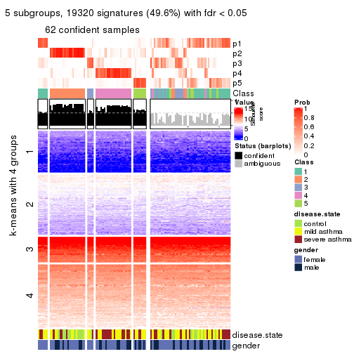</p>

</div>
<div id='tab-CV-skmeans-get-signatures-no-scale-5'>
<pre><code class="r">get_signatures(res, k = 6, scale_rows = FALSE)
</code></pre>

<p></p>

</div>
</div>


Compare the overlap of signatures from different k:

```r
compare_signatures(res)
```


`get_signature()` returns a data frame invisibly. TO get the list of signatures, the function
call should be assigned to a variable explicitly. In following code, if `plot` argument is set
to `FALSE`, no heatmap is plotted while only the differential analysis is performed.

```r
# code only for demonstration
tb = get_signature(res, k = ..., plot = FALSE)
```

An example of the output of `tb` is:

```
#>   which_row         fdr    mean_1    mean_2 scaled_mean_1 scaled_mean_2 km
#> 1        38 0.042760348  8.373488  9.131774    -0.5533452     0.5164555  1
#> 2        40 0.018707592  7.106213  8.469186    -0.6173731     0.5762149  1
#> 3        55 0.019134737 10.221463 11.207825    -0.6159697     0.5749050  1
#> 4        59 0.006059896  5.921854  7.869574    -0.6899429     0.6439467  1
#> 5        60 0.018055526  8.928898 10.211722    -0.6204761     0.5791110  1
#> 6        98 0.009384629 15.714769 14.887706     0.6635654    -0.6193277  2
...
```

The columns in `tb` are:

1. `which_row`: row indices corresponding to the input matrix.
2. `fdr`: FDR for the differential test. 
3. `mean_x`: The mean value in group x.
4. `scaled_mean_x`: The mean value in group x after rows are scaled.
5. `km`: Row groups if k-means clustering is applied to rows.


UMAP plot which shows how samples are separated.


<script>
$( function() {
	$( '#tabs-CV-skmeans-dimension-reduction' ).tabs();
} );
</script>
<div id='tabs-CV-skmeans-dimension-reduction'>
<ul>
<li><a href='#tab-CV-skmeans-dimension-reduction-1'>k = 2</a></li>
<li><a href='#tab-CV-skmeans-dimension-reduction-2'>k = 3</a></li>
<li><a href='#tab-CV-skmeans-dimension-reduction-3'>k = 4</a></li>
<li><a href='#tab-CV-skmeans-dimension-reduction-4'>k = 5</a></li>
<li><a href='#tab-CV-skmeans-dimension-reduction-5'>k = 6</a></li>
</ul>
<div id='tab-CV-skmeans-dimension-reduction-1'>
<pre><code class="r">dimension_reduction(res, k = 2, method = &quot;UMAP&quot;)
</code></pre>

<p></p>

</div>
<div id='tab-CV-skmeans-dimension-reduction-2'>
<pre><code class="r">dimension_reduction(res, k = 3, method = &quot;UMAP&quot;)
</code></pre>

<p></p>

</div>
<div id='tab-CV-skmeans-dimension-reduction-3'>
<pre><code class="r">dimension_reduction(res, k = 4, method = &quot;UMAP&quot;)
</code></pre>

<p></p>

</div>
<div id='tab-CV-skmeans-dimension-reduction-4'>
<pre><code class="r">dimension_reduction(res, k = 5, method = &quot;UMAP&quot;)
</code></pre>

<p></p>

</div>
<div id='tab-CV-skmeans-dimension-reduction-5'>
<pre><code class="r">dimension_reduction(res, k = 6, method = &quot;UMAP&quot;)
</code></pre>

<p></p>

</div>
</div>


Following heatmap shows how subgroups are split when increasing `k`:

```r
collect_classes(res)
```


Test correlation between subgroups and known annotations. If the known
annotation is numeric, one-way ANOVA test is applied, and if the known
annotation is discrete, chi-squared contingency table test is applied.

```r
test_to_known_factors(res)
```

```
#>              n disease.state(p) gender(p) k
#> CV:skmeans 107         0.963896     0.747 2
#> CV:skmeans  92         0.005553     0.913 3
#> CV:skmeans  79         0.011492     0.699 4
#> CV:skmeans  62         0.005429     0.186 5
#> CV:skmeans  70         0.000438     0.502 6
```


If matrix rows can be associated to genes, consider to use `GO_Enrichment(res,
...)` to perform function enrichment for the signature genes.


 

---------------------------------------------------


### CV:pam


The object with results only for a single top-value method and a single partition method 
can be extracted as:

```r
res = res_list["CV", "pam"]
# you can also extract it by
# res = res_list["CV:pam"]
```

A summary of `res` and all the functions that can be applied to it:

```r
res
```

```
#> A 'ConsensusPartition' object with k = 2, 3, 4, 5, 6.
#>   On a matrix with 38950 rows and 108 columns.
#>   Top rows (1000, 2000, 3000, 4000, 5000) are extracted by 'CV' method.
#>   Subgroups are detected by 'pam' method.
#>   Performed in total 1250 partitions by row resampling.
#>   Best k for subgroups seems to be 3.
#> 
#> Following methods can be applied to this 'ConsensusPartition' object:
#>  [1] "cola_report"             "collect_classes"         "collect_plots"          
#>  [4] "collect_stats"           "colnames"                "compare_signatures"     
#>  [7] "consensus_heatmap"       "dimension_reduction"     "functional_enrichment"  
#> [10] "get_anno_col"            "get_anno"                "get_classes"            
#> [13] "get_consensus"           "get_matrix"              "get_membership"         
#> [16] "get_param"               "get_signatures"          "get_stats"              
#> [19] "is_best_k"               "is_stable_k"             "membership_heatmap"     
#> [22] "ncol"                    "nrow"                    "plot_ecdf"              
#> [25] "rownames"                "select_partition_number" "show"                   
#> [28] "suggest_best_k"          "test_to_known_factors"
```

`collect_plots()` function collects all the plots made from `res` for all `k` (number of partitions)
into one single page to provide an easy and fast comparison between different `k`.

```r
collect_plots(res)
```


The plots are:

- The first row: a plot of the ECDF (Empirical cumulative distribution
  function) curves of the consensus matrix for each `k` and the heatmap of
  predicted classes for each `k`.
- The second row: heatmaps of the consensus matrix for each `k`.
- The third row: heatmaps of the membership matrix for each `k`.
- The fouth row: heatmaps of the signatures for each `k`.

All the plots in panels can be made by individual functions and they are
plotted later in this section.

`select_partition_number()` produces several plots showing different
statistics for choosing "optimized" `k`. There are following statistics:

- ECDF curves of the consensus matrix for each `k`;
- 1-PAC. [The PAC
  score](https://en.wikipedia.org/wiki/Consensus_clustering#Over-interpretation_potential_of_consensus_clustering)
  measures the proportion of the ambiguous subgrouping.
- Mean silhouette score.
- Concordance. The mean probability of fiting the consensus class ids in all
  partitions.
- Area increased. Denote $A_k$ as the area under the ECDF curve for current
  `k`, the area increased is defined as $A_k - A_{k-1}$.
- Rand index. The percent of pairs of samples that are both in a same cluster
  or both are not in a same cluster in the partition of k and k-1.
- Jaccard index. The ratio of pairs of samples are both in a same cluster in
  the partition of k and k-1 and the pairs of samples are both in a same
  cluster in the partition k or k-1.

The detailed explanations of these statistics can be found in [the cola
vignette](http://bioconductor.org/packages/devel/bioc/vignettes/cola/inst/doc/cola.html#toc_13).

Generally speaking, lower PAC score, higher mean silhouette score or higher
concordance corresponds to better partition. Rand index and Jaccard index
measure how similar the current partition is compared to partition with `k-1`.
If they are too similar, we won't accept `k` is better than `k-1`.

```r
select_partition_number(res)
```


The numeric values for all these statistics can be obtained by `get_stats()`.

```r
get_stats(res)
```

```
#>   k 1-PAC mean_silhouette concordance area_increased  Rand Jaccard
#> 2 2 0.356           0.697       0.842         0.4977 0.496   0.496
#> 3 3 0.496           0.726       0.857         0.3242 0.697   0.463
#> 4 4 0.501           0.441       0.694         0.1074 0.845   0.581
#> 5 5 0.646           0.697       0.836         0.0749 0.877   0.584
#> 6 6 0.641           0.534       0.721         0.0375 0.945   0.753
```

`suggest_best_k()` suggests the best $k$ based on these statistics. The rules are as follows:

- All $k$ with Jaccard index larger than 0.95 are removed because the increase of
  the partition number does not provides enough extra information. If all $k$ are removed,
  the best $k$ is assigned by `NA`.
- For $k$ with 1-PAC larger than 0.9, the maximal $k$ is taken as the "best k". Other $k$ is called "optional k".
- If it does not fit the second rule. The $k$ with the highest vote of highest
  1-PAC, mean silhouette and concordance is taken as the "best k".

```r
suggest_best_k(res)
```

```
#> [1] 3
```


Following shows the table of the partitions (You need to click the **show/hide
code output** link to see it). The membership matrix (columns with name `p*`)
is inferred by
[`clue::cl_consensus()`](https://www.rdocumentation.org/link/cl_consensus?package=clue)
function with the `SE` method. Basically the value in the membership matrix
represents the probability to belong to a certain group. The finall class
label for an item is determined with the group with highest probability it
belongs to.

In `get_classes()` function, the entropy is calculated from the membership
matrix and the silhouette score is calculated from the consensus matrix.


<script>
$( function() {
	$( '#tabs-CV-pam-get-classes' ).tabs();
} );
</script>
<div id='tabs-CV-pam-get-classes'>
<ul>
<li><a href='#tab-CV-pam-get-classes-1'>k = 2</a></li>
<li><a href='#tab-CV-pam-get-classes-2'>k = 3</a></li>
<li><a href='#tab-CV-pam-get-classes-3'>k = 4</a></li>
<li><a href='#tab-CV-pam-get-classes-4'>k = 5</a></li>
<li><a href='#tab-CV-pam-get-classes-5'>k = 6</a></li>
</ul>

<div id='tab-CV-pam-get-classes-1'>
<p><a id='tab-CV-pam-get-classes-1-a' style='color:#0366d6' href='#'>show/hide code output</a></p>
<pre><code class="r">cbind(get_classes(res, k = 2), get_membership(res, k = 2))
</code></pre>

<pre><code>#&gt;            class entropy silhouette    p1    p2
#&gt; GSM1068478     1  0.0000     0.8226 1.000 0.000
#&gt; GSM1068479     2  0.0672     0.7607 0.008 0.992
#&gt; GSM1068481     1  0.3274     0.8040 0.940 0.060
#&gt; GSM1068482     1  0.8267     0.7119 0.740 0.260
#&gt; GSM1068483     1  0.0000     0.8226 1.000 0.000
#&gt; GSM1068486     1  0.9129     0.4335 0.672 0.328
#&gt; GSM1068487     2  0.7219     0.7875 0.200 0.800
#&gt; GSM1068488     2  0.6148     0.6264 0.152 0.848
#&gt; GSM1068490     2  0.7219     0.7875 0.200 0.800
#&gt; GSM1068491     2  0.0000     0.7576 0.000 1.000
#&gt; GSM1068492     2  0.0000     0.7576 0.000 1.000
#&gt; GSM1068493     1  0.0938     0.8212 0.988 0.012
#&gt; GSM1068494     1  0.7528     0.7358 0.784 0.216
#&gt; GSM1068495     1  0.0000     0.8226 1.000 0.000
#&gt; GSM1068496     1  0.3274     0.8058 0.940 0.060
#&gt; GSM1068498     1  0.0000     0.8226 1.000 0.000
#&gt; GSM1068499     1  0.8267     0.7119 0.740 0.260
#&gt; GSM1068500     1  0.0000     0.8226 1.000 0.000
#&gt; GSM1068502     2  0.0000     0.7576 0.000 1.000
#&gt; GSM1068503     2  0.7056     0.7891 0.192 0.808
#&gt; GSM1068505     1  0.9552     0.1300 0.624 0.376
#&gt; GSM1068506     2  0.8327     0.7663 0.264 0.736
#&gt; GSM1068507     2  0.2603     0.7707 0.044 0.956
#&gt; GSM1068508     2  0.8081     0.7740 0.248 0.752
#&gt; GSM1068510     2  0.0000     0.7576 0.000 1.000
#&gt; GSM1068512     2  0.6801     0.5854 0.180 0.820
#&gt; GSM1068513     2  0.7139     0.7884 0.196 0.804
#&gt; GSM1068514     2  0.0000     0.7576 0.000 1.000
#&gt; GSM1068517     1  0.0376     0.8211 0.996 0.004
#&gt; GSM1068518     2  0.8327     0.4324 0.264 0.736
#&gt; GSM1068520     1  0.0000     0.8226 1.000 0.000
#&gt; GSM1068521     1  0.0000     0.8226 1.000 0.000
#&gt; GSM1068522     2  0.8327     0.7663 0.264 0.736
#&gt; GSM1068524     2  0.7376     0.7875 0.208 0.792
#&gt; GSM1068527     1  0.9795     0.4973 0.584 0.416
#&gt; GSM1068480     1  0.8267     0.7119 0.740 0.260
#&gt; GSM1068484     2  0.0000     0.7576 0.000 1.000
#&gt; GSM1068485     1  0.8267     0.7119 0.740 0.260
#&gt; GSM1068489     2  0.3431     0.7533 0.064 0.936
#&gt; GSM1068497     1  0.0376     0.8211 0.996 0.004
#&gt; GSM1068501     2  0.0000     0.7576 0.000 1.000
#&gt; GSM1068504     2  0.6973     0.7893 0.188 0.812
#&gt; GSM1068509     1  0.7219     0.7400 0.800 0.200
#&gt; GSM1068511     1  0.8081     0.7213 0.752 0.248
#&gt; GSM1068515     1  0.8386     0.4681 0.732 0.268
#&gt; GSM1068516     1  0.8909     0.6816 0.692 0.308
#&gt; GSM1068519     1  0.7453     0.7372 0.788 0.212
#&gt; GSM1068523     2  0.8207     0.7701 0.256 0.744
#&gt; GSM1068525     2  0.0000     0.7576 0.000 1.000
#&gt; GSM1068526     2  0.0672     0.7586 0.008 0.992
#&gt; GSM1068458     1  0.0000     0.8226 1.000 0.000
#&gt; GSM1068459     1  0.8267     0.7119 0.740 0.260
#&gt; GSM1068460     1  0.0672     0.8197 0.992 0.008
#&gt; GSM1068461     2  0.9970    -0.3054 0.468 0.532
#&gt; GSM1068464     2  0.7219     0.7875 0.200 0.800
#&gt; GSM1068468     2  0.7376     0.7867 0.208 0.792
#&gt; GSM1068472     1  0.2948     0.8052 0.948 0.052
#&gt; GSM1068473     2  0.7299     0.7870 0.204 0.796
#&gt; GSM1068474     2  0.8267     0.7674 0.260 0.740
#&gt; GSM1068476     2  0.0376     0.7567 0.004 0.996
#&gt; GSM1068477     2  0.8327     0.7663 0.264 0.736
#&gt; GSM1068462     2  0.7219     0.7875 0.200 0.800
#&gt; GSM1068463     1  0.4562     0.7988 0.904 0.096
#&gt; GSM1068465     1  0.9815    -0.0355 0.580 0.420
#&gt; GSM1068466     1  0.0000     0.8226 1.000 0.000
#&gt; GSM1068467     2  0.8267     0.7684 0.260 0.740
#&gt; GSM1068469     2  0.9881     0.4884 0.436 0.564
#&gt; GSM1068470     2  0.8267     0.7674 0.260 0.740
#&gt; GSM1068471     2  0.7219     0.7875 0.200 0.800
#&gt; GSM1068475     2  0.8207     0.7697 0.256 0.744
#&gt; GSM1068528     1  0.0376     0.8224 0.996 0.004
#&gt; GSM1068531     1  0.0000     0.8226 1.000 0.000
#&gt; GSM1068532     1  0.7299     0.7392 0.796 0.204
#&gt; GSM1068533     1  0.0000     0.8226 1.000 0.000
#&gt; GSM1068535     1  0.9000     0.6736 0.684 0.316
#&gt; GSM1068537     1  0.4022     0.8030 0.920 0.080
#&gt; GSM1068538     1  0.0000     0.8226 1.000 0.000
#&gt; GSM1068539     1  0.0672     0.8229 0.992 0.008
#&gt; GSM1068540     1  0.0938     0.8224 0.988 0.012
#&gt; GSM1068542     2  0.8327     0.7669 0.264 0.736
#&gt; GSM1068543     2  0.8813     0.2921 0.300 0.700
#&gt; GSM1068544     1  0.7674     0.7319 0.776 0.224
#&gt; GSM1068545     2  0.8267     0.7674 0.260 0.740
#&gt; GSM1068546     1  0.8267     0.7119 0.740 0.260
#&gt; GSM1068547     1  0.0000     0.8226 1.000 0.000
#&gt; GSM1068548     1  0.8813     0.4531 0.700 0.300
#&gt; GSM1068549     2  0.0376     0.7567 0.004 0.996
#&gt; GSM1068550     2  0.8207     0.7712 0.256 0.744
#&gt; GSM1068551     2  0.8267     0.7674 0.260 0.740
#&gt; GSM1068552     2  0.8327     0.7663 0.264 0.736
#&gt; GSM1068555     2  0.7299     0.7872 0.204 0.796
#&gt; GSM1068556     2  0.9963    -0.2870 0.464 0.536
#&gt; GSM1068557     2  0.9815     0.5576 0.420 0.580
#&gt; GSM1068560     1  0.9522     0.4331 0.628 0.372
#&gt; GSM1068561     1  0.0672     0.8198 0.992 0.008
#&gt; GSM1068562     2  0.0376     0.7567 0.004 0.996
#&gt; GSM1068563     2  0.0376     0.7567 0.004 0.996
#&gt; GSM1068565     2  0.8267     0.7674 0.260 0.740
#&gt; GSM1068529     1  0.9922     0.4867 0.552 0.448
#&gt; GSM1068530     1  0.0000     0.8226 1.000 0.000
#&gt; GSM1068534     1  0.6887     0.6940 0.816 0.184
#&gt; GSM1068536     1  0.0000     0.8226 1.000 0.000
#&gt; GSM1068541     1  0.3733     0.7727 0.928 0.072
#&gt; GSM1068553     2  0.9970    -0.3036 0.468 0.532
#&gt; GSM1068554     2  0.0000     0.7576 0.000 1.000
#&gt; GSM1068558     2  0.7674     0.4797 0.224 0.776
#&gt; GSM1068559     2  0.0000     0.7576 0.000 1.000
#&gt; GSM1068564     2  0.6801     0.7821 0.180 0.820
</code></pre>

<script>
$('#tab-CV-pam-get-classes-1-a').parent().next().next().hide();
$('#tab-CV-pam-get-classes-1-a').click(function(){
  $('#tab-CV-pam-get-classes-1-a').parent().next().next().toggle();
  return(false);
});
</script>
</div>

<div id='tab-CV-pam-get-classes-2'>
<p><a id='tab-CV-pam-get-classes-2-a' style='color:#0366d6' href='#'>show/hide code output</a></p>
<pre><code class="r">cbind(get_classes(res, k = 3), get_membership(res, k = 3))
</code></pre>

<pre><code>#&gt;            class entropy silhouette    p1    p2    p3
#&gt; GSM1068478     1  0.3038      0.899 0.896 0.104 0.000
#&gt; GSM1068479     3  0.4504      0.644 0.000 0.196 0.804
#&gt; GSM1068481     1  0.4128      0.886 0.856 0.132 0.012
#&gt; GSM1068482     3  0.5785      0.571 0.332 0.000 0.668
#&gt; GSM1068483     1  0.3038      0.899 0.896 0.104 0.000
#&gt; GSM1068486     3  0.4960      0.708 0.040 0.128 0.832
#&gt; GSM1068487     2  0.0000      0.822 0.000 1.000 0.000
#&gt; GSM1068488     3  0.0237      0.791 0.000 0.004 0.996
#&gt; GSM1068490     2  0.0000      0.822 0.000 1.000 0.000
#&gt; GSM1068491     3  0.0237      0.791 0.000 0.004 0.996
#&gt; GSM1068492     3  0.0237      0.791 0.000 0.004 0.996
#&gt; GSM1068493     1  0.3965      0.887 0.860 0.132 0.008
#&gt; GSM1068494     1  0.3038      0.848 0.896 0.000 0.104
#&gt; GSM1068495     1  0.2261      0.900 0.932 0.068 0.000
#&gt; GSM1068496     1  0.5728      0.681 0.772 0.032 0.196
#&gt; GSM1068498     1  0.3192      0.897 0.888 0.112 0.000
#&gt; GSM1068499     1  0.3619      0.824 0.864 0.000 0.136
#&gt; GSM1068500     1  0.3038      0.899 0.896 0.104 0.000
#&gt; GSM1068502     3  0.0237      0.791 0.000 0.004 0.996
#&gt; GSM1068503     2  0.0000      0.822 0.000 1.000 0.000
#&gt; GSM1068505     2  0.4842      0.671 0.224 0.776 0.000
#&gt; GSM1068506     2  0.4058      0.788 0.044 0.880 0.076
#&gt; GSM1068507     3  0.5785      0.453 0.000 0.332 0.668
#&gt; GSM1068508     2  0.2229      0.809 0.012 0.944 0.044
#&gt; GSM1068510     2  0.6280      0.211 0.000 0.540 0.460
#&gt; GSM1068512     3  0.0237      0.791 0.000 0.004 0.996
#&gt; GSM1068513     2  0.4062      0.732 0.000 0.836 0.164
#&gt; GSM1068514     3  0.0237      0.791 0.000 0.004 0.996
#&gt; GSM1068517     1  0.3192      0.897 0.888 0.112 0.000
#&gt; GSM1068518     3  0.0237      0.791 0.000 0.004 0.996
#&gt; GSM1068520     1  0.2959      0.900 0.900 0.100 0.000
#&gt; GSM1068521     1  0.2261      0.900 0.932 0.068 0.000
#&gt; GSM1068522     2  0.1643      0.814 0.044 0.956 0.000
#&gt; GSM1068524     2  0.0424      0.822 0.000 0.992 0.008
#&gt; GSM1068527     3  0.6435      0.708 0.168 0.076 0.756
#&gt; GSM1068480     3  0.4842      0.671 0.224 0.000 0.776
#&gt; GSM1068484     2  0.5988      0.422 0.000 0.632 0.368
#&gt; GSM1068485     3  0.6154      0.262 0.408 0.000 0.592
#&gt; GSM1068489     2  0.7238      0.473 0.044 0.628 0.328
#&gt; GSM1068497     1  0.3192      0.897 0.888 0.112 0.000
#&gt; GSM1068501     3  0.5760      0.463 0.000 0.328 0.672
#&gt; GSM1068504     2  0.0424      0.822 0.000 0.992 0.008
#&gt; GSM1068509     1  0.2448      0.864 0.924 0.000 0.076
#&gt; GSM1068511     1  0.4172      0.804 0.840 0.004 0.156
#&gt; GSM1068515     2  0.5905      0.370 0.352 0.648 0.000
#&gt; GSM1068516     3  0.5692      0.616 0.268 0.008 0.724
#&gt; GSM1068519     1  0.5138      0.658 0.748 0.000 0.252
#&gt; GSM1068523     2  0.0892      0.821 0.020 0.980 0.000
#&gt; GSM1068525     3  0.6309     -0.134 0.000 0.496 0.504
#&gt; GSM1068526     2  0.5335      0.641 0.008 0.760 0.232
#&gt; GSM1068458     1  0.2878      0.893 0.904 0.096 0.000
#&gt; GSM1068459     3  0.6204      0.310 0.424 0.000 0.576
#&gt; GSM1068460     1  0.3752      0.848 0.856 0.144 0.000
#&gt; GSM1068461     3  0.0000      0.790 0.000 0.000 1.000
#&gt; GSM1068464     2  0.2796      0.780 0.000 0.908 0.092
#&gt; GSM1068468     2  0.5016      0.653 0.000 0.760 0.240
#&gt; GSM1068472     1  0.4861      0.846 0.808 0.180 0.012
#&gt; GSM1068473     2  0.0000      0.822 0.000 1.000 0.000
#&gt; GSM1068474     2  0.0000      0.822 0.000 1.000 0.000
#&gt; GSM1068476     3  0.0237      0.791 0.000 0.004 0.996
#&gt; GSM1068477     2  0.1643      0.814 0.044 0.956 0.000
#&gt; GSM1068462     2  0.4399      0.696 0.000 0.812 0.188
#&gt; GSM1068463     1  0.4443      0.840 0.864 0.052 0.084
#&gt; GSM1068465     2  0.7796      0.233 0.392 0.552 0.056
#&gt; GSM1068466     1  0.2711      0.902 0.912 0.088 0.000
#&gt; GSM1068467     2  0.5497      0.571 0.000 0.708 0.292
#&gt; GSM1068469     2  0.5650      0.488 0.312 0.688 0.000
#&gt; GSM1068470     2  0.0000      0.822 0.000 1.000 0.000
#&gt; GSM1068471     2  0.0000      0.822 0.000 1.000 0.000
#&gt; GSM1068475     2  0.0000      0.822 0.000 1.000 0.000
#&gt; GSM1068528     1  0.2796      0.897 0.908 0.092 0.000
#&gt; GSM1068531     1  0.0000      0.881 1.000 0.000 0.000
#&gt; GSM1068532     1  0.2959      0.825 0.900 0.000 0.100
#&gt; GSM1068533     1  0.0000      0.881 1.000 0.000 0.000
#&gt; GSM1068535     3  0.1753      0.780 0.048 0.000 0.952
#&gt; GSM1068537     1  0.0237      0.879 0.996 0.000 0.004
#&gt; GSM1068538     1  0.0000      0.881 1.000 0.000 0.000
#&gt; GSM1068539     1  0.2261      0.900 0.932 0.068 0.000
#&gt; GSM1068540     1  0.0000      0.881 1.000 0.000 0.000
#&gt; GSM1068542     2  0.6688      0.501 0.028 0.664 0.308
#&gt; GSM1068543     3  0.0237      0.791 0.000 0.004 0.996
#&gt; GSM1068544     1  0.3686      0.788 0.860 0.000 0.140
#&gt; GSM1068545     2  0.1643      0.814 0.044 0.956 0.000
#&gt; GSM1068546     3  0.5291      0.617 0.268 0.000 0.732
#&gt; GSM1068547     1  0.2356      0.900 0.928 0.072 0.000
#&gt; GSM1068548     3  0.9930      0.129 0.276 0.360 0.364
#&gt; GSM1068549     3  0.0000      0.790 0.000 0.000 1.000
#&gt; GSM1068550     2  0.3780      0.795 0.044 0.892 0.064
#&gt; GSM1068551     2  0.1289      0.817 0.032 0.968 0.000
#&gt; GSM1068552     2  0.1411      0.817 0.036 0.964 0.000
#&gt; GSM1068555     2  0.0000      0.822 0.000 1.000 0.000
#&gt; GSM1068556     3  0.3590      0.757 0.028 0.076 0.896
#&gt; GSM1068557     2  0.6758      0.444 0.360 0.620 0.020
#&gt; GSM1068560     2  0.8957      0.365 0.312 0.536 0.152
#&gt; GSM1068561     1  0.3686      0.884 0.860 0.140 0.000
#&gt; GSM1068562     3  0.3412      0.732 0.000 0.124 0.876
#&gt; GSM1068563     3  0.2711      0.755 0.000 0.088 0.912
#&gt; GSM1068565     2  0.0000      0.822 0.000 1.000 0.000
#&gt; GSM1068529     3  0.0747      0.790 0.016 0.000 0.984
#&gt; GSM1068530     1  0.0000      0.881 1.000 0.000 0.000
#&gt; GSM1068534     3  0.8543      0.467 0.268 0.140 0.592
#&gt; GSM1068536     1  0.2261      0.900 0.932 0.068 0.000
#&gt; GSM1068541     1  0.6140      0.412 0.596 0.404 0.000
#&gt; GSM1068553     3  0.9512      0.403 0.248 0.260 0.492
#&gt; GSM1068554     2  0.5016      0.636 0.000 0.760 0.240
#&gt; GSM1068558     3  0.5863      0.723 0.120 0.084 0.796
#&gt; GSM1068559     3  0.0237      0.791 0.000 0.004 0.996
#&gt; GSM1068564     2  0.2564      0.807 0.036 0.936 0.028
</code></pre>

<script>
$('#tab-CV-pam-get-classes-2-a').parent().next().next().hide();
$('#tab-CV-pam-get-classes-2-a').click(function(){
  $('#tab-CV-pam-get-classes-2-a').parent().next().next().toggle();
  return(false);
});
</script>
</div>

<div id='tab-CV-pam-get-classes-3'>
<p><a id='tab-CV-pam-get-classes-3-a' style='color:#0366d6' href='#'>show/hide code output</a></p>
<pre><code class="r">cbind(get_classes(res, k = 4), get_membership(res, k = 4))
</code></pre>

<pre><code>#&gt;            class entropy silhouette    p1    p2    p3    p4
#&gt; GSM1068478     1  0.2149    0.80957 0.912 0.088 0.000 0.000
#&gt; GSM1068479     3  0.7717    0.28166 0.000 0.232 0.424 0.344
#&gt; GSM1068481     1  0.6919    0.43258 0.500 0.112 0.388 0.000
#&gt; GSM1068482     3  0.2480    0.30670 0.088 0.000 0.904 0.008
#&gt; GSM1068483     1  0.2216    0.80872 0.908 0.092 0.000 0.000
#&gt; GSM1068486     3  0.8063    0.41474 0.048 0.112 0.448 0.392
#&gt; GSM1068487     2  0.0376    0.73626 0.004 0.992 0.000 0.004
#&gt; GSM1068488     3  0.4961    0.53795 0.000 0.000 0.552 0.448
#&gt; GSM1068490     2  0.0376    0.73626 0.004 0.992 0.000 0.004
#&gt; GSM1068491     3  0.4961    0.53795 0.000 0.000 0.552 0.448
#&gt; GSM1068492     3  0.4961    0.53795 0.000 0.000 0.552 0.448
#&gt; GSM1068493     1  0.2988    0.80130 0.876 0.112 0.000 0.012
#&gt; GSM1068494     1  0.3453    0.77073 0.868 0.000 0.080 0.052
#&gt; GSM1068495     1  0.2926    0.80850 0.896 0.048 0.000 0.056
#&gt; GSM1068496     1  0.4889    0.43342 0.636 0.004 0.360 0.000
#&gt; GSM1068498     1  0.2216    0.81014 0.908 0.092 0.000 0.000
#&gt; GSM1068499     1  0.3325    0.74632 0.864 0.000 0.112 0.024
#&gt; GSM1068500     1  0.2796    0.80925 0.892 0.092 0.016 0.000
#&gt; GSM1068502     3  0.4961    0.53795 0.000 0.000 0.552 0.448
#&gt; GSM1068503     2  0.0895    0.73426 0.004 0.976 0.000 0.020
#&gt; GSM1068505     4  0.7211    0.27486 0.248 0.204 0.000 0.548
#&gt; GSM1068506     4  0.4985   -0.15547 0.000 0.468 0.000 0.532
#&gt; GSM1068507     2  0.7921   -0.31720 0.000 0.348 0.320 0.332
#&gt; GSM1068508     2  0.0937    0.73477 0.012 0.976 0.000 0.012
#&gt; GSM1068510     2  0.7121    0.21624 0.000 0.544 0.292 0.164
#&gt; GSM1068512     3  0.4961    0.53795 0.000 0.000 0.552 0.448
#&gt; GSM1068513     2  0.2115    0.71895 0.004 0.936 0.024 0.036
#&gt; GSM1068514     3  0.4961    0.53795 0.000 0.000 0.552 0.448
#&gt; GSM1068517     1  0.2216    0.81014 0.908 0.092 0.000 0.000
#&gt; GSM1068518     3  0.4961    0.53795 0.000 0.000 0.552 0.448
#&gt; GSM1068520     1  0.2334    0.81005 0.908 0.088 0.000 0.004
#&gt; GSM1068521     1  0.2926    0.80884 0.896 0.048 0.000 0.056
#&gt; GSM1068522     2  0.4992    0.21248 0.000 0.524 0.000 0.476
#&gt; GSM1068524     2  0.2665    0.70723 0.004 0.900 0.008 0.088
#&gt; GSM1068527     4  0.6705   -0.05952 0.148 0.000 0.244 0.608
#&gt; GSM1068480     3  0.1637    0.38357 0.000 0.000 0.940 0.060
#&gt; GSM1068484     2  0.7345    0.18060 0.000 0.492 0.172 0.336
#&gt; GSM1068485     3  0.5522    0.15108 0.288 0.000 0.668 0.044
#&gt; GSM1068489     4  0.5040    0.00892 0.000 0.364 0.008 0.628
#&gt; GSM1068497     1  0.2149    0.80957 0.912 0.088 0.000 0.000
#&gt; GSM1068501     4  0.5670    0.25777 0.000 0.152 0.128 0.720
#&gt; GSM1068504     2  0.1489    0.72273 0.000 0.952 0.004 0.044
#&gt; GSM1068509     1  0.3806    0.75619 0.824 0.000 0.020 0.156
#&gt; GSM1068511     3  0.6672   -0.25554 0.408 0.000 0.504 0.088
#&gt; GSM1068515     4  0.7500    0.05338 0.400 0.156 0.004 0.440
#&gt; GSM1068516     3  0.7215    0.23025 0.348 0.000 0.500 0.152
#&gt; GSM1068519     1  0.5993    0.58945 0.692 0.000 0.148 0.160
#&gt; GSM1068523     2  0.3725    0.63113 0.008 0.812 0.000 0.180
#&gt; GSM1068525     2  0.6640    0.20802 0.000 0.552 0.352 0.096
#&gt; GSM1068526     4  0.6611   -0.10890 0.000 0.456 0.080 0.464
#&gt; GSM1068458     1  0.4610    0.78052 0.804 0.068 0.004 0.124
#&gt; GSM1068459     3  0.4955    0.06187 0.344 0.000 0.648 0.008
#&gt; GSM1068460     1  0.5414    0.46637 0.604 0.020 0.000 0.376
#&gt; GSM1068461     3  0.4477    0.49494 0.000 0.000 0.688 0.312
#&gt; GSM1068464     2  0.0524    0.73515 0.008 0.988 0.000 0.004
#&gt; GSM1068468     2  0.4059    0.64487 0.008 0.844 0.092 0.056
#&gt; GSM1068472     1  0.3627    0.78152 0.840 0.144 0.008 0.008
#&gt; GSM1068473     2  0.0524    0.73567 0.008 0.988 0.000 0.004
#&gt; GSM1068474     2  0.0188    0.73621 0.000 0.996 0.000 0.004
#&gt; GSM1068476     3  0.4961    0.53795 0.000 0.000 0.552 0.448
#&gt; GSM1068477     2  0.4837    0.41970 0.004 0.648 0.000 0.348
#&gt; GSM1068462     2  0.3127    0.67542 0.008 0.892 0.032 0.068
#&gt; GSM1068463     1  0.5669    0.28636 0.516 0.016 0.464 0.004
#&gt; GSM1068465     1  0.8020   -0.13338 0.380 0.276 0.004 0.340
#&gt; GSM1068466     1  0.2596    0.81262 0.908 0.068 0.000 0.024
#&gt; GSM1068467     2  0.4184    0.64359 0.008 0.836 0.056 0.100
#&gt; GSM1068469     2  0.3074    0.61085 0.152 0.848 0.000 0.000
#&gt; GSM1068470     2  0.3142    0.67523 0.008 0.860 0.000 0.132
#&gt; GSM1068471     2  0.0188    0.73570 0.004 0.996 0.000 0.000
#&gt; GSM1068475     2  0.0376    0.73567 0.004 0.992 0.000 0.004
#&gt; GSM1068528     1  0.3442    0.80443 0.880 0.068 0.040 0.012
#&gt; GSM1068531     1  0.3249    0.77323 0.852 0.000 0.008 0.140
#&gt; GSM1068532     3  0.6504   -0.28275 0.452 0.000 0.476 0.072
#&gt; GSM1068533     1  0.3198    0.76645 0.880 0.000 0.040 0.080
#&gt; GSM1068535     4  0.4713   -0.37763 0.000 0.000 0.360 0.640
#&gt; GSM1068537     1  0.4673    0.53567 0.700 0.000 0.292 0.008
#&gt; GSM1068538     1  0.4426    0.72765 0.812 0.000 0.096 0.092
#&gt; GSM1068539     1  0.3850    0.79301 0.840 0.044 0.000 0.116
#&gt; GSM1068540     1  0.0524    0.79187 0.988 0.000 0.008 0.004
#&gt; GSM1068542     4  0.4605    0.16081 0.000 0.336 0.000 0.664
#&gt; GSM1068543     4  0.4998   -0.51829 0.000 0.000 0.488 0.512
#&gt; GSM1068544     3  0.5292   -0.25617 0.480 0.000 0.512 0.008
#&gt; GSM1068545     2  0.4933    0.27044 0.000 0.568 0.000 0.432
#&gt; GSM1068546     3  0.6523    0.26919 0.348 0.000 0.564 0.088
#&gt; GSM1068547     1  0.4153    0.78347 0.820 0.048 0.000 0.132
#&gt; GSM1068548     4  0.8684    0.23410 0.292 0.168 0.072 0.468
#&gt; GSM1068549     3  0.4961    0.53795 0.000 0.000 0.552 0.448
#&gt; GSM1068550     4  0.4955   -0.11807 0.000 0.444 0.000 0.556
#&gt; GSM1068551     2  0.2281    0.69913 0.000 0.904 0.000 0.096
#&gt; GSM1068552     2  0.4998    0.16106 0.000 0.512 0.000 0.488
#&gt; GSM1068555     2  0.0336    0.73539 0.008 0.992 0.000 0.000
#&gt; GSM1068556     4  0.4605   -0.28503 0.000 0.000 0.336 0.664
#&gt; GSM1068557     2  0.6233    0.43168 0.216 0.660 0.000 0.124
#&gt; GSM1068560     4  0.6907    0.17095 0.348 0.120 0.000 0.532
#&gt; GSM1068561     1  0.3032    0.79847 0.868 0.124 0.000 0.008
#&gt; GSM1068562     4  0.5047   -0.20952 0.000 0.016 0.316 0.668
#&gt; GSM1068563     4  0.4624   -0.26347 0.000 0.000 0.340 0.660
#&gt; GSM1068565     2  0.0336    0.73670 0.000 0.992 0.000 0.008
#&gt; GSM1068529     3  0.5353    0.53215 0.012 0.000 0.556 0.432
#&gt; GSM1068530     1  0.1545    0.78048 0.952 0.000 0.040 0.008
#&gt; GSM1068534     3  0.8893    0.12418 0.356 0.116 0.412 0.116
#&gt; GSM1068536     1  0.3890    0.78814 0.836 0.028 0.004 0.132
#&gt; GSM1068541     1  0.7063    0.21989 0.508 0.112 0.004 0.376
#&gt; GSM1068553     4  0.8420    0.26377 0.328 0.088 0.104 0.480
#&gt; GSM1068554     4  0.6389   -0.06828 0.000 0.448 0.064 0.488
#&gt; GSM1068558     3  0.8352    0.38602 0.128 0.092 0.540 0.240
#&gt; GSM1068559     3  0.4961    0.53795 0.000 0.000 0.552 0.448
#&gt; GSM1068564     2  0.4989    0.18304 0.000 0.528 0.000 0.472
</code></pre>

<script>
$('#tab-CV-pam-get-classes-3-a').parent().next().next().hide();
$('#tab-CV-pam-get-classes-3-a').click(function(){
  $('#tab-CV-pam-get-classes-3-a').parent().next().next().toggle();
  return(false);
});
</script>
</div>

<div id='tab-CV-pam-get-classes-4'>
<p><a id='tab-CV-pam-get-classes-4-a' style='color:#0366d6' href='#'>show/hide code output</a></p>
<pre><code class="r">cbind(get_classes(res, k = 5), get_membership(res, k = 5))
</code></pre>

<pre><code>#&gt;            class entropy silhouette    p1    p2    p3    p4    p5
#&gt; GSM1068478     1  0.0510     0.8487 0.984 0.016 0.000 0.000 0.000
#&gt; GSM1068479     5  0.3690     0.6191 0.000 0.224 0.000 0.012 0.764
#&gt; GSM1068481     3  0.4755     0.6332 0.244 0.060 0.696 0.000 0.000
#&gt; GSM1068482     3  0.0794     0.8415 0.000 0.000 0.972 0.000 0.028
#&gt; GSM1068483     1  0.0609     0.8481 0.980 0.020 0.000 0.000 0.000
#&gt; GSM1068486     5  0.3080     0.7370 0.060 0.060 0.008 0.000 0.872
#&gt; GSM1068487     2  0.1845     0.8376 0.016 0.928 0.000 0.056 0.000
#&gt; GSM1068488     5  0.0000     0.8013 0.000 0.000 0.000 0.000 1.000
#&gt; GSM1068490     2  0.2171     0.8360 0.024 0.912 0.000 0.064 0.000
#&gt; GSM1068491     5  0.0000     0.8013 0.000 0.000 0.000 0.000 1.000
#&gt; GSM1068492     5  0.0000     0.8013 0.000 0.000 0.000 0.000 1.000
#&gt; GSM1068493     1  0.1697     0.8356 0.932 0.060 0.000 0.000 0.008
#&gt; GSM1068494     1  0.2067     0.8425 0.920 0.000 0.000 0.032 0.048
#&gt; GSM1068495     1  0.1331     0.8504 0.952 0.008 0.000 0.040 0.000
#&gt; GSM1068496     1  0.4047     0.4903 0.676 0.004 0.320 0.000 0.000
#&gt; GSM1068498     1  0.0703     0.8477 0.976 0.024 0.000 0.000 0.000
#&gt; GSM1068499     1  0.1892     0.8248 0.916 0.000 0.000 0.004 0.080
#&gt; GSM1068500     1  0.1117     0.8480 0.964 0.020 0.016 0.000 0.000
#&gt; GSM1068502     5  0.0000     0.8013 0.000 0.000 0.000 0.000 1.000
#&gt; GSM1068503     2  0.2236     0.8361 0.024 0.908 0.000 0.068 0.000
#&gt; GSM1068505     4  0.0451     0.7350 0.000 0.008 0.004 0.988 0.000
#&gt; GSM1068506     4  0.1365     0.7468 0.004 0.040 0.004 0.952 0.000
#&gt; GSM1068507     5  0.5198     0.4530 0.004 0.284 0.000 0.064 0.648
#&gt; GSM1068508     2  0.1568     0.8420 0.020 0.944 0.000 0.036 0.000
#&gt; GSM1068510     2  0.5616     0.3240 0.000 0.552 0.000 0.084 0.364
#&gt; GSM1068512     5  0.0000     0.8013 0.000 0.000 0.000 0.000 1.000
#&gt; GSM1068513     2  0.2684     0.8315 0.024 0.900 0.000 0.032 0.044
#&gt; GSM1068514     5  0.0000     0.8013 0.000 0.000 0.000 0.000 1.000
#&gt; GSM1068517     1  0.0703     0.8477 0.976 0.024 0.000 0.000 0.000
#&gt; GSM1068518     5  0.0000     0.8013 0.000 0.000 0.000 0.000 1.000
#&gt; GSM1068520     1  0.0609     0.8481 0.980 0.020 0.000 0.000 0.000
#&gt; GSM1068521     1  0.1408     0.8506 0.948 0.008 0.000 0.044 0.000
#&gt; GSM1068522     4  0.2329     0.7265 0.000 0.124 0.000 0.876 0.000
#&gt; GSM1068524     2  0.2522     0.7843 0.000 0.880 0.000 0.108 0.012
#&gt; GSM1068527     4  0.5547     0.1404 0.060 0.000 0.004 0.532 0.404
#&gt; GSM1068480     3  0.3816     0.5311 0.000 0.000 0.696 0.000 0.304
#&gt; GSM1068484     4  0.6664     0.1575 0.000 0.360 0.000 0.408 0.232
#&gt; GSM1068485     3  0.3231     0.7068 0.004 0.000 0.800 0.000 0.196
#&gt; GSM1068489     4  0.2381     0.7379 0.000 0.052 0.004 0.908 0.036
#&gt; GSM1068497     1  0.0000     0.8498 1.000 0.000 0.000 0.000 0.000
#&gt; GSM1068501     4  0.5500     0.5737 0.000 0.124 0.000 0.640 0.236
#&gt; GSM1068504     2  0.0880     0.8369 0.000 0.968 0.000 0.032 0.000
#&gt; GSM1068509     1  0.3099     0.8117 0.848 0.000 0.008 0.132 0.012
#&gt; GSM1068511     3  0.4679     0.7444 0.156 0.000 0.764 0.040 0.040
#&gt; GSM1068515     4  0.5058     0.6317 0.216 0.068 0.012 0.704 0.000
#&gt; GSM1068516     5  0.4840     0.5357 0.268 0.000 0.000 0.056 0.676
#&gt; GSM1068519     1  0.5243     0.6277 0.680 0.000 0.000 0.132 0.188
#&gt; GSM1068523     2  0.3656     0.6870 0.020 0.784 0.000 0.196 0.000
#&gt; GSM1068525     2  0.4278     0.2146 0.000 0.548 0.000 0.000 0.452
#&gt; GSM1068526     4  0.5265     0.5778 0.000 0.248 0.000 0.656 0.096
#&gt; GSM1068458     1  0.4049     0.7928 0.788 0.040 0.008 0.164 0.000
#&gt; GSM1068459     3  0.0451     0.8454 0.004 0.000 0.988 0.000 0.008
#&gt; GSM1068460     1  0.4591     0.2275 0.516 0.004 0.004 0.476 0.000
#&gt; GSM1068461     5  0.2516     0.7083 0.000 0.000 0.140 0.000 0.860
#&gt; GSM1068464     2  0.0703     0.8380 0.024 0.976 0.000 0.000 0.000
#&gt; GSM1068468     2  0.3915     0.7272 0.024 0.792 0.000 0.012 0.172
#&gt; GSM1068472     1  0.2828     0.7992 0.872 0.104 0.004 0.000 0.020
#&gt; GSM1068473     2  0.1965     0.8374 0.024 0.924 0.000 0.052 0.000
#&gt; GSM1068474     2  0.1484     0.8387 0.008 0.944 0.000 0.048 0.000
#&gt; GSM1068476     5  0.0000     0.8013 0.000 0.000 0.000 0.000 1.000
#&gt; GSM1068477     4  0.3884     0.5752 0.000 0.288 0.004 0.708 0.000
#&gt; GSM1068462     2  0.1978     0.8279 0.024 0.928 0.000 0.004 0.044
#&gt; GSM1068463     3  0.0404     0.8458 0.012 0.000 0.988 0.000 0.000
#&gt; GSM1068465     4  0.6180     0.5291 0.304 0.096 0.008 0.580 0.012
#&gt; GSM1068466     1  0.1018     0.8516 0.968 0.016 0.000 0.016 0.000
#&gt; GSM1068467     2  0.3396     0.7977 0.024 0.856 0.000 0.032 0.088
#&gt; GSM1068469     2  0.2329     0.7857 0.124 0.876 0.000 0.000 0.000
#&gt; GSM1068470     2  0.3513     0.6992 0.020 0.800 0.000 0.180 0.000
#&gt; GSM1068471     2  0.0798     0.8405 0.016 0.976 0.000 0.008 0.000
#&gt; GSM1068475     2  0.0451     0.8377 0.004 0.988 0.000 0.008 0.000
#&gt; GSM1068528     1  0.3577     0.7798 0.808 0.032 0.160 0.000 0.000
#&gt; GSM1068531     1  0.3039     0.8105 0.836 0.000 0.012 0.152 0.000
#&gt; GSM1068532     3  0.0290     0.8448 0.008 0.000 0.992 0.000 0.000
#&gt; GSM1068533     1  0.4467     0.7607 0.752 0.000 0.164 0.084 0.000
#&gt; GSM1068535     5  0.3612     0.5868 0.000 0.000 0.000 0.268 0.732
#&gt; GSM1068537     1  0.4161     0.4438 0.608 0.000 0.392 0.000 0.000
#&gt; GSM1068538     1  0.5604     0.2421 0.468 0.000 0.460 0.072 0.000
#&gt; GSM1068539     1  0.2583     0.8226 0.864 0.000 0.004 0.132 0.000
#&gt; GSM1068540     1  0.1121     0.8449 0.956 0.000 0.044 0.000 0.000
#&gt; GSM1068542     4  0.2069     0.7510 0.012 0.076 0.000 0.912 0.000
#&gt; GSM1068543     5  0.2280     0.7425 0.000 0.000 0.000 0.120 0.880
#&gt; GSM1068544     3  0.0404     0.8458 0.012 0.000 0.988 0.000 0.000
#&gt; GSM1068545     4  0.3246     0.6973 0.008 0.184 0.000 0.808 0.000
#&gt; GSM1068546     5  0.6780     0.1261 0.268 0.000 0.280 0.004 0.448
#&gt; GSM1068547     1  0.3197     0.8107 0.832 0.012 0.004 0.152 0.000
#&gt; GSM1068548     4  0.5352     0.7012 0.056 0.088 0.008 0.748 0.100
#&gt; GSM1068549     5  0.0000     0.8013 0.000 0.000 0.000 0.000 1.000
#&gt; GSM1068550     4  0.0566     0.7359 0.000 0.012 0.004 0.984 0.000
#&gt; GSM1068551     2  0.3177     0.7031 0.000 0.792 0.000 0.208 0.000
#&gt; GSM1068552     4  0.2248     0.7503 0.012 0.088 0.000 0.900 0.000
#&gt; GSM1068555     2  0.0771     0.8341 0.020 0.976 0.000 0.004 0.000
#&gt; GSM1068556     4  0.4294     0.1143 0.000 0.000 0.000 0.532 0.468
#&gt; GSM1068557     2  0.5843     0.4837 0.204 0.624 0.004 0.168 0.000
#&gt; GSM1068560     4  0.1992     0.7468 0.032 0.044 0.000 0.924 0.000
#&gt; GSM1068561     1  0.1830     0.8341 0.924 0.068 0.000 0.008 0.000
#&gt; GSM1068562     5  0.4738    -0.0731 0.000 0.016 0.000 0.464 0.520
#&gt; GSM1068563     5  0.3796     0.4406 0.000 0.000 0.000 0.300 0.700
#&gt; GSM1068565     2  0.2873     0.7909 0.016 0.856 0.000 0.128 0.000
#&gt; GSM1068529     5  0.0693     0.7959 0.012 0.000 0.008 0.000 0.980
#&gt; GSM1068530     1  0.2966     0.7741 0.816 0.000 0.184 0.000 0.000
#&gt; GSM1068534     5  0.6527     0.4545 0.292 0.068 0.008 0.052 0.580
#&gt; GSM1068536     1  0.2881     0.8292 0.860 0.004 0.012 0.124 0.000
#&gt; GSM1068541     4  0.5696     0.2757 0.400 0.056 0.012 0.532 0.000
#&gt; GSM1068553     4  0.3413     0.7100 0.000 0.044 0.000 0.832 0.124
#&gt; GSM1068554     4  0.3459     0.7312 0.000 0.116 0.000 0.832 0.052
#&gt; GSM1068558     5  0.4389     0.6855 0.120 0.092 0.008 0.000 0.780
#&gt; GSM1068559     5  0.0000     0.8013 0.000 0.000 0.000 0.000 1.000
#&gt; GSM1068564     4  0.3177     0.7037 0.000 0.208 0.000 0.792 0.000
</code></pre>

<script>
$('#tab-CV-pam-get-classes-4-a').parent().next().next().hide();
$('#tab-CV-pam-get-classes-4-a').click(function(){
  $('#tab-CV-pam-get-classes-4-a').parent().next().next().toggle();
  return(false);
});
</script>
</div>

<div id='tab-CV-pam-get-classes-5'>
<p><a id='tab-CV-pam-get-classes-5-a' style='color:#0366d6' href='#'>show/hide code output</a></p>
<pre><code class="r">cbind(get_classes(res, k = 6), get_membership(res, k = 6))
</code></pre>

<pre><code>#&gt;            class entropy silhouette    p1    p2    p3    p4    p5    p6
#&gt; GSM1068478     5  0.4494    0.64323 0.424 0.032 0.000 0.000 0.544 0.000
#&gt; GSM1068479     6  0.3788    0.56626 0.000 0.232 0.000 0.020 0.008 0.740
#&gt; GSM1068481     3  0.5033    0.58573 0.072 0.060 0.704 0.000 0.164 0.000
#&gt; GSM1068482     3  0.1672    0.83834 0.000 0.000 0.932 0.004 0.048 0.016
#&gt; GSM1068483     5  0.4615    0.63884 0.424 0.040 0.000 0.000 0.536 0.000
#&gt; GSM1068486     6  0.3862    0.67925 0.048 0.060 0.000 0.004 0.072 0.816
#&gt; GSM1068487     2  0.3168    0.75892 0.000 0.804 0.000 0.172 0.024 0.000
#&gt; GSM1068488     6  0.0000    0.76242 0.000 0.000 0.000 0.000 0.000 1.000
#&gt; GSM1068490     2  0.3737    0.74746 0.008 0.772 0.000 0.184 0.036 0.000
#&gt; GSM1068491     6  0.0000    0.76242 0.000 0.000 0.000 0.000 0.000 1.000
#&gt; GSM1068492     6  0.0000    0.76242 0.000 0.000 0.000 0.000 0.000 1.000
#&gt; GSM1068493     5  0.5040    0.57408 0.380 0.060 0.000 0.000 0.552 0.008
#&gt; GSM1068494     1  0.4468    0.08086 0.660 0.000 0.000 0.004 0.288 0.048
#&gt; GSM1068495     1  0.3707    0.04934 0.680 0.000 0.000 0.008 0.312 0.000
#&gt; GSM1068496     5  0.5814    0.42919 0.248 0.004 0.224 0.000 0.524 0.000
#&gt; GSM1068498     5  0.3774    0.63505 0.408 0.000 0.000 0.000 0.592 0.000
#&gt; GSM1068499     1  0.4740    0.06571 0.632 0.000 0.000 0.004 0.300 0.064
#&gt; GSM1068500     5  0.4995    0.64294 0.408 0.040 0.016 0.000 0.536 0.000
#&gt; GSM1068502     6  0.0000    0.76242 0.000 0.000 0.000 0.000 0.000 1.000
#&gt; GSM1068503     2  0.3364    0.74928 0.000 0.780 0.000 0.196 0.024 0.000
#&gt; GSM1068505     4  0.3668    0.63102 0.328 0.004 0.000 0.668 0.000 0.000
#&gt; GSM1068506     4  0.2114    0.73943 0.076 0.012 0.000 0.904 0.008 0.000
#&gt; GSM1068507     6  0.5977    0.33682 0.000 0.216 0.000 0.192 0.028 0.564
#&gt; GSM1068508     2  0.1966    0.80251 0.028 0.924 0.000 0.024 0.024 0.000
#&gt; GSM1068510     2  0.5156    0.43655 0.000 0.580 0.000 0.112 0.000 0.308
#&gt; GSM1068512     6  0.0508    0.75873 0.000 0.000 0.000 0.004 0.012 0.984
#&gt; GSM1068513     2  0.1616    0.79386 0.000 0.932 0.000 0.048 0.000 0.020
#&gt; GSM1068514     6  0.0000    0.76242 0.000 0.000 0.000 0.000 0.000 1.000
#&gt; GSM1068517     5  0.3782    0.62655 0.412 0.000 0.000 0.000 0.588 0.000
#&gt; GSM1068518     6  0.0000    0.76242 0.000 0.000 0.000 0.000 0.000 1.000
#&gt; GSM1068520     5  0.4615    0.63884 0.424 0.040 0.000 0.000 0.536 0.000
#&gt; GSM1068521     5  0.4096    0.55039 0.484 0.000 0.000 0.008 0.508 0.000
#&gt; GSM1068522     4  0.4882    0.69631 0.236 0.104 0.000 0.656 0.004 0.000
#&gt; GSM1068524     2  0.2581    0.74771 0.000 0.856 0.000 0.128 0.016 0.000
#&gt; GSM1068527     1  0.5983   -0.37914 0.412 0.000 0.000 0.356 0.000 0.232
#&gt; GSM1068480     3  0.4244    0.55075 0.004 0.000 0.680 0.000 0.036 0.280
#&gt; GSM1068484     4  0.5746    0.16094 0.000 0.376 0.000 0.452 0.000 0.172
#&gt; GSM1068485     3  0.2913    0.71879 0.004 0.000 0.812 0.004 0.000 0.180
#&gt; GSM1068489     4  0.3665    0.71379 0.172 0.032 0.000 0.784 0.000 0.012
#&gt; GSM1068497     5  0.4032    0.64125 0.420 0.008 0.000 0.000 0.572 0.000
#&gt; GSM1068501     4  0.4882    0.58805 0.000 0.152 0.000 0.660 0.000 0.188
#&gt; GSM1068504     2  0.1257    0.79939 0.000 0.952 0.000 0.028 0.020 0.000
#&gt; GSM1068509     1  0.5699   -0.09306 0.476 0.000 0.000 0.104 0.404 0.016
#&gt; GSM1068511     5  0.6173   -0.57985 0.052 0.000 0.440 0.032 0.440 0.036
#&gt; GSM1068515     4  0.5823    0.49547 0.260 0.060 0.000 0.592 0.088 0.000
#&gt; GSM1068516     6  0.4705    0.14944 0.472 0.000 0.000 0.044 0.000 0.484
#&gt; GSM1068519     1  0.6536    0.30214 0.548 0.000 0.000 0.132 0.204 0.116
#&gt; GSM1068523     2  0.3610    0.70343 0.004 0.792 0.000 0.152 0.052 0.000
#&gt; GSM1068525     2  0.3774    0.34457 0.000 0.592 0.000 0.000 0.000 0.408
#&gt; GSM1068526     4  0.3555    0.60128 0.000 0.176 0.000 0.780 0.000 0.044
#&gt; GSM1068458     1  0.3428    0.38363 0.808 0.016 0.000 0.024 0.152 0.000
#&gt; GSM1068459     3  0.0000    0.85653 0.000 0.000 1.000 0.000 0.000 0.000
#&gt; GSM1068460     1  0.2664    0.39071 0.816 0.000 0.000 0.184 0.000 0.000
#&gt; GSM1068461     6  0.2402    0.67323 0.000 0.000 0.140 0.000 0.004 0.856
#&gt; GSM1068464     2  0.0777    0.79951 0.004 0.972 0.000 0.000 0.024 0.000
#&gt; GSM1068468     2  0.4866    0.66221 0.044 0.716 0.000 0.020 0.028 0.192
#&gt; GSM1068472     1  0.5265   -0.04807 0.520 0.088 0.000 0.000 0.388 0.004
#&gt; GSM1068473     2  0.3569    0.75586 0.008 0.792 0.000 0.164 0.036 0.000
#&gt; GSM1068474     2  0.3284    0.76067 0.000 0.800 0.000 0.168 0.032 0.000
#&gt; GSM1068476     6  0.0146    0.76186 0.000 0.000 0.000 0.000 0.004 0.996
#&gt; GSM1068477     4  0.6302    0.55947 0.348 0.172 0.000 0.452 0.028 0.000
#&gt; GSM1068462     2  0.0363    0.80007 0.000 0.988 0.000 0.000 0.012 0.000
#&gt; GSM1068463     3  0.0000    0.85653 0.000 0.000 1.000 0.000 0.000 0.000
#&gt; GSM1068465     4  0.6955    0.44609 0.100 0.132 0.000 0.528 0.220 0.020
#&gt; GSM1068466     1  0.4613   -0.44367 0.528 0.024 0.000 0.008 0.440 0.000
#&gt; GSM1068467     2  0.2550    0.78532 0.036 0.892 0.000 0.000 0.024 0.048
#&gt; GSM1068469     2  0.2237    0.77595 0.068 0.896 0.000 0.000 0.036 0.000
#&gt; GSM1068470     2  0.3530    0.69469 0.000 0.792 0.000 0.152 0.056 0.000
#&gt; GSM1068471     2  0.0363    0.80010 0.000 0.988 0.000 0.000 0.012 0.000
#&gt; GSM1068475     2  0.1074    0.79940 0.000 0.960 0.000 0.012 0.028 0.000
#&gt; GSM1068528     1  0.6396   -0.22336 0.436 0.036 0.164 0.000 0.364 0.000
#&gt; GSM1068531     1  0.0405    0.44294 0.988 0.000 0.000 0.008 0.004 0.000
#&gt; GSM1068532     3  0.0000    0.85653 0.000 0.000 1.000 0.000 0.000 0.000
#&gt; GSM1068533     1  0.4526    0.26407 0.704 0.000 0.164 0.000 0.132 0.000
#&gt; GSM1068535     6  0.5201    0.41583 0.184 0.000 0.000 0.200 0.000 0.616
#&gt; GSM1068537     5  0.5902    0.30432 0.212 0.000 0.348 0.000 0.440 0.000
#&gt; GSM1068538     1  0.3619    0.33224 0.680 0.000 0.316 0.004 0.000 0.000
#&gt; GSM1068539     1  0.1524    0.43448 0.932 0.000 0.000 0.008 0.060 0.000
#&gt; GSM1068540     5  0.4666    0.63075 0.420 0.000 0.044 0.000 0.536 0.000
#&gt; GSM1068542     4  0.1959    0.72676 0.024 0.020 0.000 0.924 0.032 0.000
#&gt; GSM1068543     6  0.2623    0.69676 0.016 0.000 0.000 0.132 0.000 0.852
#&gt; GSM1068544     3  0.0000    0.85653 0.000 0.000 1.000 0.000 0.000 0.000
#&gt; GSM1068545     4  0.3827    0.66529 0.040 0.124 0.000 0.800 0.036 0.000
#&gt; GSM1068546     6  0.6046    0.10922 0.396 0.000 0.168 0.000 0.012 0.424
#&gt; GSM1068547     1  0.0520    0.44338 0.984 0.000 0.000 0.008 0.008 0.000
#&gt; GSM1068548     4  0.4905    0.65910 0.176 0.020 0.000 0.716 0.072 0.016
#&gt; GSM1068549     6  0.0146    0.76186 0.000 0.000 0.000 0.000 0.004 0.996
#&gt; GSM1068550     4  0.2871    0.70191 0.192 0.004 0.000 0.804 0.000 0.000
#&gt; GSM1068551     2  0.4907    0.61060 0.020 0.636 0.000 0.292 0.052 0.000
#&gt; GSM1068552     4  0.1682    0.71982 0.000 0.052 0.000 0.928 0.020 0.000
#&gt; GSM1068555     2  0.1285    0.79372 0.000 0.944 0.000 0.004 0.052 0.000
#&gt; GSM1068556     4  0.4988    0.13202 0.068 0.000 0.000 0.484 0.000 0.448
#&gt; GSM1068557     2  0.4895    0.40915 0.412 0.540 0.000 0.024 0.024 0.000
#&gt; GSM1068560     4  0.3918    0.68839 0.248 0.004 0.000 0.724 0.020 0.004
#&gt; GSM1068561     1  0.4932    0.05174 0.616 0.060 0.000 0.012 0.312 0.000
#&gt; GSM1068562     6  0.3854    0.00729 0.000 0.000 0.000 0.464 0.000 0.536
#&gt; GSM1068563     6  0.3288    0.48426 0.000 0.000 0.000 0.276 0.000 0.724
#&gt; GSM1068565     2  0.3586    0.72157 0.000 0.756 0.000 0.216 0.028 0.000
#&gt; GSM1068529     6  0.1785    0.74136 0.016 0.000 0.000 0.008 0.048 0.928
#&gt; GSM1068530     5  0.5823    0.45093 0.372 0.000 0.188 0.000 0.440 0.000
#&gt; GSM1068534     6  0.6702    0.08805 0.408 0.052 0.000 0.040 0.072 0.428
#&gt; GSM1068536     1  0.2613    0.40652 0.848 0.000 0.000 0.012 0.140 0.000
#&gt; GSM1068541     1  0.6561    0.15824 0.432 0.048 0.000 0.352 0.168 0.000
#&gt; GSM1068553     4  0.1524    0.72227 0.008 0.000 0.000 0.932 0.000 0.060
#&gt; GSM1068554     4  0.0993    0.72900 0.000 0.024 0.000 0.964 0.000 0.012
#&gt; GSM1068558     6  0.5252    0.47893 0.032 0.036 0.000 0.004 0.360 0.568
#&gt; GSM1068559     6  0.0000    0.76242 0.000 0.000 0.000 0.000 0.000 1.000
#&gt; GSM1068564     4  0.2871    0.68189 0.004 0.192 0.000 0.804 0.000 0.000
</code></pre>

<script>
$('#tab-CV-pam-get-classes-5-a').parent().next().next().hide();
$('#tab-CV-pam-get-classes-5-a').click(function(){
  $('#tab-CV-pam-get-classes-5-a').parent().next().next().toggle();
  return(false);
});
</script>
</div>
</div>

Heatmaps for the consensus matrix. It visualizes the probability of two
samples to be in a same group.


<script>
$( function() {
	$( '#tabs-CV-pam-consensus-heatmap' ).tabs();
} );
</script>
<div id='tabs-CV-pam-consensus-heatmap'>
<ul>
<li><a href='#tab-CV-pam-consensus-heatmap-1'>k = 2</a></li>
<li><a href='#tab-CV-pam-consensus-heatmap-2'>k = 3</a></li>
<li><a href='#tab-CV-pam-consensus-heatmap-3'>k = 4</a></li>
<li><a href='#tab-CV-pam-consensus-heatmap-4'>k = 5</a></li>
<li><a href='#tab-CV-pam-consensus-heatmap-5'>k = 6</a></li>
</ul>
<div id='tab-CV-pam-consensus-heatmap-1'>
<pre><code class="r">consensus_heatmap(res, k = 2)
</code></pre>

<p></p>

</div>
<div id='tab-CV-pam-consensus-heatmap-2'>
<pre><code class="r">consensus_heatmap(res, k = 3)
</code></pre>

<p></p>

</div>
<div id='tab-CV-pam-consensus-heatmap-3'>
<pre><code class="r">consensus_heatmap(res, k = 4)
</code></pre>

<p></p>

</div>
<div id='tab-CV-pam-consensus-heatmap-4'>
<pre><code class="r">consensus_heatmap(res, k = 5)
</code></pre>

<p></p>

</div>
<div id='tab-CV-pam-consensus-heatmap-5'>
<pre><code class="r">consensus_heatmap(res, k = 6)
</code></pre>

<p></p>

</div>
</div>

Heatmaps for the membership of samples in all partitions to see how consistent they are:


<script>
$( function() {
	$( '#tabs-CV-pam-membership-heatmap' ).tabs();
} );
</script>
<div id='tabs-CV-pam-membership-heatmap'>
<ul>
<li><a href='#tab-CV-pam-membership-heatmap-1'>k = 2</a></li>
<li><a href='#tab-CV-pam-membership-heatmap-2'>k = 3</a></li>
<li><a href='#tab-CV-pam-membership-heatmap-3'>k = 4</a></li>
<li><a href='#tab-CV-pam-membership-heatmap-4'>k = 5</a></li>
<li><a href='#tab-CV-pam-membership-heatmap-5'>k = 6</a></li>
</ul>
<div id='tab-CV-pam-membership-heatmap-1'>
<pre><code class="r">membership_heatmap(res, k = 2)
</code></pre>

<p></p>

</div>
<div id='tab-CV-pam-membership-heatmap-2'>
<pre><code class="r">membership_heatmap(res, k = 3)
</code></pre>

<p></p>

</div>
<div id='tab-CV-pam-membership-heatmap-3'>
<pre><code class="r">membership_heatmap(res, k = 4)
</code></pre>

<p></p>

</div>
<div id='tab-CV-pam-membership-heatmap-4'>
<pre><code class="r">membership_heatmap(res, k = 5)
</code></pre>

<p></p>

</div>
<div id='tab-CV-pam-membership-heatmap-5'>
<pre><code class="r">membership_heatmap(res, k = 6)
</code></pre>

<p></p>

</div>
</div>

As soon as we have had the classes for columns, we can look for signatures
which are significantly different between classes which can be candidate marks
for certain classes. Following are the heatmaps for signatures.


Signature heatmaps where rows are scaled:


<script>
$( function() {
	$( '#tabs-CV-pam-get-signatures' ).tabs();
} );
</script>
<div id='tabs-CV-pam-get-signatures'>
<ul>
<li><a href='#tab-CV-pam-get-signatures-1'>k = 2</a></li>
<li><a href='#tab-CV-pam-get-signatures-2'>k = 3</a></li>
<li><a href='#tab-CV-pam-get-signatures-3'>k = 4</a></li>
<li><a href='#tab-CV-pam-get-signatures-4'>k = 5</a></li>
<li><a href='#tab-CV-pam-get-signatures-5'>k = 6</a></li>
</ul>
<div id='tab-CV-pam-get-signatures-1'>
<pre><code class="r">get_signatures(res, k = 2)
</code></pre>

<p></p>

</div>
<div id='tab-CV-pam-get-signatures-2'>
<pre><code class="r">get_signatures(res, k = 3)
</code></pre>

<p></p>

</div>
<div id='tab-CV-pam-get-signatures-3'>
<pre><code class="r">get_signatures(res, k = 4)
</code></pre>

<p></p>

</div>
<div id='tab-CV-pam-get-signatures-4'>
<pre><code class="r">get_signatures(res, k = 5)
</code></pre>

<p></p>

</div>
<div id='tab-CV-pam-get-signatures-5'>
<pre><code class="r">get_signatures(res, k = 6)
</code></pre>

<p></p>

</div>
</div>


Signature heatmaps where rows are not scaled:


<script>
$( function() {
	$( '#tabs-CV-pam-get-signatures-no-scale' ).tabs();
} );
</script>
<div id='tabs-CV-pam-get-signatures-no-scale'>
<ul>
<li><a href='#tab-CV-pam-get-signatures-no-scale-1'>k = 2</a></li>
<li><a href='#tab-CV-pam-get-signatures-no-scale-2'>k = 3</a></li>
<li><a href='#tab-CV-pam-get-signatures-no-scale-3'>k = 4</a></li>
<li><a href='#tab-CV-pam-get-signatures-no-scale-4'>k = 5</a></li>
<li><a href='#tab-CV-pam-get-signatures-no-scale-5'>k = 6</a></li>
</ul>
<div id='tab-CV-pam-get-signatures-no-scale-1'>
<pre><code class="r">get_signatures(res, k = 2, scale_rows = FALSE)
</code></pre>

<p></p>

</div>
<div id='tab-CV-pam-get-signatures-no-scale-2'>
<pre><code class="r">get_signatures(res, k = 3, scale_rows = FALSE)
</code></pre>

<p>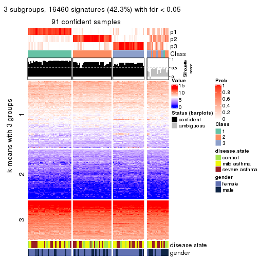</p>

</div>
<div id='tab-CV-pam-get-signatures-no-scale-3'>
<pre><code class="r">get_signatures(res, k = 4, scale_rows = FALSE)
</code></pre>

<p></p>

</div>
<div id='tab-CV-pam-get-signatures-no-scale-4'>
<pre><code class="r">get_signatures(res, k = 5, scale_rows = FALSE)
</code></pre>

<p></p>

</div>
<div id='tab-CV-pam-get-signatures-no-scale-5'>
<pre><code class="r">get_signatures(res, k = 6, scale_rows = FALSE)
</code></pre>

<p></p>

</div>
</div>


Compare the overlap of signatures from different k:

```r
compare_signatures(res)
```


`get_signature()` returns a data frame invisibly. TO get the list of signatures, the function
call should be assigned to a variable explicitly. In following code, if `plot` argument is set
to `FALSE`, no heatmap is plotted while only the differential analysis is performed.

```r
# code only for demonstration
tb = get_signature(res, k = ..., plot = FALSE)
```

An example of the output of `tb` is:

```
#>   which_row         fdr    mean_1    mean_2 scaled_mean_1 scaled_mean_2 km
#> 1        38 0.042760348  8.373488  9.131774    -0.5533452     0.5164555  1
#> 2        40 0.018707592  7.106213  8.469186    -0.6173731     0.5762149  1
#> 3        55 0.019134737 10.221463 11.207825    -0.6159697     0.5749050  1
#> 4        59 0.006059896  5.921854  7.869574    -0.6899429     0.6439467  1
#> 5        60 0.018055526  8.928898 10.211722    -0.6204761     0.5791110  1
#> 6        98 0.009384629 15.714769 14.887706     0.6635654    -0.6193277  2
...
```

The columns in `tb` are:

1. `which_row`: row indices corresponding to the input matrix.
2. `fdr`: FDR for the differential test. 
3. `mean_x`: The mean value in group x.
4. `scaled_mean_x`: The mean value in group x after rows are scaled.
5. `km`: Row groups if k-means clustering is applied to rows.


UMAP plot which shows how samples are separated.


<script>
$( function() {
	$( '#tabs-CV-pam-dimension-reduction' ).tabs();
} );
</script>
<div id='tabs-CV-pam-dimension-reduction'>
<ul>
<li><a href='#tab-CV-pam-dimension-reduction-1'>k = 2</a></li>
<li><a href='#tab-CV-pam-dimension-reduction-2'>k = 3</a></li>
<li><a href='#tab-CV-pam-dimension-reduction-3'>k = 4</a></li>
<li><a href='#tab-CV-pam-dimension-reduction-4'>k = 5</a></li>
<li><a href='#tab-CV-pam-dimension-reduction-5'>k = 6</a></li>
</ul>
<div id='tab-CV-pam-dimension-reduction-1'>
<pre><code class="r">dimension_reduction(res, k = 2, method = &quot;UMAP&quot;)
</code></pre>

<p></p>

</div>
<div id='tab-CV-pam-dimension-reduction-2'>
<pre><code class="r">dimension_reduction(res, k = 3, method = &quot;UMAP&quot;)
</code></pre>

<p></p>

</div>
<div id='tab-CV-pam-dimension-reduction-3'>
<pre><code class="r">dimension_reduction(res, k = 4, method = &quot;UMAP&quot;)
</code></pre>

<p></p>

</div>
<div id='tab-CV-pam-dimension-reduction-4'>
<pre><code class="r">dimension_reduction(res, k = 5, method = &quot;UMAP&quot;)
</code></pre>

<p></p>

</div>
<div id='tab-CV-pam-dimension-reduction-5'>
<pre><code class="r">dimension_reduction(res, k = 6, method = &quot;UMAP&quot;)
</code></pre>

<p></p>

</div>
</div>


Following heatmap shows how subgroups are split when increasing `k`:

```r
collect_classes(res)
```


Test correlation between subgroups and known annotations. If the known
annotation is numeric, one-way ANOVA test is applied, and if the known
annotation is discrete, chi-squared contingency table test is applied.

```r
test_to_known_factors(res)
```

```
#>         n disease.state(p) gender(p) k
#> CV:pam 93          0.42806     1.000 2
#> CV:pam 91          0.19282     0.528 3
#> CV:pam 60          0.01864     0.333 4
#> CV:pam 92          0.04909     0.410 5
#> CV:pam 70          0.00349     0.261 6
```


If matrix rows can be associated to genes, consider to use `GO_Enrichment(res,
...)` to perform function enrichment for the signature genes.


 

---------------------------------------------------


### CV:mclust**


The object with results only for a single top-value method and a single partition method 
can be extracted as:

```r
res = res_list["CV", "mclust"]
# you can also extract it by
# res = res_list["CV:mclust"]
```

A summary of `res` and all the functions that can be applied to it:

```r
res
```

```
#> A 'ConsensusPartition' object with k = 2, 3, 4, 5, 6.
#>   On a matrix with 38950 rows and 108 columns.
#>   Top rows (1000, 2000, 3000, 4000, 5000) are extracted by 'CV' method.
#>   Subgroups are detected by 'mclust' method.
#>   Performed in total 1250 partitions by row resampling.
#>   Best k for subgroups seems to be 2.
#> 
#> Following methods can be applied to this 'ConsensusPartition' object:
#>  [1] "cola_report"             "collect_classes"         "collect_plots"          
#>  [4] "collect_stats"           "colnames"                "compare_signatures"     
#>  [7] "consensus_heatmap"       "dimension_reduction"     "functional_enrichment"  
#> [10] "get_anno_col"            "get_anno"                "get_classes"            
#> [13] "get_consensus"           "get_matrix"              "get_membership"         
#> [16] "get_param"               "get_signatures"          "get_stats"              
#> [19] "is_best_k"               "is_stable_k"             "membership_heatmap"     
#> [22] "ncol"                    "nrow"                    "plot_ecdf"              
#> [25] "rownames"                "select_partition_number" "show"                   
#> [28] "suggest_best_k"          "test_to_known_factors"
```

`collect_plots()` function collects all the plots made from `res` for all `k` (number of partitions)
into one single page to provide an easy and fast comparison between different `k`.

```r
collect_plots(res)
```


The plots are:

- The first row: a plot of the ECDF (Empirical cumulative distribution
  function) curves of the consensus matrix for each `k` and the heatmap of
  predicted classes for each `k`.
- The second row: heatmaps of the consensus matrix for each `k`.
- The third row: heatmaps of the membership matrix for each `k`.
- The fouth row: heatmaps of the signatures for each `k`.

All the plots in panels can be made by individual functions and they are
plotted later in this section.

`select_partition_number()` produces several plots showing different
statistics for choosing "optimized" `k`. There are following statistics:

- ECDF curves of the consensus matrix for each `k`;
- 1-PAC. [The PAC
  score](https://en.wikipedia.org/wiki/Consensus_clustering#Over-interpretation_potential_of_consensus_clustering)
  measures the proportion of the ambiguous subgrouping.
- Mean silhouette score.
- Concordance. The mean probability of fiting the consensus class ids in all
  partitions.
- Area increased. Denote $A_k$ as the area under the ECDF curve for current
  `k`, the area increased is defined as $A_k - A_{k-1}$.
- Rand index. The percent of pairs of samples that are both in a same cluster
  or both are not in a same cluster in the partition of k and k-1.
- Jaccard index. The ratio of pairs of samples are both in a same cluster in
  the partition of k and k-1 and the pairs of samples are both in a same
  cluster in the partition k or k-1.

The detailed explanations of these statistics can be found in [the cola
vignette](http://bioconductor.org/packages/devel/bioc/vignettes/cola/inst/doc/cola.html#toc_13).

Generally speaking, lower PAC score, higher mean silhouette score or higher
concordance corresponds to better partition. Rand index and Jaccard index
measure how similar the current partition is compared to partition with `k-1`.
If they are too similar, we won't accept `k` is better than `k-1`.

```r
select_partition_number(res)
```

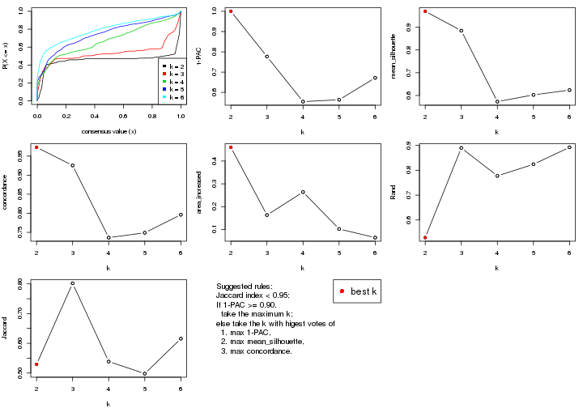

The numeric values for all these statistics can be obtained by `get_stats()`.

```r
get_stats(res)
```

```
#>   k 1-PAC mean_silhouette concordance area_increased  Rand Jaccard
#> 2 2 1.000           0.970       0.973         0.4600 0.529   0.529
#> 3 3 0.777           0.885       0.925         0.1633 0.890   0.802
#> 4 4 0.554           0.573       0.736         0.2639 0.777   0.539
#> 5 5 0.564           0.603       0.749         0.1021 0.824   0.498
#> 6 6 0.672           0.624       0.796         0.0644 0.892   0.616
```

`suggest_best_k()` suggests the best $k$ based on these statistics. The rules are as follows:

- All $k$ with Jaccard index larger than 0.95 are removed because the increase of
  the partition number does not provides enough extra information. If all $k$ are removed,
  the best $k$ is assigned by `NA`.
- For $k$ with 1-PAC larger than 0.9, the maximal $k$ is taken as the "best k". Other $k$ is called "optional k".
- If it does not fit the second rule. The $k$ with the highest vote of highest
  1-PAC, mean silhouette and concordance is taken as the "best k".

```r
suggest_best_k(res)
```

```
#> [1] 2
```


Following shows the table of the partitions (You need to click the **show/hide
code output** link to see it). The membership matrix (columns with name `p*`)
is inferred by
[`clue::cl_consensus()`](https://www.rdocumentation.org/link/cl_consensus?package=clue)
function with the `SE` method. Basically the value in the membership matrix
represents the probability to belong to a certain group. The finall class
label for an item is determined with the group with highest probability it
belongs to.

In `get_classes()` function, the entropy is calculated from the membership
matrix and the silhouette score is calculated from the consensus matrix.


<script>
$( function() {
	$( '#tabs-CV-mclust-get-classes' ).tabs();
} );
</script>
<div id='tabs-CV-mclust-get-classes'>
<ul>
<li><a href='#tab-CV-mclust-get-classes-1'>k = 2</a></li>
<li><a href='#tab-CV-mclust-get-classes-2'>k = 3</a></li>
<li><a href='#tab-CV-mclust-get-classes-3'>k = 4</a></li>
<li><a href='#tab-CV-mclust-get-classes-4'>k = 5</a></li>
<li><a href='#tab-CV-mclust-get-classes-5'>k = 6</a></li>
</ul>

<div id='tab-CV-mclust-get-classes-1'>
<p><a id='tab-CV-mclust-get-classes-1-a' style='color:#0366d6' href='#'>show/hide code output</a></p>
<pre><code class="r">cbind(get_classes(res, k = 2), get_membership(res, k = 2))
</code></pre>

<pre><code>#&gt;            class entropy silhouette    p1    p2
#&gt; GSM1068478     1  0.1843      0.985 0.972 0.028
#&gt; GSM1068479     1  0.0672      0.975 0.992 0.008
#&gt; GSM1068481     1  0.0000      0.973 1.000 0.000
#&gt; GSM1068482     1  0.0000      0.973 1.000 0.000
#&gt; GSM1068483     1  0.1843      0.985 0.972 0.028
#&gt; GSM1068486     1  0.0000      0.973 1.000 0.000
#&gt; GSM1068487     2  0.0000      0.971 0.000 1.000
#&gt; GSM1068488     1  0.2236      0.985 0.964 0.036
#&gt; GSM1068490     2  0.0000      0.971 0.000 1.000
#&gt; GSM1068491     1  0.0672      0.975 0.992 0.008
#&gt; GSM1068492     1  0.2948      0.943 0.948 0.052
#&gt; GSM1068493     1  0.2236      0.985 0.964 0.036
#&gt; GSM1068494     1  0.1843      0.985 0.972 0.028
#&gt; GSM1068495     1  0.2236      0.985 0.964 0.036
#&gt; GSM1068496     1  0.1633      0.985 0.976 0.024
#&gt; GSM1068498     1  0.2043      0.985 0.968 0.032
#&gt; GSM1068499     1  0.1633      0.985 0.976 0.024
#&gt; GSM1068500     1  0.1843      0.985 0.972 0.028
#&gt; GSM1068502     1  0.0672      0.975 0.992 0.008
#&gt; GSM1068503     2  0.0938      0.976 0.012 0.988
#&gt; GSM1068505     2  0.0938      0.976 0.012 0.988
#&gt; GSM1068506     2  0.0938      0.976 0.012 0.988
#&gt; GSM1068507     2  0.1414      0.972 0.020 0.980
#&gt; GSM1068508     2  0.1184      0.974 0.016 0.984
#&gt; GSM1068510     2  0.0938      0.976 0.012 0.988
#&gt; GSM1068512     1  0.2236      0.985 0.964 0.036
#&gt; GSM1068513     2  0.0938      0.976 0.012 0.988
#&gt; GSM1068514     1  0.0672      0.975 0.992 0.008
#&gt; GSM1068517     1  0.2236      0.985 0.964 0.036
#&gt; GSM1068518     1  0.2236      0.985 0.964 0.036
#&gt; GSM1068520     1  0.1843      0.985 0.972 0.028
#&gt; GSM1068521     1  0.1843      0.985 0.972 0.028
#&gt; GSM1068522     2  0.0938      0.976 0.012 0.988
#&gt; GSM1068524     2  0.0938      0.976 0.012 0.988
#&gt; GSM1068527     2  0.0938      0.976 0.012 0.988
#&gt; GSM1068480     1  0.0000      0.973 1.000 0.000
#&gt; GSM1068484     2  0.0938      0.976 0.012 0.988
#&gt; GSM1068485     1  0.0000      0.973 1.000 0.000
#&gt; GSM1068489     2  0.0938      0.976 0.012 0.988
#&gt; GSM1068497     1  0.2043      0.985 0.968 0.032
#&gt; GSM1068501     2  0.0938      0.976 0.012 0.988
#&gt; GSM1068504     2  0.0000      0.971 0.000 1.000
#&gt; GSM1068509     1  0.2043      0.985 0.968 0.032
#&gt; GSM1068511     1  0.1633      0.985 0.976 0.024
#&gt; GSM1068515     1  0.2236      0.985 0.964 0.036
#&gt; GSM1068516     1  0.2236      0.985 0.964 0.036
#&gt; GSM1068519     1  0.1843      0.985 0.972 0.028
#&gt; GSM1068523     2  0.0000      0.971 0.000 1.000
#&gt; GSM1068525     2  0.1843      0.966 0.028 0.972
#&gt; GSM1068526     2  0.0938      0.976 0.012 0.988
#&gt; GSM1068458     1  0.1843      0.985 0.972 0.028
#&gt; GSM1068459     1  0.0000      0.973 1.000 0.000
#&gt; GSM1068460     1  0.2236      0.985 0.964 0.036
#&gt; GSM1068461     1  0.0000      0.973 1.000 0.000
#&gt; GSM1068464     2  0.8713      0.590 0.292 0.708
#&gt; GSM1068468     1  0.2236      0.985 0.964 0.036
#&gt; GSM1068472     1  0.2236      0.985 0.964 0.036
#&gt; GSM1068473     2  0.0000      0.971 0.000 1.000
#&gt; GSM1068474     2  0.0000      0.971 0.000 1.000
#&gt; GSM1068476     1  0.0672      0.975 0.992 0.008
#&gt; GSM1068477     1  0.2236      0.985 0.964 0.036
#&gt; GSM1068462     1  0.2236      0.985 0.964 0.036
#&gt; GSM1068463     1  0.0000      0.973 1.000 0.000
#&gt; GSM1068465     1  0.2236      0.985 0.964 0.036
#&gt; GSM1068466     1  0.1843      0.985 0.972 0.028
#&gt; GSM1068467     1  0.2236      0.985 0.964 0.036
#&gt; GSM1068469     1  0.2236      0.985 0.964 0.036
#&gt; GSM1068470     2  0.0000      0.971 0.000 1.000
#&gt; GSM1068471     2  0.5059      0.877 0.112 0.888
#&gt; GSM1068475     2  0.0000      0.971 0.000 1.000
#&gt; GSM1068528     1  0.0376      0.975 0.996 0.004
#&gt; GSM1068531     1  0.1843      0.985 0.972 0.028
#&gt; GSM1068532     1  0.1843      0.985 0.972 0.028
#&gt; GSM1068533     1  0.1843      0.985 0.972 0.028
#&gt; GSM1068535     1  0.2236      0.985 0.964 0.036
#&gt; GSM1068537     1  0.1843      0.985 0.972 0.028
#&gt; GSM1068538     1  0.1843      0.985 0.972 0.028
#&gt; GSM1068539     1  0.2236      0.985 0.964 0.036
#&gt; GSM1068540     1  0.1843      0.985 0.972 0.028
#&gt; GSM1068542     2  0.0938      0.976 0.012 0.988
#&gt; GSM1068543     2  0.3114      0.942 0.056 0.944
#&gt; GSM1068544     1  0.0000      0.973 1.000 0.000
#&gt; GSM1068545     2  0.0938      0.976 0.012 0.988
#&gt; GSM1068546     1  0.0000      0.973 1.000 0.000
#&gt; GSM1068547     1  0.1843      0.985 0.972 0.028
#&gt; GSM1068548     2  0.1843      0.966 0.028 0.972
#&gt; GSM1068549     1  0.0000      0.973 1.000 0.000
#&gt; GSM1068550     2  0.0938      0.976 0.012 0.988
#&gt; GSM1068551     2  0.0000      0.971 0.000 1.000
#&gt; GSM1068552     2  0.0938      0.976 0.012 0.988
#&gt; GSM1068555     2  0.6887      0.780 0.184 0.816
#&gt; GSM1068556     2  0.4815      0.894 0.104 0.896
#&gt; GSM1068557     1  0.2236      0.985 0.964 0.036
#&gt; GSM1068560     2  0.0938      0.976 0.012 0.988
#&gt; GSM1068561     1  0.2236      0.985 0.964 0.036
#&gt; GSM1068562     2  0.0938      0.976 0.012 0.988
#&gt; GSM1068563     1  0.6887      0.806 0.816 0.184
#&gt; GSM1068565     2  0.0000      0.971 0.000 1.000
#&gt; GSM1068529     1  0.2043      0.985 0.968 0.032
#&gt; GSM1068530     1  0.1843      0.985 0.972 0.028
#&gt; GSM1068534     1  0.2236      0.985 0.964 0.036
#&gt; GSM1068536     1  0.2236      0.985 0.964 0.036
#&gt; GSM1068541     1  0.2236      0.985 0.964 0.036
#&gt; GSM1068553     2  0.1414      0.972 0.020 0.980
#&gt; GSM1068554     2  0.0938      0.976 0.012 0.988
#&gt; GSM1068558     1  0.0672      0.975 0.992 0.008
#&gt; GSM1068559     1  0.1633      0.983 0.976 0.024
#&gt; GSM1068564     2  0.0938      0.976 0.012 0.988
</code></pre>

<script>
$('#tab-CV-mclust-get-classes-1-a').parent().next().next().hide();
$('#tab-CV-mclust-get-classes-1-a').click(function(){
  $('#tab-CV-mclust-get-classes-1-a').parent().next().next().toggle();
  return(false);
});
</script>
</div>

<div id='tab-CV-mclust-get-classes-2'>
<p><a id='tab-CV-mclust-get-classes-2-a' style='color:#0366d6' href='#'>show/hide code output</a></p>
<pre><code class="r">cbind(get_classes(res, k = 3), get_membership(res, k = 3))
</code></pre>

<pre><code>#&gt;            class entropy silhouette    p1    p2    p3
#&gt; GSM1068478     3  0.0747      0.945 0.016 0.000 0.984
#&gt; GSM1068479     3  0.3610      0.914 0.096 0.016 0.888
#&gt; GSM1068481     3  0.3192      0.914 0.112 0.000 0.888
#&gt; GSM1068482     3  0.2959      0.915 0.100 0.000 0.900
#&gt; GSM1068483     3  0.0747      0.945 0.016 0.000 0.984
#&gt; GSM1068486     3  0.2959      0.915 0.100 0.000 0.900
#&gt; GSM1068487     1  0.3966      0.936 0.876 0.100 0.024
#&gt; GSM1068488     3  0.1774      0.939 0.016 0.024 0.960
#&gt; GSM1068490     1  0.4335      0.926 0.864 0.100 0.036
#&gt; GSM1068491     3  0.3610      0.914 0.096 0.016 0.888
#&gt; GSM1068492     3  0.4174      0.904 0.092 0.036 0.872
#&gt; GSM1068493     3  0.0237      0.945 0.004 0.000 0.996
#&gt; GSM1068494     3  0.0829      0.944 0.012 0.004 0.984
#&gt; GSM1068495     3  0.0829      0.944 0.012 0.004 0.984
#&gt; GSM1068496     3  0.2625      0.926 0.084 0.000 0.916
#&gt; GSM1068498     3  0.0747      0.945 0.016 0.000 0.984
#&gt; GSM1068499     3  0.1411      0.940 0.036 0.000 0.964
#&gt; GSM1068500     3  0.1031      0.944 0.024 0.000 0.976
#&gt; GSM1068502     3  0.3610      0.914 0.096 0.016 0.888
#&gt; GSM1068503     2  0.5728      0.641 0.196 0.772 0.032
#&gt; GSM1068505     2  0.0000      0.892 0.000 1.000 0.000
#&gt; GSM1068506     2  0.0000      0.892 0.000 1.000 0.000
#&gt; GSM1068507     2  0.0983      0.887 0.004 0.980 0.016
#&gt; GSM1068508     2  0.2955      0.817 0.008 0.912 0.080
#&gt; GSM1068510     2  0.5815      0.476 0.004 0.692 0.304
#&gt; GSM1068512     3  0.2845      0.909 0.012 0.068 0.920
#&gt; GSM1068513     2  0.2056      0.870 0.024 0.952 0.024
#&gt; GSM1068514     3  0.3415      0.924 0.080 0.020 0.900
#&gt; GSM1068517     3  0.0829      0.945 0.012 0.004 0.984
#&gt; GSM1068518     3  0.1015      0.944 0.012 0.008 0.980
#&gt; GSM1068520     3  0.1031      0.944 0.024 0.000 0.976
#&gt; GSM1068521     3  0.1267      0.944 0.024 0.004 0.972
#&gt; GSM1068522     2  0.0237      0.892 0.004 0.996 0.000
#&gt; GSM1068524     1  0.8743      0.171 0.452 0.440 0.108
#&gt; GSM1068527     2  0.0000      0.892 0.000 1.000 0.000
#&gt; GSM1068480     3  0.2959      0.915 0.100 0.000 0.900
#&gt; GSM1068484     2  0.0983      0.887 0.004 0.980 0.016
#&gt; GSM1068485     3  0.3192      0.914 0.112 0.000 0.888
#&gt; GSM1068489     2  0.0000      0.892 0.000 1.000 0.000
#&gt; GSM1068497     3  0.0747      0.945 0.016 0.000 0.984
#&gt; GSM1068501     2  0.0000      0.892 0.000 1.000 0.000
#&gt; GSM1068504     1  0.3966      0.936 0.876 0.100 0.024
#&gt; GSM1068509     3  0.0592      0.944 0.012 0.000 0.988
#&gt; GSM1068511     3  0.0983      0.945 0.016 0.004 0.980
#&gt; GSM1068515     3  0.0237      0.945 0.000 0.004 0.996
#&gt; GSM1068516     3  0.0983      0.943 0.016 0.004 0.980
#&gt; GSM1068519     3  0.0983      0.944 0.016 0.004 0.980
#&gt; GSM1068523     1  0.3966      0.936 0.876 0.100 0.024
#&gt; GSM1068525     2  0.5988      0.476 0.008 0.688 0.304
#&gt; GSM1068526     2  0.0983      0.887 0.004 0.980 0.016
#&gt; GSM1068458     3  0.1267      0.944 0.024 0.004 0.972
#&gt; GSM1068459     3  0.3192      0.914 0.112 0.000 0.888
#&gt; GSM1068460     3  0.1337      0.942 0.012 0.016 0.972
#&gt; GSM1068461     3  0.2959      0.915 0.100 0.000 0.900
#&gt; GSM1068464     1  0.4786      0.849 0.844 0.044 0.112
#&gt; GSM1068468     3  0.0475      0.944 0.004 0.004 0.992
#&gt; GSM1068472     3  0.0237      0.945 0.000 0.004 0.996
#&gt; GSM1068473     1  0.3966      0.936 0.876 0.100 0.024
#&gt; GSM1068474     1  0.3966      0.936 0.876 0.100 0.024
#&gt; GSM1068476     3  0.3610      0.914 0.096 0.016 0.888
#&gt; GSM1068477     3  0.6228      0.345 0.372 0.004 0.624
#&gt; GSM1068462     3  0.0661      0.944 0.008 0.004 0.988
#&gt; GSM1068463     3  0.3192      0.914 0.112 0.000 0.888
#&gt; GSM1068465     3  0.1015      0.944 0.012 0.008 0.980
#&gt; GSM1068466     3  0.1031      0.944 0.024 0.000 0.976
#&gt; GSM1068467     3  0.0475      0.944 0.004 0.004 0.992
#&gt; GSM1068469     3  0.0475      0.945 0.004 0.004 0.992
#&gt; GSM1068470     1  0.3966      0.936 0.876 0.100 0.024
#&gt; GSM1068471     1  0.4179      0.893 0.876 0.052 0.072
#&gt; GSM1068475     1  0.3966      0.936 0.876 0.100 0.024
#&gt; GSM1068528     3  0.2711      0.925 0.088 0.000 0.912
#&gt; GSM1068531     3  0.1267      0.944 0.024 0.004 0.972
#&gt; GSM1068532     3  0.1267      0.944 0.024 0.004 0.972
#&gt; GSM1068533     3  0.1267      0.944 0.024 0.004 0.972
#&gt; GSM1068535     3  0.1015      0.944 0.012 0.008 0.980
#&gt; GSM1068537     3  0.1267      0.944 0.024 0.004 0.972
#&gt; GSM1068538     3  0.1267      0.944 0.024 0.004 0.972
#&gt; GSM1068539     3  0.2031      0.932 0.016 0.032 0.952
#&gt; GSM1068540     3  0.1267      0.944 0.024 0.004 0.972
#&gt; GSM1068542     2  0.0000      0.892 0.000 1.000 0.000
#&gt; GSM1068543     3  0.6421      0.250 0.004 0.424 0.572
#&gt; GSM1068544     3  0.3192      0.914 0.112 0.000 0.888
#&gt; GSM1068545     2  0.0237      0.892 0.004 0.996 0.000
#&gt; GSM1068546     3  0.2959      0.915 0.100 0.000 0.900
#&gt; GSM1068547     3  0.1267      0.944 0.024 0.004 0.972
#&gt; GSM1068548     2  0.0000      0.892 0.000 1.000 0.000
#&gt; GSM1068549     3  0.2959      0.915 0.100 0.000 0.900
#&gt; GSM1068550     2  0.0000      0.892 0.000 1.000 0.000
#&gt; GSM1068551     1  0.3966      0.936 0.876 0.100 0.024
#&gt; GSM1068552     2  0.0237      0.892 0.004 0.996 0.000
#&gt; GSM1068555     1  0.4121      0.882 0.876 0.040 0.084
#&gt; GSM1068556     2  0.6345      0.325 0.004 0.596 0.400
#&gt; GSM1068557     3  0.0475      0.944 0.004 0.004 0.992
#&gt; GSM1068560     2  0.0000      0.892 0.000 1.000 0.000
#&gt; GSM1068561     3  0.0237      0.945 0.000 0.004 0.996
#&gt; GSM1068562     2  0.0983      0.887 0.004 0.980 0.016
#&gt; GSM1068563     2  0.2866      0.825 0.008 0.916 0.076
#&gt; GSM1068565     1  0.3966      0.936 0.876 0.100 0.024
#&gt; GSM1068529     3  0.1765      0.942 0.040 0.004 0.956
#&gt; GSM1068530     3  0.1267      0.944 0.024 0.004 0.972
#&gt; GSM1068534     3  0.1015      0.944 0.012 0.008 0.980
#&gt; GSM1068536     3  0.0829      0.944 0.012 0.004 0.984
#&gt; GSM1068541     3  0.1015      0.944 0.012 0.008 0.980
#&gt; GSM1068553     3  0.5058      0.705 0.000 0.244 0.756
#&gt; GSM1068554     2  0.1765      0.867 0.004 0.956 0.040
#&gt; GSM1068558     3  0.3610      0.914 0.096 0.016 0.888
#&gt; GSM1068559     3  0.3530      0.922 0.068 0.032 0.900
#&gt; GSM1068564     2  0.0237      0.892 0.004 0.996 0.000
</code></pre>

<script>
$('#tab-CV-mclust-get-classes-2-a').parent().next().next().hide();
$('#tab-CV-mclust-get-classes-2-a').click(function(){
  $('#tab-CV-mclust-get-classes-2-a').parent().next().next().toggle();
  return(false);
});
</script>
</div>

<div id='tab-CV-mclust-get-classes-3'>
<p><a id='tab-CV-mclust-get-classes-3-a' style='color:#0366d6' href='#'>show/hide code output</a></p>
<pre><code class="r">cbind(get_classes(res, k = 4), get_membership(res, k = 4))
</code></pre>

<pre><code>#&gt;            class entropy silhouette    p1    p2    p3    p4
#&gt; GSM1068478     1  0.4647      0.556 0.704 0.008 0.288 0.000
#&gt; GSM1068479     3  0.3056      0.353 0.000 0.040 0.888 0.072
#&gt; GSM1068481     1  0.5256      0.449 0.596 0.012 0.392 0.000
#&gt; GSM1068482     1  0.5511      0.293 0.500 0.016 0.484 0.000
#&gt; GSM1068483     1  0.4356      0.562 0.708 0.000 0.292 0.000
#&gt; GSM1068486     3  0.5395      0.299 0.184 0.084 0.732 0.000
#&gt; GSM1068487     2  0.2081      0.957 0.000 0.916 0.000 0.084
#&gt; GSM1068488     3  0.6726      0.333 0.124 0.000 0.584 0.292
#&gt; GSM1068490     2  0.2266      0.956 0.004 0.912 0.000 0.084
#&gt; GSM1068491     3  0.2943      0.349 0.000 0.076 0.892 0.032
#&gt; GSM1068492     3  0.3659      0.338 0.000 0.024 0.840 0.136
#&gt; GSM1068493     3  0.5960      0.378 0.420 0.016 0.548 0.016
#&gt; GSM1068494     1  0.5256      0.336 0.596 0.012 0.392 0.000
#&gt; GSM1068495     3  0.6066      0.388 0.424 0.016 0.540 0.020
#&gt; GSM1068496     1  0.4406      0.561 0.700 0.000 0.300 0.000
#&gt; GSM1068498     1  0.5596      0.471 0.632 0.036 0.332 0.000
#&gt; GSM1068499     1  0.4522      0.559 0.680 0.000 0.320 0.000
#&gt; GSM1068500     1  0.4164      0.582 0.736 0.000 0.264 0.000
#&gt; GSM1068502     3  0.3398      0.354 0.000 0.060 0.872 0.068
#&gt; GSM1068503     4  0.4590      0.774 0.000 0.148 0.060 0.792
#&gt; GSM1068505     4  0.0000      0.920 0.000 0.000 0.000 1.000
#&gt; GSM1068506     4  0.0000      0.920 0.000 0.000 0.000 1.000
#&gt; GSM1068507     4  0.1305      0.909 0.036 0.000 0.004 0.960
#&gt; GSM1068508     4  0.2497      0.888 0.020 0.016 0.040 0.924
#&gt; GSM1068510     4  0.3399      0.846 0.000 0.040 0.092 0.868
#&gt; GSM1068512     3  0.7109      0.292 0.144 0.000 0.520 0.336
#&gt; GSM1068513     4  0.1722      0.908 0.000 0.048 0.008 0.944
#&gt; GSM1068514     3  0.5255      0.382 0.064 0.036 0.788 0.112
#&gt; GSM1068517     1  0.6176      0.335 0.572 0.060 0.368 0.000
#&gt; GSM1068518     3  0.6326      0.425 0.376 0.000 0.556 0.068
#&gt; GSM1068520     1  0.3907      0.587 0.768 0.000 0.232 0.000
#&gt; GSM1068521     1  0.4277      0.562 0.720 0.000 0.280 0.000
#&gt; GSM1068522     4  0.1209      0.915 0.000 0.032 0.004 0.964
#&gt; GSM1068524     2  0.7156      0.217 0.000 0.476 0.136 0.388
#&gt; GSM1068527     4  0.0000      0.920 0.000 0.000 0.000 1.000
#&gt; GSM1068480     3  0.6425     -0.239 0.424 0.068 0.508 0.000
#&gt; GSM1068484     4  0.1305      0.914 0.000 0.036 0.004 0.960
#&gt; GSM1068485     3  0.5781     -0.316 0.484 0.028 0.488 0.000
#&gt; GSM1068489     4  0.0000      0.920 0.000 0.000 0.000 1.000
#&gt; GSM1068497     1  0.5677      0.466 0.628 0.040 0.332 0.000
#&gt; GSM1068501     4  0.0921      0.917 0.000 0.028 0.000 0.972
#&gt; GSM1068504     2  0.2197      0.958 0.000 0.916 0.004 0.080
#&gt; GSM1068509     3  0.5570      0.363 0.440 0.000 0.540 0.020
#&gt; GSM1068511     3  0.5746      0.015 0.444 0.020 0.532 0.004
#&gt; GSM1068515     3  0.6185      0.396 0.404 0.032 0.552 0.012
#&gt; GSM1068516     3  0.6404      0.424 0.388 0.004 0.548 0.060
#&gt; GSM1068519     1  0.4957      0.470 0.684 0.000 0.300 0.016
#&gt; GSM1068523     2  0.2197      0.958 0.000 0.916 0.004 0.080
#&gt; GSM1068525     4  0.5874      0.664 0.024 0.060 0.196 0.720
#&gt; GSM1068526     4  0.1305      0.914 0.000 0.036 0.004 0.960
#&gt; GSM1068458     1  0.4222      0.550 0.728 0.000 0.272 0.000
#&gt; GSM1068459     1  0.5407      0.297 0.504 0.012 0.484 0.000
#&gt; GSM1068460     3  0.6262      0.413 0.400 0.000 0.540 0.060
#&gt; GSM1068461     3  0.6400     -0.217 0.408 0.068 0.524 0.000
#&gt; GSM1068464     2  0.2528      0.950 0.008 0.908 0.004 0.080
#&gt; GSM1068468     3  0.6409      0.407 0.364 0.076 0.560 0.000
#&gt; GSM1068472     3  0.6286      0.396 0.384 0.064 0.552 0.000
#&gt; GSM1068473     2  0.2081      0.957 0.000 0.916 0.000 0.084
#&gt; GSM1068474     2  0.2081      0.957 0.000 0.916 0.000 0.084
#&gt; GSM1068476     3  0.2965      0.349 0.000 0.072 0.892 0.036
#&gt; GSM1068477     3  0.8068      0.245 0.236 0.312 0.440 0.012
#&gt; GSM1068462     3  0.6454      0.411 0.344 0.084 0.572 0.000
#&gt; GSM1068463     1  0.5402      0.318 0.516 0.012 0.472 0.000
#&gt; GSM1068465     3  0.6066      0.388 0.424 0.016 0.540 0.020
#&gt; GSM1068466     1  0.3764      0.586 0.784 0.000 0.216 0.000
#&gt; GSM1068467     3  0.6386      0.399 0.376 0.072 0.552 0.000
#&gt; GSM1068469     1  0.6121      0.388 0.588 0.060 0.352 0.000
#&gt; GSM1068470     2  0.2197      0.958 0.000 0.916 0.004 0.080
#&gt; GSM1068471     2  0.2197      0.958 0.000 0.916 0.004 0.080
#&gt; GSM1068475     2  0.2197      0.958 0.000 0.916 0.004 0.080
#&gt; GSM1068528     1  0.4500      0.548 0.684 0.000 0.316 0.000
#&gt; GSM1068531     1  0.0469      0.538 0.988 0.000 0.012 0.000
#&gt; GSM1068532     1  0.0707      0.542 0.980 0.000 0.020 0.000
#&gt; GSM1068533     1  0.0469      0.538 0.988 0.000 0.012 0.000
#&gt; GSM1068535     3  0.6337      0.413 0.380 0.000 0.552 0.068
#&gt; GSM1068537     1  0.0469      0.538 0.988 0.000 0.012 0.000
#&gt; GSM1068538     1  0.0469      0.538 0.988 0.000 0.012 0.000
#&gt; GSM1068539     3  0.6625      0.427 0.388 0.016 0.544 0.052
#&gt; GSM1068540     1  0.0469      0.538 0.988 0.000 0.012 0.000
#&gt; GSM1068542     4  0.0000      0.920 0.000 0.000 0.000 1.000
#&gt; GSM1068543     4  0.4094      0.794 0.056 0.000 0.116 0.828
#&gt; GSM1068544     1  0.5231      0.461 0.604 0.012 0.384 0.000
#&gt; GSM1068545     4  0.0188      0.921 0.000 0.000 0.004 0.996
#&gt; GSM1068546     3  0.6537     -0.241 0.424 0.076 0.500 0.000
#&gt; GSM1068547     1  0.5186      0.360 0.640 0.000 0.344 0.016
#&gt; GSM1068548     4  0.0895      0.916 0.020 0.000 0.004 0.976
#&gt; GSM1068549     3  0.4297      0.329 0.096 0.084 0.820 0.000
#&gt; GSM1068550     4  0.0000      0.920 0.000 0.000 0.000 1.000
#&gt; GSM1068551     2  0.2081      0.957 0.000 0.916 0.000 0.084
#&gt; GSM1068552     4  0.0188      0.921 0.000 0.000 0.004 0.996
#&gt; GSM1068555     2  0.2706      0.944 0.000 0.900 0.020 0.080
#&gt; GSM1068556     4  0.3090      0.856 0.056 0.000 0.056 0.888
#&gt; GSM1068557     3  0.6554      0.416 0.376 0.056 0.556 0.012
#&gt; GSM1068560     4  0.0000      0.920 0.000 0.000 0.000 1.000
#&gt; GSM1068561     3  0.6525      0.421 0.388 0.024 0.552 0.036
#&gt; GSM1068562     4  0.1471      0.918 0.012 0.024 0.004 0.960
#&gt; GSM1068563     4  0.3547      0.812 0.072 0.000 0.064 0.864
#&gt; GSM1068565     2  0.2081      0.957 0.000 0.916 0.000 0.084
#&gt; GSM1068529     3  0.6505      0.428 0.360 0.012 0.572 0.056
#&gt; GSM1068530     1  0.0469      0.538 0.988 0.000 0.012 0.000
#&gt; GSM1068534     3  0.6212      0.418 0.380 0.000 0.560 0.060
#&gt; GSM1068536     3  0.5888      0.389 0.424 0.000 0.540 0.036
#&gt; GSM1068541     3  0.6120      0.383 0.416 0.040 0.540 0.004
#&gt; GSM1068553     4  0.4459      0.697 0.032 0.000 0.188 0.780
#&gt; GSM1068554     4  0.1584      0.914 0.000 0.036 0.012 0.952
#&gt; GSM1068558     3  0.2515      0.337 0.004 0.072 0.912 0.012
#&gt; GSM1068559     3  0.6205      0.375 0.096 0.016 0.696 0.192
#&gt; GSM1068564     4  0.0188      0.921 0.000 0.000 0.004 0.996
</code></pre>

<script>
$('#tab-CV-mclust-get-classes-3-a').parent().next().next().hide();
$('#tab-CV-mclust-get-classes-3-a').click(function(){
  $('#tab-CV-mclust-get-classes-3-a').parent().next().next().toggle();
  return(false);
});
</script>
</div>

<div id='tab-CV-mclust-get-classes-4'>
<p><a id='tab-CV-mclust-get-classes-4-a' style='color:#0366d6' href='#'>show/hide code output</a></p>
<pre><code class="r">cbind(get_classes(res, k = 5), get_membership(res, k = 5))
</code></pre>

<pre><code>#&gt;            class entropy silhouette    p1    p2    p3    p4    p5
#&gt; GSM1068478     5  0.6414   -0.00103 0.400 0.016 0.112 0.000 0.472
#&gt; GSM1068479     5  0.6822    0.03430 0.028 0.040 0.384 0.052 0.496
#&gt; GSM1068481     3  0.3081    0.76210 0.056 0.004 0.868 0.000 0.072
#&gt; GSM1068482     3  0.2842    0.76858 0.044 0.012 0.888 0.000 0.056
#&gt; GSM1068483     1  0.6868    0.31122 0.428 0.008 0.228 0.000 0.336
#&gt; GSM1068486     3  0.5326    0.24270 0.012 0.028 0.496 0.000 0.464
#&gt; GSM1068487     2  0.1410    0.95937 0.000 0.940 0.000 0.060 0.000
#&gt; GSM1068488     4  0.5456    0.11185 0.000 0.000 0.060 0.484 0.456
#&gt; GSM1068490     2  0.1478    0.95609 0.000 0.936 0.000 0.064 0.000
#&gt; GSM1068491     5  0.6660    0.02085 0.028 0.044 0.396 0.036 0.496
#&gt; GSM1068492     5  0.6918    0.04147 0.028 0.036 0.384 0.064 0.488
#&gt; GSM1068493     5  0.4428    0.62822 0.072 0.044 0.016 0.052 0.816
#&gt; GSM1068494     5  0.6685    0.15700 0.280 0.000 0.284 0.000 0.436
#&gt; GSM1068495     5  0.5154    0.62748 0.068 0.084 0.012 0.068 0.768
#&gt; GSM1068496     1  0.6037   -0.00764 0.456 0.004 0.440 0.000 0.100
#&gt; GSM1068498     5  0.5888    0.53017 0.072 0.128 0.108 0.000 0.692
#&gt; GSM1068499     5  0.6469    0.31898 0.252 0.004 0.220 0.000 0.524
#&gt; GSM1068500     1  0.6798    0.33965 0.436 0.004 0.252 0.000 0.308
#&gt; GSM1068502     5  0.6822    0.03430 0.028 0.040 0.384 0.052 0.496
#&gt; GSM1068503     4  0.5951    0.61727 0.000 0.208 0.020 0.640 0.132
#&gt; GSM1068505     4  0.0000    0.86463 0.000 0.000 0.000 1.000 0.000
#&gt; GSM1068506     4  0.0000    0.86463 0.000 0.000 0.000 1.000 0.000
#&gt; GSM1068507     4  0.2338    0.84794 0.000 0.004 0.000 0.884 0.112
#&gt; GSM1068508     4  0.3646    0.80901 0.000 0.036 0.004 0.816 0.144
#&gt; GSM1068510     4  0.3674    0.81050 0.004 0.008 0.020 0.816 0.152
#&gt; GSM1068512     4  0.4735    0.20162 0.000 0.000 0.016 0.524 0.460
#&gt; GSM1068513     4  0.2919    0.84786 0.000 0.024 0.004 0.868 0.104
#&gt; GSM1068514     5  0.7513    0.14339 0.016 0.028 0.376 0.180 0.400
#&gt; GSM1068517     5  0.5421    0.56021 0.056 0.140 0.080 0.000 0.724
#&gt; GSM1068518     5  0.3387    0.57835 0.004 0.000 0.004 0.196 0.796
#&gt; GSM1068520     5  0.5527    0.00608 0.472 0.012 0.040 0.000 0.476
#&gt; GSM1068521     5  0.5187    0.04709 0.460 0.004 0.032 0.000 0.504
#&gt; GSM1068522     4  0.1168    0.86724 0.000 0.008 0.000 0.960 0.032
#&gt; GSM1068524     2  0.6506    0.39717 0.004 0.568 0.020 0.272 0.136
#&gt; GSM1068527     4  0.0000    0.86463 0.000 0.000 0.000 1.000 0.000
#&gt; GSM1068480     3  0.2331    0.76504 0.024 0.004 0.908 0.000 0.064
#&gt; GSM1068484     4  0.0798    0.86704 0.000 0.008 0.000 0.976 0.016
#&gt; GSM1068485     3  0.2820    0.76712 0.056 0.004 0.884 0.000 0.056
#&gt; GSM1068489     4  0.0000    0.86463 0.000 0.000 0.000 1.000 0.000
#&gt; GSM1068497     5  0.5836    0.53178 0.060 0.140 0.108 0.000 0.692
#&gt; GSM1068501     4  0.0290    0.86315 0.000 0.008 0.000 0.992 0.000
#&gt; GSM1068504     2  0.1410    0.95937 0.000 0.940 0.000 0.060 0.000
#&gt; GSM1068509     5  0.4004    0.58002 0.164 0.000 0.012 0.032 0.792
#&gt; GSM1068511     3  0.6744    0.33162 0.164 0.020 0.500 0.000 0.316
#&gt; GSM1068515     5  0.4199    0.62793 0.036 0.100 0.012 0.032 0.820
#&gt; GSM1068516     5  0.3132    0.59230 0.008 0.000 0.000 0.172 0.820
#&gt; GSM1068519     5  0.5330    0.04059 0.480 0.012 0.028 0.000 0.480
#&gt; GSM1068523     2  0.1410    0.95937 0.000 0.940 0.000 0.060 0.000
#&gt; GSM1068525     4  0.4944    0.67677 0.004 0.020 0.032 0.708 0.236
#&gt; GSM1068526     4  0.0290    0.86315 0.000 0.008 0.000 0.992 0.000
#&gt; GSM1068458     5  0.5166    0.10291 0.436 0.004 0.032 0.000 0.528
#&gt; GSM1068459     3  0.2954    0.76509 0.064 0.004 0.876 0.000 0.056
#&gt; GSM1068460     5  0.4993    0.59830 0.060 0.012 0.012 0.176 0.740
#&gt; GSM1068461     3  0.3031    0.74100 0.020 0.004 0.856 0.000 0.120
#&gt; GSM1068464     2  0.1809    0.94743 0.000 0.928 0.000 0.060 0.012
#&gt; GSM1068468     5  0.3538    0.61782 0.000 0.128 0.012 0.028 0.832
#&gt; GSM1068472     5  0.3919    0.61975 0.008 0.128 0.016 0.028 0.820
#&gt; GSM1068473     2  0.1410    0.95937 0.000 0.940 0.000 0.060 0.000
#&gt; GSM1068474     2  0.1410    0.95937 0.000 0.940 0.000 0.060 0.000
#&gt; GSM1068476     5  0.6660    0.02085 0.028 0.044 0.396 0.036 0.496
#&gt; GSM1068477     5  0.5782    0.51467 0.020 0.284 0.020 0.040 0.636
#&gt; GSM1068462     5  0.3992    0.61413 0.000 0.128 0.032 0.028 0.812
#&gt; GSM1068463     3  0.2954    0.76509 0.064 0.004 0.876 0.000 0.056
#&gt; GSM1068465     5  0.5213    0.62582 0.072 0.084 0.012 0.068 0.764
#&gt; GSM1068466     5  0.5787    0.00105 0.456 0.016 0.052 0.000 0.476
#&gt; GSM1068467     5  0.3695    0.61936 0.004 0.128 0.012 0.028 0.828
#&gt; GSM1068469     5  0.5255    0.55959 0.044 0.128 0.092 0.000 0.736
#&gt; GSM1068470     2  0.1410    0.95937 0.000 0.940 0.000 0.060 0.000
#&gt; GSM1068471     2  0.1410    0.95937 0.000 0.940 0.000 0.060 0.000
#&gt; GSM1068475     2  0.1410    0.95937 0.000 0.940 0.000 0.060 0.000
#&gt; GSM1068528     3  0.5905   -0.01291 0.420 0.004 0.488 0.000 0.088
#&gt; GSM1068531     1  0.1041    0.78238 0.964 0.004 0.000 0.000 0.032
#&gt; GSM1068532     1  0.1041    0.78195 0.964 0.000 0.004 0.000 0.032
#&gt; GSM1068533     1  0.1121    0.78069 0.956 0.000 0.000 0.000 0.044
#&gt; GSM1068535     5  0.7221    0.32623 0.048 0.004 0.260 0.172 0.516
#&gt; GSM1068537     1  0.1041    0.78195 0.964 0.000 0.004 0.000 0.032
#&gt; GSM1068538     1  0.1041    0.78195 0.964 0.000 0.004 0.000 0.032
#&gt; GSM1068539     5  0.4352    0.61563 0.036 0.040 0.000 0.132 0.792
#&gt; GSM1068540     1  0.1281    0.77913 0.956 0.012 0.000 0.000 0.032
#&gt; GSM1068542     4  0.0000    0.86463 0.000 0.000 0.000 1.000 0.000
#&gt; GSM1068543     4  0.3608    0.80353 0.000 0.000 0.040 0.812 0.148
#&gt; GSM1068544     3  0.3743    0.72109 0.096 0.004 0.824 0.000 0.076
#&gt; GSM1068545     4  0.2230    0.84500 0.000 0.000 0.000 0.884 0.116
#&gt; GSM1068546     3  0.3146    0.76263 0.040 0.028 0.876 0.000 0.056
#&gt; GSM1068547     5  0.5175    0.08954 0.464 0.012 0.020 0.000 0.504
#&gt; GSM1068548     4  0.0162    0.86485 0.000 0.000 0.000 0.996 0.004
#&gt; GSM1068549     3  0.5083    0.32976 0.004 0.028 0.540 0.000 0.428
#&gt; GSM1068550     4  0.0000    0.86463 0.000 0.000 0.000 1.000 0.000
#&gt; GSM1068551     2  0.1410    0.95937 0.000 0.940 0.000 0.060 0.000
#&gt; GSM1068552     4  0.0000    0.86463 0.000 0.000 0.000 1.000 0.000
#&gt; GSM1068555     2  0.2278    0.92400 0.000 0.908 0.000 0.060 0.032
#&gt; GSM1068556     4  0.2886    0.82298 0.000 0.000 0.008 0.844 0.148
#&gt; GSM1068557     5  0.3926    0.61988 0.000 0.112 0.020 0.048 0.820
#&gt; GSM1068560     4  0.0000    0.86463 0.000 0.000 0.000 1.000 0.000
#&gt; GSM1068561     5  0.3670    0.62562 0.004 0.088 0.004 0.068 0.836
#&gt; GSM1068562     4  0.0992    0.86731 0.000 0.008 0.000 0.968 0.024
#&gt; GSM1068563     4  0.1544    0.85798 0.000 0.000 0.000 0.932 0.068
#&gt; GSM1068565     2  0.1410    0.95937 0.000 0.940 0.000 0.060 0.000
#&gt; GSM1068529     5  0.5316    0.50714 0.000 0.004 0.152 0.156 0.688
#&gt; GSM1068530     1  0.1492    0.77961 0.948 0.004 0.008 0.000 0.040
#&gt; GSM1068534     5  0.5258    0.54792 0.012 0.000 0.124 0.156 0.708
#&gt; GSM1068536     5  0.4787    0.58613 0.148 0.012 0.012 0.064 0.764
#&gt; GSM1068541     5  0.5107    0.62176 0.064 0.116 0.012 0.044 0.764
#&gt; GSM1068553     4  0.3274    0.73623 0.000 0.000 0.000 0.780 0.220
#&gt; GSM1068554     4  0.2563    0.84305 0.000 0.008 0.000 0.872 0.120
#&gt; GSM1068558     5  0.5631   -0.10553 0.008 0.044 0.456 0.004 0.488
#&gt; GSM1068559     5  0.7374    0.21233 0.008 0.016 0.280 0.292 0.404
#&gt; GSM1068564     4  0.0510    0.86779 0.000 0.000 0.000 0.984 0.016
</code></pre>

<script>
$('#tab-CV-mclust-get-classes-4-a').parent().next().next().hide();
$('#tab-CV-mclust-get-classes-4-a').click(function(){
  $('#tab-CV-mclust-get-classes-4-a').parent().next().next().toggle();
  return(false);
});
</script>
</div>

<div id='tab-CV-mclust-get-classes-5'>
<p><a id='tab-CV-mclust-get-classes-5-a' style='color:#0366d6' href='#'>show/hide code output</a></p>
<pre><code class="r">cbind(get_classes(res, k = 6), get_membership(res, k = 6))
</code></pre>

<pre><code>#&gt;            class entropy silhouette    p1    p2    p3    p4    p5    p6
#&gt; GSM1068478     5  0.5091     0.2001 0.364 0.000 0.076 0.000 0.556 0.004
#&gt; GSM1068479     6  0.4212     0.8147 0.000 0.024 0.056 0.016 0.116 0.788
#&gt; GSM1068481     3  0.0146     0.8901 0.004 0.000 0.996 0.000 0.000 0.000
#&gt; GSM1068482     3  0.1151     0.8822 0.000 0.000 0.956 0.000 0.012 0.032
#&gt; GSM1068483     1  0.5992     0.2724 0.420 0.000 0.240 0.000 0.340 0.000
#&gt; GSM1068486     3  0.6213     0.0139 0.008 0.000 0.432 0.000 0.296 0.264
#&gt; GSM1068487     2  0.0508     0.8855 0.000 0.984 0.000 0.012 0.000 0.004
#&gt; GSM1068488     4  0.6148     0.2546 0.000 0.012 0.008 0.512 0.288 0.180
#&gt; GSM1068490     2  0.0363     0.8865 0.000 0.988 0.000 0.012 0.000 0.000
#&gt; GSM1068491     6  0.4122     0.8132 0.000 0.024 0.056 0.012 0.116 0.792
#&gt; GSM1068492     6  0.4376     0.8118 0.000 0.024 0.056 0.024 0.116 0.780
#&gt; GSM1068493     5  0.1887     0.6509 0.028 0.004 0.024 0.008 0.932 0.004
#&gt; GSM1068494     1  0.6122     0.1089 0.484 0.000 0.104 0.024 0.376 0.012
#&gt; GSM1068495     5  0.1180     0.6536 0.012 0.012 0.000 0.016 0.960 0.000
#&gt; GSM1068496     1  0.4578     0.4999 0.624 0.000 0.320 0.000 0.056 0.000
#&gt; GSM1068498     5  0.5388     0.4814 0.088 0.016 0.044 0.000 0.692 0.160
#&gt; GSM1068499     5  0.5418     0.1161 0.368 0.000 0.124 0.000 0.508 0.000
#&gt; GSM1068500     1  0.5993     0.3656 0.440 0.000 0.272 0.000 0.288 0.000
#&gt; GSM1068502     6  0.4212     0.8147 0.000 0.024 0.056 0.016 0.116 0.788
#&gt; GSM1068503     2  0.6570     0.0224 0.000 0.468 0.012 0.360 0.064 0.096
#&gt; GSM1068505     4  0.0146     0.8361 0.000 0.000 0.000 0.996 0.004 0.000
#&gt; GSM1068506     4  0.0260     0.8355 0.000 0.000 0.000 0.992 0.008 0.000
#&gt; GSM1068507     4  0.3045     0.7820 0.000 0.000 0.000 0.840 0.060 0.100
#&gt; GSM1068508     4  0.5274     0.5822 0.000 0.220 0.000 0.660 0.060 0.060
#&gt; GSM1068510     4  0.3449     0.7616 0.000 0.000 0.000 0.808 0.076 0.116
#&gt; GSM1068512     4  0.5971     0.2886 0.004 0.004 0.012 0.528 0.316 0.136
#&gt; GSM1068513     4  0.4543     0.7232 0.000 0.112 0.000 0.756 0.056 0.076
#&gt; GSM1068514     6  0.5816     0.7209 0.000 0.024 0.056 0.132 0.120 0.668
#&gt; GSM1068517     5  0.4958     0.5431 0.024 0.048 0.040 0.000 0.728 0.160
#&gt; GSM1068518     5  0.5590     0.2452 0.000 0.000 0.028 0.320 0.564 0.088
#&gt; GSM1068520     5  0.4528     0.0838 0.428 0.000 0.020 0.000 0.544 0.008
#&gt; GSM1068521     5  0.4046     0.2474 0.368 0.000 0.004 0.000 0.620 0.008
#&gt; GSM1068522     4  0.1780     0.8304 0.000 0.028 0.000 0.932 0.028 0.012
#&gt; GSM1068524     2  0.4752     0.6030 0.000 0.756 0.012 0.068 0.060 0.104
#&gt; GSM1068527     4  0.0000     0.8357 0.000 0.000 0.000 1.000 0.000 0.000
#&gt; GSM1068480     3  0.1500     0.8762 0.000 0.000 0.936 0.000 0.012 0.052
#&gt; GSM1068484     4  0.1074     0.8372 0.000 0.000 0.000 0.960 0.028 0.012
#&gt; GSM1068485     3  0.0146     0.8901 0.004 0.000 0.996 0.000 0.000 0.000
#&gt; GSM1068489     4  0.0146     0.8361 0.000 0.000 0.000 0.996 0.004 0.000
#&gt; GSM1068497     5  0.5388     0.4814 0.088 0.016 0.044 0.000 0.692 0.160
#&gt; GSM1068501     4  0.0260     0.8355 0.000 0.000 0.000 0.992 0.008 0.000
#&gt; GSM1068504     2  0.0508     0.8855 0.000 0.984 0.000 0.012 0.000 0.004
#&gt; GSM1068509     5  0.2507     0.6329 0.072 0.000 0.004 0.004 0.888 0.032
#&gt; GSM1068511     5  0.6540     0.0963 0.156 0.000 0.372 0.004 0.428 0.040
#&gt; GSM1068515     5  0.1621     0.6547 0.012 0.008 0.020 0.016 0.944 0.000
#&gt; GSM1068516     5  0.4959     0.4160 0.000 0.000 0.020 0.224 0.672 0.084
#&gt; GSM1068519     1  0.4294     0.2627 0.592 0.000 0.008 0.012 0.388 0.000
#&gt; GSM1068523     2  0.0291     0.8884 0.000 0.992 0.000 0.004 0.000 0.004
#&gt; GSM1068525     4  0.6201     0.4864 0.000 0.072 0.016 0.600 0.088 0.224
#&gt; GSM1068526     4  0.0146     0.8371 0.000 0.000 0.000 0.996 0.004 0.000
#&gt; GSM1068458     5  0.4009     0.2698 0.356 0.000 0.004 0.000 0.632 0.008
#&gt; GSM1068459     3  0.0291     0.8901 0.004 0.000 0.992 0.000 0.000 0.004
#&gt; GSM1068460     5  0.3073     0.5277 0.008 0.000 0.000 0.204 0.788 0.000
#&gt; GSM1068461     3  0.2531     0.8139 0.000 0.000 0.856 0.000 0.012 0.132
#&gt; GSM1068464     2  0.0405     0.8867 0.000 0.988 0.000 0.004 0.000 0.008
#&gt; GSM1068468     5  0.5006     0.4093 0.000 0.292 0.032 0.000 0.632 0.044
#&gt; GSM1068472     5  0.1977     0.6502 0.000 0.040 0.032 0.000 0.920 0.008
#&gt; GSM1068473     2  0.0508     0.8855 0.000 0.984 0.000 0.012 0.000 0.004
#&gt; GSM1068474     2  0.0146     0.8881 0.000 0.996 0.000 0.004 0.000 0.000
#&gt; GSM1068476     6  0.4122     0.8132 0.000 0.024 0.056 0.012 0.116 0.792
#&gt; GSM1068477     2  0.5260     0.1036 0.000 0.516 0.000 0.008 0.400 0.076
#&gt; GSM1068462     5  0.5977     0.1949 0.000 0.360 0.032 0.000 0.496 0.112
#&gt; GSM1068463     3  0.0146     0.8901 0.004 0.000 0.996 0.000 0.000 0.000
#&gt; GSM1068465     5  0.1508     0.6545 0.016 0.012 0.000 0.020 0.948 0.004
#&gt; GSM1068466     5  0.4751     0.0223 0.448 0.000 0.032 0.000 0.512 0.008
#&gt; GSM1068467     5  0.4327     0.5024 0.000 0.240 0.032 0.000 0.708 0.020
#&gt; GSM1068469     5  0.6202     0.5154 0.024 0.144 0.092 0.000 0.636 0.104
#&gt; GSM1068470     2  0.0146     0.8863 0.000 0.996 0.000 0.000 0.000 0.004
#&gt; GSM1068471     2  0.0000     0.8867 0.000 1.000 0.000 0.000 0.000 0.000
#&gt; GSM1068475     2  0.0146     0.8863 0.000 0.996 0.000 0.000 0.000 0.004
#&gt; GSM1068528     1  0.4581     0.3018 0.516 0.000 0.448 0.000 0.036 0.000
#&gt; GSM1068531     1  0.0146     0.7087 0.996 0.000 0.000 0.000 0.004 0.000
#&gt; GSM1068532     1  0.0363     0.7054 0.988 0.000 0.012 0.000 0.000 0.000
#&gt; GSM1068533     1  0.0146     0.7087 0.996 0.000 0.000 0.000 0.004 0.000
#&gt; GSM1068535     4  0.6138     0.1930 0.016 0.000 0.020 0.480 0.380 0.104
#&gt; GSM1068537     1  0.0363     0.7054 0.988 0.000 0.012 0.000 0.000 0.000
#&gt; GSM1068538     1  0.0363     0.7054 0.988 0.000 0.012 0.000 0.000 0.000
#&gt; GSM1068539     5  0.2218     0.6245 0.000 0.012 0.000 0.104 0.884 0.000
#&gt; GSM1068540     1  0.0146     0.7087 0.996 0.000 0.000 0.000 0.004 0.000
#&gt; GSM1068542     4  0.0000     0.8357 0.000 0.000 0.000 1.000 0.000 0.000
#&gt; GSM1068543     4  0.3630     0.7646 0.000 0.000 0.020 0.816 0.064 0.100
#&gt; GSM1068544     3  0.0146     0.8901 0.004 0.000 0.996 0.000 0.000 0.000
#&gt; GSM1068545     4  0.3510     0.7723 0.000 0.096 0.000 0.828 0.044 0.032
#&gt; GSM1068546     3  0.1930     0.8683 0.012 0.000 0.924 0.000 0.028 0.036
#&gt; GSM1068547     1  0.3828     0.1776 0.560 0.000 0.000 0.000 0.440 0.000
#&gt; GSM1068548     4  0.0000     0.8357 0.000 0.000 0.000 1.000 0.000 0.000
#&gt; GSM1068549     6  0.6259     0.0557 0.008 0.000 0.332 0.000 0.260 0.400
#&gt; GSM1068550     4  0.0146     0.8354 0.000 0.000 0.000 0.996 0.004 0.000
#&gt; GSM1068551     2  0.0146     0.8881 0.000 0.996 0.000 0.004 0.000 0.000
#&gt; GSM1068552     4  0.0405     0.8371 0.000 0.000 0.000 0.988 0.004 0.008
#&gt; GSM1068555     2  0.0458     0.8835 0.000 0.984 0.000 0.000 0.000 0.016
#&gt; GSM1068556     4  0.3297     0.7772 0.000 0.000 0.008 0.832 0.060 0.100
#&gt; GSM1068557     5  0.3911     0.6011 0.000 0.032 0.032 0.024 0.816 0.096
#&gt; GSM1068560     4  0.0000     0.8357 0.000 0.000 0.000 1.000 0.000 0.000
#&gt; GSM1068561     5  0.3388     0.6220 0.004 0.012 0.024 0.032 0.852 0.076
#&gt; GSM1068562     4  0.0993     0.8369 0.000 0.000 0.000 0.964 0.024 0.012
#&gt; GSM1068563     4  0.1511     0.8331 0.000 0.004 0.000 0.940 0.044 0.012
#&gt; GSM1068565     2  0.0291     0.8884 0.000 0.992 0.000 0.004 0.000 0.004
#&gt; GSM1068529     5  0.5364     0.4774 0.000 0.008 0.048 0.128 0.692 0.124
#&gt; GSM1068530     1  0.0260     0.7089 0.992 0.000 0.000 0.000 0.008 0.000
#&gt; GSM1068534     5  0.5783     0.3030 0.000 0.000 0.032 0.256 0.584 0.128
#&gt; GSM1068536     5  0.1812     0.6261 0.080 0.000 0.000 0.008 0.912 0.000
#&gt; GSM1068541     5  0.1180     0.6536 0.012 0.012 0.000 0.016 0.960 0.000
#&gt; GSM1068553     4  0.3372     0.7615 0.000 0.000 0.000 0.816 0.084 0.100
#&gt; GSM1068554     4  0.3045     0.7840 0.000 0.000 0.000 0.840 0.060 0.100
#&gt; GSM1068558     6  0.4304     0.7701 0.000 0.024 0.092 0.004 0.108 0.772
#&gt; GSM1068559     6  0.6857     0.1890 0.000 0.024 0.052 0.376 0.120 0.428
#&gt; GSM1068564     4  0.1218     0.8372 0.000 0.004 0.000 0.956 0.028 0.012
</code></pre>

<script>
$('#tab-CV-mclust-get-classes-5-a').parent().next().next().hide();
$('#tab-CV-mclust-get-classes-5-a').click(function(){
  $('#tab-CV-mclust-get-classes-5-a').parent().next().next().toggle();
  return(false);
});
</script>
</div>
</div>

Heatmaps for the consensus matrix. It visualizes the probability of two
samples to be in a same group.


<script>
$( function() {
	$( '#tabs-CV-mclust-consensus-heatmap' ).tabs();
} );
</script>
<div id='tabs-CV-mclust-consensus-heatmap'>
<ul>
<li><a href='#tab-CV-mclust-consensus-heatmap-1'>k = 2</a></li>
<li><a href='#tab-CV-mclust-consensus-heatmap-2'>k = 3</a></li>
<li><a href='#tab-CV-mclust-consensus-heatmap-3'>k = 4</a></li>
<li><a href='#tab-CV-mclust-consensus-heatmap-4'>k = 5</a></li>
<li><a href='#tab-CV-mclust-consensus-heatmap-5'>k = 6</a></li>
</ul>
<div id='tab-CV-mclust-consensus-heatmap-1'>
<pre><code class="r">consensus_heatmap(res, k = 2)
</code></pre>

<p></p>

</div>
<div id='tab-CV-mclust-consensus-heatmap-2'>
<pre><code class="r">consensus_heatmap(res, k = 3)
</code></pre>

<p></p>

</div>
<div id='tab-CV-mclust-consensus-heatmap-3'>
<pre><code class="r">consensus_heatmap(res, k = 4)
</code></pre>

<p></p>

</div>
<div id='tab-CV-mclust-consensus-heatmap-4'>
<pre><code class="r">consensus_heatmap(res, k = 5)
</code></pre>

<p></p>

</div>
<div id='tab-CV-mclust-consensus-heatmap-5'>
<pre><code class="r">consensus_heatmap(res, k = 6)
</code></pre>

<p></p>

</div>
</div>

Heatmaps for the membership of samples in all partitions to see how consistent they are:


<script>
$( function() {
	$( '#tabs-CV-mclust-membership-heatmap' ).tabs();
} );
</script>
<div id='tabs-CV-mclust-membership-heatmap'>
<ul>
<li><a href='#tab-CV-mclust-membership-heatmap-1'>k = 2</a></li>
<li><a href='#tab-CV-mclust-membership-heatmap-2'>k = 3</a></li>
<li><a href='#tab-CV-mclust-membership-heatmap-3'>k = 4</a></li>
<li><a href='#tab-CV-mclust-membership-heatmap-4'>k = 5</a></li>
<li><a href='#tab-CV-mclust-membership-heatmap-5'>k = 6</a></li>
</ul>
<div id='tab-CV-mclust-membership-heatmap-1'>
<pre><code class="r">membership_heatmap(res, k = 2)
</code></pre>

<p></p>

</div>
<div id='tab-CV-mclust-membership-heatmap-2'>
<pre><code class="r">membership_heatmap(res, k = 3)
</code></pre>

<p></p>

</div>
<div id='tab-CV-mclust-membership-heatmap-3'>
<pre><code class="r">membership_heatmap(res, k = 4)
</code></pre>

<p></p>

</div>
<div id='tab-CV-mclust-membership-heatmap-4'>
<pre><code class="r">membership_heatmap(res, k = 5)
</code></pre>

<p></p>

</div>
<div id='tab-CV-mclust-membership-heatmap-5'>
<pre><code class="r">membership_heatmap(res, k = 6)
</code></pre>

<p></p>

</div>
</div>

As soon as we have had the classes for columns, we can look for signatures
which are significantly different between classes which can be candidate marks
for certain classes. Following are the heatmaps for signatures.


Signature heatmaps where rows are scaled:


<script>
$( function() {
	$( '#tabs-CV-mclust-get-signatures' ).tabs();
} );
</script>
<div id='tabs-CV-mclust-get-signatures'>
<ul>
<li><a href='#tab-CV-mclust-get-signatures-1'>k = 2</a></li>
<li><a href='#tab-CV-mclust-get-signatures-2'>k = 3</a></li>
<li><a href='#tab-CV-mclust-get-signatures-3'>k = 4</a></li>
<li><a href='#tab-CV-mclust-get-signatures-4'>k = 5</a></li>
<li><a href='#tab-CV-mclust-get-signatures-5'>k = 6</a></li>
</ul>
<div id='tab-CV-mclust-get-signatures-1'>
<pre><code class="r">get_signatures(res, k = 2)
</code></pre>

<p></p>

</div>
<div id='tab-CV-mclust-get-signatures-2'>
<pre><code class="r">get_signatures(res, k = 3)
</code></pre>

<p></p>

</div>
<div id='tab-CV-mclust-get-signatures-3'>
<pre><code class="r">get_signatures(res, k = 4)
</code></pre>

<p></p>

</div>
<div id='tab-CV-mclust-get-signatures-4'>
<pre><code class="r">get_signatures(res, k = 5)
</code></pre>

<p></p>

</div>
<div id='tab-CV-mclust-get-signatures-5'>
<pre><code class="r">get_signatures(res, k = 6)
</code></pre>

<p></p>

</div>
</div>


Signature heatmaps where rows are not scaled:


<script>
$( function() {
	$( '#tabs-CV-mclust-get-signatures-no-scale' ).tabs();
} );
</script>
<div id='tabs-CV-mclust-get-signatures-no-scale'>
<ul>
<li><a href='#tab-CV-mclust-get-signatures-no-scale-1'>k = 2</a></li>
<li><a href='#tab-CV-mclust-get-signatures-no-scale-2'>k = 3</a></li>
<li><a href='#tab-CV-mclust-get-signatures-no-scale-3'>k = 4</a></li>
<li><a href='#tab-CV-mclust-get-signatures-no-scale-4'>k = 5</a></li>
<li><a href='#tab-CV-mclust-get-signatures-no-scale-5'>k = 6</a></li>
</ul>
<div id='tab-CV-mclust-get-signatures-no-scale-1'>
<pre><code class="r">get_signatures(res, k = 2, scale_rows = FALSE)
</code></pre>

<p></p>

</div>
<div id='tab-CV-mclust-get-signatures-no-scale-2'>
<pre><code class="r">get_signatures(res, k = 3, scale_rows = FALSE)
</code></pre>

<p></p>

</div>
<div id='tab-CV-mclust-get-signatures-no-scale-3'>
<pre><code class="r">get_signatures(res, k = 4, scale_rows = FALSE)
</code></pre>

<p></p>

</div>
<div id='tab-CV-mclust-get-signatures-no-scale-4'>
<pre><code class="r">get_signatures(res, k = 5, scale_rows = FALSE)
</code></pre>

<p></p>

</div>
<div id='tab-CV-mclust-get-signatures-no-scale-5'>
<pre><code class="r">get_signatures(res, k = 6, scale_rows = FALSE)
</code></pre>

<p></p>

</div>
</div>


Compare the overlap of signatures from different k:

```r
compare_signatures(res)
```


`get_signature()` returns a data frame invisibly. TO get the list of signatures, the function
call should be assigned to a variable explicitly. In following code, if `plot` argument is set
to `FALSE`, no heatmap is plotted while only the differential analysis is performed.

```r
# code only for demonstration
tb = get_signature(res, k = ..., plot = FALSE)
```

An example of the output of `tb` is:

```
#>   which_row         fdr    mean_1    mean_2 scaled_mean_1 scaled_mean_2 km
#> 1        38 0.042760348  8.373488  9.131774    -0.5533452     0.5164555  1
#> 2        40 0.018707592  7.106213  8.469186    -0.6173731     0.5762149  1
#> 3        55 0.019134737 10.221463 11.207825    -0.6159697     0.5749050  1
#> 4        59 0.006059896  5.921854  7.869574    -0.6899429     0.6439467  1
#> 5        60 0.018055526  8.928898 10.211722    -0.6204761     0.5791110  1
#> 6        98 0.009384629 15.714769 14.887706     0.6635654    -0.6193277  2
...
```

The columns in `tb` are:

1. `which_row`: row indices corresponding to the input matrix.
2. `fdr`: FDR for the differential test. 
3. `mean_x`: The mean value in group x.
4. `scaled_mean_x`: The mean value in group x after rows are scaled.
5. `km`: Row groups if k-means clustering is applied to rows.


UMAP plot which shows how samples are separated.


<script>
$( function() {
	$( '#tabs-CV-mclust-dimension-reduction' ).tabs();
} );
</script>
<div id='tabs-CV-mclust-dimension-reduction'>
<ul>
<li><a href='#tab-CV-mclust-dimension-reduction-1'>k = 2</a></li>
<li><a href='#tab-CV-mclust-dimension-reduction-2'>k = 3</a></li>
<li><a href='#tab-CV-mclust-dimension-reduction-3'>k = 4</a></li>
<li><a href='#tab-CV-mclust-dimension-reduction-4'>k = 5</a></li>
<li><a href='#tab-CV-mclust-dimension-reduction-5'>k = 6</a></li>
</ul>
<div id='tab-CV-mclust-dimension-reduction-1'>
<pre><code class="r">dimension_reduction(res, k = 2, method = &quot;UMAP&quot;)
</code></pre>

<p></p>

</div>
<div id='tab-CV-mclust-dimension-reduction-2'>
<pre><code class="r">dimension_reduction(res, k = 3, method = &quot;UMAP&quot;)
</code></pre>

<p></p>

</div>
<div id='tab-CV-mclust-dimension-reduction-3'>
<pre><code class="r">dimension_reduction(res, k = 4, method = &quot;UMAP&quot;)
</code></pre>

<p></p>

</div>
<div id='tab-CV-mclust-dimension-reduction-4'>
<pre><code class="r">dimension_reduction(res, k = 5, method = &quot;UMAP&quot;)
</code></pre>

<p></p>

</div>
<div id='tab-CV-mclust-dimension-reduction-5'>
<pre><code class="r">dimension_reduction(res, k = 6, method = &quot;UMAP&quot;)
</code></pre>

<p></p>

</div>
</div>


Following heatmap shows how subgroups are split when increasing `k`:

```r
collect_classes(res)
```


Test correlation between subgroups and known annotations. If the known
annotation is numeric, one-way ANOVA test is applied, and if the known
annotation is discrete, chi-squared contingency table test is applied.

```r
test_to_known_factors(res)
```

```
#>             n disease.state(p) gender(p) k
#> CV:mclust 108         0.762869     1.000 2
#> CV:mclust 102         0.020389     0.783 3
#> CV:mclust  57         0.003318     0.223 4
#> CV:mclust  80         0.000833     0.406 5
#> CV:mclust  77         0.001699     0.577 6
```


If matrix rows can be associated to genes, consider to use `GO_Enrichment(res,
...)` to perform function enrichment for the signature genes.


 

---------------------------------------------------


### CV:NMF


The object with results only for a single top-value method and a single partition method 
can be extracted as:

```r
res = res_list["CV", "NMF"]
# you can also extract it by
# res = res_list["CV:NMF"]
```

A summary of `res` and all the functions that can be applied to it:

```r
res
```

```
#> A 'ConsensusPartition' object with k = 2, 3, 4, 5, 6.
#>   On a matrix with 38950 rows and 108 columns.
#>   Top rows (1000, 2000, 3000, 4000, 5000) are extracted by 'CV' method.
#>   Subgroups are detected by 'NMF' method.
#>   Performed in total 1250 partitions by row resampling.
#>   Best k for subgroups seems to be 2.
#> 
#> Following methods can be applied to this 'ConsensusPartition' object:
#>  [1] "cola_report"             "collect_classes"         "collect_plots"          
#>  [4] "collect_stats"           "colnames"                "compare_signatures"     
#>  [7] "consensus_heatmap"       "dimension_reduction"     "functional_enrichment"  
#> [10] "get_anno_col"            "get_anno"                "get_classes"            
#> [13] "get_consensus"           "get_matrix"              "get_membership"         
#> [16] "get_param"               "get_signatures"          "get_stats"              
#> [19] "is_best_k"               "is_stable_k"             "membership_heatmap"     
#> [22] "ncol"                    "nrow"                    "plot_ecdf"              
#> [25] "rownames"                "select_partition_number" "show"                   
#> [28] "suggest_best_k"          "test_to_known_factors"
```

`collect_plots()` function collects all the plots made from `res` for all `k` (number of partitions)
into one single page to provide an easy and fast comparison between different `k`.

```r
collect_plots(res)
```


The plots are:

- The first row: a plot of the ECDF (Empirical cumulative distribution
  function) curves of the consensus matrix for each `k` and the heatmap of
  predicted classes for each `k`.
- The second row: heatmaps of the consensus matrix for each `k`.
- The third row: heatmaps of the membership matrix for each `k`.
- The fouth row: heatmaps of the signatures for each `k`.

All the plots in panels can be made by individual functions and they are
plotted later in this section.

`select_partition_number()` produces several plots showing different
statistics for choosing "optimized" `k`. There are following statistics:

- ECDF curves of the consensus matrix for each `k`;
- 1-PAC. [The PAC
  score](https://en.wikipedia.org/wiki/Consensus_clustering#Over-interpretation_potential_of_consensus_clustering)
  measures the proportion of the ambiguous subgrouping.
- Mean silhouette score.
- Concordance. The mean probability of fiting the consensus class ids in all
  partitions.
- Area increased. Denote $A_k$ as the area under the ECDF curve for current
  `k`, the area increased is defined as $A_k - A_{k-1}$.
- Rand index. The percent of pairs of samples that are both in a same cluster
  or both are not in a same cluster in the partition of k and k-1.
- Jaccard index. The ratio of pairs of samples are both in a same cluster in
  the partition of k and k-1 and the pairs of samples are both in a same
  cluster in the partition k or k-1.

The detailed explanations of these statistics can be found in [the cola
vignette](http://bioconductor.org/packages/devel/bioc/vignettes/cola/inst/doc/cola.html#toc_13).

Generally speaking, lower PAC score, higher mean silhouette score or higher
concordance corresponds to better partition. Rand index and Jaccard index
measure how similar the current partition is compared to partition with `k-1`.
If they are too similar, we won't accept `k` is better than `k-1`.

```r
select_partition_number(res)
```


The numeric values for all these statistics can be obtained by `get_stats()`.

```r
get_stats(res)
```

```
#>   k 1-PAC mean_silhouette concordance area_increased  Rand Jaccard
#> 2 2 0.850           0.916       0.963         0.4891 0.509   0.509
#> 3 3 0.516           0.563       0.758         0.3286 0.786   0.612
#> 4 4 0.659           0.771       0.861         0.1368 0.738   0.414
#> 5 5 0.661           0.649       0.812         0.0624 0.952   0.816
#> 6 6 0.684           0.608       0.790         0.0427 0.921   0.672
```

`suggest_best_k()` suggests the best $k$ based on these statistics. The rules are as follows:

- All $k$ with Jaccard index larger than 0.95 are removed because the increase of
  the partition number does not provides enough extra information. If all $k$ are removed,
  the best $k$ is assigned by `NA`.
- For $k$ with 1-PAC larger than 0.9, the maximal $k$ is taken as the "best k". Other $k$ is called "optional k".
- If it does not fit the second rule. The $k$ with the highest vote of highest
  1-PAC, mean silhouette and concordance is taken as the "best k".

```r
suggest_best_k(res)
```

```
#> [1] 2
```


Following shows the table of the partitions (You need to click the **show/hide
code output** link to see it). The membership matrix (columns with name `p*`)
is inferred by
[`clue::cl_consensus()`](https://www.rdocumentation.org/link/cl_consensus?package=clue)
function with the `SE` method. Basically the value in the membership matrix
represents the probability to belong to a certain group. The finall class
label for an item is determined with the group with highest probability it
belongs to.

In `get_classes()` function, the entropy is calculated from the membership
matrix and the silhouette score is calculated from the consensus matrix.


<script>
$( function() {
	$( '#tabs-CV-NMF-get-classes' ).tabs();
} );
</script>
<div id='tabs-CV-NMF-get-classes'>
<ul>
<li><a href='#tab-CV-NMF-get-classes-1'>k = 2</a></li>
<li><a href='#tab-CV-NMF-get-classes-2'>k = 3</a></li>
<li><a href='#tab-CV-NMF-get-classes-3'>k = 4</a></li>
<li><a href='#tab-CV-NMF-get-classes-4'>k = 5</a></li>
<li><a href='#tab-CV-NMF-get-classes-5'>k = 6</a></li>
</ul>

<div id='tab-CV-NMF-get-classes-1'>
<p><a id='tab-CV-NMF-get-classes-1-a' style='color:#0366d6' href='#'>show/hide code output</a></p>
<pre><code class="r">cbind(get_classes(res, k = 2), get_membership(res, k = 2))
</code></pre>

<pre><code>#&gt;            class entropy silhouette    p1    p2
#&gt; GSM1068478     1  0.0000      0.950 1.000 0.000
#&gt; GSM1068479     2  0.0000      0.968 0.000 1.000
#&gt; GSM1068481     1  0.0000      0.950 1.000 0.000
#&gt; GSM1068482     1  0.0000      0.950 1.000 0.000
#&gt; GSM1068483     1  0.0000      0.950 1.000 0.000
#&gt; GSM1068486     1  0.0000      0.950 1.000 0.000
#&gt; GSM1068487     2  0.0000      0.968 0.000 1.000
#&gt; GSM1068488     2  0.4815      0.871 0.104 0.896
#&gt; GSM1068490     2  0.0000      0.968 0.000 1.000
#&gt; GSM1068491     2  0.4562      0.880 0.096 0.904
#&gt; GSM1068492     2  0.0000      0.968 0.000 1.000
#&gt; GSM1068493     1  0.0000      0.950 1.000 0.000
#&gt; GSM1068494     1  0.0000      0.950 1.000 0.000
#&gt; GSM1068495     1  0.9209      0.534 0.664 0.336
#&gt; GSM1068496     1  0.0000      0.950 1.000 0.000
#&gt; GSM1068498     1  0.7056      0.772 0.808 0.192
#&gt; GSM1068499     1  0.0000      0.950 1.000 0.000
#&gt; GSM1068500     1  0.0000      0.950 1.000 0.000
#&gt; GSM1068502     2  0.0000      0.968 0.000 1.000
#&gt; GSM1068503     2  0.0000      0.968 0.000 1.000
#&gt; GSM1068505     2  0.0000      0.968 0.000 1.000
#&gt; GSM1068506     2  0.0000      0.968 0.000 1.000
#&gt; GSM1068507     2  0.0000      0.968 0.000 1.000
#&gt; GSM1068508     2  0.0000      0.968 0.000 1.000
#&gt; GSM1068510     2  0.0000      0.968 0.000 1.000
#&gt; GSM1068512     2  0.7674      0.713 0.224 0.776
#&gt; GSM1068513     2  0.0000      0.968 0.000 1.000
#&gt; GSM1068514     2  0.0000      0.968 0.000 1.000
#&gt; GSM1068517     2  0.3879      0.899 0.076 0.924
#&gt; GSM1068518     1  0.6048      0.817 0.852 0.148
#&gt; GSM1068520     1  0.0000      0.950 1.000 0.000
#&gt; GSM1068521     1  0.0000      0.950 1.000 0.000
#&gt; GSM1068522     2  0.0000      0.968 0.000 1.000
#&gt; GSM1068524     2  0.0000      0.968 0.000 1.000
#&gt; GSM1068527     2  0.0000      0.968 0.000 1.000
#&gt; GSM1068480     1  0.0000      0.950 1.000 0.000
#&gt; GSM1068484     2  0.0000      0.968 0.000 1.000
#&gt; GSM1068485     1  0.0000      0.950 1.000 0.000
#&gt; GSM1068489     2  0.0000      0.968 0.000 1.000
#&gt; GSM1068497     1  0.7056      0.772 0.808 0.192
#&gt; GSM1068501     2  0.0000      0.968 0.000 1.000
#&gt; GSM1068504     2  0.0000      0.968 0.000 1.000
#&gt; GSM1068509     1  0.0000      0.950 1.000 0.000
#&gt; GSM1068511     1  0.0000      0.950 1.000 0.000
#&gt; GSM1068515     1  0.6887      0.784 0.816 0.184
#&gt; GSM1068516     2  0.0938      0.959 0.012 0.988
#&gt; GSM1068519     1  0.0000      0.950 1.000 0.000
#&gt; GSM1068523     2  0.0000      0.968 0.000 1.000
#&gt; GSM1068525     2  0.0000      0.968 0.000 1.000
#&gt; GSM1068526     2  0.0000      0.968 0.000 1.000
#&gt; GSM1068458     1  0.0000      0.950 1.000 0.000
#&gt; GSM1068459     1  0.0000      0.950 1.000 0.000
#&gt; GSM1068460     2  0.9209      0.510 0.336 0.664
#&gt; GSM1068461     1  0.0000      0.950 1.000 0.000
#&gt; GSM1068464     2  0.0000      0.968 0.000 1.000
#&gt; GSM1068468     2  0.0000      0.968 0.000 1.000
#&gt; GSM1068472     1  0.9608      0.426 0.616 0.384
#&gt; GSM1068473     2  0.0000      0.968 0.000 1.000
#&gt; GSM1068474     2  0.0000      0.968 0.000 1.000
#&gt; GSM1068476     2  0.0000      0.968 0.000 1.000
#&gt; GSM1068477     2  0.0000      0.968 0.000 1.000
#&gt; GSM1068462     2  0.0000      0.968 0.000 1.000
#&gt; GSM1068463     1  0.0000      0.950 1.000 0.000
#&gt; GSM1068465     1  0.6148      0.819 0.848 0.152
#&gt; GSM1068466     1  0.0000      0.950 1.000 0.000
#&gt; GSM1068467     2  0.0000      0.968 0.000 1.000
#&gt; GSM1068469     2  0.9775      0.251 0.412 0.588
#&gt; GSM1068470     2  0.0000      0.968 0.000 1.000
#&gt; GSM1068471     2  0.0000      0.968 0.000 1.000
#&gt; GSM1068475     2  0.0000      0.968 0.000 1.000
#&gt; GSM1068528     1  0.0000      0.950 1.000 0.000
#&gt; GSM1068531     1  0.0000      0.950 1.000 0.000
#&gt; GSM1068532     1  0.0000      0.950 1.000 0.000
#&gt; GSM1068533     1  0.0000      0.950 1.000 0.000
#&gt; GSM1068535     1  0.0000      0.950 1.000 0.000
#&gt; GSM1068537     1  0.0000      0.950 1.000 0.000
#&gt; GSM1068538     1  0.0000      0.950 1.000 0.000
#&gt; GSM1068539     2  0.0000      0.968 0.000 1.000
#&gt; GSM1068540     1  0.0000      0.950 1.000 0.000
#&gt; GSM1068542     2  0.0000      0.968 0.000 1.000
#&gt; GSM1068543     2  0.0000      0.968 0.000 1.000
#&gt; GSM1068544     1  0.0000      0.950 1.000 0.000
#&gt; GSM1068545     2  0.0000      0.968 0.000 1.000
#&gt; GSM1068546     1  0.0000      0.950 1.000 0.000
#&gt; GSM1068547     1  0.0000      0.950 1.000 0.000
#&gt; GSM1068548     2  0.0000      0.968 0.000 1.000
#&gt; GSM1068549     1  0.0000      0.950 1.000 0.000
#&gt; GSM1068550     2  0.0000      0.968 0.000 1.000
#&gt; GSM1068551     2  0.0000      0.968 0.000 1.000
#&gt; GSM1068552     2  0.0000      0.968 0.000 1.000
#&gt; GSM1068555     2  0.0000      0.968 0.000 1.000
#&gt; GSM1068556     2  0.6623      0.787 0.172 0.828
#&gt; GSM1068557     2  0.0000      0.968 0.000 1.000
#&gt; GSM1068560     2  0.0000      0.968 0.000 1.000
#&gt; GSM1068561     2  0.8763      0.559 0.296 0.704
#&gt; GSM1068562     2  0.0000      0.968 0.000 1.000
#&gt; GSM1068563     2  0.0672      0.962 0.008 0.992
#&gt; GSM1068565     2  0.0000      0.968 0.000 1.000
#&gt; GSM1068529     1  0.9909      0.257 0.556 0.444
#&gt; GSM1068530     1  0.0000      0.950 1.000 0.000
#&gt; GSM1068534     1  0.2778      0.916 0.952 0.048
#&gt; GSM1068536     1  0.2236      0.925 0.964 0.036
#&gt; GSM1068541     2  0.0376      0.965 0.004 0.996
#&gt; GSM1068553     2  0.0000      0.968 0.000 1.000
#&gt; GSM1068554     2  0.0000      0.968 0.000 1.000
#&gt; GSM1068558     2  0.4298      0.885 0.088 0.912
#&gt; GSM1068559     2  0.0000      0.968 0.000 1.000
#&gt; GSM1068564     2  0.0000      0.968 0.000 1.000
</code></pre>

<script>
$('#tab-CV-NMF-get-classes-1-a').parent().next().next().hide();
$('#tab-CV-NMF-get-classes-1-a').click(function(){
  $('#tab-CV-NMF-get-classes-1-a').parent().next().next().toggle();
  return(false);
});
</script>
</div>

<div id='tab-CV-NMF-get-classes-2'>
<p><a id='tab-CV-NMF-get-classes-2-a' style='color:#0366d6' href='#'>show/hide code output</a></p>
<pre><code class="r">cbind(get_classes(res, k = 3), get_membership(res, k = 3))
</code></pre>

<pre><code>#&gt;            class entropy silhouette    p1    p2    p3
#&gt; GSM1068478     1  0.5760     0.7839 0.672 0.000 0.328
#&gt; GSM1068479     2  0.6442    -0.0205 0.004 0.564 0.432
#&gt; GSM1068481     1  0.6062     0.7746 0.616 0.000 0.384
#&gt; GSM1068482     3  0.3551     0.3447 0.132 0.000 0.868
#&gt; GSM1068483     1  0.5926     0.7901 0.644 0.000 0.356
#&gt; GSM1068486     3  0.3325     0.5751 0.020 0.076 0.904
#&gt; GSM1068487     2  0.4452     0.6911 0.192 0.808 0.000
#&gt; GSM1068488     3  0.6416     0.4806 0.008 0.376 0.616
#&gt; GSM1068490     2  0.3482     0.6980 0.128 0.872 0.000
#&gt; GSM1068491     3  0.6476     0.3137 0.004 0.448 0.548
#&gt; GSM1068492     2  0.6140     0.0908 0.000 0.596 0.404
#&gt; GSM1068493     1  0.6154     0.7531 0.592 0.000 0.408
#&gt; GSM1068494     3  0.5905    -0.3394 0.352 0.000 0.648
#&gt; GSM1068495     1  0.4505     0.5834 0.860 0.048 0.092
#&gt; GSM1068496     1  0.5948     0.7899 0.640 0.000 0.360
#&gt; GSM1068498     1  0.1163     0.5225 0.972 0.028 0.000
#&gt; GSM1068499     1  0.6111     0.7724 0.604 0.000 0.396
#&gt; GSM1068500     1  0.5926     0.7901 0.644 0.000 0.356
#&gt; GSM1068502     2  0.5070     0.5118 0.004 0.772 0.224
#&gt; GSM1068503     2  0.0475     0.6944 0.004 0.992 0.004
#&gt; GSM1068505     2  0.1163     0.6877 0.000 0.972 0.028
#&gt; GSM1068506     2  0.1832     0.6881 0.008 0.956 0.036
#&gt; GSM1068507     2  0.4062     0.5843 0.000 0.836 0.164
#&gt; GSM1068508     2  0.4346     0.6934 0.184 0.816 0.000
#&gt; GSM1068510     2  0.6045     0.1405 0.000 0.620 0.380
#&gt; GSM1068512     3  0.7013     0.4974 0.028 0.364 0.608
#&gt; GSM1068513     2  0.1182     0.6951 0.012 0.976 0.012
#&gt; GSM1068514     3  0.6008     0.4689 0.000 0.372 0.628
#&gt; GSM1068517     1  0.4654     0.3156 0.792 0.208 0.000
#&gt; GSM1068518     3  0.8261     0.3921 0.080 0.396 0.524
#&gt; GSM1068520     1  0.5882     0.7897 0.652 0.000 0.348
#&gt; GSM1068521     1  0.5905     0.7901 0.648 0.000 0.352
#&gt; GSM1068522     2  0.1643     0.6981 0.044 0.956 0.000
#&gt; GSM1068524     2  0.1636     0.6948 0.016 0.964 0.020
#&gt; GSM1068527     2  0.4291     0.5644 0.000 0.820 0.180
#&gt; GSM1068480     3  0.3941     0.2778 0.156 0.000 0.844
#&gt; GSM1068484     2  0.2448     0.6689 0.000 0.924 0.076
#&gt; GSM1068485     1  0.6154     0.7654 0.592 0.000 0.408
#&gt; GSM1068489     2  0.2625     0.6635 0.000 0.916 0.084
#&gt; GSM1068497     1  0.0892     0.5294 0.980 0.020 0.000
#&gt; GSM1068501     2  0.2550     0.6820 0.012 0.932 0.056
#&gt; GSM1068504     2  0.5760     0.6284 0.328 0.672 0.000
#&gt; GSM1068509     1  0.5859     0.7776 0.656 0.000 0.344
#&gt; GSM1068511     3  0.4172     0.3019 0.156 0.004 0.840
#&gt; GSM1068515     1  0.4281     0.4709 0.872 0.072 0.056
#&gt; GSM1068516     2  0.7107     0.6367 0.196 0.712 0.092
#&gt; GSM1068519     1  0.5948     0.7899 0.640 0.000 0.360
#&gt; GSM1068523     2  0.5905     0.6127 0.352 0.648 0.000
#&gt; GSM1068525     2  0.5122     0.5485 0.012 0.788 0.200
#&gt; GSM1068526     2  0.4121     0.5861 0.000 0.832 0.168
#&gt; GSM1068458     1  0.5882     0.7897 0.652 0.000 0.348
#&gt; GSM1068459     1  0.6286     0.6871 0.536 0.000 0.464
#&gt; GSM1068460     1  0.7972     0.4485 0.644 0.240 0.116
#&gt; GSM1068461     3  0.4683     0.3634 0.140 0.024 0.836
#&gt; GSM1068464     2  0.4452     0.6901 0.192 0.808 0.000
#&gt; GSM1068468     2  0.5706     0.6351 0.320 0.680 0.000
#&gt; GSM1068472     1  0.4712     0.4872 0.848 0.108 0.044
#&gt; GSM1068473     2  0.5016     0.6762 0.240 0.760 0.000
#&gt; GSM1068474     2  0.5497     0.6512 0.292 0.708 0.000
#&gt; GSM1068476     2  0.6305    -0.1768 0.000 0.516 0.484
#&gt; GSM1068477     2  0.5016     0.6745 0.240 0.760 0.000
#&gt; GSM1068462     2  0.6975     0.6004 0.356 0.616 0.028
#&gt; GSM1068463     1  0.6126     0.7621 0.600 0.000 0.400
#&gt; GSM1068465     1  0.4235     0.6616 0.824 0.000 0.176
#&gt; GSM1068466     1  0.5529     0.7685 0.704 0.000 0.296
#&gt; GSM1068467     2  0.6984     0.5324 0.420 0.560 0.020
#&gt; GSM1068469     1  0.4861     0.3244 0.800 0.192 0.008
#&gt; GSM1068470     2  0.5926     0.6093 0.356 0.644 0.000
#&gt; GSM1068471     2  0.5882     0.6157 0.348 0.652 0.000
#&gt; GSM1068475     2  0.5905     0.6127 0.352 0.648 0.000
#&gt; GSM1068528     1  0.5948     0.7899 0.640 0.000 0.360
#&gt; GSM1068531     1  0.5948     0.7899 0.640 0.000 0.360
#&gt; GSM1068532     1  0.5968     0.7882 0.636 0.000 0.364
#&gt; GSM1068533     1  0.5948     0.7899 0.640 0.000 0.360
#&gt; GSM1068535     3  0.7605     0.5919 0.124 0.192 0.684
#&gt; GSM1068537     1  0.5948     0.7899 0.640 0.000 0.360
#&gt; GSM1068538     1  0.5948     0.7899 0.640 0.000 0.360
#&gt; GSM1068539     2  0.5529     0.6467 0.296 0.704 0.000
#&gt; GSM1068540     1  0.5948     0.7899 0.640 0.000 0.360
#&gt; GSM1068542     2  0.2878     0.6499 0.000 0.904 0.096
#&gt; GSM1068543     2  0.6291    -0.1537 0.000 0.532 0.468
#&gt; GSM1068544     1  0.5968     0.7882 0.636 0.000 0.364
#&gt; GSM1068545     2  0.3816     0.6962 0.148 0.852 0.000
#&gt; GSM1068546     3  0.3412     0.3594 0.124 0.000 0.876
#&gt; GSM1068547     1  0.5882     0.7897 0.652 0.000 0.348
#&gt; GSM1068548     2  0.3192     0.6369 0.000 0.888 0.112
#&gt; GSM1068549     3  0.5431     0.5591 0.000 0.284 0.716
#&gt; GSM1068550     2  0.1163     0.6877 0.000 0.972 0.028
#&gt; GSM1068551     2  0.4605     0.6867 0.204 0.796 0.000
#&gt; GSM1068552     2  0.1529     0.6833 0.000 0.960 0.040
#&gt; GSM1068555     2  0.5835     0.6216 0.340 0.660 0.000
#&gt; GSM1068556     3  0.7049     0.3300 0.020 0.452 0.528
#&gt; GSM1068557     2  0.4654     0.6856 0.208 0.792 0.000
#&gt; GSM1068560     2  0.1860     0.6778 0.000 0.948 0.052
#&gt; GSM1068561     1  0.9908    -0.1869 0.372 0.268 0.360
#&gt; GSM1068562     2  0.3116     0.6403 0.000 0.892 0.108
#&gt; GSM1068563     2  0.2173     0.6844 0.008 0.944 0.048
#&gt; GSM1068565     2  0.5465     0.6535 0.288 0.712 0.000
#&gt; GSM1068529     3  0.7756     0.5232 0.128 0.200 0.672
#&gt; GSM1068530     1  0.5926     0.7901 0.644 0.000 0.356
#&gt; GSM1068534     3  0.3112     0.5666 0.028 0.056 0.916
#&gt; GSM1068536     1  0.4504     0.7027 0.804 0.000 0.196
#&gt; GSM1068541     1  0.5835    -0.0849 0.660 0.340 0.000
#&gt; GSM1068553     2  0.6291    -0.1422 0.000 0.532 0.468
#&gt; GSM1068554     2  0.4750     0.5225 0.000 0.784 0.216
#&gt; GSM1068558     3  0.6126     0.4923 0.004 0.352 0.644
#&gt; GSM1068559     2  0.6286    -0.1125 0.000 0.536 0.464
#&gt; GSM1068564     2  0.4974     0.6733 0.236 0.764 0.000
</code></pre>

<script>
$('#tab-CV-NMF-get-classes-2-a').parent().next().next().hide();
$('#tab-CV-NMF-get-classes-2-a').click(function(){
  $('#tab-CV-NMF-get-classes-2-a').parent().next().next().toggle();
  return(false);
});
</script>
</div>

<div id='tab-CV-NMF-get-classes-3'>
<p><a id='tab-CV-NMF-get-classes-3-a' style='color:#0366d6' href='#'>show/hide code output</a></p>
<pre><code class="r">cbind(get_classes(res, k = 4), get_membership(res, k = 4))
</code></pre>

<pre><code>#&gt;            class entropy silhouette    p1    p2    p3    p4
#&gt; GSM1068478     1  0.0927      0.891 0.976 0.008 0.016 0.000
#&gt; GSM1068479     3  0.2816      0.804 0.000 0.036 0.900 0.064
#&gt; GSM1068481     1  0.4770      0.610 0.700 0.012 0.288 0.000
#&gt; GSM1068482     3  0.3662      0.728 0.148 0.012 0.836 0.004
#&gt; GSM1068483     1  0.1406      0.888 0.960 0.016 0.024 0.000
#&gt; GSM1068486     3  0.1575      0.811 0.004 0.012 0.956 0.028
#&gt; GSM1068487     2  0.3907      0.737 0.000 0.768 0.000 0.232
#&gt; GSM1068488     4  0.2281      0.823 0.000 0.000 0.096 0.904
#&gt; GSM1068490     2  0.4164      0.692 0.000 0.736 0.000 0.264
#&gt; GSM1068491     3  0.2021      0.811 0.000 0.012 0.932 0.056
#&gt; GSM1068492     3  0.6186      0.415 0.000 0.064 0.584 0.352
#&gt; GSM1068493     1  0.5339      0.606 0.688 0.040 0.272 0.000
#&gt; GSM1068494     1  0.3215      0.826 0.876 0.000 0.032 0.092
#&gt; GSM1068495     1  0.2670      0.847 0.904 0.072 0.000 0.024
#&gt; GSM1068496     1  0.0895      0.891 0.976 0.004 0.020 0.000
#&gt; GSM1068498     2  0.4304      0.549 0.284 0.716 0.000 0.000
#&gt; GSM1068499     1  0.4283      0.815 0.820 0.048 0.128 0.004
#&gt; GSM1068500     1  0.1388      0.888 0.960 0.012 0.028 0.000
#&gt; GSM1068502     3  0.6820      0.260 0.000 0.364 0.528 0.108
#&gt; GSM1068503     4  0.3942      0.715 0.000 0.236 0.000 0.764
#&gt; GSM1068505     4  0.1510      0.874 0.016 0.028 0.000 0.956
#&gt; GSM1068506     4  0.1890      0.873 0.008 0.056 0.000 0.936
#&gt; GSM1068507     4  0.1118      0.877 0.000 0.036 0.000 0.964
#&gt; GSM1068508     4  0.4222      0.661 0.000 0.272 0.000 0.728
#&gt; GSM1068510     4  0.1256      0.870 0.000 0.008 0.028 0.964
#&gt; GSM1068512     4  0.1576      0.850 0.004 0.000 0.048 0.948
#&gt; GSM1068513     4  0.3311      0.794 0.000 0.172 0.000 0.828
#&gt; GSM1068514     3  0.2831      0.794 0.000 0.004 0.876 0.120
#&gt; GSM1068517     2  0.1824      0.790 0.060 0.936 0.000 0.004
#&gt; GSM1068518     4  0.6025      0.433 0.332 0.012 0.036 0.620
#&gt; GSM1068520     1  0.0188      0.892 0.996 0.004 0.000 0.000
#&gt; GSM1068521     1  0.0000      0.892 1.000 0.000 0.000 0.000
#&gt; GSM1068522     4  0.3311      0.795 0.000 0.172 0.000 0.828
#&gt; GSM1068524     4  0.4382      0.609 0.000 0.296 0.000 0.704
#&gt; GSM1068527     4  0.0672      0.872 0.008 0.000 0.008 0.984
#&gt; GSM1068480     3  0.1396      0.797 0.004 0.032 0.960 0.004
#&gt; GSM1068484     4  0.2174      0.872 0.000 0.052 0.020 0.928
#&gt; GSM1068485     3  0.5036      0.523 0.280 0.024 0.696 0.000
#&gt; GSM1068489     4  0.1837      0.862 0.000 0.028 0.028 0.944
#&gt; GSM1068497     2  0.4470      0.667 0.172 0.792 0.032 0.004
#&gt; GSM1068501     4  0.1936      0.870 0.000 0.028 0.032 0.940
#&gt; GSM1068504     2  0.1576      0.821 0.000 0.948 0.004 0.048
#&gt; GSM1068509     1  0.4090      0.816 0.844 0.096 0.048 0.012
#&gt; GSM1068511     3  0.5813      0.427 0.320 0.016 0.640 0.024
#&gt; GSM1068515     2  0.4687      0.701 0.084 0.812 0.092 0.012
#&gt; GSM1068516     4  0.6908      0.470 0.072 0.284 0.032 0.612
#&gt; GSM1068519     1  0.2807      0.859 0.912 0.016 0.032 0.040
#&gt; GSM1068523     2  0.2313      0.810 0.000 0.924 0.032 0.044
#&gt; GSM1068525     4  0.4663      0.780 0.000 0.148 0.064 0.788
#&gt; GSM1068526     4  0.0927      0.871 0.000 0.008 0.016 0.976
#&gt; GSM1068458     1  0.0188      0.891 0.996 0.000 0.000 0.004
#&gt; GSM1068459     1  0.4866      0.366 0.596 0.000 0.404 0.000
#&gt; GSM1068460     1  0.4454      0.527 0.692 0.000 0.000 0.308
#&gt; GSM1068461     3  0.1593      0.811 0.016 0.004 0.956 0.024
#&gt; GSM1068464     2  0.3749      0.801 0.000 0.840 0.032 0.128
#&gt; GSM1068468     2  0.1557      0.821 0.000 0.944 0.000 0.056
#&gt; GSM1068472     2  0.2870      0.804 0.044 0.908 0.012 0.036
#&gt; GSM1068473     2  0.4277      0.669 0.000 0.720 0.000 0.280
#&gt; GSM1068474     2  0.3266      0.792 0.000 0.832 0.000 0.168
#&gt; GSM1068476     3  0.3099      0.795 0.000 0.020 0.876 0.104
#&gt; GSM1068477     2  0.3837      0.746 0.000 0.776 0.000 0.224
#&gt; GSM1068462     2  0.1584      0.798 0.000 0.952 0.036 0.012
#&gt; GSM1068463     1  0.4122      0.698 0.760 0.004 0.236 0.000
#&gt; GSM1068465     1  0.5797      0.693 0.716 0.200 0.072 0.012
#&gt; GSM1068466     1  0.1798      0.881 0.944 0.040 0.016 0.000
#&gt; GSM1068467     2  0.1617      0.804 0.008 0.956 0.024 0.012
#&gt; GSM1068469     2  0.1488      0.793 0.032 0.956 0.012 0.000
#&gt; GSM1068470     2  0.1474      0.821 0.000 0.948 0.000 0.052
#&gt; GSM1068471     2  0.2131      0.808 0.000 0.932 0.032 0.036
#&gt; GSM1068475     2  0.1389      0.821 0.000 0.952 0.000 0.048
#&gt; GSM1068528     1  0.1004      0.890 0.972 0.004 0.024 0.000
#&gt; GSM1068531     1  0.0469      0.890 0.988 0.000 0.000 0.012
#&gt; GSM1068532     1  0.0804      0.891 0.980 0.000 0.008 0.012
#&gt; GSM1068533     1  0.0188      0.891 0.996 0.000 0.000 0.004
#&gt; GSM1068535     4  0.4599      0.592 0.248 0.000 0.016 0.736
#&gt; GSM1068537     1  0.0779      0.892 0.980 0.000 0.016 0.004
#&gt; GSM1068538     1  0.0592      0.888 0.984 0.000 0.000 0.016
#&gt; GSM1068539     2  0.7091      0.590 0.224 0.568 0.000 0.208
#&gt; GSM1068540     1  0.0524      0.892 0.988 0.000 0.008 0.004
#&gt; GSM1068542     4  0.0937      0.876 0.012 0.012 0.000 0.976
#&gt; GSM1068543     4  0.1211      0.856 0.000 0.000 0.040 0.960
#&gt; GSM1068544     1  0.1004      0.891 0.972 0.004 0.024 0.000
#&gt; GSM1068545     4  0.3649      0.762 0.000 0.204 0.000 0.796
#&gt; GSM1068546     3  0.2222      0.796 0.060 0.000 0.924 0.016
#&gt; GSM1068547     1  0.0707      0.887 0.980 0.000 0.000 0.020
#&gt; GSM1068548     4  0.0657      0.876 0.004 0.012 0.000 0.984
#&gt; GSM1068549     3  0.1489      0.813 0.000 0.004 0.952 0.044
#&gt; GSM1068550     4  0.1706      0.874 0.016 0.036 0.000 0.948
#&gt; GSM1068551     2  0.3873      0.742 0.000 0.772 0.000 0.228
#&gt; GSM1068552     4  0.1302      0.876 0.000 0.044 0.000 0.956
#&gt; GSM1068555     2  0.1637      0.821 0.000 0.940 0.000 0.060
#&gt; GSM1068556     4  0.1118      0.858 0.000 0.000 0.036 0.964
#&gt; GSM1068557     2  0.3636      0.786 0.000 0.820 0.008 0.172
#&gt; GSM1068560     4  0.0895      0.877 0.004 0.020 0.000 0.976
#&gt; GSM1068561     2  0.8445      0.334 0.088 0.512 0.276 0.124
#&gt; GSM1068562     4  0.1209      0.877 0.000 0.032 0.004 0.964
#&gt; GSM1068563     4  0.2266      0.857 0.004 0.084 0.000 0.912
#&gt; GSM1068565     2  0.3649      0.765 0.000 0.796 0.000 0.204
#&gt; GSM1068529     3  0.5484      0.687 0.000 0.164 0.732 0.104
#&gt; GSM1068530     1  0.0000      0.892 1.000 0.000 0.000 0.000
#&gt; GSM1068534     3  0.6097      0.711 0.088 0.104 0.744 0.064
#&gt; GSM1068536     1  0.3517      0.829 0.868 0.088 0.040 0.004
#&gt; GSM1068541     2  0.4828      0.707 0.160 0.788 0.032 0.020
#&gt; GSM1068553     4  0.0817      0.865 0.000 0.000 0.024 0.976
#&gt; GSM1068554     4  0.1151      0.873 0.000 0.008 0.024 0.968
#&gt; GSM1068558     3  0.2179      0.815 0.000 0.012 0.924 0.064
#&gt; GSM1068559     3  0.5630      0.443 0.000 0.032 0.608 0.360
#&gt; GSM1068564     4  0.4008      0.804 0.000 0.148 0.032 0.820
</code></pre>

<script>
$('#tab-CV-NMF-get-classes-3-a').parent().next().next().hide();
$('#tab-CV-NMF-get-classes-3-a').click(function(){
  $('#tab-CV-NMF-get-classes-3-a').parent().next().next().toggle();
  return(false);
});
</script>
</div>

<div id='tab-CV-NMF-get-classes-4'>
<p><a id='tab-CV-NMF-get-classes-4-a' style='color:#0366d6' href='#'>show/hide code output</a></p>
<pre><code class="r">cbind(get_classes(res, k = 5), get_membership(res, k = 5))
</code></pre>

<pre><code>#&gt;            class entropy silhouette    p1    p2    p3    p4    p5
#&gt; GSM1068478     1  0.1195     0.8258 0.960 0.012 0.000 0.000 0.028
#&gt; GSM1068479     3  0.1399     0.7652 0.000 0.028 0.952 0.020 0.000
#&gt; GSM1068481     1  0.3117     0.7752 0.860 0.004 0.100 0.000 0.036
#&gt; GSM1068482     3  0.6349     0.3038 0.244 0.000 0.524 0.000 0.232
#&gt; GSM1068483     1  0.1894     0.8090 0.920 0.008 0.000 0.000 0.072
#&gt; GSM1068486     3  0.2674     0.7020 0.004 0.000 0.856 0.000 0.140
#&gt; GSM1068487     2  0.1410     0.8157 0.000 0.940 0.000 0.060 0.000
#&gt; GSM1068488     4  0.4937     0.6341 0.000 0.000 0.064 0.672 0.264
#&gt; GSM1068490     2  0.2179     0.7841 0.000 0.888 0.000 0.112 0.000
#&gt; GSM1068491     3  0.1300     0.7661 0.000 0.016 0.956 0.028 0.000
#&gt; GSM1068492     3  0.5055     0.5900 0.000 0.056 0.744 0.152 0.048
#&gt; GSM1068493     1  0.4878     0.6409 0.724 0.076 0.008 0.000 0.192
#&gt; GSM1068494     1  0.5213     0.5004 0.652 0.000 0.004 0.068 0.276
#&gt; GSM1068495     1  0.5500     0.5085 0.648 0.212 0.000 0.000 0.140
#&gt; GSM1068496     1  0.0510     0.8283 0.984 0.000 0.000 0.000 0.016
#&gt; GSM1068498     2  0.4612     0.5577 0.232 0.712 0.000 0.000 0.056
#&gt; GSM1068499     1  0.4594     0.4888 0.624 0.008 0.008 0.000 0.360
#&gt; GSM1068500     1  0.1205     0.8214 0.956 0.000 0.004 0.000 0.040
#&gt; GSM1068502     3  0.4305     0.5895 0.000 0.200 0.748 0.052 0.000
#&gt; GSM1068503     4  0.4575     0.4816 0.000 0.328 0.000 0.648 0.024
#&gt; GSM1068505     4  0.2116     0.7597 0.000 0.008 0.004 0.912 0.076
#&gt; GSM1068506     4  0.2597     0.7475 0.004 0.040 0.000 0.896 0.060
#&gt; GSM1068507     4  0.2592     0.7380 0.000 0.056 0.000 0.892 0.052
#&gt; GSM1068508     4  0.5828     0.3831 0.000 0.380 0.000 0.520 0.100
#&gt; GSM1068510     4  0.2796     0.7481 0.000 0.008 0.008 0.868 0.116
#&gt; GSM1068512     4  0.3544     0.7240 0.004 0.004 0.004 0.792 0.196
#&gt; GSM1068513     4  0.3970     0.5928 0.000 0.236 0.000 0.744 0.020
#&gt; GSM1068514     3  0.1041     0.7660 0.000 0.004 0.964 0.032 0.000
#&gt; GSM1068517     2  0.2426     0.7873 0.036 0.900 0.000 0.000 0.064
#&gt; GSM1068518     4  0.6950    -0.0586 0.320 0.004 0.000 0.360 0.316
#&gt; GSM1068520     1  0.1093     0.8295 0.968 0.004 0.004 0.004 0.020
#&gt; GSM1068521     1  0.1652     0.8274 0.944 0.004 0.004 0.008 0.040
#&gt; GSM1068522     4  0.3527     0.6604 0.000 0.172 0.000 0.804 0.024
#&gt; GSM1068524     2  0.6132     0.0525 0.000 0.508 0.000 0.352 0.140
#&gt; GSM1068527     4  0.3861     0.6511 0.000 0.000 0.004 0.712 0.284
#&gt; GSM1068480     3  0.5447     0.1863 0.060 0.000 0.500 0.000 0.440
#&gt; GSM1068484     4  0.4451     0.6116 0.000 0.016 0.000 0.644 0.340
#&gt; GSM1068485     3  0.3123     0.6313 0.184 0.000 0.812 0.000 0.004
#&gt; GSM1068489     4  0.2629     0.7291 0.000 0.000 0.004 0.860 0.136
#&gt; GSM1068497     2  0.4884     0.5956 0.152 0.720 0.000 0.000 0.128
#&gt; GSM1068501     4  0.3534     0.5541 0.000 0.000 0.000 0.744 0.256
#&gt; GSM1068504     2  0.1310     0.8247 0.000 0.956 0.000 0.020 0.024
#&gt; GSM1068509     1  0.4659     0.1674 0.496 0.000 0.000 0.012 0.492
#&gt; GSM1068511     5  0.5546     0.4503 0.188 0.000 0.108 0.020 0.684
#&gt; GSM1068515     5  0.5278     0.4512 0.156 0.148 0.000 0.004 0.692
#&gt; GSM1068516     5  0.5965    -0.1017 0.072 0.008 0.004 0.408 0.508
#&gt; GSM1068519     1  0.5486     0.5290 0.624 0.000 0.004 0.084 0.288
#&gt; GSM1068523     2  0.3779     0.6509 0.000 0.752 0.000 0.012 0.236
#&gt; GSM1068525     5  0.4718     0.0976 0.000 0.016 0.008 0.340 0.636
#&gt; GSM1068526     4  0.2017     0.7619 0.000 0.008 0.000 0.912 0.080
#&gt; GSM1068458     1  0.2536     0.8035 0.900 0.000 0.004 0.052 0.044
#&gt; GSM1068459     1  0.3462     0.7086 0.792 0.000 0.196 0.000 0.012
#&gt; GSM1068460     1  0.5418     0.4092 0.608 0.000 0.004 0.320 0.068
#&gt; GSM1068461     3  0.0162     0.7596 0.004 0.000 0.996 0.000 0.000
#&gt; GSM1068464     2  0.2068     0.7992 0.000 0.904 0.000 0.092 0.004
#&gt; GSM1068468     2  0.0671     0.8235 0.000 0.980 0.000 0.016 0.004
#&gt; GSM1068472     2  0.1018     0.8189 0.016 0.968 0.000 0.000 0.016
#&gt; GSM1068473     2  0.3690     0.6509 0.000 0.764 0.000 0.224 0.012
#&gt; GSM1068474     2  0.1571     0.8152 0.000 0.936 0.000 0.060 0.004
#&gt; GSM1068476     3  0.1978     0.7579 0.000 0.024 0.928 0.044 0.004
#&gt; GSM1068477     2  0.2011     0.8009 0.000 0.908 0.000 0.088 0.004
#&gt; GSM1068462     2  0.3003     0.7095 0.000 0.812 0.000 0.000 0.188
#&gt; GSM1068463     1  0.3628     0.6866 0.772 0.000 0.216 0.000 0.012
#&gt; GSM1068465     5  0.3675     0.5001 0.216 0.008 0.000 0.004 0.772
#&gt; GSM1068466     1  0.0771     0.8305 0.976 0.004 0.000 0.000 0.020
#&gt; GSM1068467     2  0.1043     0.8194 0.000 0.960 0.000 0.000 0.040
#&gt; GSM1068469     2  0.2464     0.7805 0.016 0.888 0.000 0.000 0.096
#&gt; GSM1068470     2  0.0955     0.8207 0.000 0.968 0.000 0.004 0.028
#&gt; GSM1068471     2  0.2964     0.7643 0.000 0.856 0.000 0.024 0.120
#&gt; GSM1068475     2  0.0579     0.8237 0.000 0.984 0.000 0.008 0.008
#&gt; GSM1068528     1  0.0510     0.8281 0.984 0.000 0.000 0.000 0.016
#&gt; GSM1068531     1  0.1828     0.8202 0.936 0.000 0.004 0.032 0.028
#&gt; GSM1068532     1  0.1106     0.8288 0.964 0.000 0.000 0.012 0.024
#&gt; GSM1068533     1  0.2075     0.8149 0.924 0.000 0.004 0.040 0.032
#&gt; GSM1068535     4  0.3701     0.6506 0.112 0.000 0.004 0.824 0.060
#&gt; GSM1068537     1  0.0579     0.8304 0.984 0.000 0.000 0.008 0.008
#&gt; GSM1068538     1  0.2459     0.8058 0.904 0.000 0.004 0.052 0.040
#&gt; GSM1068539     2  0.6322     0.4969 0.140 0.640 0.004 0.040 0.176
#&gt; GSM1068540     1  0.0794     0.8304 0.972 0.000 0.000 0.000 0.028
#&gt; GSM1068542     4  0.1518     0.7401 0.004 0.000 0.004 0.944 0.048
#&gt; GSM1068543     4  0.3554     0.7037 0.004 0.000 0.004 0.776 0.216
#&gt; GSM1068544     1  0.0451     0.8298 0.988 0.000 0.008 0.000 0.004
#&gt; GSM1068545     4  0.5032     0.6260 0.000 0.220 0.000 0.688 0.092
#&gt; GSM1068546     3  0.3704     0.6954 0.088 0.000 0.820 0.000 0.092
#&gt; GSM1068547     1  0.2464     0.8106 0.904 0.000 0.004 0.048 0.044
#&gt; GSM1068548     4  0.1544     0.7629 0.000 0.000 0.000 0.932 0.068
#&gt; GSM1068549     3  0.0324     0.7606 0.004 0.000 0.992 0.004 0.000
#&gt; GSM1068550     4  0.2899     0.7490 0.004 0.004 0.004 0.856 0.132
#&gt; GSM1068551     2  0.0963     0.8218 0.000 0.964 0.000 0.036 0.000
#&gt; GSM1068552     4  0.2054     0.7543 0.000 0.028 0.000 0.920 0.052
#&gt; GSM1068555     2  0.1444     0.8194 0.000 0.948 0.000 0.012 0.040
#&gt; GSM1068556     4  0.3586     0.6821 0.000 0.000 0.000 0.736 0.264
#&gt; GSM1068557     2  0.0798     0.8231 0.000 0.976 0.000 0.008 0.016
#&gt; GSM1068560     4  0.3928     0.6501 0.000 0.000 0.004 0.700 0.296
#&gt; GSM1068561     5  0.6416     0.1324 0.076 0.396 0.004 0.028 0.496
#&gt; GSM1068562     4  0.3783     0.6966 0.000 0.008 0.000 0.740 0.252
#&gt; GSM1068563     4  0.3427     0.7517 0.004 0.056 0.000 0.844 0.096
#&gt; GSM1068565     2  0.1197     0.8187 0.000 0.952 0.000 0.048 0.000
#&gt; GSM1068529     5  0.4435     0.5159 0.008 0.000 0.092 0.124 0.776
#&gt; GSM1068530     1  0.0162     0.8291 0.996 0.000 0.000 0.000 0.004
#&gt; GSM1068534     5  0.4299     0.5176 0.036 0.000 0.104 0.056 0.804
#&gt; GSM1068536     1  0.4063     0.6078 0.708 0.012 0.000 0.000 0.280
#&gt; GSM1068541     2  0.6739    -0.0813 0.260 0.392 0.000 0.000 0.348
#&gt; GSM1068553     4  0.1851     0.7519 0.000 0.000 0.000 0.912 0.088
#&gt; GSM1068554     4  0.2890     0.7088 0.000 0.004 0.000 0.836 0.160
#&gt; GSM1068558     5  0.5128     0.1717 0.000 0.000 0.344 0.052 0.604
#&gt; GSM1068559     3  0.5869     0.4612 0.000 0.020 0.656 0.160 0.164
#&gt; GSM1068564     4  0.4277     0.7027 0.000 0.076 0.000 0.768 0.156
</code></pre>

<script>
$('#tab-CV-NMF-get-classes-4-a').parent().next().next().hide();
$('#tab-CV-NMF-get-classes-4-a').click(function(){
  $('#tab-CV-NMF-get-classes-4-a').parent().next().next().toggle();
  return(false);
});
</script>
</div>

<div id='tab-CV-NMF-get-classes-5'>
<p><a id='tab-CV-NMF-get-classes-5-a' style='color:#0366d6' href='#'>show/hide code output</a></p>
<pre><code class="r">cbind(get_classes(res, k = 6), get_membership(res, k = 6))
</code></pre>

<pre><code>#&gt;            class entropy silhouette    p1    p2    p3    p4    p5    p6
#&gt; GSM1068478     1  0.1628     0.8153 0.940 0.008 0.000 0.004 0.036 0.012
#&gt; GSM1068479     3  0.0767     0.7549 0.000 0.008 0.976 0.012 0.000 0.004
#&gt; GSM1068481     1  0.3951     0.7249 0.796 0.004 0.104 0.004 0.084 0.008
#&gt; GSM1068482     3  0.6203    -0.0517 0.232 0.000 0.404 0.000 0.356 0.008
#&gt; GSM1068483     1  0.3020     0.7286 0.812 0.004 0.000 0.004 0.176 0.004
#&gt; GSM1068486     3  0.4472     0.5248 0.008 0.000 0.700 0.064 0.228 0.000
#&gt; GSM1068487     2  0.1588     0.8206 0.000 0.924 0.000 0.072 0.000 0.004
#&gt; GSM1068488     6  0.1911     0.6676 0.004 0.000 0.020 0.036 0.012 0.928
#&gt; GSM1068490     2  0.3163     0.7236 0.000 0.780 0.000 0.212 0.004 0.004
#&gt; GSM1068491     3  0.0976     0.7552 0.000 0.008 0.968 0.016 0.000 0.008
#&gt; GSM1068492     3  0.5140     0.4495 0.000 0.024 0.628 0.068 0.000 0.280
#&gt; GSM1068493     1  0.5468     0.5366 0.648 0.136 0.004 0.004 0.192 0.016
#&gt; GSM1068494     6  0.4741     0.4007 0.244 0.000 0.012 0.016 0.040 0.688
#&gt; GSM1068495     6  0.6726     0.0573 0.344 0.200 0.000 0.004 0.040 0.412
#&gt; GSM1068496     1  0.0653     0.8195 0.980 0.000 0.000 0.004 0.012 0.004
#&gt; GSM1068498     2  0.4130     0.5622 0.200 0.744 0.000 0.004 0.044 0.008
#&gt; GSM1068499     1  0.5277     0.3954 0.556 0.012 0.004 0.016 0.380 0.032
#&gt; GSM1068500     1  0.2431     0.7642 0.860 0.000 0.000 0.008 0.132 0.000
#&gt; GSM1068502     3  0.4006     0.5981 0.000 0.136 0.772 0.084 0.000 0.008
#&gt; GSM1068503     4  0.5160     0.4007 0.000 0.324 0.000 0.592 0.016 0.068
#&gt; GSM1068505     4  0.3934     0.5580 0.000 0.000 0.000 0.616 0.008 0.376
#&gt; GSM1068506     4  0.4749     0.3939 0.004 0.020 0.000 0.536 0.012 0.428
#&gt; GSM1068507     4  0.2345     0.6768 0.000 0.028 0.004 0.904 0.012 0.052
#&gt; GSM1068508     6  0.6208     0.1312 0.000 0.320 0.000 0.204 0.016 0.460
#&gt; GSM1068510     4  0.4946     0.6047 0.000 0.000 0.008 0.656 0.100 0.236
#&gt; GSM1068512     6  0.3701     0.5441 0.012 0.000 0.008 0.184 0.016 0.780
#&gt; GSM1068513     4  0.3159     0.6553 0.000 0.108 0.000 0.836 0.004 0.052
#&gt; GSM1068514     3  0.0837     0.7527 0.000 0.004 0.972 0.004 0.000 0.020
#&gt; GSM1068517     2  0.1950     0.7841 0.020 0.924 0.000 0.004 0.044 0.008
#&gt; GSM1068518     6  0.1562     0.6604 0.032 0.000 0.000 0.004 0.024 0.940
#&gt; GSM1068520     1  0.0551     0.8212 0.984 0.000 0.000 0.008 0.004 0.004
#&gt; GSM1068521     1  0.1887     0.8122 0.924 0.000 0.000 0.016 0.012 0.048
#&gt; GSM1068522     4  0.2591     0.6747 0.000 0.064 0.000 0.880 0.004 0.052
#&gt; GSM1068524     2  0.5447     0.0398 0.000 0.496 0.000 0.052 0.032 0.420
#&gt; GSM1068527     6  0.1010     0.6668 0.000 0.000 0.000 0.036 0.004 0.960
#&gt; GSM1068480     5  0.4612     0.1780 0.012 0.000 0.384 0.008 0.584 0.012
#&gt; GSM1068484     6  0.2066     0.6573 0.000 0.000 0.000 0.072 0.024 0.904
#&gt; GSM1068485     3  0.2002     0.7012 0.076 0.000 0.908 0.000 0.004 0.012
#&gt; GSM1068489     4  0.5343     0.5896 0.000 0.000 0.000 0.580 0.156 0.264
#&gt; GSM1068497     2  0.3961     0.6662 0.096 0.792 0.000 0.004 0.096 0.012
#&gt; GSM1068501     4  0.4707     0.5615 0.000 0.000 0.000 0.660 0.244 0.096
#&gt; GSM1068504     2  0.1268     0.8233 0.000 0.952 0.000 0.036 0.008 0.004
#&gt; GSM1068509     1  0.5539     0.2583 0.504 0.000 0.000 0.020 0.396 0.080
#&gt; GSM1068511     5  0.4902     0.5552 0.184 0.000 0.028 0.016 0.716 0.056
#&gt; GSM1068515     5  0.2255     0.6161 0.044 0.024 0.000 0.024 0.908 0.000
#&gt; GSM1068516     6  0.4247     0.5856 0.040 0.020 0.000 0.028 0.128 0.784
#&gt; GSM1068519     1  0.6331     0.4151 0.560 0.000 0.000 0.104 0.232 0.104
#&gt; GSM1068523     2  0.4403     0.5930 0.000 0.708 0.000 0.000 0.196 0.096
#&gt; GSM1068525     6  0.2126     0.6618 0.000 0.004 0.000 0.020 0.072 0.904
#&gt; GSM1068526     4  0.4457     0.4302 0.000 0.008 0.000 0.544 0.016 0.432
#&gt; GSM1068458     1  0.2673     0.7777 0.856 0.008 0.000 0.128 0.004 0.004
#&gt; GSM1068459     1  0.4047     0.6384 0.732 0.000 0.232 0.012 0.016 0.008
#&gt; GSM1068460     1  0.4770     0.5579 0.672 0.000 0.000 0.100 0.004 0.224
#&gt; GSM1068461     3  0.0508     0.7496 0.004 0.000 0.984 0.012 0.000 0.000
#&gt; GSM1068464     2  0.2704     0.7752 0.000 0.844 0.000 0.140 0.000 0.016
#&gt; GSM1068468     2  0.1501     0.8175 0.000 0.924 0.000 0.076 0.000 0.000
#&gt; GSM1068472     2  0.2032     0.8106 0.036 0.920 0.000 0.024 0.020 0.000
#&gt; GSM1068473     2  0.4413     0.0911 0.000 0.496 0.000 0.484 0.012 0.008
#&gt; GSM1068474     2  0.1958     0.8080 0.000 0.896 0.000 0.100 0.000 0.004
#&gt; GSM1068476     3  0.0891     0.7529 0.000 0.008 0.968 0.024 0.000 0.000
#&gt; GSM1068477     2  0.2006     0.8047 0.000 0.892 0.000 0.104 0.000 0.004
#&gt; GSM1068462     2  0.3454     0.6668 0.000 0.768 0.000 0.024 0.208 0.000
#&gt; GSM1068463     1  0.4076     0.5952 0.704 0.000 0.268 0.012 0.008 0.008
#&gt; GSM1068465     5  0.2898     0.6311 0.068 0.000 0.004 0.016 0.872 0.040
#&gt; GSM1068466     1  0.1371     0.8192 0.948 0.004 0.000 0.004 0.040 0.004
#&gt; GSM1068467     2  0.0692     0.8147 0.000 0.976 0.000 0.004 0.020 0.000
#&gt; GSM1068469     2  0.3142     0.7149 0.016 0.820 0.000 0.004 0.156 0.004
#&gt; GSM1068470     2  0.0622     0.8140 0.000 0.980 0.000 0.000 0.012 0.008
#&gt; GSM1068471     2  0.4364     0.6906 0.000 0.732 0.000 0.112 0.152 0.004
#&gt; GSM1068475     2  0.0777     0.8206 0.000 0.972 0.000 0.024 0.000 0.004
#&gt; GSM1068528     1  0.0717     0.8200 0.976 0.000 0.000 0.008 0.016 0.000
#&gt; GSM1068531     1  0.1219     0.8188 0.948 0.000 0.000 0.048 0.004 0.000
#&gt; GSM1068532     1  0.0777     0.8211 0.972 0.000 0.000 0.024 0.000 0.004
#&gt; GSM1068533     1  0.1901     0.8091 0.912 0.000 0.000 0.076 0.004 0.008
#&gt; GSM1068535     4  0.4067     0.6121 0.108 0.000 0.000 0.784 0.024 0.084
#&gt; GSM1068537     1  0.0806     0.8184 0.972 0.000 0.000 0.020 0.000 0.008
#&gt; GSM1068538     1  0.2110     0.8010 0.900 0.000 0.000 0.084 0.004 0.012
#&gt; GSM1068539     6  0.5165     0.4965 0.112 0.160 0.000 0.004 0.032 0.692
#&gt; GSM1068540     1  0.1410     0.8182 0.944 0.000 0.000 0.004 0.008 0.044
#&gt; GSM1068542     4  0.3691     0.6538 0.008 0.000 0.000 0.724 0.008 0.260
#&gt; GSM1068543     6  0.1644     0.6587 0.004 0.000 0.000 0.076 0.000 0.920
#&gt; GSM1068544     1  0.1003     0.8217 0.964 0.000 0.028 0.004 0.000 0.004
#&gt; GSM1068545     6  0.6490    -0.1826 0.000 0.212 0.000 0.356 0.028 0.404
#&gt; GSM1068546     3  0.7231     0.3216 0.092 0.000 0.500 0.208 0.172 0.028
#&gt; GSM1068547     1  0.1672     0.8158 0.932 0.000 0.000 0.048 0.004 0.016
#&gt; GSM1068548     4  0.4364     0.5369 0.000 0.004 0.000 0.608 0.024 0.364
#&gt; GSM1068549     3  0.0000     0.7503 0.000 0.000 1.000 0.000 0.000 0.000
#&gt; GSM1068550     6  0.3703     0.3026 0.004 0.004 0.000 0.304 0.000 0.688
#&gt; GSM1068551     2  0.2036     0.8182 0.000 0.912 0.000 0.064 0.008 0.016
#&gt; GSM1068552     4  0.3970     0.6500 0.000 0.016 0.000 0.712 0.012 0.260
#&gt; GSM1068555     2  0.1341     0.8068 0.000 0.948 0.000 0.000 0.024 0.028
#&gt; GSM1068556     6  0.1863     0.6355 0.000 0.000 0.000 0.104 0.000 0.896
#&gt; GSM1068557     2  0.0767     0.8170 0.000 0.976 0.000 0.004 0.012 0.008
#&gt; GSM1068560     6  0.0790     0.6673 0.000 0.000 0.000 0.032 0.000 0.968
#&gt; GSM1068561     5  0.6830     0.1962 0.076 0.360 0.000 0.008 0.432 0.124
#&gt; GSM1068562     6  0.1958     0.6425 0.000 0.000 0.000 0.100 0.004 0.896
#&gt; GSM1068563     6  0.5245    -0.2373 0.008 0.044 0.000 0.460 0.012 0.476
#&gt; GSM1068565     2  0.1285     0.8213 0.000 0.944 0.000 0.052 0.000 0.004
#&gt; GSM1068529     6  0.5252     0.5321 0.020 0.012 0.120 0.016 0.116 0.716
#&gt; GSM1068530     1  0.1059     0.8215 0.964 0.000 0.000 0.016 0.004 0.016
#&gt; GSM1068534     5  0.1917     0.6222 0.016 0.000 0.016 0.004 0.928 0.036
#&gt; GSM1068536     1  0.4718     0.5622 0.664 0.020 0.000 0.008 0.280 0.028
#&gt; GSM1068541     5  0.6757     0.1700 0.332 0.204 0.000 0.020 0.424 0.020
#&gt; GSM1068553     4  0.3412     0.6431 0.000 0.000 0.000 0.808 0.064 0.128
#&gt; GSM1068554     4  0.3448     0.6518 0.000 0.000 0.004 0.816 0.108 0.072
#&gt; GSM1068558     5  0.4892     0.4838 0.000 0.000 0.176 0.020 0.696 0.108
#&gt; GSM1068559     3  0.5065     0.5625 0.000 0.004 0.708 0.036 0.136 0.116
#&gt; GSM1068564     4  0.6111     0.5835 0.000 0.044 0.000 0.568 0.192 0.196
</code></pre>

<script>
$('#tab-CV-NMF-get-classes-5-a').parent().next().next().hide();
$('#tab-CV-NMF-get-classes-5-a').click(function(){
  $('#tab-CV-NMF-get-classes-5-a').parent().next().next().toggle();
  return(false);
});
</script>
</div>
</div>

Heatmaps for the consensus matrix. It visualizes the probability of two
samples to be in a same group.


<script>
$( function() {
	$( '#tabs-CV-NMF-consensus-heatmap' ).tabs();
} );
</script>
<div id='tabs-CV-NMF-consensus-heatmap'>
<ul>
<li><a href='#tab-CV-NMF-consensus-heatmap-1'>k = 2</a></li>
<li><a href='#tab-CV-NMF-consensus-heatmap-2'>k = 3</a></li>
<li><a href='#tab-CV-NMF-consensus-heatmap-3'>k = 4</a></li>
<li><a href='#tab-CV-NMF-consensus-heatmap-4'>k = 5</a></li>
<li><a href='#tab-CV-NMF-consensus-heatmap-5'>k = 6</a></li>
</ul>
<div id='tab-CV-NMF-consensus-heatmap-1'>
<pre><code class="r">consensus_heatmap(res, k = 2)
</code></pre>

<p></p>

</div>
<div id='tab-CV-NMF-consensus-heatmap-2'>
<pre><code class="r">consensus_heatmap(res, k = 3)
</code></pre>

<p></p>

</div>
<div id='tab-CV-NMF-consensus-heatmap-3'>
<pre><code class="r">consensus_heatmap(res, k = 4)
</code></pre>

<p></p>

</div>
<div id='tab-CV-NMF-consensus-heatmap-4'>
<pre><code class="r">consensus_heatmap(res, k = 5)
</code></pre>

<p></p>

</div>
<div id='tab-CV-NMF-consensus-heatmap-5'>
<pre><code class="r">consensus_heatmap(res, k = 6)
</code></pre>

<p></p>

</div>
</div>

Heatmaps for the membership of samples in all partitions to see how consistent they are:


<script>
$( function() {
	$( '#tabs-CV-NMF-membership-heatmap' ).tabs();
} );
</script>
<div id='tabs-CV-NMF-membership-heatmap'>
<ul>
<li><a href='#tab-CV-NMF-membership-heatmap-1'>k = 2</a></li>
<li><a href='#tab-CV-NMF-membership-heatmap-2'>k = 3</a></li>
<li><a href='#tab-CV-NMF-membership-heatmap-3'>k = 4</a></li>
<li><a href='#tab-CV-NMF-membership-heatmap-4'>k = 5</a></li>
<li><a href='#tab-CV-NMF-membership-heatmap-5'>k = 6</a></li>
</ul>
<div id='tab-CV-NMF-membership-heatmap-1'>
<pre><code class="r">membership_heatmap(res, k = 2)
</code></pre>

<p></p>

</div>
<div id='tab-CV-NMF-membership-heatmap-2'>
<pre><code class="r">membership_heatmap(res, k = 3)
</code></pre>

<p></p>

</div>
<div id='tab-CV-NMF-membership-heatmap-3'>
<pre><code class="r">membership_heatmap(res, k = 4)
</code></pre>

<p></p>

</div>
<div id='tab-CV-NMF-membership-heatmap-4'>
<pre><code class="r">membership_heatmap(res, k = 5)
</code></pre>

<p></p>

</div>
<div id='tab-CV-NMF-membership-heatmap-5'>
<pre><code class="r">membership_heatmap(res, k = 6)
</code></pre>

<p></p>

</div>
</div>

As soon as we have had the classes for columns, we can look for signatures
which are significantly different between classes which can be candidate marks
for certain classes. Following are the heatmaps for signatures.


Signature heatmaps where rows are scaled:


<script>
$( function() {
	$( '#tabs-CV-NMF-get-signatures' ).tabs();
} );
</script>
<div id='tabs-CV-NMF-get-signatures'>
<ul>
<li><a href='#tab-CV-NMF-get-signatures-1'>k = 2</a></li>
<li><a href='#tab-CV-NMF-get-signatures-2'>k = 3</a></li>
<li><a href='#tab-CV-NMF-get-signatures-3'>k = 4</a></li>
<li><a href='#tab-CV-NMF-get-signatures-4'>k = 5</a></li>
<li><a href='#tab-CV-NMF-get-signatures-5'>k = 6</a></li>
</ul>
<div id='tab-CV-NMF-get-signatures-1'>
<pre><code class="r">get_signatures(res, k = 2)
</code></pre>

<p></p>

</div>
<div id='tab-CV-NMF-get-signatures-2'>
<pre><code class="r">get_signatures(res, k = 3)
</code></pre>

<p></p>

</div>
<div id='tab-CV-NMF-get-signatures-3'>
<pre><code class="r">get_signatures(res, k = 4)
</code></pre>

<p></p>

</div>
<div id='tab-CV-NMF-get-signatures-4'>
<pre><code class="r">get_signatures(res, k = 5)
</code></pre>

<p></p>

</div>
<div id='tab-CV-NMF-get-signatures-5'>
<pre><code class="r">get_signatures(res, k = 6)
</code></pre>

<p></p>

</div>
</div>


Signature heatmaps where rows are not scaled:


<script>
$( function() {
	$( '#tabs-CV-NMF-get-signatures-no-scale' ).tabs();
} );
</script>
<div id='tabs-CV-NMF-get-signatures-no-scale'>
<ul>
<li><a href='#tab-CV-NMF-get-signatures-no-scale-1'>k = 2</a></li>
<li><a href='#tab-CV-NMF-get-signatures-no-scale-2'>k = 3</a></li>
<li><a href='#tab-CV-NMF-get-signatures-no-scale-3'>k = 4</a></li>
<li><a href='#tab-CV-NMF-get-signatures-no-scale-4'>k = 5</a></li>
<li><a href='#tab-CV-NMF-get-signatures-no-scale-5'>k = 6</a></li>
</ul>
<div id='tab-CV-NMF-get-signatures-no-scale-1'>
<pre><code class="r">get_signatures(res, k = 2, scale_rows = FALSE)
</code></pre>

<p></p>

</div>
<div id='tab-CV-NMF-get-signatures-no-scale-2'>
<pre><code class="r">get_signatures(res, k = 3, scale_rows = FALSE)
</code></pre>

<p></p>

</div>
<div id='tab-CV-NMF-get-signatures-no-scale-3'>
<pre><code class="r">get_signatures(res, k = 4, scale_rows = FALSE)
</code></pre>

<p></p>

</div>
<div id='tab-CV-NMF-get-signatures-no-scale-4'>
<pre><code class="r">get_signatures(res, k = 5, scale_rows = FALSE)
</code></pre>

<p></p>

</div>
<div id='tab-CV-NMF-get-signatures-no-scale-5'>
<pre><code class="r">get_signatures(res, k = 6, scale_rows = FALSE)
</code></pre>

<p></p>

</div>
</div>


Compare the overlap of signatures from different k:

```r
compare_signatures(res)
```


`get_signature()` returns a data frame invisibly. TO get the list of signatures, the function
call should be assigned to a variable explicitly. In following code, if `plot` argument is set
to `FALSE`, no heatmap is plotted while only the differential analysis is performed.

```r
# code only for demonstration
tb = get_signature(res, k = ..., plot = FALSE)
```

An example of the output of `tb` is:

```
#>   which_row         fdr    mean_1    mean_2 scaled_mean_1 scaled_mean_2 km
#> 1        38 0.042760348  8.373488  9.131774    -0.5533452     0.5164555  1
#> 2        40 0.018707592  7.106213  8.469186    -0.6173731     0.5762149  1
#> 3        55 0.019134737 10.221463 11.207825    -0.6159697     0.5749050  1
#> 4        59 0.006059896  5.921854  7.869574    -0.6899429     0.6439467  1
#> 5        60 0.018055526  8.928898 10.211722    -0.6204761     0.5791110  1
#> 6        98 0.009384629 15.714769 14.887706     0.6635654    -0.6193277  2
...
```

The columns in `tb` are:

1. `which_row`: row indices corresponding to the input matrix.
2. `fdr`: FDR for the differential test. 
3. `mean_x`: The mean value in group x.
4. `scaled_mean_x`: The mean value in group x after rows are scaled.
5. `km`: Row groups if k-means clustering is applied to rows.


UMAP plot which shows how samples are separated.


<script>
$( function() {
	$( '#tabs-CV-NMF-dimension-reduction' ).tabs();
} );
</script>
<div id='tabs-CV-NMF-dimension-reduction'>
<ul>
<li><a href='#tab-CV-NMF-dimension-reduction-1'>k = 2</a></li>
<li><a href='#tab-CV-NMF-dimension-reduction-2'>k = 3</a></li>
<li><a href='#tab-CV-NMF-dimension-reduction-3'>k = 4</a></li>
<li><a href='#tab-CV-NMF-dimension-reduction-4'>k = 5</a></li>
<li><a href='#tab-CV-NMF-dimension-reduction-5'>k = 6</a></li>
</ul>
<div id='tab-CV-NMF-dimension-reduction-1'>
<pre><code class="r">dimension_reduction(res, k = 2, method = &quot;UMAP&quot;)
</code></pre>

<p></p>

</div>
<div id='tab-CV-NMF-dimension-reduction-2'>
<pre><code class="r">dimension_reduction(res, k = 3, method = &quot;UMAP&quot;)
</code></pre>

<p></p>

</div>
<div id='tab-CV-NMF-dimension-reduction-3'>
<pre><code class="r">dimension_reduction(res, k = 4, method = &quot;UMAP&quot;)
</code></pre>

<p></p>

</div>
<div id='tab-CV-NMF-dimension-reduction-4'>
<pre><code class="r">dimension_reduction(res, k = 5, method = &quot;UMAP&quot;)
</code></pre>

<p>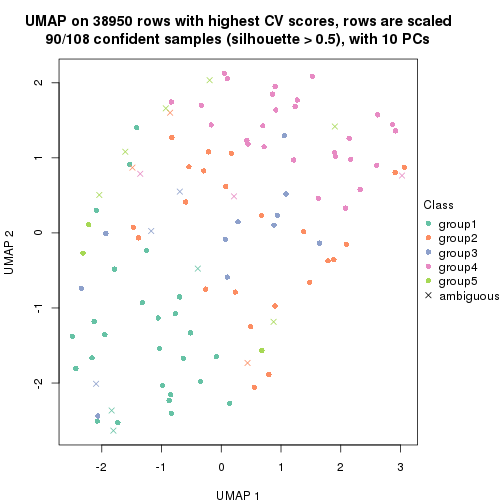</p>

</div>
<div id='tab-CV-NMF-dimension-reduction-5'>
<pre><code class="r">dimension_reduction(res, k = 6, method = &quot;UMAP&quot;)
</code></pre>

<p></p>

</div>
</div>


Following heatmap shows how subgroups are split when increasing `k`:

```r
collect_classes(res)
```


Test correlation between subgroups and known annotations. If the known
annotation is numeric, one-way ANOVA test is applied, and if the known
annotation is discrete, chi-squared contingency table test is applied.

```r
test_to_known_factors(res)
```

```
#>          n disease.state(p) gender(p) k
#> CV:NMF 105         0.730975    1.0000 2
#> CV:NMF  81         0.306899    0.8571 3
#> CV:NMF 100         0.002697    0.4353 4
#> CV:NMF  90         0.000921    0.0160 5
#> CV:NMF  86         0.023660    0.0282 6
```


If matrix rows can be associated to genes, consider to use `GO_Enrichment(res,
...)` to perform function enrichment for the signature genes.


 

---------------------------------------------------


### MAD:hclust


The object with results only for a single top-value method and a single partition method 
can be extracted as:

```r
res = res_list["MAD", "hclust"]
# you can also extract it by
# res = res_list["MAD:hclust"]
```

A summary of `res` and all the functions that can be applied to it:

```r
res
```

```
#> A 'ConsensusPartition' object with k = 2, 3, 4, 5, 6.
#>   On a matrix with 38950 rows and 108 columns.
#>   Top rows (1000, 2000, 3000, 4000, 5000) are extracted by 'MAD' method.
#>   Subgroups are detected by 'hclust' method.
#>   Performed in total 1250 partitions by row resampling.
#>   Best k for subgroups seems to be 3.
#> 
#> Following methods can be applied to this 'ConsensusPartition' object:
#>  [1] "cola_report"             "collect_classes"         "collect_plots"          
#>  [4] "collect_stats"           "colnames"                "compare_signatures"     
#>  [7] "consensus_heatmap"       "dimension_reduction"     "functional_enrichment"  
#> [10] "get_anno_col"            "get_anno"                "get_classes"            
#> [13] "get_consensus"           "get_matrix"              "get_membership"         
#> [16] "get_param"               "get_signatures"          "get_stats"              
#> [19] "is_best_k"               "is_stable_k"             "membership_heatmap"     
#> [22] "ncol"                    "nrow"                    "plot_ecdf"              
#> [25] "rownames"                "select_partition_number" "show"                   
#> [28] "suggest_best_k"          "test_to_known_factors"
```

`collect_plots()` function collects all the plots made from `res` for all `k` (number of partitions)
into one single page to provide an easy and fast comparison between different `k`.

```r
collect_plots(res)
```


The plots are:

- The first row: a plot of the ECDF (Empirical cumulative distribution
  function) curves of the consensus matrix for each `k` and the heatmap of
  predicted classes for each `k`.
- The second row: heatmaps of the consensus matrix for each `k`.
- The third row: heatmaps of the membership matrix for each `k`.
- The fouth row: heatmaps of the signatures for each `k`.

All the plots in panels can be made by individual functions and they are
plotted later in this section.

`select_partition_number()` produces several plots showing different
statistics for choosing "optimized" `k`. There are following statistics:

- ECDF curves of the consensus matrix for each `k`;
- 1-PAC. [The PAC
  score](https://en.wikipedia.org/wiki/Consensus_clustering#Over-interpretation_potential_of_consensus_clustering)
  measures the proportion of the ambiguous subgrouping.
- Mean silhouette score.
- Concordance. The mean probability of fiting the consensus class ids in all
  partitions.
- Area increased. Denote $A_k$ as the area under the ECDF curve for current
  `k`, the area increased is defined as $A_k - A_{k-1}$.
- Rand index. The percent of pairs of samples that are both in a same cluster
  or both are not in a same cluster in the partition of k and k-1.
- Jaccard index. The ratio of pairs of samples are both in a same cluster in
  the partition of k and k-1 and the pairs of samples are both in a same
  cluster in the partition k or k-1.

The detailed explanations of these statistics can be found in [the cola
vignette](http://bioconductor.org/packages/devel/bioc/vignettes/cola/inst/doc/cola.html#toc_13).

Generally speaking, lower PAC score, higher mean silhouette score or higher
concordance corresponds to better partition. Rand index and Jaccard index
measure how similar the current partition is compared to partition with `k-1`.
If they are too similar, we won't accept `k` is better than `k-1`.

```r
select_partition_number(res)
```


The numeric values for all these statistics can be obtained by `get_stats()`.

```r
get_stats(res)
```

```
#>   k 1-PAC mean_silhouette concordance area_increased  Rand Jaccard
#> 2 2 0.206           0.216       0.600         0.4088 0.506   0.506
#> 3 3 0.360           0.662       0.826         0.3522 0.530   0.374
#> 4 4 0.343           0.517       0.752         0.1257 0.927   0.864
#> 5 5 0.400           0.380       0.671         0.1143 0.852   0.696
#> 6 6 0.431           0.424       0.649         0.0771 0.881   0.672
```

`suggest_best_k()` suggests the best $k$ based on these statistics. The rules are as follows:

- All $k$ with Jaccard index larger than 0.95 are removed because the increase of
  the partition number does not provides enough extra information. If all $k$ are removed,
  the best $k$ is assigned by `NA`.
- For $k$ with 1-PAC larger than 0.9, the maximal $k$ is taken as the "best k". Other $k$ is called "optional k".
- If it does not fit the second rule. The $k$ with the highest vote of highest
  1-PAC, mean silhouette and concordance is taken as the "best k".

```r
suggest_best_k(res)
```

```
#> [1] 3
```


Following shows the table of the partitions (You need to click the **show/hide
code output** link to see it). The membership matrix (columns with name `p*`)
is inferred by
[`clue::cl_consensus()`](https://www.rdocumentation.org/link/cl_consensus?package=clue)
function with the `SE` method. Basically the value in the membership matrix
represents the probability to belong to a certain group. The finall class
label for an item is determined with the group with highest probability it
belongs to.

In `get_classes()` function, the entropy is calculated from the membership
matrix and the silhouette score is calculated from the consensus matrix.


<script>
$( function() {
	$( '#tabs-MAD-hclust-get-classes' ).tabs();
} );
</script>
<div id='tabs-MAD-hclust-get-classes'>
<ul>
<li><a href='#tab-MAD-hclust-get-classes-1'>k = 2</a></li>
<li><a href='#tab-MAD-hclust-get-classes-2'>k = 3</a></li>
<li><a href='#tab-MAD-hclust-get-classes-3'>k = 4</a></li>
<li><a href='#tab-MAD-hclust-get-classes-4'>k = 5</a></li>
<li><a href='#tab-MAD-hclust-get-classes-5'>k = 6</a></li>
</ul>

<div id='tab-MAD-hclust-get-classes-1'>
<p><a id='tab-MAD-hclust-get-classes-1-a' style='color:#0366d6' href='#'>show/hide code output</a></p>
<pre><code class="r">cbind(get_classes(res, k = 2), get_membership(res, k = 2))
</code></pre>

<pre><code>#&gt;            class entropy silhouette    p1    p2
#&gt; GSM1068478     1  0.9087  -0.165787 0.676 0.324
#&gt; GSM1068479     2  0.4562   0.126534 0.096 0.904
#&gt; GSM1068481     1  0.9977   0.305208 0.528 0.472
#&gt; GSM1068482     1  0.9977   0.305208 0.528 0.472
#&gt; GSM1068483     1  0.4939   0.359130 0.892 0.108
#&gt; GSM1068486     2  0.9988  -0.318921 0.480 0.520
#&gt; GSM1068487     2  0.9977   0.677530 0.472 0.528
#&gt; GSM1068488     2  0.9993   0.536035 0.484 0.516
#&gt; GSM1068490     2  0.9977   0.677530 0.472 0.528
#&gt; GSM1068491     2  0.3431   0.138415 0.064 0.936
#&gt; GSM1068492     2  0.3274   0.143353 0.060 0.940
#&gt; GSM1068493     1  0.9248   0.035970 0.660 0.340
#&gt; GSM1068494     1  0.9661   0.314500 0.608 0.392
#&gt; GSM1068495     1  0.9970  -0.565130 0.532 0.468
#&gt; GSM1068496     1  0.9460   0.273800 0.636 0.364
#&gt; GSM1068498     1  0.9087  -0.165787 0.676 0.324
#&gt; GSM1068499     1  0.6148   0.355284 0.848 0.152
#&gt; GSM1068500     1  0.4939   0.359130 0.892 0.108
#&gt; GSM1068502     2  0.3274   0.143353 0.060 0.940
#&gt; GSM1068503     2  0.9977   0.677530 0.472 0.528
#&gt; GSM1068505     1  0.9963  -0.591008 0.536 0.464
#&gt; GSM1068506     2  0.9983   0.674121 0.476 0.524
#&gt; GSM1068507     2  0.9996   0.592143 0.488 0.512
#&gt; GSM1068508     1  0.9209  -0.204906 0.664 0.336
#&gt; GSM1068510     1  0.9996  -0.464581 0.512 0.488
#&gt; GSM1068512     1  0.9732  -0.170090 0.596 0.404
#&gt; GSM1068513     2  1.0000   0.605157 0.496 0.504
#&gt; GSM1068514     2  0.9963   0.001669 0.464 0.536
#&gt; GSM1068517     1  0.9087  -0.165787 0.676 0.324
#&gt; GSM1068518     1  0.9815   0.182725 0.580 0.420
#&gt; GSM1068520     1  0.3431   0.315619 0.936 0.064
#&gt; GSM1068521     1  0.3114   0.323219 0.944 0.056
#&gt; GSM1068522     2  0.9977   0.677530 0.472 0.528
#&gt; GSM1068524     2  0.9993   0.644793 0.484 0.516
#&gt; GSM1068527     1  0.9209  -0.236091 0.664 0.336
#&gt; GSM1068480     1  0.9970   0.305964 0.532 0.468
#&gt; GSM1068484     2  0.9944   0.561136 0.456 0.544
#&gt; GSM1068485     1  0.9977   0.305208 0.528 0.472
#&gt; GSM1068489     2  0.9988   0.669616 0.480 0.520
#&gt; GSM1068497     1  0.9087  -0.165787 0.676 0.324
#&gt; GSM1068501     1  0.9988  -0.468805 0.520 0.480
#&gt; GSM1068504     2  0.9977   0.677530 0.472 0.528
#&gt; GSM1068509     1  0.9608   0.258788 0.616 0.384
#&gt; GSM1068511     2  0.9988  -0.111226 0.480 0.520
#&gt; GSM1068515     1  0.8555  -0.000141 0.720 0.280
#&gt; GSM1068516     2  0.9933   0.109554 0.452 0.548
#&gt; GSM1068519     1  0.3274   0.363989 0.940 0.060
#&gt; GSM1068523     2  0.9977   0.677530 0.472 0.528
#&gt; GSM1068525     2  0.9922   0.572487 0.448 0.552
#&gt; GSM1068526     2  0.9977   0.670840 0.472 0.528
#&gt; GSM1068458     1  0.0376   0.364829 0.996 0.004
#&gt; GSM1068459     1  0.9977   0.305208 0.528 0.472
#&gt; GSM1068460     1  0.9970  -0.598228 0.532 0.468
#&gt; GSM1068461     1  0.9977   0.305208 0.528 0.472
#&gt; GSM1068464     2  0.9977   0.677530 0.472 0.528
#&gt; GSM1068468     1  0.9977  -0.533416 0.528 0.472
#&gt; GSM1068472     1  0.9661  -0.293668 0.608 0.392
#&gt; GSM1068473     2  0.9977   0.677530 0.472 0.528
#&gt; GSM1068474     2  0.9977   0.677530 0.472 0.528
#&gt; GSM1068476     2  0.6712  -0.020957 0.176 0.824
#&gt; GSM1068477     2  0.9977   0.677530 0.472 0.528
#&gt; GSM1068462     1  0.9427  -0.189890 0.640 0.360
#&gt; GSM1068463     1  0.9977   0.305208 0.528 0.472
#&gt; GSM1068465     1  0.9209  -0.204906 0.664 0.336
#&gt; GSM1068466     1  0.2043   0.349223 0.968 0.032
#&gt; GSM1068467     1  0.9977  -0.533416 0.528 0.472
#&gt; GSM1068469     1  0.9393  -0.194165 0.644 0.356
#&gt; GSM1068470     2  0.9977   0.677530 0.472 0.528
#&gt; GSM1068471     2  0.9977   0.677530 0.472 0.528
#&gt; GSM1068475     2  0.9977   0.677530 0.472 0.528
#&gt; GSM1068528     1  0.9732   0.315436 0.596 0.404
#&gt; GSM1068531     1  0.0672   0.365365 0.992 0.008
#&gt; GSM1068532     1  0.0672   0.364641 0.992 0.008
#&gt; GSM1068533     1  0.0376   0.364829 0.996 0.004
#&gt; GSM1068535     1  0.9993  -0.346079 0.516 0.484
#&gt; GSM1068537     1  0.0000   0.363132 1.000 0.000
#&gt; GSM1068538     1  0.0938   0.365805 0.988 0.012
#&gt; GSM1068539     1  0.9970  -0.565130 0.532 0.468
#&gt; GSM1068540     1  0.0000   0.363132 1.000 0.000
#&gt; GSM1068542     2  1.0000   0.642171 0.500 0.500
#&gt; GSM1068543     2  0.9996   0.565538 0.488 0.512
#&gt; GSM1068544     1  0.9963   0.306437 0.536 0.464
#&gt; GSM1068545     2  0.9983   0.674121 0.476 0.524
#&gt; GSM1068546     1  0.9977   0.305208 0.528 0.472
#&gt; GSM1068547     1  0.3431   0.315619 0.936 0.064
#&gt; GSM1068548     1  0.9996  -0.639018 0.512 0.488
#&gt; GSM1068549     1  0.9977   0.305208 0.528 0.472
#&gt; GSM1068550     2  0.9988   0.665376 0.480 0.520
#&gt; GSM1068551     2  0.9977   0.677530 0.472 0.528
#&gt; GSM1068552     2  0.9977   0.677530 0.472 0.528
#&gt; GSM1068555     2  0.9977   0.677530 0.472 0.528
#&gt; GSM1068556     2  0.9996   0.565538 0.488 0.512
#&gt; GSM1068557     1  0.9954  -0.500423 0.540 0.460
#&gt; GSM1068560     1  0.9209  -0.236091 0.664 0.336
#&gt; GSM1068561     1  0.9833  -0.443074 0.576 0.424
#&gt; GSM1068562     2  0.9993   0.661196 0.484 0.516
#&gt; GSM1068563     2  0.9983   0.674121 0.476 0.524
#&gt; GSM1068565     2  0.9977   0.677530 0.472 0.528
#&gt; GSM1068529     1  0.9944   0.171378 0.544 0.456
#&gt; GSM1068530     1  0.0000   0.363132 1.000 0.000
#&gt; GSM1068534     1  0.9944   0.171378 0.544 0.456
#&gt; GSM1068536     1  0.9286  -0.267104 0.656 0.344
#&gt; GSM1068541     1  0.9983  -0.606731 0.524 0.476
#&gt; GSM1068553     2  1.0000   0.392987 0.496 0.504
#&gt; GSM1068554     1  0.9993  -0.463972 0.516 0.484
#&gt; GSM1068558     2  0.9580  -0.110692 0.380 0.620
#&gt; GSM1068559     2  0.8555   0.158750 0.280 0.720
#&gt; GSM1068564     2  0.9977   0.677530 0.472 0.528
</code></pre>

<script>
$('#tab-MAD-hclust-get-classes-1-a').parent().next().next().hide();
$('#tab-MAD-hclust-get-classes-1-a').click(function(){
  $('#tab-MAD-hclust-get-classes-1-a').parent().next().next().toggle();
  return(false);
});
</script>
</div>

<div id='tab-MAD-hclust-get-classes-2'>
<p><a id='tab-MAD-hclust-get-classes-2-a' style='color:#0366d6' href='#'>show/hide code output</a></p>
<pre><code class="r">cbind(get_classes(res, k = 3), get_membership(res, k = 3))
</code></pre>

<pre><code>#&gt;            class entropy silhouette    p1    p2    p3
#&gt; GSM1068478     2  0.5785     0.5327 0.332 0.668 0.000
#&gt; GSM1068479     2  0.6451     0.2369 0.004 0.560 0.436
#&gt; GSM1068481     3  0.0592     0.8460 0.012 0.000 0.988
#&gt; GSM1068482     3  0.0747     0.8448 0.016 0.000 0.984
#&gt; GSM1068483     1  0.7441     0.6714 0.700 0.136 0.164
#&gt; GSM1068486     3  0.2339     0.8042 0.012 0.048 0.940
#&gt; GSM1068487     2  0.0000     0.7908 0.000 1.000 0.000
#&gt; GSM1068488     2  0.4413     0.7677 0.036 0.860 0.104
#&gt; GSM1068490     2  0.0000     0.7908 0.000 1.000 0.000
#&gt; GSM1068491     2  0.6432     0.2629 0.004 0.568 0.428
#&gt; GSM1068492     2  0.6421     0.2744 0.004 0.572 0.424
#&gt; GSM1068493     2  0.8825     0.4065 0.296 0.556 0.148
#&gt; GSM1068494     3  0.6247     0.6080 0.212 0.044 0.744
#&gt; GSM1068495     2  0.4413     0.7631 0.104 0.860 0.036
#&gt; GSM1068496     1  0.9840     0.2116 0.408 0.256 0.336
#&gt; GSM1068498     2  0.5785     0.5327 0.332 0.668 0.000
#&gt; GSM1068499     1  0.7076     0.5949 0.684 0.060 0.256
#&gt; GSM1068500     1  0.7441     0.6714 0.700 0.136 0.164
#&gt; GSM1068502     2  0.6421     0.2744 0.004 0.572 0.424
#&gt; GSM1068503     2  0.0000     0.7908 0.000 1.000 0.000
#&gt; GSM1068505     2  0.3482     0.7565 0.128 0.872 0.000
#&gt; GSM1068506     2  0.0892     0.7915 0.020 0.980 0.000
#&gt; GSM1068507     2  0.3472     0.7859 0.056 0.904 0.040
#&gt; GSM1068508     2  0.5733     0.5621 0.324 0.676 0.000
#&gt; GSM1068510     2  0.5408     0.7365 0.052 0.812 0.136
#&gt; GSM1068512     2  0.8275     0.4943 0.296 0.596 0.108
#&gt; GSM1068513     2  0.3009     0.7872 0.052 0.920 0.028
#&gt; GSM1068514     2  0.9028     0.4246 0.168 0.540 0.292
#&gt; GSM1068517     2  0.5785     0.5327 0.332 0.668 0.000
#&gt; GSM1068518     2  0.9912     0.0578 0.300 0.400 0.300
#&gt; GSM1068520     1  0.3752     0.7639 0.856 0.144 0.000
#&gt; GSM1068521     1  0.3619     0.7698 0.864 0.136 0.000
#&gt; GSM1068522     2  0.0237     0.7906 0.004 0.996 0.000
#&gt; GSM1068524     2  0.1525     0.7906 0.004 0.964 0.032
#&gt; GSM1068527     2  0.7337     0.5534 0.300 0.644 0.056
#&gt; GSM1068480     3  0.1031     0.8404 0.024 0.000 0.976
#&gt; GSM1068484     2  0.3769     0.7705 0.016 0.880 0.104
#&gt; GSM1068485     3  0.0592     0.8460 0.012 0.000 0.988
#&gt; GSM1068489     2  0.1031     0.7909 0.024 0.976 0.000
#&gt; GSM1068497     2  0.5785     0.5327 0.332 0.668 0.000
#&gt; GSM1068501     2  0.5403     0.7382 0.060 0.816 0.124
#&gt; GSM1068504     2  0.0000     0.7908 0.000 1.000 0.000
#&gt; GSM1068509     1  0.9987     0.1509 0.348 0.308 0.344
#&gt; GSM1068511     2  0.7828     0.1913 0.052 0.500 0.448
#&gt; GSM1068515     2  0.6941     0.2149 0.464 0.520 0.016
#&gt; GSM1068516     2  0.8743     0.4962 0.156 0.576 0.268
#&gt; GSM1068519     1  0.4390     0.7210 0.840 0.012 0.148
#&gt; GSM1068523     2  0.0000     0.7908 0.000 1.000 0.000
#&gt; GSM1068525     2  0.3610     0.7732 0.016 0.888 0.096
#&gt; GSM1068526     2  0.1129     0.7920 0.020 0.976 0.004
#&gt; GSM1068458     1  0.0983     0.8047 0.980 0.016 0.004
#&gt; GSM1068459     3  0.0592     0.8460 0.012 0.000 0.988
#&gt; GSM1068460     2  0.3482     0.7541 0.128 0.872 0.000
#&gt; GSM1068461     3  0.0237     0.8438 0.004 0.000 0.996
#&gt; GSM1068464     2  0.0000     0.7908 0.000 1.000 0.000
#&gt; GSM1068468     2  0.3921     0.7604 0.112 0.872 0.016
#&gt; GSM1068472     2  0.6217     0.6123 0.264 0.712 0.024
#&gt; GSM1068473     2  0.0000     0.7908 0.000 1.000 0.000
#&gt; GSM1068474     2  0.0000     0.7908 0.000 1.000 0.000
#&gt; GSM1068476     3  0.6489     0.0739 0.004 0.456 0.540
#&gt; GSM1068477     2  0.0237     0.7906 0.004 0.996 0.000
#&gt; GSM1068462     2  0.6501     0.5393 0.316 0.664 0.020
#&gt; GSM1068463     3  0.0592     0.8460 0.012 0.000 0.988
#&gt; GSM1068465     2  0.5733     0.5621 0.324 0.676 0.000
#&gt; GSM1068466     1  0.3193     0.7892 0.896 0.100 0.004
#&gt; GSM1068467     2  0.3921     0.7604 0.112 0.872 0.016
#&gt; GSM1068469     2  0.6369     0.5428 0.316 0.668 0.016
#&gt; GSM1068470     2  0.0000     0.7908 0.000 1.000 0.000
#&gt; GSM1068471     2  0.0000     0.7908 0.000 1.000 0.000
#&gt; GSM1068475     2  0.0000     0.7908 0.000 1.000 0.000
#&gt; GSM1068528     3  0.4700     0.6821 0.180 0.008 0.812
#&gt; GSM1068531     1  0.0661     0.7941 0.988 0.008 0.004
#&gt; GSM1068532     1  0.1170     0.8040 0.976 0.016 0.008
#&gt; GSM1068533     1  0.0983     0.8047 0.980 0.016 0.004
#&gt; GSM1068535     2  0.7615     0.6322 0.148 0.688 0.164
#&gt; GSM1068537     1  0.0747     0.8040 0.984 0.016 0.000
#&gt; GSM1068538     1  0.1337     0.8040 0.972 0.016 0.012
#&gt; GSM1068539     2  0.4413     0.7631 0.104 0.860 0.036
#&gt; GSM1068540     1  0.1129     0.8047 0.976 0.020 0.004
#&gt; GSM1068542     2  0.1964     0.7886 0.056 0.944 0.000
#&gt; GSM1068543     2  0.4339     0.7725 0.048 0.868 0.084
#&gt; GSM1068544     3  0.0892     0.8422 0.020 0.000 0.980
#&gt; GSM1068545     2  0.0892     0.7915 0.020 0.980 0.000
#&gt; GSM1068546     3  0.0424     0.8395 0.008 0.000 0.992
#&gt; GSM1068547     1  0.3752     0.7639 0.856 0.144 0.000
#&gt; GSM1068548     2  0.2448     0.7834 0.076 0.924 0.000
#&gt; GSM1068549     3  0.0237     0.8438 0.004 0.000 0.996
#&gt; GSM1068550     2  0.1399     0.7922 0.028 0.968 0.004
#&gt; GSM1068551     2  0.0000     0.7908 0.000 1.000 0.000
#&gt; GSM1068552     2  0.0592     0.7904 0.012 0.988 0.000
#&gt; GSM1068555     2  0.0000     0.7908 0.000 1.000 0.000
#&gt; GSM1068556     2  0.4339     0.7725 0.048 0.868 0.084
#&gt; GSM1068557     2  0.4915     0.7448 0.132 0.832 0.036
#&gt; GSM1068560     2  0.7337     0.5534 0.300 0.644 0.056
#&gt; GSM1068561     2  0.5884     0.7290 0.148 0.788 0.064
#&gt; GSM1068562     2  0.1525     0.7918 0.032 0.964 0.004
#&gt; GSM1068563     2  0.0892     0.7915 0.020 0.980 0.000
#&gt; GSM1068565     2  0.0000     0.7908 0.000 1.000 0.000
#&gt; GSM1068529     2  0.9873     0.0931 0.268 0.404 0.328
#&gt; GSM1068530     1  0.0747     0.8040 0.984 0.016 0.000
#&gt; GSM1068534     2  0.9873     0.0931 0.268 0.404 0.328
#&gt; GSM1068536     2  0.7208     0.5700 0.308 0.644 0.048
#&gt; GSM1068541     2  0.2625     0.7792 0.084 0.916 0.000
#&gt; GSM1068553     2  0.6181     0.7083 0.072 0.772 0.156
#&gt; GSM1068554     2  0.5471     0.7354 0.060 0.812 0.128
#&gt; GSM1068558     3  0.6676    -0.1097 0.008 0.476 0.516
#&gt; GSM1068559     2  0.8456     0.4107 0.108 0.564 0.328
#&gt; GSM1068564     2  0.0592     0.7904 0.012 0.988 0.000
</code></pre>

<script>
$('#tab-MAD-hclust-get-classes-2-a').parent().next().next().hide();
$('#tab-MAD-hclust-get-classes-2-a').click(function(){
  $('#tab-MAD-hclust-get-classes-2-a').parent().next().next().toggle();
  return(false);
});
</script>
</div>

<div id='tab-MAD-hclust-get-classes-3'>
<p><a id='tab-MAD-hclust-get-classes-3-a' style='color:#0366d6' href='#'>show/hide code output</a></p>
<pre><code class="r">cbind(get_classes(res, k = 4), get_membership(res, k = 4))
</code></pre>

<pre><code>#&gt;            class entropy silhouette    p1    p2    p3    p4
#&gt; GSM1068478     2  0.5897    0.30929 0.284 0.656 0.004 0.056
#&gt; GSM1068479     2  0.7384   -0.10738 0.000 0.476 0.172 0.352
#&gt; GSM1068481     3  0.0000    0.86807 0.000 0.000 1.000 0.000
#&gt; GSM1068482     3  0.2704    0.84570 0.000 0.000 0.876 0.124
#&gt; GSM1068483     1  0.6982    0.56043 0.664 0.124 0.168 0.044
#&gt; GSM1068486     3  0.3367    0.80235 0.000 0.028 0.864 0.108
#&gt; GSM1068487     2  0.0469    0.65427 0.000 0.988 0.000 0.012
#&gt; GSM1068488     2  0.5232    0.49365 0.012 0.644 0.004 0.340
#&gt; GSM1068490     2  0.0469    0.65343 0.000 0.988 0.000 0.012
#&gt; GSM1068491     2  0.7385   -0.09102 0.000 0.484 0.176 0.340
#&gt; GSM1068492     2  0.7314   -0.08214 0.000 0.488 0.164 0.348
#&gt; GSM1068493     2  0.8573   -0.00221 0.252 0.516 0.116 0.116
#&gt; GSM1068494     4  0.7566   -0.29245 0.172 0.004 0.360 0.464
#&gt; GSM1068495     2  0.4419    0.58184 0.088 0.820 0.004 0.088
#&gt; GSM1068496     1  0.9554   -0.43162 0.360 0.196 0.140 0.304
#&gt; GSM1068498     2  0.5897    0.30929 0.284 0.656 0.004 0.056
#&gt; GSM1068499     1  0.7255    0.50442 0.636 0.040 0.152 0.172
#&gt; GSM1068500     1  0.6982    0.56043 0.664 0.124 0.168 0.044
#&gt; GSM1068502     2  0.7314   -0.08214 0.000 0.488 0.164 0.348
#&gt; GSM1068503     2  0.0469    0.65427 0.000 0.988 0.000 0.012
#&gt; GSM1068505     2  0.4444    0.62498 0.120 0.808 0.000 0.072
#&gt; GSM1068506     2  0.3495    0.64082 0.016 0.844 0.000 0.140
#&gt; GSM1068507     2  0.4440    0.64242 0.044 0.832 0.028 0.096
#&gt; GSM1068508     2  0.5921    0.33519 0.288 0.652 0.004 0.056
#&gt; GSM1068510     2  0.6641    0.46564 0.032 0.620 0.052 0.296
#&gt; GSM1068512     2  0.8044    0.01731 0.272 0.508 0.028 0.192
#&gt; GSM1068513     2  0.3843    0.64711 0.040 0.860 0.016 0.084
#&gt; GSM1068514     2  0.8723   -0.32962 0.136 0.432 0.084 0.348
#&gt; GSM1068517     2  0.5897    0.30929 0.284 0.656 0.004 0.056
#&gt; GSM1068518     4  0.9398    0.58024 0.256 0.304 0.096 0.344
#&gt; GSM1068520     1  0.3447    0.71104 0.852 0.128 0.000 0.020
#&gt; GSM1068521     1  0.3280    0.71848 0.860 0.124 0.000 0.016
#&gt; GSM1068522     2  0.2125    0.65454 0.004 0.920 0.000 0.076
#&gt; GSM1068524     2  0.1940    0.64792 0.000 0.924 0.000 0.076
#&gt; GSM1068527     2  0.7122    0.30023 0.272 0.568 0.004 0.156
#&gt; GSM1068480     3  0.4730    0.64117 0.000 0.000 0.636 0.364
#&gt; GSM1068484     2  0.4699    0.51304 0.000 0.676 0.004 0.320
#&gt; GSM1068485     3  0.0336    0.86704 0.000 0.000 0.992 0.008
#&gt; GSM1068489     2  0.3900    0.63169 0.020 0.816 0.000 0.164
#&gt; GSM1068497     2  0.5897    0.30929 0.284 0.656 0.004 0.056
#&gt; GSM1068501     2  0.6739    0.47249 0.040 0.624 0.052 0.284
#&gt; GSM1068504     2  0.0469    0.65338 0.000 0.988 0.000 0.012
#&gt; GSM1068509     4  0.9685    0.47250 0.304 0.236 0.140 0.320
#&gt; GSM1068511     4  0.8338    0.49707 0.032 0.276 0.224 0.468
#&gt; GSM1068515     2  0.6848    0.04412 0.420 0.504 0.020 0.056
#&gt; GSM1068516     2  0.8453   -0.15844 0.124 0.492 0.080 0.304
#&gt; GSM1068519     1  0.4570    0.69689 0.804 0.004 0.060 0.132
#&gt; GSM1068523     2  0.0469    0.65054 0.000 0.988 0.000 0.012
#&gt; GSM1068525     2  0.4608    0.52903 0.000 0.692 0.004 0.304
#&gt; GSM1068526     2  0.3992    0.62507 0.008 0.800 0.004 0.188
#&gt; GSM1068458     1  0.1229    0.80005 0.968 0.008 0.004 0.020
#&gt; GSM1068459     3  0.0000    0.86807 0.000 0.000 1.000 0.000
#&gt; GSM1068460     2  0.4458    0.62234 0.116 0.808 0.000 0.076
#&gt; GSM1068461     3  0.4331    0.77378 0.000 0.000 0.712 0.288
#&gt; GSM1068464     2  0.0336    0.65258 0.000 0.992 0.000 0.008
#&gt; GSM1068468     2  0.3902    0.59754 0.092 0.856 0.020 0.032
#&gt; GSM1068472     2  0.5897    0.40025 0.232 0.700 0.028 0.040
#&gt; GSM1068473     2  0.0592    0.65477 0.000 0.984 0.000 0.016
#&gt; GSM1068474     2  0.0469    0.65427 0.000 0.988 0.000 0.012
#&gt; GSM1068476     2  0.7818   -0.23033 0.000 0.408 0.324 0.268
#&gt; GSM1068477     2  0.2125    0.65454 0.004 0.920 0.000 0.076
#&gt; GSM1068462     2  0.6321    0.31647 0.272 0.652 0.024 0.052
#&gt; GSM1068463     3  0.0000    0.86807 0.000 0.000 1.000 0.000
#&gt; GSM1068465     2  0.5921    0.33519 0.288 0.652 0.004 0.056
#&gt; GSM1068466     1  0.3382    0.75771 0.876 0.080 0.004 0.040
#&gt; GSM1068467     2  0.3806    0.59706 0.092 0.860 0.020 0.028
#&gt; GSM1068469     2  0.6223    0.31993 0.272 0.656 0.020 0.052
#&gt; GSM1068470     2  0.0336    0.65140 0.000 0.992 0.000 0.008
#&gt; GSM1068471     2  0.0336    0.65258 0.000 0.992 0.000 0.008
#&gt; GSM1068475     2  0.0469    0.65162 0.000 0.988 0.000 0.012
#&gt; GSM1068528     3  0.3870    0.72056 0.164 0.008 0.820 0.008
#&gt; GSM1068531     1  0.0336    0.78993 0.992 0.000 0.000 0.008
#&gt; GSM1068532     1  0.0992    0.79959 0.976 0.008 0.004 0.012
#&gt; GSM1068533     1  0.1229    0.80005 0.968 0.008 0.004 0.020
#&gt; GSM1068535     2  0.8110    0.31221 0.124 0.536 0.064 0.276
#&gt; GSM1068537     1  0.0672    0.79926 0.984 0.008 0.000 0.008
#&gt; GSM1068538     1  0.1007    0.79981 0.976 0.008 0.008 0.008
#&gt; GSM1068539     2  0.4419    0.58184 0.088 0.820 0.004 0.088
#&gt; GSM1068540     1  0.1124    0.79976 0.972 0.012 0.004 0.012
#&gt; GSM1068542     2  0.4552    0.62370 0.044 0.784 0.000 0.172
#&gt; GSM1068543     2  0.5427    0.49492 0.020 0.640 0.004 0.336
#&gt; GSM1068544     3  0.0524    0.86555 0.008 0.000 0.988 0.004
#&gt; GSM1068545     2  0.3495    0.64082 0.016 0.844 0.000 0.140
#&gt; GSM1068546     3  0.3810    0.81994 0.008 0.000 0.804 0.188
#&gt; GSM1068547     1  0.3447    0.71104 0.852 0.128 0.000 0.020
#&gt; GSM1068548     2  0.4820    0.61641 0.060 0.772 0.000 0.168
#&gt; GSM1068549     3  0.4331    0.77378 0.000 0.000 0.712 0.288
#&gt; GSM1068550     2  0.4201    0.62045 0.012 0.788 0.004 0.196
#&gt; GSM1068551     2  0.0469    0.65054 0.000 0.988 0.000 0.012
#&gt; GSM1068552     2  0.3450    0.63466 0.008 0.836 0.000 0.156
#&gt; GSM1068555     2  0.0469    0.65054 0.000 0.988 0.000 0.012
#&gt; GSM1068556     2  0.5427    0.49492 0.020 0.640 0.004 0.336
#&gt; GSM1068557     2  0.4800    0.57389 0.108 0.812 0.032 0.048
#&gt; GSM1068560     2  0.7122    0.30023 0.272 0.568 0.004 0.156
#&gt; GSM1068561     2  0.5871    0.51752 0.120 0.728 0.012 0.140
#&gt; GSM1068562     2  0.4317    0.61890 0.016 0.784 0.004 0.196
#&gt; GSM1068563     2  0.3495    0.64082 0.016 0.844 0.000 0.140
#&gt; GSM1068565     2  0.0336    0.65449 0.000 0.992 0.000 0.008
#&gt; GSM1068529     4  0.9483    0.61571 0.224 0.304 0.116 0.356
#&gt; GSM1068530     1  0.0672    0.79926 0.984 0.008 0.000 0.008
#&gt; GSM1068534     4  0.9483    0.61571 0.224 0.304 0.116 0.356
#&gt; GSM1068536     2  0.7122    0.31495 0.272 0.568 0.004 0.156
#&gt; GSM1068541     2  0.4401    0.64330 0.076 0.812 0.000 0.112
#&gt; GSM1068553     2  0.7287    0.40080 0.052 0.576 0.064 0.308
#&gt; GSM1068554     2  0.6832    0.46274 0.040 0.616 0.056 0.288
#&gt; GSM1068558     4  0.7644    0.47517 0.000 0.272 0.260 0.468
#&gt; GSM1068559     2  0.8946   -0.16034 0.100 0.468 0.176 0.256
#&gt; GSM1068564     2  0.3498    0.63314 0.008 0.832 0.000 0.160
</code></pre>

<script>
$('#tab-MAD-hclust-get-classes-3-a').parent().next().next().hide();
$('#tab-MAD-hclust-get-classes-3-a').click(function(){
  $('#tab-MAD-hclust-get-classes-3-a').parent().next().next().toggle();
  return(false);
});
</script>
</div>

<div id='tab-MAD-hclust-get-classes-4'>
<p><a id='tab-MAD-hclust-get-classes-4-a' style='color:#0366d6' href='#'>show/hide code output</a></p>
<pre><code class="r">cbind(get_classes(res, k = 5), get_membership(res, k = 5))
</code></pre>

<pre><code>#&gt;            class entropy silhouette    p1    p2    p3    p4    p5
#&gt; GSM1068478     2  0.6251    0.32224 0.084 0.600 0.000 0.272 0.044
#&gt; GSM1068479     5  0.7688    0.16019 0.000 0.352 0.096 0.144 0.408
#&gt; GSM1068481     3  0.0609    0.83827 0.000 0.000 0.980 0.000 0.020
#&gt; GSM1068482     3  0.2424    0.81918 0.000 0.000 0.868 0.000 0.132
#&gt; GSM1068483     1  0.8174    0.52457 0.528 0.092 0.132 0.180 0.068
#&gt; GSM1068486     3  0.3467    0.77994 0.000 0.004 0.832 0.036 0.128
#&gt; GSM1068487     2  0.0404    0.49081 0.000 0.988 0.000 0.012 0.000
#&gt; GSM1068488     4  0.6409    0.63696 0.008 0.420 0.000 0.440 0.132
#&gt; GSM1068490     2  0.0404    0.49447 0.000 0.988 0.000 0.012 0.000
#&gt; GSM1068491     5  0.7677    0.16995 0.000 0.352 0.092 0.148 0.408
#&gt; GSM1068492     5  0.7522    0.17125 0.000 0.356 0.076 0.148 0.420
#&gt; GSM1068493     2  0.8512    0.09414 0.092 0.468 0.088 0.248 0.104
#&gt; GSM1068494     5  0.7608   -0.18517 0.160 0.000 0.280 0.092 0.468
#&gt; GSM1068495     2  0.4636    0.44021 0.036 0.768 0.000 0.152 0.044
#&gt; GSM1068496     5  0.9479    0.34136 0.224 0.132 0.092 0.232 0.320
#&gt; GSM1068498     2  0.6251    0.32224 0.084 0.600 0.000 0.272 0.044
#&gt; GSM1068499     1  0.7712    0.43872 0.528 0.032 0.060 0.224 0.156
#&gt; GSM1068500     1  0.8174    0.52457 0.528 0.092 0.132 0.180 0.068
#&gt; GSM1068502     5  0.7522    0.17125 0.000 0.356 0.076 0.148 0.420
#&gt; GSM1068503     2  0.0404    0.49081 0.000 0.988 0.000 0.012 0.000
#&gt; GSM1068505     2  0.5109    0.17817 0.096 0.708 0.000 0.188 0.008
#&gt; GSM1068506     2  0.4156    0.07354 0.004 0.700 0.000 0.288 0.008
#&gt; GSM1068507     2  0.3787    0.36976 0.008 0.784 0.004 0.196 0.008
#&gt; GSM1068508     2  0.6417    0.34809 0.140 0.596 0.000 0.232 0.032
#&gt; GSM1068510     4  0.5095    0.72381 0.000 0.400 0.000 0.560 0.040
#&gt; GSM1068512     2  0.8225   -0.20944 0.176 0.372 0.000 0.296 0.156
#&gt; GSM1068513     2  0.3086    0.38675 0.004 0.816 0.000 0.180 0.000
#&gt; GSM1068514     4  0.8452   -0.27112 0.048 0.296 0.040 0.312 0.304
#&gt; GSM1068517     2  0.6251    0.32224 0.084 0.600 0.000 0.272 0.044
#&gt; GSM1068518     5  0.9081    0.40482 0.124 0.220 0.048 0.296 0.312
#&gt; GSM1068520     1  0.4021    0.73021 0.808 0.108 0.000 0.076 0.008
#&gt; GSM1068521     1  0.3911    0.73588 0.816 0.104 0.000 0.072 0.008
#&gt; GSM1068522     2  0.2648    0.35154 0.000 0.848 0.000 0.152 0.000
#&gt; GSM1068524     2  0.2871    0.46314 0.000 0.872 0.000 0.088 0.040
#&gt; GSM1068527     2  0.7684   -0.26251 0.220 0.428 0.000 0.284 0.068
#&gt; GSM1068480     3  0.4974    0.49890 0.000 0.000 0.508 0.028 0.464
#&gt; GSM1068484     2  0.6215   -0.62361 0.000 0.448 0.000 0.412 0.140
#&gt; GSM1068485     3  0.1197    0.83046 0.000 0.000 0.952 0.000 0.048
#&gt; GSM1068489     2  0.4066   -0.01251 0.004 0.672 0.000 0.324 0.000
#&gt; GSM1068497     2  0.6251    0.32224 0.084 0.600 0.000 0.272 0.044
#&gt; GSM1068501     4  0.5033    0.72035 0.004 0.400 0.000 0.568 0.028
#&gt; GSM1068504     2  0.0162    0.49429 0.000 0.996 0.000 0.004 0.000
#&gt; GSM1068509     5  0.9400    0.43260 0.172 0.160 0.080 0.256 0.332
#&gt; GSM1068511     5  0.8432    0.32620 0.032 0.080 0.192 0.300 0.396
#&gt; GSM1068515     2  0.7497    0.15435 0.220 0.468 0.004 0.260 0.048
#&gt; GSM1068516     2  0.8095   -0.21019 0.052 0.420 0.028 0.204 0.296
#&gt; GSM1068519     1  0.4605    0.66727 0.732 0.000 0.000 0.192 0.076
#&gt; GSM1068523     2  0.1251    0.49936 0.000 0.956 0.000 0.036 0.008
#&gt; GSM1068525     2  0.6233   -0.60111 0.000 0.460 0.000 0.396 0.144
#&gt; GSM1068526     2  0.4268   -0.08786 0.000 0.648 0.000 0.344 0.008
#&gt; GSM1068458     1  0.3169    0.77016 0.840 0.000 0.004 0.140 0.016
#&gt; GSM1068459     3  0.0000    0.83708 0.000 0.000 1.000 0.000 0.000
#&gt; GSM1068460     2  0.5264    0.14147 0.100 0.700 0.000 0.188 0.012
#&gt; GSM1068461     3  0.4570    0.71909 0.000 0.000 0.632 0.020 0.348
#&gt; GSM1068464     2  0.0162    0.49549 0.000 0.996 0.000 0.004 0.000
#&gt; GSM1068468     2  0.4098    0.47211 0.020 0.808 0.004 0.132 0.036
#&gt; GSM1068472     2  0.6238    0.39102 0.084 0.652 0.012 0.208 0.044
#&gt; GSM1068473     2  0.0510    0.48941 0.000 0.984 0.000 0.016 0.000
#&gt; GSM1068474     2  0.0404    0.49081 0.000 0.988 0.000 0.012 0.000
#&gt; GSM1068476     2  0.8234   -0.39763 0.000 0.316 0.284 0.112 0.288
#&gt; GSM1068477     2  0.2648    0.35154 0.000 0.848 0.000 0.152 0.000
#&gt; GSM1068462     2  0.6541    0.32648 0.084 0.600 0.004 0.252 0.060
#&gt; GSM1068463     3  0.0609    0.83827 0.000 0.000 0.980 0.000 0.020
#&gt; GSM1068465     2  0.6417    0.34809 0.140 0.596 0.000 0.232 0.032
#&gt; GSM1068466     1  0.4896    0.72395 0.752 0.060 0.004 0.160 0.024
#&gt; GSM1068467     2  0.3911    0.47325 0.020 0.824 0.004 0.116 0.036
#&gt; GSM1068469     2  0.6423    0.33320 0.084 0.608 0.004 0.252 0.052
#&gt; GSM1068470     2  0.0794    0.49863 0.000 0.972 0.000 0.028 0.000
#&gt; GSM1068471     2  0.0162    0.49549 0.000 0.996 0.000 0.004 0.000
#&gt; GSM1068475     2  0.0609    0.49762 0.000 0.980 0.000 0.020 0.000
#&gt; GSM1068528     3  0.3799    0.72204 0.144 0.000 0.812 0.012 0.032
#&gt; GSM1068531     1  0.0992    0.77935 0.968 0.000 0.000 0.024 0.008
#&gt; GSM1068532     1  0.0579    0.79309 0.984 0.000 0.000 0.008 0.008
#&gt; GSM1068533     1  0.3169    0.77016 0.840 0.000 0.004 0.140 0.016
#&gt; GSM1068535     4  0.6672    0.63968 0.084 0.324 0.004 0.540 0.048
#&gt; GSM1068537     1  0.0290    0.79352 0.992 0.000 0.000 0.000 0.008
#&gt; GSM1068538     1  0.0613    0.79364 0.984 0.000 0.004 0.008 0.004
#&gt; GSM1068539     2  0.4636    0.44021 0.036 0.768 0.000 0.152 0.044
#&gt; GSM1068540     1  0.0727    0.79403 0.980 0.004 0.004 0.000 0.012
#&gt; GSM1068542     2  0.5020   -0.15083 0.020 0.620 0.000 0.344 0.016
#&gt; GSM1068543     4  0.6429    0.65248 0.016 0.420 0.000 0.452 0.112
#&gt; GSM1068544     3  0.0579    0.83677 0.008 0.000 0.984 0.000 0.008
#&gt; GSM1068545     2  0.4156    0.07354 0.004 0.700 0.000 0.288 0.008
#&gt; GSM1068546     3  0.4555    0.76724 0.000 0.000 0.732 0.068 0.200
#&gt; GSM1068547     1  0.4021    0.73021 0.808 0.108 0.000 0.076 0.008
#&gt; GSM1068548     2  0.5371   -0.17351 0.036 0.612 0.000 0.332 0.020
#&gt; GSM1068549     3  0.4575    0.72051 0.000 0.000 0.648 0.024 0.328
#&gt; GSM1068550     2  0.4586   -0.10293 0.004 0.644 0.000 0.336 0.016
#&gt; GSM1068551     2  0.1124    0.49929 0.000 0.960 0.000 0.036 0.004
#&gt; GSM1068552     2  0.3876    0.00304 0.000 0.684 0.000 0.316 0.000
#&gt; GSM1068555     2  0.1251    0.49936 0.000 0.956 0.000 0.036 0.008
#&gt; GSM1068556     4  0.6429    0.65248 0.016 0.420 0.000 0.452 0.112
#&gt; GSM1068557     2  0.4865    0.45132 0.020 0.756 0.008 0.160 0.056
#&gt; GSM1068560     2  0.7684   -0.26251 0.220 0.428 0.000 0.284 0.068
#&gt; GSM1068561     2  0.5898    0.37160 0.048 0.676 0.008 0.204 0.064
#&gt; GSM1068562     2  0.4749   -0.14069 0.008 0.628 0.000 0.348 0.016
#&gt; GSM1068563     2  0.4156    0.07354 0.004 0.700 0.000 0.288 0.008
#&gt; GSM1068565     2  0.0609    0.49422 0.000 0.980 0.000 0.020 0.000
#&gt; GSM1068529     5  0.8982    0.42855 0.092 0.216 0.060 0.292 0.340
#&gt; GSM1068530     1  0.0290    0.79352 0.992 0.000 0.000 0.000 0.008
#&gt; GSM1068534     5  0.8982    0.42855 0.092 0.216 0.060 0.292 0.340
#&gt; GSM1068536     2  0.7283    0.09323 0.192 0.508 0.000 0.240 0.060
#&gt; GSM1068541     2  0.4786    0.29261 0.020 0.696 0.000 0.260 0.024
#&gt; GSM1068553     4  0.5309    0.71134 0.008 0.352 0.004 0.600 0.036
#&gt; GSM1068554     4  0.5088    0.72536 0.004 0.392 0.000 0.572 0.032
#&gt; GSM1068558     5  0.7744    0.30035 0.000 0.092 0.212 0.236 0.460
#&gt; GSM1068559     2  0.9029   -0.38141 0.052 0.356 0.116 0.220 0.256
#&gt; GSM1068564     2  0.3895   -0.00496 0.000 0.680 0.000 0.320 0.000
</code></pre>

<script>
$('#tab-MAD-hclust-get-classes-4-a').parent().next().next().hide();
$('#tab-MAD-hclust-get-classes-4-a').click(function(){
  $('#tab-MAD-hclust-get-classes-4-a').parent().next().next().toggle();
  return(false);
});
</script>
</div>

<div id='tab-MAD-hclust-get-classes-5'>
<p><a id='tab-MAD-hclust-get-classes-5-a' style='color:#0366d6' href='#'>show/hide code output</a></p>
<pre><code class="r">cbind(get_classes(res, k = 6), get_membership(res, k = 6))
</code></pre>

<pre><code>#&gt;            class entropy silhouette    p1    p2    p3    p4    p5    p6
#&gt; GSM1068478     2  0.4701    0.08895 0.036 0.524 0.000 0.004 0.436 0.000
#&gt; GSM1068479     4  0.7550    0.62219 0.000 0.200 0.040 0.452 0.084 0.224
#&gt; GSM1068481     3  0.0790    0.79343 0.000 0.000 0.968 0.032 0.000 0.000
#&gt; GSM1068482     3  0.3198    0.75937 0.000 0.000 0.844 0.100 0.032 0.024
#&gt; GSM1068483     1  0.7296    0.42771 0.472 0.072 0.120 0.032 0.296 0.008
#&gt; GSM1068486     3  0.3792    0.69488 0.000 0.000 0.780 0.160 0.008 0.052
#&gt; GSM1068487     2  0.0692    0.59661 0.000 0.976 0.000 0.000 0.004 0.020
#&gt; GSM1068488     6  0.6071    0.55184 0.000 0.224 0.000 0.056 0.140 0.580
#&gt; GSM1068490     2  0.0717    0.59880 0.000 0.976 0.000 0.000 0.008 0.016
#&gt; GSM1068491     4  0.7958    0.63259 0.000 0.200 0.052 0.404 0.112 0.232
#&gt; GSM1068492     4  0.7759    0.62957 0.000 0.200 0.032 0.416 0.120 0.232
#&gt; GSM1068493     5  0.7035    0.15444 0.052 0.400 0.084 0.024 0.420 0.020
#&gt; GSM1068494     5  0.8438   -0.19073 0.116 0.000 0.240 0.260 0.300 0.084
#&gt; GSM1068495     2  0.4460    0.44424 0.020 0.728 0.000 0.004 0.200 0.048
#&gt; GSM1068496     5  0.7864    0.46143 0.160 0.076 0.088 0.076 0.536 0.064
#&gt; GSM1068498     2  0.4701    0.08895 0.036 0.524 0.000 0.004 0.436 0.000
#&gt; GSM1068499     1  0.7395    0.34737 0.468 0.004 0.056 0.060 0.288 0.124
#&gt; GSM1068500     1  0.7296    0.42771 0.472 0.072 0.120 0.032 0.296 0.008
#&gt; GSM1068502     4  0.7759    0.62957 0.000 0.200 0.032 0.416 0.120 0.232
#&gt; GSM1068503     2  0.0692    0.59661 0.000 0.976 0.000 0.000 0.004 0.020
#&gt; GSM1068505     2  0.5798    0.28372 0.068 0.612 0.000 0.012 0.052 0.256
#&gt; GSM1068506     2  0.4364    0.21217 0.004 0.608 0.000 0.000 0.024 0.364
#&gt; GSM1068507     2  0.4178    0.48105 0.000 0.728 0.000 0.004 0.060 0.208
#&gt; GSM1068508     2  0.6128    0.08946 0.088 0.516 0.000 0.004 0.340 0.052
#&gt; GSM1068510     6  0.4563    0.53596 0.000 0.232 0.000 0.040 0.028 0.700
#&gt; GSM1068512     5  0.7751    0.10935 0.112 0.240 0.000 0.020 0.352 0.276
#&gt; GSM1068513     2  0.3683    0.49477 0.000 0.764 0.000 0.000 0.044 0.192
#&gt; GSM1068514     5  0.8354    0.14683 0.028 0.176 0.040 0.108 0.376 0.272
#&gt; GSM1068517     2  0.4701    0.08895 0.036 0.524 0.000 0.004 0.436 0.000
#&gt; GSM1068518     5  0.7862    0.49808 0.072 0.124 0.044 0.076 0.528 0.156
#&gt; GSM1068520     1  0.4641    0.68758 0.764 0.068 0.000 0.020 0.112 0.036
#&gt; GSM1068521     1  0.4469    0.69194 0.776 0.068 0.000 0.016 0.104 0.036
#&gt; GSM1068522     2  0.3109    0.43857 0.000 0.772 0.000 0.000 0.004 0.224
#&gt; GSM1068524     2  0.3515    0.55908 0.000 0.828 0.000 0.024 0.084 0.064
#&gt; GSM1068527     6  0.8090    0.24499 0.152 0.288 0.000 0.036 0.196 0.328
#&gt; GSM1068480     3  0.6578    0.44467 0.000 0.000 0.460 0.260 0.240 0.040
#&gt; GSM1068484     6  0.6219    0.52535 0.000 0.260 0.000 0.052 0.144 0.544
#&gt; GSM1068485     3  0.1418    0.78324 0.000 0.000 0.944 0.032 0.024 0.000
#&gt; GSM1068489     2  0.4024    0.17666 0.004 0.592 0.000 0.000 0.004 0.400
#&gt; GSM1068497     2  0.4701    0.08895 0.036 0.524 0.000 0.004 0.436 0.000
#&gt; GSM1068501     6  0.4133    0.54106 0.000 0.232 0.000 0.020 0.024 0.724
#&gt; GSM1068504     2  0.0508    0.59860 0.000 0.984 0.000 0.000 0.004 0.012
#&gt; GSM1068509     5  0.8025    0.49525 0.120 0.080 0.076 0.092 0.532 0.100
#&gt; GSM1068511     6  0.7620   -0.13715 0.012 0.008 0.156 0.116 0.332 0.376
#&gt; GSM1068515     5  0.6427    0.08366 0.144 0.388 0.000 0.024 0.432 0.012
#&gt; GSM1068516     5  0.7675    0.27985 0.028 0.364 0.024 0.076 0.388 0.120
#&gt; GSM1068519     1  0.5600    0.59089 0.648 0.000 0.000 0.052 0.160 0.140
#&gt; GSM1068523     2  0.1471    0.58888 0.000 0.932 0.000 0.004 0.064 0.000
#&gt; GSM1068525     6  0.6295    0.50978 0.000 0.272 0.000 0.052 0.148 0.528
#&gt; GSM1068526     2  0.4238    0.04873 0.000 0.540 0.000 0.000 0.016 0.444
#&gt; GSM1068458     1  0.3409    0.71266 0.788 0.000 0.004 0.024 0.184 0.000
#&gt; GSM1068459     3  0.0000    0.79339 0.000 0.000 1.000 0.000 0.000 0.000
#&gt; GSM1068460     2  0.5884    0.23956 0.072 0.600 0.000 0.012 0.052 0.264
#&gt; GSM1068461     4  0.4083   -0.54796 0.000 0.000 0.460 0.532 0.008 0.000
#&gt; GSM1068464     2  0.0717    0.59822 0.000 0.976 0.000 0.000 0.008 0.016
#&gt; GSM1068468     2  0.3599    0.49183 0.004 0.764 0.000 0.004 0.212 0.016
#&gt; GSM1068472     2  0.5028    0.19494 0.036 0.584 0.008 0.004 0.360 0.008
#&gt; GSM1068473     2  0.0777    0.59576 0.000 0.972 0.000 0.000 0.004 0.024
#&gt; GSM1068474     2  0.0692    0.59661 0.000 0.976 0.000 0.000 0.004 0.020
#&gt; GSM1068476     4  0.7973    0.51941 0.000 0.188 0.224 0.364 0.024 0.200
#&gt; GSM1068477     2  0.3109    0.43857 0.000 0.772 0.000 0.000 0.004 0.224
#&gt; GSM1068462     2  0.4928    0.08102 0.036 0.520 0.000 0.008 0.432 0.004
#&gt; GSM1068463     3  0.0790    0.79343 0.000 0.000 0.968 0.032 0.000 0.000
#&gt; GSM1068465     2  0.6128    0.08946 0.088 0.516 0.000 0.004 0.340 0.052
#&gt; GSM1068466     1  0.4944    0.65340 0.692 0.048 0.004 0.024 0.224 0.008
#&gt; GSM1068467     2  0.3354    0.49387 0.004 0.780 0.000 0.004 0.204 0.008
#&gt; GSM1068469     2  0.4914    0.09922 0.036 0.532 0.000 0.008 0.420 0.004
#&gt; GSM1068470     2  0.0865    0.59691 0.000 0.964 0.000 0.000 0.036 0.000
#&gt; GSM1068471     2  0.0717    0.59822 0.000 0.976 0.000 0.000 0.008 0.016
#&gt; GSM1068475     2  0.0777    0.59979 0.000 0.972 0.000 0.000 0.024 0.004
#&gt; GSM1068528     3  0.3661    0.68428 0.136 0.000 0.804 0.024 0.036 0.000
#&gt; GSM1068531     1  0.1777    0.74023 0.932 0.000 0.000 0.032 0.024 0.012
#&gt; GSM1068532     1  0.1369    0.75217 0.952 0.000 0.000 0.016 0.016 0.016
#&gt; GSM1068533     1  0.3409    0.71266 0.788 0.000 0.004 0.024 0.184 0.000
#&gt; GSM1068535     6  0.5341    0.47288 0.060 0.168 0.000 0.032 0.040 0.700
#&gt; GSM1068537     1  0.1078    0.75403 0.964 0.000 0.000 0.016 0.012 0.008
#&gt; GSM1068538     1  0.1007    0.75397 0.968 0.000 0.004 0.016 0.004 0.008
#&gt; GSM1068539     2  0.4460    0.44424 0.020 0.728 0.000 0.004 0.200 0.048
#&gt; GSM1068540     1  0.1519    0.75576 0.948 0.004 0.004 0.008 0.028 0.008
#&gt; GSM1068542     2  0.5059    0.00873 0.012 0.512 0.000 0.008 0.032 0.436
#&gt; GSM1068543     6  0.5575    0.56634 0.000 0.224 0.000 0.036 0.116 0.624
#&gt; GSM1068544     3  0.0520    0.79360 0.008 0.000 0.984 0.000 0.008 0.000
#&gt; GSM1068545     2  0.4364    0.21217 0.004 0.608 0.000 0.000 0.024 0.364
#&gt; GSM1068546     3  0.5149    0.58294 0.000 0.000 0.580 0.348 0.036 0.036
#&gt; GSM1068547     1  0.4641    0.68758 0.764 0.068 0.000 0.020 0.112 0.036
#&gt; GSM1068548     2  0.5280   -0.02127 0.012 0.504 0.000 0.008 0.048 0.428
#&gt; GSM1068549     3  0.4227    0.45749 0.000 0.000 0.500 0.488 0.008 0.004
#&gt; GSM1068550     2  0.4636    0.02520 0.000 0.532 0.000 0.004 0.032 0.432
#&gt; GSM1068551     2  0.1411    0.58996 0.000 0.936 0.000 0.004 0.060 0.000
#&gt; GSM1068552     2  0.3890    0.16619 0.000 0.596 0.000 0.000 0.004 0.400
#&gt; GSM1068555     2  0.1327    0.58868 0.000 0.936 0.000 0.000 0.064 0.000
#&gt; GSM1068556     6  0.5575    0.56634 0.000 0.224 0.000 0.036 0.116 0.624
#&gt; GSM1068557     2  0.4383    0.43290 0.004 0.700 0.004 0.012 0.256 0.024
#&gt; GSM1068560     6  0.8090    0.24499 0.152 0.288 0.000 0.036 0.196 0.328
#&gt; GSM1068561     2  0.5845    0.33339 0.024 0.632 0.008 0.020 0.228 0.088
#&gt; GSM1068562     2  0.4709   -0.01524 0.000 0.516 0.000 0.004 0.036 0.444
#&gt; GSM1068563     2  0.4364    0.21217 0.004 0.608 0.000 0.000 0.024 0.364
#&gt; GSM1068565     2  0.0914    0.60005 0.000 0.968 0.000 0.000 0.016 0.016
#&gt; GSM1068529     5  0.7851    0.50449 0.052 0.116 0.056 0.092 0.532 0.152
#&gt; GSM1068530     1  0.0976    0.75443 0.968 0.000 0.000 0.008 0.016 0.008
#&gt; GSM1068534     5  0.7851    0.50449 0.052 0.116 0.056 0.092 0.532 0.152
#&gt; GSM1068536     2  0.7555    0.05094 0.144 0.448 0.000 0.024 0.232 0.152
#&gt; GSM1068541     2  0.5524    0.37141 0.016 0.600 0.000 0.000 0.136 0.248
#&gt; GSM1068553     6  0.4082    0.51981 0.000 0.192 0.000 0.028 0.028 0.752
#&gt; GSM1068554     6  0.4159    0.54169 0.000 0.224 0.000 0.024 0.024 0.728
#&gt; GSM1068558     6  0.7880   -0.26081 0.000 0.012 0.164 0.264 0.256 0.304
#&gt; GSM1068559     4  0.8975    0.33788 0.020 0.196 0.076 0.260 0.188 0.260
#&gt; GSM1068564     2  0.3899    0.16045 0.000 0.592 0.000 0.000 0.004 0.404
</code></pre>

<script>
$('#tab-MAD-hclust-get-classes-5-a').parent().next().next().hide();
$('#tab-MAD-hclust-get-classes-5-a').click(function(){
  $('#tab-MAD-hclust-get-classes-5-a').parent().next().next().toggle();
  return(false);
});
</script>
</div>
</div>

Heatmaps for the consensus matrix. It visualizes the probability of two
samples to be in a same group.


<script>
$( function() {
	$( '#tabs-MAD-hclust-consensus-heatmap' ).tabs();
} );
</script>
<div id='tabs-MAD-hclust-consensus-heatmap'>
<ul>
<li><a href='#tab-MAD-hclust-consensus-heatmap-1'>k = 2</a></li>
<li><a href='#tab-MAD-hclust-consensus-heatmap-2'>k = 3</a></li>
<li><a href='#tab-MAD-hclust-consensus-heatmap-3'>k = 4</a></li>
<li><a href='#tab-MAD-hclust-consensus-heatmap-4'>k = 5</a></li>
<li><a href='#tab-MAD-hclust-consensus-heatmap-5'>k = 6</a></li>
</ul>
<div id='tab-MAD-hclust-consensus-heatmap-1'>
<pre><code class="r">consensus_heatmap(res, k = 2)
</code></pre>

<p></p>

</div>
<div id='tab-MAD-hclust-consensus-heatmap-2'>
<pre><code class="r">consensus_heatmap(res, k = 3)
</code></pre>

<p></p>

</div>
<div id='tab-MAD-hclust-consensus-heatmap-3'>
<pre><code class="r">consensus_heatmap(res, k = 4)
</code></pre>

<p></p>

</div>
<div id='tab-MAD-hclust-consensus-heatmap-4'>
<pre><code class="r">consensus_heatmap(res, k = 5)
</code></pre>

<p>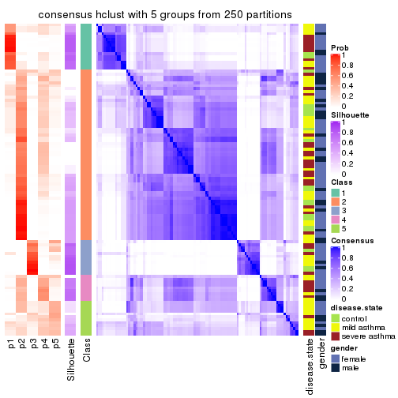</p>

</div>
<div id='tab-MAD-hclust-consensus-heatmap-5'>
<pre><code class="r">consensus_heatmap(res, k = 6)
</code></pre>

<p></p>

</div>
</div>

Heatmaps for the membership of samples in all partitions to see how consistent they are:


<script>
$( function() {
	$( '#tabs-MAD-hclust-membership-heatmap' ).tabs();
} );
</script>
<div id='tabs-MAD-hclust-membership-heatmap'>
<ul>
<li><a href='#tab-MAD-hclust-membership-heatmap-1'>k = 2</a></li>
<li><a href='#tab-MAD-hclust-membership-heatmap-2'>k = 3</a></li>
<li><a href='#tab-MAD-hclust-membership-heatmap-3'>k = 4</a></li>
<li><a href='#tab-MAD-hclust-membership-heatmap-4'>k = 5</a></li>
<li><a href='#tab-MAD-hclust-membership-heatmap-5'>k = 6</a></li>
</ul>
<div id='tab-MAD-hclust-membership-heatmap-1'>
<pre><code class="r">membership_heatmap(res, k = 2)
</code></pre>

<p></p>

</div>
<div id='tab-MAD-hclust-membership-heatmap-2'>
<pre><code class="r">membership_heatmap(res, k = 3)
</code></pre>

<p></p>

</div>
<div id='tab-MAD-hclust-membership-heatmap-3'>
<pre><code class="r">membership_heatmap(res, k = 4)
</code></pre>

<p></p>

</div>
<div id='tab-MAD-hclust-membership-heatmap-4'>
<pre><code class="r">membership_heatmap(res, k = 5)
</code></pre>

<p></p>

</div>
<div id='tab-MAD-hclust-membership-heatmap-5'>
<pre><code class="r">membership_heatmap(res, k = 6)
</code></pre>

<p></p>

</div>
</div>

As soon as we have had the classes for columns, we can look for signatures
which are significantly different between classes which can be candidate marks
for certain classes. Following are the heatmaps for signatures.


Signature heatmaps where rows are scaled:


<script>
$( function() {
	$( '#tabs-MAD-hclust-get-signatures' ).tabs();
} );
</script>
<div id='tabs-MAD-hclust-get-signatures'>
<ul>
<li><a href='#tab-MAD-hclust-get-signatures-1'>k = 2</a></li>
<li><a href='#tab-MAD-hclust-get-signatures-2'>k = 3</a></li>
<li><a href='#tab-MAD-hclust-get-signatures-3'>k = 4</a></li>
<li><a href='#tab-MAD-hclust-get-signatures-4'>k = 5</a></li>
<li><a href='#tab-MAD-hclust-get-signatures-5'>k = 6</a></li>
</ul>
<div id='tab-MAD-hclust-get-signatures-1'>
<pre><code class="r">get_signatures(res, k = 2)
</code></pre>

<p></p>

</div>
<div id='tab-MAD-hclust-get-signatures-2'>
<pre><code class="r">get_signatures(res, k = 3)
</code></pre>

<p></p>

</div>
<div id='tab-MAD-hclust-get-signatures-3'>
<pre><code class="r">get_signatures(res, k = 4)
</code></pre>

<p>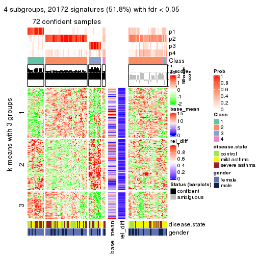</p>

</div>
<div id='tab-MAD-hclust-get-signatures-4'>
<pre><code class="r">get_signatures(res, k = 5)
</code></pre>

<p></p>

</div>
<div id='tab-MAD-hclust-get-signatures-5'>
<pre><code class="r">get_signatures(res, k = 6)
</code></pre>

<p></p>

</div>
</div>


Signature heatmaps where rows are not scaled:


<script>
$( function() {
	$( '#tabs-MAD-hclust-get-signatures-no-scale' ).tabs();
} );
</script>
<div id='tabs-MAD-hclust-get-signatures-no-scale'>
<ul>
<li><a href='#tab-MAD-hclust-get-signatures-no-scale-1'>k = 2</a></li>
<li><a href='#tab-MAD-hclust-get-signatures-no-scale-2'>k = 3</a></li>
<li><a href='#tab-MAD-hclust-get-signatures-no-scale-3'>k = 4</a></li>
<li><a href='#tab-MAD-hclust-get-signatures-no-scale-4'>k = 5</a></li>
<li><a href='#tab-MAD-hclust-get-signatures-no-scale-5'>k = 6</a></li>
</ul>
<div id='tab-MAD-hclust-get-signatures-no-scale-1'>
<pre><code class="r">get_signatures(res, k = 2, scale_rows = FALSE)
</code></pre>

<p></p>

</div>
<div id='tab-MAD-hclust-get-signatures-no-scale-2'>
<pre><code class="r">get_signatures(res, k = 3, scale_rows = FALSE)
</code></pre>

<p></p>

</div>
<div id='tab-MAD-hclust-get-signatures-no-scale-3'>
<pre><code class="r">get_signatures(res, k = 4, scale_rows = FALSE)
</code></pre>

<p>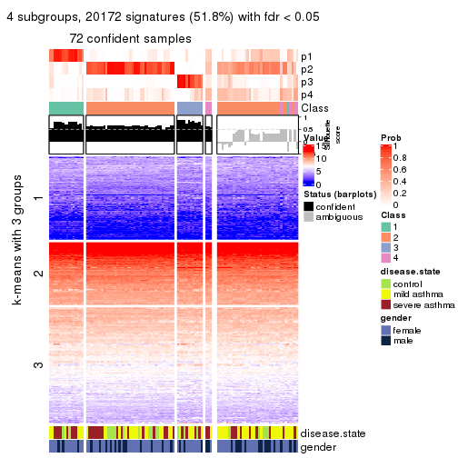</p>

</div>
<div id='tab-MAD-hclust-get-signatures-no-scale-4'>
<pre><code class="r">get_signatures(res, k = 5, scale_rows = FALSE)
</code></pre>

<p></p>

</div>
<div id='tab-MAD-hclust-get-signatures-no-scale-5'>
<pre><code class="r">get_signatures(res, k = 6, scale_rows = FALSE)
</code></pre>

<p></p>

</div>
</div>


Compare the overlap of signatures from different k:

```r
compare_signatures(res)
```


`get_signature()` returns a data frame invisibly. TO get the list of signatures, the function
call should be assigned to a variable explicitly. In following code, if `plot` argument is set
to `FALSE`, no heatmap is plotted while only the differential analysis is performed.

```r
# code only for demonstration
tb = get_signature(res, k = ..., plot = FALSE)
```

An example of the output of `tb` is:

```
#>   which_row         fdr    mean_1    mean_2 scaled_mean_1 scaled_mean_2 km
#> 1        38 0.042760348  8.373488  9.131774    -0.5533452     0.5164555  1
#> 2        40 0.018707592  7.106213  8.469186    -0.6173731     0.5762149  1
#> 3        55 0.019134737 10.221463 11.207825    -0.6159697     0.5749050  1
#> 4        59 0.006059896  5.921854  7.869574    -0.6899429     0.6439467  1
#> 5        60 0.018055526  8.928898 10.211722    -0.6204761     0.5791110  1
#> 6        98 0.009384629 15.714769 14.887706     0.6635654    -0.6193277  2
...
```

The columns in `tb` are:

1. `which_row`: row indices corresponding to the input matrix.
2. `fdr`: FDR for the differential test. 
3. `mean_x`: The mean value in group x.
4. `scaled_mean_x`: The mean value in group x after rows are scaled.
5. `km`: Row groups if k-means clustering is applied to rows.


UMAP plot which shows how samples are separated.


<script>
$( function() {
	$( '#tabs-MAD-hclust-dimension-reduction' ).tabs();
} );
</script>
<div id='tabs-MAD-hclust-dimension-reduction'>
<ul>
<li><a href='#tab-MAD-hclust-dimension-reduction-1'>k = 2</a></li>
<li><a href='#tab-MAD-hclust-dimension-reduction-2'>k = 3</a></li>
<li><a href='#tab-MAD-hclust-dimension-reduction-3'>k = 4</a></li>
<li><a href='#tab-MAD-hclust-dimension-reduction-4'>k = 5</a></li>
<li><a href='#tab-MAD-hclust-dimension-reduction-5'>k = 6</a></li>
</ul>
<div id='tab-MAD-hclust-dimension-reduction-1'>
<pre><code class="r">dimension_reduction(res, k = 2, method = &quot;UMAP&quot;)
</code></pre>

<p></p>

</div>
<div id='tab-MAD-hclust-dimension-reduction-2'>
<pre><code class="r">dimension_reduction(res, k = 3, method = &quot;UMAP&quot;)
</code></pre>

<p></p>

</div>
<div id='tab-MAD-hclust-dimension-reduction-3'>
<pre><code class="r">dimension_reduction(res, k = 4, method = &quot;UMAP&quot;)
</code></pre>

<p></p>

</div>
<div id='tab-MAD-hclust-dimension-reduction-4'>
<pre><code class="r">dimension_reduction(res, k = 5, method = &quot;UMAP&quot;)
</code></pre>

<p></p>

</div>
<div id='tab-MAD-hclust-dimension-reduction-5'>
<pre><code class="r">dimension_reduction(res, k = 6, method = &quot;UMAP&quot;)
</code></pre>

<p></p>

</div>
</div>


Following heatmap shows how subgroups are split when increasing `k`:

```r
collect_classes(res)
```


Test correlation between subgroups and known annotations. If the known
annotation is numeric, one-way ANOVA test is applied, and if the known
annotation is discrete, chi-squared contingency table test is applied.

```r
test_to_known_factors(res)
```

```
#>             n disease.state(p) gender(p) k
#> MAD:hclust 34               NA        NA 2
#> MAD:hclust 90           0.7972    0.4806 3
#> MAD:hclust 72           0.8407    0.3911 4
#> MAD:hclust 34           0.5412    0.5637 5
#> MAD:hclust 53           0.0841    0.0821 6
```


If matrix rows can be associated to genes, consider to use `GO_Enrichment(res,
...)` to perform function enrichment for the signature genes.


 

---------------------------------------------------


### MAD:kmeans


The object with results only for a single top-value method and a single partition method 
can be extracted as:

```r
res = res_list["MAD", "kmeans"]
# you can also extract it by
# res = res_list["MAD:kmeans"]
```

A summary of `res` and all the functions that can be applied to it:

```r
res
```

```
#> A 'ConsensusPartition' object with k = 2, 3, 4, 5, 6.
#>   On a matrix with 38950 rows and 108 columns.
#>   Top rows (1000, 2000, 3000, 4000, 5000) are extracted by 'MAD' method.
#>   Subgroups are detected by 'kmeans' method.
#>   Performed in total 1250 partitions by row resampling.
#>   Best k for subgroups seems to be 2.
#> 
#> Following methods can be applied to this 'ConsensusPartition' object:
#>  [1] "cola_report"             "collect_classes"         "collect_plots"          
#>  [4] "collect_stats"           "colnames"                "compare_signatures"     
#>  [7] "consensus_heatmap"       "dimension_reduction"     "functional_enrichment"  
#> [10] "get_anno_col"            "get_anno"                "get_classes"            
#> [13] "get_consensus"           "get_matrix"              "get_membership"         
#> [16] "get_param"               "get_signatures"          "get_stats"              
#> [19] "is_best_k"               "is_stable_k"             "membership_heatmap"     
#> [22] "ncol"                    "nrow"                    "plot_ecdf"              
#> [25] "rownames"                "select_partition_number" "show"                   
#> [28] "suggest_best_k"          "test_to_known_factors"
```

`collect_plots()` function collects all the plots made from `res` for all `k` (number of partitions)
into one single page to provide an easy and fast comparison between different `k`.

```r
collect_plots(res)
```


The plots are:

- The first row: a plot of the ECDF (Empirical cumulative distribution
  function) curves of the consensus matrix for each `k` and the heatmap of
  predicted classes for each `k`.
- The second row: heatmaps of the consensus matrix for each `k`.
- The third row: heatmaps of the membership matrix for each `k`.
- The fouth row: heatmaps of the signatures for each `k`.

All the plots in panels can be made by individual functions and they are
plotted later in this section.

`select_partition_number()` produces several plots showing different
statistics for choosing "optimized" `k`. There are following statistics:

- ECDF curves of the consensus matrix for each `k`;
- 1-PAC. [The PAC
  score](https://en.wikipedia.org/wiki/Consensus_clustering#Over-interpretation_potential_of_consensus_clustering)
  measures the proportion of the ambiguous subgrouping.
- Mean silhouette score.
- Concordance. The mean probability of fiting the consensus class ids in all
  partitions.
- Area increased. Denote $A_k$ as the area under the ECDF curve for current
  `k`, the area increased is defined as $A_k - A_{k-1}$.
- Rand index. The percent of pairs of samples that are both in a same cluster
  or both are not in a same cluster in the partition of k and k-1.
- Jaccard index. The ratio of pairs of samples are both in a same cluster in
  the partition of k and k-1 and the pairs of samples are both in a same
  cluster in the partition k or k-1.

The detailed explanations of these statistics can be found in [the cola
vignette](http://bioconductor.org/packages/devel/bioc/vignettes/cola/inst/doc/cola.html#toc_13).

Generally speaking, lower PAC score, higher mean silhouette score or higher
concordance corresponds to better partition. Rand index and Jaccard index
measure how similar the current partition is compared to partition with `k-1`.
If they are too similar, we won't accept `k` is better than `k-1`.

```r
select_partition_number(res)
```


The numeric values for all these statistics can be obtained by `get_stats()`.

```r
get_stats(res)
```

```
#>   k 1-PAC mean_silhouette concordance area_increased  Rand Jaccard
#> 2 2 0.695           0.876       0.936         0.4636 0.551   0.551
#> 3 3 0.427           0.590       0.770         0.3451 0.796   0.649
#> 4 4 0.820           0.864       0.913         0.1692 0.772   0.499
#> 5 5 0.692           0.651       0.789         0.0774 0.955   0.839
#> 6 6 0.678           0.538       0.705         0.0476 0.892   0.586
```

`suggest_best_k()` suggests the best $k$ based on these statistics. The rules are as follows:

- All $k$ with Jaccard index larger than 0.95 are removed because the increase of
  the partition number does not provides enough extra information. If all $k$ are removed,
  the best $k$ is assigned by `NA`.
- For $k$ with 1-PAC larger than 0.9, the maximal $k$ is taken as the "best k". Other $k$ is called "optional k".
- If it does not fit the second rule. The $k$ with the highest vote of highest
  1-PAC, mean silhouette and concordance is taken as the "best k".

```r
suggest_best_k(res)
```

```
#> [1] 2
```


Following shows the table of the partitions (You need to click the **show/hide
code output** link to see it). The membership matrix (columns with name `p*`)
is inferred by
[`clue::cl_consensus()`](https://www.rdocumentation.org/link/cl_consensus?package=clue)
function with the `SE` method. Basically the value in the membership matrix
represents the probability to belong to a certain group. The finall class
label for an item is determined with the group with highest probability it
belongs to.

In `get_classes()` function, the entropy is calculated from the membership
matrix and the silhouette score is calculated from the consensus matrix.


<script>
$( function() {
	$( '#tabs-MAD-kmeans-get-classes' ).tabs();
} );
</script>
<div id='tabs-MAD-kmeans-get-classes'>
<ul>
<li><a href='#tab-MAD-kmeans-get-classes-1'>k = 2</a></li>
<li><a href='#tab-MAD-kmeans-get-classes-2'>k = 3</a></li>
<li><a href='#tab-MAD-kmeans-get-classes-3'>k = 4</a></li>
<li><a href='#tab-MAD-kmeans-get-classes-4'>k = 5</a></li>
<li><a href='#tab-MAD-kmeans-get-classes-5'>k = 6</a></li>
</ul>

<div id='tab-MAD-kmeans-get-classes-1'>
<p><a id='tab-MAD-kmeans-get-classes-1-a' style='color:#0366d6' href='#'>show/hide code output</a></p>
<pre><code class="r">cbind(get_classes(res, k = 2), get_membership(res, k = 2))
</code></pre>

<pre><code>#&gt;            class entropy silhouette    p1    p2
#&gt; GSM1068478     1  0.6973      0.784 0.812 0.188
#&gt; GSM1068479     2  0.3114      0.894 0.056 0.944
#&gt; GSM1068481     1  0.0376      0.947 0.996 0.004
#&gt; GSM1068482     1  0.0376      0.947 0.996 0.004
#&gt; GSM1068483     1  0.0000      0.948 1.000 0.000
#&gt; GSM1068486     1  0.0376      0.947 0.996 0.004
#&gt; GSM1068487     2  0.0000      0.921 0.000 1.000
#&gt; GSM1068488     2  0.5294      0.859 0.120 0.880
#&gt; GSM1068490     2  0.0000      0.921 0.000 1.000
#&gt; GSM1068491     1  0.7528      0.700 0.784 0.216
#&gt; GSM1068492     2  0.3431      0.892 0.064 0.936
#&gt; GSM1068493     2  0.7602      0.714 0.220 0.780
#&gt; GSM1068494     1  0.0000      0.948 1.000 0.000
#&gt; GSM1068495     2  0.0376      0.922 0.004 0.996
#&gt; GSM1068496     1  0.0000      0.948 1.000 0.000
#&gt; GSM1068498     2  0.7528      0.725 0.216 0.784
#&gt; GSM1068499     1  0.0000      0.948 1.000 0.000
#&gt; GSM1068500     1  0.0000      0.948 1.000 0.000
#&gt; GSM1068502     2  0.3114      0.894 0.056 0.944
#&gt; GSM1068503     2  0.0000      0.921 0.000 1.000
#&gt; GSM1068505     2  0.0376      0.922 0.004 0.996
#&gt; GSM1068506     2  0.0376      0.922 0.004 0.996
#&gt; GSM1068507     2  0.2423      0.908 0.040 0.960
#&gt; GSM1068508     2  0.0376      0.922 0.004 0.996
#&gt; GSM1068510     2  0.0000      0.921 0.000 1.000
#&gt; GSM1068512     2  0.8909      0.642 0.308 0.692
#&gt; GSM1068513     2  0.0000      0.921 0.000 1.000
#&gt; GSM1068514     2  0.7453      0.776 0.212 0.788
#&gt; GSM1068517     2  0.1633      0.914 0.024 0.976
#&gt; GSM1068518     2  0.4298      0.882 0.088 0.912
#&gt; GSM1068520     1  0.3114      0.927 0.944 0.056
#&gt; GSM1068521     1  0.3114      0.927 0.944 0.056
#&gt; GSM1068522     2  0.0376      0.922 0.004 0.996
#&gt; GSM1068524     2  0.0000      0.921 0.000 1.000
#&gt; GSM1068527     2  0.6438      0.819 0.164 0.836
#&gt; GSM1068480     1  0.0376      0.947 0.996 0.004
#&gt; GSM1068484     2  0.0376      0.922 0.004 0.996
#&gt; GSM1068485     1  0.0376      0.947 0.996 0.004
#&gt; GSM1068489     2  0.0938      0.920 0.012 0.988
#&gt; GSM1068497     2  0.7528      0.725 0.216 0.784
#&gt; GSM1068501     2  0.0376      0.922 0.004 0.996
#&gt; GSM1068504     2  0.0000      0.921 0.000 1.000
#&gt; GSM1068509     1  0.1184      0.944 0.984 0.016
#&gt; GSM1068511     1  0.9710      0.203 0.600 0.400
#&gt; GSM1068515     1  0.7674      0.733 0.776 0.224
#&gt; GSM1068516     2  0.1414      0.918 0.020 0.980
#&gt; GSM1068519     1  0.3114      0.927 0.944 0.056
#&gt; GSM1068523     2  0.0376      0.922 0.004 0.996
#&gt; GSM1068525     2  0.0000      0.921 0.000 1.000
#&gt; GSM1068526     2  0.2236      0.911 0.036 0.964
#&gt; GSM1068458     1  0.1843      0.940 0.972 0.028
#&gt; GSM1068459     1  0.0376      0.947 0.996 0.004
#&gt; GSM1068460     2  0.6438      0.825 0.164 0.836
#&gt; GSM1068461     1  0.0376      0.947 0.996 0.004
#&gt; GSM1068464     2  0.0000      0.921 0.000 1.000
#&gt; GSM1068468     2  0.0000      0.921 0.000 1.000
#&gt; GSM1068472     2  0.0000      0.921 0.000 1.000
#&gt; GSM1068473     2  0.0000      0.921 0.000 1.000
#&gt; GSM1068474     2  0.0000      0.921 0.000 1.000
#&gt; GSM1068476     2  0.9661      0.460 0.392 0.608
#&gt; GSM1068477     2  0.0376      0.922 0.004 0.996
#&gt; GSM1068462     2  0.0000      0.921 0.000 1.000
#&gt; GSM1068463     1  0.0376      0.947 0.996 0.004
#&gt; GSM1068465     2  0.7219      0.747 0.200 0.800
#&gt; GSM1068466     1  0.3114      0.927 0.944 0.056
#&gt; GSM1068467     2  0.0000      0.921 0.000 1.000
#&gt; GSM1068469     2  0.7883      0.689 0.236 0.764
#&gt; GSM1068470     2  0.0376      0.922 0.004 0.996
#&gt; GSM1068471     2  0.0000      0.921 0.000 1.000
#&gt; GSM1068475     2  0.0000      0.921 0.000 1.000
#&gt; GSM1068528     1  0.0000      0.948 1.000 0.000
#&gt; GSM1068531     1  0.3114      0.927 0.944 0.056
#&gt; GSM1068532     1  0.0000      0.948 1.000 0.000
#&gt; GSM1068533     1  0.0000      0.948 1.000 0.000
#&gt; GSM1068535     1  0.3431      0.922 0.936 0.064
#&gt; GSM1068537     1  0.0000      0.948 1.000 0.000
#&gt; GSM1068538     1  0.0000      0.948 1.000 0.000
#&gt; GSM1068539     2  0.0376      0.922 0.004 0.996
#&gt; GSM1068540     1  0.3114      0.927 0.944 0.056
#&gt; GSM1068542     2  0.2236      0.911 0.036 0.964
#&gt; GSM1068543     2  0.7528      0.775 0.216 0.784
#&gt; GSM1068544     1  0.0000      0.948 1.000 0.000
#&gt; GSM1068545     2  0.0376      0.922 0.004 0.996
#&gt; GSM1068546     1  0.0376      0.947 0.996 0.004
#&gt; GSM1068547     1  0.3114      0.927 0.944 0.056
#&gt; GSM1068548     2  0.4431      0.879 0.092 0.908
#&gt; GSM1068549     1  0.0376      0.947 0.996 0.004
#&gt; GSM1068550     2  0.0376      0.922 0.004 0.996
#&gt; GSM1068551     2  0.0376      0.922 0.004 0.996
#&gt; GSM1068552     2  0.0376      0.922 0.004 0.996
#&gt; GSM1068555     2  0.0000      0.921 0.000 1.000
#&gt; GSM1068556     2  0.7528      0.775 0.216 0.784
#&gt; GSM1068557     2  0.0000      0.921 0.000 1.000
#&gt; GSM1068560     2  0.4431      0.879 0.092 0.908
#&gt; GSM1068561     2  0.0376      0.922 0.004 0.996
#&gt; GSM1068562     2  0.2778      0.906 0.048 0.952
#&gt; GSM1068563     2  0.1843      0.915 0.028 0.972
#&gt; GSM1068565     2  0.0376      0.922 0.004 0.996
#&gt; GSM1068529     2  0.7602      0.767 0.220 0.780
#&gt; GSM1068530     1  0.3114      0.927 0.944 0.056
#&gt; GSM1068534     2  0.9881      0.382 0.436 0.564
#&gt; GSM1068536     2  0.8955      0.614 0.312 0.688
#&gt; GSM1068541     2  0.0376      0.922 0.004 0.996
#&gt; GSM1068553     2  0.6343      0.823 0.160 0.840
#&gt; GSM1068554     2  0.0376      0.921 0.004 0.996
#&gt; GSM1068558     2  0.6801      0.810 0.180 0.820
#&gt; GSM1068559     2  0.9286      0.569 0.344 0.656
#&gt; GSM1068564     2  0.0376      0.922 0.004 0.996
</code></pre>

<script>
$('#tab-MAD-kmeans-get-classes-1-a').parent().next().next().hide();
$('#tab-MAD-kmeans-get-classes-1-a').click(function(){
  $('#tab-MAD-kmeans-get-classes-1-a').parent().next().next().toggle();
  return(false);
});
</script>
</div>

<div id='tab-MAD-kmeans-get-classes-2'>
<p><a id='tab-MAD-kmeans-get-classes-2-a' style='color:#0366d6' href='#'>show/hide code output</a></p>
<pre><code class="r">cbind(get_classes(res, k = 3), get_membership(res, k = 3))
</code></pre>

<pre><code>#&gt;            class entropy silhouette    p1    p2    p3
#&gt; GSM1068478     1  0.1878    0.80025 0.952 0.044 0.004
#&gt; GSM1068479     2  0.5835    0.27940 0.000 0.660 0.340
#&gt; GSM1068481     3  0.5098    0.64183 0.248 0.000 0.752
#&gt; GSM1068482     3  0.5138    0.64078 0.252 0.000 0.748
#&gt; GSM1068483     1  0.1964    0.78976 0.944 0.000 0.056
#&gt; GSM1068486     3  0.5058    0.64307 0.244 0.000 0.756
#&gt; GSM1068487     2  0.0237    0.70435 0.000 0.996 0.004
#&gt; GSM1068488     2  0.9745    0.40238 0.232 0.420 0.348
#&gt; GSM1068490     2  0.0237    0.70435 0.000 0.996 0.004
#&gt; GSM1068491     3  0.5406    0.63224 0.200 0.020 0.780
#&gt; GSM1068492     3  0.6192   -0.13846 0.000 0.420 0.580
#&gt; GSM1068493     2  0.6452    0.51846 0.088 0.760 0.152
#&gt; GSM1068494     1  0.4796    0.63637 0.780 0.000 0.220
#&gt; GSM1068495     2  0.8213    0.61211 0.228 0.632 0.140
#&gt; GSM1068496     1  0.3941    0.69674 0.844 0.000 0.156
#&gt; GSM1068498     2  0.6786    0.00272 0.448 0.540 0.012
#&gt; GSM1068499     1  0.4555    0.63191 0.800 0.000 0.200
#&gt; GSM1068500     1  0.2066    0.78703 0.940 0.000 0.060
#&gt; GSM1068502     2  0.6008    0.25180 0.000 0.628 0.372
#&gt; GSM1068503     2  0.1031    0.70549 0.000 0.976 0.024
#&gt; GSM1068505     2  0.8926    0.58153 0.192 0.568 0.240
#&gt; GSM1068506     2  0.8063    0.63299 0.132 0.644 0.224
#&gt; GSM1068507     2  0.7558    0.65752 0.124 0.688 0.188
#&gt; GSM1068508     2  0.0661    0.70531 0.008 0.988 0.004
#&gt; GSM1068510     2  0.6699    0.65942 0.044 0.700 0.256
#&gt; GSM1068512     2  0.9971    0.30091 0.352 0.352 0.296
#&gt; GSM1068513     2  0.0747    0.70617 0.000 0.984 0.016
#&gt; GSM1068514     3  0.7267    0.14963 0.064 0.268 0.668
#&gt; GSM1068517     2  0.6600    0.19187 0.384 0.604 0.012
#&gt; GSM1068518     2  0.9829    0.38881 0.352 0.400 0.248
#&gt; GSM1068520     1  0.0000    0.81899 1.000 0.000 0.000
#&gt; GSM1068521     1  0.0747    0.81525 0.984 0.000 0.016
#&gt; GSM1068522     2  0.1860    0.70486 0.000 0.948 0.052
#&gt; GSM1068524     2  0.1529    0.70780 0.000 0.960 0.040
#&gt; GSM1068527     1  0.9412    0.04211 0.508 0.244 0.248
#&gt; GSM1068480     3  0.5098    0.64294 0.248 0.000 0.752
#&gt; GSM1068484     2  0.6482    0.66326 0.040 0.716 0.244
#&gt; GSM1068485     3  0.5138    0.64078 0.252 0.000 0.748
#&gt; GSM1068489     2  0.8886    0.58466 0.188 0.572 0.240
#&gt; GSM1068497     2  0.6632    0.17052 0.392 0.596 0.012
#&gt; GSM1068501     2  0.7062    0.65532 0.068 0.696 0.236
#&gt; GSM1068504     2  0.0237    0.70435 0.000 0.996 0.004
#&gt; GSM1068509     1  0.1163    0.81436 0.972 0.000 0.028
#&gt; GSM1068511     3  0.9659   -0.04376 0.340 0.220 0.440
#&gt; GSM1068515     1  0.4121    0.65534 0.832 0.168 0.000
#&gt; GSM1068516     2  0.9191    0.57262 0.208 0.536 0.256
#&gt; GSM1068519     1  0.0892    0.81602 0.980 0.000 0.020
#&gt; GSM1068523     2  0.0661    0.70544 0.004 0.988 0.008
#&gt; GSM1068525     2  0.6187    0.66643 0.028 0.724 0.248
#&gt; GSM1068526     2  0.8511    0.60941 0.152 0.604 0.244
#&gt; GSM1068458     1  0.0747    0.81457 0.984 0.000 0.016
#&gt; GSM1068459     3  0.5138    0.64078 0.252 0.000 0.748
#&gt; GSM1068460     1  0.6034    0.64011 0.780 0.068 0.152
#&gt; GSM1068461     3  0.5098    0.64183 0.248 0.000 0.752
#&gt; GSM1068464     2  0.0237    0.70435 0.000 0.996 0.004
#&gt; GSM1068468     2  0.1015    0.70236 0.012 0.980 0.008
#&gt; GSM1068472     2  0.1015    0.70236 0.012 0.980 0.008
#&gt; GSM1068473     2  0.0237    0.70435 0.000 0.996 0.004
#&gt; GSM1068474     2  0.0237    0.70435 0.000 0.996 0.004
#&gt; GSM1068476     3  0.3850    0.58447 0.088 0.028 0.884
#&gt; GSM1068477     2  0.0237    0.70482 0.004 0.996 0.000
#&gt; GSM1068462     2  0.2116    0.68278 0.012 0.948 0.040
#&gt; GSM1068463     3  0.5138    0.64078 0.252 0.000 0.748
#&gt; GSM1068465     1  0.6621    0.61029 0.752 0.148 0.100
#&gt; GSM1068466     1  0.0000    0.81899 1.000 0.000 0.000
#&gt; GSM1068467     2  0.1015    0.70236 0.012 0.980 0.008
#&gt; GSM1068469     2  0.6467    0.18760 0.388 0.604 0.008
#&gt; GSM1068470     2  0.0237    0.70592 0.000 0.996 0.004
#&gt; GSM1068471     2  0.0237    0.70435 0.000 0.996 0.004
#&gt; GSM1068475     2  0.0000    0.70511 0.000 1.000 0.000
#&gt; GSM1068528     1  0.5363    0.47444 0.724 0.000 0.276
#&gt; GSM1068531     1  0.0237    0.81831 0.996 0.000 0.004
#&gt; GSM1068532     1  0.1643    0.80231 0.956 0.000 0.044
#&gt; GSM1068533     1  0.1529    0.80349 0.960 0.000 0.040
#&gt; GSM1068535     1  0.9455    0.12396 0.488 0.208 0.304
#&gt; GSM1068537     1  0.1529    0.80349 0.960 0.000 0.040
#&gt; GSM1068538     1  0.1529    0.80349 0.960 0.000 0.040
#&gt; GSM1068539     2  0.7702    0.64783 0.180 0.680 0.140
#&gt; GSM1068540     1  0.0892    0.81602 0.980 0.000 0.020
#&gt; GSM1068542     2  0.9411    0.52142 0.252 0.508 0.240
#&gt; GSM1068543     2  0.9744    0.44615 0.256 0.444 0.300
#&gt; GSM1068544     3  0.5216    0.63129 0.260 0.000 0.740
#&gt; GSM1068545     2  0.4636    0.69824 0.036 0.848 0.116
#&gt; GSM1068546     3  0.5098    0.64294 0.248 0.000 0.752
#&gt; GSM1068547     1  0.1860    0.78990 0.948 0.000 0.052
#&gt; GSM1068548     2  0.9484    0.50750 0.264 0.496 0.240
#&gt; GSM1068549     3  0.5098    0.64294 0.248 0.000 0.752
#&gt; GSM1068550     2  0.9040    0.57091 0.204 0.556 0.240
#&gt; GSM1068551     2  0.0237    0.70592 0.000 0.996 0.004
#&gt; GSM1068552     2  0.6481    0.66770 0.048 0.728 0.224
#&gt; GSM1068555     2  0.0661    0.70544 0.004 0.988 0.008
#&gt; GSM1068556     2  0.9698    0.45948 0.256 0.456 0.288
#&gt; GSM1068557     2  0.1015    0.70253 0.012 0.980 0.008
#&gt; GSM1068560     2  0.9702    0.47280 0.300 0.452 0.248
#&gt; GSM1068561     2  0.5481    0.68008 0.108 0.816 0.076
#&gt; GSM1068562     2  0.8607    0.60422 0.152 0.592 0.256
#&gt; GSM1068563     2  0.8392    0.61560 0.148 0.616 0.236
#&gt; GSM1068565     2  0.0000    0.70511 0.000 1.000 0.000
#&gt; GSM1068529     3  0.7975    0.21333 0.140 0.204 0.656
#&gt; GSM1068530     1  0.0000    0.81899 1.000 0.000 0.000
#&gt; GSM1068534     3  0.9840   -0.15348 0.336 0.256 0.408
#&gt; GSM1068536     1  0.5932    0.63895 0.780 0.056 0.164
#&gt; GSM1068541     2  0.7944    0.52765 0.296 0.616 0.088
#&gt; GSM1068553     2  0.9510    0.50458 0.264 0.492 0.244
#&gt; GSM1068554     2  0.7053    0.65496 0.064 0.692 0.244
#&gt; GSM1068558     3  0.5413    0.38387 0.036 0.164 0.800
#&gt; GSM1068559     3  0.6850    0.40783 0.072 0.208 0.720
#&gt; GSM1068564     2  0.6168    0.67017 0.036 0.740 0.224
</code></pre>

<script>
$('#tab-MAD-kmeans-get-classes-2-a').parent().next().next().hide();
$('#tab-MAD-kmeans-get-classes-2-a').click(function(){
  $('#tab-MAD-kmeans-get-classes-2-a').parent().next().next().toggle();
  return(false);
});
</script>
</div>

<div id='tab-MAD-kmeans-get-classes-3'>
<p><a id='tab-MAD-kmeans-get-classes-3-a' style='color:#0366d6' href='#'>show/hide code output</a></p>
<pre><code class="r">cbind(get_classes(res, k = 4), get_membership(res, k = 4))
</code></pre>

<pre><code>#&gt;            class entropy silhouette    p1    p2    p3    p4
#&gt; GSM1068478     1  0.2515      0.894 0.912 0.072 0.012 0.004
#&gt; GSM1068479     2  0.3962      0.825 0.000 0.832 0.124 0.044
#&gt; GSM1068481     3  0.0707      0.990 0.020 0.000 0.980 0.000
#&gt; GSM1068482     3  0.1042      0.989 0.020 0.000 0.972 0.008
#&gt; GSM1068483     1  0.1256      0.925 0.964 0.028 0.008 0.000
#&gt; GSM1068486     3  0.0707      0.990 0.020 0.000 0.980 0.000
#&gt; GSM1068487     2  0.2053      0.899 0.000 0.924 0.004 0.072
#&gt; GSM1068488     4  0.1114      0.902 0.016 0.004 0.008 0.972
#&gt; GSM1068490     2  0.2053      0.899 0.000 0.924 0.004 0.072
#&gt; GSM1068491     3  0.0779      0.978 0.004 0.016 0.980 0.000
#&gt; GSM1068492     4  0.4095      0.808 0.004 0.028 0.148 0.820
#&gt; GSM1068493     2  0.2310      0.869 0.016 0.932 0.032 0.020
#&gt; GSM1068494     1  0.7092      0.264 0.540 0.040 0.052 0.368
#&gt; GSM1068495     4  0.5887      0.381 0.020 0.392 0.012 0.576
#&gt; GSM1068496     1  0.2684      0.902 0.912 0.060 0.016 0.012
#&gt; GSM1068498     2  0.2433      0.853 0.060 0.920 0.012 0.008
#&gt; GSM1068499     1  0.3637      0.866 0.864 0.052 0.080 0.004
#&gt; GSM1068500     1  0.1256      0.925 0.964 0.028 0.008 0.000
#&gt; GSM1068502     2  0.4322      0.797 0.000 0.804 0.152 0.044
#&gt; GSM1068503     2  0.2125      0.898 0.000 0.920 0.004 0.076
#&gt; GSM1068505     4  0.1151      0.902 0.008 0.024 0.000 0.968
#&gt; GSM1068506     4  0.2408      0.856 0.000 0.104 0.000 0.896
#&gt; GSM1068507     4  0.4607      0.589 0.004 0.276 0.004 0.716
#&gt; GSM1068508     2  0.1909      0.899 0.008 0.940 0.004 0.048
#&gt; GSM1068510     4  0.0937      0.901 0.000 0.012 0.012 0.976
#&gt; GSM1068512     4  0.1929      0.899 0.036 0.024 0.000 0.940
#&gt; GSM1068513     2  0.2266      0.898 0.000 0.912 0.004 0.084
#&gt; GSM1068514     4  0.3380      0.825 0.004 0.008 0.136 0.852
#&gt; GSM1068517     2  0.2231      0.864 0.044 0.932 0.012 0.012
#&gt; GSM1068518     4  0.2748      0.877 0.020 0.072 0.004 0.904
#&gt; GSM1068520     1  0.0376      0.932 0.992 0.000 0.004 0.004
#&gt; GSM1068521     1  0.0188      0.931 0.996 0.000 0.000 0.004
#&gt; GSM1068522     2  0.3751      0.795 0.000 0.800 0.004 0.196
#&gt; GSM1068524     2  0.4795      0.654 0.000 0.696 0.012 0.292
#&gt; GSM1068527     4  0.4079      0.781 0.180 0.020 0.000 0.800
#&gt; GSM1068480     3  0.1004      0.987 0.024 0.000 0.972 0.004
#&gt; GSM1068484     4  0.1042      0.902 0.008 0.020 0.000 0.972
#&gt; GSM1068485     3  0.0707      0.990 0.020 0.000 0.980 0.000
#&gt; GSM1068489     4  0.0895      0.902 0.004 0.020 0.000 0.976
#&gt; GSM1068497     2  0.2186      0.862 0.048 0.932 0.012 0.008
#&gt; GSM1068501     4  0.0927      0.900 0.000 0.016 0.008 0.976
#&gt; GSM1068504     2  0.1867      0.900 0.000 0.928 0.000 0.072
#&gt; GSM1068509     1  0.2589      0.899 0.912 0.044 0.000 0.044
#&gt; GSM1068511     4  0.1958      0.895 0.028 0.008 0.020 0.944
#&gt; GSM1068515     1  0.2988      0.864 0.876 0.112 0.000 0.012
#&gt; GSM1068516     4  0.2853      0.875 0.016 0.076 0.008 0.900
#&gt; GSM1068519     1  0.0336      0.931 0.992 0.000 0.000 0.008
#&gt; GSM1068523     2  0.1575      0.891 0.004 0.956 0.012 0.028
#&gt; GSM1068525     4  0.1229      0.902 0.008 0.020 0.004 0.968
#&gt; GSM1068526     4  0.1004      0.901 0.004 0.024 0.000 0.972
#&gt; GSM1068458     1  0.0524      0.931 0.988 0.000 0.008 0.004
#&gt; GSM1068459     3  0.1042      0.989 0.020 0.000 0.972 0.008
#&gt; GSM1068460     1  0.1151      0.923 0.968 0.000 0.008 0.024
#&gt; GSM1068461     3  0.0895      0.989 0.020 0.004 0.976 0.000
#&gt; GSM1068464     2  0.2053      0.899 0.000 0.924 0.004 0.072
#&gt; GSM1068468     2  0.1004      0.893 0.000 0.972 0.004 0.024
#&gt; GSM1068472     2  0.1004      0.894 0.000 0.972 0.004 0.024
#&gt; GSM1068473     2  0.2053      0.899 0.000 0.924 0.004 0.072
#&gt; GSM1068474     2  0.1867      0.900 0.000 0.928 0.000 0.072
#&gt; GSM1068476     3  0.0779      0.975 0.000 0.016 0.980 0.004
#&gt; GSM1068477     2  0.1557      0.901 0.000 0.944 0.000 0.056
#&gt; GSM1068462     2  0.0672      0.886 0.000 0.984 0.008 0.008
#&gt; GSM1068463     3  0.0895      0.990 0.020 0.000 0.976 0.004
#&gt; GSM1068465     1  0.2040      0.911 0.936 0.048 0.004 0.012
#&gt; GSM1068466     1  0.0712      0.931 0.984 0.004 0.008 0.004
#&gt; GSM1068467     2  0.0524      0.887 0.000 0.988 0.004 0.008
#&gt; GSM1068469     2  0.1396      0.873 0.032 0.960 0.004 0.004
#&gt; GSM1068470     2  0.2238      0.900 0.004 0.920 0.004 0.072
#&gt; GSM1068471     2  0.1867      0.900 0.000 0.928 0.000 0.072
#&gt; GSM1068475     2  0.1867      0.900 0.000 0.928 0.000 0.072
#&gt; GSM1068528     1  0.4540      0.678 0.740 0.008 0.248 0.004
#&gt; GSM1068531     1  0.0524      0.931 0.988 0.000 0.004 0.008
#&gt; GSM1068532     1  0.0672      0.930 0.984 0.000 0.008 0.008
#&gt; GSM1068533     1  0.0672      0.930 0.984 0.000 0.008 0.008
#&gt; GSM1068535     4  0.1902      0.877 0.064 0.000 0.004 0.932
#&gt; GSM1068537     1  0.0524      0.930 0.988 0.000 0.008 0.004
#&gt; GSM1068538     1  0.0672      0.930 0.984 0.000 0.008 0.008
#&gt; GSM1068539     4  0.5751      0.417 0.016 0.380 0.012 0.592
#&gt; GSM1068540     1  0.0188      0.931 0.996 0.000 0.000 0.004
#&gt; GSM1068542     4  0.1406      0.902 0.016 0.024 0.000 0.960
#&gt; GSM1068543     4  0.1284      0.902 0.024 0.012 0.000 0.964
#&gt; GSM1068544     3  0.1256      0.983 0.028 0.000 0.964 0.008
#&gt; GSM1068545     2  0.5313      0.249 0.004 0.536 0.004 0.456
#&gt; GSM1068546     3  0.1297      0.982 0.016 0.000 0.964 0.020
#&gt; GSM1068547     1  0.0592      0.929 0.984 0.000 0.000 0.016
#&gt; GSM1068548     4  0.1520      0.902 0.024 0.020 0.000 0.956
#&gt; GSM1068549     3  0.0779      0.988 0.016 0.004 0.980 0.000
#&gt; GSM1068550     4  0.1151      0.902 0.008 0.024 0.000 0.968
#&gt; GSM1068551     2  0.2311      0.899 0.004 0.916 0.004 0.076
#&gt; GSM1068552     4  0.2345      0.856 0.000 0.100 0.000 0.900
#&gt; GSM1068555     2  0.1471      0.889 0.004 0.960 0.012 0.024
#&gt; GSM1068556     4  0.1284      0.902 0.024 0.012 0.000 0.964
#&gt; GSM1068557     2  0.1247      0.885 0.004 0.968 0.012 0.016
#&gt; GSM1068560     4  0.2546      0.894 0.028 0.044 0.008 0.920
#&gt; GSM1068561     2  0.5257      0.514 0.012 0.680 0.012 0.296
#&gt; GSM1068562     4  0.1174      0.903 0.012 0.020 0.000 0.968
#&gt; GSM1068563     4  0.2530      0.858 0.004 0.100 0.000 0.896
#&gt; GSM1068565     2  0.1978      0.900 0.000 0.928 0.004 0.068
#&gt; GSM1068529     4  0.3626      0.857 0.012 0.056 0.060 0.872
#&gt; GSM1068530     1  0.0376      0.932 0.992 0.000 0.004 0.004
#&gt; GSM1068534     4  0.2870      0.875 0.020 0.052 0.020 0.908
#&gt; GSM1068536     1  0.3614      0.869 0.872 0.048 0.012 0.068
#&gt; GSM1068541     2  0.5579      0.462 0.028 0.640 0.004 0.328
#&gt; GSM1068553     4  0.1082      0.899 0.020 0.004 0.004 0.972
#&gt; GSM1068554     4  0.0927      0.900 0.000 0.016 0.008 0.976
#&gt; GSM1068558     4  0.3863      0.791 0.004 0.008 0.176 0.812
#&gt; GSM1068559     4  0.5131      0.639 0.000 0.028 0.280 0.692
#&gt; GSM1068564     4  0.2647      0.836 0.000 0.120 0.000 0.880
</code></pre>

<script>
$('#tab-MAD-kmeans-get-classes-3-a').parent().next().next().hide();
$('#tab-MAD-kmeans-get-classes-3-a').click(function(){
  $('#tab-MAD-kmeans-get-classes-3-a').parent().next().next().toggle();
  return(false);
});
</script>
</div>

<div id='tab-MAD-kmeans-get-classes-4'>
<p><a id='tab-MAD-kmeans-get-classes-4-a' style='color:#0366d6' href='#'>show/hide code output</a></p>
<pre><code class="r">cbind(get_classes(res, k = 5), get_membership(res, k = 5))
</code></pre>

<pre><code>#&gt;            class entropy silhouette    p1    p2    p3    p4    p5
#&gt; GSM1068478     1  0.4403    0.45107 0.560 0.004 0.000 0.000 0.436
#&gt; GSM1068479     2  0.3875    0.65065 0.000 0.816 0.048 0.012 0.124
#&gt; GSM1068481     3  0.0290    0.95996 0.008 0.000 0.992 0.000 0.000
#&gt; GSM1068482     3  0.0693    0.95806 0.008 0.000 0.980 0.000 0.012
#&gt; GSM1068483     1  0.2445    0.81194 0.884 0.004 0.004 0.000 0.108
#&gt; GSM1068486     3  0.0451    0.96002 0.004 0.000 0.988 0.000 0.008
#&gt; GSM1068487     2  0.0510    0.76044 0.000 0.984 0.000 0.016 0.000
#&gt; GSM1068488     4  0.3635    0.67988 0.000 0.000 0.004 0.748 0.248
#&gt; GSM1068490     2  0.0510    0.76044 0.000 0.984 0.000 0.016 0.000
#&gt; GSM1068491     3  0.2929    0.88307 0.000 0.012 0.856 0.004 0.128
#&gt; GSM1068492     4  0.5837    0.55410 0.000 0.016 0.068 0.564 0.352
#&gt; GSM1068493     5  0.5083   -0.23748 0.008 0.476 0.020 0.000 0.496
#&gt; GSM1068494     5  0.7332    0.09750 0.248 0.000 0.036 0.272 0.444
#&gt; GSM1068495     5  0.5183    0.53326 0.016 0.072 0.000 0.212 0.700
#&gt; GSM1068496     1  0.5554    0.50617 0.568 0.000 0.068 0.004 0.360
#&gt; GSM1068498     2  0.5176    0.17414 0.040 0.492 0.000 0.000 0.468
#&gt; GSM1068499     1  0.6335    0.46146 0.528 0.000 0.144 0.008 0.320
#&gt; GSM1068500     1  0.2445    0.81194 0.884 0.004 0.004 0.000 0.108
#&gt; GSM1068502     2  0.4422    0.60505 0.000 0.776 0.068 0.012 0.144
#&gt; GSM1068503     2  0.2561    0.64861 0.000 0.856 0.000 0.144 0.000
#&gt; GSM1068505     4  0.1983    0.67816 0.008 0.008 0.000 0.924 0.060
#&gt; GSM1068506     4  0.2616    0.63400 0.000 0.100 0.000 0.880 0.020
#&gt; GSM1068507     4  0.5630    0.30318 0.004 0.288 0.000 0.612 0.096
#&gt; GSM1068508     2  0.4499    0.56342 0.008 0.684 0.000 0.016 0.292
#&gt; GSM1068510     4  0.4288    0.66294 0.000 0.032 0.004 0.740 0.224
#&gt; GSM1068512     4  0.3741    0.66524 0.000 0.004 0.000 0.732 0.264
#&gt; GSM1068513     2  0.2914    0.70538 0.000 0.872 0.000 0.052 0.076
#&gt; GSM1068514     4  0.5406    0.58304 0.000 0.008 0.052 0.592 0.348
#&gt; GSM1068517     2  0.5176    0.17414 0.040 0.492 0.000 0.000 0.468
#&gt; GSM1068518     4  0.4899    0.34348 0.012 0.008 0.000 0.524 0.456
#&gt; GSM1068520     1  0.0865    0.83319 0.972 0.004 0.000 0.000 0.024
#&gt; GSM1068521     1  0.1908    0.82066 0.908 0.000 0.000 0.000 0.092
#&gt; GSM1068522     2  0.4927    0.32588 0.000 0.652 0.000 0.296 0.052
#&gt; GSM1068524     2  0.5144    0.45884 0.000 0.692 0.000 0.132 0.176
#&gt; GSM1068527     4  0.5383    0.56945 0.084 0.004 0.000 0.644 0.268
#&gt; GSM1068480     3  0.0865    0.95555 0.000 0.000 0.972 0.004 0.024
#&gt; GSM1068484     4  0.3196    0.69084 0.000 0.004 0.000 0.804 0.192
#&gt; GSM1068485     3  0.0324    0.95996 0.004 0.000 0.992 0.000 0.004
#&gt; GSM1068489     4  0.1557    0.68670 0.000 0.008 0.000 0.940 0.052
#&gt; GSM1068497     2  0.5176    0.17414 0.040 0.492 0.000 0.000 0.468
#&gt; GSM1068501     4  0.3420    0.65079 0.000 0.036 0.004 0.836 0.124
#&gt; GSM1068504     2  0.0510    0.76044 0.000 0.984 0.000 0.016 0.000
#&gt; GSM1068509     1  0.4794    0.55902 0.624 0.000 0.000 0.032 0.344
#&gt; GSM1068511     4  0.3883    0.68352 0.000 0.004 0.008 0.744 0.244
#&gt; GSM1068515     1  0.4584    0.68999 0.732 0.032 0.000 0.016 0.220
#&gt; GSM1068516     4  0.4585    0.48834 0.004 0.008 0.000 0.592 0.396
#&gt; GSM1068519     1  0.2011    0.81656 0.908 0.000 0.004 0.000 0.088
#&gt; GSM1068523     2  0.3857    0.54085 0.000 0.688 0.000 0.000 0.312
#&gt; GSM1068525     4  0.3550    0.67241 0.000 0.004 0.000 0.760 0.236
#&gt; GSM1068526     4  0.0798    0.69225 0.000 0.008 0.000 0.976 0.016
#&gt; GSM1068458     1  0.0932    0.83254 0.972 0.004 0.000 0.004 0.020
#&gt; GSM1068459     3  0.0693    0.95806 0.008 0.000 0.980 0.000 0.012
#&gt; GSM1068460     1  0.1662    0.83155 0.936 0.004 0.000 0.004 0.056
#&gt; GSM1068461     3  0.1041    0.95313 0.004 0.000 0.964 0.000 0.032
#&gt; GSM1068464     2  0.0404    0.75994 0.000 0.988 0.000 0.012 0.000
#&gt; GSM1068468     2  0.2604    0.73648 0.004 0.880 0.004 0.004 0.108
#&gt; GSM1068472     2  0.2445    0.73397 0.000 0.884 0.004 0.004 0.108
#&gt; GSM1068473     2  0.0510    0.76044 0.000 0.984 0.000 0.016 0.000
#&gt; GSM1068474     2  0.0510    0.76044 0.000 0.984 0.000 0.016 0.000
#&gt; GSM1068476     3  0.2881    0.88633 0.000 0.012 0.860 0.004 0.124
#&gt; GSM1068477     2  0.1300    0.76048 0.000 0.956 0.000 0.016 0.028
#&gt; GSM1068462     2  0.2945    0.71956 0.004 0.852 0.004 0.004 0.136
#&gt; GSM1068463     3  0.0579    0.95867 0.008 0.000 0.984 0.000 0.008
#&gt; GSM1068465     1  0.3607    0.72596 0.752 0.004 0.000 0.000 0.244
#&gt; GSM1068466     1  0.0865    0.83319 0.972 0.004 0.000 0.000 0.024
#&gt; GSM1068467     2  0.2497    0.73670 0.000 0.880 0.004 0.004 0.112
#&gt; GSM1068469     2  0.3652    0.65735 0.012 0.784 0.004 0.000 0.200
#&gt; GSM1068470     2  0.3055    0.71036 0.000 0.840 0.000 0.016 0.144
#&gt; GSM1068471     2  0.0510    0.76044 0.000 0.984 0.000 0.016 0.000
#&gt; GSM1068475     2  0.0510    0.76044 0.000 0.984 0.000 0.016 0.000
#&gt; GSM1068528     1  0.5389    0.22131 0.508 0.000 0.436 0.000 0.056
#&gt; GSM1068531     1  0.0162    0.83177 0.996 0.000 0.000 0.004 0.000
#&gt; GSM1068532     1  0.0960    0.82799 0.972 0.000 0.008 0.004 0.016
#&gt; GSM1068533     1  0.1016    0.82794 0.972 0.004 0.008 0.004 0.012
#&gt; GSM1068535     4  0.3845    0.63529 0.060 0.000 0.004 0.812 0.124
#&gt; GSM1068537     1  0.0740    0.82788 0.980 0.000 0.008 0.004 0.008
#&gt; GSM1068538     1  0.0854    0.82791 0.976 0.000 0.008 0.004 0.012
#&gt; GSM1068539     5  0.5269    0.51926 0.016 0.072 0.000 0.224 0.688
#&gt; GSM1068540     1  0.1544    0.82366 0.932 0.000 0.000 0.000 0.068
#&gt; GSM1068542     4  0.1087    0.69084 0.008 0.008 0.000 0.968 0.016
#&gt; GSM1068543     4  0.3048    0.69547 0.000 0.004 0.000 0.820 0.176
#&gt; GSM1068544     3  0.0693    0.95669 0.012 0.000 0.980 0.000 0.008
#&gt; GSM1068545     4  0.5845    0.00992 0.000 0.352 0.000 0.540 0.108
#&gt; GSM1068546     3  0.1365    0.94252 0.004 0.000 0.952 0.004 0.040
#&gt; GSM1068547     1  0.0833    0.83357 0.976 0.004 0.000 0.004 0.016
#&gt; GSM1068548     4  0.1200    0.69010 0.008 0.012 0.000 0.964 0.016
#&gt; GSM1068549     3  0.1544    0.93391 0.000 0.000 0.932 0.000 0.068
#&gt; GSM1068550     4  0.0898    0.69289 0.000 0.008 0.000 0.972 0.020
#&gt; GSM1068551     2  0.2777    0.72557 0.000 0.864 0.000 0.016 0.120
#&gt; GSM1068552     4  0.3304    0.55597 0.000 0.168 0.000 0.816 0.016
#&gt; GSM1068555     2  0.3857    0.54085 0.000 0.688 0.000 0.000 0.312
#&gt; GSM1068556     4  0.2763    0.70172 0.000 0.004 0.000 0.848 0.148
#&gt; GSM1068557     2  0.4594    0.22106 0.004 0.508 0.004 0.000 0.484
#&gt; GSM1068560     4  0.4478    0.53792 0.008 0.004 0.000 0.628 0.360
#&gt; GSM1068561     5  0.5751    0.46513 0.008 0.240 0.000 0.120 0.632
#&gt; GSM1068562     4  0.3196    0.69458 0.000 0.004 0.000 0.804 0.192
#&gt; GSM1068563     4  0.3058    0.64668 0.000 0.096 0.000 0.860 0.044
#&gt; GSM1068565     2  0.1701    0.75565 0.000 0.936 0.000 0.016 0.048
#&gt; GSM1068529     4  0.4774    0.44283 0.000 0.004 0.012 0.540 0.444
#&gt; GSM1068530     1  0.0324    0.83235 0.992 0.000 0.000 0.004 0.004
#&gt; GSM1068534     4  0.3817    0.67131 0.000 0.004 0.004 0.740 0.252
#&gt; GSM1068536     1  0.5508    0.38420 0.552 0.004 0.000 0.060 0.384
#&gt; GSM1068541     5  0.7725    0.27707 0.056 0.256 0.000 0.324 0.364
#&gt; GSM1068553     4  0.2770    0.66390 0.008 0.000 0.004 0.864 0.124
#&gt; GSM1068554     4  0.3372    0.65016 0.000 0.036 0.004 0.840 0.120
#&gt; GSM1068558     4  0.5304    0.57702 0.000 0.004 0.052 0.592 0.352
#&gt; GSM1068559     4  0.6122    0.50212 0.000 0.004 0.124 0.528 0.344
#&gt; GSM1068564     4  0.4548    0.44332 0.000 0.232 0.000 0.716 0.052
</code></pre>

<script>
$('#tab-MAD-kmeans-get-classes-4-a').parent().next().next().hide();
$('#tab-MAD-kmeans-get-classes-4-a').click(function(){
  $('#tab-MAD-kmeans-get-classes-4-a').parent().next().next().toggle();
  return(false);
});
</script>
</div>

<div id='tab-MAD-kmeans-get-classes-5'>
<p><a id='tab-MAD-kmeans-get-classes-5-a' style='color:#0366d6' href='#'>show/hide code output</a></p>
<pre><code class="r">cbind(get_classes(res, k = 6), get_membership(res, k = 6))
</code></pre>

<pre><code>#&gt;            class entropy silhouette    p1    p2    p3    p4    p5    p6
#&gt; GSM1068478     5  0.4185     0.1635 0.332 0.000 0.000 0.020 0.644 0.004
#&gt; GSM1068479     2  0.6030     0.4523 0.000 0.616 0.016 0.220 0.088 0.060
#&gt; GSM1068481     3  0.0508     0.8939 0.000 0.000 0.984 0.012 0.004 0.000
#&gt; GSM1068482     3  0.0458     0.8937 0.000 0.000 0.984 0.016 0.000 0.000
#&gt; GSM1068483     1  0.4421     0.6334 0.684 0.000 0.004 0.056 0.256 0.000
#&gt; GSM1068486     3  0.0260     0.8948 0.000 0.000 0.992 0.008 0.000 0.000
#&gt; GSM1068487     2  0.0146     0.7351 0.000 0.996 0.000 0.004 0.000 0.000
#&gt; GSM1068488     6  0.1524     0.5387 0.000 0.000 0.000 0.060 0.008 0.932
#&gt; GSM1068490     2  0.0000     0.7352 0.000 1.000 0.000 0.000 0.000 0.000
#&gt; GSM1068491     3  0.5154     0.6998 0.000 0.008 0.672 0.208 0.096 0.016
#&gt; GSM1068492     6  0.5961     0.4048 0.000 0.044 0.016 0.240 0.092 0.608
#&gt; GSM1068493     5  0.6322     0.3953 0.000 0.284 0.012 0.048 0.544 0.112
#&gt; GSM1068494     6  0.6219     0.3499 0.080 0.000 0.028 0.072 0.204 0.616
#&gt; GSM1068495     5  0.4867     0.4466 0.008 0.028 0.000 0.024 0.644 0.296
#&gt; GSM1068496     5  0.8381     0.2109 0.176 0.000 0.124 0.088 0.328 0.284
#&gt; GSM1068498     5  0.4040     0.4081 0.032 0.280 0.000 0.000 0.688 0.000
#&gt; GSM1068499     5  0.8596     0.1784 0.212 0.000 0.164 0.088 0.304 0.232
#&gt; GSM1068500     1  0.4421     0.6334 0.684 0.000 0.004 0.056 0.256 0.000
#&gt; GSM1068502     2  0.6335     0.4182 0.000 0.592 0.016 0.216 0.092 0.084
#&gt; GSM1068503     2  0.2544     0.6511 0.000 0.852 0.000 0.140 0.004 0.004
#&gt; GSM1068505     4  0.4379     0.6375 0.004 0.020 0.000 0.576 0.000 0.400
#&gt; GSM1068506     4  0.5556     0.5770 0.000 0.056 0.000 0.488 0.036 0.420
#&gt; GSM1068507     4  0.6532     0.4305 0.000 0.260 0.000 0.472 0.040 0.228
#&gt; GSM1068508     2  0.4644     0.3590 0.004 0.584 0.000 0.024 0.380 0.008
#&gt; GSM1068510     6  0.5724    -0.3965 0.000 0.052 0.000 0.424 0.052 0.472
#&gt; GSM1068512     6  0.1950     0.5393 0.000 0.000 0.000 0.064 0.024 0.912
#&gt; GSM1068513     2  0.3834     0.5922 0.000 0.768 0.000 0.184 0.036 0.012
#&gt; GSM1068514     6  0.5084     0.4297 0.000 0.004 0.012 0.260 0.080 0.644
#&gt; GSM1068517     5  0.3816     0.3885 0.016 0.296 0.000 0.000 0.688 0.000
#&gt; GSM1068518     6  0.3789     0.5069 0.004 0.000 0.000 0.040 0.196 0.760
#&gt; GSM1068520     1  0.1594     0.8350 0.932 0.000 0.000 0.016 0.052 0.000
#&gt; GSM1068521     1  0.3332     0.7659 0.808 0.000 0.000 0.048 0.144 0.000
#&gt; GSM1068522     2  0.4600    -0.0900 0.000 0.500 0.000 0.468 0.004 0.028
#&gt; GSM1068524     2  0.4621     0.5336 0.000 0.724 0.000 0.016 0.112 0.148
#&gt; GSM1068527     6  0.5432     0.4247 0.064 0.000 0.000 0.156 0.108 0.672
#&gt; GSM1068480     3  0.2422     0.8697 0.000 0.000 0.896 0.052 0.040 0.012
#&gt; GSM1068484     6  0.2261     0.4650 0.000 0.004 0.000 0.104 0.008 0.884
#&gt; GSM1068485     3  0.0260     0.8945 0.000 0.000 0.992 0.008 0.000 0.000
#&gt; GSM1068489     4  0.4010     0.6287 0.000 0.008 0.000 0.584 0.000 0.408
#&gt; GSM1068497     5  0.3867     0.3869 0.012 0.296 0.000 0.004 0.688 0.000
#&gt; GSM1068501     4  0.5633     0.5970 0.000 0.060 0.000 0.552 0.048 0.340
#&gt; GSM1068504     2  0.0146     0.7351 0.000 0.996 0.000 0.004 0.000 0.000
#&gt; GSM1068509     6  0.7353    -0.1764 0.292 0.000 0.004 0.088 0.276 0.340
#&gt; GSM1068511     6  0.2320     0.5372 0.000 0.000 0.004 0.080 0.024 0.892
#&gt; GSM1068515     1  0.5133     0.3081 0.524 0.020 0.000 0.044 0.412 0.000
#&gt; GSM1068516     6  0.2730     0.5348 0.000 0.000 0.000 0.012 0.152 0.836
#&gt; GSM1068519     1  0.3521     0.7535 0.812 0.000 0.000 0.060 0.120 0.008
#&gt; GSM1068523     2  0.4625     0.3781 0.000 0.604 0.000 0.020 0.356 0.020
#&gt; GSM1068525     6  0.1257     0.5482 0.000 0.000 0.000 0.020 0.028 0.952
#&gt; GSM1068526     6  0.4701    -0.5769 0.000 0.008 0.000 0.480 0.028 0.484
#&gt; GSM1068458     1  0.1594     0.8366 0.932 0.000 0.000 0.016 0.052 0.000
#&gt; GSM1068459     3  0.0405     0.8945 0.000 0.000 0.988 0.008 0.004 0.000
#&gt; GSM1068460     1  0.2019     0.8282 0.900 0.000 0.000 0.012 0.088 0.000
#&gt; GSM1068461     3  0.1003     0.8920 0.000 0.000 0.964 0.016 0.020 0.000
#&gt; GSM1068464     2  0.0520     0.7342 0.000 0.984 0.000 0.008 0.008 0.000
#&gt; GSM1068468     2  0.4077     0.5875 0.000 0.724 0.000 0.044 0.228 0.004
#&gt; GSM1068472     2  0.3741     0.5991 0.000 0.756 0.000 0.032 0.208 0.004
#&gt; GSM1068473     2  0.0146     0.7351 0.000 0.996 0.000 0.004 0.000 0.000
#&gt; GSM1068474     2  0.0000     0.7352 0.000 1.000 0.000 0.000 0.000 0.000
#&gt; GSM1068476     3  0.5111     0.7035 0.000 0.008 0.672 0.208 0.100 0.012
#&gt; GSM1068477     2  0.1858     0.7217 0.000 0.912 0.000 0.012 0.076 0.000
#&gt; GSM1068462     2  0.4163     0.5744 0.000 0.716 0.000 0.048 0.232 0.004
#&gt; GSM1068463     3  0.0508     0.8939 0.000 0.000 0.984 0.012 0.004 0.000
#&gt; GSM1068465     1  0.4614     0.3923 0.548 0.000 0.000 0.032 0.416 0.004
#&gt; GSM1068466     1  0.1719     0.8341 0.924 0.000 0.000 0.016 0.060 0.000
#&gt; GSM1068467     2  0.3997     0.5963 0.000 0.736 0.000 0.044 0.216 0.004
#&gt; GSM1068469     2  0.4493     0.3782 0.000 0.612 0.000 0.044 0.344 0.000
#&gt; GSM1068470     2  0.3401     0.6217 0.000 0.776 0.000 0.016 0.204 0.004
#&gt; GSM1068471     2  0.0000     0.7352 0.000 1.000 0.000 0.000 0.000 0.000
#&gt; GSM1068475     2  0.0508     0.7343 0.000 0.984 0.000 0.004 0.012 0.000
#&gt; GSM1068528     3  0.5422     0.4463 0.276 0.000 0.624 0.048 0.044 0.008
#&gt; GSM1068531     1  0.0520     0.8382 0.984 0.000 0.000 0.008 0.008 0.000
#&gt; GSM1068532     1  0.2221     0.8113 0.908 0.000 0.004 0.044 0.040 0.004
#&gt; GSM1068533     1  0.0837     0.8389 0.972 0.000 0.004 0.020 0.004 0.000
#&gt; GSM1068535     4  0.5633     0.5665 0.048 0.000 0.000 0.536 0.056 0.360
#&gt; GSM1068537     1  0.1138     0.8329 0.960 0.000 0.004 0.012 0.024 0.000
#&gt; GSM1068538     1  0.0767     0.8369 0.976 0.000 0.004 0.012 0.008 0.000
#&gt; GSM1068539     5  0.4933     0.4244 0.008 0.028 0.000 0.024 0.628 0.312
#&gt; GSM1068540     1  0.2595     0.7933 0.872 0.000 0.000 0.044 0.084 0.000
#&gt; GSM1068542     4  0.4828     0.5505 0.004 0.008 0.000 0.492 0.028 0.468
#&gt; GSM1068543     6  0.2432     0.4617 0.000 0.000 0.000 0.100 0.024 0.876
#&gt; GSM1068544     3  0.0692     0.8873 0.004 0.000 0.976 0.020 0.000 0.000
#&gt; GSM1068545     4  0.7367     0.3773 0.000 0.276 0.000 0.384 0.140 0.200
#&gt; GSM1068546     3  0.1572     0.8824 0.000 0.000 0.936 0.036 0.028 0.000
#&gt; GSM1068547     1  0.1007     0.8406 0.956 0.000 0.000 0.000 0.044 0.000
#&gt; GSM1068548     4  0.5152     0.5521 0.008 0.016 0.000 0.488 0.032 0.456
#&gt; GSM1068549     3  0.3063     0.8351 0.000 0.000 0.840 0.092 0.068 0.000
#&gt; GSM1068550     6  0.4701    -0.5769 0.000 0.008 0.000 0.480 0.028 0.484
#&gt; GSM1068551     2  0.3393     0.6312 0.000 0.784 0.000 0.020 0.192 0.004
#&gt; GSM1068552     4  0.6206     0.5826 0.000 0.148 0.000 0.480 0.032 0.340
#&gt; GSM1068555     2  0.4710     0.3661 0.000 0.596 0.000 0.020 0.360 0.024
#&gt; GSM1068556     6  0.3394     0.2852 0.000 0.000 0.000 0.200 0.024 0.776
#&gt; GSM1068557     5  0.4960     0.2949 0.000 0.336 0.000 0.020 0.600 0.044
#&gt; GSM1068560     6  0.4832     0.4425 0.012 0.000 0.000 0.132 0.160 0.696
#&gt; GSM1068561     5  0.5631     0.5152 0.004 0.104 0.000 0.028 0.608 0.256
#&gt; GSM1068562     6  0.2831     0.4107 0.000 0.000 0.000 0.136 0.024 0.840
#&gt; GSM1068563     6  0.5490    -0.4649 0.000 0.052 0.000 0.404 0.036 0.508
#&gt; GSM1068565     2  0.1779     0.7199 0.000 0.920 0.000 0.016 0.064 0.000
#&gt; GSM1068529     6  0.3862     0.5282 0.000 0.000 0.000 0.096 0.132 0.772
#&gt; GSM1068530     1  0.0291     0.8399 0.992 0.000 0.000 0.004 0.004 0.000
#&gt; GSM1068534     6  0.1408     0.5518 0.000 0.000 0.000 0.036 0.020 0.944
#&gt; GSM1068536     5  0.5636    -0.0322 0.428 0.000 0.000 0.012 0.456 0.104
#&gt; GSM1068541     5  0.6860     0.3684 0.044 0.108 0.000 0.232 0.548 0.068
#&gt; GSM1068553     4  0.4939     0.5993 0.004 0.004 0.000 0.552 0.048 0.392
#&gt; GSM1068554     4  0.5622     0.5950 0.000 0.060 0.000 0.556 0.048 0.336
#&gt; GSM1068558     6  0.4288     0.5075 0.000 0.000 0.020 0.148 0.076 0.756
#&gt; GSM1068559     6  0.5602     0.4277 0.000 0.000 0.080 0.216 0.068 0.636
#&gt; GSM1068564     4  0.6313     0.5411 0.000 0.236 0.000 0.496 0.028 0.240
</code></pre>

<script>
$('#tab-MAD-kmeans-get-classes-5-a').parent().next().next().hide();
$('#tab-MAD-kmeans-get-classes-5-a').click(function(){
  $('#tab-MAD-kmeans-get-classes-5-a').parent().next().next().toggle();
  return(false);
});
</script>
</div>
</div>

Heatmaps for the consensus matrix. It visualizes the probability of two
samples to be in a same group.


<script>
$( function() {
	$( '#tabs-MAD-kmeans-consensus-heatmap' ).tabs();
} );
</script>
<div id='tabs-MAD-kmeans-consensus-heatmap'>
<ul>
<li><a href='#tab-MAD-kmeans-consensus-heatmap-1'>k = 2</a></li>
<li><a href='#tab-MAD-kmeans-consensus-heatmap-2'>k = 3</a></li>
<li><a href='#tab-MAD-kmeans-consensus-heatmap-3'>k = 4</a></li>
<li><a href='#tab-MAD-kmeans-consensus-heatmap-4'>k = 5</a></li>
<li><a href='#tab-MAD-kmeans-consensus-heatmap-5'>k = 6</a></li>
</ul>
<div id='tab-MAD-kmeans-consensus-heatmap-1'>
<pre><code class="r">consensus_heatmap(res, k = 2)
</code></pre>

<p></p>

</div>
<div id='tab-MAD-kmeans-consensus-heatmap-2'>
<pre><code class="r">consensus_heatmap(res, k = 3)
</code></pre>

<p></p>

</div>
<div id='tab-MAD-kmeans-consensus-heatmap-3'>
<pre><code class="r">consensus_heatmap(res, k = 4)
</code></pre>

<p></p>

</div>
<div id='tab-MAD-kmeans-consensus-heatmap-4'>
<pre><code class="r">consensus_heatmap(res, k = 5)
</code></pre>

<p></p>

</div>
<div id='tab-MAD-kmeans-consensus-heatmap-5'>
<pre><code class="r">consensus_heatmap(res, k = 6)
</code></pre>

<p></p>

</div>
</div>

Heatmaps for the membership of samples in all partitions to see how consistent they are:


<script>
$( function() {
	$( '#tabs-MAD-kmeans-membership-heatmap' ).tabs();
} );
</script>
<div id='tabs-MAD-kmeans-membership-heatmap'>
<ul>
<li><a href='#tab-MAD-kmeans-membership-heatmap-1'>k = 2</a></li>
<li><a href='#tab-MAD-kmeans-membership-heatmap-2'>k = 3</a></li>
<li><a href='#tab-MAD-kmeans-membership-heatmap-3'>k = 4</a></li>
<li><a href='#tab-MAD-kmeans-membership-heatmap-4'>k = 5</a></li>
<li><a href='#tab-MAD-kmeans-membership-heatmap-5'>k = 6</a></li>
</ul>
<div id='tab-MAD-kmeans-membership-heatmap-1'>
<pre><code class="r">membership_heatmap(res, k = 2)
</code></pre>

<p></p>

</div>
<div id='tab-MAD-kmeans-membership-heatmap-2'>
<pre><code class="r">membership_heatmap(res, k = 3)
</code></pre>

<p></p>

</div>
<div id='tab-MAD-kmeans-membership-heatmap-3'>
<pre><code class="r">membership_heatmap(res, k = 4)
</code></pre>

<p></p>

</div>
<div id='tab-MAD-kmeans-membership-heatmap-4'>
<pre><code class="r">membership_heatmap(res, k = 5)
</code></pre>

<p></p>

</div>
<div id='tab-MAD-kmeans-membership-heatmap-5'>
<pre><code class="r">membership_heatmap(res, k = 6)
</code></pre>

<p></p>

</div>
</div>

As soon as we have had the classes for columns, we can look for signatures
which are significantly different between classes which can be candidate marks
for certain classes. Following are the heatmaps for signatures.


Signature heatmaps where rows are scaled:


<script>
$( function() {
	$( '#tabs-MAD-kmeans-get-signatures' ).tabs();
} );
</script>
<div id='tabs-MAD-kmeans-get-signatures'>
<ul>
<li><a href='#tab-MAD-kmeans-get-signatures-1'>k = 2</a></li>
<li><a href='#tab-MAD-kmeans-get-signatures-2'>k = 3</a></li>
<li><a href='#tab-MAD-kmeans-get-signatures-3'>k = 4</a></li>
<li><a href='#tab-MAD-kmeans-get-signatures-4'>k = 5</a></li>
<li><a href='#tab-MAD-kmeans-get-signatures-5'>k = 6</a></li>
</ul>
<div id='tab-MAD-kmeans-get-signatures-1'>
<pre><code class="r">get_signatures(res, k = 2)
</code></pre>

<p></p>

</div>
<div id='tab-MAD-kmeans-get-signatures-2'>
<pre><code class="r">get_signatures(res, k = 3)
</code></pre>

<p></p>

</div>
<div id='tab-MAD-kmeans-get-signatures-3'>
<pre><code class="r">get_signatures(res, k = 4)
</code></pre>

<p></p>

</div>
<div id='tab-MAD-kmeans-get-signatures-4'>
<pre><code class="r">get_signatures(res, k = 5)
</code></pre>

<p></p>

</div>
<div id='tab-MAD-kmeans-get-signatures-5'>
<pre><code class="r">get_signatures(res, k = 6)
</code></pre>

<p></p>

</div>
</div>


Signature heatmaps where rows are not scaled:


<script>
$( function() {
	$( '#tabs-MAD-kmeans-get-signatures-no-scale' ).tabs();
} );
</script>
<div id='tabs-MAD-kmeans-get-signatures-no-scale'>
<ul>
<li><a href='#tab-MAD-kmeans-get-signatures-no-scale-1'>k = 2</a></li>
<li><a href='#tab-MAD-kmeans-get-signatures-no-scale-2'>k = 3</a></li>
<li><a href='#tab-MAD-kmeans-get-signatures-no-scale-3'>k = 4</a></li>
<li><a href='#tab-MAD-kmeans-get-signatures-no-scale-4'>k = 5</a></li>
<li><a href='#tab-MAD-kmeans-get-signatures-no-scale-5'>k = 6</a></li>
</ul>
<div id='tab-MAD-kmeans-get-signatures-no-scale-1'>
<pre><code class="r">get_signatures(res, k = 2, scale_rows = FALSE)
</code></pre>

<p></p>

</div>
<div id='tab-MAD-kmeans-get-signatures-no-scale-2'>
<pre><code class="r">get_signatures(res, k = 3, scale_rows = FALSE)
</code></pre>

<p></p>

</div>
<div id='tab-MAD-kmeans-get-signatures-no-scale-3'>
<pre><code class="r">get_signatures(res, k = 4, scale_rows = FALSE)
</code></pre>

<p></p>

</div>
<div id='tab-MAD-kmeans-get-signatures-no-scale-4'>
<pre><code class="r">get_signatures(res, k = 5, scale_rows = FALSE)
</code></pre>

<p></p>

</div>
<div id='tab-MAD-kmeans-get-signatures-no-scale-5'>
<pre><code class="r">get_signatures(res, k = 6, scale_rows = FALSE)
</code></pre>

<p></p>

</div>
</div>


Compare the overlap of signatures from different k:

```r
compare_signatures(res)
```


`get_signature()` returns a data frame invisibly. TO get the list of signatures, the function
call should be assigned to a variable explicitly. In following code, if `plot` argument is set
to `FALSE`, no heatmap is plotted while only the differential analysis is performed.

```r
# code only for demonstration
tb = get_signature(res, k = ..., plot = FALSE)
```

An example of the output of `tb` is:

```
#>   which_row         fdr    mean_1    mean_2 scaled_mean_1 scaled_mean_2 km
#> 1        38 0.042760348  8.373488  9.131774    -0.5533452     0.5164555  1
#> 2        40 0.018707592  7.106213  8.469186    -0.6173731     0.5762149  1
#> 3        55 0.019134737 10.221463 11.207825    -0.6159697     0.5749050  1
#> 4        59 0.006059896  5.921854  7.869574    -0.6899429     0.6439467  1
#> 5        60 0.018055526  8.928898 10.211722    -0.6204761     0.5791110  1
#> 6        98 0.009384629 15.714769 14.887706     0.6635654    -0.6193277  2
...
```

The columns in `tb` are:

1. `which_row`: row indices corresponding to the input matrix.
2. `fdr`: FDR for the differential test. 
3. `mean_x`: The mean value in group x.
4. `scaled_mean_x`: The mean value in group x after rows are scaled.
5. `km`: Row groups if k-means clustering is applied to rows.


UMAP plot which shows how samples are separated.


<script>
$( function() {
	$( '#tabs-MAD-kmeans-dimension-reduction' ).tabs();
} );
</script>
<div id='tabs-MAD-kmeans-dimension-reduction'>
<ul>
<li><a href='#tab-MAD-kmeans-dimension-reduction-1'>k = 2</a></li>
<li><a href='#tab-MAD-kmeans-dimension-reduction-2'>k = 3</a></li>
<li><a href='#tab-MAD-kmeans-dimension-reduction-3'>k = 4</a></li>
<li><a href='#tab-MAD-kmeans-dimension-reduction-4'>k = 5</a></li>
<li><a href='#tab-MAD-kmeans-dimension-reduction-5'>k = 6</a></li>
</ul>
<div id='tab-MAD-kmeans-dimension-reduction-1'>
<pre><code class="r">dimension_reduction(res, k = 2, method = &quot;UMAP&quot;)
</code></pre>

<p></p>

</div>
<div id='tab-MAD-kmeans-dimension-reduction-2'>
<pre><code class="r">dimension_reduction(res, k = 3, method = &quot;UMAP&quot;)
</code></pre>

<p></p>

</div>
<div id='tab-MAD-kmeans-dimension-reduction-3'>
<pre><code class="r">dimension_reduction(res, k = 4, method = &quot;UMAP&quot;)
</code></pre>

<p></p>

</div>
<div id='tab-MAD-kmeans-dimension-reduction-4'>
<pre><code class="r">dimension_reduction(res, k = 5, method = &quot;UMAP&quot;)
</code></pre>

<p></p>

</div>
<div id='tab-MAD-kmeans-dimension-reduction-5'>
<pre><code class="r">dimension_reduction(res, k = 6, method = &quot;UMAP&quot;)
</code></pre>

<p></p>

</div>
</div>


Following heatmap shows how subgroups are split when increasing `k`:

```r
collect_classes(res)
```


Test correlation between subgroups and known annotations. If the known
annotation is numeric, one-way ANOVA test is applied, and if the known
annotation is discrete, chi-squared contingency table test is applied.

```r
test_to_known_factors(res)
```

```
#>              n disease.state(p) gender(p) k
#> MAD:kmeans 105          0.77262     0.330 2
#> MAD:kmeans  86          0.85051     0.697 3
#> MAD:kmeans 103          0.00304     0.552 4
#> MAD:kmeans  88          0.00403     0.746 5
#> MAD:kmeans  69          0.00576     0.162 6
```


If matrix rows can be associated to genes, consider to use `GO_Enrichment(res,
...)` to perform function enrichment for the signature genes.


 

---------------------------------------------------


### MAD:skmeans


The object with results only for a single top-value method and a single partition method 
can be extracted as:

```r
res = res_list["MAD", "skmeans"]
# you can also extract it by
# res = res_list["MAD:skmeans"]
```

A summary of `res` and all the functions that can be applied to it:

```r
res
```

```
#> A 'ConsensusPartition' object with k = 2, 3, 4, 5, 6.
#>   On a matrix with 38950 rows and 108 columns.
#>   Top rows (1000, 2000, 3000, 4000, 5000) are extracted by 'MAD' method.
#>   Subgroups are detected by 'skmeans' method.
#>   Performed in total 1250 partitions by row resampling.
#>   Best k for subgroups seems to be 4.
#> 
#> Following methods can be applied to this 'ConsensusPartition' object:
#>  [1] "cola_report"             "collect_classes"         "collect_plots"          
#>  [4] "collect_stats"           "colnames"                "compare_signatures"     
#>  [7] "consensus_heatmap"       "dimension_reduction"     "functional_enrichment"  
#> [10] "get_anno_col"            "get_anno"                "get_classes"            
#> [13] "get_consensus"           "get_matrix"              "get_membership"         
#> [16] "get_param"               "get_signatures"          "get_stats"              
#> [19] "is_best_k"               "is_stable_k"             "membership_heatmap"     
#> [22] "ncol"                    "nrow"                    "plot_ecdf"              
#> [25] "rownames"                "select_partition_number" "show"                   
#> [28] "suggest_best_k"          "test_to_known_factors"
```

`collect_plots()` function collects all the plots made from `res` for all `k` (number of partitions)
into one single page to provide an easy and fast comparison between different `k`.

```r
collect_plots(res)
```


The plots are:

- The first row: a plot of the ECDF (Empirical cumulative distribution
  function) curves of the consensus matrix for each `k` and the heatmap of
  predicted classes for each `k`.
- The second row: heatmaps of the consensus matrix for each `k`.
- The third row: heatmaps of the membership matrix for each `k`.
- The fouth row: heatmaps of the signatures for each `k`.

All the plots in panels can be made by individual functions and they are
plotted later in this section.

`select_partition_number()` produces several plots showing different
statistics for choosing "optimized" `k`. There are following statistics:

- ECDF curves of the consensus matrix for each `k`;
- 1-PAC. [The PAC
  score](https://en.wikipedia.org/wiki/Consensus_clustering#Over-interpretation_potential_of_consensus_clustering)
  measures the proportion of the ambiguous subgrouping.
- Mean silhouette score.
- Concordance. The mean probability of fiting the consensus class ids in all
  partitions.
- Area increased. Denote $A_k$ as the area under the ECDF curve for current
  `k`, the area increased is defined as $A_k - A_{k-1}$.
- Rand index. The percent of pairs of samples that are both in a same cluster
  or both are not in a same cluster in the partition of k and k-1.
- Jaccard index. The ratio of pairs of samples are both in a same cluster in
  the partition of k and k-1 and the pairs of samples are both in a same
  cluster in the partition k or k-1.

The detailed explanations of these statistics can be found in [the cola
vignette](http://bioconductor.org/packages/devel/bioc/vignettes/cola/inst/doc/cola.html#toc_13).

Generally speaking, lower PAC score, higher mean silhouette score or higher
concordance corresponds to better partition. Rand index and Jaccard index
measure how similar the current partition is compared to partition with `k-1`.
If they are too similar, we won't accept `k` is better than `k-1`.

```r
select_partition_number(res)
```


The numeric values for all these statistics can be obtained by `get_stats()`.

```r
get_stats(res)
```

```
#>   k 1-PAC mean_silhouette concordance area_increased  Rand Jaccard
#> 2 2 0.674           0.817       0.927         0.5035 0.498   0.498
#> 3 3 0.479           0.539       0.745         0.3271 0.721   0.505
#> 4 4 0.854           0.818       0.919         0.1285 0.796   0.490
#> 5 5 0.740           0.629       0.769         0.0631 0.894   0.614
#> 6 6 0.722           0.547       0.754         0.0391 0.888   0.531
```

`suggest_best_k()` suggests the best $k$ based on these statistics. The rules are as follows:

- All $k$ with Jaccard index larger than 0.95 are removed because the increase of
  the partition number does not provides enough extra information. If all $k$ are removed,
  the best $k$ is assigned by `NA`.
- For $k$ with 1-PAC larger than 0.9, the maximal $k$ is taken as the "best k". Other $k$ is called "optional k".
- If it does not fit the second rule. The $k$ with the highest vote of highest
  1-PAC, mean silhouette and concordance is taken as the "best k".

```r
suggest_best_k(res)
```

```
#> [1] 4
```


Following shows the table of the partitions (You need to click the **show/hide
code output** link to see it). The membership matrix (columns with name `p*`)
is inferred by
[`clue::cl_consensus()`](https://www.rdocumentation.org/link/cl_consensus?package=clue)
function with the `SE` method. Basically the value in the membership matrix
represents the probability to belong to a certain group. The finall class
label for an item is determined with the group with highest probability it
belongs to.

In `get_classes()` function, the entropy is calculated from the membership
matrix and the silhouette score is calculated from the consensus matrix.


<script>
$( function() {
	$( '#tabs-MAD-skmeans-get-classes' ).tabs();
} );
</script>
<div id='tabs-MAD-skmeans-get-classes'>
<ul>
<li><a href='#tab-MAD-skmeans-get-classes-1'>k = 2</a></li>
<li><a href='#tab-MAD-skmeans-get-classes-2'>k = 3</a></li>
<li><a href='#tab-MAD-skmeans-get-classes-3'>k = 4</a></li>
<li><a href='#tab-MAD-skmeans-get-classes-4'>k = 5</a></li>
<li><a href='#tab-MAD-skmeans-get-classes-5'>k = 6</a></li>
</ul>

<div id='tab-MAD-skmeans-get-classes-1'>
<p><a id='tab-MAD-skmeans-get-classes-1-a' style='color:#0366d6' href='#'>show/hide code output</a></p>
<pre><code class="r">cbind(get_classes(res, k = 2), get_membership(res, k = 2))
</code></pre>

<pre><code>#&gt;            class entropy silhouette    p1    p2
#&gt; GSM1068478     1  0.6247     0.7796 0.844 0.156
#&gt; GSM1068479     2  0.0000     0.9085 0.000 1.000
#&gt; GSM1068481     1  0.0000     0.9214 1.000 0.000
#&gt; GSM1068482     1  0.0000     0.9214 1.000 0.000
#&gt; GSM1068483     1  0.0000     0.9214 1.000 0.000
#&gt; GSM1068486     1  0.0000     0.9214 1.000 0.000
#&gt; GSM1068487     2  0.0000     0.9085 0.000 1.000
#&gt; GSM1068488     2  0.8081     0.6700 0.248 0.752
#&gt; GSM1068490     2  0.0000     0.9085 0.000 1.000
#&gt; GSM1068491     1  0.0376     0.9187 0.996 0.004
#&gt; GSM1068492     2  0.1184     0.8997 0.016 0.984
#&gt; GSM1068493     1  0.7453     0.7106 0.788 0.212
#&gt; GSM1068494     1  0.0000     0.9214 1.000 0.000
#&gt; GSM1068495     2  0.0376     0.9061 0.004 0.996
#&gt; GSM1068496     1  0.0000     0.9214 1.000 0.000
#&gt; GSM1068498     1  0.9710     0.3562 0.600 0.400
#&gt; GSM1068499     1  0.0000     0.9214 1.000 0.000
#&gt; GSM1068500     1  0.0000     0.9214 1.000 0.000
#&gt; GSM1068502     2  0.0000     0.9085 0.000 1.000
#&gt; GSM1068503     2  0.0000     0.9085 0.000 1.000
#&gt; GSM1068505     2  0.0000     0.9085 0.000 1.000
#&gt; GSM1068506     2  0.0000     0.9085 0.000 1.000
#&gt; GSM1068507     2  0.5294     0.8190 0.120 0.880
#&gt; GSM1068508     2  0.0000     0.9085 0.000 1.000
#&gt; GSM1068510     2  0.0000     0.9085 0.000 1.000
#&gt; GSM1068512     1  0.7950     0.6275 0.760 0.240
#&gt; GSM1068513     2  0.0000     0.9085 0.000 1.000
#&gt; GSM1068514     2  0.9710     0.3816 0.400 0.600
#&gt; GSM1068517     2  0.9944     0.0943 0.456 0.544
#&gt; GSM1068518     1  0.3879     0.8581 0.924 0.076
#&gt; GSM1068520     1  0.0000     0.9214 1.000 0.000
#&gt; GSM1068521     1  0.0000     0.9214 1.000 0.000
#&gt; GSM1068522     2  0.0000     0.9085 0.000 1.000
#&gt; GSM1068524     2  0.0000     0.9085 0.000 1.000
#&gt; GSM1068527     1  0.9775     0.2111 0.588 0.412
#&gt; GSM1068480     1  0.0000     0.9214 1.000 0.000
#&gt; GSM1068484     2  0.0000     0.9085 0.000 1.000
#&gt; GSM1068485     1  0.0000     0.9214 1.000 0.000
#&gt; GSM1068489     2  0.0000     0.9085 0.000 1.000
#&gt; GSM1068497     1  0.9710     0.3562 0.600 0.400
#&gt; GSM1068501     2  0.0000     0.9085 0.000 1.000
#&gt; GSM1068504     2  0.0000     0.9085 0.000 1.000
#&gt; GSM1068509     1  0.0000     0.9214 1.000 0.000
#&gt; GSM1068511     1  0.0000     0.9214 1.000 0.000
#&gt; GSM1068515     1  0.6973     0.7414 0.812 0.188
#&gt; GSM1068516     2  0.2948     0.8786 0.052 0.948
#&gt; GSM1068519     1  0.0000     0.9214 1.000 0.000
#&gt; GSM1068523     2  0.0000     0.9085 0.000 1.000
#&gt; GSM1068525     2  0.0000     0.9085 0.000 1.000
#&gt; GSM1068526     2  0.4022     0.8550 0.080 0.920
#&gt; GSM1068458     1  0.0000     0.9214 1.000 0.000
#&gt; GSM1068459     1  0.0000     0.9214 1.000 0.000
#&gt; GSM1068460     1  0.0938     0.9143 0.988 0.012
#&gt; GSM1068461     1  0.0000     0.9214 1.000 0.000
#&gt; GSM1068464     2  0.0000     0.9085 0.000 1.000
#&gt; GSM1068468     2  0.0938     0.9010 0.012 0.988
#&gt; GSM1068472     2  0.8499     0.5671 0.276 0.724
#&gt; GSM1068473     2  0.0000     0.9085 0.000 1.000
#&gt; GSM1068474     2  0.0000     0.9085 0.000 1.000
#&gt; GSM1068476     1  0.9998    -0.0816 0.508 0.492
#&gt; GSM1068477     2  0.0000     0.9085 0.000 1.000
#&gt; GSM1068462     2  0.9963     0.0654 0.464 0.536
#&gt; GSM1068463     1  0.0000     0.9214 1.000 0.000
#&gt; GSM1068465     1  0.7674     0.6940 0.776 0.224
#&gt; GSM1068466     1  0.0000     0.9214 1.000 0.000
#&gt; GSM1068467     2  0.0000     0.9085 0.000 1.000
#&gt; GSM1068469     1  0.9710     0.3562 0.600 0.400
#&gt; GSM1068470     2  0.0000     0.9085 0.000 1.000
#&gt; GSM1068471     2  0.0000     0.9085 0.000 1.000
#&gt; GSM1068475     2  0.0000     0.9085 0.000 1.000
#&gt; GSM1068528     1  0.0000     0.9214 1.000 0.000
#&gt; GSM1068531     1  0.0000     0.9214 1.000 0.000
#&gt; GSM1068532     1  0.0000     0.9214 1.000 0.000
#&gt; GSM1068533     1  0.0000     0.9214 1.000 0.000
#&gt; GSM1068535     1  0.0000     0.9214 1.000 0.000
#&gt; GSM1068537     1  0.0000     0.9214 1.000 0.000
#&gt; GSM1068538     1  0.0000     0.9214 1.000 0.000
#&gt; GSM1068539     2  0.0000     0.9085 0.000 1.000
#&gt; GSM1068540     1  0.0000     0.9214 1.000 0.000
#&gt; GSM1068542     2  0.3879     0.8584 0.076 0.924
#&gt; GSM1068543     2  0.9686     0.3914 0.396 0.604
#&gt; GSM1068544     1  0.0000     0.9214 1.000 0.000
#&gt; GSM1068545     2  0.0000     0.9085 0.000 1.000
#&gt; GSM1068546     1  0.0000     0.9214 1.000 0.000
#&gt; GSM1068547     1  0.0000     0.9214 1.000 0.000
#&gt; GSM1068548     2  0.7219     0.7333 0.200 0.800
#&gt; GSM1068549     1  0.0000     0.9214 1.000 0.000
#&gt; GSM1068550     2  0.0000     0.9085 0.000 1.000
#&gt; GSM1068551     2  0.0000     0.9085 0.000 1.000
#&gt; GSM1068552     2  0.0000     0.9085 0.000 1.000
#&gt; GSM1068555     2  0.0000     0.9085 0.000 1.000
#&gt; GSM1068556     2  0.9710     0.3816 0.400 0.600
#&gt; GSM1068557     2  0.0000     0.9085 0.000 1.000
#&gt; GSM1068560     2  0.7219     0.7333 0.200 0.800
#&gt; GSM1068561     2  0.9833     0.1995 0.424 0.576
#&gt; GSM1068562     2  0.4562     0.8425 0.096 0.904
#&gt; GSM1068563     2  0.2043     0.8906 0.032 0.968
#&gt; GSM1068565     2  0.0000     0.9085 0.000 1.000
#&gt; GSM1068529     1  0.0000     0.9214 1.000 0.000
#&gt; GSM1068530     1  0.0000     0.9214 1.000 0.000
#&gt; GSM1068534     1  0.0000     0.9214 1.000 0.000
#&gt; GSM1068536     1  0.1184     0.9102 0.984 0.016
#&gt; GSM1068541     2  0.0000     0.9085 0.000 1.000
#&gt; GSM1068553     2  0.9661     0.4009 0.392 0.608
#&gt; GSM1068554     2  0.0000     0.9085 0.000 1.000
#&gt; GSM1068558     2  0.7602     0.7085 0.220 0.780
#&gt; GSM1068559     1  0.4690     0.8301 0.900 0.100
#&gt; GSM1068564     2  0.0000     0.9085 0.000 1.000
</code></pre>

<script>
$('#tab-MAD-skmeans-get-classes-1-a').parent().next().next().hide();
$('#tab-MAD-skmeans-get-classes-1-a').click(function(){
  $('#tab-MAD-skmeans-get-classes-1-a').parent().next().next().toggle();
  return(false);
});
</script>
</div>

<div id='tab-MAD-skmeans-get-classes-2'>
<p><a id='tab-MAD-skmeans-get-classes-2-a' style='color:#0366d6' href='#'>show/hide code output</a></p>
<pre><code class="r">cbind(get_classes(res, k = 3), get_membership(res, k = 3))
</code></pre>

<pre><code>#&gt;            class entropy silhouette    p1    p2    p3
#&gt; GSM1068478     1  0.2537     0.7821 0.920 0.080 0.000
#&gt; GSM1068479     3  0.6215     0.2515 0.000 0.428 0.572
#&gt; GSM1068481     3  0.5948     0.4623 0.360 0.000 0.640
#&gt; GSM1068482     3  0.5948     0.4623 0.360 0.000 0.640
#&gt; GSM1068483     1  0.2711     0.7848 0.912 0.000 0.088
#&gt; GSM1068486     3  0.5948     0.4623 0.360 0.000 0.640
#&gt; GSM1068487     2  0.0000     0.7022 0.000 1.000 0.000
#&gt; GSM1068488     3  0.3253     0.5737 0.036 0.052 0.912
#&gt; GSM1068490     2  0.0000     0.7022 0.000 1.000 0.000
#&gt; GSM1068491     3  0.6427     0.4662 0.348 0.012 0.640
#&gt; GSM1068492     3  0.0892     0.6095 0.000 0.020 0.980
#&gt; GSM1068493     3  0.7188     0.1038 0.024 0.488 0.488
#&gt; GSM1068494     1  0.5859     0.3215 0.656 0.000 0.344
#&gt; GSM1068495     2  0.7661     0.1317 0.452 0.504 0.044
#&gt; GSM1068496     1  0.5785     0.4051 0.668 0.000 0.332
#&gt; GSM1068498     2  0.6302     0.0712 0.480 0.520 0.000
#&gt; GSM1068499     1  0.5560     0.4758 0.700 0.000 0.300
#&gt; GSM1068500     1  0.3116     0.7658 0.892 0.000 0.108
#&gt; GSM1068502     3  0.6235     0.2386 0.000 0.436 0.564
#&gt; GSM1068503     2  0.0237     0.7017 0.000 0.996 0.004
#&gt; GSM1068505     2  0.9224     0.3863 0.160 0.480 0.360
#&gt; GSM1068506     2  0.6954     0.5013 0.028 0.620 0.352
#&gt; GSM1068507     2  0.6880     0.5918 0.108 0.736 0.156
#&gt; GSM1068508     2  0.0592     0.7000 0.012 0.988 0.000
#&gt; GSM1068510     3  0.5988     0.1895 0.008 0.304 0.688
#&gt; GSM1068512     3  0.2749     0.6070 0.064 0.012 0.924
#&gt; GSM1068513     2  0.0000     0.7022 0.000 1.000 0.000
#&gt; GSM1068514     3  0.0424     0.6083 0.008 0.000 0.992
#&gt; GSM1068517     2  0.6302     0.0712 0.480 0.520 0.000
#&gt; GSM1068518     3  0.6215     0.0736 0.428 0.000 0.572
#&gt; GSM1068520     1  0.0000     0.8434 1.000 0.000 0.000
#&gt; GSM1068521     1  0.0000     0.8434 1.000 0.000 0.000
#&gt; GSM1068522     2  0.2066     0.6866 0.000 0.940 0.060
#&gt; GSM1068524     2  0.1031     0.6978 0.000 0.976 0.024
#&gt; GSM1068527     1  0.8143     0.1716 0.560 0.080 0.360
#&gt; GSM1068480     3  0.5948     0.4623 0.360 0.000 0.640
#&gt; GSM1068484     2  0.5968     0.5083 0.000 0.636 0.364
#&gt; GSM1068485     3  0.5948     0.4623 0.360 0.000 0.640
#&gt; GSM1068489     2  0.9076     0.3911 0.144 0.488 0.368
#&gt; GSM1068497     2  0.6302     0.0712 0.480 0.520 0.000
#&gt; GSM1068501     2  0.8212     0.4530 0.084 0.556 0.360
#&gt; GSM1068504     2  0.0000     0.7022 0.000 1.000 0.000
#&gt; GSM1068509     1  0.2165     0.8027 0.936 0.000 0.064
#&gt; GSM1068511     3  0.1643     0.6114 0.044 0.000 0.956
#&gt; GSM1068515     1  0.3267     0.7421 0.884 0.116 0.000
#&gt; GSM1068516     3  0.6955     0.4520 0.172 0.100 0.728
#&gt; GSM1068519     1  0.0424     0.8391 0.992 0.000 0.008
#&gt; GSM1068523     2  0.0000     0.7022 0.000 1.000 0.000
#&gt; GSM1068525     2  0.5988     0.5047 0.000 0.632 0.368
#&gt; GSM1068526     2  0.8902     0.3692 0.124 0.480 0.396
#&gt; GSM1068458     1  0.0000     0.8434 1.000 0.000 0.000
#&gt; GSM1068459     3  0.5948     0.4623 0.360 0.000 0.640
#&gt; GSM1068460     1  0.0592     0.8364 0.988 0.000 0.012
#&gt; GSM1068461     3  0.5948     0.4623 0.360 0.000 0.640
#&gt; GSM1068464     2  0.0000     0.7022 0.000 1.000 0.000
#&gt; GSM1068468     2  0.4469     0.6320 0.076 0.864 0.060
#&gt; GSM1068472     2  0.4556     0.6295 0.080 0.860 0.060
#&gt; GSM1068473     2  0.0000     0.7022 0.000 1.000 0.000
#&gt; GSM1068474     2  0.0000     0.7022 0.000 1.000 0.000
#&gt; GSM1068476     3  0.5919     0.5206 0.276 0.012 0.712
#&gt; GSM1068477     2  0.0000     0.7022 0.000 1.000 0.000
#&gt; GSM1068462     2  0.5688     0.5465 0.044 0.788 0.168
#&gt; GSM1068463     3  0.5948     0.4623 0.360 0.000 0.640
#&gt; GSM1068465     1  0.5058     0.5473 0.756 0.244 0.000
#&gt; GSM1068466     1  0.0000     0.8434 1.000 0.000 0.000
#&gt; GSM1068467     2  0.4288     0.6369 0.068 0.872 0.060
#&gt; GSM1068469     2  0.7784     0.2168 0.388 0.556 0.056
#&gt; GSM1068470     2  0.0000     0.7022 0.000 1.000 0.000
#&gt; GSM1068471     2  0.0000     0.7022 0.000 1.000 0.000
#&gt; GSM1068475     2  0.0000     0.7022 0.000 1.000 0.000
#&gt; GSM1068528     1  0.4399     0.6736 0.812 0.000 0.188
#&gt; GSM1068531     1  0.0000     0.8434 1.000 0.000 0.000
#&gt; GSM1068532     1  0.0424     0.8403 0.992 0.000 0.008
#&gt; GSM1068533     1  0.0000     0.8434 1.000 0.000 0.000
#&gt; GSM1068535     3  0.5450     0.4579 0.228 0.012 0.760
#&gt; GSM1068537     1  0.0000     0.8434 1.000 0.000 0.000
#&gt; GSM1068538     1  0.0000     0.8434 1.000 0.000 0.000
#&gt; GSM1068539     2  0.7864     0.3989 0.332 0.596 0.072
#&gt; GSM1068540     1  0.0000     0.8434 1.000 0.000 0.000
#&gt; GSM1068542     2  0.9224     0.3863 0.160 0.480 0.360
#&gt; GSM1068543     3  0.4945     0.5090 0.056 0.104 0.840
#&gt; GSM1068544     1  0.6299    -0.0695 0.524 0.000 0.476
#&gt; GSM1068545     2  0.4291     0.6308 0.000 0.820 0.180
#&gt; GSM1068546     3  0.5948     0.4623 0.360 0.000 0.640
#&gt; GSM1068547     1  0.0424     0.8391 0.992 0.000 0.008
#&gt; GSM1068548     2  0.9224     0.3863 0.160 0.480 0.360
#&gt; GSM1068549     3  0.5948     0.4623 0.360 0.000 0.640
#&gt; GSM1068550     2  0.9224     0.3863 0.160 0.480 0.360
#&gt; GSM1068551     2  0.0000     0.7022 0.000 1.000 0.000
#&gt; GSM1068552     2  0.6448     0.5100 0.012 0.636 0.352
#&gt; GSM1068555     2  0.0000     0.7022 0.000 1.000 0.000
#&gt; GSM1068556     3  0.5835     0.4282 0.052 0.164 0.784
#&gt; GSM1068557     2  0.3038     0.6359 0.000 0.896 0.104
#&gt; GSM1068560     2  0.9883     0.2789 0.260 0.380 0.360
#&gt; GSM1068561     2  0.9198     0.2198 0.280 0.528 0.192
#&gt; GSM1068562     2  0.7995     0.3171 0.060 0.480 0.460
#&gt; GSM1068563     3  0.7075    -0.3279 0.020 0.488 0.492
#&gt; GSM1068565     2  0.0000     0.7022 0.000 1.000 0.000
#&gt; GSM1068529     3  0.1289     0.6115 0.032 0.000 0.968
#&gt; GSM1068530     1  0.0000     0.8434 1.000 0.000 0.000
#&gt; GSM1068534     3  0.1643     0.6110 0.044 0.000 0.956
#&gt; GSM1068536     1  0.1031     0.8262 0.976 0.000 0.024
#&gt; GSM1068541     2  0.6337     0.5248 0.264 0.708 0.028
#&gt; GSM1068553     3  0.7888     0.2807 0.140 0.196 0.664
#&gt; GSM1068554     2  0.8039     0.3804 0.064 0.508 0.428
#&gt; GSM1068558     3  0.0000     0.6063 0.000 0.000 1.000
#&gt; GSM1068559     3  0.5291     0.5273 0.268 0.000 0.732
#&gt; GSM1068564     2  0.5905     0.5170 0.000 0.648 0.352
</code></pre>

<script>
$('#tab-MAD-skmeans-get-classes-2-a').parent().next().next().hide();
$('#tab-MAD-skmeans-get-classes-2-a').click(function(){
  $('#tab-MAD-skmeans-get-classes-2-a').parent().next().next().toggle();
  return(false);
});
</script>
</div>

<div id='tab-MAD-skmeans-get-classes-3'>
<p><a id='tab-MAD-skmeans-get-classes-3-a' style='color:#0366d6' href='#'>show/hide code output</a></p>
<pre><code class="r">cbind(get_classes(res, k = 4), get_membership(res, k = 4))
</code></pre>

<pre><code>#&gt;            class entropy silhouette    p1    p2    p3    p4
#&gt; GSM1068478     1  0.0524     0.9103 0.988 0.008 0.004 0.000
#&gt; GSM1068479     3  0.4454     0.5454 0.000 0.308 0.692 0.000
#&gt; GSM1068481     3  0.0188     0.9101 0.004 0.000 0.996 0.000
#&gt; GSM1068482     3  0.0376     0.9097 0.004 0.000 0.992 0.004
#&gt; GSM1068483     1  0.0336     0.9139 0.992 0.000 0.008 0.000
#&gt; GSM1068486     3  0.0188     0.9101 0.004 0.000 0.996 0.000
#&gt; GSM1068487     2  0.0336     0.9228 0.000 0.992 0.000 0.008
#&gt; GSM1068488     4  0.2011     0.8494 0.000 0.000 0.080 0.920
#&gt; GSM1068490     2  0.0336     0.9228 0.000 0.992 0.000 0.008
#&gt; GSM1068491     3  0.0188     0.9101 0.004 0.000 0.996 0.000
#&gt; GSM1068492     3  0.2319     0.8729 0.000 0.036 0.924 0.040
#&gt; GSM1068493     2  0.4977     0.1685 0.000 0.540 0.460 0.000
#&gt; GSM1068494     1  0.5792     0.2441 0.552 0.000 0.416 0.032
#&gt; GSM1068495     2  0.7221     0.4600 0.236 0.568 0.004 0.192
#&gt; GSM1068496     3  0.4916     0.2072 0.424 0.000 0.576 0.000
#&gt; GSM1068498     2  0.3208     0.8054 0.148 0.848 0.004 0.000
#&gt; GSM1068499     1  0.5155     0.1176 0.528 0.000 0.468 0.004
#&gt; GSM1068500     1  0.1118     0.8932 0.964 0.000 0.036 0.000
#&gt; GSM1068502     3  0.4072     0.6475 0.000 0.252 0.748 0.000
#&gt; GSM1068503     2  0.3764     0.6949 0.000 0.784 0.000 0.216
#&gt; GSM1068505     4  0.0188     0.9034 0.000 0.004 0.000 0.996
#&gt; GSM1068506     4  0.1211     0.8903 0.000 0.040 0.000 0.960
#&gt; GSM1068507     4  0.6279     0.1496 0.020 0.440 0.024 0.516
#&gt; GSM1068508     2  0.0804     0.9202 0.008 0.980 0.000 0.012
#&gt; GSM1068510     4  0.1637     0.8696 0.000 0.000 0.060 0.940
#&gt; GSM1068512     3  0.5987     0.1626 0.040 0.000 0.520 0.440
#&gt; GSM1068513     2  0.0592     0.9202 0.000 0.984 0.000 0.016
#&gt; GSM1068514     3  0.1211     0.8953 0.000 0.000 0.960 0.040
#&gt; GSM1068517     2  0.2197     0.8732 0.080 0.916 0.004 0.000
#&gt; GSM1068518     4  0.7997     0.0471 0.328 0.004 0.272 0.396
#&gt; GSM1068520     1  0.0000     0.9162 1.000 0.000 0.000 0.000
#&gt; GSM1068521     1  0.0000     0.9162 1.000 0.000 0.000 0.000
#&gt; GSM1068522     4  0.4585     0.5173 0.000 0.332 0.000 0.668
#&gt; GSM1068524     2  0.2401     0.8661 0.000 0.904 0.004 0.092
#&gt; GSM1068527     4  0.4713     0.4378 0.360 0.000 0.000 0.640
#&gt; GSM1068480     3  0.0376     0.9097 0.004 0.000 0.992 0.004
#&gt; GSM1068484     4  0.0188     0.9034 0.000 0.004 0.000 0.996
#&gt; GSM1068485     3  0.0188     0.9101 0.004 0.000 0.996 0.000
#&gt; GSM1068489     4  0.0188     0.9034 0.000 0.004 0.000 0.996
#&gt; GSM1068497     2  0.2125     0.8765 0.076 0.920 0.004 0.000
#&gt; GSM1068501     4  0.0000     0.9025 0.000 0.000 0.000 1.000
#&gt; GSM1068504     2  0.0336     0.9228 0.000 0.992 0.000 0.008
#&gt; GSM1068509     1  0.0000     0.9162 1.000 0.000 0.000 0.000
#&gt; GSM1068511     3  0.3300     0.7974 0.008 0.000 0.848 0.144
#&gt; GSM1068515     1  0.1970     0.8635 0.932 0.060 0.008 0.000
#&gt; GSM1068516     4  0.1452     0.8846 0.000 0.008 0.036 0.956
#&gt; GSM1068519     1  0.0000     0.9162 1.000 0.000 0.000 0.000
#&gt; GSM1068523     2  0.0376     0.9215 0.000 0.992 0.004 0.004
#&gt; GSM1068525     4  0.0336     0.9031 0.000 0.008 0.000 0.992
#&gt; GSM1068526     4  0.0188     0.9034 0.000 0.004 0.000 0.996
#&gt; GSM1068458     1  0.0336     0.9139 0.992 0.000 0.008 0.000
#&gt; GSM1068459     3  0.0376     0.9097 0.004 0.000 0.992 0.004
#&gt; GSM1068460     1  0.0000     0.9162 1.000 0.000 0.000 0.000
#&gt; GSM1068461     3  0.0188     0.9101 0.004 0.000 0.996 0.000
#&gt; GSM1068464     2  0.0336     0.9228 0.000 0.992 0.000 0.008
#&gt; GSM1068468     2  0.0188     0.9212 0.000 0.996 0.004 0.000
#&gt; GSM1068472     2  0.0188     0.9212 0.000 0.996 0.004 0.000
#&gt; GSM1068473     2  0.0336     0.9228 0.000 0.992 0.000 0.008
#&gt; GSM1068474     2  0.0336     0.9228 0.000 0.992 0.000 0.008
#&gt; GSM1068476     3  0.0188     0.9101 0.004 0.000 0.996 0.000
#&gt; GSM1068477     2  0.0000     0.9218 0.000 1.000 0.000 0.000
#&gt; GSM1068462     2  0.0469     0.9186 0.000 0.988 0.012 0.000
#&gt; GSM1068463     3  0.0188     0.9101 0.004 0.000 0.996 0.000
#&gt; GSM1068465     1  0.0000     0.9162 1.000 0.000 0.000 0.000
#&gt; GSM1068466     1  0.0000     0.9162 1.000 0.000 0.000 0.000
#&gt; GSM1068467     2  0.0188     0.9212 0.000 0.996 0.004 0.000
#&gt; GSM1068469     2  0.1356     0.9059 0.032 0.960 0.008 0.000
#&gt; GSM1068470     2  0.0336     0.9225 0.000 0.992 0.000 0.008
#&gt; GSM1068471     2  0.0336     0.9228 0.000 0.992 0.000 0.008
#&gt; GSM1068475     2  0.0336     0.9228 0.000 0.992 0.000 0.008
#&gt; GSM1068528     1  0.4543     0.5202 0.676 0.000 0.324 0.000
#&gt; GSM1068531     1  0.0000     0.9162 1.000 0.000 0.000 0.000
#&gt; GSM1068532     1  0.0188     0.9154 0.996 0.000 0.004 0.000
#&gt; GSM1068533     1  0.0336     0.9139 0.992 0.000 0.008 0.000
#&gt; GSM1068535     4  0.1042     0.8936 0.020 0.000 0.008 0.972
#&gt; GSM1068537     1  0.0188     0.9154 0.996 0.000 0.004 0.000
#&gt; GSM1068538     1  0.0336     0.9139 0.992 0.000 0.008 0.000
#&gt; GSM1068539     2  0.6691     0.3999 0.096 0.580 0.004 0.320
#&gt; GSM1068540     1  0.0000     0.9162 1.000 0.000 0.000 0.000
#&gt; GSM1068542     4  0.0188     0.9034 0.000 0.004 0.000 0.996
#&gt; GSM1068543     4  0.0188     0.9014 0.000 0.000 0.004 0.996
#&gt; GSM1068544     3  0.2081     0.8459 0.084 0.000 0.916 0.000
#&gt; GSM1068545     4  0.3528     0.7429 0.000 0.192 0.000 0.808
#&gt; GSM1068546     3  0.0376     0.9097 0.004 0.000 0.992 0.004
#&gt; GSM1068547     1  0.0000     0.9162 1.000 0.000 0.000 0.000
#&gt; GSM1068548     4  0.0524     0.9027 0.004 0.008 0.000 0.988
#&gt; GSM1068549     3  0.0188     0.9101 0.004 0.000 0.996 0.000
#&gt; GSM1068550     4  0.0188     0.9034 0.000 0.004 0.000 0.996
#&gt; GSM1068551     2  0.0469     0.9217 0.000 0.988 0.000 0.012
#&gt; GSM1068552     4  0.1118     0.8923 0.000 0.036 0.000 0.964
#&gt; GSM1068555     2  0.0376     0.9215 0.000 0.992 0.004 0.004
#&gt; GSM1068556     4  0.0188     0.9014 0.000 0.000 0.004 0.996
#&gt; GSM1068557     2  0.0469     0.9197 0.000 0.988 0.012 0.000
#&gt; GSM1068560     4  0.2586     0.8408 0.092 0.004 0.004 0.900
#&gt; GSM1068561     2  0.4413     0.7779 0.008 0.812 0.140 0.040
#&gt; GSM1068562     4  0.0188     0.9034 0.000 0.004 0.000 0.996
#&gt; GSM1068563     4  0.1474     0.8834 0.000 0.052 0.000 0.948
#&gt; GSM1068565     2  0.0336     0.9228 0.000 0.992 0.000 0.008
#&gt; GSM1068529     3  0.0592     0.9057 0.000 0.000 0.984 0.016
#&gt; GSM1068530     1  0.0000     0.9162 1.000 0.000 0.000 0.000
#&gt; GSM1068534     3  0.1022     0.9000 0.000 0.000 0.968 0.032
#&gt; GSM1068536     1  0.0376     0.9124 0.992 0.004 0.004 0.000
#&gt; GSM1068541     1  0.7449     0.1890 0.480 0.332 0.000 0.188
#&gt; GSM1068553     4  0.0000     0.9025 0.000 0.000 0.000 1.000
#&gt; GSM1068554     4  0.0188     0.9024 0.000 0.000 0.004 0.996
#&gt; GSM1068558     3  0.0817     0.9027 0.000 0.000 0.976 0.024
#&gt; GSM1068559     3  0.0000     0.9090 0.000 0.000 1.000 0.000
#&gt; GSM1068564     4  0.1557     0.8809 0.000 0.056 0.000 0.944
</code></pre>

<script>
$('#tab-MAD-skmeans-get-classes-3-a').parent().next().next().hide();
$('#tab-MAD-skmeans-get-classes-3-a').click(function(){
  $('#tab-MAD-skmeans-get-classes-3-a').parent().next().next().toggle();
  return(false);
});
</script>
</div>

<div id='tab-MAD-skmeans-get-classes-4'>
<p><a id='tab-MAD-skmeans-get-classes-4-a' style='color:#0366d6' href='#'>show/hide code output</a></p>
<pre><code class="r">cbind(get_classes(res, k = 5), get_membership(res, k = 5))
</code></pre>

<pre><code>#&gt;            class entropy silhouette    p1    p2    p3    p4    p5
#&gt; GSM1068478     1  0.4419   5.65e-01 0.668 0.020 0.000 0.000 0.312
#&gt; GSM1068479     3  0.5948   5.83e-02 0.000 0.408 0.484 0.000 0.108
#&gt; GSM1068481     3  0.0000   8.22e-01 0.000 0.000 1.000 0.000 0.000
#&gt; GSM1068482     3  0.0162   8.21e-01 0.000 0.004 0.996 0.000 0.000
#&gt; GSM1068483     1  0.0510   9.12e-01 0.984 0.000 0.016 0.000 0.000
#&gt; GSM1068486     3  0.0290   8.22e-01 0.000 0.008 0.992 0.000 0.000
#&gt; GSM1068487     2  0.4182   7.41e-01 0.000 0.600 0.000 0.000 0.400
#&gt; GSM1068488     4  0.4986   6.72e-01 0.000 0.336 0.036 0.624 0.004
#&gt; GSM1068490     2  0.4182   7.41e-01 0.000 0.600 0.000 0.000 0.400
#&gt; GSM1068491     3  0.0609   8.20e-01 0.000 0.020 0.980 0.000 0.000
#&gt; GSM1068492     3  0.4668   6.56e-01 0.000 0.276 0.688 0.028 0.008
#&gt; GSM1068493     3  0.5604   3.42e-02 0.000 0.072 0.468 0.000 0.460
#&gt; GSM1068494     2  0.8690  -4.01e-01 0.168 0.340 0.316 0.020 0.156
#&gt; GSM1068495     5  0.5162   4.99e-01 0.028 0.256 0.000 0.036 0.680
#&gt; GSM1068496     3  0.5543   5.01e-01 0.276 0.076 0.636 0.000 0.012
#&gt; GSM1068498     5  0.1357   5.30e-01 0.048 0.004 0.000 0.000 0.948
#&gt; GSM1068499     3  0.5264   5.24e-01 0.264 0.068 0.660 0.000 0.008
#&gt; GSM1068500     1  0.1197   8.93e-01 0.952 0.000 0.048 0.000 0.000
#&gt; GSM1068502     3  0.5601   6.92e-02 0.000 0.448 0.480 0.000 0.072
#&gt; GSM1068503     2  0.6060   4.77e-01 0.000 0.576 0.000 0.208 0.216
#&gt; GSM1068505     4  0.0290   7.99e-01 0.000 0.008 0.000 0.992 0.000
#&gt; GSM1068506     4  0.1942   7.76e-01 0.000 0.068 0.000 0.920 0.012
#&gt; GSM1068507     2  0.6287   2.12e-01 0.008 0.508 0.016 0.392 0.076
#&gt; GSM1068508     5  0.4422  -8.40e-02 0.012 0.320 0.000 0.004 0.664
#&gt; GSM1068510     4  0.4979   6.95e-01 0.000 0.228 0.028 0.708 0.036
#&gt; GSM1068512     4  0.6590   4.78e-01 0.020 0.180 0.248 0.552 0.000
#&gt; GSM1068513     2  0.5128   6.71e-01 0.000 0.604 0.000 0.052 0.344
#&gt; GSM1068514     3  0.3134   7.75e-01 0.000 0.120 0.848 0.032 0.000
#&gt; GSM1068517     5  0.0290   5.29e-01 0.008 0.000 0.000 0.000 0.992
#&gt; GSM1068518     5  0.7844   1.82e-01 0.044 0.356 0.032 0.148 0.420
#&gt; GSM1068520     1  0.0000   9.16e-01 1.000 0.000 0.000 0.000 0.000
#&gt; GSM1068521     1  0.0963   9.02e-01 0.964 0.036 0.000 0.000 0.000
#&gt; GSM1068522     2  0.5100   1.11e-01 0.000 0.516 0.000 0.448 0.036
#&gt; GSM1068524     5  0.4585   2.17e-01 0.000 0.352 0.000 0.020 0.628
#&gt; GSM1068527     4  0.6023   5.79e-01 0.176 0.248 0.000 0.576 0.000
#&gt; GSM1068480     3  0.0609   8.19e-01 0.000 0.020 0.980 0.000 0.000
#&gt; GSM1068484     4  0.3957   7.09e-01 0.000 0.280 0.000 0.712 0.008
#&gt; GSM1068485     3  0.0000   8.22e-01 0.000 0.000 1.000 0.000 0.000
#&gt; GSM1068489     4  0.0794   7.97e-01 0.000 0.028 0.000 0.972 0.000
#&gt; GSM1068497     5  0.0671   5.30e-01 0.016 0.000 0.004 0.000 0.980
#&gt; GSM1068501     4  0.2471   7.54e-01 0.000 0.136 0.000 0.864 0.000
#&gt; GSM1068504     2  0.4182   7.41e-01 0.000 0.600 0.000 0.000 0.400
#&gt; GSM1068509     1  0.3197   7.98e-01 0.832 0.152 0.012 0.000 0.004
#&gt; GSM1068511     3  0.5876   4.80e-01 0.004 0.140 0.608 0.248 0.000
#&gt; GSM1068515     1  0.1996   8.85e-01 0.932 0.008 0.016 0.004 0.040
#&gt; GSM1068516     5  0.6489   1.39e-01 0.000 0.360 0.000 0.192 0.448
#&gt; GSM1068519     1  0.1608   8.79e-01 0.928 0.072 0.000 0.000 0.000
#&gt; GSM1068523     5  0.0963   5.12e-01 0.000 0.036 0.000 0.000 0.964
#&gt; GSM1068525     4  0.5659   5.93e-01 0.000 0.320 0.000 0.580 0.100
#&gt; GSM1068526     4  0.0162   8.00e-01 0.000 0.000 0.000 0.996 0.004
#&gt; GSM1068458     1  0.0404   9.14e-01 0.988 0.000 0.012 0.000 0.000
#&gt; GSM1068459     3  0.0162   8.21e-01 0.000 0.004 0.996 0.000 0.000
#&gt; GSM1068460     1  0.0000   9.16e-01 1.000 0.000 0.000 0.000 0.000
#&gt; GSM1068461     3  0.0404   8.21e-01 0.000 0.012 0.988 0.000 0.000
#&gt; GSM1068464     2  0.4182   7.41e-01 0.000 0.600 0.000 0.000 0.400
#&gt; GSM1068468     2  0.4287   6.88e-01 0.000 0.540 0.000 0.000 0.460
#&gt; GSM1068472     2  0.4249   7.21e-01 0.000 0.568 0.000 0.000 0.432
#&gt; GSM1068473     2  0.4321   7.39e-01 0.000 0.600 0.000 0.004 0.396
#&gt; GSM1068474     2  0.4182   7.41e-01 0.000 0.600 0.000 0.000 0.400
#&gt; GSM1068476     3  0.0609   8.20e-01 0.000 0.020 0.980 0.000 0.000
#&gt; GSM1068477     2  0.4262   7.07e-01 0.000 0.560 0.000 0.000 0.440
#&gt; GSM1068462     2  0.4434   6.80e-01 0.000 0.536 0.004 0.000 0.460
#&gt; GSM1068463     3  0.0000   8.22e-01 0.000 0.000 1.000 0.000 0.000
#&gt; GSM1068465     1  0.1041   9.01e-01 0.964 0.004 0.000 0.000 0.032
#&gt; GSM1068466     1  0.0000   9.16e-01 1.000 0.000 0.000 0.000 0.000
#&gt; GSM1068467     2  0.4294   6.78e-01 0.000 0.532 0.000 0.000 0.468
#&gt; GSM1068469     5  0.4816  -6.39e-01 0.008 0.488 0.008 0.000 0.496
#&gt; GSM1068470     5  0.3752  -3.23e-02 0.000 0.292 0.000 0.000 0.708
#&gt; GSM1068471     2  0.4182   7.41e-01 0.000 0.600 0.000 0.000 0.400
#&gt; GSM1068475     2  0.4182   7.41e-01 0.000 0.600 0.000 0.000 0.400
#&gt; GSM1068528     1  0.4452   2.69e-05 0.500 0.000 0.496 0.000 0.004
#&gt; GSM1068531     1  0.0000   9.16e-01 1.000 0.000 0.000 0.000 0.000
#&gt; GSM1068532     1  0.0000   9.16e-01 1.000 0.000 0.000 0.000 0.000
#&gt; GSM1068533     1  0.0404   9.14e-01 0.988 0.000 0.012 0.000 0.000
#&gt; GSM1068535     4  0.2381   7.82e-01 0.052 0.036 0.004 0.908 0.000
#&gt; GSM1068537     1  0.0000   9.16e-01 1.000 0.000 0.000 0.000 0.000
#&gt; GSM1068538     1  0.0404   9.14e-01 0.988 0.000 0.012 0.000 0.000
#&gt; GSM1068539     5  0.5252   4.77e-01 0.020 0.276 0.000 0.044 0.660
#&gt; GSM1068540     1  0.0510   9.11e-01 0.984 0.016 0.000 0.000 0.000
#&gt; GSM1068542     4  0.0000   8.00e-01 0.000 0.000 0.000 1.000 0.000
#&gt; GSM1068543     4  0.3689   7.23e-01 0.000 0.256 0.000 0.740 0.004
#&gt; GSM1068544     3  0.1121   8.04e-01 0.044 0.000 0.956 0.000 0.000
#&gt; GSM1068545     4  0.5538   4.63e-01 0.000 0.144 0.000 0.644 0.212
#&gt; GSM1068546     3  0.0290   8.22e-01 0.000 0.008 0.992 0.000 0.000
#&gt; GSM1068547     1  0.0000   9.16e-01 1.000 0.000 0.000 0.000 0.000
#&gt; GSM1068548     4  0.0579   8.00e-01 0.008 0.008 0.000 0.984 0.000
#&gt; GSM1068549     3  0.0609   8.20e-01 0.000 0.020 0.980 0.000 0.000
#&gt; GSM1068550     4  0.0510   8.01e-01 0.000 0.016 0.000 0.984 0.000
#&gt; GSM1068551     5  0.3932  -1.58e-01 0.000 0.328 0.000 0.000 0.672
#&gt; GSM1068552     4  0.1877   7.78e-01 0.000 0.064 0.000 0.924 0.012
#&gt; GSM1068555     5  0.1043   5.07e-01 0.000 0.040 0.000 0.000 0.960
#&gt; GSM1068556     4  0.3039   7.53e-01 0.000 0.192 0.000 0.808 0.000
#&gt; GSM1068557     5  0.0404   5.22e-01 0.000 0.012 0.000 0.000 0.988
#&gt; GSM1068560     4  0.7337   3.13e-01 0.032 0.312 0.000 0.416 0.240
#&gt; GSM1068561     5  0.3826   5.24e-01 0.004 0.180 0.020 0.004 0.792
#&gt; GSM1068562     4  0.4040   7.09e-01 0.000 0.276 0.000 0.712 0.012
#&gt; GSM1068563     4  0.2864   7.72e-01 0.000 0.136 0.000 0.852 0.012
#&gt; GSM1068565     2  0.4291   6.70e-01 0.000 0.536 0.000 0.000 0.464
#&gt; GSM1068529     3  0.5193   6.17e-01 0.000 0.272 0.660 0.008 0.060
#&gt; GSM1068530     1  0.0000   9.16e-01 1.000 0.000 0.000 0.000 0.000
#&gt; GSM1068534     3  0.4618   6.74e-01 0.000 0.208 0.724 0.068 0.000
#&gt; GSM1068536     1  0.4401   5.26e-01 0.656 0.016 0.000 0.000 0.328
#&gt; GSM1068541     5  0.7541   9.72e-02 0.368 0.056 0.000 0.192 0.384
#&gt; GSM1068553     4  0.0963   7.96e-01 0.000 0.036 0.000 0.964 0.000
#&gt; GSM1068554     4  0.2377   7.56e-01 0.000 0.128 0.000 0.872 0.000
#&gt; GSM1068558     3  0.4456   6.78e-01 0.000 0.248 0.716 0.004 0.032
#&gt; GSM1068559     3  0.0794   8.21e-01 0.000 0.028 0.972 0.000 0.000
#&gt; GSM1068564     4  0.2624   7.47e-01 0.000 0.116 0.000 0.872 0.012
</code></pre>

<script>
$('#tab-MAD-skmeans-get-classes-4-a').parent().next().next().hide();
$('#tab-MAD-skmeans-get-classes-4-a').click(function(){
  $('#tab-MAD-skmeans-get-classes-4-a').parent().next().next().toggle();
  return(false);
});
</script>
</div>

<div id='tab-MAD-skmeans-get-classes-5'>
<p><a id='tab-MAD-skmeans-get-classes-5-a' style='color:#0366d6' href='#'>show/hide code output</a></p>
<pre><code class="r">cbind(get_classes(res, k = 6), get_membership(res, k = 6))
</code></pre>

<pre><code>#&gt;            class entropy silhouette    p1    p2    p3    p4    p5    p6
#&gt; GSM1068478     5  0.3950     0.0150 0.432 0.000 0.000 0.000 0.564 0.004
#&gt; GSM1068479     2  0.5656     0.4356 0.000 0.596 0.260 0.004 0.020 0.120
#&gt; GSM1068481     3  0.0405     0.8034 0.000 0.000 0.988 0.000 0.004 0.008
#&gt; GSM1068482     3  0.0405     0.8028 0.000 0.000 0.988 0.000 0.004 0.008
#&gt; GSM1068483     1  0.2202     0.8779 0.908 0.000 0.028 0.000 0.052 0.012
#&gt; GSM1068486     3  0.0508     0.8040 0.000 0.000 0.984 0.000 0.004 0.012
#&gt; GSM1068487     2  0.0405     0.7376 0.000 0.988 0.000 0.000 0.008 0.004
#&gt; GSM1068488     6  0.3630     0.3130 0.000 0.000 0.020 0.196 0.012 0.772
#&gt; GSM1068490     2  0.0291     0.7381 0.000 0.992 0.000 0.000 0.004 0.004
#&gt; GSM1068491     3  0.2253     0.7658 0.000 0.004 0.896 0.004 0.012 0.084
#&gt; GSM1068492     6  0.6504     0.1353 0.000 0.128 0.368 0.032 0.016 0.456
#&gt; GSM1068493     5  0.6165     0.1986 0.000 0.116 0.392 0.000 0.452 0.040
#&gt; GSM1068494     6  0.6919     0.3558 0.096 0.000 0.184 0.008 0.200 0.512
#&gt; GSM1068495     5  0.3699     0.5569 0.012 0.000 0.000 0.032 0.780 0.176
#&gt; GSM1068496     3  0.6042     0.4278 0.196 0.000 0.600 0.000 0.072 0.132
#&gt; GSM1068498     5  0.2581     0.7115 0.020 0.120 0.000 0.000 0.860 0.000
#&gt; GSM1068499     3  0.5384     0.4811 0.212 0.000 0.652 0.000 0.044 0.092
#&gt; GSM1068500     1  0.3561     0.7911 0.812 0.000 0.120 0.000 0.056 0.012
#&gt; GSM1068502     2  0.5889     0.3769 0.000 0.556 0.272 0.004 0.016 0.152
#&gt; GSM1068503     2  0.2294     0.7006 0.000 0.896 0.000 0.076 0.020 0.008
#&gt; GSM1068505     4  0.2949     0.5936 0.000 0.008 0.000 0.848 0.028 0.116
#&gt; GSM1068506     4  0.2240     0.6071 0.000 0.044 0.000 0.908 0.016 0.032
#&gt; GSM1068507     2  0.6694     0.3148 0.016 0.532 0.000 0.204 0.052 0.196
#&gt; GSM1068508     2  0.5302    -0.0549 0.000 0.472 0.000 0.068 0.448 0.012
#&gt; GSM1068510     6  0.6392    -0.2433 0.000 0.088 0.008 0.380 0.060 0.464
#&gt; GSM1068512     6  0.6013     0.2103 0.020 0.000 0.088 0.396 0.016 0.480
#&gt; GSM1068513     2  0.4650     0.5680 0.000 0.720 0.000 0.040 0.052 0.188
#&gt; GSM1068514     6  0.4772    -0.0334 0.000 0.004 0.452 0.012 0.020 0.512
#&gt; GSM1068517     5  0.2431     0.7106 0.008 0.132 0.000 0.000 0.860 0.000
#&gt; GSM1068518     6  0.5777     0.3708 0.016 0.000 0.020 0.096 0.276 0.592
#&gt; GSM1068520     1  0.0291     0.9117 0.992 0.000 0.000 0.000 0.004 0.004
#&gt; GSM1068521     1  0.1320     0.8986 0.948 0.000 0.000 0.000 0.036 0.016
#&gt; GSM1068522     2  0.5614     0.2127 0.000 0.548 0.000 0.344 0.036 0.072
#&gt; GSM1068524     2  0.5645     0.1796 0.000 0.552 0.000 0.008 0.288 0.152
#&gt; GSM1068527     4  0.6644    -0.0240 0.180 0.000 0.000 0.436 0.052 0.332
#&gt; GSM1068480     3  0.0692     0.8033 0.000 0.000 0.976 0.000 0.004 0.020
#&gt; GSM1068484     6  0.4262     0.1252 0.000 0.012 0.000 0.424 0.004 0.560
#&gt; GSM1068485     3  0.0146     0.8041 0.000 0.000 0.996 0.000 0.000 0.004
#&gt; GSM1068489     4  0.3377     0.5573 0.000 0.000 0.000 0.784 0.028 0.188
#&gt; GSM1068497     5  0.2362     0.7081 0.004 0.136 0.000 0.000 0.860 0.000
#&gt; GSM1068501     4  0.5960     0.3977 0.000 0.096 0.000 0.552 0.052 0.300
#&gt; GSM1068504     2  0.0000     0.7387 0.000 1.000 0.000 0.000 0.000 0.000
#&gt; GSM1068509     1  0.4297     0.7284 0.752 0.000 0.032 0.000 0.048 0.168
#&gt; GSM1068511     3  0.6317    -0.2789 0.000 0.000 0.392 0.244 0.012 0.352
#&gt; GSM1068515     1  0.3494     0.8106 0.828 0.012 0.016 0.012 0.124 0.008
#&gt; GSM1068516     6  0.5439     0.1428 0.004 0.000 0.000 0.104 0.408 0.484
#&gt; GSM1068519     1  0.2721     0.8482 0.868 0.000 0.004 0.000 0.040 0.088
#&gt; GSM1068523     5  0.4029     0.5946 0.000 0.292 0.000 0.000 0.680 0.028
#&gt; GSM1068525     6  0.4989     0.3033 0.000 0.008 0.000 0.312 0.072 0.608
#&gt; GSM1068526     4  0.1196     0.6115 0.000 0.008 0.000 0.952 0.000 0.040
#&gt; GSM1068458     1  0.0146     0.9122 0.996 0.000 0.000 0.000 0.000 0.004
#&gt; GSM1068459     3  0.0260     0.8039 0.000 0.000 0.992 0.000 0.000 0.008
#&gt; GSM1068460     1  0.0508     0.9102 0.984 0.000 0.000 0.000 0.012 0.004
#&gt; GSM1068461     3  0.1082     0.7958 0.000 0.000 0.956 0.000 0.004 0.040
#&gt; GSM1068464     2  0.0717     0.7374 0.000 0.976 0.000 0.000 0.008 0.016
#&gt; GSM1068468     2  0.3351     0.6782 0.000 0.800 0.000 0.000 0.160 0.040
#&gt; GSM1068472     2  0.2956     0.6932 0.000 0.840 0.000 0.000 0.120 0.040
#&gt; GSM1068473     2  0.0405     0.7376 0.000 0.988 0.000 0.000 0.008 0.004
#&gt; GSM1068474     2  0.0000     0.7387 0.000 1.000 0.000 0.000 0.000 0.000
#&gt; GSM1068476     3  0.2255     0.7647 0.000 0.000 0.892 0.004 0.016 0.088
#&gt; GSM1068477     2  0.2006     0.7104 0.000 0.892 0.000 0.004 0.104 0.000
#&gt; GSM1068462     2  0.4013     0.6558 0.000 0.768 0.016 0.000 0.164 0.052
#&gt; GSM1068463     3  0.0260     0.8039 0.000 0.000 0.992 0.000 0.000 0.008
#&gt; GSM1068465     1  0.2907     0.8101 0.828 0.000 0.000 0.000 0.152 0.020
#&gt; GSM1068466     1  0.0146     0.9122 0.996 0.000 0.000 0.000 0.000 0.004
#&gt; GSM1068467     2  0.3054     0.6882 0.000 0.828 0.000 0.000 0.136 0.036
#&gt; GSM1068469     2  0.4184     0.5976 0.000 0.720 0.008 0.000 0.228 0.044
#&gt; GSM1068470     2  0.3934     0.2694 0.000 0.616 0.000 0.008 0.376 0.000
#&gt; GSM1068471     2  0.0000     0.7387 0.000 1.000 0.000 0.000 0.000 0.000
#&gt; GSM1068475     2  0.0458     0.7366 0.000 0.984 0.000 0.000 0.016 0.000
#&gt; GSM1068528     3  0.3954     0.4986 0.292 0.000 0.688 0.000 0.012 0.008
#&gt; GSM1068531     1  0.0146     0.9123 0.996 0.000 0.004 0.000 0.000 0.000
#&gt; GSM1068532     1  0.1053     0.9049 0.964 0.000 0.012 0.000 0.004 0.020
#&gt; GSM1068533     1  0.0146     0.9123 0.996 0.000 0.004 0.000 0.000 0.000
#&gt; GSM1068535     4  0.5853     0.4144 0.068 0.000 0.008 0.572 0.048 0.304
#&gt; GSM1068537     1  0.0291     0.9120 0.992 0.000 0.004 0.000 0.000 0.004
#&gt; GSM1068538     1  0.0291     0.9120 0.992 0.000 0.004 0.000 0.000 0.004
#&gt; GSM1068539     5  0.3788     0.5575 0.012 0.004 0.000 0.024 0.772 0.188
#&gt; GSM1068540     1  0.1498     0.8925 0.940 0.000 0.000 0.000 0.028 0.032
#&gt; GSM1068542     4  0.0837     0.6155 0.000 0.004 0.000 0.972 0.004 0.020
#&gt; GSM1068543     6  0.4096     0.0376 0.000 0.000 0.000 0.484 0.008 0.508
#&gt; GSM1068544     3  0.1226     0.7835 0.040 0.000 0.952 0.000 0.004 0.004
#&gt; GSM1068545     4  0.4265     0.5089 0.000 0.120 0.000 0.756 0.112 0.012
#&gt; GSM1068546     3  0.1088     0.7956 0.000 0.000 0.960 0.000 0.016 0.024
#&gt; GSM1068547     1  0.0146     0.9122 0.996 0.000 0.000 0.000 0.000 0.004
#&gt; GSM1068548     4  0.2038     0.6097 0.028 0.020 0.000 0.920 0.000 0.032
#&gt; GSM1068549     3  0.1901     0.7766 0.000 0.000 0.912 0.004 0.008 0.076
#&gt; GSM1068550     4  0.1542     0.6111 0.000 0.004 0.000 0.936 0.008 0.052
#&gt; GSM1068551     2  0.3883     0.3673 0.000 0.656 0.000 0.012 0.332 0.000
#&gt; GSM1068552     4  0.2207     0.6032 0.000 0.076 0.000 0.900 0.008 0.016
#&gt; GSM1068555     5  0.4045     0.5603 0.000 0.312 0.000 0.000 0.664 0.024
#&gt; GSM1068556     4  0.3841     0.1469 0.000 0.000 0.000 0.616 0.004 0.380
#&gt; GSM1068557     5  0.3720     0.6233 0.000 0.236 0.000 0.000 0.736 0.028
#&gt; GSM1068560     4  0.6301    -0.1668 0.020 0.000 0.000 0.400 0.192 0.388
#&gt; GSM1068561     5  0.4047     0.6511 0.000 0.084 0.004 0.000 0.760 0.152
#&gt; GSM1068562     4  0.4199     0.0668 0.000 0.000 0.000 0.568 0.016 0.416
#&gt; GSM1068563     4  0.3809     0.5328 0.000 0.064 0.000 0.796 0.016 0.124
#&gt; GSM1068565     2  0.2006     0.7004 0.000 0.892 0.000 0.004 0.104 0.000
#&gt; GSM1068529     6  0.5318     0.2546 0.000 0.000 0.384 0.008 0.084 0.524
#&gt; GSM1068530     1  0.0000     0.9122 1.000 0.000 0.000 0.000 0.000 0.000
#&gt; GSM1068534     3  0.5750    -0.1912 0.000 0.000 0.456 0.092 0.024 0.428
#&gt; GSM1068536     1  0.4697     0.1890 0.548 0.000 0.000 0.000 0.404 0.048
#&gt; GSM1068541     4  0.7408    -0.0473 0.184 0.080 0.000 0.360 0.356 0.020
#&gt; GSM1068553     4  0.4313     0.4819 0.000 0.000 0.000 0.668 0.048 0.284
#&gt; GSM1068554     4  0.5851     0.4125 0.000 0.088 0.000 0.568 0.052 0.292
#&gt; GSM1068558     6  0.4922     0.2237 0.000 0.000 0.400 0.016 0.036 0.548
#&gt; GSM1068559     3  0.2162     0.7677 0.000 0.000 0.896 0.004 0.012 0.088
#&gt; GSM1068564     4  0.3201     0.5715 0.000 0.148 0.000 0.820 0.008 0.024
</code></pre>

<script>
$('#tab-MAD-skmeans-get-classes-5-a').parent().next().next().hide();
$('#tab-MAD-skmeans-get-classes-5-a').click(function(){
  $('#tab-MAD-skmeans-get-classes-5-a').parent().next().next().toggle();
  return(false);
});
</script>
</div>
</div>

Heatmaps for the consensus matrix. It visualizes the probability of two
samples to be in a same group.


<script>
$( function() {
	$( '#tabs-MAD-skmeans-consensus-heatmap' ).tabs();
} );
</script>
<div id='tabs-MAD-skmeans-consensus-heatmap'>
<ul>
<li><a href='#tab-MAD-skmeans-consensus-heatmap-1'>k = 2</a></li>
<li><a href='#tab-MAD-skmeans-consensus-heatmap-2'>k = 3</a></li>
<li><a href='#tab-MAD-skmeans-consensus-heatmap-3'>k = 4</a></li>
<li><a href='#tab-MAD-skmeans-consensus-heatmap-4'>k = 5</a></li>
<li><a href='#tab-MAD-skmeans-consensus-heatmap-5'>k = 6</a></li>
</ul>
<div id='tab-MAD-skmeans-consensus-heatmap-1'>
<pre><code class="r">consensus_heatmap(res, k = 2)
</code></pre>

<p></p>

</div>
<div id='tab-MAD-skmeans-consensus-heatmap-2'>
<pre><code class="r">consensus_heatmap(res, k = 3)
</code></pre>

<p></p>

</div>
<div id='tab-MAD-skmeans-consensus-heatmap-3'>
<pre><code class="r">consensus_heatmap(res, k = 4)
</code></pre>

<p></p>

</div>
<div id='tab-MAD-skmeans-consensus-heatmap-4'>
<pre><code class="r">consensus_heatmap(res, k = 5)
</code></pre>

<p></p>

</div>
<div id='tab-MAD-skmeans-consensus-heatmap-5'>
<pre><code class="r">consensus_heatmap(res, k = 6)
</code></pre>

<p></p>

</div>
</div>

Heatmaps for the membership of samples in all partitions to see how consistent they are:


<script>
$( function() {
	$( '#tabs-MAD-skmeans-membership-heatmap' ).tabs();
} );
</script>
<div id='tabs-MAD-skmeans-membership-heatmap'>
<ul>
<li><a href='#tab-MAD-skmeans-membership-heatmap-1'>k = 2</a></li>
<li><a href='#tab-MAD-skmeans-membership-heatmap-2'>k = 3</a></li>
<li><a href='#tab-MAD-skmeans-membership-heatmap-3'>k = 4</a></li>
<li><a href='#tab-MAD-skmeans-membership-heatmap-4'>k = 5</a></li>
<li><a href='#tab-MAD-skmeans-membership-heatmap-5'>k = 6</a></li>
</ul>
<div id='tab-MAD-skmeans-membership-heatmap-1'>
<pre><code class="r">membership_heatmap(res, k = 2)
</code></pre>

<p></p>

</div>
<div id='tab-MAD-skmeans-membership-heatmap-2'>
<pre><code class="r">membership_heatmap(res, k = 3)
</code></pre>

<p></p>

</div>
<div id='tab-MAD-skmeans-membership-heatmap-3'>
<pre><code class="r">membership_heatmap(res, k = 4)
</code></pre>

<p></p>

</div>
<div id='tab-MAD-skmeans-membership-heatmap-4'>
<pre><code class="r">membership_heatmap(res, k = 5)
</code></pre>

<p></p>

</div>
<div id='tab-MAD-skmeans-membership-heatmap-5'>
<pre><code class="r">membership_heatmap(res, k = 6)
</code></pre>

<p></p>

</div>
</div>

As soon as we have had the classes for columns, we can look for signatures
which are significantly different between classes which can be candidate marks
for certain classes. Following are the heatmaps for signatures.


Signature heatmaps where rows are scaled:


<script>
$( function() {
	$( '#tabs-MAD-skmeans-get-signatures' ).tabs();
} );
</script>
<div id='tabs-MAD-skmeans-get-signatures'>
<ul>
<li><a href='#tab-MAD-skmeans-get-signatures-1'>k = 2</a></li>
<li><a href='#tab-MAD-skmeans-get-signatures-2'>k = 3</a></li>
<li><a href='#tab-MAD-skmeans-get-signatures-3'>k = 4</a></li>
<li><a href='#tab-MAD-skmeans-get-signatures-4'>k = 5</a></li>
<li><a href='#tab-MAD-skmeans-get-signatures-5'>k = 6</a></li>
</ul>
<div id='tab-MAD-skmeans-get-signatures-1'>
<pre><code class="r">get_signatures(res, k = 2)
</code></pre>

<p></p>

</div>
<div id='tab-MAD-skmeans-get-signatures-2'>
<pre><code class="r">get_signatures(res, k = 3)
</code></pre>

<p></p>

</div>
<div id='tab-MAD-skmeans-get-signatures-3'>
<pre><code class="r">get_signatures(res, k = 4)
</code></pre>

<p></p>

</div>
<div id='tab-MAD-skmeans-get-signatures-4'>
<pre><code class="r">get_signatures(res, k = 5)
</code></pre>

<p></p>

</div>
<div id='tab-MAD-skmeans-get-signatures-5'>
<pre><code class="r">get_signatures(res, k = 6)
</code></pre>

<p></p>

</div>
</div>


Signature heatmaps where rows are not scaled:


<script>
$( function() {
	$( '#tabs-MAD-skmeans-get-signatures-no-scale' ).tabs();
} );
</script>
<div id='tabs-MAD-skmeans-get-signatures-no-scale'>
<ul>
<li><a href='#tab-MAD-skmeans-get-signatures-no-scale-1'>k = 2</a></li>
<li><a href='#tab-MAD-skmeans-get-signatures-no-scale-2'>k = 3</a></li>
<li><a href='#tab-MAD-skmeans-get-signatures-no-scale-3'>k = 4</a></li>
<li><a href='#tab-MAD-skmeans-get-signatures-no-scale-4'>k = 5</a></li>
<li><a href='#tab-MAD-skmeans-get-signatures-no-scale-5'>k = 6</a></li>
</ul>
<div id='tab-MAD-skmeans-get-signatures-no-scale-1'>
<pre><code class="r">get_signatures(res, k = 2, scale_rows = FALSE)
</code></pre>

<p></p>

</div>
<div id='tab-MAD-skmeans-get-signatures-no-scale-2'>
<pre><code class="r">get_signatures(res, k = 3, scale_rows = FALSE)
</code></pre>

<p></p>

</div>
<div id='tab-MAD-skmeans-get-signatures-no-scale-3'>
<pre><code class="r">get_signatures(res, k = 4, scale_rows = FALSE)
</code></pre>

<p></p>

</div>
<div id='tab-MAD-skmeans-get-signatures-no-scale-4'>
<pre><code class="r">get_signatures(res, k = 5, scale_rows = FALSE)
</code></pre>

<p></p>

</div>
<div id='tab-MAD-skmeans-get-signatures-no-scale-5'>
<pre><code class="r">get_signatures(res, k = 6, scale_rows = FALSE)
</code></pre>

<p></p>

</div>
</div>


Compare the overlap of signatures from different k:

```r
compare_signatures(res)
```


`get_signature()` returns a data frame invisibly. TO get the list of signatures, the function
call should be assigned to a variable explicitly. In following code, if `plot` argument is set
to `FALSE`, no heatmap is plotted while only the differential analysis is performed.

```r
# code only for demonstration
tb = get_signature(res, k = ..., plot = FALSE)
```

An example of the output of `tb` is:

```
#>   which_row         fdr    mean_1    mean_2 scaled_mean_1 scaled_mean_2 km
#> 1        38 0.042760348  8.373488  9.131774    -0.5533452     0.5164555  1
#> 2        40 0.018707592  7.106213  8.469186    -0.6173731     0.5762149  1
#> 3        55 0.019134737 10.221463 11.207825    -0.6159697     0.5749050  1
#> 4        59 0.006059896  5.921854  7.869574    -0.6899429     0.6439467  1
#> 5        60 0.018055526  8.928898 10.211722    -0.6204761     0.5791110  1
#> 6        98 0.009384629 15.714769 14.887706     0.6635654    -0.6193277  2
...
```

The columns in `tb` are:

1. `which_row`: row indices corresponding to the input matrix.
2. `fdr`: FDR for the differential test. 
3. `mean_x`: The mean value in group x.
4. `scaled_mean_x`: The mean value in group x after rows are scaled.
5. `km`: Row groups if k-means clustering is applied to rows.


UMAP plot which shows how samples are separated.


<script>
$( function() {
	$( '#tabs-MAD-skmeans-dimension-reduction' ).tabs();
} );
</script>
<div id='tabs-MAD-skmeans-dimension-reduction'>
<ul>
<li><a href='#tab-MAD-skmeans-dimension-reduction-1'>k = 2</a></li>
<li><a href='#tab-MAD-skmeans-dimension-reduction-2'>k = 3</a></li>
<li><a href='#tab-MAD-skmeans-dimension-reduction-3'>k = 4</a></li>
<li><a href='#tab-MAD-skmeans-dimension-reduction-4'>k = 5</a></li>
<li><a href='#tab-MAD-skmeans-dimension-reduction-5'>k = 6</a></li>
</ul>
<div id='tab-MAD-skmeans-dimension-reduction-1'>
<pre><code class="r">dimension_reduction(res, k = 2, method = &quot;UMAP&quot;)
</code></pre>

<p></p>

</div>
<div id='tab-MAD-skmeans-dimension-reduction-2'>
<pre><code class="r">dimension_reduction(res, k = 3, method = &quot;UMAP&quot;)
</code></pre>

<p></p>

</div>
<div id='tab-MAD-skmeans-dimension-reduction-3'>
<pre><code class="r">dimension_reduction(res, k = 4, method = &quot;UMAP&quot;)
</code></pre>

<p></p>

</div>
<div id='tab-MAD-skmeans-dimension-reduction-4'>
<pre><code class="r">dimension_reduction(res, k = 5, method = &quot;UMAP&quot;)
</code></pre>

<p></p>

</div>
<div id='tab-MAD-skmeans-dimension-reduction-5'>
<pre><code class="r">dimension_reduction(res, k = 6, method = &quot;UMAP&quot;)
</code></pre>

<p></p>

</div>
</div>


Following heatmap shows how subgroups are split when increasing `k`:

```r
collect_classes(res)
```

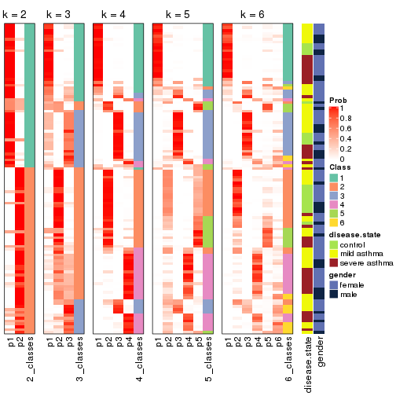


Test correlation between subgroups and known annotations. If the known
annotation is numeric, one-way ANOVA test is applied, and if the known
annotation is discrete, chi-squared contingency table test is applied.

```r
test_to_known_factors(res)
```

```
#>              n disease.state(p) gender(p) k
#> MAD:skmeans 96         0.837025     1.000 2
#> MAD:skmeans 65         0.312401     0.732 3
#> MAD:skmeans 97         0.005424     0.979 4
#> MAD:skmeans 86         0.000385     0.997 5
#> MAD:skmeans 70         0.003139     0.967 6
```


If matrix rows can be associated to genes, consider to use `GO_Enrichment(res,
...)` to perform function enrichment for the signature genes.


 

---------------------------------------------------


### MAD:pam


The object with results only for a single top-value method and a single partition method 
can be extracted as:

```r
res = res_list["MAD", "pam"]
# you can also extract it by
# res = res_list["MAD:pam"]
```

A summary of `res` and all the functions that can be applied to it:

```r
res
```

```
#> A 'ConsensusPartition' object with k = 2, 3, 4, 5, 6.
#>   On a matrix with 38950 rows and 108 columns.
#>   Top rows (1000, 2000, 3000, 4000, 5000) are extracted by 'MAD' method.
#>   Subgroups are detected by 'pam' method.
#>   Performed in total 1250 partitions by row resampling.
#>   Best k for subgroups seems to be 6.
#> 
#> Following methods can be applied to this 'ConsensusPartition' object:
#>  [1] "cola_report"             "collect_classes"         "collect_plots"          
#>  [4] "collect_stats"           "colnames"                "compare_signatures"     
#>  [7] "consensus_heatmap"       "dimension_reduction"     "functional_enrichment"  
#> [10] "get_anno_col"            "get_anno"                "get_classes"            
#> [13] "get_consensus"           "get_matrix"              "get_membership"         
#> [16] "get_param"               "get_signatures"          "get_stats"              
#> [19] "is_best_k"               "is_stable_k"             "membership_heatmap"     
#> [22] "ncol"                    "nrow"                    "plot_ecdf"              
#> [25] "rownames"                "select_partition_number" "show"                   
#> [28] "suggest_best_k"          "test_to_known_factors"
```

`collect_plots()` function collects all the plots made from `res` for all `k` (number of partitions)
into one single page to provide an easy and fast comparison between different `k`.

```r
collect_plots(res)
```


The plots are:

- The first row: a plot of the ECDF (Empirical cumulative distribution
  function) curves of the consensus matrix for each `k` and the heatmap of
  predicted classes for each `k`.
- The second row: heatmaps of the consensus matrix for each `k`.
- The third row: heatmaps of the membership matrix for each `k`.
- The fouth row: heatmaps of the signatures for each `k`.

All the plots in panels can be made by individual functions and they are
plotted later in this section.

`select_partition_number()` produces several plots showing different
statistics for choosing "optimized" `k`. There are following statistics:

- ECDF curves of the consensus matrix for each `k`;
- 1-PAC. [The PAC
  score](https://en.wikipedia.org/wiki/Consensus_clustering#Over-interpretation_potential_of_consensus_clustering)
  measures the proportion of the ambiguous subgrouping.
- Mean silhouette score.
- Concordance. The mean probability of fiting the consensus class ids in all
  partitions.
- Area increased. Denote $A_k$ as the area under the ECDF curve for current
  `k`, the area increased is defined as $A_k - A_{k-1}$.
- Rand index. The percent of pairs of samples that are both in a same cluster
  or both are not in a same cluster in the partition of k and k-1.
- Jaccard index. The ratio of pairs of samples are both in a same cluster in
  the partition of k and k-1 and the pairs of samples are both in a same
  cluster in the partition k or k-1.

The detailed explanations of these statistics can be found in [the cola
vignette](http://bioconductor.org/packages/devel/bioc/vignettes/cola/inst/doc/cola.html#toc_13).

Generally speaking, lower PAC score, higher mean silhouette score or higher
concordance corresponds to better partition. Rand index and Jaccard index
measure how similar the current partition is compared to partition with `k-1`.
If they are too similar, we won't accept `k` is better than `k-1`.

```r
select_partition_number(res)
```


The numeric values for all these statistics can be obtained by `get_stats()`.

```r
get_stats(res)
```

```
#>   k 1-PAC mean_silhouette concordance area_increased  Rand Jaccard
#> 2 2 0.338           0.391       0.713         0.4639 0.587   0.587
#> 3 3 0.331           0.485       0.763         0.3312 0.468   0.291
#> 4 4 0.455           0.514       0.740         0.1661 0.727   0.396
#> 5 5 0.581           0.458       0.704         0.0850 0.848   0.495
#> 6 6 0.678           0.667       0.819         0.0422 0.921   0.658
```

`suggest_best_k()` suggests the best $k$ based on these statistics. The rules are as follows:

- All $k$ with Jaccard index larger than 0.95 are removed because the increase of
  the partition number does not provides enough extra information. If all $k$ are removed,
  the best $k$ is assigned by `NA`.
- For $k$ with 1-PAC larger than 0.9, the maximal $k$ is taken as the "best k". Other $k$ is called "optional k".
- If it does not fit the second rule. The $k$ with the highest vote of highest
  1-PAC, mean silhouette and concordance is taken as the "best k".

```r
suggest_best_k(res)
```

```
#> [1] 6
```


Following shows the table of the partitions (You need to click the **show/hide
code output** link to see it). The membership matrix (columns with name `p*`)
is inferred by
[`clue::cl_consensus()`](https://www.rdocumentation.org/link/cl_consensus?package=clue)
function with the `SE` method. Basically the value in the membership matrix
represents the probability to belong to a certain group. The finall class
label for an item is determined with the group with highest probability it
belongs to.

In `get_classes()` function, the entropy is calculated from the membership
matrix and the silhouette score is calculated from the consensus matrix.


<script>
$( function() {
	$( '#tabs-MAD-pam-get-classes' ).tabs();
} );
</script>
<div id='tabs-MAD-pam-get-classes'>
<ul>
<li><a href='#tab-MAD-pam-get-classes-1'>k = 2</a></li>
<li><a href='#tab-MAD-pam-get-classes-2'>k = 3</a></li>
<li><a href='#tab-MAD-pam-get-classes-3'>k = 4</a></li>
<li><a href='#tab-MAD-pam-get-classes-4'>k = 5</a></li>
<li><a href='#tab-MAD-pam-get-classes-5'>k = 6</a></li>
</ul>

<div id='tab-MAD-pam-get-classes-1'>
<p><a id='tab-MAD-pam-get-classes-1-a' style='color:#0366d6' href='#'>show/hide code output</a></p>
<pre><code class="r">cbind(get_classes(res, k = 2), get_membership(res, k = 2))
</code></pre>

<pre><code>#&gt;            class entropy silhouette    p1    p2
#&gt; GSM1068478     1  0.0000    0.53992 1.000 0.000
#&gt; GSM1068479     1  0.9993    0.45080 0.516 0.484
#&gt; GSM1068481     1  0.0000    0.53992 1.000 0.000
#&gt; GSM1068482     1  0.0000    0.53992 1.000 0.000
#&gt; GSM1068483     1  0.0000    0.53992 1.000 0.000
#&gt; GSM1068486     1  0.0000    0.53992 1.000 0.000
#&gt; GSM1068487     1  0.9993    0.45080 0.516 0.484
#&gt; GSM1068488     1  1.0000   -0.62871 0.504 0.496
#&gt; GSM1068490     1  0.9993    0.45080 0.516 0.484
#&gt; GSM1068491     1  0.0000    0.53992 1.000 0.000
#&gt; GSM1068492     1  0.6887    0.49709 0.816 0.184
#&gt; GSM1068493     1  0.2778    0.53667 0.952 0.048
#&gt; GSM1068494     1  0.0672    0.53346 0.992 0.008
#&gt; GSM1068495     1  0.3274    0.53252 0.940 0.060
#&gt; GSM1068496     1  0.0000    0.53992 1.000 0.000
#&gt; GSM1068498     1  0.9993    0.45080 0.516 0.484
#&gt; GSM1068499     1  0.0000    0.53992 1.000 0.000
#&gt; GSM1068500     1  0.0000    0.53992 1.000 0.000
#&gt; GSM1068502     1  0.9993    0.45080 0.516 0.484
#&gt; GSM1068503     2  0.6247    0.14703 0.156 0.844
#&gt; GSM1068505     2  0.7139    0.50291 0.196 0.804
#&gt; GSM1068506     2  0.9993    0.63457 0.484 0.516
#&gt; GSM1068507     1  0.9977    0.27302 0.528 0.472
#&gt; GSM1068508     2  1.0000   -0.45779 0.496 0.504
#&gt; GSM1068510     2  0.1414    0.35615 0.020 0.980
#&gt; GSM1068512     1  1.0000   -0.63309 0.500 0.500
#&gt; GSM1068513     2  0.9129   -0.21971 0.328 0.672
#&gt; GSM1068514     2  0.9977    0.61391 0.472 0.528
#&gt; GSM1068517     1  0.9993    0.45080 0.516 0.484
#&gt; GSM1068518     1  0.2043    0.53614 0.968 0.032
#&gt; GSM1068520     1  0.1414    0.52204 0.980 0.020
#&gt; GSM1068521     1  0.0376    0.53713 0.996 0.004
#&gt; GSM1068522     2  0.0000    0.37095 0.000 1.000
#&gt; GSM1068524     1  0.9996    0.44883 0.512 0.488
#&gt; GSM1068527     2  0.9993    0.63457 0.484 0.516
#&gt; GSM1068480     1  0.0000    0.53992 1.000 0.000
#&gt; GSM1068484     2  0.7219    0.50512 0.200 0.800
#&gt; GSM1068485     1  0.0000    0.53992 1.000 0.000
#&gt; GSM1068489     2  0.9954    0.63063 0.460 0.540
#&gt; GSM1068497     1  0.9993    0.45080 0.516 0.484
#&gt; GSM1068501     2  0.0000    0.37095 0.000 1.000
#&gt; GSM1068504     1  0.9993    0.45080 0.516 0.484
#&gt; GSM1068509     1  0.7950    0.00786 0.760 0.240
#&gt; GSM1068511     2  1.0000    0.61683 0.500 0.500
#&gt; GSM1068515     1  0.0000    0.53992 1.000 0.000
#&gt; GSM1068516     1  0.9909   -0.49373 0.556 0.444
#&gt; GSM1068519     2  0.9993    0.63457 0.484 0.516
#&gt; GSM1068523     1  0.9996    0.44883 0.512 0.488
#&gt; GSM1068525     2  0.7950    0.48250 0.240 0.760
#&gt; GSM1068526     2  0.9993    0.63457 0.484 0.516
#&gt; GSM1068458     1  0.1633    0.51440 0.976 0.024
#&gt; GSM1068459     1  0.0000    0.53992 1.000 0.000
#&gt; GSM1068460     1  0.9608   -0.34995 0.616 0.384
#&gt; GSM1068461     1  0.0000    0.53992 1.000 0.000
#&gt; GSM1068464     1  0.9993    0.45080 0.516 0.484
#&gt; GSM1068468     1  0.9993    0.45080 0.516 0.484
#&gt; GSM1068472     1  0.9993    0.45080 0.516 0.484
#&gt; GSM1068473     1  0.9996    0.44751 0.512 0.488
#&gt; GSM1068474     1  0.9993    0.45080 0.516 0.484
#&gt; GSM1068476     1  0.4939    0.52000 0.892 0.108
#&gt; GSM1068477     1  0.9993    0.45080 0.516 0.484
#&gt; GSM1068462     1  0.9993    0.45080 0.516 0.484
#&gt; GSM1068463     1  0.0000    0.53992 1.000 0.000
#&gt; GSM1068465     1  0.9896   -0.53994 0.560 0.440
#&gt; GSM1068466     1  0.5408    0.33727 0.876 0.124
#&gt; GSM1068467     1  0.9993    0.45080 0.516 0.484
#&gt; GSM1068469     1  0.9993    0.45080 0.516 0.484
#&gt; GSM1068470     1  0.9993    0.45080 0.516 0.484
#&gt; GSM1068471     1  0.9993    0.45080 0.516 0.484
#&gt; GSM1068475     1  0.9993    0.45080 0.516 0.484
#&gt; GSM1068528     1  0.0000    0.53992 1.000 0.000
#&gt; GSM1068531     1  1.0000   -0.62871 0.504 0.496
#&gt; GSM1068532     2  1.0000    0.61567 0.500 0.500
#&gt; GSM1068533     1  0.9977   -0.59573 0.528 0.472
#&gt; GSM1068535     2  0.9993    0.63457 0.484 0.516
#&gt; GSM1068537     2  0.9993    0.63457 0.484 0.516
#&gt; GSM1068538     2  0.9993    0.63457 0.484 0.516
#&gt; GSM1068539     1  0.8608    0.46787 0.716 0.284
#&gt; GSM1068540     1  0.0376    0.53713 0.996 0.004
#&gt; GSM1068542     2  0.9970    0.63290 0.468 0.532
#&gt; GSM1068543     2  0.9993    0.63457 0.484 0.516
#&gt; GSM1068544     1  0.0000    0.53992 1.000 0.000
#&gt; GSM1068545     2  0.8861    0.35899 0.304 0.696
#&gt; GSM1068546     1  1.0000   -0.62871 0.504 0.496
#&gt; GSM1068547     1  0.5737    0.32645 0.864 0.136
#&gt; GSM1068548     2  0.9993    0.63457 0.484 0.516
#&gt; GSM1068549     1  0.0672    0.53357 0.992 0.008
#&gt; GSM1068550     2  0.9922    0.62662 0.448 0.552
#&gt; GSM1068551     1  0.9996    0.44883 0.512 0.488
#&gt; GSM1068552     2  0.9248    0.57680 0.340 0.660
#&gt; GSM1068555     1  0.9993    0.45080 0.516 0.484
#&gt; GSM1068556     2  0.9993    0.63457 0.484 0.516
#&gt; GSM1068557     1  0.9909    0.45297 0.556 0.444
#&gt; GSM1068560     1  0.1633    0.51893 0.976 0.024
#&gt; GSM1068561     1  0.3584    0.53259 0.932 0.068
#&gt; GSM1068562     1  0.2423    0.52459 0.960 0.040
#&gt; GSM1068563     2  0.9993    0.63457 0.484 0.516
#&gt; GSM1068565     1  0.9993    0.45080 0.516 0.484
#&gt; GSM1068529     1  0.0376    0.53713 0.996 0.004
#&gt; GSM1068530     1  0.8081   -0.00680 0.752 0.248
#&gt; GSM1068534     1  1.0000   -0.62871 0.504 0.496
#&gt; GSM1068536     1  0.0376    0.53713 0.996 0.004
#&gt; GSM1068541     1  0.5178    0.42443 0.884 0.116
#&gt; GSM1068553     2  0.9993    0.63457 0.484 0.516
#&gt; GSM1068554     2  0.0000    0.37095 0.000 1.000
#&gt; GSM1068558     1  0.0376    0.53713 0.996 0.004
#&gt; GSM1068559     1  0.1633    0.53749 0.976 0.024
#&gt; GSM1068564     2  0.0000    0.37095 0.000 1.000
</code></pre>

<script>
$('#tab-MAD-pam-get-classes-1-a').parent().next().next().hide();
$('#tab-MAD-pam-get-classes-1-a').click(function(){
  $('#tab-MAD-pam-get-classes-1-a').parent().next().next().toggle();
  return(false);
});
</script>
</div>

<div id='tab-MAD-pam-get-classes-2'>
<p><a id='tab-MAD-pam-get-classes-2-a' style='color:#0366d6' href='#'>show/hide code output</a></p>
<pre><code class="r">cbind(get_classes(res, k = 3), get_membership(res, k = 3))
</code></pre>

<pre><code>#&gt;            class entropy silhouette    p1    p2    p3
#&gt; GSM1068478     1  0.2165    0.53869 0.936 0.000 0.064
#&gt; GSM1068479     2  0.5138    0.47756 0.252 0.748 0.000
#&gt; GSM1068481     3  0.5737    0.58580 0.256 0.012 0.732
#&gt; GSM1068482     3  0.5216    0.59131 0.260 0.000 0.740
#&gt; GSM1068483     1  0.6359    0.09343 0.628 0.008 0.364
#&gt; GSM1068486     3  0.5737    0.58580 0.256 0.012 0.732
#&gt; GSM1068487     2  0.0000    0.75661 0.000 1.000 0.000
#&gt; GSM1068488     3  0.2866    0.60471 0.076 0.008 0.916
#&gt; GSM1068490     2  0.0000    0.75661 0.000 1.000 0.000
#&gt; GSM1068491     3  0.5404    0.59080 0.256 0.004 0.740
#&gt; GSM1068492     2  0.6291    0.07526 0.000 0.532 0.468
#&gt; GSM1068493     3  0.9423    0.24786 0.304 0.204 0.492
#&gt; GSM1068494     3  0.5529    0.56673 0.296 0.000 0.704
#&gt; GSM1068495     1  0.8220    0.45668 0.636 0.212 0.152
#&gt; GSM1068496     3  0.5291    0.58708 0.268 0.000 0.732
#&gt; GSM1068498     1  0.2261    0.54902 0.932 0.068 0.000
#&gt; GSM1068499     3  0.5291    0.58767 0.268 0.000 0.732
#&gt; GSM1068500     3  0.6286    0.33384 0.464 0.000 0.536
#&gt; GSM1068502     2  0.4121    0.61431 0.000 0.832 0.168
#&gt; GSM1068503     2  0.0000    0.75661 0.000 1.000 0.000
#&gt; GSM1068505     3  0.8581   -0.21694 0.096 0.448 0.456
#&gt; GSM1068506     3  0.6174    0.48700 0.064 0.168 0.768
#&gt; GSM1068507     2  0.4002    0.63369 0.000 0.840 0.160
#&gt; GSM1068508     2  0.3941    0.67723 0.156 0.844 0.000
#&gt; GSM1068510     2  0.3337    0.72456 0.060 0.908 0.032
#&gt; GSM1068512     3  0.0000    0.61882 0.000 0.000 1.000
#&gt; GSM1068513     2  0.0000    0.75661 0.000 1.000 0.000
#&gt; GSM1068514     3  0.5560    0.42672 0.000 0.300 0.700
#&gt; GSM1068517     1  0.5016    0.43390 0.760 0.240 0.000
#&gt; GSM1068518     3  0.5618    0.58896 0.260 0.008 0.732
#&gt; GSM1068520     1  0.2625    0.53692 0.916 0.000 0.084
#&gt; GSM1068521     1  0.2165    0.53869 0.936 0.000 0.064
#&gt; GSM1068522     2  0.7015    0.55116 0.064 0.696 0.240
#&gt; GSM1068524     2  0.0000    0.75661 0.000 1.000 0.000
#&gt; GSM1068527     3  0.2959    0.59456 0.100 0.000 0.900
#&gt; GSM1068480     3  0.5216    0.59131 0.260 0.000 0.740
#&gt; GSM1068484     2  0.8068    0.22556 0.064 0.480 0.456
#&gt; GSM1068485     3  0.5216    0.59131 0.260 0.000 0.740
#&gt; GSM1068489     3  0.5285    0.54236 0.064 0.112 0.824
#&gt; GSM1068497     1  0.5988    0.24353 0.632 0.368 0.000
#&gt; GSM1068501     2  0.8025    0.35135 0.064 0.516 0.420
#&gt; GSM1068504     2  0.0000    0.75661 0.000 1.000 0.000
#&gt; GSM1068509     3  0.4887    0.61077 0.228 0.000 0.772
#&gt; GSM1068511     3  0.0747    0.62260 0.016 0.000 0.984
#&gt; GSM1068515     3  0.8674    0.41682 0.296 0.136 0.568
#&gt; GSM1068516     3  0.6283    0.59133 0.176 0.064 0.760
#&gt; GSM1068519     3  0.5098    0.44074 0.248 0.000 0.752
#&gt; GSM1068523     2  0.5138    0.58641 0.252 0.748 0.000
#&gt; GSM1068525     2  0.4605    0.57167 0.000 0.796 0.204
#&gt; GSM1068526     3  0.6349    0.49810 0.092 0.140 0.768
#&gt; GSM1068458     1  0.5968   -0.02066 0.636 0.000 0.364
#&gt; GSM1068459     3  0.5216    0.59131 0.260 0.000 0.740
#&gt; GSM1068460     1  0.5465    0.28619 0.712 0.000 0.288
#&gt; GSM1068461     3  0.5737    0.58580 0.256 0.012 0.732
#&gt; GSM1068464     2  0.0000    0.75661 0.000 1.000 0.000
#&gt; GSM1068468     1  0.6274    0.04235 0.544 0.456 0.000
#&gt; GSM1068472     2  0.4452    0.58527 0.192 0.808 0.000
#&gt; GSM1068473     2  0.0000    0.75661 0.000 1.000 0.000
#&gt; GSM1068474     2  0.0000    0.75661 0.000 1.000 0.000
#&gt; GSM1068476     3  0.8803    0.41306 0.320 0.136 0.544
#&gt; GSM1068477     1  0.6260    0.06234 0.552 0.448 0.000
#&gt; GSM1068462     2  0.2066    0.73050 0.060 0.940 0.000
#&gt; GSM1068463     3  0.5216    0.59131 0.260 0.000 0.740
#&gt; GSM1068465     3  0.5913    0.51663 0.144 0.068 0.788
#&gt; GSM1068466     1  0.1753    0.52440 0.952 0.000 0.048
#&gt; GSM1068467     2  0.3192    0.69096 0.112 0.888 0.000
#&gt; GSM1068469     1  0.6295   -0.02654 0.528 0.472 0.000
#&gt; GSM1068470     2  0.5621    0.51332 0.308 0.692 0.000
#&gt; GSM1068471     2  0.0000    0.75661 0.000 1.000 0.000
#&gt; GSM1068475     2  0.0000    0.75661 0.000 1.000 0.000
#&gt; GSM1068528     3  0.6215    0.40417 0.428 0.000 0.572
#&gt; GSM1068531     3  0.6267    0.18473 0.452 0.000 0.548
#&gt; GSM1068532     3  0.0747    0.62325 0.016 0.000 0.984
#&gt; GSM1068533     3  0.6215    0.20228 0.428 0.000 0.572
#&gt; GSM1068535     3  0.2165    0.59991 0.064 0.000 0.936
#&gt; GSM1068537     3  0.5835    0.27124 0.340 0.000 0.660
#&gt; GSM1068538     3  0.5785    0.28465 0.332 0.000 0.668
#&gt; GSM1068539     1  0.5859    0.27241 0.656 0.344 0.000
#&gt; GSM1068540     1  0.6008    0.07485 0.628 0.000 0.372
#&gt; GSM1068542     3  0.6229    0.48258 0.064 0.172 0.764
#&gt; GSM1068543     3  0.2165    0.59991 0.064 0.000 0.936
#&gt; GSM1068544     1  0.6267   -0.16662 0.548 0.000 0.452
#&gt; GSM1068545     2  0.5778    0.57478 0.032 0.768 0.200
#&gt; GSM1068546     3  0.1411    0.62181 0.036 0.000 0.964
#&gt; GSM1068547     1  0.5058    0.32535 0.756 0.000 0.244
#&gt; GSM1068548     3  0.1964    0.61087 0.056 0.000 0.944
#&gt; GSM1068549     3  0.5216    0.59131 0.260 0.000 0.740
#&gt; GSM1068550     3  0.6119    0.49276 0.064 0.164 0.772
#&gt; GSM1068551     2  0.5650    0.41494 0.312 0.688 0.000
#&gt; GSM1068552     3  0.7748    0.21462 0.064 0.340 0.596
#&gt; GSM1068555     2  0.5621    0.51332 0.308 0.692 0.000
#&gt; GSM1068556     3  0.0237    0.61847 0.004 0.000 0.996
#&gt; GSM1068557     2  0.6490    0.41599 0.256 0.708 0.036
#&gt; GSM1068560     3  0.7767    0.44111 0.412 0.052 0.536
#&gt; GSM1068561     1  0.9625   -0.00961 0.408 0.204 0.388
#&gt; GSM1068562     3  0.5397    0.59894 0.280 0.000 0.720
#&gt; GSM1068563     3  0.2165    0.59991 0.064 0.000 0.936
#&gt; GSM1068565     2  0.0237    0.75542 0.004 0.996 0.000
#&gt; GSM1068529     3  0.5216    0.59131 0.260 0.000 0.740
#&gt; GSM1068530     1  0.6235    0.06266 0.564 0.000 0.436
#&gt; GSM1068534     3  0.0983    0.62260 0.016 0.004 0.980
#&gt; GSM1068536     3  0.6252    0.37184 0.444 0.000 0.556
#&gt; GSM1068541     3  0.8765    0.41295 0.252 0.168 0.580
#&gt; GSM1068553     3  0.2165    0.59991 0.064 0.000 0.936
#&gt; GSM1068554     2  0.7267    0.52425 0.064 0.668 0.268
#&gt; GSM1068558     3  0.7830    0.51086 0.136 0.196 0.668
#&gt; GSM1068559     3  0.5728    0.59211 0.272 0.008 0.720
#&gt; GSM1068564     2  0.7091    0.54426 0.064 0.688 0.248
</code></pre>

<script>
$('#tab-MAD-pam-get-classes-2-a').parent().next().next().hide();
$('#tab-MAD-pam-get-classes-2-a').click(function(){
  $('#tab-MAD-pam-get-classes-2-a').parent().next().next().toggle();
  return(false);
});
</script>
</div>

<div id='tab-MAD-pam-get-classes-3'>
<p><a id='tab-MAD-pam-get-classes-3-a' style='color:#0366d6' href='#'>show/hide code output</a></p>
<pre><code class="r">cbind(get_classes(res, k = 4), get_membership(res, k = 4))
</code></pre>

<pre><code>#&gt;            class entropy silhouette    p1    p2    p3    p4
#&gt; GSM1068478     1  0.2704    0.47485 0.876 0.000 0.124 0.000
#&gt; GSM1068479     2  0.3400    0.66578 0.000 0.820 0.180 0.000
#&gt; GSM1068481     3  0.0707    0.62603 0.000 0.020 0.980 0.000
#&gt; GSM1068482     3  0.3649    0.67858 0.000 0.000 0.796 0.204
#&gt; GSM1068483     1  0.7112    0.42107 0.624 0.020 0.192 0.164
#&gt; GSM1068486     3  0.0707    0.62603 0.000 0.020 0.980 0.000
#&gt; GSM1068487     2  0.0000    0.75229 0.000 1.000 0.000 0.000
#&gt; GSM1068488     4  0.4761    0.07850 0.000 0.000 0.372 0.628
#&gt; GSM1068490     2  0.0000    0.75229 0.000 1.000 0.000 0.000
#&gt; GSM1068491     3  0.0336    0.63305 0.000 0.008 0.992 0.000
#&gt; GSM1068492     3  0.7375    0.39880 0.000 0.336 0.488 0.176
#&gt; GSM1068493     2  0.8728   -0.03416 0.064 0.400 0.368 0.168
#&gt; GSM1068494     3  0.5334    0.62053 0.036 0.000 0.680 0.284
#&gt; GSM1068495     1  0.8153   -0.18484 0.448 0.340 0.188 0.024
#&gt; GSM1068496     3  0.5109    0.65175 0.052 0.000 0.736 0.212
#&gt; GSM1068498     1  0.0000    0.52660 1.000 0.000 0.000 0.000
#&gt; GSM1068499     3  0.4175    0.67401 0.012 0.000 0.776 0.212
#&gt; GSM1068500     1  0.7830   -0.01476 0.408 0.008 0.396 0.188
#&gt; GSM1068502     2  0.4761    0.25607 0.000 0.628 0.372 0.000
#&gt; GSM1068503     2  0.0000    0.75229 0.000 1.000 0.000 0.000
#&gt; GSM1068505     4  0.2011    0.71584 0.000 0.080 0.000 0.920
#&gt; GSM1068506     4  0.1118    0.74297 0.000 0.000 0.036 0.964
#&gt; GSM1068507     2  0.3616    0.65676 0.000 0.852 0.036 0.112
#&gt; GSM1068508     2  0.3123    0.69991 0.156 0.844 0.000 0.000
#&gt; GSM1068510     2  0.5256    0.27495 0.000 0.596 0.012 0.392
#&gt; GSM1068512     3  0.4866    0.47217 0.000 0.000 0.596 0.404
#&gt; GSM1068513     2  0.0000    0.75229 0.000 1.000 0.000 0.000
#&gt; GSM1068514     3  0.7007    0.53353 0.000 0.208 0.580 0.212
#&gt; GSM1068517     1  0.7159   -0.00930 0.548 0.272 0.180 0.000
#&gt; GSM1068518     3  0.4175    0.67512 0.000 0.012 0.776 0.212
#&gt; GSM1068520     1  0.0000    0.52660 1.000 0.000 0.000 0.000
#&gt; GSM1068521     1  0.0000    0.52660 1.000 0.000 0.000 0.000
#&gt; GSM1068522     4  0.3764    0.59447 0.000 0.216 0.000 0.784
#&gt; GSM1068524     2  0.0707    0.74626 0.000 0.980 0.000 0.020
#&gt; GSM1068527     4  0.0000    0.74901 0.000 0.000 0.000 1.000
#&gt; GSM1068480     3  0.3726    0.67732 0.000 0.000 0.788 0.212
#&gt; GSM1068484     4  0.2081    0.71441 0.000 0.084 0.000 0.916
#&gt; GSM1068485     3  0.0000    0.63680 0.000 0.000 1.000 0.000
#&gt; GSM1068489     4  0.0000    0.74901 0.000 0.000 0.000 1.000
#&gt; GSM1068497     1  0.7475   -0.24247 0.448 0.372 0.180 0.000
#&gt; GSM1068501     4  0.3726    0.59709 0.000 0.212 0.000 0.788
#&gt; GSM1068504     2  0.0000    0.75229 0.000 1.000 0.000 0.000
#&gt; GSM1068509     4  0.4741    0.32741 0.004 0.000 0.328 0.668
#&gt; GSM1068511     3  0.4898    0.45137 0.000 0.000 0.584 0.416
#&gt; GSM1068515     4  0.7544   -0.08019 0.000 0.200 0.340 0.460
#&gt; GSM1068516     4  0.3356    0.63013 0.000 0.000 0.176 0.824
#&gt; GSM1068519     4  0.1211    0.73495 0.040 0.000 0.000 0.960
#&gt; GSM1068523     2  0.4103    0.63281 0.256 0.744 0.000 0.000
#&gt; GSM1068525     2  0.4586    0.59502 0.000 0.796 0.068 0.136
#&gt; GSM1068526     4  0.2011    0.71948 0.000 0.000 0.080 0.920
#&gt; GSM1068458     1  0.6975    0.38359 0.560 0.000 0.148 0.292
#&gt; GSM1068459     3  0.0000    0.63680 0.000 0.000 1.000 0.000
#&gt; GSM1068460     4  0.4312    0.64152 0.132 0.000 0.056 0.812
#&gt; GSM1068461     3  0.0707    0.62603 0.000 0.020 0.980 0.000
#&gt; GSM1068464     2  0.0000    0.75229 0.000 1.000 0.000 0.000
#&gt; GSM1068468     2  0.7369    0.40133 0.324 0.496 0.180 0.000
#&gt; GSM1068472     2  0.3172    0.68294 0.000 0.840 0.160 0.000
#&gt; GSM1068473     2  0.0000    0.75229 0.000 1.000 0.000 0.000
#&gt; GSM1068474     2  0.0000    0.75229 0.000 1.000 0.000 0.000
#&gt; GSM1068476     3  0.3266    0.50742 0.000 0.000 0.832 0.168
#&gt; GSM1068477     2  0.7449    0.35522 0.356 0.464 0.180 0.000
#&gt; GSM1068462     2  0.1557    0.74173 0.000 0.944 0.056 0.000
#&gt; GSM1068463     3  0.0000    0.63680 0.000 0.000 1.000 0.000
#&gt; GSM1068465     1  0.7120    0.32793 0.564 0.000 0.224 0.212
#&gt; GSM1068466     1  0.1471    0.52862 0.960 0.004 0.012 0.024
#&gt; GSM1068467     2  0.2334    0.72853 0.004 0.908 0.088 0.000
#&gt; GSM1068469     2  0.7421    0.36119 0.356 0.468 0.176 0.000
#&gt; GSM1068470     2  0.4776    0.51554 0.376 0.624 0.000 0.000
#&gt; GSM1068471     2  0.0000    0.75229 0.000 1.000 0.000 0.000
#&gt; GSM1068475     2  0.0469    0.74999 0.012 0.988 0.000 0.000
#&gt; GSM1068528     3  0.7362    0.00756 0.372 0.000 0.464 0.164
#&gt; GSM1068531     1  0.4967    0.21201 0.548 0.000 0.000 0.452
#&gt; GSM1068532     3  0.6883    0.51237 0.192 0.000 0.596 0.212
#&gt; GSM1068533     1  0.6476    0.41355 0.616 0.000 0.272 0.112
#&gt; GSM1068535     4  0.0188    0.74869 0.000 0.000 0.004 0.996
#&gt; GSM1068537     1  0.6850    0.38184 0.600 0.000 0.212 0.188
#&gt; GSM1068538     1  0.7196    0.34923 0.552 0.000 0.212 0.236
#&gt; GSM1068539     1  0.8262   -0.19953 0.448 0.340 0.180 0.032
#&gt; GSM1068540     1  0.6634    0.40832 0.624 0.000 0.212 0.164
#&gt; GSM1068542     4  0.1792    0.72788 0.000 0.000 0.068 0.932
#&gt; GSM1068543     4  0.1792    0.72788 0.000 0.000 0.068 0.932
#&gt; GSM1068544     3  0.4661    0.06801 0.348 0.000 0.652 0.000
#&gt; GSM1068545     2  0.4699    0.51344 0.004 0.676 0.000 0.320
#&gt; GSM1068546     3  0.4697    0.24871 0.000 0.000 0.644 0.356
#&gt; GSM1068547     1  0.4514    0.51632 0.796 0.000 0.056 0.148
#&gt; GSM1068548     4  0.3945    0.53205 0.004 0.000 0.216 0.780
#&gt; GSM1068549     3  0.0000    0.63680 0.000 0.000 1.000 0.000
#&gt; GSM1068550     4  0.0000    0.74901 0.000 0.000 0.000 1.000
#&gt; GSM1068551     2  0.4949    0.65196 0.060 0.760 0.180 0.000
#&gt; GSM1068552     4  0.1913    0.74699 0.000 0.020 0.040 0.940
#&gt; GSM1068555     2  0.4761    0.52007 0.372 0.628 0.000 0.000
#&gt; GSM1068556     4  0.4103    0.46777 0.000 0.000 0.256 0.744
#&gt; GSM1068557     2  0.5417    0.62637 0.000 0.732 0.180 0.088
#&gt; GSM1068560     4  0.4277    0.44896 0.000 0.000 0.280 0.720
#&gt; GSM1068561     2  0.9178    0.08194 0.140 0.392 0.340 0.128
#&gt; GSM1068562     3  0.4382    0.63488 0.000 0.000 0.704 0.296
#&gt; GSM1068563     4  0.2149    0.71829 0.000 0.000 0.088 0.912
#&gt; GSM1068565     2  0.0707    0.74776 0.020 0.980 0.000 0.000
#&gt; GSM1068529     3  0.3837    0.67467 0.000 0.000 0.776 0.224
#&gt; GSM1068530     1  0.5906    0.47423 0.700 0.000 0.148 0.152
#&gt; GSM1068534     3  0.4877    0.46570 0.000 0.000 0.592 0.408
#&gt; GSM1068536     3  0.7629   -0.02707 0.392 0.000 0.404 0.204
#&gt; GSM1068541     4  0.8985   -0.18169 0.060 0.240 0.336 0.364
#&gt; GSM1068553     4  0.0000    0.74901 0.000 0.000 0.000 1.000
#&gt; GSM1068554     4  0.3726    0.59709 0.000 0.212 0.000 0.788
#&gt; GSM1068558     3  0.7007    0.52201 0.000 0.208 0.580 0.212
#&gt; GSM1068559     3  0.4053    0.67481 0.000 0.004 0.768 0.228
#&gt; GSM1068564     4  0.3764    0.59447 0.000 0.216 0.000 0.784
</code></pre>

<script>
$('#tab-MAD-pam-get-classes-3-a').parent().next().next().hide();
$('#tab-MAD-pam-get-classes-3-a').click(function(){
  $('#tab-MAD-pam-get-classes-3-a').parent().next().next().toggle();
  return(false);
});
</script>
</div>

<div id='tab-MAD-pam-get-classes-4'>
<p><a id='tab-MAD-pam-get-classes-4-a' style='color:#0366d6' href='#'>show/hide code output</a></p>
<pre><code class="r">cbind(get_classes(res, k = 5), get_membership(res, k = 5))
</code></pre>

<pre><code>#&gt;            class entropy silhouette    p1    p2    p3    p4    p5
#&gt; GSM1068478     1  0.3452    0.24505 0.756 0.000 0.244 0.000 0.000
#&gt; GSM1068479     2  0.4182    0.40520 0.000 0.644 0.352 0.000 0.004
#&gt; GSM1068481     3  0.4307    0.28778 0.000 0.000 0.504 0.000 0.496
#&gt; GSM1068482     5  0.0794    0.31695 0.000 0.000 0.028 0.000 0.972
#&gt; GSM1068483     1  0.4604    0.46855 0.584 0.008 0.004 0.000 0.404
#&gt; GSM1068486     5  0.4307   -0.34717 0.000 0.000 0.496 0.000 0.504
#&gt; GSM1068487     2  0.0000    0.78202 0.000 1.000 0.000 0.000 0.000
#&gt; GSM1068488     4  0.3123    0.69887 0.000 0.000 0.012 0.828 0.160
#&gt; GSM1068490     2  0.0162    0.78103 0.000 0.996 0.004 0.000 0.000
#&gt; GSM1068491     3  0.2966    0.24164 0.000 0.000 0.816 0.000 0.184
#&gt; GSM1068492     2  0.4632    0.17002 0.000 0.540 0.012 0.000 0.448
#&gt; GSM1068493     5  0.7181    0.30836 0.044 0.152 0.384 0.000 0.420
#&gt; GSM1068494     5  0.5143    0.49422 0.000 0.000 0.368 0.048 0.584
#&gt; GSM1068495     3  0.6190    0.26845 0.412 0.044 0.496 0.000 0.048
#&gt; GSM1068496     5  0.4060    0.49999 0.000 0.000 0.360 0.000 0.640
#&gt; GSM1068498     1  0.2389    0.42200 0.880 0.004 0.116 0.000 0.000
#&gt; GSM1068499     5  0.4171    0.48912 0.000 0.000 0.396 0.000 0.604
#&gt; GSM1068500     5  0.6108    0.43875 0.136 0.000 0.356 0.000 0.508
#&gt; GSM1068502     2  0.2997    0.66694 0.000 0.840 0.012 0.000 0.148
#&gt; GSM1068503     2  0.0000    0.78202 0.000 1.000 0.000 0.000 0.000
#&gt; GSM1068505     4  0.0290    0.83118 0.000 0.000 0.000 0.992 0.008
#&gt; GSM1068506     4  0.2605    0.75687 0.000 0.000 0.000 0.852 0.148
#&gt; GSM1068507     2  0.2848    0.67439 0.000 0.840 0.004 0.000 0.156
#&gt; GSM1068508     2  0.2690    0.71032 0.156 0.844 0.000 0.000 0.000
#&gt; GSM1068510     4  0.4455    0.17940 0.000 0.404 0.000 0.588 0.008
#&gt; GSM1068512     5  0.3999    0.31859 0.000 0.000 0.000 0.344 0.656
#&gt; GSM1068513     2  0.0162    0.78103 0.000 0.996 0.000 0.000 0.004
#&gt; GSM1068514     5  0.4444    0.27819 0.000 0.364 0.012 0.000 0.624
#&gt; GSM1068517     3  0.5596    0.25291 0.444 0.052 0.496 0.000 0.008
#&gt; GSM1068518     5  0.4196    0.49676 0.000 0.004 0.356 0.000 0.640
#&gt; GSM1068520     1  0.0000    0.51726 1.000 0.000 0.000 0.000 0.000
#&gt; GSM1068521     1  0.0290    0.52161 0.992 0.000 0.000 0.008 0.000
#&gt; GSM1068522     4  0.0609    0.82607 0.000 0.020 0.000 0.980 0.000
#&gt; GSM1068524     2  0.0404    0.77842 0.000 0.988 0.000 0.012 0.000
#&gt; GSM1068527     4  0.0703    0.82694 0.000 0.000 0.000 0.976 0.024
#&gt; GSM1068480     5  0.0290    0.33744 0.000 0.000 0.008 0.000 0.992
#&gt; GSM1068484     4  0.0579    0.83054 0.000 0.008 0.000 0.984 0.008
#&gt; GSM1068485     3  0.4278    0.29942 0.000 0.000 0.548 0.000 0.452
#&gt; GSM1068489     4  0.0290    0.83118 0.000 0.000 0.000 0.992 0.008
#&gt; GSM1068497     3  0.5795    0.27914 0.412 0.092 0.496 0.000 0.000
#&gt; GSM1068501     4  0.0290    0.82901 0.000 0.008 0.000 0.992 0.000
#&gt; GSM1068504     2  0.0000    0.78202 0.000 1.000 0.000 0.000 0.000
#&gt; GSM1068509     5  0.6699    0.37995 0.000 0.000 0.268 0.304 0.428
#&gt; GSM1068511     5  0.3999    0.31859 0.000 0.000 0.000 0.344 0.656
#&gt; GSM1068515     3  0.6644   -0.30067 0.000 0.008 0.460 0.176 0.356
#&gt; GSM1068516     4  0.5304    0.45494 0.000 0.000 0.088 0.640 0.272
#&gt; GSM1068519     4  0.0290    0.82800 0.000 0.000 0.000 0.992 0.008
#&gt; GSM1068523     2  0.3612    0.61617 0.268 0.732 0.000 0.000 0.000
#&gt; GSM1068525     2  0.3177    0.61739 0.000 0.792 0.000 0.000 0.208
#&gt; GSM1068526     4  0.3336    0.66473 0.000 0.000 0.000 0.772 0.228
#&gt; GSM1068458     1  0.5396    0.50208 0.588 0.000 0.000 0.072 0.340
#&gt; GSM1068459     3  0.4307    0.28429 0.000 0.000 0.500 0.000 0.500
#&gt; GSM1068460     4  0.2605    0.69637 0.000 0.000 0.148 0.852 0.000
#&gt; GSM1068461     3  0.4304    0.29147 0.000 0.000 0.516 0.000 0.484
#&gt; GSM1068464     2  0.0000    0.78202 0.000 1.000 0.000 0.000 0.000
#&gt; GSM1068468     3  0.6465    0.27146 0.376 0.184 0.440 0.000 0.000
#&gt; GSM1068472     2  0.3424    0.58791 0.000 0.760 0.240 0.000 0.000
#&gt; GSM1068473     2  0.0162    0.78103 0.000 0.996 0.004 0.000 0.000
#&gt; GSM1068474     2  0.0000    0.78202 0.000 1.000 0.000 0.000 0.000
#&gt; GSM1068476     3  0.2674    0.24065 0.000 0.000 0.856 0.004 0.140
#&gt; GSM1068477     3  0.6110    0.28268 0.396 0.128 0.476 0.000 0.000
#&gt; GSM1068462     2  0.1732    0.74746 0.000 0.920 0.080 0.000 0.000
#&gt; GSM1068463     5  0.4306   -0.34534 0.000 0.000 0.492 0.000 0.508
#&gt; GSM1068465     5  0.4450   -0.31137 0.488 0.000 0.004 0.000 0.508
#&gt; GSM1068466     1  0.0865    0.52843 0.972 0.000 0.000 0.024 0.004
#&gt; GSM1068467     2  0.2971    0.68588 0.008 0.836 0.156 0.000 0.000
#&gt; GSM1068469     3  0.6519    0.23025 0.400 0.192 0.408 0.000 0.000
#&gt; GSM1068470     2  0.5915    0.29723 0.412 0.484 0.104 0.000 0.000
#&gt; GSM1068471     2  0.0000    0.78202 0.000 1.000 0.000 0.000 0.000
#&gt; GSM1068475     2  0.0000    0.78202 0.000 1.000 0.000 0.000 0.000
#&gt; GSM1068528     3  0.5740   -0.27906 0.112 0.000 0.580 0.000 0.308
#&gt; GSM1068531     1  0.4268    0.21163 0.556 0.000 0.000 0.444 0.000
#&gt; GSM1068532     5  0.4639    0.00138 0.344 0.000 0.012 0.008 0.636
#&gt; GSM1068533     1  0.6179    0.50256 0.588 0.000 0.128 0.016 0.268
#&gt; GSM1068535     4  0.0510    0.83001 0.000 0.000 0.000 0.984 0.016
#&gt; GSM1068537     1  0.4455    0.47828 0.588 0.000 0.000 0.008 0.404
#&gt; GSM1068538     1  0.4455    0.47828 0.588 0.000 0.000 0.008 0.404
#&gt; GSM1068539     3  0.6128    0.27801 0.412 0.076 0.496 0.008 0.008
#&gt; GSM1068540     1  0.4455    0.47828 0.588 0.000 0.000 0.008 0.404
#&gt; GSM1068542     4  0.3109    0.70346 0.000 0.000 0.000 0.800 0.200
#&gt; GSM1068543     4  0.3109    0.70346 0.000 0.000 0.000 0.800 0.200
#&gt; GSM1068544     3  0.5989    0.27682 0.128 0.000 0.536 0.000 0.336
#&gt; GSM1068545     2  0.4747    0.42999 0.000 0.620 0.000 0.352 0.028
#&gt; GSM1068546     3  0.5454    0.28028 0.000 0.000 0.488 0.060 0.452
#&gt; GSM1068547     1  0.3565    0.58453 0.800 0.000 0.000 0.024 0.176
#&gt; GSM1068548     4  0.4307   -0.02437 0.000 0.000 0.000 0.504 0.496
#&gt; GSM1068549     3  0.4307    0.28670 0.000 0.000 0.504 0.000 0.496
#&gt; GSM1068550     4  0.0290    0.83118 0.000 0.000 0.000 0.992 0.008
#&gt; GSM1068551     2  0.5320    0.32136 0.060 0.572 0.368 0.000 0.000
#&gt; GSM1068552     4  0.2439    0.77886 0.000 0.004 0.000 0.876 0.120
#&gt; GSM1068555     2  0.5519    0.34886 0.412 0.520 0.068 0.000 0.000
#&gt; GSM1068556     5  0.4304   -0.00230 0.000 0.000 0.000 0.484 0.516
#&gt; GSM1068557     2  0.6653    0.13794 0.000 0.420 0.384 0.192 0.004
#&gt; GSM1068560     3  0.6792   -0.29601 0.000 0.000 0.372 0.340 0.288
#&gt; GSM1068561     3  0.7809   -0.24354 0.084 0.188 0.384 0.000 0.344
#&gt; GSM1068562     5  0.5518    0.47456 0.000 0.000 0.384 0.072 0.544
#&gt; GSM1068563     4  0.3177    0.70206 0.000 0.000 0.000 0.792 0.208
#&gt; GSM1068565     2  0.0162    0.78113 0.004 0.996 0.000 0.000 0.000
#&gt; GSM1068529     5  0.4238    0.49773 0.000 0.000 0.368 0.004 0.628
#&gt; GSM1068530     1  0.4201    0.54165 0.664 0.000 0.000 0.008 0.328
#&gt; GSM1068534     5  0.3999    0.31859 0.000 0.000 0.000 0.344 0.656
#&gt; GSM1068536     5  0.5329    0.44194 0.052 0.000 0.432 0.000 0.516
#&gt; GSM1068541     5  0.8224    0.37126 0.040 0.112 0.312 0.096 0.440
#&gt; GSM1068553     4  0.0290    0.83118 0.000 0.000 0.000 0.992 0.008
#&gt; GSM1068554     4  0.0290    0.82901 0.000 0.008 0.000 0.992 0.000
#&gt; GSM1068558     5  0.5702    0.44526 0.000 0.192 0.180 0.000 0.628
#&gt; GSM1068559     5  0.4460    0.48951 0.000 0.004 0.392 0.004 0.600
#&gt; GSM1068564     4  0.0510    0.82670 0.000 0.016 0.000 0.984 0.000
</code></pre>

<script>
$('#tab-MAD-pam-get-classes-4-a').parent().next().next().hide();
$('#tab-MAD-pam-get-classes-4-a').click(function(){
  $('#tab-MAD-pam-get-classes-4-a').parent().next().next().toggle();
  return(false);
});
</script>
</div>

<div id='tab-MAD-pam-get-classes-5'>
<p><a id='tab-MAD-pam-get-classes-5-a' style='color:#0366d6' href='#'>show/hide code output</a></p>
<pre><code class="r">cbind(get_classes(res, k = 6), get_membership(res, k = 6))
</code></pre>

<pre><code>#&gt;            class entropy silhouette    p1    p2    p3    p4    p5    p6
#&gt; GSM1068478     5  0.1141      0.756 0.052 0.000 0.000 0.000 0.948 0.000
#&gt; GSM1068479     2  0.3240      0.692 0.000 0.812 0.000 0.000 0.148 0.040
#&gt; GSM1068481     3  0.1610      0.769 0.000 0.000 0.916 0.000 0.000 0.084
#&gt; GSM1068482     6  0.3765      0.326 0.000 0.000 0.404 0.000 0.000 0.596
#&gt; GSM1068483     1  0.3245      0.652 0.764 0.008 0.000 0.000 0.000 0.228
#&gt; GSM1068486     3  0.1814      0.761 0.000 0.000 0.900 0.000 0.000 0.100
#&gt; GSM1068487     2  0.0000      0.845 0.000 1.000 0.000 0.000 0.000 0.000
#&gt; GSM1068488     4  0.5096      0.323 0.000 0.000 0.100 0.576 0.000 0.324
#&gt; GSM1068490     2  0.0000      0.845 0.000 1.000 0.000 0.000 0.000 0.000
#&gt; GSM1068491     3  0.3634      0.554 0.000 0.000 0.644 0.000 0.000 0.356
#&gt; GSM1068492     6  0.4929      0.330 0.000 0.280 0.100 0.000 0.000 0.620
#&gt; GSM1068493     6  0.5302      0.514 0.000 0.208 0.000 0.000 0.192 0.600
#&gt; GSM1068494     6  0.2944      0.669 0.008 0.000 0.000 0.012 0.148 0.832
#&gt; GSM1068495     5  0.0865      0.783 0.000 0.000 0.000 0.000 0.964 0.036
#&gt; GSM1068496     6  0.1910      0.671 0.000 0.000 0.000 0.000 0.108 0.892
#&gt; GSM1068498     5  0.2340      0.623 0.148 0.000 0.000 0.000 0.852 0.000
#&gt; GSM1068499     6  0.3717      0.660 0.000 0.000 0.072 0.000 0.148 0.780
#&gt; GSM1068500     6  0.4728      0.618 0.176 0.000 0.000 0.000 0.144 0.680
#&gt; GSM1068502     2  0.5083      0.362 0.000 0.580 0.100 0.000 0.000 0.320
#&gt; GSM1068503     2  0.0000      0.845 0.000 1.000 0.000 0.000 0.000 0.000
#&gt; GSM1068505     4  0.0000      0.835 0.000 0.000 0.000 1.000 0.000 0.000
#&gt; GSM1068506     4  0.2340      0.760 0.000 0.000 0.000 0.852 0.000 0.148
#&gt; GSM1068507     2  0.2416      0.714 0.000 0.844 0.000 0.000 0.000 0.156
#&gt; GSM1068508     2  0.2416      0.724 0.000 0.844 0.000 0.000 0.156 0.000
#&gt; GSM1068510     4  0.4100      0.238 0.000 0.388 0.008 0.600 0.000 0.004
#&gt; GSM1068512     6  0.0865      0.636 0.000 0.000 0.000 0.036 0.000 0.964
#&gt; GSM1068513     2  0.0000      0.845 0.000 1.000 0.000 0.000 0.000 0.000
#&gt; GSM1068514     6  0.3103      0.569 0.000 0.064 0.100 0.000 0.000 0.836
#&gt; GSM1068517     5  0.0000      0.791 0.000 0.000 0.000 0.000 1.000 0.000
#&gt; GSM1068518     6  0.1958      0.596 0.000 0.004 0.100 0.000 0.000 0.896
#&gt; GSM1068520     1  0.2941      0.730 0.780 0.000 0.000 0.000 0.220 0.000
#&gt; GSM1068521     1  0.2697      0.766 0.812 0.000 0.000 0.000 0.188 0.000
#&gt; GSM1068522     4  0.0363      0.832 0.000 0.012 0.000 0.988 0.000 0.000
#&gt; GSM1068524     2  0.0363      0.840 0.000 0.988 0.000 0.012 0.000 0.000
#&gt; GSM1068527     4  0.1700      0.815 0.048 0.000 0.000 0.928 0.000 0.024
#&gt; GSM1068480     6  0.3288      0.509 0.000 0.000 0.276 0.000 0.000 0.724
#&gt; GSM1068484     4  0.0146      0.834 0.000 0.004 0.000 0.996 0.000 0.000
#&gt; GSM1068485     3  0.0000      0.767 0.000 0.000 1.000 0.000 0.000 0.000
#&gt; GSM1068489     4  0.0000      0.835 0.000 0.000 0.000 1.000 0.000 0.000
#&gt; GSM1068497     5  0.0000      0.791 0.000 0.000 0.000 0.000 1.000 0.000
#&gt; GSM1068501     4  0.0000      0.835 0.000 0.000 0.000 1.000 0.000 0.000
#&gt; GSM1068504     2  0.0000      0.845 0.000 1.000 0.000 0.000 0.000 0.000
#&gt; GSM1068509     6  0.5188      0.502 0.000 0.000 0.000 0.288 0.124 0.588
#&gt; GSM1068511     6  0.1007      0.637 0.000 0.000 0.000 0.044 0.000 0.956
#&gt; GSM1068515     6  0.5587      0.472 0.000 0.000 0.000 0.168 0.308 0.524
#&gt; GSM1068516     4  0.4597      0.494 0.000 0.000 0.000 0.652 0.072 0.276
#&gt; GSM1068519     4  0.0363      0.832 0.012 0.000 0.000 0.988 0.000 0.000
#&gt; GSM1068523     2  0.3244      0.553 0.000 0.732 0.000 0.000 0.268 0.000
#&gt; GSM1068525     2  0.2823      0.654 0.000 0.796 0.000 0.000 0.000 0.204
#&gt; GSM1068526     4  0.2996      0.674 0.000 0.000 0.000 0.772 0.000 0.228
#&gt; GSM1068458     1  0.3098      0.748 0.812 0.000 0.000 0.024 0.000 0.164
#&gt; GSM1068459     3  0.1863      0.743 0.000 0.000 0.896 0.000 0.000 0.104
#&gt; GSM1068460     4  0.1511      0.801 0.004 0.000 0.000 0.940 0.044 0.012
#&gt; GSM1068461     3  0.0000      0.767 0.000 0.000 1.000 0.000 0.000 0.000
#&gt; GSM1068464     2  0.0000      0.845 0.000 1.000 0.000 0.000 0.000 0.000
#&gt; GSM1068468     5  0.4315      0.440 0.000 0.328 0.000 0.000 0.636 0.036
#&gt; GSM1068472     2  0.2930      0.725 0.000 0.840 0.000 0.000 0.124 0.036
#&gt; GSM1068473     2  0.0000      0.845 0.000 1.000 0.000 0.000 0.000 0.000
#&gt; GSM1068474     2  0.0000      0.845 0.000 1.000 0.000 0.000 0.000 0.000
#&gt; GSM1068476     3  0.4941      0.508 0.000 0.000 0.648 0.000 0.140 0.212
#&gt; GSM1068477     5  0.3247      0.716 0.000 0.156 0.000 0.000 0.808 0.036
#&gt; GSM1068462     2  0.1333      0.819 0.000 0.944 0.000 0.000 0.048 0.008
#&gt; GSM1068463     3  0.1765      0.764 0.000 0.000 0.904 0.000 0.000 0.096
#&gt; GSM1068465     6  0.3634      0.402 0.356 0.000 0.000 0.000 0.000 0.644
#&gt; GSM1068466     1  0.2805      0.769 0.812 0.000 0.000 0.004 0.184 0.000
#&gt; GSM1068467     2  0.1983      0.797 0.000 0.908 0.000 0.000 0.072 0.020
#&gt; GSM1068469     5  0.0458      0.792 0.000 0.016 0.000 0.000 0.984 0.000
#&gt; GSM1068470     5  0.3023      0.657 0.000 0.232 0.000 0.000 0.768 0.000
#&gt; GSM1068471     2  0.0000      0.845 0.000 1.000 0.000 0.000 0.000 0.000
#&gt; GSM1068475     2  0.0000      0.845 0.000 1.000 0.000 0.000 0.000 0.000
#&gt; GSM1068528     3  0.5636     -0.166 0.000 0.000 0.428 0.000 0.148 0.424
#&gt; GSM1068531     1  0.2730      0.732 0.808 0.000 0.000 0.192 0.000 0.000
#&gt; GSM1068532     6  0.4892      0.313 0.272 0.000 0.100 0.000 0.000 0.628
#&gt; GSM1068533     1  0.0363      0.840 0.988 0.000 0.012 0.000 0.000 0.000
#&gt; GSM1068535     4  0.0146      0.834 0.000 0.000 0.004 0.996 0.000 0.000
#&gt; GSM1068537     1  0.0146      0.844 0.996 0.000 0.000 0.000 0.000 0.004
#&gt; GSM1068538     1  0.0000      0.843 1.000 0.000 0.000 0.000 0.000 0.000
#&gt; GSM1068539     5  0.1010      0.782 0.004 0.000 0.000 0.000 0.960 0.036
#&gt; GSM1068540     1  0.0146      0.844 0.996 0.000 0.000 0.000 0.000 0.004
#&gt; GSM1068542     4  0.2793      0.709 0.000 0.000 0.000 0.800 0.000 0.200
#&gt; GSM1068543     4  0.2793      0.709 0.000 0.000 0.000 0.800 0.000 0.200
#&gt; GSM1068544     3  0.2070      0.717 0.100 0.000 0.892 0.000 0.000 0.008
#&gt; GSM1068545     2  0.4144      0.437 0.000 0.620 0.000 0.360 0.000 0.020
#&gt; GSM1068546     3  0.2006      0.765 0.000 0.000 0.904 0.016 0.000 0.080
#&gt; GSM1068547     1  0.3384      0.782 0.820 0.000 0.000 0.016 0.032 0.132
#&gt; GSM1068548     6  0.3955      0.219 0.004 0.000 0.000 0.436 0.000 0.560
#&gt; GSM1068549     3  0.3499      0.583 0.000 0.000 0.680 0.000 0.000 0.320
#&gt; GSM1068550     4  0.0000      0.835 0.000 0.000 0.000 1.000 0.000 0.000
#&gt; GSM1068551     2  0.3671      0.647 0.000 0.756 0.000 0.000 0.208 0.036
#&gt; GSM1068552     4  0.2003      0.784 0.000 0.000 0.000 0.884 0.000 0.116
#&gt; GSM1068555     5  0.3838      0.253 0.000 0.448 0.000 0.000 0.552 0.000
#&gt; GSM1068556     6  0.3706      0.353 0.000 0.000 0.000 0.380 0.000 0.620
#&gt; GSM1068557     2  0.5708      0.507 0.000 0.616 0.000 0.200 0.148 0.036
#&gt; GSM1068560     4  0.5891      0.250 0.020 0.000 0.000 0.536 0.148 0.296
#&gt; GSM1068561     6  0.5781      0.373 0.000 0.264 0.000 0.000 0.232 0.504
#&gt; GSM1068562     6  0.5748      0.625 0.000 0.004 0.084 0.108 0.148 0.656
#&gt; GSM1068563     4  0.2964      0.707 0.000 0.000 0.004 0.792 0.000 0.204
#&gt; GSM1068565     2  0.0146      0.843 0.000 0.996 0.000 0.000 0.004 0.000
#&gt; GSM1068529     6  0.2340      0.666 0.000 0.000 0.000 0.000 0.148 0.852
#&gt; GSM1068530     1  0.0000      0.843 1.000 0.000 0.000 0.000 0.000 0.000
#&gt; GSM1068534     6  0.0865      0.636 0.000 0.000 0.000 0.036 0.000 0.964
#&gt; GSM1068536     6  0.5029      0.488 0.076 0.000 0.000 0.000 0.400 0.524
#&gt; GSM1068541     6  0.6441      0.510 0.036 0.048 0.000 0.072 0.312 0.532
#&gt; GSM1068553     4  0.0000      0.835 0.000 0.000 0.000 1.000 0.000 0.000
#&gt; GSM1068554     4  0.0000      0.835 0.000 0.000 0.000 1.000 0.000 0.000
#&gt; GSM1068558     6  0.3978      0.637 0.000 0.160 0.000 0.000 0.084 0.756
#&gt; GSM1068559     6  0.4492      0.648 0.000 0.000 0.100 0.016 0.148 0.736
#&gt; GSM1068564     4  0.0146      0.834 0.000 0.004 0.000 0.996 0.000 0.000
</code></pre>

<script>
$('#tab-MAD-pam-get-classes-5-a').parent().next().next().hide();
$('#tab-MAD-pam-get-classes-5-a').click(function(){
  $('#tab-MAD-pam-get-classes-5-a').parent().next().next().toggle();
  return(false);
});
</script>
</div>
</div>

Heatmaps for the consensus matrix. It visualizes the probability of two
samples to be in a same group.


<script>
$( function() {
	$( '#tabs-MAD-pam-consensus-heatmap' ).tabs();
} );
</script>
<div id='tabs-MAD-pam-consensus-heatmap'>
<ul>
<li><a href='#tab-MAD-pam-consensus-heatmap-1'>k = 2</a></li>
<li><a href='#tab-MAD-pam-consensus-heatmap-2'>k = 3</a></li>
<li><a href='#tab-MAD-pam-consensus-heatmap-3'>k = 4</a></li>
<li><a href='#tab-MAD-pam-consensus-heatmap-4'>k = 5</a></li>
<li><a href='#tab-MAD-pam-consensus-heatmap-5'>k = 6</a></li>
</ul>
<div id='tab-MAD-pam-consensus-heatmap-1'>
<pre><code class="r">consensus_heatmap(res, k = 2)
</code></pre>

<p></p>

</div>
<div id='tab-MAD-pam-consensus-heatmap-2'>
<pre><code class="r">consensus_heatmap(res, k = 3)
</code></pre>

<p></p>

</div>
<div id='tab-MAD-pam-consensus-heatmap-3'>
<pre><code class="r">consensus_heatmap(res, k = 4)
</code></pre>

<p></p>

</div>
<div id='tab-MAD-pam-consensus-heatmap-4'>
<pre><code class="r">consensus_heatmap(res, k = 5)
</code></pre>

<p></p>

</div>
<div id='tab-MAD-pam-consensus-heatmap-5'>
<pre><code class="r">consensus_heatmap(res, k = 6)
</code></pre>

<p></p>

</div>
</div>

Heatmaps for the membership of samples in all partitions to see how consistent they are:


<script>
$( function() {
	$( '#tabs-MAD-pam-membership-heatmap' ).tabs();
} );
</script>
<div id='tabs-MAD-pam-membership-heatmap'>
<ul>
<li><a href='#tab-MAD-pam-membership-heatmap-1'>k = 2</a></li>
<li><a href='#tab-MAD-pam-membership-heatmap-2'>k = 3</a></li>
<li><a href='#tab-MAD-pam-membership-heatmap-3'>k = 4</a></li>
<li><a href='#tab-MAD-pam-membership-heatmap-4'>k = 5</a></li>
<li><a href='#tab-MAD-pam-membership-heatmap-5'>k = 6</a></li>
</ul>
<div id='tab-MAD-pam-membership-heatmap-1'>
<pre><code class="r">membership_heatmap(res, k = 2)
</code></pre>

<p></p>

</div>
<div id='tab-MAD-pam-membership-heatmap-2'>
<pre><code class="r">membership_heatmap(res, k = 3)
</code></pre>

<p></p>

</div>
<div id='tab-MAD-pam-membership-heatmap-3'>
<pre><code class="r">membership_heatmap(res, k = 4)
</code></pre>

<p></p>

</div>
<div id='tab-MAD-pam-membership-heatmap-4'>
<pre><code class="r">membership_heatmap(res, k = 5)
</code></pre>

<p>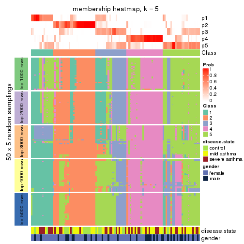</p>

</div>
<div id='tab-MAD-pam-membership-heatmap-5'>
<pre><code class="r">membership_heatmap(res, k = 6)
</code></pre>

<p></p>

</div>
</div>

As soon as we have had the classes for columns, we can look for signatures
which are significantly different between classes which can be candidate marks
for certain classes. Following are the heatmaps for signatures.


Signature heatmaps where rows are scaled:


<script>
$( function() {
	$( '#tabs-MAD-pam-get-signatures' ).tabs();
} );
</script>
<div id='tabs-MAD-pam-get-signatures'>
<ul>
<li><a href='#tab-MAD-pam-get-signatures-1'>k = 2</a></li>
<li><a href='#tab-MAD-pam-get-signatures-2'>k = 3</a></li>
<li><a href='#tab-MAD-pam-get-signatures-3'>k = 4</a></li>
<li><a href='#tab-MAD-pam-get-signatures-4'>k = 5</a></li>
<li><a href='#tab-MAD-pam-get-signatures-5'>k = 6</a></li>
</ul>
<div id='tab-MAD-pam-get-signatures-1'>
<pre><code class="r">get_signatures(res, k = 2)
</code></pre>

<p></p>

</div>
<div id='tab-MAD-pam-get-signatures-2'>
<pre><code class="r">get_signatures(res, k = 3)
</code></pre>

<p></p>

</div>
<div id='tab-MAD-pam-get-signatures-3'>
<pre><code class="r">get_signatures(res, k = 4)
</code></pre>

<p></p>

</div>
<div id='tab-MAD-pam-get-signatures-4'>
<pre><code class="r">get_signatures(res, k = 5)
</code></pre>

<p></p>

</div>
<div id='tab-MAD-pam-get-signatures-5'>
<pre><code class="r">get_signatures(res, k = 6)
</code></pre>

<p></p>

</div>
</div>


Signature heatmaps where rows are not scaled:


<script>
$( function() {
	$( '#tabs-MAD-pam-get-signatures-no-scale' ).tabs();
} );
</script>
<div id='tabs-MAD-pam-get-signatures-no-scale'>
<ul>
<li><a href='#tab-MAD-pam-get-signatures-no-scale-1'>k = 2</a></li>
<li><a href='#tab-MAD-pam-get-signatures-no-scale-2'>k = 3</a></li>
<li><a href='#tab-MAD-pam-get-signatures-no-scale-3'>k = 4</a></li>
<li><a href='#tab-MAD-pam-get-signatures-no-scale-4'>k = 5</a></li>
<li><a href='#tab-MAD-pam-get-signatures-no-scale-5'>k = 6</a></li>
</ul>
<div id='tab-MAD-pam-get-signatures-no-scale-1'>
<pre><code class="r">get_signatures(res, k = 2, scale_rows = FALSE)
</code></pre>

<p></p>

</div>
<div id='tab-MAD-pam-get-signatures-no-scale-2'>
<pre><code class="r">get_signatures(res, k = 3, scale_rows = FALSE)
</code></pre>

<p></p>

</div>
<div id='tab-MAD-pam-get-signatures-no-scale-3'>
<pre><code class="r">get_signatures(res, k = 4, scale_rows = FALSE)
</code></pre>

<p></p>

</div>
<div id='tab-MAD-pam-get-signatures-no-scale-4'>
<pre><code class="r">get_signatures(res, k = 5, scale_rows = FALSE)
</code></pre>

<p></p>

</div>
<div id='tab-MAD-pam-get-signatures-no-scale-5'>
<pre><code class="r">get_signatures(res, k = 6, scale_rows = FALSE)
</code></pre>

<p></p>

</div>
</div>


Compare the overlap of signatures from different k:

```r
compare_signatures(res)
```


`get_signature()` returns a data frame invisibly. TO get the list of signatures, the function
call should be assigned to a variable explicitly. In following code, if `plot` argument is set
to `FALSE`, no heatmap is plotted while only the differential analysis is performed.

```r
# code only for demonstration
tb = get_signature(res, k = ..., plot = FALSE)
```

An example of the output of `tb` is:

```
#>   which_row         fdr    mean_1    mean_2 scaled_mean_1 scaled_mean_2 km
#> 1        38 0.042760348  8.373488  9.131774    -0.5533452     0.5164555  1
#> 2        40 0.018707592  7.106213  8.469186    -0.6173731     0.5762149  1
#> 3        55 0.019134737 10.221463 11.207825    -0.6159697     0.5749050  1
#> 4        59 0.006059896  5.921854  7.869574    -0.6899429     0.6439467  1
#> 5        60 0.018055526  8.928898 10.211722    -0.6204761     0.5791110  1
#> 6        98 0.009384629 15.714769 14.887706     0.6635654    -0.6193277  2
...
```

The columns in `tb` are:

1. `which_row`: row indices corresponding to the input matrix.
2. `fdr`: FDR for the differential test. 
3. `mean_x`: The mean value in group x.
4. `scaled_mean_x`: The mean value in group x after rows are scaled.
5. `km`: Row groups if k-means clustering is applied to rows.


UMAP plot which shows how samples are separated.


<script>
$( function() {
	$( '#tabs-MAD-pam-dimension-reduction' ).tabs();
} );
</script>
<div id='tabs-MAD-pam-dimension-reduction'>
<ul>
<li><a href='#tab-MAD-pam-dimension-reduction-1'>k = 2</a></li>
<li><a href='#tab-MAD-pam-dimension-reduction-2'>k = 3</a></li>
<li><a href='#tab-MAD-pam-dimension-reduction-3'>k = 4</a></li>
<li><a href='#tab-MAD-pam-dimension-reduction-4'>k = 5</a></li>
<li><a href='#tab-MAD-pam-dimension-reduction-5'>k = 6</a></li>
</ul>
<div id='tab-MAD-pam-dimension-reduction-1'>
<pre><code class="r">dimension_reduction(res, k = 2, method = &quot;UMAP&quot;)
</code></pre>

<p></p>

</div>
<div id='tab-MAD-pam-dimension-reduction-2'>
<pre><code class="r">dimension_reduction(res, k = 3, method = &quot;UMAP&quot;)
</code></pre>

<p></p>

</div>
<div id='tab-MAD-pam-dimension-reduction-3'>
<pre><code class="r">dimension_reduction(res, k = 4, method = &quot;UMAP&quot;)
</code></pre>

<p></p>

</div>
<div id='tab-MAD-pam-dimension-reduction-4'>
<pre><code class="r">dimension_reduction(res, k = 5, method = &quot;UMAP&quot;)
</code></pre>

<p></p>

</div>
<div id='tab-MAD-pam-dimension-reduction-5'>
<pre><code class="r">dimension_reduction(res, k = 6, method = &quot;UMAP&quot;)
</code></pre>

<p></p>

</div>
</div>


Following heatmap shows how subgroups are split when increasing `k`:

```r
collect_classes(res)
```


Test correlation between subgroups and known annotations. If the known
annotation is numeric, one-way ANOVA test is applied, and if the known
annotation is discrete, chi-squared contingency table test is applied.

```r
test_to_known_factors(res)
```

```
#>          n disease.state(p) gender(p) k
#> MAD:pam 55           0.0719     0.922 2
#> MAD:pam 67           0.0772     0.745 3
#> MAD:pam 72           0.1835     0.684 4
#> MAD:pam 47           0.0137     0.855 5
#> MAD:pam 90           0.0202     0.446 6
```


If matrix rows can be associated to genes, consider to use `GO_Enrichment(res,
...)` to perform function enrichment for the signature genes.


 

---------------------------------------------------


### MAD:mclust*


The object with results only for a single top-value method and a single partition method 
can be extracted as:

```r
res = res_list["MAD", "mclust"]
# you can also extract it by
# res = res_list["MAD:mclust"]
```

A summary of `res` and all the functions that can be applied to it:

```r
res
```

```
#> A 'ConsensusPartition' object with k = 2, 3, 4, 5, 6.
#>   On a matrix with 38950 rows and 108 columns.
#>   Top rows (1000, 2000, 3000, 4000, 5000) are extracted by 'MAD' method.
#>   Subgroups are detected by 'mclust' method.
#>   Performed in total 1250 partitions by row resampling.
#>   Best k for subgroups seems to be 4.
#> 
#> Following methods can be applied to this 'ConsensusPartition' object:
#>  [1] "cola_report"             "collect_classes"         "collect_plots"          
#>  [4] "collect_stats"           "colnames"                "compare_signatures"     
#>  [7] "consensus_heatmap"       "dimension_reduction"     "functional_enrichment"  
#> [10] "get_anno_col"            "get_anno"                "get_classes"            
#> [13] "get_consensus"           "get_matrix"              "get_membership"         
#> [16] "get_param"               "get_signatures"          "get_stats"              
#> [19] "is_best_k"               "is_stable_k"             "membership_heatmap"     
#> [22] "ncol"                    "nrow"                    "plot_ecdf"              
#> [25] "rownames"                "select_partition_number" "show"                   
#> [28] "suggest_best_k"          "test_to_known_factors"
```

`collect_plots()` function collects all the plots made from `res` for all `k` (number of partitions)
into one single page to provide an easy and fast comparison between different `k`.

```r
collect_plots(res)
```


The plots are:

- The first row: a plot of the ECDF (Empirical cumulative distribution
  function) curves of the consensus matrix for each `k` and the heatmap of
  predicted classes for each `k`.
- The second row: heatmaps of the consensus matrix for each `k`.
- The third row: heatmaps of the membership matrix for each `k`.
- The fouth row: heatmaps of the signatures for each `k`.

All the plots in panels can be made by individual functions and they are
plotted later in this section.

`select_partition_number()` produces several plots showing different
statistics for choosing "optimized" `k`. There are following statistics:

- ECDF curves of the consensus matrix for each `k`;
- 1-PAC. [The PAC
  score](https://en.wikipedia.org/wiki/Consensus_clustering#Over-interpretation_potential_of_consensus_clustering)
  measures the proportion of the ambiguous subgrouping.
- Mean silhouette score.
- Concordance. The mean probability of fiting the consensus class ids in all
  partitions.
- Area increased. Denote $A_k$ as the area under the ECDF curve for current
  `k`, the area increased is defined as $A_k - A_{k-1}$.
- Rand index. The percent of pairs of samples that are both in a same cluster
  or both are not in a same cluster in the partition of k and k-1.
- Jaccard index. The ratio of pairs of samples are both in a same cluster in
  the partition of k and k-1 and the pairs of samples are both in a same
  cluster in the partition k or k-1.

The detailed explanations of these statistics can be found in [the cola
vignette](http://bioconductor.org/packages/devel/bioc/vignettes/cola/inst/doc/cola.html#toc_13).

Generally speaking, lower PAC score, higher mean silhouette score or higher
concordance corresponds to better partition. Rand index and Jaccard index
measure how similar the current partition is compared to partition with `k-1`.
If they are too similar, we won't accept `k` is better than `k-1`.

```r
select_partition_number(res)
```


The numeric values for all these statistics can be obtained by `get_stats()`.

```r
get_stats(res)
```

```
#>   k 1-PAC mean_silhouette concordance area_increased  Rand Jaccard
#> 2 2 0.278           0.625       0.798         0.4073 0.525   0.525
#> 3 3 0.310           0.558       0.740         0.3072 0.778   0.622
#> 4 4 0.946           0.886       0.938         0.3613 0.666   0.353
#> 5 5 0.761           0.817       0.896         0.0471 0.921   0.729
#> 6 6 0.785           0.693       0.839         0.0697 0.926   0.707
```

`suggest_best_k()` suggests the best $k$ based on these statistics. The rules are as follows:

- All $k$ with Jaccard index larger than 0.95 are removed because the increase of
  the partition number does not provides enough extra information. If all $k$ are removed,
  the best $k$ is assigned by `NA`.
- For $k$ with 1-PAC larger than 0.9, the maximal $k$ is taken as the "best k". Other $k$ is called "optional k".
- If it does not fit the second rule. The $k$ with the highest vote of highest
  1-PAC, mean silhouette and concordance is taken as the "best k".

```r
suggest_best_k(res)
```

```
#> [1] 4
```


Following shows the table of the partitions (You need to click the **show/hide
code output** link to see it). The membership matrix (columns with name `p*`)
is inferred by
[`clue::cl_consensus()`](https://www.rdocumentation.org/link/cl_consensus?package=clue)
function with the `SE` method. Basically the value in the membership matrix
represents the probability to belong to a certain group. The finall class
label for an item is determined with the group with highest probability it
belongs to.

In `get_classes()` function, the entropy is calculated from the membership
matrix and the silhouette score is calculated from the consensus matrix.


<script>
$( function() {
	$( '#tabs-MAD-mclust-get-classes' ).tabs();
} );
</script>
<div id='tabs-MAD-mclust-get-classes'>
<ul>
<li><a href='#tab-MAD-mclust-get-classes-1'>k = 2</a></li>
<li><a href='#tab-MAD-mclust-get-classes-2'>k = 3</a></li>
<li><a href='#tab-MAD-mclust-get-classes-3'>k = 4</a></li>
<li><a href='#tab-MAD-mclust-get-classes-4'>k = 5</a></li>
<li><a href='#tab-MAD-mclust-get-classes-5'>k = 6</a></li>
</ul>

<div id='tab-MAD-mclust-get-classes-1'>
<p><a id='tab-MAD-mclust-get-classes-1-a' style='color:#0366d6' href='#'>show/hide code output</a></p>
<pre><code class="r">cbind(get_classes(res, k = 2), get_membership(res, k = 2))
</code></pre>

<pre><code>#&gt;            class entropy silhouette    p1    p2
#&gt; GSM1068478     1  0.0938     0.8144 0.988 0.012
#&gt; GSM1068479     1  0.6438     0.7224 0.836 0.164
#&gt; GSM1068481     1  0.0938     0.8070 0.988 0.012
#&gt; GSM1068482     1  0.0938     0.8070 0.988 0.012
#&gt; GSM1068483     1  0.0000     0.8146 1.000 0.000
#&gt; GSM1068486     1  0.0938     0.8070 0.988 0.012
#&gt; GSM1068487     2  0.9795     0.5391 0.416 0.584
#&gt; GSM1068488     2  0.9988    -0.0231 0.480 0.520
#&gt; GSM1068490     2  0.9522     0.5751 0.372 0.628
#&gt; GSM1068491     1  0.4690     0.7936 0.900 0.100
#&gt; GSM1068492     1  0.7674     0.6328 0.776 0.224
#&gt; GSM1068493     1  0.5178     0.7725 0.884 0.116
#&gt; GSM1068494     1  0.2603     0.8086 0.956 0.044
#&gt; GSM1068495     1  0.9922    -0.1758 0.552 0.448
#&gt; GSM1068496     1  0.0000     0.8146 1.000 0.000
#&gt; GSM1068498     1  0.2603     0.8086 0.956 0.044
#&gt; GSM1068499     1  0.0000     0.8146 1.000 0.000
#&gt; GSM1068500     1  0.0000     0.8146 1.000 0.000
#&gt; GSM1068502     1  0.7056     0.6837 0.808 0.192
#&gt; GSM1068503     2  0.9795     0.5425 0.416 0.584
#&gt; GSM1068505     2  0.3879     0.6420 0.076 0.924
#&gt; GSM1068506     2  0.5842     0.6471 0.140 0.860
#&gt; GSM1068507     1  0.9608     0.1330 0.616 0.384
#&gt; GSM1068508     2  0.9881     0.5139 0.436 0.564
#&gt; GSM1068510     2  0.9954     0.0481 0.460 0.540
#&gt; GSM1068512     1  0.8327     0.6138 0.736 0.264
#&gt; GSM1068513     2  0.9850     0.5250 0.428 0.572
#&gt; GSM1068514     1  0.8555     0.5839 0.720 0.280
#&gt; GSM1068517     1  0.4562     0.7866 0.904 0.096
#&gt; GSM1068518     1  0.7674     0.6708 0.776 0.224
#&gt; GSM1068520     1  0.0000     0.8146 1.000 0.000
#&gt; GSM1068521     1  0.0000     0.8146 1.000 0.000
#&gt; GSM1068522     2  0.5946     0.6466 0.144 0.856
#&gt; GSM1068524     2  0.9815     0.5348 0.420 0.580
#&gt; GSM1068527     1  0.9775     0.2797 0.588 0.412
#&gt; GSM1068480     1  0.0938     0.8070 0.988 0.012
#&gt; GSM1068484     2  0.3879     0.6420 0.076 0.924
#&gt; GSM1068485     1  0.0938     0.8070 0.988 0.012
#&gt; GSM1068489     2  0.7219     0.5634 0.200 0.800
#&gt; GSM1068497     1  0.3584     0.8005 0.932 0.068
#&gt; GSM1068501     2  0.4815     0.6351 0.104 0.896
#&gt; GSM1068504     2  0.9522     0.5751 0.372 0.628
#&gt; GSM1068509     1  0.4562     0.7861 0.904 0.096
#&gt; GSM1068511     1  0.9170     0.4555 0.668 0.332
#&gt; GSM1068515     1  0.2043     0.8114 0.968 0.032
#&gt; GSM1068516     1  0.9209     0.4636 0.664 0.336
#&gt; GSM1068519     1  0.0000     0.8146 1.000 0.000
#&gt; GSM1068523     2  0.9522     0.5751 0.372 0.628
#&gt; GSM1068525     2  0.3879     0.6420 0.076 0.924
#&gt; GSM1068526     2  0.3879     0.6420 0.076 0.924
#&gt; GSM1068458     1  0.0000     0.8146 1.000 0.000
#&gt; GSM1068459     1  0.0938     0.8070 0.988 0.012
#&gt; GSM1068460     1  0.5408     0.7663 0.876 0.124
#&gt; GSM1068461     1  0.0938     0.8070 0.988 0.012
#&gt; GSM1068464     2  0.9608     0.5670 0.384 0.616
#&gt; GSM1068468     1  0.9286     0.3009 0.656 0.344
#&gt; GSM1068472     1  0.6343     0.7275 0.840 0.160
#&gt; GSM1068473     2  0.9522     0.5751 0.372 0.628
#&gt; GSM1068474     2  0.9522     0.5751 0.372 0.628
#&gt; GSM1068476     1  0.5408     0.7802 0.876 0.124
#&gt; GSM1068477     2  0.9881     0.5139 0.436 0.564
#&gt; GSM1068462     1  0.5294     0.7694 0.880 0.120
#&gt; GSM1068463     1  0.0938     0.8070 0.988 0.012
#&gt; GSM1068465     1  0.5178     0.7725 0.884 0.116
#&gt; GSM1068466     1  0.0000     0.8146 1.000 0.000
#&gt; GSM1068467     1  0.6712     0.7078 0.824 0.176
#&gt; GSM1068469     1  0.3431     0.8021 0.936 0.064
#&gt; GSM1068470     2  0.9522     0.5751 0.372 0.628
#&gt; GSM1068471     2  0.9522     0.5751 0.372 0.628
#&gt; GSM1068475     2  0.9522     0.5751 0.372 0.628
#&gt; GSM1068528     1  0.0000     0.8146 1.000 0.000
#&gt; GSM1068531     1  0.0000     0.8146 1.000 0.000
#&gt; GSM1068532     1  0.0000     0.8146 1.000 0.000
#&gt; GSM1068533     1  0.0000     0.8146 1.000 0.000
#&gt; GSM1068535     1  0.9963     0.1163 0.536 0.464
#&gt; GSM1068537     1  0.0000     0.8146 1.000 0.000
#&gt; GSM1068538     1  0.0000     0.8146 1.000 0.000
#&gt; GSM1068539     2  0.9881     0.5139 0.436 0.564
#&gt; GSM1068540     1  0.0000     0.8146 1.000 0.000
#&gt; GSM1068542     2  0.4161     0.6409 0.084 0.916
#&gt; GSM1068543     2  0.9944     0.0510 0.456 0.544
#&gt; GSM1068544     1  0.0938     0.8070 0.988 0.012
#&gt; GSM1068545     2  0.9754     0.5469 0.408 0.592
#&gt; GSM1068546     1  0.0938     0.8070 0.988 0.012
#&gt; GSM1068547     1  0.1184     0.8141 0.984 0.016
#&gt; GSM1068548     2  0.4939     0.6334 0.108 0.892
#&gt; GSM1068549     1  0.0938     0.8070 0.988 0.012
#&gt; GSM1068550     2  0.4022     0.6416 0.080 0.920
#&gt; GSM1068551     2  0.9522     0.5751 0.372 0.628
#&gt; GSM1068552     2  0.3879     0.6420 0.076 0.924
#&gt; GSM1068555     2  0.9522     0.5751 0.372 0.628
#&gt; GSM1068556     2  0.9963     0.0269 0.464 0.536
#&gt; GSM1068557     1  0.9286     0.2978 0.656 0.344
#&gt; GSM1068560     2  0.6712     0.6202 0.176 0.824
#&gt; GSM1068561     1  0.8608     0.4883 0.716 0.284
#&gt; GSM1068562     2  0.3879     0.6420 0.076 0.924
#&gt; GSM1068563     2  0.3879     0.6420 0.076 0.924
#&gt; GSM1068565     2  0.9522     0.5751 0.372 0.628
#&gt; GSM1068529     1  0.6343     0.7419 0.840 0.160
#&gt; GSM1068530     1  0.0000     0.8146 1.000 0.000
#&gt; GSM1068534     1  0.5737     0.7605 0.864 0.136
#&gt; GSM1068536     1  0.5408     0.7663 0.876 0.124
#&gt; GSM1068541     1  0.9795    -0.0248 0.584 0.416
#&gt; GSM1068553     1  0.9983     0.1009 0.524 0.476
#&gt; GSM1068554     2  0.9661     0.2237 0.392 0.608
#&gt; GSM1068558     1  0.8909     0.5178 0.692 0.308
#&gt; GSM1068559     1  0.5737     0.7548 0.864 0.136
#&gt; GSM1068564     2  0.3879     0.6420 0.076 0.924
</code></pre>

<script>
$('#tab-MAD-mclust-get-classes-1-a').parent().next().next().hide();
$('#tab-MAD-mclust-get-classes-1-a').click(function(){
  $('#tab-MAD-mclust-get-classes-1-a').parent().next().next().toggle();
  return(false);
});
</script>
</div>

<div id='tab-MAD-mclust-get-classes-2'>
<p><a id='tab-MAD-mclust-get-classes-2-a' style='color:#0366d6' href='#'>show/hide code output</a></p>
<pre><code class="r">cbind(get_classes(res, k = 3), get_membership(res, k = 3))
</code></pre>

<pre><code>#&gt;            class entropy silhouette    p1    p2    p3
#&gt; GSM1068478     1  0.0237     0.6679 0.996 0.004 0.000
#&gt; GSM1068479     1  0.6994     0.4022 0.556 0.424 0.020
#&gt; GSM1068481     1  0.6244     0.5676 0.560 0.000 0.440
#&gt; GSM1068482     1  0.6244     0.5676 0.560 0.000 0.440
#&gt; GSM1068483     1  0.0000     0.6677 1.000 0.000 0.000
#&gt; GSM1068486     1  0.6244     0.5676 0.560 0.000 0.440
#&gt; GSM1068487     2  0.6952    -0.8596 0.016 0.504 0.480
#&gt; GSM1068488     2  0.5591     0.5300 0.304 0.696 0.000
#&gt; GSM1068490     3  0.6625     0.9948 0.008 0.440 0.552
#&gt; GSM1068491     1  0.7770     0.5715 0.560 0.056 0.384
#&gt; GSM1068492     2  0.7074    -0.2239 0.480 0.500 0.020
#&gt; GSM1068493     1  0.6126     0.4517 0.600 0.400 0.000
#&gt; GSM1068494     1  0.1774     0.6655 0.960 0.016 0.024
#&gt; GSM1068495     1  0.5968     0.4093 0.636 0.364 0.000
#&gt; GSM1068496     1  0.0000     0.6677 1.000 0.000 0.000
#&gt; GSM1068498     1  0.5254     0.5826 0.736 0.264 0.000
#&gt; GSM1068499     1  0.0424     0.6675 0.992 0.008 0.000
#&gt; GSM1068500     1  0.0000     0.6677 1.000 0.000 0.000
#&gt; GSM1068502     1  0.7013     0.3861 0.548 0.432 0.020
#&gt; GSM1068503     2  0.1999     0.5409 0.036 0.952 0.012
#&gt; GSM1068505     2  0.2878     0.6304 0.096 0.904 0.000
#&gt; GSM1068506     2  0.1964     0.6105 0.056 0.944 0.000
#&gt; GSM1068507     2  0.6180     0.3005 0.416 0.584 0.000
#&gt; GSM1068508     1  0.6280     0.3365 0.540 0.460 0.000
#&gt; GSM1068510     2  0.5541     0.4885 0.252 0.740 0.008
#&gt; GSM1068512     2  0.6295     0.1750 0.472 0.528 0.000
#&gt; GSM1068513     2  0.6719     0.3192 0.204 0.728 0.068
#&gt; GSM1068514     1  0.7067     0.0395 0.512 0.468 0.020
#&gt; GSM1068517     1  0.6026     0.4819 0.624 0.376 0.000
#&gt; GSM1068518     1  0.6267     0.1308 0.548 0.452 0.000
#&gt; GSM1068520     1  0.0424     0.6653 0.992 0.000 0.008
#&gt; GSM1068521     1  0.0424     0.6653 0.992 0.000 0.008
#&gt; GSM1068522     2  0.0000     0.5256 0.000 1.000 0.000
#&gt; GSM1068524     2  0.4768     0.4561 0.100 0.848 0.052
#&gt; GSM1068527     2  0.5363     0.5675 0.276 0.724 0.000
#&gt; GSM1068480     1  0.6244     0.5676 0.560 0.000 0.440
#&gt; GSM1068484     2  0.1289     0.5814 0.032 0.968 0.000
#&gt; GSM1068485     1  0.6244     0.5676 0.560 0.000 0.440
#&gt; GSM1068489     2  0.2711     0.6310 0.088 0.912 0.000
#&gt; GSM1068497     1  0.6026     0.4819 0.624 0.376 0.000
#&gt; GSM1068501     2  0.2796     0.6363 0.092 0.908 0.000
#&gt; GSM1068504     3  0.6625     0.9948 0.008 0.440 0.552
#&gt; GSM1068509     1  0.1031     0.6656 0.976 0.024 0.000
#&gt; GSM1068511     2  0.6308     0.0767 0.492 0.508 0.000
#&gt; GSM1068515     1  0.4605     0.5930 0.796 0.204 0.000
#&gt; GSM1068516     2  0.4452     0.6169 0.192 0.808 0.000
#&gt; GSM1068519     1  0.0237     0.6666 0.996 0.000 0.004
#&gt; GSM1068523     3  0.6625     0.9948 0.008 0.440 0.552
#&gt; GSM1068525     2  0.1643     0.5561 0.044 0.956 0.000
#&gt; GSM1068526     2  0.2711     0.6310 0.088 0.912 0.000
#&gt; GSM1068458     1  0.0424     0.6653 0.992 0.000 0.008
#&gt; GSM1068459     1  0.6244     0.5676 0.560 0.000 0.440
#&gt; GSM1068460     1  0.3715     0.6323 0.868 0.128 0.004
#&gt; GSM1068461     1  0.6244     0.5676 0.560 0.000 0.440
#&gt; GSM1068464     3  0.7360     0.9414 0.032 0.440 0.528
#&gt; GSM1068468     1  0.6244     0.3862 0.560 0.440 0.000
#&gt; GSM1068472     1  0.6244     0.3862 0.560 0.440 0.000
#&gt; GSM1068473     3  0.6625     0.9948 0.008 0.440 0.552
#&gt; GSM1068474     3  0.6625     0.9948 0.008 0.440 0.552
#&gt; GSM1068476     1  0.8264     0.5675 0.556 0.088 0.356
#&gt; GSM1068477     1  0.6244     0.3862 0.560 0.440 0.000
#&gt; GSM1068462     1  0.6192     0.4214 0.580 0.420 0.000
#&gt; GSM1068463     1  0.6244     0.5676 0.560 0.000 0.440
#&gt; GSM1068465     1  0.4033     0.6299 0.856 0.136 0.008
#&gt; GSM1068466     1  0.0424     0.6653 0.992 0.000 0.008
#&gt; GSM1068467     1  0.6244     0.3862 0.560 0.440 0.000
#&gt; GSM1068469     1  0.6079     0.4683 0.612 0.388 0.000
#&gt; GSM1068470     3  0.6625     0.9948 0.008 0.440 0.552
#&gt; GSM1068471     3  0.6625     0.9948 0.008 0.440 0.552
#&gt; GSM1068475     3  0.6625     0.9948 0.008 0.440 0.552
#&gt; GSM1068528     1  0.0000     0.6677 1.000 0.000 0.000
#&gt; GSM1068531     1  0.0424     0.6653 0.992 0.000 0.008
#&gt; GSM1068532     1  0.0237     0.6666 0.996 0.000 0.004
#&gt; GSM1068533     1  0.0424     0.6653 0.992 0.000 0.008
#&gt; GSM1068535     2  0.6309     0.1289 0.496 0.504 0.000
#&gt; GSM1068537     1  0.0424     0.6653 0.992 0.000 0.008
#&gt; GSM1068538     1  0.0424     0.6653 0.992 0.000 0.008
#&gt; GSM1068539     2  0.6235     0.2603 0.436 0.564 0.000
#&gt; GSM1068540     1  0.0424     0.6653 0.992 0.000 0.008
#&gt; GSM1068542     2  0.2796     0.6305 0.092 0.908 0.000
#&gt; GSM1068543     2  0.3752     0.6395 0.144 0.856 0.000
#&gt; GSM1068544     1  0.6168     0.5771 0.588 0.000 0.412
#&gt; GSM1068545     2  0.3038     0.5449 0.104 0.896 0.000
#&gt; GSM1068546     1  0.6244     0.5676 0.560 0.000 0.440
#&gt; GSM1068547     1  0.0424     0.6653 0.992 0.000 0.008
#&gt; GSM1068548     2  0.3038     0.6251 0.104 0.896 0.000
#&gt; GSM1068549     1  0.6244     0.5676 0.560 0.000 0.440
#&gt; GSM1068550     2  0.2878     0.6304 0.096 0.904 0.000
#&gt; GSM1068551     3  0.6625     0.9948 0.008 0.440 0.552
#&gt; GSM1068552     2  0.0592     0.5491 0.012 0.988 0.000
#&gt; GSM1068555     3  0.6625     0.9948 0.008 0.440 0.552
#&gt; GSM1068556     2  0.3482     0.6396 0.128 0.872 0.000
#&gt; GSM1068557     1  0.6244     0.3862 0.560 0.440 0.000
#&gt; GSM1068560     2  0.3116     0.6230 0.108 0.892 0.000
#&gt; GSM1068561     1  0.6215     0.3857 0.572 0.428 0.000
#&gt; GSM1068562     2  0.2796     0.6334 0.092 0.908 0.000
#&gt; GSM1068563     2  0.2625     0.6300 0.084 0.916 0.000
#&gt; GSM1068565     3  0.6625     0.9948 0.008 0.440 0.552
#&gt; GSM1068529     1  0.6140     0.3168 0.596 0.404 0.000
#&gt; GSM1068530     1  0.0424     0.6653 0.992 0.000 0.008
#&gt; GSM1068534     1  0.6026     0.3639 0.624 0.376 0.000
#&gt; GSM1068536     1  0.3192     0.6397 0.888 0.112 0.000
#&gt; GSM1068541     1  0.5905     0.4451 0.648 0.352 0.000
#&gt; GSM1068553     2  0.5948     0.4836 0.360 0.640 0.000
#&gt; GSM1068554     2  0.3116     0.6307 0.108 0.892 0.000
#&gt; GSM1068558     2  0.7049     0.1170 0.452 0.528 0.020
#&gt; GSM1068559     1  0.5926     0.4090 0.644 0.356 0.000
#&gt; GSM1068564     2  0.0000     0.5256 0.000 1.000 0.000
</code></pre>

<script>
$('#tab-MAD-mclust-get-classes-2-a').parent().next().next().hide();
$('#tab-MAD-mclust-get-classes-2-a').click(function(){
  $('#tab-MAD-mclust-get-classes-2-a').parent().next().next().toggle();
  return(false);
});
</script>
</div>

<div id='tab-MAD-mclust-get-classes-3'>
<p><a id='tab-MAD-mclust-get-classes-3-a' style='color:#0366d6' href='#'>show/hide code output</a></p>
<pre><code class="r">cbind(get_classes(res, k = 4), get_membership(res, k = 4))
</code></pre>

<pre><code>#&gt;            class entropy silhouette    p1    p2    p3    p4
#&gt; GSM1068478     1  0.0000      0.954 1.000 0.000 0.000 0.000
#&gt; GSM1068479     2  0.0188      0.865 0.000 0.996 0.000 0.004
#&gt; GSM1068481     3  0.0000      0.982 0.000 0.000 1.000 0.000
#&gt; GSM1068482     3  0.0000      0.982 0.000 0.000 1.000 0.000
#&gt; GSM1068483     1  0.0000      0.954 1.000 0.000 0.000 0.000
#&gt; GSM1068486     3  0.0000      0.982 0.000 0.000 1.000 0.000
#&gt; GSM1068487     2  0.2281      0.884 0.000 0.904 0.000 0.096
#&gt; GSM1068488     4  0.0188      0.941 0.000 0.004 0.000 0.996
#&gt; GSM1068490     2  0.2216      0.885 0.000 0.908 0.000 0.092
#&gt; GSM1068491     3  0.2401      0.899 0.000 0.092 0.904 0.004
#&gt; GSM1068492     4  0.1716      0.921 0.000 0.064 0.000 0.936
#&gt; GSM1068493     2  0.0188      0.865 0.000 0.996 0.000 0.004
#&gt; GSM1068494     1  0.4772      0.780 0.808 0.068 0.016 0.108
#&gt; GSM1068495     4  0.5607      0.101 0.020 0.488 0.000 0.492
#&gt; GSM1068496     1  0.0000      0.954 1.000 0.000 0.000 0.000
#&gt; GSM1068498     2  0.2401      0.843 0.092 0.904 0.000 0.004
#&gt; GSM1068499     1  0.1661      0.915 0.944 0.000 0.052 0.004
#&gt; GSM1068500     1  0.0000      0.954 1.000 0.000 0.000 0.000
#&gt; GSM1068502     2  0.0707      0.871 0.000 0.980 0.000 0.020
#&gt; GSM1068503     2  0.4543      0.652 0.000 0.676 0.000 0.324
#&gt; GSM1068505     4  0.0000      0.942 0.000 0.000 0.000 1.000
#&gt; GSM1068506     4  0.0000      0.942 0.000 0.000 0.000 1.000
#&gt; GSM1068507     4  0.2216      0.907 0.000 0.092 0.000 0.908
#&gt; GSM1068508     2  0.2281      0.884 0.000 0.904 0.000 0.096
#&gt; GSM1068510     4  0.0000      0.942 0.000 0.000 0.000 1.000
#&gt; GSM1068512     4  0.2216      0.907 0.000 0.092 0.000 0.908
#&gt; GSM1068513     2  0.4996      0.276 0.000 0.516 0.000 0.484
#&gt; GSM1068514     4  0.2216      0.907 0.000 0.092 0.000 0.908
#&gt; GSM1068517     2  0.2053      0.853 0.072 0.924 0.000 0.004
#&gt; GSM1068518     4  0.2216      0.907 0.000 0.092 0.000 0.908
#&gt; GSM1068520     1  0.0000      0.954 1.000 0.000 0.000 0.000
#&gt; GSM1068521     1  0.0000      0.954 1.000 0.000 0.000 0.000
#&gt; GSM1068522     4  0.1389      0.904 0.000 0.048 0.000 0.952
#&gt; GSM1068524     2  0.4730      0.578 0.000 0.636 0.000 0.364
#&gt; GSM1068527     4  0.1489      0.913 0.044 0.004 0.000 0.952
#&gt; GSM1068480     3  0.0000      0.982 0.000 0.000 1.000 0.000
#&gt; GSM1068484     4  0.0000      0.942 0.000 0.000 0.000 1.000
#&gt; GSM1068485     3  0.0000      0.982 0.000 0.000 1.000 0.000
#&gt; GSM1068489     4  0.0000      0.942 0.000 0.000 0.000 1.000
#&gt; GSM1068497     2  0.2401      0.843 0.092 0.904 0.000 0.004
#&gt; GSM1068501     4  0.0000      0.942 0.000 0.000 0.000 1.000
#&gt; GSM1068504     2  0.2281      0.884 0.000 0.904 0.000 0.096
#&gt; GSM1068509     1  0.2676      0.877 0.896 0.092 0.000 0.012
#&gt; GSM1068511     4  0.2216      0.907 0.000 0.092 0.000 0.908
#&gt; GSM1068515     1  0.4509      0.559 0.708 0.288 0.000 0.004
#&gt; GSM1068516     4  0.2216      0.907 0.000 0.092 0.000 0.908
#&gt; GSM1068519     1  0.0000      0.954 1.000 0.000 0.000 0.000
#&gt; GSM1068523     2  0.2216      0.885 0.000 0.908 0.000 0.092
#&gt; GSM1068525     4  0.0000      0.942 0.000 0.000 0.000 1.000
#&gt; GSM1068526     4  0.0000      0.942 0.000 0.000 0.000 1.000
#&gt; GSM1068458     1  0.0000      0.954 1.000 0.000 0.000 0.000
#&gt; GSM1068459     3  0.0000      0.982 0.000 0.000 1.000 0.000
#&gt; GSM1068460     1  0.2401      0.883 0.904 0.092 0.000 0.004
#&gt; GSM1068461     3  0.0000      0.982 0.000 0.000 1.000 0.000
#&gt; GSM1068464     2  0.2216      0.885 0.000 0.908 0.000 0.092
#&gt; GSM1068468     2  0.0188      0.865 0.000 0.996 0.000 0.004
#&gt; GSM1068472     2  0.0188      0.865 0.000 0.996 0.000 0.004
#&gt; GSM1068473     2  0.2216      0.885 0.000 0.908 0.000 0.092
#&gt; GSM1068474     2  0.2216      0.885 0.000 0.908 0.000 0.092
#&gt; GSM1068476     3  0.2676      0.893 0.000 0.092 0.896 0.012
#&gt; GSM1068477     2  0.0188      0.865 0.000 0.996 0.000 0.004
#&gt; GSM1068462     2  0.0188      0.865 0.000 0.996 0.000 0.004
#&gt; GSM1068463     3  0.0000      0.982 0.000 0.000 1.000 0.000
#&gt; GSM1068465     1  0.2401      0.883 0.904 0.092 0.000 0.004
#&gt; GSM1068466     1  0.0000      0.954 1.000 0.000 0.000 0.000
#&gt; GSM1068467     2  0.0188      0.865 0.000 0.996 0.000 0.004
#&gt; GSM1068469     2  0.2401      0.843 0.092 0.904 0.000 0.004
#&gt; GSM1068470     2  0.2216      0.885 0.000 0.908 0.000 0.092
#&gt; GSM1068471     2  0.2216      0.885 0.000 0.908 0.000 0.092
#&gt; GSM1068475     2  0.2216      0.885 0.000 0.908 0.000 0.092
#&gt; GSM1068528     1  0.0188      0.952 0.996 0.000 0.004 0.000
#&gt; GSM1068531     1  0.0000      0.954 1.000 0.000 0.000 0.000
#&gt; GSM1068532     1  0.0000      0.954 1.000 0.000 0.000 0.000
#&gt; GSM1068533     1  0.0000      0.954 1.000 0.000 0.000 0.000
#&gt; GSM1068535     4  0.2216      0.907 0.000 0.092 0.000 0.908
#&gt; GSM1068537     1  0.0000      0.954 1.000 0.000 0.000 0.000
#&gt; GSM1068538     1  0.0000      0.954 1.000 0.000 0.000 0.000
#&gt; GSM1068539     4  0.3400      0.835 0.000 0.180 0.000 0.820
#&gt; GSM1068540     1  0.0000      0.954 1.000 0.000 0.000 0.000
#&gt; GSM1068542     4  0.0000      0.942 0.000 0.000 0.000 1.000
#&gt; GSM1068543     4  0.0000      0.942 0.000 0.000 0.000 1.000
#&gt; GSM1068544     3  0.0188      0.979 0.004 0.000 0.996 0.000
#&gt; GSM1068545     2  0.4994      0.252 0.000 0.520 0.000 0.480
#&gt; GSM1068546     3  0.0000      0.982 0.000 0.000 1.000 0.000
#&gt; GSM1068547     1  0.0000      0.954 1.000 0.000 0.000 0.000
#&gt; GSM1068548     4  0.0000      0.942 0.000 0.000 0.000 1.000
#&gt; GSM1068549     3  0.0000      0.982 0.000 0.000 1.000 0.000
#&gt; GSM1068550     4  0.0000      0.942 0.000 0.000 0.000 1.000
#&gt; GSM1068551     2  0.2216      0.885 0.000 0.908 0.000 0.092
#&gt; GSM1068552     4  0.0000      0.942 0.000 0.000 0.000 1.000
#&gt; GSM1068555     2  0.2216      0.885 0.000 0.908 0.000 0.092
#&gt; GSM1068556     4  0.0000      0.942 0.000 0.000 0.000 1.000
#&gt; GSM1068557     2  0.0188      0.865 0.000 0.996 0.000 0.004
#&gt; GSM1068560     4  0.0000      0.942 0.000 0.000 0.000 1.000
#&gt; GSM1068561     2  0.4277      0.569 0.000 0.720 0.000 0.280
#&gt; GSM1068562     4  0.0000      0.942 0.000 0.000 0.000 1.000
#&gt; GSM1068563     4  0.0000      0.942 0.000 0.000 0.000 1.000
#&gt; GSM1068565     2  0.2216      0.885 0.000 0.908 0.000 0.092
#&gt; GSM1068529     4  0.2216      0.907 0.000 0.092 0.000 0.908
#&gt; GSM1068530     1  0.0000      0.954 1.000 0.000 0.000 0.000
#&gt; GSM1068534     4  0.2216      0.907 0.000 0.092 0.000 0.908
#&gt; GSM1068536     1  0.2401      0.883 0.904 0.092 0.000 0.004
#&gt; GSM1068541     2  0.0469      0.863 0.000 0.988 0.000 0.012
#&gt; GSM1068553     4  0.0000      0.942 0.000 0.000 0.000 1.000
#&gt; GSM1068554     4  0.0000      0.942 0.000 0.000 0.000 1.000
#&gt; GSM1068558     4  0.1867      0.917 0.000 0.072 0.000 0.928
#&gt; GSM1068559     4  0.2216      0.907 0.000 0.092 0.000 0.908
#&gt; GSM1068564     4  0.0000      0.942 0.000 0.000 0.000 1.000
</code></pre>

<script>
$('#tab-MAD-mclust-get-classes-3-a').parent().next().next().hide();
$('#tab-MAD-mclust-get-classes-3-a').click(function(){
  $('#tab-MAD-mclust-get-classes-3-a').parent().next().next().toggle();
  return(false);
});
</script>
</div>

<div id='tab-MAD-mclust-get-classes-4'>
<p><a id='tab-MAD-mclust-get-classes-4-a' style='color:#0366d6' href='#'>show/hide code output</a></p>
<pre><code class="r">cbind(get_classes(res, k = 5), get_membership(res, k = 5))
</code></pre>

<pre><code>#&gt;            class entropy silhouette    p1    p2    p3    p4    p5
#&gt; GSM1068478     1  0.3242     0.7385 0.784 0.000 0.000 0.000 0.216
#&gt; GSM1068479     2  0.3710     0.7180 0.000 0.808 0.000 0.144 0.048
#&gt; GSM1068481     3  0.0000     0.9514 0.000 0.000 1.000 0.000 0.000
#&gt; GSM1068482     3  0.0000     0.9514 0.000 0.000 1.000 0.000 0.000
#&gt; GSM1068483     1  0.3039     0.7665 0.808 0.000 0.000 0.000 0.192
#&gt; GSM1068486     3  0.0000     0.9514 0.000 0.000 1.000 0.000 0.000
#&gt; GSM1068487     2  0.2648     0.8101 0.000 0.848 0.000 0.152 0.000
#&gt; GSM1068488     4  0.1310     0.8926 0.000 0.024 0.000 0.956 0.020
#&gt; GSM1068490     2  0.1043     0.9077 0.000 0.960 0.000 0.040 0.000
#&gt; GSM1068491     3  0.4149     0.6939 0.000 0.004 0.792 0.124 0.080
#&gt; GSM1068492     4  0.2446     0.8700 0.000 0.056 0.000 0.900 0.044
#&gt; GSM1068493     5  0.3016     0.7140 0.000 0.020 0.000 0.132 0.848
#&gt; GSM1068494     1  0.4027     0.7118 0.800 0.000 0.012 0.144 0.044
#&gt; GSM1068495     4  0.4752     0.5180 0.000 0.036 0.000 0.648 0.316
#&gt; GSM1068496     1  0.0865     0.8927 0.972 0.000 0.000 0.004 0.024
#&gt; GSM1068498     5  0.2627     0.7507 0.044 0.044 0.000 0.012 0.900
#&gt; GSM1068499     1  0.2011     0.8459 0.908 0.000 0.088 0.004 0.000
#&gt; GSM1068500     1  0.2852     0.7863 0.828 0.000 0.000 0.000 0.172
#&gt; GSM1068502     2  0.3681     0.7196 0.000 0.808 0.000 0.148 0.044
#&gt; GSM1068503     2  0.2852     0.7898 0.000 0.828 0.000 0.172 0.000
#&gt; GSM1068505     4  0.1216     0.8960 0.000 0.020 0.000 0.960 0.020
#&gt; GSM1068506     4  0.1211     0.8959 0.000 0.024 0.000 0.960 0.016
#&gt; GSM1068507     4  0.1341     0.8867 0.000 0.000 0.000 0.944 0.056
#&gt; GSM1068508     5  0.6392     0.1564 0.000 0.400 0.000 0.168 0.432
#&gt; GSM1068510     4  0.1741     0.8856 0.000 0.024 0.000 0.936 0.040
#&gt; GSM1068512     4  0.1410     0.8858 0.000 0.000 0.000 0.940 0.060
#&gt; GSM1068513     4  0.4552     0.0112 0.000 0.468 0.000 0.524 0.008
#&gt; GSM1068514     4  0.2077     0.8769 0.000 0.040 0.000 0.920 0.040
#&gt; GSM1068517     5  0.1682     0.7552 0.004 0.044 0.000 0.012 0.940
#&gt; GSM1068518     4  0.1544     0.8833 0.000 0.000 0.000 0.932 0.068
#&gt; GSM1068520     1  0.0000     0.9015 1.000 0.000 0.000 0.000 0.000
#&gt; GSM1068521     1  0.0000     0.9015 1.000 0.000 0.000 0.000 0.000
#&gt; GSM1068522     4  0.3928     0.5401 0.000 0.296 0.000 0.700 0.004
#&gt; GSM1068524     2  0.3086     0.7801 0.000 0.816 0.000 0.180 0.004
#&gt; GSM1068527     4  0.2153     0.8773 0.040 0.000 0.000 0.916 0.044
#&gt; GSM1068480     3  0.0000     0.9514 0.000 0.000 1.000 0.000 0.000
#&gt; GSM1068484     4  0.0992     0.8972 0.000 0.024 0.000 0.968 0.008
#&gt; GSM1068485     3  0.0000     0.9514 0.000 0.000 1.000 0.000 0.000
#&gt; GSM1068489     4  0.1018     0.8975 0.000 0.016 0.000 0.968 0.016
#&gt; GSM1068497     5  0.2627     0.7507 0.044 0.044 0.000 0.012 0.900
#&gt; GSM1068501     4  0.0510     0.8993 0.000 0.016 0.000 0.984 0.000
#&gt; GSM1068504     2  0.2179     0.8533 0.000 0.888 0.000 0.112 0.000
#&gt; GSM1068509     1  0.2992     0.8128 0.868 0.000 0.000 0.064 0.068
#&gt; GSM1068511     4  0.1478     0.8847 0.000 0.000 0.000 0.936 0.064
#&gt; GSM1068515     5  0.3599     0.6686 0.160 0.008 0.000 0.020 0.812
#&gt; GSM1068516     4  0.1478     0.8847 0.000 0.000 0.000 0.936 0.064
#&gt; GSM1068519     1  0.0000     0.9015 1.000 0.000 0.000 0.000 0.000
#&gt; GSM1068523     2  0.1043     0.9077 0.000 0.960 0.000 0.040 0.000
#&gt; GSM1068525     4  0.0992     0.8990 0.000 0.024 0.000 0.968 0.008
#&gt; GSM1068526     4  0.1117     0.8965 0.000 0.020 0.000 0.964 0.016
#&gt; GSM1068458     1  0.0000     0.9015 1.000 0.000 0.000 0.000 0.000
#&gt; GSM1068459     3  0.0000     0.9514 0.000 0.000 1.000 0.000 0.000
#&gt; GSM1068460     1  0.3980     0.7060 0.796 0.000 0.000 0.128 0.076
#&gt; GSM1068461     3  0.0000     0.9514 0.000 0.000 1.000 0.000 0.000
#&gt; GSM1068464     2  0.1043     0.9077 0.000 0.960 0.000 0.040 0.000
#&gt; GSM1068468     5  0.4428     0.6906 0.000 0.268 0.000 0.032 0.700
#&gt; GSM1068472     5  0.4141     0.7075 0.000 0.248 0.000 0.024 0.728
#&gt; GSM1068473     2  0.1043     0.9077 0.000 0.960 0.000 0.040 0.000
#&gt; GSM1068474     2  0.1043     0.9077 0.000 0.960 0.000 0.040 0.000
#&gt; GSM1068476     3  0.4670     0.6780 0.000 0.040 0.768 0.148 0.044
#&gt; GSM1068477     5  0.5843     0.5196 0.000 0.304 0.000 0.124 0.572
#&gt; GSM1068462     5  0.3942     0.7165 0.000 0.232 0.000 0.020 0.748
#&gt; GSM1068463     3  0.0000     0.9514 0.000 0.000 1.000 0.000 0.000
#&gt; GSM1068465     1  0.4747     0.1706 0.496 0.000 0.000 0.016 0.488
#&gt; GSM1068466     1  0.0880     0.8905 0.968 0.000 0.000 0.000 0.032
#&gt; GSM1068467     5  0.4229     0.6825 0.000 0.276 0.000 0.020 0.704
#&gt; GSM1068469     5  0.3556     0.7542 0.044 0.104 0.000 0.012 0.840
#&gt; GSM1068470     2  0.1043     0.9077 0.000 0.960 0.000 0.040 0.000
#&gt; GSM1068471     2  0.1043     0.9077 0.000 0.960 0.000 0.040 0.000
#&gt; GSM1068475     2  0.1043     0.9077 0.000 0.960 0.000 0.040 0.000
#&gt; GSM1068528     1  0.0162     0.9003 0.996 0.000 0.004 0.000 0.000
#&gt; GSM1068531     1  0.0000     0.9015 1.000 0.000 0.000 0.000 0.000
#&gt; GSM1068532     1  0.0000     0.9015 1.000 0.000 0.000 0.000 0.000
#&gt; GSM1068533     1  0.0000     0.9015 1.000 0.000 0.000 0.000 0.000
#&gt; GSM1068535     4  0.1270     0.8876 0.000 0.000 0.000 0.948 0.052
#&gt; GSM1068537     1  0.0000     0.9015 1.000 0.000 0.000 0.000 0.000
#&gt; GSM1068538     1  0.0000     0.9015 1.000 0.000 0.000 0.000 0.000
#&gt; GSM1068539     4  0.2628     0.8623 0.000 0.028 0.000 0.884 0.088
#&gt; GSM1068540     1  0.0000     0.9015 1.000 0.000 0.000 0.000 0.000
#&gt; GSM1068542     4  0.1216     0.8960 0.000 0.020 0.000 0.960 0.020
#&gt; GSM1068543     4  0.0162     0.8996 0.000 0.000 0.000 0.996 0.004
#&gt; GSM1068544     3  0.0162     0.9476 0.004 0.000 0.996 0.000 0.000
#&gt; GSM1068545     4  0.4390     0.1712 0.000 0.428 0.000 0.568 0.004
#&gt; GSM1068546     3  0.0000     0.9514 0.000 0.000 1.000 0.000 0.000
#&gt; GSM1068547     1  0.0324     0.8986 0.992 0.000 0.000 0.004 0.004
#&gt; GSM1068548     4  0.1216     0.8960 0.000 0.020 0.000 0.960 0.020
#&gt; GSM1068549     3  0.0000     0.9514 0.000 0.000 1.000 0.000 0.000
#&gt; GSM1068550     4  0.1216     0.8960 0.000 0.020 0.000 0.960 0.020
#&gt; GSM1068551     2  0.1043     0.9077 0.000 0.960 0.000 0.040 0.000
#&gt; GSM1068552     4  0.1168     0.8944 0.000 0.032 0.000 0.960 0.008
#&gt; GSM1068555     2  0.1043     0.9077 0.000 0.960 0.000 0.040 0.000
#&gt; GSM1068556     4  0.0162     0.8998 0.000 0.004 0.000 0.996 0.000
#&gt; GSM1068557     5  0.5504     0.6642 0.000 0.224 0.000 0.132 0.644
#&gt; GSM1068560     4  0.1216     0.8960 0.000 0.020 0.000 0.960 0.020
#&gt; GSM1068561     4  0.4726     0.3649 0.000 0.020 0.000 0.580 0.400
#&gt; GSM1068562     4  0.0798     0.8989 0.000 0.016 0.000 0.976 0.008
#&gt; GSM1068563     4  0.1117     0.8965 0.000 0.020 0.000 0.964 0.016
#&gt; GSM1068565     2  0.1043     0.9077 0.000 0.960 0.000 0.040 0.000
#&gt; GSM1068529     4  0.1965     0.8745 0.000 0.000 0.000 0.904 0.096
#&gt; GSM1068530     1  0.0000     0.9015 1.000 0.000 0.000 0.000 0.000
#&gt; GSM1068534     4  0.1671     0.8818 0.000 0.000 0.000 0.924 0.076
#&gt; GSM1068536     1  0.3946     0.7190 0.800 0.000 0.000 0.120 0.080
#&gt; GSM1068541     5  0.3578     0.7220 0.000 0.048 0.000 0.132 0.820
#&gt; GSM1068553     4  0.0162     0.8996 0.000 0.000 0.000 0.996 0.004
#&gt; GSM1068554     4  0.0162     0.8996 0.000 0.000 0.000 0.996 0.004
#&gt; GSM1068558     4  0.2153     0.8750 0.000 0.040 0.000 0.916 0.044
#&gt; GSM1068559     4  0.1965     0.8745 0.000 0.000 0.000 0.904 0.096
#&gt; GSM1068564     4  0.1168     0.8944 0.000 0.032 0.000 0.960 0.008
</code></pre>

<script>
$('#tab-MAD-mclust-get-classes-4-a').parent().next().next().hide();
$('#tab-MAD-mclust-get-classes-4-a').click(function(){
  $('#tab-MAD-mclust-get-classes-4-a').parent().next().next().toggle();
  return(false);
});
</script>
</div>

<div id='tab-MAD-mclust-get-classes-5'>
<p><a id='tab-MAD-mclust-get-classes-5-a' style='color:#0366d6' href='#'>show/hide code output</a></p>
<pre><code class="r">cbind(get_classes(res, k = 6), get_membership(res, k = 6))
</code></pre>

<pre><code>#&gt;            class entropy silhouette    p1    p2    p3    p4    p5    p6
#&gt; GSM1068478     1  0.2941     0.7488 0.780 0.000 0.000 0.000 0.220 0.000
#&gt; GSM1068479     4  0.4193     0.4986 0.000 0.272 0.000 0.684 0.000 0.044
#&gt; GSM1068481     3  0.0000     0.9812 0.000 0.000 1.000 0.000 0.000 0.000
#&gt; GSM1068482     3  0.0000     0.9812 0.000 0.000 1.000 0.000 0.000 0.000
#&gt; GSM1068483     1  0.3247     0.7954 0.808 0.000 0.000 0.036 0.156 0.000
#&gt; GSM1068486     3  0.0790     0.9509 0.000 0.000 0.968 0.032 0.000 0.000
#&gt; GSM1068487     2  0.0260     0.8905 0.000 0.992 0.000 0.008 0.000 0.000
#&gt; GSM1068488     6  0.3728     0.5521 0.000 0.000 0.000 0.344 0.004 0.652
#&gt; GSM1068490     2  0.0000     0.8955 0.000 1.000 0.000 0.000 0.000 0.000
#&gt; GSM1068491     4  0.3944     0.1755 0.000 0.000 0.428 0.568 0.000 0.004
#&gt; GSM1068492     4  0.3283     0.5699 0.000 0.036 0.000 0.804 0.000 0.160
#&gt; GSM1068493     5  0.4302     0.5691 0.000 0.036 0.000 0.292 0.668 0.004
#&gt; GSM1068494     1  0.2577     0.8686 0.896 0.000 0.048 0.024 0.008 0.024
#&gt; GSM1068495     6  0.5738    -0.1457 0.000 0.004 0.000 0.144 0.424 0.428
#&gt; GSM1068496     1  0.2500     0.8852 0.896 0.000 0.032 0.036 0.036 0.000
#&gt; GSM1068498     5  0.0146     0.7851 0.000 0.004 0.000 0.000 0.996 0.000
#&gt; GSM1068499     1  0.2519     0.8747 0.884 0.000 0.068 0.044 0.004 0.000
#&gt; GSM1068500     1  0.3247     0.7954 0.808 0.000 0.000 0.036 0.156 0.000
#&gt; GSM1068502     4  0.3584     0.4463 0.000 0.308 0.000 0.688 0.000 0.004
#&gt; GSM1068503     2  0.0520     0.8853 0.000 0.984 0.000 0.008 0.000 0.008
#&gt; GSM1068505     6  0.0363     0.6505 0.000 0.000 0.000 0.012 0.000 0.988
#&gt; GSM1068506     6  0.0146     0.6566 0.000 0.000 0.000 0.004 0.000 0.996
#&gt; GSM1068507     6  0.3944     0.5287 0.000 0.000 0.000 0.428 0.004 0.568
#&gt; GSM1068508     2  0.6851    -0.0536 0.000 0.428 0.000 0.132 0.340 0.100
#&gt; GSM1068510     6  0.4371     0.4683 0.000 0.028 0.000 0.392 0.000 0.580
#&gt; GSM1068512     6  0.3944     0.5287 0.000 0.000 0.000 0.428 0.004 0.568
#&gt; GSM1068513     6  0.4449     0.0370 0.000 0.440 0.000 0.028 0.000 0.532
#&gt; GSM1068514     4  0.3428     0.3855 0.000 0.000 0.000 0.696 0.000 0.304
#&gt; GSM1068517     5  0.0146     0.7851 0.000 0.004 0.000 0.000 0.996 0.000
#&gt; GSM1068518     6  0.3601     0.5741 0.000 0.000 0.000 0.312 0.004 0.684
#&gt; GSM1068520     1  0.0790     0.9043 0.968 0.000 0.000 0.032 0.000 0.000
#&gt; GSM1068521     1  0.0146     0.9081 0.996 0.000 0.000 0.000 0.004 0.000
#&gt; GSM1068522     2  0.3634     0.3559 0.000 0.644 0.000 0.000 0.000 0.356
#&gt; GSM1068524     2  0.0405     0.8865 0.000 0.988 0.000 0.008 0.000 0.004
#&gt; GSM1068527     6  0.2588     0.6217 0.024 0.000 0.000 0.092 0.008 0.876
#&gt; GSM1068480     3  0.0000     0.9812 0.000 0.000 1.000 0.000 0.000 0.000
#&gt; GSM1068484     6  0.2376     0.6499 0.000 0.068 0.000 0.044 0.000 0.888
#&gt; GSM1068485     3  0.0000     0.9812 0.000 0.000 1.000 0.000 0.000 0.000
#&gt; GSM1068489     6  0.0458     0.6594 0.000 0.000 0.000 0.016 0.000 0.984
#&gt; GSM1068497     5  0.0146     0.7851 0.000 0.004 0.000 0.000 0.996 0.000
#&gt; GSM1068501     6  0.1082     0.6660 0.000 0.000 0.000 0.040 0.004 0.956
#&gt; GSM1068504     2  0.0146     0.8934 0.000 0.996 0.000 0.004 0.000 0.000
#&gt; GSM1068509     1  0.2839     0.8549 0.876 0.000 0.000 0.032 0.052 0.040
#&gt; GSM1068511     6  0.3944     0.5287 0.000 0.000 0.000 0.428 0.004 0.568
#&gt; GSM1068515     5  0.1321     0.7825 0.020 0.000 0.000 0.024 0.952 0.004
#&gt; GSM1068516     6  0.3841     0.5585 0.000 0.000 0.000 0.380 0.004 0.616
#&gt; GSM1068519     1  0.0725     0.9072 0.976 0.000 0.000 0.012 0.012 0.000
#&gt; GSM1068523     2  0.0146     0.8938 0.000 0.996 0.000 0.000 0.000 0.004
#&gt; GSM1068525     6  0.5076     0.4886 0.000 0.248 0.000 0.132 0.000 0.620
#&gt; GSM1068526     6  0.0937     0.6612 0.000 0.000 0.000 0.040 0.000 0.960
#&gt; GSM1068458     1  0.0865     0.9034 0.964 0.000 0.000 0.036 0.000 0.000
#&gt; GSM1068459     3  0.0000     0.9812 0.000 0.000 1.000 0.000 0.000 0.000
#&gt; GSM1068460     1  0.5536     0.4631 0.608 0.000 0.000 0.072 0.272 0.048
#&gt; GSM1068461     3  0.0000     0.9812 0.000 0.000 1.000 0.000 0.000 0.000
#&gt; GSM1068464     2  0.0000     0.8955 0.000 1.000 0.000 0.000 0.000 0.000
#&gt; GSM1068468     5  0.4166     0.7569 0.000 0.160 0.000 0.088 0.748 0.004
#&gt; GSM1068472     5  0.4131     0.7595 0.000 0.156 0.000 0.088 0.752 0.004
#&gt; GSM1068473     2  0.0000     0.8955 0.000 1.000 0.000 0.000 0.000 0.000
#&gt; GSM1068474     2  0.0000     0.8955 0.000 1.000 0.000 0.000 0.000 0.000
#&gt; GSM1068476     4  0.4305     0.4548 0.000 0.000 0.260 0.684 0.000 0.056
#&gt; GSM1068477     5  0.3955     0.7589 0.000 0.132 0.000 0.092 0.772 0.004
#&gt; GSM1068462     5  0.3563     0.7887 0.000 0.100 0.000 0.088 0.808 0.004
#&gt; GSM1068463     3  0.0000     0.9812 0.000 0.000 1.000 0.000 0.000 0.000
#&gt; GSM1068465     5  0.4577     0.4390 0.272 0.000 0.000 0.072 0.656 0.000
#&gt; GSM1068466     1  0.1320     0.9009 0.948 0.000 0.000 0.036 0.016 0.000
#&gt; GSM1068467     5  0.3806     0.7739 0.000 0.136 0.000 0.088 0.776 0.000
#&gt; GSM1068469     5  0.1398     0.7897 0.000 0.052 0.000 0.008 0.940 0.000
#&gt; GSM1068470     2  0.0000     0.8955 0.000 1.000 0.000 0.000 0.000 0.000
#&gt; GSM1068471     2  0.0000     0.8955 0.000 1.000 0.000 0.000 0.000 0.000
#&gt; GSM1068475     2  0.0000     0.8955 0.000 1.000 0.000 0.000 0.000 0.000
#&gt; GSM1068528     1  0.1010     0.9033 0.960 0.000 0.004 0.036 0.000 0.000
#&gt; GSM1068531     1  0.0622     0.9073 0.980 0.000 0.000 0.012 0.008 0.000
#&gt; GSM1068532     1  0.0363     0.9074 0.988 0.000 0.000 0.012 0.000 0.000
#&gt; GSM1068533     1  0.0000     0.9077 1.000 0.000 0.000 0.000 0.000 0.000
#&gt; GSM1068535     6  0.3915     0.5351 0.000 0.000 0.000 0.412 0.004 0.584
#&gt; GSM1068537     1  0.0363     0.9074 0.988 0.000 0.000 0.012 0.000 0.000
#&gt; GSM1068538     1  0.0363     0.9074 0.988 0.000 0.000 0.012 0.000 0.000
#&gt; GSM1068539     6  0.3164     0.5797 0.000 0.004 0.000 0.140 0.032 0.824
#&gt; GSM1068540     1  0.0622     0.9073 0.980 0.000 0.000 0.012 0.008 0.000
#&gt; GSM1068542     6  0.0260     0.6523 0.000 0.000 0.000 0.008 0.000 0.992
#&gt; GSM1068543     6  0.3728     0.5521 0.000 0.000 0.000 0.344 0.004 0.652
#&gt; GSM1068544     3  0.1556     0.8964 0.080 0.000 0.920 0.000 0.000 0.000
#&gt; GSM1068545     2  0.4402     0.2513 0.000 0.564 0.000 0.020 0.004 0.412
#&gt; GSM1068546     3  0.0000     0.9812 0.000 0.000 1.000 0.000 0.000 0.000
#&gt; GSM1068547     1  0.0632     0.9057 0.976 0.000 0.000 0.000 0.024 0.000
#&gt; GSM1068548     6  0.0291     0.6535 0.000 0.000 0.000 0.004 0.004 0.992
#&gt; GSM1068549     3  0.0713     0.9557 0.000 0.000 0.972 0.028 0.000 0.000
#&gt; GSM1068550     6  0.0363     0.6505 0.000 0.000 0.000 0.012 0.000 0.988
#&gt; GSM1068551     2  0.0000     0.8955 0.000 1.000 0.000 0.000 0.000 0.000
#&gt; GSM1068552     6  0.3690     0.4433 0.000 0.308 0.000 0.008 0.000 0.684
#&gt; GSM1068555     2  0.0146     0.8938 0.000 0.996 0.000 0.000 0.000 0.004
#&gt; GSM1068556     6  0.3109     0.6228 0.000 0.000 0.000 0.224 0.004 0.772
#&gt; GSM1068557     5  0.3366     0.7910 0.000 0.080 0.000 0.092 0.824 0.004
#&gt; GSM1068560     6  0.1285     0.6485 0.000 0.000 0.000 0.052 0.004 0.944
#&gt; GSM1068561     5  0.6197    -0.0583 0.000 0.008 0.000 0.368 0.396 0.228
#&gt; GSM1068562     6  0.2048     0.6495 0.000 0.000 0.000 0.120 0.000 0.880
#&gt; GSM1068563     6  0.1204     0.6613 0.000 0.000 0.000 0.056 0.000 0.944
#&gt; GSM1068565     2  0.0146     0.8938 0.000 0.996 0.000 0.000 0.000 0.004
#&gt; GSM1068529     6  0.3862     0.4495 0.000 0.000 0.000 0.476 0.000 0.524
#&gt; GSM1068530     1  0.0260     0.9079 0.992 0.000 0.000 0.000 0.008 0.000
#&gt; GSM1068534     6  0.3944     0.5287 0.000 0.000 0.000 0.428 0.004 0.568
#&gt; GSM1068536     1  0.5788     0.4284 0.584 0.000 0.000 0.088 0.276 0.052
#&gt; GSM1068541     5  0.4866     0.6851 0.008 0.012 0.000 0.140 0.712 0.128
#&gt; GSM1068553     6  0.3728     0.5521 0.000 0.000 0.000 0.344 0.004 0.652
#&gt; GSM1068554     6  0.4373     0.5394 0.000 0.028 0.000 0.344 0.004 0.624
#&gt; GSM1068558     4  0.3558     0.5232 0.000 0.028 0.000 0.760 0.000 0.212
#&gt; GSM1068559     4  0.3747    -0.1937 0.000 0.000 0.000 0.604 0.000 0.396
#&gt; GSM1068564     6  0.3684     0.4035 0.000 0.332 0.000 0.004 0.000 0.664
</code></pre>

<script>
$('#tab-MAD-mclust-get-classes-5-a').parent().next().next().hide();
$('#tab-MAD-mclust-get-classes-5-a').click(function(){
  $('#tab-MAD-mclust-get-classes-5-a').parent().next().next().toggle();
  return(false);
});
</script>
</div>
</div>

Heatmaps for the consensus matrix. It visualizes the probability of two
samples to be in a same group.


<script>
$( function() {
	$( '#tabs-MAD-mclust-consensus-heatmap' ).tabs();
} );
</script>
<div id='tabs-MAD-mclust-consensus-heatmap'>
<ul>
<li><a href='#tab-MAD-mclust-consensus-heatmap-1'>k = 2</a></li>
<li><a href='#tab-MAD-mclust-consensus-heatmap-2'>k = 3</a></li>
<li><a href='#tab-MAD-mclust-consensus-heatmap-3'>k = 4</a></li>
<li><a href='#tab-MAD-mclust-consensus-heatmap-4'>k = 5</a></li>
<li><a href='#tab-MAD-mclust-consensus-heatmap-5'>k = 6</a></li>
</ul>
<div id='tab-MAD-mclust-consensus-heatmap-1'>
<pre><code class="r">consensus_heatmap(res, k = 2)
</code></pre>

<p>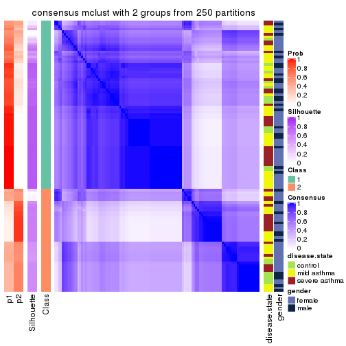</p>

</div>
<div id='tab-MAD-mclust-consensus-heatmap-2'>
<pre><code class="r">consensus_heatmap(res, k = 3)
</code></pre>

<p></p>

</div>
<div id='tab-MAD-mclust-consensus-heatmap-3'>
<pre><code class="r">consensus_heatmap(res, k = 4)
</code></pre>

<p></p>

</div>
<div id='tab-MAD-mclust-consensus-heatmap-4'>
<pre><code class="r">consensus_heatmap(res, k = 5)
</code></pre>

<p></p>

</div>
<div id='tab-MAD-mclust-consensus-heatmap-5'>
<pre><code class="r">consensus_heatmap(res, k = 6)
</code></pre>

<p></p>

</div>
</div>

Heatmaps for the membership of samples in all partitions to see how consistent they are:


<script>
$( function() {
	$( '#tabs-MAD-mclust-membership-heatmap' ).tabs();
} );
</script>
<div id='tabs-MAD-mclust-membership-heatmap'>
<ul>
<li><a href='#tab-MAD-mclust-membership-heatmap-1'>k = 2</a></li>
<li><a href='#tab-MAD-mclust-membership-heatmap-2'>k = 3</a></li>
<li><a href='#tab-MAD-mclust-membership-heatmap-3'>k = 4</a></li>
<li><a href='#tab-MAD-mclust-membership-heatmap-4'>k = 5</a></li>
<li><a href='#tab-MAD-mclust-membership-heatmap-5'>k = 6</a></li>
</ul>
<div id='tab-MAD-mclust-membership-heatmap-1'>
<pre><code class="r">membership_heatmap(res, k = 2)
</code></pre>

<p></p>

</div>
<div id='tab-MAD-mclust-membership-heatmap-2'>
<pre><code class="r">membership_heatmap(res, k = 3)
</code></pre>

<p></p>

</div>
<div id='tab-MAD-mclust-membership-heatmap-3'>
<pre><code class="r">membership_heatmap(res, k = 4)
</code></pre>

<p></p>

</div>
<div id='tab-MAD-mclust-membership-heatmap-4'>
<pre><code class="r">membership_heatmap(res, k = 5)
</code></pre>

<p></p>

</div>
<div id='tab-MAD-mclust-membership-heatmap-5'>
<pre><code class="r">membership_heatmap(res, k = 6)
</code></pre>

<p></p>

</div>
</div>

As soon as we have had the classes for columns, we can look for signatures
which are significantly different between classes which can be candidate marks
for certain classes. Following are the heatmaps for signatures.


Signature heatmaps where rows are scaled:


<script>
$( function() {
	$( '#tabs-MAD-mclust-get-signatures' ).tabs();
} );
</script>
<div id='tabs-MAD-mclust-get-signatures'>
<ul>
<li><a href='#tab-MAD-mclust-get-signatures-1'>k = 2</a></li>
<li><a href='#tab-MAD-mclust-get-signatures-2'>k = 3</a></li>
<li><a href='#tab-MAD-mclust-get-signatures-3'>k = 4</a></li>
<li><a href='#tab-MAD-mclust-get-signatures-4'>k = 5</a></li>
<li><a href='#tab-MAD-mclust-get-signatures-5'>k = 6</a></li>
</ul>
<div id='tab-MAD-mclust-get-signatures-1'>
<pre><code class="r">get_signatures(res, k = 2)
</code></pre>

<p></p>

</div>
<div id='tab-MAD-mclust-get-signatures-2'>
<pre><code class="r">get_signatures(res, k = 3)
</code></pre>

<p></p>

</div>
<div id='tab-MAD-mclust-get-signatures-3'>
<pre><code class="r">get_signatures(res, k = 4)
</code></pre>

<p></p>

</div>
<div id='tab-MAD-mclust-get-signatures-4'>
<pre><code class="r">get_signatures(res, k = 5)
</code></pre>

<p>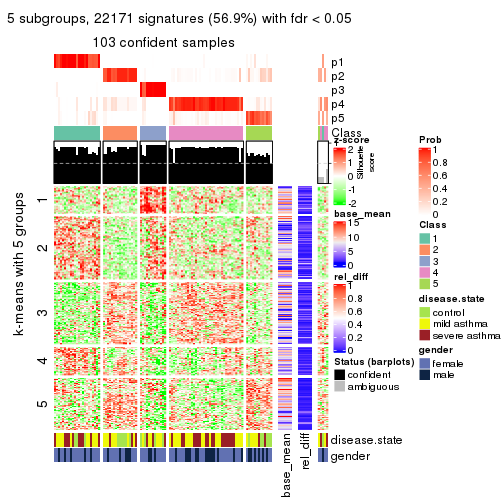</p>

</div>
<div id='tab-MAD-mclust-get-signatures-5'>
<pre><code class="r">get_signatures(res, k = 6)
</code></pre>

<p></p>

</div>
</div>


Signature heatmaps where rows are not scaled:


<script>
$( function() {
	$( '#tabs-MAD-mclust-get-signatures-no-scale' ).tabs();
} );
</script>
<div id='tabs-MAD-mclust-get-signatures-no-scale'>
<ul>
<li><a href='#tab-MAD-mclust-get-signatures-no-scale-1'>k = 2</a></li>
<li><a href='#tab-MAD-mclust-get-signatures-no-scale-2'>k = 3</a></li>
<li><a href='#tab-MAD-mclust-get-signatures-no-scale-3'>k = 4</a></li>
<li><a href='#tab-MAD-mclust-get-signatures-no-scale-4'>k = 5</a></li>
<li><a href='#tab-MAD-mclust-get-signatures-no-scale-5'>k = 6</a></li>
</ul>
<div id='tab-MAD-mclust-get-signatures-no-scale-1'>
<pre><code class="r">get_signatures(res, k = 2, scale_rows = FALSE)
</code></pre>

<p></p>

</div>
<div id='tab-MAD-mclust-get-signatures-no-scale-2'>
<pre><code class="r">get_signatures(res, k = 3, scale_rows = FALSE)
</code></pre>

<p>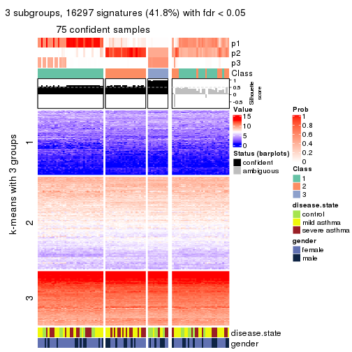</p>

</div>
<div id='tab-MAD-mclust-get-signatures-no-scale-3'>
<pre><code class="r">get_signatures(res, k = 4, scale_rows = FALSE)
</code></pre>

<p></p>

</div>
<div id='tab-MAD-mclust-get-signatures-no-scale-4'>
<pre><code class="r">get_signatures(res, k = 5, scale_rows = FALSE)
</code></pre>

<p></p>

</div>
<div id='tab-MAD-mclust-get-signatures-no-scale-5'>
<pre><code class="r">get_signatures(res, k = 6, scale_rows = FALSE)
</code></pre>

<p></p>

</div>
</div>


Compare the overlap of signatures from different k:

```r
compare_signatures(res)
```


`get_signature()` returns a data frame invisibly. TO get the list of signatures, the function
call should be assigned to a variable explicitly. In following code, if `plot` argument is set
to `FALSE`, no heatmap is plotted while only the differential analysis is performed.

```r
# code only for demonstration
tb = get_signature(res, k = ..., plot = FALSE)
```

An example of the output of `tb` is:

```
#>   which_row         fdr    mean_1    mean_2 scaled_mean_1 scaled_mean_2 km
#> 1        38 0.042760348  8.373488  9.131774    -0.5533452     0.5164555  1
#> 2        40 0.018707592  7.106213  8.469186    -0.6173731     0.5762149  1
#> 3        55 0.019134737 10.221463 11.207825    -0.6159697     0.5749050  1
#> 4        59 0.006059896  5.921854  7.869574    -0.6899429     0.6439467  1
#> 5        60 0.018055526  8.928898 10.211722    -0.6204761     0.5791110  1
#> 6        98 0.009384629 15.714769 14.887706     0.6635654    -0.6193277  2
...
```

The columns in `tb` are:

1. `which_row`: row indices corresponding to the input matrix.
2. `fdr`: FDR for the differential test. 
3. `mean_x`: The mean value in group x.
4. `scaled_mean_x`: The mean value in group x after rows are scaled.
5. `km`: Row groups if k-means clustering is applied to rows.


UMAP plot which shows how samples are separated.


<script>
$( function() {
	$( '#tabs-MAD-mclust-dimension-reduction' ).tabs();
} );
</script>
<div id='tabs-MAD-mclust-dimension-reduction'>
<ul>
<li><a href='#tab-MAD-mclust-dimension-reduction-1'>k = 2</a></li>
<li><a href='#tab-MAD-mclust-dimension-reduction-2'>k = 3</a></li>
<li><a href='#tab-MAD-mclust-dimension-reduction-3'>k = 4</a></li>
<li><a href='#tab-MAD-mclust-dimension-reduction-4'>k = 5</a></li>
<li><a href='#tab-MAD-mclust-dimension-reduction-5'>k = 6</a></li>
</ul>
<div id='tab-MAD-mclust-dimension-reduction-1'>
<pre><code class="r">dimension_reduction(res, k = 2, method = &quot;UMAP&quot;)
</code></pre>

<p></p>

</div>
<div id='tab-MAD-mclust-dimension-reduction-2'>
<pre><code class="r">dimension_reduction(res, k = 3, method = &quot;UMAP&quot;)
</code></pre>

<p>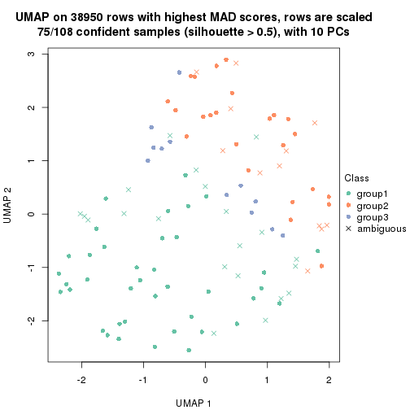</p>

</div>
<div id='tab-MAD-mclust-dimension-reduction-3'>
<pre><code class="r">dimension_reduction(res, k = 4, method = &quot;UMAP&quot;)
</code></pre>

<p></p>

</div>
<div id='tab-MAD-mclust-dimension-reduction-4'>
<pre><code class="r">dimension_reduction(res, k = 5, method = &quot;UMAP&quot;)
</code></pre>

<p></p>

</div>
<div id='tab-MAD-mclust-dimension-reduction-5'>
<pre><code class="r">dimension_reduction(res, k = 6, method = &quot;UMAP&quot;)
</code></pre>

<p></p>

</div>
</div>


Following heatmap shows how subgroups are split when increasing `k`:

```r
collect_classes(res)
```


Test correlation between subgroups and known annotations. If the known
annotation is numeric, one-way ANOVA test is applied, and if the known
annotation is discrete, chi-squared contingency table test is applied.

```r
test_to_known_factors(res)
```

```
#>              n disease.state(p) gender(p) k
#> MAD:mclust  92          0.84752     1.000 2
#> MAD:mclust  75          0.00806     0.542 3
#> MAD:mclust 105          0.00324     0.699 4
#> MAD:mclust 103          0.00397     0.491 5
#> MAD:mclust  88          0.02845     0.649 6
```


If matrix rows can be associated to genes, consider to use `GO_Enrichment(res,
...)` to perform function enrichment for the signature genes.


 

---------------------------------------------------


### MAD:NMF


The object with results only for a single top-value method and a single partition method 
can be extracted as:

```r
res = res_list["MAD", "NMF"]
# you can also extract it by
# res = res_list["MAD:NMF"]
```

A summary of `res` and all the functions that can be applied to it:

```r
res
```

```
#> A 'ConsensusPartition' object with k = 2, 3, 4, 5, 6.
#>   On a matrix with 38950 rows and 108 columns.
#>   Top rows (1000, 2000, 3000, 4000, 5000) are extracted by 'MAD' method.
#>   Subgroups are detected by 'NMF' method.
#>   Performed in total 1250 partitions by row resampling.
#>   Best k for subgroups seems to be 2.
#> 
#> Following methods can be applied to this 'ConsensusPartition' object:
#>  [1] "cola_report"             "collect_classes"         "collect_plots"          
#>  [4] "collect_stats"           "colnames"                "compare_signatures"     
#>  [7] "consensus_heatmap"       "dimension_reduction"     "functional_enrichment"  
#> [10] "get_anno_col"            "get_anno"                "get_classes"            
#> [13] "get_consensus"           "get_matrix"              "get_membership"         
#> [16] "get_param"               "get_signatures"          "get_stats"              
#> [19] "is_best_k"               "is_stable_k"             "membership_heatmap"     
#> [22] "ncol"                    "nrow"                    "plot_ecdf"              
#> [25] "rownames"                "select_partition_number" "show"                   
#> [28] "suggest_best_k"          "test_to_known_factors"
```

`collect_plots()` function collects all the plots made from `res` for all `k` (number of partitions)
into one single page to provide an easy and fast comparison between different `k`.

```r
collect_plots(res)
```


The plots are:

- The first row: a plot of the ECDF (Empirical cumulative distribution
  function) curves of the consensus matrix for each `k` and the heatmap of
  predicted classes for each `k`.
- The second row: heatmaps of the consensus matrix for each `k`.
- The third row: heatmaps of the membership matrix for each `k`.
- The fouth row: heatmaps of the signatures for each `k`.

All the plots in panels can be made by individual functions and they are
plotted later in this section.

`select_partition_number()` produces several plots showing different
statistics for choosing "optimized" `k`. There are following statistics:

- ECDF curves of the consensus matrix for each `k`;
- 1-PAC. [The PAC
  score](https://en.wikipedia.org/wiki/Consensus_clustering#Over-interpretation_potential_of_consensus_clustering)
  measures the proportion of the ambiguous subgrouping.
- Mean silhouette score.
- Concordance. The mean probability of fiting the consensus class ids in all
  partitions.
- Area increased. Denote $A_k$ as the area under the ECDF curve for current
  `k`, the area increased is defined as $A_k - A_{k-1}$.
- Rand index. The percent of pairs of samples that are both in a same cluster
  or both are not in a same cluster in the partition of k and k-1.
- Jaccard index. The ratio of pairs of samples are both in a same cluster in
  the partition of k and k-1 and the pairs of samples are both in a same
  cluster in the partition k or k-1.

The detailed explanations of these statistics can be found in [the cola
vignette](http://bioconductor.org/packages/devel/bioc/vignettes/cola/inst/doc/cola.html#toc_13).

Generally speaking, lower PAC score, higher mean silhouette score or higher
concordance corresponds to better partition. Rand index and Jaccard index
measure how similar the current partition is compared to partition with `k-1`.
If they are too similar, we won't accept `k` is better than `k-1`.

```r
select_partition_number(res)
```


The numeric values for all these statistics can be obtained by `get_stats()`.

```r
get_stats(res)
```

```
#>   k 1-PAC mean_silhouette concordance area_increased  Rand Jaccard
#> 2 2 0.842           0.895       0.957         0.4946 0.504   0.504
#> 3 3 0.606           0.745       0.868         0.2760 0.827   0.674
#> 4 4 0.683           0.813       0.886         0.1677 0.749   0.439
#> 5 5 0.643           0.634       0.777         0.0729 0.895   0.625
#> 6 6 0.669           0.632       0.778         0.0448 0.896   0.561
```

`suggest_best_k()` suggests the best $k$ based on these statistics. The rules are as follows:

- All $k$ with Jaccard index larger than 0.95 are removed because the increase of
  the partition number does not provides enough extra information. If all $k$ are removed,
  the best $k$ is assigned by `NA`.
- For $k$ with 1-PAC larger than 0.9, the maximal $k$ is taken as the "best k". Other $k$ is called "optional k".
- If it does not fit the second rule. The $k$ with the highest vote of highest
  1-PAC, mean silhouette and concordance is taken as the "best k".

```r
suggest_best_k(res)
```

```
#> [1] 2
```


Following shows the table of the partitions (You need to click the **show/hide
code output** link to see it). The membership matrix (columns with name `p*`)
is inferred by
[`clue::cl_consensus()`](https://www.rdocumentation.org/link/cl_consensus?package=clue)
function with the `SE` method. Basically the value in the membership matrix
represents the probability to belong to a certain group. The finall class
label for an item is determined with the group with highest probability it
belongs to.

In `get_classes()` function, the entropy is calculated from the membership
matrix and the silhouette score is calculated from the consensus matrix.


<script>
$( function() {
	$( '#tabs-MAD-NMF-get-classes' ).tabs();
} );
</script>
<div id='tabs-MAD-NMF-get-classes'>
<ul>
<li><a href='#tab-MAD-NMF-get-classes-1'>k = 2</a></li>
<li><a href='#tab-MAD-NMF-get-classes-2'>k = 3</a></li>
<li><a href='#tab-MAD-NMF-get-classes-3'>k = 4</a></li>
<li><a href='#tab-MAD-NMF-get-classes-4'>k = 5</a></li>
<li><a href='#tab-MAD-NMF-get-classes-5'>k = 6</a></li>
</ul>

<div id='tab-MAD-NMF-get-classes-1'>
<p><a id='tab-MAD-NMF-get-classes-1-a' style='color:#0366d6' href='#'>show/hide code output</a></p>
<pre><code class="r">cbind(get_classes(res, k = 2), get_membership(res, k = 2))
</code></pre>

<pre><code>#&gt;            class entropy silhouette    p1    p2
#&gt; GSM1068478     1  0.2948     0.9077 0.948 0.052
#&gt; GSM1068479     2  0.0000     0.9569 0.000 1.000
#&gt; GSM1068481     1  0.0000     0.9468 1.000 0.000
#&gt; GSM1068482     1  0.0000     0.9468 1.000 0.000
#&gt; GSM1068483     1  0.0000     0.9468 1.000 0.000
#&gt; GSM1068486     1  0.0000     0.9468 1.000 0.000
#&gt; GSM1068487     2  0.0000     0.9569 0.000 1.000
#&gt; GSM1068488     2  0.5842     0.8315 0.140 0.860
#&gt; GSM1068490     2  0.0000     0.9569 0.000 1.000
#&gt; GSM1068491     1  0.0000     0.9468 1.000 0.000
#&gt; GSM1068492     2  0.0000     0.9569 0.000 1.000
#&gt; GSM1068493     1  0.8327     0.6447 0.736 0.264
#&gt; GSM1068494     1  0.0000     0.9468 1.000 0.000
#&gt; GSM1068495     2  0.0000     0.9569 0.000 1.000
#&gt; GSM1068496     1  0.0000     0.9468 1.000 0.000
#&gt; GSM1068498     2  0.5519     0.8409 0.128 0.872
#&gt; GSM1068499     1  0.0000     0.9468 1.000 0.000
#&gt; GSM1068500     1  0.0000     0.9468 1.000 0.000
#&gt; GSM1068502     2  0.0000     0.9569 0.000 1.000
#&gt; GSM1068503     2  0.0000     0.9569 0.000 1.000
#&gt; GSM1068505     2  0.0000     0.9569 0.000 1.000
#&gt; GSM1068506     2  0.0000     0.9569 0.000 1.000
#&gt; GSM1068507     2  0.4562     0.8797 0.096 0.904
#&gt; GSM1068508     2  0.0000     0.9569 0.000 1.000
#&gt; GSM1068510     2  0.0000     0.9569 0.000 1.000
#&gt; GSM1068512     1  0.3274     0.9003 0.940 0.060
#&gt; GSM1068513     2  0.0000     0.9569 0.000 1.000
#&gt; GSM1068514     1  0.8955     0.5405 0.688 0.312
#&gt; GSM1068517     2  0.0000     0.9569 0.000 1.000
#&gt; GSM1068518     1  1.0000    -0.0130 0.504 0.496
#&gt; GSM1068520     1  0.0000     0.9468 1.000 0.000
#&gt; GSM1068521     1  0.0000     0.9468 1.000 0.000
#&gt; GSM1068522     2  0.0000     0.9569 0.000 1.000
#&gt; GSM1068524     2  0.0000     0.9569 0.000 1.000
#&gt; GSM1068527     1  0.9993     0.0438 0.516 0.484
#&gt; GSM1068480     1  0.0000     0.9468 1.000 0.000
#&gt; GSM1068484     2  0.0000     0.9569 0.000 1.000
#&gt; GSM1068485     1  0.0000     0.9468 1.000 0.000
#&gt; GSM1068489     2  0.0000     0.9569 0.000 1.000
#&gt; GSM1068497     2  0.2603     0.9246 0.044 0.956
#&gt; GSM1068501     2  0.0000     0.9569 0.000 1.000
#&gt; GSM1068504     2  0.0000     0.9569 0.000 1.000
#&gt; GSM1068509     1  0.0000     0.9468 1.000 0.000
#&gt; GSM1068511     1  0.0000     0.9468 1.000 0.000
#&gt; GSM1068515     1  0.4562     0.8641 0.904 0.096
#&gt; GSM1068516     2  0.3274     0.9140 0.060 0.940
#&gt; GSM1068519     1  0.0000     0.9468 1.000 0.000
#&gt; GSM1068523     2  0.0000     0.9569 0.000 1.000
#&gt; GSM1068525     2  0.0000     0.9569 0.000 1.000
#&gt; GSM1068526     2  0.0376     0.9546 0.004 0.996
#&gt; GSM1068458     1  0.0000     0.9468 1.000 0.000
#&gt; GSM1068459     1  0.0000     0.9468 1.000 0.000
#&gt; GSM1068460     1  0.9427     0.4267 0.640 0.360
#&gt; GSM1068461     1  0.0000     0.9468 1.000 0.000
#&gt; GSM1068464     2  0.0000     0.9569 0.000 1.000
#&gt; GSM1068468     2  0.0000     0.9569 0.000 1.000
#&gt; GSM1068472     2  0.0000     0.9569 0.000 1.000
#&gt; GSM1068473     2  0.0000     0.9569 0.000 1.000
#&gt; GSM1068474     2  0.0000     0.9569 0.000 1.000
#&gt; GSM1068476     1  0.1414     0.9335 0.980 0.020
#&gt; GSM1068477     2  0.0000     0.9569 0.000 1.000
#&gt; GSM1068462     2  0.0000     0.9569 0.000 1.000
#&gt; GSM1068463     1  0.0000     0.9468 1.000 0.000
#&gt; GSM1068465     2  0.7453     0.7284 0.212 0.788
#&gt; GSM1068466     1  0.0000     0.9468 1.000 0.000
#&gt; GSM1068467     2  0.0000     0.9569 0.000 1.000
#&gt; GSM1068469     2  0.5946     0.8213 0.144 0.856
#&gt; GSM1068470     2  0.0000     0.9569 0.000 1.000
#&gt; GSM1068471     2  0.0000     0.9569 0.000 1.000
#&gt; GSM1068475     2  0.0000     0.9569 0.000 1.000
#&gt; GSM1068528     1  0.0000     0.9468 1.000 0.000
#&gt; GSM1068531     1  0.0000     0.9468 1.000 0.000
#&gt; GSM1068532     1  0.0000     0.9468 1.000 0.000
#&gt; GSM1068533     1  0.0000     0.9468 1.000 0.000
#&gt; GSM1068535     1  0.0000     0.9468 1.000 0.000
#&gt; GSM1068537     1  0.0000     0.9468 1.000 0.000
#&gt; GSM1068538     1  0.0000     0.9468 1.000 0.000
#&gt; GSM1068539     2  0.0000     0.9569 0.000 1.000
#&gt; GSM1068540     1  0.0000     0.9468 1.000 0.000
#&gt; GSM1068542     2  0.0672     0.9521 0.008 0.992
#&gt; GSM1068543     2  0.9635     0.3733 0.388 0.612
#&gt; GSM1068544     1  0.0000     0.9468 1.000 0.000
#&gt; GSM1068545     2  0.0000     0.9569 0.000 1.000
#&gt; GSM1068546     1  0.0000     0.9468 1.000 0.000
#&gt; GSM1068547     1  0.0000     0.9468 1.000 0.000
#&gt; GSM1068548     2  0.4161     0.8909 0.084 0.916
#&gt; GSM1068549     1  0.0000     0.9468 1.000 0.000
#&gt; GSM1068550     2  0.0000     0.9569 0.000 1.000
#&gt; GSM1068551     2  0.0000     0.9569 0.000 1.000
#&gt; GSM1068552     2  0.0000     0.9569 0.000 1.000
#&gt; GSM1068555     2  0.0000     0.9569 0.000 1.000
#&gt; GSM1068556     2  0.9393     0.4558 0.356 0.644
#&gt; GSM1068557     2  0.0000     0.9569 0.000 1.000
#&gt; GSM1068560     2  0.7139     0.7563 0.196 0.804
#&gt; GSM1068561     2  0.0376     0.9546 0.004 0.996
#&gt; GSM1068562     2  0.1414     0.9439 0.020 0.980
#&gt; GSM1068563     2  0.0376     0.9546 0.004 0.996
#&gt; GSM1068565     2  0.0000     0.9569 0.000 1.000
#&gt; GSM1068529     1  0.2423     0.9195 0.960 0.040
#&gt; GSM1068530     1  0.0000     0.9468 1.000 0.000
#&gt; GSM1068534     1  0.0000     0.9468 1.000 0.000
#&gt; GSM1068536     1  0.4562     0.8677 0.904 0.096
#&gt; GSM1068541     2  0.0000     0.9569 0.000 1.000
#&gt; GSM1068553     2  0.9732     0.3291 0.404 0.596
#&gt; GSM1068554     2  0.0000     0.9569 0.000 1.000
#&gt; GSM1068558     2  0.5059     0.8633 0.112 0.888
#&gt; GSM1068559     1  0.0672     0.9418 0.992 0.008
#&gt; GSM1068564     2  0.0000     0.9569 0.000 1.000
</code></pre>

<script>
$('#tab-MAD-NMF-get-classes-1-a').parent().next().next().hide();
$('#tab-MAD-NMF-get-classes-1-a').click(function(){
  $('#tab-MAD-NMF-get-classes-1-a').parent().next().next().toggle();
  return(false);
});
</script>
</div>

<div id='tab-MAD-NMF-get-classes-2'>
<p><a id='tab-MAD-NMF-get-classes-2-a' style='color:#0366d6' href='#'>show/hide code output</a></p>
<pre><code class="r">cbind(get_classes(res, k = 3), get_membership(res, k = 3))
</code></pre>

<pre><code>#&gt;            class entropy silhouette    p1    p2    p3
#&gt; GSM1068478     1  0.1711     0.8439 0.960 0.008 0.032
#&gt; GSM1068479     2  0.5926     0.4614 0.000 0.644 0.356
#&gt; GSM1068481     3  0.2625     0.8238 0.084 0.000 0.916
#&gt; GSM1068482     3  0.2537     0.8277 0.080 0.000 0.920
#&gt; GSM1068483     1  0.2066     0.8380 0.940 0.000 0.060
#&gt; GSM1068486     3  0.1860     0.8341 0.052 0.000 0.948
#&gt; GSM1068487     2  0.0892     0.8531 0.000 0.980 0.020
#&gt; GSM1068488     3  0.8671     0.2034 0.104 0.416 0.480
#&gt; GSM1068490     2  0.1031     0.8536 0.000 0.976 0.024
#&gt; GSM1068491     3  0.1647     0.8338 0.036 0.004 0.960
#&gt; GSM1068492     3  0.6126     0.2749 0.000 0.400 0.600
#&gt; GSM1068493     3  0.8065     0.0566 0.064 0.452 0.484
#&gt; GSM1068494     1  0.5431     0.5705 0.716 0.000 0.284
#&gt; GSM1068495     2  0.7175     0.4118 0.376 0.592 0.032
#&gt; GSM1068496     1  0.1643     0.8583 0.956 0.000 0.044
#&gt; GSM1068498     1  0.6762     0.5130 0.676 0.288 0.036
#&gt; GSM1068499     1  0.4178     0.7517 0.828 0.000 0.172
#&gt; GSM1068500     1  0.4504     0.6896 0.804 0.000 0.196
#&gt; GSM1068502     2  0.6140     0.3305 0.000 0.596 0.404
#&gt; GSM1068503     2  0.1031     0.8517 0.000 0.976 0.024
#&gt; GSM1068505     2  0.3213     0.8176 0.092 0.900 0.008
#&gt; GSM1068506     2  0.0661     0.8555 0.008 0.988 0.004
#&gt; GSM1068507     2  0.4351     0.7545 0.004 0.828 0.168
#&gt; GSM1068508     2  0.2689     0.8437 0.036 0.932 0.032
#&gt; GSM1068510     2  0.5621     0.5137 0.000 0.692 0.308
#&gt; GSM1068512     1  0.8102     0.2622 0.556 0.368 0.076
#&gt; GSM1068513     2  0.1163     0.8520 0.000 0.972 0.028
#&gt; GSM1068514     3  0.2590     0.8120 0.004 0.072 0.924
#&gt; GSM1068517     2  0.7209     0.4214 0.360 0.604 0.036
#&gt; GSM1068518     2  0.5956     0.6502 0.264 0.720 0.016
#&gt; GSM1068520     1  0.0592     0.8577 0.988 0.012 0.000
#&gt; GSM1068521     1  0.0000     0.8608 1.000 0.000 0.000
#&gt; GSM1068522     2  0.0237     0.8545 0.000 0.996 0.004
#&gt; GSM1068524     2  0.1031     0.8523 0.000 0.976 0.024
#&gt; GSM1068527     1  0.5597     0.6453 0.764 0.216 0.020
#&gt; GSM1068480     3  0.2066     0.8326 0.060 0.000 0.940
#&gt; GSM1068484     2  0.1031     0.8510 0.000 0.976 0.024
#&gt; GSM1068485     3  0.3340     0.7978 0.120 0.000 0.880
#&gt; GSM1068489     2  0.1267     0.8513 0.004 0.972 0.024
#&gt; GSM1068497     2  0.7672     0.0840 0.468 0.488 0.044
#&gt; GSM1068501     2  0.1031     0.8510 0.000 0.976 0.024
#&gt; GSM1068504     2  0.1411     0.8545 0.000 0.964 0.036
#&gt; GSM1068509     1  0.1289     0.8610 0.968 0.000 0.032
#&gt; GSM1068511     3  0.5526     0.7150 0.172 0.036 0.792
#&gt; GSM1068515     1  0.7742     0.4764 0.632 0.080 0.288
#&gt; GSM1068516     2  0.2297     0.8462 0.036 0.944 0.020
#&gt; GSM1068519     1  0.1411     0.8600 0.964 0.000 0.036
#&gt; GSM1068523     2  0.2297     0.8485 0.020 0.944 0.036
#&gt; GSM1068525     2  0.1031     0.8510 0.000 0.976 0.024
#&gt; GSM1068526     2  0.0892     0.8517 0.000 0.980 0.020
#&gt; GSM1068458     1  0.0424     0.8610 0.992 0.000 0.008
#&gt; GSM1068459     3  0.2796     0.8222 0.092 0.000 0.908
#&gt; GSM1068460     1  0.1585     0.8468 0.964 0.028 0.008
#&gt; GSM1068461     3  0.2066     0.8326 0.060 0.000 0.940
#&gt; GSM1068464     2  0.1878     0.8533 0.004 0.952 0.044
#&gt; GSM1068468     2  0.2903     0.8449 0.028 0.924 0.048
#&gt; GSM1068472     2  0.3112     0.8438 0.028 0.916 0.056
#&gt; GSM1068473     2  0.0592     0.8548 0.000 0.988 0.012
#&gt; GSM1068474     2  0.1878     0.8522 0.004 0.952 0.044
#&gt; GSM1068476     3  0.2804     0.8193 0.016 0.060 0.924
#&gt; GSM1068477     2  0.2926     0.8411 0.040 0.924 0.036
#&gt; GSM1068462     2  0.6026     0.6791 0.024 0.732 0.244
#&gt; GSM1068463     3  0.3816     0.7700 0.148 0.000 0.852
#&gt; GSM1068465     1  0.4931     0.7222 0.828 0.140 0.032
#&gt; GSM1068466     1  0.0000     0.8608 1.000 0.000 0.000
#&gt; GSM1068467     2  0.2903     0.8449 0.028 0.924 0.048
#&gt; GSM1068469     2  0.9001     0.4394 0.280 0.548 0.172
#&gt; GSM1068470     2  0.2564     0.8453 0.028 0.936 0.036
#&gt; GSM1068471     2  0.1878     0.8522 0.004 0.952 0.044
#&gt; GSM1068475     2  0.2152     0.8496 0.016 0.948 0.036
#&gt; GSM1068528     1  0.1964     0.8529 0.944 0.000 0.056
#&gt; GSM1068531     1  0.1289     0.8610 0.968 0.000 0.032
#&gt; GSM1068532     1  0.1643     0.8571 0.956 0.000 0.044
#&gt; GSM1068533     1  0.1529     0.8598 0.960 0.000 0.040
#&gt; GSM1068535     1  0.7192     0.2703 0.560 0.028 0.412
#&gt; GSM1068537     1  0.1289     0.8610 0.968 0.000 0.032
#&gt; GSM1068538     1  0.1289     0.8610 0.968 0.000 0.032
#&gt; GSM1068539     2  0.4295     0.8156 0.104 0.864 0.032
#&gt; GSM1068540     1  0.0892     0.8619 0.980 0.000 0.020
#&gt; GSM1068542     2  0.5366     0.7099 0.208 0.776 0.016
#&gt; GSM1068543     2  0.7844     0.5845 0.220 0.660 0.120
#&gt; GSM1068544     1  0.3619     0.7933 0.864 0.000 0.136
#&gt; GSM1068545     2  0.1905     0.8518 0.028 0.956 0.016
#&gt; GSM1068546     3  0.2261     0.8316 0.068 0.000 0.932
#&gt; GSM1068547     1  0.0592     0.8577 0.988 0.012 0.000
#&gt; GSM1068548     2  0.5728     0.6381 0.272 0.720 0.008
#&gt; GSM1068549     3  0.1860     0.8342 0.052 0.000 0.948
#&gt; GSM1068550     2  0.2902     0.8325 0.064 0.920 0.016
#&gt; GSM1068551     2  0.2152     0.8496 0.016 0.948 0.036
#&gt; GSM1068552     2  0.0747     0.8526 0.000 0.984 0.016
#&gt; GSM1068555     2  0.1832     0.8515 0.008 0.956 0.036
#&gt; GSM1068556     2  0.6341     0.6491 0.252 0.716 0.032
#&gt; GSM1068557     2  0.2773     0.8466 0.024 0.928 0.048
#&gt; GSM1068560     2  0.6062     0.6256 0.276 0.708 0.016
#&gt; GSM1068561     2  0.2448     0.8474 0.000 0.924 0.076
#&gt; GSM1068562     2  0.1453     0.8505 0.008 0.968 0.024
#&gt; GSM1068563     2  0.0661     0.8550 0.004 0.988 0.008
#&gt; GSM1068565     2  0.2297     0.8485 0.020 0.944 0.036
#&gt; GSM1068529     3  0.4209     0.7847 0.020 0.120 0.860
#&gt; GSM1068530     1  0.0000     0.8608 1.000 0.000 0.000
#&gt; GSM1068534     3  0.5167     0.7401 0.172 0.024 0.804
#&gt; GSM1068536     1  0.2187     0.8375 0.948 0.028 0.024
#&gt; GSM1068541     2  0.5574     0.7344 0.184 0.784 0.032
#&gt; GSM1068553     2  0.9736    -0.0476 0.228 0.416 0.356
#&gt; GSM1068554     2  0.2878     0.8190 0.000 0.904 0.096
#&gt; GSM1068558     3  0.3038     0.7964 0.000 0.104 0.896
#&gt; GSM1068559     3  0.2846     0.8215 0.020 0.056 0.924
#&gt; GSM1068564     2  0.0424     0.8539 0.000 0.992 0.008
</code></pre>

<script>
$('#tab-MAD-NMF-get-classes-2-a').parent().next().next().hide();
$('#tab-MAD-NMF-get-classes-2-a').click(function(){
  $('#tab-MAD-NMF-get-classes-2-a').parent().next().next().toggle();
  return(false);
});
</script>
</div>

<div id='tab-MAD-NMF-get-classes-3'>
<p><a id='tab-MAD-NMF-get-classes-3-a' style='color:#0366d6' href='#'>show/hide code output</a></p>
<pre><code class="r">cbind(get_classes(res, k = 4), get_membership(res, k = 4))
</code></pre>

<pre><code>#&gt;            class entropy silhouette    p1    p2    p3    p4
#&gt; GSM1068478     1  0.2647    0.88499 0.880 0.120 0.000 0.000
#&gt; GSM1068479     3  0.6079    0.00562 0.000 0.464 0.492 0.044
#&gt; GSM1068481     3  0.2186    0.85417 0.008 0.048 0.932 0.012
#&gt; GSM1068482     3  0.0188    0.87859 0.000 0.000 0.996 0.004
#&gt; GSM1068483     1  0.3099    0.88732 0.876 0.104 0.020 0.000
#&gt; GSM1068486     3  0.0469    0.87807 0.000 0.000 0.988 0.012
#&gt; GSM1068487     2  0.4776    0.48349 0.000 0.624 0.000 0.376
#&gt; GSM1068488     4  0.2413    0.85732 0.036 0.004 0.036 0.924
#&gt; GSM1068490     2  0.3801    0.77880 0.000 0.780 0.000 0.220
#&gt; GSM1068491     3  0.0188    0.87877 0.000 0.004 0.996 0.000
#&gt; GSM1068492     3  0.5859    0.49078 0.000 0.064 0.652 0.284
#&gt; GSM1068493     2  0.3674    0.75068 0.044 0.852 0.104 0.000
#&gt; GSM1068494     1  0.3216    0.86630 0.880 0.000 0.044 0.076
#&gt; GSM1068495     1  0.6383    0.41251 0.612 0.292 0.000 0.096
#&gt; GSM1068496     1  0.1661    0.91741 0.944 0.052 0.004 0.000
#&gt; GSM1068498     2  0.2281    0.78987 0.096 0.904 0.000 0.000
#&gt; GSM1068499     1  0.3899    0.85251 0.840 0.052 0.108 0.000
#&gt; GSM1068500     1  0.3556    0.88185 0.864 0.096 0.036 0.004
#&gt; GSM1068502     3  0.6477    0.10591 0.000 0.420 0.508 0.072
#&gt; GSM1068503     4  0.2973    0.82483 0.000 0.144 0.000 0.856
#&gt; GSM1068505     4  0.1297    0.86592 0.020 0.016 0.000 0.964
#&gt; GSM1068506     4  0.2149    0.86335 0.000 0.088 0.000 0.912
#&gt; GSM1068507     4  0.1824    0.86959 0.000 0.060 0.004 0.936
#&gt; GSM1068508     2  0.2773    0.87094 0.004 0.880 0.000 0.116
#&gt; GSM1068510     4  0.2623    0.87008 0.000 0.064 0.028 0.908
#&gt; GSM1068512     4  0.4632    0.59400 0.308 0.000 0.004 0.688
#&gt; GSM1068513     4  0.4072    0.67442 0.000 0.252 0.000 0.748
#&gt; GSM1068514     3  0.3626    0.72574 0.000 0.004 0.812 0.184
#&gt; GSM1068517     2  0.1637    0.81724 0.060 0.940 0.000 0.000
#&gt; GSM1068518     4  0.4149    0.80494 0.152 0.036 0.000 0.812
#&gt; GSM1068520     1  0.1637    0.91481 0.940 0.060 0.000 0.000
#&gt; GSM1068521     1  0.1118    0.91962 0.964 0.036 0.000 0.000
#&gt; GSM1068522     4  0.2647    0.84239 0.000 0.120 0.000 0.880
#&gt; GSM1068524     4  0.3266    0.79861 0.000 0.168 0.000 0.832
#&gt; GSM1068527     4  0.4477    0.59049 0.312 0.000 0.000 0.688
#&gt; GSM1068480     3  0.0188    0.87859 0.000 0.000 0.996 0.004
#&gt; GSM1068484     4  0.2011    0.86587 0.000 0.080 0.000 0.920
#&gt; GSM1068485     3  0.1510    0.86009 0.016 0.028 0.956 0.000
#&gt; GSM1068489     4  0.1256    0.87207 0.008 0.028 0.000 0.964
#&gt; GSM1068497     2  0.1637    0.81724 0.060 0.940 0.000 0.000
#&gt; GSM1068501     4  0.1637    0.87204 0.000 0.060 0.000 0.940
#&gt; GSM1068504     2  0.2921    0.85649 0.000 0.860 0.000 0.140
#&gt; GSM1068509     1  0.1118    0.91839 0.964 0.000 0.000 0.036
#&gt; GSM1068511     4  0.4483    0.76180 0.088 0.000 0.104 0.808
#&gt; GSM1068515     2  0.4178    0.71784 0.140 0.824 0.016 0.020
#&gt; GSM1068516     4  0.2549    0.86932 0.024 0.056 0.004 0.916
#&gt; GSM1068519     1  0.1576    0.90979 0.948 0.000 0.004 0.048
#&gt; GSM1068523     2  0.2647    0.86924 0.000 0.880 0.000 0.120
#&gt; GSM1068525     4  0.2216    0.86133 0.000 0.092 0.000 0.908
#&gt; GSM1068526     4  0.1474    0.87161 0.000 0.052 0.000 0.948
#&gt; GSM1068458     1  0.2282    0.91432 0.924 0.052 0.000 0.024
#&gt; GSM1068459     3  0.0469    0.87597 0.012 0.000 0.988 0.000
#&gt; GSM1068460     1  0.0921    0.91941 0.972 0.000 0.000 0.028
#&gt; GSM1068461     3  0.0000    0.87883 0.000 0.000 1.000 0.000
#&gt; GSM1068464     2  0.2345    0.87301 0.000 0.900 0.000 0.100
#&gt; GSM1068468     2  0.0967    0.85420 0.004 0.976 0.004 0.016
#&gt; GSM1068472     2  0.1191    0.83856 0.024 0.968 0.004 0.004
#&gt; GSM1068473     2  0.4331    0.67784 0.000 0.712 0.000 0.288
#&gt; GSM1068474     2  0.2345    0.87301 0.000 0.900 0.000 0.100
#&gt; GSM1068476     3  0.0376    0.87925 0.000 0.004 0.992 0.004
#&gt; GSM1068477     2  0.2053    0.87094 0.004 0.924 0.000 0.072
#&gt; GSM1068462     2  0.1411    0.82986 0.020 0.960 0.020 0.000
#&gt; GSM1068463     3  0.0937    0.87499 0.012 0.000 0.976 0.012
#&gt; GSM1068465     1  0.2976    0.87801 0.872 0.120 0.000 0.008
#&gt; GSM1068466     1  0.2048    0.91305 0.928 0.064 0.000 0.008
#&gt; GSM1068467     2  0.0712    0.84687 0.008 0.984 0.004 0.004
#&gt; GSM1068469     2  0.1722    0.82051 0.048 0.944 0.008 0.000
#&gt; GSM1068470     2  0.2408    0.87300 0.000 0.896 0.000 0.104
#&gt; GSM1068471     2  0.2345    0.87301 0.000 0.900 0.000 0.100
#&gt; GSM1068475     2  0.2281    0.87312 0.000 0.904 0.000 0.096
#&gt; GSM1068528     1  0.2521    0.90902 0.912 0.064 0.024 0.000
#&gt; GSM1068531     1  0.1118    0.91687 0.964 0.000 0.000 0.036
#&gt; GSM1068532     1  0.1489    0.91224 0.952 0.000 0.004 0.044
#&gt; GSM1068533     1  0.1584    0.92058 0.952 0.012 0.000 0.036
#&gt; GSM1068535     4  0.3937    0.72297 0.188 0.000 0.012 0.800
#&gt; GSM1068537     1  0.1302    0.91668 0.956 0.000 0.000 0.044
#&gt; GSM1068538     1  0.1716    0.91166 0.936 0.000 0.000 0.064
#&gt; GSM1068539     2  0.6495    0.59960 0.108 0.608 0.000 0.284
#&gt; GSM1068540     1  0.0921    0.91941 0.972 0.000 0.000 0.028
#&gt; GSM1068542     4  0.1256    0.86199 0.028 0.008 0.000 0.964
#&gt; GSM1068543     4  0.1211    0.85997 0.040 0.000 0.000 0.960
#&gt; GSM1068544     1  0.2644    0.90240 0.908 0.032 0.060 0.000
#&gt; GSM1068545     4  0.4134    0.65759 0.000 0.260 0.000 0.740
#&gt; GSM1068546     3  0.0817    0.87445 0.000 0.000 0.976 0.024
#&gt; GSM1068547     1  0.1118    0.91687 0.964 0.000 0.000 0.036
#&gt; GSM1068548     4  0.1716    0.84735 0.064 0.000 0.000 0.936
#&gt; GSM1068549     3  0.0188    0.87914 0.000 0.000 0.996 0.004
#&gt; GSM1068550     4  0.1520    0.87081 0.024 0.020 0.000 0.956
#&gt; GSM1068551     2  0.2921    0.85693 0.000 0.860 0.000 0.140
#&gt; GSM1068552     4  0.1940    0.86623 0.000 0.076 0.000 0.924
#&gt; GSM1068555     2  0.2281    0.87379 0.000 0.904 0.000 0.096
#&gt; GSM1068556     4  0.2149    0.83359 0.088 0.000 0.000 0.912
#&gt; GSM1068557     2  0.1109    0.85940 0.000 0.968 0.004 0.028
#&gt; GSM1068560     4  0.1807    0.86524 0.052 0.008 0.000 0.940
#&gt; GSM1068561     2  0.4225    0.81188 0.000 0.792 0.024 0.184
#&gt; GSM1068562     4  0.2021    0.87188 0.012 0.056 0.000 0.932
#&gt; GSM1068563     4  0.2654    0.85159 0.000 0.108 0.004 0.888
#&gt; GSM1068565     2  0.2647    0.86748 0.000 0.880 0.000 0.120
#&gt; GSM1068529     3  0.4034    0.71286 0.004 0.008 0.796 0.192
#&gt; GSM1068530     1  0.0336    0.92228 0.992 0.008 0.000 0.000
#&gt; GSM1068534     4  0.5358    0.61091 0.048 0.000 0.252 0.700
#&gt; GSM1068536     1  0.1151    0.92217 0.968 0.008 0.000 0.024
#&gt; GSM1068541     2  0.3972    0.84867 0.080 0.840 0.000 0.080
#&gt; GSM1068553     4  0.2081    0.82137 0.084 0.000 0.000 0.916
#&gt; GSM1068554     4  0.1302    0.87273 0.000 0.044 0.000 0.956
#&gt; GSM1068558     4  0.4998    0.08594 0.000 0.000 0.488 0.512
#&gt; GSM1068559     3  0.0188    0.87914 0.000 0.000 0.996 0.004
#&gt; GSM1068564     4  0.2345    0.85707 0.000 0.100 0.000 0.900
</code></pre>

<script>
$('#tab-MAD-NMF-get-classes-3-a').parent().next().next().hide();
$('#tab-MAD-NMF-get-classes-3-a').click(function(){
  $('#tab-MAD-NMF-get-classes-3-a').parent().next().next().toggle();
  return(false);
});
</script>
</div>

<div id='tab-MAD-NMF-get-classes-4'>
<p><a id='tab-MAD-NMF-get-classes-4-a' style='color:#0366d6' href='#'>show/hide code output</a></p>
<pre><code class="r">cbind(get_classes(res, k = 5), get_membership(res, k = 5))
</code></pre>

<pre><code>#&gt;            class entropy silhouette    p1    p2    p3    p4    p5
#&gt; GSM1068478     1  0.4100     0.7439 0.764 0.192 0.000 0.000 0.044
#&gt; GSM1068479     2  0.4886     0.1738 0.000 0.528 0.448 0.024 0.000
#&gt; GSM1068481     3  0.3907     0.8382 0.068 0.032 0.832 0.068 0.000
#&gt; GSM1068482     3  0.0510     0.8905 0.000 0.000 0.984 0.000 0.016
#&gt; GSM1068483     1  0.1768     0.8485 0.924 0.072 0.000 0.004 0.000
#&gt; GSM1068486     3  0.2632     0.8641 0.040 0.000 0.888 0.072 0.000
#&gt; GSM1068487     2  0.5557    -0.0451 0.000 0.472 0.000 0.460 0.068
#&gt; GSM1068488     5  0.2286     0.5701 0.000 0.000 0.004 0.108 0.888
#&gt; GSM1068490     2  0.4727     0.1753 0.000 0.532 0.000 0.452 0.016
#&gt; GSM1068491     3  0.0613     0.8915 0.000 0.008 0.984 0.004 0.004
#&gt; GSM1068492     3  0.5078     0.6679 0.000 0.040 0.740 0.156 0.064
#&gt; GSM1068493     2  0.1788     0.7951 0.056 0.932 0.004 0.000 0.008
#&gt; GSM1068494     5  0.4415     0.1161 0.388 0.000 0.008 0.000 0.604
#&gt; GSM1068495     5  0.5274     0.1275 0.372 0.056 0.000 0.000 0.572
#&gt; GSM1068496     1  0.2144     0.8499 0.912 0.020 0.000 0.000 0.068
#&gt; GSM1068498     2  0.2798     0.7348 0.140 0.852 0.000 0.000 0.008
#&gt; GSM1068499     1  0.4888     0.6285 0.676 0.004 0.048 0.000 0.272
#&gt; GSM1068500     1  0.1638     0.8504 0.932 0.064 0.000 0.004 0.000
#&gt; GSM1068502     3  0.6255     0.3681 0.000 0.248 0.572 0.172 0.008
#&gt; GSM1068503     4  0.6399     0.5155 0.000 0.196 0.000 0.496 0.308
#&gt; GSM1068505     4  0.4807     0.4045 0.008 0.008 0.000 0.520 0.464
#&gt; GSM1068506     4  0.3795     0.6174 0.000 0.028 0.000 0.780 0.192
#&gt; GSM1068507     4  0.1996     0.5288 0.036 0.032 0.004 0.928 0.000
#&gt; GSM1068508     2  0.2740     0.8077 0.000 0.876 0.000 0.096 0.028
#&gt; GSM1068510     5  0.4701    -0.0651 0.000 0.016 0.004 0.368 0.612
#&gt; GSM1068512     5  0.5264     0.4255 0.128 0.000 0.000 0.196 0.676
#&gt; GSM1068513     4  0.4577     0.5664 0.000 0.176 0.000 0.740 0.084
#&gt; GSM1068514     3  0.2074     0.8638 0.000 0.000 0.920 0.044 0.036
#&gt; GSM1068517     2  0.2193     0.7734 0.092 0.900 0.000 0.000 0.008
#&gt; GSM1068518     5  0.2237     0.6056 0.084 0.008 0.004 0.000 0.904
#&gt; GSM1068520     1  0.0992     0.8600 0.968 0.024 0.000 0.008 0.000
#&gt; GSM1068521     1  0.1571     0.8545 0.936 0.004 0.000 0.000 0.060
#&gt; GSM1068522     4  0.1942     0.5730 0.000 0.068 0.000 0.920 0.012
#&gt; GSM1068524     5  0.5339     0.3124 0.000 0.176 0.000 0.152 0.672
#&gt; GSM1068527     5  0.2597     0.5967 0.092 0.000 0.000 0.024 0.884
#&gt; GSM1068480     3  0.1341     0.8703 0.000 0.000 0.944 0.000 0.056
#&gt; GSM1068484     5  0.2966     0.5270 0.000 0.016 0.000 0.136 0.848
#&gt; GSM1068485     3  0.0613     0.8921 0.008 0.004 0.984 0.000 0.004
#&gt; GSM1068489     4  0.4510     0.4656 0.000 0.008 0.000 0.560 0.432
#&gt; GSM1068497     2  0.2358     0.7658 0.104 0.888 0.000 0.000 0.008
#&gt; GSM1068501     4  0.4206     0.5951 0.000 0.016 0.000 0.696 0.288
#&gt; GSM1068504     2  0.2932     0.7953 0.000 0.864 0.000 0.104 0.032
#&gt; GSM1068509     1  0.3756     0.7039 0.744 0.000 0.000 0.008 0.248
#&gt; GSM1068511     5  0.7467    -0.0669 0.064 0.000 0.176 0.304 0.456
#&gt; GSM1068515     2  0.3999     0.6375 0.240 0.740 0.000 0.020 0.000
#&gt; GSM1068516     5  0.0566     0.6189 0.012 0.004 0.000 0.000 0.984
#&gt; GSM1068519     1  0.4289     0.7826 0.760 0.000 0.000 0.064 0.176
#&gt; GSM1068523     2  0.3696     0.6842 0.000 0.772 0.000 0.016 0.212
#&gt; GSM1068525     5  0.1597     0.6036 0.000 0.012 0.000 0.048 0.940
#&gt; GSM1068526     5  0.4826    -0.3857 0.000 0.020 0.000 0.472 0.508
#&gt; GSM1068458     1  0.4181     0.6883 0.676 0.004 0.004 0.316 0.000
#&gt; GSM1068459     3  0.0798     0.8929 0.016 0.000 0.976 0.000 0.008
#&gt; GSM1068460     1  0.3370     0.8329 0.824 0.000 0.000 0.148 0.028
#&gt; GSM1068461     3  0.1579     0.8845 0.032 0.000 0.944 0.024 0.000
#&gt; GSM1068464     2  0.3942     0.6517 0.000 0.728 0.000 0.260 0.012
#&gt; GSM1068468     2  0.1357     0.8179 0.004 0.948 0.000 0.048 0.000
#&gt; GSM1068472     2  0.1365     0.8181 0.004 0.952 0.004 0.040 0.000
#&gt; GSM1068473     4  0.4803     0.0278 0.000 0.444 0.000 0.536 0.020
#&gt; GSM1068474     2  0.3690     0.7045 0.000 0.764 0.000 0.224 0.012
#&gt; GSM1068476     3  0.0290     0.8933 0.000 0.000 0.992 0.008 0.000
#&gt; GSM1068477     2  0.1965     0.8120 0.000 0.904 0.000 0.096 0.000
#&gt; GSM1068462     2  0.1393     0.8123 0.008 0.956 0.024 0.012 0.000
#&gt; GSM1068463     3  0.4531     0.7646 0.144 0.004 0.760 0.092 0.000
#&gt; GSM1068465     1  0.5402     0.7812 0.720 0.124 0.000 0.120 0.036
#&gt; GSM1068466     1  0.2409     0.8549 0.900 0.032 0.000 0.068 0.000
#&gt; GSM1068467     2  0.0451     0.8132 0.008 0.988 0.000 0.004 0.000
#&gt; GSM1068469     2  0.1153     0.8085 0.024 0.964 0.008 0.004 0.000
#&gt; GSM1068470     2  0.2153     0.8111 0.000 0.916 0.000 0.040 0.044
#&gt; GSM1068471     2  0.3280     0.7557 0.000 0.812 0.000 0.176 0.012
#&gt; GSM1068475     2  0.2573     0.8040 0.000 0.880 0.000 0.104 0.016
#&gt; GSM1068528     1  0.0955     0.8585 0.968 0.028 0.000 0.000 0.004
#&gt; GSM1068531     1  0.1697     0.8579 0.932 0.000 0.000 0.060 0.008
#&gt; GSM1068532     1  0.2017     0.8531 0.912 0.000 0.000 0.080 0.008
#&gt; GSM1068533     1  0.4166     0.6527 0.648 0.000 0.004 0.348 0.000
#&gt; GSM1068535     4  0.4803     0.3588 0.184 0.000 0.000 0.720 0.096
#&gt; GSM1068537     1  0.1908     0.8502 0.908 0.000 0.000 0.092 0.000
#&gt; GSM1068538     1  0.3816     0.7106 0.696 0.000 0.000 0.304 0.000
#&gt; GSM1068539     5  0.3359     0.5771 0.108 0.052 0.000 0.000 0.840
#&gt; GSM1068540     1  0.1764     0.8535 0.928 0.000 0.000 0.008 0.064
#&gt; GSM1068542     4  0.4530     0.5306 0.008 0.004 0.000 0.612 0.376
#&gt; GSM1068543     5  0.1430     0.6057 0.004 0.000 0.000 0.052 0.944
#&gt; GSM1068544     1  0.1168     0.8581 0.960 0.000 0.032 0.000 0.008
#&gt; GSM1068545     4  0.6233     0.4706 0.000 0.144 0.000 0.460 0.396
#&gt; GSM1068546     3  0.3795     0.8187 0.044 0.000 0.808 0.144 0.004
#&gt; GSM1068547     1  0.2708     0.8541 0.884 0.000 0.000 0.072 0.044
#&gt; GSM1068548     4  0.3562     0.5963 0.016 0.000 0.000 0.788 0.196
#&gt; GSM1068549     3  0.0162     0.8929 0.000 0.000 0.996 0.004 0.000
#&gt; GSM1068550     5  0.4510    -0.2460 0.000 0.008 0.000 0.432 0.560
#&gt; GSM1068551     2  0.3297     0.7845 0.000 0.848 0.000 0.084 0.068
#&gt; GSM1068552     4  0.5396     0.4598 0.000 0.056 0.000 0.500 0.444
#&gt; GSM1068555     2  0.2172     0.8026 0.000 0.908 0.000 0.016 0.076
#&gt; GSM1068556     5  0.3838     0.2761 0.004 0.000 0.000 0.280 0.716
#&gt; GSM1068557     2  0.0798     0.8122 0.008 0.976 0.000 0.000 0.016
#&gt; GSM1068560     5  0.0162     0.6181 0.004 0.000 0.000 0.000 0.996
#&gt; GSM1068561     5  0.5076     0.2525 0.028 0.372 0.000 0.008 0.592
#&gt; GSM1068562     5  0.2358     0.5673 0.000 0.008 0.000 0.104 0.888
#&gt; GSM1068563     4  0.4972     0.5643 0.000 0.044 0.000 0.620 0.336
#&gt; GSM1068565     2  0.2873     0.7946 0.000 0.860 0.000 0.120 0.020
#&gt; GSM1068529     5  0.3742     0.5419 0.012 0.012 0.184 0.000 0.792
#&gt; GSM1068530     1  0.1485     0.8609 0.948 0.000 0.000 0.020 0.032
#&gt; GSM1068534     5  0.3516     0.5741 0.020 0.000 0.152 0.008 0.820
#&gt; GSM1068536     1  0.3632     0.7737 0.800 0.020 0.000 0.004 0.176
#&gt; GSM1068541     2  0.3882     0.7802 0.100 0.824 0.000 0.060 0.016
#&gt; GSM1068553     4  0.4116     0.5105 0.028 0.000 0.004 0.756 0.212
#&gt; GSM1068554     4  0.2699     0.5880 0.000 0.008 0.012 0.880 0.100
#&gt; GSM1068558     5  0.3597     0.5530 0.000 0.008 0.180 0.012 0.800
#&gt; GSM1068559     3  0.0162     0.8922 0.000 0.000 0.996 0.000 0.004
#&gt; GSM1068564     4  0.5747     0.5028 0.000 0.088 0.000 0.504 0.408
</code></pre>

<script>
$('#tab-MAD-NMF-get-classes-4-a').parent().next().next().hide();
$('#tab-MAD-NMF-get-classes-4-a').click(function(){
  $('#tab-MAD-NMF-get-classes-4-a').parent().next().next().toggle();
  return(false);
});
</script>
</div>

<div id='tab-MAD-NMF-get-classes-5'>
<p><a id='tab-MAD-NMF-get-classes-5-a' style='color:#0366d6' href='#'>show/hide code output</a></p>
<pre><code class="r">cbind(get_classes(res, k = 6), get_membership(res, k = 6))
</code></pre>

<pre><code>#&gt;            class entropy silhouette    p1    p2    p3    p4    p5    p6
#&gt; GSM1068478     1  0.4631     0.4590 0.596 0.352 0.000 0.000 0.000 0.052
#&gt; GSM1068479     3  0.4803     0.4089 0.000 0.316 0.616 0.064 0.004 0.000
#&gt; GSM1068481     3  0.5367     0.6928 0.108 0.060 0.712 0.012 0.104 0.004
#&gt; GSM1068482     3  0.1637     0.8068 0.056 0.000 0.932 0.004 0.004 0.004
#&gt; GSM1068483     1  0.1398     0.7639 0.940 0.052 0.000 0.008 0.000 0.000
#&gt; GSM1068486     3  0.2739     0.7728 0.012 0.004 0.864 0.004 0.112 0.004
#&gt; GSM1068487     4  0.5279    -0.0109 0.000 0.416 0.000 0.500 0.076 0.008
#&gt; GSM1068488     6  0.4543     0.0901 0.000 0.000 0.016 0.384 0.016 0.584
#&gt; GSM1068490     2  0.5234     0.3489 0.000 0.532 0.000 0.384 0.076 0.008
#&gt; GSM1068491     3  0.0000     0.8068 0.000 0.000 1.000 0.000 0.000 0.000
#&gt; GSM1068492     3  0.4165     0.5283 0.000 0.004 0.676 0.292 0.000 0.028
#&gt; GSM1068493     2  0.2095     0.8051 0.040 0.916 0.028 0.000 0.000 0.016
#&gt; GSM1068494     6  0.3166     0.6367 0.156 0.000 0.004 0.000 0.024 0.816
#&gt; GSM1068495     6  0.4347     0.6118 0.176 0.064 0.000 0.008 0.008 0.744
#&gt; GSM1068496     1  0.1225     0.7622 0.956 0.004 0.004 0.004 0.000 0.032
#&gt; GSM1068498     2  0.2333     0.7846 0.060 0.900 0.000 0.004 0.004 0.032
#&gt; GSM1068499     6  0.5443     0.3778 0.308 0.036 0.032 0.000 0.020 0.604
#&gt; GSM1068500     1  0.1637     0.7628 0.932 0.056 0.000 0.004 0.004 0.004
#&gt; GSM1068502     3  0.4522     0.5439 0.000 0.076 0.672 0.252 0.000 0.000
#&gt; GSM1068503     4  0.4143     0.6749 0.000 0.064 0.000 0.788 0.052 0.096
#&gt; GSM1068505     4  0.5574     0.4245 0.000 0.000 0.000 0.512 0.332 0.156
#&gt; GSM1068506     4  0.0748     0.6566 0.000 0.004 0.000 0.976 0.004 0.016
#&gt; GSM1068507     5  0.1699     0.7936 0.008 0.012 0.000 0.040 0.936 0.004
#&gt; GSM1068508     2  0.3479     0.7790 0.004 0.796 0.000 0.172 0.008 0.020
#&gt; GSM1068510     5  0.4430     0.7090 0.000 0.000 0.016 0.132 0.744 0.108
#&gt; GSM1068512     4  0.6354     0.2641 0.252 0.000 0.008 0.412 0.004 0.324
#&gt; GSM1068513     5  0.3472     0.6956 0.000 0.092 0.000 0.100 0.808 0.000
#&gt; GSM1068514     3  0.1807     0.7950 0.000 0.000 0.920 0.060 0.000 0.020
#&gt; GSM1068517     2  0.1788     0.8038 0.028 0.928 0.000 0.004 0.000 0.040
#&gt; GSM1068518     6  0.1625     0.7086 0.060 0.000 0.000 0.012 0.000 0.928
#&gt; GSM1068520     1  0.2973     0.7598 0.860 0.040 0.000 0.000 0.084 0.016
#&gt; GSM1068521     1  0.5936     0.3229 0.504 0.032 0.000 0.000 0.108 0.356
#&gt; GSM1068522     4  0.3301     0.5562 0.000 0.024 0.000 0.788 0.188 0.000
#&gt; GSM1068524     6  0.5946     0.2865 0.000 0.180 0.000 0.212 0.032 0.576
#&gt; GSM1068527     6  0.1857     0.7038 0.028 0.000 0.000 0.004 0.044 0.924
#&gt; GSM1068480     3  0.0937     0.8037 0.000 0.000 0.960 0.000 0.000 0.040
#&gt; GSM1068484     6  0.3073     0.5652 0.000 0.000 0.000 0.204 0.008 0.788
#&gt; GSM1068485     3  0.0363     0.8091 0.012 0.000 0.988 0.000 0.000 0.000
#&gt; GSM1068489     4  0.5464     0.5260 0.000 0.000 0.000 0.564 0.260 0.176
#&gt; GSM1068497     2  0.1708     0.8067 0.024 0.932 0.000 0.004 0.000 0.040
#&gt; GSM1068501     5  0.3435     0.7530 0.000 0.000 0.000 0.060 0.804 0.136
#&gt; GSM1068504     2  0.3732     0.7598 0.000 0.776 0.000 0.180 0.032 0.012
#&gt; GSM1068509     1  0.2902     0.6731 0.800 0.000 0.000 0.004 0.000 0.196
#&gt; GSM1068511     1  0.7743    -0.1019 0.352 0.000 0.252 0.244 0.012 0.140
#&gt; GSM1068515     2  0.2721     0.7601 0.088 0.868 0.000 0.000 0.040 0.004
#&gt; GSM1068516     6  0.2299     0.7001 0.012 0.008 0.000 0.064 0.012 0.904
#&gt; GSM1068519     5  0.5157     0.3245 0.096 0.000 0.000 0.000 0.544 0.360
#&gt; GSM1068523     2  0.4146     0.5474 0.000 0.676 0.000 0.036 0.000 0.288
#&gt; GSM1068525     6  0.2482     0.6420 0.000 0.004 0.000 0.148 0.000 0.848
#&gt; GSM1068526     4  0.3929     0.6180 0.000 0.000 0.000 0.700 0.028 0.272
#&gt; GSM1068458     1  0.5742     0.5666 0.580 0.008 0.000 0.156 0.248 0.008
#&gt; GSM1068459     3  0.1788     0.7996 0.076 0.000 0.916 0.004 0.000 0.004
#&gt; GSM1068460     1  0.5999     0.5665 0.580 0.004 0.000 0.064 0.268 0.084
#&gt; GSM1068461     3  0.1788     0.8038 0.012 0.004 0.928 0.004 0.052 0.000
#&gt; GSM1068464     4  0.4569    -0.1384 0.000 0.456 0.000 0.516 0.016 0.012
#&gt; GSM1068468     2  0.1674     0.8260 0.004 0.924 0.000 0.068 0.004 0.000
#&gt; GSM1068472     2  0.1686     0.8267 0.004 0.932 0.004 0.052 0.008 0.000
#&gt; GSM1068473     2  0.6043     0.3620 0.000 0.488 0.000 0.240 0.264 0.008
#&gt; GSM1068474     2  0.3210     0.7754 0.000 0.804 0.000 0.168 0.028 0.000
#&gt; GSM1068476     3  0.1471     0.7997 0.000 0.004 0.932 0.000 0.064 0.000
#&gt; GSM1068477     2  0.1657     0.8281 0.000 0.928 0.000 0.056 0.016 0.000
#&gt; GSM1068462     2  0.0520     0.8248 0.000 0.984 0.000 0.008 0.008 0.000
#&gt; GSM1068463     3  0.5193     0.5363 0.284 0.000 0.616 0.008 0.088 0.004
#&gt; GSM1068465     1  0.5615     0.5237 0.604 0.220 0.000 0.160 0.004 0.012
#&gt; GSM1068466     1  0.4483     0.7087 0.728 0.068 0.000 0.004 0.188 0.012
#&gt; GSM1068467     2  0.0405     0.8247 0.000 0.988 0.000 0.008 0.004 0.000
#&gt; GSM1068469     2  0.0551     0.8227 0.004 0.984 0.000 0.000 0.008 0.004
#&gt; GSM1068470     2  0.2436     0.8205 0.000 0.880 0.000 0.088 0.000 0.032
#&gt; GSM1068471     2  0.3404     0.7310 0.000 0.760 0.000 0.224 0.016 0.000
#&gt; GSM1068475     2  0.2278     0.8085 0.000 0.868 0.000 0.128 0.004 0.000
#&gt; GSM1068528     1  0.1950     0.7629 0.924 0.044 0.004 0.000 0.008 0.020
#&gt; GSM1068531     1  0.3641     0.6924 0.748 0.000 0.000 0.000 0.224 0.028
#&gt; GSM1068532     1  0.1787     0.7626 0.932 0.000 0.000 0.016 0.020 0.032
#&gt; GSM1068533     1  0.4579     0.6716 0.696 0.000 0.000 0.092 0.208 0.004
#&gt; GSM1068535     5  0.1350     0.7987 0.020 0.000 0.000 0.020 0.952 0.008
#&gt; GSM1068537     1  0.1806     0.7613 0.928 0.000 0.000 0.020 0.044 0.008
#&gt; GSM1068538     1  0.4584     0.6762 0.700 0.000 0.000 0.100 0.196 0.004
#&gt; GSM1068539     6  0.3964     0.6701 0.092 0.064 0.000 0.024 0.012 0.808
#&gt; GSM1068540     1  0.1753     0.7548 0.912 0.000 0.000 0.000 0.004 0.084
#&gt; GSM1068542     4  0.4389     0.6633 0.000 0.000 0.000 0.712 0.100 0.188
#&gt; GSM1068543     6  0.2402     0.6578 0.000 0.000 0.000 0.120 0.012 0.868
#&gt; GSM1068544     1  0.3385     0.6889 0.816 0.008 0.148 0.000 0.016 0.012
#&gt; GSM1068545     4  0.2955     0.6764 0.000 0.008 0.000 0.816 0.004 0.172
#&gt; GSM1068546     5  0.3777     0.6198 0.020 0.000 0.216 0.000 0.752 0.012
#&gt; GSM1068547     1  0.4107     0.7320 0.776 0.000 0.000 0.020 0.124 0.080
#&gt; GSM1068548     4  0.3205     0.6424 0.040 0.000 0.000 0.852 0.036 0.072
#&gt; GSM1068549     3  0.0547     0.8080 0.000 0.000 0.980 0.000 0.020 0.000
#&gt; GSM1068550     4  0.3742     0.5161 0.000 0.000 0.000 0.648 0.004 0.348
#&gt; GSM1068551     2  0.5176     0.2894 0.000 0.532 0.000 0.384 0.004 0.080
#&gt; GSM1068552     4  0.3071     0.6746 0.000 0.000 0.000 0.804 0.016 0.180
#&gt; GSM1068555     2  0.2558     0.7928 0.000 0.868 0.000 0.028 0.000 0.104
#&gt; GSM1068556     4  0.4053     0.4983 0.004 0.000 0.004 0.628 0.004 0.360
#&gt; GSM1068557     2  0.1152     0.8137 0.000 0.952 0.000 0.004 0.000 0.044
#&gt; GSM1068560     6  0.0984     0.7045 0.008 0.000 0.000 0.012 0.012 0.968
#&gt; GSM1068561     6  0.5227     0.4411 0.048 0.316 0.000 0.004 0.028 0.604
#&gt; GSM1068562     6  0.2402     0.6655 0.000 0.000 0.000 0.120 0.012 0.868
#&gt; GSM1068563     4  0.1082     0.6661 0.000 0.004 0.000 0.956 0.000 0.040
#&gt; GSM1068565     2  0.2613     0.8001 0.000 0.848 0.000 0.140 0.000 0.012
#&gt; GSM1068529     6  0.3918     0.5830 0.004 0.004 0.248 0.020 0.000 0.724
#&gt; GSM1068530     1  0.0984     0.7643 0.968 0.000 0.000 0.012 0.008 0.012
#&gt; GSM1068534     3  0.6621     0.3299 0.128 0.000 0.512 0.100 0.000 0.260
#&gt; GSM1068536     6  0.5814     0.4038 0.268 0.060 0.000 0.004 0.072 0.596
#&gt; GSM1068541     4  0.6326    -0.0272 0.328 0.196 0.000 0.452 0.000 0.024
#&gt; GSM1068553     5  0.1434     0.8038 0.000 0.000 0.000 0.048 0.940 0.012
#&gt; GSM1068554     5  0.1812     0.7959 0.000 0.000 0.000 0.080 0.912 0.008
#&gt; GSM1068558     6  0.4002     0.5492 0.000 0.000 0.260 0.036 0.000 0.704
#&gt; GSM1068559     3  0.1528     0.8061 0.000 0.000 0.936 0.000 0.048 0.016
#&gt; GSM1068564     4  0.3461     0.6820 0.000 0.008 0.000 0.804 0.036 0.152
</code></pre>

<script>
$('#tab-MAD-NMF-get-classes-5-a').parent().next().next().hide();
$('#tab-MAD-NMF-get-classes-5-a').click(function(){
  $('#tab-MAD-NMF-get-classes-5-a').parent().next().next().toggle();
  return(false);
});
</script>
</div>
</div>

Heatmaps for the consensus matrix. It visualizes the probability of two
samples to be in a same group.


<script>
$( function() {
	$( '#tabs-MAD-NMF-consensus-heatmap' ).tabs();
} );
</script>
<div id='tabs-MAD-NMF-consensus-heatmap'>
<ul>
<li><a href='#tab-MAD-NMF-consensus-heatmap-1'>k = 2</a></li>
<li><a href='#tab-MAD-NMF-consensus-heatmap-2'>k = 3</a></li>
<li><a href='#tab-MAD-NMF-consensus-heatmap-3'>k = 4</a></li>
<li><a href='#tab-MAD-NMF-consensus-heatmap-4'>k = 5</a></li>
<li><a href='#tab-MAD-NMF-consensus-heatmap-5'>k = 6</a></li>
</ul>
<div id='tab-MAD-NMF-consensus-heatmap-1'>
<pre><code class="r">consensus_heatmap(res, k = 2)
</code></pre>

<p></p>

</div>
<div id='tab-MAD-NMF-consensus-heatmap-2'>
<pre><code class="r">consensus_heatmap(res, k = 3)
</code></pre>

<p></p>

</div>
<div id='tab-MAD-NMF-consensus-heatmap-3'>
<pre><code class="r">consensus_heatmap(res, k = 4)
</code></pre>

<p>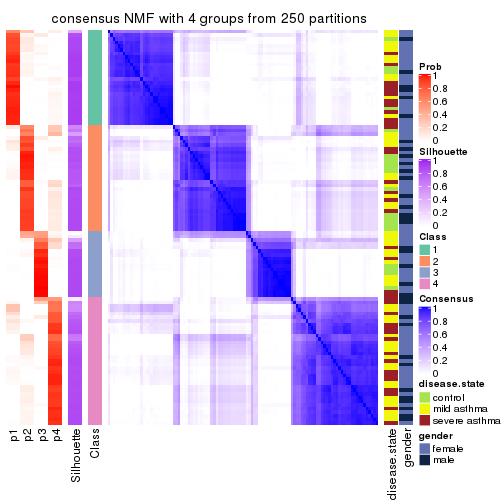</p>

</div>
<div id='tab-MAD-NMF-consensus-heatmap-4'>
<pre><code class="r">consensus_heatmap(res, k = 5)
</code></pre>

<p></p>

</div>
<div id='tab-MAD-NMF-consensus-heatmap-5'>
<pre><code class="r">consensus_heatmap(res, k = 6)
</code></pre>

<p></p>

</div>
</div>

Heatmaps for the membership of samples in all partitions to see how consistent they are:


<script>
$( function() {
	$( '#tabs-MAD-NMF-membership-heatmap' ).tabs();
} );
</script>
<div id='tabs-MAD-NMF-membership-heatmap'>
<ul>
<li><a href='#tab-MAD-NMF-membership-heatmap-1'>k = 2</a></li>
<li><a href='#tab-MAD-NMF-membership-heatmap-2'>k = 3</a></li>
<li><a href='#tab-MAD-NMF-membership-heatmap-3'>k = 4</a></li>
<li><a href='#tab-MAD-NMF-membership-heatmap-4'>k = 5</a></li>
<li><a href='#tab-MAD-NMF-membership-heatmap-5'>k = 6</a></li>
</ul>
<div id='tab-MAD-NMF-membership-heatmap-1'>
<pre><code class="r">membership_heatmap(res, k = 2)
</code></pre>

<p></p>

</div>
<div id='tab-MAD-NMF-membership-heatmap-2'>
<pre><code class="r">membership_heatmap(res, k = 3)
</code></pre>

<p></p>

</div>
<div id='tab-MAD-NMF-membership-heatmap-3'>
<pre><code class="r">membership_heatmap(res, k = 4)
</code></pre>

<p></p>

</div>
<div id='tab-MAD-NMF-membership-heatmap-4'>
<pre><code class="r">membership_heatmap(res, k = 5)
</code></pre>

<p></p>

</div>
<div id='tab-MAD-NMF-membership-heatmap-5'>
<pre><code class="r">membership_heatmap(res, k = 6)
</code></pre>

<p></p>

</div>
</div>

As soon as we have had the classes for columns, we can look for signatures
which are significantly different between classes which can be candidate marks
for certain classes. Following are the heatmaps for signatures.


Signature heatmaps where rows are scaled:


<script>
$( function() {
	$( '#tabs-MAD-NMF-get-signatures' ).tabs();
} );
</script>
<div id='tabs-MAD-NMF-get-signatures'>
<ul>
<li><a href='#tab-MAD-NMF-get-signatures-1'>k = 2</a></li>
<li><a href='#tab-MAD-NMF-get-signatures-2'>k = 3</a></li>
<li><a href='#tab-MAD-NMF-get-signatures-3'>k = 4</a></li>
<li><a href='#tab-MAD-NMF-get-signatures-4'>k = 5</a></li>
<li><a href='#tab-MAD-NMF-get-signatures-5'>k = 6</a></li>
</ul>
<div id='tab-MAD-NMF-get-signatures-1'>
<pre><code class="r">get_signatures(res, k = 2)
</code></pre>

<p></p>

</div>
<div id='tab-MAD-NMF-get-signatures-2'>
<pre><code class="r">get_signatures(res, k = 3)
</code></pre>

<p></p>

</div>
<div id='tab-MAD-NMF-get-signatures-3'>
<pre><code class="r">get_signatures(res, k = 4)
</code></pre>

<p></p>

</div>
<div id='tab-MAD-NMF-get-signatures-4'>
<pre><code class="r">get_signatures(res, k = 5)
</code></pre>

<p></p>

</div>
<div id='tab-MAD-NMF-get-signatures-5'>
<pre><code class="r">get_signatures(res, k = 6)
</code></pre>

<p></p>

</div>
</div>


Signature heatmaps where rows are not scaled:


<script>
$( function() {
	$( '#tabs-MAD-NMF-get-signatures-no-scale' ).tabs();
} );
</script>
<div id='tabs-MAD-NMF-get-signatures-no-scale'>
<ul>
<li><a href='#tab-MAD-NMF-get-signatures-no-scale-1'>k = 2</a></li>
<li><a href='#tab-MAD-NMF-get-signatures-no-scale-2'>k = 3</a></li>
<li><a href='#tab-MAD-NMF-get-signatures-no-scale-3'>k = 4</a></li>
<li><a href='#tab-MAD-NMF-get-signatures-no-scale-4'>k = 5</a></li>
<li><a href='#tab-MAD-NMF-get-signatures-no-scale-5'>k = 6</a></li>
</ul>
<div id='tab-MAD-NMF-get-signatures-no-scale-1'>
<pre><code class="r">get_signatures(res, k = 2, scale_rows = FALSE)
</code></pre>

<p></p>

</div>
<div id='tab-MAD-NMF-get-signatures-no-scale-2'>
<pre><code class="r">get_signatures(res, k = 3, scale_rows = FALSE)
</code></pre>

<p></p>

</div>
<div id='tab-MAD-NMF-get-signatures-no-scale-3'>
<pre><code class="r">get_signatures(res, k = 4, scale_rows = FALSE)
</code></pre>

<p></p>

</div>
<div id='tab-MAD-NMF-get-signatures-no-scale-4'>
<pre><code class="r">get_signatures(res, k = 5, scale_rows = FALSE)
</code></pre>

<p></p>

</div>
<div id='tab-MAD-NMF-get-signatures-no-scale-5'>
<pre><code class="r">get_signatures(res, k = 6, scale_rows = FALSE)
</code></pre>

<p></p>

</div>
</div>


Compare the overlap of signatures from different k:

```r
compare_signatures(res)
```

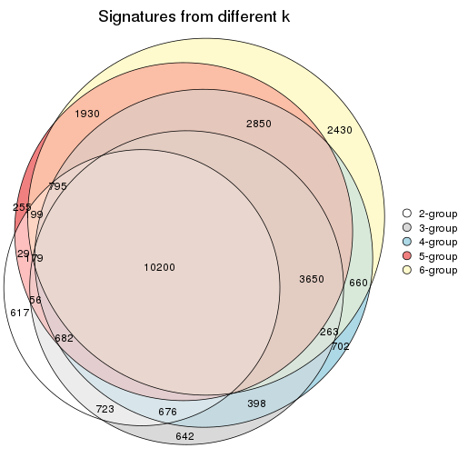

`get_signature()` returns a data frame invisibly. TO get the list of signatures, the function
call should be assigned to a variable explicitly. In following code, if `plot` argument is set
to `FALSE`, no heatmap is plotted while only the differential analysis is performed.

```r
# code only for demonstration
tb = get_signature(res, k = ..., plot = FALSE)
```

An example of the output of `tb` is:

```
#>   which_row         fdr    mean_1    mean_2 scaled_mean_1 scaled_mean_2 km
#> 1        38 0.042760348  8.373488  9.131774    -0.5533452     0.5164555  1
#> 2        40 0.018707592  7.106213  8.469186    -0.6173731     0.5762149  1
#> 3        55 0.019134737 10.221463 11.207825    -0.6159697     0.5749050  1
#> 4        59 0.006059896  5.921854  7.869574    -0.6899429     0.6439467  1
#> 5        60 0.018055526  8.928898 10.211722    -0.6204761     0.5791110  1
#> 6        98 0.009384629 15.714769 14.887706     0.6635654    -0.6193277  2
...
```

The columns in `tb` are:

1. `which_row`: row indices corresponding to the input matrix.
2. `fdr`: FDR for the differential test. 
3. `mean_x`: The mean value in group x.
4. `scaled_mean_x`: The mean value in group x after rows are scaled.
5. `km`: Row groups if k-means clustering is applied to rows.


UMAP plot which shows how samples are separated.


<script>
$( function() {
	$( '#tabs-MAD-NMF-dimension-reduction' ).tabs();
} );
</script>
<div id='tabs-MAD-NMF-dimension-reduction'>
<ul>
<li><a href='#tab-MAD-NMF-dimension-reduction-1'>k = 2</a></li>
<li><a href='#tab-MAD-NMF-dimension-reduction-2'>k = 3</a></li>
<li><a href='#tab-MAD-NMF-dimension-reduction-3'>k = 4</a></li>
<li><a href='#tab-MAD-NMF-dimension-reduction-4'>k = 5</a></li>
<li><a href='#tab-MAD-NMF-dimension-reduction-5'>k = 6</a></li>
</ul>
<div id='tab-MAD-NMF-dimension-reduction-1'>
<pre><code class="r">dimension_reduction(res, k = 2, method = &quot;UMAP&quot;)
</code></pre>

<p></p>

</div>
<div id='tab-MAD-NMF-dimension-reduction-2'>
<pre><code class="r">dimension_reduction(res, k = 3, method = &quot;UMAP&quot;)
</code></pre>

<p></p>

</div>
<div id='tab-MAD-NMF-dimension-reduction-3'>
<pre><code class="r">dimension_reduction(res, k = 4, method = &quot;UMAP&quot;)
</code></pre>

<p></p>

</div>
<div id='tab-MAD-NMF-dimension-reduction-4'>
<pre><code class="r">dimension_reduction(res, k = 5, method = &quot;UMAP&quot;)
</code></pre>

<p></p>

</div>
<div id='tab-MAD-NMF-dimension-reduction-5'>
<pre><code class="r">dimension_reduction(res, k = 6, method = &quot;UMAP&quot;)
</code></pre>

<p></p>

</div>
</div>


Following heatmap shows how subgroups are split when increasing `k`:

```r
collect_classes(res)
```


Test correlation between subgroups and known annotations. If the known
annotation is numeric, one-way ANOVA test is applied, and if the known
annotation is discrete, chi-squared contingency table test is applied.

```r
test_to_known_factors(res)
```

```
#>           n disease.state(p) gender(p) k
#> MAD:NMF 102          0.48106     0.753 2
#> MAD:NMF  95          0.94174     0.290 3
#> MAD:NMF 102          0.00357     0.701 4
#> MAD:NMF  88          0.01708     0.483 5
#> MAD:NMF  88          0.00356     0.531 6
```


If matrix rows can be associated to genes, consider to use `GO_Enrichment(res,
...)` to perform function enrichment for the signature genes.


 

---------------------------------------------------


### ATC:hclust


The object with results only for a single top-value method and a single partition method 
can be extracted as:

```r
res = res_list["ATC", "hclust"]
# you can also extract it by
# res = res_list["ATC:hclust"]
```

A summary of `res` and all the functions that can be applied to it:

```r
res
```

```
#> A 'ConsensusPartition' object with k = 2, 3, 4, 5, 6.
#>   On a matrix with 38950 rows and 108 columns.
#>   Top rows (1000, 2000, 3000, 4000, 5000) are extracted by 'ATC' method.
#>   Subgroups are detected by 'hclust' method.
#>   Performed in total 1250 partitions by row resampling.
#>   Best k for subgroups seems to be 4.
#> 
#> Following methods can be applied to this 'ConsensusPartition' object:
#>  [1] "cola_report"             "collect_classes"         "collect_plots"          
#>  [4] "collect_stats"           "colnames"                "compare_signatures"     
#>  [7] "consensus_heatmap"       "dimension_reduction"     "functional_enrichment"  
#> [10] "get_anno_col"            "get_anno"                "get_classes"            
#> [13] "get_consensus"           "get_matrix"              "get_membership"         
#> [16] "get_param"               "get_signatures"          "get_stats"              
#> [19] "is_best_k"               "is_stable_k"             "membership_heatmap"     
#> [22] "ncol"                    "nrow"                    "plot_ecdf"              
#> [25] "rownames"                "select_partition_number" "show"                   
#> [28] "suggest_best_k"          "test_to_known_factors"
```

`collect_plots()` function collects all the plots made from `res` for all `k` (number of partitions)
into one single page to provide an easy and fast comparison between different `k`.

```r
collect_plots(res)
```


The plots are:

- The first row: a plot of the ECDF (Empirical cumulative distribution
  function) curves of the consensus matrix for each `k` and the heatmap of
  predicted classes for each `k`.
- The second row: heatmaps of the consensus matrix for each `k`.
- The third row: heatmaps of the membership matrix for each `k`.
- The fouth row: heatmaps of the signatures for each `k`.

All the plots in panels can be made by individual functions and they are
plotted later in this section.

`select_partition_number()` produces several plots showing different
statistics for choosing "optimized" `k`. There are following statistics:

- ECDF curves of the consensus matrix for each `k`;
- 1-PAC. [The PAC
  score](https://en.wikipedia.org/wiki/Consensus_clustering#Over-interpretation_potential_of_consensus_clustering)
  measures the proportion of the ambiguous subgrouping.
- Mean silhouette score.
- Concordance. The mean probability of fiting the consensus class ids in all
  partitions.
- Area increased. Denote $A_k$ as the area under the ECDF curve for current
  `k`, the area increased is defined as $A_k - A_{k-1}$.
- Rand index. The percent of pairs of samples that are both in a same cluster
  or both are not in a same cluster in the partition of k and k-1.
- Jaccard index. The ratio of pairs of samples are both in a same cluster in
  the partition of k and k-1 and the pairs of samples are both in a same
  cluster in the partition k or k-1.

The detailed explanations of these statistics can be found in [the cola
vignette](http://bioconductor.org/packages/devel/bioc/vignettes/cola/inst/doc/cola.html#toc_13).

Generally speaking, lower PAC score, higher mean silhouette score or higher
concordance corresponds to better partition. Rand index and Jaccard index
measure how similar the current partition is compared to partition with `k-1`.
If they are too similar, we won't accept `k` is better than `k-1`.

```r
select_partition_number(res)
```


The numeric values for all these statistics can be obtained by `get_stats()`.

```r
get_stats(res)
```

```
#>   k 1-PAC mean_silhouette concordance area_increased  Rand Jaccard
#> 2 2 0.600           0.776       0.907         0.4225 0.587   0.587
#> 3 3 0.539           0.581       0.811         0.4685 0.729   0.554
#> 4 4 0.585           0.587       0.804         0.0926 0.909   0.769
#> 5 5 0.575           0.537       0.758         0.0642 0.923   0.783
#> 6 6 0.610           0.599       0.732         0.0457 0.870   0.598
```

`suggest_best_k()` suggests the best $k$ based on these statistics. The rules are as follows:

- All $k$ with Jaccard index larger than 0.95 are removed because the increase of
  the partition number does not provides enough extra information. If all $k$ are removed,
  the best $k$ is assigned by `NA`.
- For $k$ with 1-PAC larger than 0.9, the maximal $k$ is taken as the "best k". Other $k$ is called "optional k".
- If it does not fit the second rule. The $k$ with the highest vote of highest
  1-PAC, mean silhouette and concordance is taken as the "best k".

```r
suggest_best_k(res)
```

```
#> [1] 4
```


Following shows the table of the partitions (You need to click the **show/hide
code output** link to see it). The membership matrix (columns with name `p*`)
is inferred by
[`clue::cl_consensus()`](https://www.rdocumentation.org/link/cl_consensus?package=clue)
function with the `SE` method. Basically the value in the membership matrix
represents the probability to belong to a certain group. The finall class
label for an item is determined with the group with highest probability it
belongs to.

In `get_classes()` function, the entropy is calculated from the membership
matrix and the silhouette score is calculated from the consensus matrix.


<script>
$( function() {
	$( '#tabs-ATC-hclust-get-classes' ).tabs();
} );
</script>
<div id='tabs-ATC-hclust-get-classes'>
<ul>
<li><a href='#tab-ATC-hclust-get-classes-1'>k = 2</a></li>
<li><a href='#tab-ATC-hclust-get-classes-2'>k = 3</a></li>
<li><a href='#tab-ATC-hclust-get-classes-3'>k = 4</a></li>
<li><a href='#tab-ATC-hclust-get-classes-4'>k = 5</a></li>
<li><a href='#tab-ATC-hclust-get-classes-5'>k = 6</a></li>
</ul>

<div id='tab-ATC-hclust-get-classes-1'>
<p><a id='tab-ATC-hclust-get-classes-1-a' style='color:#0366d6' href='#'>show/hide code output</a></p>
<pre><code class="r">cbind(get_classes(res, k = 2), get_membership(res, k = 2))
</code></pre>

<pre><code>#&gt;            class entropy silhouette    p1    p2
#&gt; GSM1068478     2  0.6148     0.7717 0.152 0.848
#&gt; GSM1068479     2  0.9323     0.4590 0.348 0.652
#&gt; GSM1068481     2  0.2603     0.8706 0.044 0.956
#&gt; GSM1068482     1  0.6712     0.7589 0.824 0.176
#&gt; GSM1068483     1  0.0376     0.8667 0.996 0.004
#&gt; GSM1068486     2  0.0672     0.8974 0.008 0.992
#&gt; GSM1068487     2  0.0000     0.8993 0.000 1.000
#&gt; GSM1068488     2  0.0376     0.8984 0.004 0.996
#&gt; GSM1068490     2  0.0000     0.8993 0.000 1.000
#&gt; GSM1068491     1  0.9635     0.3671 0.612 0.388
#&gt; GSM1068492     2  0.0000     0.8993 0.000 1.000
#&gt; GSM1068493     2  0.0672     0.8974 0.008 0.992
#&gt; GSM1068494     2  0.7883     0.6683 0.236 0.764
#&gt; GSM1068495     2  0.9552     0.4025 0.376 0.624
#&gt; GSM1068496     2  0.2603     0.8706 0.044 0.956
#&gt; GSM1068498     1  0.0672     0.8693 0.992 0.008
#&gt; GSM1068499     1  0.0938     0.8697 0.988 0.012
#&gt; GSM1068500     1  0.9922     0.2599 0.552 0.448
#&gt; GSM1068502     2  0.0000     0.8993 0.000 1.000
#&gt; GSM1068503     2  0.0000     0.8993 0.000 1.000
#&gt; GSM1068505     2  0.0376     0.8984 0.004 0.996
#&gt; GSM1068506     2  0.0000     0.8993 0.000 1.000
#&gt; GSM1068507     2  0.0672     0.8969 0.008 0.992
#&gt; GSM1068508     2  0.9393     0.4406 0.356 0.644
#&gt; GSM1068510     2  0.0376     0.8984 0.004 0.996
#&gt; GSM1068512     2  0.0000     0.8993 0.000 1.000
#&gt; GSM1068513     2  0.0376     0.8984 0.004 0.996
#&gt; GSM1068514     2  0.0000     0.8993 0.000 1.000
#&gt; GSM1068517     2  0.9977     0.1149 0.472 0.528
#&gt; GSM1068518     2  0.9988     0.0836 0.480 0.520
#&gt; GSM1068520     1  0.6801     0.7613 0.820 0.180
#&gt; GSM1068521     1  0.0672     0.8693 0.992 0.008
#&gt; GSM1068522     2  0.0000     0.8993 0.000 1.000
#&gt; GSM1068524     2  0.0376     0.8984 0.004 0.996
#&gt; GSM1068527     2  0.0672     0.8969 0.008 0.992
#&gt; GSM1068480     2  0.7883     0.6683 0.236 0.764
#&gt; GSM1068484     2  0.0000     0.8993 0.000 1.000
#&gt; GSM1068485     1  0.0938     0.8697 0.988 0.012
#&gt; GSM1068489     2  0.0376     0.8984 0.004 0.996
#&gt; GSM1068497     2  0.8144     0.6441 0.252 0.748
#&gt; GSM1068501     2  0.0000     0.8993 0.000 1.000
#&gt; GSM1068504     2  0.0000     0.8993 0.000 1.000
#&gt; GSM1068509     1  0.0376     0.8667 0.996 0.004
#&gt; GSM1068511     2  0.0000     0.8993 0.000 1.000
#&gt; GSM1068515     1  0.0672     0.8693 0.992 0.008
#&gt; GSM1068516     2  0.9552     0.4025 0.376 0.624
#&gt; GSM1068519     1  0.0376     0.8667 0.996 0.004
#&gt; GSM1068523     2  0.0376     0.8984 0.004 0.996
#&gt; GSM1068525     2  0.0376     0.8984 0.004 0.996
#&gt; GSM1068526     2  0.0000     0.8993 0.000 1.000
#&gt; GSM1068458     1  0.0672     0.8693 0.992 0.008
#&gt; GSM1068459     2  0.0672     0.8940 0.008 0.992
#&gt; GSM1068460     2  0.9954     0.1463 0.460 0.540
#&gt; GSM1068461     1  0.0672     0.8693 0.992 0.008
#&gt; GSM1068464     2  0.0000     0.8993 0.000 1.000
#&gt; GSM1068468     1  0.3879     0.8484 0.924 0.076
#&gt; GSM1068472     1  0.3274     0.8560 0.940 0.060
#&gt; GSM1068473     2  0.0000     0.8993 0.000 1.000
#&gt; GSM1068474     2  0.0000     0.8993 0.000 1.000
#&gt; GSM1068476     2  0.7815     0.6672 0.232 0.768
#&gt; GSM1068477     2  0.9866     0.2389 0.432 0.568
#&gt; GSM1068462     2  0.9944     0.1611 0.456 0.544
#&gt; GSM1068463     1  0.9866     0.2643 0.568 0.432
#&gt; GSM1068465     1  0.4022     0.8470 0.920 0.080
#&gt; GSM1068466     1  0.6801     0.7613 0.820 0.180
#&gt; GSM1068467     1  1.0000    -0.0309 0.500 0.500
#&gt; GSM1068469     1  0.2043     0.8651 0.968 0.032
#&gt; GSM1068470     2  0.0000     0.8993 0.000 1.000
#&gt; GSM1068471     2  0.0000     0.8993 0.000 1.000
#&gt; GSM1068475     2  0.0000     0.8993 0.000 1.000
#&gt; GSM1068528     1  0.0938     0.8697 0.988 0.012
#&gt; GSM1068531     2  0.5737     0.7753 0.136 0.864
#&gt; GSM1068532     1  0.0376     0.8667 0.996 0.004
#&gt; GSM1068533     1  0.8081     0.6789 0.752 0.248
#&gt; GSM1068535     2  0.0000     0.8993 0.000 1.000
#&gt; GSM1068537     1  0.5629     0.8076 0.868 0.132
#&gt; GSM1068538     1  0.0376     0.8667 0.996 0.004
#&gt; GSM1068539     2  0.9552     0.4025 0.376 0.624
#&gt; GSM1068540     1  0.9922     0.2599 0.552 0.448
#&gt; GSM1068542     2  0.0000     0.8993 0.000 1.000
#&gt; GSM1068543     2  0.0376     0.8984 0.004 0.996
#&gt; GSM1068544     1  0.0938     0.8697 0.988 0.012
#&gt; GSM1068545     2  0.0000     0.8993 0.000 1.000
#&gt; GSM1068546     2  0.0672     0.8974 0.008 0.992
#&gt; GSM1068547     1  0.0376     0.8680 0.996 0.004
#&gt; GSM1068548     2  0.0000     0.8993 0.000 1.000
#&gt; GSM1068549     2  0.0672     0.8974 0.008 0.992
#&gt; GSM1068550     2  0.0000     0.8993 0.000 1.000
#&gt; GSM1068551     2  0.0000     0.8993 0.000 1.000
#&gt; GSM1068552     2  0.0000     0.8993 0.000 1.000
#&gt; GSM1068555     2  0.0376     0.8984 0.004 0.996
#&gt; GSM1068556     2  0.0000     0.8993 0.000 1.000
#&gt; GSM1068557     2  0.8443     0.6049 0.272 0.728
#&gt; GSM1068560     2  0.0376     0.8984 0.004 0.996
#&gt; GSM1068561     2  0.0376     0.8984 0.004 0.996
#&gt; GSM1068562     2  0.0376     0.8984 0.004 0.996
#&gt; GSM1068563     2  0.0000     0.8993 0.000 1.000
#&gt; GSM1068565     2  0.0000     0.8993 0.000 1.000
#&gt; GSM1068529     2  0.0376     0.8984 0.004 0.996
#&gt; GSM1068530     1  0.0376     0.8667 0.996 0.004
#&gt; GSM1068534     2  0.0376     0.8984 0.004 0.996
#&gt; GSM1068536     2  0.8144     0.6441 0.252 0.748
#&gt; GSM1068541     1  0.3274     0.8560 0.940 0.060
#&gt; GSM1068553     2  0.0000     0.8993 0.000 1.000
#&gt; GSM1068554     2  0.0000     0.8993 0.000 1.000
#&gt; GSM1068558     2  0.0376     0.8984 0.004 0.996
#&gt; GSM1068559     2  0.9686     0.3453 0.396 0.604
#&gt; GSM1068564     2  0.0000     0.8993 0.000 1.000
</code></pre>

<script>
$('#tab-ATC-hclust-get-classes-1-a').parent().next().next().hide();
$('#tab-ATC-hclust-get-classes-1-a').click(function(){
  $('#tab-ATC-hclust-get-classes-1-a').parent().next().next().toggle();
  return(false);
});
</script>
</div>

<div id='tab-ATC-hclust-get-classes-2'>
<p><a id='tab-ATC-hclust-get-classes-2-a' style='color:#0366d6' href='#'>show/hide code output</a></p>
<pre><code class="r">cbind(get_classes(res, k = 3), get_membership(res, k = 3))
</code></pre>

<pre><code>#&gt;            class entropy silhouette    p1    p2    p3
#&gt; GSM1068478     3  0.5435     0.5951 0.144 0.048 0.808
#&gt; GSM1068479     2  0.9241    -0.0445 0.352 0.484 0.164
#&gt; GSM1068481     3  0.3856     0.6085 0.040 0.072 0.888
#&gt; GSM1068482     1  0.4178     0.6747 0.828 0.000 0.172
#&gt; GSM1068483     1  0.0475     0.7886 0.992 0.004 0.004
#&gt; GSM1068486     3  0.5138     0.5125 0.000 0.252 0.748
#&gt; GSM1068487     2  0.0000     0.8076 0.000 1.000 0.000
#&gt; GSM1068488     2  0.6154     0.3591 0.000 0.592 0.408
#&gt; GSM1068490     2  0.0000     0.8076 0.000 1.000 0.000
#&gt; GSM1068491     1  0.8233     0.4094 0.616 0.264 0.120
#&gt; GSM1068492     2  0.0000     0.8076 0.000 1.000 0.000
#&gt; GSM1068493     3  0.5138     0.5125 0.000 0.252 0.748
#&gt; GSM1068494     3  0.6806     0.5722 0.228 0.060 0.712
#&gt; GSM1068495     3  0.7756     0.3563 0.380 0.056 0.564
#&gt; GSM1068496     3  0.3856     0.6085 0.040 0.072 0.888
#&gt; GSM1068498     1  0.0237     0.7888 0.996 0.000 0.004
#&gt; GSM1068499     1  0.0424     0.7888 0.992 0.000 0.008
#&gt; GSM1068500     1  0.8131     0.3464 0.548 0.076 0.376
#&gt; GSM1068502     2  0.0000     0.8076 0.000 1.000 0.000
#&gt; GSM1068503     2  0.0000     0.8076 0.000 1.000 0.000
#&gt; GSM1068505     2  0.2711     0.7725 0.000 0.912 0.088
#&gt; GSM1068506     2  0.0000     0.8076 0.000 1.000 0.000
#&gt; GSM1068507     2  0.2301     0.7831 0.004 0.936 0.060
#&gt; GSM1068508     2  0.9338    -0.0723 0.360 0.468 0.172
#&gt; GSM1068510     2  0.6154     0.3591 0.000 0.592 0.408
#&gt; GSM1068512     2  0.0000     0.8076 0.000 1.000 0.000
#&gt; GSM1068513     2  0.2711     0.7725 0.000 0.912 0.088
#&gt; GSM1068514     2  0.0000     0.8076 0.000 1.000 0.000
#&gt; GSM1068517     3  0.6950     0.1284 0.476 0.016 0.508
#&gt; GSM1068518     3  0.7295     0.1015 0.484 0.028 0.488
#&gt; GSM1068520     1  0.5375     0.6955 0.816 0.056 0.128
#&gt; GSM1068521     1  0.0237     0.7888 0.996 0.000 0.004
#&gt; GSM1068522     2  0.0000     0.8076 0.000 1.000 0.000
#&gt; GSM1068524     2  0.6154     0.3591 0.000 0.592 0.408
#&gt; GSM1068527     2  0.2301     0.7831 0.004 0.936 0.060
#&gt; GSM1068480     3  0.6806     0.5722 0.228 0.060 0.712
#&gt; GSM1068484     2  0.0000     0.8076 0.000 1.000 0.000
#&gt; GSM1068485     1  0.0424     0.7888 0.992 0.000 0.008
#&gt; GSM1068489     2  0.2711     0.7725 0.000 0.912 0.088
#&gt; GSM1068497     3  0.6965     0.5601 0.244 0.060 0.696
#&gt; GSM1068501     2  0.0000     0.8076 0.000 1.000 0.000
#&gt; GSM1068504     2  0.2959     0.7597 0.000 0.900 0.100
#&gt; GSM1068509     1  0.0475     0.7886 0.992 0.004 0.004
#&gt; GSM1068511     2  0.2356     0.7763 0.000 0.928 0.072
#&gt; GSM1068515     1  0.0237     0.7888 0.996 0.000 0.004
#&gt; GSM1068516     3  0.7756     0.3563 0.380 0.056 0.564
#&gt; GSM1068519     1  0.0475     0.7886 0.992 0.004 0.004
#&gt; GSM1068523     2  0.6168     0.3571 0.000 0.588 0.412
#&gt; GSM1068525     2  0.6154     0.3591 0.000 0.592 0.408
#&gt; GSM1068526     2  0.1529     0.7957 0.000 0.960 0.040
#&gt; GSM1068458     1  0.0237     0.7888 0.996 0.000 0.004
#&gt; GSM1068459     3  0.2772     0.6101 0.004 0.080 0.916
#&gt; GSM1068460     1  0.9489     0.1524 0.464 0.340 0.196
#&gt; GSM1068461     1  0.0237     0.7888 0.996 0.000 0.004
#&gt; GSM1068464     2  0.0000     0.8076 0.000 1.000 0.000
#&gt; GSM1068468     1  0.2982     0.7664 0.920 0.056 0.024
#&gt; GSM1068472     1  0.2492     0.7729 0.936 0.048 0.016
#&gt; GSM1068473     2  0.0000     0.8076 0.000 1.000 0.000
#&gt; GSM1068474     2  0.0000     0.8076 0.000 1.000 0.000
#&gt; GSM1068476     2  0.9543     0.0119 0.236 0.484 0.280
#&gt; GSM1068477     1  0.9550     0.0942 0.436 0.368 0.196
#&gt; GSM1068462     1  0.9500     0.1453 0.460 0.344 0.196
#&gt; GSM1068463     1  0.7610     0.0840 0.564 0.048 0.388
#&gt; GSM1068465     1  0.3045     0.7644 0.916 0.064 0.020
#&gt; GSM1068466     1  0.5375     0.6955 0.816 0.056 0.128
#&gt; GSM1068467     1  0.9245     0.2222 0.504 0.320 0.176
#&gt; GSM1068469     1  0.1620     0.7845 0.964 0.024 0.012
#&gt; GSM1068470     2  0.2959     0.7597 0.000 0.900 0.100
#&gt; GSM1068471     2  0.0000     0.8076 0.000 1.000 0.000
#&gt; GSM1068475     2  0.0000     0.8076 0.000 1.000 0.000
#&gt; GSM1068528     1  0.0424     0.7888 0.992 0.000 0.008
#&gt; GSM1068531     3  0.5981     0.5138 0.132 0.080 0.788
#&gt; GSM1068532     1  0.0475     0.7886 0.992 0.004 0.004
#&gt; GSM1068533     1  0.6438     0.6277 0.748 0.064 0.188
#&gt; GSM1068535     3  0.6244     0.1781 0.000 0.440 0.560
#&gt; GSM1068537     1  0.4469     0.7234 0.864 0.060 0.076
#&gt; GSM1068538     1  0.0475     0.7886 0.992 0.004 0.004
#&gt; GSM1068539     3  0.7756     0.3563 0.380 0.056 0.564
#&gt; GSM1068540     1  0.8131     0.3464 0.548 0.076 0.376
#&gt; GSM1068542     2  0.0000     0.8076 0.000 1.000 0.000
#&gt; GSM1068543     2  0.6154     0.3591 0.000 0.592 0.408
#&gt; GSM1068544     1  0.0424     0.7888 0.992 0.000 0.008
#&gt; GSM1068545     2  0.0000     0.8076 0.000 1.000 0.000
#&gt; GSM1068546     3  0.2537     0.6128 0.000 0.080 0.920
#&gt; GSM1068547     1  0.0000     0.7888 1.000 0.000 0.000
#&gt; GSM1068548     2  0.0000     0.8076 0.000 1.000 0.000
#&gt; GSM1068549     3  0.2537     0.6128 0.000 0.080 0.920
#&gt; GSM1068550     2  0.0424     0.8050 0.000 0.992 0.008
#&gt; GSM1068551     2  0.2878     0.7621 0.000 0.904 0.096
#&gt; GSM1068552     2  0.0000     0.8076 0.000 1.000 0.000
#&gt; GSM1068555     2  0.6168     0.3571 0.000 0.588 0.412
#&gt; GSM1068556     2  0.2356     0.7763 0.000 0.928 0.072
#&gt; GSM1068557     2  0.9792    -0.1113 0.276 0.436 0.288
#&gt; GSM1068560     2  0.6168     0.3571 0.000 0.588 0.412
#&gt; GSM1068561     3  0.6244     0.0593 0.000 0.440 0.560
#&gt; GSM1068562     2  0.6168     0.3571 0.000 0.588 0.412
#&gt; GSM1068563     2  0.0000     0.8076 0.000 1.000 0.000
#&gt; GSM1068565     2  0.3192     0.7536 0.000 0.888 0.112
#&gt; GSM1068529     3  0.6308    -0.0425 0.000 0.492 0.508
#&gt; GSM1068530     1  0.0475     0.7886 0.992 0.004 0.004
#&gt; GSM1068534     3  0.6308    -0.0425 0.000 0.492 0.508
#&gt; GSM1068536     3  0.6965     0.5601 0.244 0.060 0.696
#&gt; GSM1068541     1  0.2492     0.7729 0.936 0.048 0.016
#&gt; GSM1068553     3  0.6244     0.1781 0.000 0.440 0.560
#&gt; GSM1068554     2  0.0000     0.8076 0.000 1.000 0.000
#&gt; GSM1068558     2  0.6154     0.3591 0.000 0.592 0.408
#&gt; GSM1068559     1  0.9786    -0.0126 0.400 0.364 0.236
#&gt; GSM1068564     2  0.0000     0.8076 0.000 1.000 0.000
</code></pre>

<script>
$('#tab-ATC-hclust-get-classes-2-a').parent().next().next().hide();
$('#tab-ATC-hclust-get-classes-2-a').click(function(){
  $('#tab-ATC-hclust-get-classes-2-a').parent().next().next().toggle();
  return(false);
});
</script>
</div>

<div id='tab-ATC-hclust-get-classes-3'>
<p><a id='tab-ATC-hclust-get-classes-3-a' style='color:#0366d6' href='#'>show/hide code output</a></p>
<pre><code class="r">cbind(get_classes(res, k = 4), get_membership(res, k = 4))
</code></pre>

<pre><code>#&gt;            class entropy silhouette    p1    p2    p3    p4
#&gt; GSM1068478     2  0.5667     0.4109 0.060 0.696 0.240 0.004
#&gt; GSM1068479     4  0.7598    -0.1640 0.240 0.284 0.000 0.476
#&gt; GSM1068481     3  0.2224     0.7251 0.032 0.040 0.928 0.000
#&gt; GSM1068482     1  0.4220     0.6856 0.748 0.248 0.004 0.000
#&gt; GSM1068483     1  0.0804     0.8090 0.980 0.012 0.008 0.000
#&gt; GSM1068486     2  0.6360     0.3623 0.000 0.656 0.164 0.180
#&gt; GSM1068487     4  0.0000     0.7778 0.000 0.000 0.000 1.000
#&gt; GSM1068488     4  0.4985     0.3222 0.000 0.468 0.000 0.532
#&gt; GSM1068490     4  0.0000     0.7778 0.000 0.000 0.000 1.000
#&gt; GSM1068491     1  0.7084     0.2444 0.560 0.176 0.000 0.264
#&gt; GSM1068492     4  0.0000     0.7778 0.000 0.000 0.000 1.000
#&gt; GSM1068493     2  0.6360     0.3623 0.000 0.656 0.164 0.180
#&gt; GSM1068494     2  0.1388     0.5596 0.012 0.960 0.028 0.000
#&gt; GSM1068495     2  0.2921     0.5883 0.140 0.860 0.000 0.000
#&gt; GSM1068496     3  0.2224     0.7251 0.032 0.040 0.928 0.000
#&gt; GSM1068498     1  0.2973     0.7864 0.856 0.144 0.000 0.000
#&gt; GSM1068499     1  0.2149     0.8136 0.912 0.088 0.000 0.000
#&gt; GSM1068500     1  0.7607     0.3518 0.464 0.180 0.352 0.004
#&gt; GSM1068502     4  0.0000     0.7778 0.000 0.000 0.000 1.000
#&gt; GSM1068503     4  0.0000     0.7778 0.000 0.000 0.000 1.000
#&gt; GSM1068505     4  0.2473     0.7467 0.000 0.080 0.012 0.908
#&gt; GSM1068506     4  0.0000     0.7778 0.000 0.000 0.000 1.000
#&gt; GSM1068507     4  0.2021     0.7562 0.000 0.056 0.012 0.932
#&gt; GSM1068508     4  0.7659    -0.1991 0.244 0.296 0.000 0.460
#&gt; GSM1068510     4  0.4985     0.3222 0.000 0.468 0.000 0.532
#&gt; GSM1068512     4  0.0000     0.7778 0.000 0.000 0.000 1.000
#&gt; GSM1068513     4  0.2473     0.7467 0.000 0.080 0.012 0.908
#&gt; GSM1068514     4  0.0000     0.7778 0.000 0.000 0.000 1.000
#&gt; GSM1068517     2  0.3942     0.4981 0.236 0.764 0.000 0.000
#&gt; GSM1068518     2  0.4485     0.4873 0.248 0.740 0.000 0.012
#&gt; GSM1068520     1  0.4948     0.7354 0.776 0.124 0.100 0.000
#&gt; GSM1068521     1  0.1022     0.8177 0.968 0.032 0.000 0.000
#&gt; GSM1068522     4  0.0000     0.7778 0.000 0.000 0.000 1.000
#&gt; GSM1068524     4  0.4985     0.3222 0.000 0.468 0.000 0.532
#&gt; GSM1068527     4  0.2021     0.7562 0.000 0.056 0.012 0.932
#&gt; GSM1068480     2  0.1388     0.5596 0.012 0.960 0.028 0.000
#&gt; GSM1068484     4  0.0000     0.7778 0.000 0.000 0.000 1.000
#&gt; GSM1068485     1  0.2149     0.8136 0.912 0.088 0.000 0.000
#&gt; GSM1068489     4  0.2473     0.7467 0.000 0.080 0.012 0.908
#&gt; GSM1068497     2  0.0937     0.5665 0.012 0.976 0.012 0.000
#&gt; GSM1068501     4  0.0000     0.7778 0.000 0.000 0.000 1.000
#&gt; GSM1068504     4  0.2704     0.7187 0.000 0.124 0.000 0.876
#&gt; GSM1068509     1  0.0804     0.8090 0.980 0.012 0.008 0.000
#&gt; GSM1068511     4  0.2345     0.7265 0.000 0.000 0.100 0.900
#&gt; GSM1068515     1  0.1716     0.8153 0.936 0.064 0.000 0.000
#&gt; GSM1068516     2  0.2921     0.5883 0.140 0.860 0.000 0.000
#&gt; GSM1068519     1  0.0804     0.8155 0.980 0.012 0.008 0.000
#&gt; GSM1068523     4  0.4989     0.3140 0.000 0.472 0.000 0.528
#&gt; GSM1068525     4  0.4985     0.3222 0.000 0.468 0.000 0.532
#&gt; GSM1068526     4  0.1302     0.7653 0.000 0.044 0.000 0.956
#&gt; GSM1068458     1  0.1637     0.8162 0.940 0.060 0.000 0.000
#&gt; GSM1068459     3  0.0188     0.7272 0.004 0.000 0.996 0.000
#&gt; GSM1068460     2  0.7918     0.2163 0.316 0.352 0.000 0.332
#&gt; GSM1068461     1  0.2973     0.7864 0.856 0.144 0.000 0.000
#&gt; GSM1068464     4  0.0000     0.7778 0.000 0.000 0.000 1.000
#&gt; GSM1068468     1  0.3493     0.7899 0.876 0.064 0.008 0.052
#&gt; GSM1068472     1  0.3170     0.7987 0.892 0.056 0.008 0.044
#&gt; GSM1068473     4  0.0000     0.7778 0.000 0.000 0.000 1.000
#&gt; GSM1068474     4  0.0000     0.7778 0.000 0.000 0.000 1.000
#&gt; GSM1068476     4  0.7184    -0.1292 0.136 0.416 0.000 0.448
#&gt; GSM1068477     4  0.7896    -0.3834 0.292 0.348 0.000 0.360
#&gt; GSM1068462     2  0.7916     0.2222 0.312 0.352 0.000 0.336
#&gt; GSM1068463     1  0.6187     0.2287 0.516 0.052 0.432 0.000
#&gt; GSM1068465     1  0.3508     0.7848 0.872 0.060 0.004 0.064
#&gt; GSM1068466     1  0.4948     0.7354 0.776 0.124 0.100 0.000
#&gt; GSM1068467     1  0.7901    -0.1821 0.372 0.316 0.000 0.312
#&gt; GSM1068469     1  0.2421     0.8136 0.924 0.048 0.008 0.020
#&gt; GSM1068470     4  0.2704     0.7187 0.000 0.124 0.000 0.876
#&gt; GSM1068471     4  0.0000     0.7778 0.000 0.000 0.000 1.000
#&gt; GSM1068475     4  0.0000     0.7778 0.000 0.000 0.000 1.000
#&gt; GSM1068528     1  0.2149     0.8136 0.912 0.088 0.000 0.000
#&gt; GSM1068531     3  0.4153     0.6517 0.132 0.048 0.820 0.000
#&gt; GSM1068532     1  0.0804     0.8090 0.980 0.012 0.008 0.000
#&gt; GSM1068533     1  0.6557     0.6265 0.648 0.196 0.152 0.004
#&gt; GSM1068535     3  0.5112     0.3436 0.000 0.008 0.608 0.384
#&gt; GSM1068537     1  0.3324     0.7421 0.852 0.012 0.136 0.000
#&gt; GSM1068538     1  0.0804     0.8090 0.980 0.012 0.008 0.000
#&gt; GSM1068539     2  0.2921     0.5883 0.140 0.860 0.000 0.000
#&gt; GSM1068540     1  0.7607     0.3518 0.464 0.180 0.352 0.004
#&gt; GSM1068542     4  0.0000     0.7778 0.000 0.000 0.000 1.000
#&gt; GSM1068543     4  0.4985     0.3222 0.000 0.468 0.000 0.532
#&gt; GSM1068544     1  0.2149     0.8136 0.912 0.088 0.000 0.000
#&gt; GSM1068545     4  0.0000     0.7778 0.000 0.000 0.000 1.000
#&gt; GSM1068546     3  0.2530     0.7144 0.000 0.112 0.888 0.000
#&gt; GSM1068547     1  0.1661     0.8197 0.944 0.052 0.004 0.000
#&gt; GSM1068548     4  0.0000     0.7778 0.000 0.000 0.000 1.000
#&gt; GSM1068549     3  0.2589     0.7121 0.000 0.116 0.884 0.000
#&gt; GSM1068550     4  0.0336     0.7758 0.000 0.008 0.000 0.992
#&gt; GSM1068551     4  0.2647     0.7212 0.000 0.120 0.000 0.880
#&gt; GSM1068552     4  0.0000     0.7778 0.000 0.000 0.000 1.000
#&gt; GSM1068555     4  0.4989     0.3140 0.000 0.472 0.000 0.528
#&gt; GSM1068556     4  0.2345     0.7265 0.000 0.000 0.100 0.900
#&gt; GSM1068557     2  0.7399     0.1742 0.164 0.420 0.000 0.416
#&gt; GSM1068560     4  0.4989     0.3140 0.000 0.472 0.000 0.528
#&gt; GSM1068561     2  0.7028     0.0140 0.000 0.496 0.124 0.380
#&gt; GSM1068562     4  0.4989     0.3140 0.000 0.472 0.000 0.528
#&gt; GSM1068563     4  0.0000     0.7778 0.000 0.000 0.000 1.000
#&gt; GSM1068565     4  0.2973     0.7063 0.000 0.144 0.000 0.856
#&gt; GSM1068529     4  0.7706     0.0717 0.000 0.228 0.348 0.424
#&gt; GSM1068530     1  0.0804     0.8090 0.980 0.012 0.008 0.000
#&gt; GSM1068534     4  0.7706     0.0717 0.000 0.228 0.348 0.424
#&gt; GSM1068536     2  0.0937     0.5665 0.012 0.976 0.012 0.000
#&gt; GSM1068541     1  0.3170     0.7987 0.892 0.056 0.008 0.044
#&gt; GSM1068553     3  0.5112     0.3436 0.000 0.008 0.608 0.384
#&gt; GSM1068554     4  0.0000     0.7778 0.000 0.000 0.000 1.000
#&gt; GSM1068558     4  0.4985     0.3222 0.000 0.468 0.000 0.532
#&gt; GSM1068559     2  0.7818     0.3197 0.256 0.388 0.000 0.356
#&gt; GSM1068564     4  0.0000     0.7778 0.000 0.000 0.000 1.000
</code></pre>

<script>
$('#tab-ATC-hclust-get-classes-3-a').parent().next().next().hide();
$('#tab-ATC-hclust-get-classes-3-a').click(function(){
  $('#tab-ATC-hclust-get-classes-3-a').parent().next().next().toggle();
  return(false);
});
</script>
</div>

<div id='tab-ATC-hclust-get-classes-4'>
<p><a id='tab-ATC-hclust-get-classes-4-a' style='color:#0366d6' href='#'>show/hide code output</a></p>
<pre><code class="r">cbind(get_classes(res, k = 5), get_membership(res, k = 5))
</code></pre>

<pre><code>#&gt;            class entropy silhouette    p1    p2    p3    p4    p5
#&gt; GSM1068478     5  0.5365     0.4984 0.020 0.060 0.228 0.004 0.688
#&gt; GSM1068479     4  0.7197    -0.0979 0.024 0.296 0.000 0.432 0.248
#&gt; GSM1068481     3  0.1978     0.6647 0.012 0.024 0.932 0.000 0.032
#&gt; GSM1068482     2  0.5289     0.4802 0.128 0.688 0.004 0.000 0.180
#&gt; GSM1068483     1  0.1544     0.7377 0.932 0.068 0.000 0.000 0.000
#&gt; GSM1068486     5  0.5481     0.4859 0.000 0.016 0.136 0.156 0.692
#&gt; GSM1068487     4  0.0162     0.7672 0.000 0.000 0.000 0.996 0.004
#&gt; GSM1068488     4  0.4656     0.2764 0.000 0.012 0.000 0.508 0.480
#&gt; GSM1068490     4  0.0162     0.7674 0.000 0.004 0.000 0.996 0.000
#&gt; GSM1068491     2  0.8214     0.2203 0.296 0.356 0.000 0.224 0.124
#&gt; GSM1068492     4  0.0324     0.7677 0.000 0.004 0.000 0.992 0.004
#&gt; GSM1068493     5  0.5481     0.4859 0.000 0.016 0.136 0.156 0.692
#&gt; GSM1068494     5  0.0404     0.6815 0.000 0.012 0.000 0.000 0.988
#&gt; GSM1068495     5  0.2930     0.6325 0.004 0.164 0.000 0.000 0.832
#&gt; GSM1068496     3  0.1978     0.6647 0.012 0.024 0.932 0.000 0.032
#&gt; GSM1068498     2  0.3697     0.5265 0.100 0.820 0.000 0.000 0.080
#&gt; GSM1068499     2  0.4132     0.4618 0.260 0.720 0.000 0.000 0.020
#&gt; GSM1068500     1  0.7487     0.3225 0.476 0.064 0.296 0.004 0.160
#&gt; GSM1068502     4  0.1121     0.7583 0.000 0.044 0.000 0.956 0.000
#&gt; GSM1068503     4  0.0162     0.7672 0.000 0.000 0.000 0.996 0.004
#&gt; GSM1068505     4  0.2464     0.7392 0.000 0.004 0.012 0.892 0.092
#&gt; GSM1068506     4  0.0510     0.7655 0.000 0.016 0.000 0.984 0.000
#&gt; GSM1068507     4  0.2208     0.7506 0.000 0.012 0.012 0.916 0.060
#&gt; GSM1068508     4  0.7284    -0.0736 0.032 0.256 0.000 0.444 0.268
#&gt; GSM1068510     4  0.4656     0.2764 0.000 0.012 0.000 0.508 0.480
#&gt; GSM1068512     4  0.0510     0.7655 0.000 0.016 0.000 0.984 0.000
#&gt; GSM1068513     4  0.2464     0.7392 0.000 0.004 0.012 0.892 0.092
#&gt; GSM1068514     4  0.0162     0.7672 0.000 0.000 0.000 0.996 0.004
#&gt; GSM1068517     5  0.4014     0.5249 0.016 0.256 0.000 0.000 0.728
#&gt; GSM1068518     5  0.4206     0.5006 0.020 0.272 0.000 0.000 0.708
#&gt; GSM1068520     1  0.4690     0.6703 0.780 0.080 0.040 0.000 0.100
#&gt; GSM1068521     2  0.3796     0.4106 0.300 0.700 0.000 0.000 0.000
#&gt; GSM1068522     4  0.0510     0.7655 0.000 0.016 0.000 0.984 0.000
#&gt; GSM1068524     4  0.4656     0.2764 0.000 0.012 0.000 0.508 0.480
#&gt; GSM1068527     4  0.2208     0.7506 0.000 0.012 0.012 0.916 0.060
#&gt; GSM1068480     5  0.0404     0.6815 0.000 0.012 0.000 0.000 0.988
#&gt; GSM1068484     4  0.1121     0.7583 0.000 0.044 0.000 0.956 0.000
#&gt; GSM1068485     2  0.4132     0.4618 0.260 0.720 0.000 0.000 0.020
#&gt; GSM1068489     4  0.2464     0.7392 0.000 0.004 0.012 0.892 0.092
#&gt; GSM1068497     5  0.0794     0.6851 0.000 0.028 0.000 0.000 0.972
#&gt; GSM1068501     4  0.0794     0.7637 0.000 0.028 0.000 0.972 0.000
#&gt; GSM1068504     4  0.2471     0.7134 0.000 0.000 0.000 0.864 0.136
#&gt; GSM1068509     1  0.1544     0.7377 0.932 0.068 0.000 0.000 0.000
#&gt; GSM1068511     4  0.2519     0.7185 0.000 0.016 0.100 0.884 0.000
#&gt; GSM1068515     2  0.2929     0.4975 0.180 0.820 0.000 0.000 0.000
#&gt; GSM1068516     5  0.2930     0.6325 0.004 0.164 0.000 0.000 0.832
#&gt; GSM1068519     1  0.2471     0.7033 0.864 0.136 0.000 0.000 0.000
#&gt; GSM1068523     4  0.4449     0.2806 0.000 0.004 0.000 0.512 0.484
#&gt; GSM1068525     4  0.4656     0.2764 0.000 0.012 0.000 0.508 0.480
#&gt; GSM1068526     4  0.1197     0.7604 0.000 0.000 0.000 0.952 0.048
#&gt; GSM1068458     2  0.3143     0.4839 0.204 0.796 0.000 0.000 0.000
#&gt; GSM1068459     3  0.0000     0.6666 0.000 0.000 1.000 0.000 0.000
#&gt; GSM1068460     2  0.7652     0.1233 0.048 0.372 0.000 0.292 0.288
#&gt; GSM1068461     2  0.3697     0.5265 0.100 0.820 0.000 0.000 0.080
#&gt; GSM1068464     4  0.1121     0.7583 0.000 0.044 0.000 0.956 0.000
#&gt; GSM1068468     1  0.4713     0.6694 0.724 0.224 0.000 0.028 0.024
#&gt; GSM1068472     1  0.4263     0.6910 0.760 0.200 0.000 0.024 0.016
#&gt; GSM1068473     4  0.0794     0.7637 0.000 0.028 0.000 0.972 0.000
#&gt; GSM1068474     4  0.1121     0.7583 0.000 0.044 0.000 0.956 0.000
#&gt; GSM1068476     4  0.6661    -0.0360 0.012 0.156 0.000 0.432 0.400
#&gt; GSM1068477     2  0.7525     0.0818 0.036 0.356 0.000 0.312 0.296
#&gt; GSM1068462     2  0.7658     0.1196 0.048 0.368 0.000 0.296 0.288
#&gt; GSM1068463     3  0.6902    -0.0783 0.372 0.172 0.436 0.000 0.020
#&gt; GSM1068465     1  0.4836     0.6673 0.724 0.212 0.000 0.044 0.020
#&gt; GSM1068466     1  0.4690     0.6703 0.780 0.080 0.040 0.000 0.100
#&gt; GSM1068467     2  0.8132     0.1775 0.104 0.360 0.000 0.276 0.260
#&gt; GSM1068469     1  0.3809     0.7027 0.804 0.160 0.000 0.020 0.016
#&gt; GSM1068470     4  0.2471     0.7134 0.000 0.000 0.000 0.864 0.136
#&gt; GSM1068471     4  0.1121     0.7583 0.000 0.044 0.000 0.956 0.000
#&gt; GSM1068475     4  0.1121     0.7583 0.000 0.044 0.000 0.956 0.000
#&gt; GSM1068528     2  0.4132     0.4618 0.260 0.720 0.000 0.000 0.020
#&gt; GSM1068531     3  0.4814     0.5575 0.188 0.016 0.736 0.000 0.060
#&gt; GSM1068532     1  0.1544     0.7377 0.932 0.068 0.000 0.000 0.000
#&gt; GSM1068533     1  0.6521     0.5339 0.640 0.092 0.092 0.004 0.172
#&gt; GSM1068535     3  0.4817     0.3427 0.000 0.016 0.608 0.368 0.008
#&gt; GSM1068537     1  0.2233     0.7018 0.904 0.016 0.080 0.000 0.000
#&gt; GSM1068538     1  0.1544     0.7377 0.932 0.068 0.000 0.000 0.000
#&gt; GSM1068539     5  0.2930     0.6325 0.004 0.164 0.000 0.000 0.832
#&gt; GSM1068540     1  0.7487     0.3225 0.476 0.064 0.296 0.004 0.160
#&gt; GSM1068542     4  0.1121     0.7583 0.000 0.044 0.000 0.956 0.000
#&gt; GSM1068543     4  0.4656     0.2764 0.000 0.012 0.000 0.508 0.480
#&gt; GSM1068544     2  0.4132     0.4618 0.260 0.720 0.000 0.000 0.020
#&gt; GSM1068545     4  0.1121     0.7583 0.000 0.044 0.000 0.956 0.000
#&gt; GSM1068546     3  0.4112     0.6471 0.048 0.016 0.800 0.000 0.136
#&gt; GSM1068547     2  0.4225     0.2139 0.364 0.632 0.000 0.000 0.004
#&gt; GSM1068548     4  0.0609     0.7652 0.000 0.020 0.000 0.980 0.000
#&gt; GSM1068549     3  0.4084     0.6453 0.044 0.016 0.800 0.000 0.140
#&gt; GSM1068550     4  0.0404     0.7678 0.000 0.000 0.000 0.988 0.012
#&gt; GSM1068551     4  0.2424     0.7158 0.000 0.000 0.000 0.868 0.132
#&gt; GSM1068552     4  0.0000     0.7672 0.000 0.000 0.000 1.000 0.000
#&gt; GSM1068555     4  0.4449     0.2806 0.000 0.004 0.000 0.512 0.484
#&gt; GSM1068556     4  0.2519     0.7185 0.000 0.016 0.100 0.884 0.000
#&gt; GSM1068557     4  0.7031    -0.1294 0.024 0.180 0.000 0.400 0.396
#&gt; GSM1068560     4  0.4304     0.2875 0.000 0.000 0.000 0.516 0.484
#&gt; GSM1068561     5  0.6302     0.0771 0.000 0.016 0.108 0.356 0.520
#&gt; GSM1068562     4  0.4304     0.2875 0.000 0.000 0.000 0.516 0.484
#&gt; GSM1068563     4  0.0609     0.7652 0.000 0.020 0.000 0.980 0.000
#&gt; GSM1068565     4  0.2690     0.7017 0.000 0.000 0.000 0.844 0.156
#&gt; GSM1068529     4  0.7233     0.0703 0.004 0.016 0.340 0.400 0.240
#&gt; GSM1068530     1  0.1544     0.7377 0.932 0.068 0.000 0.000 0.000
#&gt; GSM1068534     4  0.7233     0.0703 0.004 0.016 0.340 0.400 0.240
#&gt; GSM1068536     5  0.0794     0.6851 0.000 0.028 0.000 0.000 0.972
#&gt; GSM1068541     1  0.4263     0.6910 0.760 0.200 0.000 0.024 0.016
#&gt; GSM1068553     3  0.4817     0.3427 0.000 0.016 0.608 0.368 0.008
#&gt; GSM1068554     4  0.0794     0.7637 0.000 0.028 0.000 0.972 0.000
#&gt; GSM1068558     4  0.4656     0.2764 0.000 0.012 0.000 0.508 0.480
#&gt; GSM1068559     5  0.7540    -0.1086 0.036 0.320 0.000 0.308 0.336
#&gt; GSM1068564     4  0.0000     0.7672 0.000 0.000 0.000 1.000 0.000
</code></pre>

<script>
$('#tab-ATC-hclust-get-classes-4-a').parent().next().next().hide();
$('#tab-ATC-hclust-get-classes-4-a').click(function(){
  $('#tab-ATC-hclust-get-classes-4-a').parent().next().next().toggle();
  return(false);
});
</script>
</div>

<div id='tab-ATC-hclust-get-classes-5'>
<p><a id='tab-ATC-hclust-get-classes-5-a' style='color:#0366d6' href='#'>show/hide code output</a></p>
<pre><code class="r">cbind(get_classes(res, k = 6), get_membership(res, k = 6))
</code></pre>

<pre><code>#&gt;            class entropy silhouette    p1    p2    p3    p4    p5    p6
#&gt; GSM1068478     6  0.5881     0.2694 0.000 0.000 0.216 0.276 0.004 0.504
#&gt; GSM1068479     2  0.5646    -0.7157 0.000 0.440 0.000 0.436 0.008 0.116
#&gt; GSM1068481     3  0.2013     0.6344 0.000 0.000 0.908 0.076 0.008 0.008
#&gt; GSM1068482     5  0.5509     0.4861 0.040 0.000 0.000 0.336 0.564 0.060
#&gt; GSM1068483     1  0.0000     0.7265 1.000 0.000 0.000 0.000 0.000 0.000
#&gt; GSM1068486     6  0.5377     0.4831 0.000 0.080 0.136 0.100 0.000 0.684
#&gt; GSM1068487     2  0.0458     0.8424 0.000 0.984 0.000 0.000 0.000 0.016
#&gt; GSM1068488     6  0.3725     0.5511 0.000 0.316 0.000 0.008 0.000 0.676
#&gt; GSM1068490     2  0.0508     0.8436 0.000 0.984 0.000 0.004 0.000 0.012
#&gt; GSM1068491     4  0.7555     0.5141 0.256 0.228 0.000 0.412 0.036 0.068
#&gt; GSM1068492     2  0.0603     0.8433 0.000 0.980 0.000 0.004 0.000 0.016
#&gt; GSM1068493     6  0.5377     0.4831 0.000 0.080 0.136 0.100 0.000 0.684
#&gt; GSM1068494     6  0.3052     0.4478 0.000 0.000 0.004 0.216 0.000 0.780
#&gt; GSM1068495     6  0.3795     0.3167 0.000 0.000 0.000 0.364 0.004 0.632
#&gt; GSM1068496     3  0.2013     0.6344 0.000 0.000 0.908 0.076 0.008 0.008
#&gt; GSM1068498     5  0.4261     0.5543 0.000 0.000 0.000 0.252 0.692 0.056
#&gt; GSM1068499     5  0.5409     0.5557 0.188 0.000 0.000 0.232 0.580 0.000
#&gt; GSM1068500     1  0.6944     0.3306 0.392 0.000 0.280 0.284 0.012 0.032
#&gt; GSM1068502     2  0.0790     0.8334 0.000 0.968 0.000 0.032 0.000 0.000
#&gt; GSM1068503     2  0.0458     0.8424 0.000 0.984 0.000 0.000 0.000 0.016
#&gt; GSM1068505     2  0.2714     0.7496 0.000 0.848 0.012 0.004 0.000 0.136
#&gt; GSM1068506     2  0.0508     0.8398 0.000 0.984 0.000 0.012 0.004 0.000
#&gt; GSM1068507     2  0.2525     0.7795 0.000 0.876 0.012 0.012 0.000 0.100
#&gt; GSM1068508     4  0.5891     0.6780 0.000 0.412 0.000 0.412 0.004 0.172
#&gt; GSM1068510     6  0.3725     0.5511 0.000 0.316 0.000 0.008 0.000 0.676
#&gt; GSM1068512     2  0.0508     0.8398 0.000 0.984 0.000 0.012 0.004 0.000
#&gt; GSM1068513     2  0.2714     0.7496 0.000 0.848 0.012 0.004 0.000 0.136
#&gt; GSM1068514     2  0.0458     0.8424 0.000 0.984 0.000 0.000 0.000 0.016
#&gt; GSM1068517     6  0.5174     0.2360 0.000 0.000 0.000 0.368 0.096 0.536
#&gt; GSM1068518     6  0.5235     0.2098 0.000 0.000 0.000 0.380 0.100 0.520
#&gt; GSM1068520     1  0.4866     0.6713 0.684 0.000 0.028 0.244 0.024 0.020
#&gt; GSM1068521     5  0.5689     0.4554 0.288 0.000 0.000 0.196 0.516 0.000
#&gt; GSM1068522     2  0.0508     0.8398 0.000 0.984 0.000 0.012 0.004 0.000
#&gt; GSM1068524     6  0.3725     0.5511 0.000 0.316 0.000 0.008 0.000 0.676
#&gt; GSM1068527     2  0.2525     0.7795 0.000 0.876 0.012 0.012 0.000 0.100
#&gt; GSM1068480     6  0.3052     0.4478 0.000 0.000 0.004 0.216 0.000 0.780
#&gt; GSM1068484     2  0.0790     0.8334 0.000 0.968 0.000 0.032 0.000 0.000
#&gt; GSM1068485     5  0.5409     0.5557 0.188 0.000 0.000 0.232 0.580 0.000
#&gt; GSM1068489     2  0.2714     0.7496 0.000 0.848 0.012 0.004 0.000 0.136
#&gt; GSM1068497     6  0.3136     0.4437 0.000 0.000 0.000 0.228 0.004 0.768
#&gt; GSM1068501     2  0.0603     0.8405 0.000 0.980 0.000 0.016 0.004 0.000
#&gt; GSM1068504     2  0.2664     0.6977 0.000 0.816 0.000 0.000 0.000 0.184
#&gt; GSM1068509     1  0.0000     0.7265 1.000 0.000 0.000 0.000 0.000 0.000
#&gt; GSM1068511     2  0.2456     0.7568 0.000 0.880 0.100 0.012 0.004 0.004
#&gt; GSM1068515     5  0.4570     0.5842 0.092 0.000 0.000 0.228 0.680 0.000
#&gt; GSM1068516     6  0.3795     0.3167 0.000 0.000 0.000 0.364 0.004 0.632
#&gt; GSM1068519     1  0.1531     0.6906 0.928 0.000 0.000 0.004 0.068 0.000
#&gt; GSM1068523     6  0.3699     0.5344 0.000 0.336 0.000 0.004 0.000 0.660
#&gt; GSM1068525     6  0.3725     0.5511 0.000 0.316 0.000 0.008 0.000 0.676
#&gt; GSM1068526     2  0.1501     0.8124 0.000 0.924 0.000 0.000 0.000 0.076
#&gt; GSM1068458     5  0.5002     0.5724 0.136 0.000 0.000 0.228 0.636 0.000
#&gt; GSM1068459     3  0.0820     0.6347 0.000 0.000 0.972 0.016 0.012 0.000
#&gt; GSM1068460     4  0.6257     0.8463 0.004 0.296 0.000 0.524 0.040 0.136
#&gt; GSM1068461     5  0.4261     0.5543 0.000 0.000 0.000 0.252 0.692 0.056
#&gt; GSM1068464     2  0.0790     0.8334 0.000 0.968 0.000 0.032 0.000 0.000
#&gt; GSM1068468     1  0.4326     0.6759 0.724 0.032 0.000 0.216 0.028 0.000
#&gt; GSM1068472     1  0.3755     0.6973 0.768 0.028 0.000 0.192 0.012 0.000
#&gt; GSM1068473     2  0.0603     0.8405 0.000 0.980 0.000 0.016 0.004 0.000
#&gt; GSM1068474     2  0.0790     0.8334 0.000 0.968 0.000 0.032 0.000 0.000
#&gt; GSM1068476     2  0.6075    -0.4411 0.000 0.396 0.000 0.280 0.000 0.324
#&gt; GSM1068477     4  0.6141     0.8465 0.000 0.312 0.000 0.508 0.032 0.148
#&gt; GSM1068462     4  0.6270     0.8481 0.004 0.300 0.000 0.520 0.040 0.136
#&gt; GSM1068463     3  0.6505     0.0218 0.392 0.000 0.416 0.040 0.148 0.004
#&gt; GSM1068465     1  0.4474     0.6724 0.724 0.048 0.000 0.200 0.028 0.000
#&gt; GSM1068466     1  0.4866     0.6713 0.684 0.000 0.028 0.244 0.024 0.020
#&gt; GSM1068467     4  0.6978     0.8102 0.060 0.280 0.000 0.500 0.036 0.124
#&gt; GSM1068469     1  0.3294     0.7153 0.812 0.020 0.000 0.156 0.012 0.000
#&gt; GSM1068470     2  0.2664     0.6977 0.000 0.816 0.000 0.000 0.000 0.184
#&gt; GSM1068471     2  0.0790     0.8334 0.000 0.968 0.000 0.032 0.000 0.000
#&gt; GSM1068475     2  0.0790     0.8334 0.000 0.968 0.000 0.032 0.000 0.000
#&gt; GSM1068528     5  0.5409     0.5557 0.188 0.000 0.000 0.232 0.580 0.000
#&gt; GSM1068531     3  0.5195     0.5626 0.128 0.000 0.716 0.096 0.016 0.044
#&gt; GSM1068532     1  0.0146     0.7265 0.996 0.000 0.000 0.000 0.004 0.000
#&gt; GSM1068533     1  0.6094     0.5537 0.544 0.000 0.076 0.324 0.024 0.032
#&gt; GSM1068535     3  0.4809     0.3283 0.000 0.348 0.604 0.020 0.004 0.024
#&gt; GSM1068537     1  0.3109     0.6887 0.848 0.000 0.068 0.076 0.008 0.000
#&gt; GSM1068538     1  0.0146     0.7265 0.996 0.000 0.000 0.000 0.004 0.000
#&gt; GSM1068539     6  0.3795     0.3167 0.000 0.000 0.000 0.364 0.004 0.632
#&gt; GSM1068540     1  0.6944     0.3306 0.392 0.000 0.280 0.284 0.012 0.032
#&gt; GSM1068542     2  0.0790     0.8334 0.000 0.968 0.000 0.032 0.000 0.000
#&gt; GSM1068543     6  0.3725     0.5511 0.000 0.316 0.000 0.008 0.000 0.676
#&gt; GSM1068544     5  0.5409     0.5557 0.188 0.000 0.000 0.232 0.580 0.000
#&gt; GSM1068545     2  0.0790     0.8334 0.000 0.968 0.000 0.032 0.000 0.000
#&gt; GSM1068546     3  0.4104     0.6232 0.000 0.000 0.784 0.092 0.028 0.096
#&gt; GSM1068547     5  0.5617     0.3836 0.280 0.000 0.000 0.188 0.532 0.000
#&gt; GSM1068548     2  0.0603     0.8393 0.000 0.980 0.000 0.016 0.004 0.000
#&gt; GSM1068549     3  0.4102     0.6225 0.000 0.000 0.784 0.088 0.028 0.100
#&gt; GSM1068550     2  0.0790     0.8374 0.000 0.968 0.000 0.000 0.000 0.032
#&gt; GSM1068551     2  0.2631     0.7026 0.000 0.820 0.000 0.000 0.000 0.180
#&gt; GSM1068552     2  0.0363     0.8431 0.000 0.988 0.000 0.000 0.000 0.012
#&gt; GSM1068555     6  0.3699     0.5344 0.000 0.336 0.000 0.004 0.000 0.660
#&gt; GSM1068556     2  0.2456     0.7568 0.000 0.880 0.100 0.012 0.004 0.004
#&gt; GSM1068557     2  0.6119    -0.5371 0.000 0.364 0.000 0.324 0.000 0.312
#&gt; GSM1068560     6  0.3742     0.5224 0.000 0.348 0.000 0.004 0.000 0.648
#&gt; GSM1068561     6  0.4582     0.5302 0.000 0.184 0.108 0.004 0.000 0.704
#&gt; GSM1068562     6  0.3742     0.5224 0.000 0.348 0.000 0.004 0.000 0.648
#&gt; GSM1068563     2  0.0603     0.8393 0.000 0.980 0.000 0.016 0.004 0.000
#&gt; GSM1068565     2  0.3023     0.6555 0.000 0.784 0.000 0.004 0.000 0.212
#&gt; GSM1068529     6  0.6305     0.1944 0.000 0.280 0.340 0.008 0.000 0.372
#&gt; GSM1068530     1  0.0146     0.7265 0.996 0.000 0.000 0.000 0.004 0.000
#&gt; GSM1068534     6  0.6305     0.1944 0.000 0.280 0.340 0.008 0.000 0.372
#&gt; GSM1068536     6  0.3136     0.4437 0.000 0.000 0.000 0.228 0.004 0.768
#&gt; GSM1068541     1  0.3755     0.6973 0.768 0.028 0.000 0.192 0.012 0.000
#&gt; GSM1068553     3  0.4809     0.3283 0.000 0.348 0.604 0.020 0.004 0.024
#&gt; GSM1068554     2  0.0603     0.8405 0.000 0.980 0.000 0.016 0.004 0.000
#&gt; GSM1068558     6  0.3725     0.5511 0.000 0.316 0.000 0.008 0.000 0.676
#&gt; GSM1068559     4  0.6370     0.8087 0.000 0.308 0.000 0.472 0.032 0.188
#&gt; GSM1068564     2  0.0363     0.8431 0.000 0.988 0.000 0.000 0.000 0.012
</code></pre>

<script>
$('#tab-ATC-hclust-get-classes-5-a').parent().next().next().hide();
$('#tab-ATC-hclust-get-classes-5-a').click(function(){
  $('#tab-ATC-hclust-get-classes-5-a').parent().next().next().toggle();
  return(false);
});
</script>
</div>
</div>

Heatmaps for the consensus matrix. It visualizes the probability of two
samples to be in a same group.


<script>
$( function() {
	$( '#tabs-ATC-hclust-consensus-heatmap' ).tabs();
} );
</script>
<div id='tabs-ATC-hclust-consensus-heatmap'>
<ul>
<li><a href='#tab-ATC-hclust-consensus-heatmap-1'>k = 2</a></li>
<li><a href='#tab-ATC-hclust-consensus-heatmap-2'>k = 3</a></li>
<li><a href='#tab-ATC-hclust-consensus-heatmap-3'>k = 4</a></li>
<li><a href='#tab-ATC-hclust-consensus-heatmap-4'>k = 5</a></li>
<li><a href='#tab-ATC-hclust-consensus-heatmap-5'>k = 6</a></li>
</ul>
<div id='tab-ATC-hclust-consensus-heatmap-1'>
<pre><code class="r">consensus_heatmap(res, k = 2)
</code></pre>

<p></p>

</div>
<div id='tab-ATC-hclust-consensus-heatmap-2'>
<pre><code class="r">consensus_heatmap(res, k = 3)
</code></pre>

<p></p>

</div>
<div id='tab-ATC-hclust-consensus-heatmap-3'>
<pre><code class="r">consensus_heatmap(res, k = 4)
</code></pre>

<p></p>

</div>
<div id='tab-ATC-hclust-consensus-heatmap-4'>
<pre><code class="r">consensus_heatmap(res, k = 5)
</code></pre>

<p></p>

</div>
<div id='tab-ATC-hclust-consensus-heatmap-5'>
<pre><code class="r">consensus_heatmap(res, k = 6)
</code></pre>

<p></p>

</div>
</div>

Heatmaps for the membership of samples in all partitions to see how consistent they are:


<script>
$( function() {
	$( '#tabs-ATC-hclust-membership-heatmap' ).tabs();
} );
</script>
<div id='tabs-ATC-hclust-membership-heatmap'>
<ul>
<li><a href='#tab-ATC-hclust-membership-heatmap-1'>k = 2</a></li>
<li><a href='#tab-ATC-hclust-membership-heatmap-2'>k = 3</a></li>
<li><a href='#tab-ATC-hclust-membership-heatmap-3'>k = 4</a></li>
<li><a href='#tab-ATC-hclust-membership-heatmap-4'>k = 5</a></li>
<li><a href='#tab-ATC-hclust-membership-heatmap-5'>k = 6</a></li>
</ul>
<div id='tab-ATC-hclust-membership-heatmap-1'>
<pre><code class="r">membership_heatmap(res, k = 2)
</code></pre>

<p></p>

</div>
<div id='tab-ATC-hclust-membership-heatmap-2'>
<pre><code class="r">membership_heatmap(res, k = 3)
</code></pre>

<p>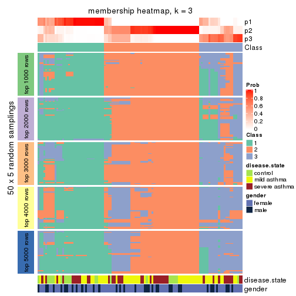</p>

</div>
<div id='tab-ATC-hclust-membership-heatmap-3'>
<pre><code class="r">membership_heatmap(res, k = 4)
</code></pre>

<p></p>

</div>
<div id='tab-ATC-hclust-membership-heatmap-4'>
<pre><code class="r">membership_heatmap(res, k = 5)
</code></pre>

<p></p>

</div>
<div id='tab-ATC-hclust-membership-heatmap-5'>
<pre><code class="r">membership_heatmap(res, k = 6)
</code></pre>

<p></p>

</div>
</div>

As soon as we have had the classes for columns, we can look for signatures
which are significantly different between classes which can be candidate marks
for certain classes. Following are the heatmaps for signatures.


Signature heatmaps where rows are scaled:


<script>
$( function() {
	$( '#tabs-ATC-hclust-get-signatures' ).tabs();
} );
</script>
<div id='tabs-ATC-hclust-get-signatures'>
<ul>
<li><a href='#tab-ATC-hclust-get-signatures-1'>k = 2</a></li>
<li><a href='#tab-ATC-hclust-get-signatures-2'>k = 3</a></li>
<li><a href='#tab-ATC-hclust-get-signatures-3'>k = 4</a></li>
<li><a href='#tab-ATC-hclust-get-signatures-4'>k = 5</a></li>
<li><a href='#tab-ATC-hclust-get-signatures-5'>k = 6</a></li>
</ul>
<div id='tab-ATC-hclust-get-signatures-1'>
<pre><code class="r">get_signatures(res, k = 2)
</code></pre>

<p></p>

</div>
<div id='tab-ATC-hclust-get-signatures-2'>
<pre><code class="r">get_signatures(res, k = 3)
</code></pre>

<p></p>

</div>
<div id='tab-ATC-hclust-get-signatures-3'>
<pre><code class="r">get_signatures(res, k = 4)
</code></pre>

<p></p>

</div>
<div id='tab-ATC-hclust-get-signatures-4'>
<pre><code class="r">get_signatures(res, k = 5)
</code></pre>

<p>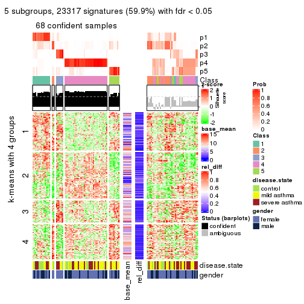</p>

</div>
<div id='tab-ATC-hclust-get-signatures-5'>
<pre><code class="r">get_signatures(res, k = 6)
</code></pre>

<p></p>

</div>
</div>


Signature heatmaps where rows are not scaled:


<script>
$( function() {
	$( '#tabs-ATC-hclust-get-signatures-no-scale' ).tabs();
} );
</script>
<div id='tabs-ATC-hclust-get-signatures-no-scale'>
<ul>
<li><a href='#tab-ATC-hclust-get-signatures-no-scale-1'>k = 2</a></li>
<li><a href='#tab-ATC-hclust-get-signatures-no-scale-2'>k = 3</a></li>
<li><a href='#tab-ATC-hclust-get-signatures-no-scale-3'>k = 4</a></li>
<li><a href='#tab-ATC-hclust-get-signatures-no-scale-4'>k = 5</a></li>
<li><a href='#tab-ATC-hclust-get-signatures-no-scale-5'>k = 6</a></li>
</ul>
<div id='tab-ATC-hclust-get-signatures-no-scale-1'>
<pre><code class="r">get_signatures(res, k = 2, scale_rows = FALSE)
</code></pre>

<p></p>

</div>
<div id='tab-ATC-hclust-get-signatures-no-scale-2'>
<pre><code class="r">get_signatures(res, k = 3, scale_rows = FALSE)
</code></pre>

<p></p>

</div>
<div id='tab-ATC-hclust-get-signatures-no-scale-3'>
<pre><code class="r">get_signatures(res, k = 4, scale_rows = FALSE)
</code></pre>

<p></p>

</div>
<div id='tab-ATC-hclust-get-signatures-no-scale-4'>
<pre><code class="r">get_signatures(res, k = 5, scale_rows = FALSE)
</code></pre>

<p></p>

</div>
<div id='tab-ATC-hclust-get-signatures-no-scale-5'>
<pre><code class="r">get_signatures(res, k = 6, scale_rows = FALSE)
</code></pre>

<p></p>

</div>
</div>


Compare the overlap of signatures from different k:

```r
compare_signatures(res)
```


`get_signature()` returns a data frame invisibly. TO get the list of signatures, the function
call should be assigned to a variable explicitly. In following code, if `plot` argument is set
to `FALSE`, no heatmap is plotted while only the differential analysis is performed.

```r
# code only for demonstration
tb = get_signature(res, k = ..., plot = FALSE)
```

An example of the output of `tb` is:

```
#>   which_row         fdr    mean_1    mean_2 scaled_mean_1 scaled_mean_2 km
#> 1        38 0.042760348  8.373488  9.131774    -0.5533452     0.5164555  1
#> 2        40 0.018707592  7.106213  8.469186    -0.6173731     0.5762149  1
#> 3        55 0.019134737 10.221463 11.207825    -0.6159697     0.5749050  1
#> 4        59 0.006059896  5.921854  7.869574    -0.6899429     0.6439467  1
#> 5        60 0.018055526  8.928898 10.211722    -0.6204761     0.5791110  1
#> 6        98 0.009384629 15.714769 14.887706     0.6635654    -0.6193277  2
...
```

The columns in `tb` are:

1. `which_row`: row indices corresponding to the input matrix.
2. `fdr`: FDR for the differential test. 
3. `mean_x`: The mean value in group x.
4. `scaled_mean_x`: The mean value in group x after rows are scaled.
5. `km`: Row groups if k-means clustering is applied to rows.


UMAP plot which shows how samples are separated.


<script>
$( function() {
	$( '#tabs-ATC-hclust-dimension-reduction' ).tabs();
} );
</script>
<div id='tabs-ATC-hclust-dimension-reduction'>
<ul>
<li><a href='#tab-ATC-hclust-dimension-reduction-1'>k = 2</a></li>
<li><a href='#tab-ATC-hclust-dimension-reduction-2'>k = 3</a></li>
<li><a href='#tab-ATC-hclust-dimension-reduction-3'>k = 4</a></li>
<li><a href='#tab-ATC-hclust-dimension-reduction-4'>k = 5</a></li>
<li><a href='#tab-ATC-hclust-dimension-reduction-5'>k = 6</a></li>
</ul>
<div id='tab-ATC-hclust-dimension-reduction-1'>
<pre><code class="r">dimension_reduction(res, k = 2, method = &quot;UMAP&quot;)
</code></pre>

<p></p>

</div>
<div id='tab-ATC-hclust-dimension-reduction-2'>
<pre><code class="r">dimension_reduction(res, k = 3, method = &quot;UMAP&quot;)
</code></pre>

<p></p>

</div>
<div id='tab-ATC-hclust-dimension-reduction-3'>
<pre><code class="r">dimension_reduction(res, k = 4, method = &quot;UMAP&quot;)
</code></pre>

<p></p>

</div>
<div id='tab-ATC-hclust-dimension-reduction-4'>
<pre><code class="r">dimension_reduction(res, k = 5, method = &quot;UMAP&quot;)
</code></pre>

<p></p>

</div>
<div id='tab-ATC-hclust-dimension-reduction-5'>
<pre><code class="r">dimension_reduction(res, k = 6, method = &quot;UMAP&quot;)
</code></pre>

<p></p>

</div>
</div>


Following heatmap shows how subgroups are split when increasing `k`:

```r
collect_classes(res)
```


Test correlation between subgroups and known annotations. If the known
annotation is numeric, one-way ANOVA test is applied, and if the known
annotation is discrete, chi-squared contingency table test is applied.

```r
test_to_known_factors(res)
```

```
#>             n disease.state(p) gender(p) k
#> ATC:hclust 92            0.220     0.879 2
#> ATC:hclust 75            0.549     0.762 3
#> ATC:hclust 75            0.580     0.174 4
#> ATC:hclust 68            0.284     0.208 5
#> ATC:hclust 83            0.214     0.409 6
```


If matrix rows can be associated to genes, consider to use `GO_Enrichment(res,
...)` to perform function enrichment for the signature genes.


 

---------------------------------------------------


### ATC:kmeans*


The object with results only for a single top-value method and a single partition method 
can be extracted as:

```r
res = res_list["ATC", "kmeans"]
# you can also extract it by
# res = res_list["ATC:kmeans"]
```

A summary of `res` and all the functions that can be applied to it:

```r
res
```

```
#> A 'ConsensusPartition' object with k = 2, 3, 4, 5, 6.
#>   On a matrix with 38950 rows and 108 columns.
#>   Top rows (1000, 2000, 3000, 4000, 5000) are extracted by 'ATC' method.
#>   Subgroups are detected by 'kmeans' method.
#>   Performed in total 1250 partitions by row resampling.
#>   Best k for subgroups seems to be 2.
#> 
#> Following methods can be applied to this 'ConsensusPartition' object:
#>  [1] "cola_report"             "collect_classes"         "collect_plots"          
#>  [4] "collect_stats"           "colnames"                "compare_signatures"     
#>  [7] "consensus_heatmap"       "dimension_reduction"     "functional_enrichment"  
#> [10] "get_anno_col"            "get_anno"                "get_classes"            
#> [13] "get_consensus"           "get_matrix"              "get_membership"         
#> [16] "get_param"               "get_signatures"          "get_stats"              
#> [19] "is_best_k"               "is_stable_k"             "membership_heatmap"     
#> [22] "ncol"                    "nrow"                    "plot_ecdf"              
#> [25] "rownames"                "select_partition_number" "show"                   
#> [28] "suggest_best_k"          "test_to_known_factors"
```

`collect_plots()` function collects all the plots made from `res` for all `k` (number of partitions)
into one single page to provide an easy and fast comparison between different `k`.

```r
collect_plots(res)
```


The plots are:

- The first row: a plot of the ECDF (Empirical cumulative distribution
  function) curves of the consensus matrix for each `k` and the heatmap of
  predicted classes for each `k`.
- The second row: heatmaps of the consensus matrix for each `k`.
- The third row: heatmaps of the membership matrix for each `k`.
- The fouth row: heatmaps of the signatures for each `k`.

All the plots in panels can be made by individual functions and they are
plotted later in this section.

`select_partition_number()` produces several plots showing different
statistics for choosing "optimized" `k`. There are following statistics:

- ECDF curves of the consensus matrix for each `k`;
- 1-PAC. [The PAC
  score](https://en.wikipedia.org/wiki/Consensus_clustering#Over-interpretation_potential_of_consensus_clustering)
  measures the proportion of the ambiguous subgrouping.
- Mean silhouette score.
- Concordance. The mean probability of fiting the consensus class ids in all
  partitions.
- Area increased. Denote $A_k$ as the area under the ECDF curve for current
  `k`, the area increased is defined as $A_k - A_{k-1}$.
- Rand index. The percent of pairs of samples that are both in a same cluster
  or both are not in a same cluster in the partition of k and k-1.
- Jaccard index. The ratio of pairs of samples are both in a same cluster in
  the partition of k and k-1 and the pairs of samples are both in a same
  cluster in the partition k or k-1.

The detailed explanations of these statistics can be found in [the cola
vignette](http://bioconductor.org/packages/devel/bioc/vignettes/cola/inst/doc/cola.html#toc_13).

Generally speaking, lower PAC score, higher mean silhouette score or higher
concordance corresponds to better partition. Rand index and Jaccard index
measure how similar the current partition is compared to partition with `k-1`.
If they are too similar, we won't accept `k` is better than `k-1`.

```r
select_partition_number(res)
```


The numeric values for all these statistics can be obtained by `get_stats()`.

```r
get_stats(res)
```

```
#>   k 1-PAC mean_silhouette concordance area_increased  Rand Jaccard
#> 2 2 0.904           0.931       0.971         0.4922 0.504   0.504
#> 3 3 0.723           0.750       0.889         0.3332 0.736   0.520
#> 4 4 0.641           0.732       0.839         0.1169 0.843   0.582
#> 5 5 0.772           0.701       0.821         0.0736 0.922   0.719
#> 6 6 0.739           0.642       0.773         0.0410 0.952   0.785
```

`suggest_best_k()` suggests the best $k$ based on these statistics. The rules are as follows:

- All $k$ with Jaccard index larger than 0.95 are removed because the increase of
  the partition number does not provides enough extra information. If all $k$ are removed,
  the best $k$ is assigned by `NA`.
- For $k$ with 1-PAC larger than 0.9, the maximal $k$ is taken as the "best k". Other $k$ is called "optional k".
- If it does not fit the second rule. The $k$ with the highest vote of highest
  1-PAC, mean silhouette and concordance is taken as the "best k".

```r
suggest_best_k(res)
```

```
#> [1] 2
```


Following shows the table of the partitions (You need to click the **show/hide
code output** link to see it). The membership matrix (columns with name `p*`)
is inferred by
[`clue::cl_consensus()`](https://www.rdocumentation.org/link/cl_consensus?package=clue)
function with the `SE` method. Basically the value in the membership matrix
represents the probability to belong to a certain group. The finall class
label for an item is determined with the group with highest probability it
belongs to.

In `get_classes()` function, the entropy is calculated from the membership
matrix and the silhouette score is calculated from the consensus matrix.


<script>
$( function() {
	$( '#tabs-ATC-kmeans-get-classes' ).tabs();
} );
</script>
<div id='tabs-ATC-kmeans-get-classes'>
<ul>
<li><a href='#tab-ATC-kmeans-get-classes-1'>k = 2</a></li>
<li><a href='#tab-ATC-kmeans-get-classes-2'>k = 3</a></li>
<li><a href='#tab-ATC-kmeans-get-classes-3'>k = 4</a></li>
<li><a href='#tab-ATC-kmeans-get-classes-4'>k = 5</a></li>
<li><a href='#tab-ATC-kmeans-get-classes-5'>k = 6</a></li>
</ul>

<div id='tab-ATC-kmeans-get-classes-1'>
<p><a id='tab-ATC-kmeans-get-classes-1-a' style='color:#0366d6' href='#'>show/hide code output</a></p>
<pre><code class="r">cbind(get_classes(res, k = 2), get_membership(res, k = 2))
</code></pre>

<pre><code>#&gt;            class entropy silhouette    p1    p2
#&gt; GSM1068478     1   0.000      0.956 1.000 0.000
#&gt; GSM1068479     2   0.000      0.979 0.000 1.000
#&gt; GSM1068481     1   0.917      0.537 0.668 0.332
#&gt; GSM1068482     1   0.000      0.956 1.000 0.000
#&gt; GSM1068483     1   0.000      0.956 1.000 0.000
#&gt; GSM1068486     2   0.184      0.951 0.028 0.972
#&gt; GSM1068487     2   0.000      0.979 0.000 1.000
#&gt; GSM1068488     2   0.000      0.979 0.000 1.000
#&gt; GSM1068490     2   0.000      0.979 0.000 1.000
#&gt; GSM1068491     1   0.000      0.956 1.000 0.000
#&gt; GSM1068492     2   0.000      0.979 0.000 1.000
#&gt; GSM1068493     2   0.963      0.332 0.388 0.612
#&gt; GSM1068494     1   0.886      0.590 0.696 0.304
#&gt; GSM1068495     2   0.662      0.776 0.172 0.828
#&gt; GSM1068496     1   0.000      0.956 1.000 0.000
#&gt; GSM1068498     1   0.000      0.956 1.000 0.000
#&gt; GSM1068499     1   0.000      0.956 1.000 0.000
#&gt; GSM1068500     1   0.000      0.956 1.000 0.000
#&gt; GSM1068502     2   0.000      0.979 0.000 1.000
#&gt; GSM1068503     2   0.000      0.979 0.000 1.000
#&gt; GSM1068505     2   0.000      0.979 0.000 1.000
#&gt; GSM1068506     2   0.000      0.979 0.000 1.000
#&gt; GSM1068507     2   0.000      0.979 0.000 1.000
#&gt; GSM1068508     2   0.000      0.979 0.000 1.000
#&gt; GSM1068510     2   0.000      0.979 0.000 1.000
#&gt; GSM1068512     2   0.000      0.979 0.000 1.000
#&gt; GSM1068513     2   0.000      0.979 0.000 1.000
#&gt; GSM1068514     2   0.000      0.979 0.000 1.000
#&gt; GSM1068517     1   0.000      0.956 1.000 0.000
#&gt; GSM1068518     1   0.000      0.956 1.000 0.000
#&gt; GSM1068520     1   0.000      0.956 1.000 0.000
#&gt; GSM1068521     1   0.000      0.956 1.000 0.000
#&gt; GSM1068522     2   0.000      0.979 0.000 1.000
#&gt; GSM1068524     2   0.000      0.979 0.000 1.000
#&gt; GSM1068527     2   0.000      0.979 0.000 1.000
#&gt; GSM1068480     1   0.000      0.956 1.000 0.000
#&gt; GSM1068484     2   0.000      0.979 0.000 1.000
#&gt; GSM1068485     1   0.000      0.956 1.000 0.000
#&gt; GSM1068489     2   0.000      0.979 0.000 1.000
#&gt; GSM1068497     1   0.000      0.956 1.000 0.000
#&gt; GSM1068501     2   0.000      0.979 0.000 1.000
#&gt; GSM1068504     2   0.000      0.979 0.000 1.000
#&gt; GSM1068509     1   0.000      0.956 1.000 0.000
#&gt; GSM1068511     2   0.000      0.979 0.000 1.000
#&gt; GSM1068515     1   0.000      0.956 1.000 0.000
#&gt; GSM1068516     1   0.925      0.520 0.660 0.340
#&gt; GSM1068519     1   0.000      0.956 1.000 0.000
#&gt; GSM1068523     2   0.000      0.979 0.000 1.000
#&gt; GSM1068525     2   0.000      0.979 0.000 1.000
#&gt; GSM1068526     2   0.000      0.979 0.000 1.000
#&gt; GSM1068458     1   0.000      0.956 1.000 0.000
#&gt; GSM1068459     1   0.000      0.956 1.000 0.000
#&gt; GSM1068460     1   0.625      0.806 0.844 0.156
#&gt; GSM1068461     1   0.000      0.956 1.000 0.000
#&gt; GSM1068464     2   0.000      0.979 0.000 1.000
#&gt; GSM1068468     1   0.000      0.956 1.000 0.000
#&gt; GSM1068472     1   0.000      0.956 1.000 0.000
#&gt; GSM1068473     2   0.000      0.979 0.000 1.000
#&gt; GSM1068474     2   0.000      0.979 0.000 1.000
#&gt; GSM1068476     2   0.000      0.979 0.000 1.000
#&gt; GSM1068477     2   0.000      0.979 0.000 1.000
#&gt; GSM1068462     1   0.574      0.829 0.864 0.136
#&gt; GSM1068463     1   0.000      0.956 1.000 0.000
#&gt; GSM1068465     1   0.000      0.956 1.000 0.000
#&gt; GSM1068466     1   0.000      0.956 1.000 0.000
#&gt; GSM1068467     1   0.000      0.956 1.000 0.000
#&gt; GSM1068469     1   0.000      0.956 1.000 0.000
#&gt; GSM1068470     2   0.000      0.979 0.000 1.000
#&gt; GSM1068471     2   0.000      0.979 0.000 1.000
#&gt; GSM1068475     2   0.000      0.979 0.000 1.000
#&gt; GSM1068528     1   0.000      0.956 1.000 0.000
#&gt; GSM1068531     1   0.000      0.956 1.000 0.000
#&gt; GSM1068532     1   0.000      0.956 1.000 0.000
#&gt; GSM1068533     1   0.000      0.956 1.000 0.000
#&gt; GSM1068535     2   0.000      0.979 0.000 1.000
#&gt; GSM1068537     1   0.000      0.956 1.000 0.000
#&gt; GSM1068538     1   0.000      0.956 1.000 0.000
#&gt; GSM1068539     2   0.871      0.569 0.292 0.708
#&gt; GSM1068540     1   0.000      0.956 1.000 0.000
#&gt; GSM1068542     2   0.000      0.979 0.000 1.000
#&gt; GSM1068543     2   0.000      0.979 0.000 1.000
#&gt; GSM1068544     1   0.000      0.956 1.000 0.000
#&gt; GSM1068545     2   0.000      0.979 0.000 1.000
#&gt; GSM1068546     1   0.917      0.537 0.668 0.332
#&gt; GSM1068547     1   0.000      0.956 1.000 0.000
#&gt; GSM1068548     2   0.000      0.979 0.000 1.000
#&gt; GSM1068549     1   0.000      0.956 1.000 0.000
#&gt; GSM1068550     2   0.000      0.979 0.000 1.000
#&gt; GSM1068551     2   0.000      0.979 0.000 1.000
#&gt; GSM1068552     2   0.000      0.979 0.000 1.000
#&gt; GSM1068555     2   0.000      0.979 0.000 1.000
#&gt; GSM1068556     2   0.000      0.979 0.000 1.000
#&gt; GSM1068557     2   0.000      0.979 0.000 1.000
#&gt; GSM1068560     2   0.000      0.979 0.000 1.000
#&gt; GSM1068561     2   0.000      0.979 0.000 1.000
#&gt; GSM1068562     2   0.000      0.979 0.000 1.000
#&gt; GSM1068563     2   0.000      0.979 0.000 1.000
#&gt; GSM1068565     2   0.000      0.979 0.000 1.000
#&gt; GSM1068529     2   0.000      0.979 0.000 1.000
#&gt; GSM1068530     1   0.000      0.956 1.000 0.000
#&gt; GSM1068534     2   0.000      0.979 0.000 1.000
#&gt; GSM1068536     1   0.925      0.520 0.660 0.340
#&gt; GSM1068541     1   0.000      0.956 1.000 0.000
#&gt; GSM1068553     2   0.000      0.979 0.000 1.000
#&gt; GSM1068554     2   0.000      0.979 0.000 1.000
#&gt; GSM1068558     2   0.000      0.979 0.000 1.000
#&gt; GSM1068559     2   0.895      0.526 0.312 0.688
#&gt; GSM1068564     2   0.000      0.979 0.000 1.000
</code></pre>

<script>
$('#tab-ATC-kmeans-get-classes-1-a').parent().next().next().hide();
$('#tab-ATC-kmeans-get-classes-1-a').click(function(){
  $('#tab-ATC-kmeans-get-classes-1-a').parent().next().next().toggle();
  return(false);
});
</script>
</div>

<div id='tab-ATC-kmeans-get-classes-2'>
<p><a id='tab-ATC-kmeans-get-classes-2-a' style='color:#0366d6' href='#'>show/hide code output</a></p>
<pre><code class="r">cbind(get_classes(res, k = 3), get_membership(res, k = 3))
</code></pre>

<pre><code>#&gt;            class entropy silhouette    p1    p2    p3
#&gt; GSM1068478     3  0.2774     0.6896 0.072 0.008 0.920
#&gt; GSM1068479     2  0.0424     0.9202 0.000 0.992 0.008
#&gt; GSM1068481     3  0.1585     0.7331 0.028 0.008 0.964
#&gt; GSM1068482     3  0.6295    -0.2542 0.472 0.000 0.528
#&gt; GSM1068483     1  0.0000     0.9100 1.000 0.000 0.000
#&gt; GSM1068486     3  0.1163     0.7462 0.000 0.028 0.972
#&gt; GSM1068487     2  0.0424     0.9202 0.000 0.992 0.008
#&gt; GSM1068488     3  0.6260     0.2895 0.000 0.448 0.552
#&gt; GSM1068490     2  0.0424     0.9202 0.000 0.992 0.008
#&gt; GSM1068491     1  0.1411     0.9080 0.964 0.000 0.036
#&gt; GSM1068492     2  0.0424     0.9202 0.000 0.992 0.008
#&gt; GSM1068493     3  0.0892     0.7445 0.000 0.020 0.980
#&gt; GSM1068494     3  0.0237     0.7432 0.000 0.004 0.996
#&gt; GSM1068495     3  0.0424     0.7451 0.000 0.008 0.992
#&gt; GSM1068496     1  0.6398     0.5513 0.620 0.008 0.372
#&gt; GSM1068498     1  0.2165     0.8854 0.936 0.000 0.064
#&gt; GSM1068499     1  0.1031     0.9103 0.976 0.000 0.024
#&gt; GSM1068500     1  0.6513     0.5015 0.592 0.008 0.400
#&gt; GSM1068502     2  0.0000     0.9196 0.000 1.000 0.000
#&gt; GSM1068503     2  0.0424     0.9202 0.000 0.992 0.008
#&gt; GSM1068505     2  0.0000     0.9196 0.000 1.000 0.000
#&gt; GSM1068506     2  0.0237     0.9177 0.000 0.996 0.004
#&gt; GSM1068507     2  0.5529     0.5200 0.000 0.704 0.296
#&gt; GSM1068508     2  0.6140     0.2149 0.000 0.596 0.404
#&gt; GSM1068510     3  0.6026     0.4590 0.000 0.376 0.624
#&gt; GSM1068512     2  0.0237     0.9177 0.000 0.996 0.004
#&gt; GSM1068513     2  0.5591     0.4941 0.000 0.696 0.304
#&gt; GSM1068514     2  0.0237     0.9201 0.000 0.996 0.004
#&gt; GSM1068517     3  0.5905     0.3150 0.352 0.000 0.648
#&gt; GSM1068518     3  0.3752     0.6623 0.144 0.000 0.856
#&gt; GSM1068520     1  0.0000     0.9100 1.000 0.000 0.000
#&gt; GSM1068521     1  0.1031     0.9103 0.976 0.000 0.024
#&gt; GSM1068522     2  0.0000     0.9196 0.000 1.000 0.000
#&gt; GSM1068524     3  0.6308     0.1760 0.000 0.492 0.508
#&gt; GSM1068527     2  0.0237     0.9177 0.000 0.996 0.004
#&gt; GSM1068480     3  0.0237     0.7409 0.004 0.000 0.996
#&gt; GSM1068484     2  0.0424     0.9202 0.000 0.992 0.008
#&gt; GSM1068485     1  0.0747     0.9111 0.984 0.000 0.016
#&gt; GSM1068489     2  0.0000     0.9196 0.000 1.000 0.000
#&gt; GSM1068497     3  0.0237     0.7409 0.004 0.000 0.996
#&gt; GSM1068501     2  0.0000     0.9196 0.000 1.000 0.000
#&gt; GSM1068504     2  0.6008     0.3107 0.000 0.628 0.372
#&gt; GSM1068509     1  0.0000     0.9100 1.000 0.000 0.000
#&gt; GSM1068511     2  0.0237     0.9177 0.000 0.996 0.004
#&gt; GSM1068515     1  0.1031     0.9103 0.976 0.000 0.024
#&gt; GSM1068516     3  0.0424     0.7451 0.000 0.008 0.992
#&gt; GSM1068519     1  0.0000     0.9100 1.000 0.000 0.000
#&gt; GSM1068523     3  0.6062     0.4484 0.000 0.384 0.616
#&gt; GSM1068525     2  0.5948     0.3479 0.000 0.640 0.360
#&gt; GSM1068526     2  0.0424     0.9202 0.000 0.992 0.008
#&gt; GSM1068458     1  0.0892     0.9107 0.980 0.000 0.020
#&gt; GSM1068459     1  0.6498     0.5090 0.596 0.008 0.396
#&gt; GSM1068460     3  0.4744     0.6722 0.136 0.028 0.836
#&gt; GSM1068461     1  0.1031     0.9103 0.976 0.000 0.024
#&gt; GSM1068464     2  0.0424     0.9202 0.000 0.992 0.008
#&gt; GSM1068468     1  0.1411     0.9080 0.964 0.000 0.036
#&gt; GSM1068472     1  0.1964     0.8979 0.944 0.000 0.056
#&gt; GSM1068473     2  0.0000     0.9196 0.000 1.000 0.000
#&gt; GSM1068474     2  0.0424     0.9202 0.000 0.992 0.008
#&gt; GSM1068476     3  0.6062     0.4484 0.000 0.384 0.616
#&gt; GSM1068477     3  0.5529     0.5735 0.000 0.296 0.704
#&gt; GSM1068462     3  0.5047     0.6691 0.140 0.036 0.824
#&gt; GSM1068463     1  0.1860     0.8850 0.948 0.000 0.052
#&gt; GSM1068465     1  0.0592     0.9090 0.988 0.000 0.012
#&gt; GSM1068466     1  0.0000     0.9100 1.000 0.000 0.000
#&gt; GSM1068467     1  0.4555     0.7712 0.800 0.000 0.200
#&gt; GSM1068469     1  0.0892     0.9107 0.980 0.000 0.020
#&gt; GSM1068470     2  0.5497     0.5191 0.000 0.708 0.292
#&gt; GSM1068471     2  0.0424     0.9202 0.000 0.992 0.008
#&gt; GSM1068475     2  0.0424     0.9202 0.000 0.992 0.008
#&gt; GSM1068528     1  0.0892     0.9111 0.980 0.000 0.020
#&gt; GSM1068531     1  0.6359     0.5642 0.628 0.008 0.364
#&gt; GSM1068532     1  0.0000     0.9100 1.000 0.000 0.000
#&gt; GSM1068533     1  0.4702     0.7474 0.788 0.000 0.212
#&gt; GSM1068535     2  0.3619     0.7650 0.000 0.864 0.136
#&gt; GSM1068537     1  0.0424     0.9083 0.992 0.000 0.008
#&gt; GSM1068538     1  0.0000     0.9100 1.000 0.000 0.000
#&gt; GSM1068539     3  0.0592     0.7464 0.000 0.012 0.988
#&gt; GSM1068540     1  0.6359     0.5642 0.628 0.008 0.364
#&gt; GSM1068542     2  0.0000     0.9196 0.000 1.000 0.000
#&gt; GSM1068543     3  0.6299     0.2275 0.000 0.476 0.524
#&gt; GSM1068544     1  0.1031     0.9103 0.976 0.000 0.024
#&gt; GSM1068545     2  0.0424     0.9202 0.000 0.992 0.008
#&gt; GSM1068546     3  0.1315     0.7357 0.020 0.008 0.972
#&gt; GSM1068547     1  0.0424     0.9108 0.992 0.000 0.008
#&gt; GSM1068548     2  0.0237     0.9177 0.000 0.996 0.004
#&gt; GSM1068549     3  0.5948     0.0856 0.360 0.000 0.640
#&gt; GSM1068550     2  0.0424     0.9202 0.000 0.992 0.008
#&gt; GSM1068551     2  0.0424     0.9202 0.000 0.992 0.008
#&gt; GSM1068552     2  0.0424     0.9202 0.000 0.992 0.008
#&gt; GSM1068555     3  0.6126     0.4178 0.000 0.400 0.600
#&gt; GSM1068556     2  0.0237     0.9177 0.000 0.996 0.004
#&gt; GSM1068557     3  0.2796     0.7390 0.000 0.092 0.908
#&gt; GSM1068560     3  0.6126     0.4178 0.000 0.400 0.600
#&gt; GSM1068561     3  0.1289     0.7494 0.000 0.032 0.968
#&gt; GSM1068562     3  0.6305     0.2023 0.000 0.484 0.516
#&gt; GSM1068563     2  0.0237     0.9177 0.000 0.996 0.004
#&gt; GSM1068565     2  0.4702     0.6695 0.000 0.788 0.212
#&gt; GSM1068529     3  0.1289     0.7494 0.000 0.032 0.968
#&gt; GSM1068530     1  0.0000     0.9100 1.000 0.000 0.000
#&gt; GSM1068534     2  0.1289     0.8942 0.000 0.968 0.032
#&gt; GSM1068536     3  0.0237     0.7432 0.000 0.004 0.996
#&gt; GSM1068541     1  0.1163     0.9103 0.972 0.000 0.028
#&gt; GSM1068553     2  0.0237     0.9177 0.000 0.996 0.004
#&gt; GSM1068554     2  0.0000     0.9196 0.000 1.000 0.000
#&gt; GSM1068558     3  0.6026     0.4590 0.000 0.376 0.624
#&gt; GSM1068559     3  0.1031     0.7488 0.000 0.024 0.976
#&gt; GSM1068564     2  0.0424     0.9202 0.000 0.992 0.008
</code></pre>

<script>
$('#tab-ATC-kmeans-get-classes-2-a').parent().next().next().hide();
$('#tab-ATC-kmeans-get-classes-2-a').click(function(){
  $('#tab-ATC-kmeans-get-classes-2-a').parent().next().next().toggle();
  return(false);
});
</script>
</div>

<div id='tab-ATC-kmeans-get-classes-3'>
<p><a id='tab-ATC-kmeans-get-classes-3-a' style='color:#0366d6' href='#'>show/hide code output</a></p>
<pre><code class="r">cbind(get_classes(res, k = 4), get_membership(res, k = 4))
</code></pre>

<pre><code>#&gt;            class entropy silhouette    p1    p2    p3    p4
#&gt; GSM1068478     3  0.2466     0.6957 0.000 0.096 0.900 0.004
#&gt; GSM1068479     4  0.3751     0.7332 0.000 0.196 0.004 0.800
#&gt; GSM1068481     3  0.2684     0.7176 0.012 0.060 0.912 0.016
#&gt; GSM1068482     3  0.6356     0.4170 0.308 0.088 0.604 0.000
#&gt; GSM1068483     1  0.4248     0.7562 0.768 0.012 0.220 0.000
#&gt; GSM1068486     3  0.4769     0.4368 0.000 0.308 0.684 0.008
#&gt; GSM1068487     4  0.1389     0.9233 0.000 0.048 0.000 0.952
#&gt; GSM1068488     2  0.3610     0.7406 0.000 0.800 0.000 0.200
#&gt; GSM1068490     4  0.0592     0.9395 0.000 0.016 0.000 0.984
#&gt; GSM1068491     1  0.5425     0.7474 0.752 0.060 0.172 0.016
#&gt; GSM1068492     4  0.0592     0.9395 0.000 0.016 0.000 0.984
#&gt; GSM1068493     3  0.4897     0.3966 0.000 0.332 0.660 0.008
#&gt; GSM1068494     2  0.4830     0.3657 0.000 0.608 0.392 0.000
#&gt; GSM1068495     2  0.3486     0.6233 0.000 0.812 0.188 0.000
#&gt; GSM1068496     3  0.2778     0.7137 0.080 0.004 0.900 0.016
#&gt; GSM1068498     1  0.4483     0.6768 0.808 0.104 0.088 0.000
#&gt; GSM1068499     1  0.3323     0.7582 0.876 0.064 0.060 0.000
#&gt; GSM1068500     3  0.3046     0.7120 0.096 0.004 0.884 0.016
#&gt; GSM1068502     4  0.0188     0.9395 0.000 0.000 0.004 0.996
#&gt; GSM1068503     4  0.0592     0.9395 0.000 0.016 0.000 0.984
#&gt; GSM1068505     4  0.1677     0.9228 0.000 0.040 0.012 0.948
#&gt; GSM1068506     4  0.0707     0.9361 0.000 0.000 0.020 0.980
#&gt; GSM1068507     2  0.4053     0.7155 0.000 0.768 0.004 0.228
#&gt; GSM1068508     2  0.3945     0.7261 0.000 0.780 0.004 0.216
#&gt; GSM1068510     2  0.2973     0.7596 0.000 0.856 0.000 0.144
#&gt; GSM1068512     4  0.1913     0.9208 0.000 0.040 0.020 0.940
#&gt; GSM1068513     2  0.4188     0.7053 0.000 0.752 0.004 0.244
#&gt; GSM1068514     4  0.0937     0.9403 0.000 0.012 0.012 0.976
#&gt; GSM1068517     1  0.6613     0.4205 0.628 0.200 0.172 0.000
#&gt; GSM1068518     2  0.6969     0.3577 0.224 0.584 0.192 0.000
#&gt; GSM1068520     1  0.3870     0.7596 0.788 0.004 0.208 0.000
#&gt; GSM1068521     1  0.1388     0.7843 0.960 0.012 0.028 0.000
#&gt; GSM1068522     4  0.0469     0.9385 0.000 0.000 0.012 0.988
#&gt; GSM1068524     2  0.3444     0.7482 0.000 0.816 0.000 0.184
#&gt; GSM1068527     4  0.1624     0.9277 0.000 0.028 0.020 0.952
#&gt; GSM1068480     2  0.5229     0.2692 0.008 0.564 0.428 0.000
#&gt; GSM1068484     4  0.0592     0.9395 0.000 0.016 0.000 0.984
#&gt; GSM1068485     1  0.2174     0.7874 0.928 0.020 0.052 0.000
#&gt; GSM1068489     4  0.1767     0.9200 0.000 0.044 0.012 0.944
#&gt; GSM1068497     2  0.5085     0.3547 0.008 0.616 0.376 0.000
#&gt; GSM1068501     4  0.0469     0.9385 0.000 0.000 0.012 0.988
#&gt; GSM1068504     2  0.3726     0.7363 0.000 0.788 0.000 0.212
#&gt; GSM1068509     1  0.4248     0.7562 0.768 0.012 0.220 0.000
#&gt; GSM1068511     4  0.0707     0.9361 0.000 0.000 0.020 0.980
#&gt; GSM1068515     1  0.1837     0.7828 0.944 0.028 0.028 0.000
#&gt; GSM1068516     2  0.3688     0.6079 0.000 0.792 0.208 0.000
#&gt; GSM1068519     1  0.3529     0.7853 0.836 0.012 0.152 0.000
#&gt; GSM1068523     2  0.2281     0.7554 0.000 0.904 0.000 0.096
#&gt; GSM1068525     2  0.4040     0.7056 0.000 0.752 0.000 0.248
#&gt; GSM1068526     4  0.2345     0.8773 0.000 0.100 0.000 0.900
#&gt; GSM1068458     1  0.0188     0.7953 0.996 0.004 0.000 0.000
#&gt; GSM1068459     3  0.2778     0.7137 0.080 0.004 0.900 0.016
#&gt; GSM1068460     2  0.6966     0.5092 0.112 0.652 0.200 0.036
#&gt; GSM1068461     1  0.3464     0.7355 0.868 0.076 0.056 0.000
#&gt; GSM1068464     4  0.0779     0.9386 0.000 0.016 0.004 0.980
#&gt; GSM1068468     1  0.5955     0.7346 0.732 0.060 0.168 0.040
#&gt; GSM1068472     1  0.6240     0.7167 0.712 0.060 0.180 0.048
#&gt; GSM1068473     4  0.0000     0.9397 0.000 0.000 0.000 1.000
#&gt; GSM1068474     4  0.0779     0.9386 0.000 0.016 0.004 0.980
#&gt; GSM1068476     2  0.2345     0.7564 0.000 0.900 0.000 0.100
#&gt; GSM1068477     2  0.4389     0.7324 0.000 0.812 0.072 0.116
#&gt; GSM1068462     2  0.7031     0.5026 0.120 0.648 0.196 0.036
#&gt; GSM1068463     3  0.5290     0.0979 0.404 0.012 0.584 0.000
#&gt; GSM1068465     1  0.5629     0.7364 0.724 0.052 0.208 0.016
#&gt; GSM1068466     1  0.3945     0.7546 0.780 0.004 0.216 0.000
#&gt; GSM1068467     1  0.6891     0.5145 0.648 0.172 0.160 0.020
#&gt; GSM1068469     1  0.3307     0.7948 0.868 0.028 0.104 0.000
#&gt; GSM1068470     2  0.4103     0.7012 0.000 0.744 0.000 0.256
#&gt; GSM1068471     4  0.0592     0.9395 0.000 0.016 0.000 0.984
#&gt; GSM1068475     4  0.0779     0.9386 0.000 0.016 0.004 0.980
#&gt; GSM1068528     1  0.2845     0.7794 0.896 0.028 0.076 0.000
#&gt; GSM1068531     3  0.2989     0.7077 0.100 0.004 0.884 0.012
#&gt; GSM1068532     1  0.3718     0.7783 0.820 0.012 0.168 0.000
#&gt; GSM1068533     3  0.3831     0.6224 0.204 0.004 0.792 0.000
#&gt; GSM1068535     4  0.6101     0.3235 0.000 0.052 0.388 0.560
#&gt; GSM1068537     3  0.5366    -0.0601 0.440 0.012 0.548 0.000
#&gt; GSM1068538     1  0.3718     0.7783 0.820 0.012 0.168 0.000
#&gt; GSM1068539     2  0.3751     0.6138 0.004 0.800 0.196 0.000
#&gt; GSM1068540     3  0.2989     0.7077 0.100 0.004 0.884 0.012
#&gt; GSM1068542     4  0.0188     0.9397 0.000 0.000 0.004 0.996
#&gt; GSM1068543     2  0.3311     0.7531 0.000 0.828 0.000 0.172
#&gt; GSM1068544     1  0.3820     0.7563 0.848 0.064 0.088 0.000
#&gt; GSM1068545     4  0.0779     0.9386 0.000 0.016 0.004 0.980
#&gt; GSM1068546     3  0.4567     0.4923 0.000 0.276 0.716 0.008
#&gt; GSM1068547     1  0.2011     0.8041 0.920 0.000 0.080 0.000
#&gt; GSM1068548     4  0.0707     0.9361 0.000 0.000 0.020 0.980
#&gt; GSM1068549     3  0.4507     0.6394 0.044 0.168 0.788 0.000
#&gt; GSM1068550     4  0.1388     0.9370 0.000 0.028 0.012 0.960
#&gt; GSM1068551     4  0.4741     0.4623 0.000 0.328 0.004 0.668
#&gt; GSM1068552     4  0.0592     0.9395 0.000 0.016 0.000 0.984
#&gt; GSM1068555     2  0.2921     0.7601 0.000 0.860 0.000 0.140
#&gt; GSM1068556     4  0.0707     0.9361 0.000 0.000 0.020 0.980
#&gt; GSM1068557     2  0.3687     0.7286 0.000 0.856 0.080 0.064
#&gt; GSM1068560     2  0.2647     0.7590 0.000 0.880 0.000 0.120
#&gt; GSM1068561     2  0.2859     0.6987 0.000 0.880 0.112 0.008
#&gt; GSM1068562     2  0.3311     0.7534 0.000 0.828 0.000 0.172
#&gt; GSM1068563     4  0.0707     0.9361 0.000 0.000 0.020 0.980
#&gt; GSM1068565     2  0.4454     0.6327 0.000 0.692 0.000 0.308
#&gt; GSM1068529     2  0.2987     0.7023 0.000 0.880 0.104 0.016
#&gt; GSM1068530     1  0.3718     0.7783 0.820 0.012 0.168 0.000
#&gt; GSM1068534     4  0.4452     0.7795 0.000 0.048 0.156 0.796
#&gt; GSM1068536     2  0.4817     0.3669 0.000 0.612 0.388 0.000
#&gt; GSM1068541     1  0.5251     0.7620 0.768 0.052 0.160 0.020
#&gt; GSM1068553     4  0.1474     0.9106 0.000 0.000 0.052 0.948
#&gt; GSM1068554     4  0.0469     0.9385 0.000 0.000 0.012 0.988
#&gt; GSM1068558     2  0.2973     0.7596 0.000 0.856 0.000 0.144
#&gt; GSM1068559     2  0.3577     0.6546 0.000 0.832 0.156 0.012
#&gt; GSM1068564     4  0.0592     0.9395 0.000 0.016 0.000 0.984
</code></pre>

<script>
$('#tab-ATC-kmeans-get-classes-3-a').parent().next().next().hide();
$('#tab-ATC-kmeans-get-classes-3-a').click(function(){
  $('#tab-ATC-kmeans-get-classes-3-a').parent().next().next().toggle();
  return(false);
});
</script>
</div>

<div id='tab-ATC-kmeans-get-classes-4'>
<p><a id='tab-ATC-kmeans-get-classes-4-a' style='color:#0366d6' href='#'>show/hide code output</a></p>
<pre><code class="r">cbind(get_classes(res, k = 5), get_membership(res, k = 5))
</code></pre>

<pre><code>#&gt;            class entropy silhouette    p1    p2    p3    p4    p5
#&gt; GSM1068478     3  0.1106     0.7476 0.000 0.012 0.964 0.000 0.024
#&gt; GSM1068479     4  0.4769     0.6169 0.000 0.056 0.000 0.688 0.256
#&gt; GSM1068481     3  0.0566     0.7570 0.000 0.004 0.984 0.000 0.012
#&gt; GSM1068482     5  0.6740     0.2702 0.252 0.012 0.232 0.000 0.504
#&gt; GSM1068483     1  0.1408     0.7358 0.948 0.000 0.044 0.000 0.008
#&gt; GSM1068486     3  0.3019     0.6680 0.000 0.088 0.864 0.000 0.048
#&gt; GSM1068487     4  0.2953     0.8146 0.000 0.144 0.000 0.844 0.012
#&gt; GSM1068488     2  0.1243     0.8352 0.000 0.960 0.004 0.028 0.008
#&gt; GSM1068490     4  0.1168     0.9250 0.000 0.008 0.000 0.960 0.032
#&gt; GSM1068491     1  0.5760     0.4972 0.508 0.008 0.040 0.012 0.432
#&gt; GSM1068492     4  0.0693     0.9289 0.000 0.008 0.000 0.980 0.012
#&gt; GSM1068493     3  0.5167     0.3574 0.000 0.088 0.664 0.000 0.248
#&gt; GSM1068494     5  0.6553     0.5198 0.000 0.364 0.204 0.000 0.432
#&gt; GSM1068495     5  0.5594     0.4358 0.000 0.436 0.072 0.000 0.492
#&gt; GSM1068496     3  0.1571     0.7716 0.060 0.000 0.936 0.000 0.004
#&gt; GSM1068498     5  0.3876    -0.0232 0.316 0.000 0.000 0.000 0.684
#&gt; GSM1068499     1  0.3741     0.6283 0.732 0.000 0.004 0.000 0.264
#&gt; GSM1068500     3  0.1430     0.7717 0.052 0.000 0.944 0.000 0.004
#&gt; GSM1068502     4  0.1638     0.9114 0.000 0.000 0.004 0.932 0.064
#&gt; GSM1068503     4  0.0798     0.9294 0.000 0.008 0.000 0.976 0.016
#&gt; GSM1068505     4  0.1780     0.9203 0.000 0.024 0.008 0.940 0.028
#&gt; GSM1068506     4  0.1281     0.9241 0.000 0.000 0.012 0.956 0.032
#&gt; GSM1068507     2  0.3916     0.7189 0.000 0.804 0.000 0.092 0.104
#&gt; GSM1068508     2  0.3805     0.6755 0.000 0.784 0.000 0.032 0.184
#&gt; GSM1068510     2  0.0854     0.8340 0.000 0.976 0.004 0.012 0.008
#&gt; GSM1068512     4  0.1787     0.9205 0.000 0.016 0.012 0.940 0.032
#&gt; GSM1068513     2  0.1992     0.8217 0.000 0.924 0.000 0.044 0.032
#&gt; GSM1068514     4  0.1153     0.9282 0.000 0.008 0.004 0.964 0.024
#&gt; GSM1068517     5  0.3325     0.4515 0.104 0.032 0.012 0.000 0.852
#&gt; GSM1068518     5  0.2770     0.5456 0.020 0.076 0.016 0.000 0.888
#&gt; GSM1068520     1  0.4149     0.7214 0.784 0.000 0.088 0.000 0.128
#&gt; GSM1068521     1  0.3684     0.6901 0.720 0.000 0.000 0.000 0.280
#&gt; GSM1068522     4  0.0451     0.9302 0.000 0.000 0.008 0.988 0.004
#&gt; GSM1068524     2  0.1243     0.8352 0.000 0.960 0.004 0.028 0.008
#&gt; GSM1068527     4  0.1787     0.9200 0.000 0.016 0.012 0.940 0.032
#&gt; GSM1068480     5  0.6526     0.5486 0.000 0.260 0.256 0.000 0.484
#&gt; GSM1068484     4  0.1168     0.9250 0.000 0.008 0.000 0.960 0.032
#&gt; GSM1068485     1  0.3086     0.6877 0.816 0.000 0.004 0.000 0.180
#&gt; GSM1068489     4  0.2352     0.9033 0.000 0.048 0.008 0.912 0.032
#&gt; GSM1068497     5  0.6246     0.6006 0.000 0.272 0.192 0.000 0.536
#&gt; GSM1068501     4  0.0898     0.9296 0.000 0.000 0.008 0.972 0.020
#&gt; GSM1068504     2  0.1626     0.8290 0.000 0.940 0.000 0.044 0.016
#&gt; GSM1068509     1  0.1701     0.7354 0.936 0.000 0.048 0.000 0.016
#&gt; GSM1068511     4  0.1281     0.9241 0.000 0.000 0.012 0.956 0.032
#&gt; GSM1068515     1  0.4015     0.6676 0.652 0.000 0.000 0.000 0.348
#&gt; GSM1068516     5  0.5579     0.4613 0.000 0.420 0.072 0.000 0.508
#&gt; GSM1068519     1  0.0162     0.7427 0.996 0.000 0.004 0.000 0.000
#&gt; GSM1068523     2  0.0510     0.8288 0.000 0.984 0.000 0.000 0.016
#&gt; GSM1068525     2  0.1701     0.8264 0.000 0.936 0.000 0.048 0.016
#&gt; GSM1068526     4  0.4599     0.3501 0.000 0.384 0.000 0.600 0.016
#&gt; GSM1068458     1  0.2813     0.7405 0.832 0.000 0.000 0.000 0.168
#&gt; GSM1068459     3  0.1628     0.7721 0.056 0.000 0.936 0.000 0.008
#&gt; GSM1068460     5  0.4427     0.5709 0.004 0.212 0.020 0.016 0.748
#&gt; GSM1068461     1  0.4287     0.5275 0.540 0.000 0.000 0.000 0.460
#&gt; GSM1068464     4  0.1638     0.9104 0.000 0.004 0.000 0.932 0.064
#&gt; GSM1068468     1  0.6082     0.5009 0.500 0.008 0.036 0.032 0.424
#&gt; GSM1068472     1  0.6581     0.4844 0.480 0.008 0.036 0.068 0.408
#&gt; GSM1068473     4  0.0451     0.9304 0.000 0.000 0.004 0.988 0.008
#&gt; GSM1068474     4  0.1704     0.9081 0.000 0.004 0.000 0.928 0.068
#&gt; GSM1068476     2  0.1331     0.8237 0.000 0.952 0.000 0.008 0.040
#&gt; GSM1068477     2  0.5084    -0.1626 0.000 0.488 0.008 0.020 0.484
#&gt; GSM1068462     5  0.4488     0.5705 0.004 0.208 0.020 0.020 0.748
#&gt; GSM1068463     3  0.4150     0.4225 0.388 0.000 0.612 0.000 0.000
#&gt; GSM1068465     1  0.6224     0.5242 0.524 0.008 0.044 0.036 0.388
#&gt; GSM1068466     1  0.4406     0.7079 0.764 0.000 0.108 0.000 0.128
#&gt; GSM1068467     5  0.2537     0.4553 0.056 0.024 0.016 0.000 0.904
#&gt; GSM1068469     1  0.4302     0.7060 0.720 0.000 0.032 0.000 0.248
#&gt; GSM1068470     2  0.1845     0.8210 0.000 0.928 0.000 0.056 0.016
#&gt; GSM1068471     4  0.1041     0.9256 0.000 0.004 0.000 0.964 0.032
#&gt; GSM1068475     4  0.1764     0.9102 0.000 0.008 0.000 0.928 0.064
#&gt; GSM1068528     1  0.3231     0.6776 0.800 0.000 0.004 0.000 0.196
#&gt; GSM1068531     3  0.1704     0.7710 0.068 0.000 0.928 0.000 0.004
#&gt; GSM1068532     1  0.0510     0.7420 0.984 0.000 0.016 0.000 0.000
#&gt; GSM1068533     3  0.3688     0.6998 0.124 0.000 0.816 0.000 0.060
#&gt; GSM1068535     3  0.5296     0.3340 0.000 0.016 0.596 0.356 0.032
#&gt; GSM1068537     3  0.4557     0.3604 0.404 0.000 0.584 0.000 0.012
#&gt; GSM1068538     1  0.0510     0.7420 0.984 0.000 0.016 0.000 0.000
#&gt; GSM1068539     5  0.5579     0.4613 0.000 0.420 0.072 0.000 0.508
#&gt; GSM1068540     3  0.1704     0.7710 0.068 0.000 0.928 0.000 0.004
#&gt; GSM1068542     4  0.0771     0.9300 0.000 0.000 0.004 0.976 0.020
#&gt; GSM1068543     2  0.0833     0.8362 0.000 0.976 0.004 0.016 0.004
#&gt; GSM1068544     1  0.3662     0.6288 0.744 0.000 0.004 0.000 0.252
#&gt; GSM1068545     4  0.1704     0.9081 0.000 0.004 0.000 0.928 0.068
#&gt; GSM1068546     3  0.1915     0.7263 0.000 0.032 0.928 0.000 0.040
#&gt; GSM1068547     1  0.2377     0.7465 0.872 0.000 0.000 0.000 0.128
#&gt; GSM1068548     4  0.0798     0.9300 0.000 0.000 0.008 0.976 0.016
#&gt; GSM1068549     3  0.4640     0.1215 0.000 0.016 0.584 0.000 0.400
#&gt; GSM1068550     4  0.1471     0.9243 0.000 0.020 0.004 0.952 0.024
#&gt; GSM1068551     2  0.4840     0.5055 0.000 0.688 0.000 0.248 0.064
#&gt; GSM1068552     4  0.0693     0.9298 0.000 0.008 0.000 0.980 0.012
#&gt; GSM1068555     2  0.0727     0.8349 0.000 0.980 0.004 0.012 0.004
#&gt; GSM1068556     4  0.0798     0.9292 0.000 0.000 0.008 0.976 0.016
#&gt; GSM1068557     2  0.3849     0.5177 0.000 0.752 0.016 0.000 0.232
#&gt; GSM1068560     2  0.0451     0.8332 0.000 0.988 0.000 0.004 0.008
#&gt; GSM1068561     2  0.2036     0.7768 0.000 0.920 0.056 0.000 0.024
#&gt; GSM1068562     2  0.0898     0.8371 0.000 0.972 0.000 0.020 0.008
#&gt; GSM1068563     4  0.0798     0.9300 0.000 0.000 0.008 0.976 0.016
#&gt; GSM1068565     2  0.2236     0.8073 0.000 0.908 0.000 0.068 0.024
#&gt; GSM1068529     2  0.2438     0.7799 0.000 0.900 0.060 0.000 0.040
#&gt; GSM1068530     1  0.0510     0.7420 0.984 0.000 0.016 0.000 0.000
#&gt; GSM1068534     4  0.4929     0.5911 0.000 0.016 0.260 0.688 0.036
#&gt; GSM1068536     5  0.6706     0.5301 0.000 0.328 0.256 0.000 0.416
#&gt; GSM1068541     1  0.6182     0.5281 0.516 0.008 0.036 0.040 0.400
#&gt; GSM1068553     4  0.1469     0.9216 0.000 0.000 0.016 0.948 0.036
#&gt; GSM1068554     4  0.0798     0.9291 0.000 0.000 0.008 0.976 0.016
#&gt; GSM1068558     2  0.0854     0.8340 0.000 0.976 0.004 0.012 0.008
#&gt; GSM1068559     2  0.5153    -0.2172 0.000 0.524 0.040 0.000 0.436
#&gt; GSM1068564     4  0.0579     0.9292 0.000 0.008 0.000 0.984 0.008
</code></pre>

<script>
$('#tab-ATC-kmeans-get-classes-4-a').parent().next().next().hide();
$('#tab-ATC-kmeans-get-classes-4-a').click(function(){
  $('#tab-ATC-kmeans-get-classes-4-a').parent().next().next().toggle();
  return(false);
});
</script>
</div>

<div id='tab-ATC-kmeans-get-classes-5'>
<p><a id='tab-ATC-kmeans-get-classes-5-a' style='color:#0366d6' href='#'>show/hide code output</a></p>
<pre><code class="r">cbind(get_classes(res, k = 6), get_membership(res, k = 6))
</code></pre>

<pre><code>#&gt;            class entropy silhouette    p1    p2    p3    p4    p5    p6
#&gt; GSM1068478     3  0.2420    0.69148 0.000 0.004 0.864 0.000 0.128 0.004
#&gt; GSM1068479     4  0.5414    0.21322 0.000 0.388 0.000 0.528 0.036 0.048
#&gt; GSM1068481     3  0.1524    0.72184 0.000 0.008 0.932 0.000 0.060 0.000
#&gt; GSM1068482     5  0.5251    0.45418 0.108 0.124 0.072 0.000 0.696 0.000
#&gt; GSM1068483     1  0.1564    0.66719 0.936 0.024 0.040 0.000 0.000 0.000
#&gt; GSM1068486     3  0.4175    0.54298 0.000 0.016 0.716 0.000 0.240 0.028
#&gt; GSM1068487     4  0.4063    0.61627 0.000 0.028 0.000 0.712 0.008 0.252
#&gt; GSM1068488     6  0.1370    0.81406 0.000 0.012 0.000 0.004 0.036 0.948
#&gt; GSM1068490     4  0.1957    0.84189 0.000 0.072 0.000 0.912 0.008 0.008
#&gt; GSM1068491     2  0.5610    0.58438 0.292 0.600 0.016 0.008 0.076 0.008
#&gt; GSM1068492     4  0.1230    0.85465 0.000 0.028 0.000 0.956 0.008 0.008
#&gt; GSM1068493     3  0.4734    0.32521 0.000 0.016 0.604 0.000 0.348 0.032
#&gt; GSM1068494     5  0.4094    0.67245 0.000 0.000 0.088 0.000 0.744 0.168
#&gt; GSM1068495     5  0.3586    0.64369 0.000 0.028 0.000 0.000 0.756 0.216
#&gt; GSM1068496     3  0.1194    0.73854 0.032 0.004 0.956 0.000 0.008 0.000
#&gt; GSM1068498     5  0.5449    0.17033 0.188 0.240 0.000 0.000 0.572 0.000
#&gt; GSM1068499     1  0.5051    0.60439 0.648 0.140 0.004 0.000 0.208 0.000
#&gt; GSM1068500     3  0.1861    0.73692 0.020 0.036 0.928 0.000 0.016 0.000
#&gt; GSM1068502     4  0.2445    0.82563 0.000 0.120 0.000 0.868 0.008 0.004
#&gt; GSM1068503     4  0.1149    0.85565 0.000 0.024 0.000 0.960 0.008 0.008
#&gt; GSM1068505     4  0.4307    0.79363 0.000 0.160 0.028 0.764 0.036 0.012
#&gt; GSM1068506     4  0.3883    0.80681 0.000 0.144 0.028 0.788 0.040 0.000
#&gt; GSM1068507     6  0.6037    0.44754 0.000 0.292 0.012 0.080 0.048 0.568
#&gt; GSM1068508     6  0.5305    0.36716 0.000 0.344 0.000 0.052 0.032 0.572
#&gt; GSM1068510     6  0.1155    0.81575 0.000 0.004 0.000 0.004 0.036 0.956
#&gt; GSM1068512     4  0.4210    0.79584 0.000 0.160 0.028 0.768 0.036 0.008
#&gt; GSM1068513     6  0.2290    0.79384 0.000 0.060 0.004 0.008 0.024 0.904
#&gt; GSM1068514     4  0.3235    0.82652 0.000 0.124 0.024 0.832 0.020 0.000
#&gt; GSM1068517     5  0.3373    0.48350 0.032 0.140 0.000 0.000 0.816 0.012
#&gt; GSM1068518     5  0.4181    0.34105 0.028 0.256 0.000 0.000 0.704 0.012
#&gt; GSM1068520     1  0.4841    0.47457 0.660 0.236 0.100 0.000 0.004 0.000
#&gt; GSM1068521     1  0.4923    0.62319 0.656 0.176 0.000 0.000 0.168 0.000
#&gt; GSM1068522     4  0.1230    0.85913 0.000 0.028 0.008 0.956 0.008 0.000
#&gt; GSM1068524     6  0.1155    0.81575 0.000 0.004 0.000 0.004 0.036 0.956
#&gt; GSM1068527     4  0.4498    0.78647 0.000 0.172 0.028 0.748 0.036 0.016
#&gt; GSM1068480     5  0.3961    0.66735 0.000 0.000 0.112 0.000 0.764 0.124
#&gt; GSM1068484     4  0.1781    0.84592 0.000 0.060 0.000 0.924 0.008 0.008
#&gt; GSM1068485     1  0.4379    0.64076 0.732 0.124 0.004 0.000 0.140 0.000
#&gt; GSM1068489     4  0.4480    0.78873 0.000 0.160 0.028 0.756 0.036 0.020
#&gt; GSM1068497     5  0.4006    0.67453 0.000 0.008 0.084 0.000 0.772 0.136
#&gt; GSM1068501     4  0.1657    0.85677 0.000 0.056 0.016 0.928 0.000 0.000
#&gt; GSM1068504     6  0.1167    0.81140 0.000 0.020 0.000 0.012 0.008 0.960
#&gt; GSM1068509     1  0.2119    0.64907 0.904 0.060 0.036 0.000 0.000 0.000
#&gt; GSM1068511     4  0.3853    0.80839 0.000 0.148 0.028 0.788 0.036 0.000
#&gt; GSM1068515     1  0.5520    0.53732 0.532 0.312 0.000 0.000 0.156 0.000
#&gt; GSM1068516     5  0.3529    0.64773 0.000 0.028 0.000 0.000 0.764 0.208
#&gt; GSM1068519     1  0.0632    0.68328 0.976 0.000 0.024 0.000 0.000 0.000
#&gt; GSM1068523     6  0.0458    0.81757 0.000 0.000 0.000 0.000 0.016 0.984
#&gt; GSM1068525     6  0.1382    0.81573 0.000 0.008 0.000 0.008 0.036 0.948
#&gt; GSM1068526     6  0.5076    0.05633 0.000 0.056 0.000 0.444 0.008 0.492
#&gt; GSM1068458     1  0.3230    0.57414 0.776 0.212 0.000 0.000 0.012 0.000
#&gt; GSM1068459     3  0.1218    0.73771 0.028 0.012 0.956 0.000 0.004 0.000
#&gt; GSM1068460     2  0.5128    0.46099 0.000 0.604 0.004 0.004 0.304 0.084
#&gt; GSM1068461     1  0.5888    0.48945 0.476 0.268 0.000 0.000 0.256 0.000
#&gt; GSM1068464     4  0.2566    0.81850 0.000 0.112 0.000 0.868 0.012 0.008
#&gt; GSM1068468     2  0.5725    0.58628 0.292 0.600 0.016 0.032 0.056 0.004
#&gt; GSM1068472     2  0.6075    0.57305 0.236 0.608 0.016 0.092 0.044 0.004
#&gt; GSM1068473     4  0.0937    0.85741 0.000 0.040 0.000 0.960 0.000 0.000
#&gt; GSM1068474     4  0.2512    0.81657 0.000 0.116 0.000 0.868 0.008 0.008
#&gt; GSM1068476     6  0.2006    0.79371 0.000 0.080 0.000 0.000 0.016 0.904
#&gt; GSM1068477     2  0.6520    0.09734 0.000 0.396 0.000 0.024 0.248 0.332
#&gt; GSM1068462     2  0.5128    0.46099 0.000 0.604 0.004 0.004 0.304 0.084
#&gt; GSM1068463     3  0.4481    0.31266 0.400 0.020 0.572 0.000 0.008 0.000
#&gt; GSM1068465     2  0.5688    0.53242 0.320 0.584 0.024 0.028 0.040 0.004
#&gt; GSM1068466     1  0.5430    0.38492 0.592 0.236 0.168 0.000 0.004 0.000
#&gt; GSM1068467     2  0.4567    0.44400 0.008 0.612 0.000 0.004 0.352 0.024
#&gt; GSM1068469     1  0.4703   -0.00457 0.532 0.432 0.016 0.000 0.020 0.000
#&gt; GSM1068470     6  0.1350    0.80796 0.000 0.020 0.000 0.020 0.008 0.952
#&gt; GSM1068471     4  0.1882    0.84611 0.000 0.060 0.000 0.920 0.012 0.008
#&gt; GSM1068475     4  0.2512    0.81657 0.000 0.116 0.000 0.868 0.008 0.008
#&gt; GSM1068528     1  0.4651    0.62993 0.700 0.124 0.004 0.000 0.172 0.000
#&gt; GSM1068531     3  0.1832    0.73754 0.032 0.032 0.928 0.000 0.008 0.000
#&gt; GSM1068532     1  0.0790    0.68161 0.968 0.000 0.032 0.000 0.000 0.000
#&gt; GSM1068533     3  0.4763    0.51140 0.092 0.220 0.680 0.000 0.008 0.000
#&gt; GSM1068535     3  0.6378    0.18649 0.000 0.172 0.488 0.300 0.040 0.000
#&gt; GSM1068537     3  0.4900    0.24448 0.416 0.052 0.528 0.000 0.004 0.000
#&gt; GSM1068538     1  0.0713    0.68284 0.972 0.000 0.028 0.000 0.000 0.000
#&gt; GSM1068539     5  0.3529    0.64773 0.000 0.028 0.000 0.000 0.764 0.208
#&gt; GSM1068540     3  0.1832    0.73588 0.032 0.032 0.928 0.000 0.008 0.000
#&gt; GSM1068542     4  0.0891    0.85868 0.000 0.024 0.008 0.968 0.000 0.000
#&gt; GSM1068543     6  0.1080    0.81691 0.000 0.004 0.000 0.004 0.032 0.960
#&gt; GSM1068544     1  0.4882    0.61116 0.668 0.124 0.004 0.000 0.204 0.000
#&gt; GSM1068545     4  0.2466    0.81901 0.000 0.112 0.000 0.872 0.008 0.008
#&gt; GSM1068546     3  0.3309    0.64405 0.000 0.024 0.800 0.000 0.172 0.004
#&gt; GSM1068547     1  0.3502    0.58254 0.780 0.192 0.020 0.000 0.008 0.000
#&gt; GSM1068548     4  0.1382    0.85823 0.000 0.036 0.008 0.948 0.008 0.000
#&gt; GSM1068549     5  0.4499    0.08252 0.000 0.032 0.428 0.000 0.540 0.000
#&gt; GSM1068550     4  0.3359    0.82176 0.000 0.136 0.024 0.820 0.020 0.000
#&gt; GSM1068551     6  0.4589    0.58776 0.000 0.096 0.000 0.188 0.008 0.708
#&gt; GSM1068552     4  0.1065    0.85639 0.000 0.020 0.000 0.964 0.008 0.008
#&gt; GSM1068555     6  0.1155    0.81575 0.000 0.004 0.000 0.004 0.036 0.956
#&gt; GSM1068556     4  0.1757    0.85611 0.000 0.052 0.008 0.928 0.012 0.000
#&gt; GSM1068557     6  0.5579    0.20996 0.000 0.204 0.000 0.000 0.248 0.548
#&gt; GSM1068560     6  0.0891    0.81550 0.000 0.024 0.000 0.000 0.008 0.968
#&gt; GSM1068561     6  0.3203    0.69406 0.000 0.024 0.004 0.000 0.160 0.812
#&gt; GSM1068562     6  0.0951    0.81714 0.000 0.020 0.000 0.004 0.008 0.968
#&gt; GSM1068563     4  0.1382    0.85823 0.000 0.036 0.008 0.948 0.008 0.000
#&gt; GSM1068565     6  0.2240    0.79177 0.000 0.056 0.000 0.032 0.008 0.904
#&gt; GSM1068529     6  0.4426    0.66486 0.000 0.060 0.044 0.000 0.140 0.756
#&gt; GSM1068530     1  0.0713    0.68284 0.972 0.000 0.028 0.000 0.000 0.000
#&gt; GSM1068534     4  0.6126    0.48659 0.000 0.176 0.240 0.548 0.036 0.000
#&gt; GSM1068536     5  0.4737    0.66025 0.000 0.016 0.120 0.000 0.712 0.152
#&gt; GSM1068541     2  0.5724    0.51524 0.340 0.564 0.016 0.032 0.044 0.004
#&gt; GSM1068553     4  0.4066    0.79890 0.000 0.156 0.040 0.772 0.032 0.000
#&gt; GSM1068554     4  0.1657    0.85677 0.000 0.056 0.016 0.928 0.000 0.000
#&gt; GSM1068558     6  0.1155    0.81575 0.000 0.004 0.000 0.004 0.036 0.956
#&gt; GSM1068559     5  0.5895    0.22793 0.000 0.208 0.000 0.000 0.436 0.356
#&gt; GSM1068564     4  0.1230    0.85465 0.000 0.028 0.000 0.956 0.008 0.008
</code></pre>

<script>
$('#tab-ATC-kmeans-get-classes-5-a').parent().next().next().hide();
$('#tab-ATC-kmeans-get-classes-5-a').click(function(){
  $('#tab-ATC-kmeans-get-classes-5-a').parent().next().next().toggle();
  return(false);
});
</script>
</div>
</div>

Heatmaps for the consensus matrix. It visualizes the probability of two
samples to be in a same group.


<script>
$( function() {
	$( '#tabs-ATC-kmeans-consensus-heatmap' ).tabs();
} );
</script>
<div id='tabs-ATC-kmeans-consensus-heatmap'>
<ul>
<li><a href='#tab-ATC-kmeans-consensus-heatmap-1'>k = 2</a></li>
<li><a href='#tab-ATC-kmeans-consensus-heatmap-2'>k = 3</a></li>
<li><a href='#tab-ATC-kmeans-consensus-heatmap-3'>k = 4</a></li>
<li><a href='#tab-ATC-kmeans-consensus-heatmap-4'>k = 5</a></li>
<li><a href='#tab-ATC-kmeans-consensus-heatmap-5'>k = 6</a></li>
</ul>
<div id='tab-ATC-kmeans-consensus-heatmap-1'>
<pre><code class="r">consensus_heatmap(res, k = 2)
</code></pre>

<p></p>

</div>
<div id='tab-ATC-kmeans-consensus-heatmap-2'>
<pre><code class="r">consensus_heatmap(res, k = 3)
</code></pre>

<p>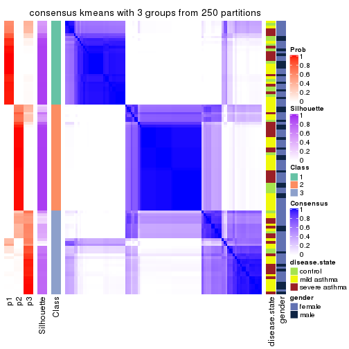</p>

</div>
<div id='tab-ATC-kmeans-consensus-heatmap-3'>
<pre><code class="r">consensus_heatmap(res, k = 4)
</code></pre>

<p></p>

</div>
<div id='tab-ATC-kmeans-consensus-heatmap-4'>
<pre><code class="r">consensus_heatmap(res, k = 5)
</code></pre>

<p></p>

</div>
<div id='tab-ATC-kmeans-consensus-heatmap-5'>
<pre><code class="r">consensus_heatmap(res, k = 6)
</code></pre>

<p></p>

</div>
</div>

Heatmaps for the membership of samples in all partitions to see how consistent they are:


<script>
$( function() {
	$( '#tabs-ATC-kmeans-membership-heatmap' ).tabs();
} );
</script>
<div id='tabs-ATC-kmeans-membership-heatmap'>
<ul>
<li><a href='#tab-ATC-kmeans-membership-heatmap-1'>k = 2</a></li>
<li><a href='#tab-ATC-kmeans-membership-heatmap-2'>k = 3</a></li>
<li><a href='#tab-ATC-kmeans-membership-heatmap-3'>k = 4</a></li>
<li><a href='#tab-ATC-kmeans-membership-heatmap-4'>k = 5</a></li>
<li><a href='#tab-ATC-kmeans-membership-heatmap-5'>k = 6</a></li>
</ul>
<div id='tab-ATC-kmeans-membership-heatmap-1'>
<pre><code class="r">membership_heatmap(res, k = 2)
</code></pre>

<p></p>

</div>
<div id='tab-ATC-kmeans-membership-heatmap-2'>
<pre><code class="r">membership_heatmap(res, k = 3)
</code></pre>

<p></p>

</div>
<div id='tab-ATC-kmeans-membership-heatmap-3'>
<pre><code class="r">membership_heatmap(res, k = 4)
</code></pre>

<p></p>

</div>
<div id='tab-ATC-kmeans-membership-heatmap-4'>
<pre><code class="r">membership_heatmap(res, k = 5)
</code></pre>

<p></p>

</div>
<div id='tab-ATC-kmeans-membership-heatmap-5'>
<pre><code class="r">membership_heatmap(res, k = 6)
</code></pre>

<p></p>

</div>
</div>

As soon as we have had the classes for columns, we can look for signatures
which are significantly different between classes which can be candidate marks
for certain classes. Following are the heatmaps for signatures.


Signature heatmaps where rows are scaled:


<script>
$( function() {
	$( '#tabs-ATC-kmeans-get-signatures' ).tabs();
} );
</script>
<div id='tabs-ATC-kmeans-get-signatures'>
<ul>
<li><a href='#tab-ATC-kmeans-get-signatures-1'>k = 2</a></li>
<li><a href='#tab-ATC-kmeans-get-signatures-2'>k = 3</a></li>
<li><a href='#tab-ATC-kmeans-get-signatures-3'>k = 4</a></li>
<li><a href='#tab-ATC-kmeans-get-signatures-4'>k = 5</a></li>
<li><a href='#tab-ATC-kmeans-get-signatures-5'>k = 6</a></li>
</ul>
<div id='tab-ATC-kmeans-get-signatures-1'>
<pre><code class="r">get_signatures(res, k = 2)
</code></pre>

<p></p>

</div>
<div id='tab-ATC-kmeans-get-signatures-2'>
<pre><code class="r">get_signatures(res, k = 3)
</code></pre>

<p></p>

</div>
<div id='tab-ATC-kmeans-get-signatures-3'>
<pre><code class="r">get_signatures(res, k = 4)
</code></pre>

<p></p>

</div>
<div id='tab-ATC-kmeans-get-signatures-4'>
<pre><code class="r">get_signatures(res, k = 5)
</code></pre>

<p></p>

</div>
<div id='tab-ATC-kmeans-get-signatures-5'>
<pre><code class="r">get_signatures(res, k = 6)
</code></pre>

<p></p>

</div>
</div>


Signature heatmaps where rows are not scaled:


<script>
$( function() {
	$( '#tabs-ATC-kmeans-get-signatures-no-scale' ).tabs();
} );
</script>
<div id='tabs-ATC-kmeans-get-signatures-no-scale'>
<ul>
<li><a href='#tab-ATC-kmeans-get-signatures-no-scale-1'>k = 2</a></li>
<li><a href='#tab-ATC-kmeans-get-signatures-no-scale-2'>k = 3</a></li>
<li><a href='#tab-ATC-kmeans-get-signatures-no-scale-3'>k = 4</a></li>
<li><a href='#tab-ATC-kmeans-get-signatures-no-scale-4'>k = 5</a></li>
<li><a href='#tab-ATC-kmeans-get-signatures-no-scale-5'>k = 6</a></li>
</ul>
<div id='tab-ATC-kmeans-get-signatures-no-scale-1'>
<pre><code class="r">get_signatures(res, k = 2, scale_rows = FALSE)
</code></pre>

<p></p>

</div>
<div id='tab-ATC-kmeans-get-signatures-no-scale-2'>
<pre><code class="r">get_signatures(res, k = 3, scale_rows = FALSE)
</code></pre>

<p></p>

</div>
<div id='tab-ATC-kmeans-get-signatures-no-scale-3'>
<pre><code class="r">get_signatures(res, k = 4, scale_rows = FALSE)
</code></pre>

<p></p>

</div>
<div id='tab-ATC-kmeans-get-signatures-no-scale-4'>
<pre><code class="r">get_signatures(res, k = 5, scale_rows = FALSE)
</code></pre>

<p></p>

</div>
<div id='tab-ATC-kmeans-get-signatures-no-scale-5'>
<pre><code class="r">get_signatures(res, k = 6, scale_rows = FALSE)
</code></pre>

<p></p>

</div>
</div>


Compare the overlap of signatures from different k:

```r
compare_signatures(res)
```

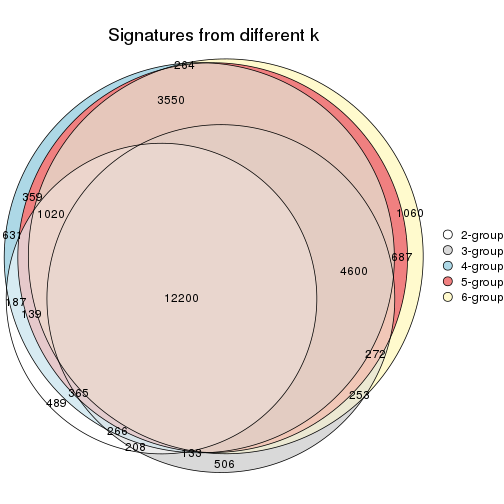

`get_signature()` returns a data frame invisibly. TO get the list of signatures, the function
call should be assigned to a variable explicitly. In following code, if `plot` argument is set
to `FALSE`, no heatmap is plotted while only the differential analysis is performed.

```r
# code only for demonstration
tb = get_signature(res, k = ..., plot = FALSE)
```

An example of the output of `tb` is:

```
#>   which_row         fdr    mean_1    mean_2 scaled_mean_1 scaled_mean_2 km
#> 1        38 0.042760348  8.373488  9.131774    -0.5533452     0.5164555  1
#> 2        40 0.018707592  7.106213  8.469186    -0.6173731     0.5762149  1
#> 3        55 0.019134737 10.221463 11.207825    -0.6159697     0.5749050  1
#> 4        59 0.006059896  5.921854  7.869574    -0.6899429     0.6439467  1
#> 5        60 0.018055526  8.928898 10.211722    -0.6204761     0.5791110  1
#> 6        98 0.009384629 15.714769 14.887706     0.6635654    -0.6193277  2
...
```

The columns in `tb` are:

1. `which_row`: row indices corresponding to the input matrix.
2. `fdr`: FDR for the differential test. 
3. `mean_x`: The mean value in group x.
4. `scaled_mean_x`: The mean value in group x after rows are scaled.
5. `km`: Row groups if k-means clustering is applied to rows.


UMAP plot which shows how samples are separated.


<script>
$( function() {
	$( '#tabs-ATC-kmeans-dimension-reduction' ).tabs();
} );
</script>
<div id='tabs-ATC-kmeans-dimension-reduction'>
<ul>
<li><a href='#tab-ATC-kmeans-dimension-reduction-1'>k = 2</a></li>
<li><a href='#tab-ATC-kmeans-dimension-reduction-2'>k = 3</a></li>
<li><a href='#tab-ATC-kmeans-dimension-reduction-3'>k = 4</a></li>
<li><a href='#tab-ATC-kmeans-dimension-reduction-4'>k = 5</a></li>
<li><a href='#tab-ATC-kmeans-dimension-reduction-5'>k = 6</a></li>
</ul>
<div id='tab-ATC-kmeans-dimension-reduction-1'>
<pre><code class="r">dimension_reduction(res, k = 2, method = &quot;UMAP&quot;)
</code></pre>

<p></p>

</div>
<div id='tab-ATC-kmeans-dimension-reduction-2'>
<pre><code class="r">dimension_reduction(res, k = 3, method = &quot;UMAP&quot;)
</code></pre>

<p></p>

</div>
<div id='tab-ATC-kmeans-dimension-reduction-3'>
<pre><code class="r">dimension_reduction(res, k = 4, method = &quot;UMAP&quot;)
</code></pre>

<p></p>

</div>
<div id='tab-ATC-kmeans-dimension-reduction-4'>
<pre><code class="r">dimension_reduction(res, k = 5, method = &quot;UMAP&quot;)
</code></pre>

<p></p>

</div>
<div id='tab-ATC-kmeans-dimension-reduction-5'>
<pre><code class="r">dimension_reduction(res, k = 6, method = &quot;UMAP&quot;)
</code></pre>

<p></p>

</div>
</div>


Following heatmap shows how subgroups are split when increasing `k`:

```r
collect_classes(res)
```


Test correlation between subgroups and known annotations. If the known
annotation is numeric, one-way ANOVA test is applied, and if the known
annotation is discrete, chi-squared contingency table test is applied.

```r
test_to_known_factors(res)
```

```
#>              n disease.state(p) gender(p) k
#> ATC:kmeans 107            0.235     0.813 2
#> ATC:kmeans  91            0.563     0.964 3
#> ATC:kmeans  94            0.682     0.170 4
#> ATC:kmeans  91            0.697     0.091 5
#> ATC:kmeans  84            0.240     0.211 6
```


If matrix rows can be associated to genes, consider to use `GO_Enrichment(res,
...)` to perform function enrichment for the signature genes.


 

---------------------------------------------------


### ATC:skmeans*


The object with results only for a single top-value method and a single partition method 
can be extracted as:

```r
res = res_list["ATC", "skmeans"]
# you can also extract it by
# res = res_list["ATC:skmeans"]
```

A summary of `res` and all the functions that can be applied to it:

```r
res
```

```
#> A 'ConsensusPartition' object with k = 2, 3, 4, 5, 6.
#>   On a matrix with 38950 rows and 108 columns.
#>   Top rows (1000, 2000, 3000, 4000, 5000) are extracted by 'ATC' method.
#>   Subgroups are detected by 'skmeans' method.
#>   Performed in total 1250 partitions by row resampling.
#>   Best k for subgroups seems to be 5.
#> 
#> Following methods can be applied to this 'ConsensusPartition' object:
#>  [1] "cola_report"             "collect_classes"         "collect_plots"          
#>  [4] "collect_stats"           "colnames"                "compare_signatures"     
#>  [7] "consensus_heatmap"       "dimension_reduction"     "functional_enrichment"  
#> [10] "get_anno_col"            "get_anno"                "get_classes"            
#> [13] "get_consensus"           "get_matrix"              "get_membership"         
#> [16] "get_param"               "get_signatures"          "get_stats"              
#> [19] "is_best_k"               "is_stable_k"             "membership_heatmap"     
#> [22] "ncol"                    "nrow"                    "plot_ecdf"              
#> [25] "rownames"                "select_partition_number" "show"                   
#> [28] "suggest_best_k"          "test_to_known_factors"
```

`collect_plots()` function collects all the plots made from `res` for all `k` (number of partitions)
into one single page to provide an easy and fast comparison between different `k`.

```r
collect_plots(res)
```


The plots are:

- The first row: a plot of the ECDF (Empirical cumulative distribution
  function) curves of the consensus matrix for each `k` and the heatmap of
  predicted classes for each `k`.
- The second row: heatmaps of the consensus matrix for each `k`.
- The third row: heatmaps of the membership matrix for each `k`.
- The fouth row: heatmaps of the signatures for each `k`.

All the plots in panels can be made by individual functions and they are
plotted later in this section.

`select_partition_number()` produces several plots showing different
statistics for choosing "optimized" `k`. There are following statistics:

- ECDF curves of the consensus matrix for each `k`;
- 1-PAC. [The PAC
  score](https://en.wikipedia.org/wiki/Consensus_clustering#Over-interpretation_potential_of_consensus_clustering)
  measures the proportion of the ambiguous subgrouping.
- Mean silhouette score.
- Concordance. The mean probability of fiting the consensus class ids in all
  partitions.
- Area increased. Denote $A_k$ as the area under the ECDF curve for current
  `k`, the area increased is defined as $A_k - A_{k-1}$.
- Rand index. The percent of pairs of samples that are both in a same cluster
  or both are not in a same cluster in the partition of k and k-1.
- Jaccard index. The ratio of pairs of samples are both in a same cluster in
  the partition of k and k-1 and the pairs of samples are both in a same
  cluster in the partition k or k-1.

The detailed explanations of these statistics can be found in [the cola
vignette](http://bioconductor.org/packages/devel/bioc/vignettes/cola/inst/doc/cola.html#toc_13).

Generally speaking, lower PAC score, higher mean silhouette score or higher
concordance corresponds to better partition. Rand index and Jaccard index
measure how similar the current partition is compared to partition with `k-1`.
If they are too similar, we won't accept `k` is better than `k-1`.

```r
select_partition_number(res)
```


The numeric values for all these statistics can be obtained by `get_stats()`.

```r
get_stats(res)
```

```
#>   k 1-PAC mean_silhouette concordance area_increased  Rand Jaccard
#> 2 2 1.000           0.997       0.999         0.5044 0.496   0.496
#> 3 3 0.963           0.956       0.979         0.3261 0.755   0.542
#> 4 4 0.973           0.928       0.970         0.1148 0.885   0.672
#> 5 5 0.926           0.839       0.935         0.0572 0.920   0.708
#> 6 6 0.819           0.716       0.830         0.0461 0.920   0.655
```

`suggest_best_k()` suggests the best $k$ based on these statistics. The rules are as follows:

- All $k$ with Jaccard index larger than 0.95 are removed because the increase of
  the partition number does not provides enough extra information. If all $k$ are removed,
  the best $k$ is assigned by `NA`.
- For $k$ with 1-PAC larger than 0.9, the maximal $k$ is taken as the "best k". Other $k$ is called "optional k".
- If it does not fit the second rule. The $k$ with the highest vote of highest
  1-PAC, mean silhouette and concordance is taken as the "best k".

```r
suggest_best_k(res)
```

```
#> [1] 5
#> attr(,"optional")
#> [1] 2 3 4
```

There is also optional best $k$ = 2 3 4 that is worth to check.

Following shows the table of the partitions (You need to click the **show/hide
code output** link to see it). The membership matrix (columns with name `p*`)
is inferred by
[`clue::cl_consensus()`](https://www.rdocumentation.org/link/cl_consensus?package=clue)
function with the `SE` method. Basically the value in the membership matrix
represents the probability to belong to a certain group. The finall class
label for an item is determined with the group with highest probability it
belongs to.

In `get_classes()` function, the entropy is calculated from the membership
matrix and the silhouette score is calculated from the consensus matrix.


<script>
$( function() {
	$( '#tabs-ATC-skmeans-get-classes' ).tabs();
} );
</script>
<div id='tabs-ATC-skmeans-get-classes'>
<ul>
<li><a href='#tab-ATC-skmeans-get-classes-1'>k = 2</a></li>
<li><a href='#tab-ATC-skmeans-get-classes-2'>k = 3</a></li>
<li><a href='#tab-ATC-skmeans-get-classes-3'>k = 4</a></li>
<li><a href='#tab-ATC-skmeans-get-classes-4'>k = 5</a></li>
<li><a href='#tab-ATC-skmeans-get-classes-5'>k = 6</a></li>
</ul>

<div id='tab-ATC-skmeans-get-classes-1'>
<p><a id='tab-ATC-skmeans-get-classes-1-a' style='color:#0366d6' href='#'>show/hide code output</a></p>
<pre><code class="r">cbind(get_classes(res, k = 2), get_membership(res, k = 2))
</code></pre>

<pre><code>#&gt;            class entropy silhouette    p1    p2
#&gt; GSM1068478     1  0.0000      0.997 1.000 0.000
#&gt; GSM1068479     2  0.0000      1.000 0.000 1.000
#&gt; GSM1068481     1  0.0000      0.997 1.000 0.000
#&gt; GSM1068482     1  0.0000      0.997 1.000 0.000
#&gt; GSM1068483     1  0.0000      0.997 1.000 0.000
#&gt; GSM1068486     1  0.0672      0.989 0.992 0.008
#&gt; GSM1068487     2  0.0000      1.000 0.000 1.000
#&gt; GSM1068488     2  0.0000      1.000 0.000 1.000
#&gt; GSM1068490     2  0.0000      1.000 0.000 1.000
#&gt; GSM1068491     1  0.0000      0.997 1.000 0.000
#&gt; GSM1068492     2  0.0000      1.000 0.000 1.000
#&gt; GSM1068493     1  0.0000      0.997 1.000 0.000
#&gt; GSM1068494     1  0.0000      0.997 1.000 0.000
#&gt; GSM1068495     1  0.0000      0.997 1.000 0.000
#&gt; GSM1068496     1  0.0000      0.997 1.000 0.000
#&gt; GSM1068498     1  0.0000      0.997 1.000 0.000
#&gt; GSM1068499     1  0.0000      0.997 1.000 0.000
#&gt; GSM1068500     1  0.0000      0.997 1.000 0.000
#&gt; GSM1068502     2  0.0000      1.000 0.000 1.000
#&gt; GSM1068503     2  0.0000      1.000 0.000 1.000
#&gt; GSM1068505     2  0.0000      1.000 0.000 1.000
#&gt; GSM1068506     2  0.0000      1.000 0.000 1.000
#&gt; GSM1068507     2  0.0000      1.000 0.000 1.000
#&gt; GSM1068508     2  0.0000      1.000 0.000 1.000
#&gt; GSM1068510     2  0.0000      1.000 0.000 1.000
#&gt; GSM1068512     2  0.0000      1.000 0.000 1.000
#&gt; GSM1068513     2  0.0000      1.000 0.000 1.000
#&gt; GSM1068514     2  0.0000      1.000 0.000 1.000
#&gt; GSM1068517     1  0.0000      0.997 1.000 0.000
#&gt; GSM1068518     1  0.0000      0.997 1.000 0.000
#&gt; GSM1068520     1  0.0000      0.997 1.000 0.000
#&gt; GSM1068521     1  0.0000      0.997 1.000 0.000
#&gt; GSM1068522     2  0.0000      1.000 0.000 1.000
#&gt; GSM1068524     2  0.0000      1.000 0.000 1.000
#&gt; GSM1068527     2  0.0000      1.000 0.000 1.000
#&gt; GSM1068480     1  0.0000      0.997 1.000 0.000
#&gt; GSM1068484     2  0.0000      1.000 0.000 1.000
#&gt; GSM1068485     1  0.0000      0.997 1.000 0.000
#&gt; GSM1068489     2  0.0000      1.000 0.000 1.000
#&gt; GSM1068497     1  0.0000      0.997 1.000 0.000
#&gt; GSM1068501     2  0.0000      1.000 0.000 1.000
#&gt; GSM1068504     2  0.0000      1.000 0.000 1.000
#&gt; GSM1068509     1  0.0000      0.997 1.000 0.000
#&gt; GSM1068511     2  0.0000      1.000 0.000 1.000
#&gt; GSM1068515     1  0.0000      0.997 1.000 0.000
#&gt; GSM1068516     1  0.0000      0.997 1.000 0.000
#&gt; GSM1068519     1  0.0000      0.997 1.000 0.000
#&gt; GSM1068523     2  0.0000      1.000 0.000 1.000
#&gt; GSM1068525     2  0.0000      1.000 0.000 1.000
#&gt; GSM1068526     2  0.0000      1.000 0.000 1.000
#&gt; GSM1068458     1  0.0000      0.997 1.000 0.000
#&gt; GSM1068459     1  0.0000      0.997 1.000 0.000
#&gt; GSM1068460     1  0.0000      0.997 1.000 0.000
#&gt; GSM1068461     1  0.0000      0.997 1.000 0.000
#&gt; GSM1068464     2  0.0000      1.000 0.000 1.000
#&gt; GSM1068468     1  0.0000      0.997 1.000 0.000
#&gt; GSM1068472     1  0.0000      0.997 1.000 0.000
#&gt; GSM1068473     2  0.0000      1.000 0.000 1.000
#&gt; GSM1068474     2  0.0000      1.000 0.000 1.000
#&gt; GSM1068476     2  0.0000      1.000 0.000 1.000
#&gt; GSM1068477     2  0.0000      1.000 0.000 1.000
#&gt; GSM1068462     1  0.0000      0.997 1.000 0.000
#&gt; GSM1068463     1  0.0000      0.997 1.000 0.000
#&gt; GSM1068465     1  0.0000      0.997 1.000 0.000
#&gt; GSM1068466     1  0.0000      0.997 1.000 0.000
#&gt; GSM1068467     1  0.0000      0.997 1.000 0.000
#&gt; GSM1068469     1  0.0000      0.997 1.000 0.000
#&gt; GSM1068470     2  0.0000      1.000 0.000 1.000
#&gt; GSM1068471     2  0.0000      1.000 0.000 1.000
#&gt; GSM1068475     2  0.0000      1.000 0.000 1.000
#&gt; GSM1068528     1  0.0000      0.997 1.000 0.000
#&gt; GSM1068531     1  0.0000      0.997 1.000 0.000
#&gt; GSM1068532     1  0.0000      0.997 1.000 0.000
#&gt; GSM1068533     1  0.0000      0.997 1.000 0.000
#&gt; GSM1068535     2  0.0000      1.000 0.000 1.000
#&gt; GSM1068537     1  0.0000      0.997 1.000 0.000
#&gt; GSM1068538     1  0.0000      0.997 1.000 0.000
#&gt; GSM1068539     1  0.0000      0.997 1.000 0.000
#&gt; GSM1068540     1  0.0000      0.997 1.000 0.000
#&gt; GSM1068542     2  0.0000      1.000 0.000 1.000
#&gt; GSM1068543     2  0.0000      1.000 0.000 1.000
#&gt; GSM1068544     1  0.0000      0.997 1.000 0.000
#&gt; GSM1068545     2  0.0000      1.000 0.000 1.000
#&gt; GSM1068546     1  0.0000      0.997 1.000 0.000
#&gt; GSM1068547     1  0.0000      0.997 1.000 0.000
#&gt; GSM1068548     2  0.0000      1.000 0.000 1.000
#&gt; GSM1068549     1  0.0000      0.997 1.000 0.000
#&gt; GSM1068550     2  0.0000      1.000 0.000 1.000
#&gt; GSM1068551     2  0.0000      1.000 0.000 1.000
#&gt; GSM1068552     2  0.0000      1.000 0.000 1.000
#&gt; GSM1068555     2  0.0000      1.000 0.000 1.000
#&gt; GSM1068556     2  0.0000      1.000 0.000 1.000
#&gt; GSM1068557     2  0.0000      1.000 0.000 1.000
#&gt; GSM1068560     2  0.0000      1.000 0.000 1.000
#&gt; GSM1068561     2  0.0000      1.000 0.000 1.000
#&gt; GSM1068562     2  0.0000      1.000 0.000 1.000
#&gt; GSM1068563     2  0.0000      1.000 0.000 1.000
#&gt; GSM1068565     2  0.0000      1.000 0.000 1.000
#&gt; GSM1068529     2  0.0000      1.000 0.000 1.000
#&gt; GSM1068530     1  0.0000      0.997 1.000 0.000
#&gt; GSM1068534     2  0.0000      1.000 0.000 1.000
#&gt; GSM1068536     1  0.0000      0.997 1.000 0.000
#&gt; GSM1068541     1  0.0000      0.997 1.000 0.000
#&gt; GSM1068553     2  0.0000      1.000 0.000 1.000
#&gt; GSM1068554     2  0.0000      1.000 0.000 1.000
#&gt; GSM1068558     2  0.0000      1.000 0.000 1.000
#&gt; GSM1068559     1  0.5842      0.837 0.860 0.140
#&gt; GSM1068564     2  0.0000      1.000 0.000 1.000
</code></pre>

<script>
$('#tab-ATC-skmeans-get-classes-1-a').parent().next().next().hide();
$('#tab-ATC-skmeans-get-classes-1-a').click(function(){
  $('#tab-ATC-skmeans-get-classes-1-a').parent().next().next().toggle();
  return(false);
});
</script>
</div>

<div id='tab-ATC-skmeans-get-classes-2'>
<p><a id='tab-ATC-skmeans-get-classes-2-a' style='color:#0366d6' href='#'>show/hide code output</a></p>
<pre><code class="r">cbind(get_classes(res, k = 3), get_membership(res, k = 3))
</code></pre>

<pre><code>#&gt;            class entropy silhouette    p1    p2    p3
#&gt; GSM1068478     1   0.296      0.888 0.900 0.000 0.100
#&gt; GSM1068479     2   0.000      1.000 0.000 1.000 0.000
#&gt; GSM1068481     1   0.489      0.717 0.772 0.000 0.228
#&gt; GSM1068482     1   0.254      0.908 0.920 0.000 0.080
#&gt; GSM1068483     1   0.000      0.978 1.000 0.000 0.000
#&gt; GSM1068486     3   0.000      0.952 0.000 0.000 1.000
#&gt; GSM1068487     2   0.000      1.000 0.000 1.000 0.000
#&gt; GSM1068488     3   0.000      0.952 0.000 0.000 1.000
#&gt; GSM1068490     2   0.000      1.000 0.000 1.000 0.000
#&gt; GSM1068491     1   0.000      0.978 1.000 0.000 0.000
#&gt; GSM1068492     2   0.000      1.000 0.000 1.000 0.000
#&gt; GSM1068493     3   0.263      0.886 0.084 0.000 0.916
#&gt; GSM1068494     3   0.000      0.952 0.000 0.000 1.000
#&gt; GSM1068495     3   0.000      0.952 0.000 0.000 1.000
#&gt; GSM1068496     1   0.000      0.978 1.000 0.000 0.000
#&gt; GSM1068498     1   0.000      0.978 1.000 0.000 0.000
#&gt; GSM1068499     1   0.000      0.978 1.000 0.000 0.000
#&gt; GSM1068500     1   0.000      0.978 1.000 0.000 0.000
#&gt; GSM1068502     2   0.000      1.000 0.000 1.000 0.000
#&gt; GSM1068503     2   0.000      1.000 0.000 1.000 0.000
#&gt; GSM1068505     2   0.000      1.000 0.000 1.000 0.000
#&gt; GSM1068506     2   0.000      1.000 0.000 1.000 0.000
#&gt; GSM1068507     3   0.559      0.595 0.000 0.304 0.696
#&gt; GSM1068508     3   0.280      0.885 0.000 0.092 0.908
#&gt; GSM1068510     3   0.000      0.952 0.000 0.000 1.000
#&gt; GSM1068512     2   0.000      1.000 0.000 1.000 0.000
#&gt; GSM1068513     3   0.288      0.883 0.000 0.096 0.904
#&gt; GSM1068514     2   0.000      1.000 0.000 1.000 0.000
#&gt; GSM1068517     1   0.271      0.900 0.912 0.000 0.088
#&gt; GSM1068518     1   0.590      0.471 0.648 0.000 0.352
#&gt; GSM1068520     1   0.000      0.978 1.000 0.000 0.000
#&gt; GSM1068521     1   0.000      0.978 1.000 0.000 0.000
#&gt; GSM1068522     2   0.000      1.000 0.000 1.000 0.000
#&gt; GSM1068524     3   0.000      0.952 0.000 0.000 1.000
#&gt; GSM1068527     2   0.000      1.000 0.000 1.000 0.000
#&gt; GSM1068480     3   0.341      0.845 0.124 0.000 0.876
#&gt; GSM1068484     2   0.000      1.000 0.000 1.000 0.000
#&gt; GSM1068485     1   0.000      0.978 1.000 0.000 0.000
#&gt; GSM1068489     2   0.000      1.000 0.000 1.000 0.000
#&gt; GSM1068497     3   0.406      0.795 0.164 0.000 0.836
#&gt; GSM1068501     2   0.000      1.000 0.000 1.000 0.000
#&gt; GSM1068504     3   0.000      0.952 0.000 0.000 1.000
#&gt; GSM1068509     1   0.000      0.978 1.000 0.000 0.000
#&gt; GSM1068511     2   0.000      1.000 0.000 1.000 0.000
#&gt; GSM1068515     1   0.000      0.978 1.000 0.000 0.000
#&gt; GSM1068516     3   0.000      0.952 0.000 0.000 1.000
#&gt; GSM1068519     1   0.000      0.978 1.000 0.000 0.000
#&gt; GSM1068523     3   0.000      0.952 0.000 0.000 1.000
#&gt; GSM1068525     3   0.382      0.835 0.000 0.148 0.852
#&gt; GSM1068526     2   0.000      1.000 0.000 1.000 0.000
#&gt; GSM1068458     1   0.000      0.978 1.000 0.000 0.000
#&gt; GSM1068459     1   0.000      0.978 1.000 0.000 0.000
#&gt; GSM1068460     1   0.000      0.978 1.000 0.000 0.000
#&gt; GSM1068461     1   0.000      0.978 1.000 0.000 0.000
#&gt; GSM1068464     2   0.000      1.000 0.000 1.000 0.000
#&gt; GSM1068468     1   0.000      0.978 1.000 0.000 0.000
#&gt; GSM1068472     1   0.000      0.978 1.000 0.000 0.000
#&gt; GSM1068473     2   0.000      1.000 0.000 1.000 0.000
#&gt; GSM1068474     2   0.000      1.000 0.000 1.000 0.000
#&gt; GSM1068476     3   0.000      0.952 0.000 0.000 1.000
#&gt; GSM1068477     3   0.000      0.952 0.000 0.000 1.000
#&gt; GSM1068462     1   0.000      0.978 1.000 0.000 0.000
#&gt; GSM1068463     1   0.000      0.978 1.000 0.000 0.000
#&gt; GSM1068465     1   0.000      0.978 1.000 0.000 0.000
#&gt; GSM1068466     1   0.000      0.978 1.000 0.000 0.000
#&gt; GSM1068467     1   0.000      0.978 1.000 0.000 0.000
#&gt; GSM1068469     1   0.000      0.978 1.000 0.000 0.000
#&gt; GSM1068470     3   0.475      0.756 0.000 0.216 0.784
#&gt; GSM1068471     2   0.000      1.000 0.000 1.000 0.000
#&gt; GSM1068475     2   0.000      1.000 0.000 1.000 0.000
#&gt; GSM1068528     1   0.000      0.978 1.000 0.000 0.000
#&gt; GSM1068531     1   0.000      0.978 1.000 0.000 0.000
#&gt; GSM1068532     1   0.000      0.978 1.000 0.000 0.000
#&gt; GSM1068533     1   0.000      0.978 1.000 0.000 0.000
#&gt; GSM1068535     2   0.000      1.000 0.000 1.000 0.000
#&gt; GSM1068537     1   0.000      0.978 1.000 0.000 0.000
#&gt; GSM1068538     1   0.000      0.978 1.000 0.000 0.000
#&gt; GSM1068539     3   0.000      0.952 0.000 0.000 1.000
#&gt; GSM1068540     1   0.000      0.978 1.000 0.000 0.000
#&gt; GSM1068542     2   0.000      1.000 0.000 1.000 0.000
#&gt; GSM1068543     3   0.000      0.952 0.000 0.000 1.000
#&gt; GSM1068544     1   0.000      0.978 1.000 0.000 0.000
#&gt; GSM1068545     2   0.000      1.000 0.000 1.000 0.000
#&gt; GSM1068546     3   0.000      0.952 0.000 0.000 1.000
#&gt; GSM1068547     1   0.000      0.978 1.000 0.000 0.000
#&gt; GSM1068548     2   0.000      1.000 0.000 1.000 0.000
#&gt; GSM1068549     1   0.000      0.978 1.000 0.000 0.000
#&gt; GSM1068550     2   0.000      1.000 0.000 1.000 0.000
#&gt; GSM1068551     2   0.000      1.000 0.000 1.000 0.000
#&gt; GSM1068552     2   0.000      1.000 0.000 1.000 0.000
#&gt; GSM1068555     3   0.000      0.952 0.000 0.000 1.000
#&gt; GSM1068556     2   0.000      1.000 0.000 1.000 0.000
#&gt; GSM1068557     3   0.000      0.952 0.000 0.000 1.000
#&gt; GSM1068560     3   0.000      0.952 0.000 0.000 1.000
#&gt; GSM1068561     3   0.000      0.952 0.000 0.000 1.000
#&gt; GSM1068562     3   0.000      0.952 0.000 0.000 1.000
#&gt; GSM1068563     2   0.000      1.000 0.000 1.000 0.000
#&gt; GSM1068565     3   0.480      0.748 0.000 0.220 0.780
#&gt; GSM1068529     3   0.000      0.952 0.000 0.000 1.000
#&gt; GSM1068530     1   0.000      0.978 1.000 0.000 0.000
#&gt; GSM1068534     2   0.000      1.000 0.000 1.000 0.000
#&gt; GSM1068536     3   0.000      0.952 0.000 0.000 1.000
#&gt; GSM1068541     1   0.000      0.978 1.000 0.000 0.000
#&gt; GSM1068553     2   0.000      1.000 0.000 1.000 0.000
#&gt; GSM1068554     2   0.000      1.000 0.000 1.000 0.000
#&gt; GSM1068558     3   0.000      0.952 0.000 0.000 1.000
#&gt; GSM1068559     3   0.000      0.952 0.000 0.000 1.000
#&gt; GSM1068564     2   0.000      1.000 0.000 1.000 0.000
</code></pre>

<script>
$('#tab-ATC-skmeans-get-classes-2-a').parent().next().next().hide();
$('#tab-ATC-skmeans-get-classes-2-a').click(function(){
  $('#tab-ATC-skmeans-get-classes-2-a').parent().next().next().toggle();
  return(false);
});
</script>
</div>

<div id='tab-ATC-skmeans-get-classes-3'>
<p><a id='tab-ATC-skmeans-get-classes-3-a' style='color:#0366d6' href='#'>show/hide code output</a></p>
<pre><code class="r">cbind(get_classes(res, k = 4), get_membership(res, k = 4))
</code></pre>

<pre><code>#&gt;            class entropy silhouette    p1    p2    p3    p4
#&gt; GSM1068478     3  0.0000      0.907 0.000 0.000 1.000 0.000
#&gt; GSM1068479     4  0.0804      0.968 0.008 0.012 0.000 0.980
#&gt; GSM1068481     3  0.0188      0.907 0.004 0.000 0.996 0.000
#&gt; GSM1068482     3  0.0000      0.907 0.000 0.000 1.000 0.000
#&gt; GSM1068483     1  0.0336      0.966 0.992 0.000 0.008 0.000
#&gt; GSM1068486     3  0.0469      0.904 0.000 0.012 0.988 0.000
#&gt; GSM1068487     4  0.0000      0.987 0.000 0.000 0.000 1.000
#&gt; GSM1068488     2  0.0000      0.983 0.000 1.000 0.000 0.000
#&gt; GSM1068490     4  0.0000      0.987 0.000 0.000 0.000 1.000
#&gt; GSM1068491     1  0.0000      0.967 1.000 0.000 0.000 0.000
#&gt; GSM1068492     4  0.0000      0.987 0.000 0.000 0.000 1.000
#&gt; GSM1068493     3  0.0000      0.907 0.000 0.000 1.000 0.000
#&gt; GSM1068494     3  0.4697      0.452 0.000 0.356 0.644 0.000
#&gt; GSM1068495     2  0.0469      0.976 0.000 0.988 0.012 0.000
#&gt; GSM1068496     3  0.0469      0.906 0.012 0.000 0.988 0.000
#&gt; GSM1068498     1  0.0336      0.964 0.992 0.000 0.008 0.000
#&gt; GSM1068499     1  0.0469      0.966 0.988 0.000 0.012 0.000
#&gt; GSM1068500     3  0.0469      0.906 0.012 0.000 0.988 0.000
#&gt; GSM1068502     4  0.0000      0.987 0.000 0.000 0.000 1.000
#&gt; GSM1068503     4  0.0000      0.987 0.000 0.000 0.000 1.000
#&gt; GSM1068505     4  0.0000      0.987 0.000 0.000 0.000 1.000
#&gt; GSM1068506     4  0.0000      0.987 0.000 0.000 0.000 1.000
#&gt; GSM1068507     2  0.0000      0.983 0.000 1.000 0.000 0.000
#&gt; GSM1068508     2  0.0000      0.983 0.000 1.000 0.000 0.000
#&gt; GSM1068510     2  0.0000      0.983 0.000 1.000 0.000 0.000
#&gt; GSM1068512     4  0.0000      0.987 0.000 0.000 0.000 1.000
#&gt; GSM1068513     2  0.0000      0.983 0.000 1.000 0.000 0.000
#&gt; GSM1068514     4  0.0000      0.987 0.000 0.000 0.000 1.000
#&gt; GSM1068517     1  0.0469      0.961 0.988 0.000 0.012 0.000
#&gt; GSM1068518     1  0.0469      0.961 0.988 0.000 0.012 0.000
#&gt; GSM1068520     1  0.0336      0.966 0.992 0.000 0.008 0.000
#&gt; GSM1068521     1  0.0188      0.966 0.996 0.000 0.004 0.000
#&gt; GSM1068522     4  0.0000      0.987 0.000 0.000 0.000 1.000
#&gt; GSM1068524     2  0.0000      0.983 0.000 1.000 0.000 0.000
#&gt; GSM1068527     4  0.0000      0.987 0.000 0.000 0.000 1.000
#&gt; GSM1068480     3  0.1557      0.877 0.000 0.056 0.944 0.000
#&gt; GSM1068484     4  0.0000      0.987 0.000 0.000 0.000 1.000
#&gt; GSM1068485     1  0.0336      0.966 0.992 0.000 0.008 0.000
#&gt; GSM1068489     4  0.0000      0.987 0.000 0.000 0.000 1.000
#&gt; GSM1068497     3  0.4382      0.574 0.000 0.296 0.704 0.000
#&gt; GSM1068501     4  0.0000      0.987 0.000 0.000 0.000 1.000
#&gt; GSM1068504     2  0.0000      0.983 0.000 1.000 0.000 0.000
#&gt; GSM1068509     1  0.0336      0.966 0.992 0.000 0.008 0.000
#&gt; GSM1068511     4  0.0000      0.987 0.000 0.000 0.000 1.000
#&gt; GSM1068515     1  0.0188      0.966 0.996 0.000 0.004 0.000
#&gt; GSM1068516     2  0.0469      0.976 0.000 0.988 0.012 0.000
#&gt; GSM1068519     1  0.0336      0.966 0.992 0.000 0.008 0.000
#&gt; GSM1068523     2  0.0000      0.983 0.000 1.000 0.000 0.000
#&gt; GSM1068525     2  0.0000      0.983 0.000 1.000 0.000 0.000
#&gt; GSM1068526     4  0.0188      0.983 0.000 0.004 0.000 0.996
#&gt; GSM1068458     1  0.0000      0.967 1.000 0.000 0.000 0.000
#&gt; GSM1068459     3  0.0336      0.906 0.008 0.000 0.992 0.000
#&gt; GSM1068460     1  0.0188      0.966 0.996 0.000 0.004 0.000
#&gt; GSM1068461     1  0.0188      0.966 0.996 0.000 0.004 0.000
#&gt; GSM1068464     4  0.0000      0.987 0.000 0.000 0.000 1.000
#&gt; GSM1068468     1  0.0000      0.967 1.000 0.000 0.000 0.000
#&gt; GSM1068472     1  0.0000      0.967 1.000 0.000 0.000 0.000
#&gt; GSM1068473     4  0.0000      0.987 0.000 0.000 0.000 1.000
#&gt; GSM1068474     4  0.0000      0.987 0.000 0.000 0.000 1.000
#&gt; GSM1068476     2  0.0000      0.983 0.000 1.000 0.000 0.000
#&gt; GSM1068477     2  0.0336      0.977 0.008 0.992 0.000 0.000
#&gt; GSM1068462     1  0.0188      0.966 0.996 0.000 0.004 0.000
#&gt; GSM1068463     3  0.3801      0.672 0.220 0.000 0.780 0.000
#&gt; GSM1068465     1  0.0000      0.967 1.000 0.000 0.000 0.000
#&gt; GSM1068466     1  0.0336      0.966 0.992 0.000 0.008 0.000
#&gt; GSM1068467     1  0.0188      0.966 0.996 0.000 0.004 0.000
#&gt; GSM1068469     1  0.0000      0.967 1.000 0.000 0.000 0.000
#&gt; GSM1068470     2  0.0000      0.983 0.000 1.000 0.000 0.000
#&gt; GSM1068471     4  0.0000      0.987 0.000 0.000 0.000 1.000
#&gt; GSM1068475     4  0.0000      0.987 0.000 0.000 0.000 1.000
#&gt; GSM1068528     1  0.0469      0.966 0.988 0.000 0.012 0.000
#&gt; GSM1068531     3  0.0469      0.906 0.012 0.000 0.988 0.000
#&gt; GSM1068532     1  0.0336      0.966 0.992 0.000 0.008 0.000
#&gt; GSM1068533     1  0.4989      0.142 0.528 0.000 0.472 0.000
#&gt; GSM1068535     3  0.4877      0.282 0.000 0.000 0.592 0.408
#&gt; GSM1068537     1  0.4643      0.480 0.656 0.000 0.344 0.000
#&gt; GSM1068538     1  0.0336      0.966 0.992 0.000 0.008 0.000
#&gt; GSM1068539     2  0.0469      0.976 0.000 0.988 0.012 0.000
#&gt; GSM1068540     3  0.0469      0.906 0.012 0.000 0.988 0.000
#&gt; GSM1068542     4  0.0000      0.987 0.000 0.000 0.000 1.000
#&gt; GSM1068543     2  0.0000      0.983 0.000 1.000 0.000 0.000
#&gt; GSM1068544     1  0.0469      0.966 0.988 0.000 0.012 0.000
#&gt; GSM1068545     4  0.0000      0.987 0.000 0.000 0.000 1.000
#&gt; GSM1068546     3  0.0469      0.904 0.000 0.012 0.988 0.000
#&gt; GSM1068547     1  0.0000      0.967 1.000 0.000 0.000 0.000
#&gt; GSM1068548     4  0.0000      0.987 0.000 0.000 0.000 1.000
#&gt; GSM1068549     3  0.0000      0.907 0.000 0.000 1.000 0.000
#&gt; GSM1068550     4  0.0000      0.987 0.000 0.000 0.000 1.000
#&gt; GSM1068551     2  0.3172      0.779 0.000 0.840 0.000 0.160
#&gt; GSM1068552     4  0.0000      0.987 0.000 0.000 0.000 1.000
#&gt; GSM1068555     2  0.0000      0.983 0.000 1.000 0.000 0.000
#&gt; GSM1068556     4  0.0000      0.987 0.000 0.000 0.000 1.000
#&gt; GSM1068557     2  0.0000      0.983 0.000 1.000 0.000 0.000
#&gt; GSM1068560     2  0.0000      0.983 0.000 1.000 0.000 0.000
#&gt; GSM1068561     2  0.0188      0.981 0.000 0.996 0.004 0.000
#&gt; GSM1068562     2  0.0000      0.983 0.000 1.000 0.000 0.000
#&gt; GSM1068563     4  0.0000      0.987 0.000 0.000 0.000 1.000
#&gt; GSM1068565     2  0.0000      0.983 0.000 1.000 0.000 0.000
#&gt; GSM1068529     2  0.3074      0.804 0.000 0.848 0.152 0.000
#&gt; GSM1068530     1  0.0336      0.966 0.992 0.000 0.008 0.000
#&gt; GSM1068534     4  0.4804      0.347 0.000 0.000 0.384 0.616
#&gt; GSM1068536     3  0.1557      0.877 0.000 0.056 0.944 0.000
#&gt; GSM1068541     1  0.0000      0.967 1.000 0.000 0.000 0.000
#&gt; GSM1068553     4  0.0000      0.987 0.000 0.000 0.000 1.000
#&gt; GSM1068554     4  0.0000      0.987 0.000 0.000 0.000 1.000
#&gt; GSM1068558     2  0.0000      0.983 0.000 1.000 0.000 0.000
#&gt; GSM1068559     2  0.0188      0.981 0.000 0.996 0.004 0.000
#&gt; GSM1068564     4  0.0000      0.987 0.000 0.000 0.000 1.000
</code></pre>

<script>
$('#tab-ATC-skmeans-get-classes-3-a').parent().next().next().hide();
$('#tab-ATC-skmeans-get-classes-3-a').click(function(){
  $('#tab-ATC-skmeans-get-classes-3-a').parent().next().next().toggle();
  return(false);
});
</script>
</div>

<div id='tab-ATC-skmeans-get-classes-4'>
<p><a id='tab-ATC-skmeans-get-classes-4-a' style='color:#0366d6' href='#'>show/hide code output</a></p>
<pre><code class="r">cbind(get_classes(res, k = 5), get_membership(res, k = 5))
</code></pre>

<pre><code>#&gt;            class entropy silhouette    p1    p2    p3    p4    p5
#&gt; GSM1068478     3  0.0290    0.89656 0.000 0.000 0.992 0.000 0.008
#&gt; GSM1068479     4  0.1173    0.96796 0.004 0.020 0.000 0.964 0.012
#&gt; GSM1068481     3  0.0162    0.89778 0.000 0.000 0.996 0.000 0.004
#&gt; GSM1068482     5  0.1082    0.83335 0.008 0.000 0.028 0.000 0.964
#&gt; GSM1068483     1  0.0290    0.86912 0.992 0.000 0.008 0.000 0.000
#&gt; GSM1068486     3  0.0404    0.89529 0.000 0.000 0.988 0.000 0.012
#&gt; GSM1068487     4  0.0290    0.99143 0.000 0.000 0.000 0.992 0.008
#&gt; GSM1068488     2  0.0000    0.95280 0.000 1.000 0.000 0.000 0.000
#&gt; GSM1068490     4  0.0290    0.99143 0.000 0.000 0.000 0.992 0.008
#&gt; GSM1068491     1  0.0162    0.86726 0.996 0.000 0.000 0.000 0.004
#&gt; GSM1068492     4  0.0290    0.99143 0.000 0.000 0.000 0.992 0.008
#&gt; GSM1068493     3  0.0880    0.88103 0.000 0.000 0.968 0.000 0.032
#&gt; GSM1068494     5  0.0693    0.84008 0.000 0.008 0.012 0.000 0.980
#&gt; GSM1068495     5  0.0609    0.83964 0.000 0.020 0.000 0.000 0.980
#&gt; GSM1068496     3  0.0000    0.89839 0.000 0.000 1.000 0.000 0.000
#&gt; GSM1068498     5  0.0880    0.83512 0.032 0.000 0.000 0.000 0.968
#&gt; GSM1068499     1  0.4305    0.00639 0.512 0.000 0.000 0.000 0.488
#&gt; GSM1068500     3  0.0000    0.89839 0.000 0.000 1.000 0.000 0.000
#&gt; GSM1068502     4  0.0290    0.99143 0.000 0.000 0.000 0.992 0.008
#&gt; GSM1068503     4  0.0290    0.99143 0.000 0.000 0.000 0.992 0.008
#&gt; GSM1068505     4  0.0579    0.98611 0.000 0.008 0.000 0.984 0.008
#&gt; GSM1068506     4  0.0290    0.98987 0.000 0.000 0.000 0.992 0.008
#&gt; GSM1068507     2  0.0451    0.94733 0.000 0.988 0.000 0.008 0.004
#&gt; GSM1068508     2  0.0404    0.94837 0.000 0.988 0.000 0.000 0.012
#&gt; GSM1068510     2  0.0000    0.95280 0.000 1.000 0.000 0.000 0.000
#&gt; GSM1068512     4  0.0579    0.98611 0.000 0.008 0.000 0.984 0.008
#&gt; GSM1068513     2  0.0000    0.95280 0.000 1.000 0.000 0.000 0.000
#&gt; GSM1068514     4  0.0290    0.98987 0.000 0.000 0.000 0.992 0.008
#&gt; GSM1068517     5  0.0794    0.83712 0.028 0.000 0.000 0.000 0.972
#&gt; GSM1068518     5  0.0794    0.83712 0.028 0.000 0.000 0.000 0.972
#&gt; GSM1068520     1  0.0290    0.86912 0.992 0.000 0.008 0.000 0.000
#&gt; GSM1068521     1  0.0162    0.86698 0.996 0.000 0.000 0.000 0.004
#&gt; GSM1068522     4  0.0000    0.99153 0.000 0.000 0.000 1.000 0.000
#&gt; GSM1068524     2  0.0000    0.95280 0.000 1.000 0.000 0.000 0.000
#&gt; GSM1068527     4  0.0579    0.98611 0.000 0.008 0.000 0.984 0.008
#&gt; GSM1068480     5  0.0693    0.84008 0.000 0.008 0.012 0.000 0.980
#&gt; GSM1068484     4  0.0290    0.99143 0.000 0.000 0.000 0.992 0.008
#&gt; GSM1068485     1  0.0162    0.86903 0.996 0.000 0.004 0.000 0.000
#&gt; GSM1068489     4  0.0579    0.98611 0.000 0.008 0.000 0.984 0.008
#&gt; GSM1068497     5  0.0693    0.84008 0.000 0.008 0.012 0.000 0.980
#&gt; GSM1068501     4  0.0290    0.98987 0.000 0.000 0.000 0.992 0.008
#&gt; GSM1068504     2  0.0290    0.94971 0.000 0.992 0.000 0.000 0.008
#&gt; GSM1068509     1  0.0290    0.86912 0.992 0.000 0.008 0.000 0.000
#&gt; GSM1068511     4  0.0290    0.98987 0.000 0.000 0.000 0.992 0.008
#&gt; GSM1068515     1  0.0162    0.86698 0.996 0.000 0.000 0.000 0.004
#&gt; GSM1068516     5  0.0609    0.83964 0.000 0.020 0.000 0.000 0.980
#&gt; GSM1068519     1  0.0290    0.86912 0.992 0.000 0.008 0.000 0.000
#&gt; GSM1068523     2  0.0000    0.95280 0.000 1.000 0.000 0.000 0.000
#&gt; GSM1068525     2  0.0000    0.95280 0.000 1.000 0.000 0.000 0.000
#&gt; GSM1068526     2  0.4455    0.30561 0.000 0.588 0.000 0.404 0.008
#&gt; GSM1068458     1  0.0000    0.86851 1.000 0.000 0.000 0.000 0.000
#&gt; GSM1068459     3  0.0000    0.89839 0.000 0.000 1.000 0.000 0.000
#&gt; GSM1068460     1  0.4278    0.16332 0.548 0.000 0.000 0.000 0.452
#&gt; GSM1068461     5  0.4300    0.02926 0.476 0.000 0.000 0.000 0.524
#&gt; GSM1068464     4  0.0290    0.99143 0.000 0.000 0.000 0.992 0.008
#&gt; GSM1068468     1  0.0000    0.86851 1.000 0.000 0.000 0.000 0.000
#&gt; GSM1068472     1  0.0000    0.86851 1.000 0.000 0.000 0.000 0.000
#&gt; GSM1068473     4  0.0000    0.99153 0.000 0.000 0.000 1.000 0.000
#&gt; GSM1068474     4  0.0290    0.99143 0.000 0.000 0.000 0.992 0.008
#&gt; GSM1068476     2  0.0162    0.95137 0.000 0.996 0.000 0.000 0.004
#&gt; GSM1068477     2  0.0880    0.93520 0.000 0.968 0.000 0.000 0.032
#&gt; GSM1068462     1  0.3913    0.47605 0.676 0.000 0.000 0.000 0.324
#&gt; GSM1068463     3  0.3837    0.49520 0.308 0.000 0.692 0.000 0.000
#&gt; GSM1068465     1  0.0290    0.86912 0.992 0.000 0.008 0.000 0.000
#&gt; GSM1068466     1  0.0290    0.86912 0.992 0.000 0.008 0.000 0.000
#&gt; GSM1068467     1  0.4045    0.40627 0.644 0.000 0.000 0.000 0.356
#&gt; GSM1068469     1  0.0000    0.86851 1.000 0.000 0.000 0.000 0.000
#&gt; GSM1068470     2  0.0290    0.94971 0.000 0.992 0.000 0.000 0.008
#&gt; GSM1068471     4  0.0290    0.99143 0.000 0.000 0.000 0.992 0.008
#&gt; GSM1068475     4  0.0290    0.99143 0.000 0.000 0.000 0.992 0.008
#&gt; GSM1068528     1  0.3715    0.57368 0.736 0.000 0.004 0.000 0.260
#&gt; GSM1068531     3  0.0000    0.89839 0.000 0.000 1.000 0.000 0.000
#&gt; GSM1068532     1  0.0290    0.86912 0.992 0.000 0.008 0.000 0.000
#&gt; GSM1068533     1  0.4219    0.28379 0.584 0.000 0.416 0.000 0.000
#&gt; GSM1068535     3  0.3487    0.68458 0.000 0.000 0.780 0.212 0.008
#&gt; GSM1068537     1  0.4302    0.06705 0.520 0.000 0.480 0.000 0.000
#&gt; GSM1068538     1  0.0290    0.86912 0.992 0.000 0.008 0.000 0.000
#&gt; GSM1068539     5  0.0609    0.83964 0.000 0.020 0.000 0.000 0.980
#&gt; GSM1068540     3  0.0000    0.89839 0.000 0.000 1.000 0.000 0.000
#&gt; GSM1068542     4  0.0000    0.99153 0.000 0.000 0.000 1.000 0.000
#&gt; GSM1068543     2  0.0000    0.95280 0.000 1.000 0.000 0.000 0.000
#&gt; GSM1068544     5  0.4403    0.14961 0.436 0.000 0.004 0.000 0.560
#&gt; GSM1068545     4  0.0290    0.99143 0.000 0.000 0.000 0.992 0.008
#&gt; GSM1068546     3  0.0404    0.89529 0.000 0.000 0.988 0.000 0.012
#&gt; GSM1068547     1  0.0162    0.86903 0.996 0.000 0.004 0.000 0.000
#&gt; GSM1068548     4  0.0000    0.99153 0.000 0.000 0.000 1.000 0.000
#&gt; GSM1068549     5  0.4101    0.39351 0.000 0.000 0.372 0.000 0.628
#&gt; GSM1068550     4  0.0290    0.98987 0.000 0.000 0.000 0.992 0.008
#&gt; GSM1068551     2  0.0579    0.94391 0.000 0.984 0.000 0.008 0.008
#&gt; GSM1068552     4  0.0290    0.99143 0.000 0.000 0.000 0.992 0.008
#&gt; GSM1068555     2  0.0000    0.95280 0.000 1.000 0.000 0.000 0.000
#&gt; GSM1068556     4  0.0162    0.99092 0.000 0.000 0.000 0.996 0.004
#&gt; GSM1068557     2  0.0000    0.95280 0.000 1.000 0.000 0.000 0.000
#&gt; GSM1068560     2  0.0000    0.95280 0.000 1.000 0.000 0.000 0.000
#&gt; GSM1068561     2  0.0404    0.94467 0.000 0.988 0.000 0.000 0.012
#&gt; GSM1068562     2  0.0000    0.95280 0.000 1.000 0.000 0.000 0.000
#&gt; GSM1068563     4  0.0000    0.99153 0.000 0.000 0.000 1.000 0.000
#&gt; GSM1068565     2  0.0290    0.94971 0.000 0.992 0.000 0.000 0.008
#&gt; GSM1068529     2  0.4313    0.40450 0.000 0.636 0.356 0.000 0.008
#&gt; GSM1068530     1  0.0290    0.86912 0.992 0.000 0.008 0.000 0.000
#&gt; GSM1068534     3  0.4147    0.54737 0.000 0.000 0.676 0.316 0.008
#&gt; GSM1068536     5  0.2358    0.76785 0.000 0.008 0.104 0.000 0.888
#&gt; GSM1068541     1  0.0000    0.86851 1.000 0.000 0.000 0.000 0.000
#&gt; GSM1068553     4  0.0451    0.98822 0.000 0.000 0.004 0.988 0.008
#&gt; GSM1068554     4  0.0290    0.98987 0.000 0.000 0.000 0.992 0.008
#&gt; GSM1068558     2  0.0000    0.95280 0.000 1.000 0.000 0.000 0.000
#&gt; GSM1068559     5  0.4114    0.34653 0.000 0.376 0.000 0.000 0.624
#&gt; GSM1068564     4  0.0290    0.99143 0.000 0.000 0.000 0.992 0.008
</code></pre>

<script>
$('#tab-ATC-skmeans-get-classes-4-a').parent().next().next().hide();
$('#tab-ATC-skmeans-get-classes-4-a').click(function(){
  $('#tab-ATC-skmeans-get-classes-4-a').parent().next().next().toggle();
  return(false);
});
</script>
</div>

<div id='tab-ATC-skmeans-get-classes-5'>
<p><a id='tab-ATC-skmeans-get-classes-5-a' style='color:#0366d6' href='#'>show/hide code output</a></p>
<pre><code class="r">cbind(get_classes(res, k = 6), get_membership(res, k = 6))
</code></pre>

<pre><code>#&gt;            class entropy silhouette    p1    p2    p3    p4    p5    p6
#&gt; GSM1068478     3  0.0632      0.852 0.000 0.000 0.976 0.000 0.024 0.000
#&gt; GSM1068479     2  0.2553      0.570 0.000 0.848 0.000 0.144 0.000 0.008
#&gt; GSM1068481     3  0.0146      0.857 0.000 0.000 0.996 0.000 0.004 0.000
#&gt; GSM1068482     5  0.1635      0.893 0.020 0.020 0.020 0.000 0.940 0.000
#&gt; GSM1068483     1  0.0405      0.833 0.988 0.004 0.008 0.000 0.000 0.000
#&gt; GSM1068486     3  0.1563      0.835 0.000 0.012 0.932 0.000 0.056 0.000
#&gt; GSM1068487     2  0.4566      0.810 0.000 0.652 0.000 0.280 0.000 0.068
#&gt; GSM1068488     6  0.1918      0.861 0.000 0.008 0.000 0.088 0.000 0.904
#&gt; GSM1068490     2  0.3607      0.937 0.000 0.652 0.000 0.348 0.000 0.000
#&gt; GSM1068491     1  0.2664      0.789 0.816 0.184 0.000 0.000 0.000 0.000
#&gt; GSM1068492     2  0.3672      0.921 0.000 0.632 0.000 0.368 0.000 0.000
#&gt; GSM1068493     3  0.1951      0.822 0.000 0.016 0.908 0.000 0.076 0.000
#&gt; GSM1068494     5  0.0603      0.910 0.000 0.004 0.000 0.000 0.980 0.016
#&gt; GSM1068495     5  0.0547      0.908 0.000 0.000 0.000 0.000 0.980 0.020
#&gt; GSM1068496     3  0.0260      0.856 0.000 0.008 0.992 0.000 0.000 0.000
#&gt; GSM1068498     5  0.2039      0.877 0.020 0.076 0.000 0.000 0.904 0.000
#&gt; GSM1068499     1  0.4566      0.441 0.596 0.036 0.004 0.000 0.364 0.000
#&gt; GSM1068500     3  0.0000      0.858 0.000 0.000 1.000 0.000 0.000 0.000
#&gt; GSM1068502     2  0.3634      0.924 0.000 0.644 0.000 0.356 0.000 0.000
#&gt; GSM1068503     2  0.3607      0.926 0.000 0.652 0.000 0.348 0.000 0.000
#&gt; GSM1068505     4  0.0508      0.645 0.000 0.004 0.000 0.984 0.000 0.012
#&gt; GSM1068506     4  0.0000      0.646 0.000 0.000 0.000 1.000 0.000 0.000
#&gt; GSM1068507     6  0.3382      0.832 0.000 0.112 0.000 0.064 0.004 0.820
#&gt; GSM1068508     6  0.2520      0.848 0.000 0.152 0.000 0.000 0.004 0.844
#&gt; GSM1068510     6  0.0000      0.913 0.000 0.000 0.000 0.000 0.000 1.000
#&gt; GSM1068512     4  0.0653      0.645 0.000 0.004 0.004 0.980 0.000 0.012
#&gt; GSM1068513     6  0.0146      0.912 0.000 0.000 0.000 0.004 0.000 0.996
#&gt; GSM1068514     4  0.0363      0.642 0.000 0.012 0.000 0.988 0.000 0.000
#&gt; GSM1068517     5  0.1398      0.896 0.008 0.052 0.000 0.000 0.940 0.000
#&gt; GSM1068518     5  0.1701      0.887 0.008 0.072 0.000 0.000 0.920 0.000
#&gt; GSM1068520     1  0.1049      0.835 0.960 0.032 0.008 0.000 0.000 0.000
#&gt; GSM1068521     1  0.1682      0.828 0.928 0.052 0.000 0.000 0.020 0.000
#&gt; GSM1068522     4  0.3864     -0.507 0.000 0.480 0.000 0.520 0.000 0.000
#&gt; GSM1068524     6  0.0000      0.913 0.000 0.000 0.000 0.000 0.000 1.000
#&gt; GSM1068527     4  0.0405      0.647 0.000 0.000 0.004 0.988 0.000 0.008
#&gt; GSM1068480     5  0.0291      0.912 0.000 0.004 0.004 0.000 0.992 0.000
#&gt; GSM1068484     2  0.3607      0.937 0.000 0.652 0.000 0.348 0.000 0.000
#&gt; GSM1068485     1  0.1049      0.832 0.960 0.032 0.008 0.000 0.000 0.000
#&gt; GSM1068489     4  0.0748      0.642 0.000 0.004 0.004 0.976 0.000 0.016
#&gt; GSM1068497     5  0.0291      0.912 0.000 0.004 0.004 0.000 0.992 0.000
#&gt; GSM1068501     4  0.3482      0.179 0.000 0.316 0.000 0.684 0.000 0.000
#&gt; GSM1068504     6  0.0260      0.912 0.000 0.008 0.000 0.000 0.000 0.992
#&gt; GSM1068509     1  0.0520      0.833 0.984 0.008 0.008 0.000 0.000 0.000
#&gt; GSM1068511     4  0.0508      0.645 0.000 0.012 0.004 0.984 0.000 0.000
#&gt; GSM1068515     1  0.2859      0.806 0.828 0.156 0.000 0.000 0.016 0.000
#&gt; GSM1068516     5  0.0291      0.914 0.000 0.004 0.000 0.000 0.992 0.004
#&gt; GSM1068519     1  0.0405      0.833 0.988 0.004 0.008 0.000 0.000 0.000
#&gt; GSM1068523     6  0.0363      0.911 0.000 0.012 0.000 0.000 0.000 0.988
#&gt; GSM1068525     6  0.0146      0.912 0.000 0.000 0.000 0.004 0.000 0.996
#&gt; GSM1068526     6  0.5399      0.424 0.000 0.208 0.000 0.208 0.000 0.584
#&gt; GSM1068458     1  0.2003      0.824 0.884 0.116 0.000 0.000 0.000 0.000
#&gt; GSM1068459     3  0.0000      0.858 0.000 0.000 1.000 0.000 0.000 0.000
#&gt; GSM1068460     1  0.6085      0.266 0.392 0.320 0.000 0.000 0.288 0.000
#&gt; GSM1068461     1  0.5195      0.401 0.540 0.100 0.000 0.000 0.360 0.000
#&gt; GSM1068464     2  0.3607      0.937 0.000 0.652 0.000 0.348 0.000 0.000
#&gt; GSM1068468     1  0.1814      0.824 0.900 0.100 0.000 0.000 0.000 0.000
#&gt; GSM1068472     1  0.1444      0.830 0.928 0.072 0.000 0.000 0.000 0.000
#&gt; GSM1068473     2  0.3659      0.906 0.000 0.636 0.000 0.364 0.000 0.000
#&gt; GSM1068474     2  0.3607      0.937 0.000 0.652 0.000 0.348 0.000 0.000
#&gt; GSM1068476     6  0.2053      0.867 0.000 0.108 0.000 0.000 0.004 0.888
#&gt; GSM1068477     6  0.3630      0.769 0.000 0.212 0.000 0.000 0.032 0.756
#&gt; GSM1068462     1  0.5775      0.463 0.480 0.328 0.000 0.000 0.192 0.000
#&gt; GSM1068463     3  0.3690      0.568 0.308 0.008 0.684 0.000 0.000 0.000
#&gt; GSM1068465     1  0.1908      0.825 0.900 0.096 0.004 0.000 0.000 0.000
#&gt; GSM1068466     1  0.1151      0.834 0.956 0.032 0.012 0.000 0.000 0.000
#&gt; GSM1068467     1  0.5705      0.478 0.516 0.204 0.000 0.000 0.280 0.000
#&gt; GSM1068469     1  0.1141      0.837 0.948 0.052 0.000 0.000 0.000 0.000
#&gt; GSM1068470     6  0.0260      0.912 0.000 0.008 0.000 0.000 0.000 0.992
#&gt; GSM1068471     2  0.3607      0.937 0.000 0.652 0.000 0.348 0.000 0.000
#&gt; GSM1068475     2  0.3607      0.937 0.000 0.652 0.000 0.348 0.000 0.000
#&gt; GSM1068528     1  0.3769      0.697 0.768 0.036 0.008 0.000 0.188 0.000
#&gt; GSM1068531     3  0.0000      0.858 0.000 0.000 1.000 0.000 0.000 0.000
#&gt; GSM1068532     1  0.0405      0.833 0.988 0.004 0.008 0.000 0.000 0.000
#&gt; GSM1068533     3  0.3933      0.639 0.248 0.036 0.716 0.000 0.000 0.000
#&gt; GSM1068535     4  0.3820      0.333 0.000 0.008 0.284 0.700 0.000 0.008
#&gt; GSM1068537     3  0.3937      0.366 0.424 0.004 0.572 0.000 0.000 0.000
#&gt; GSM1068538     1  0.0405      0.833 0.988 0.004 0.008 0.000 0.000 0.000
#&gt; GSM1068539     5  0.0291      0.914 0.000 0.004 0.000 0.000 0.992 0.004
#&gt; GSM1068540     3  0.0000      0.858 0.000 0.000 1.000 0.000 0.000 0.000
#&gt; GSM1068542     4  0.3847     -0.360 0.000 0.456 0.000 0.544 0.000 0.000
#&gt; GSM1068543     6  0.0000      0.913 0.000 0.000 0.000 0.000 0.000 1.000
#&gt; GSM1068544     1  0.4814      0.222 0.504 0.036 0.008 0.000 0.452 0.000
#&gt; GSM1068545     2  0.3607      0.937 0.000 0.652 0.000 0.348 0.000 0.000
#&gt; GSM1068546     3  0.0909      0.850 0.000 0.012 0.968 0.000 0.020 0.000
#&gt; GSM1068547     1  0.0146      0.835 0.996 0.000 0.004 0.000 0.000 0.000
#&gt; GSM1068548     4  0.3838     -0.344 0.000 0.448 0.000 0.552 0.000 0.000
#&gt; GSM1068549     3  0.4836      0.227 0.040 0.008 0.536 0.000 0.416 0.000
#&gt; GSM1068550     4  0.0146      0.646 0.000 0.004 0.000 0.996 0.000 0.000
#&gt; GSM1068551     6  0.3555      0.646 0.000 0.280 0.000 0.008 0.000 0.712
#&gt; GSM1068552     2  0.3620      0.922 0.000 0.648 0.000 0.352 0.000 0.000
#&gt; GSM1068555     6  0.0000      0.913 0.000 0.000 0.000 0.000 0.000 1.000
#&gt; GSM1068556     4  0.3747     -0.148 0.000 0.396 0.000 0.604 0.000 0.000
#&gt; GSM1068557     6  0.1700      0.883 0.000 0.080 0.000 0.000 0.004 0.916
#&gt; GSM1068560     6  0.0260      0.912 0.000 0.008 0.000 0.000 0.000 0.992
#&gt; GSM1068561     6  0.1462      0.882 0.000 0.008 0.000 0.000 0.056 0.936
#&gt; GSM1068562     6  0.0000      0.913 0.000 0.000 0.000 0.000 0.000 1.000
#&gt; GSM1068563     4  0.3828     -0.349 0.000 0.440 0.000 0.560 0.000 0.000
#&gt; GSM1068565     6  0.0363      0.911 0.000 0.012 0.000 0.000 0.000 0.988
#&gt; GSM1068529     6  0.4347      0.716 0.000 0.008 0.152 0.072 0.012 0.756
#&gt; GSM1068530     1  0.0405      0.833 0.988 0.004 0.008 0.000 0.000 0.000
#&gt; GSM1068534     4  0.3736      0.368 0.000 0.008 0.268 0.716 0.000 0.008
#&gt; GSM1068536     5  0.1524      0.867 0.000 0.008 0.060 0.000 0.932 0.000
#&gt; GSM1068541     1  0.1663      0.827 0.912 0.088 0.000 0.000 0.000 0.000
#&gt; GSM1068553     4  0.0820      0.643 0.000 0.016 0.012 0.972 0.000 0.000
#&gt; GSM1068554     4  0.3482      0.179 0.000 0.316 0.000 0.684 0.000 0.000
#&gt; GSM1068558     6  0.0000      0.913 0.000 0.000 0.000 0.000 0.000 1.000
#&gt; GSM1068559     5  0.5659      0.254 0.000 0.168 0.000 0.000 0.496 0.336
#&gt; GSM1068564     2  0.3647      0.929 0.000 0.640 0.000 0.360 0.000 0.000
</code></pre>

<script>
$('#tab-ATC-skmeans-get-classes-5-a').parent().next().next().hide();
$('#tab-ATC-skmeans-get-classes-5-a').click(function(){
  $('#tab-ATC-skmeans-get-classes-5-a').parent().next().next().toggle();
  return(false);
});
</script>
</div>
</div>

Heatmaps for the consensus matrix. It visualizes the probability of two
samples to be in a same group.


<script>
$( function() {
	$( '#tabs-ATC-skmeans-consensus-heatmap' ).tabs();
} );
</script>
<div id='tabs-ATC-skmeans-consensus-heatmap'>
<ul>
<li><a href='#tab-ATC-skmeans-consensus-heatmap-1'>k = 2</a></li>
<li><a href='#tab-ATC-skmeans-consensus-heatmap-2'>k = 3</a></li>
<li><a href='#tab-ATC-skmeans-consensus-heatmap-3'>k = 4</a></li>
<li><a href='#tab-ATC-skmeans-consensus-heatmap-4'>k = 5</a></li>
<li><a href='#tab-ATC-skmeans-consensus-heatmap-5'>k = 6</a></li>
</ul>
<div id='tab-ATC-skmeans-consensus-heatmap-1'>
<pre><code class="r">consensus_heatmap(res, k = 2)
</code></pre>

<p></p>

</div>
<div id='tab-ATC-skmeans-consensus-heatmap-2'>
<pre><code class="r">consensus_heatmap(res, k = 3)
</code></pre>

<p></p>

</div>
<div id='tab-ATC-skmeans-consensus-heatmap-3'>
<pre><code class="r">consensus_heatmap(res, k = 4)
</code></pre>

<p></p>

</div>
<div id='tab-ATC-skmeans-consensus-heatmap-4'>
<pre><code class="r">consensus_heatmap(res, k = 5)
</code></pre>

<p></p>

</div>
<div id='tab-ATC-skmeans-consensus-heatmap-5'>
<pre><code class="r">consensus_heatmap(res, k = 6)
</code></pre>

<p></p>

</div>
</div>

Heatmaps for the membership of samples in all partitions to see how consistent they are:


<script>
$( function() {
	$( '#tabs-ATC-skmeans-membership-heatmap' ).tabs();
} );
</script>
<div id='tabs-ATC-skmeans-membership-heatmap'>
<ul>
<li><a href='#tab-ATC-skmeans-membership-heatmap-1'>k = 2</a></li>
<li><a href='#tab-ATC-skmeans-membership-heatmap-2'>k = 3</a></li>
<li><a href='#tab-ATC-skmeans-membership-heatmap-3'>k = 4</a></li>
<li><a href='#tab-ATC-skmeans-membership-heatmap-4'>k = 5</a></li>
<li><a href='#tab-ATC-skmeans-membership-heatmap-5'>k = 6</a></li>
</ul>
<div id='tab-ATC-skmeans-membership-heatmap-1'>
<pre><code class="r">membership_heatmap(res, k = 2)
</code></pre>

<p></p>

</div>
<div id='tab-ATC-skmeans-membership-heatmap-2'>
<pre><code class="r">membership_heatmap(res, k = 3)
</code></pre>

<p></p>

</div>
<div id='tab-ATC-skmeans-membership-heatmap-3'>
<pre><code class="r">membership_heatmap(res, k = 4)
</code></pre>

<p></p>

</div>
<div id='tab-ATC-skmeans-membership-heatmap-4'>
<pre><code class="r">membership_heatmap(res, k = 5)
</code></pre>

<p></p>

</div>
<div id='tab-ATC-skmeans-membership-heatmap-5'>
<pre><code class="r">membership_heatmap(res, k = 6)
</code></pre>

<p></p>

</div>
</div>

As soon as we have had the classes for columns, we can look for signatures
which are significantly different between classes which can be candidate marks
for certain classes. Following are the heatmaps for signatures.


Signature heatmaps where rows are scaled:


<script>
$( function() {
	$( '#tabs-ATC-skmeans-get-signatures' ).tabs();
} );
</script>
<div id='tabs-ATC-skmeans-get-signatures'>
<ul>
<li><a href='#tab-ATC-skmeans-get-signatures-1'>k = 2</a></li>
<li><a href='#tab-ATC-skmeans-get-signatures-2'>k = 3</a></li>
<li><a href='#tab-ATC-skmeans-get-signatures-3'>k = 4</a></li>
<li><a href='#tab-ATC-skmeans-get-signatures-4'>k = 5</a></li>
<li><a href='#tab-ATC-skmeans-get-signatures-5'>k = 6</a></li>
</ul>
<div id='tab-ATC-skmeans-get-signatures-1'>
<pre><code class="r">get_signatures(res, k = 2)
</code></pre>

<p></p>

</div>
<div id='tab-ATC-skmeans-get-signatures-2'>
<pre><code class="r">get_signatures(res, k = 3)
</code></pre>

<p></p>

</div>
<div id='tab-ATC-skmeans-get-signatures-3'>
<pre><code class="r">get_signatures(res, k = 4)
</code></pre>

<p></p>

</div>
<div id='tab-ATC-skmeans-get-signatures-4'>
<pre><code class="r">get_signatures(res, k = 5)
</code></pre>

<p>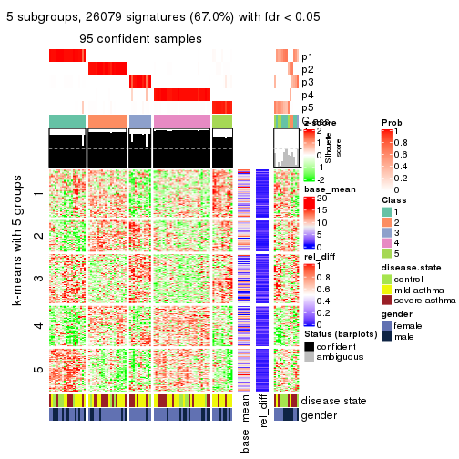</p>

</div>
<div id='tab-ATC-skmeans-get-signatures-5'>
<pre><code class="r">get_signatures(res, k = 6)
</code></pre>

<p></p>

</div>
</div>


Signature heatmaps where rows are not scaled:


<script>
$( function() {
	$( '#tabs-ATC-skmeans-get-signatures-no-scale' ).tabs();
} );
</script>
<div id='tabs-ATC-skmeans-get-signatures-no-scale'>
<ul>
<li><a href='#tab-ATC-skmeans-get-signatures-no-scale-1'>k = 2</a></li>
<li><a href='#tab-ATC-skmeans-get-signatures-no-scale-2'>k = 3</a></li>
<li><a href='#tab-ATC-skmeans-get-signatures-no-scale-3'>k = 4</a></li>
<li><a href='#tab-ATC-skmeans-get-signatures-no-scale-4'>k = 5</a></li>
<li><a href='#tab-ATC-skmeans-get-signatures-no-scale-5'>k = 6</a></li>
</ul>
<div id='tab-ATC-skmeans-get-signatures-no-scale-1'>
<pre><code class="r">get_signatures(res, k = 2, scale_rows = FALSE)
</code></pre>

<p></p>

</div>
<div id='tab-ATC-skmeans-get-signatures-no-scale-2'>
<pre><code class="r">get_signatures(res, k = 3, scale_rows = FALSE)
</code></pre>

<p>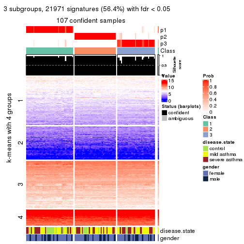</p>

</div>
<div id='tab-ATC-skmeans-get-signatures-no-scale-3'>
<pre><code class="r">get_signatures(res, k = 4, scale_rows = FALSE)
</code></pre>

<p></p>

</div>
<div id='tab-ATC-skmeans-get-signatures-no-scale-4'>
<pre><code class="r">get_signatures(res, k = 5, scale_rows = FALSE)
</code></pre>

<p></p>

</div>
<div id='tab-ATC-skmeans-get-signatures-no-scale-5'>
<pre><code class="r">get_signatures(res, k = 6, scale_rows = FALSE)
</code></pre>

<p></p>

</div>
</div>


Compare the overlap of signatures from different k:

```r
compare_signatures(res)
```


`get_signature()` returns a data frame invisibly. TO get the list of signatures, the function
call should be assigned to a variable explicitly. In following code, if `plot` argument is set
to `FALSE`, no heatmap is plotted while only the differential analysis is performed.

```r
# code only for demonstration
tb = get_signature(res, k = ..., plot = FALSE)
```

An example of the output of `tb` is:

```
#>   which_row         fdr    mean_1    mean_2 scaled_mean_1 scaled_mean_2 km
#> 1        38 0.042760348  8.373488  9.131774    -0.5533452     0.5164555  1
#> 2        40 0.018707592  7.106213  8.469186    -0.6173731     0.5762149  1
#> 3        55 0.019134737 10.221463 11.207825    -0.6159697     0.5749050  1
#> 4        59 0.006059896  5.921854  7.869574    -0.6899429     0.6439467  1
#> 5        60 0.018055526  8.928898 10.211722    -0.6204761     0.5791110  1
#> 6        98 0.009384629 15.714769 14.887706     0.6635654    -0.6193277  2
...
```

The columns in `tb` are:

1. `which_row`: row indices corresponding to the input matrix.
2. `fdr`: FDR for the differential test. 
3. `mean_x`: The mean value in group x.
4. `scaled_mean_x`: The mean value in group x after rows are scaled.
5. `km`: Row groups if k-means clustering is applied to rows.


UMAP plot which shows how samples are separated.


<script>
$( function() {
	$( '#tabs-ATC-skmeans-dimension-reduction' ).tabs();
} );
</script>
<div id='tabs-ATC-skmeans-dimension-reduction'>
<ul>
<li><a href='#tab-ATC-skmeans-dimension-reduction-1'>k = 2</a></li>
<li><a href='#tab-ATC-skmeans-dimension-reduction-2'>k = 3</a></li>
<li><a href='#tab-ATC-skmeans-dimension-reduction-3'>k = 4</a></li>
<li><a href='#tab-ATC-skmeans-dimension-reduction-4'>k = 5</a></li>
<li><a href='#tab-ATC-skmeans-dimension-reduction-5'>k = 6</a></li>
</ul>
<div id='tab-ATC-skmeans-dimension-reduction-1'>
<pre><code class="r">dimension_reduction(res, k = 2, method = &quot;UMAP&quot;)
</code></pre>

<p></p>

</div>
<div id='tab-ATC-skmeans-dimension-reduction-2'>
<pre><code class="r">dimension_reduction(res, k = 3, method = &quot;UMAP&quot;)
</code></pre>

<p></p>

</div>
<div id='tab-ATC-skmeans-dimension-reduction-3'>
<pre><code class="r">dimension_reduction(res, k = 4, method = &quot;UMAP&quot;)
</code></pre>

<p>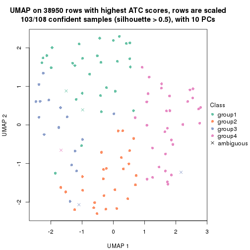</p>

</div>
<div id='tab-ATC-skmeans-dimension-reduction-4'>
<pre><code class="r">dimension_reduction(res, k = 5, method = &quot;UMAP&quot;)
</code></pre>

<p></p>

</div>
<div id='tab-ATC-skmeans-dimension-reduction-5'>
<pre><code class="r">dimension_reduction(res, k = 6, method = &quot;UMAP&quot;)
</code></pre>

<p></p>

</div>
</div>


Following heatmap shows how subgroups are split when increasing `k`:

```r
collect_classes(res)
```


Test correlation between subgroups and known annotations. If the known
annotation is numeric, one-way ANOVA test is applied, and if the known
annotation is discrete, chi-squared contingency table test is applied.

```r
test_to_known_factors(res)
```

```
#>               n disease.state(p) gender(p) k
#> ATC:skmeans 108            0.431     0.957 2
#> ATC:skmeans 107            0.226     0.923 3
#> ATC:skmeans 103            0.253     0.836 4
#> ATC:skmeans  95            0.325     0.242 5
#> ATC:skmeans  89            0.148     0.391 6
```


If matrix rows can be associated to genes, consider to use `GO_Enrichment(res,
...)` to perform function enrichment for the signature genes.


 

---------------------------------------------------


### ATC:pam*


The object with results only for a single top-value method and a single partition method 
can be extracted as:

```r
res = res_list["ATC", "pam"]
# you can also extract it by
# res = res_list["ATC:pam"]
```

A summary of `res` and all the functions that can be applied to it:

```r
res
```

```
#> A 'ConsensusPartition' object with k = 2, 3, 4, 5, 6.
#>   On a matrix with 38950 rows and 108 columns.
#>   Top rows (1000, 2000, 3000, 4000, 5000) are extracted by 'ATC' method.
#>   Subgroups are detected by 'pam' method.
#>   Performed in total 1250 partitions by row resampling.
#>   Best k for subgroups seems to be 5.
#> 
#> Following methods can be applied to this 'ConsensusPartition' object:
#>  [1] "cola_report"             "collect_classes"         "collect_plots"          
#>  [4] "collect_stats"           "colnames"                "compare_signatures"     
#>  [7] "consensus_heatmap"       "dimension_reduction"     "functional_enrichment"  
#> [10] "get_anno_col"            "get_anno"                "get_classes"            
#> [13] "get_consensus"           "get_matrix"              "get_membership"         
#> [16] "get_param"               "get_signatures"          "get_stats"              
#> [19] "is_best_k"               "is_stable_k"             "membership_heatmap"     
#> [22] "ncol"                    "nrow"                    "plot_ecdf"              
#> [25] "rownames"                "select_partition_number" "show"                   
#> [28] "suggest_best_k"          "test_to_known_factors"
```

`collect_plots()` function collects all the plots made from `res` for all `k` (number of partitions)
into one single page to provide an easy and fast comparison between different `k`.

```r
collect_plots(res)
```


The plots are:

- The first row: a plot of the ECDF (Empirical cumulative distribution
  function) curves of the consensus matrix for each `k` and the heatmap of
  predicted classes for each `k`.
- The second row: heatmaps of the consensus matrix for each `k`.
- The third row: heatmaps of the membership matrix for each `k`.
- The fouth row: heatmaps of the signatures for each `k`.

All the plots in panels can be made by individual functions and they are
plotted later in this section.

`select_partition_number()` produces several plots showing different
statistics for choosing "optimized" `k`. There are following statistics:

- ECDF curves of the consensus matrix for each `k`;
- 1-PAC. [The PAC
  score](https://en.wikipedia.org/wiki/Consensus_clustering#Over-interpretation_potential_of_consensus_clustering)
  measures the proportion of the ambiguous subgrouping.
- Mean silhouette score.
- Concordance. The mean probability of fiting the consensus class ids in all
  partitions.
- Area increased. Denote $A_k$ as the area under the ECDF curve for current
  `k`, the area increased is defined as $A_k - A_{k-1}$.
- Rand index. The percent of pairs of samples that are both in a same cluster
  or both are not in a same cluster in the partition of k and k-1.
- Jaccard index. The ratio of pairs of samples are both in a same cluster in
  the partition of k and k-1 and the pairs of samples are both in a same
  cluster in the partition k or k-1.

The detailed explanations of these statistics can be found in [the cola
vignette](http://bioconductor.org/packages/devel/bioc/vignettes/cola/inst/doc/cola.html#toc_13).

Generally speaking, lower PAC score, higher mean silhouette score or higher
concordance corresponds to better partition. Rand index and Jaccard index
measure how similar the current partition is compared to partition with `k-1`.
If they are too similar, we won't accept `k` is better than `k-1`.

```r
select_partition_number(res)
```


The numeric values for all these statistics can be obtained by `get_stats()`.

```r
get_stats(res)
```

```
#>   k 1-PAC mean_silhouette concordance area_increased  Rand Jaccard
#> 2 2 0.389           0.546       0.802         0.4549 0.621   0.621
#> 3 3 0.797           0.874       0.944         0.4372 0.701   0.529
#> 4 4 0.726           0.747       0.861         0.1088 0.916   0.768
#> 5 5 0.912           0.902       0.957         0.0921 0.857   0.551
#> 6 6 0.852           0.877       0.920         0.0297 0.972   0.865
```

`suggest_best_k()` suggests the best $k$ based on these statistics. The rules are as follows:

- All $k$ with Jaccard index larger than 0.95 are removed because the increase of
  the partition number does not provides enough extra information. If all $k$ are removed,
  the best $k$ is assigned by `NA`.
- For $k$ with 1-PAC larger than 0.9, the maximal $k$ is taken as the "best k". Other $k$ is called "optional k".
- If it does not fit the second rule. The $k$ with the highest vote of highest
  1-PAC, mean silhouette and concordance is taken as the "best k".

```r
suggest_best_k(res)
```

```
#> [1] 5
```


Following shows the table of the partitions (You need to click the **show/hide
code output** link to see it). The membership matrix (columns with name `p*`)
is inferred by
[`clue::cl_consensus()`](https://www.rdocumentation.org/link/cl_consensus?package=clue)
function with the `SE` method. Basically the value in the membership matrix
represents the probability to belong to a certain group. The finall class
label for an item is determined with the group with highest probability it
belongs to.

In `get_classes()` function, the entropy is calculated from the membership
matrix and the silhouette score is calculated from the consensus matrix.


<script>
$( function() {
	$( '#tabs-ATC-pam-get-classes' ).tabs();
} );
</script>
<div id='tabs-ATC-pam-get-classes'>
<ul>
<li><a href='#tab-ATC-pam-get-classes-1'>k = 2</a></li>
<li><a href='#tab-ATC-pam-get-classes-2'>k = 3</a></li>
<li><a href='#tab-ATC-pam-get-classes-3'>k = 4</a></li>
<li><a href='#tab-ATC-pam-get-classes-4'>k = 5</a></li>
<li><a href='#tab-ATC-pam-get-classes-5'>k = 6</a></li>
</ul>

<div id='tab-ATC-pam-get-classes-1'>
<p><a id='tab-ATC-pam-get-classes-1-a' style='color:#0366d6' href='#'>show/hide code output</a></p>
<pre><code class="r">cbind(get_classes(res, k = 2), get_membership(res, k = 2))
</code></pre>

<pre><code>#&gt;            class entropy silhouette    p1    p2
#&gt; GSM1068478     2   0.722     0.4321 0.200 0.800
#&gt; GSM1068479     2   0.000     0.6829 0.000 1.000
#&gt; GSM1068481     2   0.000     0.6829 0.000 1.000
#&gt; GSM1068482     2   0.963    -0.0569 0.388 0.612
#&gt; GSM1068483     1   0.000     0.7032 1.000 0.000
#&gt; GSM1068486     2   0.000     0.6829 0.000 1.000
#&gt; GSM1068487     2   0.981     0.4965 0.420 0.580
#&gt; GSM1068488     2   0.000     0.6829 0.000 1.000
#&gt; GSM1068490     2   0.343     0.6581 0.064 0.936
#&gt; GSM1068491     1   0.722     0.4116 0.800 0.200
#&gt; GSM1068492     2   0.981     0.4965 0.420 0.580
#&gt; GSM1068493     2   0.000     0.6829 0.000 1.000
#&gt; GSM1068494     2   0.706     0.4463 0.192 0.808
#&gt; GSM1068495     2   0.000     0.6829 0.000 1.000
#&gt; GSM1068496     2   0.000     0.6829 0.000 1.000
#&gt; GSM1068498     1   0.981     0.5074 0.580 0.420
#&gt; GSM1068499     1   0.981     0.5074 0.580 0.420
#&gt; GSM1068500     2   0.775     0.3770 0.228 0.772
#&gt; GSM1068502     2   0.981     0.4965 0.420 0.580
#&gt; GSM1068503     2   0.981     0.4965 0.420 0.580
#&gt; GSM1068505     2   0.981     0.4965 0.420 0.580
#&gt; GSM1068506     2   0.981     0.4965 0.420 0.580
#&gt; GSM1068507     2   0.000     0.6829 0.000 1.000
#&gt; GSM1068508     2   0.000     0.6829 0.000 1.000
#&gt; GSM1068510     2   0.000     0.6829 0.000 1.000
#&gt; GSM1068512     2   0.000     0.6829 0.000 1.000
#&gt; GSM1068513     2   0.000     0.6829 0.000 1.000
#&gt; GSM1068514     2   0.981     0.4965 0.420 0.580
#&gt; GSM1068517     2   0.971    -0.0962 0.400 0.600
#&gt; GSM1068518     2   0.943     0.0329 0.360 0.640
#&gt; GSM1068520     1   0.981     0.5074 0.580 0.420
#&gt; GSM1068521     1   0.552     0.6690 0.872 0.128
#&gt; GSM1068522     2   0.981     0.4965 0.420 0.580
#&gt; GSM1068524     2   0.000     0.6829 0.000 1.000
#&gt; GSM1068527     2   0.981     0.4965 0.420 0.580
#&gt; GSM1068480     2   0.730     0.4248 0.204 0.796
#&gt; GSM1068484     2   0.981     0.4965 0.420 0.580
#&gt; GSM1068485     1   0.981     0.5074 0.580 0.420
#&gt; GSM1068489     2   0.980     0.4978 0.416 0.584
#&gt; GSM1068497     2   0.958    -0.0308 0.380 0.620
#&gt; GSM1068501     2   0.981     0.4965 0.420 0.580
#&gt; GSM1068504     2   0.000     0.6829 0.000 1.000
#&gt; GSM1068509     1   0.000     0.7032 1.000 0.000
#&gt; GSM1068511     2   0.981     0.4965 0.420 0.580
#&gt; GSM1068515     1   0.456     0.6828 0.904 0.096
#&gt; GSM1068516     2   0.000     0.6829 0.000 1.000
#&gt; GSM1068519     1   0.000     0.7032 1.000 0.000
#&gt; GSM1068523     2   0.000     0.6829 0.000 1.000
#&gt; GSM1068525     2   0.000     0.6829 0.000 1.000
#&gt; GSM1068526     2   0.000     0.6829 0.000 1.000
#&gt; GSM1068458     1   0.000     0.7032 1.000 0.000
#&gt; GSM1068459     2   0.000     0.6829 0.000 1.000
#&gt; GSM1068460     2   0.662     0.4796 0.172 0.828
#&gt; GSM1068461     1   0.981     0.5074 0.580 0.420
#&gt; GSM1068464     2   0.981     0.4965 0.420 0.580
#&gt; GSM1068468     1   0.000     0.7032 1.000 0.000
#&gt; GSM1068472     1   0.697     0.4268 0.812 0.188
#&gt; GSM1068473     2   0.981     0.4965 0.420 0.580
#&gt; GSM1068474     2   0.981     0.4965 0.420 0.580
#&gt; GSM1068476     2   0.000     0.6829 0.000 1.000
#&gt; GSM1068477     2   0.000     0.6829 0.000 1.000
#&gt; GSM1068462     2   0.494     0.5707 0.108 0.892
#&gt; GSM1068463     1   0.402     0.6885 0.920 0.080
#&gt; GSM1068465     1   0.000     0.7032 1.000 0.000
#&gt; GSM1068466     1   0.981     0.5074 0.580 0.420
#&gt; GSM1068467     2   0.958    -0.0308 0.380 0.620
#&gt; GSM1068469     1   0.981     0.5074 0.580 0.420
#&gt; GSM1068470     2   0.000     0.6829 0.000 1.000
#&gt; GSM1068471     2   0.981     0.4965 0.420 0.580
#&gt; GSM1068475     2   0.981     0.4965 0.420 0.580
#&gt; GSM1068528     1   0.981     0.5074 0.580 0.420
#&gt; GSM1068531     1   0.981     0.5074 0.580 0.420
#&gt; GSM1068532     1   0.000     0.7032 1.000 0.000
#&gt; GSM1068533     2   0.992    -0.2415 0.448 0.552
#&gt; GSM1068535     2   0.981     0.4965 0.420 0.580
#&gt; GSM1068537     1   0.000     0.7032 1.000 0.000
#&gt; GSM1068538     1   0.000     0.7032 1.000 0.000
#&gt; GSM1068539     2   0.000     0.6829 0.000 1.000
#&gt; GSM1068540     2   0.963    -0.0570 0.388 0.612
#&gt; GSM1068542     2   0.981     0.4965 0.420 0.580
#&gt; GSM1068543     2   0.000     0.6829 0.000 1.000
#&gt; GSM1068544     1   0.981     0.5074 0.580 0.420
#&gt; GSM1068545     2   0.981     0.4965 0.420 0.580
#&gt; GSM1068546     2   0.000     0.6829 0.000 1.000
#&gt; GSM1068547     1   0.000     0.7032 1.000 0.000
#&gt; GSM1068548     2   0.981     0.4965 0.420 0.580
#&gt; GSM1068549     2   0.958    -0.0308 0.380 0.620
#&gt; GSM1068550     2   0.981     0.4965 0.420 0.580
#&gt; GSM1068551     2   0.000     0.6829 0.000 1.000
#&gt; GSM1068552     2   0.981     0.4965 0.420 0.580
#&gt; GSM1068555     2   0.000     0.6829 0.000 1.000
#&gt; GSM1068556     2   0.981     0.4965 0.420 0.580
#&gt; GSM1068557     2   0.000     0.6829 0.000 1.000
#&gt; GSM1068560     2   0.000     0.6829 0.000 1.000
#&gt; GSM1068561     2   0.000     0.6829 0.000 1.000
#&gt; GSM1068562     2   0.000     0.6829 0.000 1.000
#&gt; GSM1068563     2   0.981     0.4965 0.420 0.580
#&gt; GSM1068565     2   0.000     0.6829 0.000 1.000
#&gt; GSM1068529     2   0.000     0.6829 0.000 1.000
#&gt; GSM1068530     1   0.000     0.7032 1.000 0.000
#&gt; GSM1068534     2   0.000     0.6829 0.000 1.000
#&gt; GSM1068536     2   0.000     0.6829 0.000 1.000
#&gt; GSM1068541     1   0.000     0.7032 1.000 0.000
#&gt; GSM1068553     2   0.981     0.4965 0.420 0.580
#&gt; GSM1068554     2   0.981     0.4965 0.420 0.580
#&gt; GSM1068558     2   0.000     0.6829 0.000 1.000
#&gt; GSM1068559     2   0.000     0.6829 0.000 1.000
#&gt; GSM1068564     2   0.981     0.4965 0.420 0.580
</code></pre>

<script>
$('#tab-ATC-pam-get-classes-1-a').parent().next().next().hide();
$('#tab-ATC-pam-get-classes-1-a').click(function(){
  $('#tab-ATC-pam-get-classes-1-a').parent().next().next().toggle();
  return(false);
});
</script>
</div>

<div id='tab-ATC-pam-get-classes-2'>
<p><a id='tab-ATC-pam-get-classes-2-a' style='color:#0366d6' href='#'>show/hide code output</a></p>
<pre><code class="r">cbind(get_classes(res, k = 3), get_membership(res, k = 3))
</code></pre>

<pre><code>#&gt;            class entropy silhouette    p1    p2    p3
#&gt; GSM1068478     3  0.0000     0.9139 0.000 0.000 1.000
#&gt; GSM1068479     3  0.0000     0.9139 0.000 0.000 1.000
#&gt; GSM1068481     3  0.0000     0.9139 0.000 0.000 1.000
#&gt; GSM1068482     3  0.5678     0.5744 0.316 0.000 0.684
#&gt; GSM1068483     1  0.0000     0.9900 1.000 0.000 0.000
#&gt; GSM1068486     3  0.0000     0.9139 0.000 0.000 1.000
#&gt; GSM1068487     2  0.0000     0.9343 0.000 1.000 0.000
#&gt; GSM1068488     3  0.4452     0.7570 0.000 0.192 0.808
#&gt; GSM1068490     2  0.4654     0.7269 0.000 0.792 0.208
#&gt; GSM1068491     3  0.4887     0.6690 0.000 0.228 0.772
#&gt; GSM1068492     2  0.0000     0.9343 0.000 1.000 0.000
#&gt; GSM1068493     3  0.0000     0.9139 0.000 0.000 1.000
#&gt; GSM1068494     3  0.0000     0.9139 0.000 0.000 1.000
#&gt; GSM1068495     3  0.0000     0.9139 0.000 0.000 1.000
#&gt; GSM1068496     3  0.0000     0.9139 0.000 0.000 1.000
#&gt; GSM1068498     1  0.0000     0.9900 1.000 0.000 0.000
#&gt; GSM1068499     1  0.0000     0.9900 1.000 0.000 0.000
#&gt; GSM1068500     3  0.0000     0.9139 0.000 0.000 1.000
#&gt; GSM1068502     2  0.0000     0.9343 0.000 1.000 0.000
#&gt; GSM1068503     2  0.0000     0.9343 0.000 1.000 0.000
#&gt; GSM1068505     2  0.0000     0.9343 0.000 1.000 0.000
#&gt; GSM1068506     2  0.0000     0.9343 0.000 1.000 0.000
#&gt; GSM1068507     3  0.0000     0.9139 0.000 0.000 1.000
#&gt; GSM1068508     3  0.0000     0.9139 0.000 0.000 1.000
#&gt; GSM1068510     3  0.0592     0.9067 0.000 0.012 0.988
#&gt; GSM1068512     3  0.6079     0.4002 0.000 0.388 0.612
#&gt; GSM1068513     3  0.4235     0.7743 0.000 0.176 0.824
#&gt; GSM1068514     2  0.0000     0.9343 0.000 1.000 0.000
#&gt; GSM1068517     3  0.6111     0.4131 0.396 0.000 0.604
#&gt; GSM1068518     3  0.0000     0.9139 0.000 0.000 1.000
#&gt; GSM1068520     1  0.0000     0.9900 1.000 0.000 0.000
#&gt; GSM1068521     1  0.0000     0.9900 1.000 0.000 0.000
#&gt; GSM1068522     2  0.0000     0.9343 0.000 1.000 0.000
#&gt; GSM1068524     3  0.4291     0.7703 0.000 0.180 0.820
#&gt; GSM1068527     3  0.6140     0.4007 0.000 0.404 0.596
#&gt; GSM1068480     3  0.0000     0.9139 0.000 0.000 1.000
#&gt; GSM1068484     2  0.0000     0.9343 0.000 1.000 0.000
#&gt; GSM1068485     1  0.0000     0.9900 1.000 0.000 0.000
#&gt; GSM1068489     2  0.0000     0.9343 0.000 1.000 0.000
#&gt; GSM1068497     3  0.0000     0.9139 0.000 0.000 1.000
#&gt; GSM1068501     2  0.0000     0.9343 0.000 1.000 0.000
#&gt; GSM1068504     3  0.5905     0.4669 0.000 0.352 0.648
#&gt; GSM1068509     1  0.0000     0.9900 1.000 0.000 0.000
#&gt; GSM1068511     2  0.0000     0.9343 0.000 1.000 0.000
#&gt; GSM1068515     1  0.0000     0.9900 1.000 0.000 0.000
#&gt; GSM1068516     3  0.0000     0.9139 0.000 0.000 1.000
#&gt; GSM1068519     1  0.0000     0.9900 1.000 0.000 0.000
#&gt; GSM1068523     3  0.0000     0.9139 0.000 0.000 1.000
#&gt; GSM1068525     2  0.4974     0.6878 0.000 0.764 0.236
#&gt; GSM1068526     2  0.4887     0.6998 0.000 0.772 0.228
#&gt; GSM1068458     1  0.0000     0.9900 1.000 0.000 0.000
#&gt; GSM1068459     3  0.0000     0.9139 0.000 0.000 1.000
#&gt; GSM1068460     3  0.0000     0.9139 0.000 0.000 1.000
#&gt; GSM1068461     1  0.0000     0.9900 1.000 0.000 0.000
#&gt; GSM1068464     2  0.0000     0.9343 0.000 1.000 0.000
#&gt; GSM1068468     1  0.0424     0.9827 0.992 0.008 0.000
#&gt; GSM1068472     2  0.9522    -0.0482 0.400 0.412 0.188
#&gt; GSM1068473     2  0.0000     0.9343 0.000 1.000 0.000
#&gt; GSM1068474     2  0.0000     0.9343 0.000 1.000 0.000
#&gt; GSM1068476     3  0.0000     0.9139 0.000 0.000 1.000
#&gt; GSM1068477     3  0.0000     0.9139 0.000 0.000 1.000
#&gt; GSM1068462     3  0.0000     0.9139 0.000 0.000 1.000
#&gt; GSM1068463     1  0.0000     0.9900 1.000 0.000 0.000
#&gt; GSM1068465     1  0.4887     0.7101 0.772 0.228 0.000
#&gt; GSM1068466     1  0.0000     0.9900 1.000 0.000 0.000
#&gt; GSM1068467     3  0.0000     0.9139 0.000 0.000 1.000
#&gt; GSM1068469     1  0.0000     0.9900 1.000 0.000 0.000
#&gt; GSM1068470     2  0.4887     0.6998 0.000 0.772 0.228
#&gt; GSM1068471     2  0.0000     0.9343 0.000 1.000 0.000
#&gt; GSM1068475     2  0.0000     0.9343 0.000 1.000 0.000
#&gt; GSM1068528     1  0.0000     0.9900 1.000 0.000 0.000
#&gt; GSM1068531     1  0.0000     0.9900 1.000 0.000 0.000
#&gt; GSM1068532     1  0.0000     0.9900 1.000 0.000 0.000
#&gt; GSM1068533     3  0.6215     0.3322 0.428 0.000 0.572
#&gt; GSM1068535     2  0.0592     0.9251 0.000 0.988 0.012
#&gt; GSM1068537     1  0.0000     0.9900 1.000 0.000 0.000
#&gt; GSM1068538     1  0.0000     0.9900 1.000 0.000 0.000
#&gt; GSM1068539     3  0.0000     0.9139 0.000 0.000 1.000
#&gt; GSM1068540     3  0.5138     0.6760 0.252 0.000 0.748
#&gt; GSM1068542     2  0.0000     0.9343 0.000 1.000 0.000
#&gt; GSM1068543     3  0.3551     0.8163 0.000 0.132 0.868
#&gt; GSM1068544     1  0.0000     0.9900 1.000 0.000 0.000
#&gt; GSM1068545     2  0.0000     0.9343 0.000 1.000 0.000
#&gt; GSM1068546     3  0.0000     0.9139 0.000 0.000 1.000
#&gt; GSM1068547     1  0.0000     0.9900 1.000 0.000 0.000
#&gt; GSM1068548     2  0.0000     0.9343 0.000 1.000 0.000
#&gt; GSM1068549     3  0.0000     0.9139 0.000 0.000 1.000
#&gt; GSM1068550     2  0.0000     0.9343 0.000 1.000 0.000
#&gt; GSM1068551     2  0.4887     0.6998 0.000 0.772 0.228
#&gt; GSM1068552     2  0.0000     0.9343 0.000 1.000 0.000
#&gt; GSM1068555     3  0.0000     0.9139 0.000 0.000 1.000
#&gt; GSM1068556     2  0.0000     0.9343 0.000 1.000 0.000
#&gt; GSM1068557     3  0.0000     0.9139 0.000 0.000 1.000
#&gt; GSM1068560     3  0.0000     0.9139 0.000 0.000 1.000
#&gt; GSM1068561     3  0.0000     0.9139 0.000 0.000 1.000
#&gt; GSM1068562     3  0.4235     0.7743 0.000 0.176 0.824
#&gt; GSM1068563     2  0.0000     0.9343 0.000 1.000 0.000
#&gt; GSM1068565     3  0.4452     0.7569 0.000 0.192 0.808
#&gt; GSM1068529     3  0.0000     0.9139 0.000 0.000 1.000
#&gt; GSM1068530     1  0.0000     0.9900 1.000 0.000 0.000
#&gt; GSM1068534     2  0.4931     0.6939 0.000 0.768 0.232
#&gt; GSM1068536     3  0.0000     0.9139 0.000 0.000 1.000
#&gt; GSM1068541     1  0.0000     0.9900 1.000 0.000 0.000
#&gt; GSM1068553     2  0.0000     0.9343 0.000 1.000 0.000
#&gt; GSM1068554     2  0.0000     0.9343 0.000 1.000 0.000
#&gt; GSM1068558     3  0.0000     0.9139 0.000 0.000 1.000
#&gt; GSM1068559     3  0.0000     0.9139 0.000 0.000 1.000
#&gt; GSM1068564     2  0.0000     0.9343 0.000 1.000 0.000
</code></pre>

<script>
$('#tab-ATC-pam-get-classes-2-a').parent().next().next().hide();
$('#tab-ATC-pam-get-classes-2-a').click(function(){
  $('#tab-ATC-pam-get-classes-2-a').parent().next().next().toggle();
  return(false);
});
</script>
</div>

<div id='tab-ATC-pam-get-classes-3'>
<p><a id='tab-ATC-pam-get-classes-3-a' style='color:#0366d6' href='#'>show/hide code output</a></p>
<pre><code class="r">cbind(get_classes(res, k = 4), get_membership(res, k = 4))
</code></pre>

<pre><code>#&gt;            class entropy silhouette    p1    p2    p3    p4
#&gt; GSM1068478     3  0.4331      0.855 0.000 0.288 0.712 0.000
#&gt; GSM1068479     2  0.1174      0.771 0.000 0.968 0.020 0.012
#&gt; GSM1068481     3  0.4331      0.855 0.000 0.288 0.712 0.000
#&gt; GSM1068482     2  0.5767      0.314 0.280 0.660 0.060 0.000
#&gt; GSM1068483     1  0.0000      0.972 1.000 0.000 0.000 0.000
#&gt; GSM1068486     2  0.0000      0.772 0.000 1.000 0.000 0.000
#&gt; GSM1068487     4  0.4331      0.702 0.000 0.000 0.288 0.712
#&gt; GSM1068488     2  0.7265      0.482 0.000 0.528 0.288 0.184
#&gt; GSM1068490     4  0.6495      0.599 0.000 0.108 0.284 0.608
#&gt; GSM1068491     2  0.4866      0.340 0.000 0.596 0.000 0.404
#&gt; GSM1068492     4  0.0000      0.835 0.000 0.000 0.000 1.000
#&gt; GSM1068493     2  0.0000      0.772 0.000 1.000 0.000 0.000
#&gt; GSM1068494     2  0.0000      0.772 0.000 1.000 0.000 0.000
#&gt; GSM1068495     2  0.0000      0.772 0.000 1.000 0.000 0.000
#&gt; GSM1068496     3  0.5055      0.836 0.000 0.256 0.712 0.032
#&gt; GSM1068498     1  0.0000      0.972 1.000 0.000 0.000 0.000
#&gt; GSM1068499     1  0.0000      0.972 1.000 0.000 0.000 0.000
#&gt; GSM1068500     3  0.4331      0.855 0.000 0.288 0.712 0.000
#&gt; GSM1068502     4  0.0000      0.835 0.000 0.000 0.000 1.000
#&gt; GSM1068503     4  0.0188      0.834 0.000 0.000 0.004 0.996
#&gt; GSM1068505     4  0.0188      0.834 0.000 0.000 0.004 0.996
#&gt; GSM1068506     4  0.0000      0.835 0.000 0.000 0.000 1.000
#&gt; GSM1068507     2  0.1022      0.761 0.000 0.968 0.000 0.032
#&gt; GSM1068508     2  0.1022      0.771 0.000 0.968 0.032 0.000
#&gt; GSM1068510     2  0.4770      0.631 0.000 0.700 0.288 0.012
#&gt; GSM1068512     2  0.4933      0.198 0.000 0.568 0.000 0.432
#&gt; GSM1068513     2  0.7203      0.496 0.000 0.536 0.288 0.176
#&gt; GSM1068514     4  0.0000      0.835 0.000 0.000 0.000 1.000
#&gt; GSM1068517     2  0.4843      0.207 0.396 0.604 0.000 0.000
#&gt; GSM1068518     2  0.1174      0.770 0.012 0.968 0.020 0.000
#&gt; GSM1068520     1  0.0000      0.972 1.000 0.000 0.000 0.000
#&gt; GSM1068521     1  0.0000      0.972 1.000 0.000 0.000 0.000
#&gt; GSM1068522     4  0.0000      0.835 0.000 0.000 0.000 1.000
#&gt; GSM1068524     2  0.7235      0.489 0.000 0.532 0.288 0.180
#&gt; GSM1068527     4  0.4907      0.103 0.000 0.420 0.000 0.580
#&gt; GSM1068480     2  0.0000      0.772 0.000 1.000 0.000 0.000
#&gt; GSM1068484     4  0.0000      0.835 0.000 0.000 0.000 1.000
#&gt; GSM1068485     1  0.0000      0.972 1.000 0.000 0.000 0.000
#&gt; GSM1068489     4  0.4304      0.704 0.000 0.000 0.284 0.716
#&gt; GSM1068497     2  0.0000      0.772 0.000 1.000 0.000 0.000
#&gt; GSM1068501     4  0.0000      0.835 0.000 0.000 0.000 1.000
#&gt; GSM1068504     2  0.7458      0.422 0.000 0.500 0.288 0.212
#&gt; GSM1068509     1  0.0000      0.972 1.000 0.000 0.000 0.000
#&gt; GSM1068511     4  0.0000      0.835 0.000 0.000 0.000 1.000
#&gt; GSM1068515     1  0.0000      0.972 1.000 0.000 0.000 0.000
#&gt; GSM1068516     2  0.0000      0.772 0.000 1.000 0.000 0.000
#&gt; GSM1068519     1  0.0000      0.972 1.000 0.000 0.000 0.000
#&gt; GSM1068523     2  0.4331      0.636 0.000 0.712 0.288 0.000
#&gt; GSM1068525     4  0.6876      0.546 0.000 0.140 0.288 0.572
#&gt; GSM1068526     4  0.6660      0.578 0.000 0.120 0.288 0.592
#&gt; GSM1068458     1  0.0000      0.972 1.000 0.000 0.000 0.000
#&gt; GSM1068459     3  0.4331      0.855 0.000 0.288 0.712 0.000
#&gt; GSM1068460     2  0.0000      0.772 0.000 1.000 0.000 0.000
#&gt; GSM1068461     1  0.0000      0.972 1.000 0.000 0.000 0.000
#&gt; GSM1068464     4  0.4304      0.704 0.000 0.000 0.284 0.716
#&gt; GSM1068468     1  0.1211      0.923 0.960 0.000 0.000 0.040
#&gt; GSM1068472     4  0.6850      0.372 0.212 0.188 0.000 0.600
#&gt; GSM1068473     4  0.0000      0.835 0.000 0.000 0.000 1.000
#&gt; GSM1068474     4  0.0000      0.835 0.000 0.000 0.000 1.000
#&gt; GSM1068476     2  0.1022      0.771 0.000 0.968 0.032 0.000
#&gt; GSM1068477     2  0.1151      0.772 0.000 0.968 0.024 0.008
#&gt; GSM1068462     2  0.0921      0.772 0.000 0.972 0.028 0.000
#&gt; GSM1068463     3  0.4356      0.577 0.292 0.000 0.708 0.000
#&gt; GSM1068465     1  0.4866      0.368 0.596 0.000 0.000 0.404
#&gt; GSM1068466     1  0.0000      0.972 1.000 0.000 0.000 0.000
#&gt; GSM1068467     2  0.1022      0.759 0.032 0.968 0.000 0.000
#&gt; GSM1068469     1  0.0000      0.972 1.000 0.000 0.000 0.000
#&gt; GSM1068470     4  0.6660      0.578 0.000 0.120 0.288 0.592
#&gt; GSM1068471     4  0.1389      0.818 0.000 0.000 0.048 0.952
#&gt; GSM1068475     4  0.4304      0.704 0.000 0.000 0.284 0.716
#&gt; GSM1068528     1  0.0000      0.972 1.000 0.000 0.000 0.000
#&gt; GSM1068531     3  0.5055      0.625 0.256 0.032 0.712 0.000
#&gt; GSM1068532     1  0.0000      0.972 1.000 0.000 0.000 0.000
#&gt; GSM1068533     3  0.5219      0.842 0.044 0.244 0.712 0.000
#&gt; GSM1068535     4  0.5698      0.340 0.000 0.036 0.356 0.608
#&gt; GSM1068537     3  0.4331      0.582 0.288 0.000 0.712 0.000
#&gt; GSM1068538     1  0.0000      0.972 1.000 0.000 0.000 0.000
#&gt; GSM1068539     2  0.0000      0.772 0.000 1.000 0.000 0.000
#&gt; GSM1068540     3  0.4483      0.855 0.004 0.284 0.712 0.000
#&gt; GSM1068542     4  0.0000      0.835 0.000 0.000 0.000 1.000
#&gt; GSM1068543     2  0.6793      0.554 0.000 0.580 0.288 0.132
#&gt; GSM1068544     1  0.0000      0.972 1.000 0.000 0.000 0.000
#&gt; GSM1068545     4  0.0000      0.835 0.000 0.000 0.000 1.000
#&gt; GSM1068546     3  0.4331      0.855 0.000 0.288 0.712 0.000
#&gt; GSM1068547     1  0.0000      0.972 1.000 0.000 0.000 0.000
#&gt; GSM1068548     4  0.0000      0.835 0.000 0.000 0.000 1.000
#&gt; GSM1068549     2  0.0000      0.772 0.000 1.000 0.000 0.000
#&gt; GSM1068550     4  0.0000      0.835 0.000 0.000 0.000 1.000
#&gt; GSM1068551     4  0.6660      0.578 0.000 0.120 0.288 0.592
#&gt; GSM1068552     4  0.0000      0.835 0.000 0.000 0.000 1.000
#&gt; GSM1068555     2  0.4331      0.636 0.000 0.712 0.288 0.000
#&gt; GSM1068556     4  0.0000      0.835 0.000 0.000 0.000 1.000
#&gt; GSM1068557     2  0.0000      0.772 0.000 1.000 0.000 0.000
#&gt; GSM1068560     2  0.1022      0.771 0.000 0.968 0.032 0.000
#&gt; GSM1068561     2  0.0000      0.772 0.000 1.000 0.000 0.000
#&gt; GSM1068562     2  0.7203      0.496 0.000 0.536 0.288 0.176
#&gt; GSM1068563     4  0.0000      0.835 0.000 0.000 0.000 1.000
#&gt; GSM1068565     2  0.7325      0.468 0.000 0.520 0.288 0.192
#&gt; GSM1068529     2  0.0000      0.772 0.000 1.000 0.000 0.000
#&gt; GSM1068530     1  0.0000      0.972 1.000 0.000 0.000 0.000
#&gt; GSM1068534     4  0.4866      0.346 0.000 0.404 0.000 0.596
#&gt; GSM1068536     2  0.0000      0.772 0.000 1.000 0.000 0.000
#&gt; GSM1068541     1  0.0000      0.972 1.000 0.000 0.000 0.000
#&gt; GSM1068553     4  0.0000      0.835 0.000 0.000 0.000 1.000
#&gt; GSM1068554     4  0.0000      0.835 0.000 0.000 0.000 1.000
#&gt; GSM1068558     2  0.4331      0.636 0.000 0.712 0.288 0.000
#&gt; GSM1068559     2  0.0000      0.772 0.000 1.000 0.000 0.000
#&gt; GSM1068564     4  0.4304      0.704 0.000 0.000 0.284 0.716
</code></pre>

<script>
$('#tab-ATC-pam-get-classes-3-a').parent().next().next().hide();
$('#tab-ATC-pam-get-classes-3-a').click(function(){
  $('#tab-ATC-pam-get-classes-3-a').parent().next().next().toggle();
  return(false);
});
</script>
</div>

<div id='tab-ATC-pam-get-classes-4'>
<p><a id='tab-ATC-pam-get-classes-4-a' style='color:#0366d6' href='#'>show/hide code output</a></p>
<pre><code class="r">cbind(get_classes(res, k = 5), get_membership(res, k = 5))
</code></pre>

<pre><code>#&gt;            class entropy silhouette    p1    p2    p3    p4    p5
#&gt; GSM1068478     3  0.0000      1.000 0.000 0.000 1.000 0.000 0.000
#&gt; GSM1068479     5  0.0510      0.935 0.000 0.000 0.000 0.016 0.984
#&gt; GSM1068481     3  0.0000      1.000 0.000 0.000 1.000 0.000 0.000
#&gt; GSM1068482     5  0.4988      0.549 0.284 0.000 0.060 0.000 0.656
#&gt; GSM1068483     1  0.0404      0.961 0.988 0.000 0.012 0.000 0.000
#&gt; GSM1068486     5  0.0000      0.948 0.000 0.000 0.000 0.000 1.000
#&gt; GSM1068487     2  0.0000      0.928 0.000 1.000 0.000 0.000 0.000
#&gt; GSM1068488     2  0.0000      0.928 0.000 1.000 0.000 0.000 0.000
#&gt; GSM1068490     2  0.3177      0.788 0.000 0.792 0.000 0.208 0.000
#&gt; GSM1068491     4  0.3210      0.712 0.000 0.000 0.000 0.788 0.212
#&gt; GSM1068492     4  0.0162      0.928 0.000 0.004 0.000 0.996 0.000
#&gt; GSM1068493     5  0.0000      0.948 0.000 0.000 0.000 0.000 1.000
#&gt; GSM1068494     5  0.0000      0.948 0.000 0.000 0.000 0.000 1.000
#&gt; GSM1068495     5  0.0000      0.948 0.000 0.000 0.000 0.000 1.000
#&gt; GSM1068496     3  0.0000      1.000 0.000 0.000 1.000 0.000 0.000
#&gt; GSM1068498     1  0.0000      0.968 1.000 0.000 0.000 0.000 0.000
#&gt; GSM1068499     1  0.0000      0.968 1.000 0.000 0.000 0.000 0.000
#&gt; GSM1068500     3  0.0000      1.000 0.000 0.000 1.000 0.000 0.000
#&gt; GSM1068502     4  0.0000      0.928 0.000 0.000 0.000 1.000 0.000
#&gt; GSM1068503     4  0.3039      0.731 0.000 0.192 0.000 0.808 0.000
#&gt; GSM1068505     4  0.2732      0.779 0.000 0.160 0.000 0.840 0.000
#&gt; GSM1068506     4  0.0162      0.928 0.000 0.004 0.000 0.996 0.000
#&gt; GSM1068507     5  0.0000      0.948 0.000 0.000 0.000 0.000 1.000
#&gt; GSM1068508     5  0.0000      0.948 0.000 0.000 0.000 0.000 1.000
#&gt; GSM1068510     2  0.0162      0.928 0.000 0.996 0.000 0.000 0.004
#&gt; GSM1068512     5  0.3766      0.628 0.000 0.004 0.000 0.268 0.728
#&gt; GSM1068513     2  0.0404      0.926 0.000 0.988 0.000 0.000 0.012
#&gt; GSM1068514     4  0.0162      0.928 0.000 0.004 0.000 0.996 0.000
#&gt; GSM1068517     5  0.4171      0.382 0.396 0.000 0.000 0.000 0.604
#&gt; GSM1068518     5  0.0000      0.948 0.000 0.000 0.000 0.000 1.000
#&gt; GSM1068520     1  0.0404      0.961 0.988 0.000 0.012 0.000 0.000
#&gt; GSM1068521     1  0.0000      0.968 1.000 0.000 0.000 0.000 0.000
#&gt; GSM1068522     4  0.0000      0.928 0.000 0.000 0.000 1.000 0.000
#&gt; GSM1068524     2  0.0000      0.928 0.000 1.000 0.000 0.000 0.000
#&gt; GSM1068527     4  0.3300      0.720 0.000 0.004 0.000 0.792 0.204
#&gt; GSM1068480     5  0.0000      0.948 0.000 0.000 0.000 0.000 1.000
#&gt; GSM1068484     4  0.0000      0.928 0.000 0.000 0.000 1.000 0.000
#&gt; GSM1068485     1  0.0000      0.968 1.000 0.000 0.000 0.000 0.000
#&gt; GSM1068489     2  0.3177      0.784 0.000 0.792 0.000 0.208 0.000
#&gt; GSM1068497     5  0.0000      0.948 0.000 0.000 0.000 0.000 1.000
#&gt; GSM1068501     4  0.0162      0.928 0.000 0.004 0.000 0.996 0.000
#&gt; GSM1068504     2  0.0162      0.928 0.000 0.996 0.000 0.000 0.004
#&gt; GSM1068509     1  0.0000      0.968 1.000 0.000 0.000 0.000 0.000
#&gt; GSM1068511     4  0.0162      0.928 0.000 0.004 0.000 0.996 0.000
#&gt; GSM1068515     1  0.0000      0.968 1.000 0.000 0.000 0.000 0.000
#&gt; GSM1068516     5  0.0000      0.948 0.000 0.000 0.000 0.000 1.000
#&gt; GSM1068519     1  0.0000      0.968 1.000 0.000 0.000 0.000 0.000
#&gt; GSM1068523     2  0.0703      0.919 0.000 0.976 0.000 0.000 0.024
#&gt; GSM1068525     2  0.0000      0.928 0.000 1.000 0.000 0.000 0.000
#&gt; GSM1068526     2  0.0703      0.921 0.000 0.976 0.000 0.024 0.000
#&gt; GSM1068458     1  0.0000      0.968 1.000 0.000 0.000 0.000 0.000
#&gt; GSM1068459     3  0.0000      1.000 0.000 0.000 1.000 0.000 0.000
#&gt; GSM1068460     5  0.0000      0.948 0.000 0.000 0.000 0.000 1.000
#&gt; GSM1068461     1  0.0000      0.968 1.000 0.000 0.000 0.000 0.000
#&gt; GSM1068464     2  0.3366      0.759 0.000 0.768 0.000 0.232 0.000
#&gt; GSM1068468     1  0.4192      0.306 0.596 0.000 0.000 0.404 0.000
#&gt; GSM1068472     4  0.1484      0.888 0.008 0.000 0.000 0.944 0.048
#&gt; GSM1068473     4  0.0000      0.928 0.000 0.000 0.000 1.000 0.000
#&gt; GSM1068474     4  0.0000      0.928 0.000 0.000 0.000 1.000 0.000
#&gt; GSM1068476     5  0.0000      0.948 0.000 0.000 0.000 0.000 1.000
#&gt; GSM1068477     5  0.0000      0.948 0.000 0.000 0.000 0.000 1.000
#&gt; GSM1068462     5  0.0000      0.948 0.000 0.000 0.000 0.000 1.000
#&gt; GSM1068463     3  0.0162      0.996 0.004 0.000 0.996 0.000 0.000
#&gt; GSM1068465     4  0.3177      0.698 0.208 0.000 0.000 0.792 0.000
#&gt; GSM1068466     1  0.0404      0.961 0.988 0.000 0.012 0.000 0.000
#&gt; GSM1068467     5  0.0000      0.948 0.000 0.000 0.000 0.000 1.000
#&gt; GSM1068469     1  0.0404      0.958 0.988 0.000 0.000 0.000 0.012
#&gt; GSM1068470     2  0.0000      0.928 0.000 1.000 0.000 0.000 0.000
#&gt; GSM1068471     4  0.2074      0.842 0.000 0.104 0.000 0.896 0.000
#&gt; GSM1068475     2  0.3177      0.788 0.000 0.792 0.000 0.208 0.000
#&gt; GSM1068528     1  0.0000      0.968 1.000 0.000 0.000 0.000 0.000
#&gt; GSM1068531     3  0.0000      1.000 0.000 0.000 1.000 0.000 0.000
#&gt; GSM1068532     1  0.0000      0.968 1.000 0.000 0.000 0.000 0.000
#&gt; GSM1068533     3  0.0000      1.000 0.000 0.000 1.000 0.000 0.000
#&gt; GSM1068535     4  0.4410      0.225 0.000 0.004 0.440 0.556 0.000
#&gt; GSM1068537     3  0.0000      1.000 0.000 0.000 1.000 0.000 0.000
#&gt; GSM1068538     1  0.0000      0.968 1.000 0.000 0.000 0.000 0.000
#&gt; GSM1068539     5  0.0000      0.948 0.000 0.000 0.000 0.000 1.000
#&gt; GSM1068540     3  0.0000      1.000 0.000 0.000 1.000 0.000 0.000
#&gt; GSM1068542     4  0.0000      0.928 0.000 0.000 0.000 1.000 0.000
#&gt; GSM1068543     2  0.0162      0.928 0.000 0.996 0.000 0.000 0.004
#&gt; GSM1068544     1  0.0000      0.968 1.000 0.000 0.000 0.000 0.000
#&gt; GSM1068545     4  0.0000      0.928 0.000 0.000 0.000 1.000 0.000
#&gt; GSM1068546     3  0.0000      1.000 0.000 0.000 1.000 0.000 0.000
#&gt; GSM1068547     1  0.0000      0.968 1.000 0.000 0.000 0.000 0.000
#&gt; GSM1068548     4  0.0000      0.928 0.000 0.000 0.000 1.000 0.000
#&gt; GSM1068549     5  0.0162      0.945 0.000 0.000 0.004 0.000 0.996
#&gt; GSM1068550     4  0.0609      0.919 0.000 0.020 0.000 0.980 0.000
#&gt; GSM1068551     2  0.0703      0.923 0.000 0.976 0.000 0.024 0.000
#&gt; GSM1068552     4  0.0290      0.926 0.000 0.008 0.000 0.992 0.000
#&gt; GSM1068555     2  0.0162      0.928 0.000 0.996 0.000 0.000 0.004
#&gt; GSM1068556     4  0.0162      0.928 0.000 0.004 0.000 0.996 0.000
#&gt; GSM1068557     5  0.0000      0.948 0.000 0.000 0.000 0.000 1.000
#&gt; GSM1068560     5  0.0000      0.948 0.000 0.000 0.000 0.000 1.000
#&gt; GSM1068561     5  0.0000      0.948 0.000 0.000 0.000 0.000 1.000
#&gt; GSM1068562     2  0.0609      0.922 0.000 0.980 0.000 0.000 0.020
#&gt; GSM1068563     4  0.0000      0.928 0.000 0.000 0.000 1.000 0.000
#&gt; GSM1068565     2  0.0798      0.924 0.000 0.976 0.000 0.008 0.016
#&gt; GSM1068529     5  0.0000      0.948 0.000 0.000 0.000 0.000 1.000
#&gt; GSM1068530     1  0.0000      0.968 1.000 0.000 0.000 0.000 0.000
#&gt; GSM1068534     5  0.3366      0.707 0.000 0.004 0.000 0.212 0.784
#&gt; GSM1068536     5  0.0000      0.948 0.000 0.000 0.000 0.000 1.000
#&gt; GSM1068541     1  0.1851      0.874 0.912 0.000 0.000 0.088 0.000
#&gt; GSM1068553     4  0.0162      0.928 0.000 0.004 0.000 0.996 0.000
#&gt; GSM1068554     4  0.0162      0.928 0.000 0.004 0.000 0.996 0.000
#&gt; GSM1068558     2  0.0162      0.928 0.000 0.996 0.000 0.000 0.004
#&gt; GSM1068559     5  0.0000      0.948 0.000 0.000 0.000 0.000 1.000
#&gt; GSM1068564     2  0.3143      0.788 0.000 0.796 0.000 0.204 0.000
</code></pre>

<script>
$('#tab-ATC-pam-get-classes-4-a').parent().next().next().hide();
$('#tab-ATC-pam-get-classes-4-a').click(function(){
  $('#tab-ATC-pam-get-classes-4-a').parent().next().next().toggle();
  return(false);
});
</script>
</div>

<div id='tab-ATC-pam-get-classes-5'>
<p><a id='tab-ATC-pam-get-classes-5-a' style='color:#0366d6' href='#'>show/hide code output</a></p>
<pre><code class="r">cbind(get_classes(res, k = 6), get_membership(res, k = 6))
</code></pre>

<pre><code>#&gt;            class entropy silhouette    p1    p2    p3    p4    p5    p6
#&gt; GSM1068478     3  0.0000      1.000 0.000 0.000 1.000 0.000 0.000 0.000
#&gt; GSM1068479     6  0.0632      0.948 0.000 0.000 0.000 0.024 0.000 0.976
#&gt; GSM1068481     3  0.0000      1.000 0.000 0.000 1.000 0.000 0.000 0.000
#&gt; GSM1068482     5  0.2701      0.834 0.028 0.000 0.004 0.000 0.864 0.104
#&gt; GSM1068483     1  0.0260      0.922 0.992 0.000 0.008 0.000 0.000 0.000
#&gt; GSM1068486     6  0.0000      0.970 0.000 0.000 0.000 0.000 0.000 1.000
#&gt; GSM1068487     2  0.2135      0.844 0.000 0.872 0.000 0.000 0.128 0.000
#&gt; GSM1068488     2  0.0632      0.861 0.000 0.976 0.000 0.000 0.024 0.000
#&gt; GSM1068490     2  0.4687      0.718 0.000 0.684 0.000 0.180 0.136 0.000
#&gt; GSM1068491     4  0.2933      0.695 0.004 0.000 0.000 0.796 0.000 0.200
#&gt; GSM1068492     4  0.1471      0.879 0.000 0.004 0.000 0.932 0.064 0.000
#&gt; GSM1068493     6  0.0000      0.970 0.000 0.000 0.000 0.000 0.000 1.000
#&gt; GSM1068494     6  0.0000      0.970 0.000 0.000 0.000 0.000 0.000 1.000
#&gt; GSM1068495     6  0.0000      0.970 0.000 0.000 0.000 0.000 0.000 1.000
#&gt; GSM1068496     3  0.0000      1.000 0.000 0.000 1.000 0.000 0.000 0.000
#&gt; GSM1068498     5  0.2219      0.942 0.136 0.000 0.000 0.000 0.864 0.000
#&gt; GSM1068499     5  0.2219      0.942 0.136 0.000 0.000 0.000 0.864 0.000
#&gt; GSM1068500     3  0.0000      1.000 0.000 0.000 1.000 0.000 0.000 0.000
#&gt; GSM1068502     4  0.0000      0.884 0.000 0.000 0.000 1.000 0.000 0.000
#&gt; GSM1068503     4  0.4595      0.668 0.000 0.168 0.000 0.696 0.136 0.000
#&gt; GSM1068505     4  0.4281      0.727 0.000 0.132 0.000 0.732 0.136 0.000
#&gt; GSM1068506     4  0.1753      0.875 0.000 0.004 0.000 0.912 0.084 0.000
#&gt; GSM1068507     6  0.0000      0.970 0.000 0.000 0.000 0.000 0.000 1.000
#&gt; GSM1068508     6  0.0000      0.970 0.000 0.000 0.000 0.000 0.000 1.000
#&gt; GSM1068510     2  0.0146      0.863 0.000 0.996 0.000 0.000 0.000 0.004
#&gt; GSM1068512     6  0.3833      0.633 0.000 0.004 0.000 0.232 0.028 0.736
#&gt; GSM1068513     2  0.1863      0.825 0.000 0.896 0.000 0.000 0.000 0.104
#&gt; GSM1068514     4  0.1753      0.875 0.000 0.004 0.000 0.912 0.084 0.000
#&gt; GSM1068517     5  0.2679      0.847 0.040 0.000 0.000 0.000 0.864 0.096
#&gt; GSM1068518     6  0.0000      0.970 0.000 0.000 0.000 0.000 0.000 1.000
#&gt; GSM1068520     1  0.0260      0.922 0.992 0.000 0.008 0.000 0.000 0.000
#&gt; GSM1068521     5  0.2941      0.851 0.220 0.000 0.000 0.000 0.780 0.000
#&gt; GSM1068522     4  0.2219      0.856 0.000 0.000 0.000 0.864 0.136 0.000
#&gt; GSM1068524     2  0.0000      0.863 0.000 1.000 0.000 0.000 0.000 0.000
#&gt; GSM1068527     4  0.2738      0.716 0.000 0.004 0.000 0.820 0.000 0.176
#&gt; GSM1068480     6  0.0000      0.970 0.000 0.000 0.000 0.000 0.000 1.000
#&gt; GSM1068484     4  0.2219      0.856 0.000 0.000 0.000 0.864 0.136 0.000
#&gt; GSM1068485     5  0.2219      0.942 0.136 0.000 0.000 0.000 0.864 0.000
#&gt; GSM1068489     2  0.4687      0.713 0.000 0.684 0.000 0.180 0.136 0.000
#&gt; GSM1068497     6  0.0000      0.970 0.000 0.000 0.000 0.000 0.000 1.000
#&gt; GSM1068501     4  0.0146      0.884 0.000 0.004 0.000 0.996 0.000 0.000
#&gt; GSM1068504     2  0.0146      0.863 0.000 0.996 0.000 0.000 0.000 0.004
#&gt; GSM1068509     1  0.0000      0.924 1.000 0.000 0.000 0.000 0.000 0.000
#&gt; GSM1068511     4  0.0692      0.883 0.000 0.004 0.000 0.976 0.020 0.000
#&gt; GSM1068515     1  0.0146      0.925 0.996 0.000 0.000 0.000 0.004 0.000
#&gt; GSM1068516     6  0.0000      0.970 0.000 0.000 0.000 0.000 0.000 1.000
#&gt; GSM1068519     1  0.2178      0.771 0.868 0.000 0.000 0.000 0.132 0.000
#&gt; GSM1068523     2  0.2003      0.818 0.000 0.884 0.000 0.000 0.000 0.116
#&gt; GSM1068525     2  0.0000      0.863 0.000 1.000 0.000 0.000 0.000 0.000
#&gt; GSM1068526     2  0.2623      0.838 0.000 0.852 0.000 0.016 0.132 0.000
#&gt; GSM1068458     1  0.0146      0.925 0.996 0.000 0.000 0.000 0.004 0.000
#&gt; GSM1068459     3  0.0000      1.000 0.000 0.000 1.000 0.000 0.000 0.000
#&gt; GSM1068460     6  0.0000      0.970 0.000 0.000 0.000 0.000 0.000 1.000
#&gt; GSM1068461     5  0.2219      0.942 0.136 0.000 0.000 0.000 0.864 0.000
#&gt; GSM1068464     2  0.4756      0.691 0.000 0.664 0.000 0.224 0.112 0.000
#&gt; GSM1068468     1  0.3804      0.280 0.576 0.000 0.000 0.424 0.000 0.000
#&gt; GSM1068472     4  0.1434      0.848 0.012 0.000 0.000 0.940 0.000 0.048
#&gt; GSM1068473     4  0.0000      0.884 0.000 0.000 0.000 1.000 0.000 0.000
#&gt; GSM1068474     4  0.0146      0.885 0.000 0.000 0.000 0.996 0.004 0.000
#&gt; GSM1068476     6  0.0000      0.970 0.000 0.000 0.000 0.000 0.000 1.000
#&gt; GSM1068477     6  0.0000      0.970 0.000 0.000 0.000 0.000 0.000 1.000
#&gt; GSM1068462     6  0.0000      0.970 0.000 0.000 0.000 0.000 0.000 1.000
#&gt; GSM1068463     3  0.0146      0.995 0.004 0.000 0.996 0.000 0.000 0.000
#&gt; GSM1068465     4  0.2631      0.707 0.180 0.000 0.000 0.820 0.000 0.000
#&gt; GSM1068466     1  0.0260      0.922 0.992 0.000 0.008 0.000 0.000 0.000
#&gt; GSM1068467     6  0.0146      0.967 0.004 0.000 0.000 0.000 0.000 0.996
#&gt; GSM1068469     1  0.0146      0.922 0.996 0.000 0.000 0.000 0.000 0.004
#&gt; GSM1068470     2  0.0000      0.863 0.000 1.000 0.000 0.000 0.000 0.000
#&gt; GSM1068471     4  0.3992      0.764 0.000 0.104 0.000 0.760 0.136 0.000
#&gt; GSM1068475     2  0.4456      0.736 0.000 0.708 0.000 0.180 0.112 0.000
#&gt; GSM1068528     5  0.2219      0.942 0.136 0.000 0.000 0.000 0.864 0.000
#&gt; GSM1068531     3  0.0000      1.000 0.000 0.000 1.000 0.000 0.000 0.000
#&gt; GSM1068532     1  0.0146      0.925 0.996 0.000 0.000 0.000 0.004 0.000
#&gt; GSM1068533     3  0.0000      1.000 0.000 0.000 1.000 0.000 0.000 0.000
#&gt; GSM1068535     4  0.4508      0.193 0.000 0.004 0.436 0.536 0.024 0.000
#&gt; GSM1068537     3  0.0000      1.000 0.000 0.000 1.000 0.000 0.000 0.000
#&gt; GSM1068538     1  0.0146      0.925 0.996 0.000 0.000 0.000 0.004 0.000
#&gt; GSM1068539     6  0.0000      0.970 0.000 0.000 0.000 0.000 0.000 1.000
#&gt; GSM1068540     3  0.0000      1.000 0.000 0.000 1.000 0.000 0.000 0.000
#&gt; GSM1068542     4  0.0000      0.884 0.000 0.000 0.000 1.000 0.000 0.000
#&gt; GSM1068543     2  0.0146      0.863 0.000 0.996 0.000 0.000 0.000 0.004
#&gt; GSM1068544     5  0.2219      0.942 0.136 0.000 0.000 0.000 0.864 0.000
#&gt; GSM1068545     4  0.0000      0.884 0.000 0.000 0.000 1.000 0.000 0.000
#&gt; GSM1068546     3  0.0000      1.000 0.000 0.000 1.000 0.000 0.000 0.000
#&gt; GSM1068547     1  0.0146      0.925 0.996 0.000 0.000 0.000 0.004 0.000
#&gt; GSM1068548     4  0.0000      0.884 0.000 0.000 0.000 1.000 0.000 0.000
#&gt; GSM1068549     6  0.0146      0.967 0.000 0.000 0.004 0.000 0.000 0.996
#&gt; GSM1068550     4  0.2572      0.852 0.000 0.012 0.000 0.852 0.136 0.000
#&gt; GSM1068551     2  0.2358      0.847 0.000 0.876 0.000 0.016 0.108 0.000
#&gt; GSM1068552     4  0.2473      0.854 0.000 0.008 0.000 0.856 0.136 0.000
#&gt; GSM1068555     2  0.0146      0.863 0.000 0.996 0.000 0.000 0.000 0.004
#&gt; GSM1068556     4  0.2362      0.856 0.000 0.004 0.000 0.860 0.136 0.000
#&gt; GSM1068557     6  0.0000      0.970 0.000 0.000 0.000 0.000 0.000 1.000
#&gt; GSM1068560     6  0.0000      0.970 0.000 0.000 0.000 0.000 0.000 1.000
#&gt; GSM1068561     6  0.0000      0.970 0.000 0.000 0.000 0.000 0.000 1.000
#&gt; GSM1068562     2  0.2048      0.815 0.000 0.880 0.000 0.000 0.000 0.120
#&gt; GSM1068563     4  0.0146      0.885 0.000 0.000 0.000 0.996 0.004 0.000
#&gt; GSM1068565     2  0.2257      0.818 0.000 0.876 0.000 0.008 0.000 0.116
#&gt; GSM1068529     6  0.0000      0.970 0.000 0.000 0.000 0.000 0.000 1.000
#&gt; GSM1068530     1  0.0146      0.925 0.996 0.000 0.000 0.000 0.004 0.000
#&gt; GSM1068534     6  0.4853      0.553 0.000 0.004 0.000 0.184 0.136 0.676
#&gt; GSM1068536     6  0.0000      0.970 0.000 0.000 0.000 0.000 0.000 1.000
#&gt; GSM1068541     1  0.1814      0.819 0.900 0.000 0.000 0.100 0.000 0.000
#&gt; GSM1068553     4  0.0146      0.884 0.000 0.004 0.000 0.996 0.000 0.000
#&gt; GSM1068554     4  0.0146      0.884 0.000 0.004 0.000 0.996 0.000 0.000
#&gt; GSM1068558     2  0.0146      0.863 0.000 0.996 0.000 0.000 0.000 0.004
#&gt; GSM1068559     6  0.0000      0.970 0.000 0.000 0.000 0.000 0.000 1.000
#&gt; GSM1068564     2  0.4657      0.718 0.000 0.688 0.000 0.176 0.136 0.000
</code></pre>

<script>
$('#tab-ATC-pam-get-classes-5-a').parent().next().next().hide();
$('#tab-ATC-pam-get-classes-5-a').click(function(){
  $('#tab-ATC-pam-get-classes-5-a').parent().next().next().toggle();
  return(false);
});
</script>
</div>
</div>

Heatmaps for the consensus matrix. It visualizes the probability of two
samples to be in a same group.


<script>
$( function() {
	$( '#tabs-ATC-pam-consensus-heatmap' ).tabs();
} );
</script>
<div id='tabs-ATC-pam-consensus-heatmap'>
<ul>
<li><a href='#tab-ATC-pam-consensus-heatmap-1'>k = 2</a></li>
<li><a href='#tab-ATC-pam-consensus-heatmap-2'>k = 3</a></li>
<li><a href='#tab-ATC-pam-consensus-heatmap-3'>k = 4</a></li>
<li><a href='#tab-ATC-pam-consensus-heatmap-4'>k = 5</a></li>
<li><a href='#tab-ATC-pam-consensus-heatmap-5'>k = 6</a></li>
</ul>
<div id='tab-ATC-pam-consensus-heatmap-1'>
<pre><code class="r">consensus_heatmap(res, k = 2)
</code></pre>

<p></p>

</div>
<div id='tab-ATC-pam-consensus-heatmap-2'>
<pre><code class="r">consensus_heatmap(res, k = 3)
</code></pre>

<p></p>

</div>
<div id='tab-ATC-pam-consensus-heatmap-3'>
<pre><code class="r">consensus_heatmap(res, k = 4)
</code></pre>

<p></p>

</div>
<div id='tab-ATC-pam-consensus-heatmap-4'>
<pre><code class="r">consensus_heatmap(res, k = 5)
</code></pre>

<p></p>

</div>
<div id='tab-ATC-pam-consensus-heatmap-5'>
<pre><code class="r">consensus_heatmap(res, k = 6)
</code></pre>

<p></p>

</div>
</div>

Heatmaps for the membership of samples in all partitions to see how consistent they are:


<script>
$( function() {
	$( '#tabs-ATC-pam-membership-heatmap' ).tabs();
} );
</script>
<div id='tabs-ATC-pam-membership-heatmap'>
<ul>
<li><a href='#tab-ATC-pam-membership-heatmap-1'>k = 2</a></li>
<li><a href='#tab-ATC-pam-membership-heatmap-2'>k = 3</a></li>
<li><a href='#tab-ATC-pam-membership-heatmap-3'>k = 4</a></li>
<li><a href='#tab-ATC-pam-membership-heatmap-4'>k = 5</a></li>
<li><a href='#tab-ATC-pam-membership-heatmap-5'>k = 6</a></li>
</ul>
<div id='tab-ATC-pam-membership-heatmap-1'>
<pre><code class="r">membership_heatmap(res, k = 2)
</code></pre>

<p></p>

</div>
<div id='tab-ATC-pam-membership-heatmap-2'>
<pre><code class="r">membership_heatmap(res, k = 3)
</code></pre>

<p></p>

</div>
<div id='tab-ATC-pam-membership-heatmap-3'>
<pre><code class="r">membership_heatmap(res, k = 4)
</code></pre>

<p></p>

</div>
<div id='tab-ATC-pam-membership-heatmap-4'>
<pre><code class="r">membership_heatmap(res, k = 5)
</code></pre>

<p></p>

</div>
<div id='tab-ATC-pam-membership-heatmap-5'>
<pre><code class="r">membership_heatmap(res, k = 6)
</code></pre>

<p></p>

</div>
</div>

As soon as we have had the classes for columns, we can look for signatures
which are significantly different between classes which can be candidate marks
for certain classes. Following are the heatmaps for signatures.


Signature heatmaps where rows are scaled:


<script>
$( function() {
	$( '#tabs-ATC-pam-get-signatures' ).tabs();
} );
</script>
<div id='tabs-ATC-pam-get-signatures'>
<ul>
<li><a href='#tab-ATC-pam-get-signatures-1'>k = 2</a></li>
<li><a href='#tab-ATC-pam-get-signatures-2'>k = 3</a></li>
<li><a href='#tab-ATC-pam-get-signatures-3'>k = 4</a></li>
<li><a href='#tab-ATC-pam-get-signatures-4'>k = 5</a></li>
<li><a href='#tab-ATC-pam-get-signatures-5'>k = 6</a></li>
</ul>
<div id='tab-ATC-pam-get-signatures-1'>
<pre><code class="r">get_signatures(res, k = 2)
</code></pre>

<p></p>

</div>
<div id='tab-ATC-pam-get-signatures-2'>
<pre><code class="r">get_signatures(res, k = 3)
</code></pre>

<p></p>

</div>
<div id='tab-ATC-pam-get-signatures-3'>
<pre><code class="r">get_signatures(res, k = 4)
</code></pre>

<p></p>

</div>
<div id='tab-ATC-pam-get-signatures-4'>
<pre><code class="r">get_signatures(res, k = 5)
</code></pre>

<p></p>

</div>
<div id='tab-ATC-pam-get-signatures-5'>
<pre><code class="r">get_signatures(res, k = 6)
</code></pre>

<p></p>

</div>
</div>


Signature heatmaps where rows are not scaled:


<script>
$( function() {
	$( '#tabs-ATC-pam-get-signatures-no-scale' ).tabs();
} );
</script>
<div id='tabs-ATC-pam-get-signatures-no-scale'>
<ul>
<li><a href='#tab-ATC-pam-get-signatures-no-scale-1'>k = 2</a></li>
<li><a href='#tab-ATC-pam-get-signatures-no-scale-2'>k = 3</a></li>
<li><a href='#tab-ATC-pam-get-signatures-no-scale-3'>k = 4</a></li>
<li><a href='#tab-ATC-pam-get-signatures-no-scale-4'>k = 5</a></li>
<li><a href='#tab-ATC-pam-get-signatures-no-scale-5'>k = 6</a></li>
</ul>
<div id='tab-ATC-pam-get-signatures-no-scale-1'>
<pre><code class="r">get_signatures(res, k = 2, scale_rows = FALSE)
</code></pre>

<p></p>

</div>
<div id='tab-ATC-pam-get-signatures-no-scale-2'>
<pre><code class="r">get_signatures(res, k = 3, scale_rows = FALSE)
</code></pre>

<p></p>

</div>
<div id='tab-ATC-pam-get-signatures-no-scale-3'>
<pre><code class="r">get_signatures(res, k = 4, scale_rows = FALSE)
</code></pre>

<p></p>

</div>
<div id='tab-ATC-pam-get-signatures-no-scale-4'>
<pre><code class="r">get_signatures(res, k = 5, scale_rows = FALSE)
</code></pre>

<p></p>

</div>
<div id='tab-ATC-pam-get-signatures-no-scale-5'>
<pre><code class="r">get_signatures(res, k = 6, scale_rows = FALSE)
</code></pre>

<p></p>

</div>
</div>


Compare the overlap of signatures from different k:

```r
compare_signatures(res)
```


`get_signature()` returns a data frame invisibly. TO get the list of signatures, the function
call should be assigned to a variable explicitly. In following code, if `plot` argument is set
to `FALSE`, no heatmap is plotted while only the differential analysis is performed.

```r
# code only for demonstration
tb = get_signature(res, k = ..., plot = FALSE)
```

An example of the output of `tb` is:

```
#>   which_row         fdr    mean_1    mean_2 scaled_mean_1 scaled_mean_2 km
#> 1        38 0.042760348  8.373488  9.131774    -0.5533452     0.5164555  1
#> 2        40 0.018707592  7.106213  8.469186    -0.6173731     0.5762149  1
#> 3        55 0.019134737 10.221463 11.207825    -0.6159697     0.5749050  1
#> 4        59 0.006059896  5.921854  7.869574    -0.6899429     0.6439467  1
#> 5        60 0.018055526  8.928898 10.211722    -0.6204761     0.5791110  1
#> 6        98 0.009384629 15.714769 14.887706     0.6635654    -0.6193277  2
...
```

The columns in `tb` are:

1. `which_row`: row indices corresponding to the input matrix.
2. `fdr`: FDR for the differential test. 
3. `mean_x`: The mean value in group x.
4. `scaled_mean_x`: The mean value in group x after rows are scaled.
5. `km`: Row groups if k-means clustering is applied to rows.


UMAP plot which shows how samples are separated.


<script>
$( function() {
	$( '#tabs-ATC-pam-dimension-reduction' ).tabs();
} );
</script>
<div id='tabs-ATC-pam-dimension-reduction'>
<ul>
<li><a href='#tab-ATC-pam-dimension-reduction-1'>k = 2</a></li>
<li><a href='#tab-ATC-pam-dimension-reduction-2'>k = 3</a></li>
<li><a href='#tab-ATC-pam-dimension-reduction-3'>k = 4</a></li>
<li><a href='#tab-ATC-pam-dimension-reduction-4'>k = 5</a></li>
<li><a href='#tab-ATC-pam-dimension-reduction-5'>k = 6</a></li>
</ul>
<div id='tab-ATC-pam-dimension-reduction-1'>
<pre><code class="r">dimension_reduction(res, k = 2, method = &quot;UMAP&quot;)
</code></pre>

<p></p>

</div>
<div id='tab-ATC-pam-dimension-reduction-2'>
<pre><code class="r">dimension_reduction(res, k = 3, method = &quot;UMAP&quot;)
</code></pre>

<p></p>

</div>
<div id='tab-ATC-pam-dimension-reduction-3'>
<pre><code class="r">dimension_reduction(res, k = 4, method = &quot;UMAP&quot;)
</code></pre>

<p></p>

</div>
<div id='tab-ATC-pam-dimension-reduction-4'>
<pre><code class="r">dimension_reduction(res, k = 5, method = &quot;UMAP&quot;)
</code></pre>

<p></p>

</div>
<div id='tab-ATC-pam-dimension-reduction-5'>
<pre><code class="r">dimension_reduction(res, k = 6, method = &quot;UMAP&quot;)
</code></pre>

<p></p>

</div>
</div>


Following heatmap shows how subgroups are split when increasing `k`:

```r
collect_classes(res)
```


Test correlation between subgroups and known annotations. If the known
annotation is numeric, one-way ANOVA test is applied, and if the known
annotation is discrete, chi-squared contingency table test is applied.

```r
test_to_known_factors(res)
```

```
#>           n disease.state(p) gender(p) k
#> ATC:pam  64            0.292     0.625 2
#> ATC:pam 102            0.631     0.243 3
#> ATC:pam  93            0.990     0.335 4
#> ATC:pam 105            0.998     0.323 5
#> ATC:pam 106            0.986     0.116 6
```


If matrix rows can be associated to genes, consider to use `GO_Enrichment(res,
...)` to perform function enrichment for the signature genes.


 

---------------------------------------------------


### ATC:mclust


The object with results only for a single top-value method and a single partition method 
can be extracted as:

```r
res = res_list["ATC", "mclust"]
# you can also extract it by
# res = res_list["ATC:mclust"]
```

A summary of `res` and all the functions that can be applied to it:

```r
res
```

```
#> A 'ConsensusPartition' object with k = 2, 3, 4, 5, 6.
#>   On a matrix with 38950 rows and 108 columns.
#>   Top rows (1000, 2000, 3000, 4000, 5000) are extracted by 'ATC' method.
#>   Subgroups are detected by 'mclust' method.
#>   Performed in total 1250 partitions by row resampling.
#>   Best k for subgroups seems to be 2.
#> 
#> Following methods can be applied to this 'ConsensusPartition' object:
#>  [1] "cola_report"             "collect_classes"         "collect_plots"          
#>  [4] "collect_stats"           "colnames"                "compare_signatures"     
#>  [7] "consensus_heatmap"       "dimension_reduction"     "functional_enrichment"  
#> [10] "get_anno_col"            "get_anno"                "get_classes"            
#> [13] "get_consensus"           "get_matrix"              "get_membership"         
#> [16] "get_param"               "get_signatures"          "get_stats"              
#> [19] "is_best_k"               "is_stable_k"             "membership_heatmap"     
#> [22] "ncol"                    "nrow"                    "plot_ecdf"              
#> [25] "rownames"                "select_partition_number" "show"                   
#> [28] "suggest_best_k"          "test_to_known_factors"
```

`collect_plots()` function collects all the plots made from `res` for all `k` (number of partitions)
into one single page to provide an easy and fast comparison between different `k`.

```r
collect_plots(res)
```


The plots are:

- The first row: a plot of the ECDF (Empirical cumulative distribution
  function) curves of the consensus matrix for each `k` and the heatmap of
  predicted classes for each `k`.
- The second row: heatmaps of the consensus matrix for each `k`.
- The third row: heatmaps of the membership matrix for each `k`.
- The fouth row: heatmaps of the signatures for each `k`.

All the plots in panels can be made by individual functions and they are
plotted later in this section.

`select_partition_number()` produces several plots showing different
statistics for choosing "optimized" `k`. There are following statistics:

- ECDF curves of the consensus matrix for each `k`;
- 1-PAC. [The PAC
  score](https://en.wikipedia.org/wiki/Consensus_clustering#Over-interpretation_potential_of_consensus_clustering)
  measures the proportion of the ambiguous subgrouping.
- Mean silhouette score.
- Concordance. The mean probability of fiting the consensus class ids in all
  partitions.
- Area increased. Denote $A_k$ as the area under the ECDF curve for current
  `k`, the area increased is defined as $A_k - A_{k-1}$.
- Rand index. The percent of pairs of samples that are both in a same cluster
  or both are not in a same cluster in the partition of k and k-1.
- Jaccard index. The ratio of pairs of samples are both in a same cluster in
  the partition of k and k-1 and the pairs of samples are both in a same
  cluster in the partition k or k-1.

The detailed explanations of these statistics can be found in [the cola
vignette](http://bioconductor.org/packages/devel/bioc/vignettes/cola/inst/doc/cola.html#toc_13).

Generally speaking, lower PAC score, higher mean silhouette score or higher
concordance corresponds to better partition. Rand index and Jaccard index
measure how similar the current partition is compared to partition with `k-1`.
If they are too similar, we won't accept `k` is better than `k-1`.

```r
select_partition_number(res)
```


The numeric values for all these statistics can be obtained by `get_stats()`.

```r
get_stats(res)
```

```
#>   k 1-PAC mean_silhouette concordance area_increased  Rand Jaccard
#> 2 2 0.620           0.729       0.889          0.439 0.595   0.595
#> 3 3 0.610           0.553       0.778          0.405 0.551   0.350
#> 4 4 0.670           0.800       0.870          0.107 0.785   0.515
#> 5 5 0.756           0.766       0.881          0.104 0.814   0.507
#> 6 6 0.667           0.530       0.752          0.049 0.900   0.641
```

`suggest_best_k()` suggests the best $k$ based on these statistics. The rules are as follows:

- All $k$ with Jaccard index larger than 0.95 are removed because the increase of
  the partition number does not provides enough extra information. If all $k$ are removed,
  the best $k$ is assigned by `NA`.
- For $k$ with 1-PAC larger than 0.9, the maximal $k$ is taken as the "best k". Other $k$ is called "optional k".
- If it does not fit the second rule. The $k$ with the highest vote of highest
  1-PAC, mean silhouette and concordance is taken as the "best k".

```r
suggest_best_k(res)
```

```
#> [1] 2
```


Following shows the table of the partitions (You need to click the **show/hide
code output** link to see it). The membership matrix (columns with name `p*`)
is inferred by
[`clue::cl_consensus()`](https://www.rdocumentation.org/link/cl_consensus?package=clue)
function with the `SE` method. Basically the value in the membership matrix
represents the probability to belong to a certain group. The finall class
label for an item is determined with the group with highest probability it
belongs to.

In `get_classes()` function, the entropy is calculated from the membership
matrix and the silhouette score is calculated from the consensus matrix.


<script>
$( function() {
	$( '#tabs-ATC-mclust-get-classes' ).tabs();
} );
</script>
<div id='tabs-ATC-mclust-get-classes'>
<ul>
<li><a href='#tab-ATC-mclust-get-classes-1'>k = 2</a></li>
<li><a href='#tab-ATC-mclust-get-classes-2'>k = 3</a></li>
<li><a href='#tab-ATC-mclust-get-classes-3'>k = 4</a></li>
<li><a href='#tab-ATC-mclust-get-classes-4'>k = 5</a></li>
<li><a href='#tab-ATC-mclust-get-classes-5'>k = 6</a></li>
</ul>

<div id='tab-ATC-mclust-get-classes-1'>
<p><a id='tab-ATC-mclust-get-classes-1-a' style='color:#0366d6' href='#'>show/hide code output</a></p>
<pre><code class="r">cbind(get_classes(res, k = 2), get_membership(res, k = 2))
</code></pre>

<pre><code>#&gt;            class entropy silhouette    p1    p2
#&gt; GSM1068478     2   0.997     0.3112 0.468 0.532
#&gt; GSM1068479     2   0.000     0.8375 0.000 1.000
#&gt; GSM1068481     2   0.997     0.3112 0.468 0.532
#&gt; GSM1068482     1   0.000     0.9360 1.000 0.000
#&gt; GSM1068483     1   0.000     0.9360 1.000 0.000
#&gt; GSM1068486     2   0.997     0.3112 0.468 0.532
#&gt; GSM1068487     2   0.000     0.8375 0.000 1.000
#&gt; GSM1068488     2   0.000     0.8375 0.000 1.000
#&gt; GSM1068490     2   0.000     0.8375 0.000 1.000
#&gt; GSM1068491     1   0.981     0.0496 0.580 0.420
#&gt; GSM1068492     2   0.000     0.8375 0.000 1.000
#&gt; GSM1068493     2   0.909     0.5437 0.324 0.676
#&gt; GSM1068494     2   0.997     0.3112 0.468 0.532
#&gt; GSM1068495     2   0.997     0.3112 0.468 0.532
#&gt; GSM1068496     2   0.998     0.2888 0.476 0.524
#&gt; GSM1068498     1   0.000     0.9360 1.000 0.000
#&gt; GSM1068499     1   0.000     0.9360 1.000 0.000
#&gt; GSM1068500     2   0.997     0.3112 0.468 0.532
#&gt; GSM1068502     2   0.000     0.8375 0.000 1.000
#&gt; GSM1068503     2   0.000     0.8375 0.000 1.000
#&gt; GSM1068505     2   0.000     0.8375 0.000 1.000
#&gt; GSM1068506     2   0.000     0.8375 0.000 1.000
#&gt; GSM1068507     2   0.000     0.8375 0.000 1.000
#&gt; GSM1068508     2   0.000     0.8375 0.000 1.000
#&gt; GSM1068510     2   0.000     0.8375 0.000 1.000
#&gt; GSM1068512     2   0.000     0.8375 0.000 1.000
#&gt; GSM1068513     2   0.000     0.8375 0.000 1.000
#&gt; GSM1068514     2   0.000     0.8375 0.000 1.000
#&gt; GSM1068517     1   0.000     0.9360 1.000 0.000
#&gt; GSM1068518     2   0.997     0.3112 0.468 0.532
#&gt; GSM1068520     1   0.000     0.9360 1.000 0.000
#&gt; GSM1068521     1   0.000     0.9360 1.000 0.000
#&gt; GSM1068522     2   0.000     0.8375 0.000 1.000
#&gt; GSM1068524     2   0.000     0.8375 0.000 1.000
#&gt; GSM1068527     2   0.000     0.8375 0.000 1.000
#&gt; GSM1068480     2   0.997     0.3112 0.468 0.532
#&gt; GSM1068484     2   0.000     0.8375 0.000 1.000
#&gt; GSM1068485     1   0.000     0.9360 1.000 0.000
#&gt; GSM1068489     2   0.000     0.8375 0.000 1.000
#&gt; GSM1068497     2   0.997     0.3112 0.468 0.532
#&gt; GSM1068501     2   0.000     0.8375 0.000 1.000
#&gt; GSM1068504     2   0.000     0.8375 0.000 1.000
#&gt; GSM1068509     1   0.000     0.9360 1.000 0.000
#&gt; GSM1068511     2   0.000     0.8375 0.000 1.000
#&gt; GSM1068515     1   0.000     0.9360 1.000 0.000
#&gt; GSM1068516     2   0.997     0.3112 0.468 0.532
#&gt; GSM1068519     1   0.000     0.9360 1.000 0.000
#&gt; GSM1068523     2   0.000     0.8375 0.000 1.000
#&gt; GSM1068525     2   0.000     0.8375 0.000 1.000
#&gt; GSM1068526     2   0.000     0.8375 0.000 1.000
#&gt; GSM1068458     1   0.000     0.9360 1.000 0.000
#&gt; GSM1068459     2   0.998     0.2887 0.476 0.524
#&gt; GSM1068460     2   0.997     0.3112 0.468 0.532
#&gt; GSM1068461     1   0.000     0.9360 1.000 0.000
#&gt; GSM1068464     2   0.000     0.8375 0.000 1.000
#&gt; GSM1068468     2   0.997     0.3112 0.468 0.532
#&gt; GSM1068472     2   0.997     0.3112 0.468 0.532
#&gt; GSM1068473     2   0.000     0.8375 0.000 1.000
#&gt; GSM1068474     2   0.000     0.8375 0.000 1.000
#&gt; GSM1068476     2   0.000     0.8375 0.000 1.000
#&gt; GSM1068477     2   0.595     0.7389 0.144 0.856
#&gt; GSM1068462     2   0.996     0.3186 0.464 0.536
#&gt; GSM1068463     1   0.000     0.9360 1.000 0.000
#&gt; GSM1068465     1   0.980     0.0652 0.584 0.416
#&gt; GSM1068466     1   0.000     0.9360 1.000 0.000
#&gt; GSM1068467     2   0.997     0.3112 0.468 0.532
#&gt; GSM1068469     1   0.000     0.9360 1.000 0.000
#&gt; GSM1068470     2   0.000     0.8375 0.000 1.000
#&gt; GSM1068471     2   0.000     0.8375 0.000 1.000
#&gt; GSM1068475     2   0.000     0.8375 0.000 1.000
#&gt; GSM1068528     1   0.000     0.9360 1.000 0.000
#&gt; GSM1068531     1   0.000     0.9360 1.000 0.000
#&gt; GSM1068532     1   0.000     0.9360 1.000 0.000
#&gt; GSM1068533     1   0.000     0.9360 1.000 0.000
#&gt; GSM1068535     2   0.634     0.7253 0.160 0.840
#&gt; GSM1068537     1   0.000     0.9360 1.000 0.000
#&gt; GSM1068538     1   0.000     0.9360 1.000 0.000
#&gt; GSM1068539     2   0.997     0.3112 0.468 0.532
#&gt; GSM1068540     1   0.494     0.8044 0.892 0.108
#&gt; GSM1068542     2   0.000     0.8375 0.000 1.000
#&gt; GSM1068543     2   0.000     0.8375 0.000 1.000
#&gt; GSM1068544     1   0.000     0.9360 1.000 0.000
#&gt; GSM1068545     2   0.000     0.8375 0.000 1.000
#&gt; GSM1068546     2   0.997     0.3112 0.468 0.532
#&gt; GSM1068547     1   0.000     0.9360 1.000 0.000
#&gt; GSM1068548     2   0.000     0.8375 0.000 1.000
#&gt; GSM1068549     1   1.000    -0.2100 0.512 0.488
#&gt; GSM1068550     2   0.000     0.8375 0.000 1.000
#&gt; GSM1068551     2   0.000     0.8375 0.000 1.000
#&gt; GSM1068552     2   0.000     0.8375 0.000 1.000
#&gt; GSM1068555     2   0.000     0.8375 0.000 1.000
#&gt; GSM1068556     2   0.000     0.8375 0.000 1.000
#&gt; GSM1068557     2   0.595     0.7389 0.144 0.856
#&gt; GSM1068560     2   0.000     0.8375 0.000 1.000
#&gt; GSM1068561     2   0.373     0.7926 0.072 0.928
#&gt; GSM1068562     2   0.000     0.8375 0.000 1.000
#&gt; GSM1068563     2   0.000     0.8375 0.000 1.000
#&gt; GSM1068565     2   0.000     0.8375 0.000 1.000
#&gt; GSM1068529     2   0.000     0.8375 0.000 1.000
#&gt; GSM1068530     1   0.000     0.9360 1.000 0.000
#&gt; GSM1068534     2   0.000     0.8375 0.000 1.000
#&gt; GSM1068536     2   0.997     0.3112 0.468 0.532
#&gt; GSM1068541     1   0.000     0.9360 1.000 0.000
#&gt; GSM1068553     2   0.000     0.8375 0.000 1.000
#&gt; GSM1068554     2   0.000     0.8375 0.000 1.000
#&gt; GSM1068558     2   0.000     0.8375 0.000 1.000
#&gt; GSM1068559     2   0.958     0.4621 0.380 0.620
#&gt; GSM1068564     2   0.000     0.8375 0.000 1.000
</code></pre>

<script>
$('#tab-ATC-mclust-get-classes-1-a').parent().next().next().hide();
$('#tab-ATC-mclust-get-classes-1-a').click(function(){
  $('#tab-ATC-mclust-get-classes-1-a').parent().next().next().toggle();
  return(false);
});
</script>
</div>

<div id='tab-ATC-mclust-get-classes-2'>
<p><a id='tab-ATC-mclust-get-classes-2-a' style='color:#0366d6' href='#'>show/hide code output</a></p>
<pre><code class="r">cbind(get_classes(res, k = 3), get_membership(res, k = 3))
</code></pre>

<pre><code>#&gt;            class entropy silhouette    p1    p2    p3
#&gt; GSM1068478     1  0.0000    0.83532 1.000 0.000 0.000
#&gt; GSM1068479     2  0.0424    0.89445 0.000 0.992 0.008
#&gt; GSM1068481     1  0.0424    0.83341 0.992 0.000 0.008
#&gt; GSM1068482     1  0.6280    0.22425 0.540 0.000 0.460
#&gt; GSM1068483     3  0.6252   -0.03039 0.444 0.000 0.556
#&gt; GSM1068486     1  0.0424    0.83341 0.992 0.000 0.008
#&gt; GSM1068487     2  0.0892    0.88710 0.000 0.980 0.020
#&gt; GSM1068488     2  0.8795    0.10293 0.112 0.444 0.444
#&gt; GSM1068490     2  0.0000    0.89834 0.000 1.000 0.000
#&gt; GSM1068491     1  0.3619    0.78805 0.864 0.000 0.136
#&gt; GSM1068492     2  0.0000    0.89834 0.000 1.000 0.000
#&gt; GSM1068493     1  0.1453    0.83362 0.968 0.024 0.008
#&gt; GSM1068494     1  0.1453    0.83362 0.968 0.024 0.008
#&gt; GSM1068495     1  0.1774    0.82625 0.960 0.024 0.016
#&gt; GSM1068496     1  0.1860    0.82767 0.948 0.000 0.052
#&gt; GSM1068498     3  0.6252   -0.03039 0.444 0.000 0.556
#&gt; GSM1068499     3  0.6252   -0.03039 0.444 0.000 0.556
#&gt; GSM1068500     1  0.0892    0.83532 0.980 0.000 0.020
#&gt; GSM1068502     2  0.0000    0.89834 0.000 1.000 0.000
#&gt; GSM1068503     2  0.0000    0.89834 0.000 1.000 0.000
#&gt; GSM1068505     2  0.0237    0.89609 0.004 0.996 0.000
#&gt; GSM1068506     2  0.0000    0.89834 0.000 1.000 0.000
#&gt; GSM1068507     2  0.2339    0.85855 0.012 0.940 0.048
#&gt; GSM1068508     2  0.2903    0.84403 0.028 0.924 0.048
#&gt; GSM1068510     3  0.8795   -0.15722 0.112 0.444 0.444
#&gt; GSM1068512     2  0.0000    0.89834 0.000 1.000 0.000
#&gt; GSM1068513     3  0.8795   -0.15722 0.112 0.444 0.444
#&gt; GSM1068514     2  0.0000    0.89834 0.000 1.000 0.000
#&gt; GSM1068517     1  0.4931    0.66494 0.768 0.000 0.232
#&gt; GSM1068518     1  0.1031    0.83562 0.976 0.024 0.000
#&gt; GSM1068520     1  0.6260    0.29695 0.552 0.000 0.448
#&gt; GSM1068521     3  0.6252   -0.03039 0.444 0.000 0.556
#&gt; GSM1068522     2  0.0000    0.89834 0.000 1.000 0.000
#&gt; GSM1068524     3  0.8795   -0.15722 0.112 0.444 0.444
#&gt; GSM1068527     2  0.0000    0.89834 0.000 1.000 0.000
#&gt; GSM1068480     1  0.1453    0.83362 0.968 0.024 0.008
#&gt; GSM1068484     2  0.0000    0.89834 0.000 1.000 0.000
#&gt; GSM1068485     3  0.6252   -0.03039 0.444 0.000 0.556
#&gt; GSM1068489     2  0.4324    0.76489 0.112 0.860 0.028
#&gt; GSM1068497     1  0.1453    0.83362 0.968 0.024 0.008
#&gt; GSM1068501     2  0.0000    0.89834 0.000 1.000 0.000
#&gt; GSM1068504     2  0.8795    0.10293 0.112 0.444 0.444
#&gt; GSM1068509     1  0.4842    0.70418 0.776 0.000 0.224
#&gt; GSM1068511     2  0.0237    0.89602 0.004 0.996 0.000
#&gt; GSM1068515     3  0.6252   -0.03039 0.444 0.000 0.556
#&gt; GSM1068516     1  0.1453    0.83362 0.968 0.024 0.008
#&gt; GSM1068519     3  0.6252   -0.03039 0.444 0.000 0.556
#&gt; GSM1068523     3  0.8795   -0.15722 0.112 0.444 0.444
#&gt; GSM1068525     3  0.8795   -0.15722 0.112 0.444 0.444
#&gt; GSM1068526     2  0.0424    0.89445 0.000 0.992 0.008
#&gt; GSM1068458     3  0.6252   -0.03039 0.444 0.000 0.556
#&gt; GSM1068459     1  0.0892    0.83532 0.980 0.000 0.020
#&gt; GSM1068460     1  0.1453    0.83362 0.968 0.024 0.008
#&gt; GSM1068461     3  0.6252   -0.03039 0.444 0.000 0.556
#&gt; GSM1068464     2  0.0000    0.89834 0.000 1.000 0.000
#&gt; GSM1068468     1  0.3619    0.78805 0.864 0.000 0.136
#&gt; GSM1068472     1  0.4196    0.80063 0.864 0.024 0.112
#&gt; GSM1068473     2  0.0000    0.89834 0.000 1.000 0.000
#&gt; GSM1068474     2  0.0000    0.89834 0.000 1.000 0.000
#&gt; GSM1068476     3  0.8795   -0.15722 0.112 0.444 0.444
#&gt; GSM1068477     1  0.1751    0.82681 0.960 0.028 0.012
#&gt; GSM1068462     1  0.1453    0.83362 0.968 0.024 0.008
#&gt; GSM1068463     1  0.5560    0.57827 0.700 0.000 0.300
#&gt; GSM1068465     1  0.3619    0.78805 0.864 0.000 0.136
#&gt; GSM1068466     1  0.5706    0.56706 0.680 0.000 0.320
#&gt; GSM1068467     1  0.3120    0.82283 0.908 0.012 0.080
#&gt; GSM1068469     1  0.3619    0.78805 0.864 0.000 0.136
#&gt; GSM1068470     3  0.8795   -0.15722 0.112 0.444 0.444
#&gt; GSM1068471     2  0.0000    0.89834 0.000 1.000 0.000
#&gt; GSM1068475     2  0.0000    0.89834 0.000 1.000 0.000
#&gt; GSM1068528     3  0.6252   -0.03039 0.444 0.000 0.556
#&gt; GSM1068531     1  0.2165    0.82326 0.936 0.000 0.064
#&gt; GSM1068532     3  0.6252   -0.03039 0.444 0.000 0.556
#&gt; GSM1068533     1  0.3619    0.78805 0.864 0.000 0.136
#&gt; GSM1068535     1  0.6984   -0.00743 0.560 0.420 0.020
#&gt; GSM1068537     1  0.5529    0.58459 0.704 0.000 0.296
#&gt; GSM1068538     3  0.6252   -0.03039 0.444 0.000 0.556
#&gt; GSM1068539     1  0.1453    0.83362 0.968 0.024 0.008
#&gt; GSM1068540     1  0.2261    0.82150 0.932 0.000 0.068
#&gt; GSM1068542     2  0.0000    0.89834 0.000 1.000 0.000
#&gt; GSM1068543     2  0.8795    0.10293 0.112 0.444 0.444
#&gt; GSM1068544     3  0.6252   -0.03039 0.444 0.000 0.556
#&gt; GSM1068545     2  0.0000    0.89834 0.000 1.000 0.000
#&gt; GSM1068546     1  0.0424    0.83341 0.992 0.000 0.008
#&gt; GSM1068547     3  0.6252   -0.03039 0.444 0.000 0.556
#&gt; GSM1068548     2  0.0000    0.89834 0.000 1.000 0.000
#&gt; GSM1068549     1  0.0000    0.83532 1.000 0.000 0.000
#&gt; GSM1068550     2  0.0000    0.89834 0.000 1.000 0.000
#&gt; GSM1068551     2  0.1529    0.87343 0.000 0.960 0.040
#&gt; GSM1068552     2  0.0000    0.89834 0.000 1.000 0.000
#&gt; GSM1068555     3  0.8795   -0.15722 0.112 0.444 0.444
#&gt; GSM1068556     2  0.0000    0.89834 0.000 1.000 0.000
#&gt; GSM1068557     1  0.3780    0.74269 0.892 0.064 0.044
#&gt; GSM1068560     3  0.8795   -0.15722 0.112 0.444 0.444
#&gt; GSM1068561     3  0.8938   -0.14559 0.124 0.432 0.444
#&gt; GSM1068562     3  0.8795   -0.15722 0.112 0.444 0.444
#&gt; GSM1068563     2  0.0000    0.89834 0.000 1.000 0.000
#&gt; GSM1068565     2  0.7601    0.31455 0.044 0.540 0.416
#&gt; GSM1068529     2  0.9759    0.08192 0.284 0.444 0.272
#&gt; GSM1068530     3  0.6252   -0.03039 0.444 0.000 0.556
#&gt; GSM1068534     2  0.4063    0.77108 0.112 0.868 0.020
#&gt; GSM1068536     1  0.1453    0.83362 0.968 0.024 0.008
#&gt; GSM1068541     1  0.3619    0.78805 0.864 0.000 0.136
#&gt; GSM1068553     2  0.5831    0.48316 0.284 0.708 0.008
#&gt; GSM1068554     2  0.0000    0.89834 0.000 1.000 0.000
#&gt; GSM1068558     3  0.8795   -0.15722 0.112 0.444 0.444
#&gt; GSM1068559     1  0.1453    0.83362 0.968 0.024 0.008
#&gt; GSM1068564     2  0.0000    0.89834 0.000 1.000 0.000
</code></pre>

<script>
$('#tab-ATC-mclust-get-classes-2-a').parent().next().next().hide();
$('#tab-ATC-mclust-get-classes-2-a').click(function(){
  $('#tab-ATC-mclust-get-classes-2-a').parent().next().next().toggle();
  return(false);
});
</script>
</div>

<div id='tab-ATC-mclust-get-classes-3'>
<p><a id='tab-ATC-mclust-get-classes-3-a' style='color:#0366d6' href='#'>show/hide code output</a></p>
<pre><code class="r">cbind(get_classes(res, k = 4), get_membership(res, k = 4))
</code></pre>

<pre><code>#&gt;            class entropy silhouette    p1    p2    p3    p4
#&gt; GSM1068478     3  0.2973     0.8650 0.000 0.144 0.856 0.000
#&gt; GSM1068479     4  0.0336     0.8951 0.008 0.000 0.000 0.992
#&gt; GSM1068481     3  0.2921     0.8680 0.000 0.140 0.860 0.000
#&gt; GSM1068482     1  0.3249     0.7517 0.852 0.140 0.008 0.000
#&gt; GSM1068483     1  0.0336     0.9376 0.992 0.008 0.000 0.000
#&gt; GSM1068486     3  0.4624     0.6134 0.000 0.340 0.660 0.000
#&gt; GSM1068487     4  0.1635     0.8809 0.008 0.000 0.044 0.948
#&gt; GSM1068488     4  0.6286     0.7068 0.000 0.200 0.140 0.660
#&gt; GSM1068490     4  0.0336     0.8951 0.008 0.000 0.000 0.992
#&gt; GSM1068491     2  0.3764     0.6730 0.216 0.784 0.000 0.000
#&gt; GSM1068492     4  0.0336     0.8951 0.008 0.000 0.000 0.992
#&gt; GSM1068493     2  0.0000     0.7870 0.000 1.000 0.000 0.000
#&gt; GSM1068494     2  0.2868     0.6704 0.000 0.864 0.136 0.000
#&gt; GSM1068495     2  0.0000     0.7870 0.000 1.000 0.000 0.000
#&gt; GSM1068496     3  0.2921     0.8680 0.000 0.140 0.860 0.000
#&gt; GSM1068498     1  0.1474     0.8889 0.948 0.052 0.000 0.000
#&gt; GSM1068499     1  0.0336     0.9376 0.992 0.008 0.000 0.000
#&gt; GSM1068500     3  0.2921     0.8680 0.000 0.140 0.860 0.000
#&gt; GSM1068502     4  0.0336     0.8927 0.000 0.008 0.000 0.992
#&gt; GSM1068503     4  0.0336     0.8951 0.008 0.000 0.000 0.992
#&gt; GSM1068505     4  0.0000     0.8953 0.000 0.000 0.000 1.000
#&gt; GSM1068506     4  0.0000     0.8953 0.000 0.000 0.000 1.000
#&gt; GSM1068507     4  0.0000     0.8953 0.000 0.000 0.000 1.000
#&gt; GSM1068508     4  0.0524     0.8943 0.008 0.004 0.000 0.988
#&gt; GSM1068510     4  0.6286     0.7068 0.000 0.200 0.140 0.660
#&gt; GSM1068512     4  0.0000     0.8953 0.000 0.000 0.000 1.000
#&gt; GSM1068513     4  0.2921     0.8402 0.000 0.000 0.140 0.860
#&gt; GSM1068514     4  0.0000     0.8953 0.000 0.000 0.000 1.000
#&gt; GSM1068517     2  0.4999     0.0741 0.492 0.508 0.000 0.000
#&gt; GSM1068518     2  0.0000     0.7870 0.000 1.000 0.000 0.000
#&gt; GSM1068520     1  0.0336     0.9376 0.992 0.008 0.000 0.000
#&gt; GSM1068521     1  0.0336     0.9376 0.992 0.008 0.000 0.000
#&gt; GSM1068522     4  0.0000     0.8953 0.000 0.000 0.000 1.000
#&gt; GSM1068524     4  0.6286     0.7068 0.000 0.200 0.140 0.660
#&gt; GSM1068527     4  0.0000     0.8953 0.000 0.000 0.000 1.000
#&gt; GSM1068480     2  0.1940     0.7364 0.000 0.924 0.076 0.000
#&gt; GSM1068484     4  0.0336     0.8951 0.008 0.000 0.000 0.992
#&gt; GSM1068485     1  0.0336     0.9376 0.992 0.008 0.000 0.000
#&gt; GSM1068489     4  0.0000     0.8953 0.000 0.000 0.000 1.000
#&gt; GSM1068497     2  0.0000     0.7870 0.000 1.000 0.000 0.000
#&gt; GSM1068501     4  0.0000     0.8953 0.000 0.000 0.000 1.000
#&gt; GSM1068504     4  0.6179     0.7173 0.000 0.188 0.140 0.672
#&gt; GSM1068509     1  0.4925     0.1682 0.572 0.428 0.000 0.000
#&gt; GSM1068511     4  0.0000     0.8953 0.000 0.000 0.000 1.000
#&gt; GSM1068515     1  0.0336     0.9376 0.992 0.008 0.000 0.000
#&gt; GSM1068516     2  0.0000     0.7870 0.000 1.000 0.000 0.000
#&gt; GSM1068519     1  0.0336     0.9376 0.992 0.008 0.000 0.000
#&gt; GSM1068523     4  0.6275     0.7057 0.000 0.204 0.136 0.660
#&gt; GSM1068525     4  0.5815     0.7459 0.000 0.152 0.140 0.708
#&gt; GSM1068526     4  0.0336     0.8951 0.008 0.000 0.000 0.992
#&gt; GSM1068458     1  0.0336     0.9376 0.992 0.008 0.000 0.000
#&gt; GSM1068459     3  0.2921     0.8680 0.000 0.140 0.860 0.000
#&gt; GSM1068460     2  0.2408     0.7489 0.000 0.896 0.000 0.104
#&gt; GSM1068461     1  0.0336     0.9376 0.992 0.008 0.000 0.000
#&gt; GSM1068464     4  0.0336     0.8951 0.008 0.000 0.000 0.992
#&gt; GSM1068468     2  0.4843     0.7065 0.112 0.784 0.000 0.104
#&gt; GSM1068472     2  0.3610     0.6454 0.000 0.800 0.000 0.200
#&gt; GSM1068473     4  0.0000     0.8953 0.000 0.000 0.000 1.000
#&gt; GSM1068474     4  0.0336     0.8951 0.008 0.000 0.000 0.992
#&gt; GSM1068476     4  0.5705     0.6940 0.000 0.260 0.064 0.676
#&gt; GSM1068477     2  0.2921     0.7203 0.000 0.860 0.000 0.140
#&gt; GSM1068462     2  0.3074     0.7073 0.000 0.848 0.000 0.152
#&gt; GSM1068463     3  0.5159     0.3987 0.364 0.012 0.624 0.000
#&gt; GSM1068465     2  0.4948     0.6974 0.100 0.776 0.000 0.124
#&gt; GSM1068466     1  0.5144     0.6266 0.732 0.216 0.052 0.000
#&gt; GSM1068467     2  0.3610     0.6829 0.200 0.800 0.000 0.000
#&gt; GSM1068469     2  0.4605     0.5062 0.336 0.664 0.000 0.000
#&gt; GSM1068470     4  0.3249     0.8366 0.000 0.008 0.140 0.852
#&gt; GSM1068471     4  0.0336     0.8951 0.008 0.000 0.000 0.992
#&gt; GSM1068475     4  0.0336     0.8951 0.008 0.000 0.000 0.992
#&gt; GSM1068528     1  0.0336     0.9376 0.992 0.008 0.000 0.000
#&gt; GSM1068531     3  0.2921     0.8680 0.000 0.140 0.860 0.000
#&gt; GSM1068532     1  0.0336     0.9376 0.992 0.008 0.000 0.000
#&gt; GSM1068533     3  0.7526     0.3133 0.200 0.332 0.468 0.000
#&gt; GSM1068535     4  0.5815     0.6697 0.000 0.140 0.152 0.708
#&gt; GSM1068537     3  0.3351     0.7269 0.148 0.008 0.844 0.000
#&gt; GSM1068538     1  0.0336     0.9376 0.992 0.008 0.000 0.000
#&gt; GSM1068539     2  0.0000     0.7870 0.000 1.000 0.000 0.000
#&gt; GSM1068540     3  0.2921     0.8680 0.000 0.140 0.860 0.000
#&gt; GSM1068542     4  0.0000     0.8953 0.000 0.000 0.000 1.000
#&gt; GSM1068543     4  0.6286     0.7068 0.000 0.200 0.140 0.660
#&gt; GSM1068544     1  0.0336     0.9376 0.992 0.008 0.000 0.000
#&gt; GSM1068545     4  0.0336     0.8951 0.008 0.000 0.000 0.992
#&gt; GSM1068546     3  0.2921     0.8680 0.000 0.140 0.860 0.000
#&gt; GSM1068547     1  0.0336     0.9376 0.992 0.008 0.000 0.000
#&gt; GSM1068548     4  0.0000     0.8953 0.000 0.000 0.000 1.000
#&gt; GSM1068549     2  0.3873     0.5591 0.000 0.772 0.228 0.000
#&gt; GSM1068550     4  0.0000     0.8953 0.000 0.000 0.000 1.000
#&gt; GSM1068551     4  0.0336     0.8951 0.008 0.000 0.000 0.992
#&gt; GSM1068552     4  0.0336     0.8951 0.008 0.000 0.000 0.992
#&gt; GSM1068555     4  0.6286     0.7068 0.000 0.200 0.140 0.660
#&gt; GSM1068556     4  0.0000     0.8953 0.000 0.000 0.000 1.000
#&gt; GSM1068557     2  0.1716     0.7350 0.000 0.936 0.000 0.064
#&gt; GSM1068560     4  0.6286     0.7068 0.000 0.200 0.140 0.660
#&gt; GSM1068561     4  0.4973     0.6169 0.000 0.348 0.008 0.644
#&gt; GSM1068562     4  0.6286     0.7068 0.000 0.200 0.140 0.660
#&gt; GSM1068563     4  0.0000     0.8953 0.000 0.000 0.000 1.000
#&gt; GSM1068565     4  0.2737     0.8556 0.008 0.000 0.104 0.888
#&gt; GSM1068529     4  0.4624     0.6338 0.000 0.340 0.000 0.660
#&gt; GSM1068530     1  0.0336     0.9376 0.992 0.008 0.000 0.000
#&gt; GSM1068534     4  0.1940     0.8522 0.000 0.076 0.000 0.924
#&gt; GSM1068536     2  0.0000     0.7870 0.000 1.000 0.000 0.000
#&gt; GSM1068541     2  0.4134     0.6342 0.260 0.740 0.000 0.000
#&gt; GSM1068553     4  0.0817     0.8851 0.000 0.024 0.000 0.976
#&gt; GSM1068554     4  0.0000     0.8953 0.000 0.000 0.000 1.000
#&gt; GSM1068558     4  0.6286     0.7068 0.000 0.200 0.140 0.660
#&gt; GSM1068559     2  0.0000     0.7870 0.000 1.000 0.000 0.000
#&gt; GSM1068564     4  0.0336     0.8951 0.008 0.000 0.000 0.992
</code></pre>

<script>
$('#tab-ATC-mclust-get-classes-3-a').parent().next().next().hide();
$('#tab-ATC-mclust-get-classes-3-a').click(function(){
  $('#tab-ATC-mclust-get-classes-3-a').parent().next().next().toggle();
  return(false);
});
</script>
</div>

<div id='tab-ATC-mclust-get-classes-4'>
<p><a id='tab-ATC-mclust-get-classes-4-a' style='color:#0366d6' href='#'>show/hide code output</a></p>
<pre><code class="r">cbind(get_classes(res, k = 5), get_membership(res, k = 5))
</code></pre>

<pre><code>#&gt;            class entropy silhouette    p1    p2    p3    p4    p5
#&gt; GSM1068478     3  0.1124     0.8451 0.000 0.004 0.960 0.000 0.036
#&gt; GSM1068479     4  0.0854     0.9024 0.000 0.008 0.012 0.976 0.004
#&gt; GSM1068481     3  0.0703     0.8546 0.000 0.000 0.976 0.000 0.024
#&gt; GSM1068482     5  0.4464     0.2636 0.408 0.000 0.008 0.000 0.584
#&gt; GSM1068483     1  0.0000     0.8735 1.000 0.000 0.000 0.000 0.000
#&gt; GSM1068486     3  0.2054     0.8045 0.000 0.052 0.920 0.000 0.028
#&gt; GSM1068487     4  0.2411     0.8169 0.000 0.108 0.008 0.884 0.000
#&gt; GSM1068488     2  0.1357     0.8508 0.000 0.948 0.000 0.048 0.004
#&gt; GSM1068490     4  0.0671     0.9025 0.000 0.004 0.016 0.980 0.000
#&gt; GSM1068491     1  0.6073     0.1833 0.496 0.004 0.000 0.108 0.392
#&gt; GSM1068492     4  0.0671     0.9032 0.000 0.004 0.016 0.980 0.000
#&gt; GSM1068493     5  0.3997     0.7117 0.000 0.076 0.004 0.116 0.804
#&gt; GSM1068494     5  0.2859     0.7780 0.000 0.056 0.068 0.000 0.876
#&gt; GSM1068495     5  0.1608     0.7948 0.000 0.072 0.000 0.000 0.928
#&gt; GSM1068496     3  0.0703     0.8546 0.000 0.000 0.976 0.000 0.024
#&gt; GSM1068498     5  0.4249     0.2116 0.432 0.000 0.000 0.000 0.568
#&gt; GSM1068499     1  0.0510     0.8703 0.984 0.000 0.000 0.000 0.016
#&gt; GSM1068500     3  0.0703     0.8546 0.000 0.000 0.976 0.000 0.024
#&gt; GSM1068502     4  0.0162     0.9030 0.000 0.000 0.000 0.996 0.004
#&gt; GSM1068503     4  0.0671     0.9025 0.000 0.004 0.016 0.980 0.000
#&gt; GSM1068505     4  0.0510     0.9008 0.000 0.016 0.000 0.984 0.000
#&gt; GSM1068506     4  0.0451     0.9020 0.000 0.004 0.000 0.988 0.008
#&gt; GSM1068507     4  0.2408     0.8393 0.000 0.092 0.000 0.892 0.016
#&gt; GSM1068508     4  0.1267     0.8950 0.000 0.024 0.004 0.960 0.012
#&gt; GSM1068510     2  0.1502     0.8591 0.000 0.940 0.000 0.056 0.004
#&gt; GSM1068512     4  0.1124     0.8922 0.000 0.036 0.000 0.960 0.004
#&gt; GSM1068513     2  0.2852     0.8621 0.000 0.828 0.000 0.172 0.000
#&gt; GSM1068514     4  0.0162     0.9031 0.000 0.004 0.000 0.996 0.000
#&gt; GSM1068517     5  0.3152     0.7237 0.136 0.024 0.000 0.000 0.840
#&gt; GSM1068518     5  0.1197     0.7954 0.000 0.048 0.000 0.000 0.952
#&gt; GSM1068520     1  0.0000     0.8735 1.000 0.000 0.000 0.000 0.000
#&gt; GSM1068521     1  0.0404     0.8717 0.988 0.000 0.000 0.000 0.012
#&gt; GSM1068522     4  0.0290     0.9029 0.000 0.000 0.000 0.992 0.008
#&gt; GSM1068524     2  0.2439     0.8783 0.000 0.876 0.000 0.120 0.004
#&gt; GSM1068527     4  0.1608     0.8617 0.000 0.072 0.000 0.928 0.000
#&gt; GSM1068480     5  0.2592     0.7874 0.000 0.056 0.052 0.000 0.892
#&gt; GSM1068484     4  0.0510     0.9033 0.000 0.000 0.016 0.984 0.000
#&gt; GSM1068485     1  0.0000     0.8735 1.000 0.000 0.000 0.000 0.000
#&gt; GSM1068489     4  0.1205     0.8881 0.000 0.040 0.000 0.956 0.004
#&gt; GSM1068497     5  0.2291     0.7937 0.000 0.056 0.036 0.000 0.908
#&gt; GSM1068501     4  0.1041     0.8906 0.000 0.032 0.000 0.964 0.004
#&gt; GSM1068504     2  0.3231     0.8446 0.000 0.800 0.000 0.196 0.004
#&gt; GSM1068509     1  0.2890     0.7587 0.836 0.004 0.000 0.000 0.160
#&gt; GSM1068511     4  0.0992     0.8944 0.000 0.024 0.000 0.968 0.008
#&gt; GSM1068515     1  0.0404     0.8717 0.988 0.000 0.000 0.000 0.012
#&gt; GSM1068516     5  0.1341     0.7971 0.000 0.056 0.000 0.000 0.944
#&gt; GSM1068519     1  0.0000     0.8735 1.000 0.000 0.000 0.000 0.000
#&gt; GSM1068523     2  0.2629     0.8860 0.000 0.860 0.000 0.136 0.004
#&gt; GSM1068525     2  0.2629     0.8778 0.000 0.860 0.000 0.136 0.004
#&gt; GSM1068526     4  0.1117     0.8979 0.000 0.020 0.016 0.964 0.000
#&gt; GSM1068458     1  0.0000     0.8735 1.000 0.000 0.000 0.000 0.000
#&gt; GSM1068459     3  0.0703     0.8546 0.000 0.000 0.976 0.000 0.024
#&gt; GSM1068460     5  0.4003     0.5311 0.000 0.008 0.000 0.288 0.704
#&gt; GSM1068461     1  0.1965     0.8107 0.904 0.000 0.000 0.000 0.096
#&gt; GSM1068464     4  0.0510     0.9033 0.000 0.000 0.016 0.984 0.000
#&gt; GSM1068468     4  0.6110     0.0939 0.112 0.004 0.000 0.492 0.392
#&gt; GSM1068472     4  0.4449     0.3401 0.004 0.004 0.000 0.604 0.388
#&gt; GSM1068473     4  0.0162     0.9030 0.000 0.000 0.000 0.996 0.004
#&gt; GSM1068474     4  0.0510     0.9033 0.000 0.000 0.016 0.984 0.000
#&gt; GSM1068476     2  0.3809     0.7938 0.000 0.736 0.000 0.256 0.008
#&gt; GSM1068477     4  0.4367     0.2801 0.000 0.004 0.000 0.580 0.416
#&gt; GSM1068462     5  0.4283     0.4054 0.000 0.008 0.000 0.348 0.644
#&gt; GSM1068463     3  0.4262     0.2148 0.440 0.000 0.560 0.000 0.000
#&gt; GSM1068465     4  0.6477    -0.0110 0.160 0.004 0.000 0.448 0.388
#&gt; GSM1068466     1  0.2505     0.8045 0.888 0.000 0.020 0.000 0.092
#&gt; GSM1068467     5  0.1357     0.7699 0.048 0.004 0.000 0.000 0.948
#&gt; GSM1068469     1  0.4166     0.4750 0.648 0.004 0.000 0.000 0.348
#&gt; GSM1068470     2  0.3305     0.8254 0.000 0.776 0.000 0.224 0.000
#&gt; GSM1068471     4  0.0510     0.9033 0.000 0.000 0.016 0.984 0.000
#&gt; GSM1068475     4  0.0671     0.9025 0.000 0.004 0.016 0.980 0.000
#&gt; GSM1068528     1  0.0404     0.8717 0.988 0.000 0.000 0.000 0.012
#&gt; GSM1068531     3  0.0703     0.8546 0.000 0.000 0.976 0.000 0.024
#&gt; GSM1068532     1  0.0000     0.8735 1.000 0.000 0.000 0.000 0.000
#&gt; GSM1068533     1  0.5637     0.4160 0.604 0.000 0.284 0.000 0.112
#&gt; GSM1068535     3  0.6357     0.4033 0.000 0.172 0.600 0.204 0.024
#&gt; GSM1068537     3  0.4291     0.0984 0.464 0.000 0.536 0.000 0.000
#&gt; GSM1068538     1  0.0290     0.8719 0.992 0.000 0.008 0.000 0.000
#&gt; GSM1068539     5  0.1341     0.7971 0.000 0.056 0.000 0.000 0.944
#&gt; GSM1068540     3  0.0703     0.8546 0.000 0.000 0.976 0.000 0.024
#&gt; GSM1068542     4  0.0162     0.9030 0.000 0.000 0.000 0.996 0.004
#&gt; GSM1068543     2  0.1704     0.8678 0.000 0.928 0.000 0.068 0.004
#&gt; GSM1068544     1  0.0703     0.8664 0.976 0.000 0.000 0.000 0.024
#&gt; GSM1068545     4  0.0510     0.9033 0.000 0.000 0.016 0.984 0.000
#&gt; GSM1068546     3  0.0703     0.8546 0.000 0.000 0.976 0.000 0.024
#&gt; GSM1068547     1  0.0000     0.8735 1.000 0.000 0.000 0.000 0.000
#&gt; GSM1068548     4  0.0290     0.9029 0.000 0.000 0.000 0.992 0.008
#&gt; GSM1068549     5  0.2871     0.7666 0.000 0.040 0.088 0.000 0.872
#&gt; GSM1068550     4  0.0162     0.9031 0.000 0.004 0.000 0.996 0.000
#&gt; GSM1068551     4  0.1018     0.8982 0.000 0.016 0.016 0.968 0.000
#&gt; GSM1068552     4  0.0510     0.9033 0.000 0.000 0.016 0.984 0.000
#&gt; GSM1068555     2  0.1892     0.8736 0.000 0.916 0.000 0.080 0.004
#&gt; GSM1068556     4  0.0290     0.9029 0.000 0.000 0.000 0.992 0.008
#&gt; GSM1068557     5  0.4689     0.2837 0.000 0.424 0.000 0.016 0.560
#&gt; GSM1068560     2  0.3521     0.8170 0.000 0.764 0.000 0.232 0.004
#&gt; GSM1068561     2  0.3724     0.8318 0.000 0.788 0.000 0.184 0.028
#&gt; GSM1068562     2  0.2848     0.8815 0.000 0.840 0.000 0.156 0.004
#&gt; GSM1068563     4  0.0290     0.9029 0.000 0.000 0.000 0.992 0.008
#&gt; GSM1068565     4  0.4380     0.1877 0.000 0.376 0.008 0.616 0.000
#&gt; GSM1068529     2  0.4054     0.8003 0.000 0.748 0.000 0.224 0.028
#&gt; GSM1068530     1  0.0290     0.8719 0.992 0.000 0.008 0.000 0.000
#&gt; GSM1068534     4  0.2763     0.7922 0.000 0.148 0.000 0.848 0.004
#&gt; GSM1068536     5  0.2782     0.7879 0.000 0.072 0.048 0.000 0.880
#&gt; GSM1068541     1  0.4644     0.3962 0.604 0.004 0.000 0.012 0.380
#&gt; GSM1068553     4  0.2672     0.8208 0.000 0.116 0.004 0.872 0.008
#&gt; GSM1068554     4  0.0324     0.9025 0.000 0.004 0.000 0.992 0.004
#&gt; GSM1068558     2  0.1430     0.8554 0.000 0.944 0.000 0.052 0.004
#&gt; GSM1068559     5  0.2020     0.7843 0.000 0.100 0.000 0.000 0.900
#&gt; GSM1068564     4  0.0510     0.9033 0.000 0.000 0.016 0.984 0.000
</code></pre>

<script>
$('#tab-ATC-mclust-get-classes-4-a').parent().next().next().hide();
$('#tab-ATC-mclust-get-classes-4-a').click(function(){
  $('#tab-ATC-mclust-get-classes-4-a').parent().next().next().toggle();
  return(false);
});
</script>
</div>

<div id='tab-ATC-mclust-get-classes-5'>
<p><a id='tab-ATC-mclust-get-classes-5-a' style='color:#0366d6' href='#'>show/hide code output</a></p>
<pre><code class="r">cbind(get_classes(res, k = 6), get_membership(res, k = 6))
</code></pre>

<pre><code>#&gt;            class entropy silhouette    p1    p2    p3    p4    p5    p6
#&gt; GSM1068478     3  0.3819    0.45620 0.000 0.000 0.672 0.012 0.316 0.000
#&gt; GSM1068479     2  0.2647    0.60236 0.000 0.868 0.000 0.088 0.000 0.044
#&gt; GSM1068481     3  0.0790    0.77145 0.000 0.000 0.968 0.032 0.000 0.000
#&gt; GSM1068482     5  0.6827   -0.05326 0.324 0.000 0.168 0.076 0.432 0.000
#&gt; GSM1068483     1  0.3288    0.80657 0.724 0.000 0.000 0.276 0.000 0.000
#&gt; GSM1068486     3  0.4180    0.66055 0.000 0.000 0.732 0.216 0.024 0.028
#&gt; GSM1068487     2  0.4532   -0.22826 0.000 0.500 0.000 0.032 0.000 0.468
#&gt; GSM1068488     6  0.2744    0.82156 0.000 0.144 0.000 0.016 0.000 0.840
#&gt; GSM1068490     2  0.1714    0.63019 0.000 0.908 0.000 0.092 0.000 0.000
#&gt; GSM1068491     5  0.6339    0.53456 0.212 0.152 0.000 0.076 0.560 0.000
#&gt; GSM1068492     2  0.1141    0.64337 0.000 0.948 0.000 0.052 0.000 0.000
#&gt; GSM1068493     5  0.1789    0.71741 0.000 0.000 0.032 0.000 0.924 0.044
#&gt; GSM1068494     5  0.1821    0.71857 0.000 0.000 0.008 0.024 0.928 0.040
#&gt; GSM1068495     5  0.0937    0.72481 0.000 0.000 0.000 0.000 0.960 0.040
#&gt; GSM1068496     3  0.0547    0.77579 0.000 0.000 0.980 0.020 0.000 0.000
#&gt; GSM1068498     1  0.3972    0.44440 0.680 0.000 0.000 0.004 0.300 0.016
#&gt; GSM1068499     1  0.0937    0.77973 0.960 0.000 0.000 0.000 0.040 0.000
#&gt; GSM1068500     3  0.0000    0.77570 0.000 0.000 1.000 0.000 0.000 0.000
#&gt; GSM1068502     2  0.1075    0.63832 0.000 0.952 0.000 0.048 0.000 0.000
#&gt; GSM1068503     2  0.1556    0.63543 0.000 0.920 0.000 0.080 0.000 0.000
#&gt; GSM1068505     2  0.5119   -0.28314 0.000 0.624 0.000 0.220 0.000 0.156
#&gt; GSM1068506     2  0.5196   -0.41656 0.000 0.604 0.000 0.252 0.000 0.144
#&gt; GSM1068507     2  0.1765    0.63568 0.000 0.924 0.000 0.052 0.000 0.024
#&gt; GSM1068508     2  0.2826    0.59404 0.000 0.856 0.000 0.092 0.000 0.052
#&gt; GSM1068510     6  0.2527    0.83971 0.000 0.168 0.000 0.000 0.000 0.832
#&gt; GSM1068512     2  0.5314   -0.47589 0.000 0.584 0.000 0.264 0.000 0.152
#&gt; GSM1068513     6  0.3190    0.82306 0.000 0.220 0.000 0.008 0.000 0.772
#&gt; GSM1068514     2  0.1471    0.61593 0.000 0.932 0.000 0.064 0.000 0.004
#&gt; GSM1068517     5  0.3515    0.55308 0.192 0.000 0.000 0.012 0.780 0.016
#&gt; GSM1068518     5  0.0603    0.71610 0.004 0.000 0.000 0.016 0.980 0.000
#&gt; GSM1068520     1  0.3330    0.80248 0.716 0.000 0.000 0.284 0.000 0.000
#&gt; GSM1068521     1  0.1391    0.77284 0.944 0.000 0.000 0.000 0.040 0.016
#&gt; GSM1068522     2  0.4757   -0.13153 0.000 0.676 0.000 0.180 0.000 0.144
#&gt; GSM1068524     6  0.2730    0.84030 0.000 0.192 0.000 0.000 0.000 0.808
#&gt; GSM1068527     2  0.2988    0.49234 0.000 0.828 0.000 0.144 0.000 0.028
#&gt; GSM1068480     5  0.1821    0.71857 0.000 0.000 0.008 0.024 0.928 0.040
#&gt; GSM1068484     2  0.1501    0.63557 0.000 0.924 0.000 0.076 0.000 0.000
#&gt; GSM1068485     1  0.1957    0.79973 0.888 0.000 0.000 0.112 0.000 0.000
#&gt; GSM1068489     6  0.5906   -0.51830 0.000 0.300 0.000 0.236 0.000 0.464
#&gt; GSM1068497     5  0.1821    0.71857 0.000 0.000 0.008 0.024 0.928 0.040
#&gt; GSM1068501     2  0.1657    0.61019 0.000 0.928 0.000 0.056 0.000 0.016
#&gt; GSM1068504     6  0.3012    0.83803 0.000 0.196 0.000 0.008 0.000 0.796
#&gt; GSM1068509     1  0.4373    0.73925 0.624 0.000 0.004 0.344 0.028 0.000
#&gt; GSM1068511     2  0.5304   -0.50217 0.000 0.580 0.000 0.276 0.000 0.144
#&gt; GSM1068515     1  0.1391    0.77284 0.944 0.000 0.000 0.000 0.040 0.016
#&gt; GSM1068516     5  0.0937    0.72481 0.000 0.000 0.000 0.000 0.960 0.040
#&gt; GSM1068519     1  0.3288    0.80657 0.724 0.000 0.000 0.276 0.000 0.000
#&gt; GSM1068523     6  0.3659    0.62983 0.000 0.364 0.000 0.000 0.000 0.636
#&gt; GSM1068525     6  0.2762    0.83986 0.000 0.196 0.000 0.000 0.000 0.804
#&gt; GSM1068526     2  0.2499    0.61095 0.000 0.880 0.000 0.072 0.000 0.048
#&gt; GSM1068458     1  0.0964    0.78476 0.968 0.000 0.000 0.004 0.012 0.016
#&gt; GSM1068459     3  0.0260    0.77500 0.000 0.000 0.992 0.008 0.000 0.000
#&gt; GSM1068460     5  0.3983    0.63311 0.000 0.208 0.000 0.056 0.736 0.000
#&gt; GSM1068461     1  0.1838    0.75282 0.916 0.000 0.000 0.000 0.068 0.016
#&gt; GSM1068464     2  0.1007    0.64170 0.000 0.956 0.000 0.044 0.000 0.000
#&gt; GSM1068468     5  0.5983    0.49370 0.076 0.296 0.000 0.072 0.556 0.000
#&gt; GSM1068472     5  0.5127    0.42890 0.000 0.348 0.000 0.096 0.556 0.000
#&gt; GSM1068473     2  0.1075    0.61956 0.000 0.952 0.000 0.048 0.000 0.000
#&gt; GSM1068474     2  0.1387    0.63761 0.000 0.932 0.000 0.068 0.000 0.000
#&gt; GSM1068476     2  0.3996   -0.28892 0.000 0.512 0.000 0.004 0.000 0.484
#&gt; GSM1068477     5  0.5044    0.46087 0.000 0.320 0.000 0.096 0.584 0.000
#&gt; GSM1068462     5  0.4577    0.55814 0.000 0.272 0.000 0.072 0.656 0.000
#&gt; GSM1068463     3  0.5682    0.32556 0.208 0.000 0.524 0.268 0.000 0.000
#&gt; GSM1068465     5  0.6467    0.55122 0.160 0.188 0.000 0.096 0.556 0.000
#&gt; GSM1068466     1  0.3774    0.76684 0.664 0.000 0.008 0.328 0.000 0.000
#&gt; GSM1068467     5  0.2046    0.69998 0.060 0.000 0.000 0.032 0.908 0.000
#&gt; GSM1068469     5  0.5219    0.36681 0.340 0.000 0.000 0.108 0.552 0.000
#&gt; GSM1068470     6  0.3287    0.82736 0.000 0.220 0.000 0.012 0.000 0.768
#&gt; GSM1068471     2  0.0458    0.63571 0.000 0.984 0.000 0.016 0.000 0.000
#&gt; GSM1068475     2  0.1663    0.63089 0.000 0.912 0.000 0.088 0.000 0.000
#&gt; GSM1068528     1  0.1151    0.78451 0.956 0.000 0.000 0.012 0.032 0.000
#&gt; GSM1068531     3  0.1007    0.77326 0.000 0.000 0.956 0.044 0.000 0.000
#&gt; GSM1068532     1  0.3288    0.80657 0.724 0.000 0.000 0.276 0.000 0.000
#&gt; GSM1068533     3  0.7411    0.03129 0.320 0.000 0.348 0.172 0.160 0.000
#&gt; GSM1068535     3  0.7124    0.11547 0.000 0.112 0.408 0.308 0.000 0.172
#&gt; GSM1068537     3  0.4980    0.51125 0.184 0.000 0.648 0.168 0.000 0.000
#&gt; GSM1068538     1  0.3288    0.80657 0.724 0.000 0.000 0.276 0.000 0.000
#&gt; GSM1068539     5  0.0937    0.72481 0.000 0.000 0.000 0.000 0.960 0.040
#&gt; GSM1068540     3  0.1141    0.77215 0.000 0.000 0.948 0.052 0.000 0.000
#&gt; GSM1068542     2  0.0632    0.63473 0.000 0.976 0.000 0.024 0.000 0.000
#&gt; GSM1068543     6  0.2527    0.83971 0.000 0.168 0.000 0.000 0.000 0.832
#&gt; GSM1068544     1  0.1082    0.77884 0.956 0.000 0.000 0.004 0.040 0.000
#&gt; GSM1068545     2  0.1387    0.63761 0.000 0.932 0.000 0.068 0.000 0.000
#&gt; GSM1068546     3  0.1151    0.76986 0.000 0.000 0.956 0.032 0.012 0.000
#&gt; GSM1068547     1  0.3309    0.80473 0.720 0.000 0.000 0.280 0.000 0.000
#&gt; GSM1068548     2  0.2726    0.50130 0.000 0.856 0.000 0.112 0.000 0.032
#&gt; GSM1068549     5  0.1765    0.70150 0.000 0.000 0.052 0.024 0.924 0.000
#&gt; GSM1068550     2  0.1910    0.58674 0.000 0.892 0.000 0.108 0.000 0.000
#&gt; GSM1068551     2  0.2112    0.63020 0.000 0.896 0.000 0.088 0.000 0.016
#&gt; GSM1068552     2  0.1007    0.64093 0.000 0.956 0.000 0.044 0.000 0.000
#&gt; GSM1068555     6  0.2562    0.84058 0.000 0.172 0.000 0.000 0.000 0.828
#&gt; GSM1068556     2  0.4569   -0.03096 0.000 0.700 0.000 0.156 0.000 0.144
#&gt; GSM1068557     5  0.5745    0.35947 0.000 0.124 0.000 0.020 0.548 0.308
#&gt; GSM1068560     2  0.3869   -0.31429 0.000 0.500 0.000 0.000 0.000 0.500
#&gt; GSM1068561     6  0.6113    0.63340 0.000 0.240 0.000 0.184 0.032 0.544
#&gt; GSM1068562     6  0.3244    0.77793 0.000 0.268 0.000 0.000 0.000 0.732
#&gt; GSM1068563     2  0.4500    0.00628 0.000 0.708 0.000 0.148 0.000 0.144
#&gt; GSM1068565     2  0.4389   -0.23678 0.000 0.528 0.000 0.024 0.000 0.448
#&gt; GSM1068529     6  0.5939    0.47788 0.000 0.356 0.000 0.144 0.016 0.484
#&gt; GSM1068530     1  0.3288    0.80657 0.724 0.000 0.000 0.276 0.000 0.000
#&gt; GSM1068534     4  0.5765    0.00000 0.000 0.412 0.000 0.416 0.000 0.172
#&gt; GSM1068536     5  0.1265    0.72414 0.000 0.000 0.000 0.008 0.948 0.044
#&gt; GSM1068541     5  0.6100    0.46393 0.280 0.080 0.000 0.084 0.556 0.000
#&gt; GSM1068553     2  0.5842   -0.83857 0.000 0.472 0.004 0.352 0.000 0.172
#&gt; GSM1068554     2  0.2178    0.52569 0.000 0.868 0.000 0.132 0.000 0.000
#&gt; GSM1068558     6  0.2527    0.83971 0.000 0.168 0.000 0.000 0.000 0.832
#&gt; GSM1068559     5  0.1471    0.71995 0.000 0.000 0.000 0.004 0.932 0.064
#&gt; GSM1068564     2  0.1075    0.62179 0.000 0.952 0.000 0.048 0.000 0.000
</code></pre>

<script>
$('#tab-ATC-mclust-get-classes-5-a').parent().next().next().hide();
$('#tab-ATC-mclust-get-classes-5-a').click(function(){
  $('#tab-ATC-mclust-get-classes-5-a').parent().next().next().toggle();
  return(false);
});
</script>
</div>
</div>

Heatmaps for the consensus matrix. It visualizes the probability of two
samples to be in a same group.


<script>
$( function() {
	$( '#tabs-ATC-mclust-consensus-heatmap' ).tabs();
} );
</script>
<div id='tabs-ATC-mclust-consensus-heatmap'>
<ul>
<li><a href='#tab-ATC-mclust-consensus-heatmap-1'>k = 2</a></li>
<li><a href='#tab-ATC-mclust-consensus-heatmap-2'>k = 3</a></li>
<li><a href='#tab-ATC-mclust-consensus-heatmap-3'>k = 4</a></li>
<li><a href='#tab-ATC-mclust-consensus-heatmap-4'>k = 5</a></li>
<li><a href='#tab-ATC-mclust-consensus-heatmap-5'>k = 6</a></li>
</ul>
<div id='tab-ATC-mclust-consensus-heatmap-1'>
<pre><code class="r">consensus_heatmap(res, k = 2)
</code></pre>

<p></p>

</div>
<div id='tab-ATC-mclust-consensus-heatmap-2'>
<pre><code class="r">consensus_heatmap(res, k = 3)
</code></pre>

<p></p>

</div>
<div id='tab-ATC-mclust-consensus-heatmap-3'>
<pre><code class="r">consensus_heatmap(res, k = 4)
</code></pre>

<p></p>

</div>
<div id='tab-ATC-mclust-consensus-heatmap-4'>
<pre><code class="r">consensus_heatmap(res, k = 5)
</code></pre>

<p></p>

</div>
<div id='tab-ATC-mclust-consensus-heatmap-5'>
<pre><code class="r">consensus_heatmap(res, k = 6)
</code></pre>

<p></p>

</div>
</div>

Heatmaps for the membership of samples in all partitions to see how consistent they are:


<script>
$( function() {
	$( '#tabs-ATC-mclust-membership-heatmap' ).tabs();
} );
</script>
<div id='tabs-ATC-mclust-membership-heatmap'>
<ul>
<li><a href='#tab-ATC-mclust-membership-heatmap-1'>k = 2</a></li>
<li><a href='#tab-ATC-mclust-membership-heatmap-2'>k = 3</a></li>
<li><a href='#tab-ATC-mclust-membership-heatmap-3'>k = 4</a></li>
<li><a href='#tab-ATC-mclust-membership-heatmap-4'>k = 5</a></li>
<li><a href='#tab-ATC-mclust-membership-heatmap-5'>k = 6</a></li>
</ul>
<div id='tab-ATC-mclust-membership-heatmap-1'>
<pre><code class="r">membership_heatmap(res, k = 2)
</code></pre>

<p></p>

</div>
<div id='tab-ATC-mclust-membership-heatmap-2'>
<pre><code class="r">membership_heatmap(res, k = 3)
</code></pre>

<p></p>

</div>
<div id='tab-ATC-mclust-membership-heatmap-3'>
<pre><code class="r">membership_heatmap(res, k = 4)
</code></pre>

<p></p>

</div>
<div id='tab-ATC-mclust-membership-heatmap-4'>
<pre><code class="r">membership_heatmap(res, k = 5)
</code></pre>

<p></p>

</div>
<div id='tab-ATC-mclust-membership-heatmap-5'>
<pre><code class="r">membership_heatmap(res, k = 6)
</code></pre>

<p></p>

</div>
</div>

As soon as we have had the classes for columns, we can look for signatures
which are significantly different between classes which can be candidate marks
for certain classes. Following are the heatmaps for signatures.


Signature heatmaps where rows are scaled:


<script>
$( function() {
	$( '#tabs-ATC-mclust-get-signatures' ).tabs();
} );
</script>
<div id='tabs-ATC-mclust-get-signatures'>
<ul>
<li><a href='#tab-ATC-mclust-get-signatures-1'>k = 2</a></li>
<li><a href='#tab-ATC-mclust-get-signatures-2'>k = 3</a></li>
<li><a href='#tab-ATC-mclust-get-signatures-3'>k = 4</a></li>
<li><a href='#tab-ATC-mclust-get-signatures-4'>k = 5</a></li>
<li><a href='#tab-ATC-mclust-get-signatures-5'>k = 6</a></li>
</ul>
<div id='tab-ATC-mclust-get-signatures-1'>
<pre><code class="r">get_signatures(res, k = 2)
</code></pre>

<p></p>

</div>
<div id='tab-ATC-mclust-get-signatures-2'>
<pre><code class="r">get_signatures(res, k = 3)
</code></pre>

<p></p>

</div>
<div id='tab-ATC-mclust-get-signatures-3'>
<pre><code class="r">get_signatures(res, k = 4)
</code></pre>

<p></p>

</div>
<div id='tab-ATC-mclust-get-signatures-4'>
<pre><code class="r">get_signatures(res, k = 5)
</code></pre>

<p></p>

</div>
<div id='tab-ATC-mclust-get-signatures-5'>
<pre><code class="r">get_signatures(res, k = 6)
</code></pre>

<p></p>

</div>
</div>


Signature heatmaps where rows are not scaled:


<script>
$( function() {
	$( '#tabs-ATC-mclust-get-signatures-no-scale' ).tabs();
} );
</script>
<div id='tabs-ATC-mclust-get-signatures-no-scale'>
<ul>
<li><a href='#tab-ATC-mclust-get-signatures-no-scale-1'>k = 2</a></li>
<li><a href='#tab-ATC-mclust-get-signatures-no-scale-2'>k = 3</a></li>
<li><a href='#tab-ATC-mclust-get-signatures-no-scale-3'>k = 4</a></li>
<li><a href='#tab-ATC-mclust-get-signatures-no-scale-4'>k = 5</a></li>
<li><a href='#tab-ATC-mclust-get-signatures-no-scale-5'>k = 6</a></li>
</ul>
<div id='tab-ATC-mclust-get-signatures-no-scale-1'>
<pre><code class="r">get_signatures(res, k = 2, scale_rows = FALSE)
</code></pre>

<p></p>

</div>
<div id='tab-ATC-mclust-get-signatures-no-scale-2'>
<pre><code class="r">get_signatures(res, k = 3, scale_rows = FALSE)
</code></pre>

<p></p>

</div>
<div id='tab-ATC-mclust-get-signatures-no-scale-3'>
<pre><code class="r">get_signatures(res, k = 4, scale_rows = FALSE)
</code></pre>

<p></p>

</div>
<div id='tab-ATC-mclust-get-signatures-no-scale-4'>
<pre><code class="r">get_signatures(res, k = 5, scale_rows = FALSE)
</code></pre>

<p></p>

</div>
<div id='tab-ATC-mclust-get-signatures-no-scale-5'>
<pre><code class="r">get_signatures(res, k = 6, scale_rows = FALSE)
</code></pre>

<p></p>

</div>
</div>


Compare the overlap of signatures from different k:

```r
compare_signatures(res)
```


`get_signature()` returns a data frame invisibly. TO get the list of signatures, the function
call should be assigned to a variable explicitly. In following code, if `plot` argument is set
to `FALSE`, no heatmap is plotted while only the differential analysis is performed.

```r
# code only for demonstration
tb = get_signature(res, k = ..., plot = FALSE)
```

An example of the output of `tb` is:

```
#>   which_row         fdr    mean_1    mean_2 scaled_mean_1 scaled_mean_2 km
#> 1        38 0.042760348  8.373488  9.131774    -0.5533452     0.5164555  1
#> 2        40 0.018707592  7.106213  8.469186    -0.6173731     0.5762149  1
#> 3        55 0.019134737 10.221463 11.207825    -0.6159697     0.5749050  1
#> 4        59 0.006059896  5.921854  7.869574    -0.6899429     0.6439467  1
#> 5        60 0.018055526  8.928898 10.211722    -0.6204761     0.5791110  1
#> 6        98 0.009384629 15.714769 14.887706     0.6635654    -0.6193277  2
...
```

The columns in `tb` are:

1. `which_row`: row indices corresponding to the input matrix.
2. `fdr`: FDR for the differential test. 
3. `mean_x`: The mean value in group x.
4. `scaled_mean_x`: The mean value in group x after rows are scaled.
5. `km`: Row groups if k-means clustering is applied to rows.


UMAP plot which shows how samples are separated.


<script>
$( function() {
	$( '#tabs-ATC-mclust-dimension-reduction' ).tabs();
} );
</script>
<div id='tabs-ATC-mclust-dimension-reduction'>
<ul>
<li><a href='#tab-ATC-mclust-dimension-reduction-1'>k = 2</a></li>
<li><a href='#tab-ATC-mclust-dimension-reduction-2'>k = 3</a></li>
<li><a href='#tab-ATC-mclust-dimension-reduction-3'>k = 4</a></li>
<li><a href='#tab-ATC-mclust-dimension-reduction-4'>k = 5</a></li>
<li><a href='#tab-ATC-mclust-dimension-reduction-5'>k = 6</a></li>
</ul>
<div id='tab-ATC-mclust-dimension-reduction-1'>
<pre><code class="r">dimension_reduction(res, k = 2, method = &quot;UMAP&quot;)
</code></pre>

<p></p>

</div>
<div id='tab-ATC-mclust-dimension-reduction-2'>
<pre><code class="r">dimension_reduction(res, k = 3, method = &quot;UMAP&quot;)
</code></pre>

<p></p>

</div>
<div id='tab-ATC-mclust-dimension-reduction-3'>
<pre><code class="r">dimension_reduction(res, k = 4, method = &quot;UMAP&quot;)
</code></pre>

<p></p>

</div>
<div id='tab-ATC-mclust-dimension-reduction-4'>
<pre><code class="r">dimension_reduction(res, k = 5, method = &quot;UMAP&quot;)
</code></pre>

<p></p>

</div>
<div id='tab-ATC-mclust-dimension-reduction-5'>
<pre><code class="r">dimension_reduction(res, k = 6, method = &quot;UMAP&quot;)
</code></pre>

<p></p>

</div>
</div>


Following heatmap shows how subgroups are split when increasing `k`:

```r
collect_classes(res)
```


Test correlation between subgroups and known annotations. If the known
annotation is numeric, one-way ANOVA test is applied, and if the known
annotation is discrete, chi-squared contingency table test is applied.

```r
test_to_known_factors(res)
```

```
#>              n disease.state(p) gender(p) k
#> ATC:mclust  84            0.804    0.9424 2
#> ATC:mclust  72            0.264    0.7307 3
#> ATC:mclust 104            0.376    0.0799 4
#> ATC:mclust  92            0.997    0.2515 5
#> ATC:mclust  80            0.958    0.1733 6
```


If matrix rows can be associated to genes, consider to use `GO_Enrichment(res,
...)` to perform function enrichment for the signature genes.


 

---------------------------------------------------


### ATC:NMF**


The object with results only for a single top-value method and a single partition method 
can be extracted as:

```r
res = res_list["ATC", "NMF"]
# you can also extract it by
# res = res_list["ATC:NMF"]
```

A summary of `res` and all the functions that can be applied to it:

```r
res
```

```
#> A 'ConsensusPartition' object with k = 2, 3, 4, 5, 6.
#>   On a matrix with 38950 rows and 108 columns.
#>   Top rows (1000, 2000, 3000, 4000, 5000) are extracted by 'ATC' method.
#>   Subgroups are detected by 'NMF' method.
#>   Performed in total 1250 partitions by row resampling.
#>   Best k for subgroups seems to be 2.
#> 
#> Following methods can be applied to this 'ConsensusPartition' object:
#>  [1] "cola_report"             "collect_classes"         "collect_plots"          
#>  [4] "collect_stats"           "colnames"                "compare_signatures"     
#>  [7] "consensus_heatmap"       "dimension_reduction"     "functional_enrichment"  
#> [10] "get_anno_col"            "get_anno"                "get_classes"            
#> [13] "get_consensus"           "get_matrix"              "get_membership"         
#> [16] "get_param"               "get_signatures"          "get_stats"              
#> [19] "is_best_k"               "is_stable_k"             "membership_heatmap"     
#> [22] "ncol"                    "nrow"                    "plot_ecdf"              
#> [25] "rownames"                "select_partition_number" "show"                   
#> [28] "suggest_best_k"          "test_to_known_factors"
```

`collect_plots()` function collects all the plots made from `res` for all `k` (number of partitions)
into one single page to provide an easy and fast comparison between different `k`.

```r
collect_plots(res)
```

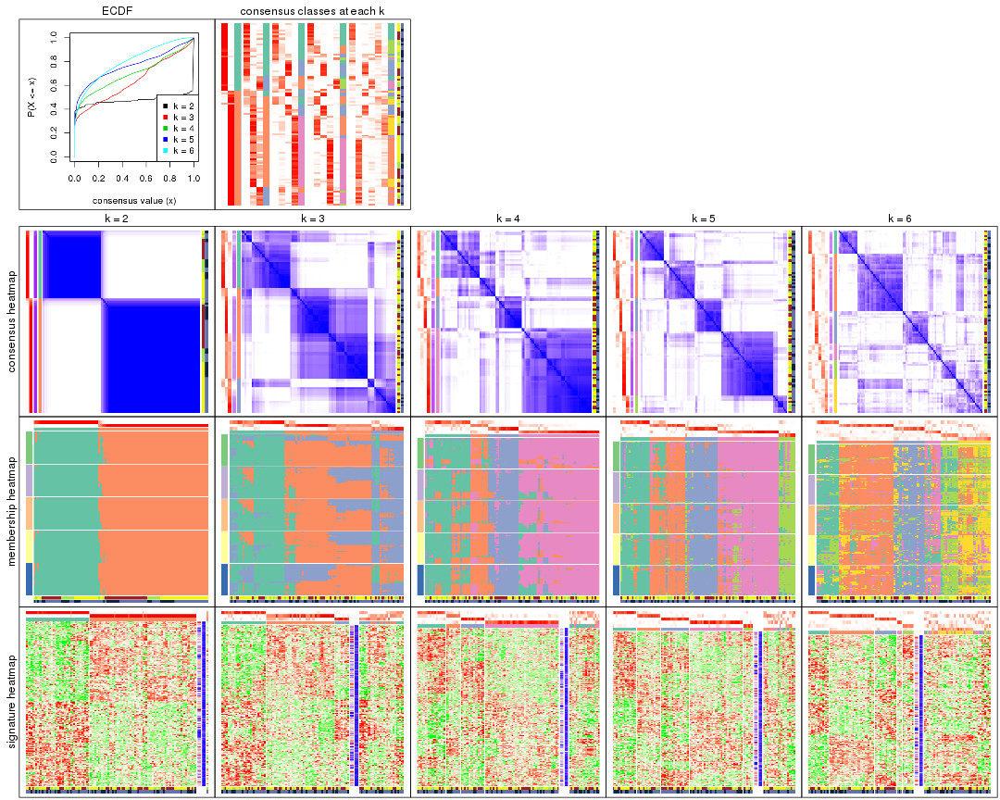

The plots are:

- The first row: a plot of the ECDF (Empirical cumulative distribution
  function) curves of the consensus matrix for each `k` and the heatmap of
  predicted classes for each `k`.
- The second row: heatmaps of the consensus matrix for each `k`.
- The third row: heatmaps of the membership matrix for each `k`.
- The fouth row: heatmaps of the signatures for each `k`.

All the plots in panels can be made by individual functions and they are
plotted later in this section.

`select_partition_number()` produces several plots showing different
statistics for choosing "optimized" `k`. There are following statistics:

- ECDF curves of the consensus matrix for each `k`;
- 1-PAC. [The PAC
  score](https://en.wikipedia.org/wiki/Consensus_clustering#Over-interpretation_potential_of_consensus_clustering)
  measures the proportion of the ambiguous subgrouping.
- Mean silhouette score.
- Concordance. The mean probability of fiting the consensus class ids in all
  partitions.
- Area increased. Denote $A_k$ as the area under the ECDF curve for current
  `k`, the area increased is defined as $A_k - A_{k-1}$.
- Rand index. The percent of pairs of samples that are both in a same cluster
  or both are not in a same cluster in the partition of k and k-1.
- Jaccard index. The ratio of pairs of samples are both in a same cluster in
  the partition of k and k-1 and the pairs of samples are both in a same
  cluster in the partition k or k-1.

The detailed explanations of these statistics can be found in [the cola
vignette](http://bioconductor.org/packages/devel/bioc/vignettes/cola/inst/doc/cola.html#toc_13).

Generally speaking, lower PAC score, higher mean silhouette score or higher
concordance corresponds to better partition. Rand index and Jaccard index
measure how similar the current partition is compared to partition with `k-1`.
If they are too similar, we won't accept `k` is better than `k-1`.

```r
select_partition_number(res)
```


The numeric values for all these statistics can be obtained by `get_stats()`.

```r
get_stats(res)
```

```
#>   k 1-PAC mean_silhouette concordance area_increased  Rand Jaccard
#> 2 2 1.000           0.968       0.987         0.4743 0.529   0.529
#> 3 3 0.500           0.530       0.756         0.3508 0.782   0.612
#> 4 4 0.614           0.640       0.815         0.0965 0.750   0.470
#> 5 5 0.647           0.679       0.832         0.0941 0.789   0.443
#> 6 6 0.566           0.473       0.639         0.0460 0.891   0.590
```

`suggest_best_k()` suggests the best $k$ based on these statistics. The rules are as follows:

- All $k$ with Jaccard index larger than 0.95 are removed because the increase of
  the partition number does not provides enough extra information. If all $k$ are removed,
  the best $k$ is assigned by `NA`.
- For $k$ with 1-PAC larger than 0.9, the maximal $k$ is taken as the "best k". Other $k$ is called "optional k".
- If it does not fit the second rule. The $k$ with the highest vote of highest
  1-PAC, mean silhouette and concordance is taken as the "best k".

```r
suggest_best_k(res)
```

```
#> [1] 2
```


Following shows the table of the partitions (You need to click the **show/hide
code output** link to see it). The membership matrix (columns with name `p*`)
is inferred by
[`clue::cl_consensus()`](https://www.rdocumentation.org/link/cl_consensus?package=clue)
function with the `SE` method. Basically the value in the membership matrix
represents the probability to belong to a certain group. The finall class
label for an item is determined with the group with highest probability it
belongs to.

In `get_classes()` function, the entropy is calculated from the membership
matrix and the silhouette score is calculated from the consensus matrix.


<script>
$( function() {
	$( '#tabs-ATC-NMF-get-classes' ).tabs();
} );
</script>
<div id='tabs-ATC-NMF-get-classes'>
<ul>
<li><a href='#tab-ATC-NMF-get-classes-1'>k = 2</a></li>
<li><a href='#tab-ATC-NMF-get-classes-2'>k = 3</a></li>
<li><a href='#tab-ATC-NMF-get-classes-3'>k = 4</a></li>
<li><a href='#tab-ATC-NMF-get-classes-4'>k = 5</a></li>
<li><a href='#tab-ATC-NMF-get-classes-5'>k = 6</a></li>
</ul>

<div id='tab-ATC-NMF-get-classes-1'>
<p><a id='tab-ATC-NMF-get-classes-1-a' style='color:#0366d6' href='#'>show/hide code output</a></p>
<pre><code class="r">cbind(get_classes(res, k = 2), get_membership(res, k = 2))
</code></pre>

<pre><code>#&gt;            class entropy silhouette    p1    p2
#&gt; GSM1068478     1  0.0000      0.991 1.000 0.000
#&gt; GSM1068479     2  0.0000      0.984 0.000 1.000
#&gt; GSM1068481     2  0.9087      0.525 0.324 0.676
#&gt; GSM1068482     1  0.0000      0.991 1.000 0.000
#&gt; GSM1068483     1  0.0000      0.991 1.000 0.000
#&gt; GSM1068486     2  0.0000      0.984 0.000 1.000
#&gt; GSM1068487     2  0.0000      0.984 0.000 1.000
#&gt; GSM1068488     2  0.0000      0.984 0.000 1.000
#&gt; GSM1068490     2  0.0000      0.984 0.000 1.000
#&gt; GSM1068491     1  0.0000      0.991 1.000 0.000
#&gt; GSM1068492     2  0.0000      0.984 0.000 1.000
#&gt; GSM1068493     2  0.0000      0.984 0.000 1.000
#&gt; GSM1068494     2  0.6148      0.817 0.152 0.848
#&gt; GSM1068495     2  0.0000      0.984 0.000 1.000
#&gt; GSM1068496     1  0.0000      0.991 1.000 0.000
#&gt; GSM1068498     1  0.0000      0.991 1.000 0.000
#&gt; GSM1068499     1  0.0000      0.991 1.000 0.000
#&gt; GSM1068500     1  0.0000      0.991 1.000 0.000
#&gt; GSM1068502     2  0.0000      0.984 0.000 1.000
#&gt; GSM1068503     2  0.0000      0.984 0.000 1.000
#&gt; GSM1068505     2  0.0000      0.984 0.000 1.000
#&gt; GSM1068506     2  0.0000      0.984 0.000 1.000
#&gt; GSM1068507     2  0.0000      0.984 0.000 1.000
#&gt; GSM1068508     2  0.0000      0.984 0.000 1.000
#&gt; GSM1068510     2  0.0000      0.984 0.000 1.000
#&gt; GSM1068512     2  0.0000      0.984 0.000 1.000
#&gt; GSM1068513     2  0.0000      0.984 0.000 1.000
#&gt; GSM1068514     2  0.0000      0.984 0.000 1.000
#&gt; GSM1068517     1  0.0000      0.991 1.000 0.000
#&gt; GSM1068518     1  0.1633      0.970 0.976 0.024
#&gt; GSM1068520     1  0.0000      0.991 1.000 0.000
#&gt; GSM1068521     1  0.0000      0.991 1.000 0.000
#&gt; GSM1068522     2  0.0000      0.984 0.000 1.000
#&gt; GSM1068524     2  0.0000      0.984 0.000 1.000
#&gt; GSM1068527     2  0.0000      0.984 0.000 1.000
#&gt; GSM1068480     1  0.6801      0.779 0.820 0.180
#&gt; GSM1068484     2  0.0000      0.984 0.000 1.000
#&gt; GSM1068485     1  0.0000      0.991 1.000 0.000
#&gt; GSM1068489     2  0.0000      0.984 0.000 1.000
#&gt; GSM1068497     1  0.3274      0.934 0.940 0.060
#&gt; GSM1068501     2  0.0000      0.984 0.000 1.000
#&gt; GSM1068504     2  0.0000      0.984 0.000 1.000
#&gt; GSM1068509     1  0.0000      0.991 1.000 0.000
#&gt; GSM1068511     2  0.0000      0.984 0.000 1.000
#&gt; GSM1068515     1  0.0000      0.991 1.000 0.000
#&gt; GSM1068516     2  0.0000      0.984 0.000 1.000
#&gt; GSM1068519     1  0.0000      0.991 1.000 0.000
#&gt; GSM1068523     2  0.0000      0.984 0.000 1.000
#&gt; GSM1068525     2  0.0000      0.984 0.000 1.000
#&gt; GSM1068526     2  0.0000      0.984 0.000 1.000
#&gt; GSM1068458     1  0.0000      0.991 1.000 0.000
#&gt; GSM1068459     1  0.0000      0.991 1.000 0.000
#&gt; GSM1068460     2  0.9970      0.119 0.468 0.532
#&gt; GSM1068461     1  0.0000      0.991 1.000 0.000
#&gt; GSM1068464     2  0.0000      0.984 0.000 1.000
#&gt; GSM1068468     1  0.0376      0.987 0.996 0.004
#&gt; GSM1068472     1  0.4161      0.908 0.916 0.084
#&gt; GSM1068473     2  0.0000      0.984 0.000 1.000
#&gt; GSM1068474     2  0.0000      0.984 0.000 1.000
#&gt; GSM1068476     2  0.0000      0.984 0.000 1.000
#&gt; GSM1068477     2  0.0000      0.984 0.000 1.000
#&gt; GSM1068462     2  0.4161      0.899 0.084 0.916
#&gt; GSM1068463     1  0.0000      0.991 1.000 0.000
#&gt; GSM1068465     1  0.0000      0.991 1.000 0.000
#&gt; GSM1068466     1  0.0000      0.991 1.000 0.000
#&gt; GSM1068467     1  0.0000      0.991 1.000 0.000
#&gt; GSM1068469     1  0.0000      0.991 1.000 0.000
#&gt; GSM1068470     2  0.0000      0.984 0.000 1.000
#&gt; GSM1068471     2  0.0000      0.984 0.000 1.000
#&gt; GSM1068475     2  0.0000      0.984 0.000 1.000
#&gt; GSM1068528     1  0.0000      0.991 1.000 0.000
#&gt; GSM1068531     1  0.0000      0.991 1.000 0.000
#&gt; GSM1068532     1  0.0000      0.991 1.000 0.000
#&gt; GSM1068533     1  0.0000      0.991 1.000 0.000
#&gt; GSM1068535     2  0.0000      0.984 0.000 1.000
#&gt; GSM1068537     1  0.0000      0.991 1.000 0.000
#&gt; GSM1068538     1  0.0000      0.991 1.000 0.000
#&gt; GSM1068539     2  0.0000      0.984 0.000 1.000
#&gt; GSM1068540     1  0.0000      0.991 1.000 0.000
#&gt; GSM1068542     2  0.0000      0.984 0.000 1.000
#&gt; GSM1068543     2  0.0000      0.984 0.000 1.000
#&gt; GSM1068544     1  0.0000      0.991 1.000 0.000
#&gt; GSM1068545     2  0.0000      0.984 0.000 1.000
#&gt; GSM1068546     2  0.2236      0.950 0.036 0.964
#&gt; GSM1068547     1  0.0000      0.991 1.000 0.000
#&gt; GSM1068548     2  0.0000      0.984 0.000 1.000
#&gt; GSM1068549     1  0.0000      0.991 1.000 0.000
#&gt; GSM1068550     2  0.0000      0.984 0.000 1.000
#&gt; GSM1068551     2  0.0000      0.984 0.000 1.000
#&gt; GSM1068552     2  0.0000      0.984 0.000 1.000
#&gt; GSM1068555     2  0.0000      0.984 0.000 1.000
#&gt; GSM1068556     2  0.0000      0.984 0.000 1.000
#&gt; GSM1068557     2  0.0000      0.984 0.000 1.000
#&gt; GSM1068560     2  0.0000      0.984 0.000 1.000
#&gt; GSM1068561     2  0.0000      0.984 0.000 1.000
#&gt; GSM1068562     2  0.0000      0.984 0.000 1.000
#&gt; GSM1068563     2  0.0000      0.984 0.000 1.000
#&gt; GSM1068565     2  0.0000      0.984 0.000 1.000
#&gt; GSM1068529     2  0.0000      0.984 0.000 1.000
#&gt; GSM1068530     1  0.0000      0.991 1.000 0.000
#&gt; GSM1068534     2  0.0000      0.984 0.000 1.000
#&gt; GSM1068536     2  0.0000      0.984 0.000 1.000
#&gt; GSM1068541     1  0.0000      0.991 1.000 0.000
#&gt; GSM1068553     2  0.0000      0.984 0.000 1.000
#&gt; GSM1068554     2  0.0000      0.984 0.000 1.000
#&gt; GSM1068558     2  0.0000      0.984 0.000 1.000
#&gt; GSM1068559     2  0.0000      0.984 0.000 1.000
#&gt; GSM1068564     2  0.0000      0.984 0.000 1.000
</code></pre>

<script>
$('#tab-ATC-NMF-get-classes-1-a').parent().next().next().hide();
$('#tab-ATC-NMF-get-classes-1-a').click(function(){
  $('#tab-ATC-NMF-get-classes-1-a').parent().next().next().toggle();
  return(false);
});
</script>
</div>

<div id='tab-ATC-NMF-get-classes-2'>
<p><a id='tab-ATC-NMF-get-classes-2-a' style='color:#0366d6' href='#'>show/hide code output</a></p>
<pre><code class="r">cbind(get_classes(res, k = 3), get_membership(res, k = 3))
</code></pre>

<pre><code>#&gt;            class entropy silhouette    p1    p2    p3
#&gt; GSM1068478     1  0.5497     0.6116 0.708 0.292 0.000
#&gt; GSM1068479     2  0.6079     0.5418 0.000 0.612 0.388
#&gt; GSM1068481     1  0.6809     0.3146 0.524 0.464 0.012
#&gt; GSM1068482     1  0.3116     0.7419 0.892 0.108 0.000
#&gt; GSM1068483     3  0.6252    -0.0678 0.444 0.000 0.556
#&gt; GSM1068486     2  0.4121     0.5075 0.168 0.832 0.000
#&gt; GSM1068487     2  0.5216     0.6105 0.000 0.740 0.260
#&gt; GSM1068488     2  0.0424     0.6445 0.008 0.992 0.000
#&gt; GSM1068490     2  0.6111     0.5333 0.000 0.604 0.396
#&gt; GSM1068491     3  0.5138     0.3758 0.252 0.000 0.748
#&gt; GSM1068492     2  0.6154     0.5188 0.000 0.592 0.408
#&gt; GSM1068493     2  0.3879     0.5233 0.152 0.848 0.000
#&gt; GSM1068494     1  0.6274     0.3929 0.544 0.456 0.000
#&gt; GSM1068495     2  0.6026     0.0604 0.376 0.624 0.000
#&gt; GSM1068496     1  0.5785     0.5436 0.696 0.004 0.300
#&gt; GSM1068498     1  0.0424     0.7861 0.992 0.000 0.008
#&gt; GSM1068499     1  0.0424     0.7861 0.992 0.000 0.008
#&gt; GSM1068500     1  0.5406     0.6659 0.780 0.020 0.200
#&gt; GSM1068502     3  0.1163     0.6409 0.000 0.028 0.972
#&gt; GSM1068503     2  0.6062     0.5451 0.000 0.616 0.384
#&gt; GSM1068505     2  0.6079     0.5416 0.000 0.612 0.388
#&gt; GSM1068506     3  0.4555     0.4785 0.000 0.200 0.800
#&gt; GSM1068507     2  0.6045     0.5486 0.000 0.620 0.380
#&gt; GSM1068508     2  0.4555     0.6291 0.000 0.800 0.200
#&gt; GSM1068510     2  0.0000     0.6483 0.000 1.000 0.000
#&gt; GSM1068512     2  0.6140     0.5239 0.000 0.596 0.404
#&gt; GSM1068513     2  0.2165     0.6518 0.000 0.936 0.064
#&gt; GSM1068514     2  0.6095     0.5377 0.000 0.608 0.392
#&gt; GSM1068517     1  0.3686     0.7220 0.860 0.140 0.000
#&gt; GSM1068518     1  0.5831     0.6161 0.708 0.284 0.008
#&gt; GSM1068520     1  0.1529     0.7821 0.960 0.000 0.040
#&gt; GSM1068521     1  0.0592     0.7863 0.988 0.000 0.012
#&gt; GSM1068522     3  0.5591     0.2701 0.000 0.304 0.696
#&gt; GSM1068524     2  0.0237     0.6498 0.000 0.996 0.004
#&gt; GSM1068527     2  0.6252     0.4596 0.000 0.556 0.444
#&gt; GSM1068480     1  0.6140     0.4890 0.596 0.404 0.000
#&gt; GSM1068484     2  0.6180     0.5067 0.000 0.584 0.416
#&gt; GSM1068485     1  0.1411     0.7831 0.964 0.000 0.036
#&gt; GSM1068489     2  0.6026     0.5512 0.000 0.624 0.376
#&gt; GSM1068497     1  0.6095     0.5071 0.608 0.392 0.000
#&gt; GSM1068501     2  0.6309     0.3379 0.000 0.500 0.500
#&gt; GSM1068504     2  0.0747     0.6516 0.000 0.984 0.016
#&gt; GSM1068509     3  0.6008     0.1199 0.372 0.000 0.628
#&gt; GSM1068511     3  0.3412     0.5765 0.000 0.124 0.876
#&gt; GSM1068515     1  0.0892     0.7857 0.980 0.000 0.020
#&gt; GSM1068516     2  0.6180    -0.0700 0.416 0.584 0.000
#&gt; GSM1068519     1  0.3267     0.7432 0.884 0.000 0.116
#&gt; GSM1068523     2  0.0475     0.6485 0.004 0.992 0.004
#&gt; GSM1068525     2  0.0237     0.6498 0.000 0.996 0.004
#&gt; GSM1068526     2  0.5560     0.5940 0.000 0.700 0.300
#&gt; GSM1068458     1  0.1529     0.7826 0.960 0.000 0.040
#&gt; GSM1068459     1  0.7056     0.3446 0.572 0.024 0.404
#&gt; GSM1068460     2  0.6600     0.1265 0.384 0.604 0.012
#&gt; GSM1068461     1  0.0592     0.7863 0.988 0.000 0.012
#&gt; GSM1068464     3  0.6308    -0.3621 0.000 0.492 0.508
#&gt; GSM1068468     3  0.1163     0.6452 0.028 0.000 0.972
#&gt; GSM1068472     3  0.0237     0.6474 0.004 0.000 0.996
#&gt; GSM1068473     3  0.5835     0.1589 0.000 0.340 0.660
#&gt; GSM1068474     2  0.6308     0.3576 0.000 0.508 0.492
#&gt; GSM1068476     2  0.0592     0.6513 0.000 0.988 0.012
#&gt; GSM1068477     2  0.2625     0.6493 0.000 0.916 0.084
#&gt; GSM1068462     2  0.5263     0.6259 0.060 0.824 0.116
#&gt; GSM1068463     1  0.1964     0.7762 0.944 0.000 0.056
#&gt; GSM1068465     3  0.0424     0.6473 0.008 0.000 0.992
#&gt; GSM1068466     1  0.4399     0.6806 0.812 0.000 0.188
#&gt; GSM1068467     1  0.0592     0.7863 0.988 0.000 0.012
#&gt; GSM1068469     1  0.5497     0.5675 0.708 0.000 0.292
#&gt; GSM1068470     2  0.1289     0.6522 0.000 0.968 0.032
#&gt; GSM1068471     2  0.6280     0.4300 0.000 0.540 0.460
#&gt; GSM1068475     2  0.6140     0.5240 0.000 0.596 0.404
#&gt; GSM1068528     1  0.0424     0.7861 0.992 0.000 0.008
#&gt; GSM1068531     1  0.1711     0.7844 0.960 0.008 0.032
#&gt; GSM1068532     1  0.5678     0.5197 0.684 0.000 0.316
#&gt; GSM1068533     1  0.1267     0.7853 0.972 0.004 0.024
#&gt; GSM1068535     2  0.6008     0.5717 0.004 0.664 0.332
#&gt; GSM1068537     3  0.6225    -0.0351 0.432 0.000 0.568
#&gt; GSM1068538     3  0.6309    -0.1941 0.496 0.000 0.504
#&gt; GSM1068539     2  0.6062     0.0366 0.384 0.616 0.000
#&gt; GSM1068540     1  0.1711     0.7844 0.960 0.008 0.032
#&gt; GSM1068542     3  0.3482     0.5721 0.000 0.128 0.872
#&gt; GSM1068543     2  0.0237     0.6498 0.000 0.996 0.004
#&gt; GSM1068544     1  0.0424     0.7861 0.992 0.000 0.008
#&gt; GSM1068545     2  0.6291     0.4132 0.000 0.532 0.468
#&gt; GSM1068546     1  0.6295     0.3587 0.528 0.472 0.000
#&gt; GSM1068547     1  0.3551     0.7319 0.868 0.000 0.132
#&gt; GSM1068548     3  0.0747     0.6443 0.000 0.016 0.984
#&gt; GSM1068549     1  0.2537     0.7575 0.920 0.080 0.000
#&gt; GSM1068550     2  0.6095     0.5377 0.000 0.608 0.392
#&gt; GSM1068551     2  0.5363     0.6045 0.000 0.724 0.276
#&gt; GSM1068552     2  0.6126     0.5288 0.000 0.600 0.400
#&gt; GSM1068555     2  0.0000     0.6483 0.000 1.000 0.000
#&gt; GSM1068556     3  0.5529     0.2928 0.000 0.296 0.704
#&gt; GSM1068557     2  0.0592     0.6422 0.012 0.988 0.000
#&gt; GSM1068560     2  0.0237     0.6498 0.000 0.996 0.004
#&gt; GSM1068561     2  0.1163     0.6317 0.028 0.972 0.000
#&gt; GSM1068562     2  0.0592     0.6513 0.000 0.988 0.012
#&gt; GSM1068563     3  0.1289     0.6389 0.000 0.032 0.968
#&gt; GSM1068565     2  0.4750     0.6248 0.000 0.784 0.216
#&gt; GSM1068529     2  0.0424     0.6445 0.008 0.992 0.000
#&gt; GSM1068530     1  0.6307     0.1693 0.512 0.000 0.488
#&gt; GSM1068534     2  0.5948     0.5611 0.000 0.640 0.360
#&gt; GSM1068536     2  0.6204    -0.1006 0.424 0.576 0.000
#&gt; GSM1068541     3  0.2959     0.5927 0.100 0.000 0.900
#&gt; GSM1068553     3  0.5497     0.3013 0.000 0.292 0.708
#&gt; GSM1068554     2  0.6280     0.4300 0.000 0.540 0.460
#&gt; GSM1068558     2  0.0424     0.6445 0.008 0.992 0.000
#&gt; GSM1068559     2  0.1860     0.6141 0.052 0.948 0.000
#&gt; GSM1068564     2  0.6168     0.5128 0.000 0.588 0.412
</code></pre>

<script>
$('#tab-ATC-NMF-get-classes-2-a').parent().next().next().hide();
$('#tab-ATC-NMF-get-classes-2-a').click(function(){
  $('#tab-ATC-NMF-get-classes-2-a').parent().next().next().toggle();
  return(false);
});
</script>
</div>

<div id='tab-ATC-NMF-get-classes-3'>
<p><a id='tab-ATC-NMF-get-classes-3-a' style='color:#0366d6' href='#'>show/hide code output</a></p>
<pre><code class="r">cbind(get_classes(res, k = 4), get_membership(res, k = 4))
</code></pre>

<pre><code>#&gt;            class entropy silhouette    p1    p2    p3    p4
#&gt; GSM1068478     3  0.0188     0.8007 0.004 0.000 0.996 0.000
#&gt; GSM1068479     4  0.1706     0.8361 0.036 0.016 0.000 0.948
#&gt; GSM1068481     3  0.0000     0.8013 0.000 0.000 1.000 0.000
#&gt; GSM1068482     1  0.5272     0.5355 0.680 0.032 0.288 0.000
#&gt; GSM1068483     2  0.5972     0.5223 0.304 0.632 0.064 0.000
#&gt; GSM1068486     3  0.1305     0.7908 0.000 0.004 0.960 0.036
#&gt; GSM1068487     4  0.0469     0.8424 0.000 0.012 0.000 0.988
#&gt; GSM1068488     4  0.5157     0.5964 0.000 0.028 0.284 0.688
#&gt; GSM1068490     4  0.0000     0.8427 0.000 0.000 0.000 1.000
#&gt; GSM1068491     2  0.4699     0.5602 0.320 0.676 0.000 0.004
#&gt; GSM1068492     4  0.0592     0.8409 0.000 0.016 0.000 0.984
#&gt; GSM1068493     3  0.1398     0.7887 0.000 0.004 0.956 0.040
#&gt; GSM1068494     1  0.7276     0.3541 0.524 0.148 0.324 0.004
#&gt; GSM1068495     1  0.6821     0.4894 0.592 0.256 0.000 0.152
#&gt; GSM1068496     3  0.3402     0.6780 0.164 0.004 0.832 0.000
#&gt; GSM1068498     1  0.3610     0.6187 0.800 0.200 0.000 0.000
#&gt; GSM1068499     1  0.1489     0.6102 0.952 0.004 0.044 0.000
#&gt; GSM1068500     3  0.0000     0.8013 0.000 0.000 1.000 0.000
#&gt; GSM1068502     2  0.4916     0.3863 0.000 0.576 0.000 0.424
#&gt; GSM1068503     4  0.0336     0.8421 0.000 0.008 0.000 0.992
#&gt; GSM1068505     4  0.0657     0.8414 0.000 0.012 0.004 0.984
#&gt; GSM1068506     4  0.4103     0.5827 0.000 0.256 0.000 0.744
#&gt; GSM1068507     4  0.0000     0.8427 0.000 0.000 0.000 1.000
#&gt; GSM1068508     4  0.1970     0.8312 0.008 0.060 0.000 0.932
#&gt; GSM1068510     4  0.5383     0.7102 0.000 0.128 0.128 0.744
#&gt; GSM1068512     4  0.2483     0.8163 0.000 0.032 0.052 0.916
#&gt; GSM1068513     4  0.1733     0.8375 0.000 0.028 0.024 0.948
#&gt; GSM1068514     4  0.0657     0.8414 0.000 0.012 0.004 0.984
#&gt; GSM1068517     1  0.4008     0.6112 0.756 0.244 0.000 0.000
#&gt; GSM1068518     1  0.4767     0.5984 0.724 0.256 0.000 0.020
#&gt; GSM1068520     1  0.6019     0.4005 0.688 0.136 0.176 0.000
#&gt; GSM1068521     1  0.1406     0.6062 0.960 0.024 0.016 0.000
#&gt; GSM1068522     4  0.2469     0.7898 0.000 0.108 0.000 0.892
#&gt; GSM1068524     4  0.4252     0.7085 0.000 0.252 0.004 0.744
#&gt; GSM1068527     4  0.2334     0.8036 0.000 0.088 0.004 0.908
#&gt; GSM1068480     1  0.6194     0.5275 0.644 0.096 0.260 0.000
#&gt; GSM1068484     4  0.0592     0.8409 0.000 0.016 0.000 0.984
#&gt; GSM1068485     1  0.3550     0.5713 0.860 0.044 0.096 0.000
#&gt; GSM1068489     4  0.0804     0.8420 0.000 0.012 0.008 0.980
#&gt; GSM1068497     1  0.4864     0.6087 0.724 0.256 0.012 0.008
#&gt; GSM1068501     4  0.1792     0.8189 0.000 0.068 0.000 0.932
#&gt; GSM1068504     4  0.3400     0.7679 0.000 0.180 0.000 0.820
#&gt; GSM1068509     2  0.4813     0.6100 0.268 0.716 0.012 0.004
#&gt; GSM1068511     4  0.4699     0.4306 0.000 0.320 0.004 0.676
#&gt; GSM1068515     1  0.0817     0.6078 0.976 0.024 0.000 0.000
#&gt; GSM1068516     1  0.6054     0.5530 0.656 0.256 0.000 0.088
#&gt; GSM1068519     1  0.5668     0.2457 0.652 0.300 0.048 0.000
#&gt; GSM1068523     4  0.6698     0.5399 0.140 0.256 0.000 0.604
#&gt; GSM1068525     4  0.3196     0.7929 0.000 0.136 0.008 0.856
#&gt; GSM1068526     4  0.0000     0.8427 0.000 0.000 0.000 1.000
#&gt; GSM1068458     1  0.2814     0.5437 0.868 0.132 0.000 0.000
#&gt; GSM1068459     3  0.0000     0.8013 0.000 0.000 1.000 0.000
#&gt; GSM1068460     1  0.5520     0.5797 0.696 0.244 0.000 0.060
#&gt; GSM1068461     1  0.1305     0.6209 0.960 0.036 0.004 0.000
#&gt; GSM1068464     4  0.1716     0.8253 0.000 0.064 0.000 0.936
#&gt; GSM1068468     2  0.5902     0.6725 0.140 0.700 0.000 0.160
#&gt; GSM1068472     2  0.4711     0.6517 0.024 0.740 0.000 0.236
#&gt; GSM1068473     4  0.2281     0.8034 0.000 0.096 0.000 0.904
#&gt; GSM1068474     4  0.1716     0.8240 0.000 0.064 0.000 0.936
#&gt; GSM1068476     4  0.4155     0.7188 0.004 0.240 0.000 0.756
#&gt; GSM1068477     4  0.5598     0.6714 0.076 0.220 0.000 0.704
#&gt; GSM1068462     1  0.7700     0.2675 0.448 0.248 0.000 0.304
#&gt; GSM1068463     3  0.5090     0.4416 0.324 0.016 0.660 0.000
#&gt; GSM1068465     2  0.5250     0.6719 0.176 0.744 0.000 0.080
#&gt; GSM1068466     1  0.7101     0.1618 0.504 0.136 0.360 0.000
#&gt; GSM1068467     1  0.3982     0.6144 0.776 0.220 0.000 0.004
#&gt; GSM1068469     1  0.3978     0.4691 0.796 0.192 0.012 0.000
#&gt; GSM1068470     4  0.1792     0.8290 0.000 0.068 0.000 0.932
#&gt; GSM1068471     4  0.1118     0.8342 0.000 0.036 0.000 0.964
#&gt; GSM1068475     4  0.0336     0.8435 0.008 0.000 0.000 0.992
#&gt; GSM1068528     1  0.3325     0.5763 0.864 0.024 0.112 0.000
#&gt; GSM1068531     3  0.0469     0.7992 0.012 0.000 0.988 0.000
#&gt; GSM1068532     1  0.6862    -0.1618 0.488 0.408 0.104 0.000
#&gt; GSM1068533     3  0.3982     0.6182 0.220 0.004 0.776 0.000
#&gt; GSM1068535     3  0.2081     0.7554 0.000 0.000 0.916 0.084
#&gt; GSM1068537     3  0.6112     0.4749 0.248 0.096 0.656 0.000
#&gt; GSM1068538     2  0.4961     0.3362 0.448 0.552 0.000 0.000
#&gt; GSM1068539     1  0.6656     0.5057 0.608 0.256 0.000 0.136
#&gt; GSM1068540     3  0.0895     0.7953 0.020 0.004 0.976 0.000
#&gt; GSM1068542     4  0.4250     0.5556 0.000 0.276 0.000 0.724
#&gt; GSM1068543     4  0.5109     0.6902 0.000 0.060 0.196 0.744
#&gt; GSM1068544     1  0.2480     0.5956 0.904 0.008 0.088 0.000
#&gt; GSM1068545     4  0.1557     0.8272 0.000 0.056 0.000 0.944
#&gt; GSM1068546     3  0.0188     0.8014 0.000 0.000 0.996 0.004
#&gt; GSM1068547     1  0.4908     0.2948 0.692 0.292 0.016 0.000
#&gt; GSM1068548     2  0.4543     0.6047 0.000 0.676 0.000 0.324
#&gt; GSM1068549     3  0.1022     0.7918 0.032 0.000 0.968 0.000
#&gt; GSM1068550     4  0.0657     0.8414 0.000 0.012 0.004 0.984
#&gt; GSM1068551     4  0.0817     0.8411 0.000 0.024 0.000 0.976
#&gt; GSM1068552     4  0.0469     0.8414 0.000 0.012 0.000 0.988
#&gt; GSM1068555     4  0.4422     0.7001 0.008 0.256 0.000 0.736
#&gt; GSM1068556     4  0.2469     0.7886 0.000 0.108 0.000 0.892
#&gt; GSM1068557     4  0.4546     0.6962 0.012 0.256 0.000 0.732
#&gt; GSM1068560     4  0.3610     0.7535 0.000 0.200 0.000 0.800
#&gt; GSM1068561     3  0.5760     0.0512 0.000 0.028 0.524 0.448
#&gt; GSM1068562     4  0.1867     0.8275 0.000 0.072 0.000 0.928
#&gt; GSM1068563     2  0.4500     0.6127 0.000 0.684 0.000 0.316
#&gt; GSM1068565     4  0.1022     0.8395 0.000 0.032 0.000 0.968
#&gt; GSM1068529     3  0.5452     0.1513 0.000 0.016 0.556 0.428
#&gt; GSM1068530     1  0.5606    -0.2563 0.500 0.480 0.020 0.000
#&gt; GSM1068534     3  0.4103     0.5637 0.000 0.000 0.744 0.256
#&gt; GSM1068536     3  0.3129     0.7655 0.040 0.028 0.900 0.032
#&gt; GSM1068541     2  0.5170     0.6531 0.228 0.724 0.000 0.048
#&gt; GSM1068553     4  0.6690     0.2101 0.000 0.100 0.352 0.548
#&gt; GSM1068554     4  0.1637     0.8230 0.000 0.060 0.000 0.940
#&gt; GSM1068558     4  0.5466     0.7043 0.008 0.200 0.060 0.732
#&gt; GSM1068559     4  0.7611     0.2480 0.268 0.256 0.000 0.476
#&gt; GSM1068564     4  0.0592     0.8409 0.000 0.016 0.000 0.984
</code></pre>

<script>
$('#tab-ATC-NMF-get-classes-3-a').parent().next().next().hide();
$('#tab-ATC-NMF-get-classes-3-a').click(function(){
  $('#tab-ATC-NMF-get-classes-3-a').parent().next().next().toggle();
  return(false);
});
</script>
</div>

<div id='tab-ATC-NMF-get-classes-4'>
<p><a id='tab-ATC-NMF-get-classes-4-a' style='color:#0366d6' href='#'>show/hide code output</a></p>
<pre><code class="r">cbind(get_classes(res, k = 5), get_membership(res, k = 5))
</code></pre>

<pre><code>#&gt;            class entropy silhouette    p1    p2    p3    p4    p5
#&gt; GSM1068478     3  0.1205     0.8468 0.040 0.000 0.956 0.000 0.004
#&gt; GSM1068479     4  0.4249     0.3172 0.000 0.432 0.000 0.568 0.000
#&gt; GSM1068481     3  0.1357     0.8432 0.048 0.000 0.948 0.000 0.004
#&gt; GSM1068482     1  0.1408     0.7857 0.948 0.000 0.044 0.000 0.008
#&gt; GSM1068483     1  0.4169     0.6994 0.784 0.000 0.116 0.000 0.100
#&gt; GSM1068486     3  0.1082     0.8504 0.028 0.000 0.964 0.000 0.008
#&gt; GSM1068487     4  0.0771     0.8499 0.000 0.020 0.000 0.976 0.004
#&gt; GSM1068488     4  0.2465     0.8293 0.004 0.028 0.044 0.912 0.012
#&gt; GSM1068490     4  0.1043     0.8476 0.000 0.040 0.000 0.960 0.000
#&gt; GSM1068491     5  0.1281     0.6860 0.032 0.012 0.000 0.000 0.956
#&gt; GSM1068492     4  0.0162     0.8496 0.000 0.004 0.000 0.996 0.000
#&gt; GSM1068493     1  0.6025     0.4046 0.612 0.000 0.180 0.200 0.008
#&gt; GSM1068494     2  0.4644     0.4511 0.024 0.708 0.252 0.000 0.016
#&gt; GSM1068495     2  0.2942     0.7067 0.128 0.856 0.000 0.008 0.008
#&gt; GSM1068496     1  0.4644     0.3824 0.604 0.000 0.380 0.012 0.004
#&gt; GSM1068498     2  0.4350     0.4080 0.408 0.588 0.000 0.000 0.004
#&gt; GSM1068499     1  0.0703     0.7898 0.976 0.024 0.000 0.000 0.000
#&gt; GSM1068500     3  0.1095     0.8529 0.012 0.008 0.968 0.000 0.012
#&gt; GSM1068502     4  0.3039     0.7244 0.000 0.000 0.000 0.808 0.192
#&gt; GSM1068503     4  0.0404     0.8506 0.000 0.012 0.000 0.988 0.000
#&gt; GSM1068505     4  0.0000     0.8486 0.000 0.000 0.000 1.000 0.000
#&gt; GSM1068506     5  0.4268     0.4370 0.000 0.000 0.008 0.344 0.648
#&gt; GSM1068507     2  0.6077    -0.0359 0.000 0.512 0.392 0.016 0.080
#&gt; GSM1068508     2  0.2367     0.7084 0.000 0.904 0.004 0.072 0.020
#&gt; GSM1068510     4  0.5903     0.4656 0.000 0.312 0.092 0.584 0.012
#&gt; GSM1068512     3  0.3617     0.7609 0.000 0.028 0.840 0.104 0.028
#&gt; GSM1068513     4  0.6286     0.4646 0.000 0.112 0.272 0.588 0.028
#&gt; GSM1068514     4  0.0162     0.8496 0.000 0.004 0.000 0.996 0.000
#&gt; GSM1068517     2  0.4151     0.5180 0.344 0.652 0.000 0.000 0.004
#&gt; GSM1068518     2  0.4434     0.2796 0.460 0.536 0.000 0.000 0.004
#&gt; GSM1068520     5  0.4478     0.5519 0.240 0.016 0.020 0.000 0.724
#&gt; GSM1068521     1  0.1893     0.7741 0.928 0.048 0.000 0.000 0.024
#&gt; GSM1068522     4  0.0880     0.8422 0.000 0.000 0.000 0.968 0.032
#&gt; GSM1068524     4  0.3242     0.7758 0.000 0.172 0.000 0.816 0.012
#&gt; GSM1068527     3  0.5097     0.7284 0.000 0.068 0.752 0.060 0.120
#&gt; GSM1068480     3  0.6972    -0.1504 0.256 0.348 0.388 0.000 0.008
#&gt; GSM1068484     4  0.0404     0.8503 0.000 0.012 0.000 0.988 0.000
#&gt; GSM1068485     1  0.0451     0.7946 0.988 0.008 0.004 0.000 0.000
#&gt; GSM1068489     4  0.3634     0.7195 0.000 0.008 0.184 0.796 0.012
#&gt; GSM1068497     2  0.4549     0.2797 0.464 0.528 0.000 0.000 0.008
#&gt; GSM1068501     4  0.0162     0.8477 0.000 0.000 0.000 0.996 0.004
#&gt; GSM1068504     2  0.4242     0.1334 0.000 0.572 0.000 0.428 0.000
#&gt; GSM1068509     1  0.3267     0.7564 0.864 0.000 0.044 0.016 0.076
#&gt; GSM1068511     4  0.1026     0.8394 0.004 0.000 0.004 0.968 0.024
#&gt; GSM1068515     1  0.4453     0.5448 0.724 0.228 0.000 0.000 0.048
#&gt; GSM1068516     2  0.3521     0.6882 0.172 0.808 0.000 0.012 0.008
#&gt; GSM1068519     1  0.2074     0.7691 0.896 0.000 0.000 0.000 0.104
#&gt; GSM1068523     2  0.2575     0.7076 0.012 0.884 0.000 0.100 0.004
#&gt; GSM1068525     4  0.1704     0.8382 0.000 0.068 0.000 0.928 0.004
#&gt; GSM1068526     4  0.1410     0.8425 0.000 0.060 0.000 0.940 0.000
#&gt; GSM1068458     5  0.4824     0.3364 0.376 0.028 0.000 0.000 0.596
#&gt; GSM1068459     3  0.1892     0.8224 0.080 0.000 0.916 0.000 0.004
#&gt; GSM1068460     2  0.2630     0.6666 0.016 0.892 0.012 0.000 0.080
#&gt; GSM1068461     1  0.3861     0.4465 0.712 0.284 0.000 0.000 0.004
#&gt; GSM1068464     4  0.3783     0.6667 0.000 0.008 0.000 0.740 0.252
#&gt; GSM1068468     5  0.1329     0.6907 0.032 0.004 0.000 0.008 0.956
#&gt; GSM1068472     5  0.6066     0.3394 0.124 0.000 0.000 0.388 0.488
#&gt; GSM1068473     4  0.0162     0.8477 0.000 0.000 0.000 0.996 0.004
#&gt; GSM1068474     4  0.4058     0.6825 0.000 0.024 0.000 0.740 0.236
#&gt; GSM1068476     2  0.2100     0.6970 0.000 0.924 0.048 0.012 0.016
#&gt; GSM1068477     2  0.3419     0.6575 0.016 0.804 0.000 0.180 0.000
#&gt; GSM1068462     2  0.3164     0.7021 0.076 0.868 0.000 0.012 0.044
#&gt; GSM1068463     1  0.3048     0.7005 0.820 0.000 0.176 0.000 0.004
#&gt; GSM1068465     5  0.1059     0.6892 0.020 0.004 0.000 0.008 0.968
#&gt; GSM1068466     3  0.5397     0.1594 0.032 0.012 0.488 0.000 0.468
#&gt; GSM1068467     2  0.3491     0.6518 0.228 0.768 0.000 0.000 0.004
#&gt; GSM1068469     1  0.1469     0.7851 0.948 0.016 0.000 0.000 0.036
#&gt; GSM1068470     4  0.3242     0.7374 0.000 0.216 0.000 0.784 0.000
#&gt; GSM1068471     4  0.0771     0.8487 0.000 0.004 0.000 0.976 0.020
#&gt; GSM1068475     4  0.1341     0.8436 0.000 0.056 0.000 0.944 0.000
#&gt; GSM1068528     1  0.0510     0.7946 0.984 0.000 0.016 0.000 0.000
#&gt; GSM1068531     3  0.1365     0.8522 0.040 0.004 0.952 0.000 0.004
#&gt; GSM1068532     1  0.3201     0.7575 0.852 0.000 0.052 0.000 0.096
#&gt; GSM1068533     3  0.2597     0.8407 0.020 0.040 0.904 0.000 0.036
#&gt; GSM1068535     3  0.0566     0.8532 0.012 0.000 0.984 0.004 0.000
#&gt; GSM1068537     3  0.4255     0.7183 0.128 0.000 0.776 0.000 0.096
#&gt; GSM1068538     5  0.3837     0.4647 0.308 0.000 0.000 0.000 0.692
#&gt; GSM1068539     2  0.4979     0.6530 0.212 0.708 0.000 0.072 0.008
#&gt; GSM1068540     3  0.1444     0.8506 0.040 0.000 0.948 0.000 0.012
#&gt; GSM1068542     4  0.2852     0.7529 0.000 0.000 0.000 0.828 0.172
#&gt; GSM1068543     4  0.4845     0.7373 0.000 0.124 0.108 0.752 0.016
#&gt; GSM1068544     1  0.0671     0.7919 0.980 0.016 0.004 0.000 0.000
#&gt; GSM1068545     4  0.3099     0.7971 0.000 0.028 0.000 0.848 0.124
#&gt; GSM1068546     3  0.0613     0.8534 0.004 0.008 0.984 0.000 0.004
#&gt; GSM1068547     1  0.3741     0.5783 0.732 0.004 0.000 0.000 0.264
#&gt; GSM1068548     4  0.2230     0.7940 0.000 0.000 0.000 0.884 0.116
#&gt; GSM1068549     3  0.1885     0.8469 0.020 0.044 0.932 0.000 0.004
#&gt; GSM1068550     4  0.0290     0.8501 0.000 0.008 0.000 0.992 0.000
#&gt; GSM1068551     4  0.3876     0.5911 0.000 0.316 0.000 0.684 0.000
#&gt; GSM1068552     4  0.0162     0.8496 0.000 0.004 0.000 0.996 0.000
#&gt; GSM1068555     2  0.3129     0.6702 0.000 0.832 0.004 0.156 0.008
#&gt; GSM1068556     4  0.0290     0.8464 0.000 0.000 0.000 0.992 0.008
#&gt; GSM1068557     2  0.2316     0.7085 0.000 0.916 0.036 0.036 0.012
#&gt; GSM1068560     2  0.3113     0.6986 0.000 0.868 0.044 0.080 0.008
#&gt; GSM1068561     3  0.3093     0.7830 0.000 0.168 0.824 0.000 0.008
#&gt; GSM1068562     4  0.4806     0.3604 0.000 0.408 0.016 0.572 0.004
#&gt; GSM1068563     5  0.3816     0.5371 0.000 0.000 0.000 0.304 0.696
#&gt; GSM1068565     2  0.4370     0.4056 0.000 0.656 0.008 0.332 0.004
#&gt; GSM1068529     3  0.3106     0.7990 0.000 0.140 0.840 0.000 0.020
#&gt; GSM1068530     1  0.2179     0.7639 0.888 0.000 0.000 0.000 0.112
#&gt; GSM1068534     3  0.1012     0.8502 0.000 0.000 0.968 0.020 0.012
#&gt; GSM1068536     3  0.2612     0.8114 0.000 0.124 0.868 0.000 0.008
#&gt; GSM1068541     5  0.2208     0.6858 0.072 0.000 0.000 0.020 0.908
#&gt; GSM1068553     4  0.2802     0.7538 0.016 0.000 0.100 0.876 0.008
#&gt; GSM1068554     4  0.0162     0.8477 0.000 0.000 0.000 0.996 0.004
#&gt; GSM1068558     4  0.4394     0.6661 0.000 0.256 0.016 0.716 0.012
#&gt; GSM1068559     2  0.1300     0.6998 0.000 0.956 0.028 0.000 0.016
#&gt; GSM1068564     4  0.0290     0.8501 0.000 0.008 0.000 0.992 0.000
</code></pre>

<script>
$('#tab-ATC-NMF-get-classes-4-a').parent().next().next().hide();
$('#tab-ATC-NMF-get-classes-4-a').click(function(){
  $('#tab-ATC-NMF-get-classes-4-a').parent().next().next().toggle();
  return(false);
});
</script>
</div>

<div id='tab-ATC-NMF-get-classes-5'>
<p><a id='tab-ATC-NMF-get-classes-5-a' style='color:#0366d6' href='#'>show/hide code output</a></p>
<pre><code class="r">cbind(get_classes(res, k = 6), get_membership(res, k = 6))
</code></pre>

<pre><code>#&gt;            class entropy silhouette    p1    p2    p3    p4    p5    p6
#&gt; GSM1068478     3  0.3799     0.6485 0.112 0.000 0.804 0.008 0.068 0.008
#&gt; GSM1068479     2  0.7369    -0.0465 0.000 0.396 0.000 0.152 0.192 0.260
#&gt; GSM1068481     3  0.2532     0.6789 0.032 0.000 0.884 0.008 0.076 0.000
#&gt; GSM1068482     1  0.4988     0.5435 0.676 0.000 0.096 0.012 0.212 0.004
#&gt; GSM1068483     1  0.5077     0.5958 0.712 0.000 0.124 0.072 0.092 0.000
#&gt; GSM1068486     3  0.2503     0.6884 0.024 0.000 0.896 0.008 0.060 0.012
#&gt; GSM1068487     2  0.1829     0.7379 0.000 0.920 0.000 0.012 0.004 0.064
#&gt; GSM1068488     2  0.4710     0.6770 0.008 0.756 0.036 0.012 0.048 0.140
#&gt; GSM1068490     2  0.2393     0.7424 0.000 0.884 0.000 0.020 0.004 0.092
#&gt; GSM1068491     4  0.4668     0.5358 0.040 0.044 0.000 0.764 0.032 0.120
#&gt; GSM1068492     2  0.2039     0.7497 0.000 0.908 0.000 0.016 0.004 0.072
#&gt; GSM1068493     3  0.7687     0.0484 0.268 0.152 0.400 0.012 0.164 0.004
#&gt; GSM1068494     6  0.5665     0.1505 0.000 0.000 0.172 0.004 0.284 0.540
#&gt; GSM1068495     6  0.5079    -0.0496 0.048 0.008 0.000 0.004 0.416 0.524
#&gt; GSM1068496     3  0.6130     0.3416 0.288 0.020 0.560 0.012 0.112 0.008
#&gt; GSM1068498     5  0.4455     0.6619 0.160 0.000 0.000 0.000 0.712 0.128
#&gt; GSM1068499     1  0.2823     0.5997 0.796 0.000 0.000 0.000 0.204 0.000
#&gt; GSM1068500     3  0.2293     0.6925 0.004 0.000 0.896 0.016 0.004 0.080
#&gt; GSM1068502     2  0.3317     0.6662 0.000 0.804 0.000 0.168 0.012 0.016
#&gt; GSM1068503     2  0.1367     0.7447 0.000 0.944 0.000 0.000 0.012 0.044
#&gt; GSM1068505     2  0.2146     0.7388 0.000 0.880 0.000 0.004 0.000 0.116
#&gt; GSM1068506     4  0.5945     0.3620 0.008 0.328 0.044 0.560 0.012 0.048
#&gt; GSM1068507     6  0.6284     0.1827 0.000 0.044 0.116 0.184 0.040 0.616
#&gt; GSM1068508     6  0.6804     0.1930 0.000 0.088 0.000 0.172 0.260 0.480
#&gt; GSM1068510     6  0.5745     0.1922 0.000 0.356 0.004 0.012 0.112 0.516
#&gt; GSM1068512     3  0.6701     0.3781 0.000 0.136 0.584 0.120 0.024 0.136
#&gt; GSM1068513     6  0.6515     0.0427 0.000 0.392 0.148 0.028 0.012 0.420
#&gt; GSM1068514     2  0.1820     0.7529 0.000 0.924 0.000 0.012 0.008 0.056
#&gt; GSM1068517     5  0.5080     0.6447 0.236 0.000 0.000 0.000 0.624 0.140
#&gt; GSM1068518     5  0.4955     0.6533 0.204 0.000 0.000 0.004 0.660 0.132
#&gt; GSM1068520     4  0.7585     0.0545 0.344 0.000 0.180 0.364 0.076 0.036
#&gt; GSM1068521     1  0.4040     0.5097 0.688 0.000 0.000 0.032 0.280 0.000
#&gt; GSM1068522     2  0.2002     0.7417 0.000 0.908 0.000 0.076 0.004 0.012
#&gt; GSM1068524     2  0.4303     0.5015 0.000 0.640 0.000 0.012 0.016 0.332
#&gt; GSM1068527     4  0.7538     0.2231 0.004 0.088 0.220 0.432 0.020 0.236
#&gt; GSM1068480     5  0.6840     0.4316 0.136 0.000 0.268 0.004 0.492 0.100
#&gt; GSM1068484     2  0.0972     0.7517 0.000 0.964 0.000 0.008 0.000 0.028
#&gt; GSM1068485     1  0.2613     0.6599 0.848 0.000 0.012 0.000 0.140 0.000
#&gt; GSM1068489     2  0.5116     0.5722 0.000 0.684 0.088 0.040 0.000 0.188
#&gt; GSM1068497     5  0.5387     0.5101 0.332 0.000 0.004 0.004 0.560 0.100
#&gt; GSM1068501     2  0.6130     0.6066 0.104 0.684 0.020 0.056 0.056 0.080
#&gt; GSM1068504     2  0.5214     0.0982 0.000 0.480 0.000 0.008 0.068 0.444
#&gt; GSM1068509     1  0.4194     0.6384 0.796 0.008 0.072 0.028 0.092 0.004
#&gt; GSM1068511     2  0.3541     0.6943 0.016 0.848 0.020 0.040 0.068 0.008
#&gt; GSM1068515     5  0.5282     0.5901 0.252 0.000 0.000 0.044 0.640 0.064
#&gt; GSM1068516     6  0.6764     0.0220 0.196 0.048 0.000 0.004 0.312 0.440
#&gt; GSM1068519     1  0.2461     0.6747 0.888 0.000 0.004 0.064 0.044 0.000
#&gt; GSM1068523     6  0.4875     0.2308 0.000 0.048 0.000 0.008 0.376 0.568
#&gt; GSM1068525     2  0.2946     0.7101 0.000 0.824 0.000 0.012 0.004 0.160
#&gt; GSM1068526     2  0.2882     0.7011 0.000 0.812 0.000 0.008 0.000 0.180
#&gt; GSM1068458     4  0.6004     0.0577 0.300 0.000 0.000 0.468 0.228 0.004
#&gt; GSM1068459     3  0.3716     0.6584 0.060 0.004 0.812 0.008 0.112 0.004
#&gt; GSM1068460     6  0.6215     0.0423 0.004 0.000 0.016 0.228 0.244 0.508
#&gt; GSM1068461     5  0.4513     0.4284 0.368 0.000 0.000 0.004 0.596 0.032
#&gt; GSM1068464     2  0.5132     0.5545 0.000 0.624 0.000 0.284 0.020 0.072
#&gt; GSM1068468     4  0.3151     0.5757 0.016 0.052 0.000 0.856 0.072 0.004
#&gt; GSM1068472     4  0.7574     0.3754 0.184 0.340 0.000 0.340 0.124 0.012
#&gt; GSM1068473     2  0.0881     0.7433 0.000 0.972 0.000 0.012 0.008 0.008
#&gt; GSM1068474     2  0.5037     0.5662 0.000 0.636 0.000 0.284 0.036 0.044
#&gt; GSM1068476     6  0.3763     0.3754 0.000 0.012 0.016 0.052 0.104 0.816
#&gt; GSM1068477     6  0.6525     0.4046 0.000 0.212 0.000 0.076 0.180 0.532
#&gt; GSM1068462     5  0.6377     0.1182 0.004 0.012 0.000 0.236 0.432 0.316
#&gt; GSM1068463     1  0.3958     0.6259 0.784 0.000 0.108 0.012 0.096 0.000
#&gt; GSM1068465     4  0.1578     0.5476 0.048 0.012 0.000 0.936 0.000 0.004
#&gt; GSM1068466     3  0.7584     0.0411 0.168 0.000 0.376 0.340 0.040 0.076
#&gt; GSM1068467     5  0.5180     0.5740 0.076 0.000 0.000 0.048 0.676 0.200
#&gt; GSM1068469     5  0.6472    -0.1344 0.388 0.008 0.136 0.036 0.432 0.000
#&gt; GSM1068470     2  0.4266     0.5984 0.000 0.700 0.000 0.008 0.040 0.252
#&gt; GSM1068471     2  0.3463     0.7189 0.000 0.816 0.000 0.120 0.008 0.056
#&gt; GSM1068475     2  0.3659     0.7294 0.000 0.824 0.000 0.064 0.044 0.068
#&gt; GSM1068528     1  0.3737     0.6167 0.772 0.000 0.036 0.008 0.184 0.000
#&gt; GSM1068531     3  0.4990     0.6632 0.084 0.000 0.740 0.012 0.080 0.084
#&gt; GSM1068532     1  0.4024     0.5990 0.772 0.000 0.016 0.152 0.060 0.000
#&gt; GSM1068533     3  0.5033     0.6176 0.036 0.000 0.708 0.064 0.012 0.180
#&gt; GSM1068535     3  0.4409     0.6761 0.004 0.040 0.784 0.008 0.088 0.076
#&gt; GSM1068537     3  0.5320     0.5708 0.176 0.000 0.676 0.060 0.088 0.000
#&gt; GSM1068538     1  0.4534     0.0686 0.492 0.000 0.000 0.476 0.032 0.000
#&gt; GSM1068539     5  0.5835     0.5535 0.128 0.040 0.000 0.004 0.612 0.216
#&gt; GSM1068540     3  0.1007     0.6974 0.004 0.000 0.968 0.008 0.004 0.016
#&gt; GSM1068542     2  0.6493     0.2526 0.096 0.504 0.000 0.332 0.024 0.044
#&gt; GSM1068543     6  0.4808    -0.1778 0.000 0.480 0.008 0.016 0.012 0.484
#&gt; GSM1068544     1  0.3012     0.6004 0.796 0.000 0.008 0.000 0.196 0.000
#&gt; GSM1068545     2  0.4388     0.6805 0.000 0.732 0.000 0.168 0.008 0.092
#&gt; GSM1068546     3  0.3703     0.6684 0.000 0.000 0.800 0.012 0.060 0.128
#&gt; GSM1068547     1  0.4136     0.5970 0.732 0.000 0.000 0.192 0.076 0.000
#&gt; GSM1068548     2  0.3855     0.5621 0.012 0.728 0.000 0.248 0.008 0.004
#&gt; GSM1068549     3  0.7332     0.4443 0.132 0.000 0.464 0.020 0.128 0.256
#&gt; GSM1068550     2  0.2544     0.7229 0.000 0.852 0.000 0.004 0.004 0.140
#&gt; GSM1068551     2  0.5478     0.4696 0.000 0.616 0.000 0.060 0.056 0.268
#&gt; GSM1068552     2  0.1701     0.7380 0.000 0.920 0.000 0.000 0.008 0.072
#&gt; GSM1068555     6  0.4755     0.4268 0.000 0.244 0.000 0.004 0.088 0.664
#&gt; GSM1068556     2  0.1659     0.7378 0.004 0.940 0.000 0.020 0.028 0.008
#&gt; GSM1068557     6  0.5975     0.2589 0.000 0.032 0.028 0.076 0.272 0.592
#&gt; GSM1068560     6  0.4169     0.4753 0.000 0.140 0.004 0.000 0.104 0.752
#&gt; GSM1068561     3  0.4254     0.5409 0.000 0.000 0.624 0.004 0.020 0.352
#&gt; GSM1068562     6  0.4527    -0.0826 0.000 0.456 0.000 0.004 0.024 0.516
#&gt; GSM1068563     4  0.4407     0.4341 0.008 0.332 0.004 0.640 0.008 0.008
#&gt; GSM1068565     6  0.5696     0.0820 0.000 0.408 0.000 0.064 0.040 0.488
#&gt; GSM1068529     6  0.6057    -0.2740 0.000 0.044 0.428 0.004 0.080 0.444
#&gt; GSM1068530     1  0.1682     0.6850 0.928 0.000 0.000 0.052 0.020 0.000
#&gt; GSM1068534     3  0.3030     0.6807 0.000 0.052 0.868 0.008 0.016 0.056
#&gt; GSM1068536     3  0.4917     0.5916 0.004 0.000 0.660 0.012 0.068 0.256
#&gt; GSM1068541     4  0.5425     0.4946 0.132 0.080 0.000 0.680 0.108 0.000
#&gt; GSM1068553     2  0.7110     0.4529 0.116 0.608 0.084 0.036 0.096 0.060
#&gt; GSM1068554     2  0.3821     0.6987 0.056 0.828 0.004 0.008 0.044 0.060
#&gt; GSM1068558     6  0.5627     0.0523 0.000 0.412 0.000 0.012 0.104 0.472
#&gt; GSM1068559     6  0.3208     0.3491 0.000 0.004 0.016 0.016 0.132 0.832
#&gt; GSM1068564     2  0.0935     0.7504 0.000 0.964 0.000 0.004 0.000 0.032
</code></pre>

<script>
$('#tab-ATC-NMF-get-classes-5-a').parent().next().next().hide();
$('#tab-ATC-NMF-get-classes-5-a').click(function(){
  $('#tab-ATC-NMF-get-classes-5-a').parent().next().next().toggle();
  return(false);
});
</script>
</div>
</div>

Heatmaps for the consensus matrix. It visualizes the probability of two
samples to be in a same group.


<script>
$( function() {
	$( '#tabs-ATC-NMF-consensus-heatmap' ).tabs();
} );
</script>
<div id='tabs-ATC-NMF-consensus-heatmap'>
<ul>
<li><a href='#tab-ATC-NMF-consensus-heatmap-1'>k = 2</a></li>
<li><a href='#tab-ATC-NMF-consensus-heatmap-2'>k = 3</a></li>
<li><a href='#tab-ATC-NMF-consensus-heatmap-3'>k = 4</a></li>
<li><a href='#tab-ATC-NMF-consensus-heatmap-4'>k = 5</a></li>
<li><a href='#tab-ATC-NMF-consensus-heatmap-5'>k = 6</a></li>
</ul>
<div id='tab-ATC-NMF-consensus-heatmap-1'>
<pre><code class="r">consensus_heatmap(res, k = 2)
</code></pre>

<p></p>

</div>
<div id='tab-ATC-NMF-consensus-heatmap-2'>
<pre><code class="r">consensus_heatmap(res, k = 3)
</code></pre>

<p></p>

</div>
<div id='tab-ATC-NMF-consensus-heatmap-3'>
<pre><code class="r">consensus_heatmap(res, k = 4)
</code></pre>

<p></p>

</div>
<div id='tab-ATC-NMF-consensus-heatmap-4'>
<pre><code class="r">consensus_heatmap(res, k = 5)
</code></pre>

<p></p>

</div>
<div id='tab-ATC-NMF-consensus-heatmap-5'>
<pre><code class="r">consensus_heatmap(res, k = 6)
</code></pre>

<p></p>

</div>
</div>

Heatmaps for the membership of samples in all partitions to see how consistent they are:


<script>
$( function() {
	$( '#tabs-ATC-NMF-membership-heatmap' ).tabs();
} );
</script>
<div id='tabs-ATC-NMF-membership-heatmap'>
<ul>
<li><a href='#tab-ATC-NMF-membership-heatmap-1'>k = 2</a></li>
<li><a href='#tab-ATC-NMF-membership-heatmap-2'>k = 3</a></li>
<li><a href='#tab-ATC-NMF-membership-heatmap-3'>k = 4</a></li>
<li><a href='#tab-ATC-NMF-membership-heatmap-4'>k = 5</a></li>
<li><a href='#tab-ATC-NMF-membership-heatmap-5'>k = 6</a></li>
</ul>
<div id='tab-ATC-NMF-membership-heatmap-1'>
<pre><code class="r">membership_heatmap(res, k = 2)
</code></pre>

<p></p>

</div>
<div id='tab-ATC-NMF-membership-heatmap-2'>
<pre><code class="r">membership_heatmap(res, k = 3)
</code></pre>

<p></p>

</div>
<div id='tab-ATC-NMF-membership-heatmap-3'>
<pre><code class="r">membership_heatmap(res, k = 4)
</code></pre>

<p></p>

</div>
<div id='tab-ATC-NMF-membership-heatmap-4'>
<pre><code class="r">membership_heatmap(res, k = 5)
</code></pre>

<p></p>

</div>
<div id='tab-ATC-NMF-membership-heatmap-5'>
<pre><code class="r">membership_heatmap(res, k = 6)
</code></pre>

<p></p>

</div>
</div>

As soon as we have had the classes for columns, we can look for signatures
which are significantly different between classes which can be candidate marks
for certain classes. Following are the heatmaps for signatures.


Signature heatmaps where rows are scaled:


<script>
$( function() {
	$( '#tabs-ATC-NMF-get-signatures' ).tabs();
} );
</script>
<div id='tabs-ATC-NMF-get-signatures'>
<ul>
<li><a href='#tab-ATC-NMF-get-signatures-1'>k = 2</a></li>
<li><a href='#tab-ATC-NMF-get-signatures-2'>k = 3</a></li>
<li><a href='#tab-ATC-NMF-get-signatures-3'>k = 4</a></li>
<li><a href='#tab-ATC-NMF-get-signatures-4'>k = 5</a></li>
<li><a href='#tab-ATC-NMF-get-signatures-5'>k = 6</a></li>
</ul>
<div id='tab-ATC-NMF-get-signatures-1'>
<pre><code class="r">get_signatures(res, k = 2)
</code></pre>

<p></p>

</div>
<div id='tab-ATC-NMF-get-signatures-2'>
<pre><code class="r">get_signatures(res, k = 3)
</code></pre>

<p></p>

</div>
<div id='tab-ATC-NMF-get-signatures-3'>
<pre><code class="r">get_signatures(res, k = 4)
</code></pre>

<p>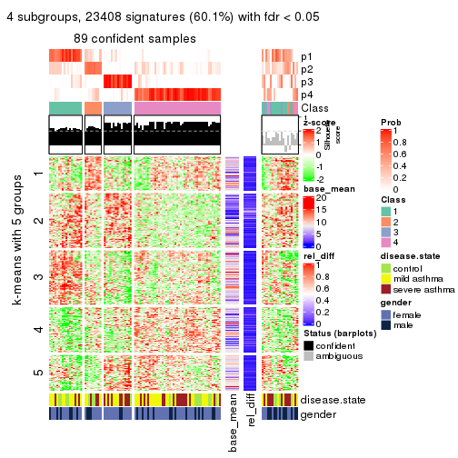</p>

</div>
<div id='tab-ATC-NMF-get-signatures-4'>
<pre><code class="r">get_signatures(res, k = 5)
</code></pre>

<p></p>

</div>
<div id='tab-ATC-NMF-get-signatures-5'>
<pre><code class="r">get_signatures(res, k = 6)
</code></pre>

<p></p>

</div>
</div>


Signature heatmaps where rows are not scaled:


<script>
$( function() {
	$( '#tabs-ATC-NMF-get-signatures-no-scale' ).tabs();
} );
</script>
<div id='tabs-ATC-NMF-get-signatures-no-scale'>
<ul>
<li><a href='#tab-ATC-NMF-get-signatures-no-scale-1'>k = 2</a></li>
<li><a href='#tab-ATC-NMF-get-signatures-no-scale-2'>k = 3</a></li>
<li><a href='#tab-ATC-NMF-get-signatures-no-scale-3'>k = 4</a></li>
<li><a href='#tab-ATC-NMF-get-signatures-no-scale-4'>k = 5</a></li>
<li><a href='#tab-ATC-NMF-get-signatures-no-scale-5'>k = 6</a></li>
</ul>
<div id='tab-ATC-NMF-get-signatures-no-scale-1'>
<pre><code class="r">get_signatures(res, k = 2, scale_rows = FALSE)
</code></pre>

<p></p>

</div>
<div id='tab-ATC-NMF-get-signatures-no-scale-2'>
<pre><code class="r">get_signatures(res, k = 3, scale_rows = FALSE)
</code></pre>

<p></p>

</div>
<div id='tab-ATC-NMF-get-signatures-no-scale-3'>
<pre><code class="r">get_signatures(res, k = 4, scale_rows = FALSE)
</code></pre>

<p></p>

</div>
<div id='tab-ATC-NMF-get-signatures-no-scale-4'>
<pre><code class="r">get_signatures(res, k = 5, scale_rows = FALSE)
</code></pre>

<p></p>

</div>
<div id='tab-ATC-NMF-get-signatures-no-scale-5'>
<pre><code class="r">get_signatures(res, k = 6, scale_rows = FALSE)
</code></pre>

<p></p>

</div>
</div>


Compare the overlap of signatures from different k:

```r
compare_signatures(res)
```


`get_signature()` returns a data frame invisibly. TO get the list of signatures, the function
call should be assigned to a variable explicitly. In following code, if `plot` argument is set
to `FALSE`, no heatmap is plotted while only the differential analysis is performed.

```r
# code only for demonstration
tb = get_signature(res, k = ..., plot = FALSE)
```

An example of the output of `tb` is:

```
#>   which_row         fdr    mean_1    mean_2 scaled_mean_1 scaled_mean_2 km
#> 1        38 0.042760348  8.373488  9.131774    -0.5533452     0.5164555  1
#> 2        40 0.018707592  7.106213  8.469186    -0.6173731     0.5762149  1
#> 3        55 0.019134737 10.221463 11.207825    -0.6159697     0.5749050  1
#> 4        59 0.006059896  5.921854  7.869574    -0.6899429     0.6439467  1
#> 5        60 0.018055526  8.928898 10.211722    -0.6204761     0.5791110  1
#> 6        98 0.009384629 15.714769 14.887706     0.6635654    -0.6193277  2
...
```

The columns in `tb` are:

1. `which_row`: row indices corresponding to the input matrix.
2. `fdr`: FDR for the differential test. 
3. `mean_x`: The mean value in group x.
4. `scaled_mean_x`: The mean value in group x after rows are scaled.
5. `km`: Row groups if k-means clustering is applied to rows.


UMAP plot which shows how samples are separated.


<script>
$( function() {
	$( '#tabs-ATC-NMF-dimension-reduction' ).tabs();
} );
</script>
<div id='tabs-ATC-NMF-dimension-reduction'>
<ul>
<li><a href='#tab-ATC-NMF-dimension-reduction-1'>k = 2</a></li>
<li><a href='#tab-ATC-NMF-dimension-reduction-2'>k = 3</a></li>
<li><a href='#tab-ATC-NMF-dimension-reduction-3'>k = 4</a></li>
<li><a href='#tab-ATC-NMF-dimension-reduction-4'>k = 5</a></li>
<li><a href='#tab-ATC-NMF-dimension-reduction-5'>k = 6</a></li>
</ul>
<div id='tab-ATC-NMF-dimension-reduction-1'>
<pre><code class="r">dimension_reduction(res, k = 2, method = &quot;UMAP&quot;)
</code></pre>

<p></p>

</div>
<div id='tab-ATC-NMF-dimension-reduction-2'>
<pre><code class="r">dimension_reduction(res, k = 3, method = &quot;UMAP&quot;)
</code></pre>

<p></p>

</div>
<div id='tab-ATC-NMF-dimension-reduction-3'>
<pre><code class="r">dimension_reduction(res, k = 4, method = &quot;UMAP&quot;)
</code></pre>

<p></p>

</div>
<div id='tab-ATC-NMF-dimension-reduction-4'>
<pre><code class="r">dimension_reduction(res, k = 5, method = &quot;UMAP&quot;)
</code></pre>

<p></p>

</div>
<div id='tab-ATC-NMF-dimension-reduction-5'>
<pre><code class="r">dimension_reduction(res, k = 6, method = &quot;UMAP&quot;)
</code></pre>

<p></p>

</div>
</div>


Following heatmap shows how subgroups are split when increasing `k`:

```r
collect_classes(res)
```


Test correlation between subgroups and known annotations. If the known
annotation is numeric, one-way ANOVA test is applied, and if the known
annotation is discrete, chi-squared contingency table test is applied.

```r
test_to_known_factors(res)
```

```
#>           n disease.state(p) gender(p) k
#> ATC:NMF 107           0.2901     1.000 2
#> ATC:NMF  80           0.3579     0.930 3
#> ATC:NMF  89           0.3112     0.576 4
#> ATC:NMF  88           0.3956     0.440 5
#> ATC:NMF  66           0.0571     0.558 6
```


If matrix rows can be associated to genes, consider to use `GO_Enrichment(res,
...)` to perform function enrichment for the signature genes.


 

## Session info


```r
sessionInfo()
```

```
#> R version 3.6.0 (2019-04-26)
#> Platform: x86_64-pc-linux-gnu (64-bit)
#> Running under: CentOS Linux 7 (Core)
#> 
#> Matrix products: default
#> BLAS:   /usr/lib64/libblas.so.3.4.2
#> LAPACK: /usr/lib64/liblapack.so.3.4.2
#> 
#> locale:
#>  [1] LC_CTYPE=en_GB.UTF-8       LC_NUMERIC=C               LC_TIME=en_GB.UTF-8       
#>  [4] LC_COLLATE=en_GB.UTF-8     LC_MONETARY=en_GB.UTF-8    LC_MESSAGES=en_GB.UTF-8   
#>  [7] LC_PAPER=en_GB.UTF-8       LC_NAME=C                  LC_ADDRESS=C              
#> [10] LC_TELEPHONE=C             LC_MEASUREMENT=en_GB.UTF-8 LC_IDENTIFICATION=C       
#> 
#> attached base packages:
#> [1] grid      parallel  stats     graphics  grDevices utils     datasets  methods   base     
#> 
#> other attached packages:
#>  [1] genefilter_1.66.0     ComplexHeatmap_2.1.1  markdown_1.1          knitr_1.26           
#>  [5] preprocessCore_1.46.0 cola_1.3.2            GEOquery_2.52.0       Biobase_2.44.0       
#>  [9] BiocGenerics_0.30.0   GetoptLong_0.1.7     
#> 
#> loaded via a namespace (and not attached):
#>  [1] bitops_1.0-6         matrixStats_0.55.0   bit64_0.9-7          doParallel_1.0.15   
#>  [5] RColorBrewer_1.1-2   httr_1.4.1           tools_3.6.0          backports_1.1.5     
#>  [9] R6_2.4.1             DBI_1.0.0            lazyeval_0.2.2       colorspace_1.4-1    
#> [13] withr_2.1.2          tidyselect_0.2.5     gridExtra_2.3        bit_1.1-14          
#> [17] compiler_3.6.0       xml2_1.2.2           microbenchmark_1.4-7 pkgmaker_0.28       
#> [21] slam_0.1-46          scales_1.1.0         readr_1.3.1          NMF_0.23.6          
#> [25] stringr_1.4.0        digest_0.6.23        pkgconfig_2.0.3      bibtex_0.4.2        
#> [29] highr_0.8            limma_3.40.6         rlang_0.4.2          GlobalOptions_0.1.1 
#> [33] RSQLite_2.1.2        impute_1.58.0        shape_1.4.4          mclust_5.4.5        
#> [37] dendextend_1.12.0    dplyr_0.8.3          RCurl_1.95-4.12      magrittr_1.5        
#> [41] Matrix_1.2-17        Rcpp_1.0.3           munsell_0.5.0        S4Vectors_0.22.1    
#> [45] viridis_0.5.1        lifecycle_0.1.0      stringi_1.4.3        plyr_1.8.4          
#> [49] blob_1.2.0           crayon_1.3.4         lattice_0.20-38      splines_3.6.0       
#> [53] annotate_1.62.0      circlize_0.4.9       hms_0.5.2            zeallot_0.1.0       
#> [57] pillar_1.4.2         rjson_0.2.20         rngtools_1.4         reshape2_1.4.3      
#> [61] codetools_0.2-16     stats4_3.6.0         XML_3.98-1.20        glue_1.3.1          
#> [65] evaluate_0.14        png_0.1-7            vctrs_0.2.0          foreach_1.4.7       
#> [69] polyclip_1.10-0      gtable_0.3.0         purrr_0.3.3          tidyr_1.0.0         
#> [73] clue_0.3-57          assertthat_0.2.1     ggplot2_3.2.1        xfun_0.11           
#> [77] gridBase_0.4-7       eulerr_6.0.0         xtable_1.8-4         skmeans_0.2-11      
#> [81] survival_2.44-1.1    viridisLite_0.3.0    tibble_2.1.3         iterators_1.0.12    
#> [85] AnnotationDbi_1.46.1 registry_0.5-1       memoise_1.1.0        IRanges_2.18.3      
#> [89] cluster_2.1.0        brew_1.0-6
```


